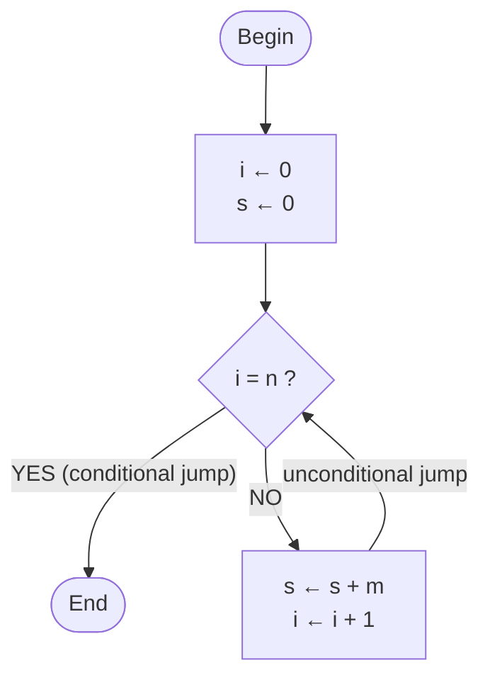
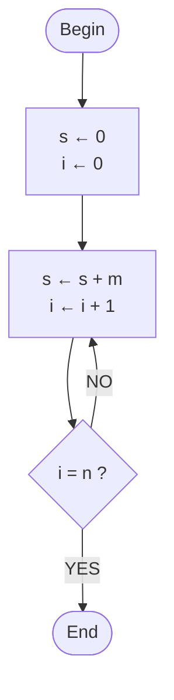

# 01A — A first algorithm

## In brief (7 points)

1. Computer science studies **algorithms**, not computers (a remark attributed to Dijkstra: the computer is to computer science what the telescope is to astronomy).
2. **Algorithm** = an **ordered** set of **unambiguous** and **effectively computable** operations that, when executed, **produces a result** and **halts in a finite amount of time**.
3. Running example: compute `m × n` (integers, `n ≥ 0`) with a machine that can only **add, assign, compare** → **repeated addition** starting from the identity element 0.
4. You need an **accumulator** `s` (partial sum) and a **counter** `i` (additions already done).
5. The course's design principle: **check the conditions first, then execute**. If you check `i = n` *after* the addition, with `n = 0` the algorithm does not terminate. Slide 20: *"Handling the initial case is a typical source of errors, even in the exam."*
6. Notation: `←` assignment, `=` comparison; conditional/unconditional jumps → nested **Begin/End** blocks (on the slides: *Inizio/Fine*) + indentation (structured programming).
7. Flowchart = a representation of the control flow. Goal of the course: translate algorithms described in Italian into **C**; model of computation: the **Von Neumann machine** (next lesson).

## If you are in channel A or C

- **Channel A (Fiandrotti):** a very similar deck, "01A_primo_algoritmo" (40 slides, week 28/09–02/10). Same versions of the algorithm, V1–V6, including the bug in the n = 0 case. Compared with channel B, it lacks the slide "In computer science everything is a number" (B6), the slide "Designing an algorithm" with input/output/steps/termination (B8), the box on data/procedures and Wirth's "Program = Algorithms + Data Structures" (B14), V7 without line numbers (B26) and the comparison between flowchart and structured representation (B28); the slide on the initial case (A23) does not say "even in the exam". In the same week there is also "01B_architettura" (history of the computer, bits and bytes, Von Neumann machine).
- **Channel C (Mazzei):** the section "The First Algorithm" (slides 20–42) of lesson 01 on 28/09. It starts from column addition ("the primary-school teacher's instructions") and calls the counter "fingers" (*dita*). It does **not** present the wrong versions or the n = 0 case: it goes straight to the correct pseudocode (lines 0–6, "If fingers == n jump to line 6") and to the flowchart. In the same lesson it goes on with Von Neumann, machine instructions (LOAD, STORE, ADD, CMP, JMP) and the same multiplication in assembly and in FORTRAN.
- The exam is common to the three channels: the parts on the initial case, "check first, then execute" and structured programming (§7–§8, §14) apply to everyone.

---

## §1 What is computer science (slides 2–4)

- **Computer** (*calcolatore*): originally a *person* who performed calculations by hand (paper, pen, mechanical calculators); since the 1950s, a *programmable electromechanical device* for calculations, even complex ones. Photos on the slides: a room of human computers and the **Olivetti Programma 101** (1965, "the do-it-yourself computer").
- Quote (slide 3, attributed to E. W. Dijkstra): *"Computer science is not the science of computers. No more than astronomy is the science of telescopes, or surgery the science of scalpels."* → computer science studies algorithms, not devices.
- **Computer science = the study of algorithms** (slide 4), which includes:
  | Aspect | Content | [BEYOND THE SLIDES] Where it comes up again |
  |---|---|---|
  | Formal and mathematical properties | correct and efficient algorithms | Algorithms and Data Structures, mathematics/logic courses |
  | Physical realisation | designing and building computers that execute them | Computer Architecture (Architettura degli Elaboratori) |
  | Linguistic realisation | designing programming languages | Programming I/II (Programmazione I/II), Formal Languages and Compilers |
  | Applications | software (implemented algorithms) for important problems | Databases, Networks, Operating Systems… |

## §2 Algorithm: definitions and properties (slide 5)

- **Intuitive definition**: a well-defined computational procedure, executable **mechanically** by a human being or by a machine, to obtain a result (**output**) from starting data (**input**).
- **Precise definition (to memorise)**: *an ordered set of unambiguous and effectively computable operations that, when executed, produces a result and halts in a finite amount of time.*

| Property | Meaning | Counterexample [BEYOND THE SLIDES] |
|---|---|---|
| Ordered | a precise sequence: after each step you know which one comes next | instructions in no particular order |
| Unambiguous | only one possible interpretation | "add salt to taste" |
| Effectively computable | every operation can actually be carried out by the executor | "compute m × n" for a machine that can only add; "divide by 0" |
| Produces a result | there is an output | a procedure that returns nothing |
| Halts in finite time | terminates for **every** allowed input | version V2 with n = 0 (§8) |

- "Executable mechanically" = no intuition or creativity is needed: this is why it can be entrusted to a machine.
- **Etymology**: from the Persian mathematician **al-Khwārizmī** (around the year 800), whose book on *calculation with Indian numerals* describes procedures for arithmetic. [BEYOND THE SLIDES] Latin translation "Algoritmi de numero Indorum"; the word "algebra" comes from another of his books (*al-jabr*).

## §3 Everything is a number; imperative programming (slides 6–7)

- All information (texts, images, sounds, instructions) in memory is encoded as a **number**, that is, as a **sequence of bits**. [BEYOND THE SLIDES] `'A'` = 65 = `01000001` in ASCII.
- An **imperative** program works by modifying numeric values stored in the **state** of the machine. **Programming** = describing how to transform these values step by step.
- **Imperative programming**: program = an ordered sequence of instructions, **one line = one instruction**; when line *n* is finished, line *n+1* is executed, **unless specified otherwise**.
- Typical machine instructions: **assign** a value to a variable; **add** two variables and store the result in a third one; **compare** two variables; **jump** to a line other than the next one (possibly under a condition).
- **Variable**: a named container whose value can change; the set of values = the state.

## §4 Designing an algorithm: the problem (slide 8)

Problem: `m × n`, with `m, n` integers and `n ≥ 0`. You must define:
- **Input**: `m`, `n` · **Output**: `m × n` · **Steps**: an unambiguous sequence of operations the machine can execute · **Termination**: the output is reached and execution halts after a finite number of steps.
- Assumption: the machine **cannot multiply**; it can do **addition, assignment, comparison**.
- Designing = **building the result using only the available operations** (reducing multiplication to addition).
- [BEYOND THE SLIDES] `n ≥ 0` is the **precondition**; no constraint on `m` (it can be negative).

## §5 The idea: repeated addition (slides 9–13)

```
m × n = m + m + … + m          (n terms: I add m to itself n−1 times)
s     = 0 + m + m + … + m      (I start from the identity element 0: I add m exactly n times)
```
Why start from 0 (the identity element of addition): all the steps are the same (`s ← s + m`); the case `n = 0` takes care of itself (s = 0); there are exactly `n` additions. What remains is to establish **how to perform exactly n additions and then stop** → a counter is needed.

Example from slides 10–13 (m = 4, n = 3), with fingers counting the additions done:

| Fingers raised (additions done) | Operation | s |
|---|---|---|
| 0 (closed fist) | initial partial sum | 0 |
| 1 | 0 + 4 | 4 |
| 2 | 4 + 4 | 8 |
| 3 → I stop | 8 + 4 | 12 |

## §6 Accumulator, counter, Wirth (slide 14)

- **Accumulator** `s`: holds the partial sum (≈ the sheet of paper on which I do the additions).
- **Counter** `i`: holds the number of additions done (≈ the fingers of the hand).
- Two essential concepts: **DATA** (values and their organisation) and **PROCEDURES** (operations that transform them).
- **Niklaus Wirth**: *Program = Algorithms + Data Structures*. [BEYOND THE SLIDES] The formula is the title of his 1976 book, *Algorithms + Data Structures = Programs*; Wirth created Pascal.
- [BEYOND THE SLIDES] Recurring patterns: accumulator initialised to the identity element (0 for sums/counts, 1 for products); counter-controlled loop.

## §7 The seven versions of the algorithm (slides 15–26)

**V1 — the idea in words (slide 15)**
```
1. Set the accumulator s to the identity value 0 and the counter i to 0.
2. Add m to s exactly n times, updating i and s at the same time.
```
Flaw: step 2 is *semantically complex* (it hides repetition and control).

**V2 — elementary steps, check at the end (slide 16) — WRONG for n = 0**
```
1. s ← 0, i ← 0
2. add m to the accumulator s
3. add 1 to the counter i
4. if i = n: stop (s is the total), otherwise repeat from step 2
```

**V3 — the check comes first (slide 21)**
```
[1] set s to 0 and i to 0
[2] if i = n the additions are finished and s is the total: we terminate; otherwise we continue
[3] add m to the accumulator s
[4] add 1 to the counter i
[5] go back to line 2
```

**V4 — formal notation (slide 22)**: `←` assignment, `=` comparison, `▷` comment; the **indentation** of [3]–[5] shows that they depend on the condition in [2].
```
[1] s ← 0,  i ← 0
[2] if i = n the algorithm terminates, otherwise
[3]     s ← s + m        ▷ add m to s
[4]     i ← i + 1        ▷ increment the counter i by 1
[5]     go back to line 2
```

**V5 — the End instruction and jumps (slides 22–24)**: "terminates" is too strong, because after the multiplication we might want to execute something else.
```
[1] s ← 0,  i ← 0
[2] if i = n then jump to line 6, otherwise
[3]     s ← s + m
[4]     i ← i + 1
[5]     jump to line 2
[6] End
```

**V6 — Begin/End blocks (slide 25)**: **conditional** jump (line 3 → 7, only if `i = n`) and **unconditional** jump (line 6 → 3, always).
```
[1] Begin Algorithm
[2]     s ← 0,  i ← 0
[3]     Begin Conditional Repetition
            if i = n then jump to line 7, otherwise      ▷ conditional jump
[4]         s ← s + m
[5]         i ← i + 1
[6]         jump to line 3                               ▷ unconditional jump
[7]     End Conditional Repetition
[8] End Algorithm
```

**V7 — structured version without line numbers (slide 26)**
```
Begin Algorithm
    s ← 0,  i ← 0
    Begin Conditional Repetition
    if i = n jump to End Conditional Repetition, otherwise
        s ← s + m
        i ← i + 1
        jump to Begin Conditional Repetition
    End Conditional Repetition
End Algorithm
```
The structure (nestable blocks) eliminates the line numbers; indentation makes the hierarchy visible, and shows which block each instruction belongs to. This is the shape of the `while` loop in C.

## §8 The bug in the n = 0 case (slides 17–20)

Algorithm V2 was developed using "test" values (m = 4, n = 3). Check on a special case: `n = 0`, expected result 0.

| Step | Instruction (V2) | s | i | Check |
|---|---|---|---|---|
| 1 | s ← 0, i ← 0 | 0 | 0 | — |
| 2 | s ← s + m | 4 | 0 | — |
| 3 | i ← i + 1 | 4 | 1 | — |
| 4 | if i = n … | 4 | 1 | 1 = 0? NO → repeat |
| 7 | if i = n … | 8 | 2 | 2 = 0? NO → repeat |
| … | … | … | … | i > n forever: **does not terminate** |

- Cause: V2 first updates `s` and `i`, then compares. With `n = 0`, `i > n` always holds.
- Fix: first check that the counter is less than `n`, and only then perform the addition (V3). With V3 and n = 0: `0 = 0? YES` → stop, with `s = 0`.
- **The course's design paradigm** (slide 20): *"first check the conditions and only then execute (the first of a series of) operations"* — "it will stay with us for the rest of this course".
- **Slide 20**: *"Handling the initial case is a typical source of errors, even in the exam."*
- [BEYOND THE SLIDES] Edge cases to always test: n = 0, n = 1, m = 0, negative m, violated precondition (n < 0).

## §9 Flowchart (slides 28–29)

- An intermediate representation before the actual language; it highlights the **control flow** (the possible execution sequences).
- Unlike the structured representation, it **does not make the nesting of blocks explicit**: it follows the links between instructions.
- Historically widely used, sometimes useful; modern languages prefer nested control structures.
- Symbols: oval = Begin/End; rectangle = operations; diamond = condition (YES/NO exits); arrows = flow.

Diagram from slide 29 (correct version, check first):


[BEYOND THE SLIDES] Version V2 (check after): the body is executed at least once.


## §10 Programs, languages, goal of the course (slides 27, 30)

- **Program**: the description of an algorithm by means of a programming language.
- **Programming language**: a set of words and rules, formally defined, for programming a computer so that it carries out predetermined tasks.
- **Low-level** languages (machine language, assembly) vs **high-level** languages, close to natural language (FORTRAN, C, Java, Python).
- Aim of the course: implementing elementary algorithms in **C**, that is, **translating algorithms specified in Italian into C**.
  - *Implementing* = concretely realising a procedure in a programming language, starting from its logical definition.
  - In the *Algorithms* exam, the aim will instead be **analysing and designing new algorithms**.
- Model of computation: the **Von Neumann machine**. [BEYOND THE SLIDES] Memory holding data *and* instructions; a CPU that repeats fetch–decode–execute; the *program counter* indicates the next instruction ("line n+1"); a jump changes the program counter.

## §11 [BEYOND THE SLIDES] Multiplication in C

Verified with `gcc -Wall -Werror` (output `4 x 3 = 12`; also correct with 5×0, 0×7, −2×3).
```c
#include <stdio.h>
#include <assert.h>

int main(void) {
    int m = 4, n = 3;      // input (hard-coded for now)
    assert(n >= 0);        // precondition
    int s = 0;             // accumulator: starts from the identity element
    int i = 0;             // counter of the additions done

    while (i != n) {       // first I check the condition...
        assert(s == m * i);// invariant: holds at every check
        s = s + m;         // ...then I execute: s <- s + m
        i = i + 1;         // i <- i + 1
    }
    assert(s == m * n);    // postcondition

    printf("%d x %d = %d\n", m, n, s);
    return 0;
}
```
| Pseudocode | C | Note |
|---|---|---|
| `s ← 0` | `s = 0;` | in C, `=` is assignment |
| `i = n` (comparison) | `i == n` | pitfall: `if (i = n)` assigns instead of comparing |
| Begin … End | `{ … }` | block |
| Conditional repetition "if i = n jump to the end" | `while (i != n) { … }` | the while loop repeats as long as the condition is true: the exit condition must be negated |
| jump to the beginning of the repetition | `}` | implicit at the end of the block |

- `while (i < n)` is equivalent to `i != n` if n ≥ 0; with n < 0 it terminates immediately (wrong result) instead of not terminating.
- V2 corresponds to `do { … } while (…);` (body executed at least once).

## §12 [BEYOND THE SLIDES] Why it works: invariant, termination, cost

- **Invariant** (true at every check of the condition): `s = m × i`. Start: `0 = m × 0`. Step: `s + m = m × (i + 1)`. Exit (`i = n`): `s = m × n`.
- **Termination**: `n − i` starts at `n ≥ 0` and decreases by 1 at each iteration → after n iterations it is 0. With `n < 0` it does not terminate (the precondition is necessary).
- **Cost**: condition evaluated `n + 1` times, body executed `n` times.

## §13 Pitfalls and typical mistakes

1. Checking the condition **after** the body when the body might not need to be executed (the n = 0 case).
2. Not initialising the accumulator/counter (in C: indeterminate value).
3. Wrong identity element: 0 for sums and counts, 1 for products.
4. "Off-by-one" errors: n terms = n − 1 additions; starting from 0 there are n.
5. Confusing assignment and comparison (`←`/`=`; in C `=`/`==`).
6. Ignoring the precondition (n < 0 → does not terminate).
7. Testing only the sample case: try n = 0, n = 1, m = 0, negative m.
8. Swapping the order of the instructions in the body when one uses the value updated by the other.

## §14 Connection to the exam

Typical exam (channel B slides, 2026/27): exercises on Moodle, on a PC in the lab — iterative and recursive programming, theory (correctness, types), memory state (simulated execution). Details in `ai_context/PROG1/course.md`.

| Type | Link to 01A |
|---|---|
| Iterative function | accumulator/counter; initial value of the sentinel (= initial case) |
| Recursive function | base case = initial case; termination |
| Memory model | step-by-step execution trace |
| Correctness | precondition `n ≥ 0`, postcondition `s = m × n`, invariant `s = m × i` |

Exam rules (past years; 2025/26 exam summary): iterative functions with **a single `return`**, sentinel variables, no `break`/`switch`/`case`/`static` and no other constructs not covered in class; recursive functions without loops (multiple `return`s allowed). This is the structured programming of V7: you leave the loop only through its condition (e.g. `while (i < aLen && !exists)`).

## §15 Exercises (with solutions)

**1. Trace (basic).** Run V6 with m = 5, n = 2.
Solution: lines executed 1,2,3,4,5,6,3,4,5,6,3,7,8 (13 steps); s: 0 → 5 → 10; condition evaluated 3 times (n+1), 2 additions (n); result 10.

**2. Bug hunt (basic).** V2 with m = 3, n = 1 and n = 0.
Solution: n = 1 → s = 3, correct; n = 0 → s = 3, i = 1, 1 ≠ 0, … does not terminate. V2 executes the body at least once: correct only if n ≥ 1.

**3. Negative numbers (intermediate).** (a) m = −2, n = 3? (b) m = 2, n = −3? (c) extend it to any n, assuming you can compute `x ← −x`.
Solution: (a) s = −6, correct. (b) does not terminate (precondition violated). (c) prepend `if n < 0 then m ← −m, n ← −n` (because `m × n = (−m) × (−n)`), then the normal algorithm.

**4. Integer division by repeated subtraction (intermediate).** Given m ≥ 0, n > 0, compute the quotient q and the remainder r.
```
Begin Algorithm
    q ← 0,  r ← m
    Begin Conditional Repetition
    if r < n jump to End Conditional Repetition, otherwise
        r ← r − n
        q ← q + 1
        jump to Begin Conditional Repetition
    End Conditional Repetition
End Algorithm
```
14 ÷ 4: (q, r) = (0,14) → (1,10) → (2,6) → (3,2) → q = 3, r = 2. With n = 0 it does not terminate (division by zero). Invariant: `m = q × n + r`.

**5. Power (intermediate → hard).** (a) `p = mⁿ` with multiplication available: `p ← 1` (identity element of multiplication), loop n times: `p ← p × m`. (b) Additions only (m ≥ 0): replace `p ← p × m` with an inner loop that adds `p` a total of `m` times (`s ← 0, j ← 0; while j ≠ m: s ← s + p, j ← j + 1; p ← s`) → nested loops, with a second counter and a second accumulator reset to zero at each outer iteration.

**6. Sum 1 + 2 + … + n (intermediate).** `s ← 0, i ← 0; while i ≠ n: i ← i + 1, s ← s + i`. With n = 4 → 10. Swapping the two instructions sums 0 + 1 + … + (n−1): an "off-by-one" error.

**7. Flowchart (basic).** For exercise 4: Begin → [q ← 0, r ← m] → ◇ r < n ? — YES → End (conditional jump); NO → [r ← r − n, q ← q + 1] → back to the diamond (unconditional jump).

**8. Fewer additions (hard).** With m, n ≥ 0, perform min(m, n) additions: if n > m, swap m and n before the loop, using a temporary variable (`t ← m; m ← n; n ← t`). `m ← n; n ← m` does not work: both become the old n.

## §16 Review questions (with short answers)

1. *What is an algorithm?* → An ordered set of unambiguous and effectively computable operations that produces a result and terminates in finite time.
2. *What does the telescope quote mean?* → Computer science studies algorithms; the computer is the tool. Four aspects: formal properties, physical realisation, linguistic realisation, applications.
3. *Origin of the word?* → al-Khwārizmī (around 800), a book on calculation with Indian numerals.
4. *"Everything is a number"?* → All information is encoded in bits; an imperative program transforms numeric values of the state.
5. *Imperative programming?* → An ordered sequence of instructions, one per line, sequential execution except for jumps; instructions: assign, add, compare, jump.
6. *What must you define to design an algorithm?* → Input, output, steps (available operations), termination.
7. *Why does s start from 0?* → Identity element: n identical additions, the n = 0 case takes care of itself.
8. *Accumulator vs counter?* → Partial sum (sheet of paper) vs number of additions done (fingers).
9. *Program = Algorithms + Data Structures?* → Wirth: data + procedures that transform them.
10. *Why is V2 wrong?* → It checks after executing: with n = 0 it does not terminate. Principle: check first, then execute.
11. *Conditional vs unconditional jump?* → V6 line 3 → 7 only if i = n (in the diagram: the YES exit of the diamond); line 6 → 3 always (the arrow going back).
12. *Why is "terminates" too strong?* → The multiplication may be part of a bigger algorithm: you jump to the End of the block.
13. *Begin/End and indentation?* → They delimit nestable blocks; they eliminate line numbers; indentation shows the hierarchy.
14. *Flowchart vs structured?* → The flowchart shows the control flow but not the nesting.
15. *Low vs high level?* → Machine language/assembly vs FORTRAN, C, Java, Python.
16. *Prog I vs Algorithms?* → Prog I: implementing/translating given algorithms into C; Algorithms: analysing and designing new algorithms.

## §17 Glossary

Algorithm · Input/Output · Instruction · Variable · State · Assignment (`←`, in C `=`) · Comparison (`=`, in C `==`) · Accumulator · Counter · Identity element (0 for sums, 1 for products) · Termination · Initial/edge case · Conditional jump · Unconditional jump · Block · Indentation (indent) · Structured programming · Flowchart · Program · Programming language · Low/high level · Implementing · Von Neumann machine.

## Connections

- Expected next lesson: computer architecture / the Von Neumann machine, structured programming and the C language (channel B sequence, 2025/26).
- Common threads: initial case → sentinels and empty cases; structured programming → exam rules; invariant → correctness; trace → memory model.
