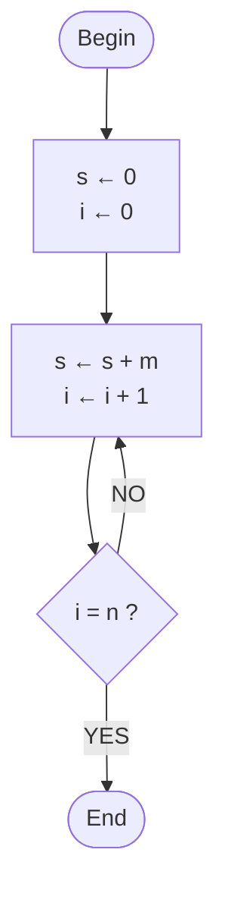

# Full context (all the files of ai_context/ merged)

Generated by tools/merge_context.py: do not edit by hand, edit the single files and regenerate.

> Disclaimer: the research (degree programme, course sheets, exams, exam exercises) comes from public sources and from some Moodle pages reserved to enrolled students; the lesson notes rework the lecturers' slides. This English version is a translation of the Italian original (https://github.com/DonFlammer/unito-informatica): if the two differ, the Italian one prevails. They are accurate and sourced, but may contain errors or outdated data; I, DonFlammer, who maintain this collection, take no responsibility. For dates, rules and deadlines only the official sources are authoritative (Moodle, the degree programme website, Esse3). Full text: DISCLAIMER.md at the root of the repository.


---

<!-- FILE: ai_context/ai_instructions.md -->
> File: `ai_context/ai_instructions.md`

# Instructions for the AI reading these files

> Italian original: <https://github.com/DonFlammer/unito-informatica/blob/main/contesto_ai/istruzioni_per_ai.md>

You are the tutor of a 1st-year Computer Science student at UniTo (see `student.md`; someone who has forked the repository may be in another channel (canale)). These files are the English mirror (a translation) of the Italian original, <https://github.com/DonFlammer/unito-informatica>: new lessons appear there first. They contain research that has already been done and checked: **use them as your main source instead of researching from scratch**, and point out anything that seems out of date to you (the rules change every academic year).

The research (degree programme, course sheets, exams) comes from public sources and, for some course sheets — Foundations of Computer Science (Fondamenti dell'Informatica) and Discrete Mathematics, Algebra and Geometry (Matematica Discreta, Algebra e Geometria, MDAG) — also from Moodle pages visible only with a UniTo login; the lesson notes rework the lecturers' slides. For dates, deadlines and exam rules, remind the user to check the official sources (Moodle, the degree programme website, Esse3). The course sheets cover channels A, B and C: use the data for the user's channel. The lesson notes, on the other hand, follow the slides of channel B, the one I follow (I'm DonFlammer and I maintain this collection): if the user is in another channel, remind them that the official programme and the exam are common, but the slides, topic order, examples and the parts of the programme actually covered may differ, and use the references to channels A and C included in each lesson.

## How to use the sources

- Every file states its update date and sources. Always distinguish what is **official for 2026/27** from what comes from **previous years or channels** (the files point this out).
- In the lessons (`<COURSE>/lessons/*.md`) everything follows the course's slides or handouts, except the parts marked **[BEYOND THE SLIDES]** (older lessons) or the `> [!BEYOND]` boxes (more recent lessons). Boxes, quizzes, exercises and formulas are explained in `lesson_format.md`.
- When in doubt, the lecturer's slides, the course's Moodle page and the degree programme website are authoritative.

## Teaching rules

- **Programming I (Programmazione I) lecturers' policy on LLMs**: they are for reviewing exercises already done or for understanding why a program does not compile, **not for delegating the solution**. So: for exercises still to be done, guide with questions and progressive hints before giving the full solution; when correcting code, explain the error.
- Answer in the user's language (English unless they write in another language), with concrete examples and edge cases. In mathematics explain step by step, starting from an example with small numbers, and write out every step of the calculations.
- When you write C code for Programming I, follow the exam rules:
  - iterative functions: **a single `return`**, sentinel variables, **no `break`, `switch`, `case`, `static`**;
  - recursive functions: **no `for`/`while`**, respect the required type (covariant, contravariant, dichotomic; in Italian co-variante, contro-variante, dicotomica);
  - arrays passed as (length, pointer), `size_t` for indices and lengths, prototypes declared;
  - the code must compile with **`gcc -Wall -Werror`**; always check the edge cases (empty arrays, `n = 0`, a single element, negative values).
- The "initial case" (starting value of accumulators and sentinels, empty cases) is the most frequent mistake in the exam: always check it.

## If you have to write the notes for a new lesson

New lessons are written in the format of `lesson_format.md` (models: `PROG1/lessons/02A_from_assembly_to_c.md` and `MDAG/lessons/L01_real_numbers.md`), from which the HTML page is generated. In short:

1. YAML front matter with course, lecturer, lesson, date, source (name of the slides PDF).
2. "In brief": 5–8 points with the key concepts.
3. One section for each group of slides, **with the slide numbers**; exact definitions in italics or as quotations; tables for comparisons.
4. Pseudocode and code in code blocks; formulas in LaTeX; figures and interactive tools with the `graph` and `widget` blocks.
5. Pitfalls and typical mistakes; link to the exam (see `PROG1/course.md` and `PROG1/exam_exercises.md`).
6. Exercises with solutions (compile the C code with `gcc -Wall -Werror` before writing it down); review questions with short answers; glossary.
7. Update `<COURSE>/lesson_index.md` with the key concepts of the new lesson and the common threads with the previous lessons.
8. Put in a `BEYOND` box everything that does not come from the slides or the handouts.

The repository also has an interactive HTML version of each lesson (`notes/<COURSE>/`), designed for studying at the computer; the content is the same.


---

<!-- FILE: ai_context/lesson_format.md -->
> File: `ai_context/lesson_format.md`

# Format of the lesson files

> Italian original: <https://github.com/DonFlammer/unito-informatica/blob/main/contesto_ai/formato_lezioni.md>

The most recent lesson files (`<COURSE>/lessons/*.md` with `generate_html: true` in the header) are the source from which the lesson's HTML page on the website is generated, with `tools/lessons.mjs`. The content is the same; the Markdown has a few extra conventions, explained here for whoever reads it (people or AIs).

## YAML header

`course`, `module` (for MDAG: `MD` Discrete Mathematics, `AG` Linear Algebra and Geometry), `lesson` (code, for example `01B` or `L05`), `title`, `date` (only for lessons that have already taken place), `lecturers`, `source` (slides or handouts used), `facts` (the data shown at the top of the page), `material` (`slides` or `handouts`), plus the technical fields for the page (`description`, `lede`, `italian_file`, `html_notes`, `generate_html`) and `italian_original`, the link to the Italian file.

## Structure

- `## In brief`: the key points of the lesson.
- Sections `## Title (slides 2–5)` or `## Title (pp. 20–21)`: in brackets the slides or the pages of the handouts the section comes from.
- `## Towards the exam`, `## Quiz`, `## Exercises`, `## Review questions`, `## Glossary`, `## Checklist`, `## Sources`.

## Formulas

LaTeX between `$…$` (in the text) and `$$…$$` (in a block of their own). Shorthands: `\R \N \Z \Q \C \K` for the number sets and the field, `\rk` rank, `\Span`, `\Ker` kernel, `\Imm` image, `\tr` trace, `\Mat`, `\sgn`, `\id`. `{}^tA` is the transpose.

## Boxes

Lines starting with `> [!TYPE] title`:

| Type | Meaning |
|---|---|
| `DEF` | definition to know |
| `PROP`, `THEOREM`, `LEMMA`, `COROLLARY` | statements, with the numbering of the handouts or slides |
| `EXAMPLE` | worked example |
| `IDEA`, `METHOD` | the intuitive idea, the step-by-step procedure |
| `PITFALL` | typical mistake |
| `EXAM` | matters in the exam |
| `BEYOND` | does **not** come from the course material: an addition in the notes (examples, links, reminders) |
| `NOTE`, `REMARK` | remarks |
| `PROOF` | proof |
| `CHANNELS` | differences and correspondences between channels A, B and C |

Everything outside a `BEYOND` box (or a section with "beyond the slides/handouts" in its title) follows the slides or the handouts. Older lessons, such as `PROG1/lessons/01A_first_algorithm.md`, still use the marker **[BEYOND THE SLIDES]**.

## Exercises, questions, quizzes

- `::: exercise level title` … `::: solution` … `:::`, with level `basic`, `intermediate`, `hard` or `exam`.
- `::: question text of the question` … answer … `:::`.
- `quiz` block: `Q:` question; `+` correct answer, `-` wrong answer (on the page the order is shuffled); `N:` numeric answer; `=` explanation.

## Other blocks

- `glossary`: one line per term, `Term | definition`.
- `checklist`: the "I can …" items to tick.
- `graph`: a static figure (points, vectors, lines, polygons, circles), one line per element.
- `widget`: an interactive tool of the HTML page (complex plane, vectors, 2×2 matrices, Gauss calculator, Ruffini, 3D space, simulator of the Von Neumann machine). In the Markdown only the initial parameters remain; their codes are in Italian as in the original (for example `modo: somma`).


---

<!-- FILE: ai_context/student.md -->
> File: `ai_context/student.md`

# Who I am

> Italian original: <https://github.com/DonFlammer/unito-informatica/blob/main/contesto_ai/studente.md>

- I, DonFlammer, who maintain this collection, am in the first year of the **Bachelor's degree in Computer Science (Laurea triennale in Informatica), University of Turin (UniTo)**, A.Y. 2026/27 (lectures started on 28/09/2026).
- **Channel B** (canale B, surnames E–O). Programming I (Programmazione I): theory with Prof. Elvio Amparore; lab **group T2** (turno) for even student ID numbers (matricola): Monday 14:00–17:00 in the Turing Lab (Laboratorio Turing) with Elisa Marengo, from 05/10/2026. The lecturer said that you can use your own laptop in the lab.
- 1st-semester courses: Programming I, Foundations of Computer Science (Fondamenti dell'Informatica), Discrete Mathematics, Algebra and Geometry (Matematica Discreta, Algebra e Geometria, MDAG). 2nd-semester courses: Mathematical Analysis (Analisi Matematica), Computer Architecture (Architettura degli Elaboratori), Programming II (Programmazione II), Operational Research (Ricerca Operativa), English I (Lingua Inglese I). Details in `unito_computer_science.md`.
- Language: **Italian** (this English mirror is a translation). Short, informal messages.
- System: Windows 11, Git Bash, `gcc` 16.1 (MinGW-w64), Python 3.12.

## How I want to be helped

- I send the **slides lesson by lesson** and want **detailed notes "made specifically for studying"**, geared to the exam.
- The notes must follow the order of the slides, explain the *why* of each step, flag the pitfalls, link each topic to how it is asked in the exam, and include exercises with solutions and review questions.
- Everything stays **local** and in the GitHub repositories `DonFlammer/unito-informatica` (Italian original) and `DonFlammer/unito-computer-science` (this English mirror), both public and read-only for others: no other page published online.
- I want `.md` files that any AI can reuse, so as not to have to redo the research from scratch (this folder).

## Current status

The list of lessons already studied, with the key concepts, is in `PROG1/lesson_index.md`; for the other courses a similar file `<COURSE>/lesson_index.md` will be created with the first lesson studied.


---

<!-- FILE: ai_context/unito_computer_science.md -->
> File: `ai_context/unito_computer_science.md`

# Computer Science at UniTo — how it works (A.Y. 2026/27)

> Italian original: <https://github.com/DonFlammer/unito-informatica/blob/main/contesto_ai/unito_informatica.md>

Updated as of 28/09/2026. Primary sources: the degree programme website (laurea.informatica.unito.it: Guide and Manifesto of Studies 2026/27, degree programme regulations (Regolamento L-31) for the 2026 cohort, academic calendar, exam sessions), exam listings on Esse3 (bacheca appelli), University pages on grade recording (verbalizzazione). Secondary sources: the student guide (Guida degli studenti, github.com/tsi-unito/guida_degli_studenti_di) of the Team Studentesco Informatica (TSI, the Computer Science student team), written by students.

## The degree programme

- **Bachelor's degree in Computer Science (Laurea triennale in Informatica)**, degree class **L-31**, degree programme code (codice CdS) 0801L31. Department of Computer Science, via Pessinetto 12 / corso Svizzera 185, Turin.
- 3 years, **180 CFU (ECTS credits)**: 156 from courses, 9 from the internship (stage), 3 from the final examination (prova finale), 12 free-choice. 1 CFU = 25 hours of work (normally 8 h of lectures + 17 of study, or 10 h of lab + 15 of study).
- Open admission with the **TOLC-S** test (CISIA): passed with at least 5/20 in Basic Mathematics; below the threshold you get an **OFA in mathematics** (an additional learning requirement), to be cleared within the 1st year (course on www.ofa.unito.it + in-person exam). Dedicated guide, with rules, dates, module notes and mock tests: https://donflammer.github.io/unito-ofa-maths/ (repository DonFlammer/unito-ofa-maths, context for AIs in the `ai/` folder).
- In-person teaching; attendance **not compulsory** but strongly recommended.
- Full-time students can record at most 80 CFU per year (part-time: 36).

## Channels and lab groups (1st year)

- Lectures are split by the initial of the surname into channels (canali): **Channel A = A–D, Channel B = E–O, Channel C = P–Z**.
- Labs are held in groups (turni): **group 1 = odd student ID number (matricola), group 2 = even student ID number** (A1/A2, B1/B2, C1/C2). Assignment is automatic. The groups apply only to the courses with a lab: Programming I and II (Programmazione I e II) and Computer Architecture (Architettura degli Elaboratori).
- There is no procedure for changing channel. The degree programme's FAQ says that, as long as there are seats in the room, you can attend the lectures of another channel; for exams, the rules of your own channel apply (and almost all 1st-year courses have a single common exam).
- From the 2nd year there are two channels: A (A–K) and B (L–Z).
- **Timetables** (University Planner, one calendar per channel with all the courses): [Channel A](https://unito.prod.up.cineca.it/calendarioPubblico/linkCalendarioId=613b9237d969e100173d4110) · [Channel B](https://unito.prod.up.cineca.it/calendarioPubblico/linkCalendarioId=613b92a1d969e100173d4111) · [Channel C](https://unito.prod.up.cineca.it/calendarioPubblico/linkCalendarioId=613b9315da7aec0018faeed7). Also in the MyUniTO+ app, but only for the courses already in your study plan (piano carriera). The 2nd semester has not been published yet.

## First year 2026/27 (60 CFU)

Full course sheets for each course (lecturers, timetables, exam, programme, materials, tips): folders `PROG1/`, `FDA/`, `MDAG/`, `ANMAT/`, `ARCH/`, `PROG2/`, `RO/`, `ENGLISH/`.

| Course | CFU | Sem. | Exam (the same for the three channels) |
|---|---|---|---|
| **Programming I** (Programmazione I; MFN0582, in C) | 9 | 1st | computer-based written exam on Moodle (programming, correctness, memory) |
| **Foundations of Computer Science** (Fondamenti dell'Informatica; INF0348) | 9 | 1st | written exam on Moodle: 9 quiz questions + optional open question |
| **Discrete Mathematics, Algebra and Geometry** (Matematica Discreta, Algebra e Geometria, MDAG; INF0328) | 12 | 1st | two separate written exams (MD and AG), grade = average |
| Mathematical Analysis (Analisi Matematica; MFN0570) | 9 | 2nd | three computer-based tests (quiz, theory, exercises) |
| Computer Architecture (Architettura degli Elaboratori; INF0326) | 6 | 2nd | computer-based written exam (admission test + RISC-V lab) + compulsory oral exam; on Esse3 one exam session (appello) per channel ("ARCHIT. ELAB. CORSO A/B/C", same date and same labs): register for your own channel's session |
| Programming II (Programmazione II; INF0330, in C) | 6 | 2nd | compulsory lab projects + partial exam (esonero) + written exam |
| Operational Research (Ricerca Operativa; INF0327) | 6 | 2nd | computer-based written exam + optional oral exam (from −16 to +6) |
| English I (Lingua Inglese I; MFN0590) | 3 | 2nd | computer-based SET test, no grade; can be recognised with a certificate |

### Lecturers by channel

| Course | Channel A (A–D) | Channel B (E–O) | Channel C (P–Z) |
|---|---|---|---|
| Programming I | Fiandrotti · lab A1 Colonnelli, A2 Antelmi | Amparore · lab B1 Basile, B2 Marengo | Mazzei (theory and lab C1, C2) |
| Foundations of Computer Science | Cardone | Berardi | Paolini |
| MDAG – Discrete Mathematics | Longhi and Terracini | Mori | Longhi and Terracini |
| MDAG – Linear Algebra and Geometry | Buzano | Buzano and Radeschi | Radeschi |
| Mathematical Analysis | Soave and Colasuonno | Boscaggin and Tione | Seiler and Tione |
| Computer Architecture | Gaeta (theory and lab A1, A2) | Drago (theory and lab B1) · lab B2 Lucenteforte | Schifanella (theory and lab C1) · lab C2 Torta |
| Programming II | Damiani (theory and lab A1, A2) | Birke · lab B1 and B2 Torta | Garetto (theory and lab C1) · lab C2 Audrito |
| Operational Research | Grosso | Aringhieri | Hosteins |
| English I | the same for everyone: English Language Committee (Commissione Lingua Inglese), exercise-class instructor Ieluzzi | | |

### 1st-semester timetable 2026/27

| Channel | Programming I | Foundations | MDAG – MD | MDAG – AG |
|---|---|---|---|---|
| **A** · Room A | Tue 9:00–11:00, Wed 11:00–13:00 · lab A1 Thu 14:00–17:00, A2 Wed 14:00–17:00 | Mon 11:00–13:00, Thu 9:00–11:00, Fri 9:00–11:00 | Tue 11:00–13:00, Thu 11:00–13:00, some Wed 9:00–11:00 | Mon 9:00–11:00, Fri 11:00–13:00, some Wed 9:00–11:00 |
| **B** · Room B | Tue 11:00–13:00, Wed 9:00–11:00 · lab B1 Tue 14:00–17:00, B2 Mon 14:00–17:00 | Mon 9:00–11:00, Thu 9:00–11:00, Fri 11:00–13:00 | Mon 11:00–13:00, Fri 9:00–11:00, some Wed 11:00–13:00 | Tue 9:00–11:00, Thu 11:00–13:00, some Wed 11:00–13:00 |
| **C** · Room A (afternoon) | Mon 14:00–16:00, Thu 14:00–16:00 · lab C1 Wed 9:00–12:00, C2 Tue 9:00–12:00 | Tue 14:00–16:00, Wed 16:00–18:00, Fri 13:00–15:00 | Tue 16:00–18:00, Fri 15:00–17:00, some Wed 14:00–16:00 | Mon 16:00–18:00, Thu 16:00–18:00, some Wed 14:00–16:00 |

The Programming I labs are in the Turing Lab (Laboratorio Turing) and start in the 2nd week (5–8 October).

### Exam sessions already published for 1st-semester courses

| Date | Exam | Registration |
|---|---|---|
| Tue 19/01/2027 14:00 | MDAG – Discrete Mathematics | 30/12 – 12/01 |
| Fri 22/01/2027 14:00 | MDAG – Geometry | 02/01 – 15/01 |
| Mon 25/01/2027 9:00 | Programming I | 05/01 – 18/01 |
| Fri 29/01/2027 9:00 | Foundations of Computer Science | 09/01 – 22/01 |
| Wed 03/02/2027 14:00 | MDAG – Discrete Mathematics | 14/01 – 27/01 |
| Fri 05/02/2027 14:00 | MDAG – Geometry | 16/01 – 29/01 |
| Thu 11/02/2027 9:00 | Programming I | 22/01 – 04/02 |
| Thu 18/02/2027 9:00 | Foundations of Computer Science | 29/01 – 11/02 |

The exam sessions already listed for 2nd-semester courses (Analysis 18/01, Architecture 01/02, English 02/02, Programming II 08–09/02, Operational Research 19/02) are sessions meant for students who attended those courses in previous years (the L-31 regulations, art. 6 para. 4, make exam sessions start at the end of the teaching period; for English it is not clear whether first-year students can already use the 02/02/2027 session: see ENGLISH/course.md).

### Moodle pages 2026/27

| Course | Moodle (informatica.i-learn.unito.it/course/view.php?id=…) |
|---|---|
| Programming I | A 3701 · B 3773 · C 3767 (guest access) |
| Foundations of Computer Science | A 3851 (guest) · B 3747 (login, self-enrolment) · C 3635 (guest) · exam page on Moodle Esami: esami.i-learn.unito.it id=2673 (login; exercises from the lectures and past exams) |
| MDAG | Part 1 (MD) 3829 · Part 2 (AG) 3831 (login, common to the channels) |
| Mathematical Analysis | 3703 (login, common) |
| Computer Architecture | 3833 (login, common) |
| Programming II | A theory 3651, lab A1 3653, lab A2 3655; lab C2 3757 (login); the others not yet created |
| Operational Research | 3719 "Ricerca Operativa (A,B,C)" (login, common to the three channels; 2025/26: 3555) |
| English I | 3805 (login, common) |

All the pages are in the category "Anno Accademico 26/27 > Primo anno Laurea" (Academic Year 26/27 > First year, Bachelor's). Enrol right away on the pages of the 1st-semester courses.

Second year: ASD, Databases, Probability and Statistics, PPOO, Operating Systems (9 CFU each) + one of Economics/Law and one of Physics/Logic (6). Third year: Software Application Development, Networks and Security + elective courses, internship, final examination.

## Calendar 2026/27

| Period | Dates |
|---|---|
| 1st semester (lectures) | 28/09/2026 – 15/01/2027 · Christmas break 23/12/2026 – 06/01/2027 |
| Winter exam period (+ extraordinary period) | 18/01/2027 – 19/02/2027 |
| 2nd semester (lectures) | 22/02/2027 – 04/06/2027 · Easter break 25–30/03/2027 |
| Experimental 3rd exam session for 1st-semester courses | 31/03 and 1–2/04/2027 (details not yet published) |
| Summer exam period | 07/06/2027 – 30/07/2027 |
| Autumn exam period | from 01/09/2027 to the start of the 2027/28 lectures |

Other dates:
- **"1st year survival kit"** (meeting for first-year students, common to the three channels): 13 and 14/10/2026, 13:00–14:00, Room A.
- **Study plan 2026/27**: dates not yet published (in 2025/26 it could be filled in from 10/10). It is essential for registering for exams, 1st-year ones included: fill it in as soon as the window opens.
- **Edumeter**: the course evaluation must be filled in before registering for the exam session; from 2026/27 a negative rating requires a comment. If you do not want to rate an aspect, you must choose "non applicabile" (not applicable).

## Exam rules (2026 cohort and University rules)

- **Exam sessions**: at least 5 per year per course; 2 in the break weeks after the semester in which you attended the course; at least 10 days between two sessions of the same exam.
- **Attempts**: you can sit the same exam **at most 3 times per academic year** (L-31 regulations, art. 6 para. 13) → it is not worth "having a go" at every session. Sessions you withdraw from do not count towards the 3 attempts (University teaching regulations, Regolamento didattico di Ateneo, art. 24 para. 7), provided you withdraw before the grade is communicated: after that you can only reject it, and that attempt counts (Foundations exam page 2026/27). Your attendance at the session is recorded anyway (Esse3 also tracks failed tests and absences). If you are not going to show up, cancel your registration on the Bacheca prenotazioni (bookings board) before registration closes.
- **Registration** via MyUniTo (Esami → Appelli disponibili, i.e. Exams → Available exam sessions), by 23:59 on the closing day. You need: **fees paid up**, **study plan filled in and approved** (compulsory for the 1st year too), **Edumeter evaluation** of the course (without it, Esse3 blocks the registration). If you stay registered and do not show up, you are recorded as absent.
- **Grade** out of 30, pass mark 18; cum laude only by unanimous decision and only with 30. You can withdraw until the result is announced (your attendance is recorded anyway).
- **Rejecting the grade** (written exams with online grade recording): the result arrives in the "Bacheca esiti" (results board) and by email; you have **at least 5 days** to reject it, otherwise silent acceptance applies (the grade is accepted if not rejected within the deadline). Fail results do not go on your transcript (libretto). In oral exams you accept or reject on the spot.
- **Exam format**: set by the lecturer before the academic year in the official course page (scheda insegnamento), the same for all exam sessions of the year.
- **Progression requirement (sbarramento)**: to take 2nd/3rd-year exams you need at least **21 CFU from the 1st year** and, for the 2026 cohort, the OFA cleared (or the TOLC-S threshold). The OFA does **not** block 1st-year exams. No other compulsory prerequisites (only recommended ones).
- You can take the exam on your own cohort's programme for another 3 years, letting the lecturer know.
- Specific learning disorders (DSA) and disabilities: request support in good time from the University offices (degree programme contacts: Prof. Damiano for DSA, Prof. Baroglio for disabilities).

## Platforms and contacts

- **Moodle I-Learn**: https://informatica.i-learn.unito.it (all first-year courses of 2026/27: https://informatica.i-learn.unito.it/course/index.php?categoryid=485) — enrol on the page of each course: one per channel for Programming I (labs included) and Foundations; for Programming II one theory page per channel plus one for each lab group; one page common to the three channels for MDAG (part 1 and part 2), Analysis, Architecture, Operational Research and English. As of 28/09/2026 guest access works only on Programming I A/B/C and Foundations A and C.
- **MyUniTo / Esse3**: registration for exam sessions, results, study plan. Public exam listings: https://esse3.unito.it/ListaAppelliOfferta.do
- **Timetables**: University Planner or the MyUniTO+ app.
- **Edumeter**: https://www.edumeter.unito.it (course evaluations).
- Institutional email **nome.cognome@edu.unito.it** (firstname.surname): always use it to write to lecturers; exam notices also arrive there.
- **Lab PCs**: in the Turing Lab you log in with your SCU/MyUniTo credentials; for the Dijkstra and Von Neumann labs you may need an @educ.di.unito.it account (request it from aperturalogin@educ.di.unito.it). The Prog I computer-based exams take place in these three labs.
- **Tutoring (tutorato) for first-year students**: help desk in the study room of the Pier della Francesca complex (from late September, Mon–Fri) and online by appointment, tutorato.informatica@unito.it. Individual tutoring: a Moodle page on which first-year students are enrolled automatically (commtutor@educ.di.unito.it). University services: SUPERA (study method), SAMBA (well-being).
- **Rooms and labs**: via Pessinetto 12, raised ground floor; rooms A and B with 218 seats each; Turing and Von Neumann labs (Windows), Dijkstra and Babbage labs (Unix). When needed, the room at the Hotel Royal, corso Regina Margherita 249, is also used.

## Telegram groups

- **Official 1st-year group** (from the degree programme's Tutoring page): https://t.me/+0sR7CugDQlllNzU0 — as of 28/09/2026 the link does not open any group (invitation expired or revoked): ask tutorato.informatica@unito.it for the updated one. The active 1st-year group is the student-run "Informatica anno 1 @ Unito" (General 1st year, below).
- **Student-run groups** (Team Studentesco Informatica, index at https://tsi-unito.eu/links.html; the 1st-year channels A, B, C are merged):

| Group | Link |
|---|---|
| General 1st year | https://t.me/+Ox2fUmU2Un4xYTM0 |
| Programming I | https://t.me/+pgWXz9_rIdU2ZGU0 |
| Foundations of Computer Science | https://t.me/+i98q9jlppjZhYzI0 |
| MDAG | https://t.me/+doM_i3uFgYg1MjVk |
| Analysis | https://t.me/+bIy-EgjtRrhhNmE8 |
| Architecture | https://t.me/+REfz_GZ2fytlOWE0 |
| Programming II | https://t.me/+xJOmjJInA4VjMDBk |
| Operational Research | https://t.me/+lRZmXg1uiA4yOTQ0 |
| Off Topic | https://t.me/+Ye04aIAdXfI4Yzlk |

There is no dedicated group for English: use the general one. Invitation links may change: if you have problems, start from the TSI page.

## Practical life (from the TSI guide)

- **Fees**: calculated on the university ISEE (the Italian indicator of a family's income and assets), 4 instalments; first instalment €156, the same for everyone; without an ISEE you pay the maximum.
- **EDISU**: scholarships (what counts is CFU, not grades), subsidised canteen, study rooms (corso Svizzera 185). Department library at via Pessinetto 12 (seats can be booked with Affluences).
- **Transport**: free Piemove pass for under-26s with an ISEE up to €85,000 (since 2025/26).
- Part-time student jobs (collaborazioni part-time): not available in the 1st year.

## Recommended study method

- From the TSI guide: **active recall** (flashcards, summaries from memory, explaining out loud) + **spaced repetition** (review after 1 day, 1 week, 1 month); Pomodoro technique; study a little every day; do exercises.
- From the Prog I lecturers (2026/27 introduction): attend and take notes, review the previous lecture, go deeper with the textbook, attend the labs and the tutors' sessions; the "marathon" of recordings before the exam does not work.


---

<!-- FILE: ai_context/PROG1/course.md -->
> File: `ai_context/PROG1/course.md`

# Programming I (Programmazione I) — complete course sheet (channels A, B, C · A.Y. 2026/27)

> Italian original: <https://github.com/DonFlammer/unito-informatica/blob/main/contesto_ai/PROG1/corso.md>

Updated as of 28/09/2026. Primary sources: official course page (scheda insegnamento) MFN0582, the 2026/27 Moodle pages (guest access) of the three channels (canali), University Planner timetables, exam listings on Esse3 (bacheca appelli), degree programme regulations (Regolamento L-31) for the 2026 cohort. Secondary sources: material from past years — the student guide (Guida degli studenti) of the Team Studentesco Informatica (TSI, the Computer Science student team), Moodle 2025/26, students' repositories. Whenever a piece of information is not certain for 2026/27, the year/channel it applies to is given. **The programme and the exam are the same for all three channels**; lecturers, timetables, slides and the order of topics differ.

## Key facts

| Item | Value |
|---|---|
| Code | MFN0582 · 9 CFU (ECTS credits: 6 theory + 3 lab) · 1st year, 1st semester · SSD INF/01 |
| Language | C |
| Hours | 48 h theory (24 lectures of 2 h) + 30 h lab (10 exercise classes of 3 h) · total workload ≈ 225 h |
| Period | 28/09/2026 – 15/01/2027 (break 23/12/2026 – 06/01/2027) |
| Attendance | optional but recommended; Webex recordings on Moodle are "not guaranteed" and "do not replace attendance" |
| Prerequisites | none in programming; basic mathematics and good Italian |
| Prerequisite courses (propedeuticità) | none required to take this course; Prog I is expected knowledge for Programming II (Programmazione II), Computer Architecture (Architettura degli Elaboratori), ASD, PPOO, Operating Systems (recommended, not binding) |

## Lecturers, timetables and Moodle

| | Channel A (surnames A–D) | Channel B (surnames E–O) | Channel C (surnames P–Z) |
|---|---|---|---|
| **Theory** | Attilio Fiandrotti · Tue 9:00–11:00, Wed 11:00–13:00 · Room A · from 29/09 | Elvio G. Amparore · Tue 11:00–13:00, Wed 9:00–11:00 · Room B · 1st lecture Mon 28/09 11:00–13:00 | Alessandro Mazzei · Mon 14:00–16:00, Thu 14:00–16:00 · Room A · from 28/09 |
| **Lab group 1 (turno 1)** for odd student ID numbers (matricola) | Iacopo Colonnelli · Thu 14:00–17:00 · Turing · from 08/10 | Valerio Basile · Tue 14:00–17:00 · Turing · from 06/10 | Alessandro Mazzei · Wed 9:00–12:00 · Turing · from 07/10 |
| **Lab group 2 (turno 2)** for even student ID numbers | Alessia Antelmi · Wed 14:00–17:00 · Turing · from 07/10 | Elisa Marengo · Mon 14:00–17:00 · Turing · from 05/10 | Alessandro Mazzei · Tue 9:00–12:00 · Turing · from 06/10 |
| **Moodle 2026/27** (guest access) | [id=3701](https://informatica.i-learn.unito.it/course/view.php?id=3701) | [id=3773](https://informatica.i-learn.unito.it/course/view.php?id=3773) | [id=3767](https://informatica.i-learn.unito.it/course/view.php?id=3767) |
| **Archive 2025/26** (same theory lecturers) | id=3455 | id=3461 (with the exam preparation quizzes, "Preparazione Esame") | id=3507 (with the exam summary, "Riepilogo Esame") |

- To see the materials, "Accedi come ospite" (Access as a guest) is enough; to receive the announcements you have to enrol in your own channel's page.
- Last lectures: channel A until 22/12 and then 12–13/01; channel B until 13/01/2027; channel C until 21/12 and then 7, 11, 14/01/2027. Last labs in mid-January.
- Tutoring (tutorato) with graduate students: in 2025/26 it started at the end of October (in person and on Webex), announced in the forums.
- General communications to the lecturers: programmazione1-docenti@di.unito.it; office hours by appointment via email (addresses on the lecturers' pages of the degree programme website). Write only from your @edu.unito.it address, with your first name, surname, year and channel.
- In 2025/26 there were frequent reschedulings and cancellations (labs cancelled because of graduation sessions, swaps with other courses): follow the Annunci (announcements) forum and University Planner.
- Watch out for the slides: channel C (slide 4) gives the channels as "A-E / F-O" and channel A (slide 2) says "lab from 24/9". The A–D / E–O / P–Z split and the dates on Moodle and University Planner are authoritative.

## Textbook

Deitel, Deitel, Maselli — *Il linguaggio C. Fondamenti e tecniche di programmazione*, 9th ed. (Pearson 2022): reference textbook in all three channels (chapters 1–9 or 1–10, plus dynamic allocation from ch. 12); copies in the library on the 1st floor, also available as an e-book. The Prog I slide says it is the same text as in Prog II, but the 2026/27 official course page of Prog II states that the book is still to be chosen. Alternatives: Prata *C Primer Plus*; Hanly–Koffman *Problem solving e programmazione in C*. Lecturers' warning: **formal correctness** is not in the book; the slides and lectures are authoritative.

## Official programme (2026/27 course page)

Memory model · elementary types · assignment and expressions · state · pointers (increment, decrement, `malloc`, `free`) · selection and checking of properties · iterative programming (numerical problems: addition, multiplication, series; problems on arrays: filters, rearrangements, counts) · functions and the frame stack (signature, actual/formal parameters, local variables, return to the caller, operand stack) · recursion and correctness (numerical, strings, co/contravariant and dichotomic on arrays, linked structures) · advanced patterns: `struct`, alternating quantifiers on pairs of arrays and matrices.

## Expected sequence of lessons

Reconstructed from the 2025/26 Moodle pages of the same lecturers; to be confirmed lesson by lesson.

**Channel A (Fiandrotti)** — decks numbered as in B and with almost identical texts: 00 introduction → 01A first algorithm → 01B architecture → 02A from assembly to C → 02B assignment, memory model, swap → 02C referencing, `scanf`, pointers → float → booleans → if-else → while and for → arrays and strings → algorithms on arrays → matrices → functions and function calls → pass by reference → passing arrays and matrices → dynamic allocation → recursion (introduction, numerical, on arrays) → binary search and dichotomic recursion → pointer arithmetic → correctness → exam preparation exercises. Distinctive features: pointers already from the 2nd week, arrays and matrices before functions.

**Channel C (Mazzei)** — one long deck per lesson: 01 Introduction (algorithm, Von Neumann, assembly, FORTRAN) → 02 The C language (main, printf, gcc, types, variables, assignment, swap) → 03 From numbers to pointers → 04 Booleans → 05 IF → 06 While and For → 07 Functions → 08 Arrays → 09 Matrices → 10 More on arrays and matrices (heap, `malloc`) → 11 Recursion → 12 Recursion on arrays and dichotomic search → Assert and correctness → Exam summary. Distinctive features: functions before arrays and matrices; recursion concentrated in 5 lectures towards the end (lectures 17–21 of 24, from 17/11 to 01/12/2025), followed by "Assert and correctness" (04/12) and the exam summary (11–12/12).

**Channel B (Amparore)**, week by week:

| Week | Theory | Lab (from 5/10) |
|---|---|---|
| 1 | The first algorithm (01A) · computer architecture · structured programming and the C language | — |
| 2 | Memory and variables, assignment · referencing, input and pointers in C | Lab01 command line, compiler |
| 3 | Swapping variables · floating point · boolean expressions and variables · decisions | Lab02 operators and types, casts, limits |
| 4 | Loops and repetition | Lab03 boolean conditions, CodeRunner |
| 5 | Arrays and strings · functions | Lab04 iteration, accumulators, quantifiers |
| 6 | Function calls, assertions | Lab05 arrays and strings |
| 7 | Algorithms on arrays | Lab06 functions |
| 8 | Matrices | Lab07 operations on arrays, dynamic memory, half-open intervals |
| 9 | Dynamic memory · recursion | Lab08 matrices |
| 10 | Recursion on arrays | Lab09 recursion 1: base case, wrapper (involucro), co/contravariant |
| 11 | Binary search · correctness (invariants, sentinels, assertions) | Lab10 recursion 2: intervals, dichotomic, pairs of arrays, matrices |
| 12 | Last lectures (December) | — |

Note: the lab column is indicative and assumes one lab per week. In 2025/26 (Moodle id=3461) weeks 4 and 8 had no lab and the actual sequence was Lab01 week 2, Lab02 week 3, Lab03 week 5, Lab04 week 6, Lab05 week 7, Lab06 week 9, Lab07 week 10, Lab08 week 11, Lab09 week 12, Lab10 week 13. In 2026/27 (University Planner) lab group T2 has 13 dates, every Monday from 05/10 to 21/12 plus 11/01; lab group T1 has 11, every Tuesday from 06/10 to 22/12 except 27/10 and 08/12 (public holiday), plus 12/01. Which lab takes place in each week must be checked on the channel B Moodle.

**Labs:** the same Lab01–Lab10 sequence and the same CodeRunner quizzes in all channels (introduction and compiler → operators and types → boolean conditions → iteration → arrays and strings → functions → operations on arrays with the heap → matrices → recursion 1 → recursion 2).

### Where lesson 01A is in the other channels
- **Channel A**: very similar deck "01A_primo_algoritmo" (40 slides, week 28/09–02/10). Same versions of the algorithm V1–V6, including the bug in the n = 0 case; missing are the slide "In computer science everything is a number", the slide "Designing an algorithm" (input, output, steps, termination), the box on data/procedures and Wirth, V7 without line numbers and the comparison between flowchart and structured representation; and the slide on the initial case does not say "even in the exam". The same week also has "01B_architettura" (history of the computer, bits and bytes, Von Neumann).
- **Channel C**: section "The First Algorithm" (slides 20–42) of lesson 01 on 28/09. It starts from column addition ("the primary-school teacher's instructions") and uses "fingers" (dita) as the name of the counter; it does **not** show the wrong formulations or the n = 0 case, but goes straight to the correct pseudocode (lines 0–6, "If fingers == n jump to line 6") and to the flowchart. The same lesson continues with Von Neumann, machine instructions (LOAD, STORE, ADD, CMP, JMP) and the same multiplication in assembly and in FORTRAN.

## Exam

### Official 2026/27
- Official course page: *"The exam is essentially a written exam taken on a computer or on paper."* It covers the design and coding of iterative and recursive algorithms, questions on correctness and termination, and simulation of the language at runtime. *"The sum of the scores of the exercises set will make it possible to obtain grades up to 30 cum laude."* No oral exam, project or partial exams (esoneri).
- Slide "Typical Programming 1 exam" (channel B 2026/27 introduction, identical in A and C): exercises **in the lab, on Moodle, on a PC**; **iterative and recursive** programming; **theory** (correctness, types); **memory state** (simulated execution). Details and exam-like exercises at the end of the course.
- **A single exam session (appello), common to channels A, B, C**; examining board: Mazzei (chair), Amparore, Antelmi, Basile, Fiandrotti, Marengo.
- 2026/27 exam sessions already published: **Mon 25/01/2027 at 9:00** (registration 05/01–18/01) and **Thu 11/02/2027 at 9:00** (registration 22/01–04/02), Turing + Dijkstra + Von Neumann labs. For reference, 2025/26: 5 exam sessions (22/01, 09/02, 11/06, 09/07, 15/09) with 399, 319, 174, 158, 107 registered students. The degree programme's 2026/27 calendar also includes, on an experimental basis, a 3rd exam session for 1st-semester courses on 31/03 and 1–2/04/2027 (details not yet published).
- Channel B timing: last theory lecture Wed 13/01/2027, last labs 11/01 (T2) and 12/01 (T1). Registration for the 1st exam session (05/01–18/01/2027) opens in the last two days of the Christmas break (which ends on 06/01) and stays open during the last lectures: **by 18/01 you need an APPROVED study plan (piano carriera) and the Prog I Edumeter questionnaire filled in**. Registration for the 2nd exam session opens on 22/01, before the 1st one takes place.

### Logistics and tools at the exam (confirmed facts + deductions from past years)
- **Shifts**: the three labs have 118 workstations (Turing 52, Dijkstra 36, Von Neumann 30) versus about 400 students registered for the 1st exam session → the session is split into shifts over several days (5 shifts in 3 days in 2023/24, 4 shifts in 2 days in 2024/25, "several sessions" in 2025/26). The call to attend arrives by email at your @edu.unito.it address: show up only if you have been called; serious impediments for a shift must be reported to programmazione1-docenti@di.unito.it by the stated deadline.
- **Credentials**: in the Turing Lab you log in with your SCU/MyUniTo credentials (know them well; in 2023/24 students were advised to change the password at least once before the exam). For Dijkstra and Von Neumann, the degree programme's page (updated as of 2023) requires an @educ.di.unito.it account, to be requested from aperturalogin@educ.di.unito.it (Monday and Friday, reply within 2 working days): ask the lecturers whether it is also needed at the exam.
- **Tools**: at the exam you use "a web platform that provides you with a simple text editor", so **no IDE and no autocompletion** (Amparore's Lab01 2025/26). Practise with a simple editor and `gcc -Wall -Werror`, without Copilot.
- **Platform**: it is not documented whether the degree programme's Moodle or the University-wide Moodle "Esami" is used. The paper exam remains formally possible (from 2023/24 to 2025/26 it always took place on the PC).
- **Attempts**: at most 3 per academic year; it is not clear whether a withdrawal counts, and your attendance is recorded anyway → do not register "just to try"; if you are not going to show up, cancel your registration on the Bacheca prenotazioni (bookings board) before registration closes.

### Probable structure (past years, to be confirmed at the end of the course)
- Channel C 2025/26: **5 CodeRunner exercises on Moodle**: 2 theory (correctness of a sequence of assignments; state of the stack memory) + 3 programming (iterative, recursive, with heap/`malloc`). 31–32 points = 30 cum laude. *"Passing all the tests is a necessary but not sufficient condition"*: the code is also read.
- Channel C 2023/24: 4 exercises of 8 points each (2 theory + iterative and recursive; no heap exercise); 31–32 = 30 cum laude.
- Java era 2016–2019: 4 exercises (iterative 7, recursive 7, induction/invariant 10, memory 8).
- In 2025/26 channels A and B shared the Moodle "Preparazione Esame" (exam preparation) quizzes: Iterative, Recursive, Heap and Memory Model exercises.

### Rules for the programming exercises (one exam for all channels)

Sources: the rules on iterative functions and those on recursive functions (no loops, multiple `return`s allowed) come from channel C's 2025/26 exam summary (slides 4–5); `-Wall -Werror` comes from channel B's 2025/26 Lab01 ("at the exam we will use -Wall -Werror"); the required type of recursion, the `printf` format, arrays passed as a pair, prototypes and edge cases are practical advice and course conventions, not written exam rules.

- **Iterative** functions: a single entry point and a single exit point → **only one `return`**; use **sentinel variables** and buffers; `case`, `switch`, `break`, `static` and constructs not seen in class are **forbidden**. (In 2023/24 the rules were the same except for the ban on `static` and on constructs not seen in class.)
- **Recursive** functions: `for` and `while` are **forbidden**; multiple `return`s allowed; respect the required **type of recursion** (covariant, contravariant, dichotomic; Italian: co-variante, contro-variante, dicotomica).
- Compilation with **`-Wall -Werror`** (a warning = an error). CodeRunner compares the output with the expected one: follow the `printf` format exactly.
- Arrays always passed as a pair (length, pointer); declare the prototypes.
- Edge cases carry a lot of weight: rows = 0 (vacuously true), empty arrays, `NULL`.

### To ask / check at the end of the course
Duration of the exam; number of exercises and points for 2026/27; materials allowed; whether the auxiliary functions of recursive functions may be iterative.

## Exam exercise types and pitfalls

| Type | Typical form | Pitfalls |
|---|---|---|
| Iterative (`e1`) | function with a given signature on arrays/matrices (including ragged ones, `rows, cols, mat[rows][cols], rags[rows]`), for-all/exists quantifiers, extra result via a pointer | wrong initial sentinel (`true` for "for all", `false` for "exists"), empty cases, `break`, scanning up to `cols` instead of `rags[i]` |
| Recursive (`e2` wrapper + `e2R`) | imposed type; covariant (base case `n == 0`, works on `a[n-1]`), contravariant (`i == aLen`), dichotomic on `[l, r)` (`l == r` empty, `r - l == 1` single element, `m = (l + r) / 2`) | loops in the recursive function, wrong type, reading `a[l]` on an empty interval, reversed order when writing after the call |
| Heap | function that returns an array allocated with `malloc` and its length in an output parameter | allocated size, `NULL`, length not updated |
| Memory model | quiz: values in the frames, number of calls, maximum stack height (main included), return point (A)/(B) | array aliasing (all frames see main's array), the base case creates a frame, instructions after the call executed on the way back up, uninitialised cells |
| Correctness | backward reasoning: choose the `assert`s and the precondition (weakest precondition, `Q[E/x]`) | substitution in the wrong direction, integer arithmetic (33 ≤ 3r ⇔ 11 ≤ r), `<` vs `<=` |

Worked examples: `exam_exercises.md`.

## Notation conventions of the course

- Pseudocode of the first lessons: `←` assignment, `=` comparison, `▷` comment, Begin/End blocks (on the slides: *Inizio/Fine*; lesson 01A).
- In C: `=` assigns, `==` compares; `bool` from `<stdbool.h>`; `assert()` from `<assert.h>` for pre/postconditions; program points numbered in comments `//(1) //(2)`, `//PRE`, `//POST`, `//(WP)`.
- Names: `aLen`/`lenA` for lengths, `size_t` for indices and lengths, `rags[]` for row lengths, `pA`, `pStr`, `pSrc`/`pDst` for pointers, suffix `R` for recursive functions and "wrapper" for the function that starts them.
- Half-open intervals `[left, right)`: empty if `left == right`, invariant `assert(right >= left)`.
- Stack drawn in rows with frames: parameters, local variables, `retl` (return line), `retv` (returned value).

## Environment and tools

- Compile as at the exam: `gcc -Wall -Werror file.c -o file.exe` (Windows) or `-o file` (Linux/macOS).
- On my PC (I'm DonFlammer and I maintain this collection): gcc 16.1 (MinGW-w64) available in Git Bash.
- Turing Lab (Laboratorio Turing): Windows (TDM-GCC) or Linux; files are lost at logout.
- Channel B 2026/27: in the lab you can use your own laptop (the lecturer's indication, reported by me on 28/09/2026). It is still worth practising with a simple editor and `gcc` from the terminal as well, because at the exam you use the lab PCs without an IDE.
- Editor: VS Code or Notepad++; documentation: cppreference.com.

## Lecturers' advice (2026/27 introductions)

- **Use of LLMs** (channels B and C, with the same slide "Programming and generative AI": no. 11 in B, no. 15 in C): they are for reviewing exercises you have already done or understanding why a program does not compile, **not for delegating the solution**. Channel A ends its introduction with a slide on "Programming and generative AI".
- Method: attend and take notes; review the previous lecture; go deeper with the book; study every day; attend the labs and use the tutors; the "marathon" of recordings before the exam does not work; prepare for the exam situation.

## Material from past years (reliability)

- In 2023/24 and 2024/25 channel B theory was taught by **Luca Roversi**: the "channel B" materials of those years (including those in students' repositories) do not reflect Amparore's style. The closest reference is the **channel B 2025/26 Moodle** (course/view.php?id=3461: slides, labs and recordings visible to guests too).
- Known inconsistencies in the 2026/27 slides, not to be taken at face value: channel C slide 4 ("A-E / F-O", "Amparone": the A–D / E–O split is authoritative); channel A slide 2 (lab "from 24/9": Moodle says 7/10); channel B slide 4 (the link leads to course id=2970, channel A 2024/25).

- TSI student guide (Guida degli studenti), `Materie/PROG1`: 2023/24 labs in C (Amparore's slides), channel C 2023/24 Moodle exercises (memory/correctness quizzes), Java mock exams (fac-simili) 2016–2019 (for the logic only). Students' .c solutions with verified errors (`media_seq.c`, `scambio4.c`, `aritmeticaR.c`).
- https://github.com/MrDionesalvi/PROG1 — 2023/24 practice exam (pre-esame) texts `e1`/`e2`; solutions with bugs (redo them from scratch).
- https://github.com/l0gic5/unito-prog1 — channel B labs 2024.
- Channel A 2025/26 official solutions (7/1/2026) with known errors: in `e2_soluzione.c` the accumulator `s` of `e2R` is not initialised in the recursive branch and the test `a[n]%2==1` does not count negative odd numbers in odd positions (with {0, -3} it returns 1 instead of 2 even after initialising `s`); `e3_4_soluzione.c` does not multiply by 2, also uses `a[i] % 2 == 1`, which excludes negative odd numbers, and does not reset `*bLen` to zero at the start (it works only if the caller initialises it to 0). Always check with tests and `-Wall -Werror`.


---

<!-- FILE: ai_context/PROG1/lesson_index.md -->
> File: `ai_context/PROG1/lesson_index.md`

# Programming I (Programmazione I), channel (canale) B, 2026/27 — lessons studied

> Italian original: <https://github.com/DonFlammer/unito-informatica/blob/main/contesto_ai/PROG1/indice_lezioni.md>

Full course sheet: `course.md`. Exam-style exercises: `exam_exercises.md`. Expected sequence of the next lessons: `course.md` → "Expected sequence of lessons".

| # | Date | Title | File | Key concepts |
|---|---|---|---|---|
| 01A | 28/09/2026 | A first algorithm | `lessons/01A_first_algorithm.md` · HTML: `notes/PROG1/01A_first_algorithm.html` | computer science = the study of algorithms (Dijkstra); definition of algorithm (ordered, unambiguous, effectively computable, produces a result, terminates); everything is a number; imperative programming; m × n by repeated addition from 0; accumulator `s` and counter `i`; Wirth "Program = Algorithms + Data Structures"; 7 versions of the algorithm; bug in the n = 0 case → **check first, then execute**; `←` vs `=`; conditional/unconditional jumps; Begin/End blocks and indentation; flowchart; low/high level; implementing vs translating; next: Von Neumann |
| 01B | 29/09/2026 | Computer architecture | `lessons/01B_computer_architecture.md` · HTML: `notes/PROG1/01B_computer_architecture.html` | abacus and Pascaline (mechanical carry); hardwired vs **programmable** computers (elementary operations + a sequence encoded with numbers); Babbage (Analytical Engine, punched cards, conditional jumps), Turing 1936 (universal machine); ENIAC (decimal, cables) → **EDVAC** (stored program, unified memory, binary); bits, bytes, $2^N$; **Von Neumann architecture** (CPU = control unit + ALU + registers, RAM, secondary memory, bus); memory as a row of bytes with **addresses** from 0, 32-bit **words**; fetch–decode–execute cycle, **PC** and **IR**; determinism |
| 02A | 30/09/2026 | From machine language to C | `lessons/02A_from_assembly_to_c.md` · HTML: `notes/PROG1/02A_from_assembly_to_c.html` | machine language vs **assembly** (mnemonics, assembler, not portable); addition in assembly (`LOAD`, `ADD`, `STORE`, `@A` = content at address A, PC 0-4-8-12); multiplication in assembly (`CMP`, `JMPEQ`, `INC`, `JMP`) = version V6 of 01A; FORTRAN and high-level languages (compiler, recompiling = portability); history of C (Thompson, Ritchie, Unix, K&R 1972, C89…C23); C compiled, imperative, structured, typed; X-ray of `Buongiorno dal C.`: comments, `#include <stdio.h>`, `main`, blocks, `;`, strings, **escape sequences**; identifiers and keywords; stages of gcc (preprocessor, compiler, assembler, linker); `gcc -Wall -Werror`; compile-time, runtime and logic errors |

## Common threads (to link back to in the next lessons)

- **Initial case / edge cases** (n = 0, empty arrays, initial value of the sentinels) — slide 01A-20: "typical source of errors, even in the exam".
- **Structured programming → exam rules**: in iterative functions a single `return`, sentinel variables, no `break`, `switch`, `case` (in 2025/26 also no `static`); in recursive ones no `for`/`while` loops, whereas multiple `return`s are allowed. You leave the loop only through its condition (V7 of 01A).
- **Accumulator and counter** → `for`/`while` loops, quantifiers with a sentinel (`true` for "for all", `false` for "there exists").
- **Invariant `s = m × i`, pre/postconditions** → correctness with `assert` and backward reasoning.
- **Execution trace** → memory model (stack of frames) in exam exercises.
- `while (i != n)` ↔ V7; `do-while` ↔ V2 (body executed at least once).
- **Jumps and program counter** (01B, 02A): the "jump to line" of V6 is a write into the PC; in assembly the loop is `CMP` + `JMPEQ` (exit) + `JMP` (back), and gcc too compiles `while` by jumping to the check first.
- **State of the machine and trace** (01A, 01B, 02A): executing = going from one state of memory to the next, instruction by instruction; it is the basis of the exam exercises on the state of memory.
- **Addresses from 0** (01B): memory as a row of bytes numbered from 0 → addresses of variables and pointers (week 2), array indices.
- **`-Wall -Werror` and compiler messages** (02A): practise reading the line, column and description of the error, as at the exam.


---

<!-- FILE: ai_context/PROG1/exam_exercises.md -->
> File: `ai_context/PROG1/exam_exercises.md`

# Programming I (Programmazione I) — typical exam exercises (with solutions)

> Italian original: <https://github.com/DonFlammer/unito-informatica/blob/main/contesto_ai/PROG1/esercizi_esame.md>

An annotated collection from past years — 2023/24 Moodle exercises from channel (canale) C, 2023/24 practice exam (pre-esame) texts, the 2025/26 channel C exam format — plus a constructed example for the "heap" type. It is meant for practising and for generating new exercises in the **same style** as the exam.

The original exam texts are in Italian: the texts below are translations, and the Italian identifiers in the code have been translated as well (`ric` → `rec`, `esisteR` → `existsR`); the logic of the code is unchanged.

**The solutions in sections C, D, E were compiled with `gcc -Wall -Werror` (C11, C17, C23) and tested**, edge cases included (empty arrays, empty string, rows without valid elements). The answers to quizzes B1 and B2 were checked by running the programs, those to B3 and B4 by hand. The quizzes in section B are fragments to read, not to compile as they are.

Rules to follow in the solutions (as at the exam): iterative functions with **only one `return`**, **no `break`/`switch`/`case`/`static`**, sentinel variables; recursive functions **without loops**. Arrays always passed as (length, pointer).

---

## A. Correctness: backward reasoning (weakest precondition)

**Text (Moodle 2023/24, "Corr. Ass. 1").** *Given the following C source, using backward reasoning, choose from the drop-down menus: 1. the predicate to assert in each `assert`; 2. the precondition; so that the truth of the precondition implies the truth of the postcondition.*
```c
// postcondition: 33 <= r && r <= 39
assert(?);      // (WP) precondition
r = r + 2;
assert(?);
r = r * 3;
assert(?);
```
**Method.** Start from the postcondition and work backwards: before `x = E`, `Q[E/x]` holds (in the condition `Q`, `x` is replaced by the expression `E`).

**Solution.**
- Last `assert`: the postcondition `33 <= r && r <= 39`.
- Before `r = r * 3`: `33 <= r*3 && r*3 <= 39`, i.e. `11 <= r && r <= 13`.
- Before `r = r + 2`: `33 <= (r+2)*3 && (r+2)*3 <= 39`, i.e. `9 <= r && r <= 11`.
- Precondition among the options: `33 <= (r+2)*3 && r <= 11`.

Variants seen: post `33 <= r` → pre `9 <= r`; post `r == 33` → `r*3 == 33` → `r == 11` → pre `r == 9`.
Pitfalls: substituting in the wrong direction; integer rounding (`33 <= 3r` ⇔ `11 <= r`, but `34 <= 3r` ⇔ `12 <= r`); confusing `<` and `<=` (the options differ exactly there).

---

## B. Memory model (stack of frames)

How to solve it: draw a frame for each call (parameters, local variables, return point, returned value); remember that **the arrays passed are the caller's** (all frames see and modify the same memory) and that **the base case creates a frame too**.

### B1 — returned values and aliasing (Moodle 2023/24, "Allocazione mem 1")
```c
#define DIM (size_t)(3)
int rec(size_t lenA, int a[], size_t i);
int main(void) {
    int v[DIM] = {10, 5, 1};
    int r = rec(DIM, v, 0);   // (A)
    return 0;
}
int rec(size_t lenA, int a[], size_t i) {
    if (i < lenA) {
        int n = a[i];
        a[i] = 0;
        return n + rec(lenA, a, i + 1);   // (B)
    } else {
        return 0;
    }
}
```
Questions: value returned by the frame with `i == 2`? with `i == 1`? value of `n` before line (B) in the frame with `i == 1`? value of `v[2]` right after (A)?
**Solution.** Frames: main, rec(0), rec(1), rec(2), rec(3). rec(3) → 0; rec(2) → 1 + 0 = **1**; rec(1) → 5 + 1 = **6**; `n` in the frame `i == 1` = **5**; `v[2]` = **0** (each frame sets `a[i]` to zero, i.e. in main's array). In addition, `r = 16`.

### B2 — instructions executed on the way back up (ExMem-03)
```c
#define DIM 3
void m(int aLen, int a[], int i) {
    if (i < aLen) {
        int x = a[i];
        m(aLen, a, i + 1);          // (B)
        a[aLen - (i + 1)] = x;
    }
}
// main: int a[DIM] = {1, 2, 3}; m(DIM, a, 0);   // (A)
```
Questions: `a[2]` just before the frame with `i == 0` is deallocated; how many frames (main excluded) have written to `a` before the frame with `i == 2` is deallocated; `a[0]` at that moment; `a[1]` before main is deallocated.
**Solution.** The `x` values are saved on the way down (1, 2, 3), the writes happen **on the way back up**: `i=2` writes `a[0]=3`, `i=1` writes `a[1]=2`, `i=0` writes `a[2]=1`. Answers: **1**; **1 frame**; **3**; **2**. Result: reversed array `{3, 2, 1}`.

### B3 — number of calls and return point (ExMem-04)
```c
#define DIM 2
void m(int lenX, int x[], int i) {
    if (i < lenX) {
        x[i]++;
        m(lenX, x, i + 1);          // (B)
    }
}
// main: int x[DIM] = {1, 2}; m(DIM, x, 0);   // (A)
```
**Solution.** Calls with `i = 0, 1, 2` → **3** (the base case counts). `x` becomes `{2, 3}`: `x[1] = 3`, `x[0] = 2`. The frame with `i == 1` was called by the frame `i == 0` at line (B), so it **returns to (B)**.

### B4 — uninitialised cells (Moodle 2023/24, reused in channel B 2024)
```c
#define ROWS (size_t)(2)
#define COLS (size_t)(3)
void x(int l, size_t aRows, size_t aCols, bool a[aRows][aCols], size_t aRags[aRows]) {
    aRags[l - 1] = l;
    for (int i = l - 1; i >= 0; i--) {
        a[l - 1][i] = !(l % 2 == 0);   // (B)
    }
}
// main: bool a[ROWS][COLS]; size_t aRags[ROWS];
//       for (size_t j = 0; j < ROWS; j++) x(j + 1, ROWS, COLS, a, aRags);   // (A)
```
**Solution.** l = 1: `aRags[0] = 1`, `a[0][0] = true`. l = 2: `aRags[1] = 2`, `a[1][1] = a[1][0] = false`. Calls: **2**; `false`: **2**; `aRags[1]` = **2**; `true`: **1**. Pitfall: the other cells are never written (indeterminate value); only the valid cells according to `aRags` are counted.

---

## C. Iterative programming (`e1`)

**Text (practice exam 2023/24).** *Write an iterative function `e1` that receives a ragged VLA matrix (`rows`, `cols`, `mat`, `rags`) of integers; `e1` determines whether the rows are all at least as long as `rows` and whether each row contains an element that is a multiple of 7. In that case it returns the sum of the first multiples of 7 (the leftmost ones) of each row, otherwise it returns 0.*

Pattern: formula with quantifiers → **for every** row (sentinel `ok = true`) **there exists** a multiple of 7 (sentinel `found = false`). The loop conditions include the sentinels, so no `break`.
```c
int e1(size_t rows, size_t cols, const int mat[rows][cols], const size_t rags[rows]) {
    int sum = 0;
    bool ok = true;                        // "for every row": starts as true
    for (size_t i = 0; i < rows && ok; i++) {
        ok = rags[i] >= rows;
        bool found = false;                // "there exists a multiple of 7": starts as false
        for (size_t j = 0; j < rags[i] && ok && !found; j++) {
            if (mat[i][j] % 7 == 0) {
                sum = sum + mat[i][j];
                found = true;
            }
        }
        ok = ok && found;
    }
    if (!ok) {
        sum = 0;
    }
    return sum;                            // only one return
}
```
Tested: correct sum; short row → 0; row without multiples of 7 → 0; `rows == 0` → 0 (vacuously true, empty sum). Pitfalls: scanning up to `cols` instead of `rags[i]`; forgetting to reset the result to zero when the property fails (a solution published by students has exactly this bug).

---

## D. Recursive programming (`e2` wrapper + `e2R`)

Patterns to know: **covariant** (co-variante: decreasing index, base case `n == 0`, works on `a[n-1]`); **contravariant** (contro-variante: increasing index, base case `i == aLen`); **dichotomic** (dicotomica) on `[l, r)` (empty `l == r`, one element `r - l == 1`, split at `m = l + (r - l) / 2`). The required type must be respected: a working solution of the wrong type does not count.

### D1 — contravariant with capacity (practice exam 2023/24)
*`e2` takes an array (`aLen`, `a`), a second array (`*p_bLen`, `b`) and a value `val`; it is a wrapper (involucro) that calls the recursive function `e2R`. `e2R` considers each element of `a`: if it is strictly greater than `val`, it copies into `b` its difference from `val`. At most `*p_bLen` elements are written; at the end `*p_bLen` contains the number of elements actually written.*
```c
void e2R(size_t aLen, const int a[], size_t *p_bLen, size_t cap, int b[], int val, size_t i) {
    if (i < aLen) {
        if (a[i] > val && *p_bLen < cap) {
            b[*p_bLen] = a[i] - val;
            *p_bLen = *p_bLen + 1;
        }
        e2R(aLen, a, p_bLen, cap, b, val, i + 1);
    }
}
void e2(size_t aLen, const int a[], size_t *p_bLen, int b[], int val) {
    size_t cap = *p_bLen;      // capacity of b on entry
    *p_bLen = 0;               // initial case: no element written
    e2R(aLen, a, p_bLen, cap, b, val, 0);
}
```

### D2 — dichotomic (practice exam 2023/24)
*`e2R` performs a dichotomic recursion and returns the sum of the elements of `a` between `-val` and `+val`, endpoints included; 0 if the array is empty.*
```c
int e2R(const int a[], size_t l, size_t r, int val) {
    if (l == r) {
        return 0;                                  // empty interval
    }
    if (r - l == 1) {
        return (a[l] >= -val && a[l] <= val) ? a[l] : 0;
    }
    size_t m = l + (r - l) / 2;
    return e2R(a, l, m, val) + e2R(a, m, r, val);
}
int e2(size_t aLen, const int a[], int val) {
    return e2R(a, 0, aLen, val);
}
```
Pitfall: treating `l == r` as "one element" reads `a[0]` even with an empty array (a bug present in solutions published by students).

### D3 — string filtered in place (practice exam 2023/24)
*`e2R` modifies the string in place: a character `c` is kept only if there are no other occurrences of `c` in the rest of the string; the string must be terminated with `'\0'`.*
```c
bool existsR(const char *s, char c) {
    if (*s == '\0') {
        return false;
    }
    if (*s == c) {
        return true;
    }
    return existsR(s + 1, c);
}
void e2R(char *w, const char *r) {           // w: where I write, r: where I read (w <= r)
    if (*r == '\0') {
        *w = '\0';
    } else if (existsR(r + 1, *r)) {
        e2R(w, r + 1);                        // c occurs again later: discard it
    } else {
        *w = *r;                              // no later occurrence: keep it
        e2R(w + 1, r + 1);
    }
}
void e2(char *s) {
    e2R(s, s);
}
```
Example: `"banana"` → `"bna"`. "In the rest of the string" means *after* `c`. The auxiliary function is recursive too (no loops in recursive functions).

---

## E. Heap (`malloc`) — constructed example

An exercise type found in channel C 2025/26 (a function that returns an allocated array and its length in an output parameter). The following text is an example in the same style, **not** a real exam text.

*`e3` receives an array (`aLen`, `a`) and returns a new array allocated on the heap with the even elements of `a`, in order; the length must be written to `*out_len`.*
```c
int *e3(size_t aLen, const int a[], size_t *out_len) {
    size_t cnt = 0;
    for (size_t i = 0; i < aLen; i++) {
        if (a[i] % 2 == 0) {
            cnt = cnt + 1;
        }
    }
    int *b = malloc(cnt * sizeof(int));
    size_t k = 0;
    if (b != NULL) {
        for (size_t i = 0; i < aLen; i++) {
            if (a[i] % 2 == 0) {
                b[k] = a[i];
                k = k + 1;
            }
        }
    }
    *out_len = k;
    return b;                              // the caller will have to call free()
}
```
Pitfall: for **odd** numbers do not use `a[i] % 2 == 1`, because with negative numbers `-3 % 2 == -1`; use `a[i] % 2 != 0` (an error found in the official channel A 2025/26 solutions).

---

## F. Java era (2016–2019) — for the logic only

Format: 4 exercises, 32 points — iterative (7, on the PC), recursive with an imposed type (7, on the PC), proof by induction or invariant (2+2+3+3, by hand), stack+heap memory state (8, by hand). The texts (in `guida_degli_studenti_di/Materie/PROG1/FacSimili/`) are good practice if rewritten in C with `(len, array)` instead of Java arrays.


---

<!-- FILE: ai_context/PROG1/lessons/01A_first_algorithm.md -->
> File: `ai_context/PROG1/lessons/01A_first_algorithm.md`

```yaml
course: Programming I (Programmazione I, MFN0582) — Theory, Channel (canale) B, A.Y. 2026/27
lecturer: Elvio G. Amparore
lesson: 01A — A first algorithm
date: 2026-09-28 (first lesson)
source: slides "01A_primo_algoritmo.pdf", 30 pages (channel B Moodle)
html_notes: notes/PROG1/01A_first_algorithm.html
notes: the parts marked [BEYOND THE SLIDES] are additions that connect the lesson to the rest of the course; everything else follows the slides.
italian_original: https://github.com/DonFlammer/unito-informatica/blob/main/contesto_ai/PROG1/lezioni/01A_primo_algoritmo.md
```

# 01A — A first algorithm

## In brief (7 points)

1. Computer science studies **algorithms**, not computers (a remark attributed to Dijkstra: the computer is to computer science what the telescope is to astronomy).
2. **Algorithm** = an **ordered** set of **unambiguous** and **effectively computable** operations that, when executed, **produces a result** and **halts in a finite amount of time**.
3. Running example: compute `m × n` (integers, `n ≥ 0`) with a machine that can only **add, assign, compare** → **repeated addition** starting from the identity element 0.
4. You need an **accumulator** `s` (partial sum) and a **counter** `i` (additions already done).
5. The course's design principle: **check the conditions first, then execute**. If you check `i = n` *after* the addition, with `n = 0` the algorithm does not terminate. Slide 20: *"Handling the initial case is a typical source of errors, even in the exam."*
6. Notation: `←` assignment, `=` comparison; conditional/unconditional jumps → nested **Begin/End** blocks (on the slides: *Inizio/Fine*) + indentation (structured programming).
7. Flowchart = a representation of the control flow. Goal of the course: translate algorithms described in Italian into **C**; model of computation: the **Von Neumann machine** (next lesson).

## If you are in channel A or C

- **Channel A (Fiandrotti):** a very similar deck, "01A_primo_algoritmo" (40 slides, week 28/09–02/10). Same versions of the algorithm, V1–V6, including the bug in the n = 0 case. Compared with channel B, it lacks the slide "In computer science everything is a number" (B6), the slide "Designing an algorithm" with input/output/steps/termination (B8), the box on data/procedures and Wirth's "Program = Algorithms + Data Structures" (B14), V7 without line numbers (B26) and the comparison between flowchart and structured representation (B28); the slide on the initial case (A23) does not say "even in the exam". In the same week there is also "01B_architettura" (history of the computer, bits and bytes, Von Neumann machine).
- **Channel C (Mazzei):** the section "The First Algorithm" (slides 20–42) of lesson 01 on 28/09. It starts from column addition ("the primary-school teacher's instructions") and calls the counter "fingers" (*dita*). It does **not** present the wrong versions or the n = 0 case: it goes straight to the correct pseudocode (lines 0–6, "If fingers == n jump to line 6") and to the flowchart. In the same lesson it goes on with Von Neumann, machine instructions (LOAD, STORE, ADD, CMP, JMP) and the same multiplication in assembly and in FORTRAN.
- The exam is common to the three channels: the parts on the initial case, "check first, then execute" and structured programming (§7–§8, §14) apply to everyone.

---

## §1 What is computer science (slides 2–4)

- **Computer** (*calcolatore*): originally a *person* who performed calculations by hand (paper, pen, mechanical calculators); since the 1950s, a *programmable electromechanical device* for calculations, even complex ones. Photos on the slides: a room of human computers and the **Olivetti Programma 101** (1965, "the do-it-yourself computer").
- Quote (slide 3, attributed to E. W. Dijkstra): *"Computer science is not the science of computers. No more than astronomy is the science of telescopes, or surgery the science of scalpels."* → computer science studies algorithms, not devices.
- **Computer science = the study of algorithms** (slide 4), which includes:
  | Aspect | Content | [BEYOND THE SLIDES] Where it comes up again |
  |---|---|---|
  | Formal and mathematical properties | correct and efficient algorithms | Algorithms and Data Structures, mathematics/logic courses |
  | Physical realisation | designing and building computers that execute them | Computer Architecture (Architettura degli Elaboratori) |
  | Linguistic realisation | designing programming languages | Programming I/II (Programmazione I/II), Formal Languages and Compilers |
  | Applications | software (implemented algorithms) for important problems | Databases, Networks, Operating Systems… |

## §2 Algorithm: definitions and properties (slide 5)

- **Intuitive definition**: a well-defined computational procedure, executable **mechanically** by a human being or by a machine, to obtain a result (**output**) from starting data (**input**).
- **Precise definition (to memorise)**: *an ordered set of unambiguous and effectively computable operations that, when executed, produces a result and halts in a finite amount of time.*

| Property | Meaning | Counterexample [BEYOND THE SLIDES] |
|---|---|---|
| Ordered | a precise sequence: after each step you know which one comes next | instructions in no particular order |
| Unambiguous | only one possible interpretation | "add salt to taste" |
| Effectively computable | every operation can actually be carried out by the executor | "compute m × n" for a machine that can only add; "divide by 0" |
| Produces a result | there is an output | a procedure that returns nothing |
| Halts in finite time | terminates for **every** allowed input | version V2 with n = 0 (§8) |

- "Executable mechanically" = no intuition or creativity is needed: this is why it can be entrusted to a machine.
- **Etymology**: from the Persian mathematician **al-Khwārizmī** (around the year 800), whose book on *calculation with Indian numerals* describes procedures for arithmetic. [BEYOND THE SLIDES] Latin translation "Algoritmi de numero Indorum"; the word "algebra" comes from another of his books (*al-jabr*).

## §3 Everything is a number; imperative programming (slides 6–7)

- All information (texts, images, sounds, instructions) in memory is encoded as a **number**, that is, as a **sequence of bits**. [BEYOND THE SLIDES] `'A'` = 65 = `01000001` in ASCII.
- An **imperative** program works by modifying numeric values stored in the **state** of the machine. **Programming** = describing how to transform these values step by step.
- **Imperative programming**: program = an ordered sequence of instructions, **one line = one instruction**; when line *n* is finished, line *n+1* is executed, **unless specified otherwise**.
- Typical machine instructions: **assign** a value to a variable; **add** two variables and store the result in a third one; **compare** two variables; **jump** to a line other than the next one (possibly under a condition).
- **Variable**: a named container whose value can change; the set of values = the state.

## §4 Designing an algorithm: the problem (slide 8)

Problem: `m × n`, with `m, n` integers and `n ≥ 0`. You must define:
- **Input**: `m`, `n` · **Output**: `m × n` · **Steps**: an unambiguous sequence of operations the machine can execute · **Termination**: the output is reached and execution halts after a finite number of steps.
- Assumption: the machine **cannot multiply**; it can do **addition, assignment, comparison**.
- Designing = **building the result using only the available operations** (reducing multiplication to addition).
- [BEYOND THE SLIDES] `n ≥ 0` is the **precondition**; no constraint on `m` (it can be negative).

## §5 The idea: repeated addition (slides 9–13)

```
m × n = m + m + … + m          (n terms: I add m to itself n−1 times)
s     = 0 + m + m + … + m      (I start from the identity element 0: I add m exactly n times)
```
Why start from 0 (the identity element of addition): all the steps are the same (`s ← s + m`); the case `n = 0` takes care of itself (s = 0); there are exactly `n` additions. What remains is to establish **how to perform exactly n additions and then stop** → a counter is needed.

Example from slides 10–13 (m = 4, n = 3), with fingers counting the additions done:

| Fingers raised (additions done) | Operation | s |
|---|---|---|
| 0 (closed fist) | initial partial sum | 0 |
| 1 | 0 + 4 | 4 |
| 2 | 4 + 4 | 8 |
| 3 → I stop | 8 + 4 | 12 |

## §6 Accumulator, counter, Wirth (slide 14)

- **Accumulator** `s`: holds the partial sum (≈ the sheet of paper on which I do the additions).
- **Counter** `i`: holds the number of additions done (≈ the fingers of the hand).
- Two essential concepts: **DATA** (values and their organisation) and **PROCEDURES** (operations that transform them).
- **Niklaus Wirth**: *Program = Algorithms + Data Structures*. [BEYOND THE SLIDES] The formula is the title of his 1976 book, *Algorithms + Data Structures = Programs*; Wirth created Pascal.
- [BEYOND THE SLIDES] Recurring patterns: accumulator initialised to the identity element (0 for sums/counts, 1 for products); counter-controlled loop.

## §7 The seven versions of the algorithm (slides 15–26)

**V1 — the idea in words (slide 15)**
```
1. Set the accumulator s to the identity value 0 and the counter i to 0.
2. Add m to s exactly n times, updating i and s at the same time.
```
Flaw: step 2 is *semantically complex* (it hides repetition and control).

**V2 — elementary steps, check at the end (slide 16) — WRONG for n = 0**
```
1. s ← 0, i ← 0
2. add m to the accumulator s
3. add 1 to the counter i
4. if i = n: stop (s is the total), otherwise repeat from step 2
```

**V3 — the check comes first (slide 21)**
```
[1] set s to 0 and i to 0
[2] if i = n the additions are finished and s is the total: we terminate; otherwise we continue
[3] add m to the accumulator s
[4] add 1 to the counter i
[5] go back to line 2
```

**V4 — formal notation (slide 22)**: `←` assignment, `=` comparison, `▷` comment; the **indentation** of [3]–[5] shows that they depend on the condition in [2].
```
[1] s ← 0,  i ← 0
[2] if i = n the algorithm terminates, otherwise
[3]     s ← s + m        ▷ add m to s
[4]     i ← i + 1        ▷ increment the counter i by 1
[5]     go back to line 2
```

**V5 — the End instruction and jumps (slides 22–24)**: "terminates" is too strong, because after the multiplication we might want to execute something else.
```
[1] s ← 0,  i ← 0
[2] if i = n then jump to line 6, otherwise
[3]     s ← s + m
[4]     i ← i + 1
[5]     jump to line 2
[6] End
```

**V6 — Begin/End blocks (slide 25)**: **conditional** jump (line 3 → 7, only if `i = n`) and **unconditional** jump (line 6 → 3, always).
```
[1] Begin Algorithm
[2]     s ← 0,  i ← 0
[3]     Begin Conditional Repetition
            if i = n then jump to line 7, otherwise      ▷ conditional jump
[4]         s ← s + m
[5]         i ← i + 1
[6]         jump to line 3                               ▷ unconditional jump
[7]     End Conditional Repetition
[8] End Algorithm
```

**V7 — structured version without line numbers (slide 26)**
```
Begin Algorithm
    s ← 0,  i ← 0
    Begin Conditional Repetition
    if i = n jump to End Conditional Repetition, otherwise
        s ← s + m
        i ← i + 1
        jump to Begin Conditional Repetition
    End Conditional Repetition
End Algorithm
```
The structure (nestable blocks) eliminates the line numbers; indentation makes the hierarchy visible, and shows which block each instruction belongs to. This is the shape of the `while` loop in C.

## §8 The bug in the n = 0 case (slides 17–20)

Algorithm V2 was developed using "test" values (m = 4, n = 3). Check on a special case: `n = 0`, expected result 0.

| Step | Instruction (V2) | s | i | Check |
|---|---|---|---|---|
| 1 | s ← 0, i ← 0 | 0 | 0 | — |
| 2 | s ← s + m | 4 | 0 | — |
| 3 | i ← i + 1 | 4 | 1 | — |
| 4 | if i = n … | 4 | 1 | 1 = 0? NO → repeat |
| 7 | if i = n … | 8 | 2 | 2 = 0? NO → repeat |
| … | … | … | … | i > n forever: **does not terminate** |

- Cause: V2 first updates `s` and `i`, then compares. With `n = 0`, `i > n` always holds.
- Fix: first check that the counter is less than `n`, and only then perform the addition (V3). With V3 and n = 0: `0 = 0? YES` → stop, with `s = 0`.
- **The course's design paradigm** (slide 20): *"first check the conditions and only then execute (the first of a series of) operations"* — "it will stay with us for the rest of this course".
- **Slide 20**: *"Handling the initial case is a typical source of errors, even in the exam."*
- [BEYOND THE SLIDES] Edge cases to always test: n = 0, n = 1, m = 0, negative m, violated precondition (n < 0).

## §9 Flowchart (slides 28–29)

- An intermediate representation before the actual language; it highlights the **control flow** (the possible execution sequences).
- Unlike the structured representation, it **does not make the nesting of blocks explicit**: it follows the links between instructions.
- Historically widely used, sometimes useful; modern languages prefer nested control structures.
- Symbols: oval = Begin/End; rectangle = operations; diamond = condition (YES/NO exits); arrows = flow.

Diagram from slide 29 (correct version, check first):


[BEYOND THE SLIDES] Version V2 (check after): the body is executed at least once.


## §10 Programs, languages, goal of the course (slides 27, 30)

- **Program**: the description of an algorithm by means of a programming language.
- **Programming language**: a set of words and rules, formally defined, for programming a computer so that it carries out predetermined tasks.
- **Low-level** languages (machine language, assembly) vs **high-level** languages, close to natural language (FORTRAN, C, Java, Python).
- Aim of the course: implementing elementary algorithms in **C**, that is, **translating algorithms specified in Italian into C**.
  - *Implementing* = concretely realising a procedure in a programming language, starting from its logical definition.
  - In the *Algorithms* exam, the aim will instead be **analysing and designing new algorithms**.
- Model of computation: the **Von Neumann machine**. [BEYOND THE SLIDES] Memory holding data *and* instructions; a CPU that repeats fetch–decode–execute; the *program counter* indicates the next instruction ("line n+1"); a jump changes the program counter.

## §11 [BEYOND THE SLIDES] Multiplication in C

Verified with `gcc -Wall -Werror` (output `4 x 3 = 12`; also correct with 5×0, 0×7, −2×3).
```c
#include <stdio.h>
#include <assert.h>

int main(void) {
    int m = 4, n = 3;      // input (hard-coded for now)
    assert(n >= 0);        // precondition
    int s = 0;             // accumulator: starts from the identity element
    int i = 0;             // counter of the additions done

    while (i != n) {       // first I check the condition...
        assert(s == m * i);// invariant: holds at every check
        s = s + m;         // ...then I execute: s <- s + m
        i = i + 1;         // i <- i + 1
    }
    assert(s == m * n);    // postcondition

    printf("%d x %d = %d\n", m, n, s);
    return 0;
}
```
| Pseudocode | C | Note |
|---|---|---|
| `s ← 0` | `s = 0;` | in C, `=` is assignment |
| `i = n` (comparison) | `i == n` | pitfall: `if (i = n)` assigns instead of comparing |
| Begin … End | `{ … }` | block |
| Conditional repetition "if i = n jump to the end" | `while (i != n) { … }` | the while loop repeats as long as the condition is true: the exit condition must be negated |
| jump to the beginning of the repetition | `}` | implicit at the end of the block |

- `while (i < n)` is equivalent to `i != n` if n ≥ 0; with n < 0 it terminates immediately (wrong result) instead of not terminating.
- V2 corresponds to `do { … } while (…);` (body executed at least once).

## §12 [BEYOND THE SLIDES] Why it works: invariant, termination, cost

- **Invariant** (true at every check of the condition): `s = m × i`. Start: `0 = m × 0`. Step: `s + m = m × (i + 1)`. Exit (`i = n`): `s = m × n`.
- **Termination**: `n − i` starts at `n ≥ 0` and decreases by 1 at each iteration → after n iterations it is 0. With `n < 0` it does not terminate (the precondition is necessary).
- **Cost**: condition evaluated `n + 1` times, body executed `n` times.

## §13 Pitfalls and typical mistakes

1. Checking the condition **after** the body when the body might not need to be executed (the n = 0 case).
2. Not initialising the accumulator/counter (in C: indeterminate value).
3. Wrong identity element: 0 for sums and counts, 1 for products.
4. "Off-by-one" errors: n terms = n − 1 additions; starting from 0 there are n.
5. Confusing assignment and comparison (`←`/`=`; in C `=`/`==`).
6. Ignoring the precondition (n < 0 → does not terminate).
7. Testing only the sample case: try n = 0, n = 1, m = 0, negative m.
8. Swapping the order of the instructions in the body when one uses the value updated by the other.

## §14 Connection to the exam

Typical exam (channel B slides, 2026/27): exercises on Moodle, on a PC in the lab — iterative and recursive programming, theory (correctness, types), memory state (simulated execution). Details in `ai_context/PROG1/course.md`.

| Type | Link to 01A |
|---|---|
| Iterative function | accumulator/counter; initial value of the sentinel (= initial case) |
| Recursive function | base case = initial case; termination |
| Memory model | step-by-step execution trace |
| Correctness | precondition `n ≥ 0`, postcondition `s = m × n`, invariant `s = m × i` |

Exam rules (past years; 2025/26 exam summary): iterative functions with **a single `return`**, sentinel variables, no `break`/`switch`/`case`/`static` and no other constructs not covered in class; recursive functions without loops (multiple `return`s allowed). This is the structured programming of V7: you leave the loop only through its condition (e.g. `while (i < aLen && !exists)`).

## §15 Exercises (with solutions)

**1. Trace (basic).** Run V6 with m = 5, n = 2.
Solution: lines executed 1,2,3,4,5,6,3,4,5,6,3,7,8 (13 steps); s: 0 → 5 → 10; condition evaluated 3 times (n+1), 2 additions (n); result 10.

**2. Bug hunt (basic).** V2 with m = 3, n = 1 and n = 0.
Solution: n = 1 → s = 3, correct; n = 0 → s = 3, i = 1, 1 ≠ 0, … does not terminate. V2 executes the body at least once: correct only if n ≥ 1.

**3. Negative numbers (intermediate).** (a) m = −2, n = 3? (b) m = 2, n = −3? (c) extend it to any n, assuming you can compute `x ← −x`.
Solution: (a) s = −6, correct. (b) does not terminate (precondition violated). (c) prepend `if n < 0 then m ← −m, n ← −n` (because `m × n = (−m) × (−n)`), then the normal algorithm.

**4. Integer division by repeated subtraction (intermediate).** Given m ≥ 0, n > 0, compute the quotient q and the remainder r.
```
Begin Algorithm
    q ← 0,  r ← m
    Begin Conditional Repetition
    if r < n jump to End Conditional Repetition, otherwise
        r ← r − n
        q ← q + 1
        jump to Begin Conditional Repetition
    End Conditional Repetition
End Algorithm
```
14 ÷ 4: (q, r) = (0,14) → (1,10) → (2,6) → (3,2) → q = 3, r = 2. With n = 0 it does not terminate (division by zero). Invariant: `m = q × n + r`.

**5. Power (intermediate → hard).** (a) `p = mⁿ` with multiplication available: `p ← 1` (identity element of multiplication), loop n times: `p ← p × m`. (b) Additions only (m ≥ 0): replace `p ← p × m` with an inner loop that adds `p` a total of `m` times (`s ← 0, j ← 0; while j ≠ m: s ← s + p, j ← j + 1; p ← s`) → nested loops, with a second counter and a second accumulator reset to zero at each outer iteration.

**6. Sum 1 + 2 + … + n (intermediate).** `s ← 0, i ← 0; while i ≠ n: i ← i + 1, s ← s + i`. With n = 4 → 10. Swapping the two instructions sums 0 + 1 + … + (n−1): an "off-by-one" error.

**7. Flowchart (basic).** For exercise 4: Begin → [q ← 0, r ← m] → ◇ r < n ? — YES → End (conditional jump); NO → [r ← r − n, q ← q + 1] → back to the diamond (unconditional jump).

**8. Fewer additions (hard).** With m, n ≥ 0, perform min(m, n) additions: if n > m, swap m and n before the loop, using a temporary variable (`t ← m; m ← n; n ← t`). `m ← n; n ← m` does not work: both become the old n.

## §16 Review questions (with short answers)

1. *What is an algorithm?* → An ordered set of unambiguous and effectively computable operations that produces a result and terminates in finite time.
2. *What does the telescope quote mean?* → Computer science studies algorithms; the computer is the tool. Four aspects: formal properties, physical realisation, linguistic realisation, applications.
3. *Origin of the word?* → al-Khwārizmī (around 800), a book on calculation with Indian numerals.
4. *"Everything is a number"?* → All information is encoded in bits; an imperative program transforms numeric values of the state.
5. *Imperative programming?* → An ordered sequence of instructions, one per line, sequential execution except for jumps; instructions: assign, add, compare, jump.
6. *What must you define to design an algorithm?* → Input, output, steps (available operations), termination.
7. *Why does s start from 0?* → Identity element: n identical additions, the n = 0 case takes care of itself.
8. *Accumulator vs counter?* → Partial sum (sheet of paper) vs number of additions done (fingers).
9. *Program = Algorithms + Data Structures?* → Wirth: data + procedures that transform them.
10. *Why is V2 wrong?* → It checks after executing: with n = 0 it does not terminate. Principle: check first, then execute.
11. *Conditional vs unconditional jump?* → V6 line 3 → 7 only if i = n (in the diagram: the YES exit of the diamond); line 6 → 3 always (the arrow going back).
12. *Why is "terminates" too strong?* → The multiplication may be part of a bigger algorithm: you jump to the End of the block.
13. *Begin/End and indentation?* → They delimit nestable blocks; they eliminate line numbers; indentation shows the hierarchy.
14. *Flowchart vs structured?* → The flowchart shows the control flow but not the nesting.
15. *Low vs high level?* → Machine language/assembly vs FORTRAN, C, Java, Python.
16. *Prog I vs Algorithms?* → Prog I: implementing/translating given algorithms into C; Algorithms: analysing and designing new algorithms.

## §17 Glossary

Algorithm · Input/Output · Instruction · Variable · State · Assignment (`←`, in C `=`) · Comparison (`=`, in C `==`) · Accumulator · Counter · Identity element (0 for sums, 1 for products) · Termination · Initial/edge case · Conditional jump · Unconditional jump · Block · Indentation (indent) · Structured programming · Flowchart · Program · Programming language · Low/high level · Implementing · Von Neumann machine.

## Connections

- Expected next lesson: computer architecture / the Von Neumann machine, structured programming and the C language (channel B sequence, 2025/26).
- Common threads: initial case → sentinels and empty cases; structured programming → exam rules; invariant → correctness; trace → memory model.


---

<!-- FILE: ai_context/PROG1/lessons/01B_computer_architecture.md -->
> File: `ai_context/PROG1/lessons/01B_computer_architecture.md`

```yaml
course: PROG1
lesson: 01B
title: Computer architecture
date: 2026-09-29
lecturers: Elvio Amparore
eyebrow: Programming I (Programmazione I) · Theory · Channel B · Lesson 01B
description: >-
  Notes on lesson 01B of Programming I (channel B): history of automatic computation, hardwired and programmable
  computers, Babbage, Turing, ENIAC and EDVAC, bits and bytes, the Von Neumann architecture, the memory model and how
  the CPU works, with exercises and review questions.
lede: >-
  From the abacus to the Von Neumann machine: why a computer becomes "programmable", what changes with the EDVAC's
  stored program, how information is represented with bits, what memory looks like to the CPU, and how the CPU
  executes one instruction after another with the program counter. It is the model of the machine that the whole
  course relies on.
material: slides
facts:
  Slides: 01B_architettura · 19 pages
  Course: Prof. Elvio Amparore · A.Y. 2026/27
  Study time: 45–60 minutes
source: >-
  Slides "Storia e principi del calcolo automatico" (01B_architettura), Programming I – Theory, channel B, A.Y. 2026/27
italian_file: 01B_architettura.html
html_notes: notes/PROG1/01B_computer_architecture.html
generate_html: true
italian_original: https://github.com/DonFlammer/unito-informatica/blob/main/contesto_ai/PROG1/lezioni/01B_architettura.md
```

## In brief

- The first tools (abacus, Pascaline) **help** you compute, but the logic comes from whoever uses them. **Hardwired computers** can only do the operations built into their hardware.
- The decisive idea is to separate **what** the machine can do (a few elementary operations) from the **order** in which to do it, and to write that order down with **numbers**: this is how the **programmable computer** is born.
- Babbage (Analytical Engine, around 1840) and Turing (universal machine, 1936) are the theoretical milestones; ENIAC (1943–46) is the first *general purpose* computer, but it is programmed by moving cables.
- The **EDVAC** brings three ideas we still use: the **stored program** in memory, the **same memory** for instructions and data, numbers in **binary**.
- A **bit** is worth 0 or 1; $N$ bits distinguish $2^N$ pieces of information; 8 bits make a **byte** (256 values).
- **Von Neumann architecture**: CPU (control unit, ALU, registers), main memory (RAM) holding program and data, secondary memory, all connected by the **system bus**.
- Memory is a row of bytes, each with its own **address**; numbers are stored in **words** (for example 32 bits, that is 4 bytes).
- The CPU **fetches** an instruction, **decodes** it and **executes** it; the **program counter** (PC) says where the next one is, the **instruction register** (IR) holds the current one. The same program and the same initial state always give the same result.

> [!CHANNELS] Are you in channel A or C?
> **Channel A (Fiandrotti):** the deck "Architettura del computer" (18 slides) is practically identical to this one: same titles and same content, from the abacus to how the CPU works.
>
> **Channel C (Mazzei):** the same topics are in lesson 01 "Introduzione" (slides 43–66). It adds two slides on the **Turing machine** (universal because it computes all computable functions; there are problems that no algorithm solves), a table of the multiples of the byte and the list of CPU instructions (LOAD, STORE, ADD, CMP, JMP, JEQ…), which in channel B come in lesson 02A.
>
> The exam is the same for the three channels.

## From computing by hand to the first machines (slides 2–5)

Slide 2 lines up the main milestones on a timeline. Here they are in a table:

| When | What |
|---|---|
| 30000–20000 BC | notched bones for counting |
| 3500 BC | clay tokens for bookkeeping (Mesopotamia) |
| 595 AD | positional numeral system (the digits we use today) |
| 780–840 AD | al-Khwārizmī, from whose name the word "algorithm" comes (lesson 01A) |
| 1652 | Pascal: the Pascaline |
| 1673 | Leibniz: a machine that can also multiply |
| 1822 and 1837 | Babbage: *Difference Engine* and *Analytical Engine* |
| 1936 | Turing: the universal machine |
| 1945 | the Von Neumann architecture |
| 1946 | ENIAC |
| 1975 | the personal computer |
| 1984 | Apple Macintosh |
| 1990 | info.cern.ch, the first website |

### The abacus (slide 3)

It is the first known computing "machine", from antiquity. But look at what it really does: it **keeps track of what has already been done** (the beads you move remember the partial numbers). The **logic** of the operation and its **correctness** depend entirely on the person using it: if you move the wrong bead, the abacus does not notice.

### The Pascaline (slide 4)

Invented by the French mathematician Blaise Pascal in 1642 (the timeline shows 1652, the year of one of the later specimens). It is made of gears, each marked with the digits 0 to 9. It works like an abacus, with one important difference: the **carry** of the addition is done by **the machine**, with a lever between one gear and the next. When the units go from 9 to 0, the lever moves the tens gear forward by one step. For the first time a piece of logic (the carry) is inside the machine.

### Hardwired computers (slide 5)

The first machines were **hardwired**:

- they could do a **limited** set of specific operations, usually addition and subtraction;
- the **operating logic was built into the hardware**: the physical connections decided what the machine did;
- to add a new function, such as a **comparison** or a **conditional jump**, the **hardware had to be modified or redesigned**;
- more complex operations such as multiplication and division were hard to build with the technology of the time.

> [!IDEA] · a picture
> A hardwired machine is like a blender: it does one thing well, the thing it was built for. If you want it to do something else, you have to take it apart and rebuild it.

## The decisive idea: the programmable computer (slides 6–8)

Slide 6 contains the most important idea of the lesson. Instead of building a different machine for every task:

1. you choose a **basic set of elementary operations**, for example addition and comparison, that the hardware can do directly;
2. you **combine** these operations, also **repeating** them, to obtain more complex operations, such as multiplication;
3. the **order** of the operations, the **number of repetitions** and their **arguments** can be **encoded with integers**;
4. so the behaviour of the machine is described by **numeric data** that say which operations to execute.

> [!DEF] Programmable computer · slide 6
> The **same machine** can carry out **different tasks** by changing the **sequence of instructions**, without modifying its hardware.

It is exactly what you did in lesson 01A: the machine could only add, assign and compare, and you obtained multiplication by **combining and repeating** additions. The program (lines [1]–[8] of version V6) tells the machine in which order to do the operations.

### Babbage's Analytical Engine (slide 7)

Described by **Charles Babbage** around 1840, it is the **first example of a programmable computing machine**:

- data and instructions were stored on **punched cards** (cards with holes, like those of textile looms);
- its language was similar to **assembly** (you will see it in lesson 02A), **conditional jumps included**;
- in hindsight we know it was **Turing-complete**: in principle it could compute everything that is computable.

It was never fully built: the mechanics of the time were not good enough.

> [!BEYOND] · the first program
> For the Analytical Engine, **Ada Lovelace** wrote in 1843 a procedure to compute the Bernoulli numbers: it is considered the first program in history, written for a machine that did not exist yet.

### Alan Turing (slide 8)

**Alan Turing**, an English mathematician, is considered the inventor of the **theory of computability** (and, according to some, of computer science).

- In **1936** he introduces the **universal machine**: an **abstract model** of a computer, that is an imaginary machine described with mathematical precision.
- Turing uses it to study **which functions can be computed automatically**, that is with an algorithm.
- Several attempts to actually build a **Turing-complete** computer run into the technological limits of the time.

> [!BEYOND] · Turing-complete, in words
> A system is **Turing-complete** if it can compute everything that a universal Turing machine computes. C, like almost every programming language, is: in theory anything computable can be written in C (with enough memory).

## ENIAC and EDVAC (slides 9–10)

### ENIAC (slide 9)

The **Electronic Numerical Integrator and Computer** was designed in 1943 by John Mauchly and J. Presper Eckert (the slide says "John Adam Presper": his full name is John Adam Presper Eckert Jr.) and presented in 1946.

- It is the **first *general purpose* computer**: not built for a single task, but adaptable to different problems.
- It represented numbers in **decimal**.
- Operations were carried out by several **functional blocks**.
- To **program** it you had to **set switches and connect the blocks with cables**.
- So **changing the program** required a **complex manual reconfiguration**, which could take days.

The photo on slide 2 shows four programmers holding boards from ENIAC, EDVAC, ORDVAC and BRLESC.

### EDVAC (slide 10)

The **Electronic Discrete Variable Automatic Calculator** was designed in 1944 by the same authors as ENIAC. It introduces three fundamental ideas:

1. the **stored program** in the central memory;
2. a **unified memory** for instructions and data;
3. the **binary representation** of numbers.

The consequence is huge: the program is **no longer built by physically rewiring the machine**, but **is stored and modified like data**. Changing the program becomes like changing a number in memory.

| | ENIAC | EDVAC |
|---|---|---|
| Numbers | decimal | binary |
| Program | cables and switches | in memory, like data |
| Instructions and data | separate | in the same memory |
| Changing the program | manual reconfiguration | you load another program |

> [!EXAM] Why it matters to you
> "Program and data in the same memory" is the basis of the whole course: a C variable is stored in memory at some **address**, and the exam questions on the **state of memory** ask you precisely to follow how those values change, instruction after instruction.

## Bits and bytes (slides 11–12)

### Why binary (slide 11)

The basic element of information is the **bit**; the slide explains it as *Binary Information Token*. A bit can be in **only two states**: on/off, true/false, yes/no, 1/0.

Two states are easy to build with different physical devices: **relays**, **valves** (vacuum tubes), **transistors**. You only need to tell "current flows" from "no current flows". This is why modern computers use binary, instead of the decimal representation of the first computers up to ENIAC (telling ten different levels apart is much more fragile than telling two apart).

> [!BEYOND] · the name
> The most common explanation of the name "bit" is *binary digit*.

### How much information with N bits (slide 12)

Combining more bits represents more information. Each extra bit **doubles** the possibilities, because each old combination can be continued with a 0 or with a 1.

| Bits | Possible combinations | How many |
|---|---|---|
| 1 | 0, 1 | $2^1 = 2$ |
| 2 | 00, 01, 10, 11 | $2^2 = 4$ |
| 3 | 000, 001, 010, 011, 100, 101, 110, 111 | $2^3 = 8$ |
| 4 | from 0000 to 1111 | $2^4 = 16$ |
| 8 | from 00000000 to 11111111 | $2^8 = 256$ |
| $N$ | | $2^N$ |

> [!DEF] Bit and byte · slide 12
> $N$ bits represent $2^N$ pieces of information. A group of **8 bits** is called a **byte** and represents $2^8 = 256$ pieces of information. Symbols: **b** for the bit, **B** for the byte.

For example, with one byte you can count from 0 to 255: that is 256 numbers, because 0 counts.

> [!BEYOND] · from binary to decimal
> In binary each position is worth twice the one on its right: from right to left 1, 2, 4, 8, 16, 32, 64, 128. To read a byte you add up the values of the positions holding a 1:
> $$00001100_2 = 8 + 4 = 12, \qquad 11111111_2 = 128 + 64 + 32 + 16 + 8 + 4 + 2 + 1 = 255.$$
> You will see this again when you study C types and the limits of numbers (lab 02).

> [!PITFALL] Bits and bytes, b and B
> 1 B = 8 b. A "100 Mb/s" connection transfers 100 million **bits** per second, that is 12.5 million **bytes** per second.

## The Von Neumann architecture (slides 13–15)

### How the EDVAC was built (slide 13)

- A **primary memory** of 1024 **words** of 44 bits: $1024 \cdot 44 = 45\,056$ bits, that is $5632$ bytes, about **5.5 KB**.
- A **secondary storage** on magnetic tape, for reading and writing.
- A **CPU** (*Central Processing Unit*), made up in turn of:
  - a **control unit**, which drives the components of the CPU and the system bus;
  - an **ALU**, which performs arithmetic and logical operations on the registers (the slide calls it *Algebraic Logic Unit*; it is usually called *Arithmetic Logic Unit*);
  - the **registers**, small memory cells inside the CPU, holding user data or information on the state and control of the machine.
- Everything is connected by the **system bus**, the "channel" on which data and addresses travel.

```graph
title: The diagram of slides 13–15: the CPU, main memory and secondary memory, connected by the system bus
axes: no
grid: no
x: 0 12
y: 0 8
polygon: 0.3 0.4 6 0.4 6 7.6 0.3 7.6 | blue
text: 3.15 7.2 | blue | "CPU"
polygon: 0.7 5.3 5.6 5.3 5.6 6.7 0.7 6.7 | accent
text: 3.15 6 | "Control unit"
polygon: 0.7 3.4 5.6 3.4 5.6 4.8 0.7 4.8 | amber
text: 3.15 4.1 | "ALU"
polygon: 0.7 0.8 5.6 0.8 5.6 2.9 0.7 2.9 | violet
text: 3.15 2.45 | "Registers"
text: 3.15 1.45 | "R0 R1 IR PC SP SR"
segment: 7.1 0.8 7.1 7.2 | grey | thick
text: 7.1 7.55 | grey | "bus"
segment: 6 4 7.1 4 | grey | thick
polygon: 7.9 4.5 11.7 4.5 11.7 7 7.9 7 | green
text: 9.8 6.1 | "RAM"
text: 9.8 5.3 | "program and data"
segment: 7.1 5.75 7.9 5.75 | grey | thick
polygon: 7.9 1 11.7 1 11.7 3.5 7.9 3.5 | grey
text: 9.8 2.6 | "Disk"
text: 9.8 1.8 | "secondary memory"
segment: 7.1 2.25 7.9 2.25 | grey | thick
```

### Why it is called "Von Neumann" (slide 14)

**John von Neumann**, a mathematician and consultant on the EDVAC project, was the **first to describe and publish** this architecture, in 1945. Hence the name still used today, "Von Neumann architecture"; the slide notes that it would be more correct to say "**EDVAC architecture**", because the idea was born within the EDVAC team.

### The principles (slide 15)

> [!DEF] Von Neumann architecture · slide 15
> - **Data and instructions** are stored in the **same main memory** (RAM).
> - A **CPU** performs operations on the data in memory and **saves the result in memory**.
> - CPU, primary memory and secondary storage are **connected through a system bus**.
> - The machine **modifies the data area** of memory following the program's instructions and according to the input data.

Almost every computer today, from phones to laptops, still follows this scheme.

> [!BEYOND] · RAM and disk
> **RAM** (main memory) is fast but is wiped when you switch the computer off; the **disk** (secondary memory) is slower but keeps the data. This is why a program stays on disk until you launch it, and is copied into RAM to be executed (slide 18).

## A first model of memory (slides 16–17)

### A row of bytes with an address (slide 16)

The CPU sees memory as a **long row of bytes**:

- each byte can hold a **small numeric value** (from 0 to 255);
- to reach a single byte, each one has a number that identifies it: its **address**, like the street number of a house;
- the **byte is the basic unit of addressing**: each address refers to one byte.

In the slide's example memory has 1024 bytes, with addresses from **0 to 1023**: the first 256 for the **program**, the other 768 for the **data**.

> [!PITFALL] Counting starts at zero
> With 1024 bytes the addresses go from 0 to **1023**, not up to 1024. It is the same scheme as arrays in C, where the first element has index 0.

### Words (slide 17)

A single byte (at most 255) is usually **not enough** for the numbers of everyday calculations. This is why memory is organised in **words** of 16, 32 or 64 bits, depending on the architecture. It is a matter of **efficiency**: for the processor it is faster and more natural to work on a whole word than on one byte at a time.

In the slide's example words are **32 bits = 4 bytes**:

| Area | Addresses | Bytes | 32-bit words |
|---|---|---|---|
| Program | 0–255 | 256 | $256 : 4 = 64$ |
| Data | 256–1023 | 768 | $768 : 4 = 192$ |
| Whole memory | 0–1023 | 1024 | 256 |

A 4-byte word occupies four consecutive addresses and is referred to by the address of its **first** byte: the first data word is at addresses 256, 257, 258, 259 and is called "the word at address 256"; the next one is at address 260, then 264, and so on, 4 by 4.

> [!EXAM] From here to pointers
> In week 2 (lesson "referencing, input and pointers in C") you will find out that in C you can ask for the **address** of a variable. It is exactly this number: the "street number" of the first byte in which the variable is stored.

## How the machine works (slides 18–19)

### From the disk to execution (slide 18)

1. A **control program** (once called the *monitor*, today the **operating system**) **loads** program and data from secondary memory into main memory, at precise positions identified by **addresses**.
2. The CPU executes, **one after the other**, the program's **machine instructions**. Each instruction can read or modify data, and so **progressively transforms the state of the machine** (the values in memory and in the registers).
3. At the end the program's **result** is in the **final state of memory**, for example at a known memory location.
4. Given the program and the initial state, execution **always produces the same final state**: the behaviour of the machine is **deterministic**.

> [!IDEA] · the state
> The **state** is the "snapshot" of all the values in memory and in the registers at a given instant. Executing a program means going from one snapshot to the next, one instruction at a time: it is the same **trace** you did by hand in lesson 01A, with the columns $s$ and $i$.

### Inside the CPU (slide 19)

- The **control unit** **fetches** from memory and **decodes** one instruction at a time.
- Depending on the instruction, it **activates** the right parts of the **ALU** to carry out the elementary operations.
- The **ALU** performs simple operations between the CPU's **registers**: additions, comparisons.
- Among the registers there is the **program counter** (**PC**), which holds the **address of the next instruction**. Usually the PC is **incremented**, to move to the next instruction; or it is **modified** to perform a **jump**, conditional or not.
- Another important register is the **instruction register** (**IR**): it holds the **instruction being executed**, just loaded from memory.

> [!METHOD] · the CPU cycle, to remember
> 1. **Fetch**: the control unit reads the instruction at the address stored in the PC and copies it into the IR.
> 2. **Decode**: it works out what the instruction asks for.
> 3. **Execute**: the ALU performs the operation on the registers, or data are read from or written to memory.
> 4. The PC moves on to the next instruction, or jumps where the instruction says. Back to step 1.

The "**jump to line 3**" of version V6 in lesson 01A, for the machine, means precisely: **write the address of line 3 into the PC**. In lesson 02A you will see this cycle at work, instruction by instruction, with a simulator.

> [!BEYOND] · SP and SR
> The diagram also shows two registers that the slides do not explain yet. **SP** (*stack pointer*) points to the top of the **stack**: it will be needed for function calls and the "stack of frames" memory model. **SR** (*status register*) keeps information on the last operation, for example the outcome of a **comparison**: a conditional jump reads right there whether the condition is true.

## Towards the exam

This lesson is about general culture and vocabulary: at the Programming I exam (at the PC, on Moodle with CodeRunner, the same for channels A, B and C) nobody will ask you in which year the EDVAC was born. But the ideas of the lesson come back in many places:

| Idea of the lesson | Where it comes back |
|---|---|
| memory as a row of bytes with addresses | variables, addresses and pointers (week 2), arrays (index starting from 0) |
| state of the machine changing instruction after instruction | exam exercises on the **state of memory** (execution simulated by hand) |
| stored program, instructions in sequence, PC and jumps | `while` and `for` loops, and why the exam rules forbid `break` (lesson 01A) |
| $N$ bits → $2^N$ values | C types and their limits (lab 02 "operators and types, casts, limits") |
| determinism | same input, same output: the exam's automatic tests rely on this |

> [!EXAM] What to do already this week
> - The lab starts on 5/10 (lab group 2, even student ID number, Monday 14:00–17:00) and on 6/10 (lab group 1, odd student ID number, Tuesday 14:00–17:00), in the Turing Lab: the first lab is on the command line and the compiler (see lesson 02A).
> - Go over the hand trace of lesson 01A again: it is the same skill you will need for the state of memory.

## Exercises

::: exercise basic How much information with N bits
How many different pieces of information can be represented with 1, 4, 10, 16 and 32 bits?
::: solution
$N$ bits give $2^N$ combinations:

| Bits | Pieces of information |
|---|---|
| 1 | $2^1 = 2$ |
| 4 | $2^4 = 16$ |
| 10 | $2^{10} = 1024$ |
| 16 | $2^{16} = 65\,536$ |
| 32 | $2^{32} = 4\,294\,967\,296$ (about 4.3 billion) |

The 1024 of 10 bits explains why "1 KB" sometimes means 1024 bytes instead of 1000.
:::

::: exercise basic How many bits are needed
What is the minimum number of bits needed to give a different code to: (a) the 26 lowercase letters; (b) 100 colours; (c) 1000 students?
::: solution
I look for the **smallest** power of 2 that is at least as large as the number of objects.

(a) $2^4 = 16 < 26 \le 32 = 2^5$: **5 bits** are needed.

(b) $2^6 = 64 < 100 \le 128 = 2^7$: **7 bits** are needed.

(c) $2^9 = 512 < 1000 \le 1024 = 2^{10}$: **10 bits** are needed.

With one bit fewer the combinations are not enough; with one more some are left over, but that is a waste.
:::

::: exercise basic The EDVAC's memory
The EDVAC had 1024 words of 44 bits. How many bits is that in total? How many bytes? How many KB, with 1 KB = 1024 bytes?
::: solution
- Bits: $1024 \cdot 44 = 45\,056$.
- Bytes: $45\,056 : 8 = 5632$.
- KB: $5632 : 1024 = 5.5$.

These are the "about 5.5 KB" of slide 13. A phone today has a few billion bytes of RAM.
:::

::: exercise intermediate Addresses and words
In the model of slide 17 (program at addresses 0–255, data at addresses 256–1023, 32-bit words):
(a) at which address does word number $k$ of the data area start, counting from $k = 0$?
(b) And the tenth data word?
(c) In which word of the data area is byte 1000?
::: solution
(a) Each word occupies 4 bytes and the data start at 256, so word $k$ starts at $256 + 4k$.

(b) The tenth word has $k = 9$ (counting starts at 0): $256 + 4 \cdot 9 = 256 + 36 = 292$. It occupies bytes 292, 293, 294, 295.

(c) I solve $256 + 4k \le 1000 < 256 + 4(k + 1)$: $1000 - 256 = 744$ and $744 : 4 = 186$ exactly. So byte 1000 is the **first** byte of word $k = 186$ (bytes 1000–1003).
:::

::: exercise intermediate Hardwired or programmable?
For each one, say whether it is a tool in which the user supplies the logic, a hardwired machine or a programmable machine, and why: abacus; Pascaline; ENIAC; EDVAC; your computer.
::: solution
- **Abacus**: the logic and correctness depend entirely on the user; the abacus only keeps track of the numbers.
- **Pascaline**: a **hardwired** machine: it does additions (with the automatic carry) and that is all.
- **ENIAC**: **programmable**, but the program is built by rewiring cables and switches.
- **EDVAC**: programmable with a **stored program**: the program sits in memory like data.
- **Your computer**: Von Neumann architecture, like the EDVAC: it executes any program you load into its memory.
:::

::: exercise intermediate The PC during version V6
Take version V6 of the multiplication (lesson 01A, lines [1]–[8]) and imagine that each line is a 4-byte instruction, with line 1 at address 0. Write the sequence of values of the PC while running the algorithm with $n = 1$.
::: solution
Line $r$ is at address $4(r - 1)$: line 1 → 0, line 2 → 4, line 3 → 8, line 4 → 12, line 5 → 16, line 6 → 20, line 7 → 24, line 8 → 28.

With $n = 1$ the lines executed are: 1, 2, 3 (check: $0 = 1$? no), 4, 5, 6 (jump to 3), 3 (check: $1 = 1$? yes, jump to 7), 7, 8.

Values of the PC: **0, 4, 8, 12, 16, 20, 8, 24, 28**. The PC does not always grow by 4: after line 6 it **goes back** to 8 (unconditional jump), after the second check it **jumps** to 24 (conditional jump).
:::

::: exercise basic From binary to decimal
Convert the bytes $00000101$, $00001100$, $10000000$ and $11111111$ to decimal.
::: solution
Values of the positions from right to left: 1, 2, 4, 8, 16, 32, 64, 128.

- $00000101 = 4 + 1 = 5$
- $00001100 = 8 + 4 = 12$
- $10000000 = 128$
- $11111111 = 255$, the largest value of a byte (256 values, from 0 to 255).
:::

::: exercise hard The program is data
Explain in your own words why the EDVAC's idea of storing the program "like data" makes it possible to have a program that **writes other programs**, like the compiler you will use from the next lesson.
::: solution
If the program is a set of numbers in memory, then another program can **produce those numbers** as its result, exactly as it produces any other data. A compiler does precisely this: it reads a text (the C program, which for the compiler is input data) and writes the corresponding machine instructions to a file (its output). Then the operating system loads those instructions into memory and the CPU executes them. With ENIAC it would have been impossible: the program was cables and switches, not numbers that another program could write.
:::

## Review questions

::: question What does an abacus really do? What does the Pascaline add?
The abacus keeps track of the calculations already done, but the logic and correctness of the operation depend on the person using it. The Pascaline does the carry of the addition by itself, with a lever between one gear and the next.
:::

::: question What is a hardwired computer and what is its limit?
A machine whose operating logic is built into the hardware: it can do a limited set of operations (typically addition and subtraction), and to add new functions, such as comparisons or conditional jumps, the hardware has to be modified or redesigned.
:::

::: question What is the idea that leads to the programmable computer?
Separating the elementary operations the hardware can do from the order in which to execute them, combining and repeating them to obtain complex operations, and encoding order, repetitions and arguments with numbers. This way the same machine carries out different tasks by changing the sequence of instructions, without touching the hardware.
:::

::: question What did Babbage and Turing do?
Around 1840 Babbage described the Analytical Engine, the first example of a programmable machine, with data and instructions on punched cards and conditional jumps. In 1936 Turing introduced the universal machine, an abstract model of a computer used to study which functions can be computed automatically.
:::

::: question How was the ENIAC programmed and what changes with the EDVAC?
The ENIAC was programmed by setting switches and connecting blocks with cables: changing the program was a manual reconfiguration. The EDVAC introduces the stored program in central memory, the unified memory for instructions and data, and the binary representation: the program is stored and modified like data.
:::

::: question Why do computers use binary?
Because a bit has only two states (on/off, 1/0), easy to build with relays, valves or transistors; telling two levels apart is much simpler and more reliable than telling ten apart.
:::

::: question How much information do N bits represent? What is a byte?
$2^N$ pieces of information. A byte is a group of 8 bits and represents $2^8 = 256$ pieces of information, for example the numbers from 0 to 255.
:::

::: question What are the components of the Von Neumann architecture?
The CPU (control unit, ALU and registers), the main memory (RAM) that holds both data and instructions, and the secondary memory (storage), all connected by the system bus.
:::

::: question Why is it called "Von Neumann" and which name would be more correct?
Because John von Neumann, a consultant on the project, was the first to describe and publish it, in 1945. It would be more correct to say "EDVAC architecture".
:::

::: question How does the CPU see memory? What is a word?
As a sequence of bytes, each with an address; the byte is the basic unit of addressing. A word is a group of bytes (16, 32 or 64 bits) that the processor handles in one go, because a single byte is not enough for the numbers used in calculations.
:::

::: question What do the program counter and the instruction register do?
The PC holds the address of the next instruction: usually it is incremented, or modified to perform a jump. The IR holds the instruction being executed, just loaded from memory.
:::

::: question What does it mean that the machine is deterministic?
That, given the program and the initial state, execution always produces the same final state.
:::

## Glossary

```glossary
Hardwired computer | A machine whose operating logic is built into the hardware: it does only the operations it was designed for.
Programmable computer | The same machine carries out different tasks by changing the sequence of instructions, without modifying the hardware.
Analytical Engine | Programmable machine described by Babbage around 1840: punched cards, conditional jumps.
Universal machine | Abstract model of a computer introduced by Turing in 1936 to study what is computable.
Turing-complete | Able to compute everything a universal Turing machine computes.
ENIAC | First general-purpose computer (1943–1946): decimal numbers, programmed with cables and switches.
EDVAC | Designed in 1944: stored program, unified memory for instructions and data, binary numbers.
Bit | The smallest unit of information: two states, 0 or 1. Symbol b.
Byte | 8 bits, 256 possible values. Symbol B. It is the basic unit of memory addressing.
Word | A group of 16, 32 or 64 bits that the processor handles in one go.
Address | A number that identifies one byte of memory.
CPU | Central Processing Unit: control unit, ALU and registers.
Control unit | The part of the CPU that fetches and decodes instructions and drives the other components.
ALU | Arithmetic Logic Unit: performs additions, comparisons and other elementary operations on the registers.
Register | A small memory cell inside the CPU (R0, R1, PC, IR, SP, SR…).
Program counter (PC) | Register holding the address of the next instruction.
Instruction register (IR) | Register holding the instruction being executed.
System bus | Connection between the CPU, main memory and secondary memory.
RAM | Main memory: fast, holds program and data during execution.
Operating system | The control program (once called "monitor") that loads programs and data into memory.
State of the machine | The set of values in memory and in the registers at a given instant.
Deterministic | The same program and the same initial state always give the same final state.
```

## Checklist

```checklist
- I can explain the difference between the abacus, the Pascaline and a hardwired computer.
- I can explain in my own words what a programmable computer is and why the multiplication of lesson 01A is an example of it.
- I can say what Babbage and Turing did.
- I can list the three ideas of the EDVAC and why "the program is data" is so important.
- I know how much information N bits represent and what a byte is.
- I can draw the Von Neumann diagram with the CPU (control, ALU, registers), RAM, secondary memory and bus.
- I know what an address is, why counting starts at 0 and what a 32-bit word is.
- I can describe the fetch, decode, execute cycle and the role of the PC and the IR.
- I know what it means that the machine is deterministic.
```

## Sources

- **Lesson slides**: "Storia e principi del calcolo automatico. Storia e architettura dei calcolatori dalle macchine cablate alla macchina di Von Neumann" (01B_architettura), Programming I – Theory, channel B, A.Y. 2026/27, 19 pages; the slide number is next to each heading.
- **Channels A and C**: the deck "Architettura del computer" of channel A and lesson 01 "Introduzione" of channel C on the 2026/27 Moodle pages ([channel A](https://informatica.i-learn.unito.it/course/view.php?id=3701), [channel C](https://informatica.i-learn.unito.it/course/view.php?id=3767)), checked on 30/09/2026.
- **Labs and timetables**: [course sheet](https://github.com/DonFlammer/unito-computer-science/blob/main/ai_context/PROG1/course.md).
- The **"Beyond the slides"** parts (Ada Lovelace, Turing completeness, binary, RAM and disk, SP and SR, the CPU cycle) and the exercises are additions in these notes.


---

<!-- FILE: ai_context/PROG1/lessons/02A_from_assembly_to_c.md -->
> File: `ai_context/PROG1/lessons/02A_from_assembly_to_c.md`

```yaml
course: PROG1
lesson: 02A
title: From machine language to C
date: 2026-09-30
lecturers: Elvio Amparore
eyebrow: Programming I (Programmazione I) · Theory · Channel B · Lesson 02A
description: >-
  Notes on lesson 02A of Programming I (channel B): machine language and assembly, addition and multiplication in
  assembly with a simulator of the Von Neumann machine, FORTRAN and high-level languages, history and features of C,
  the first program, printf and escape sequences, syntax, identifiers, compiling with gcc, compile-time, runtime and
  logic errors.
lede: >-
  From the bits in the registers to the first C program. First you program the Von Neumann machine in assembly,
  instruction by instruction, and you see why it is tiring; then you move to high-level languages, from FORTRAN to C.
  Finally the "X-ray" of the first C program, the syntax rules and the path from the source file to the executable
  with gcc, with the compiler's real error messages.
material: slides
facts:
  Slides: 02A_da_assembly_a_c · 50 pages
  Course: Prof. Elvio Amparore · A.Y. 2026/27
  Study time: 90–120 minutes
source: >-
  Slides "Dal linguaggio macchina al C" (02A_da_assembly_a_c), Programming I – Theory, channel B, A.Y. 2026/27
italian_file: 02A_da_assembly_a_c.html
html_notes: notes/PROG1/02A_from_assembly_to_c.html
generate_html: true
italian_original: https://github.com/DonFlammer/unito-informatica/blob/main/contesto_ai/PROG1/lezioni/02A_da_assembly_a_c.md
```

## In brief

- **Machine language** is made of numbers (sequences of bits) that the processor executes directly; each architecture has its own *instruction set*, so it is **not portable**.
- **Assembly** writes the same instructions with readable names (`LOAD`, `ADD`, `STORE`…); a program called the **assembler** translates it into machine language.
- In the slides' example an addition takes **4 instructions** and the multiplication of lesson 01A takes **10**, with `CMP` and the jumps `JMPEQ` and `JMP`.
- Programming in assembly is long, error-prone and tied to the CPU: from the 1950s **high-level languages** appear, starting with **FORTRAN**, which a **compiler** translates for the machine.
- **C** was born in 1972 (Dennis Ritchie, Bell Labs) to rewrite Unix: efficient and **portable**. It is **compiled**, **imperative**, **structured** and **typed**.
- The first program: `//` comments, the directive `#include <stdio.h>`, the `main` function, a block in braces, `printf` with **escape sequences** (`\n`, `\t`, `\\`, `\"`, `\0`); every statement ends with `;`.
- You compile with `gcc -Wall -Werror source.c -o executable`: **preprocessor**, **compiler**, **assembler**, **linker**.
- Three kinds of error: **compile-time** (syntax), **runtime** (for example division by zero) and **logic** errors (the program runs but does the wrong thing).

> [!CHANNELS] Are you in channel A or C?
> **Channel A (Fiandrotti):** the deck "Dal linguaggio assembly al C" (52 slides) has the same content. It adds an example that loads a single value from memory (slide 5) and the same multiplication in **BASIC**, written with line numbers and `GOTO`s, as an example of an **unstructured** language (slide 23).
>
> **Channel C (Mazzei):** assembly, multiplication in assembly and FORTRAN are at the end of lesson 01 "Introduzione" (slides 67–83), with slightly different instructions (for example `JEQ` instead of `JMPEQ`). The part on C (`main`, `printf`, gcc) is in lesson 02 "Il C", not yet published on 30/09/2026.
>
> The exam is the same for the three channels.

## Machine language and assembly (slides 2–4)

The first computers were programmed directly in **machine language**, changing the bits of the registers with **switches** or **punched cards**. It is a bit like the step-by-step execution still used today to check hardware while it is being designed.

> [!DEF] Machine language · slide 3
> It is the language **directly executable by the processor**:
> - it is made of **numeric codes** (sequences of bits) that identify instructions and operands;
> - each architecture defines its own set of machine instructions (*instruction set*);
> - so it **depends on the processor** and is **not portable** across different architectures.

> [!DEF] Assembly language · slide 3
> It is a **textual and symbolic representation** of machine language:
> - it uses **mnemonics** such as `mov`, `add`, `ldr` instead of numeric codes;
> - it is translated into machine language by a program called the **assembler**;
> - it is more readable for programmers, but stays **closely tied to the hardware architecture**.

In practice each line of assembly corresponds to **one** machine instruction: the assembler replaces each name with its numeric code (slide 4).

| Assembly (for people) | Machine language (for the CPU) |
|---|---|
| `LOAD, R0, @A` | `0010000110010000` |
| `LOAD, R1, @B` | `0010010110010010` |
| `ADD, R0, R1` | `0100000100000000` |
| `STORE, R0, @A` | `0011000100000000` |

> [!PITFALL] Portable does not mean "runs everywhere as it is"
> A machine-language program written for one CPU does not run on a CPU with a different *instruction set*: it has to be **rewritten**. It is the problem that high-level languages solve (later in this lesson).

## Addition in assembly, step by step (slides 5–14)

**The problem**: add two integers stored in memory at addresses $A = 400$ and $B = 404$, and put the result in the cell at address $A$. The language is a RISC-type assembly, like that of the MIPS32 processor. The program does four things:

1. it defines the addresses `A` and `B`;
2. it loads the two numbers into the CPU registers `R0` and `R1`, with two `LOAD` instructions;
3. it adds them with an `ADD` instruction between registers `R0` and `R1`;
4. it copies the result from register `R0` to address `A` in memory, with a `STORE` instruction.

```text
ADDR  A = 400        ; defines address A
ADDR  B = 404        ; defines address B
LOAD,  R0, @A        ; load into R0 the number at address A
LOAD,  R1, @B        ; load into R1 the number at address B
ADD,   R0, R1        ; R0 ← R0 + R1
STORE, R0, @A        ; copy R0 to address A
```

The symbol `@A` means "**the content of memory at address A**", not the number 400. The `ADDR` lines do not become instructions: they only give a name to the addresses.

### What happens in the machine (slides 7–14)

In memory the program occupies bytes 0–15 (4 instructions of 4 bytes), the data are at 400 (the number 12) and at 404 (the number $-8$). The slides follow the execution with two steps per instruction: first the **fetch** ("load the next instruction by reading the program counter into the instruction register"), then the **execution** ("decode the IR and execute the elementary instruction").

| Instruction | PC | IR | R0 | R1 | memory[400] |
|---|--:|---|--:|--:|--:|
| (start) | 0 | — | — | — | 12 |
| `LOAD, R0, @A` | 0 | LOAD | **12** | — | 12 |
| `LOAD, R1, @B` | 4 | LOAD | 12 | **−8** | 12 |
| `ADD, R0, R1` | 8 | ADD | **4** | −8 | 12 |
| `STORE, R0, @A` | 12 | STORE | 4 | −8 | **4** |

The PC moves on 4 by 4 (0, 4, 8, 12), because each instruction occupies one 32-bit word. At the end address 400 no longer holds 12 but $4 = 12 + (-8)$: the result is in the **final state of memory**, as lesson 01B said.

```widget macchina
program: addition
title: Simulator of the Von Neumann machine: press "Step" and watch the PC, IR, registers and memory
```

> [!IDEA] · why go through the registers
> The ALU works only on **registers** (lesson 01B): it cannot add two memory cells directly. This is why you need `LOAD` (memory → register), `ADD` (register + register) and `STORE` (register → memory).

## Multiplication in assembly (slides 15–16)

Now the same **multiplication by repeated addition** as in lesson 01A. The numbers are at the symbolic addresses `m` and `n`; the result goes to address `m`. The accumulator $s$ (in register `R0`) and the counter $i$ (in `R1`) are used.

```text
 1.  LOAD,  R0, 0         // initialise R0 as the accumulator s
 2.  LOAD,  R1, 0         // initialise R1 as the counter i
 3.  LOAD,  R2, @m        // load the value at address m into R2
 4.  LOAD,  R3, @n        // load the value at address n into R3
 5.  CMP    R1, R3        // compare R1 and R3, that is i and n
 6.  JMPEQ  <line 10>     // if i = n jump to line 10, otherwise go on
 7.  ADD,   R0, R2        // R0 ← R0 + R2, that is s ← s + m
 8.  INC,   R1            // R1 ← R1 + 1, that is i ← i + 1
 9.  JMP    <line 5>      // unconditional jump to line 5
10.  STORE, R0, @m        // store R0, that is the result s, at the address of m
```

(On the slides the jump targets are written `<riga 10>` and `<riga 5>`, "riga" meaning "line".) The new instructions:

| Instruction | What it does |
|---|---|
| `LOAD, R0, 0` | puts the **number** 0 into the register (no `@`: it is a value, not an address) |
| `CMP R1, R3` | **compares** the two registers; the outcome (equal or not) stays in the CPU, in the status register |
| `JMPEQ <line 10>` | **conditional jump**: jumps to line 10 only if the last comparison said "equal" (*jump if equal*) |
| `INC R1` | adds 1 to the register (*increment*) |
| `JMP <line 5>` | **unconditional jump**: always jumps to line 5 |

It is **exactly** version V6 of lesson 01A, line by line:

| Lesson 01A, version V6 | Assembly |
|---|---|
| `s ← 0, i ← 0` | lines 1–2 |
| (the data $m$, $n$ are already known) | lines 3–4: they are loaded into the registers |
| `if i = n then jump to line 7` | lines 5–6: `CMP` + `JMPEQ` (conditional jump) |
| `s ← s + m` | line 7: `ADD` |
| `i ← i + 1` | line 8: `INC` |
| `jump to line 3` | line 9: `JMP` (unconditional jump) |
| `End` | line 10: the result goes to memory |

> [!EXAM] Check first, then execute
> Here too the comparison (line 5) comes **before** the addition (line 7): with $n = 0$ you jump straight to line 10 and the result is 0. It is the principle of lesson 01A, "a typical source of errors, even in the exam".

Try the simulator with $m = 4$, $n = 3$ and then with $n = 0$: count how many times line 5 is executed.

```widget macchina
program: multiplication
m: 4
n: 3
title: Multiplication by repeated addition, executed by the machine
```

> [!NOTE] Two small differences on slide 20
> On slide 20 the same program appears with `ADD, R1, 1` instead of `INC, R1` (it does the same thing: it adds 1) and with `STORE, R0, A` on line 10.

## Towards high-level languages (slides 17–22)

### Why assembly is not enough (slide 17)

- It is **tiring** and **easy to get wrong**: 4 lines for an addition, 10 for a multiplication.
- It requires **knowing the architecture of the CPU** (registers, instructions).
- **You cannot see the structure** of the code or its logic: where does the repetition start and where does it end?
- Code written for CPU X has to be **rewritten from scratch** for CPU Y, if their machine languages differ.

This is why, from the 1950s, **programming languages** were developed whose instructions have a **semantic level** closer to **mathematical and natural language**, and which let you **abstract** the program away from the characteristics of the hardware.

### FORTRAN (slides 18–20)

In the early 1950s IBM designed the **model 704** computer for scientific computing, with two requirements:

- scientists must be able to focus on **programming formulas**, ignoring the details of the CPU;
- programs must be easy to **carry over** to future IBM models **without rewriting them** from scratch.

For the 704 **FORTRAN** (*FORmula TRANslator*) was created:

- a **compiler** translates each FORTRAN statement into **one or more** assembly instructions of the machine in use;
- if the machine changes, **recompiling** the program **is enough**;
- together with LISP, ALGOL and COBOL it is one of the ancestors of the **third-generation languages**, the family of the original C that you will study in this course;
- modern versions (FORTRAN 90) have constructs such as `if` and `while`.

Multiplication in FORTRAN (slide 20; the prompts are in Italian, "Inserisci" means "Enter"):

```text
Program Hello
INTEGER :: m
INTEGER :: n
INTEGER :: s
INTEGER :: i

WRITE(*,*) 'Inserisci m:'
READ(*,*) m
WRITE(*,*) 'Inserisci n:'
READ(*,*) n

s = 0
i = 0
do while (i<n)
    s = s + m
    i = i + 1
end do

WRITE(*,*) "Risultato :",s
End Program Hello
```

The 10 lines of assembly become 6 readable lines (from `s = 0` to `end do`): the repetition is a `do while … end do` block and **the jumps are no longer visible**, the compiler writes them. In addition the program asks the user for $m$ and $n$ (`READ`) and prints the result (`WRITE`; "Risultato" means "Result").

### The family tree of languages (slides 21–22)

Slide 21 shows how languages descend from one another, from 1956 to 2004: from **Fortran I** and **ALGOL 60** comes, among others, **C** (the K&R version, late 1970s), from which **C++** descends, and then **Java**, **C#**, and partly **Python**. Learning C means learning the basis of many languages used today.

Key points of the first part (slide 22):

- we wrote a simple algorithm to multiply integers as **repeated addition**;
- the machine can be programmed at a **low level** (assembly), but writing programs is **long and hard**;
- **high-level** languages such as C **hide** many details of the underlying hardware.

> [!BEYOND] · what the compiler really writes
> Here is the multiplication in C and a piece of the x86-64 assembly that gcc derives from it with `gcc -S` (compiler gcc 16.1, without optimisations):
>
> ```c
> while (i < n) {
>     s = s + m;
>     i = i + 1;
> }
> ```
>
> ```text
>         jmp  .L2                      ; jump straight to the check
> .L3:    mov  eax, DWORD PTR -12[rbp]  ; load m (LOAD)
>         add  DWORD PTR -4[rbp], eax   ; s ← s + m (ADD)
>         add  DWORD PTR -8[rbp], 1     ; i ← i + 1 (INC)
> .L2:    mov  eax, DWORD PTR -8[rbp]   ; load i
>         cmp  eax, DWORD PTR -16[rbp]  ; compare i with n (CMP)
>         jl   .L3                      ; if i < n go back to the body (conditional jump)
> ```
>
> The instructions have different names, but the idea is the one on the slides: load, add, compare, jump. And the compiler respects "check first, then execute": the first instruction jumps to the check.

## The C language: a bit of history (slides 23–26)

- **1969**: Ken Thompson (Bell Labs, AT&T) develops the **Unix** operating system for the PDP-7 minicomputer, initially written in **assembly**.
- Experience shows that assembly makes developing an operating system **burdensome and inflexible**.
- **Dennis Ritchie** then designs the **C language**, meant to combine **efficiency** and **portability**.
- Unix is progressively rewritten in C: it spreads (starting from universities) and decisively shapes the history of computer science.
- **1972**: first version of C, for internal use on the PDP-7 and PDP-11, known today as **K&R C** (from the initials of Kernighan and Ritchie, authors of the book that described it).
- In the **late 1980s** C is **standardised** by ANSI and ISO (**ANSI C**, **C89**), to be used on very different hardware.
- The standard has been updated several times: **C99, C11, C17, C23**. The course textbook refers to **C11**.

Despite its age, C is still central: it is the reference language for **operating systems**, **compilers**, **drivers**, **low-level libraries**, **high-performance** applications and **embedded/IoT systems**. It offers **direct control** over hardware and memory while staying much more abstract than assembly.

## The features of C (slide 27)

| C is… | What it means | Example |
|---|---|---|
| **compiled** | a **compiler** translates C sources into the computer's machine language | `gcc` produces an executable |
| **imperative** | the program is a set of **instructions**, thought of as orders | `s = s + m;` is an order: "update s" |
| **structured** | the code is organised in **blocks** enclosed by delimiters | the braces `{ … }` (lesson 01A, Begin/End blocks) |
| **strongly typed** | the programmer must **specify the type** of every variable | `int s = 0;` says that `s` is an integer |

## The X-ray of the first program (slides 28–36)

```c
// Un primo programma in C
#include <stdio.h>

// La funzione "main" e' il punto di ingresso del programma
int main(void) {
    printf("Buongiorno dal C.\n");
}
// fine della funzione main
```

The comments are in Italian as on the slides: "A first program in C", "The main function is the entry point of the program", "end of the main function"; the program prints "Buongiorno dal C." ("Good morning from C."). Compiled with `gcc -Wall -Werror`, it prints that line and goes to a new line. Let us look at it piece by piece.

### Comments (slide 28)

Lines starting with `//` are **comments**: they are not instructions and the compiler **ignores** them. They are for the reader: a comment before a function or a group of instructions clarifies its **purpose** (slide 32). Code must be understandable for a programmer, not only for the compiler.

> [!BEYOND] · the other kind of comment
> C also has comments spanning several lines, between `/*` and `*/`: `/* this is a comment */`.

### The `#include` directive (slide 29)

- Lines starting with `#` are **directives for the preprocessor** (a topic seen only a little here and more in Programming II).
- `#include <stdio.h>` **includes** the file `stdio.h` (*standard input/output header*) in the program and imports its definitions.
- `.h` files are called **header files**: they contain **declarations** of functions, for example those of the system libraries (`printf()` is in the C library, `libc`).
- `stdio.h` declares functions such as `printf()` and `scanf()`.
- On the slides the `#include` lines are sometimes omitted, only to save space.

> [!PITFALL] Without `#include <stdio.h>`
> If you forget it and use `printf`, gcc 16 stops with an error: `implicit declaration of function 'printf'`, and suggests `include '<stdio.h>'`.

### The `main` function (slides 30–31)

- C programs are organised in modules called **functions**, which contain the instructions to execute. Each function has an **input** and an **output**.
- The **`main`** function is **mandatory**: it is the point where **execution starts**.
- `(void)` means that `main` receives an **empty input**.
- `int` means that `main` returns an **integer**: a success or error code for the operating system (we will not use it in the course). The compiler lets you omit it, but you can write `return 0;` explicitly before the closing brace.
- For now all the code goes **inside `main`**.

### Blocks and structured programming (slides 32–33)

- The **braces** `{ }` delimit the **body** of the function, that is a **block** of instructions. They must **always be balanced**: every `{` has its `}`.
- A block is a **logical unit** and can contain: **declarations** of data (the **variables**), **commands**, **calls** to other functions and **other blocks** (nested, always in braces).
- By convention C code is **indented** with tabs (the Tab key).

They are the Begin/End blocks of version V6 of lesson 01A, written with braces.

### Programming for clarity (slide 34)

> "Code is read much more often than it is written: program for clarity, not for brevity." (quote attributed to Donald Knuth on slide 34)

To keep code clear:

- **correct indentation**, showing the logical structure;
- **meaningful comments**, especially for functions and complex parts;
- **descriptive names** for variables and functions, so that the code explains itself;
- **blocks that are not too long**: better to split them into smaller, reusable functions (you will see how later).

### `printf`, statements and strings (slides 35–36)

- `printf(…)` is a **function call**: you call the function passing it the input **parameters** in brackets.
- Every **statement** ends with a **semicolon** `;`.
- A **string** is a piece of text between **double quotes** `"…"`.
- Inside strings there can be **escape sequences** (special sequences), which start with the backslash `\`.

| Sequence | What it produces |
|---|---|
| `\n` | new line: goes to a new line |
| `\t` | tab |
| `\\` | the backslash character `\` |
| `\"` | the double quote `"` |
| `\0` | the string terminator (you will use it later) |

For now `printf` is used only with text in double quotes. For example:

```c
printf("Ha detto \"ciao\"\n");     // prints: Ha detto "ciao"   (He said "hi")
printf("C:\\corso\\lab1\n");        // prints: C:\corso\lab1
printf("nome\tvoto\n");             // prints nome (name) and voto (grade) separated by a tab
```

> [!PITFALL] A lone backslash
> A single `\` in a string always starts an escape sequence. To print a backslash you need **two**: `\\`. And to print a double quote you need `\"`, otherwise the compiler thinks the string ends there.

## Syntax, identifiers and indentation (slides 37–41)

### Syntax and tokens (slides 37–38)

C has to be **compiled**: the source code, which is text, is translated into machine language. During compilation the **lexical analyser** (*parser*) splits the code into **tokens**, the syntactic units: keywords, identifiers, operators, punctuation, strings, constants. Like a natural language, a programming language has a **syntax**, more formal, with the rules for writing correct programs. If a rule is broken, the compiler reports a **compile-time error** and does **not** produce the program.

Three rules to know right away:

1. **Every statement ends with `;`**. Typical mistake: forgetting it. gcc answers `expected ';' before …`.
2. A statement can span **several lines**: you can go to a new line **wherever a space is allowed**. Two strings next to each other are joined:
   ```c
   printf("Questo è un messaggio "
          "spezzato su più righe\n");
   ```
   (It prints "Questo è un messaggio spezzato su più righe", "This is a message split over several lines".)
3. You **cannot** go to a new line **inside a string** without closing it: error `missing terminating " character`.

### Identifiers (slides 39–40)

**Identifiers** are the **names** you give to the elements of the program (variables, functions, constants, types…), so that you can recognise and use them.

- Uppercase and lowercase **matter** (*case-sensitive*): `Var`, `var` and `VAR` are three different identifiers.
- Choose **clear** names: avoid names too similar to one another or meaningless ones. Examples from the slides: `somma` (sum), `accumulatore` (accumulator).
- You **cannot** use the language's **keywords**:

  `auto break case char const continue default do double else enum extern float for goto if int long register return short signed sizeof static struct switch typedef union unsigned void volatile while`

- **Do not** use the names of the standard library functions, such as `main` and `printf` (even if you do not use them, like `sin` and `cos`), or the names defined in the header files.

> [!BEYOND] · which characters are allowed
> An identifier contains **letters**, **digits** and the underscore `_`, and **does not start with a digit**: `x2` and `conto_totale` are fine, `2x` and `conto-totale` are not (the hyphen is the minus sign). Spaces are not allowed. Also avoid names starting with `_`: they are reserved in many cases.

### Indentation (slide 41)

The instructions of a block (**not** the braces) are written **indented** by a fixed number of spaces (for example 4) or, better, with the Tab character. Indentation helps you understand the flow of the program, and should be done **while you program**, not afterwards.

```c
if (a > 15) {
    x = 5;
    y = 2;
    z = a + b;
}
```

The `if` statement will come in the next weeks: here what matters is the form, with the three instructions indented inside the braces.

## From source to executable (slides 42–45)

The path (slide 42): the **source files** (`.c`, the code in text form; each one is a **compilation unit**) include the **header files** (`.h`). Preprocessor, compiler and assembler turn each source into an **object file** (machine language); the **linker** joins the object files into an **executable program**.

The course's compiler is **gcc** (the slide says GNU C Compiler; today the name is *GNU Compiler Collection*): free, standard-compliant, available for the main operating systems, able to produce code for many architectures. It is a *frontend* for a multi-stage compilation system (slides 43–44):

| Stage | Program | What it does |
|---|---|---|
| 1. preprocessor | `cpp` | processes the directives `#include`, `#define`… and produces an intermediate source |
| 2. compiler | `cc` | translates C into assembly, with options to optimise speed or size, or without optimisation for debugging (option `-g`) |
| 3. assembler | `as` | produces the object file `.o` in machine language |
| 4. linker | `ld` | joins the object files of the C sources, other object files (also from other languages) and the **libraries** (input/output, maths, network…) into an executable |

### Compiling and running (slide 45)

For now you compile like this:

```text
Unix:     gcc -Wall -Werror source.c -o executable
Windows:  gcc -Wall -Werror source.c -o executable.exe
```

- `-Wall` turns on the most useful **warnings**;
- `-Werror` turns every warning into an **error**: with a single warning the program is not produced;
- `-o executable` chooses the **name** of the file produced.

Then you run it: `./buongiorno` in the Unix shell, `buongiorno` in the Windows Command Prompt.

> [!EXAM] The exam options
> `-Wall -Werror` are the options used at the exam in past years: train with them from the start. A program that does not compile passes no test.

## Compile-time, runtime and logic errors (slides 46–48)

A program can **compile** without syntax errors and still contain errors that only show up **during execution** (*runtime*). The causes can be:

- a **wrong design** of the algorithm, for example executing a loop **before** checking its termination condition (it is the bug of version V2 in lesson 01A);
- a **wrong implementation** of the program, for example a division by zero or an invalid memory access.

| Kind | When you see it | Example |
|---|---|---|
| **compile-time** | right away, the compiler reports it | a missing `;`, an unclosed string |
| **runtime** | during execution | division by zero |
| **logic** | never by itself: the program runs but does the wrong thing | adding from 0 to $n - 1$ instead of from 1 to $n$ |

### A compile-time error (slide 47)

```c
#include <stdio.h>

int main(void) {
    printf("Buongiorno dal C.\n")
}
```

The `;` is missing on line 4. gcc 16.1 answers like this (checked):

```text
manca.c:4:34: error: expected ';' before '}' token
```

The numbers `4:34` are the **line** and the **column**: the compiler tells you where it noticed the problem. Sometimes it is the line **after** the real error, because it only notices when it finds the next symbol (here the `}` on line 5): always look at the line before too.

### A runtime error (slide 48)

```c
#include <stdio.h>
int main(void) {
    int x = 5;
    int y = 0;
    printf("5/2 uguale a %d\n", x/y);
}
```

The program **compiles without errors** even with `-Wall -Werror`, but when run it divides by zero. On the slide, on Linux, the program stops with the message `Eccezione in virgola mobile` ("Floating point exception", even though the division is between integers: the name of the signal is historical). On Windows the program ends abnormally without printing the result. The `%d` inside the string is used to print an integer: you will see it soon. ("uguale a" means "equals".)

> [!PITFALL] "It compiles" does not mean "it works"
> The compiler checks the **syntax**, not the **logic**. After compiling it, a program must be **tried out** (tests), also on edge cases such as $n = 0$.

## How to develop a C program (slides 49–50)

1. **Write or edit** the source with a text editor (for example Notepad++).
2. **Save** the file with the `.c` extension in a folder.
3. **Compile** with gcc.
4. **Analyse and fix** the syntax errors: **read carefully what the compiler says**.
5. **Run** the program.
6. **Check** that it behaves correctly (tests).
7. If something is wrong, **fix** it and start again.

Prerequisites: being able to write and manage text files, move between folders, use the **command line** (shell) for the essentials. On your own PC you will have to install an environment with the gcc compiler (the labs take care of this). To start without installing anything there is the online environment [pythontutor.com/c.html](https://pythontutor.com/c.html#mode=edit), which also shows the state of memory step by step.

## Towards the exam

The Programming I exam is at the PC on Moodle, with C exercises also marked by **automatic tests** (CodeRunner), the same for channels A, B and C. This lesson gives you the basic tools:

- **always compile with `-Wall -Werror`**, as at the exam: a single warning blocks compilation;
- **read the compiler's messages**: line, column and description (`expected ';'`, `missing terminating " character`, `implicit declaration of function`);
- at the exam you write in a **plain text editor**, without an IDE or auto-completion: practise that way, for example with Notepad++;
- **try** your programs on several cases, including edge cases: the automatic tests will;
- the "instruction after instruction" model of assembly is the basis of the exercises on the **state of memory**.

> [!EXAM] What to do already this week
> - First lab (Lab01, command line and compiler): lab group 2 (even student ID number) Monday 5/10, lab group 1 (odd student ID number) Tuesday 6/10, 14:00–17:00, Turing Lab.
> - Copy the "Buongiorno dal C." program, compile it with `gcc -Wall -Werror` and then **break it on purpose** (remove a `;`, a brace, a quote) to learn to recognise the error messages.

## Exercises

::: exercise basic Trace of the addition with other data
Run the addition program (slides 5–14) by hand with 7 at address $A = 400$ and 5 at address $B = 404$. After each instruction write the PC, R0, R1 and the content of address 400. Check with the simulator.
::: solution
| Instruction | PC | R0 | R1 | memory[400] |
|---|--:|--:|--:|--:|
| `LOAD, R0, @A` | 0 | 7 | — | 7 |
| `LOAD, R1, @B` | 4 | 7 | 5 | 7 |
| `ADD, R0, R1` | 8 | 12 | 5 | 7 |
| `STORE, R0, @A` | 12 | 12 | 5 | **12** |

After the last instruction the PC is 16 and the program has finished: address 400 holds $7 + 5 = 12$. Note that the value 5 at address 404 does not change.
:::

::: exercise basic How many instructions for a multiplication
How many instructions does the multiplication program (slide 16) execute with $n = 3$? And with $n = 0$? Find a formula for any $n$.
::: solution
Let us count the lines executed:
- lines 1–4 only once: **4**;
- for each round of the loop lines 5, 6, 7, 8, 9: **5 per round**, and there are $n$ rounds;
- at the end lines 5 and 6 one last time (the comparison that exits) and line 10: **3**.

Total: $4 + 5n + 3 = 5n + 7$.
- $n = 3$: $5 \cdot 3 + 7 = 22$ instructions (44 steps in the simulator, which counts fetch and execution separately).
- $n = 0$: $7$ instructions: lines 1–4, 5, 6 (jump) and 10.
:::

::: exercise intermediate Double a number in assembly
With the instructions of the slides (`LOAD`, `STORE`, `ADD`, `INC`, `CMP`, `JMPEQ`, `JMP`) write a program that computes $2m$ and stores it at the address of $m$.
::: solution
```text
1.  LOAD,  R0, @m        // R0 ← m
2.  ADD,   R0, R0        // R0 ← R0 + R0 = 2m
3.  STORE, R0, @m        // store the result at the address of m
```
A register can be added to itself. A longer but correct solution loads $m$ into two registers and then adds them.
:::

::: exercise intermediate Sum of the first n numbers in assembly
Write an assembly program that computes $1 + 2 + \dots + n$ (with $n \ge 0$ at address `n`) and stores the result at the address of `n`. Hint: it is exercise 6 of lesson 01A.
::: solution
```text
1.  LOAD,  R0, 0         // s ← 0
2.  LOAD,  R1, 0         // i ← 0
3.  LOAD,  R3, @n        // R3 ← n
4.  CMP    R1, R3        // i = n ?
5.  JMPEQ  <line 9>      // if so, end of the loop
6.  INC,   R1            // i ← i + 1   (first advance the counter...)
7.  ADD,   R0, R1        // s ← s + i   (...then add it)
8.  JMP    <line 4>      // back to the comparison
9.  STORE, R0, @n        // store s
```
Trace with $n = 3$: $(i, s) = (0, 0) \to (1, 1) \to (2, 3) \to (3, 6)$, then $3 = 3$ and a jump to line 9: the result is 6. With $n = 0$ you jump straight away and the result is 0. If you swap lines 6 and 7 you add $0 + 1 + 2 = 3$: the usual off-by-one error.
:::

::: exercise basic Find the errors
The following program does not compile. Find the two errors and write what gcc says.
```c
#include <stdio.h>

int main(void) {
    printf("Ciao\n")
    printf("Seconda riga\n);
}
```
::: solution
1. Line 4: the `;` is missing. gcc: `4:21: error: expected ';' before 'printf'` (it notices when it finds the `printf` on the next line).
2. Line 5: the string is not closed, the `"` before `)` is missing. gcc: `5:12: error: missing terminating " character`.

Corrected version (it prints "Ciao", "Hi", and "Seconda riga", "Second line"):
```c
#include <stdio.h>

int main(void) {
    printf("Ciao\n");
    printf("Seconda riga\n");
}
```
:::

::: exercise basic Escape sequences
Write the `printf` statements that print exactly these three lines (in the third one there is a tab between `nome` and `voto`):
```text
Il file si trova in C:\corso\lab1
Ha detto "ciao"
nome	voto
```
::: solution
```c
printf("Il file si trova in C:\\corso\\lab1\n");
printf("Ha detto \"ciao\"\n");
printf("nome\tvoto\n");
```
Each `\` to print becomes `\\`, each `"` becomes `\"`, the tab is `\t`, and each line ends with `\n`. Checked with `gcc -Wall -Werror`. (The lines mean "The file is in C:\corso\lab1", "He said "hi"", "name grade".)
:::

::: exercise basic Valid identifiers
Which of these are valid and suitable identifiers? `somma`, `Somma`, `2x`, `x2`, `int`, `conto-totale`, `conto_totale`, `printf`.
::: solution
| Name | Valid? | Why |
|---|---|---|
| `somma` | yes | |
| `Somma` | yes | but it is **different** from `somma` (case matters): better to avoid names this similar |
| `2x` | no | it starts with a digit |
| `x2` | yes | |
| `int` | no | it is a keyword |
| `conto-totale` | no | the `-` is the minus sign: the compiler reads "conto minus totale" |
| `conto_totale` | yes | the underscore is allowed |
| `printf` | do not use | it is the name of a standard library function (slide 40) |
:::

::: exercise intermediate Which stage complains?
For each error say which stage of compilation reports it: (a) `#include <stdoi.h>` (wrong file name); (b) a missing `;`; (c) a function declared and called, but never written:
```c
void saluta(void);
int main(void) { saluta(); return 0; }
```
::: solution
(a) The **preprocessor**, which looks for the file to include: `fatal error: stdoi.h: No such file or directory`.

(b) The **compiler**, which checks the syntax: `expected ';' before …`.

(c) The **linker**: the compiler accepts the call because the function is declared, but when joining the pieces the linker does not find its code: `undefined reference to 'saluta'` and then `ld returned 1 exit status`.

All three messages are those of gcc 16.1.
:::

::: exercise intermediate From FORTRAN to C
Rewrite in C the FORTRAN multiplication of slide 20, with $m = 4$ and $n = 3$ fixed in the code (reading the numbers will come with `scanf`). Print the result with `printf("%d x %d = %d\n", m, n, s);`.
::: solution
```c
#include <stdio.h>

int main(void) {
    int m = 4, n = 3;
    int s = 0;          // accumulator
    int i = 0;          // counter
    while (i < n) {     // do while (i<n)
        s = s + m;
        i = i + 1;
    }                   // end do
    printf("%d x %d = %d\n", m, n, s);
    return 0;
}
```
It prints `4 x 3 = 12` (checked with `gcc -Wall -Werror`). C's `while` corresponds to FORTRAN's `do while … end do` and to lines 5–9 of the assembly.
:::

::: exercise hard A logic error that compiles
This version compiles without warnings and with $m = 4$, $n = 3$ prints 12. What happens with $n = 0$? What kind of error is it?
```c
int s = 0, i = 0;
do {
    s = s + m;
    i = i + 1;
} while (i != n);
```
::: solution
`do … while` executes the body **before** checking the condition, like version V2 of lesson 01A. With $n = 0$: after the first round $i = 1$, and the condition $i \ne 0$ stays true forever: the loop does not terminate (after billions of rounds `i` would exceed the largest value of an `int`, and in C that is undefined behaviour). It is a **logic** (design) error: the compiler cannot notice it, because the syntax is correct. Fix: check first, with `while (i != n) { … }`.
:::

## Review questions

::: question What is the difference between machine language and assembly?
Machine language is made of numeric codes (bits) executed directly by the processor and depends on the architecture. Assembly writes the same instructions with more readable symbolic names (mnemonics); an assembler translates it into machine language. Assembly too stays tied to the architecture.
:::

::: question Which instructions are needed to add two numbers in memory, and why?
Two `LOAD`s to bring the numbers from memory into registers, an `ADD` between registers (the ALU works only on registers) and a `STORE` to bring the result back to memory.
:::

::: question What does `@A` mean, and how is it different from `LOAD, R0, 0`?
`@A` denotes the content of memory at address A. In `LOAD, R0, 0` the 0 is a value: the register is set to zero.
:::

::: question How is a loop built in assembly?
With a comparison (`CMP`) followed by a conditional jump (`JMPEQ`) that leaves the loop when the condition is true, and an unconditional jump (`JMP`) at the end of the body that goes back to the comparison.
:::

::: question Why were high-level languages created?
Because assembly is tiring, error-prone, requires knowing the CPU, does not show the structure of the program and has to be rewritten for each architecture. High-level languages use instructions close to mathematical and natural language, and a compiler translates them for each machine.
:::

::: question What is new about FORTRAN?
It is a language for writing formulas, created for the IBM 704: a compiler translates each statement into one or more assembly instructions; if the machine changes, recompiling is enough. It is one of the ancestors of the third-generation languages.
:::

::: question Why was C created and who designed it?
Dennis Ritchie designed it at Bell Labs to rewrite Unix, which Ken Thompson had written in assembly: an efficient and portable language was needed. The first version dates from 1972 (K&R C); it was standardised in the late 1980s (C89) and then updated (C99, C11, C17, C23).
:::

::: question What are the four features of C according to slide 27?
Compiled (a compiler translates it into machine language), imperative (instructions as orders), structured (blocks in braces), strongly typed (the type of every variable must be declared).
:::

::: question What do `#include <stdio.h>` and the `main` function do?
The directive asks the preprocessor to include the stdio.h header, which declares functions such as printf and scanf. `main` is the mandatory function where execution starts: `int main(void)` receives no input and returns an integer to the operating system.
:::

::: question What are the main escape sequences?
`\n` new line, `\t` tab, `\\` backslash, `\"` double quote, `\0` string terminator.
:::

::: question Which rules apply to identifiers?
They are case-sensitive; they cannot be keywords or names from the standard library; they must be clear and not too similar to one another. In addition: only letters, digits and the underscore, without starting with a digit.
:::

::: question What are the stages of compilation with gcc?
Preprocessor (directives such as #include), compiler (from C to assembly), assembler (from assembly to the object file in machine language), linker (joins object files and libraries into an executable).
:::

::: question What do the options `-Wall` and `-Werror` do?
`-Wall` turns on the compiler's main warnings; `-Werror` turns them into errors, so with a single warning the program is not produced. They are the exam's options.
:::

::: question What is the difference between compile-time, runtime and logic errors?
Compile-time errors break the syntax and the compiler finds them right away; runtime errors emerge during execution (division by zero, invalid memory access); logic errors let the program run, but it does the wrong thing.
:::

## Glossary

```glossary
Machine language | Instructions in numeric form (bits), executed directly by the processor; different for each architecture.
Instruction set | The set of machine instructions of an architecture.
Assembly | Symbolic representation of machine language, with mnemonics such as LOAD, ADD, STORE.
Assembler | Program that translates assembly into machine language.
LOAD / STORE | Copy a value from memory to a register / from a register to memory.
CMP | Compares two registers; the outcome stays in the CPU (status register).
Conditional / unconditional jump | JMPEQ jumps only if the last comparison said "equal"; JMP always jumps.
High-level language | Language with instructions close to mathematical and natural language, independent of the hardware.
Compiler | Program that translates a high-level language into machine language (or into assembly).
Portability | The possibility of using the same program on different machines, by recompiling it.
FORTRAN | FORmula TRANslator, IBM language of the 1950s for scientific computing.
Comment | Text ignored by the compiler: from `//` to the end of the line, or between `/*` and `*/`.
Preprocessor directive | A line starting with #, such as #include.
Header file | A .h file with function declarations, such as stdio.h.
main function | The mandatory function where execution starts.
Block | A group of instructions between braces { }; blocks can be nested.
Statement | A command of the program; in C it ends with ;.
String | Text between double quotes.
Escape sequence | A pair of characters starting with the backslash that represents a special character: `\n`, `\t`, `\\`, `\"`, `\0`.
Token | A syntactic unit into which the parser splits the code: keywords, identifiers, operators, strings, constants.
Identifier | Name of a variable, function, constant or type; case-sensitive.
Keyword | A reserved word of C, such as int, while, return.
Object file | A compilation unit translated into machine language (.o).
Linker | Joins object files and libraries into an executable program.
gcc | The course's compiler (GNU Compiler Collection).
Runtime error | An error that shows up during execution.
Logic error | The program runs but does not do what it should.
```

## Checklist

```checklist
- I can explain the difference between machine language and assembly and why neither is portable.
- I can run the addition program by hand, with PC, registers and memory after each instruction.
- I can read the multiplication program in assembly and link it line by line to version V6 of lesson 01A.
- I can explain CMP, JMPEQ and JMP and how they form a loop.
- I can say why high-level languages were created and what a compiler does.
- I can briefly tell how C was born and its four features.
- I can explain every line of the "Buongiorno dal C." program.
- I can use the escape sequences `\n`, `\t`, `\\`, `\"` in `printf`.
- I can recognise a valid identifier and the keywords.
- I can list the stages of compilation and compile with gcc -Wall -Werror.
- I can tell compile-time, runtime and logic errors apart, and read a gcc message.
```

## Sources

- **Lesson slides**: "Dal linguaggio macchina al C. Dai bit e registri alla programmazione strutturata di alto livello e portabile" (02A_da_assembly_a_c), Programming I – Theory, channel B, A.Y. 2026/27, 50 pages; the slide number is next to each heading.
- **Channels A and C**: the deck "Dal linguaggio assembly al C" of channel A and lesson 01 "Introduzione" of channel C on the 2026/27 Moodle pages ([channel A](https://informatica.i-learn.unito.it/course/view.php?id=3701), [channel C](https://informatica.i-learn.unito.it/course/view.php?id=3767)), checked on 30/09/2026.
- **Compiler messages and assembly**: obtained with gcc 16.1 (MinGW-w64) by compiling the examples with `-Wall -Werror`; the assembly with `gcc -S -O0 -masm=intel`.
- **Exam and labs**: [course sheet](https://github.com/DonFlammer/unito-computer-science/blob/main/ai_context/PROG1/course.md).
- The **"Beyond the slides"** parts (assembly produced by gcc, multi-line comments, characters of identifiers) and the exercises are additions in these notes.


---

<!-- FILE: ai_context/FDA/course.md -->
> File: `ai_context/FDA/course.md`

# Foundations of Computer Science (Fondamenti dell'Informatica) — course sheet (channels A, B, C · A.Y. 2026/27)

> Italian original: <https://github.com/DonFlammer/unito-informatica/blob/main/contesto_ai/FDA/corso.md>

Updated as of 28/09/2026. Sources: official course page (scheda insegnamento) INF0348 (https://laurea.informatica.unito.it/do/corsi.pl/Show?_id=fbib), University Planner timetables of the three channels (canali), 2026/27 Moodle pages of the three channels (A and C with guest access; B with login, accessed on 28/09/2026), common exam page on Moodle Esami (id=2673, with the official rules), exam listings on Esse3 (bacheca appelli), student guide (Guida degli studenti) of the Team Studentesco Informatica (TSI, the Computer Science student team).

## Key facts

| Item | Value |
|---|---|
| Code | INF0348 · 9 CFU (ECTS credits) · basic activity (attività di base), INF/01 · 1st year, 1st semester |
| Hours | 72 h of classroom lectures; some lectures are exercise classes. **No lab and no lab groups (turni)** |
| Period | 28/09/2026 – 15/01/2027 |
| Attendance | optional; lectures recorded "where possible" (Webex, on Moodle) |
| Language | Italian (the course is labelled "English-friendly": according to the degree programme, material in English to prepare the exam, and the exam can be taken in English; https://laurea.informatica.unito.it/do/home.pl/View?doc=International_students.html) |
| Exam | written exam on Moodle Esami with Safe Exam Browser, **the same for all three channels**: 9 quiz questions (max 27) + optional open question (from −1 to 6), up to 33 = 30 cum laude (30 e lode) |
| Textbook (required) | R. Johnsonbaugh, J. G. Brookshear, D. Brylow, *Fondamenti dell'Informatica*, Pearson, **custom textbook for the course**: a collection, in English, of chapter 1 of Brookshear's *Computer Science: an overview* and chapters 1, 2, 3, 5, 11, 12 of Johnsonbaugh's *Discrete Mathematics*. **2026 edition: ISBN 9788891939456**, in the digital *Assignable eTextbook* format from €24.90 (Pearson presentation published on the channels' Moodle pages on 28/09/2026). It differs from ISBN 9788891935519, cited in other sources: the one in the presentation is authoritative. After buying it, do **not** choose "Studio autonomo" (self-study): with "Cambia corso" (change course) you enter your own lecturer's code (it is in the presentation on Moodle) and check that the course is the one for your channel. Publisher's page (2026 edition): https://he.pearson.it/bundle/6719; the link https://he.pearson.it/catalogo/1701, cited by the official course page and by the B and C Moodle pages, does not show the book as of 28/09/2026. Copies in the library. The channel B lecturer recommends reading it in English, even though chapter 1 is partly available in Italian translation |

The course has existed since 2023/24 and brings together topics that used to be in other courses: for example automata, previously in Formal Languages and Compilers (Linguaggi Formali e Traduttori).

## Lecturers, timetables and Moodle

| Channel | Lecturer (lectures and exercise classes) | Timetable 2026/27 | Moodle 2026/27 |
|---|---|---|---|
| **A** (surnames A–D) | Felice Cardone | Mon 11:00–13:00, Thu 9:00–11:00, Fri 9:00–11:00 · Room A | [id=3851](https://informatica.i-learn.unito.it/course/view.php?id=3851) · guest access, lecture log (diario delle lezioni) with recordings |
| **B** (surnames E–O) | Stefano Berardi | Mon 9:00–11:00, Thu 9:00–11:00, Fri 11:00–13:00 · Room B | [id=3747](https://informatica.i-learn.unito.it/course/view.php?id=3747) · UniTo login required; open self-enrolment, no key |
| **C** (surnames P–Z) | Luca Paolini | Tue 14:00–16:00, Wed 16:00–18:00, Fri 13:00–15:00 · Room A (in the 1st week also Mon 28/09 and Thu 01/10, 16:00–18:00) | [id=3635](https://informatica.i-learn.unito.it/course/view.php?id=3635) · guest access |

- Contacts and office hours: on the lecturers' pages on the degree programme website.
- You can attend another channel if there is room in the classroom; the exam is the single common exam session (appello) anyway.
- Up-to-date timetables: the University Planner of your channel (link in `../unito_computer_science.md`).

## Exam (the same for A, B, C)

**Official course page (unchanged since 2023/24):** "Written exam consisting of questions and exercises delivered through the Moodle platform, and divided into two parts: passing the first part is a necessary condition to access the second." Score out of 30, the sum of the exercises. **No oral exam.** The exam takes place on the Moodle Esami platform (esami.i-learn.unito.it, university login). The **exam page** is the same for all three channels: "Esami di Fondamenti di Informatica Corsi A+B+C (Gennaio – Settembre 2027)" (Foundations of Computer Science exams, channels A+B+C, January – September 2027), [id=2673](https://esami.i-learn.unito.it/course/view.php?id=2673) (university login, closed to guests). That is where the exam is held, and where you find rules, notices, exercises and past exams.

**Official rules** (exam page, accessed on 28/09/2026; they apply to the exam sessions from January to September 2027):

| Part | Content | Time | Points | Threshold |
|---|---|---|---|---|
| 1 | 9 closed-answer quiz questions | 45 min | 3 each (max 27) | **at least 18** to pass (17.5 is rounded to 18) |
| 2 (optional) | 1 open-answer question | 30 min | **from −1 to 6** | access only with **at least 24** in part 1, **before** rounding |

- **Rounding** to the nearest integer, halves rounded up: from 17 to less than 17.5 rounds to 17 (fail), from 17.5 to less than 18 rounds to 18 (pass).
- **Open question:** −1 for particularly wrong answers, 0 if left blank. Anyone who does not take it, or does not have 24 in the quiz, gets the quiz grade (at most 27). The channel A 2026/27 introductory slides (p. 25) still say that the open question "is worth at most 4 points", but in the same sentence they speak of a total "up to 33", which can only be reached with 6: the common exam page is authoritative (−1 to 6); if in doubt, ask the lecturer.
- **Cum laude:** quiz plus open question go up to 27 + 6 = 33; any score above 30, even by just a fraction, is worth **30 cum laude**.
- Different questions may be marked with different degrees of strictness: this choice is part of the lecturer's assessment method.
- **Attempts:** at most 3 graded exams per academic year (Rector's decree 4758, art. 24). A withdrawal does not count if it happens before the grade is communicated; after that you can only reject the grade.
- **Rejecting the grade:** it must be done explicitly within 5 days of publication, which may come a few days after the exam (the time needed to mark the open questions). After that, silent acceptance applies (the grade is accepted if not rejected within the deadline) and the exam can no longer be retaken.
- **5 exam sessions a year** (January, February, June, July, September); you can never take it twice in the same exam period (channel A slides).

**2026/27 exam sessions already published:** Fri 29/01/2027 at 9:00 (registration 09/01–22/01) · Thu 18/02/2027 at 9:00 (registration 29/01–11/02), in the Turing, Dijkstra and Von Neumann labs. Examining board: Cardone (chair), Berardi, Paolini.
2025/26 for reference (registered students): 19/01 (309), 13/02 (441), 04/06 (132), 02/07 (106), 21/09 (72).

**On the day of the exam** (exam page):
- **Safe Exam Browser (SEB)** is used: once you have entered the exam page **you cannot change page**, otherwise SEB locks the exam. The lecturer does not have the password to unlock it and a technician is not always there.
- **Turing room (Aula Turing):** switch on the PC if it is off, log in with your SCU credentials, click the yellow square button "Esame 1" (Exam 1) at the top left and wait for SEB to load (it takes a while), then log in to the exam platform, Foundations of Computer Science course, again with your SCU credentials. At the end, switch off with the button on the front of the screen. **Dijkstra and Von Neumann rooms:** do not switch on the PC, the technicians take care of it.
- **Shifts:** students registered for that shift have priority, then those registered for other shifts; anyone who is not properly registered gets in only if seats are left, with no guarantee. The times at which you must report are published in the "Turni e Orari" (Shifts and Times) section (in June 2026, for example, you had to be there at 13:55).
- **Forbidden:** smartphones, smartwatches, smart glasses and any other unauthorised device. The lecturers report violations, which can lead to sanctions up to temporary exclusion from the University.
- Register only if you intend to take part, and cancel your registration if you change your mind: the shifts are organised on the basis of the number of registered students.

**Quiz topics** seen in the 2023/24 exam simulations (true/false or drop-down menus, often several items per question): Hamming distance; floating point with truncation and excess notation; two's complement; truth value of formulas; Boolean formula from a truth table (minterms); combinational or sequential circuit and the function it computes; finite-state machines; properties of relations and functions; strings generated by a grammar; automata (accepted strings, regular language, DFA/NFA); formalising sentences with quantifiers; loop invariants; principle of induction.

## Official 2026/27 programme (common to all channels)

- **Information encoding**: bits, bytes, positional notation; natural numbers and integers in binary, octal, hexadecimal, ones' and two's complement; real numbers in floating point.
- **Digital logic**: logic gates, truth tables, Boolean expressions and normal forms, combinational circuits, basics of sequential circuits.
- **Sets, relations, functions**: power set, Cartesian product, disjoint sum, set of functions; set-theoretic equivalences and how to prove them.
- **Proof techniques**: direct, by contradiction, by contraposition; duality of quantifiers; induction (in the channel A slides).
- **Logic**: truth tables and propositional logical consequence, basics of the semantics of quantifiers (the expected knowledge also includes natural deduction).
- **Formal languages**: alphabet, words, operations on languages; finite-state automata and sequential circuits; nondeterministic automata and the Rabin-Scott theorem; regular expressions and Kleene's theorem; properties of regular languages (among the expected learning outcomes: proving non-regularity).

**Map to the textbook** (Moodle page "Argomenti del corso e dove trovarli", i.e. "Course topics and where to find them", signed by the three lecturers): Part 1 chapter 1 (§1.1–1.10) · Part 2 chapters 1 (§1.1–1.6), 2 (§2.1–2.5, proofs and induction), 3 (§3.1–3.4), 11 (§11.1–11.5, Boolean algebras and circuits), 12 (§12.1–12.5, automata, grammars, languages).

**Channel B programme** (Moodle B 2026/27, the "Programma per il 2026" (Programme for 2026) item; the text is partly written in the past tense, perhaps carried over from last year): the whole book **except** §1.8 (the Python language), §2.3 (resolution), chapter 3 apart from §3.2 (sequences and strings), the whole of chapter 5 (number theory) and, in §12.3, Example 12.3.9 and Lindenmayer grammars (from Definition 12.3.17 onwards). The details will come with the summaries of the individual lectures on Moodle.

**Warning for channel B:** the common map includes §1.8, §2.3 and §3.1–3.4; the channel B page itself lists the properties of relations among the course topics; past years' quiz questions ask about properties of relations and functions. Since there is a single exam for all channels, do not skip these parts without having asked the lecturer.

## Typical sequence (channel A 2025/26, lectures from 18/09 to 15/12/2025)

1. Weeks 1–3 (18/09–02/10): data representation and arithmetic, structure of the computer, compression and error-correcting codes.
2. Weeks 4–6 (06/10–24/10): propositional and predicate logic, rules of inference, proof techniques.
3. Weeks 6–8 (24/10–07/11): induction, recursion, program correctness (invariants, termination).
4. Weeks 9–10 (10/11–20/11): relations, functions, sequences and words.
5. Weeks 10–11 (21/11–28/11): combinational circuits and Boolean expressions.
6. Weeks 11–13 (28/11–12/12): sequential circuits, finite-state machines, automata, grammars, NFA, regular languages.
7. Last lecture (15/12/2025): review exercises. In 2026/27 lectures run until 15/01/2027.

Channel C started with the slides "Azzeramento" (refresher) and "Rappresentazione" (Representation), in line with A. Channel B follows the book with the omissions listed above; the order will become clear from the lecture summaries on Moodle (on 28/09 the textbook presentation was released).

## Materials

- **Channel A Moodle** (guest access): lecture log, recordings, slides, lecture notes (logical consequence, proof techniques, induction), solutions to textbook exercises, self-assessment quizzes. Previous years, also with guest access: 2025/26 id=3413, 2024/25 id=2908, 2023/24 id=2696.
- **Channel B Moodle** (login, open self-enrolment): links to the timetables, the official course page, the exam page and the book's page on the Pearson website; the textbook presentation (PDF of 28/09/2026, with instructions for buying and using it), the Announcements forum (Annunci), the 2026/27 recordings page, summaries of the lectures as they take place.
- **Exam page on Moodle Esami** (id=2673, login, common to the three channels): review quizzes organised by lecture, to be done during the course in addition to the book's quizzes; solutions to a selection of textbook exercises (as of 28/09 these two sections did not show any activities yet); exam simulations and exams from 2024, 2025 and 2026, with a selection of shifts per year and, for each shift, the quiz questions and open questions that were set. During exam sessions, quizzes, simulations and past exams are hidden. Lecturers' warning: past exams alone are not enough, the exam may include questions on topics never asked before; study from the book.
- **Channel C Moodle**: slides "Azzeramento" (refresher) and "Slides integrative sulla Rappresentazione" (supplementary slides on representation), guide to the Pearson eBook, self-assessment, recordings. **Warning:** the channel C Moodle forbids sharing or disclosing materials and recordings without the lecturer's permission.
- **TSI guide** (`Materie/FDA`, 2023/24): 2 exam simulations with solutions written by students (not verified), handwritten notes in very large files.

## Tips and pitfalls

- The exam is the same for everyone and based on the book: study following the "Argomenti del corso e dove trovarli" (course topics and where to find them) map, whatever your channel.
- If you buy the eText, enrol in your lecturer's Pearson course (code in the presentation on Moodle), not in "Studio autonomo" (self-study): that is where you find the week's readings and the lecturer's assignments.
- The thresholds matter: 18 points to pass (17.5 is enough), 24 **before rounding** for the open question, i.e. 8 quiz questions with full marks out of 9, or the equivalent with partial scores.
- In the open question a badly wrong answer is worth −1: if you don't know what to write, leave it blank (worth 0).
- Never change page during the exam: SEB locks the exam and it cannot be reopened.
- 45 minutes for 9 quiz questions is not much: train yourself to be fast at base conversions, two's complement, floating point and excess-k, truth tables, checking strings against automata and grammars.
- Many quiz questions have several items to assess and the score can be fractional: every item counts.
- The channel A Moodle is open to everyone and has the lecture log and recordings: useful for B and C students too.
- The review quizzes on the exam page (Moodle Esami, id=2673) are in Italian, while the book is in English: do them lecture by lecture, they are also practice on the exam platform. Keep the simulations and past exams for the end of the course.
- Plan around the exam sessions of Programming I (Programmazione I), 25/01 and 11/02, and of Discrete Mathematics, Algebra and Geometry (Matematica Discreta, Algebra e Geometria, MDAG): Discrete Mathematics 19/01 and 03/02, Geometry 22/01 and 05/02.


---

<!-- FILE: ai_context/MDAG/course.md -->
> File: `ai_context/MDAG/course.md`

# Discrete Mathematics, Algebra and Geometry (Matematica Discreta, Algebra e Geometria, MDAG) — course sheet (channels A, B, C · A.Y. 2026/27)

> Italian original: <https://github.com/DonFlammer/unito-informatica/blob/main/contesto_ai/MDAG/corso.md>

Updated as of 28/09/2026. Sources: official course page (scheda insegnamento) INF0328 (https://laurea.informatica.unito.it/do/corsi.pl/Show?_id=fvug), University Planner timetables of the three channels (canali; rechecked on 28/09/2026), 2026/27 Moodle pages MDAG1 and MDAG2 (login, accessed on 28/09/2026), 2025/26 Moodle pages (exam rules, papers and solutions of the exam sessions), exam listings on Esse3 (bacheca appelli), student guide (Guida degli studenti) of the Team Studentesco Informatica (TSI, the Computer Science student team). As of 28/09/2026 the 2026/27 exam rules have not been published yet: the 2025/26 ones serve as a reference.

## Key facts

| Item | Value |
|---|---|
| Code | INF0328 · 12 CFU (ECTS credits) · basic activity (attività di base), MAT/02 and MAT/03 · 1st year, 1st semester |
| Hours | 64 h of lectures + 40 h of exercise classes (within the lecture timetable). **No lab and no lab groups (turni)**. Optional tutoring (tutorato) of 2 h a week according to the official course page, with no split between MD and AG (in 2025/26 it was a single tutoring activity "for Discrete Mathematics and Linear Algebra", with times on the tutoring Moodle page, accessible only with login) |
| Period | 28/09/2026 – 15/01/2027 |
| Structure | **two modules** with separate lecturers, timetables, Moodle pages and exams: **MD = Discrete Mathematics** (Matematica Discreta; MDAG1; on Esse3 the exam session is called "M.D.A.G- PARTE DI MATEMATICA DISCRETA", in the exam rules "M.D.A.G.1"; "modA" in University Planner) and **AG = Linear Algebra and Geometry** (Algebra Lineare e Geometria; MDAG2; on Esse3 "M.D.A.G- PARTE DI GEOMETRIA", in the rules "M.D.A.G.2"; "modB") |
| Grade | average of the two exams, rounded up |

## Lecturers, timetables and Moodle

| Channel | MD (modA) | AG (modB) |
|---|---|---|
| **A** (surnames A–D) · Room A | Ignazio Longhi and Lea Terracini · Tue 11:00–13:00, Thu 11:00–13:00, some Wed 9:00–11:00 · from 29/09 | Reto Buzano · Mon 9:00–11:00, Fri 11:00–13:00, some Wed 9:00–11:00 · from 28/09 |
| **B** (surnames E–O) · Room B | Andrea Mori · Mon 11:00–13:00, Fri 9:00–11:00, some Wed 11:00–13:00 · **first lecture Wed 30/09** | Reto Buzano and Marco Radeschi · Tue 9:00–11:00, Thu 11:00–13:00, some Wed 11:00–13:00 · from 01/10 |
| **C** (surnames P–Z) · Room A, afternoon | Ignazio Longhi and Lea Terracini · Tue 16:00–18:00, Fri 15:00–17:00, some Wed 14:00–16:00 · from 29/09 | Marco Radeschi · Mon 16:00–18:00, Thu 16:00–18:00, some Wed 14:00–16:00 · **first lecture Mon 05/10** |

- **Wednesdays**, which alternate between MD and AG (University Planner as of 28/09/2026, whole semester):

  | Channel | MD | AG |
  |---|---|---|
  | A | 07/10, 21/10, 04/11, 18/11, 02/12, 16/12, 13/01 | 14/10, 28/10, 11/11, 25/11, 09/12 |
  | B | 30/09, 14/10, 28/10, 11/11, 25/11, 09/12 | 07/10, 21/10, 04/11, 18/11, 02/12, 16/12, 13/01 |
  | C | 14/10, 28/10, 11/11, 25/11, 09/12 | 07/10, 21/10, 04/11, 18/11, 02/12, 16/12, 13/01 |

- **Warning:** the AG Moodle page (28/09/2026) describes a different schedule: first week A Monday, B Wednesday, C Tuesday; then Monday and Wednesday, plus some Fridays (23/10, 30/10, 13/11, 20/11). It also warns that timetable changes are announced on Moodle and in class, not always in the official timetable. University Planner confirms the table above: if in doubt, follow the Moodle announcements and ask in class.
- 2026/27 Moodle pages, common to the three channels: **MDAG1 (MD)** [id=3829](https://informatica.i-learn.unito.it/course/view.php?id=3829) and **MDAG2 (AG)** [id=3831](https://informatica.i-learn.unito.it/course/view.php?id=3831). UniTo login required; open self-enrolment, no key: enrol right away. As of 28/09 MDAG1 has announcements, a discussion forum, information on individualised exams and one section per channel (still empty); MDAG2 has announcements (including timetable changes), a forum for questions, tutoring and exams ("informazioni seguono", i.e. "information to follow"), exercise sheets uploaded as the course goes on, topics with the reference book, 2026 lecture notes, and handwritten notes and videos. The 2025/26 pages, open to guests, remain an excellent archive: MDAG1 [id=3501](https://informatica.i-learn.unito.it/course/view.php?id=3501), MDAG2 [id=3503](https://informatica.i-learn.unito.it/course/view.php?id=3503).
- In channels A and C the split of the MD lectures between Longhi and Terracini is not stated (in 2025/26 the first part was taught by another lecturer and then Terracini took over).

## Exam (the same for A, B, C)

**Official course page:** two parts, Discrete Mathematics and Linear Algebra and Geometry, **which can also be taken in different exam sessions (appelli)**; written exams (oral exam only at the lecturers' reasoned request); grade out of 30 = average of the two parts. The exams are common to the three channels, prepared and marked together; they come in several versions (A–D, plus one in English on request) assigned at random.

As of 28/09/2026 the 2026/27 rules have not come out yet: on MDAG2 the "Prove d'esame" (Exams) section says "informazioni seguono" (information to follow). Below are the 2025/26 rules.

**Structure of each exam** (2025/26 rules, the same for MD and AG):

| Part | Content | Points |
|---|---|---|
| Quiz | 10 multiple-choice questions, 5 options, one correct | 1 per correct answer (max 10) |
| Problems | 2 open-answer problems with sub-questions | 11 each (max 22) |

- Duration **120 minutes**, maximum 32 points; the exam is passed with **at least 18**.
- **Cut-off (sbarramento): with fewer than 6 points in the quiz the problems are not marked.**
- Cum laude: the 2025/26 rules do not mention it; in 2023/24 at least 31 in one exam counted as 30 cum laude (30 e lode). To be checked for 2026/27.

**Allowed materials — different in the two exams:**
- **MD**: textbook and/or course notes, non-programmable calculator.
- **AG**: only one folded double sheet (foglio protocollo) or two A4 sheets (**4 handwritten sides**) with formulas and exercises; **no calculator**, no devices, no books.

**Practical rules (2025/26):**
- Register on MyUniTo for the right exam session: **M.D.A.G.1 = MD, M.D.A.G.2 = AG** (in the Esse3 exam listings the sessions are called "M.D.A.G- PARTE DI MATEMATICA DISCRETA" and "M.D.A.G- PARTE DI GEOMETRIA", all under [INF0328]). Registration closes about a week before, with no exceptions.
- In the registration notes you must state recognised credits, extra time (specific learning disorders (DSA) or disability, at least 15 days before) or a request for the exam in English.
- Call-up by email, roll call with an ID document; blue or black pen; only the sheets provided; smartphone switched off (if it rings you are expelled); you cannot leave and come back in.
- A passed exam is valid **forever** (it is a good idea to save a screenshot of the result). The grade of a single exam is neither accepted nor rejected.
- **Retaking an exam cancels the previous grade even if it goes worse**; only withdrawing in the exam room keeps it valid.
- When both exams are passed the lecturers propose the final grade, which you can reject (then you can retake one or both exams).
- After each exam session the papers and solutions are published, and there is a meeting to view the marked scripts.

**2026/27 exam sessions already published** (all at 14:00, rooms A, B, C, D, F):

| Date | Exam | Registration |
|---|---|---|
| Tue 19/01/2027 | **Discrete Mathematics** | 30/12/2026 – 12/01/2027 |
| Fri 22/01/2027 | **Geometry (AG)** | 02/01 – 15/01/2027 |
| Wed 03/02/2027 | **Discrete Mathematics** | 14/01 – 27/01/2027 |
| Fri 05/02/2027 | **Geometry (AG)** | 16/01 – 29/01/2027 |

2025/26 for reference (registered students): MD 13/01 (340), 03/02 (325), 08/06 (127), 01/07 (156), 10/09 (150); AG 15/01 (414), 05/02 (321), 03/06 (194), 03/07 (195), 07/09 (233).

## Official programme (common to all channels)

**Part 1 — Discrete Mathematics**
- Sets: empty set, subsets, union, intersection, complement, power set.
- Relations and functions: order and equivalence relations, partitions, composition and inversion, injectivity, surjectivity, invertibility.
- Combinatorics: sum and product principles, arrangements and combinations (also with repetition), binomial theorem and Pascal's (Tartaglia's) triangle, inclusion-exclusion.
- Algebraic structures: semigroups, monoids (including monoids of words), groups and morphisms, the group of bijections, cyclic groups, Lagrange's theorem, division rings and fields.
- Modular arithmetic: Z and Z_n, division, Euclid's algorithm, Bézout's identity, Diophantine equations, Euler-Fermat theorem.
- Permutations: composition, powers and inverses, disjoint cycles, transpositions, parity, subgroups.

**Part 2 — Linear Algebra and Geometry**
- Polynomials, real and complex numbers.
- Vector spaces, linear independence, bases, dimension; Euclidean space.
- Linear systems: Gauss-Jordan, Rouché-Capelli.
- Lines, planes, hyperplanes (parametric and Cartesian form).
- Matrices and determinant; linear maps (kernel, image, associated matrix, changes of basis, similarity).
- Eigenvalues and eigenvectors, diagonalisation; scalar products, orthogonal complement, quadratic forms; spectral theorem.

**2025/26 sequences:** AG in 26 lectures common to all channels (real numbers, complex numbers, polynomials, vector spaces, matrices, systems, linear maps, eigenvalues, scalar products, Euclidean space, spectral theorem). MD channel B (Mori) in the order of his book: sets, relations, functions, combinatorics, permutations, integers and Bézout, congruences, groups, Lagrange, homomorphisms, basics of RSA. MD channels A and C: sets, functions, combinatorics, then permutations, integers, congruences, groups. Same topics, different order.

## Textbooks and materials

- A. Mori, *Lezioni di Matematica Discreta* (Lectures on Discrete Mathematics), 2nd ed. (channel B textbook); A. Facchini, *Algebra e Matematica discreta* (Algebra and Discrete Mathematics); J. R. Durbin, *Modern Algebra*; S. Lang, *Algebra Lineare* (Linear Algebra).
- **B. Martelli, *Geometria e algebra lineare*** (Geometry and Linear Algebra), free online (https://people.dm.unipi.it/martelli/Alg%20Lin.pdf): AG reference textbook (chapters 1–5, 7–9, 11; confirmed on the 2026/27 Moodle). You can also buy it in print.
- **MDAG2 Moodle 2026/27**: the course's 2026 lecture notes (L01–L26, based on Martelli), tutoring exercise sheets uploaded as the course goes on, handwritten notes and videos.
- **Moodle 2025/26 (open to guests)**: exam rules; papers and solutions of all MD and AG exam sessions up to September 2026; the "Quiz 2021/25" folder; complete AG lecture notes (L01–L26); video lectures; tutoring exercise sheets.
- **TSI guide** (`Materie/MD`, `Materie/AG`): collections of exams with solutions (MD from 2017/18 to 2023/24), formula sheets (the one by Alessandro Salerno also classifies exam problems by type), notes. The 2023/24 exam rules contained there are out of date.

## Tips and pitfalls

- MD and AG are in practice two separate exams: you can take them in any order and in different exam periods.
- The quiz is a cut-off: practise a lot with past years' quizzes (Moodle 2025/26).
- For AG, prepare your 4-side sheet carefully: it is the only material allowed.
- Recurring exercises in MD: cycle decomposition, cycle type, period (order) and number of permutations of a given type; generated subgroups and Lagrange; inverses modulo n with Euclid/Bézout; linear congruences; isomorphisms with Z_n.
- Recurring exercises in AG: changes of basis and associated matrices, eigenvalues, Gram-Schmidt, projections, distances and angles between lines and planes, rank, Rouché-Capelli with a parameter.
- Do not retake an exam you have already passed if you are happy with the grade: the new exam cancels the old one.


---

<!-- FILE: ai_context/MDAG/lessons/L01_real_numbers.md -->
> File: `ai_context/MDAG/lessons/L01_real_numbers.md`

```yaml
course: MDAG
module: AG
lesson: L01
title: Real numbers
date: 2026-09-30
lecturers: Reto Buzano and Marco Radeschi
eyebrow: Linear Algebra and Geometry · Channels A, B and C · Lesson L01
description: >-
  Notes on lesson L01 of Linear Algebra and Geometry (MDAG, part 2): number sets, construction of the real numbers,
  irrationality of √2, fields, order, notation and calculations with roots, with exam-style quizzes and worked
  exercises.
lede: >-
  Where the numbers we will use throughout the course come from: the sets $\N \subsetneq \Z \subsetneq \Q \subsetneq \R$,
  how the real numbers are built, why $\sqrt 2$ is not a fraction, the nine rules that make $\R$ a field, order and
  the brackets not to confuse. Plus: the symbols of mathematical language and calculations with roots without a
  calculator, which you need in every exam.
material: handouts
facts:
  Handouts: lesson 1 · pp. 2–5
  Book: Martelli, §1.1 and complement 1.II
  Lecturers: Reto Buzano and Marco Radeschi · A.Y. 2026/27
  Study time: 90–120 minutes
source: >-
  2026 course handouts (Buzano, Radeschi), lesson 1 "Numeri reali"; B. Martelli, Geometria e algebra lineare, §1.1, §1.5 and complement 1.II
italian_file: L01_numeri_reali.html
html_notes: notes/MDAG/L01_real_numbers.html
generate_html: true
italian_original: https://github.com/DonFlammer/unito-informatica/blob/main/contesto_ai/MDAG/lezioni/L01_numeri_reali.md
```

## In brief

- The numbers of the course live in sets nested one inside the other: $\N = \{0, 1, 2, \dots\}$ (zero is included!), then $\Z$ with the negatives, $\Q$ with the fractions, $\R$ with all the real numbers; from the next lesson also $\C$. We write $\N \subsetneq \Z \subsetneq \Q \subsetneq \R$.
- Each new set is needed to solve equations that had no solution before: $x + 5 = 3$ cannot be solved in $\N$, $2x = 1$ cannot be solved in $\Z$, $x^2 = 2$ cannot be solved in $\Q$.
- A real number is a number with infinitely many digits after the decimal point. To define it precisely we use **Cauchy sequences**: infinite lists of fractions that, as you go on, get as close to one another as you like.
- $\R$ is **complete**: it has no "holes". $\Q$ instead has lots of them, for example where $\sqrt 2$, $\pi$ and $e$ are.
- $\sqrt 2$ is not a fraction: it is the first **proof by contradiction** of the course, one you should be able to redo.
- Sum and product in $\R$ obey nine rules (identity elements, opposites, inverses, commutative, associative and distributive properties). A set with these rules is called a **field**: $\Q$, $\R$ and $\C$ are fields, $\N$ and $\Z$ are not.
- $\R$ is **ordered**: $a > b$ means that $a - b$ is positive.
- Different brackets, different objects: $\{1, 2\}$ is a set of two numbers, $(1, 2)$ is an open interval (or a point of the plane), $[1, 2]$ is a closed interval.

> [!CHANNELS]
> Linear Algebra and Geometry uses the **same handouts** in the three channels: Buzano teaches in channels A and B, Radeschi in channels B and C. These notes follow the 2026 handouts, so they hold in the same way for A, B and C. Only the days of the lessons change: the course's Moodle page (MDAG2, [id 3831](https://informatica.i-learn.unito.it/course/view.php?id=3831)) warns that timetable changes are announced there and in class. Exam and quiz are the same for the three channels.

## Sets: the starting language (p. 2)

Before numbers we need a word: **set**. A set is a collection of objects, called its **elements**. For example the students in a classroom form a set, and each student is an element of that set.

In mathematics a set is written with **curly brackets** $\{\ \}$ (braces), putting the elements inside, separated by commas:

$$A = \{1, 3, 5\}$$

This $A$ contains exactly three numbers: 1, 3 and 5. When the elements are infinitely many, you write a few of them and then the **dots** $\dots$, which mean "and so on, with the same rule".

> [!BEYOND] · two rules about braces
> In a set **order does not matter** and **repetitions do not matter**: $\{1, 2\}$, $\{2, 1\}$ and $\{1, 1, 2\}$ are the same set, with two elements. Only *what is inside* counts. This is why braces must never be used for points or vectors, where order matters a lot (see the section on notation).

### The symbols you will use right away

| Symbol | Read as | Example | True or false? |
|---|---|---|---|
| $x \in A$ | "$x$ belongs to $A$" | $3 \in \{1, 3, 5\}$ | true |
| $x \notin A$ | "$x$ does not belong to $A$" | $2 \notin \{1, 3, 5\}$ | true |
| $B \subset A$ | "$B$ is contained in $A$" (every element of $B$ is also in $A$) | $\{1, 5\} \subset \{1, 3, 5\}$ | true |
| $B \subsetneq A$ | "$B$ is **strictly** contained in $A$" ($B \subset A$ and $A$ has at least one element more) | $\{1, 5\} \subsetneq \{1, 3, 5\}$ | true: 3 is the extra one |
| $\emptyset$ | "empty set" (no elements) | $\emptyset \subset A$ for every set $A$ | true |

A set can also be described by a **property**, instead of listing its elements:

$$\{x \in \R \mid 1 < x < 2\}$$

reads: "the set of the $x$ in $\R$ **such that** $1 < x < 2$". The bar $\mid$ means precisely "such that" (some people use a colon $:$ instead). To the left of the bar is *where* the elements are looked for, to the right the *condition* they must satisfy.

> [!NOTE] Where to go deeper
> The handouts point out that set theory is covered in detail in the **Discrete Mathematics** part of the course (MDAG part 1). Here only sets of numbers are needed.

## Natural numbers, integers and rational numbers (p. 2)

> [!DEF] 1.1 · Natural numbers, integers and rational numbers
> The set of **natural numbers** is $\N = \{0, 1, 2, 3, \dots\}$.
>
> If we add the negative numbers we obtain the set of **integers** $\Z = \{\dots, -2, -1, 0, 1, 2, \dots\}$.
>
> If besides the integers we consider all numbers that can be written as fractions $\frac ab$, we obtain the set of **rational numbers**
> $$\Q = \left\{ \frac ab \ ;\ a, b \in \Z,\ b \neq 0 \right\}.$$

Let us look at the definition one piece at a time.

- $\N$ are the numbers **for counting**: 0, 1, 2, 3 and so on, without end.
- $\Z$ adds the **negatives**: $-1, -2, -3, \dots$ The symbol comes from the German *Zahlen*, "numbers".
- $\Q$ contains **all fractions** $\frac ab$ with $a$ and $b$ integers. The condition $b \neq 0$ is there because **you cannot divide by zero**. The Q stands for *quotient*.
- In $\Q$ the semicolon inside the braces does the same job as the bar: "where $a$ and $b$ are integers and $b$ is not zero".

> [!PITFALL] Zero is a natural number
> In this course (and in Martelli's book) $\N$ **starts from 0**. In some school books $\N$ starts from 1: at the exam the course's convention applies.

### Why we need ever larger sets

One thread links all these sets: each time we find a simple equation that **has no solution** in the set we have, and so we enlarge it.

| Equation | Solution | In the old set? | New set |
|---|---|---|---|
| $x + 5 = 3$ | $x = -2$ | $-2 \notin \N$ | $\Z$ |
| $2x = 1$ | $x = \frac 12$ | $\frac 12 \notin \Z$ | $\Q$ |
| $x^2 = 2$ | $x = \pm\sqrt 2$ | $\sqrt 2 \notin \Q$ (we prove it later) | $\R$ |
| $x^2 = -1$ | no real number | no real square is negative | $\C$, from lesson L02 |

### One fraction, many ways to write it

The same rational number can be written in infinitely many ways:

$$\frac 17 = \frac 3{21} = \frac{-8}{-56}$$

All three are worth "one seventh". To build $\Q$ precisely we have to declare that these fractions represent **the same number**: this is done with an *equivalence relation*, a concept you will study properly in Discrete Mathematics. In practice the rule is:

$$\frac ab = \frac cd \quad\Longleftrightarrow\quad ad = bc.$$

Let us check with $\frac 17$ and $\frac 3{21}$: $1 \cdot 21 = 21$ and $7 \cdot 3 = 21$. Equal, so they are the same fraction.

> [!NOTE] What comes first
> The handouts specify that $\N$ is a **primitive concept**: it is not defined from anything else, you start from it. Then $\Z$ is built from $\N$, and $\Q$ from $\Z$.

> [!BEYOND] · fractions in decimal form
> If you do the division, every fraction becomes a decimal number that is either **terminating** or **repeating**, that is with a group of digits that repeats forever:
> $$\frac 14 = 0.25 \qquad \frac 13 = 0.333\ldots = 0.\overline{3} \qquad \frac 17 = 0.\overline{142857}$$
> The converse holds too: every repeating decimal is a fraction (exercise 2). So a number with infinitely many digits **that never repeat** cannot be rational: those are exactly the irrational numbers.

## From school to a precise definition of the real numbers (pp. 2–3)

### The school idea: infinitely many digits after the point

At school you learn that a **real number** is a number that can have infinitely many digits after the decimal point, like $\pi = 3.14159\ldots$ The handouts say that this definition is **correct**, with just one ambiguity to remember: two different writings can denote the same number. For example

$$5.973\overline{9} = 5.9739999\ldots = 5.974.$$

The same happens with $0.\overline 9 = 0.999\ldots$, which is **exactly** $1$. A simple way to convince yourself:

1. we know that $\frac 13 = 0.333\ldots$;
2. multiply both sides by 3: on the left $3 \cdot \frac 13 = 1$, on the right every digit 3 becomes 9;
3. so $1 = 0.999\ldots$

It is not "a number just below 1": it is exactly 1, written in another way.

### The problem: how do you add infinitely many digits?

The school definition, however, does not say **how to do the operations**. To add two numbers you start from the rightmost digits, with carries. But with infinitely many digits there *is no* rightmost digit to start from. A different way of defining the reals is needed, which the handouts take from analysis and which has an extra merit: it does not depend on base 10 (which we use, the lecturers write, only because we have ten fingers).

### Sequences

A **sequence** is an infinite list of numbers, one for each position $1, 2, 3, \dots$:

$$a_1,\ a_2,\ a_3,\ a_4,\ \dots$$

It is denoted by $(a_n)$. The number $a_n$ is called the **term** in position $n$: $a_1$ is the first, $a_2$ the second, and so on.

### Cauchy sequences

The idea is simple. Take a sequence of fractions that, as it goes on, **tightens up**: after a while the terms are all very close to one another, *as close as you like*. The precise definition says this, with symbols.

> [!DEF] Cauchy sequence (p. 2)
> A sequence $(a_n)$ of rational numbers $a_n \in \Q$ is a **Cauchy sequence** if for every rational number $\varepsilon > 0$ there is an $N > 0$ such that
> $$|a_m - a_n| < \varepsilon \quad \text{for all } m, n > N.$$

Piece by piece:

- $\varepsilon$ (the Greek letter *epsilon*) is a **tolerance**: a positive number as small as you like, for example $0.01$ or $0.000001$.
- $|a_m - a_n|$ is the **distance** between two terms: the absolute value $|\cdot|$ removes the sign.
- "there is an $N$ such that … for all $m, n > N$" means: **from some point on** (after position $N$), *any* pair of terms is less than $\varepsilon$ apart.
- **You** choose the tolerance, and the definition must work for every choice: the smaller $\varepsilon$ is, the further on you will have to go (the larger $N$ will be).

> [!EXAMPLE] 1.2 · The number $\pi$
> The number $\pi = 3.1415926\ldots$ corresponds to the sequence of rational numbers
> $$a_1 = 3.1 \quad a_2 = 3.14 \quad a_3 = 3.141 \quad a_4 = 3.1415 \quad \dots$$
> Each $a_n$ is rational: for example $a_2 = 3.14 = \frac{314}{100}$. And it is a Cauchy sequence: after position $n$ all the terms have the **same first $n + 1$ digits**, so they are less than $10^{-n}$ apart. For example from $a_3$ on the terms all start with $3.141$, and are less than $0.001$ apart.
>
> The sequence that defines a real number is **not unique**: $3.2;\ 3.15;\ 3.142;\ 3.1416;\ \dots$ (the approximations from above) also works, because its difference from the previous sequence tends to zero.

### The real numbers, at last

> [!DEF] Real numbers (p. 3)
> The **real numbers** are defined as *equivalence classes* of Cauchy sequences of rational numbers. Two Cauchy sequences are **equivalent** if their difference is a sequence that tends to zero.

Less abstractly, the procedure works like this. Take a Cauchy sequence of rational numbers:

- if it **converges** to a rational number $a_\infty$ (that is, it gets closer and closer to that number), it simply represents that number $a_\infty$;
- if it **does not converge to any rational number**, it "would like" to tend to something that does not exist in $\Q$: then it *defines a new number*, which is not in $\Q$. It is an **irrational number**.

As a picture: $\Q$ is like a ruler with infinitely many marks, but full of microscopic holes. A Cauchy sequence that "points" to a hole serves to **fill it**.

> [!EXAMPLE] 1.3 · The number $e$
> The sequence of rational numbers
> $$a_n = \left(1 + \frac 1n\right)^n$$
> is a Cauchy sequence but does not converge to a rational number. So it defines a new real number: **Euler's number** $e = 2.71828\ldots$
>
> Let us compute the first terms, to see that they really are fractions:
> $$a_1 = (1 + 1)^1 = 2, \qquad a_2 = \left(\frac 32\right)^2 = \frac 94 = 2.25, \qquad a_3 = \left(\frac 43\right)^3 = \frac{64}{27} \approx 2.370.$$

```graph
title: The terms $a_n = \left(1 + \frac 1n\right)^n$ climb towards $e \approx 2.718$ but none of them reaches it
proportions: free
x: 0 13
y: 1.8 2.9
names: $n$ $a_n$
line: 0 2.71828 13 2.71828 | amber | dashed | $e$ | nw
point: 1 2 | accent
point: 2 2.25 | accent
point: 3 2.37037 | accent
point: 4 2.44141 | accent
point: 5 2.48832 | accent
point: 6 2.52163 | accent
point: 7 2.5465 | accent
point: 8 2.56578 | accent
point: 9 2.58117 | accent
point: 10 2.59374 | accent
point: 11 2.6042 | accent
point: 12 2.61304 | accent
```

### Completeness: R has no holes (p. 3)

Intuitively you can work with two ideas:

1. every real number can be **approximated** by rational numbers, with any precision you want (as $3.14159$ approximates $\pi$);
2. with this construction we have **plugged all the holes** between the rational numbers.

The second idea has a precise name.

> [!PROP] · $\R$ is complete
> Unlike $\Q$, the set $\R$ of real numbers is **complete**: every Cauchy sequence in $\R$ converges.

It means that, if we redid the whole construction starting from sequences of **real** numbers instead of rational ones, **we would not add any new number**: all the holes have already been filled.

> [!BEYOND] · where to find it in the book
> Martelli's book presents this construction in complement **1.II "Costruzione dei numeri reali"** (pp. 40–42 of the book). In the two 2026 exam sessions (15/01 and 07/09) there are no questions on the construction of $\R$: at the exam you mostly need the sets, the notation and the field properties.

## Irrational numbers: why $\sqrt 2$ is not a fraction (p. 4)

Let us sum up the sets seen so far:

$$\N \subsetneq \Z \subsetneq \Q \subsetneq \R$$

Each inclusion is **strict** ($\subsetneq$): each set has at least one element that the previous one lacks. To prove it one example per step is enough: $-1 \in \Z$ but $-1 \notin \N$; $\frac 12 \in \Q$ but $\frac 12 \notin \Z$; $\sqrt 2 \in \R$ but $\sqrt 2 \notin \Q$. The last example is the trickiest, and it has to be proved.

```graph
title: Each set contains the previous one and has something more
axes: no
grid: no
x: -1.8 5.4
y: -3.6 3.6
circle: 0 0 1 | accent
circle: 0.6 0 1.8 | blue
circle: 1.2 0 2.6 | violet
circle: 1.8 0 3.4 | amber
text: 0 0.4 | accent | $\N$
text: 0 -0.3 | $0,\ 1,\ 2,\ \dots$
text: 1.75 0.4 | blue | $\Z$
text: 1.75 -0.3 | $-3$
text: 3.1 0.4 | violet | $\Q$
text: 3.1 -0.3 | $\frac 12$
text: 4.5 0.4 | amber | $\R$
text: 4.5 -0.3 | $\sqrt 2,\ \pi$
```

Where does $\sqrt 2$ come from? From a square with side 1: by Pythagoras' theorem its diagonal measures $\sqrt{1^2 + 1^2} = \sqrt 2$. It is a length you can draw perfectly well, and yet it is not a fraction.

```graph
title: The diagonal of a square with side 1 is $\sqrt 2$ long
axes: no
grid: no
x: -0.4 1.6
y: -0.4 1.4
polygon: 0 0 1 0 1 1 0 1 | blue
segment: 0 0 1 1 | amber | thick | $\sqrt 2$ | nw
text: 0.5 -0.12 | $1$
text: 1.12 0.5 | $1$
```

### Proof by contradiction

To prove that something is true **by contradiction** you proceed like this:

1. you assume that **the opposite** is true;
2. you reason correctly, step by step;
3. you reach a **contradiction**, that is something impossible;
4. so the assumption of step 1 was wrong, and the claim is true.

Martelli sums it up like this: you negate the claim and show that this leads to an absurdity; then the claim cannot be false, and so it is true by exclusion.

> [!PROP] 1.4
> The number $\sqrt 2$ is not rational.

Here is the proof from the handouts, with every step explained.

1. **Suppose, for a contradiction,** that $\sqrt 2$ is rational. Then $\sqrt 2 = \frac ab$ with $a, b$ integers and $b \neq 0$.
2. We can assume that the fraction is **reduced to lowest terms**, that is that $a$ and $b$ have no common factors: if they had any, we would just simplify it. This point is important: we are about to contradict it.
3. **Square**: $2 = \frac{a^2}{b^2}$. Multiply both sides by $b^2$:
   $$a^2 = 2b^2.$$
4. Then $a^2$ is **even**, because it is twice an integer ($b^2$).
5. Then $a$ is **even** too. Why? If $a$ were odd, that is $a = 2k + 1$, we would have $a^2 = 4k^2 + 4k + 1 = 2(2k^2 + 2k) + 1$, which is odd. So $a$ cannot be odd.
6. Being even, $a = 2k$ for some integer $k$, and so $a^2 = 4k^2$. Substituting in step 3: $4k^2 = 2b^2$, that is, dividing by 2,
   $$b^2 = 2k^2.$$
7. With the same reasoning as steps 4 and 5, $b^2$ is even too and so **$b$ is even**.
8. But then $a$ and $b$ are **both even**: they have the factor 2 in common, and the fraction $\frac ab$ was **not** reduced to lowest terms. This contradicts step 2.
9. The assumption "$\sqrt 2$ is rational" leads to a contradiction, so it is false: **$\sqrt 2$ is not rational**. $\square$

> [!PROOF] · another route, from Martelli's book
> Martelli too reaches $a^2 = 2b^2$ and then uses the **prime factorisation**. In a square every prime factor appears an **even** number of times (for example $36 = 2^2 \cdot 3^2$). So in $a^2$ the factor 2 appears an even number of times, while in $2b^2$ it appears an **odd** number of times (those of $b^2$, which are even, plus one). Two equal numbers have the same factorisation, so $a^2 = 2b^2$ is impossible: twice a square is never a square.

> [!IDEA] · the method, to remember
> Three ingredients: (1) write the number as a **reduced** fraction; (2) square and clear the denominators; (3) show that $a$ and $b$ have a common factor. With the same recipe you prove that $\sqrt 3$, $\sqrt 5$, $\sqrt 6$ are not rational (exercises 4 and 9).

> [!BEYOND] · other irrational numbers
> $\pi$ and $e$ are irrational too, but the proofs are much harder and are not needed in the course. In general $\sqrt n$ is irrational whenever $n$ is **not** a perfect square: $\sqrt 4 = 2$ and $\sqrt 9 = 3$ are integers, while $\sqrt 2$, $\sqrt 3$, $\sqrt 5$, $\sqrt 8$ are irrational.

> [!PITFALL] Irrational times irrational is not always irrational
> $\sqrt 2 \cdot \sqrt 2 = 2$ and $\sqrt 2 + (-\sqrt 2) = 0$ are rational. On the other hand a rational plus an irrational is **always** irrational (exercise 5): for example $1 + \sqrt 2 \notin \Q$.

## The properties of R: what a field is (p. 4)

On $\R$ there are two **binary operations**: the sum $+$ and the product $\cdot$. "Binary" means that it takes **two** numbers and returns **one**: from $3$ and $4$ the sum gives $7$, the product gives $12$.

> [!PROP] 1.5 · The nine properties of $\R$
> On $\R$ the operations $+$ and $\cdot$ have these properties (the symbol $\forall$ reads "for all"):
> 1. there is an **identity element** $0$ for addition: $0 + a = a + 0 = a$, $\forall a \in \R$;
> 2. the **commutative** property holds: $a + b = b + a$, $\forall a, b \in \R$;
> 3. the **associative** property holds: $a + (b + c) = (a + b) + c$, $\forall a, b, c \in \R$;
> 4. every element $a \in \R$ has an **inverse** (or **opposite**) $-a$, such that $a + (-a) = (-a) + a = 0$;
> 5. there is an **identity element** $1$ for multiplication: $1 \cdot a = a \cdot 1 = a$, $\forall a \in \R$;
> 6. the **commutative** property holds: $a \cdot b = b \cdot a$, $\forall a, b \in \R$;
> 7. the **associative** property holds: $a \cdot (b \cdot c) = (a \cdot b) \cdot c$, $\forall a, b, c \in \R$;
> 8. every element $a \in \R$ with $a \neq 0$ has an **inverse** $a^{-1}$, such that $a \cdot a^{-1} = a^{-1} \cdot a = 1$;
> 9. the **distributive** property holds: $a \cdot (b + c) = a \cdot b + a \cdot c$, $\forall a, b, c \in \R$.

The first four are about the sum, 5 to 8 about the product, 9 links them. Here is what they say, with numbers:

| # | In words | With numbers |
|---|---|---|
| 1 | adding 0 changes nothing | $0 + 7 = 7$ |
| 2 | the order of the addends does not matter | $2 + 5 = 5 + 2 = 7$ |
| 3 | how you group the addends does not matter | $1 + (2 + 3) = (1 + 2) + 3 = 6$ |
| 4 | every number has an opposite, which added gives 0 | $7 + (-7) = 0$ |
| 5 | multiplying by 1 changes nothing | $1 \cdot 7 = 7$ |
| 6 | the order of the factors does not matter | $2 \cdot 5 = 5 \cdot 2 = 10$ |
| 7 | how you group the factors does not matter | $2 \cdot (3 \cdot 4) = (2 \cdot 3) \cdot 4 = 24$ |
| 8 | every number **other than 0** has an inverse, which multiplied gives 1 | $4 \cdot \frac 14 = 1$ |
| 9 | "multiplying a sum" = adding up the products | $3 \cdot (2 + 5) = 3 \cdot 2 + 3 \cdot 5 = 21$ |

Note property 8 carefully: **zero has no inverse**. There is no number that multiplied by 0 gives 1, because $0 \cdot x = 0$ for every $x$. It is again the ban on dividing by zero.

> [!DEF] Field
> A set with two operations $+$ and $\cdot$ that have these nine properties is called a **field**.

The handouts announce that the concept will come back "in more detail in the future": in lesson L05 the definition of a field is given in general, and from then on **the whole course** works with vectors "over a field $\K$" (usually $\K = \R$ or $\K = \C$). Instead of $a \cdot b$ one often writes just $ab$.

### Which sets are fields?

| Set | opposite of every number (4)? | inverse of every number $\neq 0$ (8)? | Is it a field? |
|---|---|---|---|
| $\N$ | no: $-3 \notin \N$ | no: $\frac 13 \notin \N$ | **no** |
| $\Z$ | yes | no: $\frac 12 \notin \Z$ | **no** |
| $\Q$ | yes | yes: the inverse of $\frac ab$ is $\frac ba$ | **yes** |
| $\R$ | yes | yes | **yes** |
| $\C$ | yes | yes (lesson L02) | **yes** |

To say that a set is **not** a field **one** failing property is enough, with **one** concrete example: "$\Z$ is not a field because $2$ has no inverse in $\Z$" is a complete answer.

> [!BEYOND] · a small consequence of the nine rules
> From the rules you can also prove what looks obvious, for example that $a \cdot 0 = 0$ for every $a$:
> $$a \cdot 0 = a \cdot (0 + 0) = a \cdot 0 + a \cdot 0.$$
> The first step uses rule 1 ($0 + 0 = 0$), the second rule 9. Now add the opposite of $a \cdot 0$ to both sides: on the left $0$ remains, on the right $a \cdot 0$ remains. So $a \cdot 0 = 0$. In lesson L05 the same idea proves that $0v = 0$ for a vector $v$ (Proposition 5.5).

## Order: greater than and less than (p. 5)

$\R$, like $\N$, $\Z$ and $\Q$, is an **ordered** set: there is a notion of greater and smaller, and if $a$ and $b$ are **distinct** one of the two always holds, $a > b$ or $b > a$.

The definition uses a trick: instead of comparing any two numbers, it is enough to know which numbers are **positive**.

> [!DEF] Order (p. 5)
> We say that $a > b$ if $a - b > 0$.

So to define the order it is enough to make clear which numbers are positive (greater than zero) and which are negative (less than zero).

- In $\Z$ the positive numbers are $1, 2, 3, \dots$ For example $7 > 4$ because $7 - 4 = 3$ is positive.
- In $\Q$ the positive numbers are the fractions $\frac ab$ in which $a$ and $b$ have **the same sign**: $\frac 34$ and $\frac{-3}{-4}$ are positive, $\frac{-3}{4}$ is not.
- In $\R$ a number is positive if it is represented by a Cauchy sequence $(a_n)$ of rationals for which there is a rational $\varepsilon > 0$ with $a_n > \varepsilon$ **eventually**, that is from some position on. In words: the terms, from some point on, all stay above a fixed positive threshold.

> [!EXAMPLE] · why "above a threshold" is needed
> The sequence $a_n = \frac 1n$ has all its terms positive ($1,\ \frac 12,\ \frac 13,\ \dots$), but it **tends to zero**: it represents the number $0$, which is not positive. There is no threshold $\varepsilon > 0$ that the terms exceed forever. On the other hand $3.1;\ 3.14;\ 3.141;\ \dots$ always stays above the threshold $\varepsilon = 3$, and indeed $\pi > 0$.

> [!NOTE] Preview of lesson L02
> The complex numbers $\C$ form a field, but they are **not ordered**: between two complex numbers it makes no sense to say which one is greater.

## Notation not to confuse (p. 5)

Three writings that look similar mean very different things.

| Writing | What it is | How many elements | For example it contains |
|---|---|---|---|
| $\{1, 2\}$ | the **set** with exactly the two elements 1 and 2 | 2 | only 1 and 2 |
| $(1, 2)$ | the **open interval**: all the numbers strictly between 1 and 2, endpoints **excluded** | infinitely many | $1.5$ and $1.001$, but neither 1 nor 2 |
| $[1, 2]$ | the **closed interval**: all the numbers between 1 and 2, endpoints **included** | infinitely many | $1$, $1.5$ and $2$ |

With the notation of the first section:

$$(1, 2) = \{x \in \R \mid 1 < x < 2\}, \qquad [1, 2] = \{x \in \R \mid 1 \le x \le 2\}.$$

$(1, 2)$ and $[1, 2]$ are sets too, but they contain **infinitely many** elements.

> [!BEYOND] · the other intervals
> Brackets can be mixed: $[1, 2) = \{x \in \R \mid 1 \le x < 2\}$ includes 1 and excludes 2. For half-lines you use $\infty$, always with a round bracket because $\infty$ is not a number: $[0, +\infty) = \{x \in \R \mid x \ge 0\}$.

There is one last complication: in the course $(1, 2)$ also denotes a **point of the plane** $\R^2$, or a **vector**. The same writing can have very different meanings, and the right one is clear from the **context**:

- "$x \in (1, 2)$" with $x$ a real number: it is the interval;
- "the point $P = (1, 2)$" or "the vector $v = (1, 2)$": it is the ordered pair, with first coordinate 1 and second coordinate 2, and here $(1, 2) \neq (2, 1)$.

> [!EXAM] The right notation
> The handouts insist: it is **essential always to use the right notation**. In particular braces are **never** used for points or vectors: writing $\{1, 2\}$ for the vector $(1, 2)$ is a mistake, because in a set order does not matter. In the exam papers column vectors also appear as $t(1, 2)$ or ${}^t(1, 2)$, that is "the transpose" of the row $(1, 2)$: you will see it in lesson L08.

## The course's Greek alphabet (p. 5)

The course regularly uses Greek letters. The handouts ask you to learn these nine:

| Letter | Name | Where you will meet it |
|---|---|---|
| $\alpha$ | alpha | angles, coefficients |
| $\varepsilon$ | epsilon | an arbitrarily small quantity (Cauchy sequences) |
| $\sigma$ | sigma | coefficients, permutations in Discrete Mathematics |
| $\vartheta$ | theta | angles, for example the argument of a complex number |
| $\phi$ | phi | angles, maps |
| $\pi$ | pi | the number $3.14159\ldots$ |
| $\lambda$ | lambda | scalars, and later the eigenvalues |
| $\mu$ | mu | scalars |
| $\varrho$ | rho | radii and distances |

Some letters have two forms: $\vartheta$ and $\theta$ are both theta, $\phi$ and $\varphi$ both phi, $\varrho$ and $\rho$ both rho, $\varepsilon$ and $\epsilon$ both epsilon.

## The language of symbols (beyond the handouts)

> [!BEYOND] · why this section
> The handouts already use symbols such as $\forall$ and $\Longleftrightarrow$ in this lesson. Martelli's book explains them in §1.1 (pp. 4–7). Here is a small dictionary to read formulas out loud.

| Symbol | Read as | Example |
|---|---|---|
| $\forall$ | "for all" | $\forall a \in \R:\ a + 0 = a$ |
| $\exists$ | "there exists" | $\exists x \in \Z:\ x + 5 = 3$ (true: $x = -2$) |
| $\exists!$ | "there exists a unique" | $\forall x \in \R\ \exists!\, y \in \R:\ 2y = x$ |
| $:$ or $\mid$ | "such that" | $\{x \in \R \mid x > 0\}$ |
| $\Longrightarrow$ | "implies", "if … then …" | $a = 2 \Longrightarrow a^2 = 4$ |
| $\Longleftrightarrow$ | "if and only if" (holds both ways) | $a - b > 0 \Longleftrightarrow a > b$ |
| $\cup$, $\cap$ | union ("or"), intersection ("and") | $\{1, 2\} \cup \{2, 3\} = \{1, 2, 3\}$, $\{1, 2\} \cap \{2, 3\} = \{2\}$ |
| $A \setminus B$ | "$A$ minus $B$" | $\Z \setminus \N = \{-1, -2, -3, \dots\}$ |

The **quantifiers** $\forall$ and $\exists$ change the whole meaning of a sentence, and **order matters**. Two examples from the book:

- $\forall x \in \R\ \exists y \in \R:\ 2y = x$ is **true**: every real number can be divided by 2 (just take $y = \frac x2$);
- the same sentence with $\Z$ instead of $\R$, that is $\forall x \in \Z\ \exists y \in \Z:\ 2y = x$, is **false**: for $x = 1$ there is no integer $y$ with $2y = 1$.

> [!PITFALL] "Implies" does not mean "if and only if"
> $a = 2 \Longrightarrow a^2 = 4$ is true, but the other way round it is not: $a^2 = 4$ does not imply $a = 2$, because $a = -2$ works too. When a property holds both ways you write $\Longleftrightarrow$.

## Calculations with roots without a calculator (beyond the handouts)

> [!EXAM] Why now
> At the Linear Algebra exam **calculators are forbidden**, and the quiz answers are often written with roots. In the 07/09/2026 exam the five possible answers for a distance were $3$, $\frac{\sqrt 3}3$, $3\sqrt 3$, $\sqrt 3$ and $3 + \sqrt 3$; for an angle there were $\arccos\frac 3{\sqrt{43}}$, $\arccos\frac 6{\sqrt{42}}$ and similar. You need to recognise at a glance that, for example, $\frac 1{\sqrt 3} = \frac{\sqrt 3}3$.

The rules you need (for $a, b \ge 0$):

| Rule | Example |
|---|---|
| $\sqrt{a}\,\sqrt{b} = \sqrt{ab}$ | $\sqrt 2\,\sqrt 8 = \sqrt{16} = 4$ |
| $\sqrt{a^2 b} = a\sqrt b$: you **take out** a square | $\sqrt{12} = \sqrt{4 \cdot 3} = 2\sqrt 3$ |
| $(\sqrt a)^2 = a$ | $(\sqrt 5)^2 = 5$ |
| $\sqrt{x^2} = \lvert x \rvert$ (also for $x < 0$) | $\sqrt{(-3)^2} = \sqrt 9 = 3$ |
| you add only the **same** root | $2\sqrt 3 + 5\sqrt 3 = 7\sqrt 3$, but $\sqrt 2 + \sqrt 3 \neq \sqrt 5$ |
| to remove a root from the denominator you multiply top and bottom by that root | $\frac 6{\sqrt 3} = \frac{6\sqrt 3}{3} = 2\sqrt 3$ |
| with a sum in the denominator you use $(x - y)(x + y) = x^2 - y^2$ | $\frac 1{\sqrt 2 - 1} = \frac{\sqrt 2 + 1}{(\sqrt 2)^2 - 1^2} = \sqrt 2 + 1$ |

> [!PITFALL] The root of a sum
> $\sqrt{a + b}$ is **not** $\sqrt a + \sqrt b$. Check with numbers: $\sqrt{9 + 16} = \sqrt{25} = 5$, while $\sqrt 9 + \sqrt{16} = 3 + 4 = 7$.

## Towards the exam

The **Linear Algebra and Geometry** exam (part 2 of MDAG) is written and is the same for channels A, B and C. As of 30/09/2026 the 2026/27 rules have not been published yet (on Moodle: "informazioni seguono", "information to follow"), so the reference is the 2025/26 rules, confirmed by the exam papers:

- **10 multiple-choice questions**, each with 5 answers (a)–(e) and **only one correct**, 1 point each;
- **2 open problems** with sub-questions, 11 points each: to get partial credit you must show your work;
- **cut-off (sbarramento)**: the problems are marked only for those who score **at least 6 out of 10** in the quiz;
- **2 hours**, maximum 32 points, pass mark 18;
- materials allowed: **only one folded sheet or two A4 sheets (4 sides) handwritten**, with formulas, notes and exercises; **no calculator** and no books;
- in the quiz the answers are marked with an **X**, not with a circle.

| 2026/27 exam session | Registration on MyUniTo | Time and rooms |
|---|---|---|
| Fri 22/01/2027 | 02/01 – 15/01/2027 | 14:00, rooms A, B, C, D, F |
| Fri 05/02/2027 | 16/01 – 29/01/2027 | 14:00, rooms A, B, C, D, F |

The final MDAG grade is the average of the two tests (Discrete Mathematics and Linear Algebra), which can also be taken in different exam sessions. Careful: sitting again a test you have already passed **cancels** the previous grade, even if it goes worse. Details and sources in the [course sheet](https://github.com/DonFlammer/unito-computer-science/blob/main/ai_context/MDAG/course.md).

**What of this lesson you need at the exam**

1. **Fields.** The scalars of vector spaces (lessons L05–L07) live in a field. Being able to say why $\Z$ is not a field is a typical theory quiz question.
2. **Notation.** Sets, intervals, points and vectors with the right brackets: in the problems the answers are written with this notation.
3. **Calculations by hand.** Fractions and roots appear in almost every question (norms, angles, distances). Practise now with exercises 2 and 8.
4. **Proofs by contradiction.** The quiz does not ask for proofs, but reasoning by contradiction comes back often in the course.

> [!EXAM] The 4-page sheet
> It is the only material allowed: it is worth building it lesson by lesson. From this lesson two lines are enough: the rules for roots from the previous section and "field = 9 properties; $\N$ and $\Z$ are not fields".

## Quiz

```quiz
Q: Which of these sets, with the usual sum and product, is **not** a field?
- $\Q$
- $\R$
+ $\Z$
- $\C$
- They are all fields.
= In $\Z$ the number $2$ has no multiplicative inverse: $\frac 12 \notin \Z$. Property 8 fails, so $\Z$ is not a field. $\Q$, $\R$ and $\C$ are.

Q: Which of these numbers is irrational?
- $0.125$
- $\frac{22}{7}$
- $\sqrt 9$
+ $\sqrt{12}$
- $0.\overline{3}$
= $\sqrt{12} = 2\sqrt 3$ and $\sqrt 3$ is irrational. The others are rational: $0.125 = \frac 18$, $\sqrt 9 = 3$ and $0.\overline 3 = \frac 13$; $\frac{22}7$ is a fraction (only an approximation of $\pi$).

Q: Which statement is true?
+ $\N \subsetneq \Z \subsetneq \Q \subsetneq \R$
- $\Q \subsetneq \Z$
- $\R \subsetneq \Q$
- $\sqrt 2 \in \Q$
- $\Z = \N$
= Each set is strictly contained in the next: $-1 \in \Z \setminus \N$, $\frac 12 \in \Q \setminus \Z$, $\sqrt 2 \in \R \setminus \Q$.

Q: The set $\{x \in \R \mid 1 \le x < 2\}$ is:
- $(1, 2)$
- $[1, 2]$
+ $[1, 2)$
- $\{1, 2\}$
- $(1, 2]$
= The $\le$ includes 1 (square bracket), the $<$ excludes 2 (round bracket). $\{1, 2\}$ instead is the set with only the two numbers 1 and 2.

Q: The number $0.999\ldots$ (with infinitely many 9s) equals:
+ $1$
- a number just below $1$
- $0.9$
- $\frac 9{10}$
- it is not a real number
= $\frac 13 = 0.333\ldots$; multiplying by 3 gives $1 = 0.999\ldots$. As with $5.973\overline 9 = 5.974$ in the handouts: they are two writings of the same number.

Q: In the proof that $\sqrt 2 \notin \Q$, which contradiction is reached?
+ $a$ and $b$ are both even, while the fraction $\frac ab$ was reduced to lowest terms.
- $\sqrt 2 = 2$.
- $b = 0$.
- $a^2$ is odd.
- $2$ is not a prime number.
= From $a^2 = 2b^2$ it follows that $a$ is even, and then that $b$ is even too: so $a$ and $b$ have the factor 2 in common, against the assumption that the fraction was reduced.

Q: Which property does $\Z$ lack to be a field?
+ The existence of the multiplicative inverse of every non-zero element.
- The existence of the opposite.
- The commutative property of the product.
- The distributive property.
- The existence of the identity element of the sum.
= In $\Z$ every number has an opposite, and sum and product are commutative, associative and distributive. But only $1$ and $-1$ have an integer inverse: for example $3$ has none.

Q: What is $\sqrt 8 + \sqrt{18}$?
+ $5\sqrt 2$
- $\sqrt{26}$
- $2\sqrt 2$
- $13$
- $6\sqrt 3$
= $\sqrt 8 = \sqrt{4 \cdot 2} = 2\sqrt 2$ and $\sqrt{18} = \sqrt{9 \cdot 2} = 3\sqrt 2$, so the sum is $5\sqrt 2$. Careful: $\sqrt 8 + \sqrt{18} \neq \sqrt{26}$, the root of a sum is not the sum of the roots.

Q: What is $a_2$ in the sequence $a_n = \left(1 + \frac 1n\right)^n$? Write a fraction or a decimal.
N: 9/4
= $a_2 = \left(1 + \frac 12\right)^2 = \left(\frac 32\right)^2 = \frac 94 = 2.25$.
```

## Exercises

::: exercise basic Where each number lives
For each number find the **smallest** set among $\N$, $\Z$, $\Q$, $\R$ that contains it:
$$-4, \qquad 0, \qquad \frac 72, \qquad \sqrt{16}, \qquad \sqrt 7, \qquad 0.\overline{12}, \qquad \pi, \qquad -\frac{\sqrt{25}}{5}.$$
::: solution
| Number | Simplified | Smallest set | Why |
|---|---|---|---|
| $-4$ | $-4$ | $\Z$ | negative, so not in $\N$ |
| $0$ | $0$ | $\N$ | in the course zero is a natural number |
| $\frac 72$ | $3.5$ | $\Q$ | a fraction that is not an integer |
| $\sqrt{16}$ | $4$ | $\N$ | $4 \cdot 4 = 16$ |
| $\sqrt 7$ | — | $\R$ | 7 is not a perfect square: irrational |
| $0.\overline{12}$ | $\frac 4{33}$ | $\Q$ | repeating decimal (see exercise 2) |
| $\pi$ | — | $\R$ | irrational |
| $-\frac{\sqrt{25}}5$ | $-\frac 55 = -1$ | $\Z$ | first simplify, then decide |

Moral: before deciding, always **simplify**. $\sqrt{16}$ looks irrational but it is 4.
:::

::: exercise basic From repeating decimal to fraction
Write as a fraction: (a) $0.\overline 7$; (b) $2.\overline 3$; (c) $0.\overline{12}$.
::: solution
The trick: I call the number $x$, multiply it by $10$ (or by $100$ if the repeating block has two digits) and subtract. The identical infinite tails cancel out.

(a) $x = 0.777\ldots$
- $10x = 7.777\ldots$
- $10x - x = 7.777\ldots - 0.777\ldots = 7$, that is $9x = 7$
- $x = \frac 79$.

(b) $x = 2.333\ldots$
- $10x = 23.333\ldots$
- $9x = 23.333\ldots - 2.333\ldots = 21$
- $x = \frac{21}9 = \frac 73$. Check: $7 : 3 = 2.333\ldots$ ✓

(c) $x = 0.1212\ldots$ has a repeating block of **two** digits, so I multiply by $100$:
- $100x = 12.1212\ldots$
- $99x = 12$
- $x = \frac{12}{99} = \frac 4{33}$.
:::

::: exercise basic $0.\overline 9 = 1$ with the method of exercise 2
Use the same method to show that $0.999\ldots = 1$, and then that $5.973\overline 9 = 5.974$.
::: solution
$x = 0.999\ldots$, so $10x = 9.999\ldots$ and $9x = 9$: $x = 1$.

For the second: $5.973\overline 9 = 5.973 + 0.000\overline 9$, and $0.000\overline 9 = \frac{0.\overline 9}{1000} = \frac 1{1000} = 0.001$. So $5.973\overline 9 = 5.973 + 0.001 = 5.974$.
:::

::: exercise intermediate $\sqrt 3$ is not rational
Prove by contradiction that $\sqrt 3 \notin \Q$. Hint: you need the fact "if $a^2$ is divisible by 3, so is $a$". Prove this too.
::: solution
**The fact about multiples of 3.** Every integer $a$ can be written in one of three ways: $a = 3k$, $a = 3k + 1$ or $a = 3k + 2$. In the last two cases:
- $(3k + 1)^2 = 9k^2 + 6k + 1 = 3(3k^2 + 2k) + 1$: remainder 1 when divided by 3;
- $(3k + 2)^2 = 9k^2 + 12k + 4 = 3(3k^2 + 4k + 1) + 1$: remainder 1.

So if $a$ is not a multiple of 3, neither is $a^2$. Put the other way round: if $a^2$ is a multiple of 3, so is $a$.

**The proof**, as for $\sqrt 2$:
1. For a contradiction, $\sqrt 3 = \frac ab$, a fraction reduced to lowest terms.
2. Squaring: $a^2 = 3b^2$. So $a^2$ is a multiple of 3, and by the fact just seen so is $a$: $a = 3k$.
3. Substituting: $9k^2 = 3b^2$, that is $b^2 = 3k^2$. So $b$ is a multiple of 3 too.
4. $a$ and $b$ have the factor 3 in common: the fraction was not reduced. Contradiction, so $\sqrt 3 \notin \Q$.
:::

::: exercise intermediate Rational plus irrational
(a) Prove that if $q \in \Q$ and $x \notin \Q$, then $q + x \notin \Q$. (b) Find two irrational numbers whose sum is rational, and two whose product is rational.
::: solution
(a) For a contradiction, suppose $q + x = r$ with $r \in \Q$. Then $x = r - q$. But the difference of two rationals is rational: $\frac ab - \frac cd = \frac{ad - bc}{bd}$. So $x \in \Q$, against the assumption. Contradiction: $q + x \notin \Q$.

(b) Sum: $\sqrt 2 + (-\sqrt 2) = 0$. Product: $\sqrt 2 \cdot \sqrt 2 = 2$, or $\sqrt 2 \cdot \sqrt 8 = \sqrt{16} = 4$. So "irrational + irrational" and "irrational · irrational" can be rational: there is no general rule.
:::

::: exercise intermediate Field or not?
For each set, with the usual sum and product, say whether it is a field; if it is not, point out **one** failing property, with an example: (a) $\N$; (b) $\Z$; (c) the positive real numbers $\{x \in \R \mid x > 0\}$; (d) $\Q$.
::: solution
(a) $\N$: no. Property 4: $3$ has no opposite in $\N$, because $-3 \notin \N$.

(b) $\Z$: no. Property 8: $2$ has no inverse in $\Z$, because $\frac 12 \notin \Z$.

(c) Positive reals: no. Property 1: $0$ is not there, so the identity element of the sum is missing (and as a consequence the opposites too).

(d) $\Q$: yes. All nine properties hold; in particular the opposite of $\frac ab$ is $\frac{-a}b$ and, if $a \neq 0$, the inverse is $\frac ba$, which is again a fraction.
:::

::: exercise basic Intervals
(a) Write with brackets the set $\{x \in \R \mid -1 < x \le 3\}$. (b) Write the interval $[0, 5)$ with set notation. (c) Which interval is $\{x \in \R \mid x^2 < 4\}$? (d) How many elements do $\{0, 5\}$ and $(0, 5)$ have?
::: solution
(a) $(-1, 3]$: round on the left because $-1$ is excluded ($<$), square on the right because $3$ is included ($\le$).

(b) $\{x \in \R \mid 0 \le x < 5\}$.

(c) $x^2 < 4$ means that $x$ lies strictly between $-2$ and $2$: try $x = 1.9$ ($3.61 < 4$, yes) and $x = -2$ ($4 < 4$, no). So it is $(-2, 2)$.

(d) $\{0, 5\}$ has **2** elements; $(0, 5)$ has **infinitely many**.
:::

::: exercise intermediate Calculations without a calculator
Simplify: (a) $\sqrt{50}$; (b) $\sqrt{12} \cdot \sqrt 3$; (c) $\frac 6{\sqrt 3}$; (d) $(1 + \sqrt 2)^2$; (e) $\frac 1{\sqrt 2 - 1}$; (f) $\frac{\sqrt 3}3$ and $\frac 1{\sqrt 3}$: are they equal?
::: solution
(a) $\sqrt{50} = \sqrt{25 \cdot 2} = 5\sqrt 2$.

(b) $\sqrt{12} \cdot \sqrt 3 = \sqrt{36} = 6$.

(c) $\frac 6{\sqrt 3} = \frac{6\sqrt 3}{\sqrt 3 \cdot \sqrt 3} = \frac{6\sqrt 3}3 = 2\sqrt 3$.

(d) $(1 + \sqrt 2)^2 = 1^2 + 2 \cdot 1 \cdot \sqrt 2 + (\sqrt 2)^2 = 1 + 2\sqrt 2 + 2 = 3 + 2\sqrt 2$.

(e) I multiply top and bottom by $\sqrt 2 + 1$:
$$\frac 1{\sqrt 2 - 1} \cdot \frac{\sqrt 2 + 1}{\sqrt 2 + 1} = \frac{\sqrt 2 + 1}{(\sqrt 2)^2 - 1^2} = \frac{\sqrt 2 + 1}{2 - 1} = \sqrt 2 + 1.$$

(f) Yes: $\frac 1{\sqrt 3} = \frac{\sqrt 3}{\sqrt 3 \cdot \sqrt 3} = \frac{\sqrt 3}3$. In the exam quiz the same number can appear in either form.
:::

::: exercise hard $\sqrt 2 + \sqrt 3$ is irrational
(a) Prove that $\sqrt 6 \notin \Q$. (b) Use it to prove that $\sqrt 2 + \sqrt 3 \notin \Q$.
::: solution
(a) For a contradiction, $\sqrt 6 = \frac ab$ reduced. Then $a^2 = 6b^2 = 2 \cdot 3b^2$ is even, so $a$ is even: $a = 2k$. Substituting: $4k^2 = 6b^2$, that is $2k^2 = 3b^2$. Then $3b^2$ is even; since 3 is odd, $b^2$ must be even (odd times odd is odd), so $b$ is even. $a$ and $b$ are both even: contradiction.

(b) For a contradiction, $\sqrt 2 + \sqrt 3 = q$ with $q \in \Q$. I square:
$$q^2 = (\sqrt 2)^2 + 2\sqrt 2\sqrt 3 + (\sqrt 3)^2 = 5 + 2\sqrt 6.$$
So $\sqrt 6 = \frac{q^2 - 5}2$, which is rational because $q$ is. But by part (a) $\sqrt 6$ is not rational: contradiction. So $\sqrt 2 + \sqrt 3 \notin \Q$.
:::

::: exercise basic The first terms of the sequence for $e$
Compute as fractions $a_1$, $a_2$, $a_3$, $a_4$ of $a_n = \left(1 + \frac 1n\right)^n$ and check that they increase.
::: solution
- $a_1 = 2^1 = 2$
- $a_2 = \left(\frac 32\right)^2 = \frac 94 = 2.25$
- $a_3 = \left(\frac 43\right)^3 = \frac{64}{27} \approx 2.370$
- $a_4 = \left(\frac 54\right)^4 = \frac{625}{256} \approx 2.441$

They increase: $2 < 2.25 < 2.370 < 2.441$, and stay below $e \approx 2.718$ (see the graph in the section on the reals). Each term is rational, but the number they approach is not.
:::

## Review questions

::: question What do $\N$, $\Z$ and $\Q$ contain? Is zero in $\N$?
$\N = \{0, 1, 2, \dots\}$ are the natural numbers, **zero included** in the course's convention. $\Z$ adds the negatives. $\Q = \{\frac ab \mid a, b \in \Z,\ b \neq 0\}$ contains all fractions.
:::

::: question Why do we go from $\Q$ to $\R$?
Because in $\Q$ there are simple equations without solutions, such as $x^2 = 2$, and Cauchy sequences that do not converge (for example the one defining $e$). The reals fill these "holes".
:::

::: question What is a Cauchy sequence, in words?
An infinite list of numbers in which, from some point on, all the terms are as close to one another as you like: for every tolerance $\varepsilon > 0$ there is a position $N$ after which $|a_m - a_n| < \varepsilon$.
:::

::: question How are the real numbers defined with Cauchy sequences?
As equivalence classes of Cauchy sequences of rationals; two sequences are equivalent if their difference tends to zero. If a sequence converges to a rational it represents that rational; otherwise it defines a new, irrational number.
:::

::: question What does it mean that $\R$ is complete?
That every Cauchy sequence of real numbers converges to a real number: redoing the construction starting from $\R$ adds nothing new.
:::

::: question Repeat the proof that $\sqrt 2$ is not rational.
For a contradiction, $\sqrt 2 = \frac ab$ reduced. Then $a^2 = 2b^2$, so $a^2$ is even and $a$ is even too: $a = 2k$. From $4k^2 = 2b^2$ we get $b^2 = 2k^2$, so $b$ is even too. $a$ and $b$ are both even: the fraction was not reduced, contradiction.
:::

::: question What is a field? Give an example and a counterexample.
A set with two operations $+$ and $\cdot$ that have the nine properties: identities 0 and 1, opposites, inverses of the non-zero elements, commutative, associative, distributive. Examples: $\Q$, $\R$, $\C$. Counterexample: $\Z$, because 2 has no inverse.
:::

::: question Why does zero have no inverse?
Because $0 \cdot x = 0$ for every $x$: there is no $x$ with $0 \cdot x = 1$. This is why property 8 asks for the inverse only when $a \neq 0$.
:::

::: question How is $a > b$ defined?
$a > b$ if $a - b > 0$. So it is enough to know which numbers are positive: in $\Z$ they are $1, 2, 3, \dots$; in $\Q$ the fractions with numerator and denominator of the same sign.
:::

::: question What is the difference between $\{1, 2\}$, $(1, 2)$ and $[1, 2]$?
$\{1, 2\}$ is the set with the two elements 1 and 2. $(1, 2)$ is the open interval, endpoints excluded, or the point or vector with coordinates 1 and 2, depending on the context. $[1, 2]$ is the closed interval, endpoints included.
:::

::: question Which are the nine Greek letters to know?
$\alpha$ (alpha), $\varepsilon$ (epsilon), $\sigma$ (sigma), $\vartheta$ (theta), $\phi$ (phi), $\pi$ (pi), $\lambda$ (lambda), $\mu$ (mu), $\varrho$ (rho).
:::

::: question How do you remove a root from a denominator?
Multiply numerator and denominator by the same root: $\frac 6{\sqrt 3} = \frac{6\sqrt 3}3 = 2\sqrt 3$. If the denominator is a sum such as $\sqrt 2 - 1$, multiply by $\sqrt 2 + 1$ and use $(x - y)(x + y) = x^2 - y^2$.
:::

## Glossary

```glossary
Set | A collection of objects, called elements; written with braces. Order and repetitions do not matter.
Membership ($\in$) | $x \in A$: $x$ is an element of $A$. The opposite is written $x \notin A$.
Subset ($\subset$, $\subsetneq$) | $B \subset A$: every element of $B$ is in $A$. $B \subsetneq A$: in addition $A$ has at least one element that $B$ lacks.
Natural numbers $\N$ | $\{0, 1, 2, \dots\}$, zero included.
Integers $\Z$ | $\{\dots, -2, -1, 0, 1, 2, \dots\}$.
Rational numbers $\Q$ | The fractions $\frac ab$ with $a, b \in \Z$ and $b \neq 0$; in decimal form they are terminating or repeating.
Real numbers $\R$ | Equivalence classes of Cauchy sequences of rationals; intuitively, numbers with infinitely many digits after the decimal point.
Irrational number | A real number that is not rational, such as $\sqrt 2$, $\pi$, $e$.
Sequence | An infinite list $a_1, a_2, a_3, \dots$; denoted by $(a_n)$.
Cauchy sequence | A sequence whose terms, from some position on, are less than any fixed tolerance $\varepsilon > 0$ apart.
Completeness | Property of $\R$: every Cauchy sequence converges. $\Q$ is not complete.
Proof by contradiction | You assume the negation of the claim is true and reach a contradiction.
Binary operation | A rule that assigns a third element to two elements, such as $+$ and $\cdot$.
Identity element | $0$ for the sum ($a + 0 = a$), $1$ for the product ($a \cdot 1 = a$).
Opposite and inverse | The opposite of $a$ is $-a$ ($a + (-a) = 0$); the inverse of $a \neq 0$ is $a^{-1}$ ($a \cdot a^{-1} = 1$).
Field | A set with $+$ and $\cdot$ having the nine properties of Proposition 1.5: $\Q$, $\R$, $\C$ yes; $\N$, $\Z$ no.
Order | $a > b$ if $a - b > 0$; $\R$ is ordered, $\C$ is not.
Open / closed interval | $(a, b)$ excludes the endpoints, $[a, b]$ includes them.
Quantifiers | $\forall$ "for all", $\exists$ "there exists", $\exists!$ "there exists a unique".
```

## Checklist

```checklist
- I can write $\N$, $\Z$, $\Q$ with the right brackets and I know that in this course $0 \in \N$.
- I can explain with an equation why each new set is needed ($x + 5 = 3$, $2x = 1$, $x^2 = 2$).
- I can turn a repeating decimal into a fraction and explain why $0.\overline 9 = 1$.
- I can explain in words what a Cauchy sequence is and how it defines a real number.
- I can say what it means that $\R$ is complete and $\Q$ is not.
- I can redo on my own the proof that $\sqrt 2$ is not rational, justifying every step.
- I can list the nine field properties and explain why $\N$ and $\Z$ are not fields.
- I know the definition of $a > b$ and which numbers are positive in $\Z$ and in $\Q$.
- I do not confuse $\{1, 2\}$, $(1, 2)$ and $[1, 2]$, and I can read $\forall$, $\exists$, $\Longrightarrow$, $\Longleftrightarrow$.
- I can simplify roots and remove them from a denominator without a calculator.
```

## Sources

- **2026 course handouts** (Buzano, Radeschi), lesson 1 "Numeri reali", pp. 2–5: sections 1.A–1.E are followed in order, with the page next to each heading; definitions, propositions and examples keep their numbering (Definition 1.1, Examples 1.2 and 1.3, Propositions 1.4 and 1.5).
- **B. Martelli, *Geometria e algebra lineare***, the course's reference textbook, free online: [people.dm.unipi.it/martelli](https://people.dm.unipi.it/martelli/Alg%20Lin.pdf). Here: §1.1 (number sets, proof by contradiction, subsets, set notation, quantifiers), §1.5 (algebraic structures) and complement 1.II (construction of the real numbers).
- **MDAG2 2026/27 Moodle page** ([id 3831](https://informatica.i-learn.unito.it/course/view.php?id=3831)): calendar, complete handouts L01–L26, chapters of the book covered (1–5, 7–9, 11).
- **Exam**: 2025/26 rules and the papers of the 15/01/2026 and 07/09/2026 exam sessions (2025/26 Moodle, [id 3503](https://informatica.i-learn.unito.it/course/view.php?id=3503)); dates of the 2026/27 exam sessions from the Esse3 listings.
- The **"Beyond the handouts"** parts (review of sets, repeating decimals, symbols, calculations with roots, exercises) are additions in these notes to connect the lesson to the rest of the course and to the exam.


---

<!-- FILE: ai_context/ANMAT/course.md -->
> File: `ai_context/ANMAT/course.md`

# Mathematical Analysis (Analisi Matematica) — course sheet (channels A, B, C · A.Y. 2026/27)

> Italian original: <https://github.com/DonFlammer/unito-informatica/blob/main/contesto_ai/ANMAT/corso.md>

Updated as of 28/09/2026. Sources: official course page (scheda insegnamento) MFN0570 (https://laurea.informatica.unito.it/do/corsi.pl/Show?_id=orob, updated 29/08/2026), exam listings on Esse3 (bacheca appelli), University Planner calendars 2025/26, Moodle 2024/25 (guest access), the student guide (Guida degli studenti) of the Team Studentesco Informatica (TSI, the Computer Science student team). The course is in the 2nd semester: the 2026/27 timetables and Moodle page cannot be consulted yet.

## Key facts

| Item | Value |
|---|---|
| Code | MFN0570 · 9 CFU (ECTS credits) · basic activity (attività di base), MAT/05 · 1st year, **2nd semester** |
| Hours | 48 h of lectures + 30 h of exercise classes; weekly tutoring (tutorato) common to the three channels (canali), in 2025/26 on Friday 14:00–17:00, Centro Congressi Informatica. **No lab** |
| Period | 22/02/2027 – 04/06/2027 (break 25–30/03) |
| Attendance | optional but "strongly recommended" |
| Exam | three computer-based tests in the labs, **the same for the three channels**; no oral exam |
| Textbook | W. Dambrosio, *Analisi Matematica – Fare e comprendere*, Zanichelli (reference); excerpts from Bramanti, Pagani, Salsa, *Analisi Matematica 1*, for recursively defined sequences |

## Lecturers and Moodle

| Channel | Lecturers 2026/27 (official course page) | Note |
|---|---|---|
| **A** (surnames A–D) | Nicola Soave and Francesca Colasuonno | in past years Soave lectures, Colasuonno exercise classes |
| **B** (surnames E–O) | Alberto Boscaggin and Riccardo Tione | probably Boscaggin lectures, Tione exercise classes (inference) |
| **C** (surnames P–Z) | Joerg Seiler and Riccardo Tione | in past years Seiler lectures, Tione exercise classes |

- **Single Moodle page** for the three channels: AnMat2627, [id=3703](https://informatica.i-learn.unito.it/course/view.php?id=3703) (UniTo login required). 2024/25 archive with guest access: [id=2972](https://informatica.i-learn.unito.it/course/view.php?id=2972).
- **2026/27 timetables not yet published.** For reference, 2025/26: A Tue 11:00–13:00, Thu 9:00–11:00, Fri 9:00–11:00 (Room A); B Tue 11:00–13:00, Wed 9:00–11:00, Thu 11:00–13:00 (Room B); C Mon 14:00–16:00, Wed 16:00–18:00, Thu 16:00–18:00 (Room B).
- If your prerequisites are weak: "Prerequisiti" (prerequisites) quiz on Moodle and online catch-up course on Orient@mente / ofa.unito.it (the same one required for the OFA, the additional learning requirement in mathematics). An in-person preparatory course at the start of the semester is mentioned in the slides for first-year students, but it does not appear in the 2025/26 calendar: to be checked.

## Exam (the same for A, B, C)

**Official course page 2026/27:** three computer-based tests, all compulsory; no electronic devices, no books or notes; **scientific calculator (not graphing, not programmable) only in the third test**; no oral exam. In 2026 the tests took place at 8:30 in the Turing, Dijkstra and Von Neumann labs, split into shifts.

| Test | Content | Duration (Moodle 2024/25) | Threshold 2026/27 |
|---|---|---|---|
| 1 · Preliminary quiz | 5 multiple-choice questions on the basics | 15 min | **at least 4/5**, otherwise you stop there |
| 2 · Theory | definitions, statements, proofs | 45 min | **at least 14/30** |
| 3 · Exercises | structured problems | 60 min | **at least 14/30** |

- **Final grade** = average of tests 2 and 3 rounded to the nearest integer, **+1 if the quiz is 4/5, +2 if it is 5/5**. Passed with at least 18.
- The thresholds change often (2024/25–2025/26: 16 and 16 with no bonus; before that 15 and 18): do not rely on old simulations.
- Registration on Esse3 is compulsory and closes 7 days before; shifts are announced a few days before; anyone retaking the exam follows the rules of the current year.

**Exam sessions (appelli):** for 2026/27 first-year students the first ones will be in the 2027 summer exam period (not yet published). In 2026 they were 18/06 (268 registered), 16/07 (272), 04/09 (130), 23/09 (211), plus one in January for those who had already attended the course.

## Official programme (common to all channels)

1. Functions, graphs and models; geometric transformations of graphs; composite functions.
2. Limits of functions and sequences; theorems on limits; recursively defined sequences; growth comparisons and Landau symbols (also for complexity, e.g. Merge Sort).
3. Differential calculus: derivative, antiderivatives, monotonicity and convexity, Taylor/Mac-Laurin.
4. Approximate solution of equations: existence of zeros and bisection, Newton's method.
5. Integral calculus: definite integral, fundamental theorem, Torricelli-Barrow, improper integrals, midpoint rule with error estimate.
6. Numerical series: geometric, generalised harmonic, convergence tests, comparison with improper integrals.

A very graphical and applied approach (slope, velocity, population models): the course starts from the derivative and the integral in an intuitive way and only afterwards introduces limits.

**Required proofs** (2024/25 exam programme): permanence of sign and comparison; continuity of differentiable functions; functions with zero derivative or zero second derivative, characterisation of antiderivatives; monotonicity and convexity tests; limit of a convergent recurrence = fixed point; existence of zeros; convergence of Newton's method; necessary condition for the convergence of a series; integral mean value; Torricelli-Barrow (the proof seen in class, different from the book's); fundamental theorem; integral comparison test for series.

## Materials

- **Moodle 2024/25** (guest): calendar per channel, exam programme, lecture notes, 11 theory questionnaires, **simulations of the three tests** with worked-solution videos, GeoGebra applets, 2020/21 video lectures.
- **TSI guide** (`Materie/ANMAT`): handwritten notes by Boscaggin (first 3 lectures, 2022/23) and unofficial notes by Alessandro Salerno from channel C 2024/25 (lectures 1–18; careful, the file names do not match the content).
- Useful software: GeoGebra (free) to check graphs, derivatives and integrals.

## Tips and pitfalls

- The initial quiz is a cut-off but it is also worth up to +2: prepare well for it on elementary graphs, transformations and reading graphs.
- Theory is worth half the grade: study all the proofs in the list, some of them from the lecture notes.
- Bring the scientific calculator for the third test.
- Practise with the timed Moodle simulations (15' / 45' / 60').
- The 2nd semester is packed, with Computer Architecture (Architettura degli Elaboratori), Programming II (Programmazione II), Operational Research (Ricerca Operativa) and English I (Lingua Inglese I): it is worth aiming for the first exam session in June.


---

<!-- FILE: ai_context/ARCH/course.md -->
> File: `ai_context/ARCH/course.md`

# Computer Architecture (Architettura degli Elaboratori) — course sheet (channels A, B, C · A.Y. 2026/27)

> Italian original: <https://github.com/DonFlammer/unito-informatica/blob/main/contesto_ai/ARCH/corso.md>

Updated as of 28/09/2026. Sources: official course page (scheda insegnamento) INF0326 (https://laurea.informatica.unito.it/do/corsi.pl/Show?_id=7x2d, updated 21/08/2026) and past course pages, exam listings on Esse3 (bacheca appelli), University Planner calendars 2025/26, the student guide (Guida degli studenti) of the Team Studentesco Informatica (TSI, the Computer Science student team). 2nd-semester course: the 2026/27 timetables and Moodle page cannot be consulted yet (the Moodle page requires a login).

## Key facts

| Item | Value |
|---|---|
| Code | INF0326 · 6 CFU (ECTS credits; 4 theory + 2 lab) · core activity (caratterizzante), INF/01 · 1st year, **2nd semester** |
| Hours | 32 h of theory + 20 h of **RISC-V assembly** programming lab; lab in groups (turni): 1 = odd student ID number (matricola), 2 = even |
| Period | 22/02/2027 – 04/06/2027 |
| Exam | **computer-based written exam + compulsory oral exam**, the same for the three channels (canali) |
| Language | Italian; the course is labelled "English-friendly" (according to the degree programme: material in English to prepare the exam, and the exam can be taken in English; https://laurea.informatica.unito.it/do/home.pl/View?doc=International_students.html) |
| Expected skills | Programming I (Programmazione I) and Foundations of Computer Science (Fondamenti dell'Informatica), from the 1st semester |
| Textbook | D. A. Patterson, J. L. Hennessy, *Struttura e progetto dei calcolatori – Progettare con RISC-V*, 2nd ed., Zanichelli 2023 |
| Simulator | **ARES** (https://ares-sim.github.io), in the browser, 32-bit RISC-V, since 2025/26; up to 2024/25 RARS (64-bit) was used |

## Lecturers and Moodle

| Channel | Theory | Lab group 1 (odd) | Lab group 2 (even) |
|---|---|---|---|
| **A** (surnames A–D) | Rossano Gaeta | Rossano Gaeta | Rossano Gaeta |
| **B** (surnames E–O) | Idilio Drago | Idilio Drago | Maurizio Lucenteforte |
| **C** (surnames P–Z) | Claudio Schifanella | Claudio Schifanella | Gianluca Torta |

- **Single Moodle page** "Architettura degli Elaboratori (A, B, C)": [id=3833](https://informatica.i-learn.unito.it/course/view.php?id=3833), UniTo login required. Exam rules, thresholds and materials are there.
- **2026/27 timetables not yet published.** For reference, 2025/26: 2 theory blocks of 2 h a week per channel and 1 lab block of 2 h per group in the Turing Lab (Laboratorio Turing); labs from the 3rd week (first labs between 02/03 and 05/03/2026, with the semester having started on 16/02/2026).

## Exam (the same for A, B, C)

**Official course page 2026/27:** written exams and an oral exam, grade out of 30 with cum laude. **All parts must be passed.**

| Part | Content | Points |
|---|---|---|
| Admission | basic skills, automatically marked questions | 10 |
| Theory | stating and describing properties and techniques, applying them to examples (written and/or oral) | 14 |
| Lab | RISC-V assembly program, correct in both syntax and algorithm, checked with the simulators | 8 |

- Total 32. The thresholds for each part are not on the official course page: they are published on Moodle.
- In 2023/24 (scores 8/10/14) the flow was: Moodle quiz (threshold 4/8) and lab on Moodle (threshold 5/10, at least 1 point per exercise) on the same day, then an **oral exam on the whole programme**; passed with a total ≥ 18. It is likely to be similar today with the new scores: check on Moodle.
- At the exam session (appello) each channel has its **own Esse3 slot** ("ARCHIT. ELAB. CORSO A/B/C"), with the same date, time and labs (session of 01/10/2026: all three at 9:00 in the Turing, Dijkstra and Von Neumann labs, checked on Esse3 on 28/09/2026): register for the one of your channel. Registration opens about 20 days before and closes 7 days before.

**Exam sessions:** for 2026/27 first-year students the first ones will be in the 2027 summer exam period (not yet published). For reference, 2025/26: 08/06, 03/07, 14/09, 01/10/2026 (about 250–290 registered for the first two).

## Official programme (common to all channels)

**Theory:** computers, abstractions and technology · RISC-V ISA (bits, bytes, words, operands, addresses, instruction representation, assembler, linker, loader, floating point) · RISC-V processor (ALU, registers, timing, datapath, simple implementation) · buses and I/O (arbitration, polling, interrupts, DMA, RISC-V exceptions) · memory hierarchy (locality, technologies, caches).

**Lab:** RISC-V assembly language; memory operands, addresses, registers; logical operations; if-then-else and loops; procedures (registers, stack, heap); compilation and translation; simulation of an ALU.

## Materials

- **TSI guide** (`Materie/ARCH`, 2023/24): typed notes by Davide Trapani from Schifanella's lectures (84 pages, the whole programme: the most useful file); worked cheat sheets for the admission test (performance, CPI, direct-mapped cache, ALU) and for the lab (instruction formats); solutions to labs L01–L09 in assembly. **Warning:** that material uses 64-bit RARS (`ld`/`sd`, 8-byte offsets); with 32-bit ARES you use `lw`/`sw` and 4-byte offsets.
- Student Telegram group for the course: see `../unito_computer_science.md`.

## Tips and pitfalls

- Enrol on the common Moodle page as soon as the semester starts: rules and thresholds are only there.
- All parts must be passed: a failed lab part makes you fail the exam even with good theory.
- Use ARES right from the start, including the calling-convention check: typical mistakes are not saving `ra` and the `s*` registers on the stack, misaligning `sp`, confusing caller-saved and callee-saved registers.
- Admission test: practise on performance (CPI, frequency, time), instruction encoding, step-by-step execution, caches, ALU outputs.
- For the oral exam, prepare precise definitions of all the topics (synchronous/asynchronous bus, arbitration, locality, cache types, interrupts and DMA, exceptions, two-pass assembler, linker and loader).
- Consolidate loops, arrays and recursion in C (Programming I) and binary, hexadecimal and two's complement (Foundations) right now.


---

<!-- FILE: ai_context/PROG2/course.md -->
> File: `ai_context/PROG2/course.md`

# Programming II (Programmazione II) — course sheet (channels A, B, C · A.Y. 2026/27)

> Italian original: <https://github.com/DonFlammer/unito-informatica/blob/main/contesto_ai/PROG2/corso.md>

Updated as of 28/09/2026. Sources: official course page (scheda insegnamento) INF0330 (https://laurea.informatica.unito.it/do/corsi.pl/Show?_id=dm23, updated 18/04/2026) and past course pages, exam listings on Esse3 (bacheca appelli), University Planner calendars 2025/26, list of Moodle pages, the student guide (Guida degli studenti) of the Team Studentesco Informatica (TSI, the Computer Science student team). 2nd-semester course: timetables not yet published, Moodle pages closed to guests.

## Key facts

| Item | Value |
|---|---|
| Code | INF0330 · 6 CFU (ECTS credits) · core activity (caratterizzante), INF/01 · 1st year, **2nd semester** |
| Language | **C** (continuing from Programming I, i.e. Programmazione I) |
| Hours | 32 h of theory in the classroom (no computers) + 20 h of lab in groups (turni): 1 = odd student ID number (matricola), 2 = even; optional tutoring (tutorato) |
| Period | 22/02/2027 – 04/06/2027 |
| Exam | **compulsory lab projects + partial exam (esonero) + written exam**, the same for the three channels (canali) |
| Prerequisites | all of Programming I: assignments, conditionals, loops, arrays, structs, strings, **pointers**, functions, recursion, I/O |
| Textbook | the official course page says that the choice of the book "is in progress": no official textbook for now (the Prog I slide gives the Deitel as the common textbook, but this is not confirmed) |

## Lecturers and Moodle

| Channel | Theory | Lab group 1 (odd) | Lab group 2 (even) |
|---|---|---|---|
| **A** (surnames A–D) | Ferruccio Damiani | Ferruccio Damiani | Ferruccio Damiani |
| **B** (surnames E–O) | Robert Birke | Gianluca Torta | Gianluca Torta |
| **C** (surnames P–Z) | Michele Garetto | Michele Garetto | Giorgio Audrito |

- 2026/27 Moodle pages already created (login required): channel A theory [id=3651](https://informatica.i-learn.unito.it/course/view.php?id=3651), lab A1 id=3653, lab A2 id=3655; lab C2 id=3757. The pages for B and for C theory/lab C1 are not out yet.
- **2026/27 timetables not yet published.** For reference, 2025/26: theory twice a week in Room A/B, labs in the Turing Lab (Laboratorio Turing).

## Exam (the same for A, B, C)

Three phases, the same for all channels: the students of the three channels sit the same partial exam together and then, on another day, the same written exam (two separate tests, with two Esse3 registrations):

1. **Lab projects** (compulsory, no grade): submitted on Moodle with automated tests. **All** the projects must be submitted with **all tests passed** to be admitted to the partial exam and the exam. They can be done alone or in pairs (in pairs, both submit). Only submissions made by the close of registration for the partial exam count; submissions are closed during the exam periods. Green tests are necessary but not sufficient: the lecturers may point out other problems.
2. **Partial exam**: a programming exercise on the Piattaforma Esami (exam platform) in the lab (and/or on paper). Outcome: fail (insufficiente, to be repeated) or **sufficient (sufficiente) = 1, good (buono) = 2, excellent (ottimo) = 3 points**. Valid for **one calendar year**.
3. **Written exam** ("TEORIA", theory): closed-answer and open-answer questions, 0–30, passed with **at least 17** (in 2025/26 you needed 18).

- **Final grade = partial exam (1–3) + written exam (17–30)**; 31 or more becomes **30 cum laude**.
- On Esse3 there are **two separate exam sessions (appelli)**, "PROGRAMMAZIONE II- ESONERO" and "PROGRAMMAZIONE II-TEORIA", and you must register for both (they close one week before). In 2025/26 the partial exam was the day before the theory exam, at 9:00 in the Turing, Dijkstra and Von Neumann labs, with shifts if there are many registered students.
- **Exam sessions:** for 2026/27 first-year students the first ones will be in the 2027 summer exam period (not yet published). For reference, 2025/26: four partial exam + theory pairs (partial exam the day before theory): 15–16/06, 20–21/07, 09–10/09 and 28–29/09/2026.

## Official programme (common to all channels)

1. Review of imperative programming and of C.
2. Reading and understanding an assignment.
3. Explicit memory management: `malloc`/`free`.
4. Linear dynamic structures (linked lists, sorted ones too), with an iterative and a recursive approach.
5. Abstract data types stack and queue, with arrays and with lists.
6. Multi-file programs, headers and compilation.
7. Binary trees.
8. `union` types.
9. Formatted file I/O (`fopen`, `fscanf`, `fprintf`, `fclose`).

## Materials

- **TSI guide** (`Materie/PROG2`): the "Bibbia-PROG2" (PROG2 Bible) with 9 C exercises that came up in exams (`IntList` lists and `IntTree` trees, iterative and recursive, often "without allocating new memory"), each with automated tests and a Makefile: excellent practice for the partial exam. Plus a file of theory questions with answers written by students (not all reliable). The Notion notes and the Java exercises in the folder are about the **old** Programming II in Java: do not use them.

## Tips and pitfalls

- **The projects are the real cut-off**: submit them during the semester, before the summer exam period.
- You need **two separate registrations** (partial exam and theory): if you forget one, you cannot sit it.
- An "excellent" partial exam (3) + written exam 28 = 30 cum laude: the partial exam carries weight.
- For the theory exam, practise on types and pointers (`typedef struct`, pointers to pointers, `.` and `->`), `union` and `enum`, tracing code with out-of-bounds accesses and loops that do not terminate.
- Get to February with a solid grasp of the pointers from Programming I: they are the stated prerequisite.
- Also test your code with `-Wall -Wextra` and with tools such as valgrind or the sanitizers to find memory errors (a tip, not an official requirement).


---

<!-- FILE: ai_context/RO/course.md -->
> File: `ai_context/RO/course.md`

# Operational Research (Ricerca Operativa) — course sheet (channels A, B, C · A.Y. 2026/27)

> Italian original: <https://github.com/DonFlammer/unito-informatica/blob/main/contesto_ai/RO/corso.md>

Updated as of 28/09/2026. Sources: official course page (scheda insegnamento) INF0327 (https://laurea.informatica.unito.it/do/corsi.pl/Show?_id=nw57, updated 09/07/2026) and past course pages, exam listings on Esse3 (bacheca appelli), University Planner calendars 2025/26, the student guide (Guida degli studenti) of the Team Studentesco Informatica (TSI, the Computer Science student team). 2nd-semester course: 2026/27 timetables not yet published (University Planner has no events after 15/01/2027); the 2026/27 Moodle page already exists (id=3719, login required).

## Key facts

| Item | Value |
|---|---|
| Code | INF0327 · 6 CFU (ECTS credits) · related/supplementary activity (affine/integrativo), MAT/09 · 1st year, **2nd semester** |
| Hours | 32 h of lectures + 20 h of exercise classes in the classroom; tutoring (tutorato; in 2025/26, 6 sessions per channel from mid-April). **No lab** |
| Period | 22/02/2027 – 04/06/2027 |
| Exam | computer-based written exam (at least 1.5 hours) + **optional oral exam**, the same for the three channels (canali) |
| Prerequisites | vectors, matrices, linear systems, linear independence, bases (from Discrete Mathematics, Algebra and Geometry — Matematica Discreta, Algebra e Geometria, MDAG — 1st semester) |
| Texts | compulsory: the lecturers' notes (appunti) and lecture notes on Moodle; optional: R. J. Vanderbei, *Linear Programming: Foundations and Extensions*, Springer |

## Lecturers

| Channel | Lecturer (lectures and exercise classes) | Reference timetable 2025/26 |
|---|---|---|
| **A** (surnames A–D) | Andrea Grosso | Tue 9:00–11:00, Fri 11:00–13:00 · Room A |
| **B** (surnames E–O) | Roberto Aringhieri | Mon 11:00–13:00, Wed 11:00–13:00 · Room B |
| **C** (surnames P–Z) | Pierre Hosteins | Tue 16:00–18:00, Thu 14:00–16:00 · Room B |

- **Single Moodle page** "Ricerca Operativa (A,B,C)" 2026/27 (short name RO-26-27): [id=3719](https://informatica.i-learn.unito.it/course/view.php?id=3719), UniTo login required (self-enrolment). 2025/26 page: id=3555 (also with login).
- The exams take place on Moodle Esami (esami.i-learn.unito.it): the lecturers enrol students on the page, starting from those registered for the exam session on Esse3.

## Exam (the same for A, B, C)

- **Written exam** from 0 to 33 points, on the computer in the lab (Turing, Von Neumann, Dijkstra). The precise format of the computer-based questions is not public.
- **Optional oral exam from −16 to +6 points**, added to the written exam: after the oral exam the grade can even become a fail.
- The grade of a test is valid for the academic year in which it was taken. **Showing up at a new exam session cancels the previous grade, even if you withdraw.**
- **Exam sessions (appelli):** for 2026/27 first-year students the first ones will be in the 2027 summer exam period (not yet published). Typical pattern: 2 sessions in June–July, 1–2 in September–October, an extraordinary one in winter. June and July are the most crowded (250–280 registered).

Typical structure of the written exams of the old CMRO course (official collection 2012–2019, out of 33 points), useful as a reference: LP/ILP modelling (in Italian PL/PLI; 10–12 points), linear program with the graphical method, simplex, dual and complementary slackness (11–13 points), plus linear algebra exercises that today are **no** longer part of Operational Research.

## Official programme (common to all channels)

1. Introduction to Operational Research and basics of complexity.
2. Linear Programming models with continuous and integer variables, starting from real problems.
3. The simplex algorithm.
4. Linear duality and the dual simplex.
5. Integer programming: Branch and Bound.
6. Network flows and shortest path.

## Materials

- **TSI guide** (`Materie/CMRO`): the **official collection by Aringhieri and Grosso with exam texts and solution outlines 2012–2019** (the most useful resource for modelling, simplex and duality; skip Gauss-Jordan and the linear algebra proofs, which belong to the old course); notes, exercise classes and tutoring sessions of Operational Research 2023/24 from channel A (Branch and Bound, graphs, flows).
- The folder is called CMRO because until 2021/22 the course was "Calcolo Matriciale e Ricerca Operativa" (Matrix Calculus and Operational Research): ignore the matrix calculus part.

## Tips and pitfalls

- Go to the oral exam only if you have prepared the theory: it can take away up to 16 points.
- Do not show up "just to try" if you already have a grade you are happy with: you lose it even if you withdraw.
- Practise running the simplex precisely and writing the results neatly: the written exam is on the computer.
- For modelling (binary variables, big-M, logical constraints, min-max objectives) use the 2012–2019 collection; for Branch and Bound, flows and shortest path use the course material.
- Arrive at the 2nd semester with a solid grasp of matrices, systems and bases from MDAG.
- Attend the April–May tutoring sessions: they are the most direct way to practise.


---

<!-- FILE: ai_context/ENGLISH/course.md -->
> File: `ai_context/ENGLISH/course.md`

# English I (Lingua Inglese I) — course sheet (a single course for channels A, B, C · A.Y. 2026/27)

> Italian original: <https://github.com/DonFlammer/unito-informatica/blob/main/contesto_ai/INGLESE/corso.md>

Updated as of 28/09/2026. Sources: official course page (scheda insegnamento) MFN0590 (https://laurea.informatica.unito.it/do/corsi.pl/Show?_id=ykib), the page of the School of Natural Sciences (Scuola di Scienze della Natura) on the SET test, Moodle 2024/25 (guest access), the degree programme's "Riconoscimento crediti" (credit recognition) page (procedure valid from 01/10/2026), the University page on certificates, exam listings on Esse3 (bacheca appelli).

## Key facts

| Item | Value |
|---|---|
| Code | MFN0590 · 3 CFU (ECTS credits) · L-LIN/12 · 1st year, **2nd semester** |
| Grade | **none**: pass/fail (idoneità, "superato" = passed) |
| Hours | 30 h of **online** exercise classes (Webex), in English; in 2025/26 on Tuesday evenings |
| Channels (canali) | **no split**: a single course for A, B and C, run by the Department's English Language Committee (Commissione Lingua Inglese) |
| Level | **B1** grammar (the official course page mentions B1–B2 for grammar and reading); speaking and writing are not assessed |
| Textbook | R. Murphy, *English Grammar in Use* (with answers), Cambridge University Press |
| Moodle | [id=3805](https://informatica.i-learn.unito.it/course/view.php?id=3805) (login required); archive with guest access: id=2900 (2024/25) |
| Contact | commissione-inglese@di.unito.it (do not write to individual lecturers) |

## Exam: SET test (Scientific English Test)

It takes place on the computer in the Department's labs, with automatic marking and an immediate result.

| Part | Content | Time | Pass criteria (Moodle 2024/25) |
|---|---|---|---|
| **A** | general grammar and vocabulary, adaptive, in batteries of 19 questions | up to 60 min | 1st battery: ≥ 13 passed, < 7 failed, 7–12 you continue; then cumulative thresholds (≥ 24 after two batteries, ≥ 29 after three) |
| **B** | comprehension of two technical-scientific texts, 8 questions each | 30 min | **at least 9 correct answers out of 16** |

- Part A must be passed to access Part B; anyone who has already passed A in a previous exam session (appello) only retakes B (the sources contradict each other on when a pass in A expires: ask the committee).
- **Paper dictionaries allowed and recommended**; online translators forbidden. Bring your university card.
- Check **in the days before** that your login to the lab PCs works: on the day of the exam no accounts are unlocked.
- Moodle 2024/25: at most 3 attempts per academic year, at most 2 in the same exam period.
- Registration on MyUniTo (you need the study plan, i.e. piano carriera, and Edumeter). Exam session already published: 02/02/2027 (registration 13/01–26/01), but it is not clear whether it can be used by those who attend the exercise classes only in the 2nd semester of 2027. In 2025/26 the exam sessions were in January, June, July and two in September.

## Programme (14 grammar lessons)

Verb patterns (-ing/to), make/do · relative pronouns, comparatives · have something done, must/have to · present simple, adverbs of frequency, present continuous, prepositions and phrasal verbs · gerund, past simple and continuous · linkers, conditions (provided, unless), used to · future forms, first conditional · countable/uncountable, present perfect · past perfect, future perfect · modals, acronyms · passive · reported speech · Social English and the Part B question types · articles, pronouns, possessives.

Useful material: the School's PDFs "Per superare il SETA" (To pass SET A: the 70 structures of Part A) and "Esempio test SET" (SET test example); Lesson 1–14 handouts and sample tests on the Moodle 2024/25 page.

## Recognition of a certificate (procedure from 01/10/2026)

- **B2 or higher** from a recognised body, normally obtained in the last 5 years (for 2026/27 from 01/10/2021): open a ticket on https://hdstudenti.unito.it/ with the recognition form and the certificate; no decision by the degree programme; you can apply at any time of the year. Costs and timing: according to the University page you only pay the stamp duty (imposta di bollo) and the recording happens within 30 days; according to the degree programme's "Riconoscimento crediti" page (procedure valid from 01/10/2026, updated 22/09/2026) the Student Registry Office (Segreteria Studenti) charges the application fee (contributo istanze) and enters the validation in the transcript (libretto) only after payment and with the study plan filled in. The two pages do not agree: ask the Student Registry Office for confirmation.
  Certificates valid at B2+ level: IELTS 5.5+ (not the Online version), Cambridge B2 First, C1 Advanced, C2 Proficiency, Business Vantage/Higher, TOEFL iBT 4–4.5 (B2) and above on the current 1–6 scale (72–94 and above on the previous 0–120 scale), Trinity ISE II–IV, Oxford Test of English 111+, Pearson PTE General 3 / PTE Academic 59+ (not Online), LanguageCert Communicator/Expert/Mastery, Gatehouse Awards.
- **B1 with all 4 skills**: the degree programme's Google Form for requesting validation (from the "Riconoscimento crediti" page); the degree programme decides, then you pay the application fee. You need the study plan filled in.
- Before applying you can ask informatica@educ.di.unito.it for an opinion, attaching the certificate.

## Tips

- If you already have a certified B2, get it recognised instead of taking the exam.
- The required level is B1: if you did well in English at secondary school, you can often try the exam even without attending the exercise classes, which are optional.
- For Part B, practise reading computer science texts in English.
