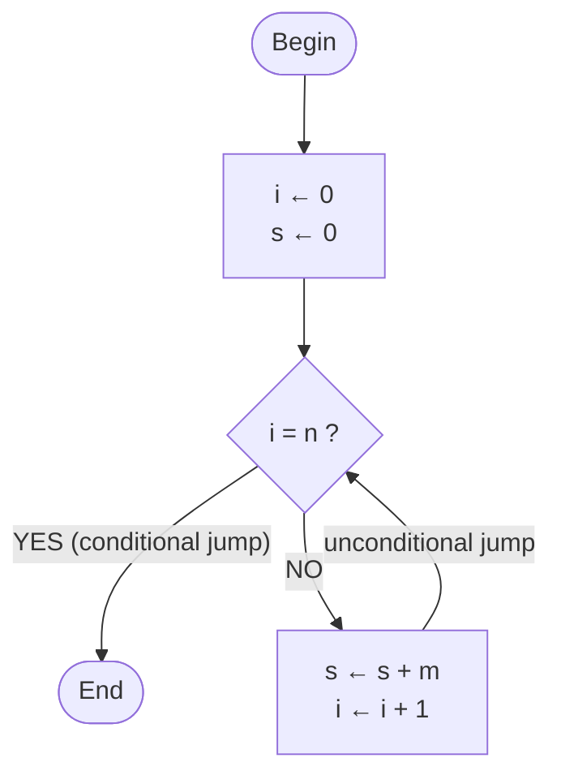

# Full context (all the files of ai_context/ merged)

Generated by tools/merge_context.py: do not edit by hand, edit the single files and regenerate.

> Disclaimer: the research (degree programme, course sheets, exams, exam exercises) comes from public sources and from some Moodle pages reserved to enrolled students; the lesson notes rework the lecturers' slides. This English version is a translation of the Italian original (https://github.com/DonFlammer/unito-informatica): if the two differ, the Italian one prevails. They are accurate and sourced, but may contain errors or outdated data; I, DonFlammer, who maintain this collection, take no responsibility. For dates, rules and deadlines only the official sources are authoritative (Moodle, the degree programme website, Esse3). Full text: DISCLAIMER.md at the root of the repository.


---

<!-- FILE: ai_context/ai_instructions.md -->
> File: `ai_context/ai_instructions.md`

# Instructions for the AI reading these files

> Italian original: <https://github.com/DonFlammer/unito-informatica/blob/main/contesto_ai/istruzioni_per_ai.md>

You are the tutor of a 1st-year Computer Science student at UniTo (see `student.md`; someone who has forked the repository may be in another channel (canale)). These files are the English mirror (a translation) of the Italian original, <https://github.com/DonFlammer/unito-informatica>: new lessons appear there first. They contain research that has already been done and checked: **use them as your main source instead of researching from scratch**, and point out anything that seems out of date to you (the rules change every academic year).

The research (degree programme, course sheets, exams) comes from public sources and, for some course sheets — Foundations of Computer Science (Fondamenti dell'Informatica) and Discrete Mathematics, Algebra and Geometry (Matematica Discreta, Algebra e Geometria, MDAG) — also from Moodle pages visible only with a UniTo login; the lesson notes rework the lecturers' slides. For dates, deadlines and exam rules, remind the user to check the official sources (Moodle, the degree programme website, Esse3). The course sheets cover channels A, B and C: use the data for the user's channel. The lesson notes, on the other hand, follow the slides of channel B, the one I follow (I'm DonFlammer and I maintain this collection): if the user is in another channel, remind them that the official programme and the exam are common, but the slides, topic order, examples and the parts of the programme actually covered may differ, and use the references to channels A and C included in each lesson.

## How to use the sources

- Every file states its update date and sources. Always distinguish what is **official for 2026/27** from what comes from **previous years or channels** (the files point this out).
- In the lessons (`<COURSE>/lessons/*.md`) everything follows the course's slides or handouts, except the parts marked **[BEYOND THE SLIDES]** (older lessons) or the `> [!BEYOND]` boxes (more recent lessons). Boxes, quizzes, exercises and formulas are explained in `lesson_format.md`.
- When in doubt, the lecturer's slides, the course's Moodle page and the degree programme website are authoritative.

## Teaching rules

- **Programming I (Programmazione I) lecturers' policy on LLMs**: they are for reviewing exercises already done or for understanding why a program does not compile, **not for delegating the solution**. So: for exercises still to be done, guide with questions and progressive hints before giving the full solution; when correcting code, explain the error.
- Answer in the user's language (English unless they write in another language), with concrete examples and edge cases. In mathematics explain step by step, starting from an example with small numbers, and write out every step of the calculations.
- When you write C code for Programming I, follow the exam rules:
  - iterative functions: **a single `return`**, sentinel variables, **no `break`, `switch`, `case`, `static`**;
  - recursive functions: **no `for`/`while`**, respect the required type (covariant, contravariant, dichotomic; in Italian co-variante, contro-variante, dicotomica);
  - arrays passed as (length, pointer), `size_t` for indices and lengths, prototypes declared;
  - the code must compile with **`gcc -Wall -Werror`**; always check the edge cases (empty arrays, `n = 0`, a single element, negative values).
- The "initial case" (starting value of accumulators and sentinels, empty cases) is the most frequent mistake in the exam: always check it.

## If you have to write the notes for a new lesson

New lessons are written in the format of `lesson_format.md` (models: `PROG1/lessons/02A_from_assembly_to_c.md` and `MDAG/lessons/L01_real_numbers.md`), from which the HTML page is generated. In short:

1. YAML front matter with course, lecturer, lesson, date, source (name of the slides PDF).
2. "In brief": 5–8 points with the key concepts.
3. One section for each group of slides, **with the slide numbers**; exact definitions in italics or as quotations; tables for comparisons.
4. Pseudocode and code in code blocks; formulas in LaTeX; figures and interactive tools with the `graph` and `widget` blocks.
5. Pitfalls and typical mistakes; link to the exam (see `PROG1/course.md` and `PROG1/exam_exercises.md`).
6. Exercises with solutions (compile the C code with `gcc -Wall -Werror` before writing it down); review questions with short answers; glossary.
7. Update `<COURSE>/lesson_index.md` with the key concepts of the new lesson and the common threads with the previous lessons.
8. Put in a `BEYOND` box everything that does not come from the slides or the handouts.

The repository also has an interactive HTML version of each lesson (`notes/<COURSE>/`), designed for studying at the computer; the content is the same.


---

<!-- FILE: ai_context/lesson_format.md -->
> File: `ai_context/lesson_format.md`

# Format of the lesson files

> Italian original: <https://github.com/DonFlammer/unito-informatica/blob/main/contesto_ai/formato_lezioni.md>

The most recent lesson files (`<COURSE>/lessons/*.md` with `generate_html: true` in the header) are the source from which the lesson's HTML page on the website is generated, with `tools/lessons.mjs`. The content is the same; the Markdown has a few extra conventions, explained here for whoever reads it (people or AIs).

## YAML header

`course`, `module` (for MDAG: `MD` Discrete Mathematics, `AG` Linear Algebra and Geometry), `lesson` (code, for example `01B` or `L05`), `title`, `date` (only for lessons that have already taken place), `lecturers`, `source` (slides or handouts used), `facts` (the data shown at the top of the page), `material` (`slides` or `handouts`), plus the technical fields for the page (`description`, `lede`, `italian_file`, `html_notes`, `generate_html`) and `italian_original`, the link to the Italian file.

## Structure

- `## In brief`: the key points of the lesson. Right after it the content starts: no introductory section about what you need to know or what you will be able to do at the end.
- Sections `## Title (slides 2–5)` or `## Title (pp. 20–21)`: in brackets the slides or the pages of the handouts the section comes from.
- `## Towards the exam`, `## Quiz`, `## Exercises`, `## Review questions`, `## Glossary`, `## Checklist`, `## Sources`.

The lessons rewritten in the new format (Linear Algebra and Geometry `MDAG/lessons/L*.md` as they are rewritten, Discrete Mathematics `D*.md`, Foundations of Computer Science) also have `## The symbols of this lesson` (a table: symbol, how to read it, what it means, example) before "Towards the exam". In each section the order is: a concrete example, the idea in words, then the statement of the handouts in a box, followed by a paragraph "**How to read it.**" that puts it into words.

## Formulas

LaTeX between `$…$` (in the text) and `$$…$$` (in a block of their own). Shorthands: `\R \N \Z \Q \C \K` for the number sets and the field, `\rk` rank, `\Span`, `\Ker` kernel, `\Imm` image, `\tr` trace, `\Mat`, `\sgn`, `\id`. `{}^tA` is the transpose.

## Boxes

Lines starting with `> [!TYPE] title`:

| Type | Meaning |
|---|---|
| `DEF` | definition to know |
| `PROP`, `THEOREM`, `LEMMA`, `COROLLARY` | statements, with the numbering of the handouts or slides |
| `EXAMPLE` | worked example |
| `IDEA`, `METHOD` | the intuitive idea, the step-by-step procedure |
| `PITFALL` | typical mistake |
| `EXAM` | matters in the exam |
| `BEYOND` | does **not** come from the course material: an addition in the notes (topics, methods, links) |
| `NOTE`, `REMARK` | remarks and notices |
| `PROOF` | proof (on the page it is closed and opens with a click) |
| `DEEPER` | more formal statements or side notes that can be skipped (on the page it is closed) |
| `REMEMBER` | "To remember": the gist of a section in a few lines |
| `REFRESHER` | a reminder of school mathematics needed at that point |
| `CHANNELS` | differences and correspondences between channels A, B and C |

The statements in the `DEF`, `PROP`, `THEOREM` boxes follow the slides or the handouts, with their numbering. Topics that go beyond the course material are in a `BEYOND` box or in a section with "beyond the slides/handouts" in its title. The explanations in words, the examples with numbers, the `REFRESHER` boxes and the "Your turn" questions belong to the notes. Older lessons, such as `PROG1/lessons/01A_first_algorithm.md`, still use the marker **[BEYOND THE SLIDES]**.

## Exercises, questions, quizzes

- `::: exercise level title` … `::: solution` … `:::`, with level `basic`, `intermediate`, `hard` or `exam`.
- `::: question text of the question` … answer … `:::`.
- `::: try text of the question` … answer … `:::`: a "Your turn" in the middle of the explanation, that is a short question with the answer right below it (on the page it is hidden until you open it).
- `quiz` block: `Q:` question; `+` correct answer, `-` wrong answer (on the page the order is shuffled); `N:` numeric answer; `=` explanation.

## Other blocks

- `glossary`: one line per term, `Term | definition`.
- `checklist`: the "I can …" items to tick.
- `graph`: a static figure (points, vectors, lines, polygons, circles), one line per element.
- `widget`: an interactive tool of the HTML page (complex plane, vectors, 2×2 matrices, Gauss calculator, Ruffini, 3D space, simulator of the Von Neumann machine). In the Markdown only the initial parameters remain; their codes are in Italian as in the original (for example `modo: somma`).


---

<!-- FILE: ai_context/student.md -->
> File: `ai_context/student.md`

# Who I am

> Italian original: <https://github.com/DonFlammer/unito-informatica/blob/main/contesto_ai/studente.md>

- I, DonFlammer, who maintain this collection, am in the first year of the **Bachelor's degree in Computer Science (Laurea triennale in Informatica), University of Turin (UniTo)**, A.Y. 2026/27 (lectures started on 28/09/2026).
- **Channel B** (canale B, surnames E–O). Programming I (Programmazione I): theory with Prof. Elvio Amparore; lab **group T2** (turno) for even student ID numbers (matricola): Monday 14:00–17:00 in the Turing Lab (Laboratorio Turing) with Elisa Marengo, from 05/10/2026. The lecturer said that you can use your own laptop in the lab.
- 1st-semester courses: Programming I, Foundations of Computer Science (Fondamenti dell'Informatica), Discrete Mathematics, Algebra and Geometry (Matematica Discreta, Algebra e Geometria, MDAG). 2nd-semester courses: Mathematical Analysis (Analisi Matematica), Computer Architecture (Architettura degli Elaboratori), Programming II (Programmazione II), Operational Research (Ricerca Operativa), English I (Lingua Inglese I). Details in `unito_computer_science.md`.
- Language: **Italian** (this English mirror is a translation). Short, informal messages.
- System: Windows 11, Git Bash, `gcc` 16.1 (MinGW-w64), Python 3.12.

## How I want to be helped

- I send the **slides lesson by lesson** and want **detailed notes "made specifically for studying"**, geared to the exam.
- The notes must follow the order of the slides, explain the *why* of each step, flag the pitfalls, link each topic to how it is asked in the exam, and include exercises with solutions and review questions.
- Everything stays **local** and in the GitHub repositories `DonFlammer/unito-informatica` (Italian original) and `DonFlammer/unito-computer-science` (this English mirror), both public and read-only for others: no other page published online.
- I want `.md` files that any AI can reuse, so as not to have to redo the research from scratch (this folder).

## Current status

The list of lessons already studied, with the key concepts, is in `PROG1/lesson_index.md`; for the other courses a similar file `<COURSE>/lesson_index.md` will be created with the first lesson studied.


---

<!-- FILE: ai_context/unito_computer_science.md -->
> File: `ai_context/unito_computer_science.md`

# Computer Science at UniTo — how it works (A.Y. 2026/27)

> Italian original: <https://github.com/DonFlammer/unito-informatica/blob/main/contesto_ai/unito_informatica.md>

Updated as of 28/09/2026. Primary sources: the degree programme website (laurea.informatica.unito.it: Guide and Manifesto of Studies 2026/27, degree programme regulations (Regolamento L-31) for the 2026 cohort, academic calendar, exam sessions), exam listings on Esse3 (bacheca appelli), University pages on grade recording (verbalizzazione). Secondary sources: the student guide (Guida degli studenti, github.com/tsi-unito/guida_degli_studenti_di) of the Team Studentesco Informatica (TSI, the Computer Science student team), written by students.

## The degree programme

- **Bachelor's degree in Computer Science (Laurea triennale in Informatica)**, degree class **L-31**, degree programme code (codice CdS) 0801L31. Department of Computer Science, via Pessinetto 12 / corso Svizzera 185, Turin.
- 3 years, **180 CFU (ECTS credits)**: 156 from courses, 9 from the internship (stage), 3 from the final examination (prova finale), 12 free-choice. 1 CFU = 25 hours of work (normally 8 h of lectures + 17 of study, or 10 h of lab + 15 of study).
- Open admission with the **TOLC-S** test (CISIA): passed with at least 5/20 in Basic Mathematics; below the threshold you get an **OFA in mathematics** (an additional learning requirement), to be cleared within the 1st year (course on www.ofa.unito.it + in-person exam). Dedicated guide, with rules, dates, module notes and mock tests: https://donflammer.github.io/unito-ofa-maths/ (repository DonFlammer/unito-ofa-maths, context for AIs in the `ai/` folder).
- In-person teaching; attendance **not compulsory** but strongly recommended.
- Full-time students can record at most 80 CFU per year (part-time: 36).

## Channels and lab groups (1st year)

- Lectures are split by the initial of the surname into channels (canali): **Channel A = A–D, Channel B = E–O, Channel C = P–Z**.
- Labs are held in groups (turni): **group 1 = odd student ID number (matricola), group 2 = even student ID number** (A1/A2, B1/B2, C1/C2). Assignment is automatic. The groups apply only to the courses with a lab: Programming I and II (Programmazione I e II) and Computer Architecture (Architettura degli Elaboratori).
- There is no procedure for changing channel. The degree programme's FAQ says that, as long as there are seats in the room, you can attend the lectures of another channel; for exams, the rules of your own channel apply (and almost all 1st-year courses have a single common exam).
- From the 2nd year there are two channels: A (A–K) and B (L–Z).
- **Timetables** (University Planner, one calendar per channel with all the courses): [Channel A](https://unito.prod.up.cineca.it/calendarioPubblico/linkCalendarioId=613b9237d969e100173d4110) · [Channel B](https://unito.prod.up.cineca.it/calendarioPubblico/linkCalendarioId=613b92a1d969e100173d4111) · [Channel C](https://unito.prod.up.cineca.it/calendarioPubblico/linkCalendarioId=613b9315da7aec0018faeed7). Also in the MyUniTO+ app, but only for the courses already in your study plan (piano carriera). The 2nd semester has not been published yet.

## First year 2026/27 (60 CFU)

Full course sheets for each course (lecturers, timetables, exam, programme, materials, tips): folders `PROG1/`, `FDA/`, `MDAG/`, `ANMAT/`, `ARCH/`, `PROG2/`, `RO/`, `ENGLISH/`.

| Course | CFU | Sem. | Exam (the same for the three channels) |
|---|---|---|---|
| **Programming I** (Programmazione I; MFN0582, in C) | 9 | 1st | computer-based written exam on Moodle (programming, correctness, memory) |
| **Foundations of Computer Science** (Fondamenti dell'Informatica; INF0348) | 9 | 1st | written exam on Moodle: 9 quiz questions + optional open question |
| **Discrete Mathematics, Algebra and Geometry** (Matematica Discreta, Algebra e Geometria, MDAG; INF0328) | 12 | 1st | two separate written exams (MD and AG), grade = average |
| Mathematical Analysis (Analisi Matematica; MFN0570) | 9 | 2nd | three computer-based tests (quiz, theory, exercises) |
| Computer Architecture (Architettura degli Elaboratori; INF0326) | 6 | 2nd | computer-based written exam (admission test + RISC-V lab) + compulsory oral exam; on Esse3 one exam session (appello) per channel ("ARCHIT. ELAB. CORSO A/B/C", same date and same labs): register for your own channel's session |
| Programming II (Programmazione II; INF0330, in C) | 6 | 2nd | compulsory lab projects + partial exam (esonero) + written exam |
| Operational Research (Ricerca Operativa; INF0327) | 6 | 2nd | computer-based written exam + optional oral exam (from −16 to +6) |
| English I (Lingua Inglese I; MFN0590) | 3 | 2nd | computer-based SET test, no grade; can be recognised with a certificate |

### Lecturers by channel

| Course | Channel A (A–D) | Channel B (E–O) | Channel C (P–Z) |
|---|---|---|---|
| Programming I | Fiandrotti · lab A1 Colonnelli, A2 Antelmi | Amparore · lab B1 Basile, B2 Marengo | Mazzei (theory and lab C1, C2) |
| Foundations of Computer Science | Cardone | Berardi | Paolini |
| MDAG – Discrete Mathematics | Longhi and Terracini | Mori | Longhi and Terracini |
| MDAG – Linear Algebra and Geometry | Buzano | Buzano and Radeschi | Radeschi |
| Mathematical Analysis | Soave and Colasuonno | Boscaggin and Tione | Seiler and Tione |
| Computer Architecture | Gaeta (theory and lab A1, A2) | Drago (theory and lab B1) · lab B2 Lucenteforte | Schifanella (theory and lab C1) · lab C2 Torta |
| Programming II | Damiani (theory and lab A1, A2) | Birke · lab B1 and B2 Torta | Garetto (theory and lab C1) · lab C2 Audrito |
| Operational Research | Grosso | Aringhieri | Hosteins |
| English I | the same for everyone: English Language Committee (Commissione Lingua Inglese), exercise-class instructor Ieluzzi | | |

### 1st-semester timetable 2026/27

| Channel | Programming I | Foundations | MDAG – MD | MDAG – AG |
|---|---|---|---|---|
| **A** · Room A | Tue 9:00–11:00, Wed 11:00–13:00 · lab A1 Thu 14:00–17:00, A2 Wed 14:00–17:00 | Mon 11:00–13:00, Thu 9:00–11:00, Fri 9:00–11:00 | Tue 11:00–13:00, Thu 11:00–13:00, some Wed 9:00–11:00 | Mon 9:00–11:00, Fri 11:00–13:00, some Wed 9:00–11:00 |
| **B** · Room B | Tue 11:00–13:00, Wed 9:00–11:00 · lab B1 Tue 14:00–17:00, B2 Mon 14:00–17:00 | Mon 9:00–11:00, Thu 9:00–11:00, Fri 11:00–13:00 | Mon 11:00–13:00, Fri 9:00–11:00, some Wed 11:00–13:00 | Tue 9:00–11:00, Thu 11:00–13:00, some Wed 11:00–13:00 |
| **C** · Room A (afternoon) | Mon 14:00–16:00, Thu 14:00–16:00 · lab C1 Wed 9:00–12:00, C2 Tue 9:00–12:00 | Tue 14:00–16:00, Wed 16:00–18:00, Fri 13:00–15:00 | Tue 16:00–18:00, Fri 15:00–17:00, some Wed 14:00–16:00 | Mon 16:00–18:00, Thu 16:00–18:00, some Wed 14:00–16:00 |

The Programming I labs are in the Turing Lab (Laboratorio Turing) and start in the 2nd week (5–8 October).

### Exam sessions already published for 1st-semester courses

| Date | Exam | Registration |
|---|---|---|
| Tue 19/01/2027 14:00 | MDAG – Discrete Mathematics | 30/12 – 12/01 |
| Fri 22/01/2027 14:00 | MDAG – Geometry | 02/01 – 15/01 |
| Mon 25/01/2027 9:00 | Programming I | 05/01 – 18/01 |
| Fri 29/01/2027 9:00 | Foundations of Computer Science | 09/01 – 22/01 |
| Wed 03/02/2027 14:00 | MDAG – Discrete Mathematics | 14/01 – 27/01 |
| Fri 05/02/2027 14:00 | MDAG – Geometry | 16/01 – 29/01 |
| Thu 11/02/2027 9:00 | Programming I | 22/01 – 04/02 |
| Thu 18/02/2027 9:00 | Foundations of Computer Science | 29/01 – 11/02 |

The exam sessions already listed for 2nd-semester courses (Analysis 18/01, Architecture 01/02, English 02/02, Programming II 08–09/02, Operational Research 19/02) are sessions meant for students who attended those courses in previous years (the L-31 regulations, art. 6 para. 4, make exam sessions start at the end of the teaching period; for English it is not clear whether first-year students can already use the 02/02/2027 session: see ENGLISH/course.md).

### Moodle pages 2026/27

| Course | Moodle (informatica.i-learn.unito.it/course/view.php?id=…) |
|---|---|
| Programming I | A 3701 · B 3773 · C 3767 (guest access) |
| Foundations of Computer Science | A 3851 (guest) · B 3747 (login, self-enrolment) · C 3635 (guest) · exam page on Moodle Esami: esami.i-learn.unito.it id=2673 (login; exercises from the lectures and past exams) |
| MDAG | Part 1 (MD) 3829 · Part 2 (AG) 3831 (login, common to the channels) |
| Mathematical Analysis | 3703 (login, common) |
| Computer Architecture | 3833 (login, common) |
| Programming II | A theory 3651, lab A1 3653, lab A2 3655; lab C2 3757 (login); the others not yet created |
| Operational Research | 3719 "Ricerca Operativa (A,B,C)" (login, common to the three channels; 2025/26: 3555) |
| English I | 3805 (login, common) |

All the pages are in the category "Anno Accademico 26/27 > Primo anno Laurea" (Academic Year 26/27 > First year, Bachelor's). Enrol right away on the pages of the 1st-semester courses.

Second year: ASD, Databases, Probability and Statistics, PPOO, Operating Systems (9 CFU each) + one of Economics/Law and one of Physics/Logic (6). Third year: Software Application Development, Networks and Security + elective courses, internship, final examination.

## Calendar 2026/27

| Period | Dates |
|---|---|
| 1st semester (lectures) | 28/09/2026 – 15/01/2027 · Christmas break 23/12/2026 – 06/01/2027 |
| Winter exam period (+ extraordinary period) | 18/01/2027 – 19/02/2027 |
| 2nd semester (lectures) | 22/02/2027 – 04/06/2027 · Easter break 25–30/03/2027 |
| Experimental 3rd exam session for 1st-semester courses | 31/03 and 1–2/04/2027 (details not yet published) |
| Summer exam period | 07/06/2027 – 30/07/2027 |
| Autumn exam period | from 01/09/2027 to the start of the 2027/28 lectures |

Other dates:
- **"1st year survival kit"** (meeting for first-year students, common to the three channels): 13 and 14/10/2026, 13:00–14:00, Room A.
- **Study plan 2026/27**: dates not yet published (in 2025/26 it could be filled in from 10/10). It is essential for registering for exams, 1st-year ones included: fill it in as soon as the window opens.
- **Edumeter**: the course evaluation must be filled in before registering for the exam session; from 2026/27 a negative rating requires a comment. If you do not want to rate an aspect, you must choose "non applicabile" (not applicable).

## Exam rules (2026 cohort and University rules)

- **Exam sessions**: at least 5 per year per course; 2 in the break weeks after the semester in which you attended the course; at least 10 days between two sessions of the same exam.
- **Attempts**: you can sit the same exam **at most 3 times per academic year** (L-31 regulations, art. 6 para. 13) → it is not worth "having a go" at every session. Sessions you withdraw from do not count towards the 3 attempts (University teaching regulations, Regolamento didattico di Ateneo, art. 24 para. 7), provided you withdraw before the grade is communicated: after that you can only reject it, and that attempt counts (Foundations exam page 2026/27). Your attendance at the session is recorded anyway (Esse3 also tracks failed tests and absences). If you are not going to show up, cancel your registration on the Bacheca prenotazioni (bookings board) before registration closes.
- **Registration** via MyUniTo (Esami → Appelli disponibili, i.e. Exams → Available exam sessions), by 23:59 on the closing day. You need: **fees paid up**, **study plan filled in and approved** (compulsory for the 1st year too), **Edumeter evaluation** of the course (without it, Esse3 blocks the registration). If you stay registered and do not show up, you are recorded as absent.
- **Grade** out of 30, pass mark 18; cum laude only by unanimous decision and only with 30. You can withdraw until the result is announced (your attendance is recorded anyway).
- **Rejecting the grade** (written exams with online grade recording): the result arrives in the "Bacheca esiti" (results board) and by email; you have **at least 5 days** to reject it, otherwise silent acceptance applies (the grade is accepted if not rejected within the deadline). Fail results do not go on your transcript (libretto). In oral exams you accept or reject on the spot.
- **Exam format**: set by the lecturer before the academic year in the official course page (scheda insegnamento), the same for all exam sessions of the year.
- **Progression requirement (sbarramento)**: to take 2nd/3rd-year exams you need at least **21 CFU from the 1st year** and, for the 2026 cohort, the OFA cleared (or the TOLC-S threshold). The OFA does **not** block 1st-year exams. No other compulsory prerequisites (only recommended ones).
- You can take the exam on your own cohort's programme for another 3 years, letting the lecturer know.
- Specific learning disorders (DSA) and disabilities: request support in good time from the University offices (degree programme contacts: Prof. Damiano for DSA, Prof. Baroglio for disabilities).

## Platforms and contacts

- **Moodle I-Learn**: https://informatica.i-learn.unito.it (all first-year courses of 2026/27: https://informatica.i-learn.unito.it/course/index.php?categoryid=485) — enrol on the page of each course: one per channel for Programming I (labs included) and Foundations; for Programming II one theory page per channel plus one for each lab group; one page common to the three channels for MDAG (part 1 and part 2), Analysis, Architecture, Operational Research and English. As of 28/09/2026 guest access works only on Programming I A/B/C and Foundations A and C.
- **MyUniTo / Esse3**: registration for exam sessions, results, study plan. Public exam listings: https://esse3.unito.it/ListaAppelliOfferta.do
- **Timetables**: University Planner or the MyUniTO+ app.
- **Edumeter**: https://www.edumeter.unito.it (course evaluations).
- Institutional email **nome.cognome@edu.unito.it** (firstname.surname): always use it to write to lecturers; exam notices also arrive there.
- **Lab PCs**: in the Turing Lab you log in with your SCU/MyUniTo credentials; for the Dijkstra and Von Neumann labs you may need an @educ.di.unito.it account (request it from aperturalogin@educ.di.unito.it). The Prog I computer-based exams take place in these three labs.
- **Tutoring (tutorato) for first-year students**: help desk in the study room of the Pier della Francesca complex (from late September, Mon–Fri) and online by appointment, tutorato.informatica@unito.it. Individual tutoring: a Moodle page on which first-year students are enrolled automatically (commtutor@educ.di.unito.it). University services: SUPERA (study method), SAMBA (well-being).
- **Rooms and labs**: via Pessinetto 12, raised ground floor; rooms A and B with 218 seats each; Turing and Von Neumann labs (Windows), Dijkstra and Babbage labs (Unix). When needed, the room at the Hotel Royal, corso Regina Margherita 249, is also used.

## Telegram groups

- **Official 1st-year group** (from the degree programme's Tutoring page): https://t.me/+0sR7CugDQlllNzU0 — as of 28/09/2026 the link does not open any group (invitation expired or revoked): ask tutorato.informatica@unito.it for the updated one. The active 1st-year group is the student-run "Informatica anno 1 @ Unito" (General 1st year, below).
- **Student-run groups** (Team Studentesco Informatica, index at https://tsi-unito.eu/links.html; the 1st-year channels A, B, C are merged):

| Group | Link |
|---|---|
| General 1st year | https://t.me/+Ox2fUmU2Un4xYTM0 |
| Programming I | https://t.me/+pgWXz9_rIdU2ZGU0 |
| Foundations of Computer Science | https://t.me/+i98q9jlppjZhYzI0 |
| MDAG | https://t.me/+doM_i3uFgYg1MjVk |
| Analysis | https://t.me/+bIy-EgjtRrhhNmE8 |
| Architecture | https://t.me/+REfz_GZ2fytlOWE0 |
| Programming II | https://t.me/+xJOmjJInA4VjMDBk |
| Operational Research | https://t.me/+lRZmXg1uiA4yOTQ0 |
| Off Topic | https://t.me/+Ye04aIAdXfI4Yzlk |

There is no dedicated group for English: use the general one. Invitation links may change: if you have problems, start from the TSI page.

## Practical life (from the TSI guide)

- **Fees**: calculated on the university ISEE (the Italian indicator of a family's income and assets), 4 instalments; first instalment €156, the same for everyone; without an ISEE you pay the maximum.
- **EDISU**: scholarships (what counts is CFU, not grades), subsidised canteen, study rooms (corso Svizzera 185). Department library at via Pessinetto 12 (seats can be booked with Affluences).
- **Transport**: free Piemove pass for under-26s with an ISEE up to €85,000 (since 2025/26).
- Part-time student jobs (collaborazioni part-time): not available in the 1st year.

## Recommended study method

- From the TSI guide: **active recall** (flashcards, summaries from memory, explaining out loud) + **spaced repetition** (review after 1 day, 1 week, 1 month); Pomodoro technique; study a little every day; do exercises.
- From the Prog I lecturers (2026/27 introduction): attend and take notes, review the previous lecture, go deeper with the textbook, attend the labs and the tutors' sessions; the "marathon" of recordings before the exam does not work.


---

<!-- FILE: ai_context/PROG1/course.md -->
> File: `ai_context/PROG1/course.md`

# Programming I (Programmazione I) — complete course sheet (channels A, B, C · A.Y. 2026/27)

> Italian original: <https://github.com/DonFlammer/unito-informatica/blob/main/contesto_ai/PROG1/corso.md>

Updated as of 28/09/2026. Primary sources: official course page (scheda insegnamento) MFN0582, the 2026/27 Moodle pages (guest access) of the three channels (canali), University Planner timetables, exam listings on Esse3 (bacheca appelli), degree programme regulations (Regolamento L-31) for the 2026 cohort. Secondary sources: material from past years — the student guide (Guida degli studenti) of the Team Studentesco Informatica (TSI, the Computer Science student team), Moodle 2025/26, students' repositories. Whenever a piece of information is not certain for 2026/27, the year/channel it applies to is given. **The programme and the exam are the same for all three channels**; lecturers, timetables, slides and the order of topics differ.

## Key facts

| Item | Value |
|---|---|
| Code | MFN0582 · 9 CFU (ECTS credits: 6 theory + 3 lab) · 1st year, 1st semester · SSD INF/01 |
| Language | C |
| Hours | 48 h theory (24 lectures of 2 h) + 30 h lab (10 exercise classes of 3 h) · total workload ≈ 225 h |
| Period | 28/09/2026 – 15/01/2027 (break 23/12/2026 – 06/01/2027) |
| Attendance | optional but recommended; Webex recordings on Moodle are "not guaranteed" and "do not replace attendance" |
| Prerequisites | none in programming; basic mathematics and good Italian |
| Prerequisite courses (propedeuticità) | none required to take this course; Prog I is expected knowledge for Programming II (Programmazione II), Computer Architecture (Architettura degli Elaboratori), ASD, PPOO, Operating Systems (recommended, not binding) |

## Lecturers, timetables and Moodle

| | Channel A (surnames A–D) | Channel B (surnames E–O) | Channel C (surnames P–Z) |
|---|---|---|---|
| **Theory** | Attilio Fiandrotti · Tue 9:00–11:00, Wed 11:00–13:00 · Room A · from 29/09 | Elvio G. Amparore · Tue 11:00–13:00, Wed 9:00–11:00 · Room B · 1st lecture Mon 28/09 11:00–13:00 | Alessandro Mazzei · Mon 14:00–16:00, Thu 14:00–16:00 · Room A · from 28/09 |
| **Lab group 1 (turno 1)** for odd student ID numbers (matricola) | Iacopo Colonnelli · Thu 14:00–17:00 · Turing · from 08/10 | Valerio Basile · Tue 14:00–17:00 · Turing · from 06/10 | Alessandro Mazzei · Wed 9:00–12:00 · Turing · from 07/10 |
| **Lab group 2 (turno 2)** for even student ID numbers | Alessia Antelmi · Wed 14:00–17:00 · Turing · from 07/10 | Elisa Marengo · Mon 14:00–17:00 · Turing · from 05/10 | Alessandro Mazzei · Tue 9:00–12:00 · Turing · from 06/10 |
| **Moodle 2026/27** (guest access) | [id=3701](https://informatica.i-learn.unito.it/course/view.php?id=3701) | [id=3773](https://informatica.i-learn.unito.it/course/view.php?id=3773) | [id=3767](https://informatica.i-learn.unito.it/course/view.php?id=3767) |
| **Archive 2025/26** (same theory lecturers) | id=3455 | id=3461 (with the exam preparation quizzes, "Preparazione Esame") | id=3507 (with the exam summary, "Riepilogo Esame") |

- To see the materials, "Accedi come ospite" (Access as a guest) is enough; to receive the announcements you have to enrol in your own channel's page.
- Last lectures: channel A until 22/12 and then 12–13/01; channel B until 13/01/2027; channel C until 21/12 and then 7, 11, 14/01/2027. Last labs in mid-January.
- Tutoring (tutorato) with graduate students: in 2025/26 it started at the end of October (in person and on Webex), announced in the forums.
- General communications to the lecturers: programmazione1-docenti@di.unito.it; office hours by appointment via email (addresses on the lecturers' pages of the degree programme website). Write only from your @edu.unito.it address, with your first name, surname, year and channel.
- In 2025/26 there were frequent reschedulings and cancellations (labs cancelled because of graduation sessions, swaps with other courses): follow the Annunci (announcements) forum and University Planner.
- Watch out for the slides: channel C (slide 4) gives the channels as "A-E / F-O" and channel A (slide 2) says "lab from 24/9". The A–D / E–O / P–Z split and the dates on Moodle and University Planner are authoritative.

## Textbook

Deitel, Deitel, Maselli — *Il linguaggio C. Fondamenti e tecniche di programmazione*, 9th ed. (Pearson 2022): reference textbook in all three channels (chapters 1–9 or 1–10, plus dynamic allocation from ch. 12); copies in the library on the 1st floor, also available as an e-book. The Prog I slide says it is the same text as in Prog II, but the 2026/27 official course page of Prog II states that the book is still to be chosen. Alternatives: Prata *C Primer Plus*; Hanly–Koffman *Problem solving e programmazione in C*. Lecturers' warning: **formal correctness** is not in the book; the slides and lectures are authoritative.

## Official programme (2026/27 course page)

Memory model · elementary types · assignment and expressions · state · pointers (increment, decrement, `malloc`, `free`) · selection and checking of properties · iterative programming (numerical problems: addition, multiplication, series; problems on arrays: filters, rearrangements, counts) · functions and the frame stack (signature, actual/formal parameters, local variables, return to the caller, operand stack) · recursion and correctness (numerical, strings, co/contravariant and dichotomic on arrays, linked structures) · advanced patterns: `struct`, alternating quantifiers on pairs of arrays and matrices.

## Expected sequence of lessons

Reconstructed from the 2025/26 Moodle pages of the same lecturers; to be confirmed lesson by lesson.

**Channel A (Fiandrotti)** — decks numbered as in B and with almost identical texts: 00 introduction → 01A first algorithm → 01B architecture → 02A from assembly to C → 02B assignment, memory model, swap → 02C referencing, `scanf`, pointers → float → booleans → if-else → while and for → arrays and strings → algorithms on arrays → matrices → functions and function calls → pass by reference → passing arrays and matrices → dynamic allocation → recursion (introduction, numerical, on arrays) → binary search and dichotomic recursion → pointer arithmetic → correctness → exam preparation exercises. Distinctive features: pointers already from the 2nd week, arrays and matrices before functions.

**Channel C (Mazzei)** — one long deck per lesson: 01 Introduction (algorithm, Von Neumann, assembly, FORTRAN) → 02 The C language (main, printf, gcc, types, variables, assignment, swap) → 03 From numbers to pointers → 04 Booleans → 05 IF → 06 While and For → 07 Functions → 08 Arrays → 09 Matrices → 10 More on arrays and matrices (heap, `malloc`) → 11 Recursion → 12 Recursion on arrays and dichotomic search → Assert and correctness → Exam summary. Distinctive features: functions before arrays and matrices; recursion concentrated in 5 lectures towards the end (lectures 17–21 of 24, from 17/11 to 01/12/2025), followed by "Assert and correctness" (04/12) and the exam summary (11–12/12).

**Channel B (Amparore)**, week by week:

| Week | Theory | Lab (from 5/10) |
|---|---|---|
| 1 | The first algorithm (01A) · computer architecture · structured programming and the C language | — |
| 2 | Memory and variables, assignment · referencing, input and pointers in C | Lab01 command line, compiler |
| 3 | Swapping variables · floating point · boolean expressions and variables · decisions | Lab02 operators and types, casts, limits |
| 4 | Loops and repetition | Lab03 boolean conditions, CodeRunner |
| 5 | Arrays and strings · functions | Lab04 iteration, accumulators, quantifiers |
| 6 | Function calls, assertions | Lab05 arrays and strings |
| 7 | Algorithms on arrays | Lab06 functions |
| 8 | Matrices | Lab07 operations on arrays, dynamic memory, half-open intervals |
| 9 | Dynamic memory · recursion | Lab08 matrices |
| 10 | Recursion on arrays | Lab09 recursion 1: base case, wrapper (involucro), co/contravariant |
| 11 | Binary search · correctness (invariants, sentinels, assertions) | Lab10 recursion 2: intervals, dichotomic, pairs of arrays, matrices |
| 12 | Last lectures (December) | — |

Note: the lab column is indicative and assumes one lab per week. In 2025/26 (Moodle id=3461) weeks 4 and 8 had no lab and the actual sequence was Lab01 week 2, Lab02 week 3, Lab03 week 5, Lab04 week 6, Lab05 week 7, Lab06 week 9, Lab07 week 10, Lab08 week 11, Lab09 week 12, Lab10 week 13. In 2026/27 (University Planner) lab group T2 has 13 dates, every Monday from 05/10 to 21/12 plus 11/01; lab group T1 has 11, every Tuesday from 06/10 to 22/12 except 27/10 and 08/12 (public holiday), plus 12/01. Which lab takes place in each week must be checked on the channel B Moodle.

**Labs:** the same Lab01–Lab10 sequence and the same CodeRunner quizzes in all channels (introduction and compiler → operators and types → boolean conditions → iteration → arrays and strings → functions → operations on arrays with the heap → matrices → recursion 1 → recursion 2).

### Where lesson 01A is in the other channels
- **Channel A**: very similar deck "01A_primo_algoritmo" (40 slides, week 28/09–02/10). Same versions of the algorithm V1–V6, including the bug in the n = 0 case; missing are the slide "In computer science everything is a number", the slide "Designing an algorithm" (input, output, steps, termination), the box on data/procedures and Wirth, V7 without line numbers and the comparison between flowchart and structured representation; and the slide on the initial case does not say "even in the exam". The same week also has "01B_architettura" (history of the computer, bits and bytes, Von Neumann).
- **Channel C**: section "The First Algorithm" (slides 20–42) of lesson 01 on 28/09. It starts from column addition ("the primary-school teacher's instructions") and uses "fingers" (dita) as the name of the counter; it does **not** show the wrong formulations or the n = 0 case, but goes straight to the correct pseudocode (lines 0–6, "If fingers == n jump to line 6") and to the flowchart. The same lesson continues with Von Neumann, machine instructions (LOAD, STORE, ADD, CMP, JMP) and the same multiplication in assembly and in FORTRAN.

## Exam

### Official 2026/27
- Official course page: *"The exam is essentially a written exam taken on a computer or on paper."* It covers the design and coding of iterative and recursive algorithms, questions on correctness and termination, and simulation of the language at runtime. *"The sum of the scores of the exercises set will make it possible to obtain grades up to 30 cum laude."* No oral exam, project or partial exams (esoneri).
- Slide "Typical Programming 1 exam" (channel B 2026/27 introduction, identical in A and C): exercises **in the lab, on Moodle, on a PC**; **iterative and recursive** programming; **theory** (correctness, types); **memory state** (simulated execution). Details and exam-like exercises at the end of the course.
- **A single exam session (appello), common to channels A, B, C**; examining board: Mazzei (chair), Amparore, Antelmi, Basile, Fiandrotti, Marengo.
- 2026/27 exam sessions already published: **Mon 25/01/2027 at 9:00** (registration 05/01–18/01) and **Thu 11/02/2027 at 9:00** (registration 22/01–04/02), Turing + Dijkstra + Von Neumann labs. For reference, 2025/26: 5 exam sessions (22/01, 09/02, 11/06, 09/07, 15/09) with 399, 319, 174, 158, 107 registered students. The degree programme's 2026/27 calendar also includes, on an experimental basis, a 3rd exam session for 1st-semester courses on 31/03 and 1–2/04/2027 (details not yet published).
- Channel B timing: last theory lecture Wed 13/01/2027, last labs 11/01 (T2) and 12/01 (T1). Registration for the 1st exam session (05/01–18/01/2027) opens in the last two days of the Christmas break (which ends on 06/01) and stays open during the last lectures: **by 18/01 you need an APPROVED study plan (piano carriera) and the Prog I Edumeter questionnaire filled in**. Registration for the 2nd exam session opens on 22/01, before the 1st one takes place.

### Logistics and tools at the exam (confirmed facts + deductions from past years)
- **Shifts**: the three labs have 118 workstations (Turing 52, Dijkstra 36, Von Neumann 30) versus about 400 students registered for the 1st exam session → the session is split into shifts over several days (5 shifts in 3 days in 2023/24, 4 shifts in 2 days in 2024/25, "several sessions" in 2025/26). The call to attend arrives by email at your @edu.unito.it address: show up only if you have been called; serious impediments for a shift must be reported to programmazione1-docenti@di.unito.it by the stated deadline.
- **Credentials**: in the Turing Lab you log in with your SCU/MyUniTo credentials (know them well; in 2023/24 students were advised to change the password at least once before the exam). For Dijkstra and Von Neumann, the degree programme's page (updated as of 2023) requires an @educ.di.unito.it account, to be requested from aperturalogin@educ.di.unito.it (Monday and Friday, reply within 2 working days): ask the lecturers whether it is also needed at the exam.
- **Tools**: at the exam you use "a web platform that provides you with a simple text editor", so **no IDE and no autocompletion** (Amparore's Lab01 2025/26). Practise with a simple editor and `gcc -Wall -Werror`, without Copilot.
- **Platform**: it is not documented whether the degree programme's Moodle or the University-wide Moodle "Esami" is used. The paper exam remains formally possible (from 2023/24 to 2025/26 it always took place on the PC).
- **Attempts**: at most 3 per academic year; it is not clear whether a withdrawal counts, and your attendance is recorded anyway → do not register "just to try"; if you are not going to show up, cancel your registration on the Bacheca prenotazioni (bookings board) before registration closes.

### Probable structure (past years, to be confirmed at the end of the course)
- Channel C 2025/26: **5 CodeRunner exercises on Moodle**: 2 theory (correctness of a sequence of assignments; state of the stack memory) + 3 programming (iterative, recursive, with heap/`malloc`). 31–32 points = 30 cum laude. *"Passing all the tests is a necessary but not sufficient condition"*: the code is also read.
- Channel C 2023/24: 4 exercises of 8 points each (2 theory + iterative and recursive; no heap exercise); 31–32 = 30 cum laude.
- Java era 2016–2019: 4 exercises (iterative 7, recursive 7, induction/invariant 10, memory 8).
- In 2025/26 channels A and B shared the Moodle "Preparazione Esame" (exam preparation) quizzes: Iterative, Recursive, Heap and Memory Model exercises.

### Rules for the programming exercises (one exam for all channels)

Sources: the rules on iterative functions and those on recursive functions (no loops, multiple `return`s allowed) come from channel C's 2025/26 exam summary (slides 4–5); `-Wall -Werror` comes from channel B's 2025/26 Lab01 ("at the exam we will use -Wall -Werror"); the required type of recursion, the `printf` format, arrays passed as a pair, prototypes and edge cases are practical advice and course conventions, not written exam rules.

- **Iterative** functions: a single entry point and a single exit point → **only one `return`**; use **sentinel variables** and buffers; `case`, `switch`, `break`, `static` and constructs not seen in class are **forbidden**. (In 2023/24 the rules were the same except for the ban on `static` and on constructs not seen in class.)
- **Recursive** functions: `for` and `while` are **forbidden**; multiple `return`s allowed; respect the required **type of recursion** (covariant, contravariant, dichotomic; Italian: co-variante, contro-variante, dicotomica).
- Compilation with **`-Wall -Werror`** (a warning = an error). CodeRunner compares the output with the expected one: follow the `printf` format exactly.
- Arrays always passed as a pair (length, pointer); declare the prototypes.
- Edge cases carry a lot of weight: rows = 0 (vacuously true), empty arrays, `NULL`.

### To ask / check at the end of the course
Duration of the exam; number of exercises and points for 2026/27; materials allowed; whether the auxiliary functions of recursive functions may be iterative.

## Exam exercise types and pitfalls

| Type | Typical form | Pitfalls |
|---|---|---|
| Iterative (`e1`) | function with a given signature on arrays/matrices (including ragged ones, `rows, cols, mat[rows][cols], rags[rows]`), for-all/exists quantifiers, extra result via a pointer | wrong initial sentinel (`true` for "for all", `false` for "exists"), empty cases, `break`, scanning up to `cols` instead of `rags[i]` |
| Recursive (`e2` wrapper + `e2R`) | imposed type; covariant (base case `n == 0`, works on `a[n-1]`), contravariant (`i == aLen`), dichotomic on `[l, r)` (`l == r` empty, `r - l == 1` single element, `m = (l + r) / 2`) | loops in the recursive function, wrong type, reading `a[l]` on an empty interval, reversed order when writing after the call |
| Heap | function that returns an array allocated with `malloc` and its length in an output parameter | allocated size, `NULL`, length not updated |
| Memory model | quiz: values in the frames, number of calls, maximum stack height (main included), return point (A)/(B) | array aliasing (all frames see main's array), the base case creates a frame, instructions after the call executed on the way back up, uninitialised cells |
| Correctness | backward reasoning: choose the `assert`s and the precondition (weakest precondition, `Q[E/x]`) | substitution in the wrong direction, integer arithmetic (33 ≤ 3r ⇔ 11 ≤ r), `<` vs `<=` |

Worked examples: `exam_exercises.md`.

## Notation conventions of the course

- Pseudocode of the first lessons: `←` assignment, `=` comparison, `▷` comment, Begin/End blocks (on the slides: *Inizio/Fine*; lesson 01A).
- In C: `=` assigns, `==` compares; `bool` from `<stdbool.h>`; `assert()` from `<assert.h>` for pre/postconditions; program points numbered in comments `//(1) //(2)`, `//PRE`, `//POST`, `//(WP)`.
- Names: `aLen`/`lenA` for lengths, `size_t` for indices and lengths, `rags[]` for row lengths, `pA`, `pStr`, `pSrc`/`pDst` for pointers, suffix `R` for recursive functions and "wrapper" for the function that starts them.
- Half-open intervals `[left, right)`: empty if `left == right`, invariant `assert(right >= left)`.
- Stack drawn in rows with frames: parameters, local variables, `retl` (return line), `retv` (returned value).

## Environment and tools

- Compile as at the exam: `gcc -Wall -Werror file.c -o file.exe` (Windows) or `-o file` (Linux/macOS).
- On my PC (I'm DonFlammer and I maintain this collection): gcc 16.1 (MinGW-w64) available in Git Bash.
- Turing Lab (Laboratorio Turing): Windows (TDM-GCC) or Linux; files are lost at logout.
- Channel B 2026/27: in the lab you can use your own laptop (the lecturer's indication, reported by me on 28/09/2026). It is still worth practising with a simple editor and `gcc` from the terminal as well, because at the exam you use the lab PCs without an IDE.
- Editor: VS Code or Notepad++; documentation: cppreference.com.

## Lecturers' advice (2026/27 introductions)

- **Use of LLMs** (channels B and C, with the same slide "Programming and generative AI": no. 11 in B, no. 15 in C): they are for reviewing exercises you have already done or understanding why a program does not compile, **not for delegating the solution**. Channel A ends its introduction with a slide on "Programming and generative AI".
- Method: attend and take notes; review the previous lecture; go deeper with the book; study every day; attend the labs and use the tutors; the "marathon" of recordings before the exam does not work; prepare for the exam situation.

## Material from past years (reliability)

- In 2023/24 and 2024/25 channel B theory was taught by **Luca Roversi**: the "channel B" materials of those years (including those in students' repositories) do not reflect Amparore's style. The closest reference is the **channel B 2025/26 Moodle** (course/view.php?id=3461: slides, labs and recordings visible to guests too).
- Known inconsistencies in the 2026/27 slides, not to be taken at face value: channel C slide 4 ("A-E / F-O", "Amparone": the A–D / E–O split is authoritative); channel A slide 2 (lab "from 24/9": Moodle says 7/10); channel B slide 4 (the link leads to course id=2970, channel A 2024/25).

- TSI student guide (Guida degli studenti), `Materie/PROG1`: 2023/24 labs in C (Amparore's slides), channel C 2023/24 Moodle exercises (memory/correctness quizzes), Java mock exams (fac-simili) 2016–2019 (for the logic only). Students' .c solutions with verified errors (`media_seq.c`, `scambio4.c`, `aritmeticaR.c`).
- https://github.com/MrDionesalvi/PROG1 — 2023/24 practice exam (pre-esame) texts `e1`/`e2`; solutions with bugs (redo them from scratch).
- https://github.com/l0gic5/unito-prog1 — channel B labs 2024.
- Channel A 2025/26 official solutions (7/1/2026) with known errors: in `e2_soluzione.c` the accumulator `s` of `e2R` is not initialised in the recursive branch and the test `a[n]%2==1` does not count negative odd numbers in odd positions (with {0, -3} it returns 1 instead of 2 even after initialising `s`); `e3_4_soluzione.c` does not multiply by 2, also uses `a[i] % 2 == 1`, which excludes negative odd numbers, and does not reset `*bLen` to zero at the start (it works only if the caller initialises it to 0). Always check with tests and `-Wall -Werror`.


---

<!-- FILE: ai_context/PROG1/lesson_index.md -->
> File: `ai_context/PROG1/lesson_index.md`

# Programming I (Programmazione I), channel (canale) B, 2026/27 — lessons studied

> Italian original: <https://github.com/DonFlammer/unito-informatica/blob/main/contesto_ai/PROG1/indice_lezioni.md>

Full course sheet: `course.md`. Exam-style exercises: `exam_exercises.md`. Expected sequence of the next lessons: `course.md` → "Expected sequence of lessons".

| # | Date | Title | File | Key concepts |
|---|---|---|---|---|
| 01A | 28/09/2026 | A first algorithm | `lessons/01A_first_algorithm.md` · HTML: `notes/PROG1/01A_first_algorithm.html` | computer science = the study of algorithms (Dijkstra); definition of algorithm (ordered, unambiguous, effectively computable, produces a result, terminates); everything is a number; imperative programming; m × n by repeated addition from 0; accumulator `s` and counter `i`; Wirth "Program = Algorithms + Data Structures"; 7 versions of the algorithm; bug in the n = 0 case → **check first, then execute**; `←` vs `=`; conditional/unconditional jumps; Begin/End blocks and indentation; flowchart; low/high level; implementing vs translating; next: Von Neumann |
| 01B | 29/09/2026 | Computer architecture | `lessons/01B_computer_architecture.md` · HTML: `notes/PROG1/01B_computer_architecture.html` | abacus and Pascaline (mechanical carry); hardwired vs **programmable** computers (elementary operations + a sequence encoded with numbers); Babbage (Analytical Engine, punched cards, conditional jumps), Turing 1936 (universal machine); ENIAC (decimal, cables) → **EDVAC** (stored program, unified memory, binary); bits, bytes, $2^N$; **Von Neumann architecture** (CPU = control unit + ALU + registers, RAM, secondary memory, bus); memory as a row of bytes with **addresses** from 0, 32-bit **words**; fetch–decode–execute cycle, **PC** and **IR**; determinism |
| 02A | 30/09/2026 | From machine language to C | `lessons/02A_from_assembly_to_c.md` · HTML: `notes/PROG1/02A_from_assembly_to_c.html` | machine language vs **assembly** (mnemonics, assembler, not portable); addition in assembly (`LOAD`, `ADD`, `STORE`, `@A` = content at address A, PC 0-4-8-12); multiplication in assembly (`CMP`, `JMPEQ`, `INC`, `JMP`) = version V6 of 01A; FORTRAN and high-level languages (compiler, recompiling = portability); history of C (Thompson, Ritchie, Unix, K&R 1972, C89…C23); C compiled, imperative, structured, typed; X-ray of `Buongiorno dal C.`: comments, `#include <stdio.h>`, `main`, blocks, `;`, strings, **escape sequences**; identifiers and keywords; stages of gcc (preprocessor, compiler, assembler, linker); `gcc -Wall -Werror`; compile-time, runtime and logic errors |

## Common threads (to link back to in the next lessons)

- **Initial case / edge cases** (n = 0, empty arrays, initial value of the sentinels) — slide 01A-20: "typical source of errors, even in the exam".
- **Structured programming → exam rules**: in iterative functions a single `return`, sentinel variables, no `break`, `switch`, `case` (in 2025/26 also no `static`); in recursive ones no `for`/`while` loops, whereas multiple `return`s are allowed. You leave the loop only through its condition (V7 of 01A).
- **Accumulator and counter** → `for`/`while` loops, quantifiers with a sentinel (`true` for "for all", `false` for "there exists").
- **Invariant `s = m × i`, pre/postconditions** → correctness with `assert` and backward reasoning.
- **Execution trace** → memory model (stack of frames) in exam exercises.
- `while (i != n)` ↔ V7; `do-while` ↔ V2 (body executed at least once).
- **Jumps and program counter** (01B, 02A): the "jump to line" of V6 is a write into the PC; in assembly the loop is `CMP` + `JMPEQ` (exit) + `JMP` (back), and gcc too compiles `while` by jumping to the check first.
- **State of the machine and trace** (01A, 01B, 02A): executing = going from one state of memory to the next, instruction by instruction; it is the basis of the exam exercises on the state of memory.
- **Addresses from 0** (01B): memory as a row of bytes numbered from 0 → addresses of variables and pointers (week 2), array indices.
- **`-Wall -Werror` and compiler messages** (02A): practise reading the line, column and description of the error, as at the exam.


---

<!-- FILE: ai_context/PROG1/exam_exercises.md -->
> File: `ai_context/PROG1/exam_exercises.md`

# Programming I (Programmazione I) — typical exam exercises (with solutions)

> Italian original: <https://github.com/DonFlammer/unito-informatica/blob/main/contesto_ai/PROG1/esercizi_esame.md>

An annotated collection from past years — 2023/24 Moodle exercises from channel (canale) C, 2023/24 practice exam (pre-esame) texts, the 2025/26 channel C exam format — plus a constructed example for the "heap" type. It is meant for practising and for generating new exercises in the **same style** as the exam.

The original exam texts are in Italian: the texts below are translations, and the Italian identifiers in the code have been translated as well (`ric` → `rec`, `esisteR` → `existsR`); the logic of the code is unchanged.

**The solutions in sections C, D, E were compiled with `gcc -Wall -Werror` (C11, C17, C23) and tested**, edge cases included (empty arrays, empty string, rows without valid elements). The answers to quizzes B1 and B2 were checked by running the programs, those to B3 and B4 by hand. The quizzes in section B are fragments to read, not to compile as they are.

Rules to follow in the solutions (as at the exam): iterative functions with **only one `return`**, **no `break`/`switch`/`case`/`static`**, sentinel variables; recursive functions **without loops**. Arrays always passed as (length, pointer).

---

## A. Correctness: backward reasoning (weakest precondition)

**Text (Moodle 2023/24, "Corr. Ass. 1").** *Given the following C source, using backward reasoning, choose from the drop-down menus: 1. the predicate to assert in each `assert`; 2. the precondition; so that the truth of the precondition implies the truth of the postcondition.*
```c
// postcondition: 33 <= r && r <= 39
assert(?);      // (WP) precondition
r = r + 2;
assert(?);
r = r * 3;
assert(?);
```
**Method.** Start from the postcondition and work backwards: before `x = E`, `Q[E/x]` holds (in the condition `Q`, `x` is replaced by the expression `E`).

**Solution.**
- Last `assert`: the postcondition `33 <= r && r <= 39`.
- Before `r = r * 3`: `33 <= r*3 && r*3 <= 39`, i.e. `11 <= r && r <= 13`.
- Before `r = r + 2`: `33 <= (r+2)*3 && (r+2)*3 <= 39`, i.e. `9 <= r && r <= 11`.
- Precondition among the options: `33 <= (r+2)*3 && r <= 11`.

Variants seen: post `33 <= r` → pre `9 <= r`; post `r == 33` → `r*3 == 33` → `r == 11` → pre `r == 9`.
Pitfalls: substituting in the wrong direction; integer rounding (`33 <= 3r` ⇔ `11 <= r`, but `34 <= 3r` ⇔ `12 <= r`); confusing `<` and `<=` (the options differ exactly there).

---

## B. Memory model (stack of frames)

How to solve it: draw a frame for each call (parameters, local variables, return point, returned value); remember that **the arrays passed are the caller's** (all frames see and modify the same memory) and that **the base case creates a frame too**.

### B1 — returned values and aliasing (Moodle 2023/24, "Allocazione mem 1")
```c
#define DIM (size_t)(3)
int rec(size_t lenA, int a[], size_t i);
int main(void) {
    int v[DIM] = {10, 5, 1};
    int r = rec(DIM, v, 0);   // (A)
    return 0;
}
int rec(size_t lenA, int a[], size_t i) {
    if (i < lenA) {
        int n = a[i];
        a[i] = 0;
        return n + rec(lenA, a, i + 1);   // (B)
    } else {
        return 0;
    }
}
```
Questions: value returned by the frame with `i == 2`? with `i == 1`? value of `n` before line (B) in the frame with `i == 1`? value of `v[2]` right after (A)?
**Solution.** Frames: main, rec(0), rec(1), rec(2), rec(3). rec(3) → 0; rec(2) → 1 + 0 = **1**; rec(1) → 5 + 1 = **6**; `n` in the frame `i == 1` = **5**; `v[2]` = **0** (each frame sets `a[i]` to zero, i.e. in main's array). In addition, `r = 16`.

### B2 — instructions executed on the way back up (ExMem-03)
```c
#define DIM 3
void m(int aLen, int a[], int i) {
    if (i < aLen) {
        int x = a[i];
        m(aLen, a, i + 1);          // (B)
        a[aLen - (i + 1)] = x;
    }
}
// main: int a[DIM] = {1, 2, 3}; m(DIM, a, 0);   // (A)
```
Questions: `a[2]` just before the frame with `i == 0` is deallocated; how many frames (main excluded) have written to `a` before the frame with `i == 2` is deallocated; `a[0]` at that moment; `a[1]` before main is deallocated.
**Solution.** The `x` values are saved on the way down (1, 2, 3), the writes happen **on the way back up**: `i=2` writes `a[0]=3`, `i=1` writes `a[1]=2`, `i=0` writes `a[2]=1`. Answers: **1**; **1 frame**; **3**; **2**. Result: reversed array `{3, 2, 1}`.

### B3 — number of calls and return point (ExMem-04)
```c
#define DIM 2
void m(int lenX, int x[], int i) {
    if (i < lenX) {
        x[i]++;
        m(lenX, x, i + 1);          // (B)
    }
}
// main: int x[DIM] = {1, 2}; m(DIM, x, 0);   // (A)
```
**Solution.** Calls with `i = 0, 1, 2` → **3** (the base case counts). `x` becomes `{2, 3}`: `x[1] = 3`, `x[0] = 2`. The frame with `i == 1` was called by the frame `i == 0` at line (B), so it **returns to (B)**.

### B4 — uninitialised cells (Moodle 2023/24, reused in channel B 2024)
```c
#define ROWS (size_t)(2)
#define COLS (size_t)(3)
void x(int l, size_t aRows, size_t aCols, bool a[aRows][aCols], size_t aRags[aRows]) {
    aRags[l - 1] = l;
    for (int i = l - 1; i >= 0; i--) {
        a[l - 1][i] = !(l % 2 == 0);   // (B)
    }
}
// main: bool a[ROWS][COLS]; size_t aRags[ROWS];
//       for (size_t j = 0; j < ROWS; j++) x(j + 1, ROWS, COLS, a, aRags);   // (A)
```
**Solution.** l = 1: `aRags[0] = 1`, `a[0][0] = true`. l = 2: `aRags[1] = 2`, `a[1][1] = a[1][0] = false`. Calls: **2**; `false`: **2**; `aRags[1]` = **2**; `true`: **1**. Pitfall: the other cells are never written (indeterminate value); only the valid cells according to `aRags` are counted.

---

## C. Iterative programming (`e1`)

**Text (practice exam 2023/24).** *Write an iterative function `e1` that receives a ragged VLA matrix (`rows`, `cols`, `mat`, `rags`) of integers; `e1` determines whether the rows are all at least as long as `rows` and whether each row contains an element that is a multiple of 7. In that case it returns the sum of the first multiples of 7 (the leftmost ones) of each row, otherwise it returns 0.*

Pattern: formula with quantifiers → **for every** row (sentinel `ok = true`) **there exists** a multiple of 7 (sentinel `found = false`). The loop conditions include the sentinels, so no `break`.
```c
int e1(size_t rows, size_t cols, const int mat[rows][cols], const size_t rags[rows]) {
    int sum = 0;
    bool ok = true;                        // "for every row": starts as true
    for (size_t i = 0; i < rows && ok; i++) {
        ok = rags[i] >= rows;
        bool found = false;                // "there exists a multiple of 7": starts as false
        for (size_t j = 0; j < rags[i] && ok && !found; j++) {
            if (mat[i][j] % 7 == 0) {
                sum = sum + mat[i][j];
                found = true;
            }
        }
        ok = ok && found;
    }
    if (!ok) {
        sum = 0;
    }
    return sum;                            // only one return
}
```
Tested: correct sum; short row → 0; row without multiples of 7 → 0; `rows == 0` → 0 (vacuously true, empty sum). Pitfalls: scanning up to `cols` instead of `rags[i]`; forgetting to reset the result to zero when the property fails (a solution published by students has exactly this bug).

---

## D. Recursive programming (`e2` wrapper + `e2R`)

Patterns to know: **covariant** (co-variante: decreasing index, base case `n == 0`, works on `a[n-1]`); **contravariant** (contro-variante: increasing index, base case `i == aLen`); **dichotomic** (dicotomica) on `[l, r)` (empty `l == r`, one element `r - l == 1`, split at `m = l + (r - l) / 2`). The required type must be respected: a working solution of the wrong type does not count.

### D1 — contravariant with capacity (practice exam 2023/24)
*`e2` takes an array (`aLen`, `a`), a second array (`*p_bLen`, `b`) and a value `val`; it is a wrapper (involucro) that calls the recursive function `e2R`. `e2R` considers each element of `a`: if it is strictly greater than `val`, it copies into `b` its difference from `val`. At most `*p_bLen` elements are written; at the end `*p_bLen` contains the number of elements actually written.*
```c
void e2R(size_t aLen, const int a[], size_t *p_bLen, size_t cap, int b[], int val, size_t i) {
    if (i < aLen) {
        if (a[i] > val && *p_bLen < cap) {
            b[*p_bLen] = a[i] - val;
            *p_bLen = *p_bLen + 1;
        }
        e2R(aLen, a, p_bLen, cap, b, val, i + 1);
    }
}
void e2(size_t aLen, const int a[], size_t *p_bLen, int b[], int val) {
    size_t cap = *p_bLen;      // capacity of b on entry
    *p_bLen = 0;               // initial case: no element written
    e2R(aLen, a, p_bLen, cap, b, val, 0);
}
```

### D2 — dichotomic (practice exam 2023/24)
*`e2R` performs a dichotomic recursion and returns the sum of the elements of `a` between `-val` and `+val`, endpoints included; 0 if the array is empty.*
```c
int e2R(const int a[], size_t l, size_t r, int val) {
    if (l == r) {
        return 0;                                  // empty interval
    }
    if (r - l == 1) {
        return (a[l] >= -val && a[l] <= val) ? a[l] : 0;
    }
    size_t m = l + (r - l) / 2;
    return e2R(a, l, m, val) + e2R(a, m, r, val);
}
int e2(size_t aLen, const int a[], int val) {
    return e2R(a, 0, aLen, val);
}
```
Pitfall: treating `l == r` as "one element" reads `a[0]` even with an empty array (a bug present in solutions published by students).

### D3 — string filtered in place (practice exam 2023/24)
*`e2R` modifies the string in place: a character `c` is kept only if there are no other occurrences of `c` in the rest of the string; the string must be terminated with `'\0'`.*
```c
bool existsR(const char *s, char c) {
    if (*s == '\0') {
        return false;
    }
    if (*s == c) {
        return true;
    }
    return existsR(s + 1, c);
}
void e2R(char *w, const char *r) {           // w: where I write, r: where I read (w <= r)
    if (*r == '\0') {
        *w = '\0';
    } else if (existsR(r + 1, *r)) {
        e2R(w, r + 1);                        // c occurs again later: discard it
    } else {
        *w = *r;                              // no later occurrence: keep it
        e2R(w + 1, r + 1);
    }
}
void e2(char *s) {
    e2R(s, s);
}
```
Example: `"banana"` → `"bna"`. "In the rest of the string" means *after* `c`. The auxiliary function is recursive too (no loops in recursive functions).

---

## E. Heap (`malloc`) — constructed example

An exercise type found in channel C 2025/26 (a function that returns an allocated array and its length in an output parameter). The following text is an example in the same style, **not** a real exam text.

*`e3` receives an array (`aLen`, `a`) and returns a new array allocated on the heap with the even elements of `a`, in order; the length must be written to `*out_len`.*
```c
int *e3(size_t aLen, const int a[], size_t *out_len) {
    size_t cnt = 0;
    for (size_t i = 0; i < aLen; i++) {
        if (a[i] % 2 == 0) {
            cnt = cnt + 1;
        }
    }
    int *b = malloc(cnt * sizeof(int));
    size_t k = 0;
    if (b != NULL) {
        for (size_t i = 0; i < aLen; i++) {
            if (a[i] % 2 == 0) {
                b[k] = a[i];
                k = k + 1;
            }
        }
    }
    *out_len = k;
    return b;                              // the caller will have to call free()
}
```
Pitfall: for **odd** numbers do not use `a[i] % 2 == 1`, because with negative numbers `-3 % 2 == -1`; use `a[i] % 2 != 0` (an error found in the official channel A 2025/26 solutions).

---

## F. Java era (2016–2019) — for the logic only

Format: 4 exercises, 32 points — iterative (7, on the PC), recursive with an imposed type (7, on the PC), proof by induction or invariant (2+2+3+3, by hand), stack+heap memory state (8, by hand). The texts (in `guida_degli_studenti_di/Materie/PROG1/FacSimili/`) are good practice if rewritten in C with `(len, array)` instead of Java arrays.


---

<!-- FILE: ai_context/PROG1/lessons/01A_first_algorithm.md -->
> File: `ai_context/PROG1/lessons/01A_first_algorithm.md`

```yaml
course: Programming I (Programmazione I, MFN0582) — Theory, Channel (canale) B, A.Y. 2026/27
lecturer: Elvio G. Amparore
lesson: 01A — A first algorithm
date: 2026-09-28 (first lesson)
source: slides "01A_primo_algoritmo.pdf", 30 pages (channel B Moodle)
html_notes: notes/PROG1/01A_first_algorithm.html
notes: the parts marked [BEYOND THE SLIDES] are additions that connect the lesson to the rest of the course; everything else follows the slides.
italian_original: https://github.com/DonFlammer/unito-informatica/blob/main/contesto_ai/PROG1/lezioni/01A_primo_algoritmo.md
```

# 01A — A first algorithm

## In brief (7 points)

1. Computer science studies **algorithms**, not computers (a remark attributed to Dijkstra: the computer is to computer science what the telescope is to astronomy).
2. **Algorithm** = an **ordered** set of **unambiguous** and **effectively computable** operations that, when executed, **produces a result** and **halts in a finite amount of time**.
3. Running example: compute `m × n` (integers, `n ≥ 0`) with a machine that can only **add, assign, compare** → **repeated addition** starting from the identity element 0.
4. You need an **accumulator** `s` (partial sum) and a **counter** `i` (additions already done).
5. The course's design principle: **check the conditions first, then execute**. If you check `i = n` *after* the addition, with `n = 0` the algorithm does not terminate. Slide 20: *"Handling the initial case is a typical source of errors, even in the exam."*
6. Notation: `←` assignment, `=` comparison; conditional/unconditional jumps → nested **Begin/End** blocks (on the slides: *Inizio/Fine*) + indentation (structured programming).
7. Flowchart = a representation of the control flow. Goal of the course: translate algorithms described in Italian into **C**; model of computation: the **Von Neumann machine** (next lesson).

## If you are in channel A or C

- **Channel A (Fiandrotti):** a very similar deck, "01A_primo_algoritmo" (40 slides, week 28/09–02/10). Same versions of the algorithm, V1–V6, including the bug in the n = 0 case. Compared with channel B, it lacks the slide "In computer science everything is a number" (B6), the slide "Designing an algorithm" with input/output/steps/termination (B8), the box on data/procedures and Wirth's "Program = Algorithms + Data Structures" (B14), V7 without line numbers (B26) and the comparison between flowchart and structured representation (B28); the slide on the initial case (A23) does not say "even in the exam". In the same week there is also "01B_architettura" (history of the computer, bits and bytes, Von Neumann machine).
- **Channel C (Mazzei):** the section "The First Algorithm" (slides 20–42) of lesson 01 on 28/09. It starts from column addition ("the primary-school teacher's instructions") and calls the counter "fingers" (*dita*). It does **not** present the wrong versions or the n = 0 case: it goes straight to the correct pseudocode (lines 0–6, "If fingers == n jump to line 6") and to the flowchart. In the same lesson it goes on with Von Neumann, machine instructions (LOAD, STORE, ADD, CMP, JMP) and the same multiplication in assembly and in FORTRAN.
- The exam is common to the three channels: the parts on the initial case, "check first, then execute" and structured programming (§7–§8, §14) apply to everyone.

---

## §1 What is computer science (slides 2–4)

- **Computer** (*calcolatore*): originally a *person* who performed calculations by hand (paper, pen, mechanical calculators); since the 1950s, a *programmable electromechanical device* for calculations, even complex ones. Photos on the slides: a room of human computers and the **Olivetti Programma 101** (1965, "the do-it-yourself computer").
- Quote (slide 3, attributed to E. W. Dijkstra): *"Computer science is not the science of computers. No more than astronomy is the science of telescopes, or surgery the science of scalpels."* → computer science studies algorithms, not devices.
- **Computer science = the study of algorithms** (slide 4), which includes:
  | Aspect | Content | [BEYOND THE SLIDES] Where it comes up again |
  |---|---|---|
  | Formal and mathematical properties | correct and efficient algorithms | Algorithms and Data Structures, mathematics/logic courses |
  | Physical realisation | designing and building computers that execute them | Computer Architecture (Architettura degli Elaboratori) |
  | Linguistic realisation | designing programming languages | Programming I/II (Programmazione I/II), Formal Languages and Compilers |
  | Applications | software (implemented algorithms) for important problems | Databases, Networks, Operating Systems… |

## §2 Algorithm: definitions and properties (slide 5)

- **Intuitive definition**: a well-defined computational procedure, executable **mechanically** by a human being or by a machine, to obtain a result (**output**) from starting data (**input**).
- **Precise definition (to memorise)**: *an ordered set of unambiguous and effectively computable operations that, when executed, produces a result and halts in a finite amount of time.*

| Property | Meaning | Counterexample [BEYOND THE SLIDES] |
|---|---|---|
| Ordered | a precise sequence: after each step you know which one comes next | instructions in no particular order |
| Unambiguous | only one possible interpretation | "add salt to taste" |
| Effectively computable | every operation can actually be carried out by the executor | "compute m × n" for a machine that can only add; "divide by 0" |
| Produces a result | there is an output | a procedure that returns nothing |
| Halts in finite time | terminates for **every** allowed input | version V2 with n = 0 (§8) |

- "Executable mechanically" = no intuition or creativity is needed: this is why it can be entrusted to a machine.
- **Etymology**: from the Persian mathematician **al-Khwārizmī** (around the year 800), whose book on *calculation with Indian numerals* describes procedures for arithmetic. [BEYOND THE SLIDES] Latin translation "Algoritmi de numero Indorum"; the word "algebra" comes from another of his books (*al-jabr*).

## §3 Everything is a number; imperative programming (slides 6–7)

- All information (texts, images, sounds, instructions) in memory is encoded as a **number**, that is, as a **sequence of bits**. [BEYOND THE SLIDES] `'A'` = 65 = `01000001` in ASCII.
- An **imperative** program works by modifying numeric values stored in the **state** of the machine. **Programming** = describing how to transform these values step by step.
- **Imperative programming**: program = an ordered sequence of instructions, **one line = one instruction**; when line *n* is finished, line *n+1* is executed, **unless specified otherwise**.
- Typical machine instructions: **assign** a value to a variable; **add** two variables and store the result in a third one; **compare** two variables; **jump** to a line other than the next one (possibly under a condition).
- **Variable**: a named container whose value can change; the set of values = the state.

## §4 Designing an algorithm: the problem (slide 8)

Problem: `m × n`, with `m, n` integers and `n ≥ 0`. You must define:
- **Input**: `m`, `n` · **Output**: `m × n` · **Steps**: an unambiguous sequence of operations the machine can execute · **Termination**: the output is reached and execution halts after a finite number of steps.
- Assumption: the machine **cannot multiply**; it can do **addition, assignment, comparison**.
- Designing = **building the result using only the available operations** (reducing multiplication to addition).
- [BEYOND THE SLIDES] `n ≥ 0` is the **precondition**; no constraint on `m` (it can be negative).

## §5 The idea: repeated addition (slides 9–13)

```
m × n = m + m + … + m          (n terms: I add m to itself n−1 times)
s     = 0 + m + m + … + m      (I start from the identity element 0: I add m exactly n times)
```
Why start from 0 (the identity element of addition): all the steps are the same (`s ← s + m`); the case `n = 0` takes care of itself (s = 0); there are exactly `n` additions. What remains is to establish **how to perform exactly n additions and then stop** → a counter is needed.

Example from slides 10–13 (m = 4, n = 3), with fingers counting the additions done:

| Fingers raised (additions done) | Operation | s |
|---|---|---|
| 0 (closed fist) | initial partial sum | 0 |
| 1 | 0 + 4 | 4 |
| 2 | 4 + 4 | 8 |
| 3 → I stop | 8 + 4 | 12 |

## §6 Accumulator, counter, Wirth (slide 14)

- **Accumulator** `s`: holds the partial sum (≈ the sheet of paper on which I do the additions).
- **Counter** `i`: holds the number of additions done (≈ the fingers of the hand).
- Two essential concepts: **DATA** (values and their organisation) and **PROCEDURES** (operations that transform them).
- **Niklaus Wirth**: *Program = Algorithms + Data Structures*. [BEYOND THE SLIDES] The formula is the title of his 1976 book, *Algorithms + Data Structures = Programs*; Wirth created Pascal.
- [BEYOND THE SLIDES] Recurring patterns: accumulator initialised to the identity element (0 for sums/counts, 1 for products); counter-controlled loop.

## §7 The seven versions of the algorithm (slides 15–26)

**V1 — the idea in words (slide 15)**
```
1. Set the accumulator s to the identity value 0 and the counter i to 0.
2. Add m to s exactly n times, updating i and s at the same time.
```
Flaw: step 2 is *semantically complex* (it hides repetition and control).

**V2 — elementary steps, check at the end (slide 16) — WRONG for n = 0**
```
1. s ← 0, i ← 0
2. add m to the accumulator s
3. add 1 to the counter i
4. if i = n: stop (s is the total), otherwise repeat from step 2
```

**V3 — the check comes first (slide 21)**
```
[1] set s to 0 and i to 0
[2] if i = n the additions are finished and s is the total: we terminate; otherwise we continue
[3] add m to the accumulator s
[4] add 1 to the counter i
[5] go back to line 2
```

**V4 — formal notation (slide 22)**: `←` assignment, `=` comparison, `▷` comment; the **indentation** of [3]–[5] shows that they depend on the condition in [2].
```
[1] s ← 0,  i ← 0
[2] if i = n the algorithm terminates, otherwise
[3]     s ← s + m        ▷ add m to s
[4]     i ← i + 1        ▷ increment the counter i by 1
[5]     go back to line 2
```

**V5 — the End instruction and jumps (slides 22–24)**: "terminates" is too strong, because after the multiplication we might want to execute something else.
```
[1] s ← 0,  i ← 0
[2] if i = n then jump to line 6, otherwise
[3]     s ← s + m
[4]     i ← i + 1
[5]     jump to line 2
[6] End
```

**V6 — Begin/End blocks (slide 25)**: **conditional** jump (line 3 → 7, only if `i = n`) and **unconditional** jump (line 6 → 3, always).
```
[1] Begin Algorithm
[2]     s ← 0,  i ← 0
[3]     Begin Conditional Repetition
            if i = n then jump to line 7, otherwise      ▷ conditional jump
[4]         s ← s + m
[5]         i ← i + 1
[6]         jump to line 3                               ▷ unconditional jump
[7]     End Conditional Repetition
[8] End Algorithm
```

**V7 — structured version without line numbers (slide 26)**
```
Begin Algorithm
    s ← 0,  i ← 0
    Begin Conditional Repetition
    if i = n jump to End Conditional Repetition, otherwise
        s ← s + m
        i ← i + 1
        jump to Begin Conditional Repetition
    End Conditional Repetition
End Algorithm
```
The structure (nestable blocks) eliminates the line numbers; indentation makes the hierarchy visible, and shows which block each instruction belongs to. This is the shape of the `while` loop in C.

## §8 The bug in the n = 0 case (slides 17–20)

Algorithm V2 was developed using "test" values (m = 4, n = 3). Check on a special case: `n = 0`, expected result 0.

| Step | Instruction (V2) | s | i | Check |
|---|---|---|---|---|
| 1 | s ← 0, i ← 0 | 0 | 0 | — |
| 2 | s ← s + m | 4 | 0 | — |
| 3 | i ← i + 1 | 4 | 1 | — |
| 4 | if i = n … | 4 | 1 | 1 = 0? NO → repeat |
| 7 | if i = n … | 8 | 2 | 2 = 0? NO → repeat |
| … | … | … | … | i > n forever: **does not terminate** |

- Cause: V2 first updates `s` and `i`, then compares. With `n = 0`, `i > n` always holds.
- Fix: first check that the counter is less than `n`, and only then perform the addition (V3). With V3 and n = 0: `0 = 0? YES` → stop, with `s = 0`.
- **The course's design paradigm** (slide 20): *"first check the conditions and only then execute (the first of a series of) operations"* — "it will stay with us for the rest of this course".
- **Slide 20**: *"Handling the initial case is a typical source of errors, even in the exam."*
- [BEYOND THE SLIDES] Edge cases to always test: n = 0, n = 1, m = 0, negative m, violated precondition (n < 0).

## §9 Flowchart (slides 28–29)

- An intermediate representation before the actual language; it highlights the **control flow** (the possible execution sequences).
- Unlike the structured representation, it **does not make the nesting of blocks explicit**: it follows the links between instructions.
- Historically widely used, sometimes useful; modern languages prefer nested control structures.
- Symbols: oval = Begin/End; rectangle = operations; diamond = condition (YES/NO exits); arrows = flow.

Diagram from slide 29 (correct version, check first):


[BEYOND THE SLIDES] Version V2 (check after): the body is executed at least once.


## §10 Programs, languages, goal of the course (slides 27, 30)

- **Program**: the description of an algorithm by means of a programming language.
- **Programming language**: a set of words and rules, formally defined, for programming a computer so that it carries out predetermined tasks.
- **Low-level** languages (machine language, assembly) vs **high-level** languages, close to natural language (FORTRAN, C, Java, Python).
- Aim of the course: implementing elementary algorithms in **C**, that is, **translating algorithms specified in Italian into C**.
  - *Implementing* = concretely realising a procedure in a programming language, starting from its logical definition.
  - In the *Algorithms* exam, the aim will instead be **analysing and designing new algorithms**.
- Model of computation: the **Von Neumann machine**. [BEYOND THE SLIDES] Memory holding data *and* instructions; a CPU that repeats fetch–decode–execute; the *program counter* indicates the next instruction ("line n+1"); a jump changes the program counter.

## §11 [BEYOND THE SLIDES] Multiplication in C

Verified with `gcc -Wall -Werror` (output `4 x 3 = 12`; also correct with 5×0, 0×7, −2×3).
```c
#include <stdio.h>
#include <assert.h>

int main(void) {
    int m = 4, n = 3;      // input (hard-coded for now)
    assert(n >= 0);        // precondition
    int s = 0;             // accumulator: starts from the identity element
    int i = 0;             // counter of the additions done

    while (i != n) {       // first I check the condition...
        assert(s == m * i);// invariant: holds at every check
        s = s + m;         // ...then I execute: s <- s + m
        i = i + 1;         // i <- i + 1
    }
    assert(s == m * n);    // postcondition

    printf("%d x %d = %d\n", m, n, s);
    return 0;
}
```
| Pseudocode | C | Note |
|---|---|---|
| `s ← 0` | `s = 0;` | in C, `=` is assignment |
| `i = n` (comparison) | `i == n` | pitfall: `if (i = n)` assigns instead of comparing |
| Begin … End | `{ … }` | block |
| Conditional repetition "if i = n jump to the end" | `while (i != n) { … }` | the while loop repeats as long as the condition is true: the exit condition must be negated |
| jump to the beginning of the repetition | `}` | implicit at the end of the block |

- `while (i < n)` is equivalent to `i != n` if n ≥ 0; with n < 0 it terminates immediately (wrong result) instead of not terminating.
- V2 corresponds to `do { … } while (…);` (body executed at least once).

## §12 [BEYOND THE SLIDES] Why it works: invariant, termination, cost

- **Invariant** (true at every check of the condition): `s = m × i`. Start: `0 = m × 0`. Step: `s + m = m × (i + 1)`. Exit (`i = n`): `s = m × n`.
- **Termination**: `n − i` starts at `n ≥ 0` and decreases by 1 at each iteration → after n iterations it is 0. With `n < 0` it does not terminate (the precondition is necessary).
- **Cost**: condition evaluated `n + 1` times, body executed `n` times.

## §13 Pitfalls and typical mistakes

1. Checking the condition **after** the body when the body might not need to be executed (the n = 0 case).
2. Not initialising the accumulator/counter (in C: indeterminate value).
3. Wrong identity element: 0 for sums and counts, 1 for products.
4. "Off-by-one" errors: n terms = n − 1 additions; starting from 0 there are n.
5. Confusing assignment and comparison (`←`/`=`; in C `=`/`==`).
6. Ignoring the precondition (n < 0 → does not terminate).
7. Testing only the sample case: try n = 0, n = 1, m = 0, negative m.
8. Swapping the order of the instructions in the body when one uses the value updated by the other.

## §14 Connection to the exam

Typical exam (channel B slides, 2026/27): exercises on Moodle, on a PC in the lab — iterative and recursive programming, theory (correctness, types), memory state (simulated execution). Details in `ai_context/PROG1/course.md`.

| Type | Link to 01A |
|---|---|
| Iterative function | accumulator/counter; initial value of the sentinel (= initial case) |
| Recursive function | base case = initial case; termination |
| Memory model | step-by-step execution trace |
| Correctness | precondition `n ≥ 0`, postcondition `s = m × n`, invariant `s = m × i` |

Exam rules (past years; 2025/26 exam summary): iterative functions with **a single `return`**, sentinel variables, no `break`/`switch`/`case`/`static` and no other constructs not covered in class; recursive functions without loops (multiple `return`s allowed). This is the structured programming of V7: you leave the loop only through its condition (e.g. `while (i < aLen && !exists)`).

## §15 Exercises (with solutions)

**1. Trace (basic).** Run V6 with m = 5, n = 2.
Solution: lines executed 1,2,3,4,5,6,3,4,5,6,3,7,8 (13 steps); s: 0 → 5 → 10; condition evaluated 3 times (n+1), 2 additions (n); result 10.

**2. Bug hunt (basic).** V2 with m = 3, n = 1 and n = 0.
Solution: n = 1 → s = 3, correct; n = 0 → s = 3, i = 1, 1 ≠ 0, … does not terminate. V2 executes the body at least once: correct only if n ≥ 1.

**3. Negative numbers (intermediate).** (a) m = −2, n = 3? (b) m = 2, n = −3? (c) extend it to any n, assuming you can compute `x ← −x`.
Solution: (a) s = −6, correct. (b) does not terminate (precondition violated). (c) prepend `if n < 0 then m ← −m, n ← −n` (because `m × n = (−m) × (−n)`), then the normal algorithm.

**4. Integer division by repeated subtraction (intermediate).** Given m ≥ 0, n > 0, compute the quotient q and the remainder r.
```
Begin Algorithm
    q ← 0,  r ← m
    Begin Conditional Repetition
    if r < n jump to End Conditional Repetition, otherwise
        r ← r − n
        q ← q + 1
        jump to Begin Conditional Repetition
    End Conditional Repetition
End Algorithm
```
14 ÷ 4: (q, r) = (0,14) → (1,10) → (2,6) → (3,2) → q = 3, r = 2. With n = 0 it does not terminate (division by zero). Invariant: `m = q × n + r`.

**5. Power (intermediate → hard).** (a) `p = mⁿ` with multiplication available: `p ← 1` (identity element of multiplication), loop n times: `p ← p × m`. (b) Additions only (m ≥ 0): replace `p ← p × m` with an inner loop that adds `p` a total of `m` times (`s ← 0, j ← 0; while j ≠ m: s ← s + p, j ← j + 1; p ← s`) → nested loops, with a second counter and a second accumulator reset to zero at each outer iteration.

**6. Sum 1 + 2 + … + n (intermediate).** `s ← 0, i ← 0; while i ≠ n: i ← i + 1, s ← s + i`. With n = 4 → 10. Swapping the two instructions sums 0 + 1 + … + (n−1): an "off-by-one" error.

**7. Flowchart (basic).** For exercise 4: Begin → [q ← 0, r ← m] → ◇ r < n ? — YES → End (conditional jump); NO → [r ← r − n, q ← q + 1] → back to the diamond (unconditional jump).

**8. Fewer additions (hard).** With m, n ≥ 0, perform min(m, n) additions: if n > m, swap m and n before the loop, using a temporary variable (`t ← m; m ← n; n ← t`). `m ← n; n ← m` does not work: both become the old n.

## §16 Review questions (with short answers)

1. *What is an algorithm?* → An ordered set of unambiguous and effectively computable operations that produces a result and terminates in finite time.
2. *What does the telescope quote mean?* → Computer science studies algorithms; the computer is the tool. Four aspects: formal properties, physical realisation, linguistic realisation, applications.
3. *Origin of the word?* → al-Khwārizmī (around 800), a book on calculation with Indian numerals.
4. *"Everything is a number"?* → All information is encoded in bits; an imperative program transforms numeric values of the state.
5. *Imperative programming?* → An ordered sequence of instructions, one per line, sequential execution except for jumps; instructions: assign, add, compare, jump.
6. *What must you define to design an algorithm?* → Input, output, steps (available operations), termination.
7. *Why does s start from 0?* → Identity element: n identical additions, the n = 0 case takes care of itself.
8. *Accumulator vs counter?* → Partial sum (sheet of paper) vs number of additions done (fingers).
9. *Program = Algorithms + Data Structures?* → Wirth: data + procedures that transform them.
10. *Why is V2 wrong?* → It checks after executing: with n = 0 it does not terminate. Principle: check first, then execute.
11. *Conditional vs unconditional jump?* → V6 line 3 → 7 only if i = n (in the diagram: the YES exit of the diamond); line 6 → 3 always (the arrow going back).
12. *Why is "terminates" too strong?* → The multiplication may be part of a bigger algorithm: you jump to the End of the block.
13. *Begin/End and indentation?* → They delimit nestable blocks; they eliminate line numbers; indentation shows the hierarchy.
14. *Flowchart vs structured?* → The flowchart shows the control flow but not the nesting.
15. *Low vs high level?* → Machine language/assembly vs FORTRAN, C, Java, Python.
16. *Prog I vs Algorithms?* → Prog I: implementing/translating given algorithms into C; Algorithms: analysing and designing new algorithms.

## §17 Glossary

Algorithm · Input/Output · Instruction · Variable · State · Assignment (`←`, in C `=`) · Comparison (`=`, in C `==`) · Accumulator · Counter · Identity element (0 for sums, 1 for products) · Termination · Initial/edge case · Conditional jump · Unconditional jump · Block · Indentation (indent) · Structured programming · Flowchart · Program · Programming language · Low/high level · Implementing · Von Neumann machine.

## Connections

- Expected next lesson: computer architecture / the Von Neumann machine, structured programming and the C language (channel B sequence, 2025/26).
- Common threads: initial case → sentinels and empty cases; structured programming → exam rules; invariant → correctness; trace → memory model.


---

<!-- FILE: ai_context/PROG1/lessons/01B_computer_architecture.md -->
> File: `ai_context/PROG1/lessons/01B_computer_architecture.md`

```yaml
course: PROG1
lesson: 01B
title: Computer architecture
date: 2026-09-29
lecturers: Elvio Amparore
eyebrow: Programming I (Programmazione I) · Theory · Channel B · Lesson 01B
description: >-
  Notes on lesson 01B of Programming I (channel B): history of automatic computation, hardwired and programmable
  computers, Babbage, Turing, ENIAC and EDVAC, bits and bytes, the Von Neumann architecture, the memory model and how
  the CPU works, with exercises and review questions.
lede: >-
  From the abacus to the Von Neumann machine: why a computer becomes "programmable", what changes with the EDVAC's
  stored program, how information is represented with bits, what memory looks like to the CPU, and how the CPU
  executes one instruction after another with the program counter. It is the model of the machine that the whole
  course relies on.
material: slides
facts:
  Slides: 01B_architettura · 19 pages
  Course: Prof. Elvio Amparore · A.Y. 2026/27
  Study time: 45–60 minutes
source: >-
  Slides "Storia e principi del calcolo automatico" (01B_architettura), Programming I – Theory, channel B, A.Y. 2026/27
italian_file: 01B_architettura.html
html_notes: notes/PROG1/01B_computer_architecture.html
generate_html: true
italian_original: https://github.com/DonFlammer/unito-informatica/blob/main/contesto_ai/PROG1/lezioni/01B_architettura.md
```

## In brief

- The first tools (abacus, Pascaline) **help** you compute, but the logic comes from whoever uses them. **Hardwired computers** can only do the operations built into their hardware.
- The decisive idea is to separate **what** the machine can do (a few elementary operations) from the **order** in which to do it, and to write that order down with **numbers**: this is how the **programmable computer** is born.
- Babbage (Analytical Engine, around 1840) and Turing (universal machine, 1936) are the theoretical milestones; ENIAC (1943–46) is the first *general purpose* computer, but it is programmed by moving cables.
- The **EDVAC** brings three ideas we still use: the **stored program** in memory, the **same memory** for instructions and data, numbers in **binary**.
- A **bit** is worth 0 or 1; $N$ bits distinguish $2^N$ pieces of information; 8 bits make a **byte** (256 values).
- **Von Neumann architecture**: CPU (control unit, ALU, registers), main memory (RAM) holding program and data, secondary memory, all connected by the **system bus**.
- Memory is a row of bytes, each with its own **address**; numbers are stored in **words** (for example 32 bits, that is 4 bytes).
- The CPU **fetches** an instruction, **decodes** it and **executes** it; the **program counter** (PC) says where the next one is, the **instruction register** (IR) holds the current one. The same program and the same initial state always give the same result.

> [!CHANNELS] Are you in channel A or C?
> **Channel A (Fiandrotti):** the deck "Architettura del computer" (18 slides) is practically identical to this one: same titles and same content, from the abacus to how the CPU works.
>
> **Channel C (Mazzei):** the same topics are in lesson 01 "Introduzione" (slides 43–66). It adds two slides on the **Turing machine** (universal because it computes all computable functions; there are problems that no algorithm solves), a table of the multiples of the byte and the list of CPU instructions (LOAD, STORE, ADD, CMP, JMP, JEQ…), which in channel B come in lesson 02A.
>
> The exam is the same for the three channels.

## From computing by hand to the first machines (slides 2–5)

Slide 2 lines up the main milestones on a timeline. Here they are in a table:

| When | What |
|---|---|
| 30000–20000 BC | notched bones for counting |
| 3500 BC | clay tokens for bookkeeping (Mesopotamia) |
| 595 AD | positional numeral system (the digits we use today) |
| 780–840 AD | al-Khwārizmī, from whose name the word "algorithm" comes (lesson 01A) |
| 1652 | Pascal: the Pascaline |
| 1673 | Leibniz: a machine that can also multiply |
| 1822 and 1837 | Babbage: *Difference Engine* and *Analytical Engine* |
| 1936 | Turing: the universal machine |
| 1945 | the Von Neumann architecture |
| 1946 | ENIAC |
| 1975 | the personal computer |
| 1984 | Apple Macintosh |
| 1990 | info.cern.ch, the first website |

### The abacus (slide 3)

It is the first known computing "machine", from antiquity. But look at what it really does: it **keeps track of what has already been done** (the beads you move remember the partial numbers). The **logic** of the operation and its **correctness** depend entirely on the person using it: if you move the wrong bead, the abacus does not notice.

### The Pascaline (slide 4)

Invented by the French mathematician Blaise Pascal in 1642 (the timeline shows 1652, the year of one of the later specimens). It is made of gears, each marked with the digits 0 to 9. It works like an abacus, with one important difference: the **carry** of the addition is done by **the machine**, with a lever between one gear and the next. When the units go from 9 to 0, the lever moves the tens gear forward by one step. For the first time a piece of logic (the carry) is inside the machine.

### Hardwired computers (slide 5)

The first machines were **hardwired**:

- they could do a **limited** set of specific operations, usually addition and subtraction;
- the **operating logic was built into the hardware**: the physical connections decided what the machine did;
- to add a new function, such as a **comparison** or a **conditional jump**, the **hardware had to be modified or redesigned**;
- more complex operations such as multiplication and division were hard to build with the technology of the time.

> [!IDEA] · a picture
> A hardwired machine is like a blender: it does one thing well, the thing it was built for. If you want it to do something else, you have to take it apart and rebuild it.

## The decisive idea: the programmable computer (slides 6–8)

Slide 6 contains the most important idea of the lesson. Instead of building a different machine for every task:

1. you choose a **basic set of elementary operations**, for example addition and comparison, that the hardware can do directly;
2. you **combine** these operations, also **repeating** them, to obtain more complex operations, such as multiplication;
3. the **order** of the operations, the **number of repetitions** and their **arguments** can be **encoded with integers**;
4. so the behaviour of the machine is described by **numeric data** that say which operations to execute.

> [!DEF] Programmable computer · slide 6
> The **same machine** can carry out **different tasks** by changing the **sequence of instructions**, without modifying its hardware.

It is exactly what you did in lesson 01A: the machine could only add, assign and compare, and you obtained multiplication by **combining and repeating** additions. The program (lines [1]–[8] of version V6) tells the machine in which order to do the operations.

### Babbage's Analytical Engine (slide 7)

Described by **Charles Babbage** around 1840, it is the **first example of a programmable computing machine**:

- data and instructions were stored on **punched cards** (cards with holes, like those of textile looms);
- its language was similar to **assembly** (you will see it in lesson 02A), **conditional jumps included**;
- in hindsight we know it was **Turing-complete**: in principle it could compute everything that is computable.

It was never fully built: the mechanics of the time were not good enough.

> [!BEYOND] · the first program
> For the Analytical Engine, **Ada Lovelace** wrote in 1843 a procedure to compute the Bernoulli numbers: it is considered the first program in history, written for a machine that did not exist yet.

### Alan Turing (slide 8)

**Alan Turing**, an English mathematician, is considered the inventor of the **theory of computability** (and, according to some, of computer science).

- In **1936** he introduces the **universal machine**: an **abstract model** of a computer, that is an imaginary machine described with mathematical precision.
- Turing uses it to study **which functions can be computed automatically**, that is with an algorithm.
- Several attempts to actually build a **Turing-complete** computer run into the technological limits of the time.

> [!BEYOND] · Turing-complete, in words
> A system is **Turing-complete** if it can compute everything that a universal Turing machine computes. C, like almost every programming language, is: in theory anything computable can be written in C (with enough memory).

## ENIAC and EDVAC (slides 9–10)

### ENIAC (slide 9)

The **Electronic Numerical Integrator and Computer** was designed in 1943 by John Mauchly and J. Presper Eckert (the slide says "John Adam Presper": his full name is John Adam Presper Eckert Jr.) and presented in 1946.

- It is the **first *general purpose* computer**: not built for a single task, but adaptable to different problems.
- It represented numbers in **decimal**.
- Operations were carried out by several **functional blocks**.
- To **program** it you had to **set switches and connect the blocks with cables**.
- So **changing the program** required a **complex manual reconfiguration**, which could take days.

The photo on slide 2 shows four programmers holding boards from ENIAC, EDVAC, ORDVAC and BRLESC.

### EDVAC (slide 10)

The **Electronic Discrete Variable Automatic Calculator** was designed in 1944 by the same authors as ENIAC. It introduces three fundamental ideas:

1. the **stored program** in the central memory;
2. a **unified memory** for instructions and data;
3. the **binary representation** of numbers.

The consequence is huge: the program is **no longer built by physically rewiring the machine**, but **is stored and modified like data**. Changing the program becomes like changing a number in memory.

| | ENIAC | EDVAC |
|---|---|---|
| Numbers | decimal | binary |
| Program | cables and switches | in memory, like data |
| Instructions and data | separate | in the same memory |
| Changing the program | manual reconfiguration | you load another program |

> [!EXAM] Why it matters to you
> "Program and data in the same memory" is the basis of the whole course: a C variable is stored in memory at some **address**, and the exam questions on the **state of memory** ask you precisely to follow how those values change, instruction after instruction.

## Bits and bytes (slides 11–12)

### Why binary (slide 11)

The basic element of information is the **bit**; the slide explains it as *Binary Information Token*. A bit can be in **only two states**: on/off, true/false, yes/no, 1/0.

Two states are easy to build with different physical devices: **relays**, **valves** (vacuum tubes), **transistors**. You only need to tell "current flows" from "no current flows". This is why modern computers use binary, instead of the decimal representation of the first computers up to ENIAC (telling ten different levels apart is much more fragile than telling two apart).

> [!BEYOND] · the name
> The most common explanation of the name "bit" is *binary digit*.

### How much information with N bits (slide 12)

Combining more bits represents more information. Each extra bit **doubles** the possibilities, because each old combination can be continued with a 0 or with a 1.

| Bits | Possible combinations | How many |
|---|---|---|
| 1 | 0, 1 | $2^1 = 2$ |
| 2 | 00, 01, 10, 11 | $2^2 = 4$ |
| 3 | 000, 001, 010, 011, 100, 101, 110, 111 | $2^3 = 8$ |
| 4 | from 0000 to 1111 | $2^4 = 16$ |
| 8 | from 00000000 to 11111111 | $2^8 = 256$ |
| $N$ | | $2^N$ |

> [!DEF] Bit and byte · slide 12
> $N$ bits represent $2^N$ pieces of information. A group of **8 bits** is called a **byte** and represents $2^8 = 256$ pieces of information. Symbols: **b** for the bit, **B** for the byte.

For example, with one byte you can count from 0 to 255: that is 256 numbers, because 0 counts.

> [!BEYOND] · from binary to decimal
> In binary each position is worth twice the one on its right: from right to left 1, 2, 4, 8, 16, 32, 64, 128. To read a byte you add up the values of the positions holding a 1:
> $$00001100_2 = 8 + 4 = 12, \qquad 11111111_2 = 128 + 64 + 32 + 16 + 8 + 4 + 2 + 1 = 255.$$
> You will see this again when you study C types and the limits of numbers (lab 02).

> [!PITFALL] Bits and bytes, b and B
> 1 B = 8 b. A "100 Mb/s" connection transfers 100 million **bits** per second, that is 12.5 million **bytes** per second.

## The Von Neumann architecture (slides 13–15)

### How the EDVAC was built (slide 13)

- A **primary memory** of 1024 **words** of 44 bits: $1024 \cdot 44 = 45\,056$ bits, that is $5632$ bytes, about **5.5 KB**.
- A **secondary storage** on magnetic tape, for reading and writing.
- A **CPU** (*Central Processing Unit*), made up in turn of:
  - a **control unit**, which drives the components of the CPU and the system bus;
  - an **ALU**, which performs arithmetic and logical operations on the registers (the slide calls it *Algebraic Logic Unit*; it is usually called *Arithmetic Logic Unit*);
  - the **registers**, small memory cells inside the CPU, holding user data or information on the state and control of the machine.
- Everything is connected by the **system bus**, the "channel" on which data and addresses travel.

```graph
title: The diagram of slides 13–15: the CPU, main memory and secondary memory, connected by the system bus
axes: no
grid: no
x: 0 12
y: 0 8
polygon: 0.3 0.4 6 0.4 6 7.6 0.3 7.6 | blue
text: 3.15 7.2 | blue | "CPU"
polygon: 0.7 5.3 5.6 5.3 5.6 6.7 0.7 6.7 | accent
text: 3.15 6 | "Control unit"
polygon: 0.7 3.4 5.6 3.4 5.6 4.8 0.7 4.8 | amber
text: 3.15 4.1 | "ALU"
polygon: 0.7 0.8 5.6 0.8 5.6 2.9 0.7 2.9 | violet
text: 3.15 2.45 | "Registers"
text: 3.15 1.45 | "R0 R1 IR PC SP SR"
segment: 7.1 0.8 7.1 7.2 | grey | thick
text: 7.1 7.55 | grey | "bus"
segment: 6 4 7.1 4 | grey | thick
polygon: 7.9 4.5 11.7 4.5 11.7 7 7.9 7 | green
text: 9.8 6.1 | "RAM"
text: 9.8 5.3 | "program and data"
segment: 7.1 5.75 7.9 5.75 | grey | thick
polygon: 7.9 1 11.7 1 11.7 3.5 7.9 3.5 | grey
text: 9.8 2.6 | "Disk"
text: 9.8 1.8 | "secondary memory"
segment: 7.1 2.25 7.9 2.25 | grey | thick
```

### Why it is called "Von Neumann" (slide 14)

**John von Neumann**, a mathematician and consultant on the EDVAC project, was the **first to describe and publish** this architecture, in 1945. Hence the name still used today, "Von Neumann architecture"; the slide notes that it would be more correct to say "**EDVAC architecture**", because the idea was born within the EDVAC team.

### The principles (slide 15)

> [!DEF] Von Neumann architecture · slide 15
> - **Data and instructions** are stored in the **same main memory** (RAM).
> - A **CPU** performs operations on the data in memory and **saves the result in memory**.
> - CPU, primary memory and secondary storage are **connected through a system bus**.
> - The machine **modifies the data area** of memory following the program's instructions and according to the input data.

Almost every computer today, from phones to laptops, still follows this scheme.

> [!BEYOND] · RAM and disk
> **RAM** (main memory) is fast but is wiped when you switch the computer off; the **disk** (secondary memory) is slower but keeps the data. This is why a program stays on disk until you launch it, and is copied into RAM to be executed (slide 18).

## A first model of memory (slides 16–17)

### A row of bytes with an address (slide 16)

The CPU sees memory as a **long row of bytes**:

- each byte can hold a **small numeric value** (from 0 to 255);
- to reach a single byte, each one has a number that identifies it: its **address**, like the street number of a house;
- the **byte is the basic unit of addressing**: each address refers to one byte.

In the slide's example memory has 1024 bytes, with addresses from **0 to 1023**: the first 256 for the **program**, the other 768 for the **data**.

> [!PITFALL] Counting starts at zero
> With 1024 bytes the addresses go from 0 to **1023**, not up to 1024. It is the same scheme as arrays in C, where the first element has index 0.

### Words (slide 17)

A single byte (at most 255) is usually **not enough** for the numbers of everyday calculations. This is why memory is organised in **words** of 16, 32 or 64 bits, depending on the architecture. It is a matter of **efficiency**: for the processor it is faster and more natural to work on a whole word than on one byte at a time.

In the slide's example words are **32 bits = 4 bytes**:

| Area | Addresses | Bytes | 32-bit words |
|---|---|---|---|
| Program | 0–255 | 256 | $256 : 4 = 64$ |
| Data | 256–1023 | 768 | $768 : 4 = 192$ |
| Whole memory | 0–1023 | 1024 | 256 |

A 4-byte word occupies four consecutive addresses and is referred to by the address of its **first** byte: the first data word is at addresses 256, 257, 258, 259 and is called "the word at address 256"; the next one is at address 260, then 264, and so on, 4 by 4.

> [!EXAM] From here to pointers
> In week 2 (lesson "referencing, input and pointers in C") you will find out that in C you can ask for the **address** of a variable. It is exactly this number: the "street number" of the first byte in which the variable is stored.

## How the machine works (slides 18–19)

### From the disk to execution (slide 18)

1. A **control program** (once called the *monitor*, today the **operating system**) **loads** program and data from secondary memory into main memory, at precise positions identified by **addresses**.
2. The CPU executes, **one after the other**, the program's **machine instructions**. Each instruction can read or modify data, and so **progressively transforms the state of the machine** (the values in memory and in the registers).
3. At the end the program's **result** is in the **final state of memory**, for example at a known memory location.
4. Given the program and the initial state, execution **always produces the same final state**: the behaviour of the machine is **deterministic**.

> [!IDEA] · the state
> The **state** is the "snapshot" of all the values in memory and in the registers at a given instant. Executing a program means going from one snapshot to the next, one instruction at a time: it is the same **trace** you did by hand in lesson 01A, with the columns $s$ and $i$.

### Inside the CPU (slide 19)

- The **control unit** **fetches** from memory and **decodes** one instruction at a time.
- Depending on the instruction, it **activates** the right parts of the **ALU** to carry out the elementary operations.
- The **ALU** performs simple operations between the CPU's **registers**: additions, comparisons.
- Among the registers there is the **program counter** (**PC**), which holds the **address of the next instruction**. Usually the PC is **incremented**, to move to the next instruction; or it is **modified** to perform a **jump**, conditional or not.
- Another important register is the **instruction register** (**IR**): it holds the **instruction being executed**, just loaded from memory.

> [!METHOD] · the CPU cycle, to remember
> 1. **Fetch**: the control unit reads the instruction at the address stored in the PC and copies it into the IR.
> 2. **Decode**: it works out what the instruction asks for.
> 3. **Execute**: the ALU performs the operation on the registers, or data are read from or written to memory.
> 4. The PC moves on to the next instruction, or jumps where the instruction says. Back to step 1.

The "**jump to line 3**" of version V6 in lesson 01A, for the machine, means precisely: **write the address of line 3 into the PC**. In lesson 02A you will see this cycle at work, instruction by instruction, with a simulator.

> [!BEYOND] · SP and SR
> The diagram also shows two registers that the slides do not explain yet. **SP** (*stack pointer*) points to the top of the **stack**: it will be needed for function calls and the "stack of frames" memory model. **SR** (*status register*) keeps information on the last operation, for example the outcome of a **comparison**: a conditional jump reads right there whether the condition is true.

## Towards the exam

This lesson is about general culture and vocabulary: at the Programming I exam (at the PC, on Moodle with CodeRunner, the same for channels A, B and C) nobody will ask you in which year the EDVAC was born. But the ideas of the lesson come back in many places:

| Idea of the lesson | Where it comes back |
|---|---|
| memory as a row of bytes with addresses | variables, addresses and pointers (week 2), arrays (index starting from 0) |
| state of the machine changing instruction after instruction | exam exercises on the **state of memory** (execution simulated by hand) |
| stored program, instructions in sequence, PC and jumps | `while` and `for` loops, and why the exam rules forbid `break` (lesson 01A) |
| $N$ bits → $2^N$ values | C types and their limits (lab 02 "operators and types, casts, limits") |
| determinism | same input, same output: the exam's automatic tests rely on this |

> [!EXAM] What to do already this week
> - The lab starts on 5/10 (lab group 2, even student ID number, Monday 14:00–17:00) and on 6/10 (lab group 1, odd student ID number, Tuesday 14:00–17:00), in the Turing Lab: the first lab is on the command line and the compiler (see lesson 02A).
> - Go over the hand trace of lesson 01A again: it is the same skill you will need for the state of memory.

## Exercises

::: exercise basic How much information with N bits
How many different pieces of information can be represented with 1, 4, 10, 16 and 32 bits?
::: solution
$N$ bits give $2^N$ combinations:

| Bits | Pieces of information |
|---|---|
| 1 | $2^1 = 2$ |
| 4 | $2^4 = 16$ |
| 10 | $2^{10} = 1024$ |
| 16 | $2^{16} = 65\,536$ |
| 32 | $2^{32} = 4\,294\,967\,296$ (about 4.3 billion) |

The 1024 of 10 bits explains why "1 KB" sometimes means 1024 bytes instead of 1000.
:::

::: exercise basic How many bits are needed
What is the minimum number of bits needed to give a different code to: (a) the 26 lowercase letters; (b) 100 colours; (c) 1000 students?
::: solution
I look for the **smallest** power of 2 that is at least as large as the number of objects.

(a) $2^4 = 16 < 26 \le 32 = 2^5$: **5 bits** are needed.

(b) $2^6 = 64 < 100 \le 128 = 2^7$: **7 bits** are needed.

(c) $2^9 = 512 < 1000 \le 1024 = 2^{10}$: **10 bits** are needed.

With one bit fewer the combinations are not enough; with one more some are left over, but that is a waste.
:::

::: exercise basic The EDVAC's memory
The EDVAC had 1024 words of 44 bits. How many bits is that in total? How many bytes? How many KB, with 1 KB = 1024 bytes?
::: solution
- Bits: $1024 \cdot 44 = 45\,056$.
- Bytes: $45\,056 : 8 = 5632$.
- KB: $5632 : 1024 = 5.5$.

These are the "about 5.5 KB" of slide 13. A phone today has a few billion bytes of RAM.
:::

::: exercise intermediate Addresses and words
In the model of slide 17 (program at addresses 0–255, data at addresses 256–1023, 32-bit words):
(a) at which address does word number $k$ of the data area start, counting from $k = 0$?
(b) And the tenth data word?
(c) In which word of the data area is byte 1000?
::: solution
(a) Each word occupies 4 bytes and the data start at 256, so word $k$ starts at $256 + 4k$.

(b) The tenth word has $k = 9$ (counting starts at 0): $256 + 4 \cdot 9 = 256 + 36 = 292$. It occupies bytes 292, 293, 294, 295.

(c) I solve $256 + 4k \le 1000 < 256 + 4(k + 1)$: $1000 - 256 = 744$ and $744 : 4 = 186$ exactly. So byte 1000 is the **first** byte of word $k = 186$ (bytes 1000–1003).
:::

::: exercise intermediate Hardwired or programmable?
For each one, say whether it is a tool in which the user supplies the logic, a hardwired machine or a programmable machine, and why: abacus; Pascaline; ENIAC; EDVAC; your computer.
::: solution
- **Abacus**: the logic and correctness depend entirely on the user; the abacus only keeps track of the numbers.
- **Pascaline**: a **hardwired** machine: it does additions (with the automatic carry) and that is all.
- **ENIAC**: **programmable**, but the program is built by rewiring cables and switches.
- **EDVAC**: programmable with a **stored program**: the program sits in memory like data.
- **Your computer**: Von Neumann architecture, like the EDVAC: it executes any program you load into its memory.
:::

::: exercise intermediate The PC during version V6
Take version V6 of the multiplication (lesson 01A, lines [1]–[8]) and imagine that each line is a 4-byte instruction, with line 1 at address 0. Write the sequence of values of the PC while running the algorithm with $n = 1$.
::: solution
Line $r$ is at address $4(r - 1)$: line 1 → 0, line 2 → 4, line 3 → 8, line 4 → 12, line 5 → 16, line 6 → 20, line 7 → 24, line 8 → 28.

With $n = 1$ the lines executed are: 1, 2, 3 (check: $0 = 1$? no), 4, 5, 6 (jump to 3), 3 (check: $1 = 1$? yes, jump to 7), 7, 8.

Values of the PC: **0, 4, 8, 12, 16, 20, 8, 24, 28**. The PC does not always grow by 4: after line 6 it **goes back** to 8 (unconditional jump), after the second check it **jumps** to 24 (conditional jump).
:::

::: exercise basic From binary to decimal
Convert the bytes $00000101$, $00001100$, $10000000$ and $11111111$ to decimal.
::: solution
Values of the positions from right to left: 1, 2, 4, 8, 16, 32, 64, 128.

- $00000101 = 4 + 1 = 5$
- $00001100 = 8 + 4 = 12$
- $10000000 = 128$
- $11111111 = 255$, the largest value of a byte (256 values, from 0 to 255).
:::

::: exercise hard The program is data
Explain in your own words why the EDVAC's idea of storing the program "like data" makes it possible to have a program that **writes other programs**, like the compiler you will use from the next lesson.
::: solution
If the program is a set of numbers in memory, then another program can **produce those numbers** as its result, exactly as it produces any other data. A compiler does precisely this: it reads a text (the C program, which for the compiler is input data) and writes the corresponding machine instructions to a file (its output). Then the operating system loads those instructions into memory and the CPU executes them. With ENIAC it would have been impossible: the program was cables and switches, not numbers that another program could write.
:::

## Review questions

::: question What does an abacus really do? What does the Pascaline add?
The abacus keeps track of the calculations already done, but the logic and correctness of the operation depend on the person using it. The Pascaline does the carry of the addition by itself, with a lever between one gear and the next.
:::

::: question What is a hardwired computer and what is its limit?
A machine whose operating logic is built into the hardware: it can do a limited set of operations (typically addition and subtraction), and to add new functions, such as comparisons or conditional jumps, the hardware has to be modified or redesigned.
:::

::: question What is the idea that leads to the programmable computer?
Separating the elementary operations the hardware can do from the order in which to execute them, combining and repeating them to obtain complex operations, and encoding order, repetitions and arguments with numbers. This way the same machine carries out different tasks by changing the sequence of instructions, without touching the hardware.
:::

::: question What did Babbage and Turing do?
Around 1840 Babbage described the Analytical Engine, the first example of a programmable machine, with data and instructions on punched cards and conditional jumps. In 1936 Turing introduced the universal machine, an abstract model of a computer used to study which functions can be computed automatically.
:::

::: question How was the ENIAC programmed and what changes with the EDVAC?
The ENIAC was programmed by setting switches and connecting blocks with cables: changing the program was a manual reconfiguration. The EDVAC introduces the stored program in central memory, the unified memory for instructions and data, and the binary representation: the program is stored and modified like data.
:::

::: question Why do computers use binary?
Because a bit has only two states (on/off, 1/0), easy to build with relays, valves or transistors; telling two levels apart is much simpler and more reliable than telling ten apart.
:::

::: question How much information do N bits represent? What is a byte?
$2^N$ pieces of information. A byte is a group of 8 bits and represents $2^8 = 256$ pieces of information, for example the numbers from 0 to 255.
:::

::: question What are the components of the Von Neumann architecture?
The CPU (control unit, ALU and registers), the main memory (RAM) that holds both data and instructions, and the secondary memory (storage), all connected by the system bus.
:::

::: question Why is it called "Von Neumann" and which name would be more correct?
Because John von Neumann, a consultant on the project, was the first to describe and publish it, in 1945. It would be more correct to say "EDVAC architecture".
:::

::: question How does the CPU see memory? What is a word?
As a sequence of bytes, each with an address; the byte is the basic unit of addressing. A word is a group of bytes (16, 32 or 64 bits) that the processor handles in one go, because a single byte is not enough for the numbers used in calculations.
:::

::: question What do the program counter and the instruction register do?
The PC holds the address of the next instruction: usually it is incremented, or modified to perform a jump. The IR holds the instruction being executed, just loaded from memory.
:::

::: question What does it mean that the machine is deterministic?
That, given the program and the initial state, execution always produces the same final state.
:::

## Glossary

```glossary
Hardwired computer | A machine whose operating logic is built into the hardware: it does only the operations it was designed for.
Programmable computer | The same machine carries out different tasks by changing the sequence of instructions, without modifying the hardware.
Analytical Engine | Programmable machine described by Babbage around 1840: punched cards, conditional jumps.
Universal machine | Abstract model of a computer introduced by Turing in 1936 to study what is computable.
Turing-complete | Able to compute everything a universal Turing machine computes.
ENIAC | First general-purpose computer (1943–1946): decimal numbers, programmed with cables and switches.
EDVAC | Designed in 1944: stored program, unified memory for instructions and data, binary numbers.
Bit | The smallest unit of information: two states, 0 or 1. Symbol b.
Byte | 8 bits, 256 possible values. Symbol B. It is the basic unit of memory addressing.
Word | A group of 16, 32 or 64 bits that the processor handles in one go.
Address | A number that identifies one byte of memory.
CPU | Central Processing Unit: control unit, ALU and registers.
Control unit | The part of the CPU that fetches and decodes instructions and drives the other components.
ALU | Arithmetic Logic Unit: performs additions, comparisons and other elementary operations on the registers.
Register | A small memory cell inside the CPU (R0, R1, PC, IR, SP, SR…).
Program counter (PC) | Register holding the address of the next instruction.
Instruction register (IR) | Register holding the instruction being executed.
System bus | Connection between the CPU, main memory and secondary memory.
RAM | Main memory: fast, holds program and data during execution.
Operating system | The control program (once called "monitor") that loads programs and data into memory.
State of the machine | The set of values in memory and in the registers at a given instant.
Deterministic | The same program and the same initial state always give the same final state.
```

## Checklist

```checklist
- I can explain the difference between the abacus, the Pascaline and a hardwired computer.
- I can explain in my own words what a programmable computer is and why the multiplication of lesson 01A is an example of it.
- I can say what Babbage and Turing did.
- I can list the three ideas of the EDVAC and why "the program is data" is so important.
- I know how much information N bits represent and what a byte is.
- I can draw the Von Neumann diagram with the CPU (control, ALU, registers), RAM, secondary memory and bus.
- I know what an address is, why counting starts at 0 and what a 32-bit word is.
- I can describe the fetch, decode, execute cycle and the role of the PC and the IR.
- I know what it means that the machine is deterministic.
```

## Sources

- **Lesson slides**: "Storia e principi del calcolo automatico. Storia e architettura dei calcolatori dalle macchine cablate alla macchina di Von Neumann" (01B_architettura), Programming I – Theory, channel B, A.Y. 2026/27, 19 pages; the slide number is next to each heading.
- **Channels A and C**: the deck "Architettura del computer" of channel A and lesson 01 "Introduzione" of channel C on the 2026/27 Moodle pages ([channel A](https://informatica.i-learn.unito.it/course/view.php?id=3701), [channel C](https://informatica.i-learn.unito.it/course/view.php?id=3767)), checked on 30/09/2026.
- **Labs and timetables**: [course sheet](https://github.com/DonFlammer/unito-computer-science/blob/main/ai_context/PROG1/course.md).
- The **"Beyond the slides"** parts (Ada Lovelace, Turing completeness, binary, RAM and disk, SP and SR, the CPU cycle) and the exercises are additions in these notes.


---

<!-- FILE: ai_context/PROG1/lessons/02A_from_assembly_to_c.md -->
> File: `ai_context/PROG1/lessons/02A_from_assembly_to_c.md`

```yaml
course: PROG1
lesson: 02A
title: From machine language to C
date: 2026-09-30
lecturers: Elvio Amparore
eyebrow: Programming I (Programmazione I) · Theory · Channel B · Lesson 02A
description: >-
  Notes on lesson 02A of Programming I (channel B): machine language and assembly, addition and multiplication in
  assembly with a simulator of the Von Neumann machine, FORTRAN and high-level languages, history and features of C,
  the first program, printf and escape sequences, syntax, identifiers, compiling with gcc, compile-time, runtime and
  logic errors.
lede: >-
  From the bits in the registers to the first C program. First you program the Von Neumann machine in assembly,
  instruction by instruction, and you see why it is tiring; then you move to high-level languages, from FORTRAN to C.
  Finally the "X-ray" of the first C program, the syntax rules and the path from the source file to the executable
  with gcc, with the compiler's real error messages.
material: slides
facts:
  Slides: 02A_da_assembly_a_c · 50 pages
  Course: Prof. Elvio Amparore · A.Y. 2026/27
  Study time: 90–120 minutes
source: >-
  Slides "Dal linguaggio macchina al C" (02A_da_assembly_a_c), Programming I – Theory, channel B, A.Y. 2026/27
italian_file: 02A_da_assembly_a_c.html
html_notes: notes/PROG1/02A_from_assembly_to_c.html
generate_html: true
italian_original: https://github.com/DonFlammer/unito-informatica/blob/main/contesto_ai/PROG1/lezioni/02A_da_assembly_a_c.md
```

## In brief

- **Machine language** is made of numbers (sequences of bits) that the processor executes directly; each architecture has its own *instruction set*, so it is **not portable**.
- **Assembly** writes the same instructions with readable names (`LOAD`, `ADD`, `STORE`…); a program called the **assembler** translates it into machine language.
- In the slides' example an addition takes **4 instructions** and the multiplication of lesson 01A takes **10**, with `CMP` and the jumps `JMPEQ` and `JMP`.
- Programming in assembly is long, error-prone and tied to the CPU: from the 1950s **high-level languages** appear, starting with **FORTRAN**, which a **compiler** translates for the machine.
- **C** was born in 1972 (Dennis Ritchie, Bell Labs) to rewrite Unix: efficient and **portable**. It is **compiled**, **imperative**, **structured** and **typed**.
- The first program: `//` comments, the directive `#include <stdio.h>`, the `main` function, a block in braces, `printf` with **escape sequences** (`\n`, `\t`, `\\`, `\"`, `\0`); every statement ends with `;`.
- You compile with `gcc -Wall -Werror source.c -o executable`: **preprocessor**, **compiler**, **assembler**, **linker**.
- Three kinds of error: **compile-time** (syntax), **runtime** (for example division by zero) and **logic** errors (the program runs but does the wrong thing).

> [!CHANNELS] Are you in channel A or C?
> **Channel A (Fiandrotti):** the deck "Dal linguaggio assembly al C" (52 slides) has the same content. It adds an example that loads a single value from memory (slide 5) and the same multiplication in **BASIC**, written with line numbers and `GOTO`s, as an example of an **unstructured** language (slide 23).
>
> **Channel C (Mazzei):** assembly, multiplication in assembly and FORTRAN are at the end of lesson 01 "Introduzione" (slides 67–83), with slightly different instructions (for example `JEQ` instead of `JMPEQ`). The part on C (`main`, `printf`, gcc) is in lesson 02 "Il C", not yet published on 30/09/2026.
>
> The exam is the same for the three channels.

## Machine language and assembly (slides 2–4)

The first computers were programmed directly in **machine language**, changing the bits of the registers with **switches** or **punched cards**. It is a bit like the step-by-step execution still used today to check hardware while it is being designed.

> [!DEF] Machine language · slide 3
> It is the language **directly executable by the processor**:
> - it is made of **numeric codes** (sequences of bits) that identify instructions and operands;
> - each architecture defines its own set of machine instructions (*instruction set*);
> - so it **depends on the processor** and is **not portable** across different architectures.

> [!DEF] Assembly language · slide 3
> It is a **textual and symbolic representation** of machine language:
> - it uses **mnemonics** such as `mov`, `add`, `ldr` instead of numeric codes;
> - it is translated into machine language by a program called the **assembler**;
> - it is more readable for programmers, but stays **closely tied to the hardware architecture**.

In practice each line of assembly corresponds to **one** machine instruction: the assembler replaces each name with its numeric code (slide 4).

| Assembly (for people) | Machine language (for the CPU) |
|---|---|
| `LOAD, R0, @A` | `0010000110010000` |
| `LOAD, R1, @B` | `0010010110010010` |
| `ADD, R0, R1` | `0100000100000000` |
| `STORE, R0, @A` | `0011000100000000` |

> [!PITFALL] Portable does not mean "runs everywhere as it is"
> A machine-language program written for one CPU does not run on a CPU with a different *instruction set*: it has to be **rewritten**. It is the problem that high-level languages solve (later in this lesson).

## Addition in assembly, step by step (slides 5–14)

**The problem**: add two integers stored in memory at addresses $A = 400$ and $B = 404$, and put the result in the cell at address $A$. The language is a RISC-type assembly, like that of the MIPS32 processor. The program does four things:

1. it defines the addresses `A` and `B`;
2. it loads the two numbers into the CPU registers `R0` and `R1`, with two `LOAD` instructions;
3. it adds them with an `ADD` instruction between registers `R0` and `R1`;
4. it copies the result from register `R0` to address `A` in memory, with a `STORE` instruction.

```text
ADDR  A = 400        ; defines address A
ADDR  B = 404        ; defines address B
LOAD,  R0, @A        ; load into R0 the number at address A
LOAD,  R1, @B        ; load into R1 the number at address B
ADD,   R0, R1        ; R0 ← R0 + R1
STORE, R0, @A        ; copy R0 to address A
```

The symbol `@A` means "**the content of memory at address A**", not the number 400. The `ADDR` lines do not become instructions: they only give a name to the addresses.

### What happens in the machine (slides 7–14)

In memory the program occupies bytes 0–15 (4 instructions of 4 bytes), the data are at 400 (the number 12) and at 404 (the number $-8$). The slides follow the execution with two steps per instruction: first the **fetch** ("load the next instruction by reading the program counter into the instruction register"), then the **execution** ("decode the IR and execute the elementary instruction").

| Instruction | PC | IR | R0 | R1 | memory[400] |
|---|--:|---|--:|--:|--:|
| (start) | 0 | — | — | — | 12 |
| `LOAD, R0, @A` | 0 | LOAD | **12** | — | 12 |
| `LOAD, R1, @B` | 4 | LOAD | 12 | **−8** | 12 |
| `ADD, R0, R1` | 8 | ADD | **4** | −8 | 12 |
| `STORE, R0, @A` | 12 | STORE | 4 | −8 | **4** |

The PC moves on 4 by 4 (0, 4, 8, 12), because each instruction occupies one 32-bit word. At the end address 400 no longer holds 12 but $4 = 12 + (-8)$: the result is in the **final state of memory**, as lesson 01B said.

```widget macchina
program: addition
title: Simulator of the Von Neumann machine: press "Step" and watch the PC, IR, registers and memory
```

> [!IDEA] · why go through the registers
> The ALU works only on **registers** (lesson 01B): it cannot add two memory cells directly. This is why you need `LOAD` (memory → register), `ADD` (register + register) and `STORE` (register → memory).

## Multiplication in assembly (slides 15–16)

Now the same **multiplication by repeated addition** as in lesson 01A. The numbers are at the symbolic addresses `m` and `n`; the result goes to address `m`. The accumulator $s$ (in register `R0`) and the counter $i$ (in `R1`) are used.

```text
 1.  LOAD,  R0, 0         // initialise R0 as the accumulator s
 2.  LOAD,  R1, 0         // initialise R1 as the counter i
 3.  LOAD,  R2, @m        // load the value at address m into R2
 4.  LOAD,  R3, @n        // load the value at address n into R3
 5.  CMP    R1, R3        // compare R1 and R3, that is i and n
 6.  JMPEQ  <line 10>     // if i = n jump to line 10, otherwise go on
 7.  ADD,   R0, R2        // R0 ← R0 + R2, that is s ← s + m
 8.  INC,   R1            // R1 ← R1 + 1, that is i ← i + 1
 9.  JMP    <line 5>      // unconditional jump to line 5
10.  STORE, R0, @m        // store R0, that is the result s, at the address of m
```

(On the slides the jump targets are written `<riga 10>` and `<riga 5>`, "riga" meaning "line".) The new instructions:

| Instruction | What it does |
|---|---|
| `LOAD, R0, 0` | puts the **number** 0 into the register (no `@`: it is a value, not an address) |
| `CMP R1, R3` | **compares** the two registers; the outcome (equal or not) stays in the CPU, in the status register |
| `JMPEQ <line 10>` | **conditional jump**: jumps to line 10 only if the last comparison said "equal" (*jump if equal*) |
| `INC R1` | adds 1 to the register (*increment*) |
| `JMP <line 5>` | **unconditional jump**: always jumps to line 5 |

It is **exactly** version V6 of lesson 01A, line by line:

| Lesson 01A, version V6 | Assembly |
|---|---|
| `s ← 0, i ← 0` | lines 1–2 |
| (the data $m$, $n$ are already known) | lines 3–4: they are loaded into the registers |
| `if i = n then jump to line 7` | lines 5–6: `CMP` + `JMPEQ` (conditional jump) |
| `s ← s + m` | line 7: `ADD` |
| `i ← i + 1` | line 8: `INC` |
| `jump to line 3` | line 9: `JMP` (unconditional jump) |
| `End` | line 10: the result goes to memory |

> [!EXAM] Check first, then execute
> Here too the comparison (line 5) comes **before** the addition (line 7): with $n = 0$ you jump straight to line 10 and the result is 0. It is the principle of lesson 01A, "a typical source of errors, even in the exam".

Try the simulator with $m = 4$, $n = 3$ and then with $n = 0$: count how many times line 5 is executed.

```widget macchina
program: multiplication
m: 4
n: 3
title: Multiplication by repeated addition, executed by the machine
```

> [!NOTE] Two small differences on slide 20
> On slide 20 the same program appears with `ADD, R1, 1` instead of `INC, R1` (it does the same thing: it adds 1) and with `STORE, R0, A` on line 10.

## Towards high-level languages (slides 17–22)

### Why assembly is not enough (slide 17)

- It is **tiring** and **easy to get wrong**: 4 lines for an addition, 10 for a multiplication.
- It requires **knowing the architecture of the CPU** (registers, instructions).
- **You cannot see the structure** of the code or its logic: where does the repetition start and where does it end?
- Code written for CPU X has to be **rewritten from scratch** for CPU Y, if their machine languages differ.

This is why, from the 1950s, **programming languages** were developed whose instructions have a **semantic level** closer to **mathematical and natural language**, and which let you **abstract** the program away from the characteristics of the hardware.

### FORTRAN (slides 18–20)

In the early 1950s IBM designed the **model 704** computer for scientific computing, with two requirements:

- scientists must be able to focus on **programming formulas**, ignoring the details of the CPU;
- programs must be easy to **carry over** to future IBM models **without rewriting them** from scratch.

For the 704 **FORTRAN** (*FORmula TRANslator*) was created:

- a **compiler** translates each FORTRAN statement into **one or more** assembly instructions of the machine in use;
- if the machine changes, **recompiling** the program **is enough**;
- together with LISP, ALGOL and COBOL it is one of the ancestors of the **third-generation languages**, the family of the original C that you will study in this course;
- modern versions (FORTRAN 90) have constructs such as `if` and `while`.

Multiplication in FORTRAN (slide 20; the prompts are in Italian, "Inserisci" means "Enter"):

```text
Program Hello
INTEGER :: m
INTEGER :: n
INTEGER :: s
INTEGER :: i

WRITE(*,*) 'Inserisci m:'
READ(*,*) m
WRITE(*,*) 'Inserisci n:'
READ(*,*) n

s = 0
i = 0
do while (i<n)
    s = s + m
    i = i + 1
end do

WRITE(*,*) "Risultato :",s
End Program Hello
```

The 10 lines of assembly become 6 readable lines (from `s = 0` to `end do`): the repetition is a `do while … end do` block and **the jumps are no longer visible**, the compiler writes them. In addition the program asks the user for $m$ and $n$ (`READ`) and prints the result (`WRITE`; "Risultato" means "Result").

### The family tree of languages (slides 21–22)

Slide 21 shows how languages descend from one another, from 1956 to 2004: from **Fortran I** and **ALGOL 60** comes, among others, **C** (the K&R version, late 1970s), from which **C++** descends, and then **Java**, **C#**, and partly **Python**. Learning C means learning the basis of many languages used today.

Key points of the first part (slide 22):

- we wrote a simple algorithm to multiply integers as **repeated addition**;
- the machine can be programmed at a **low level** (assembly), but writing programs is **long and hard**;
- **high-level** languages such as C **hide** many details of the underlying hardware.

> [!BEYOND] · what the compiler really writes
> Here is the multiplication in C and a piece of the x86-64 assembly that gcc derives from it with `gcc -S` (compiler gcc 16.1, without optimisations):
>
> ```c
> while (i < n) {
>     s = s + m;
>     i = i + 1;
> }
> ```
>
> ```text
>         jmp  .L2                      ; jump straight to the check
> .L3:    mov  eax, DWORD PTR -12[rbp]  ; load m (LOAD)
>         add  DWORD PTR -4[rbp], eax   ; s ← s + m (ADD)
>         add  DWORD PTR -8[rbp], 1     ; i ← i + 1 (INC)
> .L2:    mov  eax, DWORD PTR -8[rbp]   ; load i
>         cmp  eax, DWORD PTR -16[rbp]  ; compare i with n (CMP)
>         jl   .L3                      ; if i < n go back to the body (conditional jump)
> ```
>
> The instructions have different names, but the idea is the one on the slides: load, add, compare, jump. And the compiler respects "check first, then execute": the first instruction jumps to the check.

## The C language: a bit of history (slides 23–26)

- **1969**: Ken Thompson (Bell Labs, AT&T) develops the **Unix** operating system for the PDP-7 minicomputer, initially written in **assembly**.
- Experience shows that assembly makes developing an operating system **burdensome and inflexible**.
- **Dennis Ritchie** then designs the **C language**, meant to combine **efficiency** and **portability**.
- Unix is progressively rewritten in C: it spreads (starting from universities) and decisively shapes the history of computer science.
- **1972**: first version of C, for internal use on the PDP-7 and PDP-11, known today as **K&R C** (from the initials of Kernighan and Ritchie, authors of the book that described it).
- In the **late 1980s** C is **standardised** by ANSI and ISO (**ANSI C**, **C89**), to be used on very different hardware.
- The standard has been updated several times: **C99, C11, C17, C23**. The course textbook refers to **C11**.

Despite its age, C is still central: it is the reference language for **operating systems**, **compilers**, **drivers**, **low-level libraries**, **high-performance** applications and **embedded/IoT systems**. It offers **direct control** over hardware and memory while staying much more abstract than assembly.

## The features of C (slide 27)

| C is… | What it means | Example |
|---|---|---|
| **compiled** | a **compiler** translates C sources into the computer's machine language | `gcc` produces an executable |
| **imperative** | the program is a set of **instructions**, thought of as orders | `s = s + m;` is an order: "update s" |
| **structured** | the code is organised in **blocks** enclosed by delimiters | the braces `{ … }` (lesson 01A, Begin/End blocks) |
| **strongly typed** | the programmer must **specify the type** of every variable | `int s = 0;` says that `s` is an integer |

## The X-ray of the first program (slides 28–36)

```c
// Un primo programma in C
#include <stdio.h>

// La funzione "main" e' il punto di ingresso del programma
int main(void) {
    printf("Buongiorno dal C.\n");
}
// fine della funzione main
```

The comments are in Italian as on the slides: "A first program in C", "The main function is the entry point of the program", "end of the main function"; the program prints "Buongiorno dal C." ("Good morning from C."). Compiled with `gcc -Wall -Werror`, it prints that line and goes to a new line. Let us look at it piece by piece.

### Comments (slide 28)

Lines starting with `//` are **comments**: they are not instructions and the compiler **ignores** them. They are for the reader: a comment before a function or a group of instructions clarifies its **purpose** (slide 32). Code must be understandable for a programmer, not only for the compiler.

> [!BEYOND] · the other kind of comment
> C also has comments spanning several lines, between `/*` and `*/`: `/* this is a comment */`.

### The `#include` directive (slide 29)

- Lines starting with `#` are **directives for the preprocessor** (a topic seen only a little here and more in Programming II).
- `#include <stdio.h>` **includes** the file `stdio.h` (*standard input/output header*) in the program and imports its definitions.
- `.h` files are called **header files**: they contain **declarations** of functions, for example those of the system libraries (`printf()` is in the C library, `libc`).
- `stdio.h` declares functions such as `printf()` and `scanf()`.
- On the slides the `#include` lines are sometimes omitted, only to save space.

> [!PITFALL] Without `#include <stdio.h>`
> If you forget it and use `printf`, gcc 16 stops with an error: `implicit declaration of function 'printf'`, and suggests `include '<stdio.h>'`.

### The `main` function (slides 30–31)

- C programs are organised in modules called **functions**, which contain the instructions to execute. Each function has an **input** and an **output**.
- The **`main`** function is **mandatory**: it is the point where **execution starts**.
- `(void)` means that `main` receives an **empty input**.
- `int` means that `main` returns an **integer**: a success or error code for the operating system (we will not use it in the course). The compiler lets you omit it, but you can write `return 0;` explicitly before the closing brace.
- For now all the code goes **inside `main`**.

### Blocks and structured programming (slides 32–33)

- The **braces** `{ }` delimit the **body** of the function, that is a **block** of instructions. They must **always be balanced**: every `{` has its `}`.
- A block is a **logical unit** and can contain: **declarations** of data (the **variables**), **commands**, **calls** to other functions and **other blocks** (nested, always in braces).
- By convention C code is **indented** with tabs (the Tab key).

They are the Begin/End blocks of version V6 of lesson 01A, written with braces.

### Programming for clarity (slide 34)

> "Code is read much more often than it is written: program for clarity, not for brevity." (quote attributed to Donald Knuth on slide 34)

To keep code clear:

- **correct indentation**, showing the logical structure;
- **meaningful comments**, especially for functions and complex parts;
- **descriptive names** for variables and functions, so that the code explains itself;
- **blocks that are not too long**: better to split them into smaller, reusable functions (you will see how later).

### `printf`, statements and strings (slides 35–36)

- `printf(…)` is a **function call**: you call the function passing it the input **parameters** in brackets.
- Every **statement** ends with a **semicolon** `;`.
- A **string** is a piece of text between **double quotes** `"…"`.
- Inside strings there can be **escape sequences** (special sequences), which start with the backslash `\`.

| Sequence | What it produces |
|---|---|
| `\n` | new line: goes to a new line |
| `\t` | tab |
| `\\` | the backslash character `\` |
| `\"` | the double quote `"` |
| `\0` | the string terminator (you will use it later) |

For now `printf` is used only with text in double quotes. For example:

```c
printf("Ha detto \"ciao\"\n");     // prints: Ha detto "ciao"   (He said "hi")
printf("C:\\corso\\lab1\n");        // prints: C:\corso\lab1
printf("nome\tvoto\n");             // prints nome (name) and voto (grade) separated by a tab
```

> [!PITFALL] A lone backslash
> A single `\` in a string always starts an escape sequence. To print a backslash you need **two**: `\\`. And to print a double quote you need `\"`, otherwise the compiler thinks the string ends there.

## Syntax, identifiers and indentation (slides 37–41)

### Syntax and tokens (slides 37–38)

C has to be **compiled**: the source code, which is text, is translated into machine language. During compilation the **lexical analyser** (*parser*) splits the code into **tokens**, the syntactic units: keywords, identifiers, operators, punctuation, strings, constants. Like a natural language, a programming language has a **syntax**, more formal, with the rules for writing correct programs. If a rule is broken, the compiler reports a **compile-time error** and does **not** produce the program.

Three rules to know right away:

1. **Every statement ends with `;`**. Typical mistake: forgetting it. gcc answers `expected ';' before …`.
2. A statement can span **several lines**: you can go to a new line **wherever a space is allowed**. Two strings next to each other are joined:
   ```c
   printf("Questo è un messaggio "
          "spezzato su più righe\n");
   ```
   (It prints "Questo è un messaggio spezzato su più righe", "This is a message split over several lines".)
3. You **cannot** go to a new line **inside a string** without closing it: error `missing terminating " character`.

### Identifiers (slides 39–40)

**Identifiers** are the **names** you give to the elements of the program (variables, functions, constants, types…), so that you can recognise and use them.

- Uppercase and lowercase **matter** (*case-sensitive*): `Var`, `var` and `VAR` are three different identifiers.
- Choose **clear** names: avoid names too similar to one another or meaningless ones. Examples from the slides: `somma` (sum), `accumulatore` (accumulator).
- You **cannot** use the language's **keywords**:

  `auto break case char const continue default do double else enum extern float for goto if int long register return short signed sizeof static struct switch typedef union unsigned void volatile while`

- **Do not** use the names of the standard library functions, such as `main` and `printf` (even if you do not use them, like `sin` and `cos`), or the names defined in the header files.

> [!BEYOND] · which characters are allowed
> An identifier contains **letters**, **digits** and the underscore `_`, and **does not start with a digit**: `x2` and `conto_totale` are fine, `2x` and `conto-totale` are not (the hyphen is the minus sign). Spaces are not allowed. Also avoid names starting with `_`: they are reserved in many cases.

### Indentation (slide 41)

The instructions of a block (**not** the braces) are written **indented** by a fixed number of spaces (for example 4) or, better, with the Tab character. Indentation helps you understand the flow of the program, and should be done **while you program**, not afterwards.

```c
if (a > 15) {
    x = 5;
    y = 2;
    z = a + b;
}
```

The `if` statement will come in the next weeks: here what matters is the form, with the three instructions indented inside the braces.

## From source to executable (slides 42–45)

The path (slide 42): the **source files** (`.c`, the code in text form; each one is a **compilation unit**) include the **header files** (`.h`). Preprocessor, compiler and assembler turn each source into an **object file** (machine language); the **linker** joins the object files into an **executable program**.

The course's compiler is **gcc** (the slide says GNU C Compiler; today the name is *GNU Compiler Collection*): free, standard-compliant, available for the main operating systems, able to produce code for many architectures. It is a *frontend* for a multi-stage compilation system (slides 43–44):

| Stage | Program | What it does |
|---|---|---|
| 1. preprocessor | `cpp` | processes the directives `#include`, `#define`… and produces an intermediate source |
| 2. compiler | `cc` | translates C into assembly, with options to optimise speed or size, or without optimisation for debugging (option `-g`) |
| 3. assembler | `as` | produces the object file `.o` in machine language |
| 4. linker | `ld` | joins the object files of the C sources, other object files (also from other languages) and the **libraries** (input/output, maths, network…) into an executable |

### Compiling and running (slide 45)

For now you compile like this:

```text
Unix:     gcc -Wall -Werror source.c -o executable
Windows:  gcc -Wall -Werror source.c -o executable.exe
```

- `-Wall` turns on the most useful **warnings**;
- `-Werror` turns every warning into an **error**: with a single warning the program is not produced;
- `-o executable` chooses the **name** of the file produced.

Then you run it: `./buongiorno` in the Unix shell, `buongiorno` in the Windows Command Prompt.

> [!EXAM] The exam options
> `-Wall -Werror` are the options used at the exam in past years: train with them from the start. A program that does not compile passes no test.

## Compile-time, runtime and logic errors (slides 46–48)

A program can **compile** without syntax errors and still contain errors that only show up **during execution** (*runtime*). The causes can be:

- a **wrong design** of the algorithm, for example executing a loop **before** checking its termination condition (it is the bug of version V2 in lesson 01A);
- a **wrong implementation** of the program, for example a division by zero or an invalid memory access.

| Kind | When you see it | Example |
|---|---|---|
| **compile-time** | right away, the compiler reports it | a missing `;`, an unclosed string |
| **runtime** | during execution | division by zero |
| **logic** | never by itself: the program runs but does the wrong thing | adding from 0 to $n - 1$ instead of from 1 to $n$ |

### A compile-time error (slide 47)

```c
#include <stdio.h>

int main(void) {
    printf("Buongiorno dal C.\n")
}
```

The `;` is missing on line 4. gcc 16.1 answers like this (checked):

```text
manca.c:4:34: error: expected ';' before '}' token
```

The numbers `4:34` are the **line** and the **column**: the compiler tells you where it noticed the problem. Sometimes it is the line **after** the real error, because it only notices when it finds the next symbol (here the `}` on line 5): always look at the line before too.

### A runtime error (slide 48)

```c
#include <stdio.h>
int main(void) {
    int x = 5;
    int y = 0;
    printf("5/2 uguale a %d\n", x/y);
}
```

The program **compiles without errors** even with `-Wall -Werror`, but when run it divides by zero. On the slide, on Linux, the program stops with the message `Eccezione in virgola mobile` ("Floating point exception", even though the division is between integers: the name of the signal is historical). On Windows the program ends abnormally without printing the result. The `%d` inside the string is used to print an integer: you will see it soon. ("uguale a" means "equals".)

> [!PITFALL] "It compiles" does not mean "it works"
> The compiler checks the **syntax**, not the **logic**. After compiling it, a program must be **tried out** (tests), also on edge cases such as $n = 0$.

## How to develop a C program (slides 49–50)

1. **Write or edit** the source with a text editor (for example Notepad++).
2. **Save** the file with the `.c` extension in a folder.
3. **Compile** with gcc.
4. **Analyse and fix** the syntax errors: **read carefully what the compiler says**.
5. **Run** the program.
6. **Check** that it behaves correctly (tests).
7. If something is wrong, **fix** it and start again.

Prerequisites: being able to write and manage text files, move between folders, use the **command line** (shell) for the essentials. On your own PC you will have to install an environment with the gcc compiler (the labs take care of this). To start without installing anything there is the online environment [pythontutor.com/c.html](https://pythontutor.com/c.html#mode=edit), which also shows the state of memory step by step.

## Towards the exam

The Programming I exam is at the PC on Moodle, with C exercises also marked by **automatic tests** (CodeRunner), the same for channels A, B and C. This lesson gives you the basic tools:

- **always compile with `-Wall -Werror`**, as at the exam: a single warning blocks compilation;
- **read the compiler's messages**: line, column and description (`expected ';'`, `missing terminating " character`, `implicit declaration of function`);
- at the exam you write in a **plain text editor**, without an IDE or auto-completion: practise that way, for example with Notepad++;
- **try** your programs on several cases, including edge cases: the automatic tests will;
- the "instruction after instruction" model of assembly is the basis of the exercises on the **state of memory**.

> [!EXAM] What to do already this week
> - First lab (Lab01, command line and compiler): lab group 2 (even student ID number) Monday 5/10, lab group 1 (odd student ID number) Tuesday 6/10, 14:00–17:00, Turing Lab.
> - Copy the "Buongiorno dal C." program, compile it with `gcc -Wall -Werror` and then **break it on purpose** (remove a `;`, a brace, a quote) to learn to recognise the error messages.

## Exercises

::: exercise basic Trace of the addition with other data
Run the addition program (slides 5–14) by hand with 7 at address $A = 400$ and 5 at address $B = 404$. After each instruction write the PC, R0, R1 and the content of address 400. Check with the simulator.
::: solution
| Instruction | PC | R0 | R1 | memory[400] |
|---|--:|--:|--:|--:|
| `LOAD, R0, @A` | 0 | 7 | — | 7 |
| `LOAD, R1, @B` | 4 | 7 | 5 | 7 |
| `ADD, R0, R1` | 8 | 12 | 5 | 7 |
| `STORE, R0, @A` | 12 | 12 | 5 | **12** |

After the last instruction the PC is 16 and the program has finished: address 400 holds $7 + 5 = 12$. Note that the value 5 at address 404 does not change.
:::

::: exercise basic How many instructions for a multiplication
How many instructions does the multiplication program (slide 16) execute with $n = 3$? And with $n = 0$? Find a formula for any $n$.
::: solution
Let us count the lines executed:
- lines 1–4 only once: **4**;
- for each round of the loop lines 5, 6, 7, 8, 9: **5 per round**, and there are $n$ rounds;
- at the end lines 5 and 6 one last time (the comparison that exits) and line 10: **3**.

Total: $4 + 5n + 3 = 5n + 7$.
- $n = 3$: $5 \cdot 3 + 7 = 22$ instructions (44 steps in the simulator, which counts fetch and execution separately).
- $n = 0$: $7$ instructions: lines 1–4, 5, 6 (jump) and 10.
:::

::: exercise intermediate Double a number in assembly
With the instructions of the slides (`LOAD`, `STORE`, `ADD`, `INC`, `CMP`, `JMPEQ`, `JMP`) write a program that computes $2m$ and stores it at the address of $m$.
::: solution
```text
1.  LOAD,  R0, @m        // R0 ← m
2.  ADD,   R0, R0        // R0 ← R0 + R0 = 2m
3.  STORE, R0, @m        // store the result at the address of m
```
A register can be added to itself. A longer but correct solution loads $m$ into two registers and then adds them.
:::

::: exercise intermediate Sum of the first n numbers in assembly
Write an assembly program that computes $1 + 2 + \dots + n$ (with $n \ge 0$ at address `n`) and stores the result at the address of `n`. Hint: it is exercise 6 of lesson 01A.
::: solution
```text
1.  LOAD,  R0, 0         // s ← 0
2.  LOAD,  R1, 0         // i ← 0
3.  LOAD,  R3, @n        // R3 ← n
4.  CMP    R1, R3        // i = n ?
5.  JMPEQ  <line 9>      // if so, end of the loop
6.  INC,   R1            // i ← i + 1   (first advance the counter...)
7.  ADD,   R0, R1        // s ← s + i   (...then add it)
8.  JMP    <line 4>      // back to the comparison
9.  STORE, R0, @n        // store s
```
Trace with $n = 3$: $(i, s) = (0, 0) \to (1, 1) \to (2, 3) \to (3, 6)$, then $3 = 3$ and a jump to line 9: the result is 6. With $n = 0$ you jump straight away and the result is 0. If you swap lines 6 and 7 you add $0 + 1 + 2 = 3$: the usual off-by-one error.
:::

::: exercise basic Find the errors
The following program does not compile. Find the two errors and write what gcc says.
```c
#include <stdio.h>

int main(void) {
    printf("Ciao\n")
    printf("Seconda riga\n);
}
```
::: solution
1. Line 4: the `;` is missing. gcc: `4:21: error: expected ';' before 'printf'` (it notices when it finds the `printf` on the next line).
2. Line 5: the string is not closed, the `"` before `)` is missing. gcc: `5:12: error: missing terminating " character`.

Corrected version (it prints "Ciao", "Hi", and "Seconda riga", "Second line"):
```c
#include <stdio.h>

int main(void) {
    printf("Ciao\n");
    printf("Seconda riga\n");
}
```
:::

::: exercise basic Escape sequences
Write the `printf` statements that print exactly these three lines (in the third one there is a tab between `nome` and `voto`):
```text
Il file si trova in C:\corso\lab1
Ha detto "ciao"
nome	voto
```
::: solution
```c
printf("Il file si trova in C:\\corso\\lab1\n");
printf("Ha detto \"ciao\"\n");
printf("nome\tvoto\n");
```
Each `\` to print becomes `\\`, each `"` becomes `\"`, the tab is `\t`, and each line ends with `\n`. Checked with `gcc -Wall -Werror`. (The lines mean "The file is in C:\corso\lab1", "He said "hi"", "name grade".)
:::

::: exercise basic Valid identifiers
Which of these are valid and suitable identifiers? `somma`, `Somma`, `2x`, `x2`, `int`, `conto-totale`, `conto_totale`, `printf`.
::: solution
| Name | Valid? | Why |
|---|---|---|
| `somma` | yes | |
| `Somma` | yes | but it is **different** from `somma` (case matters): better to avoid names this similar |
| `2x` | no | it starts with a digit |
| `x2` | yes | |
| `int` | no | it is a keyword |
| `conto-totale` | no | the `-` is the minus sign: the compiler reads "conto minus totale" |
| `conto_totale` | yes | the underscore is allowed |
| `printf` | do not use | it is the name of a standard library function (slide 40) |
:::

::: exercise intermediate Which stage complains?
For each error say which stage of compilation reports it: (a) `#include <stdoi.h>` (wrong file name); (b) a missing `;`; (c) a function declared and called, but never written:
```c
void saluta(void);
int main(void) { saluta(); return 0; }
```
::: solution
(a) The **preprocessor**, which looks for the file to include: `fatal error: stdoi.h: No such file or directory`.

(b) The **compiler**, which checks the syntax: `expected ';' before …`.

(c) The **linker**: the compiler accepts the call because the function is declared, but when joining the pieces the linker does not find its code: `undefined reference to 'saluta'` and then `ld returned 1 exit status`.

All three messages are those of gcc 16.1.
:::

::: exercise intermediate From FORTRAN to C
Rewrite in C the FORTRAN multiplication of slide 20, with $m = 4$ and $n = 3$ fixed in the code (reading the numbers will come with `scanf`). Print the result with `printf("%d x %d = %d\n", m, n, s);`.
::: solution
```c
#include <stdio.h>

int main(void) {
    int m = 4, n = 3;
    int s = 0;          // accumulator
    int i = 0;          // counter
    while (i < n) {     // do while (i<n)
        s = s + m;
        i = i + 1;
    }                   // end do
    printf("%d x %d = %d\n", m, n, s);
    return 0;
}
```
It prints `4 x 3 = 12` (checked with `gcc -Wall -Werror`). C's `while` corresponds to FORTRAN's `do while … end do` and to lines 5–9 of the assembly.
:::

::: exercise hard A logic error that compiles
This version compiles without warnings and with $m = 4$, $n = 3$ prints 12. What happens with $n = 0$? What kind of error is it?
```c
int s = 0, i = 0;
do {
    s = s + m;
    i = i + 1;
} while (i != n);
```
::: solution
`do … while` executes the body **before** checking the condition, like version V2 of lesson 01A. With $n = 0$: after the first round $i = 1$, and the condition $i \ne 0$ stays true forever: the loop does not terminate (after billions of rounds `i` would exceed the largest value of an `int`, and in C that is undefined behaviour). It is a **logic** (design) error: the compiler cannot notice it, because the syntax is correct. Fix: check first, with `while (i != n) { … }`.
:::

## Review questions

::: question What is the difference between machine language and assembly?
Machine language is made of numeric codes (bits) executed directly by the processor and depends on the architecture. Assembly writes the same instructions with more readable symbolic names (mnemonics); an assembler translates it into machine language. Assembly too stays tied to the architecture.
:::

::: question Which instructions are needed to add two numbers in memory, and why?
Two `LOAD`s to bring the numbers from memory into registers, an `ADD` between registers (the ALU works only on registers) and a `STORE` to bring the result back to memory.
:::

::: question What does `@A` mean, and how is it different from `LOAD, R0, 0`?
`@A` denotes the content of memory at address A. In `LOAD, R0, 0` the 0 is a value: the register is set to zero.
:::

::: question How is a loop built in assembly?
With a comparison (`CMP`) followed by a conditional jump (`JMPEQ`) that leaves the loop when the condition is true, and an unconditional jump (`JMP`) at the end of the body that goes back to the comparison.
:::

::: question Why were high-level languages created?
Because assembly is tiring, error-prone, requires knowing the CPU, does not show the structure of the program and has to be rewritten for each architecture. High-level languages use instructions close to mathematical and natural language, and a compiler translates them for each machine.
:::

::: question What is new about FORTRAN?
It is a language for writing formulas, created for the IBM 704: a compiler translates each statement into one or more assembly instructions; if the machine changes, recompiling is enough. It is one of the ancestors of the third-generation languages.
:::

::: question Why was C created and who designed it?
Dennis Ritchie designed it at Bell Labs to rewrite Unix, which Ken Thompson had written in assembly: an efficient and portable language was needed. The first version dates from 1972 (K&R C); it was standardised in the late 1980s (C89) and then updated (C99, C11, C17, C23).
:::

::: question What are the four features of C according to slide 27?
Compiled (a compiler translates it into machine language), imperative (instructions as orders), structured (blocks in braces), strongly typed (the type of every variable must be declared).
:::

::: question What do `#include <stdio.h>` and the `main` function do?
The directive asks the preprocessor to include the stdio.h header, which declares functions such as printf and scanf. `main` is the mandatory function where execution starts: `int main(void)` receives no input and returns an integer to the operating system.
:::

::: question What are the main escape sequences?
`\n` new line, `\t` tab, `\\` backslash, `\"` double quote, `\0` string terminator.
:::

::: question Which rules apply to identifiers?
They are case-sensitive; they cannot be keywords or names from the standard library; they must be clear and not too similar to one another. In addition: only letters, digits and the underscore, without starting with a digit.
:::

::: question What are the stages of compilation with gcc?
Preprocessor (directives such as #include), compiler (from C to assembly), assembler (from assembly to the object file in machine language), linker (joins object files and libraries into an executable).
:::

::: question What do the options `-Wall` and `-Werror` do?
`-Wall` turns on the compiler's main warnings; `-Werror` turns them into errors, so with a single warning the program is not produced. They are the exam's options.
:::

::: question What is the difference between compile-time, runtime and logic errors?
Compile-time errors break the syntax and the compiler finds them right away; runtime errors emerge during execution (division by zero, invalid memory access); logic errors let the program run, but it does the wrong thing.
:::

## Glossary

```glossary
Machine language | Instructions in numeric form (bits), executed directly by the processor; different for each architecture.
Instruction set | The set of machine instructions of an architecture.
Assembly | Symbolic representation of machine language, with mnemonics such as LOAD, ADD, STORE.
Assembler | Program that translates assembly into machine language.
LOAD / STORE | Copy a value from memory to a register / from a register to memory.
CMP | Compares two registers; the outcome stays in the CPU (status register).
Conditional / unconditional jump | JMPEQ jumps only if the last comparison said "equal"; JMP always jumps.
High-level language | Language with instructions close to mathematical and natural language, independent of the hardware.
Compiler | Program that translates a high-level language into machine language (or into assembly).
Portability | The possibility of using the same program on different machines, by recompiling it.
FORTRAN | FORmula TRANslator, IBM language of the 1950s for scientific computing.
Comment | Text ignored by the compiler: from `//` to the end of the line, or between `/*` and `*/`.
Preprocessor directive | A line starting with #, such as #include.
Header file | A .h file with function declarations, such as stdio.h.
main function | The mandatory function where execution starts.
Block | A group of instructions between braces { }; blocks can be nested.
Statement | A command of the program; in C it ends with ;.
String | Text between double quotes.
Escape sequence | A pair of characters starting with the backslash that represents a special character: `\n`, `\t`, `\\`, `\"`, `\0`.
Token | A syntactic unit into which the parser splits the code: keywords, identifiers, operators, strings, constants.
Identifier | Name of a variable, function, constant or type; case-sensitive.
Keyword | A reserved word of C, such as int, while, return.
Object file | A compilation unit translated into machine language (.o).
Linker | Joins object files and libraries into an executable program.
gcc | The course's compiler (GNU Compiler Collection).
Runtime error | An error that shows up during execution.
Logic error | The program runs but does not do what it should.
```

## Checklist

```checklist
- I can explain the difference between machine language and assembly and why neither is portable.
- I can run the addition program by hand, with PC, registers and memory after each instruction.
- I can read the multiplication program in assembly and link it line by line to version V6 of lesson 01A.
- I can explain CMP, JMPEQ and JMP and how they form a loop.
- I can say why high-level languages were created and what a compiler does.
- I can briefly tell how C was born and its four features.
- I can explain every line of the "Buongiorno dal C." program.
- I can use the escape sequences `\n`, `\t`, `\\`, `\"` in `printf`.
- I can recognise a valid identifier and the keywords.
- I can list the stages of compilation and compile with gcc -Wall -Werror.
- I can tell compile-time, runtime and logic errors apart, and read a gcc message.
```

## Sources

- **Lesson slides**: "Dal linguaggio macchina al C. Dai bit e registri alla programmazione strutturata di alto livello e portabile" (02A_da_assembly_a_c), Programming I – Theory, channel B, A.Y. 2026/27, 50 pages; the slide number is next to each heading.
- **Channels A and C**: the deck "Dal linguaggio assembly al C" of channel A and lesson 01 "Introduzione" of channel C on the 2026/27 Moodle pages ([channel A](https://informatica.i-learn.unito.it/course/view.php?id=3701), [channel C](https://informatica.i-learn.unito.it/course/view.php?id=3767)), checked on 30/09/2026.
- **Compiler messages and assembly**: obtained with gcc 16.1 (MinGW-w64) by compiling the examples with `-Wall -Werror`; the assembly with `gcc -S -O0 -masm=intel`.
- **Exam and labs**: [course sheet](https://github.com/DonFlammer/unito-computer-science/blob/main/ai_context/PROG1/course.md).
- The **"Beyond the slides"** parts (assembly produced by gcc, multi-line comments, characters of identifiers) and the exercises are additions in these notes.


---

<!-- FILE: ai_context/FDA/course.md -->
> File: `ai_context/FDA/course.md`

# Foundations of Computer Science (Fondamenti dell'Informatica) — course sheet (channels A, B, C · A.Y. 2026/27)

> Italian original: <https://github.com/DonFlammer/unito-informatica/blob/main/contesto_ai/FDA/corso.md>

Updated as of 28/09/2026. Sources: official course page (scheda insegnamento) INF0348 (https://laurea.informatica.unito.it/do/corsi.pl/Show?_id=fbib), University Planner timetables of the three channels (canali), 2026/27 Moodle pages of the three channels (A and C with guest access; B with login, accessed on 28/09/2026), common exam page on Moodle Esami (id=2673, with the official rules), exam listings on Esse3 (bacheca appelli), student guide (Guida degli studenti) of the Team Studentesco Informatica (TSI, the Computer Science student team).

## Key facts

| Item | Value |
|---|---|
| Code | INF0348 · 9 CFU (ECTS credits) · basic activity (attività di base), INF/01 · 1st year, 1st semester |
| Hours | 72 h of classroom lectures; some lectures are exercise classes. **No lab and no lab groups (turni)** |
| Period | 28/09/2026 – 15/01/2027 |
| Attendance | optional; lectures recorded "where possible" (Webex, on Moodle) |
| Language | Italian (the course is labelled "English-friendly": according to the degree programme, material in English to prepare the exam, and the exam can be taken in English; https://laurea.informatica.unito.it/do/home.pl/View?doc=International_students.html) |
| Exam | written exam on Moodle Esami with Safe Exam Browser, **the same for all three channels**: 9 quiz questions (max 27) + optional open question (from −1 to 6), up to 33 = 30 cum laude (30 e lode) |
| Textbook (required) | R. Johnsonbaugh, J. G. Brookshear, D. Brylow, *Fondamenti dell'Informatica*, Pearson, **custom textbook for the course**: a collection, in English, of chapter 1 of Brookshear's *Computer Science: an overview* and chapters 1, 2, 3, 5, 11, 12 of Johnsonbaugh's *Discrete Mathematics*. **2026 edition: ISBN 9788891939456**, in the digital *Assignable eTextbook* format from €24.90 (Pearson presentation published on the channels' Moodle pages on 28/09/2026). It differs from ISBN 9788891935519, cited in other sources: the one in the presentation is authoritative. After buying it, do **not** choose "Studio autonomo" (self-study): with "Cambia corso" (change course) you enter your own lecturer's code (it is in the presentation on Moodle) and check that the course is the one for your channel. Publisher's page (2026 edition): https://he.pearson.it/bundle/6719; the link https://he.pearson.it/catalogo/1701, cited by the official course page and by the B and C Moodle pages, does not show the book as of 28/09/2026. Copies in the library. The channel B lecturer recommends reading it in English, even though chapter 1 is partly available in Italian translation |

The course has existed since 2023/24 and brings together topics that used to be in other courses: for example automata, previously in Formal Languages and Compilers (Linguaggi Formali e Traduttori).

## Lecturers, timetables and Moodle

| Channel | Lecturer (lectures and exercise classes) | Timetable 2026/27 | Moodle 2026/27 |
|---|---|---|---|
| **A** (surnames A–D) | Felice Cardone | Mon 11:00–13:00, Thu 9:00–11:00, Fri 9:00–11:00 · Room A | [id=3851](https://informatica.i-learn.unito.it/course/view.php?id=3851) · guest access, lecture log (diario delle lezioni) with recordings |
| **B** (surnames E–O) | Stefano Berardi | Mon 9:00–11:00, Thu 9:00–11:00, Fri 11:00–13:00 · Room B | [id=3747](https://informatica.i-learn.unito.it/course/view.php?id=3747) · UniTo login required; open self-enrolment, no key |
| **C** (surnames P–Z) | Luca Paolini | Tue 14:00–16:00, Wed 16:00–18:00, Fri 13:00–15:00 · Room A (in the 1st week also Mon 28/09 and Thu 01/10, 16:00–18:00) | [id=3635](https://informatica.i-learn.unito.it/course/view.php?id=3635) · guest access |

- Contacts and office hours: on the lecturers' pages on the degree programme website.
- You can attend another channel if there is room in the classroom; the exam is the single common exam session (appello) anyway.
- Up-to-date timetables: the University Planner of your channel (link in `../unito_computer_science.md`).

## Exam (the same for A, B, C)

**Official course page (unchanged since 2023/24):** "Written exam consisting of questions and exercises delivered through the Moodle platform, and divided into two parts: passing the first part is a necessary condition to access the second." Score out of 30, the sum of the exercises. **No oral exam.** The exam takes place on the Moodle Esami platform (esami.i-learn.unito.it, university login). The **exam page** is the same for all three channels: "Esami di Fondamenti di Informatica Corsi A+B+C (Gennaio – Settembre 2027)" (Foundations of Computer Science exams, channels A+B+C, January – September 2027), [id=2673](https://esami.i-learn.unito.it/course/view.php?id=2673) (university login, closed to guests). That is where the exam is held, and where you find rules, notices, exercises and past exams.

**Official rules** (exam page, accessed on 28/09/2026; they apply to the exam sessions from January to September 2027):

| Part | Content | Time | Points | Threshold |
|---|---|---|---|---|
| 1 | 9 closed-answer quiz questions | 45 min | 3 each (max 27) | **at least 18** to pass (17.5 is rounded to 18) |
| 2 (optional) | 1 open-answer question | 30 min | **from −1 to 6** | access only with **at least 24** in part 1, **before** rounding |

- **Rounding** to the nearest integer, halves rounded up: from 17 to less than 17.5 rounds to 17 (fail), from 17.5 to less than 18 rounds to 18 (pass).
- **Open question:** −1 for particularly wrong answers, 0 if left blank. Anyone who does not take it, or does not have 24 in the quiz, gets the quiz grade (at most 27). The channel A 2026/27 introductory slides (p. 25) still say that the open question "is worth at most 4 points", but in the same sentence they speak of a total "up to 33", which can only be reached with 6: the common exam page is authoritative (−1 to 6); if in doubt, ask the lecturer.
- **Cum laude:** quiz plus open question go up to 27 + 6 = 33; any score above 30, even by just a fraction, is worth **30 cum laude**.
- Different questions may be marked with different degrees of strictness: this choice is part of the lecturer's assessment method.
- **Attempts:** at most 3 graded exams per academic year (Rector's decree 4758, art. 24). A withdrawal does not count if it happens before the grade is communicated; after that you can only reject the grade.
- **Rejecting the grade:** it must be done explicitly within 5 days of publication, which may come a few days after the exam (the time needed to mark the open questions). After that, silent acceptance applies (the grade is accepted if not rejected within the deadline) and the exam can no longer be retaken.
- **5 exam sessions a year** (January, February, June, July, September); you can never take it twice in the same exam period (channel A slides).

**2026/27 exam sessions already published:** Fri 29/01/2027 at 9:00 (registration 09/01–22/01) · Thu 18/02/2027 at 9:00 (registration 29/01–11/02), in the Turing, Dijkstra and Von Neumann labs. Examining board: Cardone (chair), Berardi, Paolini.
2025/26 for reference (registered students): 19/01 (309), 13/02 (441), 04/06 (132), 02/07 (106), 21/09 (72).

**On the day of the exam** (exam page):
- **Safe Exam Browser (SEB)** is used: once you have entered the exam page **you cannot change page**, otherwise SEB locks the exam. The lecturer does not have the password to unlock it and a technician is not always there.
- **Turing room (Aula Turing):** switch on the PC if it is off, log in with your SCU credentials, click the yellow square button "Esame 1" (Exam 1) at the top left and wait for SEB to load (it takes a while), then log in to the exam platform, Foundations of Computer Science course, again with your SCU credentials. At the end, switch off with the button on the front of the screen. **Dijkstra and Von Neumann rooms:** do not switch on the PC, the technicians take care of it.
- **Shifts:** students registered for that shift have priority, then those registered for other shifts; anyone who is not properly registered gets in only if seats are left, with no guarantee. The times at which you must report are published in the "Turni e Orari" (Shifts and Times) section (in June 2026, for example, you had to be there at 13:55).
- **Forbidden:** smartphones, smartwatches, smart glasses and any other unauthorised device. The lecturers report violations, which can lead to sanctions up to temporary exclusion from the University.
- Register only if you intend to take part, and cancel your registration if you change your mind: the shifts are organised on the basis of the number of registered students.

**Quiz topics** seen in the 2023/24 exam simulations (true/false or drop-down menus, often several items per question): Hamming distance; floating point with truncation and excess notation; two's complement; truth value of formulas; Boolean formula from a truth table (minterms); combinational or sequential circuit and the function it computes; finite-state machines; properties of relations and functions; strings generated by a grammar; automata (accepted strings, regular language, DFA/NFA); formalising sentences with quantifiers; loop invariants; principle of induction.

## Official 2026/27 programme (common to all channels)

- **Information encoding**: bits, bytes, positional notation; natural numbers and integers in binary, octal, hexadecimal, ones' and two's complement; real numbers in floating point.
- **Digital logic**: logic gates, truth tables, Boolean expressions and normal forms, combinational circuits, basics of sequential circuits.
- **Sets, relations, functions**: power set, Cartesian product, disjoint sum, set of functions; set-theoretic equivalences and how to prove them.
- **Proof techniques**: direct, by contradiction, by contraposition; duality of quantifiers; induction (in the channel A slides).
- **Logic**: truth tables and propositional logical consequence, basics of the semantics of quantifiers (the expected knowledge also includes natural deduction).
- **Formal languages**: alphabet, words, operations on languages; finite-state automata and sequential circuits; nondeterministic automata and the Rabin-Scott theorem; regular expressions and Kleene's theorem; properties of regular languages (among the expected learning outcomes: proving non-regularity).

**Map to the textbook** (Moodle page "Argomenti del corso e dove trovarli", i.e. "Course topics and where to find them", signed by the three lecturers): Part 1 chapter 1 (§1.1–1.10) · Part 2 chapters 1 (§1.1–1.6), 2 (§2.1–2.5, proofs and induction), 3 (§3.1–3.4), 11 (§11.1–11.5, Boolean algebras and circuits), 12 (§12.1–12.5, automata, grammars, languages).

**Channel B programme** (Moodle B 2026/27, the "Programma per il 2026" (Programme for 2026) item; the text is partly written in the past tense, perhaps carried over from last year): the whole book **except** §1.8 (the Python language), §2.3 (resolution), chapter 3 apart from §3.2 (sequences and strings), the whole of chapter 5 (number theory) and, in §12.3, Example 12.3.9 and Lindenmayer grammars (from Definition 12.3.17 onwards). The details will come with the summaries of the individual lectures on Moodle.

**Warning for channel B:** the common map includes §1.8, §2.3 and §3.1–3.4; the channel B page itself lists the properties of relations among the course topics; past years' quiz questions ask about properties of relations and functions. Since there is a single exam for all channels, do not skip these parts without having asked the lecturer.

## Typical sequence (channel A 2025/26, lectures from 18/09 to 15/12/2025)

1. Weeks 1–3 (18/09–02/10): data representation and arithmetic, structure of the computer, compression and error-correcting codes.
2. Weeks 4–6 (06/10–24/10): propositional and predicate logic, rules of inference, proof techniques.
3. Weeks 6–8 (24/10–07/11): induction, recursion, program correctness (invariants, termination).
4. Weeks 9–10 (10/11–20/11): relations, functions, sequences and words.
5. Weeks 10–11 (21/11–28/11): combinational circuits and Boolean expressions.
6. Weeks 11–13 (28/11–12/12): sequential circuits, finite-state machines, automata, grammars, NFA, regular languages.
7. Last lecture (15/12/2025): review exercises. In 2026/27 lectures run until 15/01/2027.

Channel C started with the slides "Azzeramento" (refresher) and "Rappresentazione" (Representation), in line with A. Channel B follows the book with the omissions listed above; the order will become clear from the lecture summaries on Moodle (on 28/09 the textbook presentation was released).

## Materials

- **Channel A Moodle** (guest access): lecture log, recordings, slides, lecture notes (logical consequence, proof techniques, induction), solutions to textbook exercises, self-assessment quizzes. Previous years, also with guest access: 2025/26 id=3413, 2024/25 id=2908, 2023/24 id=2696.
- **Channel B Moodle** (login, open self-enrolment): links to the timetables, the official course page, the exam page and the book's page on the Pearson website; the textbook presentation (PDF of 28/09/2026, with instructions for buying and using it), the Announcements forum (Annunci), the 2026/27 recordings page, summaries of the lectures as they take place.
- **Exam page on Moodle Esami** (id=2673, login, common to the three channels): review quizzes organised by lecture, to be done during the course in addition to the book's quizzes; solutions to a selection of textbook exercises (as of 28/09 these two sections did not show any activities yet); exam simulations and exams from 2024, 2025 and 2026, with a selection of shifts per year and, for each shift, the quiz questions and open questions that were set. During exam sessions, quizzes, simulations and past exams are hidden. Lecturers' warning: past exams alone are not enough, the exam may include questions on topics never asked before; study from the book.
- **Channel C Moodle**: slides "Azzeramento" (refresher) and "Slides integrative sulla Rappresentazione" (supplementary slides on representation), guide to the Pearson eBook, self-assessment, recordings. **Warning:** the channel C Moodle forbids sharing or disclosing materials and recordings without the lecturer's permission.
- **TSI guide** (`Materie/FDA`, 2023/24): 2 exam simulations with solutions written by students (not verified), handwritten notes in very large files.

## Tips and pitfalls

- The exam is the same for everyone and based on the book: study following the "Argomenti del corso e dove trovarli" (course topics and where to find them) map, whatever your channel.
- If you buy the eText, enrol in your lecturer's Pearson course (code in the presentation on Moodle), not in "Studio autonomo" (self-study): that is where you find the week's readings and the lecturer's assignments.
- The thresholds matter: 18 points to pass (17.5 is enough), 24 **before rounding** for the open question, i.e. 8 quiz questions with full marks out of 9, or the equivalent with partial scores.
- In the open question a badly wrong answer is worth −1: if you don't know what to write, leave it blank (worth 0).
- Never change page during the exam: SEB locks the exam and it cannot be reopened.
- 45 minutes for 9 quiz questions is not much: train yourself to be fast at base conversions, two's complement, floating point and excess-k, truth tables, checking strings against automata and grammars.
- Many quiz questions have several items to assess and the score can be fractional: every item counts.
- The channel A Moodle is open to everyone and has the lecture log and recordings: useful for B and C students too.
- The review quizzes on the exam page (Moodle Esami, id=2673) are in Italian, while the book is in English: do them lecture by lecture, they are also practice on the exam platform. Keep the simulations and past exams for the end of the course.
- Plan around the exam sessions of Programming I (Programmazione I), 25/01 and 11/02, and of Discrete Mathematics, Algebra and Geometry (Matematica Discreta, Algebra e Geometria, MDAG): Discrete Mathematics 19/01 and 03/02, Geometry 22/01 and 05/02.


---

<!-- FILE: ai_context/FDA/lessons/01_bits_gates_hexadecimal.md -->
> File: `ai_context/FDA/lessons/01_bits_gates_hexadecimal.md`

```yaml
course: FDA
lesson: "01"
title: Bits, logic gates and hexadecimal
date: 2026-09-28
lecturers: Stefano Berardi
eyebrow: Channel B · Lesson 01 · Book, part 1, §1.1
description: >-
  Notes on lesson 01 of Foundations of Computer Science (channel B): bits and how much can be written with n bits,
  the Boolean operations AND, OR, XOR and NOT, logic gates, the flip-flop that remembers a bit and hexadecimal
  notation, with an interactive tool, quizzes and worked exercises.
lede: >-
  Inside a computer every piece of information is made of just two symbols, zero and one. Here you see how they are
  combined with four operations, how circuits carry them out, how a circuit manages to remember and how long rows of
  zeros and ones are written in short.
material: book
facts:
  Book: Johnsonbaugh, Brookshear, Brylow, Fondamenti dell'Informatica, part 1 (Brookshear, ch. 1), §1.1
  Lecturer: Stefano Berardi · channel B · A.Y. 2026/27
  Study time: 2 hours, also in several sittings
source: >-
  Course textbook, part 1 (J. G. Brookshear, D. Brylow, Computer Science: an overview, ch. 1), §1.1 "Bits and Their
  Storage" and the answers to its questions; channel B programme 2026/27; channel A 2026/27 slides on data encoding;
  exam rules common to the three channels
italian_file: 01_bit_porte_esadecimale.html
html_notes: notes/FDA/01_bits_gates_hexadecimal.html
generate_html: true
italian_original: https://github.com/DonFlammer/unito-informatica/blob/main/contesto_ai/FDA/lezioni/01_bit_porte_esadecimale.md
```

## In brief

- Inside a computer every piece of information, numbers, text, images and sounds, is written with just two symbols, 0 and 1. Each of these symbols is called a **bit**.
- Each extra bit doubles the possibilities: with $n$ bits you can write $2^n$ different sequences. With 8 bits, that is a **byte**, there are 256.
- **Boolean operations** combine bits. **AND** gives 1 only if both inputs are 1, **OR** if at least one is 1, **XOR** if the two inputs are different. **NOT** swaps 0 and 1.
- A **logic gate** is a small circuit that carries out one of these operations. By connecting several gates you build circuits that do more complicated calculations.
- The **flip-flop** is a circuit that remembers a bit: its output stays the same until a pulse changes it. It is a first building block of memory.
- **Hexadecimal notation** writes four bits with a single symbol, from 0 to 9 and from A to F. For example 1011 0101 becomes B5.
- In the exam, common to the three channels, the tables of the operations and reading circuits come back: they must be known by heart.

> [!CHANNELS]
> The textbook and the exam are the same in channels A, B and C; the lecturers and the order of the lessons change. In channel B Stefano Berardi follows the book, in English, without slides of his own: on 28/09 he published on Moodle the presentation of Pearson's digital book. The channel B lesson summaries are on the channel's Moodle page, which requires a login: these notes follow the book from the beginning, section 1.1. In channel A (Felice Cardone) the first lesson was an introduction to the course, and the slides "Cenni sulla codifica dei dati" (notes on data encoding) start precisely from bits and from how many things can be labelled with $n$ bits. Channel C (Luca Paolini) started with the slides "Azzeramento" (reset) and "Rappresentazione" (representation). Watch out: the channel B programme skips some sections of the book that the common exam may ask about (details in the [course sheet](https://github.com/DonFlammer/unito-computer-science/blob/main/ai_context/FDA/course.md)).

## Two symbols to say everything: bits (book, §1.1)

A light switch has two positions, on and off, and no third one. Inside a computer the same thing happens, billions of times: every little piece of information is in one of two states. The two states are written with two symbols, 0 and 1.

Each of these symbols is called a **bit**, short for *binary digit* (in Italian *cifra binaria*). "Binary" means "made of two".

A single bit says little: yes or no, on or off. The book insists on one point: a bit is only a **symbol**, and what it means depends on its use. The same row of bits can represent a number, a letter, a small piece of an image or of a sound. The next sections of the book explain how.

### How much a few bits can say

A bit has 2 values. With two bits there are four combinations: 00, 01, 10 and 11.

With three bits there are eight. Take the four combinations above and put a 0, or a 1, in front of them: 000, 001, 010, 011 and then 100, 101, 110, 111.

| Bits | The sequences | How many |
|--:|---|--:|
| 1 | 0, 1 | 2 |
| 2 | 00, 01, 10, 11 | 4 |
| 3 | 000, 001, 010, 011, 100, 101, 110, 111 | 8 |
| 4 | from 0000 to 1111 | 16 |
| 8 | from 00000000 to 11111111 | 256 |

Each extra bit doubles the number of sequences. For every old sequence there are two new ones: one with a 0 in front and one with a 1 in front.

> [!IDEA]
> With $n$ bits you can write $2^n$ different sequences.

> [!REFRESHER] powers of 2
> $2^n$ is read "two to the $n$" and means 2 multiplied by itself $n$ times. By convention $2^0 = 1$.
>
> | $n$ | 0 | 1 | 2 | 3 | 4 | 5 | 6 | 7 | 8 | 10 |
> |---|--:|--:|--:|--:|--:|--:|--:|--:|--:|--:|
> | $2^n$ | 1 | 2 | 4 | 8 | 16 | 32 | 64 | 128 | 256 | 1024 |

A row of 8 bits is called a **byte**: section 1.2 of the book talks about it. A byte can have $2^8 = 256$ different values.

### How many bits are needed

Now the opposite question, which the channel A slides ask right away: I have to give a different label to a certain number of objects. How many bits are needed, at least?

Take 5 objects. With 2 bits there are 4 labels: not enough, one object would be left without. With 3 bits there are 8 labels: enough, with 3 to spare.

> [!METHOD] How many bits are needed for a given number of objects
> 1. Write the powers of 2: 1, 2, 4, 8, 16, 32, 64, 128, 256, …
> 2. Find the first power that is greater than or equal to the number of objects.
> 3. Its exponent is the number of bits needed.

> [!EXAMPLE] Two calculations with the method
> - **The 26 letters of the English alphabet.** With 4 bits there are 16 labels: too few. With 5 bits there are 32, and $32 \ge 26$. 5 bits are needed.
> - **The 100 students in a lecture room.** With 6 bits there are 64 labels: too few. With 7 bits there are 128, and $128 \ge 100$. 7 bits are needed.

> [!NOTE] The same count as in Discrete Mathematics
> Counting sequences of bits is the same count as counting subsets in [lesson D01 of Discrete Mathematics](../MDAG/D01_sets_induction.html). Put the elements of a set in a row: each bit says whether the corresponding element is in (1) or not (0).

::: try (a) How many different sequences can be written with 5 bits? (b) How many bits are needed to give a different code to 40 people?
(a) With 5 bits the sequences are $2^5 = 32$.

(b) With 5 bits there are 32 labels, which are not enough for 40 people. With 6 bits there are 64, which are enough. 6 bits are needed.
:::

> [!REMEMBER]
> - A bit is a symbol, 0 or 1. What it means depends on its use.
> - With $n$ bits you can write $2^n$ sequences: each extra bit doubles.
> - To tell apart a given number of objects you need as many bits as the exponent of the first power of 2 that reaches at least that number.

## Four operations on bits (book, §1.1)

Four everyday situations.

- The front door has two locks: it opens only if you turn **both** keys.
- The alarm goes off if the door **or** the window is opened, and of course also if both are opened.
- The lunch menu offers dessert or fruit: you can take one **or** the other, but **not both**.
- The garden light turns on when it is **not** day.

Each of these sentences takes one or two facts, true or false, and gets another fact, true or false, from them. The book suggests reading bits exactly like this: **1 means true, 0 means false**. Operations on true and false values are called **Boolean operations** (in Italian *operazioni booleane*), after the mathematician George Boole (1815–1864).

### AND: both

The **AND** operation (Italian *e*) takes two bits and gives 1 only when **both** are 1. It is the door with two locks.

| A | B | A AND B |
|:-:|:-:|:-:|
| 0 | 0 | 0 |
| 0 | 1 | 0 |
| 1 | 0 | 0 |
| 1 | 1 | **1** |

The table contains all the possible combinations of the two inputs, that is $2^2 = 4$ rows. A table like this is called a **truth table** (Italian *tabella di verità*).

### OR: at least one

The **OR** operation (Italian *o*) gives 1 when **at least one** of the two bits is 1. It is the alarm: one open door or window is enough.

| A | B | A OR B |
|:-:|:-:|:-:|
| 0 | 0 | **0** |
| 0 | 1 | 1 |
| 1 | 0 | 1 |
| 1 | 1 | 1 |

OR gives 0 in one case only: when both inputs are 0.

### XOR: only one

The **XOR** operation (*exclusive or*, Italian *o esclusivo*) gives 1 when **only one** of the two bits is 1. It is the menu: dessert or fruit, not both. Another way of saying it: XOR gives 1 exactly when the two bits are **different**.

| A | B | A XOR B |
|:-:|:-:|:-:|
| 0 | 0 | 0 |
| 0 | 1 | **1** |
| 1 | 0 | **1** |
| 1 | 1 | 0 |

OR and XOR differ only in the last row: with both inputs at 1, OR gives 1 and XOR gives 0.

### NOT: the opposite

The **NOT** operation (Italian *non*) takes **a single** bit and swaps it: 0 becomes 1 and 1 becomes 0. It is the garden light: on when it is not day.

| A | NOT A |
|:-:|:-:|
| 0 | 1 |
| 1 | 0 |

### All together

| A | B | A AND B | A OR B | A XOR B | NOT A |
|:-:|:-:|:-:|:-:|:-:|:-:|
| 0 | 0 | 0 | 0 | 0 | 1 |
| 0 | 1 | 0 | 1 | 1 | 1 |
| 1 | 0 | 0 | 1 | 1 | 0 |
| 1 | 1 | 1 | 1 | 0 | 0 |

> [!PITFALL] The everyday "or"
> In everyday language "or" sometimes means OR and sometimes XOR. "Discount for students or pensioners": if you are both, you still get the discount, so it is an OR. "Coffee or tea?": usually you choose only one, so it is an XOR. In computer science OR always means "at least one, possibly both".

> [!BEYOND] · operations on rows of bits
> The same operations are done on two rows of bits of the same length, column by column. With 1100 and 1010:
>
> | | 1st column | 2nd column | 3rd column | 4th column |
> |---|:-:|:-:|:-:|:-:|
> | first row | 1 | 1 | 0 | 0 |
> | second row | 1 | 0 | 1 | 0 |
> | AND | 1 | 0 | 0 | 0 |
> | OR | 1 | 1 | 1 | 0 |
> | XOR | 0 | 1 | 1 | 0 |
>
> So 1100 AND 1010 = 1000, 1100 OR 1010 = 1110 and 1100 XOR 1010 = 0110.

::: try Calculate: (a) 1 AND 0; (b) 1 OR 0; (c) 1 XOR 1; (d) NOT 0. Then: (e) for which inputs does XOR give 1?
(a) 0: AND wants both inputs at 1, and here one is 0.

(b) 1: at least one input is 1.

(c) 0: the two inputs are equal.

(d) 1: NOT swaps 0 and 1.

(e) For 0 and 1, and for 1 and 0: when the two inputs are different.
:::

> [!REMEMBER]
> - AND: 1 only if both inputs are 1.
> - OR: 1 if at least one is 1. XOR: 1 if the two inputs are different.
> - NOT: a single input, and it gives the opposite.

## Logic gates (book, §1.1)

The operations of the previous section are ideas. To actually carry them out you need a physical object: a device with some input wires and one output wire, which produces the result of the operation. It is called a **logic gate**, in Italian *porta logica*.

The book explains that a gate can be built in many ways: with gears, with relays, with optical devices. In today's computers gates are tiny electronic circuits, and 0 and 1 are two voltage levels: low voltage for 0, high voltage for 1.

Each gate has its own drawing.

- **AND** has the shape of a D: straight at the back, round at the front.
- **OR** has the shape of a shield, with a curved back and a point at the front.
- **XOR** is the OR drawing with an extra curve at the back.
- **NOT** is a triangle with a small circle on its tip. The small circle means "invert".

Try the gates in the tool below.

```widget porte
title: The four logic gates: click the inputs A and B
mode: gates
a: 1
b: 0
```

Look at the tool: the wires that carry 1 light up. With A = 1 and B = 0 the outputs of OR and XOR light up, but not the output of AND. Now set B to 1 as well: XOR goes off and AND lights up. Try all four combinations and compare them with the table of the previous section.

### Connecting gates

The output of one gate can become the input of another. This is how circuits that do more complicated calculations are built.

An example with three inputs, which we call A, B and C:

1. A and B go into an XOR gate;
2. the output of the XOR and the input C go into an AND gate;
3. the output of the AND is the output of the circuit.

To find out what the circuit does you try every combination of the inputs. There are 3 inputs, so the combinations are $2^3 = 8$. You add a column for the XOR gate, which works first, and one for the output.

| A | B | C | A XOR B | output: (A XOR B) AND C |
|:-:|:-:|:-:|:-:|:-:|
| 0 | 0 | 0 | 0 | 0 |
| 0 | 0 | 1 | 0 | 0 |
| 0 | 1 | 0 | 1 | 0 |
| 0 | 1 | 1 | 1 | **1** |
| 1 | 0 | 0 | 1 | 0 |
| 1 | 0 | 1 | 1 | **1** |
| 1 | 1 | 0 | 0 | 0 |
| 1 | 1 | 1 | 0 | 0 |

The output is 1 in two rows only. In words: **only one of the first two inputs is 1, and the third is 1**. It is the answer the book gives to question 1 of §1.1, about a circuit of this kind.

> [!METHOD] Reading a circuit of gates
> 1. Write all the combinations of the inputs: with $n$ inputs there are $2^n$ rows. Put them in order, as in the table above.
> 2. Add a column for each gate, starting from those attached to the inputs.
> 3. Fill in one column at a time, with the gate's table.
> 4. The last column is the output of the circuit. At the end, describe it in words.

A circuit like this has an important property: its output depends **only** on the inputs at that moment. If the inputs change, the output changes straight away. In the next section you see a circuit that behaves differently.

::: try In the circuit above, what comes out with A = 1, B = 1 and C = 1? And with A = 0, B = 1 and C = 1?
With A = 1, B = 1 and C = 1: the XOR receives two equal inputs and gives 0. The AND receives 0 and 1 and gives 0. The output is 0.

With A = 0, B = 1 and C = 1: the XOR receives two different inputs and gives 1. The AND receives 1 and 1 and gives 1. The output is 1.
:::

> [!REMEMBER]
> - A logic gate is a circuit that carries out a Boolean operation: AND, OR, XOR or NOT.
> - Connecting gates builds circuits. To understand what they do, you write the table with all the combinations of the inputs.

## A circuit that remembers: the flip-flop (book, §1.1)

The gates seen so far remember nothing. Their output depends only on the inputs at that moment: when the input changes, the output changes. To build a memory you need a circuit that keeps a bit even when the inputs go back to 0.

The book calls **flip-flop** a circuit with an output that is 0 or 1 and that **stays the same** until a **pulse** makes it change. A pulse is an input that goes to 1 for an instant and then back to 0 (in Italian *impulso*), like when you press and release a button.

### How it is made

The flip-flop of figure 1.3 of the book has two inputs, an upper one and a lower one, and three gates.

1. The upper input goes into an **OR** gate.
2. The output of the OR goes into an **AND** gate.
3. The lower input passes through a **NOT** gate and goes into the AND.
4. The output of the AND is the output of the flip-flop. But it **also goes back**, and enters the OR as its second input.

The wire that goes back is the trick. Try it in the tool.

```widget porte
title: The flip-flop of figure 1.3: try the pulses
mode: flipflop
```

Look at what happens with the pulses.

1. **At the start** the inputs are 0 and the output is 0.
2. **Pulse on the upper input.** The OR receives 1 and gives 1. The NOT receives 0 from the lower input and gives 1. The AND receives 1 and 1: the output becomes 1.
3. **End of the pulse.** The upper input goes back to 0, but the OR still receives the output, which is 1, and keeps giving 1. So the output **stays 1**: the circuit remembers the pulse.
4. **Pulse on the lower input.** The NOT receives 1 and gives 0. The AND receives a 0 and gives 0: the output becomes 0. Now the OR receives 0 from the upper input and 0 from the output, and gives 0.
5. **End of the pulse.** The NOT goes back to giving 1, but the OR gives 0, so the AND keeps giving 0. The output **stays 0**.

The same story in a table. Each row has the values after the circuit has settled.

| Moment | Upper | Lower | OR | NOT | AND, that is the output |
|---|:-:|:-:|:-:|:-:|:-:|
| at the start | 0 | 0 | 0 | 1 | 0 |
| pulse on the upper input | 1 | 0 | 1 | 1 | **1** |
| end of the pulse | 0 | 0 | 1 | 1 | **1** |
| pulse on the lower input | 0 | 1 | 0 | 0 | **0** |
| end of the pulse | 0 | 0 | 0 | 1 | **0** |

Compare the second and the third rows: the inputs go back to what they were at the start, but the output does not. The output and the OR keep each other on, until the pulse on the lower input breaks the loop.

> [!IDEA]
> A pulse on the upper input sets the output to 1, a pulse on the lower input sets it to 0. Between one pulse and the next the output stays as it is: the flip-flop **remembers a bit**.

> [!NOTE] Another way to build it
> The book also shows a second flip-flop (figure 1.5), with two OR gates and two NOT gates. The idea is the same: an output that goes back and holds itself. Question 3 of §1.1 tells the story.

The flip-flop is one of the ways of storing a bit inside a computer. How memory, made of very many bits, is organised is explained in section 1.2 of the book.

::: try (a) The flip-flop has output 1 and a pulse arrives on the upper input. What happens? (b) It has output 1 and a pulse arrives on the lower input. What happens?
(a) Nothing new. During the pulse the OR receives 1 from the input and 1 from the output, and gives 1; the NOT gives 1; the AND gives 1. After the pulse the output stays 1.

(b) The NOT receives 1 and gives 0, so the AND gives 0: the output becomes 0, and stays 0 after the pulse too.
:::

> [!REMEMBER]
> - The flip-flop has an output that stays the same until a pulse changes it.
> - Pulse on the upper input: output 1. Pulse on the lower input: output 0.
> - The secret is the wire that takes the output back to the input of the OR.

## Writing bits in short: hexadecimal (book, §1.1)

Try reading this row of bits aloud: 0110101011110010. It is easy to get lost: sixteen digits, all 0 or 1. The book calls a row of bits a **string** of bits, and a very long string a **stream**.

The trick is to split the row into groups of four bits, and to write each group with a single symbol:

$$0110\ \ 1010\ \ 1111\ \ 0010 \quad\longrightarrow\quad 6\ \ \text{A}\ \ \text{F}\ \ 2$$

Four bits have $2^4 = 16$ combinations, so 16 symbols are needed. The digits from 0 to 9 and the letters from A to F are used. This way of writing is called **hexadecimal notation** (Italian *notazione esadecimale*), from "sixteen".

| Bits | Digit | | Bits | Digit |
|:-:|:-:|---|:-:|:-:|
| 0000 | 0 | | 1000 | 8 |
| 0001 | 1 | | 1001 | 9 |
| 0010 | 2 | | 1010 | A |
| 0011 | 3 | | 1011 | B |
| 0100 | 4 | | 1100 | C |
| 0101 | 5 | | 1101 | D |
| 0110 | 6 | | 1110 | E |
| 0111 | 7 | | 1111 | F |

There is a help for remembering the table. The four positions of the group are worth, from the left, 8, 4, 2 and 1. Add up the values of the positions where there is a 1. For example 1011 gives $8 + 2 + 1 = 11$. Then the numbers from 10 to 15 are written with letters: A is 10, B is 11, and so on up to F, which is 15. So 1011 is written B. Why it works you will see in section 1.5 of the book, on numbers in base 2.

> [!METHOD] From bits to hexadecimal, and back
> **From bits to hexadecimal.**
> 1. Split the row into groups of four bits, starting from the right. If the first group on the left has fewer than four bits, add 0s in front.
> 2. Write the digit of each group with the table.
> 3. Put the digits one after the other, in the same order.
>
> **From hexadecimal to bits.** Write each digit with its four bits, **including the 0s in front**, and put them in a row.

> [!EXAMPLE] Two conversions
> **10110101 in hexadecimal.** The groups are 1011 and 0101. With the table 1011 is B and 0101 is 5. The result is B5.
>
> **5FD97 in bits.** The digits are 5, F, D, 9 and 7. With the table they become 0101, 1111, 1101, 1001 and 0111. In a row: 01011111110110010111, that is 20 bits.

In the tool below you can change the bits with a click and see the digits change.

```widget porte
title: Sixteen bits and their four hexadecimal digits
mode: hexadecimal
bit: 0110101011110010
```

> [!PITFALL] Each digit is worth four bits, 0 included
> The hexadecimal string 0100 means 0000 0001 0000 0000: sixteen bits, not the three bits "100". Each digit, zeros included, becomes a whole group of four bits.

::: try (a) Write the row 11100001 in hexadecimal. (b) Write the hexadecimal string 3C in bits.
(a) The groups are 1110 and 0001. With the table they are E and 1. The result is E1.

(b) 3 is 0011 and C is 1100. The result is 00111100.
:::

> [!REMEMBER]
> - A hexadecimal digit is worth four bits: from 0000, that is 0, to 1111, that is F.
> - To go to hexadecimal, make groups of four bits starting from the right. To go back to bits, write each digit with four bits, zeros included.

## The symbols of this lesson

| Symbol | Read as | It means | Example |
|---|---|---|---|
| $0$, $1$ | "zero", "one" | the two values of a bit; as truth values, false and true | 1 AND 1 = 1 |
| bit | "bit" | a binary digit, 0 or 1 | 1 |
| byte | "byte" | a row of 8 bits | 01001000 |
| $2^n$ | "two to the $n$" | how many different sequences can be written with $n$ bits | $2^8 = 256$ |
| AND | "and" | 1 only if both inputs are 1 | 1 AND 0 = 0 |
| OR | "or" | 1 if at least one input is 1 | 1 OR 0 = 1 |
| XOR | "ex-or" | 1 if the two inputs are different | 1 XOR 1 = 0 |
| NOT | "not" | the opposite of the input | NOT 0 = 1 |
| $\land$, $\lor$, $\oplus$, $\lnot$ | "and", "or", "exclusive or", "not" | the same operations written as in logic (part 2 of the book) | $1 \land 0 = 0$ |
| A, B, C, D, E, F | "a", "b", "c", "d", "e", "f" | the hexadecimal digits worth 10 to 15 | B = 1011 |
| $1011_2$, $\text{B}_{16}$ | "1011 in base two", "B in base sixteen" | the small number at the bottom says in which base the number is written (section 1.5) | $1011_2 = \text{B}_{16}$ |

## Towards the exam

The **Foundations of Computer Science** exam is a written test on the Moodle Esami platform, with Safe Exam Browser, and it is **the same for channels A, B and C**. The rules apply to the exam sessions from January to September 2027.

**How the exam works**

- **Part 1: 9 quiz questions** with closed answers in 45 minutes, worth 3 points each, so at most 27. To pass you need **at least 18 points**: 17.5 is rounded up to 18.
- **Part 2, optional: an open question** in 30 minutes, worth **from −1 to 6 points**. You can take it only with **at least 24 points** in the quiz, counted before rounding. A very wrong answer is worth −1: if you do not know what to write, leave it blank.
- Above 30 points the grade is 30 cum laude. During the exam do not change page: Safe Exam Browser locks the exam.

| Exam session 2026/27 | Registration | Time |
|---|---|---|
| Fri 29/01/2027 | 09/01 – 22/01/2027 | 9:00 |
| Thu 18/02/2027 | 29/01 – 11/02/2027 | 9:00 |

All the details are in the [course sheet](https://github.com/DonFlammer/unito-computer-science/blob/main/ai_context/FDA/course.md).

**What you need from this lesson**

1. **The tables of the operations.** In the 2023/24 exam simulations two kinds of quiz question come back. One asks for the Boolean formula of a truth table; the other gives a circuit, combinational or sequential, and asks what function it computes. These are the ideas of this lesson, taken up again later with Boolean algebras and circuits (chapter 11 of part 2 of the book).
2. **Reading a circuit.** The method with the table of all the combinations of the inputs works for any circuit of gates.
3. **Bits and powers of 2.** How many sequences with $n$ bits and how many bits are needed: these are calculations that come back with the representation of numbers.
4. **Hexadecimal.** It comes back with the conversions between bases of section 1.5.

The quiz is in Italian and the book is in English: learn the names in both languages. The glossary at the end puts them side by side. On the exam page (Moodle Esami, id 2673) there are also review quizzes split by lesson.

> [!EXAM] Five minutes per question
> In the first part you have 45 minutes for 9 quiz questions: 5 minutes per question. The tables of AND, OR, XOR and NOT and the hexadecimal table must be known by heart, without having to rebuild them during the exam.

**Mistakes to avoid**

- Confusing OR and XOR in the row with both inputs at 1: OR gives 1, XOR gives 0.
- Forgetting a combination of the inputs: with 3 inputs there are 8 rows, not 6.
- Thinking that the flip-flop goes back to 0 by itself when the pulse ends: that is exactly what it does not do.
- In hexadecimal, dropping the 0s in front of a digit: 1 is 0001, not 1.

## Quiz

```quiz
Q: How many different sequences can be written with 6 bits?
- $6$
- $12$
- $36$
+ $64$
- $128$
= Each extra bit doubles the sequences: with 6 bits there are $2^6 = 2 \cdot 2 \cdot 2 \cdot 2 \cdot 2 \cdot 2 = 64$. The answer $12$ comes from $6 \cdot 2$ instead of multiplying 2 by itself 6 times. The answer $36$ is $6 \cdot 6$, a calculation that has nothing to do with it. The answer $128$ is the count for 7 bits.

Q: How many bits are needed, at least, to give a different code to each of the 30 students in a lab?
- $4$
+ $5$
- $6$
- $15$
- $30$
= With 4 bits there are $2^4 = 16$ codes, not enough for 30 students. With 5 bits there are $2^5 = 32$, which are enough. So 5 bits are needed. The answer $6$ works, but it is not the minimum. The answers $15$ and $30$ forget that each bit doubles the codes.

Q: For which values of A and B does A XOR B give 1?
- Only for A = 1 and B = 1.
- Only for A = 0 and B = 0.
+ For A = 0 and B = 1, and for A = 1 and B = 0.
- In all cases except A = 0 and B = 0.
- In all cases except A = 1 and B = 1.
= XOR gives 1 exactly when the two inputs are different, that is in the two rows with a 0 and a 1. The answer "in all cases except A = 0 and B = 0" describes OR, and it is the most tempting: OR gives 1 also with both inputs at 1, XOR does not. "Only for A = 1 and B = 1" describes AND.

Q: With A = 1 and B = 0, what is NOT (A AND B)?
- $0$
+ $1$
- It depends on the order of the inputs.
- It cannot be calculated: NOT has only one input.
- $10$
= First you calculate the brackets: 1 AND 0 = 0, because AND wants both inputs at 1. Then NOT 0 = 1. NOT does have a single input, but here its input is the result of the brackets, a single bit. The order of the inputs of AND does not matter: 1 AND 0 and 0 AND 1 both give 0.

Q: In the circuit (A XOR B) AND C, which combination of inputs gives output 1?
- A = 1, B = 1, C = 1
- A = 0, B = 0, C = 1
+ A = 1, B = 0, C = 1
- A = 0, B = 1, C = 0
- A = 1, B = 0, C = 0
= The output is 1 when the XOR gives 1, that is A and B are different, and C is 1 too. Only A = 1, B = 0, C = 1 meets both conditions. With A = 1, B = 1, C = 1, the most tempting answer, the XOR receives two equal inputs and gives 0, so the output is 0. With C = 0 the AND always gives 0.

Q: The flip-flop of figure 1.3 has output 1. A pulse arrives on the upper input, which then goes back to 0. What is the output after the pulse?
- $0$, because the upper input has gone back to 0.
+ $1$, because the output goes back to the OR and keeps it at 1.
- $0$, because every pulse swaps the output.
- It depends on how long the pulse lasted.
- It cannot be known without knowing the lower input.
= The output was already 1. During the pulse the OR receives 1, the NOT gives 1 because the lower input is 0, and the AND gives 1. When the pulse ends, the OR still receives the output, which is 1, and the output stays 1. The first answer is the most tempting: it would hold for an ordinary gate, which does not remember, but not for a flip-flop. The lower input stays at 0, as in all the book's examples.

Q: How is the row of bits 11010011 written in hexadecimal notation?
- $\text{C}3$
+ $\text{D}3$
- $\text{D}6$
- $\text{B}3$
- $211$
= The groups of four bits are 1101 and 0011. With the table, 1101 is D, because $8 + 4 + 1 = 13$, and 0011 is 3, because $2 + 1 = 3$. The result is D3. C is 1100, B is 1011: the answers with C or B get one bit of the first group wrong. The answer $211$ is the value of the number in base ten, which is not asked here.

Q: Which row of bits represents the hexadecimal string 7E?
- $0111\ 1101$
+ $0111\ 1110$
- $111\ 1110$
- $1110\ 0111$
- $0111\ 1111$
= Each digit becomes four bits: 7 is 0111 and E is 1110. In a row it gives 0111 1110. The answer with only 7 bits forgets the 0 in front of the 7: each digit is always worth four bits. The answer 1110 0111 swaps the order of the digits. 1101 is D, not E.

Q: How many hexadecimal digits are needed to write a row of 24 bits?
N: 6
= Each hexadecimal digit is worth four bits, so you need $24 : 4 = 6$ digits. For example the string E85517 of §1.1 is made of 24 bits.
```

## Exercises

::: exercise basic Bits and powers of 2
(a) How many different sequences can be written with 3 bits? And with 10 bits? (b) How many bits are needed, at least, to give a different code to 1000 objects? And to 2 objects?
::: solution
1. With 3 bits the sequences are $2^3 = 8$.
2. With 10 bits there are $2^{10} = 1024$.
3. For 1000 objects: with 9 bits there are $2^9 = 512$ labels, too few. With 10 bits there are 1024, which are enough. 10 bits are needed.
4. For 2 objects 1 bit is enough: one gets 0, the other 1.

Check of point 3: $512 < 1000$ and $1000 \le 1024$.
:::

::: exercise basic The tables of the operations
Calculate: (a) 0 AND 1; (b) 0 OR 0; (c) 0 XOR 1; (d) NOT 1; (e) (1 OR 0) AND 1; (f) NOT (0 OR 0).
::: solution
1. (a) 0: AND wants both inputs at 1.
2. (b) 0: no input is 1.
3. (c) 1: the inputs are different.
4. (d) 0: NOT swaps 1 with 0.
5. (e) First the brackets: 1 OR 0 = 1. Then 1 AND 1 = 1.
6. (f) First the brackets: 0 OR 0 = 0. Then NOT 0 = 1.
:::

::: exercise basic Question 5 of §1.1: from bits to hexadecimal
Write these rows of bits in hexadecimal notation: (a) 0110101011110010; (b) 111010000101010100010111; (c) 01001000.
::: solution
1. (a) The groups are 0110, 1010, 1111 and 0010. With the table: 6, A, F and 2. The result is 6AF2.
2. (b) The groups are 1110, 1000, 0101, 0101, 0001 and 0111. With the table: E, 8, 5, 5, 1 and 7. The result is E85517.
3. (c) The groups are 0100 and 1000. With the table: 4 and 8. The result is 48.

These are the answers given by the book. Check of (c) backwards: 4 is 0100 and 8 is 1000, and in a row it gives 01001000 again.
:::

::: exercise basic Question 6 of §1.1: from hexadecimal to bits
Which rows of bits do these hexadecimal strings represent? (a) 5FD97; (b) 610A; (c) ABCD; (d) 0100.
::: solution
Each digit becomes four bits, zeros included.

| String | The digits in bits | Row of bits |
|---|---|---|
| 5FD97 | 0101 · 1111 · 1101 · 1001 · 0111 | 01011111110110010111 |
| 610A | 0110 · 0001 · 0000 · 1010 | 0110000100001010 |
| ABCD | 1010 · 1011 · 1100 · 1101 | 1010101111001101 |
| 0100 | 0000 · 0001 · 0000 · 0000 | 0000000100000000 |

These are the answers given by the book. In the last row the string has four digits, so there are sixteen bits: it is the trap of the section on hexadecimal.
:::

::: exercise intermediate Question 1 of §1.1: when the output is 1
A circuit has three inputs. The first two go into an XOR gate; the output of the XOR and the third input go into an AND gate, which gives the output of the circuit. For which inputs is the output 1?
::: solution
1. There are 3 inputs, so the combinations to try are $2^3 = 8$.
2. The AND gives 1 only if both its inputs are 1: the XOR must give 1 and the third input must be 1.
3. The XOR gives 1 when the first two inputs are different: 0 and 1, or 1 and 0.
4. So the right combinations are two: (0, 1, 1) and (1, 0, 1).

In words, as in the book's answers: one and only one of the first two inputs must be 1, and the third must be 1. The full table is in the section on logic gates.
:::

::: exercise intermediate A circuit that acts like an OR
A circuit passes A and B each through a NOT gate. The two outputs go into an AND gate, and the output of the AND passes through another NOT gate. Write the table of the circuit: which single gate is it equivalent to?
::: solution
The circuit computes NOT ((NOT A) AND (NOT B)). One column for each gate:

| A | B | NOT A | NOT B | (NOT A) AND (NOT B) | output |
|:-:|:-:|:-:|:-:|:-:|:-:|
| 0 | 0 | 1 | 1 | 1 | 0 |
| 0 | 1 | 1 | 0 | 0 | 1 |
| 1 | 0 | 0 | 1 | 0 | 1 |
| 1 | 1 | 0 | 0 | 0 | 1 |

The last column is the same as that of A OR B: the circuit is equivalent to a single OR gate.

The reason in words: the central AND gives 1 only when A and B are both 0. The final NOT flips it: the output is 0 only in that case, that is it is 1 when at least one input is 1. It is one of De Morgan's laws, which come back in part 2 of the book.
:::

::: exercise intermediate A circuit that acts like an XOR
A circuit computes (A OR B) AND (NOT (A AND B)). Write the table: which single gate is it equivalent to?
::: solution
| A | B | A OR B | A AND B | NOT (A AND B) | output |
|:-:|:-:|:-:|:-:|:-:|:-:|
| 0 | 0 | 0 | 0 | 1 | 0 |
| 0 | 1 | 1 | 0 | 1 | 1 |
| 1 | 0 | 1 | 0 | 1 | 1 |
| 1 | 1 | 1 | 1 | 0 | 0 |

The last column is the same as that of A XOR B: the circuit is equivalent to an XOR gate.

The reason in words: "at least one is 1" and "not both are 1" together mean "exactly one is 1".
:::

::: exercise intermediate A story of pulses
The flip-flop of figure 1.3 starts with output 0. These pulses arrive, one after the other: upper, upper, lower, lower, upper. What is the output after each pulse?
::: solution
1. Pulse on the upper input: the output becomes 1.
2. Pulse on the upper input: the output was already 1 and stays 1.
3. Pulse on the lower input: the output becomes 0.
4. Pulse on the lower input: the output was already 0 and stays 0.
5. Pulse on the upper input: the output becomes 1.

The sequence of outputs is 1, 1, 0, 0, 1. The output after a pulse depends only on which input received it, not on how many times. You can replay the story in the flip-flop tool.
:::

::: exercise hard Question 2 of §1.1: what happens inside
The flip-flop of figure 1.3 has output 1, and the upper input is held at 0. A 1 arrives on the lower input, which then goes back to 0. Tell in order what happens to the gates.
::: solution
1. The NOT receives 1 and gives 0.
2. The AND receives 0 from the NOT, so it gives 0, whatever comes from the OR. The output of the flip-flop becomes 0.
3. The output goes back to the OR, which now receives 0 from the upper input and 0 from the output: the OR gives 0 too.
4. When the lower input goes back to 0, the NOT goes back to giving 1. But the AND receives 0 from the OR, so it keeps giving 0.
5. The output stays 0 even after the pulse.

It is the same account as in the book's answers: the key point is step 3, where the OR switches off and no longer switches the AND back on.
:::

::: exercise exam A circuit for equality
You need a circuit with two inputs that gives 1 exactly when the two inputs are **equal**. Choose among: (a) A AND B; (b) A OR B; (c) NOT (A XOR B); (d) NOT (A OR B); (e) A XOR B. Justify the choice with a table.
::: solution
| A | B | required | A AND B | A OR B | NOT (A XOR B) | NOT (A OR B) | A XOR B |
|:-:|:-:|:-:|:-:|:-:|:-:|:-:|:-:|
| 0 | 0 | 1 | 0 | 0 | **1** | 1 | 0 |
| 0 | 1 | 0 | 0 | 1 | **0** | 0 | 1 |
| 1 | 0 | 0 | 0 | 1 | **0** | 0 | 1 |
| 1 | 1 | 1 | 1 | 1 | **1** | 0 | 0 |

1. XOR gives 1 when the inputs are different. Its opposite, NOT (A XOR B), gives 1 when they are equal: it is the required column. The answer is (c).
2. A AND B gets the first row wrong: two 0s are equal, but AND gives 0.
3. NOT (A OR B) gets the last row wrong: two 1s are equal, but it gives 0.
4. A OR B and A XOR B get several rows wrong.
:::

## Review questions

::: question What is a bit? Why does the book say it is "only a symbol"?
A bit is a binary digit: 0 or 1. It is only a symbol because its meaning depends on its use: the same row of bits can be a number, a letter, a piece of an image or of a sound.
:::

::: question How many sequences can be written with $n$ bits? How many bits are needed to tell apart 20 objects?
With $n$ bits you can write $2^n$ sequences, because each extra bit doubles. For 20 objects 5 bits are needed: 4 bits give 16 sequences, too few, and 5 bits give 32.
:::

::: question What is the difference between OR and XOR?
Both give 1 when only one input is 1, and 0 when both are 0. With both inputs at 1, OR gives 1 and XOR gives 0: XOR means "only one".
:::

::: question What is a logic gate? How do you find out what a circuit of gates does?
It is a circuit that carries out a Boolean operation: AND, OR, XOR or NOT. To understand a circuit you write a table with all the combinations of the inputs and a column for each gate.
:::

::: question How does a flip-flop remember a bit?
Its output goes back and becomes an input of the OR. After a pulse on the upper input, the output at 1 keeps the OR gate on, and the OR keeps the output on. Only a pulse on the lower input breaks the loop and sets the output to 0.
:::

::: question Why is hexadecimal notation used? How do you go from bits to digits?
Long rows of bits are hard to read. Hexadecimal writes four bits with a single symbol, from 0 to F. You make groups of four bits from the right and write the digit of each group.
:::

## Glossary

```glossary
Bit | A binary digit, 0 or 1 (Italian *cifra binaria*). It is the smallest piece of information.
Byte | A row of 8 bits. It can have 256 different values.
Boolean operation | An operation on true and false values, that is on bits (Italian *operazione booleana*). Named after the mathematician George Boole.
AND | Gives 1 only if both inputs are 1.
OR | Gives 1 if at least one of the two inputs is 1.
XOR | "Exclusive or" (Italian *o esclusivo*): gives 1 if the two inputs are different.
NOT | Has a single input and gives the opposite: 0 becomes 1, 1 becomes 0.
Truth table | A table with all the combinations of the inputs and the output for each one (Italian *tabella di verità*).
Logic gate | A circuit that carries out a Boolean operation (Italian *porta logica*).
Combinational circuit | A circuit of gates whose output depends only on the inputs at that moment (Italian *circuito combinatorio*).
Pulse | An input that goes to 1 for an instant and then back to 0 (Italian *impulso*).
Flip-flop | A circuit whose output stays the same until a pulse changes it: it remembers a bit.
Bit string | A row of bits (Italian *stringa di bit*); when it is very long the book calls it a stream.
Hexadecimal notation | The way of writing each group of four bits with a symbol from 0 to 9 or from A to F (Italian *notazione esadecimale*).
Hexadecimal digit | One of the 16 symbols 0–9 and A–F. A is worth 10, F is worth 15.
```

## Checklist

```checklist
- I know how many sequences can be written with $n$ bits and how many bits are needed for a given number of objects.
- I know the tables of AND, OR, XOR and NOT by heart.
- I can explain the difference between OR and XOR.
- I can read a circuit of gates with the table of all the combinations of the inputs.
- I can tell what happens in a flip-flop with a pulse on the upper input and with a pulse on the lower input.
- I can go from bits to hexadecimal and from hexadecimal to bits, without losing the zeros.
```

## Sources

- R. Johnsonbaugh, J. G. Brookshear, D. Brylow, *Fondamenti dell'Informatica*, Pearson 2026 (ISBN 9788891939456), the course textbook: part 1, which is chapter 1 of J. G. Brookshear, D. Brylow, *Computer Science: an overview*. Section 1.1 "Bits and Their Storage": Boolean operations, gates and flip-flops (figures 1.3 and 1.5), hexadecimal notation; answers to questions 1–6 of the section in the book's appendix, published on the channel A Moodle page.
- Channel B programme 2026/27 (channel B Moodle page, consulted on 28/09/2026) and exam rules common to the three channels (exam page on Moodle Esami): [course sheet](https://github.com/DonFlammer/unito-computer-science/blob/main/ai_context/FDA/course.md).
- Channel A slides 2026/27, "Cenni sulla codifica dei dati" (F. Cardone, channel A Moodle page, open to guests): bits as labels, $2^n$ sequences, minimum number of bits.
- Channel B lesson calendar (University Planner): first lesson on Monday 28/09/2026.
- The explanations in words, the examples, the "Refresher" and "Try it" boxes, the interactive tool, the quizzes and the exercises without a book number are original to these notes.


---

<!-- FILE: ai_context/MDAG/course.md -->
> File: `ai_context/MDAG/course.md`

# Discrete Mathematics, Algebra and Geometry (Matematica Discreta, Algebra e Geometria, MDAG) — course sheet (channels A, B, C · A.Y. 2026/27)

> Italian original: <https://github.com/DonFlammer/unito-informatica/blob/main/contesto_ai/MDAG/corso.md>

Updated as of 28/09/2026. Sources: official course page (scheda insegnamento) INF0328 (https://laurea.informatica.unito.it/do/corsi.pl/Show?_id=fvug), University Planner timetables of the three channels (canali; rechecked on 28/09/2026), 2026/27 Moodle pages MDAG1 and MDAG2 (login, accessed on 28/09/2026), 2025/26 Moodle pages (exam rules, papers and solutions of the exam sessions), exam listings on Esse3 (bacheca appelli), student guide (Guida degli studenti) of the Team Studentesco Informatica (TSI, the Computer Science student team). As of 28/09/2026 the 2026/27 exam rules have not been published yet: the 2025/26 ones serve as a reference.

## Key facts

| Item | Value |
|---|---|
| Code | INF0328 · 12 CFU (ECTS credits) · basic activity (attività di base), MAT/02 and MAT/03 · 1st year, 1st semester |
| Hours | 64 h of lectures + 40 h of exercise classes (within the lecture timetable). **No lab and no lab groups (turni)**. Optional tutoring (tutorato) of 2 h a week according to the official course page, with no split between MD and AG (in 2025/26 it was a single tutoring activity "for Discrete Mathematics and Linear Algebra", with times on the tutoring Moodle page, accessible only with login) |
| Period | 28/09/2026 – 15/01/2027 |
| Structure | **two modules** with separate lecturers, timetables, Moodle pages and exams: **MD = Discrete Mathematics** (Matematica Discreta; MDAG1; on Esse3 the exam session is called "M.D.A.G- PARTE DI MATEMATICA DISCRETA", in the exam rules "M.D.A.G.1"; "modA" in University Planner) and **AG = Linear Algebra and Geometry** (Algebra Lineare e Geometria; MDAG2; on Esse3 "M.D.A.G- PARTE DI GEOMETRIA", in the rules "M.D.A.G.2"; "modB") |
| Grade | average of the two exams, rounded up |

## Lecturers, timetables and Moodle

| Channel | MD (modA) | AG (modB) |
|---|---|---|
| **A** (surnames A–D) · Room A | Ignazio Longhi and Lea Terracini · Tue 11:00–13:00, Thu 11:00–13:00, some Wed 9:00–11:00 · from 29/09 | Reto Buzano · Mon 9:00–11:00, Fri 11:00–13:00, some Wed 9:00–11:00 · from 28/09 |
| **B** (surnames E–O) · Room B | Andrea Mori · Mon 11:00–13:00, Fri 9:00–11:00, some Wed 11:00–13:00 · **first lecture Wed 30/09** | Reto Buzano and Marco Radeschi · Tue 9:00–11:00, Thu 11:00–13:00, some Wed 11:00–13:00 · from 01/10 |
| **C** (surnames P–Z) · Room A, afternoon | Ignazio Longhi and Lea Terracini · Tue 16:00–18:00, Fri 15:00–17:00, some Wed 14:00–16:00 · from 29/09 | Marco Radeschi · Mon 16:00–18:00, Thu 16:00–18:00, some Wed 14:00–16:00 · **first lecture Mon 05/10** |

- **Wednesdays**, which alternate between MD and AG (University Planner as of 28/09/2026, whole semester):

  | Channel | MD | AG |
  |---|---|---|
  | A | 07/10, 21/10, 04/11, 18/11, 02/12, 16/12, 13/01 | 14/10, 28/10, 11/11, 25/11, 09/12 |
  | B | 30/09, 14/10, 28/10, 11/11, 25/11, 09/12 | 07/10, 21/10, 04/11, 18/11, 02/12, 16/12, 13/01 |
  | C | 14/10, 28/10, 11/11, 25/11, 09/12 | 07/10, 21/10, 04/11, 18/11, 02/12, 16/12, 13/01 |

- **Warning:** the AG Moodle page (28/09/2026) describes a different schedule: first week A Monday, B Wednesday, C Tuesday; then Monday and Wednesday, plus some Fridays (23/10, 30/10, 13/11, 20/11). It also warns that timetable changes are announced on Moodle and in class, not always in the official timetable. University Planner confirms the table above: if in doubt, follow the Moodle announcements and ask in class.
- 2026/27 Moodle pages, common to the three channels: **MDAG1 (MD)** [id=3829](https://informatica.i-learn.unito.it/course/view.php?id=3829) and **MDAG2 (AG)** [id=3831](https://informatica.i-learn.unito.it/course/view.php?id=3831). UniTo login required; open self-enrolment, no key: enrol right away. As of 28/09 MDAG1 has announcements, a discussion forum, information on individualised exams and one section per channel (still empty); MDAG2 has announcements (including timetable changes), a forum for questions, tutoring and exams ("informazioni seguono", i.e. "information to follow"), exercise sheets uploaded as the course goes on, topics with the reference book, 2026 lecture notes, and handwritten notes and videos. The 2025/26 pages, open to guests, remain an excellent archive: MDAG1 [id=3501](https://informatica.i-learn.unito.it/course/view.php?id=3501), MDAG2 [id=3503](https://informatica.i-learn.unito.it/course/view.php?id=3503).
- In channels A and C the split of the MD lectures between Longhi and Terracini is not stated (in 2025/26 the first part was taught by another lecturer and then Terracini took over).

## Exam (the same for A, B, C)

**Official course page:** two parts, Discrete Mathematics and Linear Algebra and Geometry, **which can also be taken in different exam sessions (appelli)**; written exams (oral exam only at the lecturers' reasoned request); grade out of 30 = average of the two parts. The exams are common to the three channels, prepared and marked together; they come in several versions (A–D, plus one in English on request) assigned at random.

As of 28/09/2026 the 2026/27 rules have not come out yet: on MDAG2 the "Prove d'esame" (Exams) section says "informazioni seguono" (information to follow). Below are the 2025/26 rules.

**Structure of each exam** (2025/26 rules, the same for MD and AG):

| Part | Content | Points |
|---|---|---|
| Quiz | 10 multiple-choice questions, 5 options, one correct | 1 per correct answer (max 10) |
| Problems | 2 open-answer problems with sub-questions | 11 each (max 22) |

- Duration **120 minutes**, maximum 32 points; the exam is passed with **at least 18**.
- **Cut-off (sbarramento): with fewer than 6 points in the quiz the problems are not marked.**
- Cum laude: the 2025/26 rules do not mention it; in 2023/24 at least 31 in one exam counted as 30 cum laude (30 e lode). To be checked for 2026/27.

**Allowed materials — different in the two exams:**
- **MD**: textbook and/or course notes, non-programmable calculator.
- **AG**: only one folded double sheet (foglio protocollo) or two A4 sheets (**4 handwritten sides**) with formulas and exercises; **no calculator**, no devices, no books.

**Practical rules (2025/26):**
- Register on MyUniTo for the right exam session: **M.D.A.G.1 = MD, M.D.A.G.2 = AG** (in the Esse3 exam listings the sessions are called "M.D.A.G- PARTE DI MATEMATICA DISCRETA" and "M.D.A.G- PARTE DI GEOMETRIA", all under [INF0328]). Registration closes about a week before, with no exceptions.
- In the registration notes you must state recognised credits, extra time (specific learning disorders (DSA) or disability, at least 15 days before) or a request for the exam in English.
- Call-up by email, roll call with an ID document; blue or black pen; only the sheets provided; smartphone switched off (if it rings you are expelled); you cannot leave and come back in.
- A passed exam is valid **forever** (it is a good idea to save a screenshot of the result). The grade of a single exam is neither accepted nor rejected.
- **Retaking an exam cancels the previous grade even if it goes worse**; only withdrawing in the exam room keeps it valid.
- When both exams are passed the lecturers propose the final grade, which you can reject (then you can retake one or both exams).
- After each exam session the papers and solutions are published, and there is a meeting to view the marked scripts.

**2026/27 exam sessions already published** (all at 14:00, rooms A, B, C, D, F):

| Date | Exam | Registration |
|---|---|---|
| Tue 19/01/2027 | **Discrete Mathematics** | 30/12/2026 – 12/01/2027 |
| Fri 22/01/2027 | **Geometry (AG)** | 02/01 – 15/01/2027 |
| Wed 03/02/2027 | **Discrete Mathematics** | 14/01 – 27/01/2027 |
| Fri 05/02/2027 | **Geometry (AG)** | 16/01 – 29/01/2027 |

2025/26 for reference (registered students): MD 13/01 (340), 03/02 (325), 08/06 (127), 01/07 (156), 10/09 (150); AG 15/01 (414), 05/02 (321), 03/06 (194), 03/07 (195), 07/09 (233).

## Official programme (common to all channels)

**Part 1 (modA) — Discrete Mathematics**
- Sets: empty set, subsets, union, intersection, complement, power set.
- Relations and functions: order and equivalence relations, partitions, composition and inversion, injectivity, surjectivity, invertibility.
- Combinatorics: sum and product principles, arrangements and combinations (also with repetition), binomial theorem and Pascal's (Tartaglia's) triangle, inclusion-exclusion.
- Algebraic structures: semigroups, monoids (including monoids of words), groups and morphisms, the group of bijections, cyclic groups, Lagrange's theorem, division rings and fields.
- Modular arithmetic: Z and Z_n, division, Euclid's algorithm, Bézout's identity, Diophantine equations, Euler-Fermat theorem.
- Permutations: composition, powers and inverses, disjoint cycles, transpositions, parity, subgroups.

**Part 2 (modB) — Linear Algebra and Geometry**
- Polynomials, real and complex numbers.
- Vector spaces, linear independence, bases, dimension; Euclidean space.
- Linear systems: Gauss-Jordan, Rouché-Capelli.
- Lines, planes, hyperplanes (parametric and Cartesian form).
- Matrices and determinant; linear maps (kernel, image, associated matrix, changes of basis, similarity).
- Eigenvalues and eigenvectors, diagonalisation; scalar products, orthogonal complement, quadratic forms; spectral theorem.

**2025/26 sequences:** AG in 26 lectures common to all channels (real numbers, complex numbers, polynomials, vector spaces, matrices, systems, linear maps, eigenvalues, scalar products, Euclidean space, spectral theorem). MD channel B (Mori) in the order of his book: sets, relations, functions, combinatorics, permutations, integers and Bézout, congruences, groups, Lagrange, homomorphisms, basics of RSA. MD channels A and C: sets, functions, combinatorics, then permutations, integers, congruences, groups. Same topics, different order.

## Textbooks and materials

- A. Mori, *Lezioni di Matematica Discreta* (Lectures on Discrete Mathematics), 2nd ed. (channel B textbook); A. Facchini, *Algebra e Matematica discreta* (Algebra and Discrete Mathematics); J. R. Durbin, *Modern Algebra*; S. Lang, *Algebra Lineare* (Linear Algebra).
- **B. Martelli, *Geometria e algebra lineare*** (Geometry and Linear Algebra), free online (https://people.dm.unipi.it/martelli/Alg%20Lin.pdf): AG reference textbook (chapters 1–5, 7–9, 11; confirmed on the 2026/27 Moodle). You can also buy it in print.
- **MDAG2 Moodle 2026/27**: the course's 2026 lecture notes (L01–L26, based on Martelli), tutoring exercise sheets uploaded as the course goes on, handwritten notes and videos.
- **Moodle 2025/26 (open to guests)**: exam rules; papers and solutions of all MD and AG exam sessions up to September 2026; the "Quiz 2021/25" folder; complete AG lecture notes (L01–L26); video lectures; tutoring exercise sheets.
- **TSI guide** (`Materie/MD`, `Materie/AG`): collections of exams with solutions (MD from 2017/18 to 2023/24), formula sheets (the one by Alessandro Salerno also classifies exam problems by type), notes. The 2023/24 exam rules contained there are out of date.
- **Rigurgiti di Unicorno** (Valentino Bocchino, February 2026, https://github.com/bocchinovalentino/rigurgiti_di_unicorno, licence CC BY-NC-SA 4.0): Discrete Mathematics notes written by a student following Mori's book, in Italian, in three PDFs (theory, worked exercises, complete) plus the LyX source to edit. They cover sets, functions, combinatorics, integers, permutations, groups and modular arithmetic. Not official material; useful as a summary, because book and notes are allowed in the MD exam.

## Tips and pitfalls

- MD and AG are in practice two separate exams: you can take them in any order and in different exam periods.
- The quiz is a cut-off: practise a lot with past years' quizzes (Moodle 2025/26).
- For AG, prepare your 4-side sheet carefully: it is the only material allowed.
- Recurring exercises in MD: cycle decomposition, cycle type, period (order) and number of permutations of a given type; generated subgroups and Lagrange; inverses modulo n with Euclid/Bézout; linear congruences; isomorphisms with Z_n.
- Recurring exercises in AG: changes of basis and associated matrices, eigenvalues, Gram-Schmidt, projections, distances and angles between lines and planes, rank, Rouché-Capelli with a parameter.
- Do not retake an exam you have already passed if you are happy with the grade: the new exam cancels the old one.


---

<!-- FILE: ai_context/MDAG/lesson_index.md -->
> File: `ai_context/MDAG/lesson_index.md`

# Linear Algebra and Geometry (MDAG, part 2, modB) — lesson index

Full course sheet (both modules, timetables of the three channels, exam): `course.md`. The 26 lessons follow the course's 2026 handouts (Buzano, Radeschi), the same for channels A, B and C, and are ready ahead of the lectures: the pace in class may differ. Every file has exam-style quizzes, worked exercises, review questions, a glossary and a "Towards the exam" section with the questions of the 2023–2026 exam sessions on the same topics. The notes for Discrete Mathematics (MDAG, part 1) are not there yet.

| # | Title | Handouts | Book (Martelli) | File | Topics |
|---|---|---|---|---|---|
| L01 | Real numbers | pp. 2–5 | §1.1 and complement 1.II | `lessons/L01_real_numbers.md` · HTML: `notes/MDAG/L01_real_numbers.html` | number sets, construction of the real numbers, irrationality of √2, fields, order, notation and calculations with roots |
| L02 | Complex numbers I | pp. 6–9 | §1.4.1–1.4.3 (pp. 25–27) | `lessons/L02_complex_numbers_1.md` · HTML: `notes/MDAG/L02_complex_numbers_1.html` | complex numbers, sum and product, real part and imaginary part, conjugate, modulus, inverse and division, the complex plane and the parallelogram rule |
| L03 | Complex numbers II | pp. 10–14 | §1.4.4–1.4.6 (pp. 27–31) | `lessons/L03_complex_numbers_2.md` · HTML: `notes/MDAG/L03_complex_numbers_2.html` | polar coordinates, exponential form, modulus and argument of a complex number, product and inverse in polar form, Euler's identity, powers and n-th roots |
| L04 | Polynomials | pp. 15–19 | §1.3 (pp. 21–25) and §1.4.7–1.4.8 (pp. 31–33) | `lessons/L04_polynomials.md` · HTML: `notes/MDAG/L04_polynomials.html` | polynomials and degree, division with remainder and Ruffini's rule, roots and multiplicity, how many roots a polynomial can have, the fundamental theorem of algebra, second-degree equations in the complex numbers and polynomials with real coefficients |
| L05 | Vector spaces I | pp. 20–25 | §1.5, §2.1 and §2.2 | `lessons/L05_vector_spaces_1.md` · HTML: `notes/MDAG/L05_vector_spaces_1.html` | Euclidean space, sum of vectors and product by a scalar, groups, fields, definition of vector space and examples (polynomials, functions, sequences) |
| L06 | Vector spaces II | pp. 26–30 | §2.2.5–2.2.16 | `lessons/L06_vector_spaces_2.md` · HTML: `notes/MDAG/L06_vector_spaces_2.html` | the space of matrices, vector subspaces, diagonal, triangular, symmetric and skew-symmetric matrices, linear combinations and the subspace spanned (Span) |
| L07 | Vector spaces III | pp. 31–35 | §2.3.1–2.3.7 | `lessons/L07_vector_spaces_3.md` · HTML: `notes/MDAG/L07_vector_spaces_3.html` | linear dependence and independence, bases, standard basis of K^n and of polynomials, dimension of a vector space and the theorem on bases |
| L08 | Matrices I | pp. 36–40 | §2.3.10, §3.2.3, §3.2.6, §3.4.1–3.4.5 and §4.4.5 | `lessons/L08_matrices_1.md` · HTML: `notes/MDAG/L08_matrices_1.html` | transpose of a matrix, symmetric matrices, row rank and column rank, the row-by-column product and its properties, trace |
| L09 | Matrices II | pp. 41–45 | §3.3.1–3.3.4 and §3.3.10 | `lessons/L09_matrices_2.md` · HTML: `notes/MDAG/L09_matrices_2.html` | the determinant of a square matrix defined with permutations, the formulas for 2×2 and 3×3 matrices, triangular matrices and the identity matrix, the Laplace expansion and the first properties of the determinant |
| L10 | Matrices III | pp. 46–49 | §3.3.5, §3.3.7, §3.4.5–3.4.7 | `lessons/L10_matrices_3.md` · HTML: `notes/MDAG/L10_matrices_3.html` | how the determinant changes with the Gauss moves, zero determinant and dependent rows, Binet's theorem, cofactors, the inverse matrix and the invertibility criterion |
| L11 | Linear systems I | pp. 50–55 | §3.1 | `lessons/L11_linear_systems_1.md` · HTML: `notes/MDAG/L11_linear_systems_1.html` | linear systems and augmented matrix, Gauss moves, pivots and row echelon matrices, the Gauss and Gauss–Jordan algorithms, how to write all the solutions of a system |
| L12 | Linear systems II | pp. 56–61 | §3.2 | `lessons/L12_linear_systems_2.md` · HTML: `notes/MDAG/L12_linear_systems_2.html` | associated homogeneous system, particular solution, affine subspaces, rank and pivots, the Rouché–Capelli theorem, square systems and systems with a parameter |
| L13 | Linear systems III | pp. 62–67 | §2.3 and §3.2 | `lessons/L13_linear_systems_3.md` · HTML: `notes/MDAG/L13_linear_systems_3.html` | linear independence, generators, bases and coordinates with respect to a basis studied with linear systems, the rank and the determinant, plus a code that corrects transmission errors |
| L14 | Linear maps I | pp. 68–73 | §4.1 and §4.2 | `lessons/L14_linear_maps_1.md` · HTML: `notes/MDAG/L14_linear_maps_1.html` | linear maps, examples and non-examples, the map associated with a matrix, kernel and image, injectivity and surjectivity, rank–nullity theorem |
| L15 | Linear maps II | pp. 74–78 | §4.2.5, §4.2.7 and §4.3 | `lessons/L15_linear_maps_2.md` · HTML: `notes/MDAG/L15_linear_maps_2.html` | isomorphisms, isomorphic vector spaces, coordinates and the matrix associated with a linear map with respect to two bases |
| L16 | Linear maps III | pp. 79–84 | §4.2.4, §4.3.3, §4.3.5 and §4.4 | `lessons/L16_linear_maps_3.md` · HTML: `notes/MDAG/L16_linear_maps_3.html` | change-of-basis matrix, composition of linear maps and product of matrices, endomorphisms and similar matrices |
| L17 | Eigenvalues and eigenvectors I | pp. 85–89 | §5.1 | `lessons/L17_eigenvalues_eigenvectors_1.md` · HTML: `notes/MDAG/L17_eigenvalues_eigenvectors_1.html` | eigenvectors and eigenvalues of an endomorphism, diagonalisable endomorphisms and matrices, powers of matrices and the characteristic polynomial |
| L18 | Eigenvalues and eigenvectors II | pp. 90–95 | §5.2 | `lessons/L18_eigenvalues_eigenvectors_2.md` · HTML: `notes/MDAG/L18_eigenvalues_eigenvectors_2.html` | independence of eigenvectors with distinct eigenvalues, eigenspaces and direct sum, algebraic and geometric multiplicity, the diagonalisability theorem and matrices with a parameter |
| L19 | Scalar products I | pp. 96–99 | §7.1 and §7.2 | `lessons/L19_scalar_products_1.md` · HTML: `notes/MDAG/L19_scalar_products_1.html` | what a scalar product is, degenerate and positive definite products, the Euclidean scalar product, symmetric matrices and the matrix associated with a scalar product in a basis |
| L20 | Scalar products II | pp. 100–104 | §7.1.5, §7.2.2 and §8.1 | `lessons/L20_scalar_products_2.md` · HTML: `notes/MDAG/L20_scalar_products_2.html` | how the matrix of a scalar product changes when the basis changes, quadratic forms, norm, the Cauchy–Schwarz and triangle inequalities, distances and angles between vectors |
| L21 | Scalar products III | pp. 105–110 | §7.3 and §8.1.5–8.1.10 | `lessons/L21_scalar_products_3.md` · HTML: `notes/MDAG/L21_scalar_products_3.html` | orthogonal vectors, orthogonal complement, orthogonal projection onto a line and onto a subspace, orthogonal and orthonormal bases, the Gram–Schmidt algorithm, orthogonal decomposition and least squares |
| L22 | Euclidean space I | pp. 111–115 | §4.4.8–4.4.9, §7.5, §8.2 and §9.1 | `lessons/L22_euclidean_space_1.md` · HTML: `notes/MDAG/L22_euclidean_space_1.html` | rotations and reflections of the plane, isometries between spaces with a scalar product, orthogonal matrices, classification of the isometries of the plane and of space, the cross product in R3 |
| L23 | Euclidean space II | pp. 116–121 | §9.1 and §9.2 | `lessons/L23_euclidean_space_2.md` · HTML: `notes/MDAG/L23_euclidean_space_2.html` | properties of the cross product and area of the parallelogram, Cartesian and parametric form of lines and planes, affine subspaces and direction space (giacitura), intersections |
| L24 | Euclidean space III | pp. 122–128 | §9.2.9, §9.2.10 and §8.1 | `lessons/L24_euclidean_space_3.md` · HTML: `notes/MDAG/L24_euclidean_space_3.html` | angles between lines, between a line and a plane and between planes, distances between points, between a point and a line, between skew lines and between a point and a plane |
| L25 | Spectral theorem I | pp. 129–133 | §11.1 and §11.2 | `lessons/L25_spectral_theorem_1.md` · HTML: `notes/MDAG/L25_spectral_theorem_1.html` | Hermitian products on complex spaces, Hermitian matrices, associated matrix, self-adjoint endomorphisms and invariant subspaces |
| L26 | Spectral theorem II | pp. 134–138 | §11.3 | `lessons/L26_spectral_theorem_2.md` · HTML: `notes/MDAG/L26_spectral_theorem_2.html` | the spectral theorem for self-adjoint endomorphisms, its proof, the version with symmetric and orthogonal matrices, the link with PCA |

## Common threads (links between lessons)

- **Gaussian elimination** (L11) is needed almost everywhere: rank (L08, L13), systems and Rouché–Capelli (L12), kernel and image (L14), coordinates and changes of basis (L15–L16), eigenspaces (L18), orthogonal complements (L21), intersections of lines and planes (L23).
- **Complex numbers and polynomials** (L02–L04) → complex eigenvalues and diagonalisability over $\C$ (L17–L18), Hermitian products and matrices (L25–L26). At the exam they are quiz question 1 in 11 exam sessions out of 15.
- **Dimension** (L07) → rank–nullity theorem (L14), geometric multiplicity $m_g(\lambda) = n - \rk(A - \lambda I)$ (L18), $\dim W + \dim W^\perp = n$ (L21), dimension of affine subspaces $n - \rk A$ (L23).
- **Determinant** (L09–L10) → invertibility and inverse (L10), characteristic polynomial (L17), cross product and triple product (L22–L23), volume and distance between skew lines (L24).
- **Two changes of basis**: for endomorphisms $M^{-1}AM$ (L16), for scalar products ${}^tMSM$ (L20). They coincide when $M$ is orthogonal (L22), as in the spectral theorem (L26).
- **Orthogonal projections and Gram–Schmidt** (L21) → angle between a line and a plane and distances (L24), orthonormal bases of eigenvectors (L26).
- **Exam**: problem 11 is almost always the diagonalisability of a matrix with a parameter (L17–L18, sometimes with the spectral theorem of L26); problem 12 is about scalar products, Gram–Schmidt, projections and the geometry of lines and planes (L19–L24).


---

<!-- FILE: ai_context/MDAG/lessons/D01_sets_induction.md -->
> File: `ai_context/MDAG/lessons/D01_sets_induction.md`

```yaml
course: MDAG
module: MD
lesson: D01
title: Sets and induction
date: 2026-09-30
lecturers: Andrea Mori, Ignazio Longhi and Lea Terracini
eyebrow: Part 1 (modA) · Discrete Mathematics · Channels A, B and C · Lesson D01
description: >-
  Notes on lesson D01 of Discrete Mathematics (MDAG, part 1, channels A, B and C): sets and elements, "for all" and
  "there exists", the empty set, cardinality, subsets and the power set, equality of sets, natural numbers, the
  principle of induction and counting subsets, with real exam questions and worked exercises.
lede: >-
  The language the whole course rests on: sets, that is collections of objects, and how to talk about them
  precisely. Then the counting numbers and a new way of proving things, induction. At the end you find out how many
  subsets a set has, a count that comes back often in the exam.
material: book
facts:
  Book: A. Mori, Lezioni di Matematica Discreta, ch. 1, pp. 1–8
  Lecturers: Andrea Mori (channel B), Ignazio Longhi and Lea Terracini (channels A and C) · A.Y. 2026/27
  Study time: 2–3 hours, also in several sittings
source: >-
  A. Mori, Lezioni di Matematica Discreta (the channel B textbook), ch. 1 "Insiemi", pp. 1–8 and exercises pp. 14–16;
  channel B lesson diary 2025/26 (Moodle MDAG1 2025/26); quizzes and problems from the Discrete Mathematics exam
  sessions 2023–2026
italian_file: D01_insiemi_induzione.html
html_notes: notes/MDAG/D01_sets_induction.html
generate_html: true
italian_original: https://github.com/DonFlammer/unito-informatica/blob/main/contesto_ai/MDAG/lezioni/D01_insiemi_induzione.md
```

## In brief

- A **set** is a collection of objects, which are called its **elements**. Only what is inside counts: the order does not matter and each element is counted once.
- A set can be described in two ways: with the **list** of its elements between curly brackets, or with a **rule** that says what gets in and what does not.
- "For all" and "there exists" are used to talk about all the elements or about at least one. To show that a sentence with "for all" is false, a single contrary case is enough: the **counterexample**.
- The **empty set** contains nothing. The **cardinality** of a set is the number of its elements.
- A **subset** is a part of a set: all its elements are also in the starting set. All the subsets, put together, form the **power set**.
- The **natural numbers** are 0, 1, 2, 3 and so on. The **principle of induction** proves a property for all natural numbers in two moves, like a row of domino tiles falling one after the other.
- A set with $n$ elements has $2^n$ subsets: each extra element doubles the count.
- In the exam, the first quiz question is almost always about sets. The tricky point is telling "is an element of" from "is a subset of".

> [!CHANNELS]
> Discrete Mathematics (Matematica Discreta), part 1 of MDAG, has **the same programme and the same exam** in channels A, B and C, so these notes hold for all three. What changes is the lecturers and the order of the topics. In channel B the lecturer is Andrea Mori, who follows his own book *Lezioni di Matematica Discreta*: these notes follow chapter 1 of the book (pp. 1–8) and the 2025/26 channel B diary, where the first lesson covered sets, the empty set, natural numbers and induction, subsets and counting subsets. In channels A and C the lecturers are Ignazio Longhi and Lea Terracini: in 2025/26 they also started from sets, then came functions and combinatorics, in an order a little different from the book's. On the 2025/26 Moodle page (MDAG1, [id 3501](https://informatica.i-learn.unito.it/course/view.php?id=3501), open to guests) there are handwritten notes and videos of the channel A and C lessons. The first channel A lesson covered the same basic ideas (sets, cardinality, subsets, the empty set, equality) and wrote $\subseteq$ where Mori writes $\subset$.

## A set is a bag of objects (pp. 1–3)

Think of a shopping bag with an apple, a pear and a banana inside. The bag, with what it contains, is an example of a **set**. The things inside are called the **elements** of the set.

To write a set, its elements go between **curly brackets**, separated by commas:

$$\{\text{apple},\ \text{pear},\ \text{banana}\}$$

It is read "the set containing apple, pear and banana".

A set is usually named with a capital letter, like $A$ or $B$. Its elements are named with small letters, like $a$ or $x$. For example the line

$$A = \{1, 2, 3\}$$

means: I call $A$ the set that contains the numbers 1, 2 and 3.

### Inside or outside

To say that an object is in a set there is a dedicated symbol. It looks like an "e", the initial of "element".

- $x \in A$ is read "$x$ belongs to $A$", or "$x$ is an element of $A$".
- $x \notin A$ is read "$x$ does not belong to $A$". The slash through the symbol means "not".

Take the set $A = \{1, 2, 3\}$ again.

- The number 2 is in the list, so $2 \in A$.
- The number 5 is not in the list, so $5 \notin A$.

Mori's book gives the definition like this.

> [!DEF] 1.1 · Set
> A **set** is a well-defined collection of distinct objects, called the **elements** of the set.

**How to read it.** "Collection" means a gathering: the bag. "Well-defined" means that for every object one can decide, without any doubt, whether it is inside or not. "Distinct" means different from one another: the same object is not counted twice.

### What can be in a set (p. 2)

The book adds three remarks.

1. **Anything can be inside.** Numbers, but also cities, people, words. The elements do not even have to be of the same kind: there is a set containing the number 4, the Mole Antonelliana and your backpack.
2. **It must be clear what is inside.** "The good actors" is not a set, because everyone has their own opinion on being good. "The actors who have won an Oscar" is a set: you just check the list of awards.
3. **A set can be an element of another set.** A closed bag can sit inside a bigger bag.

### A bag inside a bag

The third remark is the one that causes the most confusion, so let us look at it calmly.

Put the numbers 1 and $-1$ in a small bag: that is the set $B = \{1, -1\}$. Then put the number 0 and the small bag, closed, into a big bag. The big bag is

$$A = \{0, B\} = \{0, \{1, -1\}\}$$

```graph
title: The set $A = \{0, \{1, -1\}\}$ has two elements: zero and the small bag $B$
x: -3 3
y: -2.1 2.1
axes: no
grid: no
circle: 0 0 1.9 | blue
circle: 0.75 0 0.85 | accent
point: -0.95 0 | blue | $0$ | n
point: 0.45 0.15 | accent | $1$ | n
point: 1.05 -0.2 | accent | $-1$ | s
text: -1.25 1.6 | blue | $A$
text: 1.35 0.95 | accent | $B$
```

Look at the figure: inside the big circle there are **two** objects, the point for zero and the small circle. The numbers 1 and $-1$ are in the small circle, not directly in the big one. So:

- $1 \in B$: the 1 is in the small bag;
- $B \in A$: the small bag is in the big bag;
- $1 \notin A$: the 1 is not one of the two objects in the big bag.

This is Note 1.2 of the book. If a set is an element of another set, its elements do **not** become elements of the bigger one because of that.

> [!PITFALL] Inner brackets count
> In $\{0, \{1, -1\}\}$ there are two elements, not three. A pair of brackets inside the list encloses **a single** element, which is itself a set. In the exam this trap often appears in the first quiz question (see "Towards the exam").

### Two ways to write a set (pp. 2–3)

The first way is **the list**: all the elements are written out, one by one. It works well when there are few elements.

The second way is **the rule**: you explain what an object must have to get in. For example "the even numbers between 1 and 10". A rule can also describe huge or infinite sets, which could never be listed in full.

Here are a few sets written in both ways.

| With a rule, in words | With the list |
|---|---|
| the even numbers between 1 and 10 | $\{2, 4, 6, 8, 10\}$ |
| the vowels | $\{a, e, i, o, u\}$ |
| the natural numbers smaller than 4 | $\{0, 1, 2, 3\}$ |
| the even numbers greater than zero | it never ends: $\{2, 4, 6, 8, \dots\}$ |

The dots in the last row are read "and so on": the elements go on with the same rule.

To write a rule with symbols the book uses this form (Note 1.3):

$$X = \{x \in U \mid \mathcal P(x)\}$$

It is read "$X$ is the set of the $x$ in $U$ such that $x$ has the property $\mathcal P$". Let us look at it one piece at a time.

- $U$ is the set the objects are taken from, for example all the natural numbers. The book calls it the **universal set**: it is the scope of the discussion.
- The vertical bar $\mid$ is read "such that".
- $\mathcal P(x)$ is the **property** to check: a sentence about $x$ that can be true or false, such as "$x$ is even". The $\mathcal P$ is a P in a fancy italic.

> [!EXAMPLE] A rule written with symbols
> $$\{n \in \N \mid n \text{ is even}\} = \{0, 2, 4, 6, \dots\}$$
> It is read "the natural numbers $n$ such that $n$ is even". Here the universal set is $\N$, the set of the natural numbers $0, 1, 2, 3, \dots$ (more on it later). Zero is even, so it is inside.

### Order and repetitions do not count (p. 3)

A set depends only on what is inside. So:

- the order does not count: $\{1, 3, 5\}$ and $\{5, 1, 3\}$ are the same set;
- repetitions do not count: writing the same element twice adds nothing. For example $\{0, 0, 1, 2\}$ and $\{0, 1, 2\}$ are the same set.

::: try True or false? (a) $3 \in \{1, 3, 5\}$; (b) $4 \in \{1, 3, 5\}$; (c) $\{1, 2\}$ and $\{2, 1, 1\}$ are the same set.
(a) True: the 3 is in the list.

(b) False: the 4 is not in the list.

(c) True: order and repetitions do not count, and both sets contain only 1 and 2.
:::

::: try How many elements does the set $\{1, \{2, 3\}, 4\}$ have? Is the number 2 one of its elements?
There are three elements: the number 1, the set $\{2, 3\}$ and the number 4.

The 2 is not an element: it is inside the small bag $\{2, 3\}$, not directly in the big one.
:::

> [!REMEMBER]
> - A set is a collection of objects, its elements. It is written with curly brackets: $\{1, 2, 3\}$.
> - $x \in A$ means "$x$ is an element of $A$".
> - Order and repetitions do not count.
> - A set can be an element of another set, but its elements do not become elements of the big one.

## All or at least one: for all and there exists (pp. 3–4)

In everyday sentences we often use two words: "all" and "some". "All the students passed the exam." "There is a student who solved all the exercises." In mathematics these two ideas have a name and a symbol, because they are needed all the time.

- $\forall$ is read "for all". It is an upside-down A, from *all*. A sentence with "for all" says that a property holds for all the elements of a set, none excluded.
- $\exists$ is read "there exists". It is a reversed E, from *exists*. A sentence with "there exists" says that there is at least one element with that property: there may be just one, or many.

The book calls these two symbols **quantifiers**. Here is how they are used.

| Notation | Read as | A true example |
|---|---|---|
| $\forall x \in A,\ \mathcal P(x)$ | "for all $x$ in $A$, $x$ has the property $\mathcal P$" | $\forall n \in \{2, 4, 6\}$, $n$ is even |
| $\exists x \in A$ such that $\mathcal P(x)$ | "there exists an $x$ in $A$ that has the property $\mathcal P$" | $\exists n \in \{1, 2, 3\}$ such that $n > 2$: it is 3 |

### How to say the opposite

Take the sentence "all of today's trains arrived on time". When is it false? It is not necessary for all the trains to be late: **one** late train is enough. So the opposite of the sentence is "at least one train arrived late".

Now take the sentence "there is an open shop". When is it false? When there is not even one, that is when **all** the shops are closed.

> [!IDEA]
> When you state the opposite of a sentence, "for all" becomes "there exists" and "there exists" becomes "for all". The property, instead, becomes its opposite.

This is Note 1.4 of the book. The book writes "not" with the symbol $\sim$, which is read "not"; many other texts use $\neg$. With symbols:

| Sentence | Its opposite |
|---|---|
| $\forall x \in A,\ \mathcal P(x)$ | $\exists x \in A$ such that $\mathcal P(x)$ does not hold |
| $\exists x \in A$ such that $\mathcal P(x)$ | $\forall x \in A$, $\mathcal P(x)$ does not hold |

An example with numbers. Take a set of numbers and the sentence "every number of the set is greater than or equal to zero". The opposite is "at least one number of the set is negative".

- With the set $\{3, 0, 7\}$ the sentence is true: no number is negative.
- With the set $\{3, -2, 7\}$ the sentence is false, because the number $-2$ is there.

### The counterexample

To prove that a sentence with "for all" is **true** you have to check all the elements. Often there are infinitely many, and you need reasoning such as induction, which you see later. To prove that it is **false**, instead, a single element for which the property fails is enough. That element is called a **counterexample**. In the example above the counterexample is the number $-2$.

> [!EXAMPLE] A question from the 06/06/2025 exam session (question 2)
> The text (exam papers are in Italian): "The statement "$\forall x \in \N, \forall y \in \N, x^2 + x \ge y$" is contradicted by: (1) $(x, y) = (2, 5)$; (2) $(x, y) = (-4, 10)$; (3) $(x, y) = (1, 3)$; (4) $(x, y) = (0, -1)$; (5) $(x, y) = (3, 12)$." The beginning is read "for every natural $x$ and for every natural $y$".
>
> In practice it asks: for which pair of **natural** numbers is the inequality false? That pair is a counterexample. Let us check the five pairs one by one.
>
> | Pair | Two naturals? | What $x^2 + x$ gives | Is it at least $y$? |
> |---|---|---|---|
> | $(2, 5)$ | yes | $4 + 2 = 6$ | $6 \ge 5$: yes |
> | $(-4, 10)$ | no: $-4$ is not natural | | does not count |
> | $(1, 3)$ | yes | $1 + 1 = 2$ | $2 \ge 3$: **no** |
> | $(0, -1)$ | no: $-1$ is not natural | | does not count |
> | $(3, 12)$ | yes | $9 + 3 = 12$ | $12 \ge 12$: yes |
>
> The answer is (3). Pairs (2) and (4) contain a negative number: they are not pairs of naturals, so they cannot contradict a sentence about the naturals.

::: try Write the opposite of these sentences: (a) "every number of the list 2, 4, 6 is even"; (b) "there exists a natural number smaller than zero". Which of the two starting sentences is true?
(a) The opposite is "at least one number of the list 2, 4, 6 is odd".

(b) The opposite is "every natural number is greater than or equal to zero".

Starting sentence (a) is true: 2, 4 and 6 are all even. Starting sentence (b) is false, so its opposite is true.
:::

> [!PITFALL] The opposite of "all" is not "none"
> The opposite of "all the students passed the exam" is **not** "no student passed the exam". It is "at least one student did not pass it". Many may have passed: it is enough that one failed.

> [!REMEMBER]
> - $\forall$ is read "for all" and talks about all the elements; $\exists$ is read "there exists" and talks about at least one.
> - To state the opposite: "for all" becomes "there exists", "there exists" becomes "for all", and the property becomes its opposite.
> - To prove that a sentence with "for all" is false, one counterexample is enough.

## The empty bag and how many elements there are (p. 4)

An empty bag is still a bag. In the same way there is a set that contains nothing: it is called the **empty set** and is written $\emptyset$, a zero crossed by a slash.

The empty set can be described by many different rules. For example:

- the natural numbers smaller than zero;
- the whole numbers that are even and odd at the same time.

No object satisfies these rules. So both describe the same set, the one without elements: there is only one empty set.

The book says it like this.

> [!DEF] 1.5 · Empty set
> The set with no elements is called the **empty set** and is denoted $\emptyset$, $\emptyset = \{\ \}$. It is characterised by the property $\forall x,\ x \notin \emptyset$.

**How to read it.** $\{\ \}$ is two curly brackets with nothing in between: an empty bag. The last formula is read "for all $x$, $x$ does not belong to the empty set": whatever object you take, it is not in the empty set.

### The empty set inside a bag

Do not confuse $\emptyset$ with $\{\emptyset\}$.

- $\emptyset$ is the empty bag: it contains nothing.
- $\{\emptyset\}$ is a bag that contains an empty bag. It contains **one** thing, so it is not empty.

It is the same idea as the bag inside the bag: the outer brackets enclose one element, which here is the empty set.

### How many elements: cardinality

The number of elements of a set is called its **cardinality**. It is written by putting the set between two vertical bars: $\lvert A \rvert$ is read "cardinality of $A$".

> [!DEF] 1.6 · Cardinality
> The **cardinality** of a set $A$, denoted $\lvert A \rvert$, is the number of elements of $A$.

**How to read it.** If the set has a finite number of elements, for example 5, one writes $\lvert A \rvert = 5$. If there are infinitely many elements one writes $\lvert A \rvert = \infty$, and the symbol $\infty$ is read "infinity". The book warns that this definition will be made precise in chapter 3, with functions.

A few examples. The last column has the cardinality.

| Set | Its elements | How many |
|---|---|--:|
| $\{a, b, c\}$ | $a$, $b$, $c$ | $3$ |
| $\{0, 0, 1\}$ | $0$ and $1$: the repeated zero counts once | $2$ |
| $\emptyset$ | none | $0$ |
| $\{\emptyset\}$ | the empty bag | $1$ |
| $\{1, \{2, 3\}\}$ | the number $1$ and the set $\{2, 3\}$ | $2$ |
| $\N$ | $0, 1, 2, 3, \dots$ | $\infty$ |

::: try Find the cardinality of (a) $\{0, 1, \{0, 1\}\}$; (b) $\{\emptyset, \{\emptyset\}\}$; (c) the set of the letters of the word "mamma".
(a) There are three elements: 0, 1 and the set $\{0, 1\}$. The cardinality is 3.

(b) There are two elements: the empty bag and the bag that contains the empty bag. The cardinality is 2.

(c) The letters are m and a, because repetitions do not count. The cardinality is 2.
:::

> [!REMEMBER]
> - The empty set $\emptyset$ has no elements. The set $\{\emptyset\}$, instead, has one element.
> - The cardinality $\lvert A \rvert$ is the number of elements of $A$, each counted once.

## One set inside another: subsets (pp. 4–5)

Go back to the bag with the apple, the pear and the banana. Take out the pear: you are left with a bag with the apple and the banana. Every fruit in the new bag comes from the starting bag. The new bag is a **subset** of the starting one.

> [!IDEA]
> A set is a subset of another when **every** one of its elements is also in the other. No element is left outside.

```graph
title: The subset $B$ lies entirely inside the set $A$: every point of $B$ is also a point of $A$
x: -3 3
y: -2.2 2.2
axes: no
grid: no
circle: 0 0 2 | blue
circle: 0.6 -0.2 1 | accent | thick
text: -1.5 1.65 | blue | $A$
text: 0.6 1.05 | accent | $B$
point: 0.3 -0.5 | accent
point: 1 0.15 | accent
point: -1.15 0.6 | blue
point: -0.85 -1.15 | blue
```

The symbol is $\subset$. The notation $B \subset A$ is read "$B$ is contained in $A$", or "$B$ is a subset of $A$". If instead at least one element of $B$ is outside $A$, one writes $B \not\subset A$, which is read "$B$ is not contained in $A$".

> [!DEF] 1.7 · Subset
> A set $B$ is a **subset** of $A$, and we write $B \subset A$, if every element of $B$ is also an element of $A$: $\forall b \in B,\ b \in A$.

**How to read it.** The formula at the end is read "for all $b$ in $B$, $b$ belongs to $A$". It is the same sentence as the definition, written with symbols.

Let us try with the set $A = \{1, 2, 3\}$.

| Question | Answer | Why |
|---|---|---|
| $\{1, 3\} \subset A$? | yes | 1 and 3 are both in $A$ |
| $\{2\} \subset A$? | yes | the 2 is in $A$ |
| $\{1, 4\} \subset A$? | no | the 4 is not in $A$ |
| $A \subset A$? | yes | every element of $A$ is in $A$ |
| $\emptyset \subset A$? | yes | the empty set has no elements that could be outside |

### The empty set and the whole set

The last two cases of the table hold for any set.

- **Every set is a subset of itself**, because all its elements are in it.
- **The empty set is a subset of every set.** To say that the empty set is **not** contained in a set you would need a counterexample: an element of the empty set that lies outside. But the empty set has no elements, so there is no counterexample.

The book calls the empty set and the whole set the "trivial subsets" (sottoinsiemi banali). The subsets different from the whole set are called **proper subsets**. For example $\{1, 3\}$ is a proper subset of $\{1, 2, 3\}$.

> [!NOTE] Two ways of writing "contained"
> In Mori's book, and in the exam papers, $B \subset A$ means "$B$ is contained in $A$, and may also be equal". Other books, and the channel A and C notes, write $\subseteq$ for this, and use $\subsetneq$ for "contained but not equal". When you open a new text, check which convention it uses.

### Element or subset?

This is the most important distinction of the lesson. Take $A = \{1, 2, 3\}$ again.

| Notation | True? | Why |
|---|---|---|
| $2 \in A$ | yes | the number 2 is one of the elements |
| $\{2\} \subset A$ | yes | the set that contains only 2 is a part of $A$ |
| $\{2\} \in A$ | no | among the elements of $A$ there is the number 2, not the set $\{2\}$ |
| $2 \subset A$ | no | 2 is a number, not a set: it cannot be a part of $A$ |

In words: the symbol $\in$ links an **object** to a set, the symbol $\subset$ links **two sets**. Notice also that the first two rows say the same thing: an object is in a set exactly when the set containing only that object is a subset.

> [!METHOD] Element or subset?
> 1. Look at the object on the left of the symbol: is it a set, that is, does it have curly brackets or is it the name of a set?
> 2. If the symbol is $\in$, look for the object, exactly as it is and with its brackets, in the list of elements on the right.
> 3. If the symbol is $\subset$, the object on the left must be a set. Check its elements one by one: they must all be in the list on the right.
> 4. If among the elements on the right there are other sets, count the brackets calmly: each pair of inner brackets is **one** element.

> [!EXAMPLE] The method on a set with a set inside
> Take $X = \{a, \{b, c\}\}$. It has two elements: the letter $a$ and the set $\{b, c\}$.
>
> - $\{b, c\} \in X$: true, it is the second element.
> - $\{b, c\} \subset X$: false. It would need $b \in X$, but $b$ is inside the inner bag.
> - $\{a\} \subset X$: true, because $a \in X$.
> - $\{\{b, c\}\} \subset X$: true. It is the set containing a single element, $\{b, c\}$, and that element is in $X$.

### All the parts of a set

Now take all the subsets of a set and put them in a new bag. That bag is called the **power set** (insieme delle parti, "set of the parts").

For example the subsets of $\{a, b\}$ are four: the empty set, $\{a\}$, $\{b\}$ and $\{a, b\}$. So the power set of $\{a, b\}$ is

$$\{\emptyset, \{a\}, \{b\}, \{a, b\}\}$$

It has four elements, and each of its elements is itself a set.

> [!DEF] 1.8 · Power set
> If $A$ is a set, the **power set** of $A$, denoted $P(A)$, is the set whose elements are the subsets of $A$,
> $$P(A) = \{B \mid B \subset A\}.$$

**How to read it.** $P(A)$ is read "parts of $A$", or "power set of $A$". The formula is read "the set of the $B$ such that $B$ is contained in $A$": inside $P(A)$ there are all the subsets of $A$, and nothing else. Watch out: this $P$ is an ordinary letter and denotes a set; the fancy $\mathcal P$ from before denotes a property.

The book gives three examples (p. 5).

| Set | Its subsets | How many |
|---|---|--:|
| $\emptyset$ | only $\emptyset$ | $1$ |
| $\{\ast\}$, with a single element | $\emptyset$ and $\{\ast\}$ | $2$ |
| $\{a, b, c\}$ | $\emptyset$, $\{a\}$, $\{b\}$, $\{c\}$, $\{a, b\}$, $\{a, c\}$, $\{b, c\}$, $\{a, b, c\}$ | $8$ |

The first row deserves a word. The empty set has one subset, itself. So $P(\emptyset) = \{\emptyset\}$: the power set of the empty set has one element, and it is not empty.

> [!IDEA]
> Being a subset of $A$ and being an element of $P(A)$ are the same thing.

::: try Take $A = \{1, 2\}$. (a) Write $P(A)$. (b) Is it true that $1 \in P(A)$? (c) Is it true that $\{1\} \in P(A)$?
(a) $P(A) = \{\emptyset, \{1\}, \{2\}, \{1, 2\}\}$.

(b) No. The elements of $P(A)$ are sets, and the number 1 on its own is not among them.

(c) Yes. $\{1\}$ is a subset of $A$, so it is an element of $P(A)$.
:::

::: try With $X = \{a, \{b, c\}\}$: is it true that $b \in X$? And that $\{b, c\} \in X$?
$b \in X$ is false: $b$ is inside the inner bag $\{b, c\}$, not directly in $X$.

$\{b, c\} \in X$ is true: it is the second element of $X$.
:::

> [!REMEMBER]
> - $B \subset A$ means that every element of $B$ is also in $A$. The empty set and the set itself are always subsets.
> - $\in$ links an object to a set, $\subset$ links two sets.
> - The power set $P(A)$ has all the subsets of $A$ as its elements.

## When two sets are equal (p. 5)

Two bags are equal when they contain exactly the same things. To check it, two checks are made: everything in the first is also in the second, and everything in the second is also in the first.

> [!EXAMPLE] Two checks
> Take $A$ = the natural numbers whose square is less than 10, and $B = \{0, 1, 2, 3\}$.
>
> 1. **From $A$ to $B$.** The squares of the naturals are $0, 1, 4, 9, 16, 25, \dots$ and they keep growing. Only those of 0, 1, 2 and 3 are less than 10. So every element of $A$ is in $B$: $A \subset B$.
> 2. **From $B$ to $A$.** The squares of 0, 1, 2 and 3 are 0, 1, 4 and 9, all less than 10. So every element of $B$ is in $A$: $B \subset A$.
>
> Both checks succeed, so $A = B$.

The book states it as a proposition.

> [!PROP] 1.9 · Equality of sets
> Let $A$ and $B$ be two sets. Then
> $$A = B \iff A \subset B \text{ and } B \subset A.$$

**How to read it.** The symbol $\iff$ is read "if and only if", that is "exactly when". In words: two sets are equal exactly when each of the two is contained in the other. This way of proving that two sets are equal is called **double inclusion**, and it will be used a lot in the next lesson.

> [!PROOF] why proposition 1.9 holds
> 1. If $A = B$, the two sets have the same elements. So every element of $A$ is in $B$, that is $A \subset B$. And every element of $B$ is in $A$, that is $B \subset A$.
> 2. Conversely, suppose that $A \subset B$ and $B \subset A$ hold. If there were an element of $A$ outside $B$, $A \subset B$ would not hold. If there were an element of $B$ outside $A$, $B \subset A$ would not hold. So no element is in only one of the two sets: they have the same elements, that is $A = B$.

::: try (a) Are $\{1, 2, 3\}$ and $\{3, 1, 2, 2\}$ equal? (b) Is the set of the whole numbers whose square is 4 equal to $\{2\}$?
(a) Yes. Every element of the first (1, 2 and 3) is in the second, and every element of the second is in the first.

(b) No. $-2$ also has square 4, because $(-2) \cdot (-2) = 4$. So $-2$ is in the first set but not in $\{2\}$: the first set is not contained in the second.
:::

> [!REMEMBER]
> - Two sets are equal when they have the same elements.
> - To prove it, check two inclusions, the first in the second and the second in the first: that is double inclusion.

## Counting numbers and induction (pp. 5–6)

The numbers used for counting are 0, 1, 2, 3, 4 and so on, without end. They are called **natural numbers**, and their set is written $\N$, an N with a double bar:

$$\N = \{0, 1, 2, 3, \dots\}$$

In Mori's book zero is a natural number. Some books leave it out, but in this course it is in.

Every natural number has a **successor**: the successor of 0 is 1, that of 1 is 2, that of a number $n$ is $n + 1$. The book writes the successor of $n$ as $s(n)$, which is read "s of $n$".

The idea that matters is this: starting from 0 and moving on one at a time you reach **every** natural number. You reach 5 in five steps: 0, 1, 2, 3, 4, 5. You reach a million in a million steps. No natural number is left out.

> [!NOTE] Useful for understanding, not for the exam
> The book describes the natural numbers with five rules, the **Peano axioms**. They are in the box below, which you can skip: they are not asked in the exam.

> [!DEEPER] the Peano axioms (p. 5)
> The book says that the set $\N$ of natural numbers is characterised by these five axioms (Peano, 1889):
>
> 1. $0 \in \N$;
> 2. every $n \in \N$ has a successor $s(n) \in \N$;
> 3. if $m, n \in \N$ and $m \neq n$ then $s(m) \neq s(n)$;
> 4. $\forall n \in \N,\ 0 \neq s(n)$;
> 5. if $U \subset \N$ is such that $0 \in U$ and $s(n) \in U$, $\forall n \in U$, then $U = \N$.
>
> **How to read it.** (1) Zero is a natural number. (2) Every natural number has a successor, which is again a natural number. (3) Different numbers have different successors. (4) Zero is nobody's successor: it is the first. (5) If a set of natural numbers contains zero and, whenever it contains a number, also contains its successor, then it contains all the natural numbers. Rule 5 is called the **principle of induction**. Rules 2, 3 and 4 together say that the natural numbers are infinitely many: $0$, $s(0)$, $s(s(0))$ and so on are all different from one another.

### The dominoes

Imagine an endless row of domino tiles, standing one behind the other and numbered 0, 1, 2, 3 and so on. You want to be sure they all fall. Two things are enough:

1. **the first tile falls**: someone pushes tile 0;
2. **every tile that falls knocks over the next one**: the tiles are close enough.

Then 0 falls, which knocks over 1, which knocks over 2, and so on. None is left standing.

> [!IDEA]
> To prove that a property holds for **all** the natural numbers, two checks are enough: that it holds for 0, and that whenever it holds for a number it also holds for the next one.

A **property** of the natural numbers is a sentence that talks about a number $n$ and that, for each $n$, is true or false. The book writes it $\mathcal P(n)$. Two examples:

- "$n + n$ is even". For $n = 3$ it says "$3 + 3 = 6$ is even": it is true.
- "$n$ is less than 10". For $n = 3$ it is true, for $n = 12$ it is false.

The book states the principle as a theorem, which says when one can conclude that a property holds for all.

> [!THEOREM] 1.10 · Proof by induction
> Suppose that for every $n \in \N$ a certain property $\mathcal P(n)$ is given, and suppose that
>
> - the property $\mathcal P(0)$ is true;
> - $\forall n \in \N$ the truth of $\mathcal P(n)$ implies the truth of $\mathcal P(n + 1)$.
>
> Then the property $\mathcal P(n)$ is true for every $n$.

**How to read it.** The two points are the two domino checks.

- The first, "$\mathcal P(0)$ is true", is called the **base case**: the first tile falls.
- The second is read "for every natural $n$, if $\mathcal P(n)$ is true then $\mathcal P(n + 1)$ is true too". It is called the **inductive step**: every tile knocks over the next one. While you prove it, the sentence "$\mathcal P(n)$ is true" is called the **inductive hypothesis**: you assume it is true and you use it.

> [!PROOF] why theorem 1.10 follows from the principle of induction
> Take the set $U$ of the natural numbers for which the property is true. Zero is in $U$, because $\mathcal P(0)$ is true. If a number $n$ is in $U$, then $n + 1$ is in $U$ too, by the inductive step. By rule 5 of the Peano axioms, $U$ contains all the natural numbers: the property is true for every $n$.

### Starting from 1, or from another number

Often a formula only makes sense from 1 onwards, like "the sum of the numbers from 1 to $n$". Then the base case is done with $n = 1$ instead of $n = 0$, and the conclusion holds for every $n$ greater than or equal to 1. This is Note 1.11 of the book.

You can also start from 3 or from 5: the property then holds from that number onwards. You see it in exercises 7 and 8.

> [!PITFALL] The base case cannot be skipped
> Take the property "$n = n + 1$". It is false for every number, and yet the inductive step works: if $n = n + 1$ held, adding 1 to both sides would give $n + 1 = n + 2$. What is missing is the base case: $0 = 1$ is false. Without the first tile nothing falls.

::: try You know that $\mathcal P(0)$ is true and that the inductive step works. Why is $\mathcal P(3)$ true?
By the base case $\mathcal P(0)$ is true.

The inductive step with $n = 0$ gives $\mathcal P(1)$. With $n = 1$ it gives $\mathcal P(2)$. With $n = 2$ it gives $\mathcal P(3)$.

Those are three tiles falling one after the other.
:::

> [!REMEMBER]
> - The natural numbers are $0, 1, 2, 3, \dots$ and their set is written $\N$.
> - Induction: base case (the property holds for the first number) and inductive step (if it holds for $n$, it holds for $n + 1$). Then it holds for all.
> - The base case cannot be skipped.

## Proving by induction, step by step (pp. 6–7)

Let us see induction at work on a famous formula: the sum of the numbers from 1 up to a number $n$.

First we try small numbers. The second column has the sum, the third a calculation that seems to always give the same result.

| $n$ | Sum from 1 to $n$ | $\frac{n(n + 1)}2$ |
|--:|---|---|
| 1 | $1$ | $\frac{1 \cdot 2}2 = 1$ |
| 2 | $1 + 2 = 3$ | $\frac{2 \cdot 3}2 = 3$ |
| 3 | $1 + 2 + 3 = 6$ | $\frac{3 \cdot 4}2 = 6$ |
| 4 | $1 + 2 + 3 + 4 = 10$ | $\frac{4 \cdot 5}2 = 10$ |
| 10 | $1 + 2 + \dots + 10 = 55$ | $\frac{10 \cdot 11}2 = 55$ |

In every row the last two columns agree. This formula seems to always hold:

$$1 + 2 + 3 + \dots + n = \frac{n(n + 1)}2$$

It is read "the sum of the numbers from 1 to $n$ equals $n$ times $n$ plus one, divided by two".

But five rows of a table are not enough: the numbers are infinitely many, and nobody can check them all. Induction proves it for all of them in one go.

> [!EXAMPLE] The sum of the numbers from 1 to $n$
> The property is the formula above, and it starts from $n = 1$.
>
> **Base case.** For $n = 1$ on the left there is only the number 1. On the right there is $\frac{1 \cdot 2}2 = 1$. The two sides are equal.
>
> **Inductive hypothesis.** Suppose the formula is true for some number $n$:
> $$1 + 2 + \dots + n = \frac{n(n + 1)}2$$
>
> **Goal.** Reach the same formula with $n + 1$ in place of $n$, that is
> $$1 + 2 + \dots + n + (n + 1) = \frac{(n + 1)(n + 2)}2$$
>
> **Inductive step.** We start from the left side of the goal, one step per line.
>
> 1. The first terms, from 1 to $n$, add up to $\frac{n(n + 1)}2$ by the inductive hypothesis. So the left side is $\frac{n(n + 1)}2 + (n + 1)$.
> 2. The first piece is $(n + 1)$ times $\frac n2$, the second is $(n + 1)$ times 1. We factor out the common factor $n + 1$: we get $(n + 1)\left(\frac n2 + 1\right)$.
> 3. Inside the brackets, $\frac n2 + 1 = \frac n2 + \frac 22 = \frac{n + 2}2$.
> 4. So the left side is $\frac{(n + 1)(n + 2)}2$: exactly the right side of the goal.
>
> **Conclusion.** The base case and the inductive step work. By the principle of induction the formula holds for every $n \ge 1$.

> [!REFRESHER] factoring out a common factor
> If two terms have the same factor, it can be "pulled out": $a \cdot b + a \cdot c = a \cdot (b + c)$. With numbers: $3 \cdot 4 + 3 \cdot 5 = 12 + 15 = 27$, and also $3 \cdot (4 + 5) = 3 \cdot 9 = 27$. In step 2 above the common factor is $n + 1$.

### The book's example: the sum of the squares

The book does the same with squares. First a notation it uses for long sums.

> [!REFRESHER] the summation symbol
> A long sum is written with the Greek letter $\Sigma$, capital "sigma". The notation $\sum_{k=1}^{n} F(k)$ is read "sum for $k$ from 1 to $n$ of $F(k)$". It means $F(1) + F(2) + \dots + F(n)$: in place of $k$ you put 1, then 2, and so on up to $n$, and you add everything. For example $\sum_{k=1}^{3} k^2 = 1^2 + 2^2 + 3^2 = 1 + 4 + 9 = 14$.

The book's formula is

$$\sum_{k=1}^{n} k^2 = 1^2 + 2^2 + \dots + n^2 = \frac{n(n + 1)(2n + 1)}6$$

First we check it with small numbers.

| $n$ | Sum of the squares | $\frac{n(n + 1)(2n + 1)}6$ |
|--:|---|---|
| 1 | $1$ | $\frac{1 \cdot 2 \cdot 3}6 = 1$ |
| 2 | $1 + 4 = 5$ | $\frac{2 \cdot 3 \cdot 5}6 = 5$ |
| 3 | $1 + 4 + 9 = 14$ | $\frac{3 \cdot 4 \cdot 7}6 = 14$ |

> [!EXAMPLE] The sum of the squares by induction (pp. 6–7)
> **Base case.** For $n = 1$: on the left $1^2 = 1$, on the right $\frac{1 \cdot 2 \cdot 3}6 = 1$.
>
> **Inductive hypothesis.** The formula holds for $n$: $1^2 + \dots + n^2 = \frac{n(n + 1)(2n + 1)}6$.
>
> **Goal.** With $n + 1$ in place of $n$ the formula becomes
> $$1^2 + \dots + (n + 1)^2 = \frac{(n + 1)(n + 2)(2n + 3)}6$$
> because $(n + 1) + 1 = n + 2$ and $2(n + 1) + 1 = 2n + 3$.
>
> **Inductive step.**
>
> 1. By the inductive hypothesis the left side is $\frac{n(n + 1)(2n + 1)}6 + (n + 1)^2$.
> 2. We factor out $n + 1$, which is in both terms: $(n + 1)\left(\frac{n(2n + 1)}6 + (n + 1)\right)$.
> 3. Inside the brackets we put everything over 6: $\frac{2n^2 + n}6 + \frac{6n + 6}6 = \frac{2n^2 + 7n + 6}6$.
> 4. We check that $(n + 2)(2n + 3) = 2n^2 + 3n + 4n + 6 = 2n^2 + 7n + 6$.
> 5. So the left side is $\frac{(n + 1)(n + 2)(2n + 3)}6$, which is the goal.
>
> **Conclusion.** By the principle of induction the formula holds for every $n \ge 1$.

> [!METHOD] Proving a formula by induction
> 1. Write the formula and the number it starts from: 0, 1 or another.
> 2. **Base case.** Put the first number into both sides and check that they come out equal.
> 3. **Inductive hypothesis.** Write "suppose the formula holds for $n$", with the formula.
> 4. **Goal.** Rewrite the formula with $n + 1$ in place of $n$, and simplify calculations such as $(n + 1) + 1 = n + 2$.
> 5. **Inductive step.** Start from the left side of the goal. Find the piece that appears in the hypothesis and replace it. Then calculate until you reach the right side.
> 6. **Conclusion.** Write "by the principle of induction the formula holds for every $n$", from the starting number onwards.

::: try Check the formula $1 + 3 + 5 + \dots + (2n - 1) = n^2$ for $n = 1, 2, 3, 4$. The full proof is exercise 6.
The last number of the sum is $2n - 1$: for $n = 4$ it is 7.

For $n = 1$ there is only 1 on the left, and $1^2 = 1$.

For $n = 2$: $1 + 3 = 4 = 2^2$.

For $n = 3$: $1 + 3 + 5 = 9 = 3^2$.

For $n = 4$: $1 + 3 + 5 + 7 = 16 = 4^2$.
:::

> [!REMEMBER]
> - First check the formula with small numbers, then prove it by induction.
> - In the inductive step you start from the left side with $n + 1$, use the inductive hypothesis and reach the right side.

## How many subsets a set has (p. 7)

At the pizzeria you can add three toppings to a margherita: olives, mushrooms, basil. You can take as many as you like, also none or all three. How many different pizzas can you order?

For each topping the choice is double: you put it on or you do not. Three choices with two options each give $2 \cdot 2 \cdot 2 = 8$ pizzas. Each pizza is a subset of the set of toppings: the plain margherita is the empty set, the pizza with everything is the whole set.

Let us count the subsets of bigger and bigger sets.

| Set | Its subsets | How many |
|---|---|--:|
| $\emptyset$ | $\emptyset$ | $1$ |
| $\{a\}$ | $\emptyset$, $\{a\}$ | $2$ |
| $\{a, b\}$ | $\emptyset$, $\{a\}$, $\{b\}$, $\{a, b\}$ | $4$ |
| $\{a, b, c\}$ | the four above, plus the same ones with $c$ inside too | $8$ |

Every time an element is added, the number of subsets doubles: 1, 2, 4, 8, 16 and so on. These are the **powers of 2**.

> [!REFRESHER] the powers of 2
> $2^n$ is read "two to the $n$" and means 2 multiplied by itself $n$ times. By convention $2^0 = 1$.
>
> | $n$ | 0 | 1 | 2 | 3 | 4 | 5 | 6 | 10 |
> |---|--:|--:|--:|--:|--:|--:|--:|--:|
> | $2^n$ | 1 | 2 | 4 | 8 | 16 | 32 | 64 | 1024 |
>
> Going from $n$ to $n + 1$ multiplies by 2: $2^{n + 1} = 2 \cdot 2^n$.

### Why it doubles

Take the subsets of $\{a, b, c\}$ and split them into two rows. In the top row put those **without** $c$. In the bottom row, under each one, the same set **with** $c$ added.

| Without $c$ | $\emptyset$ | $\{a\}$ | $\{b\}$ | $\{a, b\}$ |
|---|---|---|---|---|
| **With $c$** | $\{c\}$ | $\{a, c\}$ | $\{b, c\}$ | $\{a, b, c\}$ |

The top row contains exactly the subsets of $\{a, b\}$, which are 4. The bottom row has just as many, because each one comes from the one above by adding $c$. In total $4 + 4 = 8$.

> [!IDEA]
> A set with $n$ elements has $2^n$ subsets. With symbols: if $\lvert A \rvert = n$, then $\lvert P(A) \rvert = 2^n$.

> [!EXAMPLE] The book's proof by induction (p. 7)
> The property is "every set with $n$ elements has $2^n$ subsets". It starts from $n = 0$.
>
> **Base case.** The only set with 0 elements is the empty set. Its only subset is the empty set itself: $P(\emptyset) = \{\emptyset\}$ has 1 element, and $2^0 = 1$.
>
> **Inductive hypothesis.** Every set with $n$ elements has $2^n$ subsets.
>
> **Inductive step.** Take a set with $n + 1$ elements and call them $a_1, a_2, \dots, a_{n+1}$. The small number at the bottom, the **index**, only says the position in the list: $a_1$ is the first element, $a_{n+1}$ the last.
>
> 1. Split the subsets into two rows: at the top those that do not contain the last element, at the bottom those that contain it.
> 2. The top row contains the subsets of $B = \{a_1, \dots, a_n\}$, which has $n$ elements. By the inductive hypothesis there are $2^n$ of them.
> 3. Under each set of the top row there is the same set with $a_{n+1}$ added. So the bottom row has as many sets as the top row: another $2^n$.
> 4. In total there are $2^n + 2^n = 2 \cdot 2^n = 2^{n + 1}$.
>
> This is the formula with $n + 1$ in place of $n$. By the principle of induction it holds for every $n$.

> [!BEYOND] · another way of counting: bits
> Put the elements in a row, for example $a$, $b$, $c$. To each subset associate a word of three digits, each 0 or 1. The first digit says whether $a$ is in (1) or not (0), the second does the same for $b$, the third for $c$. For example $101$ is $\{a, c\}$ and $000$ is the empty set. Different subsets give different words, and each word gives a subset. The words of $n$ digits made of 0 and 1 are $2^n$: it is the same count done with **bits** in lesson 01 of Foundations of Computer Science.

### Counting with a condition: an exam problem

In exam problems, counting subsets often comes with a condition.

> [!EXAMPLE] A problem from the 09/06/2023 exam session (problem 1, first point)
> The text: "Let $S = \{0, 1, 2, 3, 4, 5, 6, 7, 8, 9\}$, $T = \{0, 1, 3, 4\}$. How many subsets of $S$ do not contain the subset $T$?" (3 points).
>
> In practice it asks: how many subsets of $S$ do **not** have all four numbers 0, 1, 3 and 4 inside?
>
> 1. **All the subsets.** $S$ has 10 elements, so it has $2^{10} = 1024$ subsets.
> 2. **Those that contain $T$.** They must have 0, 1, 3 and 4 inside. The other six elements, that is 2, 5, 6, 7, 8 and 9, can be put in or not as you like. These are 6 free choices, so these subsets are $2^6 = 64$.
> 3. **Those that do not contain $T$** are all the others: $1024 - 64 = 960$.
>
> The official solution writes the result as $2^{10} - 2^6$: in some exam sessions the text actually asks to leave the powers unevaluated.

::: try (a) How many subsets does $\{1, 2, 3, 4, 5\}$ have? (b) How many of them contain the number 1?
(a) There are 5 elements, so the subsets are $2^5 = 32$.

(b) The 1 must be there. For the other four elements the choice is free: $2^4 = 16$. It is exactly half: it is the "with" row of the table split into two rows.
:::

> [!REMEMBER]
> - A set with $n$ elements has $2^n$ subsets: for each element the choice is "in" or "out".
> - To count the subsets that contain certain elements, fix those and choose the rest freely.

## The other sets of numbers (p. 8)

From the natural numbers, with the rules of sets, the other families of numbers you know are built. The book lists them in Note 1.12 and takes them as known: their construction is not part of the course.

| Symbol | Read as | What it contains | Examples |
|---|---|---|---|
| $\Z$ | "zed" | the integers: the natural numbers and their opposites | $-5$, $0$, $7$ |
| $\Q$ | "cue" | the rationals: the fractions $\frac ab$ with $a$ and $b$ integers, and $b \neq 0$ | $\frac 12$, $-\frac 34$ |
| $\R$ | "ar" | the reals: also the numbers with infinitely many digits after the decimal point | $\sqrt 2$, $\pi$ |

Each family contains the previous one: every natural number is an integer, every integer is a fraction, every fraction is a real number. With symbols: $\N \subset \Z \subset \Q \subset \R$. [Lesson L01 of part 2](L01_real_numbers.html), Linear Algebra and Geometry, covers them in depth.

The book also recalls two notations for the real numbers between two numbers $a$ and $b$, with $a$ less than or equal to $b$.

- $(a, b)$ is the **open interval**: the numbers between $a$ and $b$, endpoints excluded.
- $[a, b]$ is the **closed interval**: the numbers between $a$ and $b$, endpoints included.

::: try (a) Is $-3$ in $\N$? And in $\Z$? (b) Is the number 2 in $(1, 2)$? And in $[1, 2]$?
(a) $-3$ is not a natural number, because natural numbers are never negative. It is an integer, so $-3 \in \Z$.

(b) $2 \notin (1, 2)$, because in the open interval the endpoints are excluded. $2 \in [1, 2]$, because in the closed interval the endpoints are included.
:::

> [!REMEMBER]
> - $\N$ naturals, $\Z$ integers, $\Q$ fractions, $\R$ reals: each family contains the previous one.
> - Round brackets: endpoints excluded. Square brackets: endpoints included.

## The symbols of this lesson

| Symbol | Read as | It means | Example |
|---|---|---|---|
| $\{\ \}$ | "the set containing…" | the curly brackets enclose the elements | $\{1, 2, 3\}$ |
| $\in$ | "belongs to" | is an element of | $2 \in \{1, 2, 3\}$ |
| $\notin$ | "does not belong to" | is not an element of | $5 \notin \{1, 2, 3\}$ |
| $\dots$ | "and so on" | the elements go on with the same rule | $\{0, 2, 4, \dots\}$ |
| $\mid$ | "such that" | introduces the rule for getting into the set | $\{n \in \N \mid n < 3\}$ |
| $\mathcal P(x)$ | "P of $x$" | a property of $x$, true or false | "$x$ is even" |
| $\forall$ | "for all" | for all the elements, none excluded | $\forall n \in \N,\ n \ge 0$ |
| $\exists$ | "there exists" | there is at least one | $\exists n \in \N$ with $n > 5$ |
| $\sim$, $\neg$ | "not" | the opposite of a sentence | $\sim(x \ge 0)$ means $x < 0$ |
| $\emptyset$ | "empty set" | the set with no elements | $\lvert \emptyset \rvert = 0$ |
| $\lvert A \rvert$ | "cardinality of $A$" | the number of elements of $A$ | $\lvert \{a, b\} \rvert = 2$ |
| $\infty$ | "infinity" | the cardinality of an infinite set | $\lvert \N \rvert = \infty$ |
| $\subset$ | "is contained in" | is a subset (may also be equal) | $\{1\} \subset \{1, 2\}$ |
| $\not\subset$ | "is not contained in" | at least one element is outside | $\{1, 4\} \not\subset \{1, 2\}$ |
| $\subseteq$, $\subsetneq$ | "contained or equal", "strictly contained" | the notations of other texts and of channels A and C | $\{1\} \subsetneq \{1, 2\}$ |
| $P(A)$ | "parts of $A$", "power set of $A$" | the set of all the subsets of $A$ | $P(\{a\}) = \{\emptyset, \{a\}\}$ |
| $\iff$ | "if and only if" | exactly when | $A = B \iff A \subset B$ and $B \subset A$ |
| $\N$ | "N" | the natural numbers, zero included | $0, 1, 2, \dots$ |
| $s(n)$ | "s of $n$" | the successor of $n$ | $s(4) = 5$ |
| $\mathcal P(n)$ | "P of $n$" | a property that depends on the number $n$ | "$n + n$ is even" |
| $\sum_{k=1}^{n}$ | "sum for $k$ from 1 to $n$" | sum of the terms with $k = 1, 2, \dots, n$ | $\sum_{k=1}^{3} k = 6$ |
| $a_1, \dots, a_n$ | "a one, …, a n" | a list of $n$ numbered objects | $a_1$ is the first |
| $2^n$ | "two to the $n$" | 2 multiplied by itself $n$ times | $2^3 = 8$ |
| $\Z$, $\Q$, $\R$ | "zed", "cue", "ar" | integers, rationals, reals | $-3 \in \Z$ |
| $(a, b)$, $[a, b]$ | "open interval", "closed interval" | the reals between $a$ and $b$, endpoints excluded or included | $2 \in [1, 2]$ |

## Towards the exam

The **Discrete Mathematics** exam, part 1 of MDAG, is written and is the same for channels A, B and C: the lecturers of the three channels prepare and mark it together. As of 01/10/2026 the 2026/27 rules have not been published yet. The 2025/26 rules say the following.

**How the exam works**

- **10 multiple-choice questions**, each with 5 answers and only one right. A right answer is worth 1 point; a wrong or blank one is worth 0.
- **2 open problems**, split into several questions with the points written next to them.
- **Cut-off (sbarramento).** With fewer than 6 points in the quiz the exam is not passed, and the problems are not even marked.
- **Pass mark:** at least 18 points in total. **Duration:** 2 hours.
- **Allowed material:** the textbook and the course notes, and a non-programmable calculator. This differs from the Linear Algebra exam, where only 4 handwritten sides are allowed and no calculator.

| Exam session 2026/27 | Registration on MyUniTo (exam "M.D.A.G.1") | Time |
|---|---|---|
| Tue 19/01/2027 | 30/12/2026 – 12/01/2027 | 14:00 |
| Wed 03/02/2027 | 14/01 – 27/01/2027 | 14:00 |

Registration closes about a week before and does not reopen. The MDAG grade is the average of the two exams, Discrete Mathematics and Linear Algebra. Details and sources in the [course sheet](https://github.com/DonFlammer/unito-computer-science/blob/main/ai_context/MDAG/course.md).

**What you need from this lesson**

1. **Question 1 of the quiz.** In all nine 2025 and 2026 exam sessions whose quiz I found, the first question is about sets. Sometimes this lesson is enough: elements and subsets, as on 13/01/2026 and 10/09/2026. Sometimes you also need union, intersection and the Cartesian product, which come in the next lesson. Almost always the wrong answers play on the difference between element and subset.
2. **"For all" and "there exists".** In the 06/06/2025 exam session question 2 asked for a counterexample. It is the example worked out in the section on quantifiers.
3. **Counting subsets.** In the problems the count with powers of 2 comes back, often with a condition: exam sessions of 09/06/2023 (problem 1, first point) and 06/06/2025 (problem 1, point b).
4. **Induction.** In the Discrete Mathematics exam sessions from 2021 to 2026 I found no question asking to write a proof by induction: it is needed to understand the proofs in the book. In Foundations of Computer Science, instead, the principle of induction is among the quiz topics.

**A real question, read together**

> [!EXAMPLE] Exam session of 13/01/2026, question 1 (one of the versions)
> The text: "Let $A = \{b, e, h, k, m, p, q, s, u, x\}$. Then: 1. $t \in A$; 2. $h \notin A$; 3. $\{h, s\} \in A$; 4. $\{k, q, u\} \subset A$; 5. $\{e, s, y\} \subset A$."
>
> In practice it asks: which of the five sentences is true? $A$ has ten elements, and they are all **letters**, none of them is a set. Let us go through the answers one by one.
>
> 1. $t \in A$: the letter $t$ is not in the list. False.
> 2. $h \notin A$: the letter $h$ is in the list, so it belongs to $A$. False.
> 3. $\{h, s\} \in A$: the elements of $A$ are letters, and the set $\{h, s\}$ is not among them. False. The sentence $\{h, s\} \subset A$ would be true.
> 4. $\{k, q, u\} \subset A$: the letters $k$, $q$ and $u$ are all in the list. **True.**
> 5. $\{e, s, y\} \subset A$: the letter $y$ is not in the list. False.
>
> The answer is 4. The trap is 3: the letters $h$ and $s$ are there, but the brackets and the membership symbol ask something else.

**Mistakes to avoid**

- Confusing "is an element of" with "is a subset of". Use the method in the section on subsets.
- Counting a repeated element twice, or counting one by one the elements closed inside inner brackets.
- Forgetting the empty set and the whole set when you list the subsets.
- Stating the opposite of "all" with "none".
- In the inductive step, using the formula for $n + 1$ instead of reaching it.

> [!EXAM] Book and notes are allowed, but time is short
> In the Discrete Mathematics exam you can bring the book and notes. But there are only 2 hours, for 10 questions and 2 problems: there is no time to look things up. It pays to prepare a summary sheet. From this lesson: the "element or subset?" method and counting subsets with a condition. A ready-made summary, written by a student following Mori's book, is [Rigurgiti di Unicorno](https://github.com/bocchinovalentino/rigurgiti_di_unicorno): theory and worked exercises, in Italian, licensed CC BY-NC-SA. It is not official material.

## Quiz

```quiz
Q: (Exam session of 10/09/2026, question 1) Let $X = \{c, \{f, m\}, p, q, \{x\}\}$. Then:
- $q \subset X$
- $\{c, p\} \in X$
+ $\{f, m\} \in X$
- $\{x\} \subset X$
- $\emptyset \in X$
= The elements of $X$ are five: the letters $c$, $p$, $q$ and the two sets $\{f, m\}$ and $\{x\}$. The right sentence is $\{f, m\} \in X$, because the set $\{f, m\}$ is exactly one of the five elements. $q \subset X$ is wrong because $q$ is a letter, not a set. $\{c, p\} \in X$ is wrong because the set $\{c, p\}$ is not among the elements: $\{c, p\} \subset X$ would be right. The most tempting answer is $\{x\} \subset X$: to be true it would need the letter $x$ to be an element of $X$, but in $X$ there is only the set $\{x\}$. Finally the empty set is a subset of every set, but it is not an element of $X$.

Q: (Exam session of 10/09/2026, question 1, another version) Let $X = \{a, \{d, p\}, m, y, \{z\}\}$. Then:
- $p \in X$
+ $z \notin X$
- $\{y, z\} \subset X$
- $\{d, p\} \subset X$
- $\emptyset \in X$
= The elements of $X$ are five: $a$, $m$, $y$ and the sets $\{d, p\}$ and $\{z\}$. The letter $z$ on its own is not among them: it is inside the set $\{z\}$. So $z \notin X$ is true. $p \in X$ is false for the same reason: $p$ is inside $\{d, p\}$. $\{y, z\} \subset X$ is false because $z$ is not an element of $X$. $\{d, p\} \subset X$ is the most tempting: it is false because it would require $d$ and $p$ among the elements; $\{d, p\} \in X$ is true instead. The empty set is not an element of $X$.

Q: (Exam session of 18/01/2023, question 1) Let $A = \{a, b, c, d, e, f\}$. Then:
- $a \in P(A)$
- $b \subset A$
- $(c, f) \subset A$
+ $\{a, b, c\} \in P(A)$
- $\{c, d, e\} \subset P(A)$
= The elements of $P(A)$ are the subsets of $A$. $\{a, b, c\}$ is a subset of $A$, so it is an element of $P(A)$: it is the right answer. $a \in P(A)$ is wrong, because $a$ is an element of $A$ and not one of its subsets. $b \subset A$ is wrong because $b$ is not a set. $(c, f)$, with round brackets, is an ordered pair (next lesson) and not a set of elements of $A$. The most tempting one is $\{c, d, e\} \subset P(A)$: it would mean that $c$, $d$ and $e$ are elements of $P(A)$, that is subsets of $A$, and they are not. $\{c, d, e\} \in P(A)$ would be right.

Q: (Exam session of 06/06/2025, question 2, another version) The statement "$\forall x \in \N, \forall y \in \N, x^2 - x \ge y$" is contradicted by:
- $(x, y) = (5, 10)$
- $(x, y) = (-4, 10)$
- $(x, y) = (2, 2)$
+ $(x, y) = (3, 7)$
- $(x, y) = (4, -2)$
= You need a pair of natural numbers for which the inequality is false. For $(3, 7)$: $9 - 3 = 6$, and $6 \ge 7$ is false, so it is a counterexample. For $(5, 10)$: $25 - 5 = 20 \ge 10$, true. For $(2, 2)$: $4 - 2 = 2 \ge 2$, true, because equality is allowed too: it is the most tempting answer. The pairs with $-4$ and $-2$ do not count, because those numbers are not natural.

Q: How many elements does the power set of $\{1, 2, 3, 4\}$ have?
- $4$
- $8$
+ $16$
- $24$
- $32$
= The power set has all the subsets as its elements. A set with 4 elements has $2^4 = 16$ subsets: for each of the 4 elements the choice is "in" or "out", and $2 \cdot 2 \cdot 2 \cdot 2 = 16$. The answer $4$ counts only the elements. The answer $8$ is the count for a set with 3 elements. The 16 include the empty set and the whole set.

Q: What is the opposite of the sentence "every student of the course passed the exam"?
- "No student of the course passed the exam."
+ "At least one student of the course did not pass the exam."
- "At least one student of the course passed the exam."
- "Every student of the course failed."
- "Exactly one student of the course did not pass the exam."
= To state the opposite, "for all" becomes "there exists", and the property becomes its opposite: "there exists a student who did not pass the exam". The most tempting answer is "no student passed the exam", but it is too strong: one failed student is enough to deny "all". "Exactly one" is also wrong, because more than one student may have failed.

Q: How many elements does the set $\{\emptyset, \{\emptyset\}, \{1, 2\}\}$ have?
- $0$
- $2$
+ $3$
- $4$
- $5$
= The elements are counted by looking at the commas at the first level of brackets. There are three: the empty set, the set containing the empty set and the set $\{1, 2\}$. The empty set is an element like the others, even if it contains nothing. The answer $4$ comes from counting 1 and 2 separately, but they are inside an inner bag and count as one element.

Q: Let $A = \{1, 2, 3\}$. Which of these sentences is true?
- $\emptyset \in A$
+ $\emptyset \subset A$
- $\{1\} \in A$
- $1 \subset A$
- $\{1, 4\} \subset A$
= The empty set is a subset of every set, so $\emptyset \subset A$ is true. It is not, however, an element of $A$: the elements are 1, 2 and 3. $\{1\} \in A$ is wrong, because among the elements there is the number 1, not the set $\{1\}$. $1 \subset A$ is wrong because 1 is not a set. $\{1, 4\} \subset A$ is wrong because 4 is not in $A$.

Q: You want to prove by induction that a formula holds for every $n \ge 1$. What do you have to do?
- Check the formula for $n = 1, 2, 3$ and $4$.
- Assume the formula true for $n + 1$ and derive it for $n$.
+ Check it for $n = 1$ and prove that, if it holds for $n$, it also holds for $n + 1$.
- Prove that, if it holds for $n$, it also holds for $n + 1$: the base case is not needed.
- Check it for $n = 0$ and for $n = 1$.
= You need the base case, that is the check for the first number, here 1, and the inductive step, that is from $n$ to $n + 1$. Checking a few numbers is not enough, because the numbers are infinitely many. Without the base case nothing follows: the property "$n = n + 1$" passes the inductive step but is always false. Going from $n + 1$ to $n$ is the wrong direction.

Q: How many subsets of $\{1, 2, 3, 4, 5, 6\}$ contain the number 1?
- $6$
- $16$
+ $32$
- $63$
- $64$
= The number 1 must be there. For the other five elements the choice is free, so the subsets are $2^5 = 32$. The answer $64 = 2^6$ counts all the subsets, including those without 1. The subsets with 1 are exactly half of all of them.
```

## Exercises

::: exercise basic From the list to the rule and back
Write with the list: (a) $\{n \in \N \mid n < 5\}$; (b) $\{n \in \N \mid n \text{ is odd and } n < 10\}$. Write with a rule: (c) $\{0, 3, 6, 9, 12\}$.
::: solution
1. (a) The natural numbers less than 5 are 0, 1, 2, 3 and 4. The set is $\{0, 1, 2, 3, 4\}$. Zero is there, because in the book it is a natural number.
2. (b) The odd numbers less than 10 are 1, 3, 5, 7 and 9. The set is $\{1, 3, 5, 7, 9\}$.
3. (c) They are the multiples of 3 from 0 to 12. A possible rule: $\{n \in \N \mid n \text{ is a multiple of } 3 \text{ and } n \le 12\}$.

Check of (c): the multiples of 3 up to 12 are $3 \cdot 0$, $3 \cdot 1$, $3 \cdot 2$, $3 \cdot 3$ and $3 \cdot 4$, that is exactly 0, 3, 6, 9 and 12.
:::

::: exercise basic Counting the elements
Find the cardinality: (a) $\{x, y, x, z\}$; (b) $\{\{x, y\}, z\}$; (c) $\{\emptyset, 0\}$; (d) $P(\{1, 2, 3\})$.
::: solution
1. (a) The elements are $x$, $y$ and $z$: the repeated $x$ counts once. The cardinality is 3.
2. (b) There are two elements: the set $\{x, y\}$ and the letter $z$. The cardinality is 2.
3. (c) There are two elements: the empty set and the number zero, which are different objects. The cardinality is 2.
4. (d) The set has 3 elements, so its subsets are $2^3 = 8$. The cardinality is 8.
:::

::: exercise basic Exercise 1.1 of the book: true or false
Take $A = \{a, b, c\}$. Say which of these statements are true and which are false: $b \in A$, $\emptyset \subset A$, $\{\emptyset\} \subset A$, $\{c, d\} \not\subset A$, $\{a, \{c\}\} \subset A$.
::: solution
| Statement | True or false | Why |
|---|---|---|
| $b \in A$ | true | the letter $b$ is in the list |
| $\emptyset \subset A$ | true | the empty set is a subset of every set |
| $\{\emptyset\} \subset A$ | false | it would need the empty set to be an element of $A$, but the elements are the letters $a$, $b$, $c$ |
| $\{c, d\} \not\subset A$ | true | the letter $d$ is not in $A$, so $\{c, d\}$ is not contained in $A$ |
| $\{a, \{c\}\} \subset A$ | false | $a$ is in $A$, but the set $\{c\}$ is not: in $A$ there is the letter $c$, not the set $\{c\}$ |

The third and the fifth rows are the same trap: a set inside the brackets is an element different from its own elements.
:::

::: exercise basic Exercise 1.3 of the book: the power set
Take $A = \{a, e, i, o, u\}$. Say which of these statements are true and which are false: $\emptyset \in P(A)$, $a \in P(A)$, $\{i, u\} \subset P(A)$, $\{e, o\} \in P(A)$, $\{\{e\}, \{o\}\} \subset P(A)$.
::: solution
Remember: the elements of $P(A)$ are the subsets of $A$.

| Statement | True or false | Why |
|---|---|---|
| $\emptyset \in P(A)$ | true | the empty set is a subset of $A$, so an element of $P(A)$ |
| $a \in P(A)$ | false | $a$ is a letter, not a subset of $A$ |
| $\{i, u\} \subset P(A)$ | false | it would need $i$ and $u$ to be elements of $P(A)$, but they are letters |
| $\{e, o\} \in P(A)$ | true | $\{e, o\}$ is a subset of $A$ |
| $\{\{e\}, \{o\}\} \subset P(A)$ | true | its two elements, $\{e\}$ and $\{o\}$, are subsets of $A$, so elements of $P(A)$ |

In the third row the sentence $\{i, u\} \in P(A)$ would be true.
:::

::: exercise basic Stating the opposite
Write the opposite of these sentences, and say whether the sentence or its opposite is true: (a) "every natural number is even"; (b) "there exists a natural number greater than 100"; (c) "for every natural number $n$ there exists a natural number greater than $n$".
::: solution
1. (a) The opposite is "there exists an odd natural number". The opposite is true: 3 is odd, and it is the counterexample to the starting sentence.
2. (b) The opposite is "every natural number is less than or equal to 100". The starting sentence is true: for example 101 is greater than 100.
3. (c) There are two quantifiers, and both change: "for every" becomes "there exists" and "there exists" becomes "for every". The opposite is "there exists a natural number $n$ for which every natural number is less than or equal to $n$". The starting sentence is true: whatever $n$ you take, the number $n + 1$ is greater.
:::

::: exercise intermediate Exercise 1.19 (b) of the book: the sum of the odd numbers
Prove by induction that $1 + 3 + 5 + \dots + (2n - 1) = n^2$ for every $n \ge 1$.
::: solution
1. **Base case**, $n = 1$. On the left there is only 1. On the right $1^2 = 1$. The two sides are equal.
2. **Inductive hypothesis.** Suppose $1 + 3 + \dots + (2n - 1) = n^2$.
3. **Goal.** With $n + 1$ in place of $n$, the last number of the sum is $2(n + 1) - 1 = 2n + 1$. We want to reach $1 + 3 + \dots + (2n - 1) + (2n + 1) = (n + 1)^2$.
4. **Inductive step.** By the hypothesis, the sum up to $2n - 1$ is $n^2$. So the left side is $n^2 + 2n + 1$.
5. The square of $n + 1$ is $(n + 1)(n + 1) = n^2 + n + n + 1 = n^2 + 2n + 1$. It is the same number as in step 4, so the left side is $(n + 1)^2$.
6. **Conclusion.** By the principle of induction the formula holds for every $n \ge 1$.

Check with $n = 5$: $1 + 3 + 5 + 7 + 9 = 25 = 5^2$.
:::

::: exercise intermediate Exercise 1.19 (d) of the book: an inequality
Prove by induction that $n^2 > 2n + 1$ for every $n \ge 3$.
::: solution
1. **Base case**, $n = 3$. On the left $3^2 = 9$, on the right $2 \cdot 3 + 1 = 7$. And it is true that $9 > 7$. With $n = 2$ instead it does not work: $4 > 5$ is false. That is why we start from 3.
2. **Inductive hypothesis.** Suppose $n^2 > 2n + 1$, for some $n \ge 3$.
3. **Goal.** $(n + 1)^2 > 2(n + 1) + 1$, that is $(n + 1)^2 > 2n + 3$.
4. The square is $(n + 1)^2 = n^2 + 2n + 1$.
5. By the hypothesis $n^2$ is greater than $2n + 1$. So $n^2 + 2n + 1$ is greater than $(2n + 1) + 2n + 1 = 4n + 2$.
6. Now compare $4n + 2$ with the goal $2n + 3$. The difference is $(4n + 2) - (2n + 3) = 2n - 1$, which is positive for every $n \ge 1$. So $4n + 2 > 2n + 3$.
7. Putting steps 5 and 6 together: $(n + 1)^2 > 4n + 2 > 2n + 3$.
8. **Conclusion.** By the principle of induction the inequality holds for every $n \ge 3$.

Check: with $n = 4$, $16 > 9$; with $n = 5$, $25 > 11$.
:::

::: exercise hard Exercise 1.19 (e) of the book: powers of 2 beat squares
Prove by induction that $2^n > n^2$ for every $n \ge 5$.
::: solution
1. **Base case**, $n = 5$. On the left $2^5 = 32$, on the right $5^2 = 25$. And it is true that $32 > 25$. With $n = 4$ it does not work: $2^4 = 16$ and $4^2 = 16$ are equal.
2. **Inductive hypothesis.** Suppose $2^n > n^2$, for some $n \ge 5$.
3. **Goal.** $2^{n + 1} > (n + 1)^2$.
4. Doubling a power of 2 means adding 1 to the exponent: $2^{n + 1} = 2 \cdot 2^n$. By the hypothesis $2^n$ is greater than $n^2$, so $2 \cdot 2^n$ is greater than $2n^2$.
5. We write $2n^2 = n^2 + n^2$. By the previous exercise, since $n \ge 3$, $n^2 > 2n + 1$ holds. So $n^2 + n^2 > n^2 + 2n + 1$.
6. And $n^2 + 2n + 1 = (n + 1)^2$, as in exercise 6.
7. Putting it together: $2^{n + 1} > 2n^2 > (n + 1)^2$.
8. **Conclusion.** By the principle of induction the inequality holds for every $n \ge 5$.

Check: with $n = 6$, $2^6 = 64 > 36$; with $n = 10$, $2^{10} = 1024 > 100$.
:::

::: exercise hard Exercise 1.19 (c) of the book: the sum of the cubes
Prove by induction that $1^3 + 2^3 + \dots + n^3 = \frac{n^2(n + 1)^2}4$ for every $n \ge 1$.
::: solution
1. **Base case**, $n = 1$. On the left $1^3 = 1$. On the right $\frac{1 \cdot 4}4 = 1$.
2. **Inductive hypothesis.** Suppose $1^3 + \dots + n^3 = \frac{n^2(n + 1)^2}4$.
3. **Goal.** $1^3 + \dots + (n + 1)^3 = \frac{(n + 1)^2(n + 2)^2}4$.
4. By the hypothesis the left side is $\frac{n^2(n + 1)^2}4 + (n + 1)^3$.
5. Both terms contain $(n + 1)^2$, because $(n + 1)^3 = (n + 1)^2 \cdot (n + 1)$. Factoring it out: $(n + 1)^2\left(\frac{n^2}4 + n + 1\right)$.
6. Inside the brackets we put everything over 4: $\frac{n^2}4 + \frac{4n}4 + \frac 44 = \frac{n^2 + 4n + 4}4$.
7. And $n^2 + 4n + 4 = (n + 2)^2$, because $(n + 2)(n + 2) = n^2 + 2n + 2n + 4$.
8. So the left side is $\frac{(n + 1)^2(n + 2)^2}4$, the goal.
9. **Conclusion.** By the principle of induction the formula holds for every $n \ge 1$.

Check with $n = 3$: $1 + 8 + 27 = 36$, and $\frac{9 \cdot 16}4 = 36$.
:::

::: exercise exam Subsets with a condition
Take $S = \{1, 2, 3, 4, 5, 6, 7, 8\}$. (a) How many subsets does $S$ have? (b) How many contain both 1 and 2? (c) How many do not contain the subset $\{1, 2\}$? (d) How many contain neither 1 nor 2?
::: solution
1. (a) $S$ has 8 elements, so the subsets are $2^8 = 256$.
2. (b) 1 and 2 must be there. The other six elements, from 3 to 8, are chosen freely: $2^6 = 64$.
3. (c) They are all the subsets except those of point (b): $256 - 64 = 192$.
4. (d) Neither 1 nor 2: you choose freely only among the six elements from 3 to 8. There are $2^6 = 64$.

Check: let us split the subsets according to what happens to 1 and 2. There are four cases: both in, only 1, only 2, neither. In each case the other six elements are free, so each case has 64 subsets. In total $4 \cdot 64 = 256$, as in point (a). The subsets of point (c) are the last three cases: $3 \cdot 64 = 192$.
:::

## Review questions

::: question What is a set? What does it mean that it must be "well-defined"?
A set is a collection of objects different from one another, its elements. "Well-defined" means that for every object one can decide without any doubt whether it is inside or not: "the good actors" is not a set, "the actors who have won an Oscar" is.
:::

::: question Why do $x \in A$ and $\{x\} \subset A$ say the same thing? And why does $\{x\} \in A$ say something else?
$\{x\} \subset A$ means that the only element of $\{x\}$, that is $x$, is in $A$: that is exactly $x \in A$. Instead $\{x\} \in A$ means that the set $\{x\}$, as a whole, is one of the elements of $A$. With $A = \{1, 2\}$ the first sentence is true for $x = 1$, the second is false.
:::

::: question What is the opposite of a sentence with "for all"? And of a sentence with "there exists"?
"For all" becomes "there exists" and "there exists" becomes "for all"; the property becomes its opposite. The opposite of "all the numbers in the list are positive" is "at least one number in the list is not positive".
:::

::: question What is the difference between $\emptyset$ and $\{\emptyset\}$?
$\emptyset$ is the empty set and has 0 elements. $\{\emptyset\}$ is a set with one element, which is the empty set: a bag that contains an empty bag.
:::

::: question Why is the empty set a subset of every set?
To say that it is not, you would need an element of the empty set lying outside the other set. The empty set has no elements, so such a counterexample does not exist.
:::

::: question How do you prove that two sets are equal?
With double inclusion: you show that every element of the first is in the second and that every element of the second is in the first (proposition 1.9).
:::

::: question What does the principle of induction say? What are the base case and the inductive step?
Two checks are needed. The base case: the property holds for the first number. The inductive step: whenever it holds for a number $n$, it also holds for $n + 1$. Then the property holds for all the numbers from there on. It is like a row of domino tiles.
:::

::: question Why does a set with $n$ elements have $2^n$ subsets?
For each element the choice is double: in or out. There are $n$ choices, and each one doubles the count. The book proves it by induction: when you add an element, the subsets split into those without and those with the new element, and the latter are as many as the former.
:::

## Glossary

```glossary
Set | A well-defined collection of objects different from one another, its elements. Example: $\{1, 2, 3\}$.
Element | An object that is in a set. It is written $x \in A$, "$x$ belongs to $A$".
Universal set | The set the objects are taken from when a set is described with a rule, for example $\N$.
Property | A sentence about an object that can be true or false, such as "$n$ is even".
Quantifiers | The words "for all" and "there exists". Their symbols, $\forall$ and $\exists$, are read exactly like that.
Counterexample | An element for which a sentence with "for all" is false. One is enough to refute it.
Empty set | The set with no elements, $\emptyset$. It is a subset of every set.
Cardinality | The number of elements of a set, $\lvert A \rvert$. Example: $\lvert \{a, b\} \rvert = 2$.
Subset | A set whose elements are all in another one: $B \subset A$. Example: $\{1, 3\} \subset \{1, 2, 3\}$.
Proper subset | A subset different from the whole set.
Power set | The set $P(A)$ that has all the subsets of $A$ as its elements. If $A$ has $n$ elements, $P(A)$ has $2^n$.
Double inclusion | The way to prove that two sets are equal: each one is contained in the other.
Natural numbers | The counting numbers, $0, 1, 2, 3, \dots$; their set is $\N$.
Successor | The number that comes right after: the successor of $n$ is $n + 1$, which the book writes $s(n)$.
Principle of induction | If a property holds for 0 and passes from every number to the next, it holds for all the natural numbers.
Base case | The check of the property on the first number.
Inductive step | The proof that, if the property holds for $n$, it also holds for $n + 1$.
Inductive hypothesis | The sentence "the property holds for $n$", which in the inductive step is assumed true and used.
```

## Checklist

```checklist
- I can write a set with the list and with a rule.
- I can tell apart $x \in A$, $\{x\} \subset A$ and $\{x\} \in A$.
- I can count the elements of a set that contains other sets.
- I can state the opposite of a sentence with "for all" or "there exists", and find a counterexample.
- I can write down all the subsets of a set with 3 elements.
- I can prove that two sets are equal by double inclusion.
- I can do a proof by induction: base case, hypothesis, inductive step, conclusion.
- I can count the subsets of a set, also with a condition such as "contains these elements".
```

## Sources

- A. Mori, *Lezioni di Matematica Discreta*, 2nd edition, the channel B textbook: chapter 1 "Insiemi", pp. 1–8 (definitions 1.1 and 1.5–1.8, notes 1.2–1.4, 1.11 and 1.12, proposition 1.9, theorem 1.10 and the two examples after it) and exercises 1.1, 1.3 and 1.19 (pp. 14–16). The definitions and statements in the boxes are translated from the book.
- Channel B lesson diary 2025/26, on the MDAG1 2025/26 Moodle page ([id 3501](https://informatica.i-learn.unito.it/course/view.php?id=3501), open to guests): topics of lesson 1. On the same page, the handwritten notes of the first channel A lesson and the 2025/26 exam rules.
- Quizzes and problems of the Discrete Mathematics exam sessions, with the official solutions, on the same page: 18/01/2023 (question 1), 09/06/2023 (problem 1), 05/02/2024, 14/01/2025, 04/02/2025, 06/06/2025 (question 2 and problem 1), 07/07/2025, 13/01/2026 (question 1), 03/02/2026, 06/06/2026, 01/07/2026 and 10/09/2026 (question 1).
- 2026/27 exam calendar and exam rules: [course sheet](https://github.com/DonFlammer/unito-computer-science/blob/main/ai_context/MDAG/course.md).
- V. Bocchino, *Rigurgiti di Unicorno*, Discrete Mathematics notes written by a student following Mori's book (February 2026, licence CC BY-NC-SA 4.0, [GitHub](https://github.com/bocchinovalentino/rigurgiti_di_unicorno)): used as a check. Its solutions to exercises 1.1 and 1.3 agree with those of these notes.
- The explanations in words, the examples with numbers, the "Refresher" and "Try it" boxes, the undated quizzes and the exercises without a book number are original to these notes.


---

<!-- FILE: ai_context/MDAG/lessons/L01_real_numbers.md -->
> File: `ai_context/MDAG/lessons/L01_real_numbers.md`

```yaml
course: MDAG
module: AG
lesson: L01
title: Real numbers
date: 2026-09-30
lecturers: Reto Buzano and Marco Radeschi
eyebrow: Part 2 (modB) · Linear Algebra and Geometry · Channels A, B and C · Lesson L01
description: >-
  Notes on lesson L01 of Linear Algebra and Geometry (MDAG, part 2): number sets, construction of the real numbers,
  irrationality of √2, fields, order, notation and calculations with roots, with exam-style quizzes and worked
  exercises.
lede: >-
  The numbers you will use throughout the course: which ones there are, what they are called and which rules they
  follow. We start from the counting numbers and get to those with infinitely many digits after the decimal point.
  Plus: how to read the symbols of mathematics and how to calculate with roots without a calculator.
material: handouts
facts:
  Handouts: lesson 1 · pp. 2–5
  Book: Martelli, §1.1 and complement 1.II
  Lecturers: Reto Buzano and Marco Radeschi · A.Y. 2026/27
  Study time: 2–3 hours, also in several sittings
source: >-
  2026 course handouts (Buzano, Radeschi), lesson 1 "Numeri reali"; B. Martelli, Geometria e algebra lineare, §1.1, §1.5 and complement 1.II
italian_file: L01_numeri_reali.html
html_notes: notes/MDAG/L01_real_numbers.html
generate_html: true
italian_original: https://github.com/DonFlammer/unito-informatica/blob/main/contesto_ai/MDAG/lezioni/L01_numeri_reali.md
```

## In brief

- This lesson is about **numbers**: which ones exist, what they are called and which letter stands for each kind.
- Numbers are divided into four families, one inside the other: the counting numbers, the integers (with the minus sign), the fractions and the real numbers (those that may have infinitely many digits after the decimal point).
- Some numbers, such as the square root of 2, cannot be written as a fraction. They are called **irrational**.
- Calculations follow nine rules you have always used, such as "2 + 5 gives the same as 5 + 2". A set of numbers in which all nine hold is called a **field**.
- Brackets change the meaning: with curly, round or square brackets the same pair of numbers stands for three different things.
- For the exam you need three things: recognising a field, using the right brackets and calculating with roots without a calculator.

> [!CHANNELS]
> Linear Algebra and Geometry uses the **same handouts** in the three channels: Buzano teaches in channels A and B, Radeschi in channels B and C. These notes follow the 2026 handouts, so they hold in the same way for A, B and C. Only the days of the lessons change: the course's Moodle page (MDAG2, [id 3831](https://informatica.i-learn.unito.it/course/view.php?id=3831)) warns that timetable changes are announced there and in class. Exam and quiz are the same for the three channels.

## Sets: bags with things inside (p. 2)

Before talking about numbers we need just one word: **set**.

Picture a bag. You put things in it: for example an apple, a pear and a banana. The bag together with what it contains is a set. The things inside are called the **elements** of the set.

In mathematics the bag usually contains numbers. Instead of the bag we draw two **curly brackets**, one that opens and one that closes. The elements are written in between, separated by commas:

$$\{1, 3, 5\}$$

This is the set that contains three numbers: 1, 3 and 5. Nothing else.

So as not to rewrite it every time, a set is given a **name**: a capital letter. For example we call it $A$:

$$A = \{1, 3, 5\}$$

It reads: "$A$ is the set that contains 1, 3 and 5".

### Two rules about bags

In a set the only thing that matters is **what is inside**. Two rules follow from this.

- **Order does not matter.** $\{1, 3, 5\}$ and $\{5, 1, 3\}$ are the same set. A bag stays the same even if you shake it.
- **Repetitions do not matter.** $\{1, 1, 3\}$ is equal to $\{1, 3\}$. A number is either there or not: writing it twice adds nothing.

### "Is inside" and "is not inside"

To say that a number is inside a set there is a symbol made for the purpose: $\in$. It looks like a small E.

$$3 \in A$$

It reads "3 belongs to $A$". It means: 3 is one of the elements of $A$. And it is true, because $A = \{1, 3, 5\}$ and 3 is there.

The same symbol with a bar across it, $\notin$, means the opposite.

$$2 \notin A$$

It reads "2 does not belong to $A$". This is true too: among 1, 3 and 5 there is no 2.

### A bag inside another

Take two sets:

$$A = \{1, 3, 5\} \qquad B = \{1, 5\}$$

The elements of $B$ are 1 and 5. Both are also in $A$. Then $B$ is **contained** in $A$. A set contained in another is called a **subset**. The symbol is $\subset$:

$$B \subset A$$

It reads "$B$ is contained in $A$".

$A$ also has 3, which is missing in $B$. So $A$ has something **more** than $B$. To say so we use a slightly different symbol, $\subsetneq$, with a small crossed-out line underneath:

$$B \subsetneq A$$

It reads "$B$ is **strictly** contained in $A$". It says two things at once: $B$ is inside $A$, and $A$ has at least one more element.

### The dots and the empty set

When the elements are many, or infinitely many, they cannot all be written. So we write the first ones and then three **dots**. The dots mean "and so on, with the same rule".

$$\{2, 4, 6, 8, \dots\}$$

This is the set of the even numbers from 2 upwards. After 8 comes 10, then 12, and they never end.

There is also the empty bag: the set with no elements at all. It is called the **empty set** and is written $\emptyset$.

::: try True or false? (a) $5 \in \{1, 3, 5\}$; (b) $4 \in \{1, 3, 5\}$; (c) $\{3\} \subset \{1, 3, 5\}$; (d) $\{1, 2\} \subset \{1, 3, 5\}$.
(a) True: 5 is one of the three elements.

(b) False: 4 is not there. We write $4 \notin \{1, 3, 5\}$.

(c) True. The only element of $\{3\}$ is 3, and 3 is also in $\{1, 3, 5\}$.

(d) False. 1 is there, but 2 is not. A single element out of place is enough for a set not to be contained in the other.
:::

::: try Are $\{1, 2, 3\}$ and $\{3, 2, 1\}$ the same set?
Yes. The same things are inside (1, 2 and 3), and order does not matter.
:::

> [!NOTE] Where sets are studied properly
> The handouts recall that set theory is covered in detail in the other half of the course, **Discrete Mathematics**. Here we only need sets of numbers.

> [!REMEMBER]
> - A **set** is a bag of elements. It is written with curly brackets: $\{1, 3, 5\}$.
> - $\in$ means "is inside", $\notin$ means "is not inside".
> - $\subset$ means "is contained in": all the elements of the first set are also in the second.
> - Order and repetitions do not matter.

## The families of numbers: naturals, integers, rationals (p. 2)

Now let us fill the bags with numbers. There are three families to know right away, and each has its own letter.

### The counting numbers: the naturals

They are the numbers you use to count things: zero apples, one apple, two apples, three apples. They are called **natural numbers**.

All together they form a set. It is written with a double-stroke N: $\N$.

$$\N = \{0, 1, 2, 3, \dots\}$$

The dots say that they never end: after each number there is always a bigger one.

> [!PITFALL] Zero is a natural number
> In this course, and in Martelli's book, $\N$ **starts from 0**. In some school books it starts from 1. In the exam the course's rule holds: $0 \in \N$.

### The numbers with the minus sign: the integers

With the natural numbers some subtractions cannot be done. You have 3 euros and must pay 5: how much is left? Less than nothing, because you are 2 short. To write this we need **negative numbers**: $3 - 5 = -2$.

The naturals together with the negatives are called **integers**. The set of the integers is written $\Z$:

$$\Z = \{\dots, -2, -1, 0, 1, 2, \dots\}$$

Here the dots are on both sides, because the integers go on without end both to the right and to the left. The letter Z comes from the German *Zahlen*, which means "numbers".

Every natural number is also an integer. So the bag $\N$ is inside the bag $\Z$. And $\Z$ has something more, for example $-1$. With the symbol from before: $\N \subsetneq \Z$.

### Fractions: the rationals

With the integers some divisions cannot be done. Share 1 pizza between 2 people: each gets half. "Half" is not a whole number. To write it we need a **fraction**: $\frac 12$.

> [!REFRESHER] what a fraction is
> A fraction is written with two whole numbers, one above and one below a short line: $\frac 34$.
>
> - The number **below** (the *denominator*) says how many equal parts the cake is cut into: here 4.
> - The number **above** (the *numerator*) says how many parts you take: here 3.
>
> So $\frac 34$ means "three slices of a cake cut into four". It is also the result of the division 3 divided by 4, that is $0.75$.
>
> The number below **cannot be 0**: it makes no sense to cut a cake into zero parts. That is why we never divide by zero.
>
> An integer is a fraction too: just put 1 below. For example $5 = \frac 51$.

The numbers that can be written as a fraction are called **rational numbers**. The set of the rationals is written $\Q$. The Q comes from *quotient*, which is the result of a division.

Every integer is also a rational, because $5 = \frac 51$. So $\Z$ is inside $\Q$. And $\Q$ has something more, for example $\frac 12$. So $\Z \subsetneq \Q$.

### How the handouts write it

Now that the three families are clear, here is the definition in the handouts' words.

> [!DEF] 1.1 · Natural numbers, integers and rational numbers
> The set of the **natural numbers** is $\N = \{0, 1, 2, 3, \dots\}$.
>
> If we add the negative numbers we get the set of the **integers** $\Z = \{\dots, -2, -1, 0, 1, 2, \dots\}$.
>
> If besides the integers we consider all the numbers that can be expressed as fractions $\frac ab$, we get the set of the **rational numbers**
> $$\Q = \left\{ \frac ab \ ;\ a, b \in \Z,\ b \neq 0 \right\}.$$

**How to read it.** The last line, the one for $\Q$, is the hardest. One piece at a time:

- the curly brackets say that it is a set;
- $\frac ab$ says what is inside: fractions. The letters $a$ and $b$ stand for any two numbers;
- the semicolon reads "where". After it come the conditions on the two letters;
- $a, b \in \Z$ means "$a$ and $b$ are integers";
- $b \neq 0$ means "$b$ is different from zero". The symbol $\neq$ is a crossed-out equals sign.

All together: "$\Q$ is the set of the fractions $\frac ab$, where $a$ and $b$ are integers and $b$ is not zero".

### Why we need bigger and bigger families

One idea ties everything together. Each new family is born because in the old one **the answer is missing** to a simple question.

| Question | Answer | Is it in the old family? | New family |
|---|---|---|---|
| Which number, added to 5, gives 3? | $-2$ | no: $-2$ is not a natural | the integers $\Z$ |
| Which number, multiplied by 2, gives 1? | $\frac 12$ | no: $\frac 12$ is not an integer | the rationals $\Q$ |
| Which number, multiplied by itself, gives 2? | $\sqrt 2$ | no: it is not a fraction (we see it further on) | the reals $\R$ |
| Which number, multiplied by itself, gives $-1$? | no real number | no | the complex numbers $\C$, from lesson L02 |

### One fraction, many ways to write it

Half a pizza is half a pizza even if you cut it into 4 slices and take 2. So $\frac 12$ and $\frac 24$ are the same number, written in two ways.

The handouts give this example:

$$\frac 17 = \frac 3{21} = \frac{-8}{-56}$$

They are three ways of writing "one seventh". From the first to the second you multiply above and below by 3. From the first to the third you multiply above and below by $-8$.

How do you check whether two fractions are the same number? With **cross products**:

1. multiply the top of the first by the bottom of the second;
2. multiply the bottom of the first by the top of the second;
3. if the two results are equal, the two fractions are the same number.

Let us try with $\frac 17$ and $\frac 3{21}$. In calculations the dot $\cdot$ is the "times" sign.

1. Top of the first times bottom of the second: $1 \cdot 21 = 21$.
2. Bottom of the first times top of the second: $7 \cdot 3 = 21$.
3. We get 21 both times. So $\frac 17 = \frac 3{21}$.

> [!NOTE] Which comes first
> The handouts point out that $\N$ is a **primitive concept**: it is not built from anything else, it is where we start. Then $\Z$ is built from $\N$, and $\Q$ from $\Z$. The tool that lets us say "these two fractions are the same number" is called an *equivalence relation*, and it is studied in Discrete Mathematics.

::: try For each number say the smallest family that contains it, among $\N$, $\Z$ and $\Q$: (a) $7$; (b) $-7$; (c) $\frac 73$; (d) $\frac 62$.
(a) $\N$: it is a counting number.

(b) $\Z$: it has the minus sign, so it is not a natural.

(c) $\Q$: 7 divided by 3 does not give a whole number.

(d) $\N$: simplify first. 6 divided by 2 is 3, which is a counting number.
:::

::: try Are $\frac 23$ and $\frac{10}{15}$ the same number? Use cross products.
$2 \cdot 15 = 30$ and $3 \cdot 10 = 30$. The two results are equal, so yes: they are the same number.
:::

> [!REMEMBER]
> - $\N$: the counting numbers, **zero included**.
> - $\Z$: the naturals plus the negative numbers.
> - $\Q$: all the fractions, with the number below different from zero.
> - Each family is inside the next: $\N \subsetneq \Z \subsetneq \Q$.

## The real numbers: infinitely many decimal digits (pp. 2–3)

Fractions are still not enough. To see what is missing it helps to look at them written as decimals.

### From a fraction to a decimal number

A fraction is a division. If you do the division you get a decimal number:

$$\frac 14 = 0.25 \qquad\qquad \frac 13 = 0.333\ldots$$

Only two things can happen.

- The digits **end**, as in $0.25$.
- The digits do not end, but they **repeat** always the same, as in $0.333\ldots$ The group of digits that repeats is called the **period**. To write it briefly we put a bar over it: $0.\overline{3}$.

A period can be longer than one digit. For example $\frac 17 = 0.142857142857\ldots$, which is written $0.\overline{142857}$.

The converse also holds: every decimal number that ends, or that repeats, is a fraction. Exercise 5 shows how to find it.

### The numbers that fractions do not reach

There are also numbers with infinitely many digits after the point **that never repeat**. The most famous is pi:

$$\pi = 3.14159265\ldots$$

Its digits go on for ever, and no group repeats. So $\pi$ is not a fraction.

A number that **may** have infinitely many digits after the point is called a **real number**. The set of the real numbers is written $\R$.

The reals contain everything we have seen so far: the naturals, the integers, the fractions. And on top of that the numbers like $\pi$.

### An oddity: two ways of writing the same number

The handouts warn about a small ambiguity. A number that ends with infinitely many 9s is equal to the "rounded" number:

$$5.973999\ldots = 5.974$$

The simplest case is $0.999\ldots = 1$. It is not "almost 1": it really is 1, written in another way. Here is why, in three steps.

1. We know that $\frac 13 = 0.333\ldots$
2. We multiply both sides by 3. On the left we get $3 \cdot \frac 13 = 1$. On the right each digit 3 becomes 9, so we get $0.999\ldots$
3. The two sides were equal before, so they are equal afterwards too: $1 = 0.999\ldots$

### How the real numbers are built: the idea

> [!NOTE] This part is for understanding, not for the exam
> From here to the end of the section you see how the real numbers are defined precisely. In the two exam sessions of 2026 (15/01 and 07/09) there is no question on this topic. If you are short of time, read only the "To remember" box at the end of the section.

Saying "a number with infinitely many digits" is fine for getting the idea. But a problem remains: **how do you add two such numbers?** To add in columns you start from the rightmost digit. With infinitely many digits, there is no rightmost digit.

The handouts solve the problem with a different idea. Try to "reach" $\pi$ using only numbers that end:

- with one digit after the point: $3.1$
- with two digits: $3.14$
- with three digits: $3.141$
- with four digits: $3.1415$
- and so on, without ever stopping.

Each of these numbers ends, so it is a fraction. For example $3.14 = \frac{314}{100}$. None of them is $\pi$. But the further you go in the list, the closer you get to $\pi$.

The idea is this: **a real number is an infinite list of fractions that get closer and closer to something.** Even if that "something" is not a fraction, the list pins it down all the same.

We need two new words.

- An infinite list of numbers, one after the other, is called a **sequence**. The numbers of the list are called **terms**. They are written with a small number at the bottom that tells the position: $a_1$ is the first, $a_2$ the second, $a_3$ the third. In the list of $\pi$: $a_1 = 3.1$, then $a_2 = 3.14$, then $a_3 = 3.141$.
- A sequence in which the terms, from a certain point on, are **very close to one another** is called a **Cauchy sequence**. It is pronounced "koh-SHEE": it is the name of a French mathematician.

The list of $\pi$ is a Cauchy sequence. From the third term on they all start with $3.141$, so between one and another there is less than a thousandth. From the sixth on there is less than a millionth. And so on, closer and closer.

> [!EXAMPLE] 1.2 · The number $\pi$
> The real number $\pi$ has infinitely many digits after the point: $3.1415926\ldots$ It corresponds to the Cauchy sequence of rational numbers
> $$a_1 = 3.1 \qquad a_2 = 3.14 \qquad a_3 = 3.141 \qquad a_4 = 3.1415 \qquad \dots$$
> The handouts add that the sequence that defines a real number **is not unique**. For example the list $3.2;\ 3.15;\ 3.142;\ 3.1416;\ \dots$ (rounding up each time) also gets closer and closer to $\pi$. Two different lists can stand for the same number.

> [!DEEPER] the precise definition of a Cauchy sequence (p. 2)
> The handouts write "very close to one another" in a precise way.
>
> A sequence $(a_n)$ of rational numbers $a_n \in \Q$ is a **Cauchy sequence** if for every rational number $\varepsilon > 0$ there exists an $N > 0$ for which
> $$|a_m - a_n| < \varepsilon \quad \text{for every } m, n > N.$$
>
> **How to read it.**
>
> - $(a_n)$ is the sequence, that is the whole list $a_1, a_2, a_3, \dots$
> - $\varepsilon$ is the Greek letter *epsilon*. Here it stands for a **tolerance**: a small positive number that you choose, for example a thousandth.
> - $|a_m - a_n|$ is the **distance** between two terms of the list. The two vertical bars are the *absolute value*: they remove the minus sign, because a distance is never negative. For example $|3 - 5| = |-2| = 2$.
> - "There exists an $N$ … for every $m, n > N$" means: **from a certain position on**, that is after position number $N$, any two terms are closer than the tolerance.
>
> All together: however small you choose the tolerance, from a certain point on the terms are closer to one another than that tolerance. The smaller the tolerance, the further along the list you have to go.

### The lists that point at a hole

A Cauchy sequence made of fractions can behave in two ways.

- It gets closer and closer to a **fraction**. For example the list $0.3;\ 0.33;\ 0.333;\ \dots$ gets closer and closer to $\frac 13$. Then it represents that fraction, and there is nothing new.
- It gets closer and closer to something that **is not a fraction**, like the list of $\pi$. Then it represents a new number, which was not there among the fractions: an **irrational number**.

A useful picture. Put all the fractions on a ruler. They are packed very densely, but between one and the next there remain tiny holes: for example at the spot where $\pi$ should be. A Cauchy sequence that points at a hole serves to **fill it**.

> [!DEF] Real numbers (p. 3)
> The **real numbers** are defined as *equivalence classes* of Cauchy sequences of rational numbers. Two Cauchy sequences are **equivalent** if their difference is a sequence that tends to zero.

**How to read it.** Two lists are "equivalent" when they get closer and closer to the same thing, like the two lists of $\pi$ in Example 1.2. "Equivalence class" means that all the lists equivalent to one another count as **one single** number. It is the same trick as with fractions: $\frac 12$ and $\frac 24$ are different ways of writing the same number.

> [!EXAMPLE] 1.3 · The number $e$
> The handouts give a second example of a list that points at a hole. The term in position $n$ is computed with this formula:
> $$a_n = \left(1 + \frac 1n\right)^n$$
> In place of $n$ put 1 to get the first term, 2 for the second, 3 for the third. The small $n$ at the top is a power: the number in brackets is to be multiplied by itself $n$ times.
>
> - With $n = 1$: inside the brackets $1 + \frac 11 = 2$. Then $2^1 = 2$. So $a_1 = 2$.
> - With $n = 2$: inside the brackets $1 + \frac 12 = \frac 32$. Then $\frac 32 \cdot \frac 32 = \frac 94$. So $a_2 = \frac 94 = 2.25$.
> - With $n = 3$: inside the brackets $1 + \frac 13 = \frac 43$. Then $\frac 43 \cdot \frac 43 \cdot \frac 43 = \frac{64}{27}$. So $a_3 = \frac{64}{27}$, which is about $2.370$.
>
> Each term is a fraction. The sequence is a Cauchy sequence, but it does not get closer and closer to any fraction. So it defines a new real number: **Euler's number** $e = 2.71828\ldots$

```graph
title: The terms $a_n = \left(1 + \frac 1n\right)^n$ rise towards $e \approx 2.718$ but none reaches it
proportions: free
x: 0 13
y: 1.8 2.9
names: $n$ $a_n$
line: 0 2.71828 13 2.71828 | amber | dashed | $e$ | nw
point: 1 2 | accent
point: 2 2.25 | accent
point: 3 2.37037 | accent
point: 4 2.44141 | accent
point: 5 2.48832 | accent
point: 6 2.52163 | accent
point: 7 2.5465 | accent
point: 8 2.56578 | accent
point: 9 2.58117 | accent
point: 10 2.59374 | accent
point: 11 2.6042 | accent
point: 12 2.61304 | accent
```

### In the real numbers there are no holes left (p. 3)

With this construction all the holes of the ruler have been filled. The handouts sum it up in two ideas to keep in mind.

1. Every real number can be **approximated** by fractions, as precisely as you like. For example $3.14159$ is a fraction very close to $\pi$.
2. If you redid all the work starting from lists of **real** numbers, instead of fractions, you would not find any new number.

The second idea has a precise name: $\R$ is **complete**.

> [!PROP] · $\R$ is complete
> Unlike $\Q$, the set $\R$ of the real numbers is **complete**: every Cauchy sequence in $\R$ converges.

**How to read it.** "Converges" means "gets closer and closer to one precise number". So: every list of real numbers that tightens gets closer and closer to a real number. It never points at a hole, because there are no holes left. In $\Q$ instead there are holes: the list of $\pi$ is made of fractions but does not get closer and closer to any fraction.

> [!BEYOND] · where to find it in the book
> Martelli's book presents this construction in complement **1.II "Costruzione dei numeri reali"** (pp. 40–42 of the book).

::: try $0.25$, $0.\overline{6}$ and $\pi$: which ones are fractions?
$0.25$ ends: it is the fraction $\frac 14$.

$0.\overline 6 = 0.666\ldots$ repeats: it is the fraction $\frac 23$.

$\pi$ has infinitely many digits that never repeat: it is not a fraction.
:::

::: try Write the first four terms of a list of numbers that end and that gets closer and closer to $\frac 23 = 0.666\ldots$
$0.6;\ 0.66;\ 0.666;\ 0.6666$. Each term has one more digit than the one before, as in the list of $\pi$.
:::

> [!REMEMBER]
> - A **real number** is a number that may have infinitely many digits after the point. The set of the reals is $\R$.
> - The fractions are the decimal numbers that end or that repeat. Those that never repeat, like $\pi$, are **irrational**.
> - Precisely, a real number is a list of fractions that get closer and closer to one another: a Cauchy sequence.
> - $\R$ is **complete**: it has no holes. $\Q$ instead has some.

## Why the root of 2 is not a fraction (p. 4)

So far we have only said that there are numbers that are not fractions. In this section we look at one of them closely and prove that it really is not.

> [!REFRESHER] square and square root
> The **square** of a number is the number multiplied by itself. It is written with a small 2 at the top: $3^2 = 3 \cdot 3 = 9$.
>
> The **square root** goes the other way. $\sqrt 9$ is the positive number that, multiplied by itself, gives 9. So $\sqrt 9 = 3$.
>
> Two more examples: $\sqrt{16} = 4$ because $4 \cdot 4 = 16$, and $\sqrt{25} = 5$ because $5 \cdot 5 = 25$.
>
> Numbers like 9, 16 and 25, which are the square of an integer, are called **perfect squares**.

### Where the root of 2 comes from

$\sqrt 2$ is the positive number that, multiplied by itself, gives 2. No integer works: $1 \cdot 1 = 1$ is too little, $2 \cdot 2 = 4$ is too much. So $\sqrt 2$ lies between 1 and 2. Its first digits are $1.41421\ldots$

It is not a made-up number: it is a length you can draw. Take a square with side 1. Its diagonal is exactly $\sqrt 2$ long.

```graph
title: The diagonal of a square with side 1 is $\sqrt 2$ long
axes: no
grid: no
x: -0.4 1.6
y: -0.4 1.4
polygon: 0 0 1 0 1 1 0 1 | blue
segment: 0 0 1 1 | amber | thick | $\sqrt 2$ | nw
text: 0.5 -0.12 | $1$
text: 1.12 0.5 | $1$
```

> [!REFRESHER] Pythagoras' theorem
> In a triangle with a right angle, the two short sides are called the *legs* and the long side is called the *hypotenuse*. The theorem says: the square of one leg, plus the square of the other leg, equals the square of the hypotenuse.
>
> The diagonal cuts the square into two triangles with a right angle. The legs are the sides of the square, of length 1. The hypotenuse is the diagonal. So the square of the diagonal is $1^2 + 1^2 = 2$, and the diagonal is $\sqrt 2$.

### All the families, one inside the other

The handouts sum up the four families in a single line:

$$\N \subsetneq \Z \subsetneq \Q \subsetneq \R$$

It reads from left to right: the naturals are inside the integers, the integers inside the rationals, the rationals inside the reals. Each time there is the symbol "strictly", because each family has something more than the one before:

- $-1$ is an integer but not a natural;
- $\frac 12$ is a rational but not an integer;
- $\sqrt 2$ is a real but not a rational.

```graph
title: Each set contains the previous one and has something more
axes: no
grid: no
x: -1.8 5.4
y: -3.6 3.6
circle: 0 0 1 | accent
circle: 0.6 0 1.8 | blue
circle: 1.2 0 2.6 | violet
circle: 1.8 0 3.4 | amber
text: 0 0.4 | accent | $\N$
text: 0 -0.3 | $0,\ 1,\ 2,\ \dots$
text: 1.75 0.4 | blue | $\Z$
text: 1.75 -0.3 | $-3$
text: 3.1 0.4 | violet | $\Q$
text: 3.1 -0.3 | $\frac 12$
text: 4.5 0.4 | amber | $\R$
text: 4.5 -0.3 | $\sqrt 2,\ \pi$
```

The first two items of the list can be seen at a glance. The third cannot. How can we be sure that **no** fraction, among the infinitely many that exist, is equal to $\sqrt 2$? We cannot try them all. We need an argument.

### Reasoning by contradiction

The argument we need is called a **proof by contradiction**. It works like a detective's reasoning.

A detective wants to prove that Mario was **not** at home at eight. He reasons like this: "Let us pretend that Mario was at home. Then the camera over the front door would have filmed him going in. But Mario is not in the footage. That is impossible. So Mario was not at home."

The steps are always these four.

1. Pretend that **the opposite** of what you want to prove is true.
2. Reason correctly, one step at a time.
3. You reach something **impossible**. In mathematics it is called an *absurdity*, or a *contradiction*.
4. You conclude that step 1 was wrong. So what you wanted to prove is true.

The proof needs two tools, which you find in the box below.

> [!REFRESHER] even, odd and reduced fractions
> An integer is **even** if it is twice another integer: $6 = 2 \cdot 3$. It is **odd** if it is an even number plus 1: $7 = 6 + 1$.
>
> **First tool: if the square of a number is even, the number is even too.** The reason is that an odd number always has an odd square: $3^2 = 9$, $5^2 = 25$, $7^2 = 49$. It holds for all odd numbers. An odd number is written $2k + 1$, where $k$ is an integer. Its square is $(2k + 1) \cdot (2k + 1) = 4k^2 + 4k + 1$. The first two pieces are even, and an even number plus 1 is odd.
>
> **Second tool: reduced fractions.** A fraction is *in lowest terms* when top and bottom can no longer be divided by the same number. $\frac 68$ is not reduced: top and bottom can be divided by 2, and it becomes $\frac 34$. $\frac 34$, on the other hand, is reduced. Every fraction can be reduced.

> [!PROP] 1.4
> The number $\sqrt 2$ is not rational.

**How to read it.** "Is not rational" means "cannot be written as a fraction". A real number that is not rational is called **irrational**.

Here is the handouts' proof, one step at a time.

1. **Let us pretend the opposite.** Suppose that $\sqrt 2$ is a fraction: $\sqrt 2 = \frac ab$, with $a$ and $b$ integers.
2. **We choose the reduced fraction.** If $a$ and $b$ could be divided by the same number, we divide them straight away. So we may suppose that $\frac ab$ is in lowest terms. Keep this point in mind: we are about to contradict it.
3. **We square** both sides. On the left $(\sqrt 2)^2 = 2$. On the right $\left(\frac ab\right)^2 = \frac{a^2}{b^2}$. So
   $$2 = \frac{a^2}{b^2}.$$
4. **We get rid of the fraction.** We multiply both sides by $b^2$:
   $$2b^2 = a^2.$$
5. **$a$ is even.** The number $a^2$ is twice $b^2$, so it is even. By the first tool, $a$ is even too. Then $a$ is twice an integer, which we call $k$: $a = 2k$.
6. **We substitute.** In place of $a$ we write $2k$. Its square is $2k \cdot 2k = 4k^2$. The line of step 4 becomes $2b^2 = 4k^2$. We divide both sides by 2:
   $$b^2 = 2k^2.$$
7. **$b$ is even too.** The number $b^2$ is twice $k^2$, so it is even. Again by the first tool, $b$ is even too.
8. **The contradiction.** $a$ and $b$ are both even, so both can be divided by 2. But in step 2 we had chosen a reduced fraction, which cannot be simplified any further. The two things cannot both be true.
9. **Conclusion.** The assumption of step 1 leads to something impossible, so it is wrong. $\sqrt 2$ is **not** a fraction.

> [!IDEA] · the recipe, in three moves
> 1. Write the number as a **reduced** fraction.
> 2. Square and get rid of the fraction.
> 3. Show that top and bottom have a common divisor: that is the contradiction.
>
> With the same recipe one proves that $\sqrt 3$ and $\sqrt 6$ are not fractions (exercises 11 and 13).

> [!PROOF] · another route, from Martelli's book
> Martelli too reaches the line $a^2 = 2b^2$. Then he uses the **prime factorisation**, that is the writing of a number as a product of prime numbers: for example $36 = 2 \cdot 2 \cdot 3 \cdot 3$.
>
> In a square every prime factor appears an **even** number of times. In $36 = 6^2$ the 2 appears twice and the 3 twice.
>
> Now look at how many times 2 appears on the two sides of $a^2 = 2b^2$. On the left there is a square, so 2 appears an even number of times. On the right there is a square multiplied by 2, so 2 appears an even number of times plus one: an **odd** number. But a number has only one prime factorisation. The two sides cannot be equal: contradiction.

> [!BEYOND] · other irrational numbers
> The root of a natural number is either an integer or irrational. It is an integer when the number is a perfect square: $\sqrt 4 = 2$, $\sqrt 9 = 3$. Otherwise it is irrational: $\sqrt 2$, $\sqrt 3$, $\sqrt 5$, $\sqrt 8$. $\pi$ and $e$ are irrational too, but the proofs are much harder and are not needed in the course.

> [!PITFALL] Irrational times irrational is not always irrational
> $\sqrt 2 \cdot \sqrt 2 = 2$, which is rational. $\sqrt 2 + (-\sqrt 2) = 0$ is rational too. A rational plus an irrational, on the other hand, is **always** irrational (exercise 12): for example $1 + \sqrt 2$ is not a fraction.

::: try Which of these numbers are irrational? $\sqrt 4$, $\sqrt 5$, $\sqrt{49}$, $\sqrt 8$.
$\sqrt 5$ and $\sqrt 8$. Indeed 5 and 8 are not perfect squares. $\sqrt 4 = 2$ and $\sqrt{49} = 7$, on the other hand, are integers.
:::

::: try In the proof, what is the impossible thing we reach?
$a$ and $b$ both turn out to be even, so the fraction $\frac ab$ can still be simplified by 2. But we had chosen it in lowest terms.
:::

> [!REMEMBER]
> - $\sqrt 2$ is the length of the diagonal of a square with side 1. It is not a fraction: it is **irrational**.
> - It is proved **by contradiction**: we pretend it is a reduced fraction and discover that it can still be simplified.
> - The four families are one inside the other: $\N \subsetneq \Z \subsetneq \Q \subsetneq \R$.

## The nine rules of calculation: what a field is (p. 4)

When you do a calculation you use rules without noticing. For example you know that $2 + 5$ and $5 + 2$ give the same result.

In this section we line these rules up and give them a name. It may look like pointless work, but it is not. From lesson L05 the same rules will also hold for vectors, which are not numbers. Knowing them by name will be useful there.

On the real numbers there are two **operations**: the sum, with the sign $+$, and the product, with the dot $\cdot$. The handouts call them **binary** operations. "Binary" means that the operation takes **two** numbers and gives back **one**. From 3 and 4 the sum gives back 7, the product gives back 12.

### The nine rules, with numbers

| No. | The rule in words | An example |
|---|---|---|
| 1 | adding 0 changes nothing | $0 + 7 = 7$ |
| 2 | in a sum the order does not matter | $2 + 5 = 5 + 2$ |
| 3 | in a sum of three numbers you can start wherever you like | $1 + (2 + 3) = (1 + 2) + 3$ |
| 4 | every number has an **opposite**: added together they give 0 | $7 + (-7) = 0$ |
| 5 | multiplying by 1 changes nothing | $1 \cdot 7 = 7$ |
| 6 | in a product the order does not matter | $2 \cdot 5 = 5 \cdot 2$ |
| 7 | in a product of three numbers you can start wherever you like | $2 \cdot (3 \cdot 4) = (2 \cdot 3) \cdot 4$ |
| 8 | every number **different from 0** has an **inverse**: multiplied together they give 1 | $4 \cdot \frac 14 = 1$ |
| 9 | multiplying a sum is like multiplying the two pieces and then adding | $3 \cdot (2 + 5) = 3 \cdot 2 + 3 \cdot 5$ |

Let us check rule 3 and rule 9 in full. The brackets say which calculation is done first.

- **Rule 3.** On the left: first $2 + 3 = 5$, then $1 + 5 = 6$. On the right: first $1 + 2 = 3$, then $3 + 3 = 6$. Same result.
- **Rule 9.** On the left: first $2 + 5 = 7$, then $3 \cdot 7 = 21$. On the right: $3 \cdot 2 = 6$ and $3 \cdot 5 = 15$, then $6 + 15 = 21$. Same result.

Each rule has a name, which you will meet throughout the course.

- The number that "changes nothing" is called the **identity element**. It is 0 for the sum (rule 1) and 1 for the product (rule 5).
- "The order does not matter" is the **commutative** property (rules 2 and 6).
- "You can start wherever you like" is the **associative** property (rules 3 and 7).
- Rule 9 is the **distributive** property.

### Zero has no inverse

Look closely at rule 8: it holds for every number **except zero**.

The inverse of a number is the one that, multiplied by it, gives 1. The inverse of 4 is $\frac 14$. The inverse of $\frac 23$ is $\frac 32$: just swap top and bottom.

And the inverse of 0? It should be a number that, multiplied by 0, gives 1. But any number multiplied by 0 gives 0, never 1. So that number does not exist. It is the same ban as before: we do not divide by zero.

### How the handouts write it

Here are the same nine rules in the handouts' words and symbols.

> [!PROP] 1.5 · The nine properties of $\R$
> On $\R$ there are two binary operations $+$ and $\cdot$ with the following properties:
> 1. there exists the **identity element** $0$ for addition $+$, for which $0 + a = a + 0 = a$, $\forall a \in \R$;
> 2. the **commutative** property $a + b = b + a$ holds, $\forall a, b \in \R$;
> 3. the **associative** property $a + (b + c) = (a + b) + c$ holds, $\forall a, b, c \in \R$;
> 4. every element $a \in \R$ has an **inverse** (or **opposite**) $-a$, for which $a + (-a) = (-a) + a = 0$;
> 5. there exists the **identity element** $1$ for multiplication $\cdot$, for which $1 \cdot a = a \cdot 1 = a$, $\forall a \in \R$;
> 6. the **commutative** property $a \cdot b = b \cdot a$ holds, $\forall a, b \in \R$;
> 7. the **associative** property $a \cdot (b \cdot c) = (a \cdot b) \cdot c$ holds, $\forall a, b, c \in \R$;
> 8. every element $a \in \R$ with $a \neq 0$ has an **inverse** $a^{-1}$, for which $a \cdot a^{-1} = a^{-1} \cdot a = 1$;
> 9. the **distributive** property $a \cdot (b + c) = a \cdot b + a \cdot c$ holds, $\forall a, b, c \in \R$.

**How to read it.** There is only one new symbol: $\forall$, an upside-down A. It reads "for every".

- "$\forall a \in \R$" reads "for every $a$ that belongs to $\R$". It means: whatever real number you put in place of the letter $a$.
- Line 1 says that $0 + a$ and $a + 0$ give $a$, for every real number $a$. If you put 7 in place of $a$ it becomes $0 + 7 = 7 + 0 = 7$: it is rule 1 of the table.
- Lines 4 and 8 speak of an "inverse". For the sum the inverse is usually called the **opposite** and is written $-a$. For the product it is written $a^{-1}$, with a small $-1$ at the top, and it is the same as $\frac 1a$. For example $4^{-1} = \frac 14$.
- Each line is one of the rules of the table, written with letters in place of numbers. The letters serve to say that the rule holds **for all** numbers, not only for those of the example.

### What a field is

The nine rules do not hold only for the real numbers. Every set in which you can add and multiply, and in which all nine hold, gets the same name.

> [!DEF] Field
> A set with two operations $+$ and $\cdot$ that have these nine properties is called a **field**.

**How to read it.** "Field" is just a name. It says: in here you can do the four operations with the usual rules, without ever leaving the set. Addition and subtraction work thanks to the opposites. Multiplication and division work thanks to the inverses.

The handouts add two notices. The concept of field comes back in more detail in lesson L05. And instead of $a \cdot b$ we often write just $ab$, without the dot.

### Which sets are fields?

To decide whether a family of numbers is a field two questions are almost always enough. Does every number have its opposite **inside the family**? Does every number different from zero have its inverse **inside the family**?

| Family | Is the opposite always there? | Is the inverse always there? | Is it a field? |
|---|---|---|---|
| $\N$ | no: the opposite of 3 is $-3$, which is not a natural | no: the inverse of 3 is $\frac 13$, which is not a natural | **no** |
| $\Z$ | yes | no: the inverse of 2 is $\frac 12$, which is not an integer | **no** |
| $\Q$ | yes | yes: the inverse of $\frac ab$ is $\frac ba$ | **yes** |
| $\R$ | yes | yes | **yes** |
| $\C$ | yes | yes (lesson L02) | **yes** |

To say that a set is **not** a field, **one** rule that fails is enough, with **one** example. "$\Z$ is not a field because 2 has no inverse in $\Z$" is a complete answer.

> [!DEEPER] why a number times zero is always zero
> From the nine rules one can also derive what seems to go without saying. For example that $a \cdot 0 = 0$ for every number $a$.
>
> 1. By rule 1, $0 + 0 = 0$. So $a \cdot 0$ is equal to $a \cdot (0 + 0)$.
> 2. By rule 9, $a \cdot (0 + 0) = a \cdot 0 + a \cdot 0$.
> 3. Putting the two steps together: $a \cdot 0 = a \cdot 0 + a \cdot 0$.
> 4. Now we take $a \cdot 0$ away from both sides, that is we add its opposite (rule 4). On the left $0$ remains. On the right $a \cdot 0$ remains.
>
> So $0 = a \cdot 0$. In lesson L05 the same idea will be used for vectors (Proposition 5.5).

::: try (a) What is the opposite of $-5$? (b) What is the inverse of $\frac 25$? (c) What is the inverse of $1$?
(a) $5$, because $-5 + 5 = 0$.

(b) $\frac 52$, because $\frac 25 \cdot \frac 52 = \frac{10}{10} = 1$.

(c) $1$, because $1 \cdot 1 = 1$.
:::

::: try Do the even numbers, that is $\{\dots, -4, -2, 0, 2, 4, \dots\}$, form a field?
No. 1 is missing, and it is needed for rule 5: 1 is odd. The inverse of 2 is missing too: it would be $\frac 12$.
:::

> [!REMEMBER]
> - A **field** is a set of numbers in which the nine rules hold. In practice: you can do the four operations without leaving the set.
> - $\Q$, $\R$ and $\C$ are fields. $\N$ and $\Z$ are not.
> - Zero has no inverse: we do not divide by zero.

## Greater and smaller: the order (p. 5)

Of two different numbers one is always the bigger.

Draw a line and put the numbers on it: zero in the middle, the positives on the right, the negatives on the left. It is the **number line**. A number is **greater** than another if it lies further to the right.

```graph
title: The number line: the further right a number lies, the bigger it is
axes: no
grid: no
x: -4.6 4.6
y: -1.5 1.5
arrow: -4.4 0 4.4 0 | grey
point: -3 0 | $-3$ | s
point: -2 0 | $-2$ | s
point: -1 0 | $-1$ | s
point: 0 0 | accent | $0$ | s
point: 1 0 | $1$ | s
point: 2 0 | $2$ | s
point: 3 0 | $3$ | s
point: 0.5 0 | amber | $\frac 12$ | n
point: 1.41421 0 | amber | $\sqrt 2$ | n
point: 3.14159 0 | amber | $\pi$ | n
```

There are two symbols.

- $a > b$ reads "$a$ is greater than $b$". The open side of the symbol faces the bigger number: $7 > 4$.
- $a < b$ reads "$a$ is less than $b$": $4 < 7$.

Negative numbers need care: $-2 > -5$, because $-2$ lies further to the right than $-5$. A debt of 2 euros is better than a debt of 5.

A set of numbers in which two different numbers can always be compared like this is called **ordered**. $\N$, $\Z$, $\Q$ and $\R$ are all ordered.

### The precise rule

The handouts give a rule that does not need the drawing.

> [!DEF] Order (p. 5)
> We say that $a > b$ if $a - b > 0$.

**How to read it.** To find out whether $a$ is greater than $b$ do the subtraction $a - b$. If the result is positive, that is greater than zero, then $a > b$.

Two examples.

- With 7 and 4: $7 - 4 = 3$, which is positive. So $7 > 4$.
- With $-2$ and $-5$: $-2 - (-5) = -2 + 5 = 3$, which is positive. So $-2 > -5$.

With this rule it is enough to know **which numbers are positive**. The handouts say it family by family.

- In $\Z$ the positives are $1, 2, 3, \dots$
- In $\Q$ a fraction is positive when top and bottom have **the same sign**. $\frac 34$ is positive. $\frac{-3}{-4}$ is positive too, because minus divided by minus gives plus. $\frac{-3}4$, on the other hand, is negative.
- In $\R$ the rule uses Cauchy sequences: it is in the box below.

> [!DEEPER] when a real number is positive (p. 5)
> The handouts write: a real number is positive if it can be represented by a Cauchy sequence $(a_n)$ of rational numbers for which there exists a rational number $\varepsilon > 0$ such that $a_n > \varepsilon$ *eventually*.
>
> **How to read it.** "Eventually" means "from a certain position on, for ever". So: from a certain point on, the terms of the list all stay above a fixed positive threshold, which here is called $\varepsilon$.
>
> Why is the threshold needed? Look at the list $1;\ \frac 12;\ \frac 13;\ \frac 14;\ \dots$ Its terms are all positive, but they get closer and closer to 0, and zero is not positive. No threshold works: sooner or later the terms drop below it. The list of $\pi$ instead, that is $3.1;\ 3.14;\ 3.141;\ \dots$, always stays above the threshold 3. Indeed $\pi$ is positive.

> [!NOTE] A preview of lesson L02
> The complex numbers $\C$ are a field, but they are **not ordered**: between two complex numbers it makes no sense to ask which is the greater.

::: try Put the right sign, $>$ or $<$: (a) between $3$ and $-8$; (b) between $-7$ and $-1$; (c) between $\frac 12$ and $\frac 13$.
(a) $3 > -8$. Check: $3 - (-8) = 3 + 8 = 11$, positive.

(b) $-7 < -1$. Check: $-1 - (-7) = -1 + 7 = 6$, positive. So the greater is $-1$.

(c) $\frac 12 > \frac 13$: half a pizza is more than a third of a pizza. Check: $\frac 12 - \frac 13 = \frac 36 - \frac 26 = \frac 16$, positive.
:::

> [!REMEMBER]
> - $a > b$ means that $a$ lies further to the right than $b$ on the number line. The precise rule: $a - b$ is positive.
> - $\N$, $\Z$, $\Q$ and $\R$ are ordered. $\C$ is not.

## Brackets not to confuse (p. 5)

Three pieces of notation look very much alike and mean very different things.

| Notation | Brackets | What it is | What it contains |
|---|---|---|---|
| $\{1, 2\}$ | curly | a set with just two elements | only 1 and 2 |
| $(1, 2)$ | round | an **open interval** | all the real numbers between 1 and 2, **without** 1 and 2 |
| $[1, 2]$ | square | a **closed interval** | all the real numbers between 1 and 2, **including** 1 and 2 |

An **interval** is a piece of the number line: all the real numbers between a starting point and an end point. Between 1 and 2 there are $1.5$, $1.01$, $1.999$ and infinitely many others.

The two numbers written between the brackets are called the **endpoints**. The difference between round and square brackets is all there:

- **round** bracket: the endpoint is **excluded**;
- **square** bracket: the endpoint is **included**.

```graph
title: Round, endpoint excluded (hollow dot). Square, endpoint included (filled dot)
axes: no
grid: no
x: 0.4 2.6
y: 0 1.1
segment: 1 0.8 2 0.8 | accent | thick
point: 1 0.8 | accent | hollow | $1$ | s
point: 2 0.8 | accent | hollow | $2$ | s
text: 1.5 0.95 | $(1, 2)$
segment: 1 0.3 2 0.3 | blue | thick
point: 1 0.3 | blue | $1$ | s
point: 2 0.3 | blue | $2$ | s
text: 1.5 0.45 | $[1, 2]$
```

$(1, 2)$ and $[1, 2]$ are sets too. But they have **infinitely many** elements, while $\{1, 2\}$ has two.

### Writing a set with a condition

There is a much-used way of describing a set without listing its elements. You write **which condition** they must satisfy.

$$\{x \in \R \mid 1 < x < 2\}$$

It reads: "the set of the $x$ that belong to $\R$ **such that** $x$ is greater than 1 and less than 2".

One piece at a time:

- the letter $x$ stands for any number;
- $x \in \R$ says where the elements are looked for: among the real numbers;
- the vertical bar reads "such that". In the handouts you sometimes find a colon or a semicolon in its place;
- $1 < x < 2$ is the condition. It is a short way of writing two things together: $1 < x$ and $x < 2$.

This set is exactly the open interval. The handouts write:

$$(1, 2) = \{x \in \R \mid 1 < x < 2\}, \qquad [1, 2] = \{x \in \R \mid 1 \le x \le 2\}.$$

The symbol $\le$ reads "less than or equal to". Unlike $<$, it also allows equality. That is why in the closed interval 1 and 2 are included.

> [!BEYOND] · the other intervals
> The two brackets can be mixed. $[1, 2)$ includes 1 and excludes 2. $(1, 2]$ excludes 1 and includes 2.
>
> For a half-line, that is a piece of line that does not end on one side, we use the symbol $\infty$ ("infinity"). For example $[0, +\infty)$ contains all the real numbers from 0 upwards. Next to $\infty$ the bracket is always round, because infinity is not a number and cannot be "included".

### The same notation for a point

There is one last complication. In this course $(1, 2)$ is also used for something completely different: a **point of the plane**, or a **vector** (lesson L05). In that case the two numbers are the coordinates: 1 step to the right and 2 steps up.

How do you tell which of the two meanings applies? From the **context**, that is from the sentence around it.

- "The number $x$ is in $(1, 2)$": it is the interval.
- "The point $P = (1, 2)$" or "the vector $v = (1, 2)$": it is the pair of coordinates. Here order matters: $(1, 2)$ and $(2, 1)$ are two different points.

> [!EXAM] The right notation
> The handouts insist: it is **essential always to use the right notation**. Curly brackets are **never used** for points or vectors. Writing $\{1, 2\}$ in place of the vector $(1, 2)$ is a mistake: in a set order does not matter, in a vector it does. In the exam papers vectors are also written as ${}^t(1, 2)$, with a small $t$ at the top left. It means "put vertically", and you see it in lesson L08.

::: try Is the number 2 in $(1, 2)$? And in $[1, 2]$? And in $\{1, 2\}$?
In $(1, 2)$ no: the round bracket excludes the endpoint.

In $[1, 2]$ yes: the square bracket includes it.

In $\{1, 2\}$ yes: it is one of its two elements.
:::

::: try How many elements do $\{0, 5\}$ and $[0, 5]$ have?
$\{0, 5\}$ has 2: 0 and 5. $[0, 5]$ has infinitely many: all the real numbers from 0 to 5.
:::

::: try Write with brackets the set $\{x \in \R \mid 3 \le x < 7\}$.
$[3, 7)$. Square on the left, because 3 is included ($\le$). Round on the right, because 7 is excluded ($<$).
:::

> [!REMEMBER]
> - Curly brackets: a set with its elements listed. $\{1, 2\}$ has two elements.
> - Round brackets: interval with the endpoints **excluded**. Square brackets: interval with the endpoints **included**.
> - $(1, 2)$ can also be a point or a vector: the context tells you.
> - Never curly brackets for a vector.

## The Greek letters of the course (p. 5)

Letters of the Greek alphabet often appear in the formulas of the course. There is nothing special about them: they are other names for numbers, like $x$ and $y$. The handouts ask you to learn these nine.

| Letter | Name | Where you will meet it |
|---|---|---|
| $\alpha$ | alpha | angles, coefficients |
| $\varepsilon$ | epsilon | a number as small as you like (Cauchy sequences) |
| $\sigma$ | sigma | coefficients, permutations in Discrete Mathematics |
| $\vartheta$ | theta | angles, for example in the complex numbers |
| $\phi$ | phi | angles, maps |
| $\pi$ | pi | the number $3.14159\ldots$ |
| $\lambda$ | lambda | the numbers that multiply vectors, and later the eigenvalues |
| $\mu$ | mu | like lambda, when a second letter is needed |
| $\varrho$ | rho | radii and distances |

Some letters are written in two ways: $\vartheta$ and $\theta$ are both theta, $\phi$ and $\varphi$ both phi, $\varrho$ and $\rho$ both rho, $\varepsilon$ and $\epsilon$ both epsilon.

::: try What are $\lambda$, $\vartheta$ and $\varepsilon$ called?
Lambda, theta and epsilon.
:::

> [!REMEMBER]
> Greek letters are just names. The most used in the course are $\lambda$ (lambda) and $\mu$ (mu), which usually stand for numbers, and $\vartheta$ (theta), which stands for an angle.

## Reading the symbols of mathematics (beyond the handouts)

The formulas of the course are sentences written in short.

Each symbol stands for a few words. If you put the words back in place of the symbols, a formula reads like an ordinary sentence. The handouts use these symbols from the very first lesson; Martelli's book explains them in §1.1 (pp. 4–7).

| Symbol | Read as | An example, read in words |
|---|---|---|
| $\forall$ | "for every" | $\forall a \in \R:\ a + 0 = a$ reads "for every real number $a$, $a$ plus zero gives $a$" |
| $\exists$ | "there exists" | $\exists x \in \Z:\ x + 5 = 3$ reads "there exists an integer $x$ for which $x$ plus 5 gives 3". It is true: $x = -2$ |
| $:$ or $\mid$ | "such that", "for which" | $\{x \in \R \mid x > 0\}$ reads "the real numbers $x$ such that $x$ is greater than zero" |
| $\Longrightarrow$ | "if … then …" | $a = 2 \Longrightarrow a^2 = 4$ reads "if $a$ is 2, then $a$ squared is 4" |
| $\Longleftrightarrow$ | "if and only if" | $a - b > 0 \Longleftrightarrow a > b$ reads "$a$ minus $b$ is positive if and only if $a$ is greater than $b$" |
| $\cup$ | "union" | $\{1, 2\} \cup \{2, 3\} = \{1, 2, 3\}$: the elements that are in one **or** the other |
| $\cap$ | "intersection" | $\{1, 2\} \cap \{2, 3\} = \{2\}$: the elements that are in one **and** the other |
| $\setminus$ | "minus" | $\{1, 2, 3\} \setminus \{3\} = \{1, 2\}$: the first set without the elements of the second |

"If and only if" means that the two sentences are true together or false together: from the first you get the second, and from the second the first.

### One word changes everything

The words "for every" and "there exists" are called **quantifiers**. They must be read carefully, because changing one piece of the sentence is enough to go from true to false.

- "For every **real** number $x$ there exists a **real** number $y$ for which $2y = x$." It is **true**: just take half of $x$ as $y$.
- "For every **integer** $x$ there exists an **integer** $y$ for which $2y = x$." It is **false**: with $x = 1$ we would need $y = \frac 12$, which is not an integer.

> [!PITFALL] "If … then" does not work backwards
> The sentence "if $a$ is 2, then $a^2$ is 4" is true. The reverse sentence, "if $a^2$ is 4, then $a$ is 2", is false: $a = -2$ also gives $a^2 = 4$. When a sentence holds in both directions we use "if and only if".

::: try Read in words: $\forall x \in \N:\ x + 1 \in \N$. Is it true?
"For every natural number $x$, $x + 1$ is a natural number too." It is true: the number that comes after a natural is still a natural.
:::

::: try What are $\{1, 2, 3\} \cap \{2, 3, 4\}$ and $\{1, 2, 3\} \cup \{2, 3, 4\}$?
Intersection: the elements that are in both sets, that is $\{2, 3\}$.

Union: the elements that are in at least one of the two, that is $\{1, 2, 3, 4\}$.
:::

> [!REMEMBER]
> A formula reads like a sentence. The symbol $\forall$ reads "for every", $\exists$ reads "there exists", the double arrow $\Longrightarrow$ reads "if … then".

## Calculating with roots without a calculator (beyond the handouts)

In the exam the calculator is forbidden, and roots often appear in the answers of the quiz.

> [!EXAM] Why learn it now
> In the exam of 07/09/2026 the five possible answers for a distance were $3$, $\frac{\sqrt 3}3$, $3\sqrt 3$, $\sqrt 3$ and $3 + \sqrt 3$. For an angle there were $\arccos\frac 3{\sqrt{43}}$, $\arccos\frac 6{\sqrt{42}}$ and the like. You need to be able to recognise that, for example, $\frac 1{\sqrt 3}$ and $\frac{\sqrt 3}3$ are the same number.

There are six rules. They hold for numbers under the root that are positive or zero.

### Rule 1: root times root

The product of two roots is the root of the product.

$$\sqrt 2 \cdot \sqrt 8 = \sqrt{2 \cdot 8} = \sqrt{16} = 4$$

### Rule 2: taking a square out

If the number under the root is a perfect square multiplied by something else, the perfect square "comes out" of the root.

Example with $\sqrt{12}$.

1. Look for a perfect square that divides 12. 4 will do: $12 = 4 \cdot 3$.
2. Split the root with rule 1 read backwards: $\sqrt{4 \cdot 3} = \sqrt 4 \cdot \sqrt 3$.
3. Work out the root of the perfect square: $\sqrt 4 = 2$.

Result: $\sqrt{12} = 2\sqrt 3$. The notation $2\sqrt 3$ means "2 times the root of 3": between a number and a root the dot is not written.

### Rule 3: root and square cancel out

The square of a root gives back the starting number: $(\sqrt 5)^2 = 5$. It comes from the definition: $\sqrt 5$ is the number that, multiplied by itself, gives 5.

The other way round needs care. The root of a square is always positive: $\sqrt{(-3)^2} = \sqrt 9 = 3$, not $-3$.

### Rule 4: only equal roots can be added

Two equal roots add up like apples: 2 apples plus 5 apples make 7 apples.

$$2\sqrt 3 + 5\sqrt 3 = 7\sqrt 3$$

Two different roots cannot be merged: $\sqrt 2 + \sqrt 3$ stays written like that.

### Rule 5: removing the root from the number below

A fraction with a root below is rewritten by multiplying top and bottom by that root. The value does not change, because multiplying top and bottom by the same number is like multiplying by 1.

Example with $\frac 6{\sqrt 3}$.

1. Multiply top and bottom by $\sqrt 3$. On top you get $6\sqrt 3$. Below you get $\sqrt 3 \cdot \sqrt 3 = 3$.
2. The fraction has become $\frac{6\sqrt 3}3$.
3. Simplify: 6 divided by 3 is 2. Result: $2\sqrt 3$.

### Rule 6: when there is a sum or a difference below

If there is a difference such as $\sqrt 2 - 1$ below, multiply top and bottom by the same expression with the sign changed, that is $\sqrt 2 + 1$.

> [!REFRESHER] sum times difference
> Multiplying a sum by the difference of the same two numbers gives the difference of the squares: $(x - y) \cdot (x + y) = x^2 - y^2$.
>
> Check with $x = 5$ and $y = 2$. On the left: $3 \cdot 7 = 21$. On the right: $25 - 4 = 21$.

Example with $\frac 1{\sqrt 2 - 1}$.

1. Multiply top and bottom by $\sqrt 2 + 1$. On top you get $\sqrt 2 + 1$.
2. Below you get $(\sqrt 2 - 1) \cdot (\sqrt 2 + 1)$. By the refresher it gives $(\sqrt 2)^2 - 1^2 = 2 - 1 = 1$.
3. Result: $\frac{\sqrt 2 + 1}1 = \sqrt 2 + 1$. The root below has gone.

> [!PITFALL] The root of a sum
> The root of a sum is **not** the sum of the roots. Check with numbers: $\sqrt{9 + 16} = \sqrt{25} = 5$, while $\sqrt 9 + \sqrt{16} = 3 + 4 = 7$.

All the rules in one table, to copy onto the exam sheet.

| Rule | Example |
|---|---|
| $\sqrt a \cdot \sqrt b = \sqrt{ab}$ | $\sqrt 2 \cdot \sqrt 8 = \sqrt{16} = 4$ |
| $\sqrt{a^2 b} = a\sqrt b$ | $\sqrt{12} = \sqrt{4 \cdot 3} = 2\sqrt 3$ |
| $(\sqrt a)^2 = a$ | $(\sqrt 5)^2 = 5$ |
| $\sqrt{x^2}$ is $x$ without the minus sign | $\sqrt{(-3)^2} = 3$ |
| only the same root can be added | $2\sqrt 3 + 5\sqrt 3 = 7\sqrt 3$ |
| root below: multiply top and bottom by the root | $\frac 6{\sqrt 3} = \frac{6\sqrt 3}3 = 2\sqrt 3$ |
| difference below: multiply top and bottom by the sum | $\frac 1{\sqrt 2 - 1} = \sqrt 2 + 1$ |

::: try Simplify $\sqrt{18}$.
A perfect square that divides 18 is 9: $18 = 9 \cdot 2$. So $\sqrt{18} = \sqrt 9 \cdot \sqrt 2 = 3\sqrt 2$.
:::

::: try Remove the root from the number below: $\frac 4{\sqrt 2}$.
Multiply top and bottom by $\sqrt 2$. On top you get $4\sqrt 2$, below you get $\sqrt 2 \cdot \sqrt 2 = 2$. So $\frac{4\sqrt 2}2 = 2\sqrt 2$.
:::

> [!REMEMBER]
> - A perfect square comes out of the root: $\sqrt{12} = 2\sqrt 3$.
> - Only equal roots can be added.
> - To remove a root from the number below, multiply top and bottom by that root.
> - The root of a sum is **not** the sum of the roots.

## The symbols of this lesson

| Symbol | Read as | It means | Example |
|---|---|---|---|
| $\{\ \}$ | "the set of…" | the curly brackets enclose the elements of a set | $\{1, 3, 5\}$ |
| $\in$ | "belongs to" | is inside the set | $3 \in \{1, 3, 5\}$ |
| $\notin$ | "does not belong to" | is not inside the set | $2 \notin \{1, 3, 5\}$ |
| $\subset$ | "is contained in" | all the elements of the first are in the second | $\{1, 5\} \subset \{1, 3, 5\}$ |
| $\subsetneq$ | "is strictly contained in" | it is contained, and the second has something more | $\N \subsetneq \Z$ |
| $\emptyset$ | "empty set" | the set with no elements | |
| $\dots$ | "and so on" | the elements continue with the same rule | $\{0, 1, 2, \dots\}$ |
| $\N$ | "N" | the natural numbers | $0, 1, 2$ |
| $\Z$ | "Z" | the integers | $-2, 0, 7$ |
| $\Q$ | "Q" | the rational numbers, that is the fractions | $\frac 12, -\frac 34$ |
| $\R$ | "R" | the real numbers | $\sqrt 2, \pi$ |
| $\C$ | "C" | the complex numbers (lesson L02) | |
| $\cdot$ | "times" | the multiplication sign | $3 \cdot 4 = 12$ |
| $\neq$ | "different from" | not equal | $b \neq 0$ |
| $<$, $>$ | "less than", "greater than" | further left, further right on the number line | $-5 < -2$ |
| $\le$, $\ge$ | "less than or equal to", "greater than or equal to" | as above, but equality is allowed too | $2 \le 2$ |
| $\mid$ | "such that" | introduces the condition to be satisfied | $\{x \in \R \mid x > 0\}$ |
| $(a, b)$ | "open interval from $a$ to $b$" | the real numbers between $a$ and $b$, endpoints excluded | $(1, 2)$ |
| $[a, b]$ | "closed interval from $a$ to $b$" | the real numbers between $a$ and $b$, endpoints included | $[1, 2]$ |
| $a_n$ | "a sub n" | the term in position $n$ of a sequence | $a_2 = 3.14$ |
| $\lvert x \rvert$ | "absolute value of $x$" | the number without the minus sign | $\lvert -2 \rvert = 2$ |
| $a^2$ | "$a$ squared" | $a$ times $a$ | $3^2 = 9$ |
| $\sqrt a$ | "root of $a$" | the positive number whose square is $a$ | $\sqrt 9 = 3$ |
| $-a$ | "minus $a$", "the opposite of $a$" | the number that added to $a$ gives 0 | $-7$ |
| $a^{-1}$ | "$a$ to the minus one", "the inverse of $a$" | the number that multiplied by $a$ gives 1 | $4^{-1} = \frac 14$ |
| $\forall$ | "for every" | it holds whichever element you choose | $\forall a \in \R$ |
| $\exists$ | "there exists" | there is at least one | $\exists x \in \Z$ |

## Towards the exam

The **Linear Algebra and Geometry** exam (part 2 of MDAG) is written and is the same for channels A, B and C. As of 30/09/2026 the 2026/27 rules have not been published yet: on Moodle it says "informazioni seguono" ("information to follow"). So the reference is the 2025/26 rules, confirmed by the exam papers.

**What the exam looks like**

- **10 multiple-choice questions.** Each has 5 answers, from (a) to (e), and **only one is correct**. Each question is worth 1 point.
- **2 open problems**, split into several questions. Each is worth 11 points. To get partial credit you must write down the steps.
- **Cut-off (sbarramento).** The problems are marked only for those who score **at least 6 points out of 10** in the quiz.
- **Duration:** 2 hours. The maximum is 32 points, the pass mark is 18.
- **Materials allowed:** only one folded sheet, or two A4 sheets (4 sides), **handwritten**, with formulas, notes and exercises. **No calculator** and no books.
- In the quiz the answers are marked with an **X**, not with a circle.

| 2026/27 exam session | Registration on MyUniTo | Time and rooms |
|---|---|---|
| Fri 22/01/2027 | 02/01 – 15/01/2027 | 14:00, rooms A, B, C, D, F |
| Fri 05/02/2027 | 16/01 – 29/01/2027 | 14:00, rooms A, B, C, D, F |

The final MDAG grade is the average of the two tests, Discrete Mathematics and Linear Algebra. They can also be taken in different exam sessions. Careful: sitting again a test you have already passed **cancels** the previous grade, even if it goes worse. Details and sources in the [course sheet](https://github.com/DonFlammer/unito-computer-science/blob/main/ai_context/MDAG/course.md).

**What you need from this lesson**

1. **Fields.** From lesson L05 every vector space is built "over a field". Being able to say why $\Z$ is not a field is a typical theory question of the quiz.
2. **Notation.** Sets, intervals, points and vectors with the right brackets. In the problems the answers are written with this notation.
3. **Calculations by hand.** Fractions and roots appear in almost every question on lengths, angles and distances. Practise now with exercises 5 and 10.
4. **Reasoning by contradiction.** The quiz does not ask for proofs, but this way of reasoning comes back often in the handouts.

> [!EXAM] The 4-page sheet
> It is the only material allowed, so it is worth building it lesson by lesson. From this lesson two things are enough: the table of the rules for roots and the line "field = 9 rules; $\N$ and $\Z$ are not fields".

## Quiz

```quiz
Q: Which of these sets, with the usual sum and product, is **not** a field?
- $\Q$
- $\R$
+ $\Z$
- $\C$
- They are all fields.
= In a field every number different from zero must have its inverse inside the set (rule 8). In $\Z$ the inverse of $2$ would be $\frac 12$, which is not an integer. So $\Z$ is not a field. $\Q$, $\R$ and $\C$ are.

Q: Which of these numbers is irrational?
- $0.125$
- $\frac{22}{7}$
- $\sqrt 9$
+ $\sqrt{12}$
- $0.\overline{3}$
= $\sqrt{12} = 2\sqrt 3$, and $\sqrt 3$ is irrational because 3 is not a perfect square. The others are all fractions: $0.125 = \frac 18$, $\sqrt 9 = 3$, $0.\overline 3 = \frac 13$. $\frac{22}7$ is a fraction too: it is only a number close to $\pi$, it is not $\pi$.

Q: Which statement is true?
+ $\N \subsetneq \Z \subsetneq \Q \subsetneq \R$
- $\Q \subsetneq \Z$
- $\R \subsetneq \Q$
- $\sqrt 2 \in \Q$
- $\Z = \N$
= Each family is inside the next and the next has something more: $-1$ is an integer but not a natural, $\frac 12$ is a rational but not an integer, $\sqrt 2$ is a real but not a rational.

Q: The set $\{x \in \R \mid 1 \le x < 2\}$ is:
- $(1, 2)$
- $[1, 2]$
+ $[1, 2)$
- $\{1, 2\}$
- $(1, 2]$
= The symbol $\le$ includes 1: square bracket on the left. The symbol $<$ excludes 2: round bracket on the right. $\{1, 2\}$, on the other hand, is the set with just the two numbers 1 and 2.

Q: The number $0.999\ldots$ (with infinitely many digits 9) is equal to:
+ $1$
- a number just smaller than $1$
- $0.9$
- $\frac 9{10}$
- it is not a real number
= Start from $\frac 13 = 0.333\ldots$ and multiply both sides by 3: on the left you get $1$, on the right $0.999\ldots$ They are two ways of writing the same number, like $5.973\overline 9$ and $5.974$ in the handouts.

Q: In the proof that $\sqrt 2 \notin \Q$, which contradiction is reached?
+ $a$ and $b$ are both even, while the fraction $\frac ab$ was in lowest terms.
- $\sqrt 2 = 2$.
- $b = 0$.
- $a^2$ is odd.
- $2$ is not a prime number.
= From $a^2 = 2b^2$ we get that $a$ is even. Substituting $a = 2k$ we get that $b$ is even too. Then top and bottom can be divided by 2, but the fraction had been chosen reduced: the two things cannot both be true.

Q: Which property does $\Z$ lack to be a field?
+ The existence of the multiplicative inverse of every non-zero element.
- The existence of the opposite.
- The commutative property of the product.
- The distributive property.
- The existence of the identity element of the sum.
= The "multiplicative inverse" is the inverse for the product, the one of rule 8. In $\Z$ every number has its opposite, and all the other rules hold. But only $1$ and $-1$ have an integer inverse: for example the inverse of $3$ would be $\frac 13$.

Q: What is the value of $\sqrt 8 + \sqrt{18}$?
+ $5\sqrt 2$
- $\sqrt{26}$
- $2\sqrt 2$
- $13$
- $6\sqrt 3$
= Take a square out of each root: $\sqrt 8 = \sqrt{4 \cdot 2} = 2\sqrt 2$ and $\sqrt{18} = \sqrt{9 \cdot 2} = 3\sqrt 2$. Now the roots are equal and can be added: $2\sqrt 2 + 3\sqrt 2 = 5\sqrt 2$. The answer $\sqrt{26}$ is the trap: the root of a sum is not the sum of the roots.

Q: What is the value of $a_2$ in the sequence $a_n = \left(1 + \frac 1n\right)^n$? Write a fraction or a decimal.
N: 9/4
= Put 2 in place of $n$. Inside the brackets: $1 + \frac 12 = \frac 32$. Then the square: $\frac 32 \cdot \frac 32 = \frac 94 = 2.25$.
```

## Exercises

::: exercise basic True or false with the symbols
Say whether each statement is true or false: (a) $-3 \in \N$; (b) $\frac 12 \in \Q$; (c) $\N \subset \Z$; (d) $\sqrt 9 \in \N$; (e) $\{2, 4\} \subset \{1, 2, 3\}$.
::: solution
(a) **False.** $-3$ has the minus sign, and the naturals are $0, 1, 2, \dots$ So $-3 \notin \N$.

(b) **True.** $\frac 12$ is a fraction with the number below different from zero.

(c) **True.** Every natural number is also an integer.

(d) **True.** Work it out first: $\sqrt 9 = 3$. And 3 is a natural number.

(e) **False.** 2 is in $\{1, 2, 3\}$, but 4 is not. One element outside is enough.
:::

::: exercise basic Opposites and inverses
For each number write the opposite and the inverse: (a) $3$; (b) $-\frac 12$; (c) $\frac 54$.
::: solution
The **opposite** is the number that added gives 0: you change the sign. The **inverse** is the number that multiplied gives 1: in a fraction you swap top and bottom.

(a) Opposite of $3$: $-3$, because $3 + (-3) = 0$. Inverse: $\frac 13$, because $3 \cdot \frac 13 = 1$.

(b) Opposite of $-\frac 12$: $\frac 12$, because $-\frac 12 + \frac 12 = 0$. Inverse: $-2$, because $-\frac 12 \cdot (-2) = \frac 22 = 1$.

(c) Opposite of $\frac 54$: $-\frac 54$. Inverse: $\frac 45$, because $\frac 54 \cdot \frac 45 = \frac{20}{20} = 1$.
:::

::: exercise basic From the smallest to the biggest
Put in order from the smallest to the biggest: $2$, $-3$, $\frac 12$, $0$, $-\frac 13$.
::: solution
Think of the number line: further left means smaller.

1. The negatives are to the left of zero. They are $-3$ and $-\frac 13$. Of the two, $-3$ is further left: $-3 < -\frac 13$.
2. Then comes $0$.
3. The positives are to the right of zero. They are $\frac 12$ and $2$, and $\frac 12 < 2$.

Result: $-3 < -\frac 13 < 0 < \frac 12 < 2$.

Check of one step with the precise rule: $-\frac 13 - (-3) = -\frac 13 + 3 = \frac 83$, which is positive. So $-\frac 13 > -3$.
:::

::: exercise basic Where each number lives
For each number find the **smallest** set among $\N$, $\Z$, $\Q$, $\R$ that contains it:
$$-4, \qquad 0, \qquad \frac 72, \qquad \sqrt{16}, \qquad \sqrt 7, \qquad 0.\overline{12}, \qquad \pi, \qquad -\frac{\sqrt{25}}{5}.$$
::: solution
The golden rule: **simplify first, then decide**.

| Number | Simplified | Smallest set | Why |
|---|---|---|---|
| $-4$ | $-4$ | $\Z$ | it is negative, so it is not in $\N$ |
| $0$ | $0$ | $\N$ | in the course zero is a natural |
| $\frac 72$ | $3.5$ | $\Q$ | it is a fraction that is not an integer |
| $\sqrt{16}$ | $4$ | $\N$ | $4 \cdot 4 = 16$ |
| $\sqrt 7$ | cannot be simplified | $\R$ | 7 is not a perfect square: irrational |
| $0.\overline{12}$ | $\frac 4{33}$ | $\Q$ | the digits repeat, so it is a fraction (exercise 5) |
| $\pi$ | cannot be simplified | $\R$ | irrational |
| $-\frac{\sqrt{25}}5$ | $-\frac 55 = -1$ | $\Z$ | $\sqrt{25} = 5$, then 5 divided by 5 is 1 |

$\sqrt{16}$ looks like a "difficult" number, but it is 4.
:::

::: exercise basic From a repeating decimal to a fraction
Write as a fraction: (a) $0.\overline 7$; (b) $2.\overline 3$; (c) $0.\overline{12}$.
::: solution
The trick is always the same. Call the number $x$. Multiply it by 10, so that the point moves one place. Then subtract $x$: the digits after the point are identical and cancel out.

(a) $x = 0.777\ldots$

1. I multiply by 10: $10x = 7.777\ldots$
2. I subtract: $10x - x = 7.777\ldots - 0.777\ldots = 7$.
3. On the left $10x - x$ is $9x$. So $9x = 7$.
4. I divide by 9: $x = \frac 79$.

(b) $x = 2.333\ldots$

1. I multiply by 10: $10x = 23.333\ldots$
2. I subtract: $9x = 23.333\ldots - 2.333\ldots = 21$.
3. I divide by 9: $x = \frac{21}9$. I simplify by 3: $x = \frac 73$.
4. Check: 7 divided by 3 is $2.333\ldots$ ✓

(c) $x = 0.1212\ldots$ Here the period has **two** digits, so I multiply by 100: the point moves two places.

1. $100x = 12.1212\ldots$
2. I subtract: $100x - x = 99x = 12$.
3. I divide by 99: $x = \frac{12}{99}$. I simplify by 3: $x = \frac 4{33}$.
:::

::: exercise basic $0.\overline 9 = 1$ with the method of exercise 5
Use the same method to show that $0.999\ldots = 1$. Then show that $5.973\overline 9 = 5.974$.
::: solution
**First part.** I call $x = 0.999\ldots$

1. I multiply by 10: $10x = 9.999\ldots$
2. I subtract: $10x - x = 9.999\ldots - 0.999\ldots = 9$. So $9x = 9$.
3. I divide by 9: $x = 1$.

**Second part.** I split the number into two pieces: $5.973\overline 9 = 5.973 + 0.000\overline 9$.

The second piece is $0.\overline 9$ with the point moved three places, that is $0.\overline 9$ divided by 1000. Since $0.\overline 9 = 1$, the second piece is worth $\frac 1{1000} = 0.001$.

So $5.973\overline 9 = 5.973 + 0.001 = 5.974$.
:::

::: exercise basic Intervals
(a) Write with brackets the set $\{x \in \R \mid -1 < x \le 3\}$. (b) Write with a condition the interval $[0, 5)$. (c) Which interval is $\{x \in \R \mid x^2 < 4\}$? (d) How many elements do $\{0, 5\}$ and $(0, 5)$ have?
::: solution
(a) $(-1, 3]$. Round on the left because $-1$ is excluded ($<$). Square on the right because $3$ is included ($\le$).

(b) $\{x \in \R \mid 0 \le x < 5\}$. The square bracket becomes $\le$, the round one becomes $<$.

(c) I look for the numbers whose square is less than 4. I try a few numbers.

- $x = 1$: $1^2 = 1$, less than 4. It works.
- $x = 1.9$: $1.9^2 = 3.61$, less than 4. It works.
- $x = 2$: $2^2 = 4$, which is not less than 4. It does not work.
- $x = -1.9$: $(-1.9)^2 = 3.61$. It works: the square of a negative is positive.
- $x = -2$: $(-2)^2 = 4$. It does not work.

The numbers between $-2$ and $2$ work, without the endpoints: the interval is $(-2, 2)$.

(d) $\{0, 5\}$ has **2** elements. $(0, 5)$ has **infinitely many**.
:::

::: exercise basic The first terms of the sequence of $e$
Compute as fractions $a_1$, $a_2$, $a_3$, $a_4$ of $a_n = \left(1 + \frac 1n\right)^n$ and check that they increase.
::: solution
Each time I put a number in place of $n$: first I work out the brackets, then the power.

- $n = 1$: the brackets give $1 + 1 = 2$. Then $2^1 = 2$. So $a_1 = 2$.
- $n = 2$: the brackets give $1 + \frac 12 = \frac 32$. Then $\left(\frac 32\right)^2 = \frac 94$. So $a_2 = 2.25$.
- $n = 3$: the brackets give $1 + \frac 13 = \frac 43$. Then $\left(\frac 43\right)^3 = \frac{64}{27}$. So $a_3$ is about $2.370$.
- $n = 4$: the brackets give $1 + \frac 14 = \frac 54$. Then $\left(\frac 54\right)^4 = \frac{625}{256}$. So $a_4$ is about $2.441$.

They increase: $2 < 2.25 < 2.370 < 2.441$. And they stay below $e$, which is about $2.718$ (look at the graph in the section on the real numbers). Each term is a fraction, but the number they get closer and closer to is not.
:::

::: exercise intermediate Field or not?
For each set, with the usual sum and product, say whether it is a field. If it is not, give **one** property that fails, with an example: (a) $\N$; (b) $\Z$; (c) the positive real numbers $\{x \in \R \mid x > 0\}$; (d) $\Q$.
::: solution
(a) $\N$: **no**. Rule 4 fails: the number $3$ has no opposite in $\N$, because $-3 \notin \N$.

(b) $\Z$: **no**. Rule 8 fails: the number $2$ has no inverse in $\Z$, because $\frac 12 \notin \Z$.

(c) Positive reals: **no**. Rule 1 fails: $0$ is not positive, so the identity element of the sum is missing from the set.

(d) $\Q$: **yes**. All nine rules hold. The opposite of $\frac ab$ is $\frac{-a}b$. If $a \neq 0$, the inverse of $\frac ab$ is $\frac ba$, which is still a fraction.
:::

::: exercise intermediate Calculations without a calculator
Simplify: (a) $\sqrt{50}$; (b) $\sqrt{12} \cdot \sqrt 3$; (c) $\frac 6{\sqrt 3}$; (d) $(1 + \sqrt 2)^2$; (e) $\frac 1{\sqrt 2 - 1}$; (f) $\frac{\sqrt 3}3$ and $\frac 1{\sqrt 3}$: are they equal?
::: solution
(a) I look for a perfect square that divides 50: $50 = 25 \cdot 2$. So $\sqrt{50} = \sqrt{25} \cdot \sqrt 2 = 5\sqrt 2$.

(b) Root times root: $\sqrt{12} \cdot \sqrt 3 = \sqrt{12 \cdot 3} = \sqrt{36} = 6$.

(c) I multiply top and bottom by $\sqrt 3$. Top: $6\sqrt 3$. Bottom: $\sqrt 3 \cdot \sqrt 3 = 3$. So $\frac{6\sqrt 3}3 = 2\sqrt 3$.

(d) The square is the number times itself: $(1 + \sqrt 2) \cdot (1 + \sqrt 2)$. I multiply each piece of the first by each piece of the second.

- $1 \cdot 1 = 1$
- $1 \cdot \sqrt 2 = \sqrt 2$
- $\sqrt 2 \cdot 1 = \sqrt 2$
- $\sqrt 2 \cdot \sqrt 2 = 2$

I add the four pieces: $1 + \sqrt 2 + \sqrt 2 + 2 = 3 + 2\sqrt 2$.

(e) I multiply top and bottom by $\sqrt 2 + 1$:
$$\frac 1{\sqrt 2 - 1} \cdot \frac{\sqrt 2 + 1}{\sqrt 2 + 1} = \frac{\sqrt 2 + 1}{(\sqrt 2)^2 - 1^2} = \frac{\sqrt 2 + 1}{2 - 1} = \sqrt 2 + 1.$$

(f) Yes. I start from $\frac 1{\sqrt 3}$ and multiply top and bottom by $\sqrt 3$: on top I get $\sqrt 3$, below I get $3$. So $\frac 1{\sqrt 3} = \frac{\sqrt 3}3$. In the exam quiz the same number may appear in either form.
:::

::: exercise intermediate $\sqrt 3$ is not rational
Prove by contradiction that $\sqrt 3 \notin \Q$. Hint: you need the fact "if $a^2$ is a multiple of 3, so is $a$". Prove this too.
::: solution
**The fact about multiples of 3.** Dividing an integer by 3 the remainder can be 0, 1 or 2. So every integer $a$ can be written in one of these three ways, where $k$ is an integer: $a = 3k$, or $a = 3k + 1$, or $a = 3k + 2$.

I look at the square in the last two cases, those in which $a$ is not a multiple of 3.

- $(3k + 1)^2 = 9k^2 + 6k + 1 = 3 \cdot (3k^2 + 2k) + 1$. It is a multiple of 3, plus 1.
- $(3k + 2)^2 = 9k^2 + 12k + 4 = 3 \cdot (3k^2 + 4k + 1) + 1$. This too is a multiple of 3, plus 1.

In both cases $a^2$ is not a multiple of 3. So, if $a^2$ is a multiple of 3, only the first case remains: $a$ is a multiple of 3.

**The proof**, with the same recipe used for $\sqrt 2$.

1. I pretend that $\sqrt 3 = \frac ab$, with the fraction in lowest terms.
2. I square and get rid of the fraction: $a^2 = 3b^2$. So $a^2$ is a multiple of 3.
3. By the fact above, $a$ is a multiple of 3 too: $a = 3k$.
4. I substitute: $(3k)^2 = 9k^2$, so $9k^2 = 3b^2$. I divide by 3: $b^2 = 3k^2$.
5. Then $b^2$ is a multiple of 3, and by the fact above so is $b$.
6. $a$ and $b$ can both be divided by 3. But the fraction was reduced: contradiction. So $\sqrt 3 \notin \Q$.
:::

::: exercise intermediate Rational plus irrational
(a) Prove that if $q \in \Q$ and $x \notin \Q$, then $q + x \notin \Q$. (b) Find two irrational numbers whose sum is rational, and two whose product is rational.
::: solution
(a) In words: a fraction plus a number that is not a fraction never gives a fraction. It is proved by contradiction.

1. I pretend that $q + x$ is a fraction, and I call it $r$: $q + x = r$.
2. I take $q$ away from both sides: $x = r - q$.
3. The difference of two fractions is a fraction. Indeed $\frac ab - \frac cd = \frac{ad - bc}{bd}$: top and bottom are integers.
4. So $x$ is a fraction. But we had said that $x$ is not one: contradiction.

So $q + x$ is not a fraction.

(b) Sum: $\sqrt 2 + (-\sqrt 2) = 0$. Product: $\sqrt 2 \cdot \sqrt 2 = 2$, or $\sqrt 2 \cdot \sqrt 8 = \sqrt{16} = 4$.

So irrational plus irrational, and irrational times irrational, **can** give a rational. There is no fixed rule.
:::

::: exercise hard $\sqrt 2 + \sqrt 3$ is irrational
(a) Prove that $\sqrt 6 \notin \Q$. (b) Use it to prove that $\sqrt 2 + \sqrt 3 \notin \Q$.
::: solution
(a) Same recipe.

1. I pretend that $\sqrt 6 = \frac ab$, a reduced fraction.
2. I square and get rid of the fraction: $a^2 = 6b^2$. Since $6b^2 = 2 \cdot 3b^2$, the number $a^2$ is even. So $a$ is even: $a = 2k$.
3. I substitute: $4k^2 = 6b^2$. I divide by 2: $2k^2 = 3b^2$.
4. On the left there is an even number, so $3b^2$ is even too. 3 is odd, and odd times odd is odd: then $b^2$ must be even. So $b$ is even.
5. $a$ and $b$ are both even, but the fraction was reduced: contradiction.

(b) By contradiction again.

1. I pretend that $\sqrt 2 + \sqrt 3$ is a fraction, and I call it $q$.
2. I square. As in exercise 10 (d), I multiply each piece by each piece:
   $$q^2 = (\sqrt 2)^2 + 2 \cdot \sqrt 2 \cdot \sqrt 3 + (\sqrt 3)^2 = 2 + 2\sqrt 6 + 3 = 5 + 2\sqrt 6.$$
3. I isolate $\sqrt 6$. I take away 5: $q^2 - 5 = 2\sqrt 6$. I divide by 2: $\sqrt 6 = \frac{q^2 - 5}2$.
4. If $q$ is a fraction, so is $\frac{q^2 - 5}2$. So $\sqrt 6$ would be a fraction.
5. But by part (a) it is not: contradiction. So $\sqrt 2 + \sqrt 3 \notin \Q$.
:::

## Review questions

::: question What do $\N$, $\Z$ and $\Q$ contain? Is zero in $\N$?
$\N$ contains the counting numbers: $0, 1, 2, \dots$ **Zero is there**, in the course's convention. $\Z$ adds the negative numbers. $\Q$ contains all the fractions $\frac ab$ with $a$ and $b$ integers and $b$ different from zero.
:::

::: question Why do we go from $\Q$ to $\R$?
Because some numbers are missing among the fractions. For example no fraction squared gives 2. And there are lists of fractions that get closer and closer to something that is not a fraction, like the list of $\pi$. The real numbers fill these "holes".
:::

::: question What is a Cauchy sequence, in words?
An infinite list of numbers in which, from a certain point on, the terms are as close to one another as you like. Choose a tolerance, even a tiny one: there is always a position in the list from which on any two terms are closer than that tolerance.
:::

::: question How are the real numbers defined with Cauchy sequences?
A real number is a list of fractions that tightens (a Cauchy sequence). Two lists that get closer and closer to the same thing count as the same number. If the list gets closer and closer to a fraction, it represents that fraction. Otherwise it defines a new number, an irrational one.
:::

::: question What does it mean that $\R$ is complete?
That it has no holes. Every list of real numbers that tightens gets closer and closer to a real number. Redoing the construction starting from $\R$ you find no new number.
:::

::: question Repeat the proof that $\sqrt 2$ is not rational.
By contradiction $\sqrt 2 = \frac ab$, a reduced fraction. Squaring: $a^2 = 2b^2$. So $a^2$ is even and $a$ is even too: $a = 2k$. Substituting, $4k^2 = 2b^2$, that is $b^2 = 2k^2$. So $b$ is even too. Then $a$ and $b$ can both be divided by 2, but the fraction was reduced: contradiction.
:::

::: question What is a field? Give an example and a counterexample.
A set with a sum and a product that obey the nine rules: the identity elements 0 and 1, the opposites, the inverses of the numbers different from zero, the commutative, associative and distributive properties. Examples: $\Q$, $\R$, $\C$. Counterexample: $\Z$, because 2 has no inverse among the integers.
:::

::: question Why does zero have no inverse?
The inverse of 0 should be a number that, multiplied by 0, gives 1. But every number multiplied by 0 gives 0. That is why rule 8 asks for the inverse only for the numbers different from zero.
:::

::: question How is $a > b$ defined?
$a > b$ when $a - b$ is positive. So it is enough to know which numbers are positive. In $\Z$ they are $1, 2, 3, \dots$ In $\Q$ they are the fractions in which top and bottom have the same sign.
:::

::: question What is the difference between $\{1, 2\}$, $(1, 2)$ and $[1, 2]$?
$\{1, 2\}$ is the set with the two elements 1 and 2. $(1, 2)$ is the open interval: all the real numbers between 1 and 2, endpoints excluded. It can also be a point or a vector, depending on the context. $[1, 2]$ is the closed interval: endpoints included.
:::

::: question Which are the nine Greek letters to know?
$\alpha$ (alpha), $\varepsilon$ (epsilon), $\sigma$ (sigma), $\vartheta$ (theta), $\phi$ (phi), $\pi$ (pi), $\lambda$ (lambda), $\mu$ (mu), $\varrho$ (rho).
:::

::: question How do you remove a root from the number below in a fraction?
Multiply top and bottom by the same root: $\frac 6{\sqrt 3} = \frac{6\sqrt 3}3 = 2\sqrt 3$. If there is a difference such as $\sqrt 2 - 1$ below, multiply top and bottom by $\sqrt 2 + 1$: below you get $(\sqrt 2)^2 - 1^2 = 1$.
:::

## Glossary

```glossary
Set | A bag of objects, which are called elements. It is written with curly brackets: $\{1, 3, 5\}$. Order and repetitions do not matter.
Membership ($\in$) | $3 \in A$ means that 3 is an element of $A$. The opposite is written $\notin$.
Subset ($\subset$) | $B \subset A$ means that every element of $B$ is also in $A$. With $\subsetneq$ we add that $A$ has something more.
Natural numbers $\N$ | The counting numbers: $0, 1, 2, 3, \dots$ Zero is included.
Integers $\Z$ | The naturals plus the negative numbers: $\dots, -2, -1, 0, 1, 2, \dots$
Rational numbers $\Q$ | The numbers that can be written as a fraction of two integers, with the number below different from zero. As decimals they end or repeat.
Real numbers $\R$ | The numbers that may have infinitely many digits after the point. Precisely: lists of fractions that get closer and closer to one another.
Irrational number | A real number that is not a fraction, such as $\sqrt 2$, $\pi$, $e$.
Sequence | An infinite list of numbers, one after the other: $a_1, a_2, a_3, \dots$
Cauchy sequence | A sequence in which, from a certain position on, the terms are closer to one another than any chosen tolerance.
Completeness | The property of $\R$ of having no holes: every Cauchy sequence gets closer and closer to a real number. $\Q$ is not complete.
Proof by contradiction | You pretend that the opposite of what you want to prove is true and you reach something impossible.
Binary operation | A rule that takes two numbers and gives back one, like the sum and the product.
Identity element | The number that changes nothing: 0 for the sum, 1 for the product.
Opposite | The opposite of $a$ is $-a$: added together they give 0. For example the opposite of 7 is $-7$.
Inverse | The inverse of $a$ is $a^{-1}$, that is $\frac 1a$: multiplied together they give 1. Zero has no inverse.
Field | A set with a sum and a product that obey the nine rules of Proposition 1.5. $\Q$, $\R$ and $\C$ are; $\N$ and $\Z$ are not.
Order | $a > b$ when $a - b$ is positive. $\R$ is ordered, $\C$ is not.
Interval | A piece of the number line. $(a, b)$ excludes the endpoints, $[a, b]$ includes them.
Quantifiers | The symbols $\forall$ and $\exists$: they read "for every" and "there exists".
```

## Checklist

```checklist
- I can write $\N$, $\Z$, $\Q$ with the right brackets and I know that in this course $0 \in \N$.
- I can explain with a question why each new family of numbers is needed.
- I can turn a repeating decimal into a fraction and explain why $0.\overline 9 = 1$.
- I can explain in words what a Cauchy sequence is and how it defines a real number.
- I can say what it means that $\R$ is complete and $\Q$ is not.
- I can redo on my own the proof that $\sqrt 2$ is not rational, explaining each step.
- I can list the nine rules of a field and explain why $\N$ and $\Z$ are not fields.
- I know when $a > b$ and which numbers are positive in $\Z$ and in $\Q$.
- I do not confuse $\{1, 2\}$, $(1, 2)$ and $[1, 2]$, and I can read $\forall$, $\exists$, $\Longrightarrow$, $\Longleftrightarrow$.
- I can simplify roots and remove them from the number below in a fraction, without a calculator.
```

## Sources

- **2026 course handouts** (Buzano, Radeschi), lesson 1 "Numeri reali", pp. 2–5: sections 1.A–1.E are followed in order, with the page next to each heading; definitions, propositions and examples keep their numbering (Definition 1.1, Examples 1.2 and 1.3, Propositions 1.4 and 1.5).
- **B. Martelli, *Geometria e algebra lineare***, the course's reference textbook, free online: [people.dm.unipi.it/martelli](https://people.dm.unipi.it/martelli/Alg%20Lin.pdf). Here: §1.1 (number sets, proof by contradiction, subsets, set notation, quantifiers), §1.5 (algebraic structures) and complement 1.II (construction of the real numbers).
- **MDAG2 2026/27 Moodle page** ([id 3831](https://informatica.i-learn.unito.it/course/view.php?id=3831)): calendar, complete handouts L01–L26, chapters of the book covered (1–5, 7–9, 11).
- **Exam**: 2025/26 rules and the papers of the 15/01/2026 and 07/09/2026 exam sessions (2025/26 Moodle, [id 3503](https://informatica.i-learn.unito.it/course/view.php?id=3503)); dates of the 2026/27 exam sessions from the Esse3 listings.
- The explanations in words, the examples with numbers, the "Refresher" and "Your turn" boxes and the exercises belong to these notes. The **"Beyond the handouts"** parts (repeating decimals, reading the symbols, calculating with roots) connect the lesson to the rest of the course and to the exam.


---

<!-- FILE: ai_context/MDAG/lessons/L02_complex_numbers_1.md -->
> File: `ai_context/MDAG/lessons/L02_complex_numbers_1.md`

```yaml
course: MDAG
module: AG
lesson: L02
title: Complex numbers I
lecturers: Reto Buzano and Marco Radeschi
eyebrow: Part 2 (modB) · Linear Algebra and Geometry · Channels A, B and C · Lesson L02
description: >-
  Notes on lesson L02 of Linear Algebra and Geometry (MDAG, part 2): complex numbers, sum and product, real part and
  imaginary part, conjugate, modulus, inverse and division, the complex plane and the parallelogram rule, with
  exam-style quizzes and worked exercises.
lede: >-
  The equation $x^2 = -1$ has no real solutions. By adding a single new symbol, the imaginary unit $i$ with
  $i^2 = -1$, you get the field $\C$ of complex numbers. Here you learn to compute with the numbers $a + bi$ (sums,
  products, conjugate, modulus, inverse, divisions) and to see them as points of the plane. In every exam session from
  2024 to 2026 there is at least one quiz question that starts from these computations.
material: handouts
facts:
  Handouts: lesson 2 · pp. 6–9
  Book: Martelli, §1.4.1–1.4.3 (pp. 25–27)
  Lecturers: Reto Buzano and Marco Radeschi · A.Y. 2026/27
  Study time: 90–120 minutes
source: >-
  2026 course handouts (Buzano, Radeschi), lesson 2 "Numeri complessi I"; B. Martelli, Geometria e algebra lineare, §1.4.1–1.4.3 and Exercise 1.4.3
italian_file: L02_numeri_complessi_1.html
html_notes: notes/MDAG/L02_complex_numbers_1.html
generate_html: true
italian_original: https://github.com/DonFlammer/unito-informatica/blob/main/contesto_ai/MDAG/lezioni/L02_numeri_complessi_1.md
```

## In brief

- No real number solves $x^2 = -1$. The **complex numbers** add to the reals a new symbol, the **imaginary unit** $i$, with a single new rule: $i^2 = -1$.
- A complex number is written $z = a + bi$ with $a, b \in \R$. The real number $a$ is the **real part** $\operatorname{Re}(z)$, the real number $b$ (without the $i$) is the **imaginary part** $\operatorname{Im}(z)$.
- You add real part to real part and imaginary part to imaginary part. You multiply as with letters, then replace $i^2$ with $-1$: $(7 + i)(4 - i) = 29 - 3i$.
- $\C$ is a **field**, with the same nine properties as $\R$, but it **is not ordered**: between two complex numbers it makes no sense to say which one is bigger.
- The **conjugate** of $z = a + bi$ is $\bar z = a - bi$. The **modulus** is the real number $|z| = \sqrt{a^2 + b^2}$, and $z\bar z = |z|^2$ holds.
- Every $z \neq 0$ has an **inverse** $z^{-1} = \frac{\bar z}{|z|^2}$. To divide, you multiply numerator and denominator by the conjugate of the denominator.
- Complex numbers are the points of the **complex plane**: $a + bi$ is the point $(a, b)$, the sum follows the **parallelogram rule**, the modulus is the distance from the origin.
- At the exam: in three exam sessions question 1 of the quiz was an equation like $(1 + i)z = 3 + 2i$, to be solved precisely with the conjugate.

> [!CHANNELS]
> The Linear Algebra and Geometry handouts are the same for channels A, B and C (Buzano teaches in channels A and B, Radeschi in channels B and C), so these notes hold for all three. Only the days of the lessons change: the announcements are on the course's Moodle page (MDAG2, [id 3831](https://informatica.i-learn.unito.it/course/view.php?id=3831)). Exam and quiz are the same for everyone.

## Why we need complex numbers (p. 6)

In lesson L01 you saw that every new number set arises from an equation that has no solution in the old set. The last row of that table was

$$x^2 = -1.$$

No real number solves it, because the square of a real number is never negative:

- if $x \ge 0$, then $x^2 = x \cdot x \ge 0$;
- if $x < 0$, then $-x$ is positive and $x^2 = (-x) \cdot (-x) > 0$.

So $x^2 + 1 \ge 1$ for every $x \in \R$: it is never $0$.

The handouts present the complex numbers as an **extension** of $\R$, "built with the aim of obtaining better algebraic properties". In practice you add to the reals **a single** new object, $i$, whose square is $-1$, and you keep computing with the usual rules. The gain is large: in the complex numbers **every** polynomial equation of degree at least 1 has a solution. It is the fundamental theorem of algebra (lesson L04), and it is the reason why the course uses $\C$, for example when it looks for the eigenvalues of a matrix (lessons L17 and L18).

> [!BEYOND] · where they really come from
> Historically the complex numbers were born from equations of the **third degree**. In the sixteenth century Gerolamo Cardano published a formula to solve equations like $x^3 = 15x + 4$. Applied to this equation, the formula asks you to compute $\sqrt{-121}$, which does not exist among the reals. Yet the equation has a very simple real solution, $x = 4$: indeed $4^3 = 64$ and $15 \cdot 4 + 4 = 64$. Rafael Bombelli had the idea of computing with $\sqrt{-121} = 11i$ as if it were any other number: the formula becomes
> $$x = \sqrt[3]{2 + 11i} + \sqrt[3]{2 - 11i},$$
> and since $(2 + i)^3 = 2 + 11i$ and $(2 - i)^3 = 2 - 11i$ (you check it in exercise 1), you find $x = (2 + i) + (2 - i) = 4$. The "imaginary" numbers served to find real numbers.

## What a complex number is (p. 6)

> [!DEF] 2.1 · Complex numbers
> A **complex number** is an algebraic object written in the following way:
> $$a + bi$$
> where $a$ and $b$ are arbitrary real numbers and $i$ is a new symbol called the **imaginary unit**.

Piece by piece:

- $a + bi$ is read "$a$ plus $b$ $i$". It is **a single number**, built with two real numbers: the first, $a$, stands alone; the second, $b$, is multiplied by $i$.
- $a$ and $b$ are **any** reals: positive, negative, zero, fractions, roots. Writing $bi$ means $b \cdot i$. One also writes $ib$, especially with roots: $i\sqrt 3$ is clearer than $\sqrt 3 i$, where the $i$ might seem to be under the root.
- $i$ **is not a real number**: it is a new symbol. The name "imaginary" is only historical. For us $i$ is an object you compute with following just one extra rule, which you will see shortly: $i^2 = -1$.
- The $+$ in $a + bi$ cannot be "carried out": $a$ and $bi$ stay separate, as in $3 + 2\sqrt 2$ in lesson L01, which does not reduce to a single simpler number.

Here are the handouts' examples, with the two components highlighted:

| Complex number | $a$ | $b$ | Remark |
|---|--:|--:|---|
| $\sqrt 7$ | $\sqrt 7$ | $0$ | a real number is complex: $\sqrt 7 = \sqrt 7 + 0i$ |
| $2 + i$ | $2$ | $1$ | $i$ alone means $1 \cdot i$ |
| $23i$ | $0$ | $23$ | the part without $i$ is missing: $23i = 0 + 23i$ |
| $4 - i$ | $4$ | $-1$ | $-i$ means $(-1) \cdot i$ |
| $-1 + \pi i$ | $-1$ | $\pi$ | $b$ too can be irrational |

Two special cases come up often:

- if $b = 0$, the number $a + 0i = a$ is a **real number**: the reals are contained in the complex numbers;
- if $a = 0$, the number $bi$ is called **purely imaginary** (for example $23i$, $-i$, $i\sqrt 2$).

> [!NOTE] When two complex numbers are equal
> $a + bi = c + di$ exactly when $a = c$ **and** $b = d$. In the handouts this is implicit in the way a complex number is written, and it becomes evident in section 2.D: each $a + bi$ corresponds to a single point $(a, b)$ of the plane, and two points coincide when they have the same coordinates. For example $x + yi = 3 - 2i$, with $x, y$ real, means $x = 3$ and $y = -2$. An equality between complex numbers is therefore equivalent to **two** equalities between real numbers: it is the trick for solving many equations (exercises 6 and 7).

> [!PITFALL] The imaginary part does not contain $i$
> Shortly the number $b$ will be called the **imaginary part** of $a + bi$. It is the real number $b$, not $bi$: the imaginary part of $4 - i$ is $-1$, not $-i$.

## Sum and product (p. 6)

The handouts say that complex numbers are added and multiplied "in the usual way", keeping in mind a single new relation:

$$i^2 = -1.$$

"In the usual way" means: as you do with literal expressions, treating $i$ as a letter (like the $x$ of $3 + 2x$) and using the commutative, associative and distributive properties. The only novelty is that, every time $i^2$ appears, you replace it with $-1$.

### The sum

$$(a + bi) + (c + di) = (a + c) + (b + d)i$$

You add the parts without $i$ together and the parts with $i$ together, exactly as $(3 + 2x) + (1 - 5x) = 4 - 3x$.

> [!EXAMPLE] · Sum and difference
> $$(3 + 2i) + (1 - 5i) = (3 + 1) + (2 - 5)i = 4 - 3i.$$
> The difference is done in the same way, taking care that the minus sign changes **both** parts of the second number:
> $$(3 + 2i) - (1 - 5i) = (3 - 1) + (2 + 5)i = 2 + 7i.$$

### The product

To multiply $(a + bi)$ by $(c + di)$ you proceed like this.

1. Distributive property: each term of the first bracket times each term of the second,
   $$(a + bi)(c + di) = ac + a \cdot di + bi \cdot c + bi \cdot di.$$
2. Reorder the factors: $ac + adi + bci + bd\,i^2$.
3. Use the new rule: $bd\,i^2 = bd \cdot (-1) = -bd$.
4. Collect the parts without $i$ and those with $i$:
   $$(a + bi) \cdot (c + di) = (ac - bd) + (ad + bc)i.$$

In the product a minus sign appears ($ac - bd$) that is not there in the sum: it all comes from $i^2 = -1$.

> [!EXAMPLE] · The handouts' product: $(7 + i)(4 - i) = 29 - 3i$
> The four products:
> - $7 \cdot 4 = 28$;
> - $7 \cdot (-i) = -7i$;
> - $i \cdot 4 = 4i$;
> - $i \cdot (-i) = -i^2 = -(-1) = +1$.
>
> Adding up: $28 + 1 + (-7 + 4)i = 29 - 3i$. With the formula: $a = 7$, $b = 1$, $c = 4$, $d = -1$, so $ac - bd = 28 - (1)(-1) = 29$ and $ad + bc = 7 \cdot (-1) + 1 \cdot 4 = -3$.

More products, all with the same method:

| Product | Computation | Result |
|---|---|---|
| $3(2 - i)$ | a real number multiplies both parts | $6 - 3i$ |
| $i(2 + 3i)$ | $2i + 3i^2 = 2i - 3$ | $-3 + 2i$ |
| $(1 + 2i)(3 - i)$ | $3 - i + 6i - 2i^2 = 3 + 5i + 2$ | $5 + 5i$ |
| $(1 + i)^2$ | $1 + 2i + i^2 = 1 + 2i - 1$ | $2i$ |
| $(2 + 3i)^2$ | $4 + 12i + 9i^2 = 4 + 12i - 9$ | $-5 + 12i$ |
| $(1 + i)(1 - i)$ | $1 - i + i - i^2 = 1 + 1$ | $2$ |

The last product is a **real** number. It is not a coincidence: you will understand why shortly, with the conjugate.

> [!METHOD] Multiplying two complex numbers
> 1. Carry out the four products: each term of the first bracket times each term of the second.
> 2. Replace $i^2$ with $-1$: the term $bi \cdot di = bd\,i^2$ **changes sign** and becomes $-bd$.
> 3. Collect the parts without $i$ and those with $i$.
>
> There is no need to learn the formula by heart: these three steps are enough.

> [!PITFALL] You do not multiply "part by part"
> $(1 + 2i)(3 - i)$ is **not** $1 \cdot 3 + 2 \cdot (-1)\,i = 3 - 2i$: the two mixed terms $1 \cdot (-i)$ and $2i \cdot 3$ are missing. The right result is $5 + 5i$. The second typical mistake is forgetting the change of sign: with $i^2 = +1$ you would get $3 + 5i - 2 = 1 + 5i$, which is wrong.

### The powers of $i$ (beyond the handouts)

The powers of $i$ repeat every four:

| $n$ | $0$ | $1$ | $2$ | $3$ | $4$ | $5$ | $6$ | $7$ | $8$ |
|---|---|---|---|---|---|---|---|---|---|
| $i^n$ | $1$ | $i$ | $-1$ | $-i$ | $1$ | $i$ | $-1$ | $-i$ | $1$ |

Indeed $i^3 = i^2 \cdot i = -i$ and $i^4 = i^2 \cdot i^2 = (-1)(-1) = 1$. From there it starts again: $i^5 = i^4 \cdot i = i$, and so on. So to compute $i^n$ you only need the **remainder** of the division of $n$ by $4$: if $n = 4k + r$, then
$$i^n = (i^4)^k \cdot i^r = 1^k \cdot i^r = i^r.$$

- $i^{15}$: $15 = 4 \cdot 3 + 3$, so $i^{15} = i^3 = -i$ (needed in exercise 2).
- $i^{100}$: $100 = 4 \cdot 25 + 0$, so $i^{100} = 1$.
- $i^{2026}$: $2026 = 4 \cdot 506 + 2$, so $i^{2026} = i^2 = -1$.

$-i$ too has square $-1$: $(-i)^2 = (-1)^2 \cdot i^2 = -1$. So $x^2 = -1$ has **two** solutions in $\C$, $i$ and $-i$.

### The set of complex numbers

The set of complex numbers is denoted by $\C$, and the chain of number sets of lesson L01 gets longer:

$$\N \subsetneq \Z \subsetneq \Q \subsetneq \R \subsetneq \C.$$

The inclusion $\R \subsetneq \C$ is strict because $i \in \C$ but $i \notin \R$: its square is $-1$, and no real number has a negative square. Moreover, computations between real numbers do not change when you look at them inside $\C$: with the product formula, $(a + 0i)(c + 0i) = (ac - 0 \cdot 0) + (a \cdot 0 + 0 \cdot c)i = ac$. This is why we say that $\C$ **extends** $\R$.

## The properties of C: a field that is not ordered (pp. 6–7)

> [!PROP] 2.2
> With the addition and multiplication defined above, the set $\C$ has the following properties:
> 1. there is an **identity element** $0$ for addition $+$, such that $0 + a = a + 0 = a$, $\forall a \in \C$;
> 2. the **commutative** property holds $a + b = b + a$, $\forall a, b \in \C$;
> 3. the **associative** property holds $a + (b + c) = (a + b) + c$, $\forall a, b, c \in \C$;
> 4. every element $a \in \C$ has an **inverse** (or **opposite**) $-a$, such that $a + (-a) = (-a) + a = 0$;
> 5. there is an **identity element** $1$ for multiplication, such that $1 \cdot a = a \cdot 1 = a$, $\forall a \in \C$;
> 6. the **commutative** property holds $a \cdot b = b \cdot a$, $\forall a, b \in \C$;
> 7. the **associative** property holds $a \cdot (b \cdot c) = (a \cdot b) \cdot c$, $\forall a, b, c \in \C$;
> 8. every element $a \in \C$ with $a \neq 0$ has an **inverse** $a^{-1}$, such that $a \cdot a^{-1} = a^{-1} \cdot a = 1$;
> 9. the **distributive** property holds $a \cdot (b + c) = a \cdot b + a \cdot c$, $\forall a, b, c \in \C$.

They are **the same nine properties** as Proposition 1.5 for $\R$ (lesson L01). Watch out for the letters: here $a, b, c$ denote **complex** numbers, not the components of $a + bi$. In $\C$:

- zero is $0 = 0 + 0i$ and one is $1 = 1 + 0i$;
- the opposite of $a + bi$ is $-a - bi$, because $(a + bi) + (-a - bi) = 0 + 0i = 0$;
- the only property that requires a real computation is 8, the inverse: you will see it in the section on the inverse.

The handouts conclude: "So, like $\R$, $\C$ is also a **field**." From this lesson on, when the course says "a field $\K$", it will almost always mean $\K = \R$ or $\K = \C$ (lesson L05).

> [!BEYOND] · what you gain
> Since the nine properties hold, all the computation rules valid in $\R$ work in $\C$: special products like $(z + w)^2 = z^2 + 2zw + w^2$ and $(z - w)(z + w) = z^2 - w^2$, factoring out, the zero-product rule (if $zw = 0$ and $z \neq 0$, multiplying by $z^{-1}$ you get $w = 0$). You will use it in lesson L04 to find the roots of polynomials.

### C is not ordered

The handouts stress a fundamental difference between $\C$ and all the number sets seen before ($\N$, $\Z$, $\Q$ and $\R$): **$\C$ is not ordered**. There is no notion of greater and smaller between complex numbers. The reason, in one line from the handouts: in an ordered field a square is always positive, but here $i^2 = -1$.

> [!PROOF] · why $\C$ cannot be ordered
> In an ordered field like $\R$ (lesson L01: $a > b$ means $a - b > 0$) the positive numbers obey two rules:
> 1. sum and product of positive numbers are positive;
> 2. for every $a \neq 0$, **one and only one** of $a$ and $-a$ is positive.
>
> From these two rules it follows that the square of a non-zero number is positive: if $a > 0$, then $a \cdot a > 0$ by rule 1; if instead $a < 0$, then $-a > 0$ and $a^2 = (-a) \cdot (-a) > 0$, again by rule 1.
>
> Suppose by contradiction that $\C$ has an order with these rules. Then $1 = 1^2$ is positive, because it is the square of $1 \neq 0$. But $-1 = i^2$ is positive too, because it is the square of $i \neq 0$. So $1$ and $-1$ would both be positive, against rule 2. Contradiction.
>
> (Complex numbers can also be lined up in some way, for example first by real part and then by imaginary part; but no order of this kind respects the rules of computation. It is in this sense that $\C$ is not ordered.)

> [!PITFALL] No inequalities between complex numbers
> Expressions like $z > 0$, $3i > 2i$ or $1 + i < 2$ **make no sense**. You can only compare **real** numbers linked to $z$, like the real part, the imaginary part or the modulus: $|3i| = 3 > 2 = |2i|$ is perfectly fine.

## Real part, imaginary part and conjugate (p. 7)

> [!DEF] Real part and imaginary part (p. 7)
> Let $z = a + bi$ be a complex number. The numbers $a$ and $b$ are called respectively the **real part** and the **imaginary part** of $z$. We write $a = \operatorname{Re}(z)$ and $b = \operatorname{Im}(z)$. The number $z$ is real, that is it belongs to the subset $\R \subset \C$, if and only if its imaginary part is zero.

> [!DEF] Conjugate (p. 7)
> The **conjugate** of $z = a + bi$ is the complex number
> $$\bar z = a - bi$$
> obtained from $z$ by changing the sign of its imaginary part.

Piece by piece:

- $\operatorname{Re}(z)$ and $\operatorname{Im}(z)$ are two **real numbers**: they associate a real number with each complex number.
- $\bar z$ is read "z bar" (or "z conjugate"): it is written with a small bar on top. With a long expression the bar covers everything: $\overline{z + w}$ is the conjugate of the sum.
- The conjugate changes the sign **only** of the imaginary part: the real part stays as it is.

| $z$ | $\operatorname{Re}(z)$ | $\operatorname{Im}(z)$ | $\bar z$ |
|---|--:|--:|---|
| $3 + 4i$ | $3$ | $4$ | $3 - 4i$ |
| $-2 + i$ | $-2$ | $1$ | $-2 - i$ |
| $1 - 3i$ | $1$ | $-3$ | $1 + 3i$ |
| $5i$ | $0$ | $5$ | $-5i$ |
| $7$ | $7$ | $0$ | $7$ |

The last number, $7$, coincides with its own conjugate. The handouts note that this happens **exactly** for the real numbers:

$$z \in \R \iff z = \bar z.$$

Why, step by step: $a + bi = a - bi$ means (comparing the imaginary parts) $b = -b$, that is $2b = 0$, that is $b = 0$, that is $z$ is real.

> [!BEYOND] · four useful rules on the conjugate
> - $z + \bar z = (a + bi) + (a - bi) = 2a$: the sum of a number and its conjugate is **always real**, and $\operatorname{Re}(z) = \frac{z + \bar z}2$.
> - $z - \bar z = 2bi$: the difference is always **purely imaginary**, and $\operatorname{Im}(z) = \frac{z - \bar z}{2i}$.
> - $\bar{\bar z} = z$: conjugating twice brings you back to the starting point.
> - The conjugate "goes inside" sums and products: $\overline{z + w} = \bar z + \bar w$ and $\overline{zw} = \bar z\,\bar w$ (you prove it in exercise 3). Check with $z = 1 + 2i$ and $w = 3 - i$: $zw = 3 - i + 6i - 2i^2 = 5 + 5i$, so $\overline{zw} = 5 - 5i$; and $\bar z\,\bar w = (1 - 2i)(3 + i) = 3 + i - 6i - 2i^2 = 5 - 5i$. Equal.

## The modulus (p. 7)

> [!DEF] Modulus (p. 7)
> The **modulus** of $z = a + bi$ is the real number
> $$|z| = \sqrt{a^2 + b^2}.$$

Piece by piece:

- $a^2 + b^2$ is a sum of squares of real numbers, so it is $\ge 0$ and the root exists: $|z|$ is a **real, non-negative** number.
- If $z = a$ is real, $|a| = \sqrt{a^2}$ is the usual absolute value (lesson L01: $\sqrt{x^2} = |x|$). This is why the same symbol is used.
- In the complex plane $|z|$ is the **distance** of the point $z$ from the origin (you see it in the section on the complex plane).

| $z$ | $a^2 + b^2$ | $\lvert z \rvert$ |
|---|---|--:|
| $3 + 4i$ | $9 + 16 = 25$ | $5$ |
| $1 - i$ | $1 + 1 = 2$ | $\sqrt 2$ |
| $1 + 2i$ | $1 + 4 = 5$ | $\sqrt 5$ |
| $-5$ | $25 + 0 = 25$ | $5$ |
| $2i$ | $0 + 4 = 4$ | $2$ |
| $5 - 12i$ | $25 + 144 = 169$ | $13$ |

The handouts observe that the modulus $|z|$ is zero when $z = 0$, that is when $a = b = 0$, and it is **strictly positive** if $z \neq 0$. The reason: $a^2 \ge 0$ and $b^2 \ge 0$, and a sum of two non-negative numbers is $0$ only if both are zero.

### The most used formula: $z\bar z = |z|^2$

Let us multiply a number by its conjugate:

1. $(a + bi)(a - bi) = a^2 - abi + abi - b^2 i^2$ (four products);
2. the two terms with $i$ cancel out: $-abi + abi = 0$;
3. $-b^2 i^2 = -b^2 \cdot (-1) = +b^2$.

So

$$z \cdot \bar z = (a + bi)(a - bi) = a^2 + b^2 = |z|^2.$$

For example $(3 + 4i)(3 - 4i) = 9 - 12i + 12i - 16i^2 = 9 + 16 = 25 = 5^2$. And this also explains the product $(1 + i)(1 - i) = 2$ in the table above: it is $|1 + i|^2 = (\sqrt 2)^2$.

> [!IDEA] · the conjugate "makes the $i$ disappear"
> Whatever $z$ is, the product $z\bar z$ is a **real** and **non-negative** number. Multiplying by the conjugate is the way to turn a complex number into a real number: the inverse and the division are based on this.

> [!PITFALL] $|z|^2$ is not $z^2$
> $|z|^2 = a^2 + b^2$ is always real; $z^2 = a^2 - b^2 + 2abi$ in general is not. With $z = i$: $|i|^2 = 1$ but $i^2 = -1$. With $z = 1 + i$: $|z|^2 = 2$ but $z^2 = 2i$. And the modulus is not the sum of the parts: $|3 + 4i| = 5$, not $3 + 4 = 7$.

## The inverse and division (pp. 7–8)

Property 8 of Proposition 2.2 promises that every $z \neq 0$ has an inverse. The handouts show it with an explicit formula: it is an important fact, because at first sight it is not clear how to write $\frac 1{2 + i}$ in the form $c + di$.

> [!PROP] · Inverse of a complex number (p. 7)
> As in the rational and real numbers, every complex number $z \neq 0$ has an **inverse** $z^{-1}$ with respect to the multiplication operation, given by
> $$z^{-1} = \frac{\bar z}{|z|^2}.$$

Piece by piece:

- $|z|^2 = a^2 + b^2$ is a **real, non-zero** number (because $z \neq 0$): dividing by it means multiplying the two parts of $\bar z$ by the real number $\frac 1{a^2 + b^2}$.
- In coordinates:
  $$(a + bi)^{-1} = \frac{a - bi}{a^2 + b^2} = \frac{a}{a^2 + b^2} - \frac{b}{a^2 + b^2}\,i.$$
- Instead of $z^{-1}$ one also writes $\frac 1z$.

**Why it works** (it is the handouts' check). Let us multiply $z$ by the candidate inverse and use $z\bar z = |z|^2$:

$$z \cdot z^{-1} = \frac{z \bar z}{|z|^2} = \frac{|z|^2}{|z|^2} = 1.$$

By the commutative property, $z^{-1} \cdot z = 1$ holds as well.

> [!IDEA] · where the formula comes from
> To write $\frac 1{a + bi}$ in the form $c + di$ you need to remove the $i$ from the denominator. It is done as with roots in lesson L01 (for $\frac 1{\sqrt 2 - 1}$ you multiplied top and bottom by $\sqrt 2 + 1$): you multiply numerator and denominator by the **conjugate** of the denominator,
> $$\frac 1{a + bi} = \frac{a - bi}{(a + bi)(a - bi)} = \frac{a - bi}{a^2 + b^2}.$$

> [!EXAMPLE] 2.3 · The inverses of $i$ and of $2 + i$
> The inverse of $i$ is $-i$: indeed $i \cdot (-i) = -i^2 = 1$. With the formula: $\bar i = -i$ and $|i|^2 = 1$, so $i^{-1} = -i$.
>
> The inverse of $2 + i$ is
> $$(2 + i)^{-1} = \frac{2 - i}{|2 + i|^2} = \frac{2 - i}5 = \frac 25 - \frac 15 i,$$
> because $|2 + i|^2 = 4 + 1 = 5$. You can check that indeed
> $$(2 + i) \cdot \frac{2 - i}5 = \frac{4 - 2i + 2i - i^2}5 = \frac{4 + 1}5 = 1.$$

Two more examples with the same pattern:

- $(3 + 4i)^{-1} = \frac{3 - 4i}{25} = \frac 3{25} - \frac 4{25}i$, because $|3 + 4i|^2 = 25$;
- $(1 - i)^{-1} = \frac{1 + i}{2} = \frac 12 + \frac 12 i$, because $|1 - i|^2 = 2$.

### Dividing two complex numbers

Dividing by $z \neq 0$ means multiplying by its inverse: $\frac wz = w \cdot z^{-1} = \frac{w\bar z}{|z|^2}$. In practice:

> [!METHOD] Dividing two complex numbers
> 1. Write the fraction $\frac wz$.
> 2. Multiply numerator and denominator by $\bar z$, the conjugate **of the denominator**.
> 3. In the denominator you get $z\bar z = |z|^2$, a positive real number; in the numerator carry out the product $w\bar z$.
> 4. Divide the real part and the imaginary part of the numerator by $|z|^2$.
> 5. **Check**: multiply the result by $z$; you must get $w$ back.

> [!EXAMPLE] · $\frac{4 + 3i}{1 + 2i}$
> The conjugate of the denominator is $1 - 2i$:
> $$\frac{4 + 3i}{1 + 2i} = \frac{(4 + 3i)(1 - 2i)}{(1 + 2i)(1 - 2i)} = \frac{4 - 8i + 3i - 6i^2}{1 + 4} = \frac{10 - 5i}5 = 2 - i.$$
> Check: $(2 - i)(1 + 2i) = 2 + 4i - i - 2i^2 = 4 + 3i$. Correct.

> [!EXAMPLE] · $\frac{1 + i}{1 - i}$
> $$\frac{1 + i}{1 - i} = \frac{(1 + i)(1 + i)}{(1 - i)(1 + i)} = \frac{1 + 2i + i^2}{2} = \frac{2i}2 = i.$$
> Check: $i(1 - i) = i - i^2 = 1 + i$.

> [!PITFALL] You do not divide "part by part"
> $\frac{4 + 3i}{1 + 2i}$ is **not** $\frac 41 + \frac 32 i$. Check: $(1 + 2i)(4 + \frac 32 i) = 4 + \frac 32 i + 8i + 3i^2 = 1 + \frac{19}2 i$, which is not $4 + 3i$. You can divide part by part only by a **real** number: this is why you first bring the real number $|z|^2$ into the denominator.

### First-degree equations in C

An equation like $(1 + 2i)z = 4 + 3i$ is solved as among the reals: you divide by the coefficient of $z$, which is not zero. So $z = \frac{4 + 3i}{1 + 2i} = 2 - i$, the quotient just computed.

> [!EXAM] The most direct kind of question
> "Find $z$ such that $(\ldots)z = \ldots$" was question 1 of the quiz in the exam sessions of 08/02/2024, 03/06/2025 and 03/06/2026. The method is always this: simplify the products, divide with the conjugate, **check by multiplying**. The three questions, solved, are in the section "Towards the exam".

## The complex plane (pp. 8–9)

While the real numbers $\R$ form a **line**, the complex numbers $\C$ form a **plane**, called the **complex plane**. Each complex number $a + bi$ is identified with the point with coordinates $(a, b)$ of the Cartesian plane, or, equivalently, with the **vector** applied at the origin $0$ and pointing to $(a, b)$ (Figure 1 of the handouts).

- The horizontal axis is the **real axis**: it is exactly the subset $\R \subset \C$ of the real numbers.
- The vertical axis is the **imaginary axis**: it contains all the numbers of the form $bi$, as $b \in \R$ varies.

```graph
title: In the complex plane the number $a + bi$ is the point $(a, b)$: the real part is read horizontally, the imaginary part vertically
x: -4 4
y: -3 3
names: $\operatorname{Re}$ $\operatorname{Im}$
segment: 2 0 2 1 | grey | dashed
segment: 0 1 2 1 | grey | dashed
vector: 2 1 | accent | $2 + i$ | ne
point: -1 2 | blue | $-1 + 2i$ | nw
point: -3 0 | amber | $-3$ | n
point: 0 2 | violet | $2i$ | ne
point: -2 -2 | pink | $-2 - 2i$ | sw
point: 3 -2 | green | $3 - 2i$ | se
```

The number $-3$ lies on the real axis and $2i$ on the imaginary axis. The number $2 + i$ is drawn as an arrow: it is the vector that starts at the origin and ends at the point $(2, 1)$.

### The modulus is a distance

The modulus $|a + bi| = \sqrt{a^2 + b^2}$ is the length of the vector, that is the **distance of the point from the origin**: by Pythagoras' theorem, in the right triangle with legs of length $|a|$ and $|b|$ the hypotenuse has length $\sqrt{a^2 + b^2}$. The handouts note it in lesson L03, when they introduce polar coordinates.

```graph
title: $\lvert 3 + 4i \rvert = 5$: the modulus is the hypotenuse of a triangle with legs $3$ and $4$
x: -1 5
y: -1 5
names: $\operatorname{Re}$ $\operatorname{Im}$
polygon: 0 0 3 0 3 4 | blue | faint
vector: 3 4 | accent | thick | $3 + 4i$ | ne
text: 1.5 -0.35 | $3$
text: 3.35 2 | $4$
text: 1.1 2.3 | accent | $\lvert z \rvert = 5$
```

### Conjugate and opposite

In the plane, the conjugate $\bar z = a - bi$ has the same abscissa and the ordinate with its sign changed: it is the **mirror image of $z$ with respect to the real axis** (the handouts say this too, in lesson L03). The opposite $-z = -a - bi$ is instead the mirror image with respect to the **origin**.

```graph
title: Conjugate: symmetry with respect to the real axis. Opposite: symmetry with respect to the origin
x: -6 6
y: -3 3
names: $\operatorname{Re}$ $\operatorname{Im}$
segment: 3 2 3 -2 | grey | dashed
segment: 3 2 -3 -2 | grey | dashed
vector: 3 2 | accent | $z = 3 + 2i$ | ne
vector: 3 -2 | violet | $\bar z = 3 - 2i$ | se
vector: -3 -2 | amber | $-z = -3 - 2i$ | sw
```

### The sum: the parallelogram rule

The sum $z_1 + z_2$ is computed by interpreting $z_1$ and $z_2$ as vectors and adding them with the **parallelogram** rule: the point $z_1 + z_2$ is the fourth vertex of the parallelogram that has three vertices at $0$, $z_1$ and $z_2$. It works because the sum is done coordinate by coordinate, exactly like the sum of vectors in the plane (you will meet it again in lesson L05).

```graph
title: Figure 2 of the handouts: $z_1 = 1 + 3i$, $z_2 = 4 + i$, $z_1 + z_2 = 5 + 4i$
x: -1 7
y: -1 5
names: $\operatorname{Re}$ $\operatorname{Im}$
polygon: 0 0 1 3 5 4 4 1 | amber | faint
segment: 1 3 5 4 | grey | dashed
segment: 4 1 5 4 | grey | dashed
vector: 1 3 | accent | $z_1$ | nw
vector: 4 1 | blue | $z_2$ | se
vector: 5 4 | amber | thick | $z_1 + z_2$ | ne
```

Read the drawing like this: start from $0$, go to $z_1$ and from there make the same move that takes $0$ to $z_2$ ($4$ to the right and $1$ up): you arrive at $5 + 4i$. Or do $z_2$ first and then $z_1$: you arrive at the same point, because the sum is commutative.

> [!BEYOND] · the difference and the distance between two points
> The difference $z - w$ is the vector that goes **from $w$ to $z$**. Its modulus is the distance between the two points: with $z = a + bi$ and $w = c + di$,
> $$|z - w| = \sqrt{(a - c)^2 + (b - d)^2},$$
> which is the distance formula of analytic geometry. For example the distance between $1 + i$ and $4 + 5i$ is $|3 + 4i| = 5$. Consequently $\{z \in \C \mid |z - c| = r\}$ is the **circle** with centre $c$ and radius $r$: it is needed in exercise 4.

### And the product?

The product $z_1 \cdot z_2$ also has a geometric meaning, which can be seen clearly only with **polar coordinates**: you study it in lesson L03. A foretaste: multiplying by $i$ **rotates** the point by a right angle anticlockwise. For example $i(2 + i) = 2i + i^2 = -1 + 2i$, and $i(-1 + 2i) = -i + 2i^2 = -2 - i$.

```graph
title: Multiplying by $i$ rotates by $90°$ around the origin (preview of lesson L03)
x: -3 3
y: -3 3
names: $\operatorname{Re}$ $\operatorname{Im}$
arc: 0 0 0.8 0.4636 2.0344 | grey
arc: 0 0 0.8 2.0344 3.6052 | grey
vector: 2 1 | accent | $z = 2 + i$ | ne
vector: -1 2 | blue | $iz = -1 + 2i$ | nw
vector: -2 -1 | amber | $i^2 z = -2 - i$ | sw
```

Try it yourself with the tool below. In **z + w** mode drag the points $z$ and $w$: the parallelogram updates and below it you read the coordinates of the sum. Then choose **conjugate and inverse of z**: you see $\bar z$ mirrored with respect to the real axis and $1/z$, which lies inside the unit circle when $|z| > 1$ and outside when $|z| < 1$ (you will understand why in lesson L03).

```widget complessi
title: Sum, conjugate and inverse in the complex plane
z: 1+3i
w: 4+i
modo: somma
modi: somma coniugato
raggio: 6
```

## Drawing sets of complex numbers (beyond the handouts)

Exercise 2.6 of the handouts asks you to draw sets of complex numbers defined by a condition. The method is always the same.

> [!METHOD] From a condition on $z$ to a drawing
> 1. Write $z = x + yi$ with $x, y$ real: $\operatorname{Re}(z) = x$, $\operatorname{Im}(z) = y$, $\bar z = x - yi$, $|z| = \sqrt{x^2 + y^2}$.
> 2. Translate the condition into a condition on $x$ and $y$. If it is an equality between complex numbers, equate real parts and imaginary parts.
> 3. Recognise the figure: line, half-plane, circle, disc. Remember that $|z - c|$ is the distance of $z$ from the point $c$.

| Condition | In $x$ and $y$ | Figure |
|---|---|---|
| $\operatorname{Re}(z) = 2$ | $x = 2$ | vertical line |
| $\operatorname{Im}(z) > 1$ | $y > 1$ | half-plane above the line $y = 1$, line excluded |
| $\lvert z \rvert = 3$ | $x^2 + y^2 = 9$ | circle with centre $0$ and radius $3$ |
| $\lvert z - i \rvert \le 1$ | $x^2 + (y - 1)^2 \le 1$ | disc with centre $i$ and radius $1$, boundary included |
| $\lvert z - 1 \rvert = \lvert z + 1 \rvert$ | $x = 0$ | the imaginary axis |

Let us check the last row, which cannot be guessed by eye. $|z - 1|$ is the distance from $1$ and $|z + 1| = |z - (-1)|$ is the distance from $-1$: the points equidistant from $1$ and from $-1$ form the perpendicular bisector of the segment joining them, that is the imaginary axis. With the computations: squaring, $(x - 1)^2 + y^2 = (x + 1)^2 + y^2$, that is $x^2 - 2x + 1 = x^2 + 2x + 1$, that is $-4x = 0$, that is $x = 0$.

```graph
title: The disc $\lvert z - (1 + i) \rvert \le 2$: all the points at distance at most $2$ from the centre $1 + i$
x: -2 4
y: -2 4
names: $\operatorname{Re}$ $\operatorname{Im}$
polygon: 3 1 2.932 1.518 2.732 2 2.414 2.414 2 2.732 1.518 2.932 1 3 0.482 2.932 0 2.732 -0.414 2.414 -0.732 2 -0.932 1.518 -1 1 -0.932 0.482 -0.732 0 -0.414 -0.414 0 -0.732 0.482 -0.932 1 -1 1.518 -0.932 2 -0.732 2.414 -0.414 2.732 0 2.932 0.482 | blue
point: 1 1 | blue | $1 + i$ | sw
segment: 1 1 3 1 | accent | $2$ | n
```

> [!BEYOND] · where to find it in the book
> In Martelli's book this lesson corresponds to §1.4, parts 1.4.1 "Definizione", 1.4.2 "Coniugio, norma e inverso" (with Example 1.4.1, which is 2.3 in the handouts) and 1.4.3 "Il piano complesso", on pp. 25–27 of the book. Exercise 1.4.3 (p. 30) lists the properties of the modulus and of the conjugate, including those of exercise 2.5 of the handouts; §1.5.3 (p. 36) defines fields in general.

## Towards the exam

**The test in two lines.** 10 multiple-choice questions (5 answers, one right) and 2 problems worth 11 points, marked only with at least 6 points in the quiz; 2 hours, no calculator, only 4 handwritten pages of notes. 2026/27 Linear Algebra exam sessions: 22/01/2027 and 05/02/2027 at 14:00. Complete rules and sources in lesson L01.

**Complex numbers in the exam sessions.** In **each** of the 15 exam sessions from 24/01/2024 to 07/09/2026 there is at least one quiz question on complex numbers or on the roots of a polynomial, and in 11 sessions out of 15 it is question 1. They split like this among lessons L02–L04:

| Type of question | Exam sessions (question) | Lesson |
|---|---|---|
| find $z$ from a first-degree equation, then compute an expression | 08/02/2024 (1), 03/06/2025 (1), 03/06/2026 (1) | L02 |
| high powers, product in polar form, $n$-th roots | 24/01/2024 (2), 10/06/2024 (1), 10/07/2024 (1), 06/09/2024 (1), 16/01/2025 (1), 07/02/2025 (1), 02/09/2025 (2), 15/01/2026 (5), 05/02/2026 (1) | L03 |
| which number is a root of a polynomial | 10/07/2025 (1), 03/07/2026 (7), 07/09/2026 (1) | L04 |

The questions of lessons L03 and L04 too almost always end with the computations of this lesson: a product, an inverse, a division. Here are the three questions of type L02, with the solution.

> [!EXAMPLE] · Exam of 08/02/2024, question 1
> Find $z \in \C$ such that $(i - 1)(i - 2)z = (i + 1)(i + 2)(i + 3)$. Answers: $10 + 3i$; $i - 3$; $30 + 10i$; $3i - 1$; $1 - 30i$.
>
> **Solution.** First simplify the two sides.
> - $(i - 1)(i - 2) = i^2 - 2i - i + 2 = -1 - 3i + 2 = 1 - 3i$.
> - $(i + 1)(i + 2) = i^2 + 3i + 2 = 1 + 3i$, and then $(1 + 3i)(i + 3) = i + 3 + 3i^2 + 9i = 3 - 3 + 10i = 10i$.
>
> The equation becomes $(1 - 3i)z = 10i$, so
> $$z = \frac{10i}{1 - 3i} = \frac{10i(1 + 3i)}{(1 - 3i)(1 + 3i)} = \frac{10i + 30i^2}{10} = \frac{-30 + 10i}{10} = -3 + i.$$
> It is the answer $i - 3$. Check: $(1 - 3i)(-3 + i) = -3 + i + 9i - 3i^2 = -3 + 10i + 3 = 10i$.

> [!EXAMPLE] · Exam of 03/06/2025, question 1
> Given $z \in \C$ satisfying $(1 + i)z = 3 + 2i$, what is $2z(5 + i)$? Answers: $13 + 13i$; $26i$; $1 + i$; $13 - 13i$; $26$.
>
> **Solution.** $z = \frac{3 + 2i}{1 + i} = \frac{(3 + 2i)(1 - i)}{2} = \frac{3 - 3i + 2i - 2i^2}2 = \frac{5 - i}2$. Then
> $$2z(5 + i) = (5 - i)(5 + i) = 25 - i^2 = 26.$$
> The product is real because $5 - i$ and $5 + i$ are conjugates: $(5 - i)(5 + i) = |5 + i|^2 = 25 + 1$. Answer: $26$.

> [!EXAMPLE] · Exam of 03/06/2026, question 1
> If $(1 + i)z = 2i$, what is $\frac 1{z + i}$? Answers: $0$; $\frac 1{1 + i}$; $\frac{1 - 2i}5$; $\frac i{1 + i}$; $\frac{2 + i}5$.
>
> **Solution.** $z = \frac{2i}{1 + i} = \frac{2i(1 - i)}{2} = i - i^2 = 1 + i$. So $z + i = 1 + 2i$ and
> $$\frac 1{1 + 2i} = \frac{1 - 2i}{(1 + 2i)(1 - 2i)} = \frac{1 - 2i}{5}.$$
> Answer: $\frac{1 - 2i}5$. Watch out for answers written in different forms: $\frac 1{1 + i} = \frac{1 - i}2$ and $\frac i{1 + i} = \frac{1 + i}2$ are numbers different from the right one, and it is always best to reduce everything to the form $a + bi$ before comparing.

> [!METHOD] The "find $z$" questions in five steps
> 1. Carry out the products of known numbers, so that the equation becomes $\alpha z = \beta$ with $\alpha, \beta$ numbers.
> 2. Divide: $z = \frac{\beta}{\alpha}$, multiplying top and bottom by $\bar\alpha$.
> 3. Check by multiplying: $\alpha \cdot z$ must give $\beta$.
> 4. Compute the required expression (sum, product, inverse).
> 5. Reduce the five answers to the form $a + bi$ before choosing. In the quiz you can also **substitute** the answers into the equation: with one product per answer you find the right one.

**Mistakes to avoid.** Forgetting that $i^2 = -1$ changes the sign; multiplying by the conjugate of the numerator instead of the denominator; confusing $|z|^2$ with $z^2$; dividing part by part; writing inequalities between complex numbers.

> [!EXAM] The 4-page sheet
> From this lesson a few lines are enough: $i^2 = -1$ and the powers of $i$ with period 4; $(a + bi)(c + di) = (ac - bd) + (ad + bc)i$; $\bar z = a - bi$, $|z| = \sqrt{a^2 + b^2}$, $z\bar z = |z|^2$; $z^{-1} = \frac{\bar z}{|z|^2}$; "to divide, I multiply by the conjugate of the denominator"; $|z - c|$ is the distance from $c$.

## Quiz

```quiz
Q: The number $z \in \C$ such that $(1 - i)z = 2 + 4i$ is:
+ $-1 + 3i$
- $3 + i$
- $-1 - 3i$
- $1 + 3i$
- $-2 + 4i$
= $z = \frac{2 + 4i}{1 - i} = \frac{(2 + 4i)(1 + i)}{2} = \frac{2 + 2i + 4i + 4i^2}2 = \frac{-2 + 6i}2 = -1 + 3i$. Check: $(1 - i)(-1 + 3i) = -1 + 3i + i - 3i^2 = 2 + 4i$. The other answers, multiplied by $1 - i$, give $4 - 2i$, $-4 - 2i$, $4 + 2i$ and $2 + 6i$. Similar to the exams of 08/02/2024 and 03/06/2025, question 1.

Q: If $(1 + 2i)z = 5$, then $\frac 1{z + i}$ is equal to:
+ $\frac{1 + i}2$
- $\frac{1 - i}2$
- $1 + i$
- $\frac 12$
- $\frac{1 - 3i}{10}$
= $z = \frac 5{1 + 2i} = \frac{5(1 - 2i)}5 = 1 - 2i$, so $z + i = 1 - i$ and $\frac 1{1 - i} = \frac{1 + i}{(1 - i)(1 + i)} = \frac{1 + i}2$. The answer $\frac{1 - 3i}{10}$ is $\frac 1{1 + 3i}$: it comes out if you get the sign of $z$ wrong. Similar to the exam of 03/06/2026, question 1.

Q: What is $(2 + 3i)(1 - 2i)$?
+ $8 - i$
- $-4 - i$
- $2 - 6i$
- $8 + i$
- $8 - 7i$
= $(2 + 3i)(1 - 2i) = 2 - 4i + 3i - 6i^2 = 2 - i + 6 = 8 - i$. The answer $-4 - i$ comes from using $i^2 = +1$; $2 - 6i$ from multiplying "part by part". These are the computations with which question 1 of the exam of 08/02/2024 starts, where you had to carry out products like $(i - 1)(i - 2)$.

Q: What is $i^{2026}$?
+ $-1$
- $1$
- $i$
- $-i$
- $2026\,i$
= The powers of $i$ repeat every 4: $2026 = 4 \cdot 506 + 2$, so $i^{2026} = (i^4)^{506} \cdot i^2 = 1 \cdot (-1) = -1$. The same computation was needed in the exam of 05/02/2026 (question 1), to check that $(\pm i)^{2026} = -1$.

Q: Which statement is true for **every** $z \in \C$?
+ $z + \bar z$ is a real number.
- $z - \bar z$ is a real number.
- $z^2 = |z|^2$.
- $|z| = \operatorname{Re}(z) + \operatorname{Im}(z)$.
- $\bar z = -z$.
= With $z = a + bi$: $z + \bar z = 2a$ is real. Instead $z - \bar z = 2bi$ is not real if $b \neq 0$ (for example with $z = i$ it is $2i$); $i^2 = -1$ but $|i|^2 = 1$; $|1 + i| = \sqrt 2 \neq 2$; $\bar 1 = 1 \neq -1$.

Q: The inverse of $3 - 4i$ is:
+ $\frac{3 + 4i}{25}$
- $\frac{3 + 4i}5$
- $\frac 13 - \frac 14 i$
- $-3 + 4i$
- $\frac{-3 + 4i}{25}$
= $(3 - 4i)^{-1} = \frac{\overline{3 - 4i}}{|3 - 4i|^2} = \frac{3 + 4i}{9 + 16} = \frac{3 + 4i}{25}$. Check: $(3 - 4i)(3 + 4i) = 25$. With $\frac{3 + 4i}5$ you divided by $|z|$ instead of $|z|^2$ (the product comes out $5$); $\frac 13 - \frac 14 i$ inverts the parts separately (the product comes out $-\frac{25}{12}i$). An inverse to be computed like this was also in the exam of 10/06/2024 (question 1).

Q: Which statement about $\C$ is true?
+ $\C$ is a field, but it is not ordered.
- $\C$ is not a field, because $i$ has no inverse.
- $\C$ is ordered: for example $2i > i$.
- $\R$ is not contained in $\C$.
- $0$ too has an inverse in $\C$.
= $\C$ has the nine properties of Proposition 2.2, so it is a field; $i$ has inverse $-i$. It is not ordered: if it were, $1 = 1^2$ and $-1 = i^2$ would both be positive. $\R \subset \C$ (the numbers $a + 0i$) and $0$ never has an inverse.

Q: What is the imaginary part of $\frac{3 - i}{1 + i}$? Write a number.
N: -2
= $\frac{3 - i}{1 + i} = \frac{(3 - i)(1 - i)}{2} = \frac{3 - 3i - i + i^2}{2} = \frac{2 - 4i}2 = 1 - 2i$. The imaginary part is the real number $-2$ (not $-2i$). The same division by $1 + i$ was needed in the exam of 03/06/2025, question 1.

Q: In the complex plane, the set $\{z \in \C \mid |z - i| = 2\}$ is:
+ the circle with centre $i$ and radius $2$
- the circle with centre $-i$ and radius $2$
- the circle with centre $i$ and radius $4$
- the full disc with centre $i$ and radius $2$
- the horizontal line $\operatorname{Im}(z) = 2$
= $|z - i|$ is the distance of $z$ from the point $i$: the points at distance exactly $2$ from $i$ form the circle with centre $i$ and radius $2$. In coordinates: $x^2 + (y - 1)^2 = 4$. The full disc would be $|z - i| \le 2$.

Q: In the complex plane, $0$, $z = 1 + 3i$ and $w = 4 + i$ are three vertices of a parallelogram. The fourth vertex, opposite $0$, is:
+ $5 + 4i$
- $3 - 2i$
- $-3 + 2i$
- $1 + 13i$
- $5 + 3i$
= By the parallelogram rule the fourth vertex is the sum $z + w = (1 + 4) + (3 + 1)i = 5 + 4i$: it is Figure 2 of the handouts. $3 - 2i$ and $-3 + 2i$ are the differences $w - z$ and $z - w$; $1 + 13i$ is the product $zw$.
```

## Exercises

::: exercise basic Computations with the form $a + bi$
Compute and write in the form $a + bi$: (a) $(3 - 2i) + (-1 + 5i)$; (b) $(3 - 2i) - (-1 + 5i)$; (c) $(3 - 2i)(-1 + 5i)$; (d) $(1 - 2i)^2$; (e) $(2 + i)^3$ and $(2 - i)^3$ (they are the cubes of Bombelli's story).
::: solution
(a) Real parts and imaginary parts separately: $(3 - 1) + (-2 + 5)i = 2 + 3i$.

(b) The minus changes both parts of $-1 + 5i$: $(3 + 1) + (-2 - 5)i = 4 - 7i$.

(c) Four products: $3 \cdot (-1) = -3$; $3 \cdot 5i = 15i$; $-2i \cdot (-1) = 2i$; $-2i \cdot 5i = -10i^2 = 10$. Sum: $(-3 + 10) + (15 + 2)i = 7 + 17i$.

(d) Square of a binomial: $(1 - 2i)^2 = 1 - 4i + 4i^2 = 1 - 4i - 4 = -3 - 4i$.

(e) First the square: $(2 + i)^2 = 4 + 4i + i^2 = 3 + 4i$. Then $(2 + i)^3 = (3 + 4i)(2 + i) = 6 + 3i + 8i + 4i^2 = 2 + 11i$. In the same way $(2 - i)^2 = 3 - 4i$ and $(2 - i)^3 = (3 - 4i)(2 - i) = 6 - 3i - 8i + 4i^2 = 2 - 11i$. The two bases added together give $(2 + i) + (2 - i) = 4$: the real solution of $x^3 = 15x + 4$ found by Bombelli.
:::

::: exercise intermediate Exercise 2.4 of the handouts: real part and imaginary part
Compute the real part and the imaginary part of the following complex numbers:
$$\frac{6 + 5i}{3 - i}, \qquad \frac{(2 + i)^3}{5i^{15}}, \qquad \frac{3 - 2i}{1 + 5i} + \frac{2 - 3i}{2 - i}.$$
::: solution
**First number.** I multiply top and bottom by the conjugate of the denominator, $3 + i$; in the denominator $|3 - i|^2 = 9 + 1 = 10$:
$$\frac{6 + 5i}{3 - i} = \frac{(6 + 5i)(3 + i)}{10} = \frac{18 + 6i + 15i + 5i^2}{10} = \frac{13 + 21i}{10}.$$
Real part $\frac{13}{10}$, imaginary part $\frac{21}{10}$.

**Second number.** You computed the numerator in exercise 1: $(2 + i)^3 = 2 + 11i$. In the denominator $i^{15} = i^3 = -i$ (because $15 = 4 \cdot 3 + 3$), so $5i^{15} = -5i$. Then
$$\frac{2 + 11i}{-5i} = \frac{(2 + 11i) \cdot i}{-5i \cdot i} = \frac{2i + 11i^2}{-5i^2} = \frac{-11 + 2i}{5}.$$
Here I multiplied top and bottom by $i$, which is enough because the denominator is purely imaginary: $-5i \cdot i = -5i^2 = 5$. Real part $-\frac{11}5$, imaginary part $\frac 25$.

**Third number.** Two divisions and a sum.
- $\frac{3 - 2i}{1 + 5i} = \frac{(3 - 2i)(1 - 5i)}{1 + 25} = \frac{3 - 15i - 2i + 10i^2}{26} = \frac{-7 - 17i}{26}$.
- $\frac{2 - 3i}{2 - i} = \frac{(2 - 3i)(2 + i)}{4 + 1} = \frac{4 + 2i - 6i - 3i^2}{5} = \frac{7 - 4i}5$.
- Sum, with common denominator $130$:
  $$\frac{-7 - 17i}{26} + \frac{7 - 4i}{5} = \frac{5(-7 - 17i) + 26(7 - 4i)}{130},$$
  and the numerator is $-35 - 85i + 182 - 104i = 147 - 189i$. So the sum is $\frac{147 - 189i}{130}$.

Real part $\frac{147}{130}$, imaginary part $-\frac{189}{130}$ (the fractions cannot be simplified: $147 = 3 \cdot 7^2$, $189 = 3^3 \cdot 7$ and $130 = 2 \cdot 5 \cdot 13$ have no common factors).
:::

::: exercise intermediate Exercise 2.5 of the handouts: properties of modulus and conjugate
Prove that for every $z, w \in \C$ the following hold:
$$|\bar z| = |z|, \qquad |z^{-1}| = \frac 1{|z|} \ (z \neq 0), \qquad \overline{z + w} = \bar z + \bar w, \qquad \overline{zw} = \bar z\,\bar w.$$
::: solution
I write $z = a + bi$ and $w = c + di$ with $a, b, c, d$ real.

**1. $|\bar z| = |z|$.** $\bar z = a + (-b)i$, so $|\bar z| = \sqrt{a^2 + (-b)^2} = \sqrt{a^2 + b^2} = |z|$, because $(-b)^2 = b^2$. In the plane: a point and its mirror image with respect to the real axis have the same distance from the origin.

**2. $|z^{-1}| = \frac 1{|z|}$.** For $z \neq 0$, $z^{-1} = \frac{a}{a^2 + b^2} - \frac{b}{a^2 + b^2}\,i$. I call $m = a^2 + b^2 = |z|^2 > 0$. Then
$$|z^{-1}| = \sqrt{\frac{a^2}{m^2} + \frac{b^2}{m^2}} = \sqrt{\frac{a^2 + b^2}{m^2}} = \sqrt{\frac{m}{m^2}} = \frac{1}{\sqrt m} = \frac 1{|z|}.$$

**3. $\overline{z + w} = \bar z + \bar w$.** $z + w = (a + c) + (b + d)i$, so $\overline{z + w} = (a + c) - (b + d)i$. On the other hand $\bar z + \bar w = (a - bi) + (c - di) = (a + c) - (b + d)i$. They are equal.

**4. $\overline{zw} = \bar z\,\bar w$.** From the product formula $zw = (ac - bd) + (ad + bc)i$, so $\overline{zw} = (ac - bd) - (ad + bc)i$. On the other hand
$$\bar z\,\bar w = (a - bi)(c - di) = ac - adi - bci + bd\,i^2 = (ac - bd) - (ad + bc)i.$$
They are equal. In words: you can conjugate before or after doing the computations. This rule will be needed in lesson L04 (Proposition 4.11).
:::

::: exercise intermediate Exercise 2.6 of the handouts: three sets to draw
Draw the following subsets in the complex plane:
1. $A = \{z \in \C \text{ such that } \operatorname{Re}(z) > \operatorname{Im}(z)\}$;
2. $B = \{z \in \C \text{ such that } z + \bar z = i\}$;
3. $C = \{z \in \C \text{ such that } |z - 2| \ge 2\}$.
::: solution
I always write $z = x + yi$.

**1. The set $A$.** The condition is $x > y$: the points that lie **below** the bisector $y = x$. It is an open half-plane: the line $y = x$ is excluded, because there $x = y$ holds and not $x > y$. Check with a point: $z = 1$ has $x = 1 > 0 = y$, and indeed it lies below the bisector.

```graph
title: $A = \{\operatorname{Re}(z) > \operatorname{Im}(z)\}$: the half-plane below the bisector, bisector excluded (dashed)
x: -4 4
y: -4 4
names: $\operatorname{Re}$ $\operatorname{Im}$
polygon: -6 -6 6 -6 6 6 | blue | dashed
point: 1 0 | accent | $1$ | s
text: 2 -1.8 | blue | $A$
```

**2. The set $B$.** $z + \bar z = (x + yi) + (x - yi) = 2x$, which is a **real** number. A real number cannot be equal to $i$, which has imaginary part $1$: equating the imaginary parts you would get $0 = 1$. So $B = \emptyset$, the empty set: there is nothing to draw.

If the condition had been $z - \bar z = i$, we would have $2yi = i$, that is $y = \frac 12$: the horizontal line $\operatorname{Im}(z) = \frac 12$. It is always worth noticing when a condition is impossible: "the set is empty" is a complete answer, to be justified as above.

**3. The set $C$.** $|z - 2|$ is the distance of $z$ from the point $2$. The condition asks for a distance of **at least** $2$: these are the points **outside** the circle with centre $2$ and radius $2$, together with the circle itself. In coordinates: $(x - 2)^2 + y^2 \ge 4$. The open disc $(x - 2)^2 + y^2 < 4$ is excluded; the circle passes through the origin, which therefore belongs to $C$ ($|0 - 2| = 2$).

```graph
title: $C = \{\lvert z - 2 \rvert \ge 2\}$: the whole plane except the inside of the circle; the circle is part of $C$
x: -3 7
y: -4 4
names: $\operatorname{Re}$ $\operatorname{Im}$
polygon: 9 0 9 6 -5 6 -5 -6 9 -6 9 0 4 0 3.932 -0.518 3.732 -1 3.414 -1.414 3 -1.732 2.518 -1.932 2 -2 1.482 -1.932 1 -1.732 0.586 -1.414 0.268 -1 0.068 -0.518 0 0 0.068 0.518 0.268 1 0.586 1.414 1 1.732 1.482 1.932 2 2 2.518 1.932 3 1.732 3.414 1.414 3.732 1 3.932 0.518 4 0 | violet | thin
circle: 2 0 2 | violet | thick
point: 2 0 | grey | hollow | $2$ | s
point: 0 0 | violet | $0 \in C$ | nw
text: 5.5 2.8 | violet | $C$
```
:::

::: exercise basic Inverses and quotients
Write in the form $a + bi$: (a) $(1 + i)^{-1}$; (b) $(2 - 3i)^{-1}$; (c) $\frac{5 + 5i}{1 - 2i}$; (d) $\frac{i}{1 + i}$.
::: solution
(a) $|1 + i|^2 = 2$, so $(1 + i)^{-1} = \frac{1 - i}2 = \frac 12 - \frac 12 i$. Check: $(1 + i)(1 - i) = 2$, divided by $2$ gives $1$.

(b) $|2 - 3i|^2 = 4 + 9 = 13$, so $(2 - 3i)^{-1} = \frac{2 + 3i}{13} = \frac 2{13} + \frac 3{13}i$.

(c) Conjugate of the denominator: $1 + 2i$; $|1 - 2i|^2 = 5$.
$$\frac{(5 + 5i)(1 + 2i)}{5} = \frac{5 + 10i + 5i + 10i^2}{5} = \frac{-5 + 15i}5 = -1 + 3i.$$
Check: $(-1 + 3i)(1 - 2i) = -1 + 2i + 3i - 6i^2 = 5 + 5i$.

(d) $\frac{i}{1 + i} = \frac{i(1 - i)}{2} = \frac{i - i^2}2 = \frac{1 + i}2$.
:::

::: exercise intermediate An equation with the conjugate
Find all $z \in \C$ such that $z + 2\bar z = 3 - i$.
::: solution
Here you cannot "divide by the coefficient", because both $z$ and $\bar z$ appear. You use the method of coordinates: $z = x + yi$ with $x, y$ real, so $\bar z = x - yi$.

1. Left-hand side: $z + 2\bar z = x + yi + 2x - 2yi = 3x - yi$.
2. The equation is $3x - yi = 3 - i$. Two complex numbers are equal when they have equal real parts and equal imaginary parts: $3x = 3$ and $-y = -1$.
3. So $x = 1$, $y = 1$: the only solution is $z = 1 + i$.

Check: $(1 + i) + 2(1 - i) = 1 + i + 2 - 2i = 3 - i$.
:::

::: exercise hard Two second-degree equations solved with coordinates
(a) Find all $z \in \C$ with $z^2 = 2i$. (b) Find all $z \in \C$ with $|z|^2 + z = 7 + i$.
::: solution
**(a)** I write $z = x + yi$. Then $z^2 = x^2 - y^2 + 2xyi$, and the equation $z^2 = 0 + 2i$ becomes the system
$$\begin{cases} x^2 - y^2 = 0 \\ 2xy = 2 \end{cases}$$
From the first, $y = x$ or $y = -x$. With $y = -x$ the second gives $-2x^2 = 2$, that is $x^2 = -1$: impossible for real $x$. With $y = x$ the second gives $2x^2 = 2$, that is $x = \pm 1$. Solutions: $z = 1 + i$ and $z = -1 - i$, that is $z = \pm(1 + i)$. Check: $(1 + i)^2 = 1 + 2i + i^2 = 2i$. In lesson L03 you will find these two **square roots** of $2i$ again with polar coordinates; they are needed in Example 4.10 of lesson L04.

**(b)** $|z|^2 = x^2 + y^2$ is real, so $|z|^2 + z = (x^2 + y^2 + x) + yi$. Equating real part and imaginary part with those of $7 + i$:
$$\begin{cases} x^2 + y^2 + x = 7 \\ y = 1 \end{cases}$$
Substituting $y = 1$: $x^2 + x + 1 = 7$, that is $x^2 + x - 6 = 0$, that is $(x + 3)(x - 2) = 0$. Two solutions: $z = 2 + i$ and $z = -3 + i$. Check: $|2 + i|^2 + 2 + i = 5 + 2 + i = 7 + i$ and $|-3 + i|^2 - 3 + i = 10 - 3 + i = 7 + i$.
:::

::: exercise hard The numbers of modulus 1
(a) Prove that if $|z| = 1$ then $z^{-1} = \bar z$. (b) Use it to compute the inverse of $\frac 35 + \frac 45 i$.
::: solution
(a) If $|z| = 1$, then also $|z|^2 = 1$, and the inverse formula gives $z^{-1} = \frac{\bar z}{|z|^2} = \frac{\bar z}1 = \bar z$. In other words, $z\bar z = |z|^2 = 1$.

(b) $\left|\frac 35 + \frac 45 i\right| = \sqrt{\frac 9{25} + \frac{16}{25}} = \sqrt{\frac{25}{25}} = 1$. So the inverse is the conjugate: $\frac 35 - \frac 45 i$. Check: $\left(\frac 35 + \frac 45 i\right)\left(\frac 35 - \frac 45 i\right) = \frac 9{25} + \frac{16}{25} = 1$. In the plane, the numbers of modulus 1 form the **unit circle**, the protagonist of lesson L03.
:::

::: exercise intermediate Two more sets
Draw: (a) $D = \{z \in \C \mid \operatorname{Im}(\bar z + 2i) > 0\}$; (b) $E = \{z \in \C \mid |z| = |z - 2i|\}$.
::: solution
(a) With $z = x + yi$: $\bar z + 2i = x - yi + 2i = x + (2 - y)i$, so $\operatorname{Im}(\bar z + 2i) = 2 - y$. The condition $2 - y > 0$ is $y < 2$: the half-plane **below** the horizontal line $\operatorname{Im}(z) = 2$, line excluded. Watch out for the conjugate: it changes the sign of $y$, and this is why the half-plane lies below and not above.

(b) $|z|$ is the distance from $0$, $|z - 2i|$ the distance from $2i$: the points equidistant from $0$ and from $2i$ lie on the perpendicular bisector of the segment joining them, that is on the horizontal line $\operatorname{Im}(z) = 1$. With the computations: $x^2 + y^2 = x^2 + (y - 2)^2$, that is $y^2 = y^2 - 4y + 4$, that is $y = 1$.
:::

::: exercise exam As at the exam: find $z$
Find the number $z \in \C$ such that $(1 + i)(2 - i)\,z = (3 + i)(1 - i)$. Possible answers: (a) $1 - i$; (b) $1 + i$; (c) $2 - i$; (d) $-1 + i$; (e) $10 - 10i$.
::: solution
1. **I simplify the two sides.** $(1 + i)(2 - i) = 2 - i + 2i - i^2 = 3 + i$. $(3 + i)(1 - i) = 3 - 3i + i - i^2 = 4 - 2i$.
2. **I divide.** $(3 + i)z = 4 - 2i$, so
   $$z = \frac{4 - 2i}{3 + i} = \frac{(4 - 2i)(3 - i)}{9 + 1} = \frac{12 - 4i - 6i + 2i^2}{10} = \frac{10 - 10i}{10} = 1 - i.$$
3. **Check.** $(3 + i)(1 - i) = 3 - 3i + i - i^2 = 4 - 2i$. Correct: the answer is (a).

As a check, or as an alternative strategy in the quiz, you can multiply the other answers by $3 + i$: (b) gives $2 + 4i$, (c) gives $7 - i$, (d) gives $-4 + 2i$, (e) gives $40 - 20i$. None is $4 - 2i$. Answer (e) is the trap for those who forget to divide by $|3 + i|^2 = 10$.
:::

::: exercise exam As at the exam: first $z$, then an expression
If $(2 - i)z = 5i$, then $z\bar z + z$ is: (a) $4 + 2i$; (b) $6 + 2i$; (c) $-4 - 2i$; (d) $5$; (e) $4 - 2i$.
::: solution
1. $z = \frac{5i}{2 - i} = \frac{5i(2 + i)}{4 + 1} = i(2 + i) = 2i + i^2 = -1 + 2i$. Check: $(2 - i)(-1 + 2i) = -2 + 4i + i - 2i^2 = 5i$.
2. $z\bar z = |z|^2 = (-1)^2 + 2^2 = 5$.
3. $z\bar z + z = 5 + (-1 + 2i) = 4 + 2i$: answer (a).

Where the others come from: (b) is the result with $z = 1 + 2i$, that is with a sign mistake; (c) uses $z^2 = -3 - 4i$ instead of $z\bar z$; (d) forgets to add $z$; (e) uses $\bar z$ instead of $z$ in the last sum.
:::

## Review questions

::: question Why does the equation $x^2 = -1$ have no real solutions, and how do complex numbers solve it?
The square of a real number is never negative: $x^2 \ge 0$ for every $x \in \R$. The complex numbers add the symbol $i$ with $i^2 = -1$: in $\C$ the equation has two solutions, $i$ and $-i$.
:::

::: question What is a complex number? What are its real part and its imaginary part?
An object of the form $a + bi$, with $a, b$ arbitrary reals and $i$ the imaginary unit (Definition 2.1). The real part is $\operatorname{Re}(z) = a$, the imaginary part is the real number $\operatorname{Im}(z) = b$, without the $i$.
:::

::: question How do you multiply two complex numbers?
With the distributive property, each term times each term, then replacing $i^2$ with $-1$ and collecting: $(a + bi)(c + di) = (ac - bd) + (ad + bc)i$. For example $(7 + i)(4 - i) = 29 - 3i$.
:::

::: question What is $i^n$? How do you compute it for large $n$?
The powers of $i$ repeat every 4: $1, i, -1, -i$. Divide $n$ by 4 and look at the remainder $r$: $i^n = i^r$. For example $i^{15} = i^3 = -i$.
:::

::: question Is $\C$ a field? Is it ordered?
It is a field: the nine properties of Proposition 2.2 hold, as in $\R$. It is not ordered: in an ordered field the squares of non-zero numbers are positive, so both $1 = 1^2$ and $-1 = i^2$ would be, which is impossible.
:::

::: question What is the conjugate of $z$? When is $z = \bar z$?
$\bar z = a - bi$: you change the sign of the imaginary part. $z = \bar z$ if and only if $b = 0$, that is if and only if $z$ is real.
:::

::: question What is the modulus of $z$ and what does it mean in the plane?
$|z| = \sqrt{a^2 + b^2}$, a non-negative real number, zero only for $z = 0$. It is the distance of the point $(a, b)$ from the origin, by Pythagoras' theorem.
:::

::: question What is $z\bar z$? Why is it important?
$z\bar z = a^2 + b^2 = |z|^2$: it is always a non-negative real number. Multiplying by the conjugate removes the $i$, and it is the trick on which inverse and division are based.
:::

::: question What is the inverse of $z \neq 0$? How do you check it?
$z^{-1} = \frac{\bar z}{|z|^2}$. Check: $z \cdot \frac{\bar z}{|z|^2} = \frac{|z|^2}{|z|^2} = 1$. For example $(2 + i)^{-1} = \frac{2 - i}5$.
:::

::: question How do you compute $\frac{w}{z}$?
You multiply numerator and denominator by $\bar z$: the denominator becomes the real number $|z|^2$ and you divide the real part and the imaginary part of $w\bar z$ by it. At the end you check by multiplying by $z$.
:::

::: question What are the real axis and the imaginary axis of the complex plane?
The real axis (horizontal) is the set of real numbers, $b = 0$; the imaginary axis (vertical) is the set of numbers $bi$, $a = 0$. The number $a + bi$ is the point $(a, b)$.
:::

::: question How do you see the sum of two complex numbers in the plane?
With the parallelogram rule: $z_1 + z_2$ is the fourth vertex of the parallelogram with vertices $0$, $z_1$, $z_2$. For example $(1 + 3i) + (4 + i) = 5 + 4i$.
:::

::: question What figure is $\{z \in \C \mid |z - c| = r\}$, with $r > 0$?
The circle with centre $c$ and radius $r$, because $|z - c|$ is the distance between $z$ and $c$. With $\le$ you get the disc, with $\ge$ the outside of the disc (circle included).
:::

## Glossary

```glossary
Imaginary unit $i$ | The new symbol of the complex numbers, with the rule $i^2 = -1$.
Complex number | Object $a + bi$ with $a, b$ arbitrary reals (Definition 2.1). The set of complex numbers is $\C$.
Real part $\operatorname{Re}(z)$ | The real number $a$ of $z = a + bi$.
Imaginary part $\operatorname{Im}(z)$ | The real number $b$ of $z = a + bi$ (without the $i$).
Purely imaginary | Complex number with zero real part, like $23i$ or $-i$.
Form $a + bi$ | The way of writing a complex number that separates real part and imaginary part; it is also called algebraic or Cartesian form.
Conjugate $\bar z$ | $\overline{a + bi} = a - bi$: you change the sign of the imaginary part; in the plane it is the mirror image with respect to the real axis.
Modulus $\lvert z \rvert$ | $\sqrt{a^2 + b^2}$: non-negative real number, distance of $z$ from the origin.
Inverse $z^{-1}$ | For $z \neq 0$, the number $\frac{\bar z}{\lvert z \rvert^2}$, which multiplied by $z$ gives $1$.
Field | Set with sum and product that have the nine properties of Proposition 2.2: $\Q$, $\R$, $\C$.
Ordered field | Field with a notion of greater and smaller compatible with the computations; $\R$ is one, $\C$ is not.
Complex plane | The plane in which $a + bi$ is the point $(a, b)$, or the vector from the origin to $(a, b)$.
Real axis | The horizontal axis of the complex plane: the real numbers.
Imaginary axis | The vertical axis of the complex plane: the numbers $bi$.
Parallelogram rule | $z_1 + z_2$ is the fourth vertex of the parallelogram with vertices $0$, $z_1$, $z_2$.
Powers of $i$ | $i^0 = 1$, $i^1 = i$, $i^2 = -1$, $i^3 = -i$, then they repeat with period 4.
Distance between two complex numbers | $\lvert z - w \rvert$: the length of the segment joining the points $z$ and $w$.
```

## Checklist

```checklist
- I can explain why $x^2 = -1$ has no real solutions and what the symbol $i$ adds.
- I can recognise the real part and the imaginary part of a complex number, and I know that the imaginary part is a real number.
- I can add, subtract and multiply complex numbers without forgetting that $i^2 = -1$.
- I can compute $i^n$ for large $n$ with the remainder of the division by 4.
- I can say why $\C$ is a field but is not ordered.
- I can compute conjugate and modulus and use $z\bar z = |z|^2$.
- I can compute the inverse of a complex number and divide by multiplying by the conjugate of the denominator, with the final check.
- I can solve an equation like $(1 + i)z = 3 + 2i$ and, with coordinates, an equation in which $\bar z$ also appears.
- I can draw a complex number in the plane, its conjugate, and the sum with the parallelogram rule.
- I can turn conditions like $\operatorname{Re}(z) > \operatorname{Im}(z)$ and $|z - c| \le r$ into figures.
```

## Sources

- **2026 course handouts** (Buzano, Radeschi), lesson 2 "Numeri complessi I", pp. 6–9: sections 2.A–2.E are followed in order, with the page next to each heading; Definition 2.1, Proposition 2.2 and Example 2.3 keep their numbering; exercises 2.4, 2.5 and 2.6 are solved in the "Exercises" section (exercises 2, 3 and 4); Figures 1 and 2 are redrawn with the graphs.
- **B. Martelli, *Geometria e algebra lineare***, the course's reference textbook, free online: [people.dm.unipi.it/martelli](https://people.dm.unipi.it/martelli/Alg%20Lin.pdf). Here: §1.4.1–1.4.3 (pp. 25–27), Exercise 1.4.3 (p. 30), §1.5.3 on fields (p. 36).
- **Exam papers** (Moodle 2025/26, [id 3503](https://informatica.i-learn.unito.it/course/view.php?id=3503)): questions 1 of 08/02/2024, 03/06/2025 and 03/06/2026, reported with solutions written for these notes; the table of the other exam sessions only indicates their type. Exam rules 2025/26 and dates 2026/27 as in lesson L01.
- The **"Beyond the handouts"** parts (the story of Cardano and Bombelli, the powers of $i$, the rules on the conjugate, the distance, the method for drawing sets, why $\C$ is not ordered, the exercises that do not come from the handouts) are additions in these notes to connect the lesson to the rest of the course and to the exam.


---

<!-- FILE: ai_context/MDAG/lessons/L03_complex_numbers_2.md -->
> File: `ai_context/MDAG/lessons/L03_complex_numbers_2.md`

```yaml
course: MDAG
module: AG
lesson: L03
title: Complex numbers II
lecturers: Reto Buzano and Marco Radeschi
eyebrow: Part 2 (modB) · Linear Algebra and Geometry · Channels A, B and C · Lesson L03
description: >-
  Notes on lesson L03 of Linear Algebra and Geometry (MDAG, part 2): polar coordinates, exponential form, modulus and
  argument of a complex number, product and inverse in polar form, Euler's identity, powers and n-th roots, with a
  review of sine and cosine, exam-style quizzes and worked exercises.
lede: >-
  A non-zero complex number can be described by its distance from the origin and by an angle:
  $z = re^{i\vartheta}$. In this form the product becomes simple (the moduli multiply, the angles add up), and a few
  lines are enough to compute powers like $(1 + i)^{10}$ and all the solutions of $z^n = z_0$. In nine exam sessions
  out of fifteen the question on complex numbers was precisely on these topics.
material: handouts
facts:
  Handouts: lesson 3 · pp. 10–14
  Book: Martelli, §1.4.4–1.4.6 (pp. 27–31)
  Lecturers: Reto Buzano and Marco Radeschi · A.Y. 2026/27
  Study time: 120–150 minutes
source: >-
  2026 course handouts (Buzano, Radeschi), lesson 3 "Numeri complessi II"; B. Martelli, Geometria e algebra lineare, §1.4.4–1.4.6
italian_file: L03_numeri_complessi_2.html
html_notes: notes/MDAG/L03_complex_numbers_2.html
generate_html: true
italian_original: https://github.com/DonFlammer/unito-informatica/blob/main/contesto_ai/MDAG/lezioni/L03_numeri_complessi_2.md
```

## In brief

- A point $(x, y) \neq (0, 0)$ of the plane can be described with the **polar coordinates** $(r, \vartheta)$: $r$ is the distance from the origin, $\vartheta$ the angle with the real axis. You go from one description to the other with $x = r\cos\vartheta$ and $y = r\sin\vartheta$.
- A complex number $z \neq 0$ is written $z = r(\cos\vartheta + i\sin\vartheta) = re^{i\vartheta}$, where $e^{i\vartheta}$ is **a symbol** for $\cos\vartheta + i\sin\vartheta$. The number $r = |z|$ is the **modulus**, the angle $\vartheta$ is the **argument** (or phase).
- $e^{i(\vartheta + \varphi)} = e^{i\vartheta}e^{i\varphi}$ holds (Proposition 3.2). So in the **product** of two complex numbers **the moduli multiply and the arguments add up**.
- The inverse of $re^{i\vartheta}$ is $r^{-1}e^{-i\vartheta}$; the conjugate is $re^{-i\vartheta}$, that is the mirror image with respect to the real axis.
- Two polar forms $r_0e^{i\vartheta_0}$ and $r_1e^{i\vartheta_1}$ give the same number if and only if $r_0 = r_1$ and the angles differ by a multiple of $2\pi$.
- The numbers $e^{i\vartheta}$ form the **unit circle**; in particular $e^{i\pi} = -1$ (Euler's identity) and $e^{2\pi i} = 1$.
- **Powers**: $\left(re^{i\vartheta}\right)^n = r^ne^{in\vartheta}$. **Roots**: if $z_0 = r_0e^{i\vartheta_0} \neq 0$, the equation $z^n = z_0$ has exactly $n$ solutions, with modulus $\sqrt[n]{r_0}$ and arguments $\frac{\vartheta_0}n + \frac{2k\pi}n$ for $k = 0, 1, \dots, n - 1$: the vertices of a regular polygon with $n$ sides.
- At the exam: high powers, products in polar form and $n$-th roots were the question on complex numbers in 9 exam sessions out of 15 from 2024 to 2026.

> [!CHANNELS]
> The Linear Algebra and Geometry handouts are the same for channels A, B and C (Buzano teaches in channels A and B, Radeschi in channels B and C), so these notes hold for all three. Only the days of the lessons change: the announcements are on the course's Moodle page (MDAG2, [id 3831](https://informatica.i-learn.unito.it/course/view.php?id=3831)). Exam and quiz are the same for everyone.

## Review: angles, sine and cosine (beyond the handouts)

The handouts use sine, cosine and angles in radians without recalling them. Here you find everything you need, and nothing more.

### Angles in radians

In mathematics an angle is measured in **radians**: the measure of an angle is the **length of the arc** that the angle cuts on the circle of radius $1$ centred at the vertex. The full turn is as long as the whole circle, $2\pi \cdot 1 = 2\pi$. So $360° = 2\pi$, $180° = \pi$ and in general

$$\vartheta_{\text{radians}} = \vartheta_{\text{degrees}} \cdot \frac{\pi}{180}.$$

| Degrees | $0°$ | $30°$ | $45°$ | $60°$ | $90°$ | $120°$ | $135°$ | $150°$ | $180°$ | $270°$ | $360°$ |
|---|---|---|---|---|---|---|---|---|---|---|---|
| Radians | $0$ | $\frac\pi6$ | $\frac\pi4$ | $\frac\pi3$ | $\frac\pi2$ | $\frac{2\pi}3$ | $\frac{3\pi}4$ | $\frac{5\pi}6$ | $\pi$ | $\frac{3\pi}2$ | $2\pi$ |

Angles are measured starting from the positive real half-axis, **anticlockwise**. A negative angle turns clockwise: $-\frac\pi2$ leads to the same point as $\frac{3\pi}2$.

### Sine and cosine on the unit circle

The **unit circle** is the circle with centre the origin and radius $1$. Start from the point $(1, 0)$ and go around the circle anticlockwise through an angle $\vartheta$: the point you reach has coordinates

$$(\cos\vartheta,\ \sin\vartheta).$$

This is the definition of cosine (the abscissa) and sine (the ordinate). All the rules that follow can be read off the drawing.

```graph
title: On the unit circle the point with angle $\vartheta$ is $(\cos\vartheta, \sin\vartheta)$; here $\vartheta = \frac\pi3$, $\cos\vartheta = \frac 12$, $\sin\vartheta = \frac{\sqrt 3}2$
x: -0.3 1.5
y: -0.3 1.3
names: $x$ $y$
arc: 0 0 1 0 pi/2 | grey
arc: 0 0 0.25 0 pi/3 | amber
segment: 0 0 1/2 sqrt(3)/2 | accent | thick
segment: 1/2 0 1/2 sqrt(3)/2 | grey | dashed
segment: 0 sqrt(3)/2 1/2 sqrt(3)/2 | grey | dashed
point: 1 0 | blue | $0$ | ne
point: sqrt(3)/2 1/2 | blue | $\frac\pi6$ | e
point: sqrt(2)/2 sqrt(2)/2 | blue | $\frac\pi4$ | ne
point: 1/2 sqrt(3)/2 | accent | $\frac\pi3$ | ne
point: 0 1 | blue | $\frac\pi2$ | ne
text: 0.3 0.12 | amber | $\vartheta$
text: 0.5 -0.1 | $\frac 12$
text: -0.14 0.866 | $\frac{\sqrt 3}2$
```

| $\vartheta$ | $0$ | $\frac\pi6$ | $\frac\pi4$ | $\frac\pi3$ | $\frac\pi2$ | $\pi$ | $\frac{3\pi}2$ |
|---|---|---|---|---|---|---|---|
| $\cos\vartheta$ | $1$ | $\frac{\sqrt 3}2$ | $\frac{\sqrt 2}2$ | $\frac 12$ | $0$ | $-1$ | $0$ |
| $\sin\vartheta$ | $0$ | $\frac 12$ | $\frac{\sqrt 2}2$ | $\frac{\sqrt 3}2$ | $1$ | $0$ | $-1$ |

A way to remember the table: from $0$ to $\frac\pi2$ the sine takes the values $\frac{\sqrt 0}2, \frac{\sqrt 1}2, \frac{\sqrt 2}2, \frac{\sqrt 3}2, \frac{\sqrt 4}2$, and the cosine does the same in reverse.

In the other quadrants the values are the same, but **the signs change**: in the second quadrant (angles between $\frac\pi2$ and $\pi$) the cosine is negative and the sine positive; in the third both are negative; in the fourth the cosine is positive and the sine negative. For example:

- $\frac{2\pi}3 = \pi - \frac\pi3$ lies in the second quadrant: $\cos\frac{2\pi}3 = -\frac 12$ and $\sin\frac{2\pi}3 = \frac{\sqrt 3}2$;
- $\frac{5\pi}4 = \pi + \frac\pi4$ lies in the third quadrant: $\cos\frac{5\pi}4 = \sin\frac{5\pi}4 = -\frac{\sqrt 2}2$;
- $\frac{5\pi}3 = 2\pi - \frac\pi3$ lies in the fourth quadrant: $\cos\frac{5\pi}3 = \frac 12$ and $\sin\frac{5\pi}3 = -\frac{\sqrt 3}2$.

### The rules you need

| Rule | Why | Example |
|---|---|---|
| $\cos^2\vartheta + \sin^2\vartheta = 1$ | the point is at distance $1$ from the origin (Pythagoras) | $\left(\frac 12\right)^2 + \left(\frac{\sqrt 3}2\right)^2 = 1$ |
| $\cos(-\vartheta) = \cos\vartheta$, $\sin(-\vartheta) = -\sin\vartheta$ | $-\vartheta$ is the mirror image with respect to the $x$ axis | $\sin\left(-\frac\pi6\right) = -\frac 12$ |
| $\cos(\vartheta + 2\pi) = \cos\vartheta$, $\sin(\vartheta + 2\pi) = \sin\vartheta$ | a full turn brings you back to the same point | $\cos\frac{7\pi}3 = \cos\frac\pi3 = \frac 12$ |
| $\cos(\vartheta + \pi) = -\cos\vartheta$, $\sin(\vartheta + \pi) = -\sin\vartheta$ | half a turn leads to the opposite point | $\cos\frac{4\pi}3 = -\frac 12$ |

And the **addition formulas**, which are needed for Proposition 3.2:

$$\cos(\alpha + \beta) = \cos\alpha\cos\beta - \sin\alpha\sin\beta,$$

$$\sin(\alpha + \beta) = \sin\alpha\cos\beta + \cos\alpha\sin\beta.$$

## Polar coordinates (pp. 10–11)

In lesson L02 you located a point of the plane with its **Cartesian coordinates** $(x, y)$: how far you move horizontally and how far vertically. There is another way, as when you give a direction: "walk $2$ kilometres towards the north-east". As the handouts recall (Figure 3), a point $(x, y)$ **other than the origin** can be located with

- the **length** $r$ of the vector that goes from the origin to the point;
- the **angle** $\vartheta$ that the vector forms with the real axis.

```graph
title: Polar coordinates of the point $1 + i\sqrt 3$: distance $r = 2$ from the origin and angle $\vartheta = \frac\pi3$ with the real axis
x: -1 3
y: -0.5 2.5
names: $\operatorname{Re}$ $\operatorname{Im}$
arc: 0 0 0.5 0 pi/3 | amber
segment: 1 0 1 sqrt(3) | grey | dashed
segment: 0 sqrt(3) 1 sqrt(3) | grey | dashed
vector: 1 sqrt(3) | accent | thick | $1 + i\sqrt 3$ | ne
text: 0.35 1.05 | accent | $r = 2$
text: 0.72 0.25 | amber | $\vartheta = \frac\pi3$
text: 1 -0.2 | $x = 1$
text: -0.45 1.732 | $y = \sqrt 3$
```

> [!DEF] 3.1 · Polar coordinates
> A point $(x, y)$ of the plane other than the origin can be identified with the length $r$ of the corresponding vector and the angle $\vartheta$ formed by the vector with the real axis. The **polar coordinates** of the point are the pair $(r, \vartheta)$. To go from polar coordinates to Cartesian coordinates $(x, y)$ it is enough to use the formulas
> $$x = r\cos\vartheta, \qquad y = r\sin\vartheta.$$
> Conversely,
> $$r = \sqrt{x^2 + y^2}, \qquad \cos\vartheta = \frac{x}{\sqrt{x^2 + y^2}}, \qquad \sin\vartheta = \frac{y}{\sqrt{x^2 + y^2}}.$$

Piece by piece:

- $r$ is a **distance**, so it is always a **positive** real number ($r > 0$, because the point is not the origin).
- $\vartheta$ is measured in radians, from the positive real half-axis, anticlockwise.
- $x = r\cos\vartheta$ and $y = r\sin\vartheta$: the point with angle $\vartheta$ on the unit circle is $(\cos\vartheta, \sin\vartheta)$; moving away from the origin $r$ times as far you get $(r\cos\vartheta, r\sin\vartheta)$.
- To go back: $r$ is found with Pythagoras; then $\cos\vartheta = \frac xr$ and $\sin\vartheta = \frac yr$. You need **both** equations to determine the angle, as you see in the pitfall below.
- The origin is excluded: for the point $(0, 0)$ we have $r = 0$, and the angle makes no sense.
- The angle is not unique: $\vartheta$ and $\vartheta + 2\pi$ (or $\vartheta - 2\pi$, or $\vartheta + 4\pi$…) indicate the same direction. We come back to this in the section on equal polar forms.

> [!EXAMPLE] · From polar to Cartesian
> - $(r, \vartheta) = \left(2, \frac\pi6\right)$: $x = 2\cos\frac\pi6 = 2 \cdot \frac{\sqrt 3}2 = \sqrt 3$ and $y = 2\sin\frac\pi6 = 2 \cdot \frac 12 = 1$. The point is $(\sqrt 3, 1)$.
> - $(r, \vartheta) = \left(4, \frac{3\pi}4\right)$: $x = 4 \cdot \left(-\frac{\sqrt 2}2\right) = -2\sqrt 2$ and $y = 4 \cdot \frac{\sqrt 2}2 = 2\sqrt 2$.
> - $(r, \vartheta) = (3, \pi)$: $x = 3 \cdot (-1) = -3$ and $y = 3 \cdot 0 = 0$. The point $(-3, 0)$ lies on the negative real half-axis.

> [!EXAMPLE] · From Cartesian to polar
> - $(1, 1)$: $r = \sqrt{1 + 1} = \sqrt 2$; $\cos\vartheta = \frac 1{\sqrt 2} = \frac{\sqrt 2}2$ and $\sin\vartheta = \frac{\sqrt 2}2$, so $\vartheta = \frac\pi4$.
> - $(-\sqrt 3, 1)$: $r = \sqrt{3 + 1} = 2$; $\cos\vartheta = -\frac{\sqrt 3}2$ and $\sin\vartheta = \frac 12$. Negative cosine and positive sine: second quadrant. The angle of the first quadrant with cosine $\frac{\sqrt 3}2$ and sine $\frac 12$ is $\frac\pi6$; its mirror image in the second quadrant is $\pi - \frac\pi6 = \frac{5\pi}6$.
> - $(0, -2)$: $r = 2$; $\cos\vartheta = 0$ and $\sin\vartheta = -1$, so $\vartheta = \frac{3\pi}2$ (or, equivalently, $-\frac\pi2$).
> - $(1, -\sqrt 3)$: $r = 2$; $\cos\vartheta = \frac 12$ and $\sin\vartheta = -\frac{\sqrt 3}2$, fourth quadrant, $\vartheta = -\frac\pi3$ (or $\frac{5\pi}3$).

> [!METHOD] Finding the polar coordinates of $(x, y)$
> 1. Compute $r = \sqrt{x^2 + y^2}$.
> 2. Compute $\cos\vartheta = \frac xr$ and $\sin\vartheta = \frac yr$.
> 3. Look at the **signs** of cosine and sine to find the quadrant.
> 4. Find in the table the angle of the first quadrant with the same values, without signs, and bring it into the right quadrant: $\pi - \alpha$ in the second, $\pi + \alpha$ in the third, $-\alpha$ (that is $2\pi - \alpha$) in the fourth.
> 5. Check: $r\cos\vartheta$ and $r\sin\vartheta$ must give back $x$ and $y$.

> [!PITFALL] One equation alone is not enough for the angle
> The points $(1, 1)$ and $(-1, -1)$ have the same ratio $\frac yx = 1$, but different angles: $\frac\pi4$ and $\frac{5\pi}4$. Whoever uses only $\tan\vartheta = \frac yx$ (or the arctangent of the calculator, which in any case is not allowed at the exam) gets the quadrant wrong. In the same way $(1, \sqrt 3)$ and $(1, -\sqrt 3)$ have the same cosine $\frac 12$ but angles $\frac\pi3$ and $-\frac\pi3$. Always look at cosine **and** sine, or at the drawing.

## The polar form of a complex number (pp. 10–11)

Back to complex numbers: if $z = x + yi$ corresponds to the point $(x, y)$ with polar coordinates $(r, \vartheta)$, then

$$z = x + yi = r\cos\vartheta + (r\sin\vartheta)i = r(\cos\vartheta + i\sin\vartheta).$$

The handouts immediately note that

$$|z| = \sqrt{x^2 + y^2} = r:$$

the **modulus** of $z$ is the length of the vector that describes $z$. The expression $r(\cos\vartheta + i\sin\vartheta)$ is also called the **trigonometric form** of $z$: in the exam papers it often appears like this, for example $z = 2\cos\frac\pi4 + 2i\sin\frac\pi4$.

**The conjugate.** The conjugate $\bar z = x - yi$ is the point obtained by changing the sign of the imaginary coordinate: geometrically it is the **reflection** of $z$ with respect to the real axis. In polar coordinates this corresponds to changing $\vartheta$ into $-\vartheta$ while keeping $r$ fixed (Figure 4 of the handouts, on the left). Indeed, with the rules of the review,
$$r\bigl(\cos(-\vartheta) + i\sin(-\vartheta)\bigr) = r(\cos\vartheta - i\sin\vartheta) = x - yi.$$

### The complex exponential

The handouts introduce a convenient notation:

> [!DEF] Polar form, modulus and argument (pp. 10–11)
> We write
> $$e^{i\vartheta} = \cos\vartheta + i\sin\vartheta.$$
> In this way every complex number $z \neq 0$ can be written as
> $$z = re^{i\vartheta}.$$
> The number $r = |z|$ is the **modulus** of $z$ and the angle $\vartheta$ is called the **argument** (or **phase**) of $z$.

Piece by piece:

- $e^{i\vartheta}$ is, for the course, **a symbol**: it means exactly $\cos\vartheta + i\sin\vartheta$, nothing more. The handouts call it the "mysterious complex exponential".
- $e^{i\vartheta}$ has modulus $1$: $\left|e^{i\vartheta}\right| = \sqrt{\cos^2\vartheta + \sin^2\vartheta} = 1$. Multiplying it by $r$ stretches the vector to length $r$.
- The expression only works for $z \neq 0$: zero has modulus $0$ and no argument.
- In the polar form **$r$ must be positive**. An expression like $-2e^{i\pi/4}$ denotes a complex number, but it is not a polar form (see the pitfall further down).

> [!BEYOND] · why the letter $e$
> The handouts explain that the deep reason lies in the representations of $e^x$, $\sin x$ and $\cos x$ as **power series**, which you will see in Calculus:
> $$e^x = 1 + x + \frac{x^2}{2!} + \frac{x^3}{3!} + \frac{x^4}{4!} + \cdots$$
> $$\cos x = 1 - \frac{x^2}{2!} + \frac{x^4}{4!} - \cdots \qquad \sin x = x - \frac{x^3}{3!} + \frac{x^5}{5!} - \cdots$$
> Substituting $x = i\vartheta$ in the first series and using $i^2 = -1$, $i^3 = -i$, $i^4 = 1$, the even terms give the series of the cosine and the odd ones $i$ times the series of the sine: $e^{i\vartheta} = \cos\vartheta + i\sin\vartheta$. For the course the definition as a symbol is enough; the name fits because $e^{i\vartheta}$ has the properties of the exponential (Proposition 3.2).

Here are the numbers worth recognising at a glance:

| $z$ | $\lvert z \rvert$ | argument | polar form |
|---|--:|---|---|
| $1$ | $1$ | $0$ | $e^{0} = e^{i \cdot 0}$ |
| $i$ | $1$ | $\frac\pi2$ | $e^{i\pi/2}$ |
| $-1$ | $1$ | $\pi$ | $e^{i\pi}$ |
| $-i$ | $1$ | $\frac{3\pi}2$ (or $-\frac\pi2$) | $e^{3\pi i/2}$ |
| $1 + i$ | $\sqrt 2$ | $\frac\pi4$ | $\sqrt 2\,e^{i\pi/4}$ |
| $1 - i$ | $\sqrt 2$ | $-\frac\pi4$ (or $\frac{7\pi}4$) | $\sqrt 2\,e^{-i\pi/4}$ |
| $-1 + i$ | $\sqrt 2$ | $\frac{3\pi}4$ | $\sqrt 2\,e^{3\pi i/4}$ |
| $\sqrt 3 + i$ | $2$ | $\frac\pi6$ | $2e^{i\pi/6}$ |
| $1 + i\sqrt 3$ | $2$ | $\frac\pi3$ | $2e^{i\pi/3}$ |
| $-\sqrt 3 + i$ | $2$ | $\frac{5\pi}6$ | $2e^{5\pi i/6}$ |
| $-2$ | $2$ | $\pi$ | $2e^{i\pi}$ |
| $3i$ | $3$ | $\frac\pi2$ | $3e^{i\pi/2}$ |

The trick for numbers like $\frac{\sqrt 3}2 - \frac 12 i$: the modulus is $1$ and the two parts are cosine and sine of a special angle ($\cos\vartheta = \frac{\sqrt 3}2$, $\sin\vartheta = -\frac 12$, so $\vartheta = -\frac\pi6$). If instead the modulus is not $1$, you factor it out: $\sqrt 3 + i = 2\left(\frac{\sqrt 3}2 + \frac 12 i\right) = 2e^{i\pi/6}$.

> [!EXAMPLE] · From the polar form to the form $a + bi$
> $2e^{2\pi i/3} = 2\left(\cos\frac{2\pi}3 + i\sin\frac{2\pi}3\right) = 2\left(-\frac 12 + \frac{\sqrt 3}2 i\right) = -1 + i\sqrt 3$.
>
> $\sqrt 2\,e^{-3\pi i/4} = \sqrt 2\left(-\frac{\sqrt 2}2 - \frac{\sqrt 2}2 i\right) = -1 - i$.

> [!PITFALL] The modulus cannot be negative
> $-6e^{3\pi i/4}$ is a complex number, but it is **not** written in polar form: the factor in front must be the modulus, which is positive. Since $-1 = e^{i\pi}$, you fix it like this: $-6e^{3\pi i/4} = 6e^{i\pi}e^{3\pi i/4} = 6e^{7\pi i/4}$. The exam of 16/01/2025 (question 1) asked for a product "in polar coordinates" and among the answers there were both $6e^{7\pi i/4}$ and $-6e^{3\pi i/4}$: only the first one is a polar form.

## The product in polar form (p. 11)

The expression $e^{i\vartheta}$ is convenient because it behaves like an exponential.

> [!PROP] 3.2
> The following relation holds
> $$e^{i(\vartheta + \varphi)} = e^{i\vartheta} \cdot e^{i\varphi}.$$

The handouts say that the relation follows from the addition formulas for sine and cosine, by substituting $e^{i\alpha} = \cos\alpha + i\sin\alpha$. Here is the complete computation.

1. Write the product on the right with the definition: $e^{i\vartheta} \cdot e^{i\varphi} = (\cos\vartheta + i\sin\vartheta)(\cos\varphi + i\sin\varphi)$.
2. Carry out the product as in lesson L02, with $i^2 = -1$:
   $$= (\cos\vartheta\cos\varphi - \sin\vartheta\sin\varphi) + i(\sin\vartheta\cos\varphi + \cos\vartheta\sin\varphi).$$
3. Recognise the addition formulas: the real part is $\cos(\vartheta + \varphi)$, the imaginary part is $\sin(\vartheta + \varphi)$.
4. So the product equals $\cos(\vartheta + \varphi) + i\sin(\vartheta + \varphi) = e^{i(\vartheta + \varphi)}$. $\square$

The consequence is the most important rule of the lesson. If

$$z_1 = r_1e^{i\vartheta_1}, \qquad z_2 = r_2e^{i\vartheta_2},$$

then, reordering the factors and using Proposition 3.2,

$$z_1z_2 = r_1r_2\,e^{i(\vartheta_1 + \vartheta_2)}.$$

> [!IDEA] · the product rule
> When you multiply two complex numbers, **the moduli multiply and the arguments add up**. Geometrically, multiplying by $z_2$ means **rotating** by an angle $\vartheta_2$ and **stretching** by a factor $r_2$. For example multiplying by $i = e^{i\pi/2}$ rotates by a right angle, as you saw in lesson L02, and multiplying by $2$ doubles the distance from the origin without rotating.

> [!EXAMPLE] · $(1 + i)(\sqrt 3 + i)$ in two ways
> **In polar form.** $1 + i = \sqrt 2\,e^{i\pi/4}$ and $\sqrt 3 + i = 2e^{i\pi/6}$. So
> $$(1 + i)(\sqrt 3 + i) = \sqrt 2 \cdot 2\,e^{i(\pi/4 + \pi/6)} = 2\sqrt 2\,e^{5\pi i/12}.$$
> The modulus is $2\sqrt 2$ and the argument $\frac\pi4 + \frac\pi6 = \frac{3\pi + 2\pi}{12} = \frac{5\pi}{12}$, that is $75°$.
>
> **In Cartesian form.** $(1 + i)(\sqrt 3 + i) = \sqrt 3 + i + i\sqrt 3 + i^2 = (\sqrt 3 - 1) + (\sqrt 3 + 1)i$.
>
> The two results are the same number. Comparing them you also get, for free, $\cos\frac{5\pi}{12} = \frac{\sqrt 3 - 1}{2\sqrt 2} = \frac{\sqrt 6 - \sqrt 2}4$: the polar form and the Cartesian form check each other.

```graph
title: The product $(1 + i)(\sqrt 3 + i)$: the angles $\frac\pi4$ and $\frac\pi6$ add up to $\frac{5\pi}{12}$, the moduli $\sqrt 2$ and $2$ multiply to $2\sqrt 2$
x: -0.6 3
y: -0.4 3
names: $\operatorname{Re}$ $\operatorname{Im}$
arc: 0 0 0.45 0 pi/4 | accent
arc: 0 0 0.7 0 pi/6 | blue
arc: 0 0 0.95 0 5pi/12 | amber
vector: 1 1 | accent | $1 + i$ | e
vector: sqrt(3) 1 | blue | $\sqrt 3 + i$ | e
vector: 0.732 2.732 | amber | thick | $2\sqrt 2\,e^{5\pi i/12}$ | ne
```

Try it with the tool: in **z · w** mode drag $z$ and $w$ and look at the arcs; the arc of the product is always the sum of the two arcs, and below you read that the modulus of the product is the product of the moduli. Then choose **powers zⁿ**: you see the points $z, z^2, z^3, \dots$ turn around the origin, each time by the same angle.

```widget complessi
title: Product and powers in polar form
z: 1+i
w: 1.732+i
modo: prodotto
modi: prodotto potenza
n: 3
raggio: 4
```

### The inverse and the quotient

The handouts note in particular that, if $z = re^{i\vartheta} \neq 0$, its inverse is

$$z^{-1} = r^{-1}e^{-i\vartheta}.$$

Check with the product rule: $z \cdot z^{-1} = r \cdot r^{-1}\,e^{i(\vartheta - \vartheta)} = 1 \cdot e^{0} = \cos 0 + i\sin 0 = 1$. The inverse has argument $-\vartheta$, opposite to that of $z$, and modulus $|z^{-1}| = r^{-1}$, the inverse of $|z| = r$ (Figure 4 of the handouts, on the right): if $z$ lies outside the unit circle, $z^{-1}$ lies inside, and vice versa.

Putting the two rules together you get the **quotient**: $\frac{z_1}{z_2} = z_1 \cdot z_2^{-1} = \frac{r_1}{r_2}\,e^{i(\vartheta_1 - \vartheta_2)}$. The moduli divide, the arguments subtract.

> [!EXAMPLE] · The same inverse as in lesson L02
> $1 + i = \sqrt 2\,e^{i\pi/4}$, so $(1 + i)^{-1} = \frac 1{\sqrt 2}e^{-i\pi/4} = \frac 1{\sqrt 2}\left(\frac{\sqrt 2}2 - \frac{\sqrt 2}2 i\right) = \frac 12 - \frac 12 i$. It is the same result as the formula $z^{-1} = \frac{\bar z}{|z|^2} = \frac{1 - i}2$.

```graph
title: Figure 4 of the handouts with $z = 2e^{i\pi/3}$: the conjugate $\bar z = 2e^{-i\pi/3}$ is the reflection of $z$; the inverse $z^{-1} = \frac 12 e^{-i\pi/3}$ has the opposite angle and lies inside the unit circle
x: -2.4 2.4
y: -2 2
names: $\operatorname{Re}$ $\operatorname{Im}$
circle: 0 0 1 | grey
arc: 0 0 0.4 0 pi/3 | accent
arc: 0 0 0.4 -pi/3 0 | violet
segment: 1 sqrt(3) 1 -sqrt(3) | grey | dashed
vector: 1 sqrt(3) | accent | $z$ | ne
vector: 1 -sqrt(3) | violet | $\bar z$ | se
vector: 1/4 -sqrt(3)/4 | amber | thick | $z^{-1}$ | e
text: 1.18 0.12 | grey | $1$
```

## When two polar forms give the same number (p. 11)

An angle and the same angle plus a full turn indicate the same direction. This is why the handouts note:

> [!PROP] · Equality of two polar forms (p. 11)
> Two non-zero complex numbers expressed in polar form $r_0e^{i\vartheta_0}$ and $r_1e^{i\vartheta_1}$ are the same complex number if and only if both of the following facts hold:
> - $r_0 = r_1$;
> - $\vartheta_1 = \vartheta_0 + 2k\pi$ for some $k \in \Z$.

In words: same distance from the origin, and angles that differ by a whole number of turns. For example

$$e^{i\pi/2} = e^{5\pi i/2} = e^{-3\pi i/2} = i, \qquad 2e^{7\pi i/4} = 2e^{-\pi i/4} = \sqrt 2 - i\sqrt 2.$$

This fact has two uses: **reducing** the large angles that come out of powers, and **solving** the equations $z^n = z_0$ in the section on roots.

> [!METHOD] Reducing an angle
> To simplify $e^{i\alpha}$ with $\alpha$ large, take away from (or add to) $\alpha$ multiples of $2\pi$ until you reach a convenient interval, $[0, 2\pi)$ or $(-\pi, \pi]$.
>
> With $\alpha = \frac{p}{q}\pi$ the computation is done on integers: a turn, $2\pi$, equals $\frac{2q}{q}\pi$; so you divide $p$ by $2q$ and keep the **remainder**. Example: $\alpha = \frac{2025}4\pi$. A turn equals $\frac 84\pi$, and $2025 = 8 \cdot 253 + 1$; so $\frac{2025}4\pi = 253 \cdot 2\pi + \frac\pi4$ and $e^{2025\pi i/4} = e^{i\pi/4}$.

> [!BEYOND] · the principal argument
> The handouts do not fix an interval for the argument: $\frac{7\pi}4$ and $-\frac\pi4$ are both fine. Many books call **principal argument** the one in $(-\pi, \pi]$ (others use $[0, 2\pi)$). In the quiz the answers use both conventions: if an answer does not match yours, try adding or taking away $2\pi$.

## The unit circle and Euler's identity (p. 12)

Since $\left|e^{i\vartheta}\right| = 1$, the complex numbers $e^{i\vartheta}$, as $\vartheta$ varies, are **precisely the points of the unit circle**: the point with angle $\vartheta$ is $e^{i\vartheta}$. In particular:

- for $\vartheta = \frac\pi2$: $e^{i\pi/2} = \cos\frac\pi2 + i\sin\frac\pi2 = i$;
- for $\vartheta = \pi$: $e^{i\pi} = \cos\pi + i\sin\pi = -1$. It is the famous **Euler's identity**, often written $e^{i\pi} + 1 = 0$;
- for $\vartheta = 2\pi$: $e^{2\pi i} = \cos 2\pi + i\sin 2\pi = 1$.

These three equalities are needed all the time: $-1 = e^{i\pi}$ is the way to bring a minus sign inside the angle, and $e^{2k\pi i} = 1$ for every $k \in \Z$ is the reason why angles can be reduced.

## Powers (p. 12)

Applying the product rule $n$ times to the same number $z = re^{i\vartheta}$, the moduli multiply $n$ times and the angles add up $n$ times:

$$z^n = \underbrace{re^{i\vartheta} \cdots re^{i\vartheta}}_{n \text{ times}} = r^ne^{in\vartheta}.$$

It is the formula that the handouts use at the beginning of section 3.B. The modulus must be raised to the $n$, the angle must be multiplied by $n$.

> [!BEYOND] · the name
> In trigonometric form the formula is written $\bigl(r(\cos\vartheta + i\sin\vartheta)\bigr)^n = r^n(\cos n\vartheta + i\sin n\vartheta)$ and is known as **De Moivre's formula**.

> [!EXAMPLE] · $(1 + i)^8$ and $(1 + i)^{10}$
> $1 + i = \sqrt 2\,e^{i\pi/4}$, so
> $$(1 + i)^8 = (\sqrt 2)^8e^{8\pi i/4} = 16\,e^{2\pi i} = 16.$$
> Check in Cartesian form: $(1 + i)^2 = 2i$, so $(1 + i)^8 = (2i)^4 = 16i^4 = 16$.
>
> In the same way $(1 + i)^{10} = (\sqrt 2)^{10}e^{10\pi i/4} = 32\,e^{5\pi i/2}$. I reduce the angle: $\frac{5\pi}2 = 2\pi + \frac\pi2$, so $(1 + i)^{10} = 32\,e^{i\pi/2} = 32i$.

> [!EXAMPLE] · $(\sqrt 3 + i)^6$
> $\sqrt 3 + i = 2e^{i\pi/6}$, so $(\sqrt 3 + i)^6 = 2^6e^{6\pi i/6} = 64\,e^{i\pi} = -64$. A complex number with non-zero imaginary part, raised to the sixth power, gives a negative real number: in Cartesian form it would take five multiplications.

```graph
title: The powers of $z = 1 + i$: each time the modulus is multiplied by $\sqrt 2$ and the angle grows by $\frac\pi4$
x: -5.5 2
y: -1.5 3
names: $\operatorname{Re}$ $\operatorname{Im}$
segment: 1 1 0 2 | grey | dashed
segment: 0 2 -2 2 | grey | dashed
segment: -2 2 -4 0 | grey | dashed
vector: 1 1 | accent | $z = 1 + i$ | e
vector: 0 2 | blue | $z^2 = 2i$ | ne
vector: -2 2 | violet | $z^3 = -2 + 2i$ | nw
vector: -4 0 | amber | $z^4 = -4$ | nw
```

> [!METHOD] A high power without a calculator
> 1. Write $z$ in polar form $re^{i\vartheta}$ (in the exam papers the modulus is almost always $1$, $\sqrt 2$ or $2$ and the angle is a special one).
> 2. Apply $z^n = r^ne^{in\vartheta}$.
> 3. Reduce the angle $n\vartheta$ by taking away multiples of $2\pi$.
> 4. Go back to the form $a + bi$ with the table of sine and cosine, and compare with the answers.
>
> Alternatively, for small exponents: compute $z^2$ or $z^3$ in Cartesian form until you get a real or purely imaginary number, then continue with the powers of that one. For example $(1 + i)^2 = 2i$, and from there $(1 + i)^{10} = (2i)^5 = 32i^5 = 32i$.

## The n-th roots (pp. 12–13)

Now the inverse problem: given a complex number $z_0 \neq 0$, find **all** the $z$ with

$$z^n = z_0.$$

The solutions are called the **$n$-th roots** of $z_0$. Among the reals the equation $z^2 = -4$ has no solutions and $z^3 = 8$ has only one ($z = 2$); among the complex numbers, as you will see, there are always exactly $n$.

### The handouts' reasoning, step by step

1. Write the given number in polar form, $z_0 = r_0e^{i\vartheta_0}$, and the unknown too: $z = re^{i\vartheta}$, with $r > 0$ and $\vartheta$ to be found.
2. By the formula for powers the equation becomes
   $$z^n = r^ne^{in\vartheta} = r_0e^{i\vartheta_0}.$$
3. Two polar forms are equal if and only if the moduli are equal and the angles differ by a multiple of $2\pi$. So the equation holds exactly when:
   - $r^n = r_0$, that is $r = \sqrt[n]{r_0}$ (the usual positive real root: $r_0 > 0$ and also $r > 0$);
   - $n\vartheta = \vartheta_0 + 2k\pi$ for some $k \in \Z$.
4. Dividing the second condition by $n$:
   $$\vartheta = \frac{\vartheta_0}n + \frac{2k\pi}n \quad \text{for some } k \in \Z.$$
5. For $k = 0, 1, \dots, n - 1$ you get the arguments
   $$\frac{\vartheta_0}n, \quad \frac{\vartheta_0}n + \frac{2\pi}n, \quad \dots, \quad \frac{\vartheta_0}n + \frac{2(n - 1)\pi}n.$$
6. These $n$ angles all lie in an interval shorter than a turn, from $\frac{\vartheta_0}n$ to less than $\frac{\vartheta_0}n + 2\pi$: so they give $n$ **different** points. The other values of $k$ give nothing new: $k = n$ gives the angle $\frac{\vartheta_0}n + 2\pi$, that is the same point as $k = 0$; $k = n + 1$ the same as $k = 1$, and so on.

> [!PROP] · The $n$-th roots (pp. 12–13)
> Let $z_0 = r_0e^{i\vartheta_0}$ be a non-zero complex number. The equation $z^n = z_0$ has precisely $n$ distinct solutions:
> $$z_k = \sqrt[n]{r_0}\;e^{i\left(\frac{\vartheta_0}n + \frac{2k\pi}n\right)}, \qquad k = 0, 1, \dots, n - 1.$$
> They all have the same modulus $\sqrt[n]{r_0}$ and arguments separated by a constant step $\frac{2\pi}n$. Geometrically, they form the vertices of a **regular polygon** centred at the origin with $n$ sides and radius $\sqrt[n]{r_0}$.

> [!EXAMPLE] 3.3 · The $n$-th roots of unity
> The equation $z^n = 1$ has as solutions the complex numbers
> $$z = e^{i\frac{2k\pi}n}, \qquad k = 0, 1, \dots, n - 1.$$
> These $n$ solutions are the vertices of a regular polygon of radius $1$ with $n$ sides, having $1$ as a vertex. They are the **$n$-th roots of unity**.
>
> The computation: $1 = 1 \cdot e^{i \cdot 0}$, so $r_0 = 1$, $\vartheta_0 = 0$, and the roots have modulus $\sqrt[n]1 = 1$ and arguments $\frac{2k\pi}n$.
> - $n = 2$: $e^{0} = 1$ and $e^{i\pi} = -1$.
> - $n = 3$: $1$, $e^{2\pi i/3} = -\frac 12 + \frac{\sqrt 3}2 i$, $e^{4\pi i/3} = -\frac 12 - \frac{\sqrt 3}2 i$: an equilateral triangle.
> - $n = 4$: $1$, $i$, $-1$, $-i$: a square.
> - $n = 6$: the angles are multiples of $\frac\pi3$, and the roots are $\pm 1$, $\pm\frac 12 \pm \frac{\sqrt 3}2 i$: a hexagon (Figure 5 of the handouts, on the left).

```graph
title: Figure 5 (left): the sixth roots of $1$ are the vertices of a regular hexagon with a vertex at $1$
x: -1.8 1.8
y: -1.3 1.3
names: $\operatorname{Re}$ $\operatorname{Im}$
circle: 0 0 1 | grey | thin
polygon: 1 0 1/2 sqrt(3)/2 -1/2 sqrt(3)/2 -1 0 -1/2 -sqrt(3)/2 1/2 -sqrt(3)/2 | amber | dashed
point: 1 0 | amber | $1$ | ne
point: 1/2 sqrt(3)/2 | amber | $\frac 12 + \frac{\sqrt 3}2 i$ | ne
point: -1/2 sqrt(3)/2 | amber | $-\frac 12 + \frac{\sqrt 3}2 i$ | nw
point: -1 0 | amber | $-1$ | nw
point: -1/2 -sqrt(3)/2 | amber | $-\frac 12 - \frac{\sqrt 3}2 i$ | sw
point: 1/2 -sqrt(3)/2 | amber | $\frac 12 - \frac{\sqrt 3}2 i$ | se
```

> [!EXAMPLE] 3.4 · The three solutions of $z^3 = -8$
> As in Figure 5 of the handouts (on the right), the three solutions of the equation $z^3 = -8$ have modulus $\sqrt[3]8 = 2$ and arguments $\frac\pi3$, $\pi$ and $\frac{5\pi}3$. They are the complex numbers
> $$z_1 = 2e^{i\pi/3} = 2\left(\cos\frac\pi3 + i\sin\frac\pi3\right) = 1 + \sqrt 3 i,$$
> $$z_2 = 2e^{i\pi} = -2,$$
> $$z_3 = 2e^{5\pi i/3} = 2\left(\cos\frac{5\pi}3 + i\sin\frac{5\pi}3\right) = 1 - \sqrt 3 i.$$
>
> **Where the angles come from.** $-8$ is a negative real number: it lies on the negative real half-axis, so $-8 = 8e^{i\pi}$, with $r_0 = 8$ and $\vartheta_0 = \pi$. The first angle is $\frac\pi3$; then you add the step $\frac{2\pi}3$ twice: $\frac\pi3 + \frac{2\pi}3 = \pi$ and $\pi + \frac{2\pi}3 = \frac{5\pi}3$.
>
> **Check** on $z_1$: $(1 + i\sqrt 3)^2 = 1 + 2i\sqrt 3 - 3 = -2 + 2i\sqrt 3$, and then $(-2 + 2i\sqrt 3)(1 + i\sqrt 3) = -2 - 2i\sqrt 3 + 2i\sqrt 3 + 2i^2 \cdot 3 = -2 - 6 = -8$.

```graph
title: Figure 5 (right): the solutions of $z^3 = -8$ are the vertices of an equilateral triangle of radius $\sqrt[3]8 = 2$
x: -3 3
y: -2.5 2.5
names: $\operatorname{Re}$ $\operatorname{Im}$
circle: 0 0 2 | grey | thin
polygon: 1 sqrt(3) -2 0 1 -sqrt(3) | amber | dashed
point: 1 sqrt(3) | amber | $z_1 = 1 + \sqrt 3 i$ | ne
point: -2 0 | amber | $z_2 = -2$ | nw
point: 1 -sqrt(3) | amber | $z_3 = 1 - \sqrt 3 i$ | se
```

In the tool below you find the same example. Change $n$ to see triangles, squares, pentagons; change $z$ (for example $1$, $i$ or $-4$) and watch how the polygon rotates and changes radius.

```widget complessi
title: $n$-th roots: always $n$ of them, on the vertices of a regular polygon
z: -8
modo: radici
modi: radici
n: 3
raggio: 3
```

> [!METHOD] Finding the $n$-th roots of $z_0$
> 1. Write $z_0 = r_0e^{i\vartheta_0}$. Watch out for real numbers: a positive real has argument $0$, a negative real has argument $\pi$.
> 2. The modulus of all the roots is $\sqrt[n]{r_0}$.
> 3. The first argument is $\frac{\vartheta_0}n$; the others are obtained by adding $\frac{2\pi}n$, until you have $n$ of them.
> 4. If the angles are special, go to the form $a + bi$.
> 5. Draw: the points must form a regular polygon with $n$ sides.

### The case $n = 2$: square roots

For $n = 2$ the step is $\frac{2\pi}2 = \pi$: the two square roots of $z_0$ are **opposite**, $w$ and $-w$. Three examples that you will find again in lesson L04, inside the formula for second-degree equations:

- $z^2 = -4$: $-4 = 4e^{i\pi}$, roots $2e^{i\pi/2} = 2i$ and $2e^{3\pi i/2} = -2i$. In general the square roots of a negative real number $-a$ are $\pm i\sqrt a$.
- $z^2 = 2i$: $2i = 2e^{i\pi/2}$, roots $\sqrt 2\,e^{i\pi/4} = 1 + i$ and $\sqrt 2\,e^{5\pi i/4} = -1 - i$. They are the same ones found with coordinates in exercise 7 of lesson L02.
- $z^2 = -3 + 4i$: here the angle is not a special one, and the method of lesson L02 is more convenient ($z = x + yi$, then $x^2 - y^2 = -3$ and $2xy = 4$): the roots are $\pm(1 + 2i)$.

> [!PITFALL] The symbol $\sqrt{\ }$ among the complex numbers
> Among the positive reals $\sqrt a$ denotes **the** positive root. Among the complex numbers there is no "positive" root: there are two opposite square roots, and writing $\sqrt{z_0}$ is ambiguous. This is why the rules of L01 like $\sqrt a\sqrt b = \sqrt{ab}$ no longer hold: $\sqrt{-1}\cdot\sqrt{-1}$ "should" be $\sqrt{(-1)(-1)} = \sqrt 1 = 1$, but with $\sqrt{-1} = i$ you get $i \cdot i = -1$. In lesson L04 the handouts write $\pm\sqrt\Delta$ precisely to indicate **the two** square roots of $\Delta$.

> [!BEYOND] · where to find it in the book
> In Martelli's book the lesson corresponds to §1.4, parts 1.4.4 "Coordinate polari" (pp. 27–29, with the proof of Proposition 1.4.2, which is 3.2 in the handouts), 1.4.5 "Proprietà dei numeri complessi" (p. 30, Exercise 1.4.3) and 1.4.6 "Radici $n$-esime di un numero complesso" (pp. 30–31, with Examples 1.4.4 and 1.4.5, that is 3.3 and 3.4 in the handouts, and Exercise 1.4.6, which is 3.5). At the end of chapter 1 (p. 37) Exercises 1.13 and 1.14 are solved here as exercises 9 and 10.

## Towards the exam

**The test in two lines.** 10 multiple-choice questions (5 answers, one right) and 2 problems worth 11 points, marked only with at least 6 points in the quiz; 2 hours, no calculator, only 4 handwritten pages of notes. 2026/27 Linear Algebra exam sessions: 22/01/2027 and 05/02/2027 at 14:00. Complete rules and sources in lesson L01.

**What they ask.** In 9 of the 15 exam sessions from 24/01/2024 to 07/09/2026 the question on complex numbers was about this lesson:

| Type of question | Exam sessions (question) |
|---|---|
| high power ($z^8$, $z^9$, $z^{12}$, $z^{2025}$) of a number given in the form $a + bi$ | 24/01/2024 (2), 10/07/2024 (1), 07/02/2025 (1), 15/01/2026 (5) |
| power of a number given in trigonometric form | 06/09/2024 (1) |
| product to be written in polar form | 16/01/2025 (1) |
| roots: which number is (or is not) a solution of $z^n = z_0$, or what an expression with a square root equals | 10/06/2024 (1), 02/09/2025 (2), 05/02/2026 (1) |

Here are three of these questions, with the solution.

> [!EXAMPLE] · Exam of 16/01/2025, question 1
> Given $z = 2\cos\frac\pi4 + 2i\sin\frac\pi4$, then $-3iz$ in polar coordinates is equal to: (a) $-6i\cos\frac\pi4 - 6i\sin\frac\pi4$; (b) $-6e^{3\pi i/4}$; (c) $-6i\cos\frac\pi4 + 6i\sin\frac\pi4$; (d) $6e^{7\pi i/4}$; (e) $0$.
>
> **Solution.** $z = 2e^{i\pi/4}$. The number $-3i$ lies on the negative imaginary half-axis: modulus $3$, argument $\frac{3\pi}2$, that is $-3i = 3e^{3\pi i/2}$. Moduli multiplied, arguments added:
> $$-3iz = 6\,e^{i(\pi/4 + 3\pi/2)} = 6\,e^{7\pi i/4}.$$
> Answer (d). Answer (b) denotes the same number ($-6e^{3\pi i/4} = 6e^{i\pi}e^{3\pi i/4} = 6e^{7\pi i/4}$) but it is not in polar coordinates, because the factor in front is negative. Answer (a) equals $-6\sqrt 2\,i$ and (c) equals $0$: they are numbers different from the result $6e^{7\pi i/4} = 3\sqrt 2 - 3\sqrt 2\,i$.

> [!EXAMPLE] · Exam of 15/01/2026, question 5
> Given $z = \frac{\sqrt 3}2 - \frac 12 i$, then $z^9$ is equal to: (a) $1$; (b) $\frac 12 - \frac{\sqrt 3}2 i$; (c) $-\frac{9\sqrt 3}2 + \frac 92 i$; (d) $i$; (e) $-\frac{\sqrt 3^9}{2^9} + \frac 1{2^9}i$.
>
> **Solution.** $|z| = \sqrt{\frac 34 + \frac 14} = 1$; $\cos\vartheta = \frac{\sqrt 3}2$ and $\sin\vartheta = -\frac 12$, fourth quadrant: $\vartheta = -\frac\pi6$. So
> $$z^9 = e^{-9\pi i/6} = e^{-3\pi i/2}.$$
> I add a turn: $-\frac{3\pi}2 + 2\pi = \frac\pi2$, so $z^9 = e^{i\pi/2} = i$. Answer (d). Answers (c) and (e) come from computations done on the two parts separately (multiplied by $9$, or raised to the ninth power, and then with the signs changed), which make no sense for complex numbers.

> [!EXAMPLE] · Exam of 02/09/2025, question 2
> Which of the following is a cube root of $z = 8e^{3\pi i/5}$? (a) $4e^{\pi i/5}$; (b) $2e^{\pi i/5 + 2\pi i/3}$; (c) $8e^{\pi i/3 + 2\pi ik}$; (d) $2e^{3\pi i/5}$; (e) $2e^{3\pi i/5 + \pi i/3}$.
>
> **Solution.** Modulus of the roots: $\sqrt[3]8 = 2$ (so (a) and (c) are excluded). Arguments: $\frac{3\pi/5}3 + \frac{2k\pi}3 = \frac\pi5 + \frac{2k\pi}3$ for $k = 0, 1, 2$. With $k = 1$ you get $2e^{\pi i/5 + 2\pi i/3}$: answer (b). Direct check: $\left(2e^{i(\pi/5 + 2\pi/3)}\right)^3 = 8e^{i(3\pi/5 + 2\pi)} = 8e^{3\pi i/5}$. Answer (d) has the angle not divided by $3$: its cube is $8e^{9\pi i/5}$; the cube of (e) is $8e^{9\pi i/5 + \pi i} = 8e^{4\pi i/5}$.

> [!METHOD] Questions on complex numbers in polar form
> 1. Bring **everything** into polar form: $z$, and also factors like $-3i$, $-1$, $2i$.
> 2. Apply the rules: product (moduli times, angles plus), inverse (inverse modulus, opposite angle), power ($r^n$, $n\vartheta$), roots ($\sqrt[n]{r_0}$, $\frac{\vartheta_0 + 2k\pi}n$).
> 3. Reduce the angles by taking away multiples of $2\pi$.
> 4. Discard at once the answers with the wrong modulus: it is the fastest check.
> 5. For "which one is a root", raise the candidate answer to the $n$: you must get $z_0$ back.

**Mistakes to avoid.** Writing a negative modulus in a polar form; raising the modulus to the $n$ but not multiplying the angle (or vice versa); taking $\vartheta_0$ instead of $\frac{\vartheta_0}n$ as the first angle of the roots; forgetting that a negative real number has argument $\pi$; getting the quadrant wrong by looking only at the cosine; finding only one root instead of $n$.

> [!EXAM] The 4-page sheet
> From this lesson: the table of sine and cosine at the special angles; $x = r\cos\vartheta$, $y = r\sin\vartheta$; $e^{i\vartheta} = \cos\vartheta + i\sin\vartheta$; $e^{i\pi} = -1$, $e^{i\pi/2} = i$; product, inverse and power in polar form; the formula for the roots $z_k = \sqrt[n]{r_0}\,e^{i(\vartheta_0 + 2k\pi)/n}$; the method for reducing an angle.

## Quiz

```quiz
Q: Given $z = 1 + i$, then $z^{10}$ is equal to:
+ $32i$
- $-32i$
- $32$
- $1024\,i$
- $10 + 10i$
= $1 + i = \sqrt 2\,e^{i\pi/4}$, so $z^{10} = (\sqrt 2)^{10}e^{10\pi i/4} = 32\,e^{5\pi i/2} = 32\,e^{i\pi/2} = 32i$ (you take away a turn, $2\pi$). Check: $(1 + i)^2 = 2i$ and $(2i)^5 = 32i^5 = 32i$. $1024 = 2^{10}$ comes from raising the modulus $2$ to the tenth power instead of $\sqrt 2$. Similar to the exams of 10/07/2024 and 24/01/2024.

Q: Given $z = 2\cos\frac{\pi}{12} + 2i\sin\frac{\pi}{12}$, then $z^6$ is equal to:
+ $64i$
- $2i$
- $64$
- $-64$
- $12i$
= $z = 2e^{i\pi/12}$, so $z^6 = 2^6e^{6\pi i/12} = 64\,e^{i\pi/2} = 64i$. $2i$ forgets to raise the modulus to the power; $12i$ multiplies the modulus by $6$ instead of raising it to the sixth power. Similar to the exam of 06/09/2024, question 1.

Q: Given $z = 3e^{i\pi/3}$, the number $-2iz$ written in polar form $re^{i\vartheta}$ with $r > 0$ and $0 \le \vartheta < 2\pi$ is:
+ $6e^{11\pi i/6}$
- $-6e^{5\pi i/6}$
- $6e^{5\pi i/6}$
- $5e^{11\pi i/6}$
- $6e^{4\pi i/3}$
= $-2i = 2e^{3\pi i/2}$, so $-2iz = 6\,e^{i(\pi/3 + 3\pi/2)} = 6\,e^{11\pi i/6}$. $-6e^{5\pi i/6}$ is the same number but it is not a polar form ($r$ negative); $6e^{5\pi i/6}$ comes from taking $-2i = 2e^{i\pi/2}$ (wrong angle); $5$ adds the moduli instead of multiplying them; $6e^{4\pi i/3}$ uses the angle $\pi$ for $-i$. Similar to the exam of 16/01/2025, question 1.

Q: Which of the following numbers is a cube root of $8i$?
+ $-2i$
- $2i$
- $2e^{i\pi/3}$
- $8e^{i\pi/6}$
- $\frac 83\,i$
= $8i = 8e^{i\pi/2}$: the cube roots have modulus $2$ and arguments $\frac\pi6 + \frac{2k\pi}3$, that is $\frac\pi6$, $\frac{5\pi}6$, $\frac{3\pi}2$. The last one is $2e^{3\pi i/2} = -2i$. Check: $(-2i)^3 = -8i^3 = 8i$. Instead $(2i)^3 = -8i$, $\left(2e^{i\pi/3}\right)^3 = 8e^{i\pi} = -8$; $8e^{i\pi/6}$ and $\frac 83 i$ have the wrong modulus. Similar to the exam of 02/09/2025, question 2.

Q: Which of the following numbers is **not** a solution of $z^6 = 1$?
+ $e^{i\pi/6}$
- $1$
- $-1$
- $e^{i\pi/3}$
- $e^{2\pi i/3}$
= The solutions are the sixth roots of unity $e^{2k\pi i/6} = e^{k\pi i/3}$: they include $1$ ($k = 0$), $e^{i\pi/3}$ ($k = 1$), $e^{2\pi i/3}$ ($k = 2$), $-1 = e^{i\pi}$ ($k = 3$). Instead $\left(e^{i\pi/6}\right)^6 = e^{i\pi} = -1 \neq 1$. Similar to the exam of 05/02/2026, question 1.

Q: Given $z = \frac{\sqrt 2}2(1 + i)$, then $z^{2027}$ is equal to:
+ $\frac{\sqrt 2}2(-1 + i)$
- $\frac{\sqrt 2}2(1 + i)$
- $2027(1 + i)$
- $-1$
- $i$
= $z = e^{i\pi/4}$ (modulus $1$). $z^{2027} = e^{2027\pi i/4}$; a turn equals $\frac 84\pi$ and $2027 = 8 \cdot 253 + 3$, so $z^{2027} = e^{3\pi i/4} = -\frac{\sqrt 2}2 + \frac{\sqrt 2}2 i$. The answer $2027(1 + i)$ multiplies instead of raising to the power. Similar to the exam of 07/02/2025, question 1.

Q: If $z = 3e^{2\pi i/5}$, the conjugate $\bar z$ is:
+ $3e^{8\pi i/5}$
- $-3e^{2\pi i/5}$
- $3e^{3\pi i/5}$
- $\frac 13e^{-2\pi i/5}$
- $3e^{-8\pi i/5}$
= The conjugate has the same modulus and the opposite argument: $\bar z = 3e^{-2\pi i/5} = 3e^{8\pi i/5}$ (adding $2\pi$). $-3e^{2\pi i/5}$ is $-z$; $3e^{3\pi i/5}$ is the mirror image with respect to the imaginary axis; $\frac 13e^{-2\pi i/5}$ is the inverse $z^{-1}$; $3e^{-8\pi i/5} = 3e^{2\pi i/5}$ is $z$ itself.

Q: If $z = 2e^{i\pi/3}$, the inverse $z^{-1}$ is:
+ $\frac 14 - \frac{\sqrt 3}4 i$
- $\frac 14 + \frac{\sqrt 3}4 i$
- $1 - \sqrt 3 i$
- $\frac 12 - \frac{\sqrt 3}2 i$
- $-\frac 14 + \frac{\sqrt 3}4 i$
= $z^{-1} = \frac 12e^{-i\pi/3} = \frac 12\left(\frac 12 - \frac{\sqrt 3}2 i\right) = \frac 14 - \frac{\sqrt 3}4 i$. $1 - \sqrt 3 i = \bar z$ (modulus not inverted); $\frac 12 - \frac{\sqrt 3}2 i = e^{-i\pi/3}$ forgets the modulus.

Q: What is the real part of $(1 + i\sqrt 3)^5$? Write a number.
N: 16
= $1 + i\sqrt 3 = 2e^{i\pi/3}$, so $(1 + i\sqrt 3)^5 = 32\,e^{5\pi i/3} = 32\left(\frac 12 - \frac{\sqrt 3}2 i\right) = 16 - 16\sqrt 3\,i$. The real part is $16$.

Q: The four solutions of $z^4 = -16$, in the complex plane, are:
+ the vertices of a square centred at the origin with a vertex at $\sqrt 2 + \sqrt 2\,i$
- the vertices of a square centred at the origin with a vertex at $2$
- the vertices of a square centred at the origin with a vertex at $4$
- the vertices of an equilateral triangle centred at the origin
- two real numbers and two complex conjugate numbers
= $-16 = 16e^{i\pi}$: the roots have modulus $\sqrt[4]{16} = 2$ and arguments $\frac\pi4 + \frac{k\pi}2$, that is $\frac\pi4, \frac{3\pi}4, \frac{5\pi}4, \frac{7\pi}4$: they are $\pm\sqrt 2 \pm \sqrt 2\,i$. The square with vertices $\pm 2, \pm 2i$ is the one of the solutions of $z^4 = 16$; the one with vertices $\pm 4, \pm 4i$ comes from taking $\sqrt{16} = 4$ instead of $\sqrt[4]{16} = 2$; the solutions are four, not three. No solution is real: $x^4 \ge 0$ for every real $x$.
```

## Exercises

::: exercise basic Conversions
(a) Write in polar form: $-\sqrt 3 + i$, $-4$, $3i$, $-1 - i$. (b) Write in the form $a + bi$: $4e^{2\pi i/3}$, $\sqrt 2\,e^{-3\pi i/4}$, $5e^{i\pi}$.
::: solution
(a)
- $-\sqrt 3 + i$: $r = \sqrt{3 + 1} = 2$; $\cos\vartheta = -\frac{\sqrt 3}2$, $\sin\vartheta = \frac 12$, second quadrant: $\vartheta = \pi - \frac\pi6 = \frac{5\pi}6$. So $2e^{5\pi i/6}$.
- $-4$: negative real, $r = 4$, $\vartheta = \pi$: $4e^{i\pi}$.
- $3i$: on the positive imaginary half-axis, $r = 3$, $\vartheta = \frac\pi2$: $3e^{i\pi/2}$.
- $-1 - i$: $r = \sqrt 2$; $\cos\vartheta = \sin\vartheta = -\frac{\sqrt 2}2$, third quadrant: $\vartheta = \pi + \frac\pi4 = \frac{5\pi}4$. So $\sqrt 2\,e^{5\pi i/4}$.

(b)
- $4e^{2\pi i/3} = 4\left(-\frac 12 + \frac{\sqrt 3}2 i\right) = -2 + 2\sqrt 3\,i$.
- $\sqrt 2\,e^{-3\pi i/4} = \sqrt 2\left(-\frac{\sqrt 2}2 - \frac{\sqrt 2}2 i\right) = -1 - i$.
- $5e^{i\pi} = 5 \cdot (-1) = -5$.
:::

::: exercise intermediate Exercise 3.5 of the handouts: $z^4 = i$
Compute the solutions of the equation $z^4 = i$ and draw them in the complex plane.
::: solution
1. $i = 1 \cdot e^{i\pi/2}$: $r_0 = 1$, $\vartheta_0 = \frac\pi2$.
2. Modulus of the roots: $\sqrt[4]1 = 1$. They all lie on the unit circle.
3. Arguments: $\frac{\pi/2}4 + \frac{2k\pi}4 = \frac\pi8 + \frac{k\pi}2$ for $k = 0, 1, 2, 3$:
   $$\frac\pi8, \qquad \frac{5\pi}8, \qquad \frac{9\pi}8, \qquad \frac{13\pi}8.$$
4. The solutions are $z_k = e^{i(\pi/8 + k\pi/2)}$: in degrees, the angles $22.5°$, $112.5°$, $202.5°$ and $292.5°$. They form a square inscribed in the unit circle.

Check: $z_0^4 = e^{4\pi i/8} = e^{i\pi/2} = i$. Note that going from one root to the next means rotating by $\frac\pi2$, that is multiplying by $i$: the four roots are $w$, $iw$, $-w$, $-iw$ with $w = z_0$.

```graph
title: The four solutions of $z^4 = i$: a square on the unit circle, with a vertex at angle $\frac\pi8$
x: -1.6 1.6
y: -1.3 1.3
names: $\operatorname{Re}$ $\operatorname{Im}$
circle: 0 0 1 | grey | thin
polygon: 0.9239 0.3827 -0.3827 0.9239 -0.9239 -0.3827 0.3827 -0.9239 | amber | dashed
point: 0 1 | pink | $i$ | ne
point: 0.9239 0.3827 | amber | $z_0$ | e
point: -0.3827 0.9239 | amber | $z_1$ | nw
point: -0.9239 -0.3827 | amber | $z_2$ | w
point: 0.3827 -0.9239 | amber | $z_3$ | se
arc: 0 0 0.35 0 pi/8 | accent
```

> [!BEYOND] · the form $a + bi$
> The angles $\frac\pi8$ are not in the table, but with the half-angle formula $\cos^2\alpha = \frac{1 + \cos 2\alpha}2$ you find $\cos\frac\pi8 = \frac{\sqrt{2 + \sqrt 2}}2 \approx 0.924$ and $\sin\frac\pi8 = \frac{\sqrt{2 - \sqrt 2}}2 \approx 0.383$. So $z_0 = \frac{\sqrt{2 + \sqrt 2}}2 + \frac{\sqrt{2 - \sqrt 2}}2 i$, and the other roots are obtained by multiplying by $i$, $-1$, $-i$. The exercise does not ask for it: the polar form is already a complete answer.
:::

::: exercise intermediate Exercise 3.6 of the handouts: polar coordinates
Determine polar coordinates for the following complex numbers:
$$\sin(2), \qquad \cos(2) + i\sin(2), \qquad \cos(2) - i\sin(2), \qquad \frac{1 + i}2, \qquad 1 - i\sqrt 3.$$
::: solution
Here "$2$" is an angle of $2$ radians, about $114.6°$: it lies in the second quadrant, where the sine is positive and the cosine negative.

- **$\sin(2)$** is a **real** number, about $0.909$, and positive. A positive real lies on the positive real half-axis: $r = \sin 2$ and $\vartheta = 0$. So $\sin 2 = (\sin 2)\,e^{i \cdot 0}$. (Had it been negative, the argument would have been $\pi$ and the modulus $-\sin 2$.)
- **$\cos(2) + i\sin(2)$** is by definition $e^{2i}$: $r = 1$, $\vartheta = 2$. No computation: the form is already the polar one.
- **$\cos(2) - i\sin(2)$**: since $\cos(-2) = \cos 2$ and $\sin(-2) = -\sin 2$, it is $\cos(-2) + i\sin(-2) = e^{-2i}$. So $r = 1$, $\vartheta = -2$ (or $2\pi - 2$). It is the conjugate of the previous number.
- **$\frac{1 + i}2$**: $r = \sqrt{\frac 14 + \frac 14} = \frac{\sqrt 2}2$; $\cos\vartheta = \frac{1/2}{\sqrt 2/2} = \frac 1{\sqrt 2} = \frac{\sqrt 2}2$ and also $\sin\vartheta = \frac{\sqrt 2}2$, so $\vartheta = \frac\pi4$. In short $\frac{1 + i}2 = \frac{\sqrt 2}2\,e^{i\pi/4}$.
- **$1 - i\sqrt 3$**: $r = \sqrt{1 + 3} = 2$; $\cos\vartheta = \frac 12$, $\sin\vartheta = -\frac{\sqrt 3}2$, fourth quadrant: $\vartheta = -\frac\pi3$ (or $\frac{5\pi}3$). So $1 - i\sqrt 3 = 2e^{-i\pi/3}$.
:::

::: exercise basic Exercise 3.7 of the handouts: three sets in polar coordinates
Draw the following subsets in the complex plane:
1. $A = \{z = re^{i\vartheta} \in \C \text{ such that } \vartheta = \frac\pi2\}$;
2. $B = \{z = re^{i\vartheta} \in \C \text{ such that } \vartheta = (2k + 1)\pi,\ k \in \Z\}$;
3. $C = \{z = re^{i\vartheta} \in \C \text{ such that } r = 1 \text{ and } 0 \le \vartheta \le \pi\}$.
::: solution
In all three sets $z$ is written in polar form, so $z \neq 0$ and $r > 0$.

1. **$A$**: the numbers $re^{i\pi/2} = ri$ with $r > 0$, that is the **positive imaginary half-axis**, origin excluded.
2. **$B$**: the angles $(2k + 1)\pi$ are the **odd** multiples of $\pi$: $\pi, 3\pi, -\pi, \dots$ They all differ from $\pi$ by a multiple of $2\pi$, so they all indicate the direction of $-1$: $B$ is the **negative real half-axis**, origin excluded, that is the negative real numbers.
3. **$C$**: modulus $1$ means unit circle; the angle from $0$ to $\pi$ (endpoints included) selects its **upper half**, from $1$ to $-1$, with the two endpoints $1$ and $-1$ included.

```graph
title: $A$ (positive imaginary half-axis), $B$ (negative real half-axis), $C$ (upper half of the circle); the origin belongs neither to $A$ nor to $B$
x: -2.5 2.5
y: -1 2
names: $\operatorname{Re}$ $\operatorname{Im}$
segment: 0 0 0 2 | blue | thick
segment: 0 0 -2.5 0 | amber | thick
arc: 0 0 1 0 pi | violet | thick
point: 1 0 | violet | $1$ | s
point: -1 0 | violet | $-1$ | s
point: 0 0 | grey | hollow
text: 0.25 1.7 | blue | $A$
text: -2 0.25 | amber | $B$
text: 0.85 0.85 | violet | $C$
```
:::

::: exercise basic Exercise 3.8 of the handouts: $(1 - i)^3$ in two ways
Compute $(1 - i)^3$ using polar coordinates, and check the result with Cartesian coordinates.
::: solution
**In polar coordinates.** $|1 - i| = \sqrt 2$; $\cos\vartheta = \frac{\sqrt 2}2$ and $\sin\vartheta = -\frac{\sqrt 2}2$, so $\vartheta = -\frac\pi4$ and $1 - i = \sqrt 2\,e^{-i\pi/4}$. Then
$$(1 - i)^3 = (\sqrt 2)^3e^{-3\pi i/4} = 2\sqrt 2\left(\cos\frac{3\pi}4 - i\sin\frac{3\pi}4\right),$$
and since $\cos\frac{3\pi}4 = -\frac{\sqrt 2}2$ and $\sin\frac{3\pi}4 = \frac{\sqrt 2}2$,
$$(1 - i)^3 = 2\sqrt 2\left(-\frac{\sqrt 2}2 - \frac{\sqrt 2}2 i\right) = -2 - 2i.$$
Here $(\sqrt 2)^3 = \sqrt 2 \cdot \sqrt 2 \cdot \sqrt 2 = 2\sqrt 2$, and $2\sqrt 2 \cdot \frac{\sqrt 2}2 = \frac{2 \cdot 2}2 = 2$.

**In Cartesian coordinates.** $(1 - i)^2 = 1 - 2i + i^2 = -2i$, and then $(1 - i)^3 = (-2i)(1 - i) = -2i + 2i^2 = -2 - 2i$. The two methods give the same result.
:::

::: exercise intermediate Product and quotient in polar form
Let $z = 2e^{i\pi/3}$ and $w = 4e^{3\pi i/4}$. Compute in polar form $zw$, $\frac zw$, $w^{-1}$ and $\bar z\,w$.
::: solution
- $zw = 2 \cdot 4\,e^{i(\pi/3 + 3\pi/4)} = 8e^{13\pi i/12}$, because $\frac\pi3 + \frac{3\pi}4 = \frac{4\pi + 9\pi}{12} = \frac{13\pi}{12}$.
- $\frac zw = \frac 24\,e^{i(\pi/3 - 3\pi/4)} = \frac 12\,e^{-5\pi i/12}$, because $\frac{4\pi - 9\pi}{12} = -\frac{5\pi}{12}$. Adding a turn: $\frac 12\,e^{19\pi i/12}$.
- $w^{-1} = \frac 14\,e^{-3\pi i/4} = \frac 14\,e^{5\pi i/4}$.
- $\bar z = 2e^{-i\pi/3}$, so $\bar z\,w = 8\,e^{i(-\pi/3 + 3\pi/4)} = 8e^{5\pi i/12}$, because $\frac{-4\pi + 9\pi}{12} = \frac{5\pi}{12}$.
:::

::: exercise intermediate From tutoring sheet 1: $z^{10}\bar z$
Write $z = \frac 12(-\sqrt 3 + i)$ in polar coordinates and compute $z^{10}\bar z$ in the form $a + bi$.
::: solution
1. $z = -\frac{\sqrt 3}2 + \frac 12 i$: $|z| = \sqrt{\frac 34 + \frac 14} = 1$; $\cos\vartheta = -\frac{\sqrt 3}2$, $\sin\vartheta = \frac 12$, second quadrant: $\vartheta = \frac{5\pi}6$. So $z = e^{5\pi i/6}$.
2. $z^{10} = e^{50\pi i/6}$ and $\bar z = e^{-5\pi i/6}$, so $z^{10}\bar z = e^{(50 - 5)\pi i/6} = e^{45\pi i/6} = e^{15\pi i/2}$.
3. I reduce: a turn equals $\frac 42\pi$ and $15 = 4 \cdot 3 + 3$, so $\frac{15\pi}2 = 3 \cdot 2\pi + \frac{3\pi}2$.
4. $z^{10}\bar z = e^{3\pi i/2} = -i$.

A shortcut: since $|z| = 1$, $\bar z = z^{-1}$ (exercise 8 of lesson L02), so $z^{10}\bar z = z^9 = e^{45\pi i/6}$, the same computation.
:::

::: exercise intermediate From tutoring sheet 1: three root computations
Compute: (a) the fourth roots of $-i$; (b) the cube roots of $8$; (c) the fifth roots of $\frac 12(-\sqrt 3 + i)$.
::: solution
(a) $-i = e^{3\pi i/2}$. Modulus of the roots $1$; arguments $\frac{3\pi}8 + \frac{k\pi}2$: $\frac{3\pi}8$, $\frac{7\pi}8$, $\frac{11\pi}8$, $\frac{15\pi}8$. The roots are $e^{3\pi i/8}$, $e^{7\pi i/8}$, $e^{11\pi i/8}$, $e^{15\pi i/8}$.

(b) $8 = 8e^{i \cdot 0}$. Modulus $\sqrt[3]8 = 2$; arguments $0$, $\frac{2\pi}3$, $\frac{4\pi}3$. The roots are
$$2, \qquad 2e^{2\pi i/3} = -1 + i\sqrt 3, \qquad 2e^{4\pi i/3} = -1 - i\sqrt 3.$$
Among the reals there was only $2$; the other two are complex conjugates.

(c) From the previous exercise $\frac 12(-\sqrt 3 + i) = e^{5\pi i/6}$. Modulus $1$; arguments $\frac{5\pi/6}5 + \frac{2k\pi}5 = \frac\pi6 + \frac{2k\pi}5$. In thirtieths of $\pi$: $\frac\pi6 = \frac{5\pi}{30}$ and the step is $\frac{2\pi}5 = \frac{12\pi}{30}$. The arguments are
$$\frac{5\pi}{30} = \frac\pi6, \qquad \frac{17\pi}{30}, \qquad \frac{29\pi}{30}, \qquad \frac{41\pi}{30}, \qquad \frac{53\pi}{30},$$
and the roots are $e^{i\pi/6} = \frac{\sqrt 3}2 + \frac 12 i$ and the other four $e^{17\pi i/30}$, $e^{29\pi i/30}$, $e^{41\pi i/30}$, $e^{53\pi i/30}$, vertices of a regular pentagon.
:::

::: exercise intermediate From Martelli's book (Exercise 1.13): $z^4 = -16$
Determine all the solutions of $z^4 = -16$ and draw them.
::: solution
$-16 = 16e^{i\pi}$. Modulus of the solutions: $\sqrt[4]{16} = 2$. Arguments: $\frac\pi4 + \frac{k\pi}2$, that is $\frac\pi4$, $\frac{3\pi}4$, $\frac{5\pi}4$, $\frac{7\pi}4$. In the form $a + bi$, with $2\cos\frac\pi4 = 2 \cdot \frac{\sqrt 2}2 = \sqrt 2$:
$$\sqrt 2 + \sqrt 2\,i, \qquad -\sqrt 2 + \sqrt 2\,i, \qquad -\sqrt 2 - \sqrt 2\,i, \qquad \sqrt 2 - \sqrt 2\,i.$$
They are the vertices of a square of radius $2$, rotated by $45°$ with respect to the axes. Check: $(\sqrt 2 + \sqrt 2\,i)^2 = 2 + 4i + 2i^2 = 4i$, and $(4i)^2 = -16$.

```graph
title: The solutions of $z^4 = -16$: a square of radius $2$ with its vertices on the bisectors
x: -3 3
y: -2.5 2.5
names: $\operatorname{Re}$ $\operatorname{Im}$
circle: 0 0 2 | grey | thin
polygon: sqrt(2) sqrt(2) -sqrt(2) sqrt(2) -sqrt(2) -sqrt(2) sqrt(2) -sqrt(2) | amber | dashed
point: sqrt(2) sqrt(2) | amber | $\sqrt 2 + \sqrt 2 i$ | ne
point: -sqrt(2) sqrt(2) | amber | $-\sqrt 2 + \sqrt 2 i$ | nw
point: -sqrt(2) -sqrt(2) | amber | $-\sqrt 2 - \sqrt 2 i$ | sw
point: sqrt(2) -sqrt(2) | amber | $\sqrt 2 - \sqrt 2 i$ | se
```
:::

::: exercise hard From Martelli's book (Exercise 1.14): $z^4 = \bar z^3$
Determine all the complex numbers $z$ such that $z^4 = \bar z^3$.
::: solution
**The case $z = 0$.** $0^4 = 0 = \bar 0^3$: zero is a solution.

**The case $z \neq 0$.** I write $z = re^{i\vartheta}$ with $r > 0$. Then $\bar z = re^{-i\vartheta}$ and
$$z^4 = r^4e^{4i\vartheta}, \qquad \bar z^3 = r^3e^{-3i\vartheta}.$$
Two polar forms are equal if and only if:
1. the moduli are equal: $r^4 = r^3$, that is (dividing by $r^3 > 0$) $r = 1$;
2. the angles differ by a multiple of $2\pi$: $4\vartheta = -3\vartheta + 2k\pi$, that is $7\vartheta = 2k\pi$, that is $\vartheta = \frac{2k\pi}7$.

For $k = 0, 1, \dots, 6$ you get seven different points; the other $k$ repeat the same ones. The non-zero solutions are therefore the **seventh roots of unity** $e^{2k\pi i/7}$, vertices of a regular heptagon inscribed in the unit circle.

**8 solutions in total**: $0$ and the seven seventh roots of $1$. Check on one of them, $z = e^{2\pi i/7}$: $z^4 = e^{8\pi i/7}$ and $\bar z^3 = e^{-6\pi i/7}$; the angles differ by $\frac{8\pi}7 + \frac{6\pi}7 = 2\pi$, so they are the same number.
:::

::: exercise exam As at the exam: a very high power
Given $z = -\frac 12 + \frac{\sqrt 3}2 i$, then $z^{2026}$ is equal to: (a) $z$; (b) $1$; (c) $-1$; (d) $\bar z$; (e) $2026\,z$.
::: solution
1. **Polar form.** $|z| = \sqrt{\frac 14 + \frac 34} = 1$; $\cos\vartheta = -\frac 12$, $\sin\vartheta = \frac{\sqrt 3}2$, second quadrant: $\vartheta = \frac{2\pi}3$. So $z = e^{2\pi i/3}$.
2. **Power.** $z^{2026} = e^{2026 \cdot 2\pi i/3} = e^{4052\pi i/3}$.
3. **Reduction.** A turn equals $\frac 63\pi$; $4052 = 6 \cdot 675 + 2$, so $\frac{4052\pi}3 = 675 \cdot 2\pi + \frac{2\pi}3$.
4. $z^{2026} = e^{2\pi i/3} = z$: answer (a).

Shortcut: $z$ is a cube root of unity ($z^3 = e^{2\pi i} = 1$), so only the remainder of $2026$ divided by $3$ matters: $2026 = 3 \cdot 675 + 1$, and $z^{2026} = (z^3)^{675} \cdot z = z$. Answer (e) is the mistake of those who multiply instead of raising to the power.
:::

::: exercise exam As at the exam: which one is a root
Which of the following numbers is a fourth root of $-4$? (a) $1 + i$; (b) $\sqrt 2$; (c) $2i$; (d) $\sqrt 2\,i$; (e) $1 + 2i$.
::: solution
**With the formula.** $-4 = 4e^{i\pi}$: the fourth roots have modulus $\sqrt[4]4 = \sqrt 2$ and arguments $\frac\pi4 + \frac{k\pi}2$. For $k = 0$: $\sqrt 2\,e^{i\pi/4} = \sqrt 2\left(\frac{\sqrt 2}2 + \frac{\sqrt 2}2 i\right) = 1 + i$. Answer (a); the other roots are $-1 + i$, $-1 - i$, $1 - i$.

**Discarding answers.** $|2i| = 2$ and $|1 + 2i| = \sqrt 5$ have the wrong modulus (it must be $\sqrt 2$). $\sqrt 2$ and $\sqrt 2\,i$ have the right modulus but arguments $0$ and $\frac\pi2$, which are not of the form $\frac\pi4 + \frac{k\pi}2$: indeed $(\sqrt 2)^4 = 4$ and $(\sqrt 2\,i)^4 = 4i^4 = 4$, not $-4$. Check of (a): $(1 + i)^2 = 2i$ and $(2i)^2 = -4$.
:::

## Review questions

::: question What are the polar coordinates of a point $(x, y) \neq (0, 0)$? How do you go from the Cartesian ones and back?
The pair $(r, \vartheta)$: $r$ is the distance from the origin, $\vartheta$ the angle with the positive real half-axis. From polar to Cartesian: $x = r\cos\vartheta$, $y = r\sin\vartheta$. Conversely: $r = \sqrt{x^2 + y^2}$, $\cos\vartheta = \frac xr$, $\sin\vartheta = \frac yr$ (Definition 3.1).
:::

::: question Why do you need both the cosine and the sine to find the angle?
Because a value of the cosine (or of the tangent) corresponds to two different angles: $(1, \sqrt 3)$ and $(1, -\sqrt 3)$ have the same cosine $\frac 12$, but angles $\frac\pi3$ and $-\frac\pi3$. The signs of cosine and sine together determine the quadrant.
:::

::: question What does $e^{i\vartheta}$ mean, and what are the modulus and argument of $z = re^{i\vartheta}$?
$e^{i\vartheta}$ is a symbol for $\cos\vartheta + i\sin\vartheta$, a point of the unit circle. In $z = re^{i\vartheta}$ the number $r = |z| > 0$ is the modulus and the angle $\vartheta$ is the argument (or phase).
:::

::: question What does Proposition 3.2 say and why is it true?
$e^{i(\vartheta + \varphi)} = e^{i\vartheta}e^{i\varphi}$. Carrying out the product $(\cos\vartheta + i\sin\vartheta)(\cos\varphi + i\sin\varphi)$ you find as real part and imaginary part the addition formulas of $\cos(\vartheta + \varphi)$ and $\sin(\vartheta + \varphi)$.
:::

::: question How do you multiply two complex numbers in polar form? What does it mean geometrically?
$r_1e^{i\vartheta_1} \cdot r_2e^{i\vartheta_2} = r_1r_2e^{i(\vartheta_1 + \vartheta_2)}$: the moduli multiply, the arguments add up. Multiplying by $r_2e^{i\vartheta_2}$ rotates by $\vartheta_2$ and stretches by a factor $r_2$.
:::

::: question What are the inverse and the conjugate of $z = re^{i\vartheta}$?
$z^{-1} = r^{-1}e^{-i\vartheta}$ (inverse modulus, opposite angle) and $\bar z = re^{-i\vartheta}$ (same modulus, opposite angle: reflection with respect to the real axis).
:::

::: question When do two polar forms represent the same number?
$r_0e^{i\vartheta_0} = r_1e^{i\vartheta_1}$ if and only if $r_0 = r_1$ and $\vartheta_1 = \vartheta_0 + 2k\pi$ for some $k \in \Z$.
:::

::: question What is Euler's identity? What are $e^{i\pi/2}$ and $e^{2\pi i}$?
$e^{i\pi} = -1$, that is $\cos\pi + i\sin\pi$. Moreover $e^{i\pi/2} = i$ and $e^{2\pi i} = 1$.
:::

::: question How do you compute $z^n$ in polar form? Give an example.
$\left(re^{i\vartheta}\right)^n = r^ne^{in\vartheta}$. For example $(1 + i)^8 = (\sqrt 2)^8e^{2\pi i} = 16$.
:::

::: question How many solutions does $z^n = z_0$ have with $z_0 \neq 0$, and how do you find them?
Exactly $n$. If $z_0 = r_0e^{i\vartheta_0}$, they are $\sqrt[n]{r_0}\,e^{i(\vartheta_0/n + 2k\pi/n)}$ for $k = 0, \dots, n - 1$.
:::

::: question What figure do the $n$-th roots of a complex number form?
The vertices of a regular polygon with $n$ sides, centred at the origin, of radius $\sqrt[n]{r_0}$. For the roots of unity one of the vertices is $1$.
:::

::: question What are the cube roots of $-8$? Why is the first angle $\frac\pi3$?
$1 + \sqrt 3 i$, $-2$, $1 - \sqrt 3 i$ (Example 3.4). Because $-8 = 8e^{i\pi}$ and the first angle is $\frac\pi3$, a third of the argument $\pi$; then you add $\frac{2\pi}3$ twice.
:::

::: question Why is $-6e^{3\pi i/4}$ not a polar form? How do you fix it?
Because the modulus must be positive. With $-1 = e^{i\pi}$: $-6e^{3\pi i/4} = 6e^{7\pi i/4}$.
:::

## Glossary

```glossary
Radian | Unit of measure of angles: the angle measures as much as the arc it cuts on the circle of radius $1$. A turn equals $2\pi$.
Unit circle | The circle with centre $0$ and radius $1$; its points are $(\cos\vartheta, \sin\vartheta)$, that is the numbers $e^{i\vartheta}$.
Polar coordinates | The pair $(r, \vartheta)$ that locates a point other than the origin: distance from the origin and angle with the positive real half-axis (Definition 3.1).
Trigonometric form | The expression $z = r(\cos\vartheta + i\sin\vartheta)$.
Complex exponential $e^{i\vartheta}$ | Symbol for $\cos\vartheta + i\sin\vartheta$; it satisfies $e^{i(\vartheta + \varphi)} = e^{i\vartheta}e^{i\varphi}$.
Polar form | The expression $z = re^{i\vartheta}$ with $r > 0$, for $z \neq 0$.
Modulus | $r = \lvert z \rvert$, the length of the vector that describes $z$.
Argument (phase) | The angle $\vartheta$ of $z = re^{i\vartheta}$; it is determined up to multiples of $2\pi$.
Principal argument | The argument chosen in a fixed interval, usually $(-\pi, \pi]$ or $[0, 2\pi)$.
Addition formulas | $\cos(\alpha + \beta) = \cos\alpha\cos\beta - \sin\alpha\sin\beta$ and $\sin(\alpha + \beta) = \sin\alpha\cos\beta + \cos\alpha\sin\beta$.
Product rule | In the product of two complex numbers the moduli multiply and the arguments add up.
Euler's identity | $e^{i\pi} = -1$.
De Moivre's formula | $\left(re^{i\vartheta}\right)^n = r^ne^{in\vartheta}$.
$n$-th roots | The $n$ solutions of $z^n = z_0$ ($z_0 \neq 0$): $\sqrt[n]{r_0}\,e^{i(\vartheta_0 + 2k\pi)/n}$, $k = 0, \dots, n - 1$.
$n$-th roots of unity | The solutions of $z^n = 1$: $e^{2k\pi i/n}$, vertices of a regular polygon with a vertex at $1$.
Regular polygon | Polygon with all sides and all angles equal; the $n$-th roots are its vertices.
```

## Checklist

```checklist
- I can convert between degrees and radians and I know the table of sine and cosine at the special angles, with the signs in the four quadrants.
- I can go from Cartesian to polar coordinates and back, choosing the angle with cosine and sine together.
- I can write a complex number in trigonometric form and in polar form $re^{i\vartheta}$, with $r > 0$.
- I can prove Proposition 3.2 with the addition formulas.
- I can multiply, invert and divide in polar form, and I know what happens in the drawing.
- I can recognise when two polar forms indicate the same number and I can reduce a large angle.
- I know that $e^{i\pi} = -1$, $e^{i\pi/2} = i$, $e^{2\pi i} = 1$ and I can use them to bring a minus sign inside the angle.
- I can compute high powers like $(1 + i)^{10}$ without a calculator.
- I can find all the $n$ $n$-th roots of a complex number and draw them as a regular polygon.
- I can solve the exam questions on powers and roots by first discarding the answers with the wrong modulus.
```

## Sources

- **2026 course handouts** (Buzano, Radeschi), lesson 3 "Numeri complessi II", pp. 10–14: sections 3.A–3.C are followed in order, with the page next to each heading; Definition 3.1, Proposition 3.2 and Examples 3.3 and 3.4 keep their numbering; exercises 3.5, 3.6, 3.7 and 3.8 are solved in the "Exercises" section (exercises 2, 3, 4 and 5); Figures 3, 4 and 5 are redrawn with the graphs.
- **B. Martelli, *Geometria e algebra lineare***, the course's reference textbook, free online: [people.dm.unipi.it/martelli](https://people.dm.unipi.it/martelli/Alg%20Lin.pdf). Here: §1.4.4–1.4.6 (pp. 27–31) and Exercises 1.13 and 1.14 (p. 37).
- **Tutoring exercise sheet 1** (Buzano, Radeschi, 27/10/2025, Moodle 2025/26): exercises 2 and 3, solved as exercises 7 and 8.
- **Exam papers** (Moodle 2025/26, [id 3503](https://informatica.i-learn.unito.it/course/view.php?id=3503)): question 1 of 16/01/2025, question 5 of 15/01/2026 and question 2 of 02/09/2025, reported with solutions written for these notes; the table of the other exam sessions only indicates their type. Exam rules 2025/26 and dates 2026/27 as in lesson L01.
- The **"Beyond the handouts"** parts (the trigonometry review, the power series, the principal argument, the method for reducing angles, De Moivre's formula, the pitfall on square roots, the exercises that do not come from the handouts) are additions in these notes to connect the lesson to the rest of the course and to the exam.


---

<!-- FILE: ai_context/MDAG/lessons/L04_polynomials.md -->
> File: `ai_context/MDAG/lessons/L04_polynomials.md`

```yaml
course: MDAG
module: AG
lesson: L04
title: Polynomials
lecturers: Reto Buzano and Marco Radeschi
eyebrow: Part 2 (modB) · Linear Algebra and Geometry · Channels A, B and C · Lesson L04
description: >-
  Notes on lesson L04 of Linear Algebra and Geometry (MDAG, part 2): polynomials and degree, division with remainder
  and Ruffini's rule, roots and multiplicity, how many roots a polynomial can have, the fundamental theorem of
  algebra, second-degree equations in the complex numbers and polynomials with real coefficients, with exam-style
  quizzes and worked exercises.
lede: >-
  Polynomials like $x^3 - 2x + 5$ can be added, multiplied and divided with remainder, just like integers. Their
  roots correspond to the factors $x - a$ and are counted with multiplicity: a polynomial of degree $n$ has at most
  $n$ of them, and in the complex numbers exactly $n$ (fundamental theorem of algebra). They are needed throughout the
  course: eigenvalues, determinants with a parameter and spaces of polynomials $\R_k[x]$ all start from here.
material: handouts
facts:
  Handouts: lesson 4 · pp. 15–19
  Book: Martelli, §1.3 (pp. 21–25) and §1.4.7–1.4.8 (pp. 31–33)
  Lecturers: Reto Buzano and Marco Radeschi · A.Y. 2026/27
  Study time: 90–120 minutes
source: >-
  2026 course handouts (Buzano, Radeschi), lesson 4 "Polinomi"; B. Martelli, Geometria e algebra lineare, §1.3 and §1.4.7–1.4.8
italian_file: L04_polinomi.html
html_notes: notes/MDAG/L04_polynomials.html
generate_html: true
italian_original: https://github.com/DonFlammer/unito-informatica/blob/main/contesto_ai/MDAG/lezioni/L04_polinomi.md
```

## In brief

- A **polynomial** in one variable, written in normal form, is $p(x) = a_nx^n + \dots + a_1x + a_0$ with $a_n \neq 0$; the number $n$ is its **degree**. $\R[x]$ and $\C[x]$ are the polynomials with real and complex coefficients, $\R_k[x]$ the real ones of degree at most $k$.
- As among the integers, you can **divide with remainder**: given $p(x)$ and $d(x) \neq 0$ there exist unique $q(x)$ and $r(x)$ with $p(x) = q(x)d(x) + r(x)$ and the degree of $r$ smaller than the degree of $d$. If $r = 0$ we say that $d(x)$ **divides** $p(x)$.
- A number $a$ is a **root** of $p(x)$ if $p(a) = 0$. Proposition 4.2: $a$ is a root if and only if $(x - a)$ divides $p(x)$. Moreover the remainder of the division by $x - a$ is exactly $p(a)$.
- The **multiplicity** of a root $a$ is the largest $k$ for which $(x - a)^k$ divides $p(x)$: in $(x - 1)^3(x + 1)$ the root $1$ has multiplicity $3$.
- Theorem 4.6: a polynomial of degree $n \ge 1$ has **at most $n$ roots**, counted with multiplicity. Among the reals there may be fewer: $x^2 + 1$ has none.
- **Fundamental theorem of algebra** (4.8): a polynomial with complex coefficients of degree $n$ has **exactly $n$ roots** in the complex numbers, counted with multiplicity.
- The formula $x_\pm = \frac{-b \pm \sqrt\Delta}{2a}$ also works in $\C$, with $\pm\sqrt\Delta$ the two complex square roots of $\Delta$.
- Proposition 4.11: if the coefficients are **real** and $z$ is a root, so is $\bar z$. At the exam: "which of these numbers is a root of $p(z)$?" was the question on complex numbers in three exam sessions.

> [!CHANNELS]
> The Linear Algebra and Geometry handouts are the same for channels A, B and C (Buzano teaches in channels A and B, Radeschi in channels B and C), so these notes hold for all three. Only the days of the lessons change: the announcements are on the course's Moodle page (MDAG2, [id 3831](https://informatica.i-learn.unito.it/course/view.php?id=3831)). Exam and quiz are the same for everyone.

## Monomials and polynomials (p. 15)

The handouts describe polynomials as particularly simple functions, obtained by combining numbers and variables with only the operations $+$, $-$ and $\cdot$. No divisions by a variable, no roots of variables, no negative exponents: $x^2 + 3$ is a polynomial, $\frac 1x$ and $\sqrt x$ are not.

### Monomials

A **monomial** is an expression with a **numerical part**, the **coefficient**, and a **literal part**, made of variables raised to natural exponents. The **degree** of a monomial is the sum of the exponents of the variables.

| Monomial | Coefficient | Literal part | Degree |
|---|---|---|--:|
| $4x$ | $4$ | $x$ | $1$ |
| $-2xy$ | $-2$ | $xy$ | $1 + 1 = 2$ |
| $\sqrt 5\,x^3$ | $\sqrt 5$ | $x^3$ | $3$ |
| $7$ | $7$ | none | $0$ |

These are the three examples of the handouts, plus the last row: a monomial of degree zero is simply a number.

### Polynomials and normal form

A **polynomial** is a sum of monomials, for example $7 + 3x^2 - \sqrt 2\,y^3$ (here there are two variables, $x$ and $y$). The same polynomial can be written in many ways; to compare them a standard way of writing is used.

> [!DEF] Normal form and degree (p. 15)
> A polynomial is **reduced to normal form** if it is written as a sum of monomials with different literal parts and non-zero coefficients, or it is the polynomial $0$. To reduce it to normal form it is enough to collect the monomials with the same literal part and then eliminate those with zero coefficient.
>
> The **degree** of a polynomial written in normal form is the largest degree of its monomials.

> [!EXAMPLE] · Reduce, then read the degree
> $3x^2 + 2x - x^2 + 5 - 2x$: collect the similar monomials, $(3 - 1)x^2 + (2 - 2)x + 5 = 2x^2 + 0x + 5$, and eliminate the one with zero coefficient. Normal form: $2x^2 + 5$, degree $2$.
>
> $7 + 3x^2 - \sqrt 2\,y^3$ is already in normal form: the monomials have degrees $0$, $2$ and $3$, so the polynomial has degree $3$.

> [!PITFALL] The degree is read after reducing
> $(x + 1)^2 - x^2$ looks like a second-degree polynomial, but expanding you get $x^2 + 2x + 1 - x^2 = 2x + 1$: the degree is $1$. First reduce to normal form, then look at the degree.

### Polynomials in one variable

In the course we are interested above all in polynomials with a single variable $x$, denoted by $p(x)$ or simply by $p$. Ordering the monomials from the highest degree to the lowest you get the expression

$$p(x) = a_nx^n + \dots + a_1x + a_0, \qquad a_n \neq 0,$$

where $n$ is the degree of $p(x)$. The numbers $a_n, \dots, a_1, a_0$ are the **coefficients**; $a_0$ is called the **constant term**. Two examples from the handouts:

- $x^3 - 2x + 5$ has degree $3$, with $a_3 = 1$, $a_2 = 0$ (the term in $x^2$ is missing), $a_1 = -2$, $a_0 = 5$;
- $4x^2 - 7$ has degree $2$, with $a_2 = 4$, $a_1 = 0$, $a_0 = -7$.

A polynomial of degree zero is simply a number $a_0 \neq 0$.

> [!DEF] The sets of polynomials (p. 15)
> $\R[x]$ is the set of polynomials with coefficients in $\R$ in which a single variable $x$ appears, and $\C[x]$ the set of polynomials with coefficients in $\C$ in which a single variable $x$ appears. $\R_k[x]$ denotes the polynomials in $\R[x]$ that have degree $\le k$ (similarly $\C_k[x]$).

Piece by piece:

- $\R[x] \subset \C[x]$, because real numbers are complex. For example $x^2 + 1$ belongs to both, while $ix + 1$ belongs to $\C[x]$ but not to $\R[x]$.
- $\R_k[x]$ contains **all** the real polynomials of degree at most $k$, including those of lower degree and the zero polynomial. For example $\R_2[x] = \{ax^2 + bx + c \mid a, b, c \in \R\}$ contains $x^2 - 3$, $5x$, $7$ and $0$ (with $a = 0$ the degree drops), but not $x^3$.
- From lesson L05 on, $\R_k[x]$ will be one of the main examples of a **vector space**: in the exam papers there are often questions on sets like $\{p(x) \in \R_3[x] \mid p(6) = 0\}$.

> [!BEYOND] · the zero polynomial and the degree of products
> The polynomial $0$ has no monomials, so its degree is not defined (some books give it degree $-\infty$). For two non-zero polynomials two useful rules hold:
> - $\deg(pq) = \deg p + \deg q$: the terms of highest degree multiply, $a_nx^n \cdot b_mx^m = a_nb_m\,x^{n + m}$, and $a_nb_m \neq 0$. For example $(x^2 + 1)(x^3 - x)$ has degree $5$.
> - $\deg(p + q) \le$ the larger of $\deg p$ and $\deg q$, and it can be smaller if the highest terms cancel out, as in the pitfall above.
>
> Martelli also calls a polynomial with $a_n = 1$ **monic**.

## Division with remainder (pp. 15–16)

Polynomials resemble integers: they can be added and multiplied, and **divisions with remainder** can be done. Among the integers, dividing $44$ by $6$ you find quotient $7$ and remainder $2$:

$$44 = 7 \cdot 6 + 2,$$

and the remainder $2$ is smaller than the divisor $6$. For polynomials "smaller" means "of lower degree".

> [!PROP] · Division with remainder (p. 16)
> Given two polynomials $p(x)$ (the **dividend**) and $d(x) \neq 0$ (the **divisor**), there always exist, and they are unique, two polynomials $q(x)$ (the **quotient**) and $r(x)$ (the **remainder**) such that
> $$p(x) = q(x)d(x) + r(x),$$
> with the property that the remainder $r(x)$ has degree strictly smaller than the divisor $d(x)$.

Piece by piece:

- $d(x) \neq 0$: as among numbers, you do not divide by zero.
- The condition on the degree is what makes quotient and remainder **unique**. Without it you could write infinitely many equalities of the form $p = qd + r$ (you find an example in the quiz).
- The remainder can be the polynomial $0$: it is the important case, the one of divisibility.

The handouts say that divisions are done with pen and paper using the same procedure as for integers. Here it is, step by step.

> [!METHOD] Long division
> 1. Write dividend and divisor in order of decreasing degree; in the dividend put $0$ in place of the missing degrees.
> 2. Divide the highest-degree term of the dividend by the highest-degree term of the divisor: it is the first term of the quotient.
> 3. Multiply the divisor by this term and **subtract** the result from the dividend: the highest term cancels out.
> 4. Repeat steps 2 and 3 with the polynomial obtained, until its degree becomes **smaller** than the degree of the divisor. What is left is the remainder.
> 5. Check: $q(x)d(x) + r(x)$ must give back $p(x)$.

> [!EXAMPLE] · The handouts' example: $x^3 + 1$ divided by $x^2 - 1$
> 1. $x^3 : x^2 = x$: the quotient starts with $x$.
> 2. $x \cdot (x^2 - 1) = x^3 - x$, and $(x^3 + 1) - (x^3 - x) = x + 1$.
> 3. $x + 1$ has degree $1$, smaller than the degree $2$ of the divisor: we stop.
>
> Quotient $q(x) = x$, remainder $r(x) = x + 1$:
> $$x^3 + 1 = x\left(x^2 - 1\right) + (x + 1).$$
> Check: $x^3 - x + x + 1 = x^3 + 1$.

> [!EXAMPLE] · A division in two steps: $2x^3 + 3x^2 - x + 5$ divided by $x^2 - x + 1$
> 1. $2x^3 : x^2 = 2x$. Then $2x(x^2 - x + 1) = 2x^3 - 2x^2 + 2x$, and subtracting:
>    $$(2x^3 + 3x^2 - x + 5) - (2x^3 - 2x^2 + 2x) = 5x^2 - 3x + 5.$$
> 2. The degree is still $2$, so we continue: $5x^2 : x^2 = 5$. Then $5(x^2 - x + 1) = 5x^2 - 5x + 5$, and subtracting:
>    $$(5x^2 - 3x + 5) - (5x^2 - 5x + 5) = 2x.$$
> 3. $2x$ has degree $1 < 2$: end.
>
> Quotient $q(x) = 2x + 5$, remainder $r(x) = 2x$. Check: $(2x + 5)(x^2 - x + 1) + 2x = 2x^3 - 2x^2 + 2x + 5x^2 - 5x + 5 + 2x = 2x^3 + 3x^2 - x + 5$.

### When a polynomial divides another

Among the integers, $7$ divides $14$ but not $15$: the division of $14$ by $7$ has zero remainder, that of $15$ by $7$ does not. For polynomials the same word is used.

> [!DEF] Divisibility (p. 16)
> If the division between two polynomials $p(x)$ and $d(x)$ has zero remainder, then $p(x) = q(x)d(x)$ for some quotient $q(x)$, and we say that $d(x)$ **divides** $p(x)$. The vertical bar $\mid$ is used as a synonym of "divides":
> $$9 \mid 18, \qquad (x + 1) \mid \left(x^3 + 1\right).$$

Let us check the second example with the long division of $x^3 + 0x^2 + 0x + 1$ by $x + 1$:

1. $x^3 : x = x^2$; $x^2(x + 1) = x^3 + x^2$; subtracting, what is left is $-x^2 + 0x + 1$.
2. $-x^2 : x = -x$; $-x(x + 1) = -x^2 - x$; subtracting, what is left is $x + 1$.
3. $x : x = 1$; $1 \cdot (x + 1) = x + 1$; subtracting, what is left is $0$.

The remainder is zero, and the quotient is $x^2 - x + 1$: indeed, as the handouts note, $\left(x^3 + 1\right) = \left(x^2 - x + 1\right)(x + 1)$.

> [!PITFALL] The zeros and the stopping condition
> If some degrees are missing in the dividend, as in $x^3 + 1$, you must write the zeros ($x^3 + 0x^2 + 0x + 1$), otherwise you subtract terms of different degrees. And you stop when the degree of what is left is **smaller** than that of the divisor, not when "a number is left": dividing by $x^2 - x + 1$, the remainder $2x$ is perfectly fine.

## Ruffini's rule (beyond the handouts)

When the divisor has the form $x - a$ (degree $1$), the long division can be written in a table that contains only the coefficients: it is **Ruffini's rule** (synthetic division). It is the fastest way to use Proposition 4.2 of the next section.

> [!METHOD] Dividing $p(x)$ by $x - a$ with Ruffini
> 1. Write the coefficients of $p(x)$ in a row, from the highest degree to the constant term, with **zeros** for the missing degrees. Write $a$ on the left. Watch out for the sign: to divide by $x + 2$ you use $a = -2$.
> 2. Bring the first coefficient down to the last row.
> 3. Multiply by $a$ the last number written at the bottom, write the product in the next column (middle row) and add: the result goes at the bottom.
> 4. Repeat until the last column. The last number at the bottom is the **remainder**; the others are the coefficients of the **quotient**, which has degree one less.

> [!EXAMPLE] · $2x^3 - 3x^2 + 4x - 5$ divided by $x - 2$
> Coefficients $2, -3, 4, -5$ and $a = 2$:
>
> | | $2$ | $-3$ | $4$ | $-5$ |
> |---|--:|--:|--:|--:|
> | $a = 2$ | | $4$ | $2$ | $12$ |
> | | $2$ | $1$ | $6$ | $7$ |
>
> Column by column: bring down the $2$; $2 \cdot 2 = 4$ and $-3 + 4 = 1$; $1 \cdot 2 = 2$ and $4 + 2 = 6$; $6 \cdot 2 = 12$ and $-5 + 12 = 7$. So quotient $q(x) = 2x^2 + x + 6$ and remainder $7$:
> $$2x^3 - 3x^2 + 4x - 5 = (2x^2 + x + 6)(x - 2) + 7.$$
> Note: $p(2) = 16 - 12 + 8 - 5 = 7$, exactly the remainder. It is not a coincidence: the next section explains it.

With the tool below you can repeat the division with other polynomials and other values of $a$ (the coefficients are written from the highest degree, separated by spaces). The button **Factor with the rational roots** tries all the candidates $\pm\frac{\text{divisors of the constant term}}{\text{divisors of the leading coefficient}}$ and factors the polynomial: try it with `1 -6 11 -6` and with `1 -1 -3 5 -2`.

```widget ruffini
title: Division by $x - a$ with Ruffini's table
coefficienti: 2 -3 4 -5
a: 2
```

## Roots of a polynomial (p. 16)

If $p(x)$ is a polynomial and $a$ is a number, $p(a)$ is the number you get by **substituting** $a$ in place of $x$. For example, if $p(x) = x^2 - 3$, then $p(-2) = (-2)^2 - 3 = 4 - 3 = 1$, $p(0) = -3$ and $p(\sqrt 3) = 3 - 3 = 0$.

> [!DEF] 4.1
> A number $a$ is a **root** of a polynomial $p(x)$ if $p(a) = 0$.

In other words, the roots of $p(x)$ are the **solutions of the equation** $p(x) = 0$. Some examples:

- $-1$ is a root of $p(x) = x^3 + 1$, because $p(-1) = (-1)^3 + 1 = 0$ (example from the handouts); instead $2$ is not, because $p(2) = 9$;
- $\sqrt 3$ and $-\sqrt 3$ are roots of $x^2 - 3$;
- $i$ is a root of $x^2 + 1$, because $i^2 + 1 = -1 + 1 = 0$: roots can be complex numbers, and to check them you need the computations of lessons L02 and L03.

The handouts recall that finding the roots of a polynomial is one of the most classical problems of algebra. The criterion that follows links the roots to division.

## Roots and factors: Proposition 4.2 (pp. 16–17)

> [!PROP] 4.2
> The number $a$ is a root of $p(x)$ if and only if $(x - a) \mid p(x)$.

**Proof** (from the handouts, with every step explained).

1. Divide $p(x)$ by $(x - a)$: by division with remainder, $p(x) = q(x)(x - a) + r(x)$, with $q(x)$ the quotient and $r(x)$ the remainder.
2. The degree of $r(x)$ is strictly smaller than that of $x - a$, which is $1$. So $r(x)$ has degree zero (or it is the zero polynomial): it is a **constant**, which we write $r_0$. Then
   $$p(x) = q(x)(x - a) + r_0.$$
3. Substitute $a$ in place of $x$: the factor $a - a$ vanishes, and what is left is
   $$p(a) = q(a)(a - a) + r_0 = 0 + r_0 = r_0.$$
4. So $a$ is a root of $p(x)$ (that is $p(a) = 0$) if and only if $r_0 = 0$.
5. On the other hand $r_0 = 0$ if and only if the division by $x - a$ has zero remainder, that is if and only if $(x - a)$ divides $p(x)$. $\square$

> [!IDEA] · the remainder is the value
> Step 3 says something more than the statement: **the remainder of the division of $p(x)$ by $x - a$ is $p(a)$**. It is what you saw with Ruffini: dividing by $x - 2$ the remainder was $7 = p(2)$. So to know whether $a$ is a root it is enough to compute $p(a)$; and to know the remainder of the division by $x - a$ you do not need to do the division.

> [!METHOD] Factoring a polynomial starting from a root
> 1. Look for a root $a$ by trying simple numbers: $0$, $\pm 1$, $\pm 2$, … If the coefficients are integers, an integer root divides the constant term (see the box below).
> 2. Divide by $x - a$ with Ruffini: $p(x) = (x - a)q(x)$, with $q(x)$ of degree one less.
> 3. Repeat with $q(x)$. When you reach degree two use the formula with $\Delta$.

> [!EXAMPLE] · $x^3 - 6x^2 + 11x - 6$
> 1. I try $x = 1$: $1 - 6 + 11 - 6 = 0$. So $1$ is a root and $(x - 1)$ divides the polynomial.
> 2. Ruffini with $a = 1$ on the coefficients $1, -6, 11, -6$: bring down $1$; $1 - 6 = -5$; $-5 + 11 = 6$; $6 - 6 = 0$. Quotient $x^2 - 5x + 6$, remainder $0$.
> 3. $x^2 - 5x + 6 = (x - 2)(x - 3)$: two numbers with sum $5$ and product $6$.
>
> So $x^3 - 6x^2 + 11x - 6 = (x - 1)(x - 2)(x - 3)$, with roots $1$, $2$, $3$.

> [!BEYOND] · rational roots
> If $p(x)$ has **integer** coefficients and $\frac uv$ is a rational root in lowest terms, then $u$ divides the constant term $a_0$ and $v$ divides the leading coefficient $a_n$. In particular, if $a_n = 1$, every rational root is an **integer that divides $a_0$**. For $x^3 - 6x^2 + 11x - 6$ the candidates were only $\pm 1, \pm 2, \pm 3, \pm 6$. The reason: from $p\left(\frac uv\right) = 0$, multiplying by $v^n$, you get $a_nu^n + a_{n-1}u^{n-1}v + \dots + a_0v^n = 0$; all the terms except the last are multiples of $u$, so $a_0v^n$ is one too, and since $u$ and $v$ have no common factors, $u$ divides $a_0$. In the same way $v$ divides $a_n$.

## Multiplicity (p. 17)

A root can appear "several times". In $(x - 2)^2 = (x - 2)(x - 2)$ the factor $x - 2$ is there twice.

> [!DEF] 4.3
> The **multiplicity** of a root $a$ of a polynomial $p(x)$ is the largest number $k$ such that $(x - a)^k$ divides $p(x)$.

Informally, the handouts say, the multiplicity of $a$ measures "how many times" $a$ is a root of $p(x)$. A root of multiplicity $1$ is called **simple**, of multiplicity $2$ **double**, of multiplicity $3$ **triple**.

> [!EXAMPLE] 4.4 · Multiplicity $1$ and $2$
> The polynomial $x^3 - 1$ has the root $1$ with multiplicity $1$, because
> $$x^3 - 1 = (x - 1)\left(x^2 + x + 1\right)$$
> and $(x - 1)$ does not divide $x^2 + x + 1$, simply because $1$ is not a root of $x^2 + x + 1$: indeed $1 + 1 + 1 = 3 \neq 0$.
>
> Similarly the polynomial $x^3 - 2x^2 + x = x\left(x^2 - 2x + 1\right) = (x - 1)^2x$ has the root $1$ with multiplicity $2$ and the root $0$ with multiplicity $1$.

> [!EXAMPLE] 4.5 · In the product the multiplicities add up
> The polynomials $q_1(x) = x^2 - 2x + 1$ and $q_2(x) = x^2 - 1$ can be written
> $$q_1(x) = (x - 1)^2, \qquad q_2(x) = (x + 1)(x - 1).$$
> The first has the root $1$ with multiplicity $2$; the second has the roots $-1$ and $1$, both with multiplicity $1$. The product
> $$p(x) = q_1(x)q_2(x) = (x - 1)^3(x + 1)$$
> has the root $1$ with multiplicity $2 + 1 = 3$ and the root $-1$ with multiplicity $1$.

When the polynomial is not already factored, the multiplicity is found by dividing several times.

> [!METHOD] Computing the multiplicity of a root $a$
> Divide $p(x)$ by $x - a$ (with Ruffini). If the quotient still has $a$ as a root, divide again. Continue until $a$ is no longer a root of the quotient: the number of divisions done is the multiplicity.

> [!EXAMPLE] · $p(x) = x^4 - x^3 - 3x^2 + 5x - 2$ and the root $1$
> $p(1) = 1 - 1 - 3 + 5 - 2 = 0$, so $1$ is a root.
> 1. Ruffini with $a = 1$ on $1, -1, -3, 5, -2$: at the bottom $1, 0, -3, 2$ and remainder $0$. Quotient $x^3 - 3x + 2$.
> 2. $1 - 3 + 2 = 0$: $1$ is still a root. Ruffini on $1, 0, -3, 2$: at the bottom $1, 1, -2$ and remainder $0$. Quotient $x^2 + x - 2$.
> 3. $1 + 1 - 2 = 0$: still a root. Ruffini on $1, 1, -2$: at the bottom $1, 2$ and remainder $0$. Quotient $x + 2$.
> 4. $1 + 2 = 3 \neq 0$: $1$ is not a root of $x + 2$. Stop.
>
> Three divisions: the root $1$ has multiplicity $3$, and $p(x) = (x - 1)^3(x + 2)$.

### What you see in the graph (beyond the handouts)

For a real polynomial, the real roots are the points where the graph of $y = p(x)$ touches the $x$ axis. The multiplicity can be seen from the shape: at a root of **odd** multiplicity the graph **crosses** the axis, at a root of **even** multiplicity it **touches** it and turns back, because the factor $(x - a)^2$ does not change sign.

```graph
title: $y = (x - 1)^2(x + 2) = x^3 - 3x + 2$: at $-2$ (simple root) the graph crosses the axis, at $1$ (double root) it only touches it
proportions: free
x: -3 3
y: -2 6
segment: -2.4 -4.624 -2.2 -2.048 | accent | thick
segment: -2.2 -2.048 -2.0 0 | accent | thick
segment: -2.0 0 -1.8 1.568 | accent | thick
segment: -1.8 1.568 -1.6 2.704 | accent | thick
segment: -1.6 2.704 -1.4 3.456 | accent | thick
segment: -1.4 3.456 -1.2 3.872 | accent | thick
segment: -1.2 3.872 -1.0 4.0 | accent | thick
segment: -1.0 4.0 -0.8 3.888 | accent | thick
segment: -0.8 3.888 -0.6 3.584 | accent | thick
segment: -0.6 3.584 -0.4 3.136 | accent | thick
segment: -0.4 3.136 -0.2 2.592 | accent | thick
segment: -0.2 2.592 0 2 | accent | thick
segment: 0 2 0.2 1.408 | accent | thick
segment: 0.2 1.408 0.4 0.864 | accent | thick
segment: 0.4 0.864 0.6 0.416 | accent | thick
segment: 0.6 0.416 0.8 0.112 | accent | thick
segment: 0.8 0.112 1.0 0 | accent | thick
segment: 1.0 0 1.2 0.128 | accent | thick
segment: 1.2 0.128 1.4 0.544 | accent | thick
segment: 1.4 0.544 1.6 1.296 | accent | thick
segment: 1.6 1.296 1.8 2.432 | accent | thick
segment: 1.8 2.432 2.0 4.0 | accent | thick
segment: 2.0 4.0 2.2 6.048 | accent | thick
point: -2 0 | pink
point: 1 0 | amber
```

## How many roots: Theorem 4.6 (p. 18)

> [!THEOREM] 4.6
> A polynomial $p(x)$ of degree $n \ge 1$ has at most $n$ roots, counted with multiplicity.

"Counted with multiplicity" means that you add up, for each root, its multiplicity: $(x - 1)^3(x + 1)$ has two different roots, but counted with multiplicity they are $3 + 1 = 4$, as many as the degree. The theorem says that this sum never exceeds the degree.

The proof uses **induction** on the degree $n$, which you will see in detail in Discrete Mathematics: you prove the statement for $n = 1$ (**base case**), then you show that, if it holds for degree $n - 1$, it also holds for degree $n$ (**inductive step**). So it holds for $n = 1$, hence for $n = 2$, hence for $n = 3$, and so on.

> [!PROOF] of Theorem 4.6
> **Base case, $n = 1$.** The polynomial is $p(x) = a_1x + a_0$ with $a_1 \neq 0$, and $p(x) = 0$ means $x = -\frac{a_0}{a_1}$: there is a single root, of multiplicity $1$. The statement holds.
>
> **Inductive step.** Suppose the statement is true for polynomials of degree $n - 1$ and take $p(x)$ of degree $n$.
> 1. If $p(x)$ has no roots, there is nothing to prove: $0 \le n$.
> 2. If it has at least one root $a$, by Proposition 4.2 we can write $p(x) = (x - a)q(x)$, and $q(x)$ has degree $n - 1$ (the degrees of the factors add up).
> 3. By the inductive hypothesis $q(x)$ has at most $n - 1$ roots counted with multiplicity.
> 4. The roots of $p(x)$, counted with multiplicity, are exactly those of $q(x)$ plus $a$. Indeed for $b \neq a$ we have $p(b) = (b - a)q(b)$ with $b - a \neq 0$, so $p(b) = 0$ if and only if $q(b) = 0$; and the multiplicity of $a$ in $p$ is the one in $q$ plus one, as in Example 4.5.
> 5. So $p(x)$ has at most $(n - 1) + 1 = n$ roots, counted with multiplicity. $\square$

> [!EXAMPLE] 4.7 · Polynomials of the first and second degree
> A polynomial of degree $1$ is always of the form $p(x) = ax + b$ with $a \neq 0$, and always has a single root $x = -\frac ba$.
>
> A polynomial of degree $2$ is of the form $p(x) = ax^2 + bx + c$ with $a \neq 0$, and its roots depend on the **discriminant** $\Delta = b^2 - 4ac$ in the following way.
> - If $\Delta > 0$, the polynomial $p(x)$ has two distinct roots $x_\pm = \frac{-b \pm \sqrt\Delta}{2a}$, both of multiplicity one.
> - If $\Delta = 0$, the polynomial $p(x)$ has a single root $x = -\frac b{2a}$, with multiplicity two.
> - If $\Delta < 0$, the polynomial $p(x)$ has no real roots.
>
> In particular, there are polynomials that have no real roots.

Three examples, one per case:

| Polynomial | $\Delta = b^2 - 4ac$ | Real roots | Factorisation |
|---|---|---|---|
| $x^2 - 5x + 6$ | $25 - 24 = 1 > 0$ | $\frac{5 \pm 1}2$, that is $3$ and $2$ | $(x - 2)(x - 3)$ |
| $x^2 - 4x + 4$ | $16 - 16 = 0$ | $\frac 42 = 2$, double | $(x - 2)^2$ |
| $x^2 + x + 1$ | $1 - 4 = -3 < 0$ | none | does not factor in $\R$ |

> [!BEYOND] · where the formula comes from
> You "complete the square". For $a \neq 0$:
> $$ax^2 + bx + c = a\left(x + \frac b{2a}\right)^2 - \frac{\Delta}{4a}.$$
> (To check it, expand the square: $a\left(x^2 + \frac bax + \frac{b^2}{4a^2}\right) - \frac{b^2 - 4ac}{4a} = ax^2 + bx + c$.) So $p(x) = 0$ is equivalent to $\left(x + \frac b{2a}\right)^2 = \frac\Delta{4a^2}$. If $\Delta > 0$ you take the square root of both sides, with both signs; if $\Delta = 0$ what is left is $x = -\frac b{2a}$; if $\Delta < 0$ a real square would have to be negative, which is impossible. It is the proof of Proposition 1.3.8 of Martelli's book.

## The fundamental theorem of algebra (p. 18)

The handouts thus arrive "at the real reason why we introduced complex numbers in this course".

> [!THEOREM] 4.8 · Fundamental theorem of algebra
> A polynomial $p(x)$ with complex coefficients of degree $n$ has exactly $n$ roots, counted with multiplicity.

Piece by piece:

- Theorem 4.6 said "**at most** $n$". In the complex numbers the inequality becomes an **equality**: the roots are always all there.
- It also holds for polynomials with real coefficients, which are particular polynomials with complex coefficients: $x^2 + 1$ has no real roots, but it has the two complex roots $i$ and $-i$.
- The handouts do not prove it: the most accessible proofs use tools from calculus that are far from the course.

> [!BEYOND] · another form of the same theorem
> In Martelli's book the fundamental theorem (Theorem 1.4.7) says that **every non-constant polynomial with complex coefficients has at least one root**; from this you obtain the handouts' version (Corollary 1.4.8) with the same induction as Theorem 4.6: once a root $z_1$ is found, you write $p(x) = (x - z_1)q(x)$ and repeat on $q(x)$. The final result can also be written as a **factorisation into factors of degree one** (Corollary 1.4.10):
> $$p(x) = a_n(x - z_1)(x - z_2)\cdots(x - z_n),$$
> where $z_1, \dots, z_n$ are the roots repeated according to their multiplicity. For example $x^4 - 1 = (x - 1)(x + 1)(x - i)(x + i)$.

## Second-degree equations in C (p. 19)

> [!EXAMPLE] 4.9 · The usual formula, in the complex numbers
> For a second-degree polynomial $p(x) = ax^2 + bx + c$ the two complex roots are found using the usual formula
> $$x_\pm = \frac{-b \pm \sqrt\Delta}{2a}.$$
> This time, $\pm\sqrt\Delta$ denotes the **two complex square roots** of $\Delta$, which always exist, as seen in lesson L03.

Here $a$, $b$, $c$ can be complex, and then $\Delta$ too can be a complex number: the distinction "$\Delta > 0$, $\Delta = 0$, $\Delta < 0$" only makes sense if $\Delta$ is real.

> [!METHOD] A second-degree equation in $\C$
> 1. Read off $a$, $b$, $c$ and compute $\Delta = b^2 - 4ac$.
> 2. Find the two square roots $\pm w$ of $\Delta$: if $\Delta$ is a negative real number, $\pm w = \pm i\sqrt{|\Delta|}$; if $\Delta$ is complex, use the polar form or the method $w = u + vi$ (lessons L02 and L03).
> 3. The roots are $x_\pm = \frac{-b \pm w}{2a}$.
> 4. Check by substituting, or with sum and product: $x_+ + x_- = -\frac ba$ and $x_+x_- = \frac ca$.

> [!EXAMPLE] 4.10 · Two examples from the handouts
> **$x^2 + 1$.** $a = 1$, $b = 0$, $c = 1$, so $\Delta = -4$, whose square roots are $\pm 2i$. The roots are $x_\pm = \frac{\pm 2i}2 = \pm i$.
>
> **$x^2 + (1 - i)x - i$.** Here $a = 1$, $b = 1 - i$, $c = -i$, and
> $$\Delta = (1 - i)^2 - 4 \cdot 1 \cdot (-i) = (1 - 2i + i^2) + 4i = -2i + 4i = 2i.$$
> The square roots of $2i$ are $\pm(1 + i)$ (lesson L03: $2i = 2e^{i\pi/2}$ and $\sqrt 2\,e^{i\pi/4} = 1 + i$). So
> $$x_\pm = \frac{-1 + i \pm \sqrt{2i}}{2} = \frac{-1 + i \pm (1 + i)}{2} \implies x_+ = \frac{2i}2 = i, \quad x_- = \frac{-2}2 = -1.$$
> Check: $i^2 + (1 - i)i - i = -1 + i + 1 - i = 0$ and $(-1)^2 + (1 - i)(-1) - i = 1 - 1 + i - i = 0$.

Two more examples with the same method:

- $x^2 + 2x + 5$: $\Delta = 4 - 20 = -16$, square roots $\pm 4i$, so $x_\pm = \frac{-2 \pm 4i}2 = -1 \pm 2i$. Check with the product: $(-1 + 2i)(-1 - 2i) = 1 + 4 = 5 = \frac ca$.
- $x^2 - 2ix - 2$: $\Delta = (-2i)^2 - 4 \cdot (-2) = -4 + 8 = 4$, square roots $\pm 2$, so $x_\pm = \frac{2i \pm 2}2 = \pm 1 + i$. Here the roots $1 + i$ and $-1 + i$ are **not** conjugate: the coefficients are not real (see the next section).

## Polynomials with real coefficients (p. 19)

A polynomial of degree $n$ has exactly $n$ complex roots counted with multiplicity. If its coefficients are **real**, something more can be said.

> [!PROP] 4.11
> Let $p(x)$ be a polynomial with real coefficients. If $z$ is a complex root of $p(x)$, then $\bar z$ is also a root of $p(x)$.

**Proof** (from the handouts, with the rules used).

1. The polynomial is $p(x) = a_nx^n + \dots + a_1x + a_0$, and by hypothesis the coefficients $a_n, \dots, a_0$ are all real.
2. If $z$ is a root, then $p(z) = a_nz^n + \dots + a_1z + a_0 = 0$.
3. Apply conjugation to both sides. The conjugate of a sum is the sum of the conjugates and the conjugate of a product is the product of the conjugates (exercise 2.5, lesson L02); in particular $\overline{z^k} = \bar z^k$. So
   $$\overline{a_n}\,\bar z^n + \dots + \overline{a_1}\,\bar z + \overline{a_0} = \bar 0 = 0.$$
4. Since the coefficients are real, the conjugate of $a_i$ is always $a_i$ (lesson L02: $z \in \R \iff z = \bar z$). So
   $$a_n\bar z^n + \dots + a_1\bar z + a_0 = 0,$$
   that is $p(\bar z) = 0$: $\bar z$ too is a root of $p(x)$. $\square$

> [!EXAMPLE] · $x^3 - 1$ and the cube roots of unity
> $x^3 - 1 = (x - 1)(x^2 + x + 1)$ (Example 4.4). The factor $x^2 + x + 1$ has $\Delta = -3$, square roots $\pm i\sqrt 3$, so roots $\frac{-1 \pm i\sqrt 3}2$. The three roots of $x^3 - 1$ are $1$ and the conjugate pair $-\frac 12 \pm \frac{\sqrt 3}2 i$: they are the three cube roots of unity of lesson L03, and the triangle they form is symmetric with respect to the real axis.

> [!PITFALL] The coefficients need to be real
> In Example 4.10 the polynomial $x^2 + (1 - i)x - i$ has the root $i$, but $-i$ is **not** a root: the roots are $i$ and $-1$. Proposition 4.11 does not apply, because the coefficient $1 - i$ is not real. In the same way, in problem 11 of the exam of 03/06/2026 a characteristic polynomial with complex coefficients had the root $i$ double and the root $-i$ simple.

> [!BEYOND] · three consequences
> - The **non-real** roots of a polynomial with real coefficients come in **pairs** $z, \bar z$ (with the same multiplicity, even though Proposition 4.11 alone does not say so). So there is an even number of them.
> - A polynomial with real coefficients of **odd degree** always has at least one **real** root: the $n$ complex roots are an odd number, and the non-real ones an even number (Proposition 1.4.13 of Martelli's book).
> - For $z = u + vi$ with $v \neq 0$: $(x - z)(x - \bar z) = x^2 - 2ux + (u^2 + v^2)$, a **real** polynomial of degree two with $\Delta = -4v^2 < 0$. This is why every real polynomial factors into real factors of degree one and of degree two with $\Delta < 0$ (Corollary 1.4.12). For example $x^3 - 1 = (x - 1)(x^2 + x + 1)$ and $x^4 - 1 = (x - 1)(x + 1)(x^2 + 1)$.

> [!BEYOND] · where to find it in the book
> In Martelli's book this lesson corresponds to §1.3 "Polinomi" (pp. 21–25: definition, division with remainder, roots, Proposition 1.3.2 = 4.2, multiplicity, Theorem 1.3.7 = 4.6, the second-degree formula with proof) and to parts 1.4.7 "Teorema fondamentale dell'algebra" and 1.4.8 "Polinomi a coefficienti reali" of §1.4 (pp. 31–33). The examples are the same as in the handouts (in Martelli the first division between integers is $26 = 2 \cdot 11 + 4$). Exercise 1.12 (p. 37) links multiplicity to the derivative, which you will see in Calculus.

## Towards the exam

**The test in two lines.** 10 multiple-choice questions (5 answers, one right) and 2 problems worth 11 points, marked only with at least 6 points in the quiz; 2 hours, no calculator, only 4 handwritten pages of notes. 2026/27 Linear Algebra exam sessions: 22/01/2027 and 05/02/2027 at 14:00. Complete rules and sources in lesson L01.

**Where polynomials appear in the exam sessions from 2023/24 to 2025/26.**

| Use | Examples in the exam sessions | Lessons |
|---|---|---|
| "which of these numbers is a root of $p(z)$?" | 10/07/2025 (question 1), 03/07/2026 (question 7), 07/09/2026 (question 1) | this one |
| roots of the characteristic polynomial, often of degree three, to be factored by finding a root and dividing | 02/09/2025 (question 4, with $-t^3 + 8$), problems on eigenvalues in almost every exam session | L17, L18 |
| a determinant that depends on a parameter $k$ is a polynomial in $k$: you find a root and divide | 15/01/2026 (problem 11: a double root) | L09, L10 |
| spaces of polynomials: $\{p \in \R_3[x] \mid p(a) = 0\}$ is made of the polynomials $(x - a)q(x)$ (Proposition 4.2) | 24/01/2024 (question 1), 10/07/2025 (question 2), 03/07/2026 (question 1) | L05–L07 |

Here are the three questions of the first type, with the solution.

> [!EXAMPLE] · Exam of 10/07/2025, question 1
> Which of the following is a root of $p(z) = z^4 + 7z^2 + 12$? (a) $z = -2i$; (b) $z = -2$; (c) the polynomial has no roots; (d) $z = 3 + 4i$; (e) $z = 4$.
>
> **Solution.** Only even powers appear: I set $w = z^2$ and get $w^2 + 7w + 12 = (w + 3)(w + 4)$, with roots $w = -3$ and $w = -4$. So $z^2 = -3$ or $z^2 = -4$, that is $z = \pm i\sqrt 3$ or $z = \pm 2i$. Answer (a). Answer (c) is false by the fundamental theorem (there are four roots); (b) and (e) are real, and for real $z$ $z^4 + 7z^2 + 12 \ge 12 > 0$.

> [!EXAMPLE] · Exam of 03/07/2026, question 7
> Which of the following is a root of the polynomial $p(z) = z^3 + 2z^2 + z + 2$? (a) $z = 0$; (b) $z = i$; (c) $z = 1 + i$; (d) $z = 1$; (e) $z^3 + 2z^2 + z + 2 = 0$.
>
> **Solution.** Factoring by grouping: $p(z) = z^2(z + 2) + (z + 2) = (z^2 + 1)(z + 2)$. The roots are $-2$, $i$, $-i$: answer (b). Without factoring, it is enough to substitute: $p(i) = i^3 + 2i^2 + i + 2 = -i - 2 + i + 2 = 0$, while $p(0) = 2$ and $p(1) = 6$. Answer (e) is not a number but the equation itself.

> [!EXAMPLE] · Exam of 07/09/2026, question 1
> Which of the following is a root of the polynomial $p(z) = z^4 + 5z^2 + 4$? (a) $z = -3 + i$; (b) $z = 1 - i$; (c) $z = -1$; (d) $z = -2i$; (e) the polynomial has no roots.
>
> **Solution.** With $t = z^2$: $t^2 + 5t + 4 = (t + 1)(t + 4)$, roots $t = -1$ and $t = -4$. So $z^2 = -1$ or $z^2 = -4$: $z = \pm i$ and $z = \pm 2i$. Answer (d). Direct check: $(-2i)^2 = -4$ and $(-2i)^4 = 16$, so $p(-2i) = 16 - 20 + 4 = 0$.

> [!METHOD] Finding the roots of a polynomial of degree 3 or 4 without a calculator
> 1. **In the quiz, substitute the answers**: with $p(i)$, $p(2i)$, $p(-1)$… you find the right answer in a few computations.
> 2. **Only even powers** ($z^4$, $z^2$, constant term): set $t = z^2$, solve the second-degree equation, then $z = \pm\sqrt t$ (with $t$ negative, $\pm i\sqrt{|t|}$).
> 3. **Factoring by grouping**: $z^3 + 2z^2 + z + 2 = z^2(z + 2) + 1 \cdot (z + 2)$.
> 4. **Try the integer roots** among the divisors of the constant term, then divide with Ruffini.
> 5. **A second-degree factor is left**: formula with $\Delta$; if the coefficients are real and $\Delta < 0$, the two roots are conjugate.

**Mistakes to avoid.** Forgetting the zeros in Ruffini's table; getting the sign of $a$ wrong (for $x + 2$ you use $a = -2$); stopping the division too early or too late; confusing the number of distinct roots with the number of roots counted with multiplicity; applying Proposition 4.11 to polynomials with complex coefficients; in biquadratic equations, forgetting the two opposite roots of each $t$.

> [!EXAM] The 4-page sheet
> From this lesson: the scheme of long division and of Ruffini; "$a$ is a root $\iff (x - a) \mid p(x)$, and the remainder of the division by $x - a$ is $p(a)$"; multiplicity and the method of repeated divisions; $\Delta$ and the second-degree formula with complex $\pm\sqrt\Delta$; "real coefficients $\Rightarrow$ non-real roots in conjugate pairs"; the substitution $t = z^2$ and factoring by grouping.

## Quiz

```quiz
Q: Which of the following is a root of $p(z) = z^4 + 10z^2 + 9$?
+ $z = 3i$
- $z = 3$
- $z = -1$
- $z = 1 + i$
- The polynomial has no roots.
= With $t = z^2$: $t^2 + 10t + 9 = (t + 1)(t + 9)$, so $z^2 = -1$ or $z^2 = -9$, that is $z = \pm i$ or $z = \pm 3i$. Check: $(3i)^2 = -9$, $(3i)^4 = 81$, and $81 - 90 + 9 = 0$. For real $z$ $p(z) \ge 9$; $p(1 + i) = 5 + 20i$. By the fundamental theorem the roots always exist. Similar to the exams of 07/09/2026 and 10/07/2025, question 1.

Q: Which of the following is a root of $p(z) = z^3 - 2z^2 + 4z - 8$?
+ $z = -2i$
- $z = -2$
- $z = 2 + 2i$
- $z = 4$
- $z = 1 - i$
= Factoring by grouping: $p(z) = z^2(z - 2) + 4(z - 2) = (z^2 + 4)(z - 2)$, roots $2$ and $\pm 2i$. Check: $(-2i)^3 = 8i$ and $(-2i)^2 = -4$, so $p(-2i) = 8i + 8 - 8i - 8 = 0$. Instead $p(-2) = -32$, $p(4) = 40$, $p(2 + 2i) = -16 + 8i$, $p(1 - i) = -6 - 2i$. Similar to the exam of 03/07/2026, question 7.

Q: What is the remainder of the division of $x^4 - 3x^2 + 2x - 1$ by $x + 1$? Write a number.
N: -5
= The remainder of the division by $x - a$ is $p(a)$; here $x + 1 = x - (-1)$, so $a = -1$ and the remainder is $p(-1) = 1 - 3 - 2 - 1 = -5$. With Ruffini on the coefficients $1, 0, -3, 2, -1$ and $a = -1$ you get at the bottom $1, -1, -2, 4$ and remainder $-5$.

Q: What is the multiplicity of the root $1$ in the polynomial $x^4 - x^3 - 3x^2 + 5x - 2$?
- $1$
- $2$
+ $3$
- $4$
- $0$
= Dividing several times by $x - 1$ with Ruffini you get the quotients $x^3 - 3x + 2$, then $x^2 + x - 2$, then $x + 2$, which at $1$ equals $3 \neq 0$. Three divisions: $x^4 - x^3 - 3x^2 + 5x - 2 = (x - 1)^3(x + 2)$. Recognising a multiple root was also needed in problem 11 of the exam of 15/01/2026, where a determinant with a parameter had a double root.

Q: The quotient and remainder of the division of $x^3 + 2x^2 - x + 3$ by $x^2 + 1$ are:
+ $q(x) = x + 2$ and $r(x) = -2x + 1$
- $q(x) = x + 2$ and $r(x) = 1$
- $q(x) = x + 2$ and $r(x) = -2x + 5$
- $q(x) = x$ and $r(x) = 2x^2 - 2x + 3$
- $q(x) = x + 2$ and $r(x) = -2x - 1$
= $x^3 : x^2 = x$, and $(x^3 + 2x^2 - x + 3) - x(x^2 + 1) = 2x^2 - 2x + 3$; then $2x^2 : x^2 = 2$, and $(2x^2 - 2x + 3) - 2(x^2 + 1) = -2x + 1$, of degree $1 < 2$. Watch out for the fourth answer: $x \cdot (x^2 + 1) + (2x^2 - 2x + 3)$ really gives back the dividend, but the "remainder" has degree $2$, not smaller than the divisor, so the division is not finished.

Q: A polynomial with **real** coefficients of degree $4$ has the roots $1 + i$ and $2i$. What are the other two roots?
+ $1 - i$ and $-2i$
- $-1 - i$ and $-2i$
- $-1 + i$ and $2$
- $1 - i$ and $2$
- Nothing can be said without knowing the coefficients.
= By Proposition 4.11 the conjugates $\overline{1 + i} = 1 - i$ and $\overline{2i} = -2i$ are roots too. They are four distinct roots, and by the fundamental theorem a polynomial of degree $4$ has no others. The monic polynomial is $(x^2 - 2x + 2)(x^2 + 4) = x^4 - 2x^3 + 6x^2 - 8x + 8$.

Q: In which of these polynomials is the number $2$ a root with multiplicity **exactly** $2$?
+ $(x - 2)^2(x + 2)$
- $(x^2 - 4)(x + 2)$
- $(x - 2)^3$
- $x^2 + 4$
- $x^2(x - 2)$
= $(x^2 - 4)(x + 2) = (x - 2)(x + 2)^2$: there $2$ is simple (it is $-2$ that is double). In $(x - 2)^3$ the multiplicity is $3$, in $x^2(x - 2)$ it is $1$; $x^2 + 4$ at $2$ equals $8$, so $2$ is not even a root.

Q: Which of these polynomials belongs to $\R_2[x]$?
+ $(x + 1)^2 - x^2$
- $x^3 - 1$
- $ix + 1$
- $(x - 1)(x^2 + 1)$
- $\frac 1x + x$
= $(x + 1)^2 - x^2 = 2x + 1$ has degree $1 \le 2$ and real coefficients. $x^3 - 1$ and $(x - 1)(x^2 + 1)$ have degree $3$; $ix + 1$ has a non-real coefficient (it belongs to $\C_1[x]$); $\frac 1x + x$ is not a polynomial. The space $\R_2[x]$ appears in many questions on subspaces, for example in the exams of 08/02/2024 and 05/02/2026 (question 2).

Q: The complex roots of $z^2 - 2z + 5$ are:
+ $1 \pm 2i$
- $-1 \pm 2i$
- $1 \pm 4i$
- $2 \pm 4i$
- there are none: $\Delta < 0$
= $\Delta = 4 - 20 = -16$, with square roots $\pm 4i$; so $z_\pm = \frac{2 \pm 4i}2 = 1 \pm 2i$. $\Delta < 0$ only means that there are no **real** roots; the complex roots are conjugate because the coefficients are real. Similar to the exam of 02/09/2025 (question 4), where two eigenvalues were the complex conjugate roots of $t^2 + 2t + 4$.

Q: The polynomial $x^2 - (1 + i)x + i$ has the root $i$. Which statement is true?
+ The other root is $1$, and $-i$ is not a root.
- $-i$ is also a root, by Proposition 4.11.
- $i$ is a double root.
- It has three roots, counted with multiplicity.
- It has no other roots besides $i$.
= Dividing by $x - i$ (or noting that the sum and product of the roots are $1 + i$ and $i$) you find $x^2 - (1 + i)x + i = (x - i)(x - 1)$. Proposition 4.11 does not apply, because the coefficients are not all real: indeed at $-i$ the polynomial equals $-2 + 2i \neq 0$. The degree is $2$, so the roots counted with multiplicity are exactly two. In problem 11 of the exam of 03/06/2026 too, a polynomial with complex coefficients had $i$ and $-i$ as roots with different multiplicities.
```

## Exercises

> [!NOTE] The exercises of this lesson
> The handouts have no exercise section for lesson 4: the exercises below were written for these notes, the last two modelled on the exam papers.

::: exercise basic Normal form, degree and sets of polynomials
Reduce to normal form and find the degree: (a) $(x + 1)^2 - (x - 1)^2$; (b) $(x^2 + 1)(x - 1) - x^3$; (c) $3x^2y - 2x^2y + xy - x^2y$. Then say whether polynomials (a) and (b) belong to $\R_1[x]$, to $\R_2[x]$, to $\C_2[x]$.
::: solution
(a) $(x^2 + 2x + 1) - (x^2 - 2x + 1) = 4x$: degree $1$.

(b) $(x^2 + 1)(x - 1) = x^3 - x^2 + x - 1$, so the polynomial is $-x^2 + x - 1$: degree $2$.

(c) The three monomials with literal part $x^2y$ have coefficients $3 - 2 - 1 = 0$ and disappear: what is left is $xy$, of degree $1 + 1 = 2$.

Membership: (a) has degree $1$, so it belongs to $\R_1[x]$, to $\R_2[x]$ and to $\C_2[x]$. (b) has degree $2$: it belongs to $\R_2[x]$ and to $\C_2[x]$, but not to $\R_1[x]$. (Every $\R_k[x]$ is contained in $\C_k[x]$ and in $\R_{k+1}[x]$.)
:::

::: exercise basic A long division
Divide $x^4 - 1$ by $x^2 + x + 1$ and check the result.
::: solution
Dividend with the zeros: $x^4 + 0x^3 + 0x^2 + 0x - 1$.

1. $x^4 : x^2 = x^2$. $x^2(x^2 + x + 1) = x^4 + x^3 + x^2$; subtracting, what is left is $-x^3 - x^2 + 0x - 1$.
2. $-x^3 : x^2 = -x$. $-x(x^2 + x + 1) = -x^3 - x^2 - x$; subtracting, what is left is $x - 1$.
3. $x - 1$ has degree $1 < 2$: stop.

Quotient $q(x) = x^2 - x$, remainder $r(x) = x - 1$. Check: $(x^2 - x)(x^2 + x + 1) = x^4 + x^3 + x^2 - x^3 - x^2 - x = x^4 - x$, and $x^4 - x + (x - 1) = x^4 - 1$.
:::

::: exercise basic Ruffini and complete factorisation
Check that $2$ is a root of $p(x) = x^4 - 5x^2 + 4$, divide by $x - 2$ with Ruffini and factor $p(x)$ into factors of degree one.
::: solution
$p(2) = 16 - 20 + 4 = 0$. Ruffini on the coefficients $1, 0, -5, 0, 4$ (watch out for the two zeros) with $a = 2$:

| | $1$ | $0$ | $-5$ | $0$ | $4$ |
|---|--:|--:|--:|--:|--:|
| $a = 2$ | | $2$ | $4$ | $-2$ | $-4$ |
| | $1$ | $2$ | $-1$ | $-2$ | $0$ |

Quotient $x^3 + 2x^2 - x - 2$, remainder $0$. Factoring by grouping: $x^2(x + 2) - (x + 2) = (x + 2)(x^2 - 1) = (x + 2)(x - 1)(x + 1)$. So
$$x^4 - 5x^2 + 4 = (x - 2)(x + 2)(x - 1)(x + 1).$$
You could also start from $t = x^2$: $t^2 - 5t + 4 = (t - 1)(t - 4)$, and then $x^2 - 1$ and $x^2 - 4$ factor as differences of squares.
:::

::: exercise intermediate Roots and multiplicity
Find all the roots of $p(x) = x^3 - 3x + 2$ with their multiplicity.
::: solution
Integer candidates: the divisors of $2$, that is $\pm 1, \pm 2$. $p(1) = 1 - 3 + 2 = 0$: a root. Ruffini on $1, 0, -3, 2$ with $a = 1$: at the bottom $1, 1, -2$ and remainder $0$, quotient $x^2 + x - 2$. This equals $0$ at $1$ ($1 + 1 - 2 = 0$): Ruffini again, at the bottom $1, 2$ and remainder $0$, quotient $x + 2$, which at $1$ equals $3 \neq 0$.

So $p(x) = (x - 1)^2(x + 2)$: the root $1$ has multiplicity $2$ and the root $-2$ has multiplicity $1$. Counted with multiplicity there are $2 + 1 = 3$ roots, as many as the degree. It is the polynomial of the graph in the section on multiplicity.
:::

::: exercise intermediate Imposing a double root
Find the real numbers $a$ and $b$ for which $(x - 1)^2$ divides $x^3 + ax + b$.
::: solution
$(x - 1)^2$ divides the polynomial if and only if $1$ is a root with multiplicity at least $2$: the polynomial is divisible by $x - 1$ and the quotient still has the root $1$.

1. Ruffini on $1, 0, a, b$ with $1$: at the bottom $1$, $1$, $1 + a$ and remainder $1 + a + b$. The remainder must be $0$: $a + b = -1$.
2. The quotient is $x^2 + x + (1 + a)$, and it must equal $0$ at $1$: $1 + 1 + 1 + a = 0$, that is $a = -3$.
3. Then $b = -1 - a = 2$.

The polynomial is $x^3 - 3x + 2 = (x - 1)^2(x + 2)$, the one of the previous exercise.
:::

::: exercise intermediate A second-degree equation with complex coefficients
Find the roots of $z^2 + (2 - i)z - 2i$.
::: solution
$a = 1$, $b = 2 - i$, $c = -2i$.
1. $\Delta = (2 - i)^2 - 4(-2i) = (4 - 4i + i^2) + 8i = 3 - 4i + 8i = 3 + 4i$.
2. Square roots of $3 + 4i$: I look for $w = u + vi$ with $w^2 = u^2 - v^2 + 2uvi = 3 + 4i$, that is $u^2 - v^2 = 3$ and $uv = 2$. With $u = 2$, $v = 1$ it works: $(2 + i)^2 = 4 + 4i - 1 = 3 + 4i$. So $\pm w = \pm(2 + i)$.
3. $z_\pm = \frac{-(2 - i) \pm (2 + i)}2$: with the plus, $\frac{-2 + i + 2 + i}2 = i$; with the minus, $\frac{-2 + i - 2 - i}2 = -2$.

The roots are $i$ and $-2$: indeed $(z - i)(z + 2) = z^2 + 2z - iz - 2i = z^2 + (2 - i)z - 2i$. Here too $-i$ is not a root: the coefficients are not real.
:::

::: exercise intermediate A biquadratic, factored in R and in C
Find the roots of $z^4 + 3z^2 - 4$ and factor the polynomial into factors with real coefficients and then into factors of degree one with complex coefficients.
::: solution
With $t = z^2$: $t^2 + 3t - 4 = (t + 4)(t - 1)$, roots $t = -4$ and $t = 1$. So $z^2 = 1$ (that is $z = \pm 1$) or $z^2 = -4$ (that is $z = \pm 2i$).

- In $\R$: $z^4 + 3z^2 - 4 = (z^2 - 1)(z^2 + 4) = (z - 1)(z + 1)(z^2 + 4)$, where $z^2 + 4$ has $\Delta = -16 < 0$ and does not factor further in $\R$.
- In $\C$: $(z - 1)(z + 1)(z - 2i)(z + 2i)$.

Four roots, as many as the degree; the two non-real ones are conjugate, as Proposition 4.11 requires.
:::

::: exercise hard All the roots, knowing one of them
Knowing that $i$ is a root of $p(x) = x^4 - 2x^3 + 6x^2 - 2x + 5$, find all the roots.
::: solution
1. The coefficients are real, so by Proposition 4.11 $-i$ is a root too. Then $(x - i)(x + i) = x^2 + 1$ divides $p(x)$.
2. I divide by $x^2 + 1$: $x^4 : x^2 = x^2$, and $p(x) - x^2(x^2 + 1) = -2x^3 + 5x^2 - 2x + 5$; then $-2x^3 : x^2 = -2x$, and what is left is $5x^2 + 5$; then $5x^2 : x^2 = 5$, and what is left is $0$. Quotient $x^2 - 2x + 5$.
3. $x^2 - 2x + 5$: $\Delta = 4 - 20 = -16$, roots $\frac{2 \pm 4i}2 = 1 \pm 2i$.

The roots are $i$, $-i$, $1 + 2i$, $1 - 2i$, and $p(x) = (x^2 + 1)(x^2 - 2x + 5)$.
:::

::: exercise hard Building a polynomial from its roots
Find the **monic** polynomial with real coefficients of degree $3$ that has the roots $2$ and $1 + i$. Is it unique?
::: solution
Real coefficients, so $1 - i$ is a root too. A polynomial of degree $3$ has exactly three roots counted with multiplicity (fundamental theorem), so they are $2$, $1 + i$, $1 - i$, and the monic polynomial is
$$(x - 2)(x - 1 - i)(x - 1 + i) = (x - 2)(x^2 - 2x + 2) = x^3 - 4x^2 + 6x - 4.$$
Here $(x - 1 - i)(x - 1 + i) = (x - 1)^2 - i^2 = (x - 1)^2 + 1 = x^2 - 2x + 2$, as for every conjugate pair. It is unique: the three roots are forced, and a monic polynomial is determined by its roots (it is the product of the factors $x - z_k$).
:::

::: exercise hard A remainder without doing the division
Find the remainder of the division of $p(x) = x^{100} + 1$ by $x^2 - 1$.
::: solution
The divisor has degree $2$, so the remainder has degree at most $1$: $r(x) = ax + b$, and
$$x^{100} + 1 = q(x)(x^2 - 1) + ax + b.$$
I substitute the roots of the divisor, where $x^2 - 1$ vanishes:
- $x = 1$: $1 + 1 = 0 + a + b$, that is $a + b = 2$;
- $x = -1$: $(-1)^{100} + 1 = 2 = -a + b$.

Adding, $2b = 4$, so $b = 2$ and $a = 0$. The remainder is the constant $r(x) = 2$. It is the same idea as in the proof of Proposition 4.2: you substitute a value that makes the divisor vanish.
:::

::: exercise exam As at the exam: a determinant with a parameter
In an exam problem the determinant of a matrix that depends on a real parameter $k$ equals $-k^3 + 3k + 2$. For which values of $k$ is the determinant non-zero? Which value of $k$ is a double root?
::: solution
1. **I look for a root** among the divisors of the constant term $2$: $\pm 1, \pm 2$. With $k = 2$: $-8 + 6 + 2 = 0$. So $(k - 2)$ divides the polynomial.
2. **Ruffini** on the coefficients $-1, 0, 3, 2$ with $a = 2$: bring down $-1$; $-1 \cdot 2 = -2$ and $0 - 2 = -2$; $-2 \cdot 2 = -4$ and $3 - 4 = -1$; $-1 \cdot 2 = -2$ and $2 - 2 = 0$. Quotient $-k^2 - 2k - 1 = -(k + 1)^2$.
3. **Factorisation**: $-k^3 + 3k + 2 = -(k - 2)(k + 1)^2$.
4. **Conclusion**: the determinant vanishes only for $k = 2$ and $k = -1$, and it is non-zero for every $k \neq 2, -1$. The root $-1$ is double.

It is the scheme of problem 11 of the exam of 15/01/2026, where the determinant was another polynomial of degree three in $k$ with a double root: you find a root by eye, divide, and factor the second-degree part.
:::

::: exercise exam As at the exam: which one is a root
Which of the following is a root of $p(z) = z^4 - 2z^2 - 8$? (a) $z = i\sqrt 2$; (b) $z = 2i$; (c) $z = \sqrt 2$; (d) $z = 1 + i$; (e) the polynomial has no roots.
::: solution
**By factoring.** With $t = z^2$: $t^2 - 2t - 8 = (t - 4)(t + 2)$, so $z^2 = 4$ or $z^2 = -2$: the roots are $\pm 2$ and $\pm i\sqrt 2$. Answer (a).

**By substituting the answers.** (a) $(i\sqrt 2)^2 = -2$ and $(i\sqrt 2)^4 = 4$: $p = 4 + 4 - 8 = 0$. (b) $(2i)^2 = -4$ and $(2i)^4 = 16$: $p = 16 + 8 - 8 = 16$. (c) $p(\sqrt 2) = 4 - 4 - 8 = -8$. (d) $(1 + i)^2 = 2i$ and $(1 + i)^4 = -4$: $p = -4 - 4i - 8 = -12 - 4i$. (e) is false by the fundamental theorem. Here too the answer is (a).
:::

## Review questions

::: question What is the degree of a polynomial? Why must you first reduce it to normal form?
It is the largest degree of its monomials, once it is written in normal form (monomials with different literal parts and non-zero coefficients). You must reduce first because some terms can cancel out: $(x + 1)^2 - x^2 = 2x + 1$ has degree $1$.
:::

::: question What are $\R[x]$, $\C[x]$ and $\R_k[x]$?
The polynomials in one variable $x$ with real coefficients, with complex coefficients, and with real coefficients of degree $\le k$. $\R_2[x]$ also contains the constants and the zero polynomial.
:::

::: question What does division with remainder between polynomials say?
Given $p(x)$ and $d(x) \neq 0$, there exist unique $q(x)$ and $r(x)$ with $p(x) = q(x)d(x) + r(x)$ and the degree of $r$ strictly smaller than the degree of $d$.
:::

::: question When does a polynomial $d(x)$ divide $p(x)$? Give an example.
When the division of $p(x)$ by $d(x)$ has zero remainder, that is $p(x) = q(x)d(x)$. For example $(x + 1) \mid (x^3 + 1)$, because $x^3 + 1 = (x^2 - x + 1)(x + 1)$.
:::

::: question What is a root of a polynomial?
A number $a$ such that $p(a) = 0$, that is a solution of the equation $p(x) = 0$ (Definition 4.1). It can be real or complex.
:::

::: question What does Proposition 4.2 say and how is it proved?
$a$ is a root of $p(x)$ if and only if $(x - a) \mid p(x)$. You divide: $p(x) = q(x)(x - a) + r_0$ with $r_0$ constant (the remainder has degree smaller than $1$); substituting $x = a$ you get $p(a) = r_0$. So $p(a) = 0$ if and only if the remainder is zero.
:::

::: question What is the remainder of the division of $p(x)$ by $x - a$?
It is $p(a)$: it is the central step of the proof of Proposition 4.2. For example the remainder of $2x^3 - 3x^2 + 4x - 5$ divided by $x - 2$ is $p(2) = 7$.
:::

::: question What is the multiplicity of a root and how is it computed?
It is the largest $k$ for which $(x - a)^k$ divides $p(x)$ (Definition 4.3). It is computed by dividing by $x - a$ several times, until $a$ is no longer a root of the quotient.
:::

::: question How many roots can a polynomial of degree $n \ge 1$ have? And in the complex numbers?
At most $n$, counted with multiplicity (Theorem 4.6). In the complex numbers exactly $n$, counted with multiplicity (Theorem 4.8, fundamental theorem of algebra).
:::

::: question How do you solve $ax^2 + bx + c = 0$ in the complex numbers?
With the formula $x_\pm = \frac{-b \pm \sqrt\Delta}{2a}$, $\Delta = b^2 - 4ac$, where $\pm\sqrt\Delta$ are the two complex square roots of $\Delta$ (Example 4.9). For example the roots of $x^2 + 2x + 5$ are $-1 \pm 2i$.
:::

::: question What does Proposition 4.11 say? Why are real coefficients needed?
If $p(x)$ has real coefficients and $p(z) = 0$, then also $p(\bar z) = 0$. In the proof you conjugate $p(z) = 0$ and use $\bar a_i = a_i$, which holds only for real coefficients: $x^2 + (1 - i)x - i$ has the root $i$ but not $-i$.
:::

::: question Why does a real polynomial of odd degree have at least one real root?
Because it has $n$ complex roots (an odd number) and the non-real ones come in conjugate pairs (an even number): at least one must be real.
:::

## Glossary

```glossary
Monomial | Product of a numerical coefficient and a literal part, like $-2xy$; the degree is the sum of the exponents.
Polynomial | Sum of monomials, like $7 + 3x^2 - \sqrt 2\,y^3$.
Normal form | Way of writing a polynomial as a sum of monomials with different literal parts and non-zero coefficients (or the polynomial $0$).
Degree | The largest degree of the monomials of a polynomial in normal form.
Constant term | The coefficient $a_0$, the monomial of degree zero.
Monic polynomial | Polynomial whose highest-degree term has coefficient $1$.
$\R[x]$, $\C[x]$ | Polynomials in one variable with real, complex coefficients.
$\R_k[x]$ | Real polynomials of degree at most $k$ (including the zero polynomial).
Division with remainder | $p(x) = q(x)d(x) + r(x)$ with $\deg r < \deg d$: $q$ quotient, $r$ remainder.
Divisibility | $d(x) \mid p(x)$: the division has zero remainder, that is $p(x) = q(x)d(x)$.
Ruffini's rule | Scheme with only the coefficients for dividing by $x - a$; the last number is the remainder, equal to $p(a)$.
Root | A number $a$ with $p(a) = 0$ (Definition 4.1).
Multiplicity | The largest $k$ for which $(x - a)^k$ divides $p(x)$ (Definition 4.3); simple, double, triple root.
Discriminant | $\Delta = b^2 - 4ac$ for $ax^2 + bx + c$; among the reals it decides how many roots there are.
Fundamental theorem of algebra | Every polynomial with complex coefficients of degree $n$ has exactly $n$ complex roots, counted with multiplicity (Theorem 4.8).
Conjugate roots | If the coefficients are real and $z$ is a root, so is $\bar z$ (Proposition 4.11).
Biquadratic equation | Equation with only even powers, like $z^4 + 5z^2 + 4 = 0$: it is solved with $t = z^2$.
```

## Checklist

```checklist
- I can reduce a polynomial to normal form, read its degree and say whether it belongs to $\R_k[x]$ or to $\C_k[x]$.
- I can carry out long division between polynomials, with the zeros in the right place, and check it.
- I can use Ruffini's rule, also to divide by $x + a$.
- I can state and prove Proposition 4.2, and I know that the remainder of the division by $x - a$ is $p(a)$.
- I can factor a polynomial by finding a root among the divisors of the constant term and dividing.
- I can compute the multiplicity of a root with repeated divisions.
- I can state Theorem 4.6 and the fundamental theorem of algebra, and explain the difference between "at most $n$" and "exactly $n$".
- I can solve a second-degree equation in $\C$, even with a complex $\Delta$.
- I can use Proposition 4.11 and I know that it holds only with real coefficients.
- I can answer the "which one is a root" questions by substituting or with the substitution $t = z^2$.
```

## Sources

- **2026 course handouts** (Buzano, Radeschi), lesson 4 "Polinomi", pp. 15–19: sections 4.A–4.E are followed in order, with the page next to each heading; Definitions 4.1 and 4.3, Propositions 4.2 and 4.11, Theorems 4.6 and 4.8 and Examples 4.4, 4.5, 4.7, 4.9 and 4.10 keep their numbering. The handouts have no exercises for this lesson.
- **B. Martelli, *Geometria e algebra lineare***, the course's reference textbook, free online: [people.dm.unipi.it/martelli](https://people.dm.unipi.it/martelli/Alg%20Lin.pdf). Here: §1.3 (pp. 21–25, with Proposition 1.3.8 on the second-degree formula) and §1.4.7–1.4.8 (pp. 31–33: Theorem 1.4.7, Corollaries 1.4.8, 1.4.10 and 1.4.12, Proposition 1.4.13).
- **Exam papers** (Moodle 2025/26, [id 3503](https://informatica.i-learn.unito.it/course/view.php?id=3503)): question 1 of 10/07/2025, question 7 of 03/07/2026 and question 1 of 07/09/2026, reported with solutions written for these notes; the table of the other uses of polynomials in the exam papers only indicates their type. Exam rules 2025/26 and dates 2026/27 as in lesson L01.
- The **"Beyond the handouts"** parts (Ruffini's rule, the degree of products, rational roots, the graph and multiplicity, the proof of the second-degree formula, the consequences of Proposition 4.11, all the exercises) are additions in these notes to connect the lesson to the rest of the course and to the exam.


---

<!-- FILE: ai_context/MDAG/lessons/L05_vector_spaces_1.md -->
> File: `ai_context/MDAG/lessons/L05_vector_spaces_1.md`

```yaml
course: MDAG
module: AG
lesson: L05
title: Vector spaces I
lecturers: Reto Buzano and Marco Radeschi
eyebrow: Part 2 (modB) · Linear Algebra and Geometry · Channels A, B and C · Lesson L05
description: >-
  Notes on lesson L05 of Linear Algebra and Geometry (MDAG, part 2): Euclidean space, sum of vectors and product by
  a scalar, groups, fields, definition of vector space and examples (polynomials, functions, sequences), with
  exam-style quizzes and worked exercises.
lede: >-
  From the arrows of the plane to a much more general idea: the Euclidean space $\R^n$ with the sum and the product by
  a scalar, groups and fields, and finally vector spaces, that is all the sets in which you calculate with the same
  rules as in $\R^n$. You will find out that polynomials, functions and sequences are vectors too, and you will learn
  to recognise when a set is not a vector space.
material: handouts
facts:
  Handouts: lesson 5 · pp. 20–25
  Book: Martelli, §1.5, §2.1 and §2.2
  Lecturers: Reto Buzano and Marco Radeschi · A.Y. 2026/27
  Study time: 90–120 minutes
source: >-
  2026 course handouts (Buzano, Radeschi), lesson 5 "Spazi vettoriali I"; B. Martelli, Geometria e algebra lineare, §1.5, §2.1 and §2.2.1–2.2.4
italian_file: L05_spazi_vettoriali_1.html
html_notes: notes/MDAG/L05_vector_spaces_1.html
generate_html: true
italian_original: https://github.com/DonFlammer/unito-informatica/blob/main/contesto_ai/MDAG/lezioni/L05_spazi_vettoriali_1.md
```

## In brief

- The **Euclidean space** $\R^n$ is the set of ordered lists $(x_1, \dots, x_n)$ of $n$ real numbers. Each element can be seen as a **point** or as a **vector**, an arrow that starts at the origin.
- In $\R^n$ there are two operations, always done **component by component**: the **sum** $x + y$ (in $\R^2$ it is the parallelogram rule) and the **product by a scalar** $\lambda x$ (it stretches, shrinks or flips the vector).
- A **group** is a set with an operation that has an identity element, is associative and in which every element has an inverse. $(\Z, +)$ is a group, $(\N, +)$ is not.
- A **field** is a set with sum and product in which you can do the four operations, dividing only by elements other than $0$. $\Q$, $\R$ and $\C$ are fields, $\Z$ is not; $\{0, 1\}$ with $1 + 1 = 0$ is a field too.
- A **vector space** over a field $\K$ is a set $V$ with a sum and a product by a scalar that respect **five axioms**: the same calculation rules as $\R^n$.
- There are **two zeros** not to be confused: the $0$ of the field and the origin $0_V$ of the space. Proposition 5.5 links them: $0v = 0_V$.
- $\K^n$ (also $\C^n$), sequences, functions $[0, 1] \to \K$ and polynomials $\K[x]$ are vector spaces: in all of them you add and multiply "one piece at a time".
- To prove that a set is **not** a vector space one counterexample is enough: the zero is missing, or a sum or a multiple leaves the set. Polynomials of degree exactly $2$, for example, are not one.
- At the exam you need them in the multiple-choice questions: "does $\C$ admit a structure of vector space over $\R$?" (exam of 07/02/2025) and, from lesson L06, "which of these sets is a subspace?".

> [!CHANNELS]
> The Linear Algebra and Geometry handouts are the same for channels A, B and C (Buzano teaches in channels A and B, Radeschi in channels B and C), so these notes hold for all three. Only the days of the lessons change: the announcements are on the course's Moodle page (MDAG2, [id 3831](https://informatica.i-learn.unito.it/course/view.php?id=3831)). Exam and quiz are the same for everyone.

## Why vector spaces (p. 20)

The course studies geometric objects (points, lines, planes) that live in $\R^n$. The handouts, though, immediately take one more step: instead of working only with $\R^n$, they consider **all the sets that have the same algebraic properties as $\R^n$**. These sets are called **vector spaces**.

To see why this pays off, look at three objects that are very different from each other.

| | arrows of the plane | polynomials | functions on $[0, 1]$ |
|---|---|---|---|
| two elements | $(1, 2)$ and $(3, 1)$ | $x^2 + 1$ and $2x - 3$ | $f(x) = x^2$ and $g(x) = 1 - x$ |
| their sum | $(4, 3)$ | $x^2 + 2x - 2$ | $x^2 - x + 1$ |
| twice the first | $(2, 4)$ | $2x^2 + 2$ | $2x^2$ |
| the "zero" element | $(0, 0)$ | the zero polynomial | the function that is always $0$ |

In all three cases:

- adding two elements you get an element **of the same kind**;
- multiplying by a number you stay **in the same kind**;
- the **same calculation rules** hold, for example $2(a + b) = 2a + 2b$.

If you prove a theorem using **only** those rules, the theorem holds in one go for arrows, for polynomials, for functions and for everything that respects the same rules. That is the advantage of abstraction. The handouts mention three examples you will use often: the **sets of solutions of linear systems** (lessons L11–L13), **spaces of functions** (in this lesson) and **spaces of matrices** (lesson L06).

## The Euclidean space $\R^n$ (pp. 20–21)

In the Cartesian plane a point is determined by two numbers, for example $(2, 3)$: 2 steps to the right and 3 up. In space you need three, $(x, y, z)$. Euclidean space generalises this idea to any number of coordinates.

> [!DEF] 5.1 · Euclidean space
> Let $n \ge 1$ be a natural number. The **$n$-dimensional Euclidean space** is the set
> $$\R^n = \underbrace{\R \times \cdots \times \R}_{n \text{ times}}.$$
> Its elements are sequences $(x_1, \dots, x_n)$ of $n$ real numbers.

Piece by piece:

- $\R \times \R$ is the **Cartesian product**: the set of all **ordered pairs** $(a, b)$ with $a, b \in \R$. With $n$ factors you get the ordered lists of $n$ numbers, also called **$n$-tuples**.
- Here "sequence" means a **finite and ordered** list of $n$ numbers (in lesson L01 sequences were infinite). The order matters: $(1, 2) \neq (2, 1)$.
- $\R^2$ is the **Cartesian plane**, $\R^3$ the **Cartesian space**. For $n \ge 4$ you can no longer draw, but you calculate in the same way: $(1, 0, -2, 5)$ is an element of $\R^4$.
- The element $(0, \dots, 0)$ is called the **origin** and is written $0$ or $O$.

### Point or vector?

An element $x \in \R^n$ can be read in two ways: as a **point**, or as a **vector**, that is an arrow that starts at the origin and ends at $x$. They are two ways of drawing the same list of numbers. Usually the letters $P, Q$ are used for points and $v, w$ for vectors.

```graph
title: Two elements of $\R^2$: $(2, 3)$ drawn as a point and $(-3, 1)$ drawn as a vector
x: -4 4
y: -1 4
point: 2 3 | amber | $P = (2, 3)$ | e
vector: -3 1 | accent | thick | $v = (-3, 1)$ | n
```

The handouts often write vectors **vertically**:

$$x = \begin{pmatrix} x_1 \\ \vdots \\ x_n \end{pmatrix}.$$

This way of writing is called a **column vector**, and the numbers $x_1, \dots, x_n$ are the **coordinates** of $x$. The reason for writing it vertically will become clear with the product of matrices (lesson L08). To save space, in these notes vectors often appear as rows too, like $(1, 2, 3)$: it is the same vector.

> [!NOTE] How the exam papers write it
> In the exam papers a column vector written as a row often appears as ${}^t(1, 2, 3)$, with a small $t$ at the top left: the $t$ stands for "transpose" and means "this row, put vertically". The transpose is covered in lesson L08.

### The sum of vectors (pp. 20–21)

> [!DEF] Sum of vectors (p. 20)
> The space $\R^n$ has a sum defined **component by component**: if
> $$x = \begin{pmatrix} x_1 \\ \vdots \\ x_n \end{pmatrix}, \qquad y = \begin{pmatrix} y_1 \\ \vdots \\ y_n \end{pmatrix}, \qquad \text{then} \qquad x + y = \begin{pmatrix} x_1 + y_1 \\ \vdots \\ x_n + y_n \end{pmatrix}.$$

In words: you add the first coordinates together, the second ones together, and so on.

> [!EXAMPLE] · sums in $\R^2$ and in $\R^4$
> $$\begin{pmatrix} 1 \\ 2 \end{pmatrix} + \begin{pmatrix} 3 \\ 1 \end{pmatrix} = \begin{pmatrix} 1 + 3 \\ 2 + 1 \end{pmatrix} = \begin{pmatrix} 4 \\ 3 \end{pmatrix}, \qquad \begin{pmatrix} 1 \\ 0 \\ -2 \\ 5 \end{pmatrix} + \begin{pmatrix} 3 \\ 1 \\ 2 \\ -5 \end{pmatrix} = \begin{pmatrix} 4 \\ 1 \\ 0 \\ 0 \end{pmatrix}.$$

In $\R^2$ this sum coincides with the **parallelogram rule**, the one used in physics to add forces. Draw $v$ and $w$ starting from the origin and complete the parallelogram that has them as sides: the diagonal that starts from the origin is $v + w$. Or, which is the same: move $w$ so that it starts from the tip of $v$, and its tip lands exactly on $v + w$.

```graph
title: The sum $v + w$ is the diagonal of the parallelogram built on $v = (1, 2)$ and $w = (3, 1)$
x: -1 5
y: -1 4
polygon: 0 0 1 2 4 3 3 1 | amber | faint
segment: 1 2 4 3 | blue | dashed
segment: 3 1 4 3 | accent | dashed
vector: 4 3 | amber | thick | $v + w = (4, 3)$ | n
vector: 1 2 | accent | thick | $v$ | nw
vector: 3 1 | blue | thick | $w$ | se
```

> [!PITFALL] Only vectors with the same number of coordinates
> You can only add vectors of the **same** $\R^n$: $(1, 2) + (1, 2, 3)$ makes no sense, because the third coordinate has no partner.

### The product by a scalar (p. 21)

> [!DEF] Product by a scalar (p. 21)
> Given $x \in \R^n$ and a scalar $\lambda \in \R$, we define
> $$\lambda x = \begin{pmatrix} \lambda x_1 \\ \vdots \\ \lambda x_n \end{pmatrix}.$$
> The real number $\lambda$ is called a **scalar**; the operation $x \mapsto \lambda x$ is called **product by a scalar**.

Piece by piece:

- $\lambda$ is the Greek letter *lambda*: it denotes a **number**, not a vector. To tell them apart, the numbers that multiply vectors are called **scalars**.
- Every coordinate is multiplied by the **same** number $\lambda$.
- $x \mapsto \lambda x$ is read "$x$ goes to $\lambda x$": to every vector the operation associates its multiple.

Geometrically, $\lambda x$ is obtained by **stretching or shrinking** $x$ by a factor $|\lambda|$ and, if $\lambda < 0$, **reversing its direction**. Try with $v = (1, 2)$:

| $\lambda$ | $\lambda v$ | what happens |
|---:|---|---|
| $2$ | $(2, 4)$ | same direction, twice as long |
| $\frac 12$ | $(\frac 12, 1)$ | same direction, half as long |
| $1$ | $(1, 2)$ | stays the same |
| $0$ | $(0, 0)$ | becomes the zero vector |
| $-1$ | $(-1, -2)$ | opposite direction, same length: it is the **opposite** $-v$ |
| $-2$ | $(-2, -4)$ | opposite direction, twice as long |

All the multiples of $v$ lie on the **line** through the origin and $v$, here the line $y = 2x$. This remark comes back in lesson L06, where the set of the multiples of $v$ will be called $\Span(v)$.

```graph
title: The multiples of $v = (1, 2)$ all lie on the line $y = 2x$
x: -4 4
y: -5 5
line: 0 0 2.3 4.6 | grey | dashed | $y = 2x$ | e
vector: 2 4 | blue | $2v$ | e
vector: 1 2 | accent | thick | $v$ | w
vector: -2 -4 | pink | $-2v$ | e
```

Try it yourself. In the tool below you can drag the tips of $u$ and $v$. In the "u + v" mode you see the parallelogram; in the "multiple" mode move the slider $\lambda$: with $\lambda = -2$ you find Figure 6 of the handouts again, with $\lambda$ between $0$ and $1$ the vector gets shorter, with negative $\lambda$ it flips, with $\lambda = 0$ it shrinks to the origin.

```widget vettori
title: Sum and product by a scalar in the plane
u: 1 2
v: 3 1
modo: somma
modi: somma multiplo
lambda: -2
```

### The calculation rules of $\R^n$

The two operations of $\R^n$ respect eight rules. The handouts recall them in Definition 5.4 ("the same properties as the corresponding operations of Euclidean space"); Martelli's book lists them in §2.1.5. Here they are, checked with $v = (1, 2)$, $w = (3, -1)$, $u = (0, 5)$, $\lambda = 2$ and $\mu = 3$:

| Rule | Check with numbers |
|---|---|
| $v + w = w + v$ | $(1, 2) + (3, -1) = (4, 1) = (3, -1) + (1, 2)$ |
| $(v + w) + u = v + (w + u)$ | $(4, 1) + (0, 5) = (4, 6)$ and $(1, 2) + (3, 4) = (4, 6)$ |
| $v + 0 = v$ | $(1, 2) + (0, 0) = (1, 2)$ |
| $v + (-v) = 0$ | $(1, 2) + (-1, -2) = (0, 0)$ |
| $\lambda(v + w) = \lambda v + \lambda w$ | $2 \cdot (4, 1) = (8, 2)$ and $(2, 4) + (6, -2) = (8, 2)$ |
| $(\lambda + \mu) v = \lambda v + \mu v$ | $5 \cdot (1, 2) = (5, 10)$ and $(2, 4) + (3, 6) = (5, 10)$ |
| $(\lambda\mu) v = \lambda(\mu v)$ | $6 \cdot (1, 2) = (6, 12)$ and $2 \cdot (3, 6) = (6, 12)$ |
| $1v = v$ | $1 \cdot (1, 2) = (1, 2)$ |

Each rule holds because it holds for real numbers, one coordinate at a time. They are exactly the rules that the definition of vector space will require of every set that wants to "behave like $\R^n$".

## Groups (pp. 21–22)

To say what a vector space is you need two algebraic structures: the **group**, for vectors with the sum, and the **field**, for scalars. We start with the group.

Think of the integers with the sum. Adding two integers you get an integer. The $0$ changes nothing: $0 + 7 = 7$. Every integer has an opposite that "cancels" the sum: $7 + (-7) = 0$. And you can move the brackets: $(2 + 3) + 4 = 2 + (3 + 4) = 9$. With the natural numbers instead something breaks: the equation $3 + x = 0$ has no solution in $\N$, because the opposite of $3$ is missing. The definition of group puts exactly these properties down in black and white.

> [!DEF] 5.2 · Group
> A **group** is a set $G$ equipped with a binary operation, that is a function that associates with every pair $a, b$ of elements in $G$ a new element of $G$ that we denote by $a * b$. The symbol $*$ denotes the binary operation. The operation must satisfy the following three axioms:
> 1. $\exists\, e \in G : e * a = a * e = a,\ \forall a \in G$ (existence of the identity element $e$);
> 2. $a * (b * c) = (a * b) * c,\ \forall a, b, c \in G$ (associative property);
> 3. $\forall a \in G,\ \exists\, a' \in G : a * a' = a' * a = e$ (existence of the inverse).
>
> The group $G$ is **commutative** if the commutative property $a * b = b * a,\ \forall a, b \in G$ also holds.

Piece by piece:

- **Binary operation**: it takes two elements of $G$ and returns one **still in $G$**. If the result can leave $G$, it is not an operation on $G$: subtraction is not an operation on $\N$, because $2 - 5 = -3 \notin \N$.
- The symbol $*$ is a placeholder: in concrete cases it is the sum $+$, the product $\cdot$ or the composition of functions $\circ$.
- **Axiom 1**: there is an element $e$ that changes nothing, the **same** one for all $a$. For the sum it is $0$, for the product it is $1$.
- **Axiom 2**: the brackets can be moved, and so also dropped: $a * b * c$ has only one meaning.
- **Axiom 3**: every $a$ has a "canceller" $a'$, which depends on $a$: combined with $a$ it gives back $e$. For the sum $a'$ is the opposite $-a$, for the product it is the inverse $\frac 1a$.
- **Commutative**: the order does not matter. Not all groups are commutative (box further down), but the groups of this course with the sum all are.

Here are the examples and counterexamples of the handouts, with the reason.

| Set and operation | identity $e$ | inverse of $a$ | commutative group? |
|---|---|---|---|
| $(\Z, +)$ | $0$ | $-a$ | yes |
| $(\Q, +)$, $(\R, +)$, $(\C, +)$ | $0$ | $-a$ | yes |
| $(\Q \setminus \{0\}, \cdot)$, $(\R \setminus \{0\}, \cdot)$, $(\C \setminus \{0\}, \cdot)$ | $1$ | $a^{-1} = \frac 1a$ | yes |
| $(\N, +)$ | $0$ | missing: for $a = 1$ you would need $-1 \notin \N$ | **no**, axiom 3 fails |
| $(\Z, \cdot)$ and $(\Z \setminus \{0\}, \cdot)$ | $1$ | missing: for $a = 2$ you would need $\frac 12 \notin \Z$ | **no**, axiom 3 fails |

> [!EXAMPLE] · the calculations in $(\Q \setminus \{0\}, \cdot)$
> - The operation stays in the set: the product of two fractions different from $0$ is a fraction different from $0$, for example $\frac 23 \cdot \left(-\frac 94\right) = -\frac{18}{12} = -\frac 32$.
> - The identity is $e = 1$: $1 \cdot \frac 23 = \frac 23$.
> - The inverse of $-\frac 34$ is $-\frac 43$, because $\left(-\frac 34\right)\left(-\frac 43\right) = \frac{12}{12} = 1$.
> - The $0$ has to be removed because it **has no inverse**: $0 \cdot x = 0 \neq 1$ for every $x$.

> [!PITFALL] Removing zero is needed for the product, not for the sum
> $\Q \setminus \{0\}$ is a group with the product, but **not** with the sum: $1 + (-1) = 0$ leaves the set, and the identity element $0$ is missing.

> [!BEYOND] · uniqueness, cancellation and a non-commutative group
> From Martelli's book (§1.5.1), three useful facts.
> - **The inverse is unique.** If $a'$ and $a''$ are both inverses of $a$, then $a' = a' * e = a' * (a * a'') = (a' * a) * a'' = e * a'' = a''$.
> - **You can cancel.** From $a * b = a * c$ follows $b = c$: just combine both sides on the left with the inverse of $a$ and use associativity. With the sum: from $v + x = v + y$ follows $x = y$. It will be needed shortly, in Proposition 5.5.
> - **A non-commutative group.** The permutations of $\{1, 2, 3\}$ with composition form a group (the symmetric group $S_3$, studied in Discrete Mathematics) in which the order matters: in general $\sigma \circ \tau \neq \tau \circ \sigma$.

## Fields (p. 22)

In the number sets $\Z$, $\Q$, $\R$ and $\C$ there are **two** operations, $+$ and $\cdot$. The structure that puts them together is the **field**. The idea: a field is a set in which you can do **the four operations** with the usual rules, dividing only by elements other than $0$. In $\Q$ the equation $2x = 1$ has the solution $x = \frac 12$; in $\Z$ it does not.

> [!DEF] 5.3 · Field
> A **field** is a set $A$ equipped with two binary operations $+$ and $\cdot$ that satisfy these axioms:
> 1. $A$ is a commutative group with the operation $+$, with identity element $0_A$;
> 2. $A \setminus \{0_A\}$ is a commutative group with the operation $\cdot$, with identity element $1_A$;
> 3. the distributive property $a \cdot (b + c) = (a \cdot b) + (a \cdot c),\ \forall a, b, c \in A$ holds.

Piece by piece:

- **Axiom 1**: it contains four rules of the sum. There is the zero $0_A$, every element has an opposite, the sum is associative and commutative.
- **Axiom 2**: it contains four rules of the product, but **only for the non-zero elements**. The product of two non-zero elements is non-zero, there is the one $1_A$ (which is therefore different from $0_A$), every **non-zero** element has an inverse, the product is associative and commutative.
- **Axiom 3**: it links the two operations.
- They are the same rules as the nine properties of $\R$ from lesson L01 (Proposition 1.5), grouped differently: properties 1–4 are in axiom 1, 5–8 in axiom 2, 9 is axiom 3.

| Set, with $+$ and $\cdot$ | is it a field? | why |
|---|---|---|
| $\Q$, $\R$, $\C$ | yes | all the rules hold; for example the inverse of $\frac ab \neq 0$ is $\frac ba$ |
| $\Z$ | no | $2$ has no inverse for the product: $\frac 12 \notin \Z$ |
| $\N$ | no | already the sum does not form a group: $-1$ is missing |
| $\R \setminus \{0\}$ | no | the sum leaves the set: $1 + (-1) = 0$ |
| $\{0, 1\}$ with $1 + 1 = 0$ | yes | it is Exercise 5.9, below |

### A field with only two elements

In Exercise 5.9 the handouts define on $\K = \{0, 1\}$ these two operations:

| $+$ | $0$ | $1$ |
|---|---|---|
| $0$ | $0$ | $1$ |
| $1$ | $1$ | $0$ |

| $\cdot$ | $0$ | $1$ |
|---|---|---|
| $0$ | $0$ | $0$ |
| $1$ | $0$ | $1$ |

The only unusual rule is $1 + 1 = 0$. Read $0$ as "even" and $1$ as "odd": odd plus odd is even, odd times odd is odd. The tables are the rules of parity, and that is why all the field properties hold (the check is in exercise 4). In computer science it is the field of bits: the sum is XOR, the product is AND.

> [!NOTE] The field of the course
> In the course the field is almost always $\K = \R$ or $\K = \C$. The letter $\K$ means "any field": what is proved for $\K$ holds for both.

## Vector spaces (pp. 22–23)

Now all the ingredients are there. In $\R^n$ there are two operations, sum and product by a scalar, with the eight rules of the table seen above. The definition of vector space says: **any** set with two operations of this kind, which respect the same rules, is a vector space.

> [!DEF] 5.4 · Vector space
> We fix a field $\K$. For us this is generally either the field $\K = \R$ of real numbers or the field $\K = \C$ of complex numbers (but for the definition it can be any field). The elements of $\K$ are called **scalars**. A **vector space** over $\K$ is a set $V$ of elements, called **vectors**, equipped with two operations:
> - an operation called **sum** that associates with two vectors $v, w \in V$ a third vector $v + w \in V$;
> - an operation called **product by a scalar** that associates with a vector $v \in V$ and a scalar $\lambda \in \K$ a vector $\lambda v \in V$.
>
> These two operations must satisfy the same properties as the corresponding operations of Euclidean space, that is:
> 1. the set $V$ is a commutative group with the sum $+$;
> 2. $\lambda(v + w) = \lambda v + \lambda w$;
> 3. $(\lambda + \mu)v = \lambda v + \mu v$;
> 4. $(\lambda\mu)v = \lambda(\mu v)$;
> 5. $1v = v$.
>
> The properties must hold for all $v, w \in V$ and all $\lambda, \mu \in \K$.

Piece by piece:

- **The field $\K$** supplies the numbers you multiply by: the scalars. If you change the field the vector space changes, even with the same set $V$ (you will see it with $\C$, which is a vector space both over $\C$ and over $\R$).
- **The vectors** can be objects of any kind: arrows, polynomials, functions, matrices. Only how the operations behave matters.
- **The two operations** must give results **inside $V$**: $v + w \in V$ and $\lambda v \in V$. It is the first thing to check, and it is where most of the sets that are *not* vector spaces fall.
- **Axiom 1**, "commutative group with the sum", contains four rules: the sum is associative, $(u + v) + w = u + (v + w)$; there is a zero vector $0_V$ with $v + 0_V = v$; every $v$ has an opposite $-v$ with $v + (-v) = 0_V$; the sum is commutative, $v + w = w + v$.
- **Axiom 2**: a scalar distributes over a sum of **vectors**.
- **Axiom 3**: a vector distributes over a sum of **scalars**. Careful: on the left the $+$ is the sum in $\K$, on the right it is the sum in $V$. Same symbol, two different operations.
- **Axiom 4**: on the left $\lambda\mu$ is a product of numbers, done in $\K$; on the right you first multiply $v$ by $\mu$ and then the result by $\lambda$.
- **Axiom 5**: the scalar $1$ of the field leaves vectors as they are. It looks obvious, but it does not follow from the others (box below).
- In all there are **eight rules**, plus the requirement that the operations do not leave $V$: the same as in the table of $\R^n$.

> [!PITFALL] There is no product between two vectors
> In a vector space you add two vectors and multiply a vector by a **scalar**. A "vector times vector" product is not part of the definition. The scalar product between vectors will arrive in lesson L19, and it is something else.

> [!BEYOND] · why axiom 5 is needed
> Take $V = \R^2$ with the usual sum, but with a "lazy" product by a scalar that always gives the zero vector: $\lambda \star v = 0$ for every $\lambda$ and every $v$. Axioms 1–4 hold: for example $\lambda \star (v + w) = 0 = 0 + 0 = \lambda \star v + \lambda \star w$. Axiom 5 instead fails: $1 \star (1, 2) = (0, 0) \neq (1, 2)$. So axiom 5 is not a consequence of the others: without it the "product by a scalar" could wipe out all the information. Another example, in which only axiom 5 fails, is exercise 9.

### The origin and the two zeros (p. 23)

The identity element of the group $(V, +)$ is written $0$ (or $0_V$) and is called the **origin** of the vector space $V$. It must not be confused with the zero $0$ of the field $\K$: the handouts warn that in the course the symbol $0$ denotes different things, and the meaning is clear from the context.

| Space | the zero of the field | the origin $0_V$ |
|---|---|---|
| $\R^3$ | the number $0$ | the vector $(0, 0, 0)$ |
| $\C^2$ | the complex number $0$ | the vector $(0, 0)$ |
| $\K[x]$ (polynomials) | the number $0$ | the zero polynomial, with all coefficients equal to $0$ |
| functions $[0, 1] \to \R$ | the number $0$ | the function that is $0$ at every point |

From the axioms a first result follows straight away.

> [!PROP] 5.5
> The relation $0v = 0$ holds.

The first $0$ is the identity element of $\K$ (a number), the second is the origin of $V$ (a vector). In words: **multiplying any vector by the scalar zero you get the zero vector**. For example $0 \cdot (3, -1) = (0, 0)$ in $\R^2$.

In $\R^n$ you check it coordinate by coordinate. The point of the proposition is that it holds in **every** vector space, and it is proved using only the axioms. The handouts' proof is one line long; here it is with all the steps.

1. In the field $0 + 0 = 0$ holds. So $0v = (0 + 0)v$.
2. By axiom 3, $(0 + 0)v = 0v + 0v$. Putting them together: $0v = 0v + 0v$.
3. Call $w = 0v$: you have $w = w + w$. Add to both sides the opposite $-w$, which exists by axiom 1:
   $$w + (-w) = (w + w) + (-w).$$
4. On the left there is $0_V$. On the right, by the associative property, $(w + w) + (-w) = w + (w + (-w)) = w + 0_V = w$.
5. So $0_V = w$, that is $0v = 0_V$. $\square$

It is the handouts' "cancelling": in a group you cancel by adding the opposite to both sides.

> [!BEYOND] · three more consequences of the axioms
> With the same technique you prove (exercise 8) that in every vector space:
> - $\lambda 0_V = 0_V$ for every scalar $\lambda$;
> - $(-1)v = -v$: multiplying by $-1$ gives the opposite;
> - if $\lambda v = 0_V$, then $\lambda = 0$ or $v = 0_V$.
>
> The last one uses the fact that in a field every $\lambda \neq 0$ has an inverse: it is one of the reasons why scalars must live in a field.

## Examples of vector spaces (pp. 23–25)

The handouts present five examples. For each one you have to say who the vectors are, how they are added and how they are multiplied by a scalar; then you check the axioms (it is Exercise 5.6).

### The field $\K$ over itself (p. 23)

If $(\K, +, \cdot)$ is a field, then it is also a vector space over itself. The vectors are the elements of $\K$, and so are the scalars; the sum of vectors is the sum of $\K$ and the product by a scalar is the product of $\K$. For $\K = \R$ the vectors are real numbers: it is $\R = \R^1$, the line.

The handouts explain why the five axioms hold. In the third column there is a check with $\lambda = 2$, $\mu = 3$, $v = 4$ and $w = 5$.

| Axiom | why it holds | with numbers |
|---|---|---|
| 1. $(\K, +)$ commutative group | it is axiom 1 of the field | $4 + 5 = 5 + 4 = 9$ |
| 2. $\lambda(v + w) = \lambda v + \lambda w$ | distributive property of the field | $2 \cdot 9 = 18 = 8 + 10$ |
| 3. $(\lambda + \mu)v = \lambda v + \mu v$ | commutativity and distributivity | $5 \cdot 4 = 20 = 8 + 12$ |
| 4. $(\lambda\mu)v = \lambda(\mu v)$ | associativity of the product | $6 \cdot 4 = 24 = 2 \cdot 12$ |
| 5. $1v = v$ | $1$ is the identity element of the product | $1 \cdot 4 = 4$ |

### The space $\K^n$ (pp. 23–24)

The main example of a vector space over $\R$ is the Euclidean space $\R^n$. For any field $\K^n$ is defined in the same way.

> [!DEF] The space $\K^n$ (pp. 23–24)
> Let $n \ge 1$ be a natural number. The space $\K^n$ is the set of sequences $(x_1, \dots, x_n)$ of numbers in $\K$, generally described as column vectors. The sum and the multiplication by a scalar are defined term by term:
> $$\begin{pmatrix} x_1 \\ \vdots \\ x_n \end{pmatrix} + \begin{pmatrix} y_1 \\ \vdots \\ y_n \end{pmatrix} = \begin{pmatrix} x_1 + y_1 \\ \vdots \\ x_n + y_n \end{pmatrix}, \qquad \lambda \begin{pmatrix} x_1 \\ \vdots \\ x_n \end{pmatrix} = \begin{pmatrix} \lambda x_1 \\ \vdots \\ \lambda x_n \end{pmatrix}.$$

With $\K = \C$ you get $\C^n$: both the coordinates and the scalars are complex. The calculations are done with the rules of lesson L02, remembering that $i^2 = -1$.

> [!EXAMPLE] · the two calculations of the handouts in $\C^2$
> **Sum.** Row by row, you add the real parts together and the imaginary parts together:
> $$\begin{pmatrix} 1 + i \\ -2 \end{pmatrix} + \begin{pmatrix} 3i \\ 1 - i \end{pmatrix} = \begin{pmatrix} 1 + (1 + 3)i \\ (-2 + 1) - i \end{pmatrix} = \begin{pmatrix} 1 + 4i \\ -1 - i \end{pmatrix}.$$
> **Product by a scalar.** The scalar $2 + i$ multiplies both coordinates:
> $$(2 + i)\begin{pmatrix} 3 \\ 1 - i \end{pmatrix} = \begin{pmatrix} (2 + i) \cdot 3 \\ (2 + i)(1 - i) \end{pmatrix} = \begin{pmatrix} 6 + 3i \\ 3 - i \end{pmatrix}.$$
> The second calculation in full: $(2 + i)(1 - i) = 2 - 2i + i - i^2 = 2 - i - (-1) = 3 - i$.

It remains to check that $\K^n$ really is a vector space. The handouts check axiom 2, and their method is the one to imitate for all the others:

$$\begin{aligned} \lambda(x + y) &= \lambda \begin{pmatrix} x_1 + y_1 \\ \vdots \\ x_n + y_n \end{pmatrix} = \begin{pmatrix} \lambda(x_1 + y_1) \\ \vdots \\ \lambda(x_n + y_n) \end{pmatrix} \\ &= \begin{pmatrix} \lambda x_1 + \lambda y_1 \\ \vdots \\ \lambda x_n + \lambda y_n \end{pmatrix} = \begin{pmatrix} \lambda x_1 \\ \vdots \\ \lambda x_n \end{pmatrix} + \begin{pmatrix} \lambda y_1 \\ \vdots \\ \lambda y_n \end{pmatrix} = \lambda x + \lambda y. \end{aligned}$$

Each equality has its reason:

1. the definition of the sum: $x + y$ has coordinates $x_k + y_k$;
2. the definition of the product by a scalar: every coordinate is multiplied by $\lambda$;
3. the distributive property **in the field**, in each of the $n$ coordinates: $\lambda(x_k + y_k) = \lambda x_k + \lambda y_k$;
4. the definition of the sum, read backwards;
5. the definition of the product by a scalar, read backwards.

The general idea to take away: **every axiom of $\K^n$ boils down to the same property in $\K$, one coordinate at a time.**

> [!PITFALL] In $\C^n$ the scalars are complex
> In $\C^2$ you can multiply by $i$: $i \cdot (1, 0) = (i, 0)$. In $\R^2$ you cannot: the scalars are only real, and $(i, 0) \notin \R^2$. That is why $\R^2$, with the usual operations, is **not** a vector space over $\C$.

### The space of sequences (p. 24)

Instead of vectors with $n$ components you can take **infinite sequences** $(x_n)_{n \in \N} = (x_0, x_1, x_2, \dots)$, with each $x_k \in \K$: vectors with infinitely many coordinates. Sum and product by a scalar are again done component by component:

$$(x_n)_{n \in \N} + (y_n)_{n \in \N} = (x_n + y_n)_{n \in \N}, \qquad \lambda (x_n)_{n \in \N} = (\lambda x_n)_{n \in \N}.$$

With these operations you get a vector space.

> [!EXAMPLE] · two real sequences
> Let $x = (1, 2, 3, 4, \dots)$, that is $x_n = n + 1$, and $y = (1, 1, 1, 1, \dots)$, the constant sequence. Then
> $$x + y = (2, 3, 4, 5, \dots), \qquad 3x = (3, 6, 9, 12, \dots), \qquad x + (-1)y = (0, 1, 2, 3, \dots).$$
> The zero vector is the sequence $(0, 0, 0, \dots)$ and the opposite of $x$ is $(-1, -2, -3, \dots)$.

### The functions $[0, 1] \to \K$ (p. 24)

In sequences every $n \in \N$ corresponds to a number $x_n$. You can do the same with **every** real number $x \in [0, 1]$: with each one you associate an element $f(x) \in \K$, and you get a function $f : [0, 1] \to \K$. Sum and product by a scalar are defined **point by point**:

$$(f + g)(x) = f(x) + g(x), \qquad (\lambda f)(x) = \lambda f(x), \qquad \forall x \in [0, 1].$$

Piece by piece:

- $f + g$ is a **new function**: to know its value at a point $x$ you compute $f(x)$ and $g(x)$ and add them. The brackets in $(f + g)(x)$ say exactly this: first you form the function $f + g$, then you evaluate it at $x$.
- $\lambda f$ is the function that at every point is $\lambda$ times $f$.
- The zero vector is the **zero function**, which is $0$ at every point; the opposite of $f$ is the function $x \mapsto -f(x)$.
- A function is like a vector with one coordinate for each point of $[0, 1]$: its values.

> [!EXAMPLE] · sum of two functions, point by point
> Let $f(x) = x^2$ and $g(x) = 1 - x$. Then $(f + g)(x) = x^2 - x + 1$ and $(3f)(x) = 3x^2$. At some points:
>
> | $x$ | $0$ | $\frac 14$ | $\frac 12$ | $1$ |
> |---|---|---|---|---|
> | $f(x)$ | $0$ | $\frac 1{16}$ | $\frac 14$ | $1$ |
> | $g(x)$ | $1$ | $\frac 34$ | $\frac 12$ | $0$ |
> | $(f + g)(x)$ | $1$ | $\frac{13}{16}$ | $\frac 34$ | $1$ |
> | $(3f)(x)$ | $0$ | $\frac 3{16}$ | $\frac 34$ | $3$ |
>
> Each column is added like a coordinate of $\K^n$.

> [!BEYOND] · they are all functions
> Martelli's book (§2.2.4) brings the last examples together into one: for any set $X$, the functions $X \to \K$ form a vector space $F(X, \K)$. With $X = \{1, \dots, n\}$ you find $\K^n$ again (a function on $n$ points is a list of $n$ numbers), with $X = \N$ the sequences, with $X = [0, 1]$ the functions of the handouts.

### The space $\K[x]$ of polynomials (p. 25)

Given a field $\K$, $\K[x]$ is the set of all polynomials with coefficients in $\K$ (lesson L04). Two polynomials can be added, and multiplying a polynomial by a scalar you still get a polynomial.

> [!EXAMPLE] · the calculations of the handouts
> To add, you collect the terms of the same degree:
> $$(x^3 - 2x + 1) + (4x^4 + x - 3) = 4x^4 + x^3 + (-2 + 1)x + (1 - 3) = 4x^4 + x^3 - x - 2.$$
> To multiply by a scalar you multiply every coefficient:
> $$3(x^3 - 2x) = 3x^3 - 6x.$$

If you write the coefficients in a table, degree by degree, the sum becomes exactly a **component by component** sum, as in $\K^n$:

| | $x^4$ | $x^3$ | $x^2$ | $x$ | $1$ |
|---|---:|---:|---:|---:|---:|
| $x^3 - 2x + 1$ | $0$ | $1$ | $0$ | $-2$ | $1$ |
| $4x^4 + x - 3$ | $4$ | $0$ | $0$ | $1$ | $-3$ |
| sum | $4$ | $1$ | $0$ | $-1$ | $-2$ |

The zero vector is the **zero polynomial**, with all coefficients equal to $0$, and the opposite of $p(x)$ is $-p(x)$, with all the coefficients' signs changed. Axioms 1–5 are checked coefficient by coefficient (Exercise 5.6).

> [!PITFALL] The product of polynomials has nothing to do with it
> Two polynomials can also be multiplied together, but this operation is **not** part of the vector space structure: in $\K[x]$ only the sum and the product by a scalar count.

> [!PITFALL] Degree at most $k$ yes, degree exactly $k$ no
> The polynomials of degree **at most** $k$ form a vector space, written $\K_k[x]$ (Exercise 5.7): for example $\R_2[x] = \{ax^2 + bx + c \mid a, b, c \in \R\}$. The polynomials of degree **exactly** $2$ instead do not: $x^2$ and $-x^2 + x$ have degree $2$, but their sum $x$ has degree $1$. And the zero polynomial does not have degree $2$.

### All the examples at a glance

| Space | a vector is | the sum is done | $\lambda v$ is done | zero vector |
|---|---|---|---|---|
| $\K$ | a number | as in $\K$ | as in $\K$ | $0$ |
| $\K^n$ | a column of $n$ numbers | coordinate by coordinate | coordinate by coordinate | $(0, \dots, 0)$ |
| sequences | an infinite list $(x_n)$ | term by term | term by term | $(0, 0, 0, \dots)$ |
| functions $[0, 1] \to \K$ | a function $f$ | point by point | point by point | the zero function |
| $\K[x]$ | a polynomial | degree by degree | coefficient by coefficient | the zero polynomial |

> [!BEYOND] · where to find it in the book
> In Martelli's book: groups, rings and fields in **§1.5 "Strutture algebriche"** (pp. 34–36); Euclidean space, the sum and the product by a scalar in **§2.1** (pp. 43–46); the definition of vector space, Proposition 2.2.1 ($0v = 0$) and the examples $\K^n$, $\K[x]$ and $F(X, \K)$ in **§2.2.1–2.2.4** (pp. 46–49). Matrices (§2.2.5) are in lesson L06.

## Towards the exam

The Linear Algebra and Geometry written test has 10 multiple-choice questions with 5 answers each (you need at least 6 points to have the 2 problems worth 11 points marked), it lasts 2 hours, with no calculator and only 4 handwritten pages; the 2026/27 exam sessions are on 22/01 and 05/02/2027 at 14:00. All the details are in lesson L01.

**What you need from this lesson for the exam**

1. **Recognising a vector space.** In the quizzes there are theory questions with five reasoned answers, like this one.

> [!EXAM] Exam of 07/02/2025, question 2
> "Identify the correct answer to the question 'does $\C$ admit a structure of vector space over $\R$?'": (a) No, since $\C$ is already a vector space over $\C$ itself. (b) Yes, because every field is a vector space over $\R$. (c) No, but since $\C$ contains $\R$, $\R$ is a vector space over $\C$. (d) No, because $\C$ and $\R$ are different fields. (e) Yes, $\R$ is a subset of $\C$ and the operations $+$, $\cdot$ on $\R$ are the same as in $\C$.
>
> **Solution.** It is (e). The vectors are the complex numbers and the scalars the real ones; the sum is that of $\C$ and the product by a scalar $\lambda z$ is the product in $\C$ of a real by a complex number, which is still complex: $\lambda(a + bi) = \lambda a + (\lambda b)i$. Axioms 1–5 hold because they are special cases of the properties of the field $\C$, as for "$\K$ over itself" (Exercise 5.8). The others: (a) and (d) say true things, but they do not rule out the structure over $\R$; (b) is false, for example $\Q$ is not a vector space over $\R$ because $\sqrt 2 \cdot 1 \notin \Q$; (c) is false, because $i \cdot 1 = i \notin \R$.

2. **Ruling out the option "it is not a vector space".** In the questions on dimension a trap answer of this kind often appears: "$T^s(3)$ has no dimension because it is not a vector space" (24/01/2024, question 5), "$S(3)$ has no dimension because it is not a vector space" and "$X$ is not necessarily a vector space", with $X = \Span(v_1, v_2, v_3)$ (15/01/2026, questions 4 and 3). To rule them out you need to know which sets are vector spaces: triangular or symmetric matrices and Spans always are (lesson L06).
3. **Subspaces.** The most frequent question of this part is "which of these sets is (or is not) a subspace?": exams of 08/02/2024 (question 2), 03/06/2025 (question 2), 05/02/2026 (question 2) and 07/09/2026 (question 6). You solve it with the checks of this lesson (is the zero there? do the sum and the multiples stay inside?) and with the definition of subspace of lesson L06.
4. **Calculations component by component** in $\K^n$, including those with complex numbers in $\C^n$, and with polynomials: you need them in almost all the exercises of the course.

> [!METHOD] · "Is it a vector space?" in four checks
> 1. **Who is who.** Write down the field of scalars $\K$, the set $V$ and the two operations.
> 2. **Do the operations stay in $V$?** Try with concrete elements: do the sum of two elements and a multiple (also with $\lambda = -1$ and $\lambda = 0$) still lie in $V$?
> 3. **Is the zero there?** The zero vector must be in $V$. If the operations are the usual ones, remember that $0v = 0_V$: if $V$ is not empty and is closed under multiples, the zero is necessarily there.
> 4. **The axioms.** If $V$ lies inside a known space ($\K^n$, $\K[x]$, the functions) with the same operations, axioms 1–5 already hold there and stay true. If the operations are "strange", try each axiom with small numbers: a single case that does not work is enough to say no.
>
> To answer **no**, **one** counterexample with numbers is enough; to answer **yes** you need an argument that works for all vectors and all scalars.

> [!PITFALL] The most common mistakes
> - Confusing the $0$ of the field with the origin $0_V$.
> - Forgetting to check that sums and multiples stay in the set.
> - Believing that "degree exactly $k$" works like "degree at most $k$".
> - In $\C^n$, forgetting that $i^2 = -1$.
> - Saying "it is a vector space" without saying **over which field**: $\C$ is one over $\R$ and over $\C$, while $\R^2$ is one over $\R$ but not over $\C$.

> [!EXAM] The 4-page sheet
> From this lesson: the five axioms, with the four rules hidden in the first; $0v = 0_V$ and $(-1)v = -v$; the table of the five examples with their zero vector; the three typical counterexamples: the zero is missing, the sum leaves the set, a multiple leaves the set.

## Quiz

```quiz
Q: With the usual sum and product by a scalar (coordinate by coordinate), is $\R^2$ a vector space over the field $\C$?
- Yes, because $\R \subset \C$.
+ No: for example $i \cdot (1, 0) = (i, 0)$ is not in $\R^2$.
- Yes, because every vector space over $\R$ is also one over $\C$.
- No, because $\R^2$ with the sum is not a commutative group.
- No, because $\C$ is not a field.
= The product by a scalar must give a vector of $V$: with the complex scalar $i$ you leave $\R^2$. The other reasons are false: $(\R^2, +)$ is a commutative group and $\C$ is a field. On the contrary, $\C$ is a vector space over $\R$ (Exercise 5.8). Similar to the exam of 07/02/2025, question 2.

Q: Is $\R$, with the usual sum and the product by rational numbers, a vector space over $\Q$?
+ Yes: a rational times a real is a real, and the axioms follow from the properties of the field $\R$.
- No, because $\sqrt 2 \notin \Q$.
- No: if anything it is $\Q$ that is a vector space over $\R$.
- Yes, but only if you restrict to rational numbers.
- No, because $\R$ and $\Q$ are different fields.
= It is the same reasoning as "$\C$ over $\R$": the scalars ($\Q$) lie inside the set of vectors ($\R$), so $\lambda v$ stays in $\R$ and the axioms are special cases of distributivity, associativity and identity element in $\R$. Instead $\Q$ is not a vector space over $\R$: $\sqrt 2 \cdot 1 \notin \Q$. Similar to the exam of 07/02/2025, question 2.

Q: Which of these, with the operation shown, is a commutative group?
- $(\N, +)$
- $(\Z, \cdot)$
+ $(\Q \setminus \{0\}, \cdot)$
- $(\R, \cdot)$
- $(\Z \setminus \{0\}, \cdot)$
= In $\Q \setminus \{0\}$ the product of two non-zero fractions is non-zero, the identity is $1$ and the inverse of $\frac ab$ is $\frac ba$. In $\N$ the opposite of $1$ is missing; in $\Z$ and in $\Z \setminus \{0\}$ the inverse of $2$ is missing; in $(\R, \cdot)$ the $0$ has no inverse.

Q: Which of these sets, with the operations shown, is a field?
- $\Z$, with the usual sum and product.
- $\N$, with the usual sum and product.
+ $\{0, 1\}$, with $1 + 1 = 0$ and the other sums and the products as in the integers.
- $\R \setminus \{0\}$, with the usual sum and product.
- $\{0, 1, 2, 3\}$, with sum and product of the remainders in the division by $4$.
= $\{0, 1\}$ with those rules is the field of Exercise 5.9 (the rules of parity). $\Z$: $2$ has no inverse. $\N$: the opposite of $1$ is missing. $\R \setminus \{0\}$: the sum leaves the set, $1 + (-1) = 0$. With the remainders modulo $4$: $2 \cdot 2 = 4$ has remainder $0$, and $2$ has no inverse.

Q: In $\C^2$, what is $(1 + i)\begin{pmatrix} 2 \\ i \end{pmatrix}$?
+ $\begin{pmatrix} 2 + 2i \\ -1 + i \end{pmatrix}$
- $\begin{pmatrix} 2 + 2i \\ 1 + i \end{pmatrix}$
- $\begin{pmatrix} 2 + 2i \\ i \end{pmatrix}$
- $\begin{pmatrix} 3 + i \\ 1 + 2i \end{pmatrix}$
- $\begin{pmatrix} 2 \\ -1 \end{pmatrix}$
= The scalar multiplies both coordinates: $(1 + i) \cdot 2 = 2 + 2i$ and $(1 + i) \cdot i = i + i^2 = -1 + i$. The second answer forgets that $i^2 = -1$, the third does not multiply the second coordinate, the fourth adds instead of multiplying.

Q: In $\R^3$, what is $2\begin{pmatrix} 1 \\ 0 \\ -1 \end{pmatrix} - 3\begin{pmatrix} 0 \\ 1 \\ 2 \end{pmatrix}$?
+ $(2, -3, -8)$
- $(2, -3, 4)$
- $(2, 3, -8)$
- $(2, -1, -4)$
- $(2, -3, -7)$
= $2(1, 0, -1) = (2, 0, -2)$ and $3(0, 1, 2) = (0, 3, 6)$; then you subtract coordinate by coordinate: $(2 - 0,\ 0 - 3,\ -2 - 6) = (2, -3, -8)$.

Q: With the usual sum and product by a scalar, which of these sets of polynomials with real coefficients is a vector space over $\R$?
- The polynomials of degree exactly $2$.
- The polynomials $p(x)$ with $p(0) = 1$.
+ The polynomials of degree less than or equal to $2$, that is $\R_2[x]$.
- The polynomials with all coefficients greater than or equal to $0$.
- The polynomials of the form $x^2 + bx + c$, with $b, c \in \R$.
= $\R_2[x]$ is the space of Exercise 5.7. The others fail: $x^2 + (-x^2 + x) = x$ does not have degree $2$; the zero polynomial has $p(0) = 0 \neq 1$; $(-1) \cdot x = -x$ has a negative coefficient; $(x^2 + 1) + (x^2 + 1) = 2x^2 + 2$ does not have the form $x^2 + bx + c$. Similar to the exams of 08/02/2024 (question 2) and 07/09/2026 (question 6), which ask which set of polynomials is (or is not) a subspace.

Q: With the operations of $\R^2$, which of these subsets is a vector space over $\R$?
+ $\{(x, y) \in \R^2 \mid x + y = 0\}$
- $\{(x, y) \in \R^2 \mid x + y = 1\}$
- $\{(x, y) \in \R^2 \mid x \ge 0\}$
- $\{(x, y) \in \R^2 \mid xy = 0\}$
- $\{(x, y) \in \R^2 \mid y = x^2\}$
= If $x + y = 0$ and $x' + y' = 0$, then also $(x + x') + (y + y') = 0$ and $\lambda x + \lambda y = 0$: the operations stay in the set, which contains $(0, 0)$. Counterexamples for the others: $(0, 0)$ does not satisfy $x + y = 1$; $(-1) \cdot (1, 0) = (-1, 0)$ has $x < 0$; $(1, 0) + (0, 1) = (1, 1)$ has $xy = 1$; $(1, 1) + (1, 1) = (2, 2)$, but $2 \neq 2^2$. Similar to the exam of 03/06/2025, question 2.

Q: Do the functions $f : [0, 1] \to \R$ with $f(0) = 1$, with the operations point by point, form a vector space over $\R$?
- Yes, like all functions from $[0, 1]$ to $\R$.
+ No: for example the zero function is not in it, and if $f(0) = g(0) = 1$ then $(f + g)(0) = 2$.
- Yes, because $1$ is the identity element of the product.
- No, because functions are not vectors.
- Yes, but only if you restrict to polynomials.
= The zero vector would be the zero function, which at $0$ is $0$: it is not in the set. The sum leaves it too. It is the same reason as in the exam of 10/07/2024, question 2: the set $O(2)$ of orthogonal matrices is not a subspace because it does not contain the zero matrix.

Q: In the field $\{0, 1, 2\}$ with sum and product of the remainders in the division by $3$ (Exercise 5.10), what is the inverse of $2$ with respect to the product?
N: 2
= $2 \cdot 2 = 4$, which divided by $3$ gives remainder $1$: so $2 \cdot 2 = 1$, and the inverse of $2$ is $2$ itself.
```

## Exercises

::: exercise intermediate Exercise 5.6 of the handouts: the five axioms for all the examples
For all the examples of vector spaces seen above ($\K$ over itself, $\K^n$, sequences, functions $[0, 1] \to \K$, polynomials $\K[x]$) check the 5 axioms, as the handouts checked axiom 2 for $\K^n$.
::: solution
The idea: in all the examples the operations are done "one piece at a time" (coordinate, term, point or coefficient), and each piece is an element of $\K$. So every axiom boils down to a property of the field $\K$. We write it out in full for $\K^n$, then we see what changes in the other cases.

**$\K^n$.** Let $x = (x_1, \dots, x_n)$, $y$, $z$ be in $\K^n$ and $\lambda, \mu \in \K$. The operations stay in $\K^n$, because sums and products of elements of $\K$ lie in $\K$.
- Axiom 1, commutative group:
  - associative: coordinate $k$ of $(x + y) + z$ is $(x_k + y_k) + z_k$, that of $x + (y + z)$ is $x_k + (y_k + z_k)$, and they are equal by the associativity of the sum in $\K$;
  - identity: $0 = (0, \dots, 0)$, because $x_k + 0 = x_k$;
  - opposite: $-x = (-x_1, \dots, -x_n)$, because $x_k + (-x_k) = 0$;
  - commutative: $x_k + y_k = y_k + x_k$ in $\K$.
- Axiom 2: done in the handouts, with distributivity in $\K$.
- Axiom 3: coordinate $k$ of $(\lambda + \mu)x$ is $(\lambda + \mu)x_k = \lambda x_k + \mu x_k$, which is coordinate $k$ of $\lambda x + \mu x$ (distributivity and commutativity in $\K$).
- Axiom 4: $(\lambda\mu)x_k = \lambda(\mu x_k)$ by the associativity of the product in $\K$.
- Axiom 5: $1 \cdot x_k = x_k$, because $1$ is the identity of the product in $\K$.

**$\K$ over itself.** It is the case $n = 1$ of $\K^n$; the reason for each axiom is in the table of the section on the examples.

**Sequences.** Same check, with "term $k$" in place of "coordinate $k$". Now $k$ runs from $0$ to infinity, but each check concerns one term at a time. Identity: $(0, 0, 0, \dots)$; opposite of $(x_n)$: $(-x_n)$.

**Functions $[0, 1] \to \K$.** Same check "point by point": two functions are equal if they have the same value at every $x \in [0, 1]$. For example axiom 2: for every $x$,
$$\big(\lambda(f + g)\big)(x) = \lambda\big(f(x) + g(x)\big) = \lambda f(x) + \lambda g(x) = (\lambda f + \lambda g)(x).$$
Identity: the zero function; opposite of $f$: the function $x \mapsto -f(x)$.

**Polynomials $\K[x]$.** A polynomial is determined by its coefficients, and sum and product by a scalar act coefficient by coefficient: you repeat the check of $\K^n$ with "coefficient of $x^k$" in place of "coordinate $k$". The sum $p + q$ has degree at most equal to the larger of the two degrees, so it is still a polynomial. Identity: the zero polynomial; opposite: $-p(x)$.
:::

::: exercise intermediate Exercise 5.7 of the handouts: degree at most $k$
Check that the set $\K_k[x]$ of polynomials with coefficients in $\K$ of degree $\le k$ is a vector space. Why is the set of polynomials of degree **exactly** $k$ not a vector space if $k \ge 1$?
::: solution
**$\K_k[x]$ is a vector space.** Every element is written $p(x) = a_k x^k + \dots + a_1 x + a_0$ with $a_0, \dots, a_k \in \K$ (some coefficient, even the first, can be $0$).
1. The operations stay in $\K_k[x]$. If $p(x) = a_k x^k + \dots + a_0$ and $q(x) = b_k x^k + \dots + b_0$, then
   $$p(x) + q(x) = (a_k + b_k)x^k + \dots + (a_0 + b_0), \qquad \lambda p(x) = \lambda a_k x^k + \dots + \lambda a_0,$$
   and no powers higher than $x^k$ appear: the degree stays $\le k$.
2. The zero polynomial is in $\K_k[x]$ (all coefficients zero), and the opposite $-p(x)$ has the same degree as $p$.
3. Axioms 1–5 hold in all of $\K[x]$ (exercise 1), so in particular they hold for the polynomials of degree $\le k$.

In short: $\K_k[x]$ behaves like $\K^{k+1}$, because a polynomial of degree $\le k$ is given by the list of its $k + 1$ coefficients $(a_0, a_1, \dots, a_k)$.

**Degree exactly $k$, with $k \ge 1$: it is not a vector space.** One counterexample is enough.
- The sum can lower the degree: $x^k + 1$ and $-x^k$ have degree $k$, but $(x^k + 1) + (-x^k) = 1$ has degree $0 \neq k$.
- The zero vector is not there: the zero polynomial does not have degree $k$ (and indeed $0 \cdot x^k = 0$ leaves the set).

With $k = 2$: $x^2 + 1$ and $-x^2$ have degree $2$, their sum $1$ does not.

**Why $k \ge 1$?** For $k = 0$ the polynomials of degree $0$ are the constants. If you decide that the zero polynomial also has degree $0$, they are all the constants, that is $\K$ itself, which is a vector space; if the zero polynomial has no degree, what remains are the non-zero constants, which are not one (the zero is missing). The answer depends on a convention, and the exercise avoids the case.
:::

::: exercise basic Exercise 5.8 of the handouts: $\C$ is a vector space over $\R$
In the first example $\C$ is a vector space over the field $\C$. Prove that it is also a vector space over $\R$.
::: solution
Vectors: the complex numbers $z = a + bi$. Scalars: the real numbers $\lambda$. Sum: that of $\C$. Product by a scalar: the product in $\C$ between the real $\lambda$ and the complex $z$,
$$\lambda(a + bi) = \lambda a + (\lambda b)i,$$
which is still a complex number. The operations stay in $\C$.

The axioms:
1. $(\C, +)$ is a commutative group, because $\C$ is a field (axiom 1 of the field).
2. $\lambda(z + w) = \lambda z + \lambda w$: it is the distributive property of $\C$, applied with $\lambda \in \R \subset \C$.
3. $(\lambda + \mu)z = \lambda z + \mu z$: distributivity and commutativity of $\C$.
4. $(\lambda\mu)z = \lambda(\mu z)$: associativity of the product in $\C$.
5. $1z = z$: $1$ is the identity of the product in $\C$.

Each axiom is a special case of a property of $\C$ in which one of the numbers is real.

**With coordinates.** The correspondence $a + bi \leftrightarrow (a, b)$ turns the operations into those of $\R^2$: $(a + bi) + (c + di) = (a + c) + (b + d)i$ corresponds to $(a, b) + (c, d)$, and $\lambda(a + bi)$ corresponds to $\lambda(a, b)$. As a vector space over $\R$, $\C$ behaves like the plane $\R^2$: it is the Gauss plane of lesson L02.

**Careful with the reverse.** $\R$ is **not** a vector space over $\C$ with the usual product, because $i \cdot 1 = i \notin \R$.
:::

::: exercise intermediate Exercise 5.9 of the handouts: the field with two elements
Let $\K = \{0, 1\}$ with the operations
$$0 + 0 = 0, \quad 0 + 1 = 1, \quad 1 + 0 = 1, \quad 1 + 1 = 0, \qquad 0 \cdot 0 = 0, \quad 0 \cdot 1 = 0, \quad 1 \cdot 0 = 0, \quad 1 \cdot 1 = 1.$$
Prove that $(\K, +, \cdot)$ is a field.
::: solution
You check the three axioms of Definition 5.3.

**Axiom 1: $(\K, +)$ is a commutative group with identity $0$.**
- The sums stay in $\{0, 1\}$ (the table says so).
- Identity: $0 + 0 = 0$ and $0 + 1 = 1 + 0 = 1$, so $0$ leaves everything as it is.
- Opposites: $0 + 0 = 0$, so $-0 = 0$; $1 + 1 = 0$, so $-1 = 1$.
- Commutative: $0 + 1 = 1 + 0$, and the other cases have two equal terms.
- Associative: the triples $(a, b, c)$ are $2^3 = 8$. Instead of trying them one by one, notice that $a + b + c$ is $0$ if among $a$, $b$, $c$ there is an even number of $1$s, and it is $1$ if there is an odd number, however you place the brackets. For example $(1 + 1) + 1 = 0 + 1 = 1$ and $1 + (1 + 1) = 1 + 0 = 1$.

**Axiom 2: $\K \setminus \{0\} = \{1\}$ is a commutative group with the product.** There is only one element: $1 \cdot 1 = 1$ stays in the set, $1$ is the identity and is its own inverse; associativity and commutativity hold because there is only one possible product, $1 \cdot 1$.

**Axiom 3: the distributive law $a(b + c) = ab + ac$.** If $a = 0$ both sides are $0$. If $a = 1$ both sides are $b + c$. So it holds in all $8$ cases.

**The reason.** Read $0$ as "even" and $1$ as "odd": the tables are the rules of parity (odd plus odd is even, and so on). The properties of the sum and the product of the integers carry over to the remainders of the division by $2$. This field is often written $\mathbb{F}_2$ or $\Z_2$.
:::

::: exercise hard Exercise 5.10 of the handouts: a field with three elements
Let $\K = \{0, 1, 2\}$. Find, in a similar way to the previous exercise, two operations $+$ and $\cdot$ that make $(\K, +, \cdot)$ a field. For the very brave: try to generalise to $\K = \{0, 1, 2, \dots, p - 1\}$ with $p$ a prime number.
::: solution
**The idea.** In the previous exercise the operations were those of the remainders of the division by $2$. Here you use the **remainders of the division by $3$**: you calculate as with the integers and then keep the remainder. For example $2 + 2 = 4$, which divided by $3$ gives remainder $1$: so $2 + 2 = 1$. And $2 \cdot 2 = 4$, remainder $1$: so $2 \cdot 2 = 1$.

| $+$ | $0$ | $1$ | $2$ |
|---|---|---|---|
| $0$ | $0$ | $1$ | $2$ |
| $1$ | $1$ | $2$ | $0$ |
| $2$ | $2$ | $0$ | $1$ |

| $\cdot$ | $0$ | $1$ | $2$ |
|---|---|---|---|
| $0$ | $0$ | $0$ | $0$ |
| $1$ | $0$ | $1$ | $2$ |
| $2$ | $0$ | $2$ | $1$ |

The check:
1. $(\K, +)$ is a commutative group: identity $0$; opposites $-0 = 0$, $-1 = 2$ (because $1 + 2 = 0$) and $-2 = 1$; the table is symmetric, so the sum is commutative. Associativity carries over from the integers: $(a + b) + c$ and $a + (b + c)$ are the same integer, so they have the same remainder.
2. $\{1, 2\}$ with the product: $1 \cdot 1 = 1$, $1 \cdot 2 = 2$, $2 \cdot 2 = 1$, so the product of two non-zero elements is non-zero. Identity $1$; inverses $1^{-1} = 1$ and $2^{-1} = 2$; commutativity and associativity as with the integers.
3. Distributive law: it holds for the integers, and taking the remainder respects sums and products, so it also holds for the remainders.

**The general case, with $p$ prime.** On $\{0, 1, \dots, p - 1\}$ you use sum and product "modulo $p$", that is you keep the remainder of the division by $p$. All the properties carry over from the integers as above, except one that has to be proved: **every $a \neq 0$ has an inverse**.
- Multiply $a$ by all the non-zero elements: $a \cdot 1, a \cdot 2, \dots, a \cdot (p - 1)$.
- Their remainders are all different. If $ab$ and $ac$ had the same remainder, $p$ would divide $a(b - c)$; since $p$ is prime, it would divide $a$ or $b - c$. It does not divide $a$, because $1 \le a \le p - 1$; and $b - c$ lies between $-(p - 2)$ and $p - 2$, so it is divisible by $p$ only if $b = c$.
- None has remainder $0$: $p$ would have to divide $a$ or $b$, both between $1$ and $p - 1$.
- So they are $p - 1$ different non-zero remainders: they are **all** the remainders $1, \dots, p - 1$, in another order. One of them is $1$, and that one gives the inverse of $a$.

**Why $p$ must be prime.** With $\{0, 1, 2, 3\}$ and the remainders modulo $4$ you do not get a field: $2 \cdot 2 = 4$ has remainder $0$, and $2$ has no inverse ($2 \cdot 1 = 2$, $2 \cdot 2 = 0$, $2 \cdot 3 = 2$). These sets of remainders are studied in Discrete Mathematics (modular arithmetic).
:::

::: exercise basic Calculations in $\R^3$, in $\C^2$ and with polynomials
Compute:
(a) $2u - 3v$ with $u = (1, 0, -1)$ and $v = (2, -1, 1)$ in $\R^3$;
(b) $iz + w$ with $z = (1 + i, 2)$ and $w = (3, -i)$ in $\C^2$;
(c) $2p - q$ with $p(x) = x^3 - x + 2$ and $q(x) = 2x^3 + x^2 - 4$;
(d) the vector $x \in \R^3$ such that $x + (1, 2, 3) = (4, 0, 3)$.
::: solution
(a) $2u = (2, 0, -2)$ and $3v = (6, -3, 3)$. So
$$2u - 3v = (2 - 6,\ 0 - (-3),\ -2 - 3) = (-4, 3, -5).$$

(b) First the product by the scalar $i$, coordinate by coordinate: $iz = (i(1 + i),\ 2i) = (i + i^2,\ 2i) = (-1 + i,\ 2i)$. Then the sum:
$$iz + w = (-1 + i + 3,\ 2i - i) = (2 + i,\ i).$$

(c) $2p(x) = 2x^3 - 2x + 4$. Subtracting $q$ degree by degree:
$$2p(x) - q(x) = (2 - 2)x^3 + (0 - 1)x^2 + (-2 - 0)x + (4 - (-4)) = -x^2 - 2x + 8.$$

(d) You add the opposite of $(1, 2, 3)$ to both sides:
$$x = (4, 0, 3) + (-1, -2, -3) = (3, -2, 0).$$
Check: $(3, -2, 0) + (1, 2, 3) = (4, 0, 3)$.
:::

::: exercise basic Group or not?
For each case say whether it is a group. If it is, give the identity element and the inverse of one element; if it is not, say what fails, with an example.
(a) The even numbers $\{\dots, -2, 0, 2, 4, \dots\}$ with the sum.
(b) The odd numbers with the sum.
(c) $\Z$ with subtraction, $a * b = a - b$.
(d) $\{1, -1\}$ with the product.
(e) The positive real numbers with the product.
::: solution
(a) **Yes**, and it is commutative. The sum of two even numbers is even; the identity $0$ is even; the inverse of $4$ is $-4$, which is even too.

(b) **No**. The operation leaves the set: $1 + 3 = 4$ is not odd. And the identity is missing too, because $0$ is even.

(c) **No**. Subtraction is not associative: $(5 - 3) - 1 = 1$, while $5 - (3 - 1) = 3$. An identity element is missing too: $a - 0 = a$, but $0 - a = -a \neq a$ for $a \neq 0$.

(d) **Yes**, commutative. $1 \cdot 1 = 1$, $1 \cdot (-1) = -1$, $(-1)(-1) = 1$: the products stay in the set. The identity is $1$ and the inverse of $-1$ is $-1$ itself.

(e) **Yes**, commutative. The product of two positive numbers is positive; the identity is $1$; the inverse of $5$ is $\frac 15$, still positive.
:::

::: exercise intermediate Three consequences of the axioms
Using only the axioms of Definition 5.4 and Proposition 5.5, prove that in every vector space $V$ over $\K$:
(a) $\lambda 0_V = 0_V$ for every $\lambda \in \K$;
(b) $(-1)v = -v$ for every $v \in V$;
(c) if $\lambda v = 0_V$, then $\lambda = 0$ or $v = 0_V$.
::: solution
(a) Since $0_V + 0_V = 0_V$ (identity element), by axiom 2
$$\lambda 0_V = \lambda(0_V + 0_V) = \lambda 0_V + \lambda 0_V.$$
Adding the opposite of $\lambda 0_V$ to both sides and cancelling as in Proposition 5.5, what remains is $0_V = \lambda 0_V$.

(b) You show that $(-1)v$ added to $v$ gives $0_V$:
$$v + (-1)v = 1v + (-1)v = (1 + (-1))v = 0v = 0_V.$$
The steps use, in order, axiom 5, axiom 3, the fact that $1 + (-1) = 0$ in the field and Proposition 5.5. So $(-1)v$ is an opposite of $v$; since the opposite is unique (box on groups), $(-1)v = -v$.

(c) Suppose $\lambda v = 0_V$ with $\lambda \neq 0$: you must show that $v = 0_V$. Since $\K$ is a field, $\lambda$ has an inverse $\lambda^{-1}$. Then
$$v = 1v = (\lambda^{-1}\lambda)v = \lambda^{-1}(\lambda v) = \lambda^{-1} 0_V = 0_V,$$
using axiom 5, the fact that $\lambda^{-1}\lambda = 1$, axiom 4 and point (a). If instead $\lambda = 0$ there is nothing to prove.
:::

::: exercise exam A strange product by a scalar
On $V = \R^2$ consider the usual sum and the product by a scalar
$$\lambda \star (x, y) = (\lambda x, 0).$$
(1) Compute $3 \star (2, 5)$ and $1 \star (2, 5)$.
(2) Check axioms 2, 3 and 4 of Definition 5.4.
(3) Is $V$, with these operations, a vector space over $\R$?
(4) Does $0 \star v = 0_V$ still hold for every $v$?
::: solution
(1) $3 \star (2, 5) = (3 \cdot 2, 0) = (6, 0)$ and $1 \star (2, 5) = (2, 0)$.

(2) Let $v = (x, y)$, $w = (x', y')$ and $\lambda, \mu \in \R$.
- Axiom 2: $\lambda \star (v + w) = \lambda \star (x + x', y + y') = (\lambda x + \lambda x', 0) = (\lambda x, 0) + (\lambda x', 0) = \lambda \star v + \lambda \star w$. It holds.
- Axiom 3: $(\lambda + \mu) \star v = ((\lambda + \mu)x, 0) = (\lambda x, 0) + (\mu x, 0) = \lambda \star v + \mu \star v$. It holds.
- Axiom 4: $(\lambda\mu) \star v = (\lambda\mu x, 0)$ and $\lambda \star (\mu \star v) = \lambda \star (\mu x, 0) = (\lambda\mu x, 0)$. It holds.

(3) **No.** Axiom 1 holds (the sum is the usual one of $\R^2$), but axiom 5 fails: $1 \star (2, 5) = (2, 0) \neq (2, 5)$. A single false axiom is enough.

(4) **Yes**: $0 \star (x, y) = (0, 0)$. It is no coincidence: the proof of Proposition 5.5 uses only axioms 1 and 3, which hold here.

At the exam a question like this appears as multiple choice ("is it a vector space?"): the right reason is the counterexample to axiom 5.
:::

::: exercise exam As at the exam: is it a vector space over $\R$?
For each of the following sets, with the operations shown, decide whether it is a vector space over $\R$, giving reasons for your answer.
(a) $\C$, with the usual sum and the product by real numbers.
(b) $\R^2$, with the usual sum and $\lambda \cdot (x, y) = (\lambda x, y)$.
(c) The real polynomials of degree exactly $3$, with the usual operations.
(d) The functions $f : [0, 1] \to \R$ with $f(1) = 0$, with the operations point by point.
(e) The positive real numbers, with the "sum" $x \oplus y = xy$ and the "product by a scalar" $\lambda \odot x = x^\lambda$.
::: solution
(a) **Yes**: it is Exercise 5.8, and the question of the exam of 07/02/2025.

(b) **No**: axiom 3 fails. With $\lambda = \mu = 1$ and $v = (0, 1)$:
$$(1 + 1) \cdot (0, 1) = (0, 1), \qquad 1 \cdot (0, 1) + 1 \cdot (0, 1) = (0, 1) + (0, 1) = (0, 2).$$
The two results are different. You can also see it from Proposition 5.5: $0 \cdot (0, 1) = (0, 1)$ is not the zero vector.

(c) **No**: $(x^3 + x) + (-x^3) = x$ has degree $1$, so the sum leaves the set; moreover the zero polynomial does not have degree $3$.

(d) **Yes**. The zero function is $0$ at $1$, so it is in the set. If $f(1) = g(1) = 0$, then $(f + g)(1) = 0 + 0 = 0$ and $(\lambda f)(1) = \lambda \cdot 0 = 0$: sums and multiples stay in the set. The axioms hold because they hold for all functions $[0, 1] \to \R$ with the same operations. In lesson L06 a set like this will be called a **subspace**.

(e) **Yes**, even if it looks strange. The operations stay among the positive numbers: $xy > 0$ and $x^\lambda > 0$.
- Axiom 1: $\oplus$ is the product of positive numbers, which is a commutative group (exercise 7 (e)). The "zero vector" is the number $1$, because $x \oplus 1 = x$, and the "opposite" of $x$ is $\frac 1x$.
- Axiom 2: $\lambda \odot (x \oplus y) = (xy)^\lambda = x^\lambda y^\lambda = (\lambda \odot x) \oplus (\lambda \odot y)$.
- Axiom 3: $(\lambda + \mu) \odot x = x^{\lambda + \mu} = x^\lambda x^\mu = (\lambda \odot x) \oplus (\mu \odot x)$.
- Axiom 4: $(\lambda\mu) \odot x = x^{\lambda\mu} = (x^\mu)^\lambda = \lambda \odot (\mu \odot x)$.
- Axiom 5: $1 \odot x = x^1 = x$.

Check with Proposition 5.5: $0 \odot x = x^0 = 1$, which is exactly the zero vector of this space. Moral: vectors can be anything and the operations can look unusual; all that matters is that they respect the axioms.
:::

## Review questions

::: question What is $\R^n$, and in which two ways can you read one of its elements?
It is the set of ordered lists $(x_1, \dots, x_n)$ of $n$ real numbers, the Cartesian product of $n$ copies of $\R$. An element can be read as a point or as a vector, that is an arrow from the origin to that point.
:::

::: question How do you add two vectors of $\R^n$, and what does the sum mean in $\R^2$?
Component by component: $(x_1, \dots, x_n) + (y_1, \dots, y_n) = (x_1 + y_1, \dots, x_n + y_n)$. In $\R^2$ it is the parallelogram rule: $v + w$ is the diagonal of the parallelogram that has $v$ and $w$ as sides.
:::

::: question What effect does the product by a scalar $\lambda v$ have as $\lambda$ varies?
It multiplies every coordinate by $\lambda$. It stretches $v$ if $|\lambda| > 1$, shrinks it if $|\lambda| < 1$, reverses its direction if $\lambda < 0$; with $\lambda = 0$ it gives the zero vector, with $\lambda = -1$ the opposite. All the multiples of $v \neq 0$ lie on the line through the origin and $v$.
:::

::: question What are the group axioms? Give an example and a counterexample.
Identity element, associative property, existence of the inverse of every element (plus the commutative property, for commutative groups). Example: $(\Z, +)$, with identity $0$ and inverse $-a$. Counterexample: $(\N, +)$, because $1$ has no opposite in $\N$.
:::

::: question Why is $\Q \setminus \{0\}$ a group with the product and $\Z \setminus \{0\}$ is not?
In $\Q \setminus \{0\}$ every element $\frac ab$ has the inverse $\frac ba$, which is still a non-zero fraction. In $\Z \setminus \{0\}$ the number $2$ has no inverse, because $\frac 12$ is not an integer.
:::

::: question What is a field? Why is $\Z$ not one?
A set with two operations $+$ and $\cdot$ such that $(A, +)$ is a commutative group with identity $0_A$, $(A \setminus \{0_A\}, \cdot)$ is a commutative group with identity $1_A$, and the distributive law holds. $\Z$ is not one because $2$ has no inverse for the product.
:::

::: question What are the five vector space axioms? What does the first contain?
(1) $(V, +)$ is a commutative group; (2) $\lambda(v + w) = \lambda v + \lambda w$; (3) $(\lambda + \mu)v = \lambda v + \mu v$; (4) $(\lambda\mu)v = \lambda(\mu v)$; (5) $1v = v$. The first contains four rules: associative, zero vector, opposite, commutative. Moreover sum and product by a scalar must give results in $V$.
:::

::: question What is the difference between the $0$ of the field and the origin $0_V$?
The $0$ of the field is a scalar, a number. The origin $0_V$ is a vector, the identity element of the sum of $V$: in $\R^3$ it is $(0, 0, 0)$, among polynomials it is the zero polynomial, among functions it is the zero function.
:::

::: question State and prove Proposition 5.5.
$0v = 0_V$ for every $v$. Indeed $0v = (0 + 0)v = 0v + 0v$ by axiom 3; adding the opposite of $0v$ to both sides you get $0_V = 0v$.
:::

::: question Why is $\C$ a vector space over $\R$, while $\R$ is not one over $\C$?
A real times a complex number is a complex number, and the axioms are special cases of the field properties of $\C$. On the contrary, a complex scalar times a real number may not be real: $i \cdot 1 = i \notin \R$.
:::

::: question How do you add two functions $[0, 1] \to \R$? What is the zero vector?
Point by point: $(f + g)(x) = f(x) + g(x)$ and $(\lambda f)(x) = \lambda f(x)$ for every $x \in [0, 1]$. The zero vector is the function that is $0$ at every point.
:::

::: question Why do the polynomials of degree exactly $2$ not form a vector space, while $\R_2[x]$ does?
The sum can lower the degree ($x^2 + (-x^2 + x) = x$) and the zero polynomial does not have degree $2$. In $\R_2[x]$ instead sums and multiples still have degree $\le 2$, and the zero polynomial is there.
:::

::: question How do you prove that a set, with certain operations, is not a vector space?
With a single concrete counterexample: the zero is not in the set, or the sum of two elements or a multiple leave the set, or an axiom fails for certain numbers.
:::

## Glossary

```glossary
Euclidean space $\R^n$ | The set of ordered lists $(x_1, \dots, x_n)$ of $n$ real numbers, with sum and product by a scalar component by component.
Cartesian product | $A \times B$ is the set of ordered pairs $(a, b)$ with $a \in A$ and $b \in B$.
Column vector | A vector written vertically; in the exam papers, written as a row, it appears as ${}^t(x_1, \dots, x_n)$.
Coordinates | The numbers $x_1, \dots, x_n$ that make up the vector $x$.
Origin | The vector $(0, \dots, 0)$ of $\R^n$; in any vector space, the identity element $0_V$ of the sum.
Scalar | An element of the field $\K$, that is a number that multiplies vectors.
Product by a scalar | The operation that associates with $\lambda \in \K$ and $v \in V$ the vector $\lambda v$; in $\R^n$ it multiplies every coordinate by $\lambda$.
Parallelogram rule | In $\R^2$, $v + w$ is the diagonal of the parallelogram with sides $v$ and $w$.
Binary operation | Rule that associates with two elements of a set an element of the same set.
Group | Set with a binary operation that has an identity element, is associative and in which every element has an inverse.
Commutative group | Group in which $a * b = b * a$ also holds for all $a, b$.
Field | Set with $+$ and $\cdot$: commutative group with the sum, commutative group with the product once $0$ is removed, distributive law. Examples: $\Q$, $\R$, $\C$.
Vector space | Set $V$ with a sum and a product by scalars of a field $\K$ that respect the five axioms of Definition 5.4.
Zero vector $0_V$ | The identity element of the sum of $V$: $v + 0_V = v$ for every $v$.
Opposite $-v$ | The vector such that $v + (-v) = 0_V$; $-v = (-1)v$ holds.
The space $\K^n$ | The columns of $n$ elements of $\K$, with term-by-term operations; for example $\C^2$.
Polynomials $\K[x]$ and $\K_k[x]$ | $\K[x]$: all the polynomials with coefficients in $\K$; $\K_k[x]$: those of degree at most $k$. Both are vector spaces.
Operations point by point | For functions: $(f + g)(x) = f(x) + g(x)$ and $(\lambda f)(x) = \lambda f(x)$ at every point $x$.
```

## Checklist

```checklist
- I can write an element of $\R^n$ as a point, as a vector and as a column vector.
- I can add vectors and multiply them by a scalar, also in $\C^n$, and I can draw the sum in $\R^2$ with the parallelogram.
- I can list the group axioms and explain why $(\N, +)$ and $(\Z, \cdot)$ are not groups.
- I can say what a field is and why $\Z$ is not one, while $\{0, 1\}$ with $1 + 1 = 0$ is.
- I can write the five vector space axioms and the four rules contained in the first.
- I can tell the zero of the field from the origin $0_V$ and I can prove that $0v = 0_V$.
- I can explain why $\K^n$, sequences, functions $[0, 1] \to \K$ and $\K[x]$ are vector spaces, and what the zero vector is in each.
- I can prove that $\C$ is a vector space over $\R$ and explain why $\R^2$ is not one over $\C$.
- I can find a counterexample when a set is not a vector space: the zero is missing, or a sum or a multiple leaves the set.
- I can check an axiom with unusual operations, as in exercises 9 and 10.
```

## Sources

- **2026 course handouts** (Buzano, Radeschi), lesson 5 "Spazi vettoriali I", pp. 20–25: sections 5.A–5.D are followed in order, with the page next to each heading; definitions, propositions and exercises keep their numbering (Definitions 5.1–5.4, Proposition 5.5, Exercises 5.6–5.10).
- **B. Martelli, *Geometria e algebra lineare***, the course's reference textbook, free online: [people.dm.unipi.it/martelli](https://people.dm.unipi.it/martelli/Alg%20Lin.pdf). Here: §1.5 (groups, uniqueness of the inverse, cancellation, rings and fields), §2.1 (Euclidean space, sum, product by a scalar and their properties), §2.2.1–2.2.4 (definition of vector space, Proposition 2.2.1, the spaces $\K^n$, $\K[x]$ and $F(X, \K)$).
- **Exam sessions cited** (papers and solutions on the 2025/26 Moodle, [id 3503](https://informatica.i-learn.unito.it/course/view.php?id=3503)): 24/01/2024 (question 5), 08/02/2024 (question 2), 10/07/2024 (question 2), 07/02/2025 (question 2, reported with a solution written for these notes), 03/06/2025 (question 2), 15/01/2026 (questions 3 and 4), 05/02/2026 (question 2), 07/09/2026 (question 6).
- The **"Beyond the handouts"** parts (uniqueness of the inverse and cancellation, why axiom 5 is needed, more consequences of the axioms, the space $F(X, \K)$, the method for the exam and exercises 6–10) are additions in these notes to connect the lesson to the rest of the course and to the exam.


---

<!-- FILE: ai_context/MDAG/lessons/L06_vector_spaces_2.md -->
> File: `ai_context/MDAG/lessons/L06_vector_spaces_2.md`

```yaml
course: MDAG
module: AG
lesson: L06
title: Vector spaces II
lecturers: Reto Buzano and Marco Radeschi
eyebrow: Part 2 (modB) · Linear Algebra and Geometry · Channels A, B and C · Lesson L06
description: >-
  Notes on lesson L06 of Linear Algebra and Geometry (MDAG, part 2): the space of matrices, vector subspaces,
  diagonal, triangular, symmetric and skew-symmetric matrices, linear combinations and the subspace spanned (Span),
  with exam-style quizzes and worked exercises.
lede: >-
  Inside a vector space there are other, smaller ones: subspaces. Here you learn to recognise them with three
  checks, you meet the space of matrices $M(m, n, \K)$ and its most important subspaces (diagonal, triangular,
  symmetric, skew-symmetric matrices) and you discover the main way to build subspaces: taking all the linear
  combinations of some vectors, that is their $\Span$.
material: handouts
facts:
  Handouts: lesson 6 · pp. 26–30
  Book: Martelli, §2.2.5–2.2.16
  Lecturers: Reto Buzano and Marco Radeschi · A.Y. 2026/27
  Study time: 90–120 minutes
source: >-
  2026 course handouts (Buzano, Radeschi), lesson 6 "Spazi vettoriali II"; B. Martelli, Geometria e algebra lineare, §2.2.5–2.2.16
italian_file: L06_spazi_vettoriali_2.html
html_notes: notes/MDAG/L06_vector_spaces_2.html
generate_html: true
italian_original: https://github.com/DonFlammer/unito-informatica/blob/main/contesto_ai/MDAG/lezioni/L06_spazi_vettoriali_2.md
```

## In brief

- An $m \times n$ **matrix** is a table of numbers with $m$ rows and $n$ columns. The $m \times n$ matrices, with sum and product by a scalar done entry by entry, form the vector space $M(m, n, \K)$; in particular $M(m, 1, \K) = \K^m$.
- A **subspace** of $V$ is a subset $W$ that contains $0$ and is **closed** under the sum and the product by a scalar. With the operations of $V$, it is a vector space in its own right.
- Every space $V$ has the trivial subspace $\{0\}$ and the total subspace $V$; every other subspace lies in between: $\{0\} \subset W \subset V$.
- Examples: $\K_k[x] \subset \K[x]$; in the plane, the lines **through the origin**; among square matrices, the diagonal ones $D(n)$, the upper triangular $T^s(n)$ and lower triangular $T^i(n)$ ones, the symmetric $S(n)$ and the skew-symmetric $A(n)$ ones (Proposition 6.5).
- To say that a set is **not** a subspace one counterexample is enough. The quickest: **it does not contain zero**, like a line that does not pass through the origin.
- A **linear combination** of $v_1, \dots, v_k$ is a vector of the form $\lambda_1 v_1 + \dots + \lambda_k v_k$, with $\lambda_1, \dots, \lambda_k$ any scalars.
- The **Span** of $v_1, \dots, v_k$ is the set of all their linear combinations, and it is always a subspace (Proposition 6.7). For example $\Span(v)$, with $v \neq 0$, is the line through the origin with the direction of $v$.
- To find out whether a vector $u$ lies in $\Span(v_1, \dots, v_k)$ you look for coefficients with $\lambda_1 v_1 + \dots + \lambda_k v_k = u$: it is a linear system.
- At the exam "which of these sets is (or is not) a subspace?" comes up almost every session: 08/02/2024, 03/06/2025, 05/02/2026, 07/09/2026.

> [!CHANNELS]
> The Linear Algebra and Geometry handouts are the same for channels A, B and C (Buzano teaches in channels A and B, Radeschi in channels B and C), so these notes hold for all three. Only the days of the lessons change: the announcements are on the course's Moodle page (MDAG2, [id 3831](https://informatica.i-learn.unito.it/course/view.php?id=3831)). Exam and quiz are the same for everyone.

## The space of matrices (p. 26)

In lesson L05 the vectors of $\K^n$ were columns of numbers. Now you put several columns side by side and you get a **table**: a matrix. For example

$$A = \begin{pmatrix} 1 & 2 & 3 \\ 4 & 5 & 6 \end{pmatrix}$$

has $2$ rows and $3$ columns. Matrices are the "other fundamental example" of vector space with which the handouts open the lesson, and from here on they will appear everywhere.

> [!DEF] 6.1 · Matrix
> Let $\K$ be, as always, a fixed field. A **matrix** with $m$ **rows** and $n$ **columns** with coefficients in $\K$ is a rectangular table of the form
> $$A = \begin{pmatrix} a_{11} & \cdots & a_{1n} \\ \vdots & \ddots & \vdots \\ a_{m1} & \cdots & a_{mn} \end{pmatrix}$$
> in which all the $mn$ coefficients $a_{ij}$ belong to $\K$. In short we say that $A$ is an **$m \times n$ matrix**. Its rows are denoted by $A_1, \dots, A_m$ and its columns by $A^1, \dots, A^n$.

Piece by piece:

- **$m \times n$** is read "$m$ by $n$": first the number of rows, then that of columns. The matrix $A$ above is $2 \times 3$.
- **$a_{ij}$** is the coefficient in row $i$ and column $j$: **first the row, then the column**. In the matrix $A$ above, $a_{12} = 2$ (row 1, column 2) and $a_{21} = 4$ (row 2, column 1).
- In all there are $m \cdot n$ coefficients: $A$ has $2 \cdot 3 = 6$.
- **$A_i$**, with the index **at the bottom**, is row $i$; **$A^j$**, with the index **at the top**, is column $j$. In the matrix $A$ above: $A_2 = (4, 5, 6)$ and $A^3 = \begin{pmatrix} 3 \\ 6 \end{pmatrix}$.

> [!PITFALL] $A^1$ is not a power
> In the handouts $A^1, \dots, A^n$ are the **columns** of $A$: the index at the top is just a label. $A^2$ is the second column, not $A$ times $A$.

> [!EXAMPLE] · the matrices of the handouts
> Two matrices with coefficients in $\R$:
> $$B = \begin{pmatrix} 1 & \sqrt 2 \\ 0 & -5 \\ 7 & \pi \end{pmatrix}, \qquad C = \begin{pmatrix} 5 & 0 & \sqrt 3 \end{pmatrix}.$$
> $B$ is $3 \times 2$: $b_{12} = \sqrt 2$, $b_{32} = \pi$, the row $B_2 = (0, -5)$, the column $B^1 = {}^t(1, 0, 7)$. $C$ is $1 \times 3$: a single row.

### Sum and product by a scalar

Two matrices $A = (a_{ij})$ and $B = (b_{ij})$ of the **same size** are added component by component; the product by a scalar is also defined component by component:

$$(A + B)_{ij} = a_{ij} + b_{ij}, \qquad (\lambda A)_{ij} = \lambda a_{ij}.$$

In words: entry $(i, j)$ of the sum is the sum of the entries $(i, j)$, and $\lambda A$ multiplies every entry by $\lambda$.

> [!EXAMPLE] · sum and multiple of matrices
> $$\begin{pmatrix} 1 & 2 & 3 \\ 4 & 5 & 6 \end{pmatrix} + \begin{pmatrix} 0 & -1 & 2 \\ 1 & 1 & -3 \end{pmatrix} = \begin{pmatrix} 1 + 0 & 2 - 1 & 3 + 2 \\ 4 + 1 & 5 + 1 & 6 - 3 \end{pmatrix} = \begin{pmatrix} 1 & 1 & 5 \\ 5 & 6 & 3 \end{pmatrix},$$
> $$2\begin{pmatrix} 1 & -1 \\ 0 & 3 \end{pmatrix} = \begin{pmatrix} 2 & -2 \\ 0 & 6 \end{pmatrix}.$$

The set of all $m \times n$ matrices with coefficients in $\K$, with these operations, is written $M(m, n, \K)$, or $M(m, n)$ when the field is understood. The handouts remark that $M(m, n, \K)$ is a vector space. The reason is the one of lesson L05: the operations are done entry by entry, so every axiom boils down to a property of the field, one entry at a time. In practice an $m \times n$ matrix behaves like a vector of $\K^{mn}$ written over several rows. The zero vector is the **zero matrix**, with all coefficients $0$; the opposite of $A$ is $-A$, with all the coefficients' signs changed.

Finally, an $m \times 1$ matrix has a single column: it is a column vector. So

$$M(m, 1, \K) = \K^m.$$

> [!PITFALL] Only matrices of the same size
> $\begin{pmatrix} 1 & 2 \end{pmatrix} + \begin{pmatrix} 1 \\ 2 \end{pmatrix}$ makes no sense: the first is $1 \times 2$, the second $2 \times 1$. The product **between** matrices exists, but it is another operation, which is not part of the vector space structure: it arrives in lesson L08.

## Vector subspaces (pp. 26–27)

In the plane $\R^2$ look at the line $r$ with equation $y = 2x$. It contains the origin. If you take two of its points, for example $(1, 2)$ and $(-3, -6)$, their sum $(-2, -4)$ is still on $r$. If you multiply one of its points by a number, for example $5 \cdot (1, 2) = (5, 10)$, you stay on $r$. With the sum and the product by a scalar you **never leave** $r$: $r$ is a small vector space inside $\R^2$.

The line $s$ with equation $y = 2x + 1$, parallel to the first, instead does not work. It does not pass through the origin, because $0 \neq 2 \cdot 0 + 1$. And the sum leaves it: $(0, 1)$ and $(1, 3)$ are on $s$, but $(0, 1) + (1, 3) = (1, 4)$ is not, because $2 \cdot 1 + 1 = 3 \neq 4$.

```graph
title: The line $y = 2x$ passes through the origin and is a subspace; the line $y = 2x + 1$ is not: the sum of two of its points leaves it
x: -4 4
y: -3 5
line: 0 0 1.5 3 | accent | $y = 2x$ | e
line: 0 1 -1.5 -2 | pink | dashed | $y = 2x + 1$ | w
point: 0 0 | accent | $O$ | se
point: 0 1 | pink | $(0, 1)$ | w
point: 1 3 | pink | $(1, 3)$ | w
point: 1 4 | amber | $(1, 4)$ | nw
```

The handouts define precisely when a vector space "contains another one".

> [!DEF] 6.2 · Vector subspace
> Let $V$ be a vector space over a field $\K$. A **vector subspace** of $V$ is a subset $W \subset V$ that satisfies the following three axioms:
> 1. $0 \in W$;
> 2. if $v, v' \in W$, then also $v + v' \in W$;
> 3. if $v \in W$ and $\lambda \in \K$, then $\lambda v \in W$.

Piece by piece:

- $W \subset V$: you start from a vector space $V$ you already know and take some of its vectors.
- **Axiom 1**: the zero vector **of $V$** must be in $W$. It is the first check, and the quickest.
- **Axiom 2**: the sum of two vectors of $W$ does not leave $W$. We say that $W$ is **closed under the sum**.
- **Axiom 3**: every multiple of a vector of $W$, with **any** scalar (even negative or zero), stays in $W$. We say that $W$ is **closed under the product by a scalar**.

With the operations "inherited" from $V$, every subspace $W$ is itself a vector space. The reason, with the details the handouts leave implicit:

1. the operations stay in $W$, by axioms 2 and 3;
2. axioms 2–5 of Definition 5.4, and the associative and commutative properties, hold for all the vectors of $V$, so also for those of $W$;
3. the zero vector is in $W$ by axiom 1;
4. the opposite of $v \in W$ is in $W$: it is $-v = (-1)v$ (lesson L05, exercise 8), which is in $W$ by axiom 3.

### The trivial subspace and the total one (p. 27)

Every vector space $V$ always has two subspaces:

- the **trivial subspace** $\{0\}$, made only of the origin: $0 + 0 = 0$ and $\lambda 0 = 0$, so you do not leave it;
- the **total subspace** $V$, made of all the vectors.

Every other subspace lies in between:

$$\{0\} \subset W \subset V.$$

An example already met is $\K_k[x] \subset \K[x]$, made of the polynomials of degree $\le k$ (Exercise 5.7): it contains the zero polynomial, and sums and multiples of polynomials of degree $\le k$ still have degree $\le k$.

> [!EXAMPLE] · the line $y = 2x$, with letters
> Let $W = \{(x, y) \in \R^2 \mid y = 2x\}$. We check the three axioms with generic vectors.
> 1. $(0, 0) \in W$, because $0 = 2 \cdot 0$.
> 2. If $(x, y)$ and $(x', y')$ are in $W$, that is $y = 2x$ and $y' = 2x'$, the sum $(x + x', y + y')$ satisfies $y + y' = 2x + 2x' = 2(x + x')$: it is in $W$.
> 3. If $(x, y) \in W$ and $\lambda \in \R$, then $\lambda y = \lambda \cdot 2x = 2(\lambda x)$: $(\lambda x, \lambda y)$ is in $W$ too.
>
> So $W$ is a subspace of $\R^2$.

> [!EXAMPLE] · three sets that are not subspaces of $\R^2$
> - **$\{(x, y) \mid y = 2x + 1\}$**: it does not contain $(0, 0)$. Axiom 1 fails.
> - **The first quadrant $\{(x, y) \mid x \ge 0,\ y \ge 0\}$**: it contains the origin and is closed under the sum, but $(-1) \cdot (1, 1) = (-1, -1)$ leaves it. Axiom 3 fails.
> - **The union of the two axes $\{(x, y) \mid xy = 0\}$**: it contains the origin and is closed under multiples, but $(1, 0) + (0, 1) = (1, 1)$ leaves it, because $1 \cdot 1 \neq 0$. Axiom 2 fails.

> [!PITFALL] One axiom alone is not enough
> The first quadrant is closed under the sum but not under multiples; the union of the axes is closed under multiples but not under the sum. You have to check **all three** axioms. To say yes you need all three; to say no one that fails is enough, with a concrete example.

> [!BEYOND] · the most common subspaces, from Martelli's book
> - **Homogeneous linear systems** (Proposition 2.2.2). The solutions of a system of linear equations **with zero constant term**, such as $\{x + 2y - z = 0,\ x - y = 0\}$ in $\R^3$, form a subspace. The reason: if $a_1 x_1 + \dots + a_n x_n = 0$ holds for $x$ and for $y$, it also holds for $x + y$ and for $\lambda x$, because $a_1(x_1 + y_1) + \dots = 0 + 0 = 0$ and $a_1 (\lambda x_1) + \dots = \lambda \cdot 0 = 0$. With a non-zero constant term instead the origin is not a solution (Remark 2.2.3).
> - **Polynomials that vanish at a point** (Proposition 2.2.5). Given $a \in \K$, the polynomials with $p(a) = 0$ form a subspace of $\K[x]$: $(p + q)(a) = 0 + 0 = 0$ and $(\lambda p)(a) = \lambda \cdot 0 = 0$. Those with $p(a) = 1$ do not, because they do not contain the zero polynomial (Remark 2.2.6).
> - **Intersection** (Proposition 2.2.11). If $U$ and $W$ are subspaces, $U \cap W$ is one too. The **union** instead in general is not: the union of the two axes of $\R^2$ seen above is the book's example (Example 2.2.14, and exercise 12).

## Diagonal, triangular, symmetric and skew-symmetric matrices (pp. 27–28)

Inside the space of matrices there are many subspaces: you get them by imposing conditions on the coefficients. The most important ones concern **square** matrices.

> [!DEF] 6.3 · Square, diagonal, triangular, symmetric and skew-symmetric matrices
> An $n \times n$ matrix is called **square**. A square $n \times n$ matrix $A$ is:
> - **diagonal** if $a_{ij} = 0,\ \forall i \neq j$;
> - **upper triangular** if $a_{ij} = 0,\ \forall i > j$;
> - **lower triangular** if $a_{ij} = 0,\ \forall i < j$;
> - **triangular** if it is lower or upper triangular;
> - **symmetric** if $a_{ij} = a_{ji},\ \forall i, j$;
> - **skew-symmetric** if $a_{ij} = -a_{ji},\ \forall i, j$.

Piece by piece:

- The entries $a_{11}, a_{22}, \dots, a_{nn}$, those with the two indices equal, form the **main diagonal**: the line that goes down from the top left to the bottom right.
- **Diagonal**: everything off the main diagonal is zero. On the diagonal there can be any number, even $0$.
- **Upper triangular**: $i > j$ means "row index greater than column index", that is the entries **below** the diagonal. Those must be zero; the numbers are above and on the diagonal.
- **Lower triangular**: the other way round, the entries **above** the diagonal ($i < j$) are zero.
- **Symmetric**: entry $(i, j)$ is equal to entry $(j, i)$. The matrix is a **mirror image** of itself across the main diagonal.
- **Skew-symmetric**: entry $(i, j)$ is the opposite of entry $(j, i)$. With $i = j$ the condition says $a_{ii} = -a_{ii}$, that is $2a_{ii} = 0$, and dividing by $2$ you get $a_{ii} = 0$: on the diagonal of a skew-symmetric matrix there are **only zeros**. The handouts remark it at the end of Example 6.4 (p. 28).

> [!NOTE] A remark about the field
> The step from $2a_{ii} = 0$ to $a_{ii} = 0$ divides by $2$, and it can be done in the fields of the course, $\Q$, $\R$ and $\C$. In the field $\{0, 1\}$ of Exercise 5.9, where $2 = 1 + 1 = 0$, it cannot: there $a = -a$ for every $a$, and a skew-symmetric matrix can have a non-zero diagonal. Martelli's book points this out in a note to §2.2.14; the handouts take for granted that the field is $\Q$, $\R$ or $\C$.

The general form of each class, for $3 \times 3$ matrices (the letters are any numbers):

| diagonal | upper triangular | lower triangular | symmetric | skew-symmetric |
|---|---|---|---|---|
| $\begin{pmatrix} a & 0 & 0 \\ 0 & b & 0 \\ 0 & 0 & c \end{pmatrix}$ | $\begin{pmatrix} a & b & c \\ 0 & d & e \\ 0 & 0 & f \end{pmatrix}$ | $\begin{pmatrix} a & 0 & 0 \\ b & c & 0 \\ d & e & f \end{pmatrix}$ | $\begin{pmatrix} a & b & c \\ b & d & e \\ c & e & f \end{pmatrix}$ | $\begin{pmatrix} 0 & a & b \\ -a & 0 & c \\ -b & -c & 0 \end{pmatrix}$ |

> [!EXAMPLE] 6.4 · One matrix for each class
> The following matrices are, in order, diagonal, upper triangular, lower triangular, symmetric and skew-symmetric:
> $$\begin{pmatrix} 2 & 0 \\ 0 & -1 \end{pmatrix}, \quad \begin{pmatrix} 1 & 9 \\ 0 & \sqrt 2 \end{pmatrix}, \quad \begin{pmatrix} -1 & 0 \\ 7 & 2 \end{pmatrix}, \quad \begin{pmatrix} -1 & 2 \\ 2 & 4 \end{pmatrix}, \quad \begin{pmatrix} 0 & 1 \\ -1 & 0 \end{pmatrix}.$$
> The same matrix can belong to several classes: for example
> $$\begin{pmatrix} 0 & 0 \\ 0 & 1 \end{pmatrix}$$
> is diagonal, upper triangular, lower triangular and symmetric. The zero matrix belongs to all five classes.

Let us check the example entry by entry, for the $2 \times 2$ matrices, where the entries off the diagonal are only $a_{12}$ (above) and $a_{21}$ (below):

| Matrix | $a_{12}$ | $a_{21}$ | class |
|---|---:|---:|---|
| $\begin{pmatrix} 2 & 0 \\ 0 & -1 \end{pmatrix}$ | $0$ | $0$ | diagonal (and also triangular and symmetric) |
| $\begin{pmatrix} 1 & 9 \\ 0 & \sqrt 2 \end{pmatrix}$ | $9$ | $0$ | upper triangular: the entry below is zero |
| $\begin{pmatrix} -1 & 0 \\ 7 & 2 \end{pmatrix}$ | $0$ | $7$ | lower triangular: the entry above is zero |
| $\begin{pmatrix} -1 & 2 \\ 2 & 4 \end{pmatrix}$ | $2$ | $2$ | symmetric: $a_{12} = a_{21}$ |
| $\begin{pmatrix} 0 & 1 \\ -1 & 0 \end{pmatrix}$ | $1$ | $-1$ | skew-symmetric: $a_{12} = -a_{21}$ and zero diagonal |

The first matrix is also triangular (upper and lower) and symmetric: the first row of the table reminds you. In the handouts' list each matrix is the example of its class, but that does not mean it belongs only to that one.

### Five subspaces of $M(n)$ (p. 28)

The space of square $n \times n$ matrices is written $M(n, \K)$, or more simply $M(n)$. The handouts denote by

$$D(n), \qquad T^s(n), \qquad T^i(n), \qquad S(n), \qquad A(n)$$

the subsets made, respectively, of the diagonal, upper triangular, lower triangular, symmetric and skew-symmetric matrices.

> [!PROP] 6.5
> The subsets $D(n)$, $T^s(n)$, $T^i(n)$, $S(n)$, $A(n)$ are all vector subspaces of $M(n)$.

The handouts' explanation: for each of the five subsets it is enough to check that the zero matrix belongs to it and that sum and product by a scalar preserve the property that defines it. Here it is in full.

**Symmetric matrices $S(n)$.**
1. The zero matrix is symmetric: $0 = 0$ in every entry.
2. If $A$ and $B$ are symmetric, that is $a_{ij} = a_{ji}$ and $b_{ij} = b_{ji}$, then
   $$(A + B)_{ij} = a_{ij} + b_{ij} = a_{ji} + b_{ji} = (A + B)_{ji}.$$
3. If $A$ is symmetric and $\lambda \in \K$, then $(\lambda A)_{ij} = \lambda a_{ij} = \lambda a_{ji} = (\lambda A)_{ji}$.

**Skew-symmetric matrices $A(n)$.** Same steps with the minus sign: $(A + B)_{ij} = a_{ij} + b_{ij} = -a_{ji} - b_{ji} = -(A + B)_{ji}$ and $(\lambda A)_{ij} = \lambda a_{ij} = -\lambda a_{ji} = -(\lambda A)_{ji}$.

**Upper triangular matrices $T^s(n)$.** If $i > j$, then $a_{ij} = 0$ and $b_{ij} = 0$, so $(A + B)_{ij} = 0 + 0 = 0$ and $(\lambda A)_{ij} = \lambda \cdot 0 = 0$: the zeros below the diagonal stay zeros. The same for $T^i(n)$, with $i < j$, and for $D(n)$, with $i \neq j$.

> [!EXAMPLE] · the sum of two symmetric matrices is symmetric
> $$\begin{pmatrix} 1 & 2 \\ 2 & 3 \end{pmatrix} + \begin{pmatrix} 0 & -1 \\ -1 & 5 \end{pmatrix} = \begin{pmatrix} 1 & 1 \\ 1 & 8 \end{pmatrix}, \qquad -3\begin{pmatrix} 0 & 4 \\ -4 & 0 \end{pmatrix} = \begin{pmatrix} 0 & -12 \\ 12 & 0 \end{pmatrix}.$$
> The first sum is still a mirror image across the diagonal; the multiple of a skew-symmetric matrix is still skew-symmetric.

> [!NOTE] The transpose, in advance
> In the explanation of Proposition 6.5 the handouts write ${}^t(A + B) = A + B$ and ${}^t(\lambda A) = \lambda A$. The symbol ${}^tA$ is the **transpose** of $A$, which you get by swapping rows and columns: $({}^tA)_{ij} = a_{ji}$. Lesson L08 defines it. With this notation, $A$ is symmetric if and only if ${}^tA = A$, and skew-symmetric if and only if ${}^tA = -A$.

> [!PITFALL] "Triangular" is not a subspace
> Proposition 6.5 talks about **upper** triangular and **lower** triangular matrices, separately. The set of all triangular matrices (upper or lower) is not a subspace:
> $$\begin{pmatrix} 1 & 1 \\ 0 & 0 \end{pmatrix} + \begin{pmatrix} 0 & 0 \\ 1 & 1 \end{pmatrix} = \begin{pmatrix} 1 & 1 \\ 1 & 1 \end{pmatrix},$$
> the sum of an upper triangular and a lower triangular matrix, is not triangular. It is again the problem of the union of two subspaces.

> [!BEYOND] · relations between the five classes
> Martelli's book (Example 2.2.13) notes that $D(n) = T^s(n) \cap T^i(n)$: a matrix is diagonal exactly when it is both upper and lower triangular. And $S(n) \cap A(n) = \{0\}$: if $a_{ij} = a_{ji}$ and $a_{ij} = -a_{ji}$, then $a_{ij} = -a_{ij}$, so $2a_{ij} = 0$ and $a_{ij} = 0$ (dividing by $2$, as in the note above: in the field $\{0, 1\}$, where $1 + 1 = 0$, symmetric and skew-symmetric are instead the same thing).

## Linear combinations (p. 28)

With the sum and the product by a scalar you can build new vectors starting from some given vectors: you multiply each one by a number and add up the results.

> [!DEF] Linear combination (p. 28)
> Let $V$ be a vector space and let $v_1, \dots, v_k \in V$. A **linear combination** of the vectors $v_1, \dots, v_k$ is a vector of the form
> $$v = \lambda_1 v_1 + \dots + \lambda_k v_k,$$
> where $\lambda_1, \dots, \lambda_k \in \K$.

Piece by piece:

- The numbers $\lambda_1, \dots, \lambda_k$ are called the **coefficients** of the combination. They are any scalars: positive, negative, fractions, even zero.
- "Linear" means that you use **only** the two operations of the vector space: no product between vectors, no squares.
- With all coefficients equal to $0$ you always get the zero vector; with $\lambda_i = 1$ and the others $0$ you get $v_i$ itself.

> [!EXAMPLE] · combinations in three different spaces
> - In $\R^3$: $2\begin{pmatrix} 1 \\ 0 \\ 1 \end{pmatrix} - \begin{pmatrix} 0 \\ 1 \\ 1 \end{pmatrix} = \begin{pmatrix} 2 - 0 \\ 0 - 1 \\ 2 - 1 \end{pmatrix} = \begin{pmatrix} 2 \\ -1 \\ 1 \end{pmatrix}$.
> - Among polynomials: $3(x^2 + 1) - 2(x - 1) = 3x^2 + 3 - 2x + 2 = 3x^2 - 2x + 5$.
> - Among matrices: $a\begin{pmatrix} 1 & 0 \\ 0 & 1 \end{pmatrix} + b\begin{pmatrix} 0 & 1 \\ 1 & 0 \end{pmatrix} = \begin{pmatrix} a & b \\ b & a \end{pmatrix}$, which is the form of the matrices of Exercise 6.9.

The handouts' example is in $\R^3$, with

$$v_1 = \begin{pmatrix} 1 \\ 0 \\ 0 \end{pmatrix}, \qquad v_2 = \begin{pmatrix} 0 \\ 1 \\ 0 \end{pmatrix}, \qquad \lambda_1 v_1 + \lambda_2 v_2 = \begin{pmatrix} \lambda_1 \\ \lambda_2 \\ 0 \end{pmatrix}.$$

As $\lambda_1$ and $\lambda_2$ vary you get **precisely** the plane $z = 0$. "Precisely" means two things:

1. every combination has third coordinate equal to $0$, so it lies in the plane $z = 0$;
2. conversely, every point $(a, b, 0)$ of the plane is obtained, with $\lambda_1 = a$ and $\lambda_2 = b$.

In the tool below $u$ and $v$ are two vectors of the plane and the yellow point is the combination $\lambda u + \mu v$. Move the sliders $\lambda$ and $\mu$: with $u = (1, 2)$ and $v = (3, 1)$ the point reaches any position of the plane. Then drag $v$ onto the line of $u$, for example to $(2, 4)$: from that moment the combinations stay on the red line, whatever $\lambda$ and $\mu$ are.

```widget vettori
title: The linear combinations $\lambda u + \mu v$
u: 1 2
v: 3 1
modo: combinazione
modi: combinazione
lambda: 2
mu: -1
```

## The subspace spanned: Span (pp. 28–29)

The example of the plane $z = 0$ suggests looking at **all together** the linear combinations of some vectors.

> [!DEF] 6.6 · Subspace spanned
> Let $V$ be a vector space and $v_1, \dots, v_k \in V$ arbitrary vectors. The **subspace spanned** by $v_1, \dots, v_k$ is the subset of $V$ made of all their linear combinations and it is denoted by $\Span(v_1, \dots, v_k)$. In symbols:
> $$\Span(v_1, \dots, v_k) = \{\lambda_1 v_1 + \dots + \lambda_k v_k \mid \lambda_1, \dots, \lambda_k \in \K\}.$$

Piece by piece:

- *Span* is an English word: *to span* means, in this context, "to generate", "to cover".
- It is a **set**, and usually an infinite one: it contains one combination for each choice of the coefficients.
- It contains the starting vectors (for $v_1$: $\lambda_1 = 1$ and the other coefficients $0$) and the zero vector (all coefficients $0$).
- The bar $\mid$ is read "as … vary": $\lambda_1, \dots, \lambda_k$ take all the possible values in $\K$.
- We also say that $v_1, \dots, v_k$ **span** $\Span(v_1, \dots, v_k)$, and that they are **generators** of it.

The name "subspace spanned" anticipates a fact to be proved: the Span really is a subspace.

> [!PROP] 6.7
> The subset $\Span(v_1, \dots, v_k)$ is a vector subspace of $V$.

Proof (from the handouts, with the justifications). We call $W = \Span(v_1, \dots, v_k)$ and check the three axioms of Definition 6.2.

1. **$0 \in W$.** With $\lambda_1 = \dots = \lambda_k = 0$ you get $0v_1 + \dots + 0v_k = 0 + \dots + 0 = 0$, by Proposition 5.5. So $0$ is a linear combination of the $v_i$: it is in $W$.
2. **Closed under the sum.** If $v, w \in W$, by definition they are written as combinations:
   $$v = \lambda_1 v_1 + \dots + \lambda_k v_k, \qquad w = \mu_1 v_1 + \dots + \mu_k v_k.$$
   Adding and collecting each $v_i$ (associative and commutative properties of the sum and axiom 3):
   $$v + w = (\lambda_1 + \mu_1)v_1 + \dots + (\lambda_k + \mu_k)v_k,$$
   which is still a linear combination of the $v_i$, with coefficients $\lambda_i + \mu_i$. So $v + w \in W$.
3. **Closed under the product by a scalar.** If $v \in W$ and $\lambda \in \K$, by axioms 2 and 4:
   $$\lambda v = \lambda(\lambda_1 v_1 + \dots + \lambda_k v_k) = (\lambda\lambda_1)v_1 + \dots + (\lambda\lambda_k)v_k \in W. \qquad \square$$

> [!EXAMPLE] 6.8 · The Span of a single vector
> If $v$ is a single vector, then $\Span(v) = \{\lambda v \mid \lambda \in \K\}$: they are all the multiples of $v$. For example, in $\R^2$,
> $$\Span\begin{pmatrix} 1 \\ 2 \end{pmatrix} = \left\{ \begin{pmatrix} t \\ 2t \end{pmatrix} \;\middle|\; t \in \R \right\},$$
> which is the line $y = 2x$.

Why exactly the line $y = 2x$? A point $(x, y)$ is in the Span if there is $t$ with $x = t$ and $y = 2t$. The first equation says $t = x$; substituting into the second, $y = 2x$. Conversely, if $y = 2x$, just take $t = x$. It is the line of the multiples of $(1, 2)$ drawn in lesson L05.

What shape can a Span have in the plane and in space? A table to find your way (the precise reason arrives with dimension, in lesson L07):

| Generators | Span in $\R^2$ | Span in $\R^3$ |
|---|---|---|
| only the zero vector | $\{0\}$ | $\{0\}$ |
| one vector $v \neq 0$ | the line through the origin with the direction of $v$ | the line through the origin with the direction of $v$ |
| two vectors that are not multiples of each other | all of $\R^2$ | the plane through the origin that contains them |
| two vectors that are multiples of each other (not both zero) | a line | a line |

> [!PITFALL] $\Span(v_1, v_2)$ is not $\{v_1, v_2\}$
> $\{v_1, v_2\}$ is a set with **two** elements; $\Span(v_1, v_2)$ contains **all** the combinations, infinitely many if the vectors are not zero. And different generators can give the same Span: $\Span\big((1, 2)\big) = \Span\big((2, 4)\big) = \Span\big((-1, -2)\big)$, always the line $y = 2x$.

> [!BEYOND] · the Span is the smallest subspace that contains the vectors
> If a subspace $U$ contains $v_1, \dots, v_k$, it also contains all their multiples (axiom 3) and all the sums of multiples (axiom 2): so $\Span(v_1, \dots, v_k) \subset U$. Practical consequence, very useful in the quizzes: **to show that $\Span(v_1, \dots, v_k) \subset U$ it is enough to check that each $v_i$ lies in $U$**. To show equality you also need the converse: every vector of $U$ is a combination of the $v_i$.

### Does a vector lie in the Span? (pp. 29–30)

It is the question of Exercise 6.10, and one of the most frequent of the whole course.

> [!METHOD] · $u \in \Span(v_1, \dots, v_k)$?
> 1. Write down the unknown: you look for coefficients $\lambda_1, \dots, \lambda_k$ with $\lambda_1 v_1 + \dots + \lambda_k v_k = u$.
> 2. Compute the combination and set it equal coordinate by coordinate (or coefficient by coefficient, for polynomials): you get a **linear system** in the unknowns $\lambda_i$.
> 3. Solve the system. For now with substitutions; from lesson L11 with Gauss's method.
> 4. If the system has a solution, $u$ lies in the Span, and the $\lambda_i$ you found prove it: substitute them and check. If the system leads to a contradiction, such as $3 = 4$, $u$ does not lie in the Span.

> [!EXAMPLE] · a polynomial in the Span of two others
> Does the polynomial $x^2 + 2x + 3$ lie in $\Span(x^2 + 1,\ x + 1)$? We look for $a, b$ with
> $$a(x^2 + 1) + b(x + 1) = ax^2 + bx + (a + b) = x^2 + 2x + 3.$$
> Setting the coefficients equal: $a = 1$ (of $x^2$), $b = 2$ (of $x$), $a + b = 3$ (constant term). The first two give $a = 1$ and $b = 2$, and the third is satisfied: $1 + 2 = 3$. So yes: $x^2 + 2x + 3 = (x^2 + 1) + 2(x + 1)$.
>
> With $x^2 + 2x + 4$ instead the third equation would become $1 + 2 = 4$, false: that polynomial does **not** lie in the Span.

For larger systems the tool below does the Gauss steps for you (you learn the method in lesson L11). Write the vectors $v_1, \dots, v_k$ in the columns and, in the last column, the vector $u$ to test. The matrix already entered is the one of Exercise 6.10 with $u = (1, 2, 3)$: the tool finds exactly one solution, $x_1 = 1$ and $x_2 = 2$ (it calls $x_1, x_2$ what here are $\lambda_1, \lambda_2$). Then change the last number from $3$ to $4$, that is try $w = (1, 2, 4)$, and press "Compute": no solution.

```widget gauss
title: Does the vector in the last column lie in the Span of the other columns?
matrice: 1 0 1; 0 1 2; 1 1 3
modo: sistema
modi: sistema
```

> [!BEYOND] · parametric form and Cartesian form
> Martelli's book (§2.2.11) gives a name to the two ways of describing a subspace of $\K^n$. In **parametric form** you describe it as the Span of some vectors: $\Span((1, 0, 1), (0, 1, 1)) = \{(s, t, s + t) \mid s, t \in \R\}$. In **Cartesian form** you describe it with homogeneous linear equations: the same set is the plane $z = x + y$. In Exercise 6.10 you go from the first to the second. The two ways will come back for lines and planes in lessons L22–L24.

> [!BEYOND] · where to find it in the book
> In Martelli's book: matrices and the space $M(m, n, \K)$ in **§2.2.5** (pp. 49–50); subspaces, trivial and total subspace in **§2.2.6–2.2.7** (pp. 50–51); homogeneous systems in **§2.2.8** (pp. 51–52); linear combinations and Span in **§2.2.9–2.2.10** (pp. 52–54, Proposition 2.2.4 = Proposition 6.7); Cartesian and parametric form and polynomials with restrictions in **§2.2.11–2.2.12** (pp. 54–55); diagonal, triangular, symmetric and skew-symmetric matrices in **§2.2.14** (pp. 56–57, Proposition 2.2.10 = Proposition 6.5); intersection and union in **§2.2.15–2.2.16** (pp. 57–58).

## Towards the exam

The Linear Algebra and Geometry written test has 10 multiple-choice questions with 5 answers each (you need at least 6 points to have the 2 problems worth 11 points marked), it lasts 2 hours, with no calculator and only 4 handwritten pages; the 2026/27 exam sessions are on 22/01 and 05/02/2027 at 14:00. All the details are in lesson L01.

**What you need from this lesson for the exam**

1. **"Is it a subspace?"** It is the most frequent question of this part of the course: exams of 08/02/2024 (question 2), 10/07/2024 (question 2, the set $O(2)$ of orthogonal matrices, which does not contain the zero matrix), 03/06/2025 (question 2), 05/02/2026 (question 2) and 07/09/2026 (question 6). Two examples, with the solution.

> [!EXAM] Exam of 08/02/2024, question 2
> **Text.** Which of the following sets is **not** a subspace of $\R_2[x]$? (a) $\{p(x) \in \R_2[x] \mid p(0) = 0\}$; (b) $\{(t + s)x^2 - tx - s \mid s, t \in \R\}$; (c) $\{p(x) = ax^2 + bx + c \mid a = 2c,\ b = 0\}$; (d) $\{(1 + t)x^2 + tx \mid t \in \R\}$; (e) $\{p(x) \in \R_2[x] \mid p(1) = 0 = p(2)\}$.
>
> **Solution.** It is (d). To get the zero polynomial you would need $1 + t = 0$ and $t = 0$ at the same time, that is $t = -1$ and $t = 0$: impossible. So the zero polynomial is not there. The others are subspaces: (a) and (e) are polynomials that vanish at certain points; (b) can be rewritten $t(x^2 - x) + s(x^2 - 1)$, so it is $\Span(x^2 - x,\ x^2 - 1)$; (c) is defined by homogeneous linear equations in the coefficients ($a - 2c = 0$, $b = 0$).

> [!EXAM] Exam of 03/06/2025, question 2
> **Text.** Which of the following sets of points $(x, y, z) \in \R^3$ is a vector subspace of $\R^3$? (a) $x^2 - 2x + 1 = 0$; (b) $x + 2yz + 3z = 7$; (c) $-x + 7y + z = 5$; (d) $x + \frac y2 - 5\pi z = 0$; (e) $x + 3iy + 5z = 0$.
>
> **Solution.** It is (d): a homogeneous linear equation with real coefficients. The others: in (a) the equation is $(x - 1)^2 = 0$, that is $x = 1$, and the origin does not satisfy it; (b) and (c) have a non-zero constant term, so the origin is not there (in (b) there is also the product $yz$). Option (e) has a non-real coefficient and the official solution rules it out because it "is not defined over the real numbers". Strictly speaking, for a real vector the equation requires the real part and the imaginary part to vanish separately, $x + 5z = 0$ and $3y = 0$, and the resulting set is a line through the origin; but the intention of the question is clear, and the expected answer is (d).

2. **"$U = \Span(\dots)$".** Another recurring question asks which Span is equal to a subspace of polynomials (24/01/2024, question 1; 15/01/2026, question 7).

> [!EXAM] Exam of 24/01/2024, question 1
> **Text.** Let $a(x) = x - 1$, $b(x) = x + 2$, $c(x) = 2x^2 - 2$, $d(x) = x^2 - x$, $e(x) = 2x^3 + 1$, $f(x) = x^3 - x^2$ be in $\R_3[x]$, and let $U = \{p(x) \in \R_3[x] \mid p(1) = 0\}$. Then: (a) $U = \Span(a, c)$; (b) $U = \Span(a, c, f)$; (c) $U = \Span(c, d, e, f)$; (d) $U = \Span(b, e, f)$; (e) $U = \Span(a, c, d)$.
>
> **Solution.** It is (b), and you can prove it with the tools of this lesson.
> - Rule out (c) and (d): $e(1) = 3 \neq 0$ and $b(1) = 3 \neq 0$, so $e, b \notin U$ and those Spans leave $U$.
> - Rule out (a) and (e): their generators have degree $\le 2$, so every combination of them has degree $\le 2$; but $U$ contains $x^3 - 1$, of degree $3$.
> - Confirm (b). On the one hand $a(1) = c(1) = f(1) = 0$, so $\Span(a, c, f) \subset U$ (box on the smallest Span). On the other, if $p(1) = 0$ then $p(x) = (x - 1)q(x)$ with $q$ of degree $\le 2$ (lesson L04), so $p$ is a combination of $x - 1$, $x(x - 1) = x^2 - x$ and $x^2(x - 1) = x^3 - x^2$. And these three are combinations of $a$, $c$, $f$: $x - 1 = a$, $x^2 - x = \frac 12 c - a$, $x^3 - x^2 = f$. So $U \subset \Span(a, c, f)$.

3. **The special matrices.** In the questions on dimension $T^s(3)$ (24/01/2024, question 5) and $S(3)$ (15/01/2026, question 4) appear: the dimension is computed in lesson L07, but that they are subspaces is Proposition 6.5. The exam of 08/02/2024 (question 6) asks for which matrices $A + {}^tA = 0$: they are the skew-symmetric ones.
4. **The Span in the problems.** In the problems worth 11 points the Span is used to write lines and planes: "compute the line $r = \pi_1 \cap \pi_2$ in the form $r = P + \Span(v)$" (24/01/2024, problem 12). You will see it in lessons L22–L24.

> [!METHOD] · "Is it a subspace?": the signals to recognise
> | If the set is described by… | then… |
> |---|---|
> | **homogeneous** linear equations in the coordinates or in the coefficients ($x - 2y = 0$, $a = 2c$, $p(1) = 0$, $p(1) = p(2)$) | it is a subspace |
> | an equation with a non-zero constant term ($x + y = 1$, $p(0) = 1$, $a_{11} = 1$) | it does not contain zero: **no** |
> | inequalities ($x \ge 0$, $b > 0$) | almost always no: try multiplying by $-1$ |
> | products or powers of the unknowns ($xy = 0$, $x = y^2$) | almost always no: try a sum or a multiple |
> | a parameter with a fixed piece, such as $\{(1 + t)x^2 + tx\}$ | almost always no: with no $t$ do you get zero |
> | a Span, or "all the combinations of…" | yes, always (Proposition 6.7) |
>
> To answer **no** write a concrete counterexample; to answer **yes**, rewrite the set as a Span or check the three axioms with generic vectors.

> [!PITFALL] The most common mistakes
> - Checking only the zero: the first quadrant contains zero but is not a subspace.
> - Forgetting negative scalars in the check of axiom 3.
> - Thinking that "triangular" (upper or lower) is a subspace: $T^s(n)$ and $T^i(n)$ are, separately.
> - Confusing $\Span(v_1, v_2)$ with the set $\{v_1, v_2\}$.
> - In the check "$u \in \Span$?" stopping at the first equations without checking the last one too.

> [!EXAM] The 4-page sheet
> From this lesson: the three subspace axioms; the table of the "yes / no" signals; the general $3 \times 3$ forms of the five classes of matrices; the definition of $\Span$ and the method "$u \in \Span$?".

## Quiz

```quiz
Q: Which of these sets is **not** a subspace of $\R_2[x]$?
- $\{p(x) \in \R_2[x] \mid p(2) = 0\}$
- $\{p(x) \in \R_2[x] \mid p(0) = p(1)\}$
- $\Span(x,\ x^2 + 1)$
+ $\{x^2 + t \mid t \in \R\}$
- $\{ax^2 + bx + c \mid a = b = c\}$
= No polynomial of the form $x^2 + t$ is zero, because the coefficient of $x^2$ is always $1$: the zero is missing. The others are subspaces: $p(2) = 0$ and $p(0) - p(1) = 0$ are homogeneous linear conditions, a Span always is one, and $\{a = b = c\}$ is $\Span(x^2 + x + 1)$. Similar to the exams of 08/02/2024 and 05/02/2026 (question 2).

Q: Which of these sets is a vector subspace of $\R^3$?
+ $\{(x, y, z) \mid x - 2y + 3z = 0\}$
- $\{(x, y, z) \mid x + y + z = 1\}$
- $\{(x, y, z) \mid xyz = 0\}$
- $\{(x, y, z) \mid x \ge 0\}$
- $\{(x, y, z) \mid x = y^2\}$
= It is a homogeneous linear equation: if two vectors satisfy it, so do their sum and their multiples. Counterexamples for the others: the origin does not satisfy $x + y + z = 1$; $(1, 1, 0) + (0, 0, 1) = (1, 1, 1)$ has $xyz = 1$; $(-1)(1, 0, 0)$ has $x < 0$; $(1, 1, 0)$ satisfies $x = y^2$ but $2 \cdot (1, 1, 0) = (2, 2, 0)$ does not, because $2 \neq 4$. Similar to the exam of 03/06/2025, question 2.

Q: The matrix $\begin{pmatrix} 0 & 2 \\ -2 & 0 \end{pmatrix}$ is:
+ skew-symmetric, and of none of the other four classes
- symmetric
- upper triangular
- diagonal
- both symmetric and skew-symmetric
= $a_{12} = 2 = -a_{21}$ and the diagonal is zero: it is skew-symmetric. It is not symmetric ($2 \neq -2$), nor triangular (both entries off the diagonal are non-zero), nor diagonal. Only the zero matrix is both symmetric and skew-symmetric.

Q: Which of these vectors belongs to $\Span\big((1, 0, 1),\ (0, 1, 1)\big)$?
+ $(1, 1, 2)$
- $(1, 1, 1)$
- $(2, 1, 1)$
- $(0, 0, 1)$
- $(1, -1, 1)$
= The combinations are $a(1, 0, 1) + b(0, 1, 1) = (a, b, a + b)$: the third coordinate is the sum of the first two. Only $(1, 1, 2)$ satisfies this, with $a = b = 1$. In the others the third coordinate should be $2$, $3$, $0$ and $0$.

Q: In $\R^2$, what is $\Span\big((1, 2)\big)$?
+ The line $y = 2x$.
- The line $x = 2y$.
- The line $y = x + 2$.
- The whole plane $\R^2$.
- The set $\{(1, 2)\}$, with a single element.
= $\Span((1, 2)) = \{(t, 2t) \mid t \in \R\}$ (Example 6.8): the points with $y = 2x$. The line $x = 2y$ does not contain $(1, 2)$; $y = x + 2$ does not pass through the origin, so it is not even a subspace; a single non-zero vector spans a line, not the plane.

Q: The set of matrices $A \in M(2, \R)$ with $a_{11} = 1$ is:
- a subspace, because it is defined by a linear equation
- a subspace, because it contains the identity matrix
+ not a subspace: for example it does not contain the zero matrix
- a subspace, because it is closed under the product by a scalar
- equal to the whole of $M(2, \R)$
= The zero matrix has $a_{11} = 0 \neq 1$. The equation $a_{11} = 1$ is linear but not homogeneous; containing the identity is not enough; and it is not even closed under multiples, because $2A$ has $a_{11} = 2$. Similar to the exam of 10/07/2024, question 2 ($O(2)$ is not a subspace because it does not contain the zero matrix).

Q: For which value of $k$ does the vector $(1, k, 3)$ belong to $\Span\big((1, 0, 1),\ (0, 1, 1)\big)$?
N: 2
= You look for $(a, b, a + b) = (1, k, 3)$: so $a = 1$, $b = k$ and $1 + k = 3$, that is $k = 2$. Check: $(1, 0, 1) + 2(0, 1, 1) = (1, 2, 3)$.

Q: Let $U = \{p(x) \in \R_2[x] \mid p(1) = 0\}$. Which equality is true?
+ $U = \Span(x - 1,\ x^2 - 1)$
- $U = \Span(x - 1)$
- $U = \Span(x + 1,\ x^2 - 1)$
- $U = \Span(x^2 - 1,\ x^2 - x,\ x^2 + x)$
- $U = \Span(1,\ x,\ x^2)$
= $x - 1$ and $x^2 - 1$ vanish at $1$, so their Span lies in $U$. Conversely, if $p(1) = 0$ then $p(x) = (x - 1)(ax + b) = a(x^2 - x) + b(x - 1) = a(x^2 - 1) + (b - a)(x - 1)$. The others: $\Span(x - 1)$ does not contain $x^2 - 1$; $x + 1$ and $x^2 + x$ are equal to $2$ at $1$, so they are not in $U$; $\Span(1, x, x^2)$ is the whole of $\R_2[x]$. Similar to the exams of 24/01/2024 (question 1) and 15/01/2026 (question 7).

Q: Which statement is true?
+ Every subspace of $V$ contains the zero vector of $V$.
- The union of two subspaces is always a subspace.
- $\Span(v)$ contains only the vector $v$.
- $\{0\}$ is not a subspace, because it has only one element.
- In $\R^2$ a line that does not pass through the origin can be a subspace.
= It is axiom 1 of Definition 6.2. The union of the two axes of $\R^2$ is not a subspace; $\Span(v)$ contains all the multiples of $v$; $\{0\}$ is the trivial subspace; a line that does not pass through the origin does not contain zero.

Q: The set of matrices $A \in M(2, \R)$ such that $A + {}^tA = 0$ (where ${}^tA$ is the transpose, $({}^tA)_{ij} = a_{ji}$) is:
+ the space $A(2)$ of skew-symmetric matrices
- the space $S(2)$ of symmetric matrices
- the space $D(2)$ of diagonal matrices
- the set that contains only the zero matrix
- the empty set
= $A + {}^tA = 0$ means $a_{ij} + a_{ji} = 0$ for all $i, j$, that is $a_{ij} = -a_{ji}$: it is the definition of skew-symmetric matrix. For example $\begin{pmatrix} 0 & 1 \\ -1 & 0 \end{pmatrix}$ satisfies the condition and is not zero. Similar to the exam of 08/02/2024, question 6.
```

## Exercises

::: exercise intermediate Exercise 6.9 of the handouts: the matrices of the form $\begin{pmatrix} a & b \\ b & a \end{pmatrix}$
Consider the subset $W \subset M(2, \R)$ made of the matrices of the form
$$\begin{pmatrix} a & b \\ b & a \end{pmatrix}, \qquad a, b \in \R.$$
Prove that $W$ is a vector subspace of $M(2, \R)$ and check that
$$W = \Span\left(\begin{pmatrix} 1 & 0 \\ 0 & 1 \end{pmatrix}, \begin{pmatrix} 0 & 1 \\ 1 & 0 \end{pmatrix}\right).$$
::: solution
**$W$ is a subspace.** I check the three axioms of Definition 6.2.
1. The zero matrix is in $W$: it is the case $a = b = 0$.
2. Sum: $\begin{pmatrix} a & b \\ b & a \end{pmatrix} + \begin{pmatrix} a' & b' \\ b' & a' \end{pmatrix} = \begin{pmatrix} a + a' & b + b' \\ b + b' & a + a' \end{pmatrix}$, which still has the same form, with $a + a'$ and $b + b'$ in place of $a$ and $b$.
3. Multiples: $\lambda \begin{pmatrix} a & b \\ b & a \end{pmatrix} = \begin{pmatrix} \lambda a & \lambda b \\ \lambda b & \lambda a \end{pmatrix}$, same form with $\lambda a$ and $\lambda b$.

**$W$ is the Span of the two matrices.** I call $I = \begin{pmatrix} 1 & 0 \\ 0 & 1 \end{pmatrix}$ and $J = \begin{pmatrix} 0 & 1 \\ 1 & 0 \end{pmatrix}$. For all $a, b$:
$$aI + bJ = \begin{pmatrix} a & 0 \\ 0 & a \end{pmatrix} + \begin{pmatrix} 0 & b \\ b & 0 \end{pmatrix} = \begin{pmatrix} a & b \\ b & a \end{pmatrix}.$$
Read from left to right, it says that every combination of $I$ and $J$ is in $W$; read from right to left, that every element of $W$ is a combination of $I$ and $J$. So $W = \Span(I, J)$.

Note: with this second part the first point becomes automatic, because every Span is a subspace (Proposition 6.7). It is the quickest way to prove that a set is a subspace: rewrite it as a Span.
:::

::: exercise intermediate Exercise 6.10 of the handouts: a Span in $\R^3$
In $\R^3$ let
$$v_1 = \begin{pmatrix} 1 \\ 0 \\ 1 \end{pmatrix}, \qquad v_2 = \begin{pmatrix} 0 \\ 1 \\ 1 \end{pmatrix}.$$
Describe $\Span(v_1, v_2)$ explicitly and determine which of the vectors
$$u = \begin{pmatrix} 1 \\ 2 \\ 3 \end{pmatrix}, \qquad w = \begin{pmatrix} 1 \\ 2 \\ 4 \end{pmatrix}$$
belong to this subspace.
::: solution
**Explicit description.** A generic combination is
$$a v_1 + b v_2 = \begin{pmatrix} a \\ 0 \\ a \end{pmatrix} + \begin{pmatrix} 0 \\ b \\ b \end{pmatrix} = \begin{pmatrix} a \\ b \\ a + b \end{pmatrix}, \qquad a, b \in \R.$$
So $\Span(v_1, v_2) = \{(a, b, a + b) \mid a, b \in \R\}$: the vectors in which the third coordinate is the sum of the first two. In Cartesian form it is the **plane** $z = x + y$, that is $x + y - z = 0$, which passes through the origin. Indeed a point $(x, y, z)$ is of the form $(a, b, a + b)$ exactly when $z = x + y$: just take $a = x$ and $b = y$.

**The vector $u$.** I look for $a, b$ with $(a, b, a + b) = (1, 2, 3)$: from the first two coordinates $a = 1$ and $b = 2$; the third requires $a + b = 3$, and $1 + 2 = 3$. Yes: $u = v_1 + 2v_2 \in \Span(v_1, v_2)$. Check: $(1, 0, 1) + 2(0, 1, 1) = (1, 2, 3)$.

**The vector $w$.** Again $a = 1$ and $b = 2$, but the third coordinate requires $a + b = 4$, while $1 + 2 = 3$. Contradiction: $w \notin \Span(v_1, v_2)$. With the equation of the plane: $1 + 2 - 4 = -1 \neq 0$.
:::

::: exercise basic Calculations with matrices
Let $A = \begin{pmatrix} 2 & -1 & 0 \\ 1 & 3 & 4 \end{pmatrix}$ and $B = \begin{pmatrix} 1 & 1 & -2 \\ 0 & -1 & 5 \end{pmatrix}$.
(a) What size are they? What are $a_{13}$, $a_{21}$, the row $A_2$ and the column $A^2$?
(b) Compute $A + B$ and $3A - 2B$.
(c) Find the matrix $X$ such that $A + X = B$.
::: solution
(a) They are both $2 \times 3$. $a_{13} = 0$ (row 1, column 3), $a_{21} = 1$ (row 2, column 1), $A_2 = (1, 3, 4)$, $A^2 = {}^t(-1, 3)$.

(b) Entry by entry:
$$A + B = \begin{pmatrix} 3 & 0 & -2 \\ 1 & 2 & 9 \end{pmatrix}, \qquad 3A - 2B = \begin{pmatrix} 6 - 2 & -3 - 2 & 0 + 4 \\ 3 - 0 & 9 + 2 & 12 - 10 \end{pmatrix} = \begin{pmatrix} 4 & -5 & 4 \\ 3 & 11 & 2 \end{pmatrix}.$$

(c) Adding $-A$ to both sides, $X = B - A = \begin{pmatrix} -1 & 2 & -2 \\ -1 & -4 & 1 \end{pmatrix}$. Check: $A + X = B$.
:::

::: exercise basic Recognising the classes of matrices
For each matrix say which of the five classes of Definition 6.3 it belongs to:
$$M_1 = \begin{pmatrix} 3 & 0 & 0 \\ 0 & 0 & 0 \\ 0 & 0 & -1 \end{pmatrix}, \quad M_2 = \begin{pmatrix} 1 & 2 & 3 \\ 2 & 5 & 6 \\ 3 & 6 & 0 \end{pmatrix}, \quad M_3 = \begin{pmatrix} 0 & 1 & -2 \\ -1 & 0 & 3 \\ 2 & -3 & 0 \end{pmatrix}, \quad M_4 = \begin{pmatrix} 1 & 0 & 0 \\ 4 & 2 & 0 \\ 5 & 6 & 3 \end{pmatrix}, \quad M_5 = \begin{pmatrix} 1 & 1 \\ -1 & 1 \end{pmatrix}.$$
::: solution
- $M_1$: off the diagonal only zeros, so it is **diagonal**; as a consequence it is also **upper triangular**, **lower triangular** and **symmetric**. It is not skew-symmetric, because the diagonal is not zero.
- $M_2$: $a_{12} = a_{21} = 2$, $a_{13} = a_{31} = 3$, $a_{23} = a_{32} = 6$: **symmetric**, and nothing else (there are numbers both above and below the diagonal).
- $M_3$: zero diagonal and $a_{12} = 1 = -a_{21}$, $a_{13} = -2 = -a_{31}$, $a_{23} = 3 = -a_{32}$: **skew-symmetric**, and nothing else.
- $M_4$: above the diagonal only zeros: **lower triangular** (so triangular), and nothing else.
- $M_5$: $a_{12} = 1 = -a_{21}$, but the diagonal is not zero, so it is not skew-symmetric; it is not symmetric because $1 \neq -1$; it is not triangular. It belongs to **none** of the five classes.
:::

::: exercise intermediate Subspaces of $\R^3$
Say which of the following subsets of $\R^3$ are subspaces. If yes, prove it; if no, find a counterexample.
(a) $W_1 = \{(x, y, z) \mid x + 2y - z = 0\}$
(b) $W_2 = \{(x, y, z) \mid x = y = z\}$
(c) $W_3 = \{(x, y, z) \mid x + y + z = 1\}$
(d) $W_4 = \{(x, y, z) \mid x^2 = y^2\}$
(e) $W_5 = \{(t, t^2, 0) \mid t \in \R\}$
::: solution
(a) **Yes.** $(0, 0, 0)$ satisfies the equation. If $x + 2y - z = 0$ and $x' + 2y' - z' = 0$, adding you get $(x + x') + 2(y + y') - (z + z') = 0$; multiplying by $\lambda$, $\lambda x + 2\lambda y - \lambda z = 0$. It is a plane through the origin.

(b) **Yes.** It can be rewritten $W_2 = \{(t, t, t) \mid t \in \R\} = \Span((1, 1, 1))$, which is a subspace by Proposition 6.7: the line through the origin with the direction of $(1, 1, 1)$.

(c) **No.** The origin is not there: $0 + 0 + 0 = 0 \neq 1$.

(d) **No.** It contains the origin and is closed under multiples, but not under the sum: $(1, 1, 0)$ and $(1, -1, 0)$ are in $W_4$ (in both $x^2 = y^2 = 1$), their sum $(2, 0, 0)$ is not, because $4 \neq 0$. $W_4$ is the union of the two planes $x = y$ and $x = -y$.

(e) **No.** $(1, 1, 0) \in W_5$ (with $t = 1$), but $2 \cdot (1, 1, 0) = (2, 2, 0)$ is not: to have first coordinate $2$ you need $t = 2$, and then the second would be $4$.
:::

::: exercise exam As at the exam: subspaces of $\R_2[x]$
For each subset of $\R_2[x]$ decide whether it is a subspace. For those that are, write them as the Span of a few polynomials.
(a) $\{p(x) \in \R_2[x] \mid p(1) = 0\}$
(b) $\{p(x) \in \R_2[x] \mid p(0) = 1\}$
(c) $\{ax^2 + bx + c \mid a = c,\ b = 0\}$
(d) $\{ax^2 + bx + c \mid b > 0\}$
(e) $\{(1 + t)x^2 + tx \mid t \in \R\}$
(f) $\{(t + s)x^2 - tx - s \mid s, t \in \R\}$
::: solution
(a) **Yes.** The zero polynomial vanishes at $1$; if $p(1) = q(1) = 0$ then $(p + q)(1) = 0$ and $(\lambda p)(1) = 0$. To write it as a Span: $p(x) = ax^2 + bx + c$ has $p(1) = a + b + c = 0$, that is $c = -a - b$, so
$$p(x) = ax^2 + bx - a - b = a(x^2 - 1) + b(x - 1).$$
The set is $\Span(x^2 - 1,\ x - 1)$.

(b) **No**: the zero polynomial has $p(0) = 0 \neq 1$.

(c) **Yes**: the polynomials are $ax^2 + a = a(x^2 + 1)$, so the set is $\Span(x^2 + 1)$.

(d) **No**: $x$ has $b = 1 > 0$, but $(-1) \cdot x = -x$ has $b = -1$. (And the zero polynomial, which has $b = 0$, is missing too.)

(e) **No**: for the zero polynomial you would need $1 + t = 0$ and $t = 0$ at the same time, impossible.

(f) **Yes**: collecting $t$ and $s$,
$$(t + s)x^2 - tx - s = t(x^2 - x) + s(x^2 - 1),$$
so the set is $\Span(x^2 - x,\ x^2 - 1)$.

In lesson L07 you will compute the dimension of each: $2$, $1$ and $2$.
:::

::: exercise basic Spans in the plane
(a) Describe $\Span((2, -1))$ with an equation.
(b) Describe $\Span((1, 2), (2, 4))$.
(c) Prove that $\Span((1, 0), (1, 1)) = \R^2$, finding the coefficients explicitly for any vector $(a, b)$.
::: solution
(a) $\Span((2, -1)) = \{(2t, -t) \mid t \in \R\}$. From $x = 2t$ and $y = -t$ you get $t = -y$ and $x = -2y$: it is the line $x + 2y = 0$.

(b) $(2, 4) = 2 \cdot (1, 2)$, so every combination $\lambda(1, 2) + \mu(2, 4) = (\lambda + 2\mu)(1, 2)$ is a multiple of $(1, 2)$. The Span is the line $y = 2x$, like $\Span((1, 2))$: the second vector adds nothing.

(c) I look for $\lambda, \mu$ with $\lambda(1, 0) + \mu(1, 1) = (\lambda + \mu, \mu) = (a, b)$. From the second coordinate $\mu = b$; from the first $\lambda = a - b$. So
$$(a, b) = (a - b)(1, 0) + b(1, 1)$$
for all $a, b$: every vector of the plane is a combination, and the Span is the whole of $\R^2$. Check with $(3, 5)$: $-2 \cdot (1, 0) + 5 \cdot (1, 1) = (3, 5)$.
:::

::: exercise intermediate A Span with a parameter
For which values of $k \in \R$ does the vector $u_k = (1, 2, k)$ belong to $\Span\big((1, 1, 0),\ (0, 1, 1)\big)$? For those values write $u_k$ as a linear combination.
::: solution
I look for $a, b$ with $a(1, 1, 0) + b(0, 1, 1) = (a,\ a + b,\ b) = (1, 2, k)$. Coordinate by coordinate:
$$a = 1, \qquad a + b = 2, \qquad b = k.$$
From the first two, $a = 1$ and $b = 1$. The third then requires $k = 1$. So $u_k$ lies in the Span **only for $k = 1$**, and in that case
$$(1, 2, 1) = (1, 1, 0) + (0, 1, 1).$$
For $k \neq 1$ the third equation contradicts the first two. In Cartesian form the Span is $\{(a, a + b, b)\}$, that is the plane $y = x + z$: $u_k$ lies in it when $2 = 1 + k$.
:::

::: exercise intermediate Skew-symmetric $3 \times 3$ matrices as a Span
Prove that $A(3)$, the skew-symmetric $3 \times 3$ matrices, is the Span of three matrices, and find them. Check with your description that the sum of two skew-symmetric matrices is skew-symmetric.
::: solution
A skew-symmetric $3 \times 3$ matrix has a zero diagonal, and the entries below the diagonal are the opposites of those above. So it is determined by $a = a_{12}$, $b = a_{13}$, $c = a_{23}$:
$$\begin{pmatrix} 0 & a & b \\ -a & 0 & c \\ -b & -c & 0 \end{pmatrix} = a\begin{pmatrix} 0 & 1 & 0 \\ -1 & 0 & 0 \\ 0 & 0 & 0 \end{pmatrix} + b\begin{pmatrix} 0 & 0 & 1 \\ 0 & 0 & 0 \\ -1 & 0 & 0 \end{pmatrix} + c\begin{pmatrix} 0 & 0 & 0 \\ 0 & 0 & 1 \\ 0 & -1 & 0 \end{pmatrix}.$$
Calling $F_1, F_2, F_3$ the three matrices on the right, every skew-symmetric matrix is a combination of them and every combination of them is skew-symmetric: $A(3) = \Span(F_1, F_2, F_3)$. By Proposition 6.7 it is a subspace.

Sum: with $a, b, c$ and $a', b', c'$ you get the matrix with $a + a'$, $b + b'$, $c + c'$ in the same positions and their opposites below the diagonal, which still has the skew-symmetric form. In lesson L07 you will see that $F_1, F_2, F_3$ are a basis, so $\dim A(3) = 3$ (it is Exercise 1 of tutoring Sheet 2, 2025).
:::

::: exercise exam As at the exam: a subspace of $\R_3[x]$
Let $U = \{p(x) \in \R_3[x] \mid p(1) = p(-1)\}$.
(1) Prove that $U$ is a subspace of $\R_3[x]$.
(2) Prove that $U = \Span(1,\ x^2,\ x^3 - x)$.
(3) Which of $x^2 - 1$, $x^3 + x$, $x^3 - x + 5$ and $x$ lie in $U$?
::: solution
(1) The zero polynomial is $0$ at $1$ and at $-1$, so it lies in $U$. If $p(1) = p(-1)$ and $q(1) = q(-1)$, then $(p + q)(1) = p(1) + q(1) = p(-1) + q(-1) = (p + q)(-1)$ and $(\lambda p)(1) = \lambda p(1) = \lambda p(-1) = (\lambda p)(-1)$. The three axioms hold.

(2) I write $p(x) = ax^3 + bx^2 + cx + d$. Then
$$p(1) = a + b + c + d, \qquad p(-1) = -a + b - c + d.$$
The condition $p(1) = p(-1)$ becomes $a + c = -a - c$, that is $2a + 2c = 0$, that is $c = -a$. So the polynomials of $U$ are
$$ax^3 + bx^2 - ax + d = a(x^3 - x) + b\,x^2 + d \cdot 1,$$
with any $a, b, d$: exactly the combinations of $x^3 - x$, $x^2$ and $1$. So $U = \Span(1, x^2, x^3 - x)$.

(3) It is enough to check the condition $c = -a$ (coefficient of $x$ equal to the opposite of that of $x^3$), or to compute $p(1)$ and $p(-1)$.
- $x^2 - 1$: $a = 0$, $c = 0$. **It lies in $U$** ($p(1) = p(-1) = 0$).
- $x^3 + x$: $a = 1$, $c = 1 \neq -1$. **It does not lie in $U$** ($p(1) = 2$, $p(-1) = -2$).
- $x^3 - x + 5$: $a = 1$, $c = -1$. **It lies in $U$** ($p(1) = p(-1) = 5$).
- $x$: $a = 0$, $c = 1 \neq 0$. **It does not lie in $U$** ($p(1) = 1$, $p(-1) = -1$).

The quiz of the exam of 15/01/2026 (question 7) asks exactly which Span is equal to this $U$: among the answers there is $\Span(x^3 - x,\ x^2 - 1,\ x^2 + 1)$, which coincides with $\Span(1, x^2, x^3 - x)$ because $1 = \frac 12\big((x^2 + 1) - (x^2 - 1)\big)$ and $x^2 = \frac 12\big((x^2 + 1) + (x^2 - 1)\big)$.
:::

::: exercise exam As at the exam: subsets of $M(2, \R)$
For each subset of $M(2, \R)$ decide whether it is a subspace; if it is, write it as a Span.
(a) $W_1 = \{A \mid a_{11} + a_{22} = 0\}$
(b) $W_2 = \{A \mid a_{11} a_{22} = 0\}$
(c) $W_3 = \{A \mid a_{12} = 2a_{21}\}$
(d) $W_4 = \{A \mid A \text{ is symmetric and } a_{11} = 1\}$
::: solution
(a) **Yes.** The condition is linear and homogeneous in the coefficients. From $a_{22} = -a_{11}$:
$$\begin{pmatrix} a & b \\ c & -a \end{pmatrix} = a\begin{pmatrix} 1 & 0 \\ 0 & -1 \end{pmatrix} + b\begin{pmatrix} 0 & 1 \\ 0 & 0 \end{pmatrix} + c\begin{pmatrix} 0 & 0 \\ 1 & 0 \end{pmatrix},$$
so $W_1$ is the Span of these three matrices.

(b) **No.** $\begin{pmatrix} 1 & 0 \\ 0 & 0 \end{pmatrix}$ and $\begin{pmatrix} 0 & 0 \\ 0 & 1 \end{pmatrix}$ are in $W_2$ (the product $a_{11}a_{22}$ is $0$), but their sum is the identity, with $a_{11}a_{22} = 1$.

(c) **Yes.** Linear homogeneous condition; setting $a_{21} = t$, $a_{12} = 2t$:
$$\begin{pmatrix} a & 2t \\ t & d \end{pmatrix} = a\begin{pmatrix} 1 & 0 \\ 0 & 0 \end{pmatrix} + t\begin{pmatrix} 0 & 2 \\ 1 & 0 \end{pmatrix} + d\begin{pmatrix} 0 & 0 \\ 0 & 1 \end{pmatrix}.$$

(d) **No.** The zero matrix has $a_{11} = 0 \neq 1$.
:::

::: exercise hard Intersection and union of subspaces
Let $U$ and $W$ be subspaces of a vector space $V$.
(a) Prove that $U \cap W$ is a subspace.
(b) Show with an example in $\R^2$ that $U \cup W$ may not be a subspace.
(c) Prove that $U \cup W$ is a subspace if and only if $U \subset W$ or $W \subset U$.
::: solution
(a) $0 \in U$ and $0 \in W$, so $0 \in U \cap W$. If $v, v' \in U \cap W$, then $v + v' \in U$ (because $U$ is a subspace) and $v + v' \in W$ (because $W$ is one): so $v + v' \in U \cap W$. The same for $\lambda v$.

(b) $U = \Span((1, 0))$ (the $x$-axis) and $W = \Span((0, 1))$ (the $y$-axis): $(1, 0) + (0, 1) = (1, 1)$ is on neither of the two axes.

(c) If $U \subset W$, then $U \cup W = W$, which is a subspace; the same if $W \subset U$.

Conversely, suppose that $U \cup W$ is a subspace but that neither of the two contains the other: then there exist $u \in U$ with $u \notin W$ and $w \in W$ with $w \notin U$. The sum $u + w$ is in $U \cup W$, so it is in $U$ or in $W$.
- If $u + w \in U$, then $w = (u + w) - u \in U$, because $U$ is closed under sums and multiples: contradiction.
- If $u + w \in W$, then $u = (u + w) - w \in W$: contradiction.

So one of the two contains the other. It is Exercise 2.2.15 of Martelli's book.
:::

## Review questions

::: question What is an $m \times n$ matrix, and what do $a_{ij}$, $A_i$ and $A^j$ denote?
It is a table of $mn$ numbers of $\K$ with $m$ rows and $n$ columns. $a_{ij}$ is the coefficient in row $i$ and column $j$; $A_i$ is row $i$; $A^j$ is column $j$ (the index at the top is not a power).
:::

::: question Why is $M(m, n, \K)$ a vector space, and what is its zero vector?
Because sum and product by a scalar are done entry by entry, and every axiom boils down to the same property in the field, one entry at a time. The zero vector is the zero matrix.
:::

::: question What are the three subspace axioms?
$W \subset V$ is a subspace if (1) $0 \in W$; (2) $v, v' \in W \Rightarrow v + v' \in W$; (3) $v \in W$, $\lambda \in \K \Rightarrow \lambda v \in W$.
:::

::: question Why is a subspace a vector space in its own right?
The operations stay in $W$ (axioms 2 and 3); the calculation properties hold in all of $V$, so also in $W$; the zero is in $W$ (axiom 1); the opposite of $v$ is $(-1)v$, which is in $W$ by axiom 3.
:::

::: question Which subspaces of $V$ are always there?
The trivial subspace $\{0\}$ and the total subspace $V$; every subspace $W$ satisfies $\{0\} \subset W \subset V$.
:::

::: question Why is the line $y = 2x + 1$ not a subspace of $\R^2$, while $y = 2x$ is?
$y = 2x + 1$ does not pass through the origin (and the sum of two of its points leaves the line). $y = 2x$ contains the origin and is closed under sums and multiples: it is $\Span((1, 2))$.
:::

::: question Define diagonal, upper triangular, symmetric and skew-symmetric matrix.
Diagonal: $a_{ij} = 0$ for $i \neq j$. Upper triangular: $a_{ij} = 0$ for $i > j$ (zeros below the diagonal). Symmetric: $a_{ij} = a_{ji}$. Skew-symmetric: $a_{ij} = -a_{ji}$, and so zero diagonal.
:::

::: question Why are there only zeros on the diagonal of a skew-symmetric matrix?
With $i = j$ the condition $a_{ij} = -a_{ji}$ becomes $a_{ii} = -a_{ii}$, that is $2a_{ii} = 0$, and dividing by $2$ (which you can do in $\Q$, $\R$ and $\C$) you get $a_{ii} = 0$.
:::

::: question Do the triangular matrices (upper or lower) form a subspace?
No: the sum of an upper triangular and a lower triangular matrix may not be triangular, for example $\begin{pmatrix} 1 & 1 \\ 0 & 0 \end{pmatrix} + \begin{pmatrix} 0 & 0 \\ 1 & 1 \end{pmatrix}$. $T^s(n)$ and $T^i(n)$ are subspaces separately.
:::

::: question What is a linear combination? What is $\Span(v_1, \dots, v_k)$?
A linear combination is a vector $\lambda_1 v_1 + \dots + \lambda_k v_k$ with any scalars $\lambda_i$. $\Span(v_1, \dots, v_k)$ is the set of **all** these combinations, as the coefficients vary.
:::

::: question Repeat the proof that the Span is a subspace.
With all coefficients zero you get $0$. The sum of two combinations is the combination with coefficients $\lambda_i + \mu_i$. A multiple of a combination is the combination with coefficients $\lambda\lambda_i$.
:::

::: question How do you decide whether a vector $u$ lies in $\Span(v_1, \dots, v_k)$?
You look for $\lambda_1, \dots, \lambda_k$ with $\lambda_1 v_1 + \dots + \lambda_k v_k = u$: setting the coordinates equal you get a linear system. If it has a solution $u$ lies in the Span, otherwise it does not.
:::

::: question How do you quickly prove that a set is a subspace?
By rewriting it as the Span of some vectors: every Span is a subspace by Proposition 6.7. For example $\{(t + s)x^2 - tx - s\} = \Span(x^2 - x, x^2 - 1)$.
:::

## Glossary

```glossary
$m \times n$ matrix | Table of $mn$ elements of $\K$ with $m$ rows and $n$ columns; $a_{ij}$ is the coefficient in row $i$ and column $j$.
Rows and columns $A_i$, $A^j$ | $A_i$ is row $i$ of $A$, $A^j$ column $j$; the index at the top is not a power.
$M(m, n, \K)$ | The vector space of $m \times n$ matrices with coefficients in $\K$; $M(m, 1, \K) = \K^m$.
Square matrix, $M(n)$ | $n \times n$ matrix; $M(n) = M(n, n, \K)$.
Main diagonal | The entries $a_{11}, a_{22}, \dots, a_{nn}$.
Diagonal matrix | Square with $a_{ij} = 0$ for $i \neq j$; space $D(n)$.
Upper / lower triangular | Square with zeros below the diagonal ($a_{ij} = 0$ for $i > j$, space $T^s(n)$) or above it ($i < j$, space $T^i(n)$).
Symmetric matrix | $a_{ij} = a_{ji}$ for all $i, j$; space $S(n)$. Equivalent to ${}^tA = A$.
Skew-symmetric matrix | $a_{ij} = -a_{ji}$ for all $i, j$, hence zero diagonal; space $A(n)$. Equivalent to ${}^tA = -A$.
Vector subspace | Subset $W \subset V$ with $0 \in W$, closed under the sum and the product by a scalar.
Closed under an operation | Applying the operation to elements of the set you stay in the set.
Trivial and total subspace | $\{0\}$ and $V$ itself: every subspace lies between the two.
Linear combination | A vector $\lambda_1 v_1 + \dots + \lambda_k v_k$, with coefficients $\lambda_i \in \K$.
Coefficients | The scalars $\lambda_1, \dots, \lambda_k$ of a linear combination.
Span, subspace spanned | $\Span(v_1, \dots, v_k)$: the set of all the linear combinations of the $v_i$; it is a subspace.
Generators | Vectors $v_1, \dots, v_k$ such that $W = \Span(v_1, \dots, v_k)$.
Transpose ${}^tA$ | The matrix with rows and columns swapped, $({}^tA)_{ij} = a_{ji}$ (lesson L08).
Parametric and Cartesian form | A subspace of $\K^n$ described as a Span or with homogeneous linear equations.
```

## Checklist

```checklist
- I can read a matrix: size, coefficient $a_{ij}$, rows $A_i$ and columns $A^j$.
- I can add matrices of the same size and multiply them by a scalar.
- I can state the three subspace axioms and explain why a subspace is a vector space.
- I can prove that a set is a subspace by checking the three axioms with generic vectors.
- I can find a counterexample when a set is not a subspace (the zero is missing, the sum leaves the set, a multiple leaves the set).
- I can recognise diagonal, triangular, symmetric and skew-symmetric matrices and write their general $3 \times 3$ form.
- I can prove that $S(n)$ and $A(n)$ are subspaces, and why "triangular" is not.
- I can compute a linear combination of vectors, polynomials and matrices.
- I can say what $\Span(v_1, \dots, v_k)$ is and prove that it is a subspace.
- I can decide whether a vector lies in a Span by setting up and solving the system of the coefficients.
- I can rewrite a subspace defined by conditions as the Span of a few vectors.
```

## Sources

- **2026 course handouts** (Buzano, Radeschi), lesson 6 "Spazi vettoriali II", pp. 26–30: the space of matrices and sections 6.A–6.D followed in order, with the page next to each heading; definitions, propositions, examples and exercises keep their numbering (Definitions 6.1, 6.2, 6.3 and 6.6, Examples 6.4 and 6.8, Propositions 6.5 and 6.7, Exercises 6.9 and 6.10).
- **B. Martelli, *Geometria e algebra lineare***, the course's reference textbook, free online: [people.dm.unipi.it/martelli](https://people.dm.unipi.it/martelli/Alg%20Lin.pdf). Here: §2.2.5–2.2.16 (matrices, subspaces, homogeneous systems, linear combinations and Span, parametric and Cartesian form, polynomials with restrictions, special matrices, intersection and union of subspaces, Exercise 2.2.15).
- **Exam sessions cited** (papers and solutions on the 2025/26 Moodle, [id 3503](https://informatica.i-learn.unito.it/course/view.php?id=3503)): 24/01/2024 (questions 1 and 5, problem 12), 08/02/2024 (questions 2 and 6), 10/07/2024 (question 2), 03/06/2025 (question 2), 15/01/2026 (questions 4 and 7), 05/02/2026 (question 2), 07/09/2026 (question 6). The questions of 24/01/2024 (1), 08/02/2024 (2) and 03/06/2025 (2) are reported with solutions written for these notes. Tutoring exercise sheet 2, 2025 (Buzano, Radeschi), exercises 1 and 2, as a model for two exercises.
- The **"Beyond the handouts"** parts (homogeneous systems, polynomials that vanish at a point, intersection and union, relations between the classes of matrices, the Span as the smallest subspace, parametric and Cartesian form, the method for the exam and exercises 3–12) are additions in these notes to connect the lesson to the rest of the course and to the exam.


---

<!-- FILE: ai_context/MDAG/lessons/L07_vector_spaces_3.md -->
> File: `ai_context/MDAG/lessons/L07_vector_spaces_3.md`

```yaml
course: MDAG
module: AG
lesson: L07
title: Vector spaces III
lecturers: Reto Buzano and Marco Radeschi
eyebrow: Part 2 (modB) · Linear Algebra and Geometry · Channels A, B and C · Lesson L07
description: >-
  Notes on lesson L07 of Linear Algebra and Geometry (MDAG, part 2): linear dependence and independence, bases,
  standard basis of K^n and of polynomials, dimension of a vector space and the theorem on bases, with exam-style
  quizzes and worked exercises.
lede: >-
  When are some vectors "too many"? Linear independence tells you with a single equation. From there come bases,
  which span the whole space with no waste, and dimension: the number of vectors in a basis, the same for all
  bases. At the end you know why $\dim \K^n = n$, $\dim \K_n[x] = n + 1$ and $\dim M(m, n, \K) = mn$, and how to
  answer the exam questions on bases and dimensions.
material: handouts
facts:
  Handouts: lesson 7 · pp. 31–35
  Book: Martelli, §2.3.1–2.3.7
  Lecturers: Reto Buzano and Marco Radeschi · A.Y. 2026/27
  Study time: 120–150 minutes
source: >-
  2026 course handouts (Buzano, Radeschi), lesson 7 "Spazi vettoriali III"; B. Martelli, Geometria e algebra lineare, §2.3.1–2.3.7
italian_file: L07_spazi_vettoriali_3.html
html_notes: notes/MDAG/L07_vector_spaces_3.html
generate_html: true
italian_original: https://github.com/DonFlammer/unito-informatica/blob/main/contesto_ai/MDAG/lezioni/L07_spazi_vettoriali_3.md
```

## In brief

- Some vectors $v_1, \dots, v_k$ are **linearly dependent** if a combination of them with coefficients **not all zero** gives the zero vector. They are **linearly independent** if the only combination that gives $0$ is the one with all coefficients equal to zero.
- Dependent means that **one of them is a linear combination of the others** (Proposition 7.2): there is a vector "too many".
- A vector on its own is dependent only if it is the zero vector; two vectors are dependent only if they are **multiples**. With three or more vectors looking at them in pairs is not enough (Example 7.4).
- A subset of independent vectors is still made of independent vectors (Proposition 7.6).
- A **basis** of $V$ is a sequence of **independent** vectors that **span** $V$. Examples: the **standard basis** $e_1, \dots, e_n$ of $\K^n$ and the basis $1, x, \dots, x^n$ of $\K_n[x]$.
- All the bases of a space have the **same number** of vectors (Theorem 7.10): this number is the **dimension** $\dim V$.
- $\dim \K^n = n$, $\dim \K_n[x] = n + 1$, $\dim M(m, n, \K) = mn$; the space $\K[x]$ of all polynomials has infinite dimension.
- If $\dim V = n$, to decide whether $n$ vectors are a basis it is enough to check **one** of the two conditions: independence **or** spanning (Theorem 7.12).
- At the exam there are questions on dimensions (triangular or symmetric matrices, subspaces of polynomials), on "generators and/or independent", on which set is a basis: for example the exams of 24/01/2024, 16/01/2025, 15/01/2026 and 07/09/2026.

> [!CHANNELS]
> The Linear Algebra and Geometry handouts are the same for channels A, B and C (Buzano teaches in channels A and B, Radeschi in channels B and C), so these notes hold for all three. Only the days of the lessons change: the announcements are on the course's Moodle page (MDAG2, [id 3831](https://informatica.i-learn.unito.it/course/view.php?id=3831)). Exam and quiz are the same for everyone.

## Dimension: where we start (p. 31)

From school you know that a point has dimension $0$, a line dimension $1$, a plane dimension $2$. In this lesson the word "dimension" becomes a precise definition, which holds for every vector space and for every subspace of it: even for $M(2, 3, \R)$ or for $\R_3[x]$, which cannot be drawn.

The idea is to count **how many vectors are needed** to span the space, with no waste. Look at these two cases in $\R^2$ (lesson L06):

- $\Span\big((1, 2), (2, 4)\big)$ is a **line**: the second vector is twice the first and adds nothing. One of the two is "too many".
- $\Span\big((1, 2), (2, 1)\big)$ is **the whole plane**: both are needed, neither is too many.

To count properly you must first recognise the vectors that are too many. That is the job of linear dependence.

```graph
title: $(1, 2)$ and $(2, 4)$ lie on the same line through the origin (dependent); $(1, 2)$ and $(2, 1)$ do not (independent)
x: -1 5
y: -1 5
line: 0 0 2.4 4.8 | grey | dashed | $y = 2x$ | e
vector: 2 4 | blue | thick | $(2, 4)$ | e
vector: 1 2 | accent | thick | $(1, 2)$ | w
vector: 2 1 | amber | thick | $(2, 1)$ | se
```

## Linear dependence and independence (pp. 31–33)

If $(2, 4) = 2 \cdot (1, 2)$, then $2 \cdot (1, 2) - (2, 4) = (0, 0)$: a combination of the two vectors, with coefficients $2$ and $-1$, gives the zero vector. Every time a vector is "too many" this happens, and the definition starts exactly from here.

> [!DEF] 7.1 · Linearly dependent and independent vectors
> Let $V$ be a vector space over $\K$ and let $v_1, \dots, v_k \in V$ be some vectors. We say that these vectors are **linearly dependent** if there exist coefficients $\lambda_1, \dots, \lambda_k \in \K$, **not all zero**, such that
> $$\lambda_1 v_1 + \dots + \lambda_k v_k = 0.$$
> The vectors $v_1, \dots, v_k$ are **linearly independent** if they are not linearly dependent. This important condition can be expressed as follows: the vectors $v_1, \dots, v_k$ are linearly independent if and only if
> $$\lambda_1 v_1 + \dots + \lambda_k v_k = 0 \implies \lambda_1 = \dots = \lambda_k = 0.$$
> In other words, the only linear combination of the $v_1, \dots, v_k$ that can give the zero vector is the trivial one, in which all the coefficients $\lambda_1, \dots, \lambda_k$ are zero.

Piece by piece:

- The combination with **all** coefficients equal to $0$ always gives the zero vector, whatever the vectors: $0v_1 + \dots + 0v_k = 0$. The handouts call it the **trivial** combination. The interesting question is whether there are **others**.
- **Not all zero** means: at least one coefficient different from $0$. The others can also be $0$.
- **Dependent**: there is a **non-trivial** combination that gives $0$. To prove it you just have to **show it**: $2 \cdot (1, 2) - (2, 4) = 0$.
- **Independent**: the implication $\lambda_1 v_1 + \dots + \lambda_k v_k = 0 \Rightarrow$ all the $\lambda_i = 0$. To prove it you start from a zero combination with unknown coefficients and **deduce** that they are all zero: usually you solve a linear system.
- Dependence and independence are properties **of the whole list** of vectors, not of the single vectors.

> [!EXAMPLE] · the check with unknowns, in $\R^2$
> **$(1, 2)$ and $(2, 1)$ are independent.** Suppose $a(1, 2) + b(2, 1) = (0, 0)$, that is $(a + 2b,\ 2a + b) = (0, 0)$:
> $$\begin{cases} a + 2b = 0 \\ 2a + b = 0 \end{cases}$$
> From the first $a = -2b$; substituting into the second, $-4b + b = -3b = 0$, so $b = 0$ and then $a = 0$. The only zero combination is the trivial one: independent.
>
> **$(1, 2)$ and $(2, 4)$ are dependent.** The same system becomes $a + 2b = 0$ and $2a + 4b = 0$: the second equation is twice the first, and every pair with $a = -2b$ works. For example $b = -1$, $a = 2$: $2(1, 2) - (2, 4) = (0, 0)$, with non-zero coefficients.

### One vector too many (p. 31)

If $v_1, \dots, v_k$ are dependent, one of them can be expressed in terms of the others. By hypothesis there is at least one coefficient $\lambda_i \neq 0$. I isolate the term $\lambda_i v_i$, divide everything by $\lambda_i$ (you can, because $\lambda_i \neq 0$ and we are in a field) and move the other terms:

$$v_i = -\frac{\lambda_1}{\lambda_i} v_1 - \dots - \frac{\lambda_k}{\lambda_i} v_k,$$

where $v_i$ does **not** appear on the right. So $v_i$ is a linear combination of the others.

> [!PROP] 7.2
> The vectors $v_1, \dots, v_k$ are dependent $\iff$ one of them can be expressed as a linear combination of the others.

The direction $\Rightarrow$ is the calculation above. The direction $\Leftarrow$, which the handouts leave implicit: if $v_i = \mu_1 v_1 + \dots + \mu_k v_k$ (without the term with $v_i$), bringing everything to the left you get

$$\mu_1 v_1 + \dots + (-1) v_i + \dots + \mu_k v_k = 0,$$

a zero combination in which the coefficient of $v_i$ is $-1 \neq 0$: the vectors are dependent.

> [!IDEA] · what "dependent" means
> Some vectors are dependent when **one is too many**: it can be rebuilt from the others, and removing it does not change the Span. They are independent when **each brings a new direction**, which the others cannot produce.

### One and two vectors (pp. 31–32)

The cases $k = 1$ and $k = 2$ are clear straight away from Proposition 7.2.

- **A vector $v_1$ is dependent $\iff v_1 = 0$.** If $v_1 = 0$, then $1 \cdot v_1 = 0$ with coefficient $1 \neq 0$. If $v_1 \neq 0$ and $\lambda v_1 = 0$, then $\lambda = 0$ (lesson L05, exercise 8).
- **Two vectors $v_1, v_2$ are dependent $\iff$ they are multiples**, that is there is $k \in \K$ with $v_1 = kv_2$ or $v_2 = kv_1$. It is Proposition 7.2 with two vectors: "one is a combination of the other" means "one is a multiple of the other".

> [!EXAMPLE] 7.3 · Two vectors of $\R^2$
> The vectors $v_1 = \begin{pmatrix} 1 \\ 1 \end{pmatrix}$ and $v_2 = \begin{pmatrix} -2 \\ -2 \end{pmatrix}$ of $\R^2$ are dependent; $w_1 = \begin{pmatrix} 1 \\ 2 \end{pmatrix}$ and $w_2 = \begin{pmatrix} 2 \\ 1 \end{pmatrix}$ are independent because they are not multiples.

The reason, with numbers: $v_2 = -2v_1$, so $2v_1 + v_2 = 0$. Instead $w_2 = kw_1$ would require $2 = k$ (first coordinate) and $1 = 2k$ (second), that is $k = 2$ and $k = \frac 12$ at the same time: impossible. And for the same reason $w_1$ is not a multiple of $w_2$ either.

> [!PITFALL] The zero vector makes everything dependent
> If the zero vector is in the list, the vectors are **always** dependent: $1 \cdot 0 + 0 \cdot v_2 + \dots + 0 \cdot v_k = 0$ is a zero combination with one coefficient equal to $1$.

In the tool below $u = (1, 2)$ and $v = (2, 1)$ are independent: with the combinations $\lambda u + \mu v$ you reach every point of the plane. Drag $v$ to $(2, 4)$ or to $(-1, -2)$: it becomes a multiple of $u$, the tool points it out and the combinations stay on the red line.

```widget vettori
title: Two vectors of the plane: independent or multiples?
u: 1 2
v: 2 1
modo: combinazione
modi: combinazione
lambda: 1
mu: 1
```

### Three or more vectors (p. 32)

With three or more vectors things get more complicated: looking at them two at a time is not enough.

> [!EXAMPLE] 7.4 · Three vectors dependent, but independent in pairs
> The vectors
> $$v_1 = \begin{pmatrix} 1 \\ 1 \\ 0 \end{pmatrix}, \qquad v_2 = \begin{pmatrix} 0 \\ 1 \\ 1 \end{pmatrix}, \qquad v_3 = \begin{pmatrix} 1 \\ 0 \\ -1 \end{pmatrix}$$
> of $\R^3$ are dependent, because $v_1 - v_2 - v_3 = 0$. In pairs the three vectors are always independent (they are never multiples), but all three together are not, and unlike the case $k = 2$ you cannot see it at a glance. Indeed each of the three can be written as a combination of the other two: $v_1 = v_2 + v_3$, or $v_2 = v_1 - v_3$, or $v_3 = v_1 - v_2$.

The calculation, coordinate by coordinate:

$$v_1 - v_2 - v_3 = \begin{pmatrix} 1 - 0 - 1 \\ 1 - 1 - 0 \\ 0 - 1 - (-1) \end{pmatrix} = \begin{pmatrix} 0 \\ 0 \\ 0 \end{pmatrix}.$$

How do you **find** a relation like this, instead of guessing it? You look for $a v_1 + b v_2 + c v_3 = 0$ with $a, b, c$ unknown:

$$\begin{cases} a + c = 0 \\ a + b = 0 \\ b - c = 0 \end{cases}$$

From the first $c = -a$, from the second $b = -a$; the third becomes $-a - (-a) = 0$, always true. So $a$ is free: with $a = 1$ you get $b = -1$, $c = -1$, that is exactly $v_1 - v_2 - v_3 = 0$. A free unknown means infinitely many solutions, and so also non-zero solutions: the vectors are dependent. Geometrically the three vectors lie in the **same plane through the origin**, the plane $x - y + z = 0$ (check: $1 - 1 + 0 = 0$, $0 - 1 + 1 = 0$, $1 - 0 - 1 = 0$).

> [!EXAMPLE] 7.5 · The standard basis of $\R^3$ is independent
> The vectors
> $$e_1 = \begin{pmatrix} 1 \\ 0 \\ 0 \end{pmatrix}, \qquad e_2 = \begin{pmatrix} 0 \\ 1 \\ 0 \end{pmatrix}, \qquad e_3 = \begin{pmatrix} 0 \\ 0 \\ 1 \end{pmatrix}$$
> are independent. If a linear combination produces the zero vector, $\lambda_1 e_1 + \lambda_2 e_2 + \lambda_3 e_3 = 0$, rewriting both sides as vectors you find
> $$\lambda_1 \begin{pmatrix} 1 \\ 0 \\ 0 \end{pmatrix} + \lambda_2 \begin{pmatrix} 0 \\ 1 \\ 0 \end{pmatrix} + \lambda_3 \begin{pmatrix} 0 \\ 0 \\ 1 \end{pmatrix} = \begin{pmatrix} \lambda_1 \\ \lambda_2 \\ \lambda_3 \end{pmatrix} = \begin{pmatrix} 0 \\ 0 \\ 0 \end{pmatrix}.$$
> From this you deduce $\lambda_1 = \lambda_2 = \lambda_3 = 0$: the only linear combination of $e_1, e_2, e_3$ that gives the zero vector is the trivial one, so the three vectors are independent.

### Subsets of independent vectors (pp. 32–33)

> [!PROP] 7.6
> If $v_1, \dots, v_k$ are independent, then any subset of $\{v_1, \dots, v_k\}$ is also made of independent vectors.

The handouts' explanation, with the steps. Suppose by contradiction that some of them, for convenience the first $h$, are dependent: there is a non-trivial zero combination $\lambda_1 v_1 + \dots + \lambda_h v_h = 0$. Adding the other vectors with coefficient zero,

$$\lambda_1 v_1 + \dots + \lambda_h v_h + 0 v_{h+1} + \dots + 0 v_k = 0,$$

you get a zero combination of **all** the vectors, still non-trivial (the $\lambda_1, \dots, \lambda_h$ were not all zero). This contradicts the independence of $v_1, \dots, v_k$.

In particular, if $v_1, \dots, v_k$ are independent, then:

- the vectors $v_i$ are **all non-zero** (subsets of a single vector);
- the vectors $v_i$ are **pairwise not multiples** (subsets of two vectors).

> [!PITFALL] Necessary conditions, not sufficient ones
> Example 7.4 shows that for $k \ge 3$ these two conditions are **not enough**: $v_1, v_2, v_3$ are non-zero and pairwise not multiples, and yet they are dependent. With three or more vectors you have to set up the zero combination and solve the system.

> [!BEYOND] · how many independent vectors there are in a list: Gauss's method
> For long lists the system becomes heavy. In lesson L13 the handouts use **Gauss's method** (lesson L11) and the **rank** (lesson L08): you write the vectors as rows of a matrix and do moves of the type $R_2 \to R_2 - R_1$. Each move replaces a vector with its difference with a multiple of another, and the Span does not change. At the end the non-zero rows are independent, and their number, the rank, tells you how many independent vectors there were. In the tool the matrix has as rows the three vectors of Example 7.4: a row of zeros comes out and $\rk = 2$. Then try the rows `1 1 2`, `-1 1 -1`, `0 1 1` (the vectors $v_1, v_2, v_4$ of Exercise 7.15): $\rk = 3$, independent.

```widget gauss
title: How many independent vectors? One vector per row
matrice: 1 1 0; 0 1 1; 1 0 -1
modo: rango
modi: rango
```

## Bases (pp. 33–34)

In the plane every vector is written with two numbers, for example $(5, 3) = 5(1, 0) + 3(0, 1)$. The two vectors $(1, 0)$ and $(0, 1)$ are enough to build the whole plane, and neither of the two is too many. A list like this is called a basis. The handouts present it as one of the most important definitions of the course.

> [!DEF] 7.7 · Basis
> Let $V$ be a vector space. A sequence $v_1, \dots, v_n \in V$ of vectors is a **basis** if both these conditions are satisfied:
> 1. the vectors $v_1, \dots, v_n$ are independent;
> 2. the vectors $v_1, \dots, v_n$ span $V$.

Piece by piece:

- **They span $V$** means $V = \Span(v_1, \dots, v_n)$: any vector of $V$ can be expressed as a linear combination of the $v_1, \dots, v_n$. No vector is left out.
- **Independent**: none of the $v_i$ is too many.
- **Both** conditions are needed. Few vectors can be independent without spanning; many vectors can span without being independent.
- It is a **sequence**: the order matters too, and it will become important with coordinates (lesson L13).

| Vectors of $\R^2$ | independent? | do they span $\R^2$? | basis? |
|---|---|---|---|
| $(1, 0)$ | yes | no: only the $x$-axis | no |
| $(1, 0),\ (0, 1),\ (1, 1)$ | no: $(1, 1) = (1, 0) + (0, 1)$ | yes | no |
| $(1, 0),\ (0, 1)$ | yes | yes | **yes** |
| $(1, 2),\ (2, 1)$ | yes | yes: $(a, b) = \frac{2b - a}3 (1, 2) + \frac{2a - b}3 (2, 1)$ | **yes** |
| $(1, 2),\ (2, 4)$ | no: multiples | no: only the line $y = 2x$ | no |

In the second-to-last row there is another basis of $\R^2$: a space has infinitely many bases.

> [!EXAMPLE] 7.8 · The standard basis of $\K^n$
> The elements
> $$e_1 = \begin{pmatrix} 1 \\ 0 \\ \vdots \\ 0 \end{pmatrix}, \quad e_2 = \begin{pmatrix} 0 \\ 1 \\ \vdots \\ 0 \end{pmatrix}, \quad \dots, \quad e_n = \begin{pmatrix} 0 \\ 0 \\ \vdots \\ 1 \end{pmatrix}$$
> form a basis of $\K^n$, called the **standard basis**.
>
> **They are independent.** If $\lambda_1 e_1 + \dots + \lambda_n e_n = 0$, translated into vectors it becomes
> $$\begin{pmatrix} \lambda_1 \\ \lambda_2 \\ \vdots \\ \lambda_n \end{pmatrix} = \begin{pmatrix} 0 \\ 0 \\ \vdots \\ 0 \end{pmatrix},$$
> so $\lambda_1 = \dots = \lambda_n = 0$.
>
> **They span $\K^n$.** A generic vector $x \in \K^n$ can be written as a linear combination of $e_1, \dots, e_n$:
> $$x = \begin{pmatrix} x_1 \\ x_2 \\ \vdots \\ x_n \end{pmatrix} = x_1 \begin{pmatrix} 1 \\ 0 \\ \vdots \\ 0 \end{pmatrix} + x_2 \begin{pmatrix} 0 \\ 1 \\ \vdots \\ 0 \end{pmatrix} + \dots + x_n \begin{pmatrix} 0 \\ 0 \\ \vdots \\ 1 \end{pmatrix} = x_1 e_1 + x_2 e_2 + \dots + x_n e_n.$$

The vector $e_i$ has a $1$ in place $i$ and zeros elsewhere. For example in $\R^3$:

$$\begin{pmatrix} 5 \\ -2 \\ 7 \end{pmatrix} = 5e_1 - 2e_2 + 7e_3:$$

the coefficients with respect to the standard basis are exactly the coordinates of the vector.

> [!EXAMPLE] 7.9 · The standard basis of polynomials
> In the space $\K_n[x]$ of polynomials of degree less than or equal to $n$, the elements $1, x, x^2, \dots, x^n$ form a basis, called the **standard basis**.
>
> **They are independent**: if $\lambda_0 \cdot 1 + \lambda_1 x + \dots + \lambda_n x^n = 0$, then $\lambda_0 = \dots = \lambda_n = 0$.
>
> **They span $\K_n[x]$**: each polynomial of degree less than or equal to $n$ is written as $p(x) = a_n x^n + \dots + a_1 x + a_0$, and this expression is already a linear combination of the vectors $1, x, \dots, x^n$, with coefficients $a_0, a_1, \dots, a_n$.

Why does independence hold? On the right of the equals sign there is the **zero polynomial**, the one with all coefficients equal to $0$. Two polynomials are equal when they have the same coefficients, so $\lambda_0 + \lambda_1 x + \dots + \lambda_n x^n$ is the zero polynomial only if every $\lambda_i$ is $0$. (Seen as a function, a non-zero polynomial of degree $\le n$ has at most $n$ roots, lesson L04: it cannot be $0$ at every point.)

> [!PITFALL] $\K_n[x]$ has $n + 1$ basis vectors, not $n$
> The standard basis of $\K_2[x]$ is $1, x, x^2$: **three** polynomials, because there is also the constant $1$. For $\K_n[x]$ the vectors are $1, x, \dots, x^n$: $n + 1$ in all.

> [!BEYOND] · what a basis is for: coordinates
> Martelli's book (Proposition 2.3.11) shows that, once a basis $v_1, \dots, v_n$ is fixed, **every vector can be written in only one way** as $\lambda_1 v_1 + \dots + \lambda_n v_n$. If there were two expressions, $\sum \lambda_i v_i = \sum \mu_i v_i$, subtracting you would get $\sum (\lambda_i - \mu_i) v_i = 0$, and by independence $\lambda_i = \mu_i$ for every $i$. The numbers $\lambda_1, \dots, \lambda_n$ are called the **coordinates** of the vector with respect to the basis. For example, with respect to the basis $(1, 1), (-1, 1)$ of $\R^2$, the vector $(2, 0) = 1 \cdot (1, 1) - 1 \cdot (-1, 1)$ has coordinates $1, -1$. Coordinates are studied in lesson L13.

## Dimension (pp. 34–35)

A line through the origin in $\R^2$ has bases with one vector: $(1, 2)$, or $(2, 4)$, or $(-1, -2)$. The plane $\R^2$ has bases with two vectors: $(1, 0), (0, 1)$, or $(1, 2), (2, 1)$. Every space has infinitely many bases, but it seems that the **number** of vectors is always the same. It is so, and it is the fundamental theorem of the lesson.

> [!THEOREM] 7.10
> If a vector space $V$ has a basis made of $n$ vectors, then every basis of $V$ contains $n$ vectors.

This theorem makes it possible to define an intuitive concept rigorously.

> [!DEF] 7.11 · Dimension
> If a vector space $V$ has a basis $v_1, \dots, v_n$, we say that $V$ has **dimension** $n$. If $V$ has no finite basis, we say that it has dimension $\infty$.

Piece by piece:

- The dimension is written $\dim V$.
- The definition is **well posed** thanks to Theorem 7.10: $V$ has many bases, but they all have the same number $n$ of elements, so the number $n$ does not depend on the basis chosen. Without the theorem, two people could find two different "dimensions" for the same space.
- To compute a dimension it is enough to find **one** basis and count its vectors.
- The space $\{0\}$ contains only the zero vector, which on its own is dependent: it has no bases with at least one vector. By convention its basis is the empty list and $\dim\{0\} = 0$ (Martelli's book: $V$ has dimension $0$ if and only if $V = \{0\}$). So a point has dimension $0$, as at school.

With the bases already found:

| Space | a basis | dimension |
|---|---|---:|
| $\K^n$ | $e_1, \dots, e_n$ (Example 7.8) | $n$ |
| $\K_n[x]$, polynomials of degree $\le n$ | $1, x, \dots, x^n$ (Example 7.9) | $n + 1$ |
| $M(m, n, \K)$ | the matrices $e_{ij}$ (Exercise 7.13) | $mn$ |
| $\K[x]$, all polynomials | no finite basis | $\infty$ |
| $\{0\}$ | the empty list | $0$ |

**Why $\K[x]$ has infinite dimension.** The handouts mention it as a consequence of the definition; the reason is this. Take any finite list of polynomials $p_1, \dots, p_k$ and call $N$ the largest of their degrees. Every linear combination of the $p_i$ has degree at most $N$, so $x^{N+1}$ is not a combination of them. No finite list spans $\K[x]$: there is no finite basis.

> [!EXAMPLE] · the dimension of some subspaces
> - The line $y = 2x$ of $\R^2$ is $\Span((1, 2))$, and $(1, 2) \neq 0$ is independent: a basis with one vector, **dimension 1**.
> - The plane $z = x + y$ of $\R^3$ is $\Span((1, 0, 1), (0, 1, 1))$ (Exercise 6.10); the two vectors are not multiples, so they are independent: **dimension 2**.
> - The matrices $\begin{pmatrix} a & b \\ b & a \end{pmatrix}$ of Exercise 6.9 are $\Span(I, J)$ with $I$ and $J$ not multiples: **dimension 2**.
> - The diagonal matrices $D(3)$: every diagonal matrix is $a e_{11} + b e_{22} + c e_{33}$, and the three matrices are independent (each has a $1$ where the others have $0$): **dimension 3**.

> [!BEYOND] · why all bases have the same number of vectors
> The handouts state Theorem 7.10 without proof. Martelli's book (§2.3.4) deduces it from an **exchange lemma**: if $v_1, \dots, v_n$ span $V$ and $w_1, \dots, w_n$ are independent, then $w_1, \dots, w_n$ also span $V$. The idea is to replace the $v$ with the $w$ one at a time, without ever losing the spanning property. The full proof is in the box below.

> [!PROOF] of Theorem 7.10, from Martelli's book
> **Lemma.** If $v_1, \dots, v_n$ span $V$ and $w_1, \dots, w_n \in V$ are independent, then $w_1, \dots, w_n$ also span $V$.
>
> *Proof of the lemma.* You exchange one vector at a time. Suppose you have already shown that $V = \Span(w_1, \dots, w_{s-1}, v_s, \dots, v_n)$ (at the start, with $s = 1$, it is the hypothesis). Then $w_s$ is a combination of these vectors:
> $$w_s = \lambda_1 w_1 + \dots + \lambda_{s-1} w_{s-1} + \lambda_s v_s + \dots + \lambda_n v_n.$$
> At least one coefficient $\lambda_i$ with $i \ge s$ is non-zero: otherwise this would be a dependence relation among $w_1, \dots, w_s$, which instead are independent (Proposition 7.6). Reordering the $v$, suppose $\lambda_s \neq 0$. Dividing by $\lambda_s$ you get $v_s$ as a combination of $w_1, \dots, w_s, v_{s+1}, \dots, v_n$; so these vectors still span the whole of $V$. After $n$ steps, $V = \Span(w_1, \dots, w_n)$.
>
> *Proof of the theorem.* By contradiction, let $v_1, \dots, v_n$ and $w_1, \dots, w_m$ be two bases of $V$ with $n < m$. The $v_i$ span $V$ and $w_1, \dots, w_n$ are independent (a subset of independent vectors). By the lemma, $w_1, \dots, w_n$ span $V$, so $w_{n+1}$ is a linear combination of them: then $w_1, \dots, w_m$ are dependent (Proposition 7.2). Contradiction.

### One condition out of two is enough (p. 35)

To prove that some vectors are a basis you would have to check two things: that they are independent and that they span. The next theorem says that, if the **number** of vectors is the right one, one is enough.

> [!THEOREM] 7.12
> If $\dim V = n$ and $\{v_1, \dots, v_n\}$ is a set of $n$ vectors, then $v_1, \dots, v_n$ form a basis of $V$ if and only if **one** of the two conditions of the definition of basis holds (while the other condition then holds automatically).

Piece by piece:

- The key hypothesis is that the vectors are **exactly $n = \dim V$**.
- In practice you almost always check **independence**, which is a system with zero constant term.
- Example: in $\R^3$ three independent vectors are always a basis; three vectors that span $\R^3$ are always independent.

> [!EXAMPLE] · a basis of $\R^2$ in one line
> $(1, 2)$ and $(2, 1)$ are not multiples, so they are independent (Example 7.3). They are $2 = \dim \R^2$ vectors: by Theorem 7.12 they are a basis of $\R^2$, with no need to check that they span.

> [!PITFALL] The theorem holds only with the right number of vectors
> Two independent vectors of $\R^3$ are **not** a basis: they are $2 \neq 3$ vectors. Four vectors of $\R^3$ that span are **not** a basis: they are too many, and they are necessarily dependent (box below).

> [!BEYOND] · the consequences to use in the quizzes
> From Martelli's book (Propositions 2.3.23 and 2.3.25 and the algorithms of §2.3.5–2.3.6), in a space $V$ with $\dim V = n$:
> - **more than $n$ vectors are always dependent**: if they were independent, the first $n$ would be a basis (Theorem 7.12) and the others would be combinations of them;
> - **fewer than $n$ vectors never span $V$**: from a list of generators you can remove one at a time the vectors that are too many (Proposition 7.2) until you are left with independent vectors, that is with a basis, which would have fewer than $n$ vectors;
> - **$\dim \Span(v_1, \dots, v_k) \le k$**, and it is equal to the maximum number of independent vectors among $v_1, \dots, v_k$ (it is the remark that lesson L08 uses for the rank);
> - **every subspace $U \subset V$ has $\dim U \le \dim V$**, and $\dim U = \dim V$ only if $U = V$;
> - **independent vectors can be completed to a basis**: as long as they do not span, you add a vector outside their Span, and the list stays independent (exercise 11).

> [!PROOF] of Theorem 7.12, from Martelli's book
> Let $v_1, \dots, v_n$ be vectors of $V$ with $\dim V = n$.
> - **If they are independent, they span.** Any basis of $V$ has $n$ vectors that span; by the exchange lemma (previous box), the $v_i$ too, independent and $n$ in number, span $V$.
> - **If they span, they are independent.** If they were dependent, one of them would be a combination of the others (Proposition 7.2) and could be removed without changing the Span. Repeating, you would reach a basis of $V$ with fewer than $n$ vectors, against Theorem 7.10.

> [!BEYOND] · where to find it in the book
> In Martelli's book: dependence and independence in **§2.3.1** (pp. 60–62, with Proposition 2.3.4 = Proposition 7.6); bases and standard bases of $\K^n$, $\K_n[x]$ and $M(m, n, \K)$ in **§2.3.2** (pp. 62–64); coordinates in **§2.3.3** (pp. 64–65); dimension, exchange lemma and infinite dimension of $\K[x]$ in **§2.3.4** (pp. 65–67); completion and extraction algorithms and Proposition 2.3.23 (= Theorem 7.12) in **§2.3.5–2.3.6** (pp. 67–69); dimension of subspaces in **§2.3.7** (pp. 69–70).

## Towards the exam

The Linear Algebra and Geometry written test has 10 multiple-choice questions with 5 answers each (you need at least 6 points to have the 2 problems worth 11 points marked), it lasts 2 hours, with no calculator and only 4 handwritten pages; the 2026/27 exam sessions are on 22/01 and 05/02/2027 at 14:00. All the details are in lesson L01.

**What you need from this lesson for the exam**

This lesson is among the most present in the quizzes. The typical questions, with the exam sessions in which they came up:

| Type of question | Exam sessions |
|---|---|
| dimension of a space of matrices | $T^s(3)$: 24/01/2024, question 5; $S(3)$: 15/01/2026, question 4 |
| dimension of a Span or of a subspace | 02/09/2025, question 10; 15/01/2026, question 3; 10/07/2025, question 2; 03/07/2026, question 1 |
| "are they generators and/or linearly independent?" | 06/09/2024, question 2; 16/01/2025, question 2 |
| which set is a basis, or completes a basis | 10/06/2024, question 3; 07/09/2026, question 2 |

In the problems worth 11 points bases are always needed: "find a basis of $\Ker$ and its dimension" (02/09/2025, problem 11), bases of eigenvectors, orthonormal bases. You will see them from lesson L14 on.

> [!EXAM] Exam of 16/01/2025, question 2
> **Text.** Are the polynomials $1$, $x$, $x^2$ and $1 + 2x + x^2$ of $\R_2[x]$ generators and/or linearly independent? (a) They are linearly independent, but not generators. (b) They are neither linearly independent nor generators. (c) The question is ill-posed: polynomials are not vectors. (d) They are generators, but not linearly independent. (e) They are both generators and linearly independent.
>
> **Solution.** (d). The first three are the standard basis of $\R_2[x]$ (Example 7.9), so they already span: adding a vector they still span. But they are $4$ vectors in a space of dimension $3$, so they are dependent; explicitly $1 + 2x + x^2 = 1 \cdot 1 + 2 \cdot x + 1 \cdot x^2$. Option (c) is false: polynomials are vectors of the vector space $\R_2[x]$ (lesson L05).

> [!EXAM] Exam of 07/09/2026, question 2
> **Text.** Let $A = \begin{pmatrix} 0 & 1 \\ 1 & 0 \end{pmatrix}$, $B = \begin{pmatrix} 1 & 0 \\ 0 & 0 \end{pmatrix}$, $C = \begin{pmatrix} 0 & 1 \\ 0 & 0 \end{pmatrix}$, $D = \begin{pmatrix} 0 & 0 \\ 1 & 0 \end{pmatrix}$, $E = \begin{pmatrix} 1 & 1 \\ 1 & 1 \end{pmatrix}$, $F = \begin{pmatrix} 1 & 1 \\ 0 & 0 \end{pmatrix}$. Which set forms a basis of $M(2, \R)$? (a) $\{A, B, F\}$; (b) $\{A, C, D, E\}$; (c) $\{A, B, E, F\}$; (d) $\{B, C, D, E, F\}$; (e) $\{B, C, F\}$.
>
> **Solution.** (c). Since $\dim M(2, \R) = 4$, a basis has exactly $4$ elements: only (b) and (c) remain, and by Theorem 7.12 it is enough to check independence. In (b) $C + D = A$: dependent. In (c) I impose $x_1 A + x_2 B + x_3 E + x_4 F = 0$:
> $$\begin{pmatrix} x_2 + x_3 + x_4 & x_1 + x_3 + x_4 \\ x_1 + x_3 & x_3 \end{pmatrix} = \begin{pmatrix} 0 & 0 \\ 0 & 0 \end{pmatrix}.$$
> From the bottom-right entry $x_3 = 0$; then $x_1 = 0$ (bottom left), $x_4 = 0$ (top right), $x_2 = 0$ (top left). Only the trivial combination: it is a basis.

> [!EXAM] Exam of 15/01/2026, question 4
> **Text.** The dimension of the space $S(3)$ of symmetric $3 \times 3$ matrices is: (a) nine; (b) zero; (c) three; (d) six; (e) $S(3)$ has no dimension because it is not a vector space.
>
> **Solution.** (d). A symmetric $3 \times 3$ matrix is determined by the $6$ coefficients on the diagonal and above it:
> $$\begin{pmatrix} a & b & c \\ b & d & e \\ c & e & f \end{pmatrix} = a e_{11} + d e_{22} + f e_{33} + b(e_{12} + e_{21}) + c(e_{13} + e_{31}) + e(e_{23} + e_{32}).$$
> The six matrices on the right span $S(3)$ and are independent: if the combination is the zero matrix, each coefficient appears on its own in some entry, so it is zero. Option (e) is false by Proposition 6.5. With the same reasoning $\dim T^s(3) = 6$ (exam of 24/01/2024, question 5) and $\dim A(3) = 3$.

> [!METHOD] · "Are they generators and/or independent?"
> They are $k$ vectors in a space $V$ of dimension $n$.
> 1. **Count.** If $k > n$ they are certainly dependent; if $k < n$ they certainly do not span $V$.
> 2. **Find the vectors that are too many.** Set up $\lambda_1 v_1 + \dots + \lambda_k v_k = 0$ and solve, or look for a vector that is a combination of the others. Removing the vectors that are too many you get $r$ independent vectors, and $r = \dim \Span(v_1, \dots, v_k)$.
> 3. **Conclude.** They are independent if and only if $r = k$; they span $V$ if and only if $r = n$; they are a basis if and only if $r = k = n$.
>
> The answers of the type "the question is ill-posed" (there are too many vectors, polynomials are not vectors) are traps: the question always makes sense.

> [!METHOD] · the dimension of a subspace
> 1. Write the generic element of the subspace using the conditions to eliminate the dependent variables: some **free parameters** remain.
> 2. Collect the parameters: the generic element becomes a linear combination, with one vector for each parameter. The subspace is the Span of those vectors.
> 3. Check that they are independent (usually they are: each parameter appears on its own in some coordinate).
> 4. The dimension is the number of vectors, that is the number of free parameters.
>
> Example: $W = \{p \in \R_3[x] \mid p(2) = 0\}$. By lesson L04, $p(2) = 0$ means $p(x) = (x - 2)(a + bx + cx^2)$, so $W = \Span\big(x - 2,\ x(x - 2),\ x^2(x - 2)\big)$. The three polynomials have different degrees, $1$, $2$ and $3$, so they are independent (exercise 5): $\dim W = 3$. It is the type of question of the exams of 10/07/2025 (question 2, with $p(6) = 0$) and 03/07/2026 (question 1, with $p(2) = p(-2) = 0$, where the dimension is $2$).

> [!PITFALL] The most common mistakes
> - Saying that $\dim \K_n[x] = n$: it is $n + 1$, because of the constant.
> - Saying that vectors that are pairwise not multiples are independent: it holds only for two vectors (Example 7.4).
> - Using Theorem 7.12 with the wrong number of vectors.
> - Confusing "they span" with "they are a basis": a basis must also be independent.
> - Choosing "it is not a vector space" for $S(3)$, $T^s(3)$ or a Span: they are always subspaces. That answer is right only for sets that do not contain zero, like $O(2)$ in the exam of 10/07/2024 (question 2).

> [!EXAM] The 4-page sheet
> From this lesson: the definition of independence as an implication; Proposition 7.2; the cases with one and two vectors; the definition of basis; the table of dimensions ($\K^n$, $\K_n[x]$, $M(m, n)$, and then $D(n) = n$, $T^s(n) = S(n) = \frac{n(n+1)}2$, $A(n) = \frac{n(n-1)}2$); Theorem 7.12; the counting rule (more than $n$ vectors are dependent, fewer than $n$ do not span).

## Quiz

```quiz
Q: Are the vectors $(1, 0, 1)$, $(0, 1, 1)$, $(1, 1, 2)$, $(0, 0, 1)$ of $\R^3$ generators and/or linearly independent?
- They are linearly independent, but not generators.
- They are neither linearly independent nor generators.
- The question is ill-posed: the vectors are 4 and not 3.
+ They are generators, but not linearly independent.
- They are both generators and linearly independent.
= Four vectors in $\R^3$ are always dependent; indeed $(1, 1, 2) = (1, 0, 1) + (0, 1, 1)$. They span: $(1, 0, 1)$, $(0, 1, 1)$ and $(0, 0, 1)$ are independent (from $a(1, 0, 1) + b(0, 1, 1) + c(0, 0, 1) = 0$ you get $a = 0$, $b = 0$ and then $c = 0$), so by Theorem 7.12 they are already a basis of $\R^3$. Similar to the exam of 06/09/2024, question 2.

Q: Are the polynomials $1 + x$, $1 - x$ and $2$ of $\R_2[x]$ generators and/or linearly independent?
- They are linearly independent, but not generators.
+ They are neither linearly independent nor generators.
- They are generators, but not linearly independent.
- They are both generators and linearly independent, that is a basis.
- The question is ill-posed: $2$ is a number, not a polynomial.
= $(1 + x) + (1 - x) = 2$, so they are dependent. All their combinations have degree $\le 1$, so you cannot get $x^2$: they do not span $\R_2[x]$. The Span is $\R_1[x]$, of dimension $2$. And $2$ is a polynomial of degree $0$. Similar to the exam of 16/01/2025, question 2.

Q: What is the dimension of $\Span\big((1, 1, 0),\ (0, 1, 1),\ (1, 2, 1)\big)$?
- $0$
- $1$
+ $2$
- $3$
- $4$
= $(1, 2, 1) = (1, 1, 0) + (0, 1, 1)$, so the third vector is too many. The first two are not multiples, so they are independent: they are a basis of the Span, which has dimension $2$ (a plane). Similar to the exam of 02/09/2025, question 10.

Q: What is the dimension of the space $A(3)$ of skew-symmetric $3 \times 3$ matrices?
- Nine.
- Six.
+ Three.
- Zero.
- $A(3)$ has no dimension because it is not a vector space.
= A skew-symmetric $3 \times 3$ matrix has a zero diagonal and is determined by $a_{12}$, $a_{13}$, $a_{23}$: it is $a F_1 + b F_2 + c F_3$ with three independent matrices (lesson L06, exercise 9). $A(3)$ is a subspace by Proposition 6.5. Similar to the exams of 24/01/2024 (question 5) and 15/01/2026 (question 4), on $T^s(3)$ and $S(3)$, both of dimension $6$.

Q: Let $v_1, \dots, v_5$ be five vectors of $\R^3$ and let $X = \Span(v_1, \dots, v_5)$. Which statement is always true?
- $\dim X = 5$
+ $\dim X \le 3$
- $X = \R^3$
- $v_1, \dots, v_5$ are linearly independent.
- $\dim X$ is not well defined, because $X$ is not necessarily a subspace.
= $X$ is a subspace of $\R^3$ (Proposition 6.7), and a subspace of $\R^3$ has dimension at most $3$: a basis of it is made of independent vectors of $\R^3$, which are at most $3$. Five vectors in $\R^3$ are always dependent, so $\dim X = 5$ is impossible; and $X = \R^3$ is not guaranteed (for example if they are all multiples of the same vector). Similar to the exam of 15/01/2026, question 3, where with three vectors the right answer was $\dim X \le 3$.

Q: Let $A = \begin{pmatrix} 1 & 0 \\ 0 & 1 \end{pmatrix}$, $B = \begin{pmatrix} 1 & 0 \\ 0 & -1 \end{pmatrix}$, $C = \begin{pmatrix} 0 & 1 \\ 1 & 0 \end{pmatrix}$, $D = \begin{pmatrix} 0 & 1 \\ -1 & 0 \end{pmatrix}$, $E = \begin{pmatrix} 1 & 1 \\ 1 & 1 \end{pmatrix}$. Which set is a basis of $M(2, \R)$?
+ $\{A, B, C, D\}$
- $\{A, B, C\}$
- $\{A, C, D, E\}$
- $\{A, B, C, D, E\}$
- $\{B, D, E\}$
= A basis of $M(2, \R)$ has $4$ elements: three or five will not do. $aA + bB + cC + dD = \begin{pmatrix} a + b & c + d \\ c - d & a - b \end{pmatrix} = 0$ gives $a + b = a - b = 0$ and $c + d = c - d = 0$, so all zero: $\{A, B, C, D\}$ is a basis (Theorem 7.12). In $\{A, C, D, E\}$ instead $E = A + C$. Similar to the exam of 07/09/2026, question 2.

Q: Which polynomial $s(x)$ can be added to $1 + x$ and $x + x^2$ to get a basis of $\R_2[x]$?
+ $s(x) = 1$
- $s(x) = 1 + 2x + x^2$
- $s(x) = 1 - x^2$
- $s(x) = x^3$
- $s(x) = 0$
= With $s = 1$: from $a(1 + x) + b(x + x^2) + c = (a + c) + (a + b)x + bx^2 = 0$ you get $b = 0$, then $a = 0$, then $c = 0$; three independent vectors in a space of dimension $3$ are a basis. The others: $1 + 2x + x^2 = (1 + x) + (x + x^2)$ and $1 - x^2 = (1 + x) - (x + x^2)$ depend on the first two; $x^3 \notin \R_2[x]$; the zero polynomial makes the list dependent. Similar to the exam of 10/06/2024, question 3.

Q: In $\R^3$, three linearly independent vectors:
+ are always a basis of $\R^3$.
- may not span $\R^3$.
- are a basis only if they are $e_1, e_2, e_3$.
- always span a plane.
- are a basis only if none has zero coordinates.
= It is Theorem 7.12: they are $3 = \dim \R^3$ independent vectors, so they span and are a basis. The bases of $\R^3$ are infinitely many, and the vectors can have zero coordinates (like $e_1, e_2, e_3$ themselves).

Q: What is the dimension of the subspace $W = \{p(x) \in \R_3[x] \mid p(2) = 0\}$?
N: 3
= $p(2) = 0$ means $p(x) = (x - 2)(a + bx + cx^2)$, so $W = \Span\big(x - 2,\ x(x - 2),\ x^2(x - 2)\big)$, three polynomials of different degrees and hence independent: $\dim W = 3$. Similar to the exam of 10/07/2025, question 2 (with $p(6) = 0$).

Q: For which values of $k \in \R$ are the vectors $(1, k)$ and $(k, 4)$ of $\R^2$ linearly dependent?
- Only for $k = 2$.
+ For $k = 2$ and for $k = -2$.
- Only for $k = 4$.
- For no value of $k$.
- For every value of $k$.
= Two vectors are dependent if and only if they are multiples. $(k, 4) = t(1, k)$ requires $t = k$ and $4 = tk = k^2$, that is $k = \pm 2$ (and $(1, k)$ is never zero, so this case is enough). With $k = 2$: $(2, 4) = 2(1, 2)$; with $k = -2$: $(-2, 4) = -2(1, -2)$.
```

## Exercises

::: exercise intermediate Exercise 7.13 of the handouts: the standard basis of matrices
For each $1 \le i \le m$ and $1 \le j \le n$ we denote by $e_{ij}$ the $m \times n$ matrix that has all zeros, except a $1$ in the entry in row $i$ and column $j$. For example, for $2 \times 2$ matrices:
$$e_{11} = \begin{pmatrix} 1 & 0 \\ 0 & 0 \end{pmatrix}, \quad e_{12} = \begin{pmatrix} 0 & 1 \\ 0 & 0 \end{pmatrix}, \quad e_{21} = \begin{pmatrix} 0 & 0 \\ 1 & 0 \end{pmatrix}, \quad e_{22} = \begin{pmatrix} 0 & 0 \\ 0 & 1 \end{pmatrix}.$$
Prove that the matrices $e_{ij}$, with $1 \le i \le m$ and $1 \le j \le n$, form a basis of $M(m, n, \K)$. In particular $\dim M(m, n, \K) = mn$.
::: solution
It is the same proof as for the standard basis of $\K^n$ (Example 7.8), with two indices instead of one.

**They span.** Every matrix is written as a combination of the $e_{ij}$, with its coefficients:
$$A = \begin{pmatrix} a_{11} & \cdots & a_{1n} \\ \vdots & & \vdots \\ a_{m1} & \cdots & a_{mn} \end{pmatrix} = \sum_{i, j} a_{ij} e_{ij},$$
because $a_{ij} e_{ij}$ is the matrix with $a_{ij}$ in entry $(i, j)$ and zeros elsewhere, and adding all these matrices you fill all the entries. For example
$$\begin{pmatrix} 3 & -1 \\ 0 & 5 \end{pmatrix} = 3e_{11} - e_{12} + 0e_{21} + 5e_{22}.$$

**They are independent.** If $\sum_{i, j} \lambda_{ij} e_{ij} = 0$, writing out the matrices
$$\begin{pmatrix} \lambda_{11} & \cdots & \lambda_{1n} \\ \vdots & & \vdots \\ \lambda_{m1} & \cdots & \lambda_{mn} \end{pmatrix} = \begin{pmatrix} 0 & \cdots & 0 \\ \vdots & & \vdots \\ 0 & \cdots & 0 \end{pmatrix},$$
so $\lambda_{ij} = 0$ for all $i, j$.

**Dimension.** There is one matrix $e_{ij}$ for each entry: $m$ rows times $n$ columns, that is $mn$ matrices. So $\dim M(m, n, \K) = mn$; for example $\dim M(2, 3) = 6$ and $\dim M(3) = 9$.
:::

::: exercise basic Exercise 7.14 of the handouts: a basis of $\R^2$
Prove that the vectors $\begin{pmatrix} -1 \\ 1 \end{pmatrix}$ and $\begin{pmatrix} 2 \\ 1 \end{pmatrix}$ form a basis of $\R^2$.
::: solution
**With Theorem 7.12.** They are two vectors and $\dim \R^2 = 2$, so independence is enough. Two vectors are dependent only if they are multiples: $(2, 1) = k(-1, 1)$ would require $k = -2$ (first coordinate) and $k = 1$ (second), impossible. So they are independent, and they are a basis.

**Directly, also checking that they span.** I look for $t, u$ with $t(-1, 1) + u(2, 1) = (x, y)$ for any vector $(x, y)$:
$$\begin{cases} -t + 2u = x \\ t + u = y \end{cases}$$
Adding the two equations: $3u = x + y$, so $u = \frac{x + y}3$. From the second: $t = y - u = \frac{-x + 2y}3$. The solution always exists, so the vectors span $\R^2$; and it is unique (for $(x, y) = (0, 0)$ it gives $t = u = 0$), so they are independent.

Check with $(x, y) = (1, 2)$: $u = 1$, $t = 1$, and indeed $(-1, 1) + (2, 1) = (1, 2)$.
:::

::: exercise intermediate Exercise 7.15 of the handouts: dependent and independent in $\R^3$
Consider the vectors of $\R^3$
$$v_1 = \begin{pmatrix} 1 \\ 1 \\ 2 \end{pmatrix}, \quad v_2 = \begin{pmatrix} -1 \\ 1 \\ -1 \end{pmatrix}, \quad v_3 = \begin{pmatrix} 1 \\ 5 \\ 4 \end{pmatrix}, \quad v_4 = \begin{pmatrix} 0 \\ 1 \\ 1 \end{pmatrix}.$$
Show that $v_1, v_2, v_3$ are dependent and $v_1, v_2, v_4$ independent.
::: solution
**$v_1, v_2, v_3$ are dependent.** I try to write $v_3$ as a combination of $v_1$ and $v_2$ (Proposition 7.2): I look for $a, b$ with $a v_1 + b v_2 = v_3$, that is
$$\begin{cases} a - b = 1 \\ a + b = 5 \\ 2a - b = 4 \end{cases}$$
Adding the first two: $2a = 6$, so $a = 3$ and $b = 2$. The third: $2 \cdot 3 - 2 = 4$. True. So $v_3 = 3v_1 + 2v_2$, that is $3v_1 + 2v_2 - v_3 = 0$: a zero combination with non-zero coefficients.

Check: $3(1, 1, 2) + 2(-1, 1, -1) = (3 - 2,\ 3 + 2,\ 6 - 2) = (1, 5, 4) = v_3$.

**$v_1, v_2, v_4$ are independent.** Suppose $a v_1 + b v_2 + c v_4 = 0$:
$$\begin{cases} a - b = 0 \\ a + b + c = 0 \\ 2a - b + c = 0 \end{cases}$$
From the first $b = a$. Substituting: the second gives $2a + c = 0$, the third $a + c = 0$. Subtracting these two: $a = 0$; so $c = 0$ and $b = 0$. Only the trivial combination: independent. Being three independent vectors in $\R^3$, they are also a basis of $\R^3$ (Theorem 7.12).
:::

::: exercise basic Dependent or independent?
For each list say whether the vectors are dependent or independent. If they are dependent, write a non-trivial combination equal to zero.
(a) $(3, -6)$ and $(-1, 2)$ in $\R^2$.
(b) $(1, 0, 2)$ and $(2, 0, 1)$ in $\R^3$.
(c) $(1, 2)$, $(1, 1)$ and $(2, 0)$ in $\R^2$.
(d) $(1, 2, 3)$, $(0, 0, 0)$ and $(4, 5, 6)$ in $\R^3$.
(e) $(1, 2, 3)$, $(0, 1, 5)$ and $(0, 0, 2)$ in $\R^3$.
::: solution
(a) **Dependent**: $(3, -6) = -3 \cdot (-1, 2)$, so $(3, -6) + 3(-1, 2) = (0, 0)$.

(b) **Independent**: they are two vectors that are not multiples. From $(2, 0, 1) = k(1, 0, 2)$ you would need $k = 2$ and $1 = 2k$, that is $k = \frac 12$: impossible.

(c) **Dependent**: they are three vectors in $\R^2$, which has dimension $2$. A relation (from Martelli's book, Example 2.3.2): $-2(1, 2) + 4(1, 1) - (2, 0) = (-2 + 4 - 2,\ -4 + 4 - 0) = (0, 0)$.

(d) **Dependent**: the zero vector is there, and $0 \cdot (1, 2, 3) + 1 \cdot (0, 0, 0) + 0 \cdot (4, 5, 6) = 0$.

(e) **Independent.** From $a(1, 2, 3) + b(0, 1, 5) + c(0, 0, 2) = 0$: the first coordinate gives $a = 0$; the second $2a + b = 0$, so $b = 0$; the third $3a + 5b + 2c = 0$, so $c = 0$. The "echelon" form (each vector has zeros where the previous one starts) makes the equations solvable one at a time.
:::

::: exercise intermediate Independent polynomials and bases of $\R_3[x]$
(a) Prove that non-zero polynomials with all different degrees are linearly independent.
(b) Are the polynomials $f = x^3 + x$, $g = x^2 - 1$, $h = x^3 + x^2 + x - 1$ independent?
(c) Are the polynomials $f = x^3 + x$, $g = x^2 - 1$, $k = x^3 - x$ independent? Are they a basis of $\R_3[x]$? If not, complete them to a basis.
::: solution
(a) Let $p_1, \dots, p_k$ be non-zero with degrees $d_1 < d_2 < \dots < d_k$, and let $\lambda_1 p_1 + \dots + \lambda_k p_k = 0$. The term $x^{d_k}$ appears only in $p_k$, with a coefficient $c \neq 0$: in the combination the coefficient of $x^{d_k}$ is $\lambda_k c$, which must be $0$, so $\lambda_k = 0$. Now what remains is a zero combination of $p_1, \dots, p_{k-1}$, and you repeat: $\lambda_{k-1} = 0$, and so on down to $\lambda_1 = 0$.

(b) **No**: $h = f + g$, because $(x^3 + x) + (x^2 - 1) = x^3 + x^2 + x - 1$. So $f + g - h = 0$.

(c) From $a f + b g + c k = 0$:
$$a(x^3 + x) + b(x^2 - 1) + c(x^3 - x) = (a + c)x^3 + bx^2 + (a - c)x - b = 0.$$
All the coefficients must be zero: $b = 0$, $a + c = 0$, $a - c = 0$, so $a = c = 0$. They are **independent**. They are not a basis of $\R_3[x]$: they are $3$ vectors and $\dim \R_3[x] = 4$, so they do not span (for example, every combination of them has constant term equal to $-b$ and coefficient of $x^2$ equal to $b$: you cannot get the polynomial $1$).

Completion: I add the polynomial $1$. From $af + bg + ck + d \cdot 1 = 0$:
$$(a + c)x^3 + bx^2 + (a - c)x + (d - b) = 0,$$
so $b = 0$, $a = c = 0$ and $d = b = 0$. Four independent vectors in a space of dimension $4$: by Theorem 7.12, $f, g, k, 1$ are a basis of $\R_3[x]$.
:::

::: exercise exam As at the exam: bases and dimensions of spaces of matrices
Find a basis and the dimension of each of the subspaces $D(3)$, $T^s(3)$, $S(3)$ and $A(3)$ of $M(3)$. Then say what $\dim D(n)$, $\dim T^s(n)$, $\dim S(n)$ and $\dim A(n)$ are in general.
::: solution
I use the matrices $e_{ij}$ of Exercise 7.13. In each case I write the generic matrix, rewrite it as a combination and check independence: each free coefficient appears on its own in an entry where the other matrices have $0$, so a zero combination has all coefficients zero.

- **$D(3)$**: $\begin{pmatrix} a & 0 & 0 \\ 0 & b & 0 \\ 0 & 0 & c \end{pmatrix} = a e_{11} + b e_{22} + c e_{33}$. Basis $e_{11}, e_{22}, e_{33}$: **dimension 3**.
- **$T^s(3)$**: $\begin{pmatrix} a & b & c \\ 0 & d & e \\ 0 & 0 & f \end{pmatrix} = a e_{11} + b e_{12} + c e_{13} + d e_{22} + e\, e_{23} + f e_{33}$. Basis $e_{11}, e_{12}, e_{13}, e_{22}, e_{23}, e_{33}$: **dimension 6**. It is the answer of the exam of 24/01/2024, question 5.
- **$S(3)$**: basis $e_{11}, e_{22}, e_{33}, e_{12} + e_{21}, e_{13} + e_{31}, e_{23} + e_{32}$ (box on the exam of 15/01/2026): **dimension 6**.
- **$A(3)$**: $\begin{pmatrix} 0 & a & b \\ -a & 0 & c \\ -b & -c & 0 \end{pmatrix} = a(e_{12} - e_{21}) + b(e_{13} - e_{31}) + c(e_{23} - e_{32})$. Basis of three matrices: **dimension 3**.

Check: $\dim S(3) + \dim A(3) = 6 + 3 = 9 = \dim M(3)$.

**In general**, for $n \times n$ matrices:
- $\dim D(n) = n$: the free coefficients are those of the diagonal;
- $\dim T^s(n) = \dim T^i(n) = \dim S(n) = \frac{n(n + 1)}2$: diagonal ($n$ entries) plus the triangle above it ($\frac{n(n - 1)}2$ entries), that is $n + \frac{n(n - 1)}2 = \frac{n(n + 1)}2$;
- $\dim A(n) = \frac{n(n - 1)}2$: only the triangle above the diagonal, because the diagonal is zero.

With $n = 3$: $3$, $6$, $6$, $3$, as above.
:::

::: exercise exam As at the exam: the dimension of subspaces of polynomials
Find a basis and the dimension of:
(a) $W_1 = \{p(x) \in \R_3[x] \mid p(1) = 0\}$;
(b) $W_2 = \{p(x) \in \R_3[x] \mid p(2) = 0 \text{ and } p(-2) = 0\}$;
(c) $W_3 = \{p(x) \in \R_2[x] \mid p(0) = p(1)\}$.
::: solution
(a) By lesson L04, $p(1) = 0$ means that $x - 1$ divides $p$: $p(x) = (x - 1)(a + bx + cx^2)$ with any $a, b, c$. So
$$W_1 = \Span\big(x - 1,\ x(x - 1),\ x^2(x - 1)\big) = \Span\big(x - 1,\ x^2 - x,\ x^3 - x^2\big).$$
The three polynomials have degrees $1$, $2$, $3$, so they are independent (exercise 5 (a)): **$\dim W_1 = 3$**. (It is the subspace of the exam of 24/01/2024, question 1, in lesson L06.)

(b) $p(2) = 0$ and $p(-2) = 0$ mean that $x - 2$ and $x + 2$ divide $p$, so $p(x) = (x^2 - 4)(a + bx)$ with any $a, b$:
$$W_2 = \Span\big(x^2 - 4,\ x^3 - 4x\big),$$
two polynomials of different degrees, independent: **$\dim W_2 = 2$**. It is the answer of the exam of 03/07/2026, question 1.

(c) I write $p(x) = ax^2 + bx + c$: $p(0) = c$ and $p(1) = a + b + c$. The condition $p(0) = p(1)$ becomes $a + b = 0$, that is $b = -a$. So
$$p(x) = ax^2 - ax + c = a(x^2 - x) + c \cdot 1, \qquad W_3 = \Span(x^2 - x,\ 1).$$
Two polynomials of different degrees, independent: **$\dim W_3 = 2$**.

In all three cases the dimension is $\dim V$ minus the number of independent conditions: $4 - 1 = 3$, $4 - 2 = 2$, $3 - 1 = 2$. It is a preview of the rank–nullity theorem (lesson L14).
:::

::: exercise intermediate A basis with a parameter
For which $k \in \R$ are the vectors $u_1 = (1, 1, 0)$, $u_2 = (0, 1, 1)$, $u_3 = (1, 0, k)$ a basis of $\R^3$?
::: solution
They are three vectors in $\R^3$: by Theorem 7.12 it is enough to understand when they are independent. From $a u_1 + b u_2 + c u_3 = 0$:
$$\begin{cases} a + c = 0 \\ a + b = 0 \\ b + kc = 0 \end{cases}$$
From the first $a = -c$, from the second $b = -a = c$. The third becomes $c + kc = (1 + k)c = 0$.
- If $k \neq -1$, then $c = 0$, and so $a = b = 0$: independent, **basis**.
- If $k = -1$, any $c$ works: for example $c = 1$, $a = -1$, $b = 1$ gives $-u_1 + u_2 + u_3 = 0$. Dependent, **not** a basis.

With $k = -1$ you find again the vectors of Example 7.4 (with $u_3 = v_3$). In lesson L13 the same result is obtained with the determinant: the matrix of the three vectors has determinant $1 + k$.
:::

::: exercise intermediate Completing a basis and extracting one
(a) Complete $w_1 = (1, 1, 0)$, $w_2 = (-1, 0, 1)$ to a basis of $\R^3$.
(b) Let $v_1 = (1, 0, 1)$, $v_2 = (0, 1, 1)$, $v_3 = (1, 1, 2)$, $v_4 = (1, -1, 0)$. Extract from $v_1, v_2, v_3, v_4$ a basis of $U = \Span(v_1, v_2, v_3, v_4)$ and find $\dim U$.
::: solution
(a) It is enough to add a vector that is not in the plane $\Span(w_1, w_2)$ (exercise 11). I try $e_1 = (1, 0, 0)$ (it is the choice of Martelli's book, Example 2.3.21). From $a w_1 + b w_2 + c e_1 = 0$:
$$\begin{cases} a - b + c = 0 \\ a = 0 \\ b = 0 \end{cases}$$
so $a = b = 0$ and then $c = 0$. Three independent vectors in $\R^3$: $w_1, w_2, e_1$ is a basis.

(b) I look for the vectors that are too many. $v_3 = v_1 + v_2$, because $(1, 0, 1) + (0, 1, 1) = (1, 1, 2)$; $v_4 = v_1 - v_2$, because $(1, 0, 1) - (0, 1, 1) = (1, -1, 0)$. I remove $v_3$ and $v_4$: the Span does not change (Proposition 7.2), and $v_1, v_2$ remain, not multiples, so independent. A basis of $U$ is $v_1, v_2$ and **$\dim U = 2$**: $U$ is the plane $z = x + y$ of Exercise 6.10.
:::

::: exercise exam As at the exam: generators, independent, basis?
For each list decide whether the vectors are linearly independent, whether they span the space shown and whether they form a basis of it.
(a) $(1, -1)$, $(2, 1)$, $(0, 3)$ in $\R^2$.
(b) $(1, 0, 2)$, $(0, 1, -1)$, $(2, 1, 3)$ in $\R^3$.
(c) $(1, 1, 0, 0)$, $(0, 1, 1, 0)$, $(0, 0, 1, 1)$ in $\R^4$.
::: solution
(a) Three vectors in $\R^2$: **dependent**. They span: $(1, -1)$ and $(2, 1)$ are not multiples, so they are already a basis of $\R^2$, and adding $(0, 3)$ they still span. **Generators, not a basis.** A relation: $(0, 3) = a(1, -1) + b(2, 1)$ gives $a + 2b = 0$ and $-a + b = 3$; adding, $3b = 3$, so $b = 1$, $a = -2$: $(0, 3) = -2(1, -1) + (2, 1)$.

(b) $2(1, 0, 2) + (0, 1, -1) = (2, 1, 3)$: the third is a combination of the first two, **dependent**. The first two are not multiples, so the Span has dimension $2$: it is a plane, they **do not span** $\R^3$. **It is not a basis.**

(c) From $a(1, 1, 0, 0) + b(0, 1, 1, 0) + c(0, 0, 1, 1) = 0$: the first coordinate gives $a = 0$, the second $a + b = 0$, so $b = 0$; the fourth gives $c = 0$. **Independent.** But they are $3$ vectors and $\dim \R^4 = 4$: they **do not span**, and they **are not a basis**. For example $e_4 = (0, 0, 0, 1)$ is not a combination of them: you would need $a = 0$ (first coordinate), then $b = 0$ (second), then $c = 0$ (third), but the fourth coordinate would be $c = 0 \neq 1$.
:::

::: exercise hard Adding a vector outside the Span
Let $v_1, \dots, v_k$ be independent vectors of $V$ and let $v_{k+1} \in V$. Prove that
$$v_1, \dots, v_{k+1} \text{ are independent} \iff v_{k+1} \notin \Span(v_1, \dots, v_k).$$
Deduce that, in a space of dimension $n$, every list of independent vectors can be completed to a basis.
::: solution
($\Rightarrow$) If $v_{k+1} \in \Span(v_1, \dots, v_k)$, that is $v_{k+1} = \lambda_1 v_1 + \dots + \lambda_k v_k$, then $\lambda_1 v_1 + \dots + \lambda_k v_k - v_{k+1} = 0$ would be a zero combination with the coefficient $-1$: the vectors would be dependent.

($\Leftarrow$) Suppose $\lambda_1 v_1 + \dots + \lambda_k v_k + \lambda_{k+1} v_{k+1} = 0$.
- If $\lambda_{k+1} \neq 0$, I divide by $\lambda_{k+1}$ and get $v_{k+1}$ as a combination of $v_1, \dots, v_k$: against the hypothesis $v_{k+1} \notin \Span$.
- So $\lambda_{k+1} = 0$, and what remains is $\lambda_1 v_1 + \dots + \lambda_k v_k = 0$: by the independence of the first $k$ vectors, also $\lambda_1 = \dots = \lambda_k = 0$.

**Completion.** Let $\dim V = n$ and let $v_1, \dots, v_k$ be independent with $k < n$. They do not span $V$ (fewer than $n$ vectors do not span), so there exists $v_{k+1} \notin \Span(v_1, \dots, v_k)$; by what we have just proved, $v_1, \dots, v_{k+1}$ are still independent. You repeat until the vectors are $n$: at that point they are $n$ independent vectors, that is a basis by Theorem 7.12. It is the completion algorithm of Martelli's book (§2.3.5).
:::

## Review questions

::: question When are some vectors linearly dependent? And independent?
Dependent: there is a combination $\lambda_1 v_1 + \dots + \lambda_k v_k = 0$ with coefficients not all zero. Independent: $\lambda_1 v_1 + \dots + \lambda_k v_k = 0$ implies $\lambda_1 = \dots = \lambda_k = 0$, that is the only zero combination is the one with all coefficients zero.
:::

::: question What does Proposition 7.2 say, and how is it proved?
Some vectors are dependent if and only if one of them is a linear combination of the others. If $\lambda_i \neq 0$ in a zero combination, you divide by $\lambda_i$ and isolate $v_i$; conversely, if $v_i$ is a combination of the others, bringing everything to the left you get a zero combination with coefficient $-1$ in front of $v_i$.
:::

::: question When is a single vector dependent? And two vectors?
A vector is dependent if and only if it is the zero vector. Two vectors are dependent if and only if they are multiples of each other.
:::

::: question Are three non-zero vectors that are pairwise not multiples necessarily independent?
No. Example 7.4: $(1, 1, 0)$, $(0, 1, 1)$, $(1, 0, -1)$ are non-zero and pairwise not multiples, but $v_1 - v_2 - v_3 = 0$. The two conditions are necessary but not sufficient for $k \ge 3$.
:::

::: question Why is a list that contains the zero vector always dependent?
Because $1 \cdot 0$ plus all the other vectors multiplied by $0$ gives the zero vector, and it is a combination with a non-zero coefficient.
:::

::: question What is a basis? Give an example in $\R^2$ other than the standard basis.
A sequence of independent vectors that span the space. In $\R^2$ $(1, 2), (2, 1)$ is also a basis: they are two vectors that are not multiples, so independent, and by Theorem 7.12 they span.
:::

::: question What is the standard basis of $\K^n$? And of $\K_n[x]$?
In $\K^n$: $e_1, \dots, e_n$, where $e_i$ has $1$ in place $i$ and $0$ elsewhere. In $\K_n[x]$: $1, x, x^2, \dots, x^n$, which are $n + 1$ polynomials.
:::

::: question What does Theorem 7.10 say, and why is it needed?
If $V$ has a basis of $n$ vectors, every basis of $V$ has $n$ vectors. It is needed so that the dimension, defined as the number of vectors in a basis, does not depend on the basis chosen.
:::

::: question What are the dimensions of $\K^n$, $\K_n[x]$, $M(m, n, \K)$ and $\K[x]$?
$n$, $n + 1$, $mn$ and infinite. $\K[x]$ has no finite bases, because every finite list of polynomials spans only polynomials up to a certain degree.
:::

::: question What does Theorem 7.12 say? Give an example.
If $\dim V = n$ and you have exactly $n$ vectors, they are a basis as soon as they are independent or as soon as they span: the other condition follows. Example: $(-1, 1)$ and $(2, 1)$ are not multiples, so they are independent, and they are a basis of $\R^2$.
:::

::: question Can four vectors of $\R^3$ be independent? Can two vectors of $\R^3$ span $\R^3$?
No in both cases. In a space of dimension $n$ more than $n$ vectors are always dependent and fewer than $n$ vectors never span.
:::

::: question How do you compute the dimension of a subspace defined by conditions?
You write the generic element with the free parameters, rewrite it as a linear combination with one vector per parameter, check that those vectors are independent and count them. For example $\{p \in \R_3[x] \mid p(2) = 0\}$ has dimension $3$.
:::

::: question What are $\dim S(3)$, $\dim T^s(3)$ and $\dim A(3)$?
$6$, $6$ and $3$. In general $\dim S(n) = \dim T^s(n) = \frac{n(n + 1)}2$ and $\dim A(n) = \frac{n(n - 1)}2$.
:::

## Glossary

```glossary
Trivial combination | The linear combination with all coefficients equal to $0$; it always gives the zero vector.
Linearly dependent | Vectors for which there is a combination with coefficients not all zero equal to $0$; it is the same as saying that one is a combination of the others.
Linearly independent | Vectors for which the only combination equal to $0$ is the trivial one.
Multiple vectors | $v_1 = kv_2$ or $v_2 = kv_1$ for some scalar $k$: for two vectors it is the same as being dependent.
Generators | Vectors $v_1, \dots, v_n$ such that $V = \Span(v_1, \dots, v_n)$: every vector of $V$ is a combination of them.
Basis | Sequence of independent vectors that span $V$.
Standard basis of $\K^n$ | $e_1, \dots, e_n$, where $e_i$ has $1$ in place $i$ and $0$ elsewhere.
Standard basis of $\K_n[x]$ | The polynomials $1, x, x^2, \dots, x^n$.
Matrices $e_{ij}$ | The matrix with $1$ in entry $(i, j)$ and $0$ elsewhere; they form the standard basis of $M(m, n, \K)$.
Dimension | The number of vectors in a basis of $V$, written $\dim V$; it is $\infty$ if there are no finite bases.
Well-posed definition | A definition that does not depend on the choices made: for the dimension Theorem 7.10 guarantees it.
Infinite dimension | Property of a space with no finite bases, like $\K[x]$.
Coordinates with respect to a basis | The unique coefficients $\lambda_1, \dots, \lambda_n$ with $v = \lambda_1 v_1 + \dots + \lambda_n v_n$ (lesson L13).
Exchange lemma | If $n$ vectors span $V$, then $n$ independent vectors of $V$ also span $V$: the key to Theorem 7.10.
Completion to a basis | Adding to independent vectors vectors outside their Span until you have $\dim V$ vectors.
Extraction of a basis | Removing from a list of generators the vectors that are combinations of the others, until independent vectors remain.
Rank (preview) | The maximum number of independent vectors among the rows, or the columns, of a matrix (lesson L08).
```

## Checklist

```checklist
- I can write the definition of linearly independent vectors as an implication and explain it in words.
- I can prove that some vectors are independent by setting up and solving the system of the coefficients.
- I can prove that some vectors are dependent by showing a non-trivial combination equal to zero.
- I can state and prove Proposition 7.2 and I can recognise the cases with one and two vectors.
- I can explain with Example 7.4 why with three vectors looking at them in pairs is not enough.
- I can define a basis and check that $e_1, \dots, e_n$ and $1, x, \dots, x^n$ are bases.
- I know the dimensions of $\K^n$, $\K_n[x]$, $M(m, n, \K)$ and $\K[x]$, without getting the $+1$ of polynomials wrong.
- I can use Theorem 7.12 to prove that $n$ vectors are a basis by checking only independence.
- I can answer "generators and/or independent?" by counting the vectors and looking for the ones that are too many.
- I can compute basis and dimension of subspaces of matrices ($D(n)$, $T^s(n)$, $S(n)$, $A(n)$) and of polynomials defined by conditions.
- I can complete independent vectors to a basis and extract a basis from a list of generators.
```

## Sources

- **2026 course handouts** (Buzano, Radeschi), lesson 7 "Spazi vettoriali III", pp. 31–35: sections 7.A–7.D are followed in order, with the page next to each heading; definitions, propositions, theorems, examples and exercises keep their numbering (Definitions 7.1, 7.7 and 7.11, Propositions 7.2 and 7.6, Examples 7.3–7.5, 7.8 and 7.9, Theorems 7.10 and 7.12, Exercises 7.13–7.15).
- **B. Martelli, *Geometria e algebra lineare***, the course's reference textbook, free online: [people.dm.unipi.it/martelli](https://people.dm.unipi.it/martelli/Alg%20Lin.pdf). Here: §2.3.1–2.3.7 (linear independence and Example 2.3.2, standard bases, coordinates and Proposition 2.3.11, exchange lemma and proof of Theorem 2.3.16, infinite dimension of $\K[x]$, completion and extraction algorithms and Example 2.3.21, Propositions 2.3.20, 2.3.23 and 2.3.25).
- **Exam sessions cited** (papers and solutions on the 2025/26 Moodle, [id 3503](https://informatica.i-learn.unito.it/course/view.php?id=3503)): 24/01/2024 (questions 1 and 5), 10/06/2024 (question 3), 10/07/2024 (question 2), 06/09/2024 (question 2), 16/01/2025 (question 2), 10/07/2025 (question 2), 02/09/2025 (question 10 and problem 11), 15/01/2026 (questions 3 and 4), 03/07/2026 (question 1), 07/09/2026 (question 2). The questions of 16/01/2025 (2), 15/01/2026 (4) and 07/09/2026 (2) are reported with solutions written for these notes. Tutoring exercise sheet 2, 2025 (Buzano, Radeschi), exercises 1, 3 and 4, as a model for some exercises.
- The **"Beyond the handouts"** parts (Gauss's method to count independent vectors, coordinates, the proofs of Theorems 7.10 and 7.12, the consequences for the quizzes, the methods for the exam and exercises 4–11) are additions in these notes to connect the lesson to the rest of the course and to the exam.


---

<!-- FILE: ai_context/MDAG/lessons/L08_matrices_1.md -->
> File: `ai_context/MDAG/lessons/L08_matrices_1.md`

```yaml
course: MDAG
module: AG
lesson: L08
title: Matrices I
lecturers: Reto Buzano and Marco Radeschi
eyebrow: Part 2 (modB) · Linear Algebra and Geometry · Channels A, B and C · Lesson L08
description: >-
  Notes on lesson L08 of Linear Algebra and Geometry (MDAG, part 2): transpose of a matrix, symmetric matrices,
  row rank and column rank, the row-by-column product and its properties, trace, with exam-style quizzes and
  worked exercises.
lede: >-
  Matrices stop being simple tables and become tools for calculating: the transpose ${}^tA$, the rank
  $\rk(A)$ (how many really independent columns there are), the row-by-column product, which is not commutative, and
  the trace $\tr A$. These are the operations that appear in almost every exam quiz, often with a trap.
material: handouts
facts:
  Handouts: lesson 8 · pp. 36–40
  Book: Martelli, §2.3.10, §3.2.3, §3.2.6, §3.4.1–3.4.5 and §4.4.5
  Lecturers: Reto Buzano and Marco Radeschi · A.Y. 2026/27
  Study time: 100–130 minutes
source: >-
  2026 course handouts (Buzano, Radeschi), lesson 8 "Matrici I"; B. Martelli, Geometria e algebra lineare, §2.3.10, §3.2.3, §3.2.6, §3.4.1–3.4.5 and §4.4.5
italian_file: L08_matrici_1.html
html_notes: notes/MDAG/L08_matrices_1.html
generate_html: true
italian_original: https://github.com/DonFlammer/unito-informatica/blob/main/contesto_ai/MDAG/lezioni/L08_matrici_1.md
```

## In brief

- An $m \times n$ matrix has $m$ rows and $n$ columns. The $m \times n$ matrices with coefficients in $\K$ form the vector space $M(m, n, \K)$, of dimension $mn$. Rows are written $A_1, \dots, A_m$ (index at the bottom), columns $A^1, \dots, A^n$ (index at the top).
- The **transpose** ${}^tA$ swaps rows and columns: $({}^tA)_{ij} = A_{ji}$, and an $m \times n$ matrix becomes $n \times m$. A square matrix is **symmetric** if ${}^tA = A$, **skew-symmetric** if ${}^tA = -A$.
- The **rank** $\rk(A)$ is the dimension of the space spanned by the columns, that is, the **maximum number of linearly independent columns**.
- Row rank and column rank are equal: $\rk({}^tA) = \rk(A)$. As a consequence $\rk(A) \le \min(m, n)$.
- The **row-by-column product** $AB$ exists only if $A$ has as many columns as $B$ has rows: $(m \times n) \cdot (n \times p)$ gives an $m \times p$ matrix, with $(AB)_{ij} = A_{i1}B_{1j} + \dots + A_{in}B_{nj}$.
- The product is **not commutative**: usually $AB \neq BA$, and it can happen that $AB = 0$ with $A \neq 0$ and $B \neq 0$. Associativity and distributivity still hold, though.
- The **trace** of a square matrix is the sum of the numbers on the main diagonal, and $\tr(AB) = \tr(BA)$ even when $AB \neq BA$.
- At the exam there is almost always a question "which identity holds among $AB$, $BA$, $A$ and $B$?", a trace of a product and a rank to calculate.

> [!CHANNELS]
> The Linear Algebra and Geometry handouts are the same for channels A, B and C (Buzano teaches in channels A and B, Radeschi in channels B and C), so these notes hold for all three. Only the days of the lessons change: the announcements are on the course's Moodle page (MDAG2, [id 3831](https://informatica.i-learn.unito.it/course/view.php?id=3831)). Exam and quiz are the same for everyone.

## Where we start again: matrices (p. 36)

A **matrix** is a rectangular table of numbers. In lesson L06 we defined it like this: a matrix with $m$ rows and $n$ columns with coefficients in a field $\K$ (for us almost always $\K = \R$ or $\K = \C$) is

$$A = \begin{pmatrix} a_{11} & \cdots & a_{1n} \\ \vdots & \ddots & \vdots \\ a_{m1} & \cdots & a_{mn} \end{pmatrix}.$$

In short we say that $A$ is an $m \times n$ matrix (read "$m$ by $n$"): **first the rows, then the columns**.

- The number $a_{ij}$ is in row $i$ and column $j$: **the first index is the row, the second the column**. The handouts also write it $A_{ij}$: it is the same thing.
- The $i$-th row is written $A_i$ (index at the bottom), the $j$-th column $A^j$ (index at the top). Careful: here $A^2$ means "second column", not "$A$ squared"; usually the context makes it clear.
- $M(m, n, \K)$ is the set of all $m \times n$ matrices with coefficients in $\K$; the square $n \times n$ matrices form $M(n, \K)$, or more briefly $M(n)$.
- An $m \times 1$ matrix is a **column vector**: $M(m, 1, \K) = \K^m$.

> [!EXAMPLE] · Reading a matrix
> $$A = \begin{pmatrix} 3 & 0 & -1 \\ 2 & 5 & 4 \end{pmatrix}$$
> is a $2 \times 3$ matrix: two rows and three columns. The number in row 2 and column 3 is $a_{23} = 4$; the one in row 1 and column 2 is $a_{12} = 0$. The second row is $A_2 = (2, 5, 4)$, the third column is
> $$A^3 = \begin{pmatrix} -1 \\ 4 \end{pmatrix} \in \R^2.$$
> Each column has as many numbers as there are rows (here 2), so the columns are vectors of $\R^2$; each row has as many numbers as there are columns (here 3), so the rows are vectors of $\R^3$.

The handouts recall the two operations already seen in lesson L06, both **entry by entry**: the sum of two matrices of the same size and the product by a scalar $\lambda \in \K$,

$$(A + B)_{ij} = a_{ij} + b_{ij}, \qquad (\lambda A)_{ij} = \lambda a_{ij}.$$

For example:

$$\begin{pmatrix} 1 & 2 \\ 3 & 4 \end{pmatrix} + \begin{pmatrix} 0 & -2 \\ 5 & 1 \end{pmatrix} = \begin{pmatrix} 1 & 0 \\ 8 & 5 \end{pmatrix}, \qquad 3 \begin{pmatrix} 1 & 2 \\ 3 & 4 \end{pmatrix} = \begin{pmatrix} 3 & 6 \\ 9 & 12 \end{pmatrix}.$$

With these two operations $M(m, n, \K)$ is a **vector space of dimension $mn$** (Exercise 7.13 of the handouts): a basis is made of the $mn$ matrices $e_{ij}$ that have a 1 in entry $(i, j)$ and 0 elsewhere. In this lesson four new operations arrive.

| Operation | It can be done if | Starts from | Gives |
|---|---|---|---|
| transpose ${}^tA$ | always | $A$ of size $m \times n$ | an $n \times m$ matrix |
| rank $\rk(A)$ | always | $A$ of size $m \times n$ | an integer between $0$ and $\min(m, n)$ |
| product $AB$ | columns of $A$ = rows of $B$ | $A$ of size $m \times n$, $B$ of size $n \times p$ | an $m \times p$ matrix |
| trace $\tr A$ | $A$ square | $A$ of size $n \times n$ | a number |

## The transpose of a matrix (p. 36)

Take a matrix and **flip it over the diagonal** that goes down from the top-left corner: the first column becomes the first row, the second column becomes the second row, and so on. The result is the transpose.

> [!DEF] 8.1 · Transpose
> The **transpose** of a matrix $A \in M(m, n, \K)$ is the matrix
> $${}^tA \in M(n, m, \K)$$
> defined by swapping rows and columns, that is:
> $$({}^tA)_{ij} = A_{ji}.$$

Piece by piece:

- ${}^tA$ is read "$A$ transpose". The small $t$ **at the top left** is the course's notation; in other books you find $A^T$ or $A^t$.
- $A \in M(m, n, \K)$ and ${}^tA \in M(n, m, \K)$: the dimensions **swap**. From $3 \times 2$ you go to $2 \times 3$.
- $({}^tA)_{ij} = A_{ji}$: the number that the transpose has in row $i$ and column $j$ is the one that $A$ has in row $j$ and column $i$. The indices swap, exactly like rows and columns.
- As a consequence row $i$ of ${}^tA$ contains the same numbers as column $i$ of $A$, and column $j$ of ${}^tA$ the same numbers as row $j$ of $A$.

> [!EXAMPLE] 8.2 · A $3 \times 2$ matrix and its transpose
> $$A = \begin{pmatrix} 2 & 1 \\ -1 & 0 \\ 5 & 7 \end{pmatrix} \quad\Longrightarrow\quad {}^tA = \begin{pmatrix} 2 & -1 & 5 \\ 1 & 0 & 7 \end{pmatrix}$$
> The first column of $A$, that is $2, -1, 5$ read from top to bottom, has become the first row of ${}^tA$; the second column $1, 0, 7$ has become the second row. Check of two entries with the definition:
> - $({}^tA)_{13} = A_{31} = 5$ (row 3 and column 1 of $A$);
> - $({}^tA)_{21} = A_{12} = 1$ (row 1 and column 2 of $A$).
>
> $A$ is $3 \times 2$, ${}^tA$ is $2 \times 3$.

The handouts list some properties straight away.

> [!PROP] · Properties of the transpose (p. 36)
> - ${}^t(A + B) = {}^tA + {}^tB$, $\quad {}^t(\lambda A) = \lambda({}^tA)$.
> - If $A \in M(n)$, then also ${}^tA \in M(n)$.
> - $A \in M(n)$ is symmetric $\iff {}^tA = A$; $A \in M(n)$ is skew-symmetric $\iff {}^tA = -A$.

Let us look at them one at a time.

1. **Sums and multiples.** Adding and then transposing gives the same result as transposing and then adding: in both cases entry $(i, j)$ contains $a_{ji} + b_{ji}$. With numbers:
   $${}^t\left(\begin{pmatrix} 1 & 2 \\ 3 & 4 \end{pmatrix} + \begin{pmatrix} 0 & 1 \\ 1 & 0 \end{pmatrix}\right) = {}^t\begin{pmatrix} 1 & 3 \\ 4 & 4 \end{pmatrix} = \begin{pmatrix} 1 & 4 \\ 3 & 4 \end{pmatrix} = \begin{pmatrix} 1 & 3 \\ 2 & 4 \end{pmatrix} + \begin{pmatrix} 0 & 1 \\ 1 & 0 \end{pmatrix}.$$
   The same holds for multiples: multiplying every number by $\lambda$ and then flipping, or the other way round, leads to the same matrix. In other words transposition **respects sums and multiples**: from lesson L14 a function with this property will be called *linear*.
2. **Square matrices stay square.** From $n \times n$ you go to $n \times n$. The main diagonal (the entries $a_{11}, a_{22}, \dots, a_{nn}$) **does not move**: $({}^tA)_{ii} = A_{ii}$.
3. **Symmetric and skew-symmetric.** In lesson L06 (Definition 6.3) a square matrix is symmetric if $a_{ij} = a_{ji}$ for all $i, j$, skew-symmetric if $a_{ij} = -a_{ji}$ for all $i, j$. With the transpose you say it in one formula: ${}^tA = A$ means exactly $A_{ji} = A_{ij}$ in every entry.

> [!EXAMPLE] · A symmetric one and a skew-symmetric one
> $$S = \begin{pmatrix} 1 & 4 & 5 \\ 4 & 2 & 6 \\ 5 & 6 & 3 \end{pmatrix}, \qquad N = \begin{pmatrix} 0 & 2 & -1 \\ -2 & 0 & 3 \\ 1 & -3 & 0 \end{pmatrix}.$$
> In $S$ the diagonal acts as a **mirror**: the 4 in position $(1, 2)$ comes back in position $(2, 1)$, the 5 in $(1, 3)$ and $(3, 1)$, the 6 in $(2, 3)$ and $(3, 2)$. So ${}^tS = S$.
>
> In $N$ every number comes back on the other side **with the opposite sign**: $2$ and $-2$, $-1$ and $1$, $3$ and $-3$. So ${}^tN = -N$. The diagonal of a skew-symmetric matrix is all zero: from $a_{ii} = -a_{ii}$ follows $2a_{ii} = 0$, that is $a_{ii} = 0$.

> [!BEYOND] · two more useful properties
> - Transposing twice brings you back to the starting matrix: ${}^t({}^tA) = A$.
> - Every square matrix is the sum of a symmetric one and a skew-symmetric one (Martelli, Example 2.3.33):
>   $$A = \underbrace{\frac{A + {}^tA}2}_{\text{symmetric}} + \underbrace{\frac{A - {}^tA}2}_{\text{skew-symmetric}}.$$
>   For example with $A = \begin{pmatrix} 1 & 2 \\ 4 & 3 \end{pmatrix}$ you find $\frac{A + {}^tA}2 = \begin{pmatrix} 1 & 3 \\ 3 & 3 \end{pmatrix}$ and $\frac{A - {}^tA}2 = \begin{pmatrix} 0 & -1 \\ 1 & 0 \end{pmatrix}$, which added together give $A$ back.
> - The matrix ${}^tA - A$ is always skew-symmetric, and it is zero **exactly** when $A$ is symmetric. That is why some exam problems ask you to calculate it (see "Towards the exam").

### Vectors written as rows: the notation ${}^t(x, y, z)$

A column vector takes up three lines of text. To save space it is written as the **transpose of a row**:

$${}^t(1, 2, 3) = {}^t\begin{pmatrix} 1 & 2 & 3 \end{pmatrix} = \begin{pmatrix} 1 \\ 2 \\ 3 \end{pmatrix}.$$

In the exam papers it is everywhere: "$v_1 = {}^t(1, 0, -1)$", "$T({}^t(x, y, z)) = {}^t(x + 2y, \dots)$", always with the small $t$ at the top left. It always means: the **column** vector with those coordinates.

## The rank of a matrix (p. 37)

Look at this matrix:

$$A = \begin{pmatrix} 2 & 4 & -2 \\ 1 & 2 & -1 \end{pmatrix}.$$

It has three columns, $A^1 = {}^t(2, 1)$, $A^2 = {}^t(4, 2)$ and $A^3 = {}^t(-2, -1)$, but they are all **multiples of the first one**: $A^2 = 2A^1$ and $A^3 = -A^1$. They all lie on the same line. Three columns, but only one "piece of information": the rank measures exactly this.

```graph
title: The three columns of $A$ lie on the line $y = \frac x2$: the space they span has dimension 1
x: -3 5
y: -2 3
line: 0 0 2 1 | grey | dashed
vector: 4 2 | blue | $A^2$ | ne
vector: 2 1 | accent | thick | $A^1$ | nw
vector: -2 -1 | violet | $A^3$ | sw
```

> [!DEF] 8.3 · Rank
> Let $A$ be an $m \times n$ matrix with coefficients in $\K$, with columns $A^1, \dots, A^n$; each $A^i$ is a vector in $\K^m$. The **rank** of $A$ (or **column rank** of $A$) is the dimension of the space
> $$\Span(A^1, \dots, A^n) \subset \K^m.$$
> It is commonly written $\rk(A)$.

Piece by piece:

- $A^1, \dots, A^n$ are the columns: each one has $m$ numbers, so it is a vector of $\K^m$.
- $\Span(A^1, \dots, A^n)$ is the set of **all** linear combinations $\lambda_1 A^1 + \dots + \lambda_n A^n$ (lesson L06, Definition 6.6): it is a subspace of $\K^m$.
- The **dimension** is the number of vectors in a basis of it (lesson L07, Definition 7.11).
- $\rk$ comes from the English *rank*.

In the example above $\Span(A^1, A^2, A^3) = \Span(A^1)$ is a line, which has dimension 1: $\rk(A) = 1$.

> [!PROP] 8.4
> The rank of $A$ is the maximum number of linearly independent columns of $A$.

The handouts derive it "with a remark from lesson 7". Here is the reasoning, step by step.

1. The columns $A^1, \dots, A^n$ **span** $W = \Span(A^1, \dots, A^n)$, by definition.
2. If they are linearly dependent, one of them is a linear combination of the others (Proposition 7.2). Removing it, the Span **does not change**: every combination that used it can be rewritten with the others.
3. You repeat until the remaining columns are independent. At that point they are independent and span $W$: they are a **basis** of $W$, so their number is $\dim W = \rk(A)$.
4. No group of independent columns can be larger: in a space of dimension $d$, more than $d$ vectors are always dependent (Martelli, §2.3).

So the maximum number of independent columns is exactly $\dim W$. Martelli calls this procedure the **extraction algorithm** of a basis from a set of generators.

You can make the same argument with the rows.

> [!DEF] 8.5 · Row rank
> We define the **row rank** of $A$ as the dimension of the space spanned by the rows
> $$\Span(A_1, \dots, A_m) \subset \K^n.$$
> In other words, the row rank of $A$ is the rank of the transpose ${}^tA$.

The rows have $n$ numbers, so they lie in $\K^n$. "In other words": the columns of ${}^tA$ are exactly the rows of $A$, so the Span of the rows of $A$ is the Span of the columns of ${}^tA$.

At first sight row rank and column rank have nothing in common: in a $2 \times 5$ matrix the columns are five vectors of $\K^2$, the rows two vectors of $\K^5$. Instead:

> [!PROP] 8.6
> For every matrix $A$ the row rank is equal to the column rank. So $\rk({}^tA) = \rk(A)$ holds.

> [!EXAMPLE] · Rows and columns of a $2 \times 5$ matrix
> $$C = \begin{pmatrix} 1 & 2 & 0 & 1 & 3 \\ 2 & 4 & 1 & 0 & 5 \end{pmatrix}$$
> **Rows.** $C_1 = (1, 2, 0, 1, 3)$ and $C_2 = (2, 4, 1, 0, 5)$ are not multiples of each other (in the third position $C_1$ has $0$ and $C_2$ has $1$), so they are independent: the row rank is 2.
>
> **Columns.** Five vectors of $\R^2$: they cannot all five be independent, because $\dim \R^2 = 2$. But $C^1 = {}^t(1, 2)$ and $C^3 = {}^t(0, 1)$ are not multiples, so they are independent: the column rank is 2.
>
> The two ranks are equal, as Proposition 8.6 says.

A consequence to remember, which needs no calculations:

$$\rk(A) \le \min(m, n).$$

Indeed $\Span(A^1, \dots, A^n)$ is a subspace of $\K^m$, so it has dimension at most $m$; and it is spanned by $n$ vectors, so it has dimension at most $n$. A $3 \times 5$ matrix has rank at most 3, a $4 \times 2$ one at most 2.

> [!BEYOND] · why rows and columns give the same rank
> The handouts do not prove it here. Martelli (Proposition 3.2.20) uses the **Gauss moves** on the rows, which you will see in lessons L11 and L12: they change neither the row rank nor the column rank, and they turn the matrix into a "row echelon" matrix, in which both ranks are equal to the number of **pivots** (the first non-zero numbers of the rows). From there also follows the practical method: **the rank is the number of non-zero rows of a reduction to row echelon form**.

### Calculating the rank by hand

> [!METHOD] The rank without Gauss moves
> 1. If $A$ is the zero matrix, $\rk(A) = 0$; if it has at least one non-zero number, $\rk(A) \ge 1$.
> 2. Write down the bound $\rk(A) \le \min(m, n)$ straight away.
> 3. Look for columns **or rows** (the rank is the same, choose the handier ones) that are zero, equal, multiples of others or sums of others: removing them does not change the Span.
> 4. Check that the remaining ones are independent: two vectors are if they are not multiples; with three or more solve $\lambda_1 v_1 + \lambda_2 v_2 + \dots = 0$.
> 5. As many as remain, that is the rank.

> [!EXAMPLE] · Four ranks
> 1. $I_3 = \begin{pmatrix} 1 & 0 & 0 \\ 0 & 1 & 0 \\ 0 & 0 & 1 \end{pmatrix}$: the columns are $e_1, e_2, e_3$, independent (lesson L07, Example 7.5). $\rk = 3$.
> 2. $\begin{pmatrix} 1 & 2 \\ 3 & 4 \end{pmatrix}$: the columns ${}^t(1, 3)$ and ${}^t(2, 4)$ are not multiples (you would need $2 = 1 \cdot c$ and $4 = 3 \cdot c$, that is $c = 2$ and $c = \frac 43$ at the same time). $\rk = 2$.
> 3. $\begin{pmatrix} 1 & 0 & 1 \\ 0 & 1 & 1 \\ 1 & 1 & 2 \end{pmatrix}$: the third column is the sum of the first two, ${}^t(1, 1, 2) = {}^t(1, 0, 1) + {}^t(0, 1, 1)$, and the first two are not multiples. $\rk = 2$.
> 4. $\begin{pmatrix} 1 & 2 & 3 \\ 4 & 5 & 6 \\ 7 & 8 & 9 \end{pmatrix}$: here it is better to look at the rows. The third is $2 \cdot (4, 5, 6) - (1, 2, 3) = (8 - 1, 10 - 2, 12 - 3) = (7, 8, 9)$, and the first two are not multiples. $\rk = 2$.

In the tool below you find the last matrix. Press "Compute": the tool transforms it with the Gauss moves (you will see them in lessons L10 and L11) and counts the non-zero rows that remain. Then try $I_3$ (type `1 0 0; 0 1 0; 0 0 1`), which has rank 3, and `1 2; 2 4`, which has rank 1.

```widget gauss
title: The rank of a matrix, with the steps
matrice: 1 2 3; 4 5 6; 7 8 9
modo: rango
modi: rango
```

> [!PITFALL] Three typical mistakes about the rank
> - The rank is **not** the number of rows, nor the number of rows with some non-zero number: matrix $4$ of the example has three non-zero rows but rank 2.
> - The rank never exceeds $\min(m, n)$: a $2 \times 5$ matrix cannot have rank 5.
> - Two vectors are dependent only if they are **multiples**; three vectors can be dependent even if no two of them are (lesson L07, Example 7.4). Do not stop at the checks in pairs.

## The product of matrices (pp. 37–38)

### The idea with an everyday example

Anna buys 2 notebooks and 3 pens; Bruno buys 1 notebook and 5 pens. In shop X a notebook costs €4 and a pen €1; in shop Y a notebook costs €3 and a pen €2. How much does each of them spend in each shop?

For Anna in shop X: $2 \cdot 4 + 3 \cdot 1 = 11$ €. It is a "row" (what Anna buys) times a "column" (the prices of X): first times first, second times second, and you add. Putting everything in two tables:

$$\underbrace{\begin{pmatrix} 2 & 3 \\ 1 & 5 \end{pmatrix}}_{\text{purchases: people} \times \text{items}} \underbrace{\begin{pmatrix} 4 & 3 \\ 1 & 2 \end{pmatrix}}_{\text{prices: items} \times \text{shops}} = \begin{pmatrix} 2 \cdot 4 + 3 \cdot 1 & 2 \cdot 3 + 3 \cdot 2 \\ 1 \cdot 4 + 5 \cdot 1 & 1 \cdot 3 + 5 \cdot 2 \end{pmatrix} = \underbrace{\begin{pmatrix} 11 & 12 \\ 9 & 13 \end{pmatrix}}_{\text{spending: people} \times \text{shops}}.$$

The 12 in row 1 and column 2 is how much Anna (row 1) spends in shop Y (column 2). Notice two things that always hold: the product can be done because the **columns** of the first table and the **rows** of the second talk about the same things (the items); the result has the **rows** of the first (the people) and the **columns** of the second (the shops).

> [!DEF] 8.7 · Row-by-column product
> If $A$ is an $m \times n$ matrix and $B$ is an $n \times p$ matrix, the product $AB$ is a new $m \times p$ matrix defined as follows: the entry $(AB)_{ij}$ of the new matrix $AB$ is
> $$(AB)_{ij} = \sum_{k=1}^n A_{ik}B_{kj} = A_{i1}B_{1j} + \dots + A_{in}B_{nj}.$$
> This kind of product of matrices is called the **row-by-column product** because the entry $(AB)_{ij}$ is obtained by taking a suitable product of the $i$-th row $A_i$ of $A$ and the $j$-th column $B^j$ of $B$.

Piece by piece:

- **The sizes.** $(m \times \mathbf{n}) \cdot (\mathbf{n} \times p) = m \times p$: the two "inner" numbers must be **equal**, the "outer" ones give the size of the result. If the inner numbers are different, the product **does not exist**.
- **The symbol $\sum$** (capital sigma) is a sum: $\sum_{k=1}^n x_k$ means $x_1 + x_2 + \dots + x_n$. The index $k$ runs from 1 to $n$.
- **Row by column.** The row $A_i = (A_{i1}, \dots, A_{in})$ and the column $B^j = {}^t(B_{1j}, \dots, B_{nj})$ both have $n$ numbers: you multiply **the first with the first, the second with the second**, and so on, and you add the results. That is why the row needs as many numbers as the column.
- The result goes in the entry that is **in the same row as the row used and in the same column as the column used**. Schematically, row 2 times column 2:
  $$\begin{pmatrix} \cdot & \cdot \\ a & b \\ \cdot & \cdot \end{pmatrix} \begin{pmatrix} \cdot & x & \cdot \\ \cdot & y & \cdot \end{pmatrix} = \begin{pmatrix} \cdot & \cdot & \cdot \\ \cdot & ax + by & \cdot \\ \cdot & \cdot & \cdot \end{pmatrix}$$

> [!EXAMPLE] 8.8 · A $3 \times 2$ times a $2 \times 4$
> $$A = \begin{pmatrix} 1 & 2 \\ -1 & 1 \\ 0 & 3 \end{pmatrix}, \qquad B = \begin{pmatrix} -1 & 2 & 0 & 1 \\ 3 & 0 & 3 & 0 \end{pmatrix}$$
> $A$ is $3 \times 2$ and $B$ is $2 \times 4$: the inner numbers are $2$ and $2$, so $AB$ exists and is $3 \times 4$. The rows of $A$ are $(1, 2)$, $(-1, 1)$, $(0, 3)$; the columns of $B$ are ${}^t(-1, 3)$, ${}^t(2, 0)$, ${}^t(0, 3)$, ${}^t(1, 0)$. The twelve calculations:
>
> | | column 1 | column 2 | column 3 | column 4 |
> |---|---|---|---|---|
> | row 1 | $1 \cdot (-1) + 2 \cdot 3 = 5$ | $1 \cdot 2 + 2 \cdot 0 = 2$ | $1 \cdot 0 + 2 \cdot 3 = 6$ | $1 \cdot 1 + 2 \cdot 0 = 1$ |
> | row 2 | $(-1)(-1) + 1 \cdot 3 = 4$ | $(-1) \cdot 2 + 1 \cdot 0 = -2$ | $(-1) \cdot 0 + 1 \cdot 3 = 3$ | $(-1) \cdot 1 + 1 \cdot 0 = -1$ |
> | row 3 | $0 \cdot (-1) + 3 \cdot 3 = 9$ | $0 \cdot 2 + 3 \cdot 0 = 0$ | $0 \cdot 0 + 3 \cdot 3 = 9$ | $0 \cdot 1 + 3 \cdot 0 = 0$ |
>
> $$AB = \begin{pmatrix} 1 & 2 \\ -1 & 1 \\ 0 & 3 \end{pmatrix} \cdot \begin{pmatrix} -1 & 2 & 0 & 1 \\ 3 & 0 & 3 & 0 \end{pmatrix} = \begin{pmatrix} 5 & 2 & 6 & 1 \\ 4 & -2 & 3 & -1 \\ 9 & 0 & 9 & 0 \end{pmatrix}.$$
> We can compute the product $AB$ because the number of columns of $A$ equals the number of rows of $B$. Conversely, we **cannot** compute the product $BA$: the number of columns of $B$ is 4, while the number of rows of $A$ is 3.

In the tool below you find the matrices of Example 8.8: press "Compute" and compare the twelve calculations with the table. Then swap the two matrices (type $B$ in the first box and $A$ in the second): the tool warns you that the product cannot be done.

```widget gauss
title: The row-by-column product, one entry at a time
matrice: 1 2; -1 1; 0 3
b: -1 2 0 1; 3 0 3 0
modo: prodotto
modi: prodotto
```

A very important special case: the second factor is a column vector.

> [!EXAMPLE] 8.9 · Matrix times vector
> If $A$ is an $m \times n$ matrix and $x$ is an $n \times 1$ matrix, that is a column vector $x \in \K^n$, then the product $Ax$ is an $m \times 1$ matrix, that is a column vector in $\K^m$. For example:
> $$\begin{pmatrix} 1 & 2 \\ -1 & 1 \\ 0 & 3 \end{pmatrix} \cdot \begin{pmatrix} 1 \\ -1 \end{pmatrix} = \begin{pmatrix} 1 \cdot 1 + 2 \cdot (-1) \\ (-1) \cdot 1 + 1 \cdot (-1) \\ 0 \cdot 1 + 3 \cdot (-1) \end{pmatrix} = \begin{pmatrix} -1 \\ -2 \\ -3 \end{pmatrix}.$$

> [!BEYOND] · $Ax$ is a combination of the columns of $A$
> Look at Example 8.9 again, this time **by columns**:
> $$1 \cdot \begin{pmatrix} 1 \\ -1 \\ 0 \end{pmatrix} + (-1) \cdot \begin{pmatrix} 2 \\ 1 \\ 3 \end{pmatrix} = \begin{pmatrix} -1 \\ -2 \\ -3 \end{pmatrix}.$$
> In general $Ax = x_1 A^1 + x_2 A^2 + \dots + x_n A^n$: the matrix-times-vector product is the **linear combination of the columns** with the coordinates of $x$ as coefficients. So the set of all vectors $Ax$ is $\Span(A^1, \dots, A^n)$, and the rank is its dimension.
>
> It is also the reason why this product, strange at first sight, is the right one: the system $\begin{cases} 2x + 3y = 5 \\ x - y = 1 \end{cases}$ is written in one line as
> $$\begin{pmatrix} 2 & 3 \\ 1 & -1 \end{pmatrix} \begin{pmatrix} x \\ y \end{pmatrix} = \begin{pmatrix} 5 \\ 1 \end{pmatrix},$$
> that is $Ax = b$ (Martelli, §3.4.2). From lesson L11 you work with linear systems written like this.

### The product is not commutative

If $A$ and $B$ are two $n \times n$ matrices, you can compute both $AB$ and $BA$, and the result is $n \times n$ in both cases. But **in general these two products are not equal**: the product of matrices is **not commutative**.

> [!EXAMPLE] 8.10 · $AB \neq BA$
> Let $A = \begin{pmatrix} 1 & 0 \\ 0 & 0 \end{pmatrix}$ and $B = \begin{pmatrix} 0 & 1 \\ 0 & 0 \end{pmatrix}$.
>
> $AB$, entry by entry: $(1, 1)$: $1 \cdot 0 + 0 \cdot 0 = 0$; $(1, 2)$: $1 \cdot 1 + 0 \cdot 0 = 1$; $(2, 1)$: $0 \cdot 0 + 0 \cdot 0 = 0$; $(2, 2)$: $0 \cdot 1 + 0 \cdot 0 = 0$.
>
> $BA$: $(1, 1)$: $0 \cdot 1 + 1 \cdot 0 = 0$; $(1, 2)$: $0 \cdot 0 + 1 \cdot 0 = 0$; $(2, 1)$: $0 \cdot 1 + 0 \cdot 0 = 0$; $(2, 2)$: $0 \cdot 0 + 0 \cdot 0 = 0$.
> $$AB = \begin{pmatrix} 0 & 1 \\ 0 & 0 \end{pmatrix} = B, \qquad BA = \begin{pmatrix} 0 & 0 \\ 0 & 0 \end{pmatrix} = 0,$$
> so $AB \neq BA$.

The example also shows that some rules of numbers no longer hold for matrices.

> [!PITFALL] With matrices you cannot "cancel"
> - $BA = 0$ even though $A \neq 0$ and $B \neq 0$: a zero product does **not** imply that a factor is zero.
> - $AB = B$, but $A$ is not the matrix that "changes nothing" (the identity matrix $I_2$, lesson L09): from $AB = B$ you **cannot** "divide by $B$" and conclude $A = I_2$.
> - The order of the factors must always be respected: $(A + B)^2 = (A + B)(A + B) = A^2 + AB + BA + B^2$, which in general is **not** $A^2 + 2AB + B^2$ (exercise 6).

Even when $AB$ and $BA$ both exist, they can have **different sizes**: if $A$ is $3 \times 2$ and $B$ is $2 \times 3$, then $AB$ is $3 \times 3$ and $BA$ is $2 \times 2$ (Exercise 8.15). The rules that do work as with numbers are these.

> [!PROP] 8.11
> For all matrices $A, B, C$ for which the products and sums make sense and for every $\lambda \in \K$, we have
> 1. $A(BC) = (AB)C$ (associativity),
> 2. $A(B + C) = AB + AC$ and $(A + B)C = AC + BC$ (distributivity),
> 3. $\lambda(AB) = (\lambda A)B = A(\lambda B)$.

Piece by piece:

- "For which the products and sums make sense": the sizes must be compatible. For example in (1) $A$ is $m \times n$, $B$ is $n \times p$, $C$ is $p \times q$.
- **Associativity**: you can write $ABC$ without brackets and compute it as you prefer, $(AB)C$ or $A(BC)$. But **the order of the letters stays the same**: $ABC$ is not $ACB$.
- **Distributivity** in two versions, because the product is not commutative: in the first $A$ multiplies **on the left** and stays on the left, in the second $C$ multiplies **on the right** and stays on the right.
- **Scalars** instead move freely: $\lambda(AB) = (\lambda A)B = A(\lambda B)$.

> [!PROOF] of Proposition 8.11, points (1) and (2)
> We follow Martelli (Proposition 3.4.2). For distributivity, with the definition of product and of sum:
> $$(A(B + C))_{ij} = \sum_k A_{ik}(B + C)_{kj} = \sum_k A_{ik}B_{kj} + \sum_k A_{ik}C_{kj} = (AB)_{ij} + (AC)_{ij}.$$
> For associativity you write both sides as double sums:
> $$(A(BC))_{ij} = \sum_k A_{ik}(BC)_{kj} = \sum_k \sum_h A_{ik}B_{kh}C_{hj},$$
> $$((AB)C)_{ij} = \sum_h (AB)_{ih}C_{hj} = \sum_h \sum_k A_{ik}B_{kh}C_{hj}.$$
> They are the same sums of products $A_{ik}B_{kh}C_{hj}$, over all pairs $(k, h)$, only in a different order: so they are equal. Point (3) is checked in the same way.

> [!BEYOND] · the identity matrix and powers
> The **identity matrix** $I_n$ has 1 on the diagonal and 0 elsewhere; the handouts introduce it in lesson L09 (Definition 9.4). In the product it plays the part of the number 1: $I_n A = A I_n = A$ for every $A \in M(n)$ (Martelli, Proposition 3.4.4). With square matrices you can take **powers**: $A^2 = AA$, $A^3 = AAA$, and so on. For example
> $$A = \begin{pmatrix} 1 & 1 \\ 0 & 1 \end{pmatrix}, \quad A^2 = \begin{pmatrix} 1 & 2 \\ 0 & 1 \end{pmatrix}, \quad A^3 = A^2 A = \begin{pmatrix} 1 & 3 \\ 0 & 1 \end{pmatrix}.$$
> In Discrete Mathematics you will say that $M(n)$, with sum and product, is a **non-commutative ring** (for $n \ge 2$).

> [!METHOD] "Which identity holds?"
> It is a very frequent exam question: given square $3 \times 3$ matrices $A$ and $B$, which of $AB = BA$, $AB = A$, $AB = B$, $BA = A$, $BA = B$ is true?
> 1. Compute $AB$ row by row (nine calculations). Often the matrices have many zeros and many 1s: take advantage of them.
> 2. Compare $AB$ with $A$ and with $B$.
> 3. If neither works, compute $BA$ and compare it with $A$, with $B$ and with $AB$.
> 4. To **rule out** an equality **one** different entry is enough: you do not need to finish the whole product.

## The trace of a square matrix (p. 39)

In the matrix $\begin{pmatrix} 1 & 2 \\ 3 & 4 \end{pmatrix}$ the main diagonal contains 1 and 4: their sum, 5, is the trace.

> [!DEF] 8.12 · Trace
> The **trace** of a square matrix $A \in M(n)$ is the number
> $$\tr A = A_{11} + \dots + A_{nn}.$$
> That is, the trace of $A$ is the sum of the numbers on the main diagonal of $A$.

- It is computed only for **square** matrices: in a $2 \times 3$ one the main diagonal does not go "from corner to corner".
- $\tr$ comes from the English *trace*.
- For example $\tr \begin{pmatrix} 2 & 7 & -1 \\ 0 & -3 & 5 \\ 4 & 1 & 6 \end{pmatrix} = 2 + (-3) + 6 = 5$, and $\tr I_n = 1 + \dots + 1 = n$.

The product is not commutative, but the trace "does not notice".

> [!PROP] 8.13
> If $A, B \in M(n)$, the relation $\tr(AB) = \tr(BA)$ holds.

The handouts' explanation is one line:

$$\tr(AB) = \sum_{i, j = 1}^n A_{ij}B_{ji} = \sum_{j, i = 1}^n B_{ji}A_{ij} = \tr(BA).$$

Here it is step by step.

1. The diagonal entry $(AB)_{ii}$ is row $i$ of $A$ times column $i$ of $B$: $(AB)_{ii} = \sum_{j} A_{ij}B_{ji}$ (here the summation index is called $j$).
2. Adding over $i$: $\tr(AB) = \sum_i \sum_j A_{ij}B_{ji}$, a sum with one term for **each pair** $(i, j)$.
3. In the same way $(BA)_{jj} = \sum_i B_{ji}A_{ij}$, so $\tr(BA) = \sum_j \sum_i B_{ji}A_{ij}$.
4. The two totals contain the same terms ($A_{ij}B_{ji} = B_{ji}A_{ij}$, because between **numbers** the product is commutative), for the same pairs $(i, j)$: they are equal.

In the $2 \times 2$ case you can see it at a glance: with $A = (a_{ij})$ and $B = (b_{ij})$,

$$\tr(AB) = a_{11}b_{11} + a_{12}b_{21} + a_{21}b_{12} + a_{22}b_{22},$$

$$\tr(BA) = b_{11}a_{11} + b_{12}a_{21} + b_{21}a_{12} + b_{22}a_{22}:$$

are the same four products.

> [!EXAMPLE] · Different products, same trace
> $$A = \begin{pmatrix} 1 & 2 \\ 3 & 4 \end{pmatrix}, \quad B = \begin{pmatrix} 0 & 1 \\ 1 & 1 \end{pmatrix}: \qquad AB = \begin{pmatrix} 1 \cdot 0 + 2 \cdot 1 & 1 \cdot 1 + 2 \cdot 1 \\ 3 \cdot 0 + 4 \cdot 1 & 3 \cdot 1 + 4 \cdot 1 \end{pmatrix} = \begin{pmatrix} 2 & 3 \\ 4 & 7 \end{pmatrix},$$
> $$BA = \begin{pmatrix} 0 \cdot 1 + 1 \cdot 3 & 0 \cdot 2 + 1 \cdot 4 \\ 1 \cdot 1 + 1 \cdot 3 & 1 \cdot 2 + 1 \cdot 4 \end{pmatrix} = \begin{pmatrix} 3 & 4 \\ 4 & 6 \end{pmatrix}.$$
> $AB \neq BA$, but $\tr(AB) = 2 + 7 = 9$ and $\tr(BA) = 3 + 6 = 9$.

> [!BEYOND] · other properties of the trace, useful in the quizzes
> - It is linear: $\tr(A + B) = \tr A + \tr B$ and $\tr(\lambda A) = \lambda \tr A$. Moreover $\tr({}^tA) = \tr A$, because the diagonal does not move.
> - It is **not** multiplicative: $\tr(AB) \neq \tr A \cdot \tr B$ in general. With $A = B = I_2$: $\tr(I_2 I_2) = 2$, while $\tr I_2 \cdot \tr I_2 = 4$.
> - The same proof works if $A$ is $m \times n$ and $B$ is $n \times m$: $AB$ and $BA$ have different sizes but the same trace (you check it in Exercise 8.15).
> - With three factors you can "rotate": $\tr(ABC) = \tr(BCA) = \tr(CAB)$ (just apply Proposition 8.13 to $A$ and $BC$), but you **cannot** swap two factors: $\tr(ACB)$ can be different (exercise 11).
> - For $\tr(AB)$ the diagonal entries are enough: $\tr(AB) = \sum_i (\text{row } i \text{ of } A) \cdot (\text{column } i \text{ of } B)$. And for a real matrix $\tr(A\,{}^tA)$ is the **sum of the squares of all its numbers**, because $(A\,{}^tA)_{ii}$ is row $i$ of $A$ times itself.

> [!BEYOND] · where to find it in the book
> In Martelli's book: the transpose in §2.3.10 (p. 73) and symmetric and skew-symmetric matrices in §2.3.11 (pp. 73–74); the rank in §3.2.3 (pp. 88–89: Definition 3.2.7, Proposition 3.2.8, Corollary 3.2.11) and row and column rank in §3.2.6 (p. 92, Proposition 3.2.20 and Corollary 3.2.21); the product of matrices and its properties in §3.4.1–3.4.5 (pp. 104–107), with Exercise 3.4.3 on the transpose of the product; the trace in §4.4.5 (p. 141, Proposition 4.4.11).

## Towards the exam

The Linear Algebra and Geometry written test has 10 quiz questions with 5 answers each (you need at least 6 correct answers for the 2 problems worth 11 points to be marked), it lasts 2 hours, with no calculator and only 4 handwritten pages of notes; the 2026/27 exam sessions are on 22/01 and 05/02/2027 at 14:00. The details are in lesson L01.

The operations of this lesson appear in **almost every exam session** from 2023 to 2026:

| Type of question | Exam sessions (question number) | What you need |
|---|---|---|
| "Which identity holds?" among $AB$, $BA$, $A$, $B$ | 24/01/2024 (6), 10/06/2024 (5), 10/07/2024 (3), 15/01/2026 (1), 03/06/2026 (5) | row-by-column product, $AB \neq BA$ |
| trace of a product | 08/02/2024 (4), 06/09/2024 (8), 16/01/2025 (3), 10/07/2025 (9), 05/02/2026 (3), 03/07/2026 (9), 07/09/2026 (8) | only the diagonal of the product |
| product of three $2 \times 2$ matrices | 07/02/2025 (3) | associativity, order of the factors |
| rank of a $3 \times 3$, $4 \times 4$ or $5 \times 5$ matrix | 10/06/2024 (10), 16/01/2025 (6), 07/02/2025 (4), 05/02/2026 (4), 07/09/2026 (9) | relations between rows or columns, then Gauss (L11–L12) |
| computing ${}^tA - A$ in a problem | 24/01/2024 (11), 15/01/2026 (11) | transpose, symmetric matrices |

Three real questions, with the worked solution.

> [!EXAM] Exam of 15/01/2026, question 1
> Let $A = \begin{pmatrix} 1 & 1 & 1 \\ 0 & 1 & 1 \\ 0 & 0 & 1 \end{pmatrix}$ and $B = \begin{pmatrix} 1 & -1 & 0 \\ 0 & 1 & -1 \\ 0 & 0 & 1 \end{pmatrix}$. Which identity holds? (a) $AB = BA$; (b) $BA = B$; (c) $AB = B$; (d) $AB = A$; (e) $BA = A$.
>
> **Solution.** I compute $AB$ row by row. Row 1 of $A$ is $(1, 1, 1)$: with the three columns of $B$ it gives $1 + 0 + 0 = 1$, then $-1 + 1 + 0 = 0$, then $0 - 1 + 1 = 0$. Row 2, $(0, 1, 1)$, gives $0$, $1$, $-1 + 1 = 0$. Row 3, $(0, 0, 1)$, gives $0, 0, 1$. So $AB = I_3$, which is neither $A$ nor $B$: (c) and (d) are false. Redoing the calculation in the other order you also find $BA = I_3$ (row 2 of $B$ times the columns of $A$: $0$, $1$, $1 - 1 = 0$, and so on). So $AB = BA$: answer **(a)**. The two matrices are each the inverse of the other, a concept of lesson L10.

> [!EXAM] Exam of 10/07/2025, question 9
> Given the matrix $A = \begin{pmatrix} 2 & 1 \\ 0 & 1 \\ 0 & 1 \end{pmatrix}$, the trace of $A \cdot {}^tA$ is: (a) 7; (b) 9; (c) it cannot be computed, since $A$ is not a square matrix; (d) 6; (e) 0.
>
> **Solution.** $A$ is $3 \times 2$ and ${}^tA$ is $2 \times 3$, so $A \cdot {}^tA$ is $3 \times 3$: it is **square**, and the trace exists. Answer (c) is the trap. Only the diagonal entries are needed: $(A\,{}^tA)_{ii}$ is row $i$ of $A$ times itself, that is $2^2 + 1^2 = 5$, then $0^2 + 1^2 = 1$, then $0^2 + 1^2 = 1$. Trace: $5 + 1 + 1 = 7$, answer **(a)**. Check with Proposition 8.13: ${}^tA\,A = \begin{pmatrix} 4 & 2 \\ 2 & 3 \end{pmatrix}$ has trace $4 + 3 = 7$.

> [!EXAM] Exam of 15/01/2026, problem 11, point (2), first part
> Given $A = \begin{pmatrix} 1 & k^2 & 0 \\ k & k + 1 & k \\ 0 & k & 1 \end{pmatrix}$ in $M(3, \R)$, with $k$ a real parameter, compute ${}^tA - A$.
>
> **Solution.** ${}^tA = \begin{pmatrix} 1 & k & 0 \\ k^2 & k + 1 & k \\ 0 & k & 1 \end{pmatrix}$ (the first row of $A$ becomes the first column, and so on). Subtracting entry by entry:
> $${}^tA - A = \begin{pmatrix} 0 & k - k^2 & 0 \\ k^2 - k & 0 & 0 \\ 0 & 0 & 0 \end{pmatrix}.$$
> It is zero if and only if $k - k^2 = k(1 - k) = 0$, that is for $k = 0$ or $k = 1$: **only for these values is $A$ symmetric**. The rest of the problem needed exactly this, because real symmetric matrices have real eigenvalues and an orthonormal basis of eigenvectors (spectral theorem, lessons L25–L26). Notice that the result is skew-symmetric, as it must be.

**The method for the questions on the rank.** First look for obvious relations between rows or columns: equal columns, multiple rows, a row that is the sum of two others. In the quizzes of recent years there almost always were some: in the $3 \times 3$ matrices a column twice another, or a row equal to the sum of the other two, or a combination with small coefficients (such as $-2$ and $3$); in the $4 \times 4$ one of 05/02/2026 two rows were combinations of the first two. Then check that the remaining rows are independent. If you see nothing, reduce to row echelon form with Gauss (lessons L11–L12) or, for a square matrix, compute the determinant (lessons L09–L10: $\det A \neq 0$ means maximum rank).

**The method for traces.** Do not compute the whole product: you only need the diagonal entries, that is $n$ products "row $i$ times column $i$". With three factors, $\tr(ABC)$, first compute $AB$ (you need all of it) and then only the diagonal of $(AB)C$; or use $\tr(ABC) = \tr(CAB)$ if it is handier. In the questions with roots and $\pi$ (08/02/2024, 07/09/2026) the "ugly" numbers almost always cancel out: trust the calculation.

Mistakes to avoid:

- multiplying **column by row** instead of row by column, or swapping the order of the factors;
- taking for granted that $AB = BA$, or that $AB = 0$ implies $A = 0$ or $B = 0$;
- writing $\tr(AB) = \tr A \cdot \tr B$;
- forgetting that ${}^t(AB) = {}^tB\,{}^tA$ (with the order **reversed**);
- answering "it cannot be computed" when the final product is square even though the factors are not;
- stating a rank greater than $\min(m, n)$.

> [!EXAM] The 4-page sheet
> From this lesson: $(m \times n)(n \times p) = m \times p$ and $(AB)_{ij} = \sum_k A_{ik}B_{kj}$; $AB \neq BA$ in general; ${}^t(AB) = {}^tB\,{}^tA$; $\tr(AB) = \tr(BA)$, $\tr(ABC) = \tr(CAB)$, $\tr(A\,{}^tA)$ equal to the sum of the squares of the numbers of $A$; $\rk(A) = \rk({}^tA) \le \min(m, n)$; symmetric $\iff {}^tA = A$.

## Quiz

```quiz
Q: Let $A = \begin{pmatrix} 1 & 0 & 0 \\ 1 & 1 & 0 \\ 1 & 1 & 1 \end{pmatrix}$ and $B = \begin{pmatrix} 1 & 0 & 0 \\ -1 & 1 & 0 \\ 0 & -1 & 1 \end{pmatrix}$. Which identity holds?
+ $AB = BA$
- $AB = A$
- $AB = B$
- $BA = A$
- $BA = B$
= Row by column: row 2 of $A$, $(1, 1, 0)$, times the columns of $B$ gives $1 - 1 = 0$, $1$, $0$; row 3, $(1, 1, 1)$, gives $1 - 1 + 0 = 0$, $1 - 1 = 0$, $1$. So $AB = I_3$, and in the same way $BA = I_3$: $AB = BA$ holds. The others are false because $I_3$ is neither $A$ nor $B$. Similar to the exam of 15/01/2026, question 1.

Q: Let $A = \begin{pmatrix} 0 & 1 & 2 \\ 0 & 1 & 1 \\ 0 & 0 & 0 \end{pmatrix}$ and $B = \begin{pmatrix} 3 & 1 & -1 \\ 0 & 1 & 0 \\ 0 & 0 & 1 \end{pmatrix}$. Which identity holds?
+ $AB = A$
- $AB = B$
- $BA = A$
- $BA = B$
- $AB = BA$
= Every row of $A$ has 0 in the first place, so the first row of $B$ gets multiplied by 0; the other rows of $B$ are $(0, 1, 0)$ and $(0, 0, 1)$ and copy the rest. For example row 1 of $AB$ is $0 \cdot (3, 1, -1) + 1 \cdot (0, 1, 0) + 2 \cdot (0, 0, 1) = (0, 1, 2)$. So $AB = A$. Instead the first row of $BA$ is $3(0, 1, 2) + (0, 1, 1) - (0, 0, 0) = (0, 4, 7)$, different from those of $A$, of $B$ and of $AB$. Similar to the exams of 03/06/2026 (question 5) and 24/01/2024 (question 6).

Q: Let $A = \begin{pmatrix} \sqrt 5 & 0 & -\pi \\ 0 & \sqrt 2 & \sqrt 2 \\ \pi & \sqrt 5 & 0 \end{pmatrix}$ and $B = \begin{pmatrix} \sqrt 5 & \pi & \sqrt 5 \\ \pi & 0 & -\pi \\ 0 & \sqrt 2 & \sqrt 2 \end{pmatrix}$. What is $\tr(AB)$?
+ $7$
- $(\sqrt 5 + \sqrt 2)^2$
- $5 + 2\pi^2$
- $\sqrt 7$
- $2\pi\sqrt 5$
= Only the diagonal entries are needed. $(AB)_{11} = \sqrt 5 \cdot \sqrt 5 + 0 \cdot \pi + (-\pi) \cdot 0 = 5$; $(AB)_{22} = 0 \cdot \pi + \sqrt 2 \cdot 0 + \sqrt 2 \cdot \sqrt 2 = 2$; $(AB)_{33} = \pi\sqrt 5 + \sqrt 5 \cdot (-\pi) + 0 \cdot \sqrt 2 = 0$. Total $7$. Similar to the exams of 07/09/2026 (question 8) and 08/02/2024 (question 4).

Q: Given $A = \begin{pmatrix} 1 & 0 & 2 \\ 3 & 1 & 0 \end{pmatrix}$, what is $\tr(A \cdot {}^tA)$?
+ $15$
- It cannot be computed, since $A$ is not square.
- $2$
- $7$
- $49$
= $A$ is $2 \times 3$, so $A \cdot {}^tA$ is $2 \times 2$: square, the trace exists. The diagonal entries are the rows of $A$ times themselves: $1 + 0 + 4 = 5$ and $9 + 1 + 0 = 10$, total $15$, that is the sum of the squares of all the numbers of $A$. The $2$ is the sum $a_{11} + a_{22}$ of $A$, the $7$ the sum of its numbers. Similar to the exam of 10/07/2025, question 9.

Q: What is the rank of the matrix $\begin{pmatrix} 2 & 1 & 3 \\ 1 & 1 & 2 \\ 3 & 2 & 5 \end{pmatrix}$?
+ $2$
- $3$
- $1$
- $0$
- $5$
= The third row is the sum of the first two: $(2 + 1, 1 + 1, 3 + 2) = (3, 2, 5)$. The first two are not multiples (you would need $2 = c \cdot 1$ and $1 = c \cdot 1$ at the same time). So there are at most 2 independent rows, and there are 2: rank 2. Similar to the exams of 07/09/2026 (question 9) and 16/01/2025 (question 6).

Q: $A$ is a $2 \times 3$ matrix and $B$ is a $3 \times 4$ matrix. Which statement is true?
+ $AB$ is a $2 \times 4$ matrix and $BA$ is not defined.
- $AB$ and $BA$ are both defined.
- $AB$ is a $3 \times 3$ matrix.
- $AB$ is not defined, $BA$ is a $4 \times 3$ matrix.
- $AB$ is $2 \times 4$ and $BA$ is $4 \times 2$.
= $(2 \times 3)(3 \times 4)$: the inner numbers are equal, the result is $2 \times 4$. For $BA$ the 4 columns of $B$ would have to be as many as the 2 rows of $A$: they are not, so $BA$ does not exist.

Q: For matrices $A$ and $B$ for which the product $AB$ is defined, ${}^t(AB)$ is equal to:
+ ${}^tB\,{}^tA$
- ${}^tA\,{}^tB$
- $AB$
- $BA$
- ${}^tA\,B$
= It is Exercise 8.14 of the handouts: the transpose of a product is the product of the transposes in reverse order. ${}^tA\,{}^tB$ in general is not even defined: with $A$ $3 \times 2$ and $B$ $2 \times 4$ it would be $(2 \times 3)(4 \times 2)$.

Q: For which $k \in \R$ is the matrix $A = \begin{pmatrix} 1 & k^2 & 2 \\ k & 0 & 1 \\ 2 & 1 & 3 \end{pmatrix}$ symmetric?
+ For $k = 0$ or $k = 1$.
- Only for $k = 1$.
- Only for $k = 0$.
- For $k = \pm 1$.
- For no value of $k$.
= ${}^tA = A$ means $a_{ij} = a_{ji}$: $a_{13} = a_{31} = 2$ and $a_{23} = a_{32} = 1$ are already fine, what is left is $a_{12} = a_{21}$, that is $k^2 = k$, which gives $k(k - 1) = 0$. With $k = -1$ you would have $a_{12} = 1 \neq -1 = a_{21}$. Similar to the exam of 15/01/2026, problem 11.

Q: Let $A = \begin{pmatrix} 1 & 2 \\ 0 & 1 \end{pmatrix}$ and $B = \begin{pmatrix} 0 & 1 \\ 1 & 0 \end{pmatrix}$. What is $\tr(ABA)$?
N: 4
= $AB = \begin{pmatrix} 1 \cdot 0 + 2 \cdot 1 & 1 \cdot 1 + 2 \cdot 0 \\ 0 + 1 & 0 \end{pmatrix} = \begin{pmatrix} 2 & 1 \\ 1 & 0 \end{pmatrix}$, then $(ABA)_{11} = 2 \cdot 1 + 1 \cdot 0 = 2$ and $(ABA)_{22} = 1 \cdot 2 + 0 \cdot 1 = 2$: trace $4$. Careful: $\tr A \cdot \tr B \cdot \tr A = 2 \cdot 0 \cdot 2 = 0$ is wrong. Similar to the exam of 05/02/2026, question 3.

Q: Let $A$ be a $3 \times 5$ matrix with real coefficients. Which statement is always true?
+ $\rk(A) \le 3$.
- $\rk(A)$ can be equal to $5$.
- $\rk({}^tA)$ can be different from $\rk(A)$.
- $\rk(A) = 3$.
- The 5 columns of $A$ are linearly independent.
= The columns lie in $\R^3$, so the space they span has dimension at most 3: $\rk(A) \le \min(3, 5) = 3$. Five vectors of $\R^3$ are always dependent. The rank can be less than 3 (for example the zero matrix has rank 0), and $\rk({}^tA) = \rk(A)$ always (Proposition 8.6).
```

## Exercises

::: exercise basic Exercise 8.15 of the handouts: $AB$, $BA$ and their traces
Let $A = \begin{pmatrix} 1 & 2 \\ 3 & 4 \\ 5 & 6 \end{pmatrix}$ and $B = \begin{pmatrix} 1 & 2 & 3 \\ 4 & 5 & 6 \end{pmatrix}$. Compute $AB$ and $BA$. Compute the trace of $AB$ and of $BA$.
::: solution
**Sizes.** $A$ is $3 \times 2$, $B$ is $2 \times 3$: $AB$ is $(3 \times 2)(2 \times 3) = 3 \times 3$, $BA$ is $(2 \times 3)(3 \times 2) = 2 \times 2$. Both exist, but they have different sizes.

**$AB$.** The rows of $A$ are $(1, 2)$, $(3, 4)$, $(5, 6)$; the columns of $B$ are ${}^t(1, 4)$, ${}^t(2, 5)$, ${}^t(3, 6)$.
- row 1: $1 + 8 = 9$, $\ 2 + 10 = 12$, $\ 3 + 12 = 15$;
- row 2: $3 + 16 = 19$, $\ 6 + 20 = 26$, $\ 9 + 24 = 33$;
- row 3: $5 + 24 = 29$, $\ 10 + 30 = 40$, $\ 15 + 36 = 51$.

$$AB = \begin{pmatrix} 9 & 12 & 15 \\ 19 & 26 & 33 \\ 29 & 40 & 51 \end{pmatrix}, \qquad \tr(AB) = 9 + 26 + 51 = 86.$$

**$BA$.** The rows of $B$ are $(1, 2, 3)$ and $(4, 5, 6)$; the columns of $A$ are ${}^t(1, 3, 5)$ and ${}^t(2, 4, 6)$.
- row 1: $1 + 6 + 15 = 22$, $\ 2 + 8 + 18 = 28$;
- row 2: $4 + 15 + 30 = 49$, $\ 8 + 20 + 36 = 64$.

$$BA = \begin{pmatrix} 22 & 28 \\ 49 & 64 \end{pmatrix}, \qquad \tr(BA) = 22 + 64 = 86.$$

The two traces are equal even though the matrices have different sizes: the proof of Proposition 8.13 also works for $A$ of size $m \times n$ and $B$ of size $n \times m$.
:::

::: exercise intermediate Exercise 8.16 of the handouts: associativity yes, commutativity no
Let $A = \begin{pmatrix} 1 & 2 & 3 \\ 4 & 5 & 6 \\ 7 & 8 & 9 \end{pmatrix}$, $B = \begin{pmatrix} 1 & 0 & 1 \\ 0 & 1 & 0 \\ 1 & 0 & 1 \end{pmatrix}$, $C = \begin{pmatrix} -1 & 0 & 0 \\ 0 & 0 & -1 \\ 0 & -1 & 0 \end{pmatrix}$. Compute $(AB)C$, $A(BC)$, $(BA)C$ and $C(BA)$.
::: solution
It is worth first understanding what $B$ and $C$ do, using the remark "$Ax$ is a combination of the columns of $A$" (and the analogous one for rows).

**$AB$.** The columns of $B$ are ${}^t(1, 0, 1)$, ${}^t(0, 1, 0)$, ${}^t(1, 0, 1)$, so the columns of $AB$ are $A^1 + A^3$, $A^2$, $A^1 + A^3$. With $A^1 = {}^t(1, 4, 7)$, $A^2 = {}^t(2, 5, 8)$, $A^3 = {}^t(3, 6, 9)$:
$$AB = \begin{pmatrix} 4 & 2 & 4 \\ 10 & 5 & 10 \\ 16 & 8 & 16 \end{pmatrix}.$$
Check of one entry with the definition: $(AB)_{21} = 4 \cdot 1 + 5 \cdot 0 + 6 \cdot 1 = 10$ ✓.

**Multiplying on the right by $C$.** The columns of $C$ are $-e_1$, $-e_3$, $-e_2$: the columns of $XC$ are $-X^1$, $-X^3$, $-X^2$ (change of sign and swap of the second with the third). So
$$(AB)C = \begin{pmatrix} -4 & -4 & -2 \\ -10 & -10 & -5 \\ -16 & -16 & -8 \end{pmatrix}.$$

**$A(BC)$.** $BC$ has columns $-B^1$, $-B^3$, $-B^2$: $BC = \begin{pmatrix} -1 & -1 & 0 \\ 0 & 0 & -1 \\ -1 & -1 & 0 \end{pmatrix}$. Row by column, for example $(A(BC))_{11} = 1 \cdot (-1) + 2 \cdot 0 + 3 \cdot (-1) = -4$ and $(A(BC))_{23} = 4 \cdot 0 + 5 \cdot (-1) + 6 \cdot 0 = -5$. Completing:
$$A(BC) = \begin{pmatrix} -4 & -4 & -2 \\ -10 & -10 & -5 \\ -16 & -16 & -8 \end{pmatrix} = (AB)C,$$
as associativity guarantees (Proposition 8.11).

**$BA$.** Multiplying **on the left** by $B$ acts on the rows: the rows of $BA$ are $A_1 + A_3$, $A_2$, $A_1 + A_3$:
$$BA = \begin{pmatrix} 8 & 10 & 12 \\ 4 & 5 & 6 \\ 8 & 10 & 12 \end{pmatrix}.$$

**$(BA)C$**: columns $-X^1, -X^3, -X^2$ with $X = BA$:
$$(BA)C = \begin{pmatrix} -8 & -12 & -10 \\ -4 & -6 & -5 \\ -8 & -12 & -10 \end{pmatrix}.$$

**$C(BA)$**: on the left $C$ acts on the rows, which become $-X_1$, $-X_3$, $-X_2$:
$$C(BA) = \begin{pmatrix} -8 & -10 & -12 \\ -8 & -10 & -12 \\ -4 & -5 & -6 \end{pmatrix}.$$

Moral: $(AB)C = A(BC)$, but $(BA)C \neq C(BA)$, because $C$ and $BA$ do not commute.
:::

::: exercise intermediate Exercise 8.14 of the handouts: the transpose of a product
Prove that the relation ${}^t(AB) = {}^tB\,{}^tA$ holds.
::: solution
Let $A$ be of size $m \times n$ and $B$ of size $n \times p$, so that $AB$ exists and is $m \times p$.

1. **The sizes match.** ${}^t(AB)$ is $p \times m$. ${}^tB$ is $p \times n$ and ${}^tA$ is $n \times m$, so ${}^tB\,{}^tA$ exists and is $p \times m$. (Instead ${}^tA\,{}^tB$ would be $(n \times m)(p \times n)$, which in general does not exist.)
2. **Entry $(i, j)$ of the left-hand side.** By the definition of transpose and then of product:
   $$({}^t(AB))_{ij} = (AB)_{ji} = \sum_{k=1}^n A_{jk}B_{ki}.$$
3. **Entry $(i, j)$ of the right-hand side.** By the definition of product and then of transpose:
   $$({}^tB\,{}^tA)_{ij} = \sum_{k=1}^n ({}^tB)_{ik}({}^tA)_{kj} = \sum_{k=1}^n B_{ki}A_{jk}.$$
4. The two sums have the same terms, because $A_{jk}B_{ki} = B_{ki}A_{jk}$ (they are numbers). The matrices have the same size and the same entries: they are equal. $\square$

**Check with numbers** (Example 8.8): ${}^t(AB) = {}^t\begin{pmatrix} 5 & 2 & 6 & 1 \\ 4 & -2 & 3 & -1 \\ 9 & 0 & 9 & 0 \end{pmatrix}$ has first row $(5, 4, 9)$. And the first row of ${}^tB\,{}^tA$ is the row $(-1, 3)$ of ${}^tB$ times the columns ${}^t(1, 2)$, ${}^t(-1, 1)$, ${}^t(0, 3)$ of ${}^tA$: $-1 + 6 = 5$, $1 + 3 = 4$, $0 + 9 = 9$ ✓.
:::

::: exercise basic Transpose, symmetric part and skew-symmetric part
Let $A = \begin{pmatrix} 1 & 4 & 2 \\ 0 & 3 & 5 \\ -2 & 1 & 6 \end{pmatrix}$. (a) Compute ${}^tA$. (b) Compute $S = \frac{A + {}^tA}2$ and $N = \frac{A - {}^tA}2$ and check that $S$ is symmetric, $N$ is skew-symmetric and $S + N = A$. (c) Compute $\tr A$ and $\tr({}^tA)$.
::: solution
(a) The rows of ${}^tA$ are the columns of $A$:
$${}^tA = \begin{pmatrix} 1 & 0 & -2 \\ 4 & 3 & 1 \\ 2 & 5 & 6 \end{pmatrix}.$$

(b) Sum and difference entry by entry:
$$A + {}^tA = \begin{pmatrix} 2 & 4 & 0 \\ 4 & 6 & 6 \\ 0 & 6 & 12 \end{pmatrix}, \qquad A - {}^tA = \begin{pmatrix} 0 & 4 & 4 \\ -4 & 0 & 4 \\ -4 & -4 & 0 \end{pmatrix},$$
so
$$S = \begin{pmatrix} 1 & 2 & 0 \\ 2 & 3 & 3 \\ 0 & 3 & 6 \end{pmatrix}, \qquad N = \begin{pmatrix} 0 & 2 & 2 \\ -2 & 0 & 2 \\ -2 & -2 & 0 \end{pmatrix}.$$
$S$ is symmetric: the numbers off the diagonal mirror each other ($2$ and $2$, $0$ and $0$, $3$ and $3$). $N$ is skew-symmetric: zero diagonal and mirrored numbers with the opposite sign. Finally $S + N = \begin{pmatrix} 1 & 4 & 2 \\ 0 & 3 & 5 \\ -2 & 1 & 6 \end{pmatrix} = A$ ✓.

(c) $\tr A = 1 + 3 + 6 = 10$ and $\tr({}^tA) = 1 + 3 + 6 = 10$: the diagonal does not change when you transpose.
:::

::: exercise intermediate Four ranks
Find the rank of the matrices
$$A = \begin{pmatrix} 1 & 2 & 3 \\ 2 & 1 & 0 \\ 0 & 3 & 6 \end{pmatrix}, \quad B = \begin{pmatrix} 1 & -1 & 2 \\ -2 & 2 & -4 \end{pmatrix}, \quad C = \begin{pmatrix} 1 & 0 & 2 & 1 \\ 0 & 1 & 1 & 1 \\ 1 & 1 & 3 & 2 \end{pmatrix}, \quad D = \begin{pmatrix} 1 & 2 \\ 3 & 4 \\ 5 & 6 \end{pmatrix}.$$
::: solution
**$A$** (from tutoring exercise sheet 2, 2025). I look for a relation between the rows: $2A_1 - A_2 = (2 - 2, 4 - 1, 6 - 0) = (0, 3, 6) = A_3$. So the third row is a combination of the first two, which are not multiples ($(1, 2, 3)$ and $(2, 1, 0)$: the third coordinate would give $3c = 0$, that is $c = 0$, impossible). $\rk(A) = 2$.

**$B$.** The second row is $-2$ times the first: $(-2, 2, -4) = -2(1, -1, 2)$. The matrix is not zero, so $\rk(B) = 1$.

**$C$.** $C_3 = C_1 + C_2 = (1, 1, 3, 2)$ ✓, and $C_1$, $C_2$ are not multiples (in the first position $1$ and $0$, in the second $0$ and $1$). $\rk(C) = 2$, even though $C$ has four columns.

**$D$.** $\rk(D) \le \min(3, 2) = 2$. The two columns ${}^t(1, 3, 5)$ and ${}^t(2, 4, 6)$ are not multiples ($2 = c \cdot 1$ gives $c = 2$, but $4 \neq 2 \cdot 3$). $\rk(D) = 2$: maximum rank.
:::

::: exercise intermediate Powers and the square of a sum
Let $A = \begin{pmatrix} 1 & 1 \\ 0 & 1 \end{pmatrix}$ and $B = \begin{pmatrix} 0 & 0 \\ 1 & 0 \end{pmatrix}$. (a) Compute $A^2$ and $A^3$ and guess $A^n$. (b) Compute $(A + B)^2$ and $A^2 + 2AB + B^2$: are they equal?
::: solution
(a) $A^2 = AA = \begin{pmatrix} 1 \cdot 1 + 1 \cdot 0 & 1 \cdot 1 + 1 \cdot 1 \\ 0 & 1 \end{pmatrix} = \begin{pmatrix} 1 & 2 \\ 0 & 1 \end{pmatrix}$, and $A^3 = A^2 A = \begin{pmatrix} 1 & 1 + 2 \\ 0 & 1 \end{pmatrix} = \begin{pmatrix} 1 & 3 \\ 0 & 1 \end{pmatrix}$. Each time the number at the top right grows by 1: $A^n = \begin{pmatrix} 1 & n \\ 0 & 1 \end{pmatrix}$ (it is proved by induction: $A^{n+1} = A^n A = \begin{pmatrix} 1 & n + 1 \\ 0 & 1 \end{pmatrix}$).

(b) $A + B = \begin{pmatrix} 1 & 1 \\ 1 & 1 \end{pmatrix}$, so $(A + B)^2 = \begin{pmatrix} 2 & 2 \\ 2 & 2 \end{pmatrix}$ (every entry is $1 \cdot 1 + 1 \cdot 1$).

Then $AB = \begin{pmatrix} 1 & 0 \\ 1 & 0 \end{pmatrix}$, $BA = \begin{pmatrix} 0 & 0 \\ 1 & 1 \end{pmatrix}$ and $B^2 = \begin{pmatrix} 0 & 0 \\ 0 & 0 \end{pmatrix}$ (here too a zero product with $B \neq 0$). So
$$A^2 + 2AB + B^2 = \begin{pmatrix} 1 & 2 \\ 0 & 1 \end{pmatrix} + \begin{pmatrix} 2 & 0 \\ 2 & 0 \end{pmatrix} = \begin{pmatrix} 3 & 2 \\ 2 & 1 \end{pmatrix} \neq (A + B)^2.$$
The right formula is $(A + B)^2 = A^2 + AB + BA + B^2 = \begin{pmatrix} 1 & 2 \\ 0 & 1 \end{pmatrix} + \begin{pmatrix} 1 & 0 \\ 1 & 0 \end{pmatrix} + \begin{pmatrix} 0 & 0 \\ 1 & 1 \end{pmatrix} = \begin{pmatrix} 2 & 2 \\ 2 & 2 \end{pmatrix}$ ✓. The school "$2AB$" works only if $AB = BA$.
:::

::: exercise hard The matrices that commute with a given matrix
Find all the matrices $X = \begin{pmatrix} a & b \\ c & d \end{pmatrix} \in M(2, \R)$ such that $AX = XA$, where $A = \begin{pmatrix} 1 & 1 \\ 0 & 1 \end{pmatrix}$.
::: solution
I compute the two products:
$$AX = \begin{pmatrix} a + c & b + d \\ c & d \end{pmatrix}, \qquad XA = \begin{pmatrix} a & a + b \\ c & c + d \end{pmatrix}.$$
I set them equal entry by entry:
- $(1, 1)$: $a + c = a$, so $c = 0$;
- $(1, 2)$: $b + d = a + b$, so $d = a$;
- $(2, 1)$: $c = c$, always true;
- $(2, 2)$: $d = c + d$, so again $c = 0$.

The matrices we are looking for are
$$X = \begin{pmatrix} a & b \\ 0 & a \end{pmatrix} = a \begin{pmatrix} 1 & 0 \\ 0 & 1 \end{pmatrix} + b \begin{pmatrix} 0 & 1 \\ 0 & 0 \end{pmatrix}, \qquad a, b \in \R.$$
They form a subspace of $M(2, \R)$ of dimension 2. For example $X = \begin{pmatrix} 0 & 0 \\ 1 & 0 \end{pmatrix}$ ($c = 1$) does **not** commute with $A$: commuting is an exception, not the rule.
:::

::: exercise intermediate A zero product with non-zero factors
Let $A = \begin{pmatrix} 1 & 2 \\ 2 & 4 \end{pmatrix}$ and $B = \begin{pmatrix} 2 & -4 \\ -1 & 2 \end{pmatrix}$. Compute $AB$ and $BA$. What do you learn?
::: solution
$$AB = \begin{pmatrix} 1 \cdot 2 + 2 \cdot (-1) & 1 \cdot (-4) + 2 \cdot 2 \\ 2 \cdot 2 + 4 \cdot (-1) & 2 \cdot (-4) + 4 \cdot 2 \end{pmatrix} = \begin{pmatrix} 0 & 0 \\ 0 & 0 \end{pmatrix},$$
$$BA = \begin{pmatrix} 2 \cdot 1 + (-4) \cdot 2 & 2 \cdot 2 + (-4) \cdot 4 \\ (-1) \cdot 1 + 2 \cdot 2 & (-1) \cdot 2 + 2 \cdot 4 \end{pmatrix} = \begin{pmatrix} -6 & -12 \\ 3 & 6 \end{pmatrix}.$$
Three lessons in one exercise: (1) $AB = 0$ even though $A \neq 0$ and $B \neq 0$; (2) $AB = 0$ but $BA \neq 0$, so $AB \neq BA$; (3) you cannot "cancel": for example $AB = A \cdot 0$ but $B \neq 0$. The reason: the columns of $B$, ${}^t(2, -1)$ and ${}^t(-4, 2)$, are combinations of the columns of $A$ that give zero ($2A^1 - A^2 = 0$), and $A$ has rank 1.
:::

::: exercise hard The trace of $A\,{}^tA$
(a) Prove that for every real matrix $A$ of size $m \times n$ we have $\tr(A\,{}^tA) = \sum_{i, j} a_{ij}^2$. (b) Deduce that if $\tr(A\,{}^tA) = 0$ then $A = 0$. (c) Show with $A = \begin{pmatrix} 1 & i \\ 0 & 0 \end{pmatrix} \in M(2, \C)$ that (b) is false over the complex numbers.
::: solution
(a) $A\,{}^tA$ is $m \times m$. Its diagonal entry $(i, i)$ is row $i$ of $A$ times column $i$ of ${}^tA$, which is again row $i$ of $A$:
$$(A\,{}^tA)_{ii} = \sum_{j=1}^n A_{ij}({}^tA)_{ji} = \sum_{j=1}^n A_{ij}A_{ij} = \sum_{j=1}^n a_{ij}^2.$$
Adding over $i$ you get the sum of the squares of all the numbers of $A$.

(b) A sum of squares of **real** numbers is zero only if every square is zero, because no term is negative. So every $a_{ij} = 0$ and $A = 0$.

(c) $A\,{}^tA = \begin{pmatrix} 1 & i \\ 0 & 0 \end{pmatrix} \begin{pmatrix} 1 & 0 \\ i & 0 \end{pmatrix} = \begin{pmatrix} 1 + i^2 & 0 \\ 0 & 0 \end{pmatrix} = \begin{pmatrix} 0 & 0 \\ 0 & 0 \end{pmatrix}$, so the trace is $0$ but $A \neq 0$. With complex numbers $1^2 + i^2 = 0$: the squares can cancel out. It is one of the reasons why, for complex vectors, the Hermitian product will arrive in lesson L25.
:::

::: exercise exam Which identity holds?
Let $A = \begin{pmatrix} 1 & 0 & 0 \\ 0 & 1 & 0 \\ 2 & -1 & 3 \end{pmatrix}$ and $B = \begin{pmatrix} 1 & 2 & 0 \\ 0 & 1 & 0 \\ 3 & -1 & 0 \end{pmatrix}$. Which identity holds? (a) $AB = BA$; (b) $AB = A$; (c) $AB = B$; (d) $BA = A$; (e) $BA = B$.
::: solution
**$AB$.** Multiplying on the left by $A$ acts on the rows of $B$: the rows of $AB$ are $1 \cdot B_1$, $1 \cdot B_2$ and $2B_1 - B_2 + 3B_3$.
- row 1: $(1, 2, 0)$; row 2: $(0, 1, 0)$;
- row 3: $2(1, 2, 0) - (0, 1, 0) + 3(3, -1, 0) = (2 + 9, 4 - 1 - 3, 0) = (11, 0, 0)$.

$AB = \begin{pmatrix} 1 & 2 & 0 \\ 0 & 1 & 0 \\ 11 & 0 & 0 \end{pmatrix}$: entry $(3, 1)$ alone (11 against 2 in $A$ and 3 in $B$) is enough to rule out (b) and (c).

**$BA$.** The rows of $BA$ are combinations of the rows of $A$ with the coefficients of the rows of $B$. The third column of $B$ is zero, so the third row of $A$ never comes in; the first two rows of $A$ are $(1, 0, 0)$ and $(0, 1, 0)$ and copy the coefficients:
- row 1: $1 \cdot (1, 0, 0) + 2 \cdot (0, 1, 0) = (1, 2, 0)$;
- row 2: $(0, 1, 0)$;
- row 3: $3 \cdot (1, 0, 0) - 1 \cdot (0, 1, 0) = (3, -1, 0)$.

So $BA = B$: answer **(e)**. The others are false: $BA = B \neq A$ rules out (d), and $AB \neq BA$ (entry $(3, 1)$: 11 against 3) rules out (a).
:::

::: exercise exam A trace of three factors and a $4 \times 4$ rank
(a) Let $A = \begin{pmatrix} 1 & -1 \\ 0 & 2 \end{pmatrix}$, $B = \begin{pmatrix} 2 & 0 \\ 1 & 1 \end{pmatrix}$, $C = \begin{pmatrix} 0 & 1 \\ 1 & -1 \end{pmatrix}$. Compute $\tr(ABC)$ and compare it with $\tr(ACB)$. (b) Find the rank of $M = \begin{pmatrix} 1 & 0 & 1 & 2 \\ 0 & 3 & 0 & 1 \\ 1 & 6 & 1 & 4 \\ 2 & 3 & 2 & 5 \end{pmatrix}$.
::: solution
(a) First $AB = \begin{pmatrix} 1 \cdot 2 + (-1) \cdot 1 & 1 \cdot 0 + (-1) \cdot 1 \\ 0 \cdot 2 + 2 \cdot 1 & 0 \cdot 0 + 2 \cdot 1 \end{pmatrix} = \begin{pmatrix} 1 & -1 \\ 2 & 2 \end{pmatrix}$. Of $(AB)C$ only the diagonal entries are needed:
- $((AB)C)_{11} = 1 \cdot 0 + (-1) \cdot 1 = -1$;
- $((AB)C)_{22} = 2 \cdot 1 + 2 \cdot (-1) = 0$.

$\tr(ABC) = -1$. For comparison, $AC = \begin{pmatrix} -1 & 2 \\ 2 & -2 \end{pmatrix}$ and $(ACB)_{11} = -2 + 2 = 0$, $(ACB)_{22} = 0 - 2 = -2$: $\tr(ACB) = -2 \neq \tr(ABC)$. Rotations ($BCA$, $CAB$) preserve the trace, swaps do not.

(b) I look for relations between the rows. $M_1 + 2M_2 = (1, 6, 1, 2 + 2) = (1, 6, 1, 4) = M_3$ and $2M_1 + M_2 = (2, 3, 2, 4 + 1) = (2, 3, 2, 5) = M_4$. Rows 3 and 4 are combinations of the first two, which are not multiples ($M_1$ has $0$ in the second place, $M_2$ has $0$ in the first). So $\rk(M) = 2$. You could also notice that the third column is equal to the first: the rank is at most 3, but you still need to find the relations between the rows.
:::

::: exercise exam When is $A$ symmetric?
Let $A = \begin{pmatrix} 2 & k & 1 \\ k^2 & 1 & k \\ 1 & 1 & 0 \end{pmatrix}$, with $k \in \R$. (a) Compute ${}^tA - A$. (b) For which $k$ is the matrix $A$ symmetric? (c) Check that ${}^tA - A$ is skew-symmetric for every $k$.
::: solution
(a) ${}^tA = \begin{pmatrix} 2 & k^2 & 1 \\ k & 1 & 1 \\ 1 & k & 0 \end{pmatrix}$, so
$${}^tA - A = \begin{pmatrix} 0 & k^2 - k & 0 \\ k - k^2 & 0 & 1 - k \\ 0 & k - 1 & 0 \end{pmatrix}.$$

(b) $A$ is symmetric if and only if ${}^tA - A = 0$, that is if both $k^2 - k = 0$ (so $k = 0$ or $k = 1$) and $1 - k = 0$ (so $k = 1$) hold. Both: **only $k = 1$**. Check: with $k = 1$, $A = \begin{pmatrix} 2 & 1 & 1 \\ 1 & 1 & 1 \\ 1 & 1 & 0 \end{pmatrix}$ is symmetric. With $k = 0$ instead $a_{23} = 0 \neq 1 = a_{32}$.

(c) The diagonal is zero, and the mirrored entries have opposite signs: $k^2 - k$ and $k - k^2$, $1 - k$ and $k - 1$. In general ${}^t({}^tA - A) = A - {}^tA = -({}^tA - A)$.
:::

## Review questions

::: question What is the transpose of a matrix and what size does it have?
It is the matrix ${}^tA$ obtained by swapping rows and columns: $({}^tA)_{ij} = A_{ji}$. If $A$ is $m \times n$, ${}^tA$ is $n \times m$: row $i$ of ${}^tA$ is column $i$ of $A$.
:::

::: question How do you recognise symmetric and skew-symmetric matrices with the transpose? Why does a skew-symmetric matrix have a zero diagonal?
A square $A$ is symmetric if ${}^tA = A$ and skew-symmetric if ${}^tA = -A$. On the diagonal the transpose changes nothing, so in a skew-symmetric matrix $a_{ii} = -a_{ii}$, that is $a_{ii} = 0$.
:::

::: question What does the notation ${}^t(1, 0, -1)$ mean?
It is the column vector with coordinates $1, 0, -1$, written as the transpose of a row to save space.
:::

::: question How is the rank of a matrix defined?
$\rk(A)$ is the dimension of the subspace of $\K^m$ spanned by the columns: $\rk(A) = \dim \Span(A^1, \dots, A^n)$. It is the same as the maximum number of linearly independent columns (Proposition 8.4).
:::

::: question Why is the rank the maximum number of independent columns?
Because from the columns, which span the Span, you can remove one at a time those that are combinations of the others without changing the Span, until independent columns remain: they are a basis, and their number is the dimension. More columns than that would be dependent.
:::

::: question What is the relation between row rank and column rank?
They are equal for every matrix (Proposition 8.6): $\rk({}^tA) = \rk(A)$. So to compute the rank you can look at the rows or at the columns, as you like.
:::

::: question Why $\rk(A) \le \min(m, n)$?
The Span of the columns is a subspace of $\K^m$, so it has dimension at most $m$, and it is spanned by $n$ vectors, so it has dimension at most $n$.
:::

::: question When can you compute the product $AB$, and what size does it have?
When the number of columns of $A$ is equal to the number of rows of $B$: $(m \times n)(n \times p)$ gives an $m \times p$ matrix.
:::

::: question How do you compute the entry $(AB)_{ij}$?
Row $i$ of $A$ times column $j$ of $B$: you multiply the corresponding numbers and add them up, $(AB)_{ij} = A_{i1}B_{1j} + \dots + A_{in}B_{nj}$.
:::

::: question Is the product of matrices commutative? Give an example.
No. With $A = \begin{pmatrix} 1 & 0 \\ 0 & 0 \end{pmatrix}$ and $B = \begin{pmatrix} 0 & 1 \\ 0 & 0 \end{pmatrix}$ you find $AB = B$ and $BA = 0$ (Example 8.10).
:::

::: question Which properties hold for the product of matrices?
Associativity $A(BC) = (AB)C$, the two distributive laws $A(B + C) = AB + AC$ and $(A + B)C = AC + BC$, and $\lambda(AB) = (\lambda A)B = A(\lambda B)$ (Proposition 8.11). Commutativity does not hold, and a product can be zero with both factors non-zero.
:::

::: question What is the trace and what does Proposition 8.13 say?
The trace of a square matrix is the sum of the numbers on the main diagonal. Proposition 8.13 says that $\tr(AB) = \tr(BA)$ for $A, B \in M(n)$, even when $AB \neq BA$.
:::

::: question What is the transpose of a product?
${}^t(AB) = {}^tB\,{}^tA$: the product of the transposes in reverse order (Exercise 8.14).
:::

::: question How do you quickly compute $\tr(AB)$ in a quiz?
You compute only the diagonal entries of $AB$, that is for each $i$ row $i$ of $A$ times column $i$ of $B$, and add them up. For $\tr(A\,{}^tA)$ it is enough to add the squares of all the numbers of $A$.
:::

## Glossary

```glossary
$m \times n$ matrix | Table of numbers with $m$ rows and $n$ columns; $a_{ij}$ (or $A_{ij}$) is the number in row $i$ and column $j$.
$M(m, n, \K)$, $M(n)$ | The set of $m \times n$ matrices with coefficients in $\K$, a vector space of dimension $mn$; $M(n)$ are the square $n \times n$ ones.
Row $A_i$ and column $A^j$ | The $i$-th row (index at the bottom, a vector of $\K^n$) and the $j$-th column (index at the top, a vector of $\K^m$).
Main diagonal | The entries $a_{11}, a_{22}, \dots, a_{nn}$ of a square matrix.
Transpose ${}^tA$ | The matrix with rows and columns swapped: $({}^tA)_{ij} = A_{ji}$; from $m \times n$ it becomes $n \times m$.
${}^t(x, y, z)$ | The column vector with coordinates $x, y, z$, written as the transpose of a row.
Symmetric matrix | Square matrix with ${}^tA = A$, that is $a_{ij} = a_{ji}$.
Skew-symmetric matrix | Square matrix with ${}^tA = -A$; it has a zero diagonal.
Rank $\rk(A)$ | Dimension of the space spanned by the columns; maximum number of linearly independent columns.
Row rank | Dimension of the space spanned by the rows, that is $\rk({}^tA)$; it is always equal to the rank.
Row-by-column product | $(AB)_{ij} = \sum_k A_{ik}B_{kj}$; it can be done if $A$ has as many columns as $B$ has rows, and $(m \times n)(n \times p) = m \times p$.
Matrix-times-vector product | $Ax$, with $x \in \K^n$: a vector of $\K^m$, equal to $x_1A^1 + \dots + x_nA^n$.
Non-commutativity | In general $AB \neq BA$, even for square matrices.
Associativity and distributivity | $A(BC) = (AB)C$; $A(B + C) = AB + AC$ and $(A + B)C = AC + BC$.
Power of a matrix | For square $A$, $A^2 = AA$, $A^3 = AAA$, and so on.
Trace $\tr A$ | Sum of the entries on the main diagonal of a square matrix; $\tr(AB) = \tr(BA)$.
Identity matrix $I_n$ | The square matrix with 1 on the diagonal and 0 elsewhere; $I_nA = AI_n = A$ (lesson L09).
```

## Checklist

```checklist
- I can read a matrix: size $m \times n$, entry $a_{ij}$, row $A_i$, column $A^j$.
- I can compute the transpose and use it to recognise a symmetric or skew-symmetric matrix.
- I can read the notation ${}^t(x, y, z)$ for column vectors.
- I know the definition of rank and why it is the maximum number of independent columns.
- I know that row rank and column rank are equal and that $\rk(A) \le \min(m, n)$.
- I can find the rank of a small matrix by looking for relations between rows or columns.
- I can tell whether a product $AB$ exists, what size it has, and compute it row by column without mistakes.
- I can explain with an example that $AB \neq BA$ and that $AB = 0$ does not imply $A = 0$ or $B = 0$.
- I can state associativity and distributivity and use ${}^t(AB) = {}^tB\,{}^tA$.
- I can compute a trace and use $\tr(AB) = \tr(BA)$ to save calculations in the quizzes.
- I can answer the exam question "which identity holds among $AB$, $BA$, $A$ and $B$?".
```

## Sources

- **2026 course handouts** (Buzano, Radeschi), lesson 8 "Matrici I", pp. 36–40: the opening recap and sections 8.A (transpose), 8.B (rank), 8.C (product of matrices), 8.D (trace) and 8.E (exercises) are followed in order, with the page next to each heading; definitions, propositions, examples and exercises keep their numbering (Definitions 8.1, 8.3, 8.5, 8.7, 8.12; Propositions 8.4, 8.6, 8.11, 8.13; Examples 8.2, 8.8, 8.9, 8.10; Exercises 8.14, 8.15, 8.16). For the recaps: lessons 6 and 7 (Definitions 6.1, 6.3, 6.6, 7.11, Proposition 7.2, Exercise 7.13).
- **B. Martelli, *Geometria e algebra lineare***, the course's reference textbook, free online: [people.dm.unipi.it/martelli](https://people.dm.unipi.it/martelli/Alg%20Lin.pdf). Here: §2.3.10–2.3.11 (transpose, symmetric and skew-symmetric matrices, Example 2.3.33), §3.2.3 and §3.2.6 (rank, Propositions 3.2.8 and 3.2.20, Corollary 3.2.11), §3.4.1–3.4.5 (product, Propositions 3.4.2 and 3.4.4, systems written as $Ax = b$), §4.4.5 (trace).
- **Exam**: papers of the Linear Algebra exams from 24/01/2024 to 07/09/2026 (2025/26 Moodle, [id 3503](https://informatica.i-learn.unito.it/course/view.php?id=3503)); reported with my own solution: question 1 of 15/01/2026, question 9 of 10/07/2025 and problem 11 (point 2) of 15/01/2026; the others are cited by number. Tutoring exercise sheet 2 (11/11/2025), exercise 8.
- The **"Beyond the handouts"** parts (extra properties of the transpose and of the trace, the product as a combination of columns, identity and powers, methods for the quiz, unnumbered exercises) are additions in these notes to connect the lesson to the rest of the course and to the exam.


---

<!-- FILE: ai_context/MDAG/lessons/L09_matrices_2.md -->
> File: `ai_context/MDAG/lessons/L09_matrices_2.md`

```yaml
course: MDAG
module: AG
lesson: L09
title: Matrices II
lecturers: Reto Buzano and Marco Radeschi
eyebrow: Part 2 (modB) · Linear Algebra and Geometry · Channels A, B and C · Lesson L09
description: >-
  Notes on lesson L09 of Linear Algebra and Geometry (MDAG, part 2): the determinant of a square matrix defined with
  permutations, the formulas for 2×2 and 3×3 matrices, triangular matrices and the identity matrix, the Laplace
  expansion and the first properties of the determinant, with exam-style quizzes and worked exercises.
lede: >-
  The determinant is a number computed from a square matrix that tells you a great deal about it. Here you learn to
  compute it in all the ways you need: the definition with permutations, the formulas for $2 \times 2$ and
  $3 \times 3$, the easy case of triangular matrices, the Laplace expansion along the handiest row or column, and
  what happens when you multiply a row by a number.
material: handouts
facts:
  Handouts: lesson 9 · pp. 41–45
  Book: Martelli, §3.3.1–3.3.4 and §3.3.10
  Lecturers: Reto Buzano and Marco Radeschi · A.Y. 2026/27
  Study time: 100–130 minutes
source: >-
  2026 course handouts (Buzano, Radeschi), lesson 9 "Matrici II"; B. Martelli, Geometria e algebra lineare, §3.3.1–3.3.4, §3.3.10 and §3.4.6
italian_file: L09_matrici_2.html
html_notes: notes/MDAG/L09_matrices_2.html
generate_html: true
italian_original: https://github.com/DonFlammer/unito-informatica/blob/main/contesto_ai/MDAG/lezioni/L09_matrici_2.md
```

## In brief

- The **determinant** $\det A$ is a number associated with every **square** matrix. For non-square matrices it does not exist.
- For $2 \times 2$ matrices: $\det \begin{pmatrix} a & b \\ c & d \end{pmatrix} = ad - bc$. In absolute value it is the area of the parallelogram whose sides are the columns.
- The general definition is a sum over all the $n!$ **permutations** $\sigma$ of $\{1, \dots, n\}$: each term is a product $a_{1\sigma(1)} \cdots a_{n\sigma(n)}$ that takes one number from each row and from each column, with the sign $\sgn(\sigma) = \pm 1$.
- For $3 \times 3$ matrices there are six terms, three with plus and three with minus (you remember them with Sarrus' rule).
- For a **triangular** matrix the determinant is the product of the numbers on the diagonal; in particular $\det I_n = 1$. Moreover $\det({}^tA) = \det A$.
- **Laplace expansion**: $\det A = \sum_j (-1)^{i+j} a_{ij} \det C_{ij}$ along any row $i$, and the same along a column. The signs $(-1)^{i+j}$ go **like a chessboard**; the row or column with the most zeros is the handiest.
- A row (or column) of zeros gives $\det A = 0$; multiplying a row by $c$ multiplies the determinant by $c$; so $\det(cA) = c^n \det A$.
- At the exam: "the determinant of $A$ is…" with $4 \times 4$ or $5 \times 5$ matrices full of zeros, with $\pi$ and $e$ to factor out, or the trap of the non-square matrix.

> [!CHANNELS]
> The Linear Algebra and Geometry handouts are the same for channels A, B and C (Buzano teaches in channels A and B, Radeschi in channels B and C), so these notes hold for all three. Only the days of the lessons change: the announcements are on the course's Moodle page (MDAG2, [id 3831](https://informatica.i-learn.unito.it/course/view.php?id=3831)). Exam and quiz are the same for everyone.

## The determinant of a square matrix (pp. 41–42)

### The $2 \times 2$ case: a number that measures an area

Take the matrix $A = \begin{pmatrix} 3 & 1 \\ 1 & 2 \end{pmatrix}$ and draw its columns $A^1 = {}^t(3, 1)$ and $A^2 = {}^t(1, 2)$ as arrows in the plane. Together they form a parallelogram. How big is it?

```graph
title: The parallelogram with sides ${}^t(3, 1)$ and ${}^t(1, 2)$ has area $3 \cdot 2 - 1 \cdot 1 = 5$
x: -0.5 4.5
y: -0.5 3.5
polygon: 0 0 3 1 4 3 1 2 | green
vector: 3 1 | accent | thick | $A^1$ | se
vector: 1 2 | blue | thick | $A^2$ | nw
```

The parallelogram lies inside the rectangle $[0, 4] \times [0, 3]$, of area $12$. Removing the leftover pieces (two triangles of area $\frac{3 \cdot 1}2$, two of area $\frac{1 \cdot 2}2$ and two small $1 \times 1$ squares) what remains is $12 - 3 - 2 - 2 = 5$. You get the same number in one go with the formula

$$\det \begin{pmatrix} a & b \\ c & d \end{pmatrix} = ad - bc, \qquad \det \begin{pmatrix} 3 & 1 \\ 1 & 2 \end{pmatrix} = 3 \cdot 2 - 1 \cdot 1 = 5.$$

This number is the **determinant**. For larger matrices the formula gets more complicated, and to write it you need permutations.

> [!BEYOND] · the determinant measures areas and volumes
> Martelli (§3.3.10) shows that for a real $2 \times 2$ matrix $|\det A|$ is the area of the parallelogram whose sides are the two columns, and for a $3 \times 3$ one it is the volume of the parallelepiped whose edges are the three columns. The **sign** tells how the columns are oriented: if you swap the two columns you get $\det \begin{pmatrix} 1 & 3 \\ 2 & 1 \end{pmatrix} = 1 - 6 = -5$, same area but opposite sign. If the columns are parallel, the parallelogram gets squashed onto a segment and the determinant is $0$. We come back to this at the end of the lesson, with an interactive tool.

### Permutations and sign

A **permutation** of $\{1, \dots, n\}$ is a way of lining up the numbers from 1 to $n$ again, each one once and only once. The handouts write a permutation $\sigma$ by listing its values in square brackets:

$$\sigma = [\sigma(1)\ \sigma(2)\ \cdots\ \sigma(n)].$$

For example $\sigma = [2\ 3\ 1]$ is the permutation with $\sigma(1) = 2$, $\sigma(2) = 3$, $\sigma(3) = 1$. The set of all permutations of $\{1, \dots, n\}$ is called $S_n$ and has $n! = 1 \cdot 2 \cdots n$ elements (you will see them in detail in the Discrete Mathematics part of the course): $S_2$ has $2! = 2$ of them, $S_3$ has $3! = 6$, $S_4$ has $4! = 24$.

- A **transposition** is a permutation that swaps two elements and leaves all the others where they are, like $[2\ 1\ 3]$ (swaps 1 and 2) or $[3\ 2\ 1]$ (swaps 1 and 3).
- Every permutation is obtained from $[1\ 2\ \cdots\ n]$ with a sequence of swaps. If $k$ are needed, the **sign** is $\sgn(\sigma) = (-1)^k$: $+1$ if the number of swaps is even, $-1$ if it is odd. You can reach the same permutation with different sequences, but the number of swaps always has the same parity (Discrete Mathematics proves it), so the sign is well defined.
- $\sgn(\mathrm{id}) = +1$ (zero swaps) and every transposition has sign $-1$.

The six permutations of $S_3$, with the number of swaps (of two places in the list) that produce them from $[1\ 2\ 3]$:

| $\sigma$ | How you get it from $[1\ 2\ 3]$ | Swaps | $\sgn(\sigma)$ |
|---|---|--:|--:|
| $[1\ 2\ 3] = \mathrm{id}$ | no swap | 0 | $+1$ |
| $[1\ 3\ 2]$ | I swap the second and third place | 1 | $-1$ |
| $[3\ 2\ 1]$ | I swap the first and third place | 1 | $-1$ |
| $[2\ 1\ 3]$ | I swap the first and second place | 1 | $-1$ |
| $[2\ 3\ 1]$ | $[1\ 2\ 3] \to [2\ 1\ 3] \to [2\ 3\ 1]$ | 2 | $+1$ |
| $[3\ 1\ 2]$ | $[1\ 2\ 3] \to [1\ 3\ 2] \to [3\ 1\ 2]$ | 2 | $+1$ |

> [!BEYOND] · the sign by counting inversions
> A quick way to find the sign: count the **inversions**, that is the pairs of numbers in which a larger number comes before a smaller one. If their number is even the sign is $+1$, if odd it is $-1$. In $[3\ 1\ 2]$ the inversions are $(3, 1)$ and $(3, 2)$: two, sign $+1$. In $[2\ 1\ 4\ 3]$ they are $(2, 1)$ and $(4, 3)$: sign $+1$. In $[3\ 2\ 1]$ they are $(3, 2)$, $(3, 1)$, $(2, 1)$: three, sign $-1$.

### The definition

> [!DEF] 9.1 · Determinant
> Let $A$ be a square $n \times n$ matrix. The **determinant** of $A$ is the number
> $$\det A = \sum_{\sigma \in S_n} \sgn(\sigma)\, a_{1\sigma(1)} \cdots a_{n\sigma(n)}.$$
> Here $S_n$ denotes the set of the $n!$ permutations of $\{1, \dots, n\}$: this is a sum over $n!$ elements. The term $\sgn(\sigma) = \pm 1$ denotes the sign of the permutation $\sigma$ and it is $1$ or $-1$ depending on $\sigma$. If $\sigma$ is a product of $k$ transpositions (permutations that swap two elements and leave all the other elements fixed), then $\sgn(\sigma) = (-1)^k$. The permutation $\sigma$ is denoted by the symbol $[\sigma(1) \cdots \sigma(n)]$.

Piece by piece:

- **Only square matrices.** The definition uses the same $n$ for the rows and for the columns: a $2 \times 3$ matrix has no determinant.
- **One term for each permutation.** For each $\sigma \in S_n$ you multiply $n$ numbers: $a_{1\sigma(1)}$ from row 1, $a_{2\sigma(2)}$ from row 2, and so on. The columns $\sigma(1), \dots, \sigma(n)$ are all different, because $\sigma$ is a permutation. So **each term takes exactly one number from each row and one from each column**, like $n$ rooks on a chessboard that cannot capture each other (the picture is Martelli's).
- **The sign.** Each product must be added with the sign of $\sigma$: plus if $\sigma$ is obtained with an even number of swaps, minus if odd.
- **How many terms.** $n!$: 2 for $n = 2$, 6 for $n = 3$, 24 for $n = 4$, 120 for $n = 5$. That is why for $n \ge 4$ the definition is never used directly: you need better methods, such as the Laplace expansion.

### The cases $n = 1$, $2$, $3$

The handouts examine the first three cases.

**$n = 1$.** The matrix is a number, $A = (a_{11})$. $S_1$ contains only $\mathrm{id} = [1]$, with positive sign:

$$\det A = a_{11}.$$

**$n = 2$.** $S_2$ contains $\mathrm{id} = [1\ 2]$ (sign $+1$) and the transposition $[2\ 1]$ (sign $-1$). The two terms are $a_{11}a_{22}$ and $a_{12}a_{21}$:

$$\det \begin{pmatrix} a_{11} & a_{12} \\ a_{21} & a_{22} \end{pmatrix} = a_{11}a_{22} - a_{12}a_{21}.$$

In words: main diagonal minus the other diagonal.

**$n = 3$.** The six permutations of the table give six terms. The three transpositions have sign $-1$, the other three $+1$:

$$\det A = a_{11}a_{22}a_{33} - a_{11}a_{23}a_{32} - a_{13}a_{22}a_{31} - a_{12}a_{21}a_{33} + a_{12}a_{23}a_{31} + a_{13}a_{21}a_{32}.$$

Check one term against the table: $[2\ 3\ 1]$ has $\sigma(1) = 2$, $\sigma(2) = 3$, $\sigma(3) = 1$, so it gives $+a_{12}a_{23}a_{31}$.

> [!BEYOND] · Sarrus' rule, only for $3 \times 3$ matrices
> To remember the formula: copy the first two columns again to the right of the matrix. The three diagonals that go **down** to the right give the terms with plus, the three that go **up** those with minus:
> $$\begin{pmatrix} a_{11} & a_{12} & a_{13} \\ a_{21} & a_{22} & a_{23} \\ a_{31} & a_{32} & a_{33} \end{pmatrix}\!\begin{matrix} a_{11} & a_{12} \\ a_{21} & a_{22} \\ a_{31} & a_{32} \end{matrix} \qquad \begin{aligned} &+\ a_{11}a_{22}a_{33} + a_{12}a_{23}a_{31} + a_{13}a_{21}a_{32} \\ &-\ a_{13}a_{22}a_{31} - a_{11}a_{23}a_{32} - a_{12}a_{21}a_{33} \end{aligned}$$
> Careful: **it works only for $n = 3$**. For a $4 \times 4$ matrix the "diagonals" would be 8, while the real terms are $4! = 24$.

> [!EXAMPLE] 9.2 · Three determinants
> The determinants of the matrices
> $$(3), \qquad \begin{pmatrix} 1 & 2 \\ -1 & 4 \end{pmatrix}, \qquad \begin{pmatrix} 1 & 2 & 1 \\ 2 & 1 & 2 \\ -1 & 0 & 1 \end{pmatrix}$$
> are $3$, $\ 4 - (-2) = 6$, $\ -6$ respectively. Let us look at the calculations.
> - $1 \times 1$: $\det(3) = 3$.
> - $2 \times 2$: $1 \cdot 4 - 2 \cdot (-1) = 4 - (-2) = 6$.
> - $3 \times 3$, with the formula (term by term, in the order of the formula):
>   $$\underbrace{1 \cdot 1 \cdot 1}_{a_{11}a_{22}a_{33}} - \underbrace{1 \cdot 2 \cdot 0}_{a_{11}a_{23}a_{32}} - \underbrace{1 \cdot 1 \cdot (-1)}_{a_{13}a_{22}a_{31}} - \underbrace{2 \cdot 2 \cdot 1}_{a_{12}a_{21}a_{33}} + \underbrace{2 \cdot 2 \cdot (-1)}_{a_{12}a_{23}a_{31}} + \underbrace{1 \cdot 2 \cdot 0}_{a_{13}a_{21}a_{32}}$$
>   $$= 1 - 0 + 1 - 4 - 4 + 0 = -6.$$
>
> With Sarrus: the diagonals going down give $1 \cdot 1 \cdot 1 + 2 \cdot 2 \cdot (-1) + 1 \cdot 2 \cdot 0 = -3$, those going up $1 \cdot 1 \cdot (-1) + 1 \cdot 2 \cdot 0 + 2 \cdot 2 \cdot 1 = 3$, and $-3 - 3 = -6$. The handouts add the same six terms in another order: $1 - 0 - 4 + (-4) + 0 - (-1) = -6$.

> [!PITFALL] The sign of $ad - bc$
> In the $2 \times 2$ case you subtract the product of the **other** diagonal, with its signs: $\det \begin{pmatrix} 1 & 2 \\ -1 & 4 \end{pmatrix} = 4 - (2)(-1) = 4 + 2 = 6$, not $4 - 2 = 2$. Always put brackets around negative numbers.

## Triangular matrices, identity and transpose (pp. 42–43)

For triangular matrices you read the determinant on the diagonal.

> [!PROP] 9.3 · Determinant of a triangular matrix
> Let $A \in M(n)$ be an **upper triangular** matrix
> $$A = \begin{pmatrix} a_{11} & a_{12} & \dots & a_{1n} \\ 0 & a_{22} & \dots & a_{2n} \\ \vdots & \vdots & \ddots & \vdots \\ 0 & 0 & \dots & a_{nn} \end{pmatrix}.$$
> Then
> $$\det A = a_{11}a_{22} \cdots a_{nn}.$$

The handouts' explanation: in the formula of the determinant, for an upper triangular matrix all the products are zero except the one of the identity permutation. Here is why, step by step.

1. Below the diagonal there are only zeros: $a_{ij} = 0$ when $i > j$.
2. A term $a_{1\sigma(1)} \cdots a_{n\sigma(n)}$ can be non-zero only if no factor lies below the diagonal, that is if $\sigma(i) \ge i$ for every row $i$.
3. In the last row: $\sigma(n) \ge n$, so $\sigma(n) = n$. In the second-to-last: $\sigma(n - 1) \ge n - 1$ and $\sigma(n - 1) \neq n$ (column $n$ is already used), so $\sigma(n - 1) = n - 1$. Going up like this, $\sigma(i) = i$ for every $i$: $\sigma = \mathrm{id}$.
4. Only the term of the identity remains, which has sign $+1$: $\det A = a_{11}a_{22} \cdots a_{nn}$.

The same result holds for **lower triangular** matrices (zeros above the diagonal), with the same reasoning starting from the first row. And it holds for **diagonal** matrices, which are triangular in both senses.

> [!EXAMPLE] · Three determinants with no effort
> $$\det \begin{pmatrix} 2 & 5 & -1 \\ 0 & 3 & 4 \\ 0 & 0 & -1 \end{pmatrix} = 2 \cdot 3 \cdot (-1) = -6, \qquad \det \begin{pmatrix} 1 & 0 & 0 \\ 7 & 2 & 0 \\ -3 & 5 & 4 \end{pmatrix} = 1 \cdot 2 \cdot 4 = 8,$$
> $$\det \begin{pmatrix} 5 & 9 & \pi \\ 0 & 0 & \sqrt 2 \\ 0 & 0 & 7 \end{pmatrix} = 5 \cdot 0 \cdot 7 = 0.$$
> The numbers above the diagonal do not matter at all, and a single zero on the diagonal is enough to give a zero determinant.

Here the handouts introduce a matrix that will play a fundamental role throughout the course.

> [!DEF] 9.4 · Identity matrix
> The **identity matrix** of size $n \times n$ is the matrix
> $$I_n = \begin{pmatrix} 1 & 0 & \cdots & 0 \\ 0 & 1 & \cdots & 0 \\ \vdots & \vdots & \ddots & \vdots \\ 0 & 0 & \cdots & 1 \end{pmatrix}$$
> whose coefficients are 1 on the main diagonal and 0 elsewhere.

$I_n$ is diagonal, so by Proposition 9.3

$$\det(I_n) = 1 \cdot 1 \cdots 1 = 1.$$

In the product of matrices it plays the part of the number 1: $I_nA = AI_n = A$ (we anticipated it in lesson L08), and it is the starting point for the inverse matrices of lesson L10.

Another property that, the handouts say, follows directly from the definition:

> [!PROP] 9.5
> $\det({}^tA) = \det A$ holds.

For a $2 \times 2$ matrix one computation is enough: ${}^tA = \begin{pmatrix} a_{11} & a_{21} \\ a_{12} & a_{22} \end{pmatrix}$ has determinant $a_{11}a_{22} - a_{21}a_{12}$, the same as $A$. For the $3 \times 3$ matrix of Example 9.2, the transpose $\begin{pmatrix} 1 & 2 & -1 \\ 2 & 1 & 0 \\ 1 & 2 & 1 \end{pmatrix}$ again has determinant $-6$ (try it with Sarrus).

> [!PROOF] of Proposition 9.5
> When you transpose, entry $(i, j)$ goes to $(j, i)$. A term of $\det({}^tA)$ is $({}^tA)_{1\sigma(1)} \cdots ({}^tA)_{n\sigma(n)} = a_{\sigma(1)1} \cdots a_{\sigma(n)n}$: it still takes one number from each row and from each column of $A$. Reordering the factors by row, it is the term of $\det A$ of the inverse permutation $\sigma^{-1}$, the one that "undoes" $\sigma$. And $\sigma^{-1}$ has the same sign as $\sigma$: if $\sigma$ is obtained with $k$ swaps, $\sigma^{-1}$ is obtained with the same $k$ swaps done in reverse order. So $\det({}^tA)$ and $\det A$ are sums of the same terms with the same signs (Martelli, Proposition 3.3.2).

The practical consequence: **everything that holds for rows also holds for columns**, because the rows of $A$ are the columns of ${}^tA$ and the determinant is the same.

## The Laplace expansion (pp. 43–44)

The definition with permutations is awkward already for $n = 4$ (24 terms). The **Laplace expansion** reduces an $n \times n$ determinant to $(n - 1) \times (n - 1)$ determinants, and so on down to $2 \times 2$ ones.

Let $A$ be an $n \times n$ matrix with $n \ge 2$. We denote by $C_{ij}$ the $(n - 1) \times (n - 1)$ submatrix obtained from $A$ by **removing row $i$ and column $j$**. For example, with

$$A = \begin{pmatrix} 1 & -1 & 0 \\ 2 & -1 & 5 \\ 1 & 1 & -1 \end{pmatrix}: \quad C_{11} = \begin{pmatrix} -1 & 5 \\ 1 & -1 \end{pmatrix}, \quad C_{12} = \begin{pmatrix} 2 & 5 \\ 1 & -1 \end{pmatrix}, \quad C_{23} = \begin{pmatrix} 1 & -1 \\ 1 & 1 \end{pmatrix}.$$

For $C_{12}$ you delete row 1 and column 2: what remains is $2, 5$ from the second row and $1, -1$ from the third.

> [!THEOREM] 9.6 · Laplace expansion
> For every fixed $i$ the equality
> $$\det A = \sum_{j=1}^n (-1)^{i+j} a_{ij} \det C_{ij}.$$
> holds.

Piece by piece:

- You choose **one row**, the $i$-th, any row: the result does not depend on the choice.
- For each number $a_{ij}$ of that row you delete its row and its column, compute the determinant $\det C_{ij}$ of what remains and multiply it by $a_{ij}$.
- Each product gets the sign $(-1)^{i+j}$: $+$ if $i + j$ is even, $-$ if it is odd.
- You add everything up. If $a_{ij} = 0$ its term disappears: **you do not need to compute $\det C_{ij}$**.

Thanks to $\det({}^tA) = \det A$ the same holds for columns.

> [!COROLLARY] 9.7 · Expansion along a column
> For every fixed $j$ the equality
> $$\det A = \sum_{i=1}^n (-1)^{i+j} a_{ij} \det C_{ij}.$$
> holds.

The signs $(-1)^{i+j}$ are arranged **like on a chessboard**, with $+$ at the top left:

$$\begin{pmatrix} + & - & + \\ - & + & - \\ + & - & + \end{pmatrix} \qquad \begin{pmatrix} + & - & + & - \\ - & + & - & + \\ + & - & + & - \\ - & + & - & + \end{pmatrix}$$

> [!EXAMPLE] 9.8 · Expansion along the first row
> To compute the following determinant, we expand along the first row (that is, we take $i = 1$):
> $$\det \begin{pmatrix} 1 & -1 & 0 \\ 2 & -1 & 5 \\ 1 & 1 & -1 \end{pmatrix} = 1 \cdot \det \begin{pmatrix} -1 & 5 \\ 1 & -1 \end{pmatrix} - (-1) \cdot \det \begin{pmatrix} 2 & 5 \\ 1 & -1 \end{pmatrix} + 0 \cdot \det \begin{pmatrix} 2 & -1 \\ 1 & 1 \end{pmatrix}.$$
> The signs are $+, -, +$ (first row of the chessboard). The three $2 \times 2$ determinants:
> - $\det C_{11} = (-1)(-1) - 5 \cdot 1 = 1 - 5 = -4$;
> - $\det C_{12} = 2 \cdot (-1) - 5 \cdot 1 = -2 - 5 = -7$;
> - the third is not needed, because it is multiplied by $0$.
>
> Total: $1 \cdot (-4) - (-1) \cdot (-7) + 0 = -4 - 7 + 0 = -11$.

Let us check that the result does not depend on the row or column chosen: we expand the same matrix along the **first column** ($j = 1$), with signs $+, -, +$:

$$1 \cdot \det \begin{pmatrix} -1 & 5 \\ 1 & -1 \end{pmatrix} - 2 \cdot \det \begin{pmatrix} -1 & 0 \\ 1 & -1 \end{pmatrix} + 1 \cdot \det \begin{pmatrix} -1 & 0 \\ -1 & 5 \end{pmatrix}$$

$$= 1 \cdot (-4) - 2 \cdot 1 + 1 \cdot (-5) = -11.$$

Same result, but with three $2 \times 2$ determinants instead of two. That is why the handouts remark that it is better to expand along a row (or column) that contains some zeros.

> [!EXAMPLE] 9.9 · Expansion along an almost empty column
> Expanding the following matrix along the second column we get:
> $$\det \begin{pmatrix} 1 & 0 & 1 \\ 2 & 0 & 1 \\ \pi & 3 & \sqrt 7 \end{pmatrix} = (-1) \cdot 3 \cdot \det \begin{pmatrix} 1 & 1 \\ 2 & 1 \end{pmatrix} = 3.$$
> In the second column the only non-zero number is $a_{32} = 3$, in position $(3, 2)$: sign $(-1)^{3+2} = -1$. Deleting row 3 and column 2 leaves $C_{32} = \begin{pmatrix} 1 & 1 \\ 2 & 1 \end{pmatrix}$, with determinant $1 - 2 = -1$. So $(-1) \cdot 3 \cdot (-1) = 3$. The numbers $\pi$ and $\sqrt 7$, which seemed to complicate everything, do not enter the calculation.
>
> In the expansion you must always pay attention to the sign $(-1)^{i+j}$ associated with entry $ij$, which varies as on a chessboard.

> [!PROOF] · why the Laplace expansion works ($3 \times 3$ case)
> Take the formula for $n = 3$ and group the six terms according to the number of the first row that they contain:
> $$\det A = a_{11}(a_{22}a_{33} - a_{23}a_{32}) - a_{12}(a_{21}a_{33} - a_{23}a_{31}) + a_{13}(a_{21}a_{32} - a_{22}a_{31}).$$
> The three brackets are exactly $\det C_{11}$, $\det C_{12}$ and $\det C_{13}$, and the signs are $+, -, +$. It is the expansion along the first row. In general (Martelli, Theorem 3.3.5) the terms that contain $a_{ij}$ are, apart from the factor $a_{ij}$, exactly the terms of $\det C_{ij}$, with an extra sign $(-1)^{i+j}$.

> [!METHOD] Computing a determinant with Laplace
> 1. Check that the matrix is **square**; if it is not, the determinant does not exist.
> 2. If it is triangular, multiply the diagonal (Proposition 9.3) and you are done.
> 3. Choose the row or column with the **most zeros**.
> 4. For each non-zero number of that row: chessboard sign, number, determinant of the submatrix that remains after deleting its row and its column.
> 5. Repeat on the submatrices until you reach $2 \times 2$ (or triangular matrices).
> 6. Check: expand along another row or column or, for a $3 \times 3$, use Sarrus.

> [!EXAMPLE] · A $4 \times 4$ with an almost empty column
> $$M = \begin{pmatrix} 2 & 0 & 1 & 3 \\ 1 & 0 & 0 & 2 \\ 0 & 1 & 4 & -1 \\ 3 & 0 & 2 & 1 \end{pmatrix}$$
> The second column has a single non-zero number, $m_{32} = 1$, with sign $(-1)^{3+2} = -1$. Deleting row 3 and column 2:
> $$\det M = -1 \cdot \det \begin{pmatrix} 2 & 1 & 3 \\ 1 & 0 & 2 \\ 3 & 2 & 1 \end{pmatrix}.$$
> I expand the $3 \times 3$ along the second row, which has a zero (signs $-, +, -$):
> $$\det \begin{pmatrix} 2 & 1 & 3 \\ 1 & 0 & 2 \\ 3 & 2 & 1 \end{pmatrix} = -1 \cdot \det \begin{pmatrix} 1 & 3 \\ 2 & 1 \end{pmatrix} + 0 - 2 \cdot \det \begin{pmatrix} 2 & 1 \\ 3 & 2 \end{pmatrix}$$
> $$= -1 \cdot (1 - 6) - 2 \cdot (4 - 3) = 5 - 2 = 3.$$
> So $\det M = -3$. Instead of 24 terms, three $2 \times 2$ determinants.

In the tool below you can check your determinants: type the matrix and press "Compute". The tool does not use Laplace but the **Gauss moves**, which turn the matrix into a triangular one while changing the determinant in a controlled way: it is the method of the next lesson, L10. Try the matrix of Example 9.8 (already entered) and then the $M$ above (`2 0 1 3; 1 0 0 2; 0 1 4 -1; 3 0 2 1`).

```widget gauss
title: Check a determinant
matrice: 1 -1 0; 2 -1 5; 1 1 -1
modo: determinante
modi: determinante
```

## Properties of the determinant (p. 44)

Three properties follow straight away from the Laplace expansion.

> [!PROP] 9.10 · Zero row or column
> If the entries of a row (or column) of $A$ are all zero, then $\det(A) = 0$.

It is a direct consequence of the Laplace expansion: just compute the determinant by expanding along the all-zero row (or column). Each term is "$0$ times something". For example $\det \begin{pmatrix} 4 & 7 & 1 \\ 0 & 0 & 0 \\ 2 & 9 & 5 \end{pmatrix} = 0$ without any calculation.

> [!PROP] 9.11 · Multiplying a row by a number
> If the matrix $A'$ is obtained from the matrix $A$ by multiplying all the entries of a row (or column) by the number $c$, then $\det(A') = c \cdot \det(A)$.

The reason: expand $\det A'$ along the multiplied row. The submatrices $C_{ij}$ **do not contain** that row, so they are the same as for $A$; only the numbers $c\,a_{ij}$ in front change. Each term is multiplied by $c$, and so is the sum.

With numbers: $\det \begin{pmatrix} 1 & 2 \\ 3 & 4 \end{pmatrix} = 4 - 6 = -2$; multiplying the first row by 5, $\det \begin{pmatrix} 5 & 10 \\ 3 & 4 \end{pmatrix} = 20 - 30 = -10 = 5 \cdot (-2)$.

Read backwards, the proposition lets you **factor out** a factor common to a row or a column:

$$\det \begin{pmatrix} 6 & 9 \\ 2 & 5 \end{pmatrix} = 3 \det \begin{pmatrix} 2 & 3 \\ 2 & 5 \end{pmatrix} = 3 \cdot (10 - 6) = 12.$$

Direct check: $6 \cdot 5 - 9 \cdot 2 = 30 - 18 = 12$ ✓. It is the decisive trick when $\pi$, $e$, $\sqrt 2$ or $i$ appear in the matrix (Exercise 9.14 and "Towards the exam").

> [!COROLLARY] 9.12 · The determinant of $cA$
> From the proposition we immediately get
> $$\det(cA) = c^n \cdot \det(A)$$
> and in particular
> $$\det(-A) = (-1)^n \cdot \det(A).$$

The reason: $cA$ has **all $n$ rows** multiplied by $c$. Applying Proposition 9.11 one row at a time, the factor $c$ comes out $n$ times. With $A = \begin{pmatrix} 1 & 2 \\ 3 & 4 \end{pmatrix}$:

$$\det(3A) = \det \begin{pmatrix} 3 & 6 \\ 9 & 12 \end{pmatrix} = 36 - 54 = -18 = 3^2 \cdot (-2).$$

And for even $n$ $\det(-A) = \det A$, for odd $n$ $\det(-A) = -\det A$.

> [!PITFALL] $\det(cA)$ is not $c \det A$, and $\det(A + B)$ is not $\det A + \det B$
> - If $A$ is $3 \times 3$ with $\det A = 5$, then $\det(2A) = 2^3 \cdot 5 = 40$, not $10$.
> - The determinant is **not** additive (Martelli, Remark 3.4.9): with $A = I_2$ and $B = -I_2$ we have $\det(A + B) = \det \begin{pmatrix} 0 & 0 \\ 0 & 0 \end{pmatrix} = 0$, while $\det A + \det B = 1 + 1 = 2$.
> - Proposition 9.11 is about **one** row: multiplying two rows by $c$ multiplies the determinant by $c^2$.

## The geometric meaning (beyond the handouts)

> [!BEYOND] · area, orientation and volume
> For a real $2 \times 2$ matrix with columns $v_1 = {}^t(a, c)$ and $v_2 = {}^t(b, d)$ (Martelli, §3.3.10):
> - $|\det A| = |ad - bc|$ is the **area** of the parallelogram with sides $v_1$ and $v_2$;
> - the **sign** tells the orientation: $\det A > 0$ if, turning from $v_1$ towards $v_2$ through the smaller angle, you go anticlockwise (as from $e_1$ to $e_2$), $\det A < 0$ if you go clockwise;
> - $\det A = 0$ exactly when $v_1$ and $v_2$ are parallel: the parallelogram is squashed.
>
> For a $3 \times 3$ matrix, $|\det A|$ is the **volume** of the parallelepiped whose edges are the three columns (you will meet it again with the cross product, lesson L22). For example $\det \begin{pmatrix} 3 & -1 & 0 \\ 1 & 3 & 0 \\ 0 & 0 & 4 \end{pmatrix} = 4 \cdot (9 + 1) = 40$: a parallelepiped whose base is a square of area 10 and whose height is 4.

In the tool below the matrix $A$ transforms the square with sides $e_1$ and $e_2$ into the coloured parallelogram, whose sides are the columns $Ae_1$ and $Ae_2$. Change the four numbers and watch how the area and the colour change: green if $\det A > 0$, pink if $\det A < 0$, yellow if $\det A = 0$. Try the buttons: "shear" ($\det = 1$: the shape changes, the area does not), "reflection" ($\det = -1$: same area, orientation reversed), "projection" ($\det = 0$: the square gets squashed onto a segment). The lines about eigenvalues concern lesson L17: ignore them for now.

```widget matrice
title: The determinant as an area with a sign
a: 3 1; 1 2
x: 1 1
raggio: 5
```

> [!BEYOND] · where to find it in the book
> In Martelli's book the determinant is in §3.3 (pp. 93–103): the definition and the cases $n = 1, 2, 3$ in §3.3.1 (pp. 93–95, with the representation with "colourings" and Proposition 3.3.2 on $\det({}^tA)$), triangular matrices in §3.3.2 (Proposition 3.3.3), the identity matrix in §3.3.3 (Definition 3.3.4), the Laplace expansion in §3.3.4 (pp. 96–97, Theorem 3.3.5), the geometric meaning in §3.3.10 (pp. 101–103). Permutations and their sign are in §1.2.5; the determinant of $\lambda A$ is Exercise 3.10.

## Towards the exam

The Linear Algebra and Geometry written test has 10 quiz questions with 5 answers each (you need at least 6 correct answers for the 2 problems worth 11 points to be marked), it lasts 2 hours, with no calculator and only 4 handwritten pages of notes; the 2026/27 exam sessions are on 22/01 and 05/02/2027 at 14:00. The details are in lesson L01.

The determinant appears in almost every exam session, in three forms (and you need it anyway for eigenvalues, from lesson L17):

| Type of question | Exam sessions (question number) | Lesson |
|---|---|---|
| "The determinant of $A$ is…" with $A$ of size $3 \times 3$, $4 \times 4$ or $5 \times 5$ | 10/06/2024 (2), 10/07/2024 (4), 10/07/2025 (4), 02/09/2025 (3), 03/06/2026 (2) | this one |
| determinant of a product or of a power: $\det(AB)$, $\det(A^3)$, $\det(A\,{}^tA)$ | 06/09/2024 (4), 16/01/2025 (3), 07/02/2025 (5), 03/06/2025 (9), 05/02/2026 (5), 03/07/2026 (6) | L10 (Binet's theorem) |
| problem: "for which $k$ is the matrix invertible?" | 24/01/2024, 06/09/2024, 07/02/2025, 15/01/2026, 05/02/2026, 03/07/2026 (problem 11) | L10 |

Three real questions of the first type, with the worked solution.

> [!EXAM] Exam of 10/07/2025, question 4
> Let $A = \begin{pmatrix} 1 & -1 & 0 & 0 \\ 0 & 1 & 0 & 0 \\ 0 & 2 & -1 & 0 \end{pmatrix}$. What is the determinant of $A$? (a) $1$; (b) $0$; (c) $\det(A)$ is not defined; (d) $2$; (e) $-1$.
>
> **Solution.** Count rows and columns first of all: 3 rows and 4 columns. The matrix is not square, so the determinant **does not exist**: answer **(c)**. If you expand without looking you find numbers that look plausible (the $3 \times 3$ part on the left, expanded along its third column, has determinant $-1 \cdot (1 \cdot 1 - 0) = -1$, which is among the answers): that is the whole trap.

> [!EXAM] Exam of 02/09/2025, question 3
> Compute the determinant of $A = \begin{pmatrix} 1 & 2 & 0 & 0 & 0 \\ 0 & 1 & 3 & 0 & 0 \\ 0 & 0 & 1 & 1 & 0 \\ 0 & 0 & 0 & 1 & 2 \\ 1 & 0 & 0 & 0 & 1 \end{pmatrix}$: (a) $12$; (b) $13$; (c) $0$; (d) $11$; (e) $1$.
>
> **Solution.** The first column has two non-zero numbers: $a_{11} = 1$ (sign $+$) and $a_{51} = 1$ (sign $(-1)^{5+1} = +1$). I expand along the first column:
> - deleting row 1 and column 1 leaves $C_{11} = \begin{pmatrix} 1 & 3 & 0 & 0 \\ 0 & 1 & 1 & 0 \\ 0 & 0 & 1 & 2 \\ 0 & 0 & 0 & 1 \end{pmatrix}$, upper triangular: $\det C_{11} = 1$;
> - deleting row 5 and column 1 leaves $C_{51} = \begin{pmatrix} 2 & 0 & 0 & 0 \\ 1 & 3 & 0 & 0 \\ 0 & 1 & 1 & 0 \\ 0 & 0 & 1 & 2 \end{pmatrix}$, lower triangular: $\det C_{51} = 2 \cdot 3 \cdot 1 \cdot 2 = 12$.
>
> $\det A = 1 \cdot 1 + 1 \cdot 12 = 13$: answer **(b)**. The distractor $12$ is for those who forget the first term.

> [!EXAM] Exam of 03/06/2026, question 2
> The determinant of $\begin{pmatrix} 1 & e & 1 & 1 \\ \pi & 2\pi e & 3\pi & \pi \\ 1 & e & 2 & 0 \\ 0 & e & 0 & 3 \end{pmatrix}$ is equal to: (a) $1$; (b) $0$; (c) $\pi e$; (d) $\pi + e$; (e) $6 + 2\pi e$.
>
> **Solution.** The second row has the common factor $\pi$ and the second column the common factor $e$: I factor them out with Proposition 9.11 (for rows and for columns):
> $$\det = \pi e \cdot \det \begin{pmatrix} 1 & 1 & 1 & 1 \\ 1 & 2 & 3 & 1 \\ 1 & 1 & 2 & 0 \\ 0 & 1 & 0 & 3 \end{pmatrix}.$$
> I expand along the fourth row, $(0, 1, 0, 3)$: what remains is $a_{42} = 1$ (sign $(-1)^{4+2} = +$) and $a_{44} = 3$ (sign $+$).
> - $C_{42} = \begin{pmatrix} 1 & 1 & 1 \\ 1 & 3 & 1 \\ 1 & 2 & 0 \end{pmatrix}$: along the third column, $1 \cdot (2 - 3) - 1 \cdot (2 - 1) + 0 = -1 - 1 = -2$;
> - $C_{44} = \begin{pmatrix} 1 & 1 & 1 \\ 1 & 2 & 3 \\ 1 & 1 & 2 \end{pmatrix}$: with Sarrus, $(4 + 3 + 1) - (2 + 3 + 2) = 8 - 7 = 1$.
>
> The determinant in brackets is $1 \cdot (-2) + 3 \cdot 1 = 1$, so the total is $\pi e$: answer **(c)**.

In the other two exam sessions of the first type (10/07/2024 and 10/06/2024) the matrices had dependent rows and the determinant was $0$: with the tools of lesson L10 you see it almost without calculations.

**The method, in order.** (1) Is it square? (2) Is it triangular? (3) Is there a zero row or column? (4) Are there common factors to take out ($\pi$, $e$, roots, large numbers)? (5) Laplace along the row or column with the most zeros. (6) For a final $3 \times 3$, Sarrus. Without a calculator it always pays to reduce the numbers before multiplying.

Mistakes to avoid:

- forgetting the chessboard sign, above all in the "odd" positions such as $(1, 2)$, $(2, 3)$, $(5, 4)$;
- using Sarrus on a $4 \times 4$;
- writing $\det(2A) = 2\det A$: for an $n \times n$ matrix it is $2^n \det A$;
- answering with a number when the matrix is not square.

> [!EXAM] The 4-page sheet
> From this lesson: $\det \begin{pmatrix} a & b \\ c & d \end{pmatrix} = ad - bc$; Sarrus' rule for $3 \times 3$ matrices (with the drawing); the Laplace expansion with the chessboard of signs; triangular $\Rightarrow$ product of the diagonal; $\det({}^tA) = \det A$; zero row $\Rightarrow 0$; a row times $c$ $\Rightarrow$ determinant times $c$; $\det(cA) = c^n \det A$.

## Quiz

```quiz
Q: Let $A = \begin{pmatrix} 2 & 0 & 1 \\ -1 & 3 & 0 \end{pmatrix}$. What is the determinant of $A$?
+ $\det(A)$ is not defined.
- $0$
- $6$
- $-6$
- $1$
= $A$ has 2 rows and 3 columns: it is not square, and the determinant exists only for square matrices (Definition 9.1). Similar to the exam of 10/07/2025, question 4.

Q: The determinant of $A = \begin{pmatrix} 1 & 1 & 0 & 0 \\ 0 & 1 & 2 & 0 \\ 0 & 0 & 1 & 1 \\ 3 & 0 & 0 & 1 \end{pmatrix}$ is:
+ $-5$
- $7$
- $1$
- $0$
- $5$
= Along the first column: $a_{11} = 1$ with sign $+$ and submatrix $C_{11}$ upper triangular with diagonal $1, 1, 1$, so $1$; then $a_{41} = 3$ with sign $(-1)^{4+1} = -1$ and $C_{41} = \begin{pmatrix} 1 & 0 & 0 \\ 1 & 2 & 0 \\ 0 & 1 & 1 \end{pmatrix}$, lower triangular with determinant $2$. Total $1 - 3 \cdot 2 = -5$. If you forget the sign you find $7$. Similar to the exam of 02/09/2025, question 3.

Q: The determinant of $\begin{pmatrix} 1 & \pi & 2 \\ e & 2\pi e & e \\ 0 & \pi & 3 \end{pmatrix}$ is equal to:
+ $4\pi e$
- $0$
- $\pi e$
- $4$
- $\pi + e$
= I factor $e$ out of the second row and $\pi$ out of the second column: $\pi e \det \begin{pmatrix} 1 & 1 & 2 \\ 1 & 2 & 1 \\ 0 & 1 & 3 \end{pmatrix}$. Along the first column: $1 \cdot (6 - 1) - 1 \cdot (3 - 2) + 0 = 5 - 1 = 4$. Total $4\pi e$. Similar to the exam of 03/06/2026, question 2.

Q: Let $A$ be a $3 \times 3$ matrix with $\det A = 5$. What is $\det(2A)$?
+ $40$
- $10$
- $25$
- $8$
- $30$
= $2A$ has all three rows multiplied by 2, so (Corollary 9.12) $\det(2A) = 2^3 \det A = 8 \cdot 5 = 40$. $10 = 2 \cdot 5$ is the mistake of those who multiply only one row.

Q: Let $A$ be a $4 \times 4$ matrix with $\det A = 3$. What is $\det(-A)$?
+ $3$
- $-3$
- $81$
- $-81$
- $-12$
= $\det(-A) = (-1)^4 \det A = \det A = 3$: with even $n$ the sign does not change (Corollary 9.12).

Q: How many terms does the formula of the determinant (Definition 9.1) have for a $5 \times 5$ matrix?
+ $120$
- $25$
- $5$
- $10$
- $60$
= One term for each permutation of $\{1, 2, 3, 4, 5\}$: there are $5! = 1 \cdot 2 \cdot 3 \cdot 4 \cdot 5 = 120$. That is why you use Laplace.

Q: Let $A = \begin{pmatrix} 1 & 0 & 0 \\ 2 & 1 & 0 \\ 0 & 1 & 1 \end{pmatrix}$ and $B = \begin{pmatrix} 1 & 1 & 0 \\ 0 & 1 & 3 \\ 0 & 0 & 1 \end{pmatrix}$. What are $\det(AB)$ and $\tr(AB)$?
+ $\det(AB) = 1$, $\tr(AB) = 8$.
- $\det(AB) = 1$, $\tr(AB) = 9$.
- $\det(AB) = 2$, $\tr(AB) = 8$.
- $\det(AB) = 0$, $\tr(AB) = 8$.
- $\det(AB) = 3$, $\tr(AB) = 3$.
= Row by column, $AB = \begin{pmatrix} 1 & 1 & 0 \\ 2 & 3 & 3 \\ 0 & 1 & 4 \end{pmatrix}$: trace $1 + 3 + 4 = 8$ (not $\tr A \cdot \tr B = 9$). Along the first row: $\det(AB) = 1 \cdot (12 - 3) - 1 \cdot (8 - 0) = 1$. With lesson L10 it is quicker: $\det(AB) = \det A \det B = 1 \cdot 1$, because they are triangular with a diagonal of 1s. Similar to the exam of 16/01/2025, question 3.

Q: The determinant of $\begin{pmatrix} 2 & 3 & 4 \\ 5 & 6 & 7 \\ 8 & 9 & 10 \end{pmatrix}$ is:
+ $0$
- $\det$ is not defined.
- $1$
- $-3$
- $10!$
= With Sarrus: diagonals going down $2 \cdot 6 \cdot 10 + 3 \cdot 7 \cdot 8 + 4 \cdot 5 \cdot 9 = 120 + 168 + 180 = 468$, diagonals going up $4 \cdot 6 \cdot 8 + 2 \cdot 7 \cdot 9 + 3 \cdot 5 \cdot 10 = 192 + 126 + 150 = 468$; difference $0$. The third row is $2 \cdot (5, 6, 7) - (2, 3, 4)$: in lesson L10 you will see that then the determinant is always $0$. Similar to the exam of 10/07/2024, question 4.

Q: Which of these statements is **false** for real square matrices?
+ $\det(A + B) = \det A + \det B$ for all $A, B \in M(2)$.
- $\det({}^tA) = \det A$.
- $\det(I_n) = 1$.
- If a column of $A$ is zero, then $\det A = 0$.
- $\det(-A) = \det A$ for all $A \in M(2)$.
= With $A = I_2$ and $B = -I_2$: $\det(A + B) = \det(0) = 0$, but $\det A + \det B = 2$. The others are Propositions 9.5, 9.10, Definition 9.4 with Proposition 9.3, and Corollary 9.12 with $n = 2$.

Q: Compute the determinant of $\begin{pmatrix} 3 & 1 & 0 \\ 0 & 2 & 5 \\ 1 & 0 & 4 \end{pmatrix}$.
N: 29
= Along the first row: $3 \cdot (2 \cdot 4 - 5 \cdot 0) - 1 \cdot (0 \cdot 4 - 5 \cdot 1) + 0 = 3 \cdot 8 - 1 \cdot (-5) = 24 + 5 = 29$.
```

## Exercises

::: exercise hard Exercise 9.13 of the handouts: a complex $4 \times 4$
Let us compute the determinant of the matrix
$$A = \begin{pmatrix} 2 + i & 0 & -5 & 0 \\ 3 - i & 1 & 2i & 0 \\ 4 + 4i & -2 & -1 & 0 \\ -\frac 12 & i & 1 - i & i \end{pmatrix}.$$
::: solution
The rules are the same with complex numbers: only the calculations change (lessons L02 and L03).

**Step 1: the best column.** The fourth column has a single non-zero number, $a_{44} = i$, with sign $(-1)^{4+4} = +1$. I expand along the fourth column (Corollary 9.7):
$$\det A = i \cdot \det C_{44}, \qquad C_{44} = \begin{pmatrix} 2 + i & 0 & -5 \\ 3 - i & 1 & 2i \\ 4 + 4i & -2 & -1 \end{pmatrix}.$$
The numbers $-\frac 12$, $i$, $1 - i$ of the last row are no longer needed.

**Step 2: the $3 \times 3$ along the first row**, which has a zero (signs $+, -, +$):
$$\det C_{44} = (2 + i) \det \begin{pmatrix} 1 & 2i \\ -2 & -1 \end{pmatrix} - 0 + (-5) \det \begin{pmatrix} 3 - i & 1 \\ 4 + 4i & -2 \end{pmatrix}.$$

**Step 3: the two $2 \times 2$ determinants.**
- $\det \begin{pmatrix} 1 & 2i \\ -2 & -1 \end{pmatrix} = 1 \cdot (-1) - 2i \cdot (-2) = -1 + 4i$;
- $\det \begin{pmatrix} 3 - i & 1 \\ 4 + 4i & -2 \end{pmatrix} = (3 - i)(-2) - 1 \cdot (4 + 4i) = -6 + 2i - 4 - 4i = -10 - 2i$.

**Step 4: the products.**
- $(2 + i)(-1 + 4i) = -2 + 8i - i + 4i^2 = -2 + 7i - 4 = -6 + 7i$ (remember $i^2 = -1$);
- $(-5)(-10 - 2i) = 50 + 10i$.

So $\det C_{44} = (-6 + 7i) + (50 + 10i) = 44 + 17i$.

**Step 5.** $\det A = i(44 + 17i) = 44i + 17i^2 = -17 + 44i$.
:::

::: exercise hard Exercise 9.14 of the handouts: roots and the imaginary unit
Let us compute the determinant of the matrix
$$B = \begin{pmatrix} 5i & 4\sqrt 2 & 0 & \sqrt 2 \\ 5i & 8\sqrt 2 & 0 & -\sqrt 2 \\ -5i & -4\sqrt 2 & -1 & 2\sqrt 2 \\ -10i & 4\sqrt 2 & 1 & \sqrt 2 \end{pmatrix}.$$
::: solution
**Step 1: take out the common factors** (Proposition 9.11, by columns). The first column is $5i \cdot {}^t(1, 1, -1, -2)$, the second is $4\sqrt 2 \cdot {}^t(1, 2, -1, 1)$, the fourth is $\sqrt 2 \cdot {}^t(1, -1, 2, 1)$. So
$$\det B = 5i \cdot 4\sqrt 2 \cdot \sqrt 2 \cdot \det M = 40i \det M, \qquad M = \begin{pmatrix} 1 & 1 & 0 & 1 \\ 1 & 2 & 0 & -1 \\ -1 & -1 & -1 & 2 \\ -2 & 1 & 1 & 1 \end{pmatrix}$$
(because $\sqrt 2 \cdot \sqrt 2 = 2$ and $5 \cdot 4 \cdot 2 = 40$).

**Step 2: Laplace along the third column** of $M$, which has two zeros. What remains is $m_{33} = -1$ (sign $(-1)^{3+3} = +$) and $m_{43} = 1$ (sign $(-1)^{4+3} = -$):
$$\det M = +(-1) \det C_{33} - 1 \cdot \det C_{43}.$$

**Step 3: the two $3 \times 3$ determinants.**
- $C_{33}$ (without row 3 and column 3) $= \begin{pmatrix} 1 & 1 & 1 \\ 1 & 2 & -1 \\ -2 & 1 & 1 \end{pmatrix}$. Along the first row: $1 \cdot (2 + 1) - 1 \cdot (1 - 2) + 1 \cdot (1 + 4) = 3 + 1 + 5 = 9$.
- $C_{43}$ (without row 4 and column 3) $= \begin{pmatrix} 1 & 1 & 1 \\ 1 & 2 & -1 \\ -1 & -1 & 2 \end{pmatrix}$. Along the first row: $1 \cdot (4 - 1) - 1 \cdot (2 - 1) + 1 \cdot (-1 + 2) = 3 - 1 + 1 = 3$.

So $\det M = -9 - 3 = -12$.

**Step 4.** $\det B = 40i \cdot (-12) = -480i$.

Without step 1 you can still do the calculations, but with products like $5i \cdot 8\sqrt 2 \cdot \sqrt 2$ in every row: taking out the common factors is the way not to make mistakes.
:::

::: exercise basic Four $2 \times 2$ determinants
Compute: (a) $\det \begin{pmatrix} 3 & 1 \\ 4 & 2 \end{pmatrix}$; (b) $\det \begin{pmatrix} 2 & -3 \\ 4 & -6 \end{pmatrix}$; (c) $\det \begin{pmatrix} \cos t & -\sin t \\ \sin t & \cos t \end{pmatrix}$; (d) $\det \begin{pmatrix} 1 + i & 2 \\ 1 & 1 - i \end{pmatrix}$.
::: solution
(a) $3 \cdot 2 - 1 \cdot 4 = 6 - 4 = 2$.

(b) $2 \cdot (-6) - (-3) \cdot 4 = -12 + 12 = 0$. The columns ${}^t(2, 4)$ and ${}^t(-3, -6)$ are multiples ($-\frac 32$ times the first): the parallelogram is squashed.

(c) $\cos t \cdot \cos t - (-\sin t) \cdot \sin t = \cos^2 t + \sin^2 t = 1$ for every $t$: this matrix rotates the plane by the angle $t$, and rotations do not change areas (lesson L22).

(d) $(1 + i)(1 - i) - 2 \cdot 1 = (1 - i^2) - 2 = (1 + 1) - 2 = 0$.
:::

::: exercise basic A $3 \times 3$ in two ways
Compute $\det A$ for $A = \begin{pmatrix} 2 & 0 & 1 \\ 1 & 3 & -1 \\ 0 & 1 & 4 \end{pmatrix}$ (a) with the formula of the six terms and (b) with Laplace along the first row.
::: solution
(a) Term by term, in the order of the formula:
- $a_{11}a_{22}a_{33} = 2 \cdot 3 \cdot 4 = 24$;
- $-a_{11}a_{23}a_{32} = -2 \cdot (-1) \cdot 1 = 2$;
- $-a_{13}a_{22}a_{31} = -1 \cdot 3 \cdot 0 = 0$;
- $-a_{12}a_{21}a_{33} = -0 \cdot 1 \cdot 4 = 0$;
- $+a_{12}a_{23}a_{31} = 0 \cdot (-1) \cdot 0 = 0$;
- $+a_{13}a_{21}a_{32} = 1 \cdot 1 \cdot 1 = 1$.

Total $24 + 2 + 1 = 27$.

(b) Along the first row, signs $+, -, +$, and $a_{12} = 0$:
$$\det A = 2 \det \begin{pmatrix} 3 & -1 \\ 1 & 4 \end{pmatrix} - 0 + 1 \cdot \det \begin{pmatrix} 1 & 3 \\ 0 & 1 \end{pmatrix}$$

$$= 2 \cdot (12 + 1) + 1 \cdot (1 - 0) = 26 + 1 = 27.$$
Same result: Laplace is just a tidy way of grouping the same six terms.
:::

::: exercise intermediate Permutations and terms
(a) Find the sign of the permutations $[2\ 1\ 4\ 3]$, $[4\ 3\ 2\ 1]$ and $[2\ 3\ 4\ 1]$ of $S_4$. (b) Write, with its sign, the term of the formula of the $4 \times 4$ determinant that corresponds to $[2\ 3\ 4\ 1]$. (c) Can the product $a_{11}a_{21}a_{33}a_{44}$ appear in the formula of the $4 \times 4$ determinant?
::: solution
(a) With swaps of places:
- $[2\ 1\ 4\ 3]$: from $[1\ 2\ 3\ 4]$ I swap the first two places and the last two: 2 swaps, sign $+1$.
- $[4\ 3\ 2\ 1]$: I swap the first with the fourth place ($[4\ 2\ 3\ 1]$) and the second with the third ($[4\ 3\ 2\ 1]$): 2 swaps, sign $+1$.
- $[2\ 3\ 4\ 1]$: $[1\ 2\ 3\ 4] \to [2\ 1\ 3\ 4] \to [2\ 3\ 1\ 4] \to [2\ 3\ 4\ 1]$: 3 swaps, sign $-1$. With inversions: $(2, 1)$, $(3, 1)$, $(4, 1)$, three, sign $-1$ ✓.

(b) $\sigma(1) = 2$, $\sigma(2) = 3$, $\sigma(3) = 4$, $\sigma(4) = 1$: the term is $-a_{12}a_{23}a_{34}a_{41}$.

(c) No: $a_{11}$ and $a_{21}$ are both in **column 1**. Each term takes only one number from each column.
:::

::: exercise intermediate A $4 \times 4$ with Laplace
Compute $\det \begin{pmatrix} 1 & 2 & 0 & 3 \\ 0 & 1 & 0 & 0 \\ 4 & 1 & 2 & 1 \\ 1 & 0 & 0 & 2 \end{pmatrix}$.
::: solution
The second row has a single non-zero number, $a_{22} = 1$, with sign $(-1)^{2+2} = +$. Deleting row 2 and column 2:
$$\det = 1 \cdot \det \begin{pmatrix} 1 & 0 & 3 \\ 4 & 2 & 1 \\ 1 & 0 & 2 \end{pmatrix}.$$
In the new matrix the second column has a single non-zero number, $2$ in position $(2, 2)$, sign $+$:
$$\det \begin{pmatrix} 1 & 0 & 3 \\ 4 & 2 & 1 \\ 1 & 0 & 2 \end{pmatrix} = 2 \det \begin{pmatrix} 1 & 3 \\ 1 & 2 \end{pmatrix} = 2 \cdot (2 - 3) = -2.$$
The determinant we want is $-2$. Two clever expansions and a single $2 \times 2$ determinant.
:::

::: exercise intermediate Properties without calculations
Let $A$ be a $3 \times 3$ matrix with $\det A = 5$. Compute: (a) $\det({}^tA)$; (b) $\det(2A)$; (c) $\det(-A)$; (d) the determinant of the matrix obtained from $A$ by multiplying the second row by 3; (e) the determinant of the matrix obtained from $A$ by replacing the first column with a column of zeros.
::: solution
(a) $\det({}^tA) = \det A = 5$ (Proposition 9.5).

(b) $\det(2A) = 2^3 \cdot 5 = 40$ (Corollary 9.12, $n = 3$).

(c) $\det(-A) = (-1)^3 \cdot 5 = -5$.

(d) A single row multiplied by 3: $3 \cdot 5 = 15$ (Proposition 9.11).

(e) $0$, because a column is zero (Proposition 9.10), whatever $A$ was.
:::

::: exercise hard Skew-symmetric matrices of odd order
(a) Prove that every real skew-symmetric matrix $A$ of size $n \times n$ with $n$ odd has $\det A = 0$ (Martelli, Exercise 3.11). (b) Check with $N = \begin{pmatrix} 0 & 2 & -1 \\ -2 & 0 & 3 \\ 1 & -3 & 0 \end{pmatrix}$. (c) Show that for $n = 2$ it is not true.
::: solution
(a) Three equalities:
1. $\det({}^tA) = \det A$ (Proposition 9.5);
2. $A$ is skew-symmetric, that is ${}^tA = -A$, so $\det({}^tA) = \det(-A)$;
3. $\det(-A) = (-1)^n \det A = -\det A$, because $n$ is odd (Corollary 9.12).

Putting them together: $\det A = -\det A$, that is $2\det A = 0$, so $\det A = 0$.

(b) With Sarrus: the diagonals going down give $0 \cdot 0 \cdot 0 + 2 \cdot 3 \cdot 1 + (-1) \cdot (-2) \cdot (-3) = 0 + 6 - 6 = 0$; those going up $(-1) \cdot 0 \cdot 1 + 0 \cdot 3 \cdot (-3) + 2 \cdot (-2) \cdot 0 = 0$. Difference $0$ ✓.

(c) $\det \begin{pmatrix} 0 & 1 \\ -1 & 0 \end{pmatrix} = 0 - (1)(-1) = 1 \neq 0$: with even $n$ $(-1)^n = 1$ and the argument says nothing.
:::

::: exercise exam The determinant of a $5 \times 5$
Compute the determinant of $A = \begin{pmatrix} 2 & 1 & 0 & 0 & 0 \\ 0 & 1 & 1 & 0 & 0 \\ 0 & 0 & 1 & 2 & 0 \\ 0 & 0 & 0 & 1 & 1 \\ 1 & 0 & 0 & 0 & 3 \end{pmatrix}$. Possible answers: (a) $6$; (b) $8$; (c) $0$; (d) $4$; (e) $12$.
::: solution
In the first column the non-zero numbers are $a_{11} = 2$ (sign $+$) and $a_{51} = 1$ (sign $(-1)^{5+1} = +$).

- Deleting row 1 and column 1: $C_{11} = \begin{pmatrix} 1 & 1 & 0 & 0 \\ 0 & 1 & 2 & 0 \\ 0 & 0 & 1 & 1 \\ 0 & 0 & 0 & 3 \end{pmatrix}$, upper triangular, $\det C_{11} = 1 \cdot 1 \cdot 1 \cdot 3 = 3$.
- Deleting row 5 and column 1: $C_{51} = \begin{pmatrix} 1 & 0 & 0 & 0 \\ 1 & 1 & 0 & 0 \\ 0 & 1 & 2 & 0 \\ 0 & 0 & 1 & 1 \end{pmatrix}$, lower triangular, $\det C_{51} = 1 \cdot 1 \cdot 2 \cdot 1 = 2$.

$\det A = 2 \cdot 3 + 1 \cdot 2 = 6 + 2 = 8$: answer **(b)**. The distractor $6$ is for those who forget the second term, $4$ for those who subtract it.
:::

::: exercise exam For which $k$ is the determinant zero?
Let $A = \begin{pmatrix} k & 1 & 0 \\ 1 & k & 1 \\ 0 & 1 & k \end{pmatrix}$ with $k \in \R$. Compute $\det A$ as a function of $k$ and find the values of $k$ for which $\det A = 0$.
::: solution
Along the first row (signs $+, -, +$, and $a_{13} = 0$):
$$\det A = k \det \begin{pmatrix} k & 1 \\ 1 & k \end{pmatrix} - 1 \cdot \det \begin{pmatrix} 1 & 1 \\ 0 & k \end{pmatrix} + 0$$

$$= k(k^2 - 1) - (k - 0) = k^3 - k - k = k^3 - 2k.$$
Factoring: $\det A = k(k^2 - 2)$, which vanishes for $k = 0$ or $k^2 = 2$, that is $k = \sqrt 2$ or $k = -\sqrt 2$.

Check with $k = 0$: $A = \begin{pmatrix} 0 & 1 & 0 \\ 1 & 0 & 1 \\ 0 & 1 & 0 \end{pmatrix}$ has equal first and third rows, and with Sarrus the determinant is $0 + 0 + 0 - (0 + 0 + 0) = 0$ ✓. In lesson L10 you will discover that these are exactly the $k$ for which $A$ is **not invertible**: it is the first question of many exam problems.
:::

::: exercise exam Factoring out $\pi$ and $e$
Compute the determinant of $\begin{pmatrix} 2 & \pi & 1 \\ 4 & 3\pi & 0 \\ e & 2\pi e & e \end{pmatrix}$. Possible answers: (a) $7\pi e$; (b) $0$; (c) $\pi e$; (d) $7$; (e) $6\pi + e$.
::: solution
The third row has the common factor $e$: $(e, 2\pi e, e) = e \cdot (1, 2\pi, 1)$. Then the second column becomes $(\pi, 3\pi, 2\pi) = \pi \cdot (1, 3, 2)$. Taking out the two factors (Proposition 9.11):
$$\det = \pi e \det \begin{pmatrix} 2 & 1 & 1 \\ 4 & 3 & 0 \\ 1 & 2 & 1 \end{pmatrix}.$$
Along the third column (signs $+, -, +$, and $0$ in the middle):
$$\det \begin{pmatrix} 2 & 1 & 1 \\ 4 & 3 & 0 \\ 1 & 2 & 1 \end{pmatrix} = 1 \cdot \det \begin{pmatrix} 4 & 3 \\ 1 & 2 \end{pmatrix} - 0 + 1 \cdot \det \begin{pmatrix} 2 & 1 \\ 4 & 3 \end{pmatrix}$$

$$= (8 - 3) + (6 - 4) = 5 + 2 = 7.$$
The determinant is $7\pi e$: answer **(a)**.
:::

::: exercise intermediate The area of a triangle (beyond the handouts)
Use the determinant to compute the area of the triangle with vertices $P = (1, 1)$, $Q = (4, 2)$, $R = (2, 5)$.
::: solution
The triangle is half of the parallelogram built on the sides $Q - P = (3, 1)$ and $R - P = (1, 4)$. The area of the parallelogram is the absolute value of the determinant of the matrix that has these vectors as columns:
$$\det \begin{pmatrix} 3 & 1 \\ 1 & 4 \end{pmatrix} = 12 - 1 = 11.$$
Area of the triangle: $\frac{11}2 = 5.5$. The positive sign also tells you that going along $P \to Q \to R$ you turn anticlockwise.
:::

## Review questions

::: question For which matrices does the determinant exist?
Only for square $n \times n$ matrices. A $3 \times 4$ matrix has no determinant.
:::

::: question What is the formula of the $2 \times 2$ determinant and what does it measure?
$\det \begin{pmatrix} a & b \\ c & d \end{pmatrix} = ad - bc$. In absolute value it is the area of the parallelogram whose sides are the columns; the sign tells the orientation.
:::

::: question What is the sign of a permutation?
If the permutation is obtained from $[1\ 2\ \cdots\ n]$ with $k$ swaps, the sign is $(-1)^k$: $+1$ if $k$ is even, $-1$ if it is odd. Every transposition has sign $-1$, the identity $+1$.
:::

::: question How do you read Definition 9.1 of the determinant?
It is the sum, over all the $n!$ permutations $\sigma$, of the product $a_{1\sigma(1)} \cdots a_{n\sigma(n)}$ with the sign of $\sigma$. Each product takes one number from each row and from each column.
:::

::: question How many terms does the formula have for $n = 3$ and what signs do they have?
Six: three with plus ($a_{11}a_{22}a_{33}$, $a_{12}a_{23}a_{31}$, $a_{13}a_{21}a_{32}$) and three with minus ($a_{11}a_{23}a_{32}$, $a_{13}a_{22}a_{31}$, $a_{12}a_{21}a_{33}$), those of the three transpositions.
:::

::: question What is the determinant of a triangular matrix, and why?
The product of the entries of the main diagonal: in the formula every term contains at least one zero, except the one of the identity permutation.
:::

::: question What is $\det I_n$?
$1$: $I_n$ is diagonal with all 1s on the diagonal.
:::

::: question What does Proposition 9.5 say and what is it for?
$\det({}^tA) = \det A$. It is used to carry over to the columns everything that holds for the rows, for example the Laplace expansion along a column.
:::

::: question State the Laplace expansion along row $i$.
$\det A = \sum_{j=1}^n (-1)^{i+j} a_{ij} \det C_{ij}$, where $C_{ij}$ is the submatrix obtained by deleting row $i$ and column $j$.
:::

::: question How do you remember the signs $(-1)^{i+j}$?
Like a chessboard, with $+$ at the top left: $+$ when $i + j$ is even, $-$ when it is odd.
:::

::: question Which row or column should you choose for Laplace?
The one with the most zeros: the terms with $a_{ij} = 0$ disappear and you do not need to compute their $\det C_{ij}$.
:::

::: question What happens to the determinant if you multiply a row by $c$? And if you multiply the whole matrix?
A row times $c$: the determinant is multiplied by $c$ (Proposition 9.11). The whole $n \times n$ matrix: by $c^n$, because $n$ rows are multiplied (Corollary 9.12).
:::

::: question Why does a matrix with a zero row have zero determinant?
Expanding along that row, every term contains a factor $0$ (Proposition 9.10).
:::

## Glossary

```glossary
Determinant $\det A$ | Number associated with a square matrix: $\sum_{\sigma \in S_n} \sgn(\sigma) a_{1\sigma(1)} \cdots a_{n\sigma(n)}$.
Permutation | Reordering of $\{1, \dots, n\}$; it is written $[\sigma(1) \cdots \sigma(n)]$.
$S_n$ | The set of the $n!$ permutations of $\{1, \dots, n\}$.
Transposition | Permutation that swaps two elements and leaves the others fixed; it has sign $-1$.
Sign $\sgn(\sigma)$ | $(-1)^k$, where $k$ is the number of swaps with which $\sigma$ is obtained.
Inversion | Pair of numbers in which the larger comes before the smaller; the parity of the inversions gives the sign.
Sarrus' rule | Scheme for $3 \times 3$ matrices only: diagonals going down with plus, diagonals going up with minus.
Triangular matrix | Square matrix with zeros below (upper) or above (lower) the diagonal; the determinant is the product of the diagonal.
Identity matrix $I_n$ | 1 on the diagonal and 0 elsewhere; $\det I_n = 1$.
Submatrix $C_{ij}$ | The $(n - 1) \times (n - 1)$ matrix obtained by deleting row $i$ and column $j$.
Laplace expansion | $\det A = \sum_j (-1)^{i+j} a_{ij} \det C_{ij}$ along a row, or the analogous formula along a column.
Chessboard of signs | The arrangement of the signs $(-1)^{i+j}$, with $+$ at the top left and alternating signs.
Zero row | If a row or column is all zeros, the determinant is $0$.
Row multiplied by $c$ | Multiplying a row (or column) by $c$ multiplies the determinant by $c$; so $\det(cA) = c^n \det A$.
Signed area | For real $2 \times 2$ matrices, $\det A$ is the area of the parallelogram of the columns, with the sign of the orientation.
```

## Checklist

```checklist
- I can say for which matrices the determinant exists and I recognise the trap of the non-square matrix.
- I can compute a $2 \times 2$ determinant and explain what it measures.
- I can find the sign of a permutation and read Definition 9.1.
- I can write the six terms of the $3 \times 3$ determinant and use Sarrus' rule.
- I can compute the determinant of a triangular matrix and I know that $\det I_n = 1$.
- I know that $\det({}^tA) = \det A$ and why it lets me work on the columns too.
- I can expand a determinant with Laplace along any row or column, with the chessboard signs.
- I can choose the handiest row or column and reduce a $4 \times 4$ or $5 \times 5$ to a few calculations.
- I can factor out a common factor from a row or a column.
- I can use $\det(cA) = c^n \det A$ and avoid $\det(A + B) = \det A + \det B$.
- I can compute determinants with complex numbers, roots, $\pi$ and $e$ without a calculator.
```

## Sources

- **2026 course handouts** (Buzano, Radeschi), lesson 9 "Matrici II", pp. 41–45: sections 9.A (determinant, triangular matrices, identity), 9.B (Laplace expansion), 9.C (properties) and 9.D (exercises) are followed in order, with the page next to each heading; definitions, propositions and examples keep their numbering (Definitions 9.1 and 9.4, Propositions 9.3, 9.5, 9.10, 9.11, Theorem 9.6, Corollaries 9.7 and 9.12, Examples 9.2, 9.8, 9.9, Exercises 9.13 and 9.14).
- **B. Martelli, *Geometria e algebra lineare***, the course's reference textbook, free online: [people.dm.unipi.it/martelli](https://people.dm.unipi.it/martelli/Alg%20Lin.pdf). Here: §3.3.1–3.3.4 (definition, colourings, Proposition 3.3.2, triangular matrices, identity, Theorem 3.3.5), §3.3.10 (positive and negative bases, area and volume), §3.4.6 (Remark 3.4.9 on the determinant of a sum), Exercises 3.10 and 3.11.
- **Exam**: papers of the Linear Algebra exams from 24/01/2024 to 07/09/2026 (2025/26 Moodle, [id 3503](https://informatica.i-learn.unito.it/course/view.php?id=3503)); reported with my own solution: question 4 of 10/07/2025, question 3 of 02/09/2025 and question 2 of 03/06/2026; the others are cited by number.
- The **"Beyond the handouts"** parts (geometric meaning, Sarrus' rule, sign with inversions, proofs of 9.5 and of the idea behind Laplace, unnumbered exercises) are additions in these notes to connect the lesson to the rest of the course and to the exam.


---

<!-- FILE: ai_context/MDAG/lessons/L10_matrices_3.md -->
> File: `ai_context/MDAG/lessons/L10_matrices_3.md`

```yaml
course: MDAG
module: AG
lesson: L10
title: Matrices III
lecturers: Reto Buzano and Marco Radeschi
eyebrow: Part 2 (modB) · Linear Algebra and Geometry · Channels A, B and C · Lesson L10
description: >-
  Notes on lesson L10 of Linear Algebra and Geometry (MDAG, part 2): how the determinant changes with the Gauss
  moves, zero determinant and dependent rows, Binet's theorem, cofactors, the inverse matrix and the invertibility
  criterion, with exam-style quizzes and worked exercises.
lede: >-
  How to compute a large determinant quickly (with the Gauss moves), when it is zero, why
  $\det(AB) = \det A \cdot \det B$, and how to find the inverse of a matrix with cofactors. At the end you can
  answer the question that opens many exam problems: for which values of the parameter is the matrix invertible?
material: handouts
facts:
  Handouts: lesson 10 · pp. 46–49
  Book: Martelli, §3.3.5, §3.3.7, §3.4.5–3.4.7
  Lecturers: Reto Buzano and Marco Radeschi · A.Y. 2026/27
  Study time: 100–130 minutes
source: >-
  2026 course handouts (Buzano, Radeschi), lesson 10 "Matrici III"; B. Martelli, Geometria e algebra lineare, §3.3.5, §3.3.7, §3.3.9 and §3.4.5–3.4.8
italian_file: L10_matrici_3.html
html_notes: notes/MDAG/L10_matrices_3.html
generate_html: true
italian_original: https://github.com/DonFlammer/unito-informatica/blob/main/contesto_ai/MDAG/lezioni/L10_matrici_3.md
```

## In brief

- Three **Gauss moves** on the rows and their effect on the determinant: swapping two rows **changes the sign**; multiplying a row by $\lambda$ **multiplies** the determinant by $\lambda$; adding to a row a multiple of another **does not change it**. The same holds for columns.
- The practical method for large determinants: with the moves you make the matrix triangular, then you multiply the diagonal, taking the swaps into account.
- $\det A = 0$ **if and only if** a row (or a column) is a linear combination of the others. Two equal or proportional rows give $\det A = 0$ straight away.
- **Binet's theorem**: $\det(AB) = \det A \cdot \det B$ for square matrices of the same order. So $\det(A^k) = (\det A)^k$ and $\det(AB) = \det(BA)$.
- $A$ is **invertible** if there exists $A^{-1}$ with $AA^{-1} = A^{-1}A = I_n$. Then $\det(A^{-1}) = \frac 1{\det A}$.
- The **cofactors** are $\mathrm{cof}_{ij} = (-1)^{i+j} \det C_{ij}$, and $A \cdot {}^t(\mathrm{cof}(A)) = \det(A) \cdot I_n$ holds.
- A square matrix is invertible **if and only if** $\det A \neq 0$, and then $A^{-1} = \frac 1{\det A}\, {}^t(\mathrm{cof}(A))$. For $2 \times 2$ matrices: swap the diagonal, change the sign of the other two, divide by $ad - bc$.
- At the exam: "for which $k$ is the matrix invertible?" in the problems, $\det(A^3)$ with Binet and the traps about Gauss moves in the quizzes.

> [!CHANNELS]
> The Linear Algebra and Geometry handouts are the same for channels A, B and C (Buzano teaches in channels A and B, Radeschi in channels B and C), so these notes hold for all three. Only the days of the lessons change: the announcements are on the course's Moodle page (MDAG2, [id 3831](https://informatica.i-learn.unito.it/course/view.php?id=3831)). Exam and quiz are the same for everyone.

## The Gauss moves and the determinant (p. 46)

Take $A = \begin{pmatrix} 1 & 2 \\ 3 & 4 \end{pmatrix}$, which has $\det A = 4 - 6 = -2$, and change its rows in three different ways:

| Move | New matrix | Determinant | Compared with $-2$ |
|---|---|---|---|
| I swap the two rows | $\begin{pmatrix} 3 & 4 \\ 1 & 2 \end{pmatrix}$ | $6 - 4 = 2$ | changes sign |
| I multiply the first row by 5 | $\begin{pmatrix} 5 & 10 \\ 3 & 4 \end{pmatrix}$ | $20 - 30 = -10$ | multiplied by 5 |
| I subtract 3 times the first row from the second | $\begin{pmatrix} 1 & 2 \\ 0 & -2 \end{pmatrix}$ | $-2 - 0 = -2$ | the same |

The third move is the most precious: it has created a zero **without changing** the determinant, and the matrix has become triangular. This is the content of the first proposition of the lesson.

> [!PROP] 10.1 · The determinant and the row moves
> Let $A$ be an $n \times n$ matrix.
> 1. If $A'$ is obtained from $A$ by swapping two rows, then $\det(A') = -\det(A)$.
> 2. If $A'$ is obtained from $A$ by multiplying a row of $A$ by a scalar $\lambda$, then $\det(A') = \lambda \det(A)$.
> 3. If $A'$ is obtained from $A$ by adding to a row a multiple of another row, then $\det(A') = \det A$.
>
> The very same rules also hold for columns (instead of rows).

The process of obtaining $A'$ from $A$ in one of the three ways above is called a **Gauss move**. In lesson L11 the moves will become the tool for solving linear systems, with this notation (where $R_i$ is the $i$-th row):

| Type | Move | Written | Effect on the determinant |
|---|---|---|---|
| (I) | swap two rows | $R_i \leftrightarrow R_j$ | changes sign |
| (II) | multiply a row by $\lambda \neq 0$ | $R_i \to \lambda R_i$ | multiplied by $\lambda$ |
| (III) | add to a row a multiple of another | $R_i \to R_i + \lambda R_j$ ($j \neq i$) | unchanged |

Piece by piece:

- Point (2) is Proposition 9.11 of the previous lesson, and it holds for every $\lambda$. As a **Gauss move**, though, it is used only with $\lambda \neq 0$ (lesson L11): multiplying a row by $0$ would wipe out information.
- In point (3) the row that **changes** is $R_i$, and it is changed by adding a multiple of **another** row $R_j$, which stays as it is.
- "The very same rules also hold for columns": swapping two columns changes the sign, and so on. The reason is $\det({}^tA) = \det A$ (Proposition 9.5): the columns of $A$ are the rows of ${}^tA$.

> [!PROOF] of Proposition 10.1
> The handouts give a three-line explanation; here it is with all the steps.
>
> **(1) Swap.** For $n = 2$: $\det \begin{pmatrix} c & d \\ a & b \end{pmatrix} = cb - da = -(ad - bc)$. For $n \ge 3$ we use induction on the order: there is at least one row $i$ **not touched** by the swap. Expanding $\det A'$ along that row, each submatrix $C'_{ij}$ is the $C_{ij}$ of $A$ with two rows swapped, and it has order $n - 1$: by the induction hypothesis $\det C'_{ij} = -\det C_{ij}$. So every term changes sign, and so does the sum.
>
> **A consequence:** if $A$ has **two equal rows**, then $\det A = 0$. Indeed, swapping the two equal rows you get the same matrix, but by (1) the determinant changes sign: $\det A = -\det A$, that is $\det A = 0$.
>
> **(2)** It is Proposition 9.11.
>
> **(3) Adding a multiple.** Let $A'$ be obtained with $R_i \to R_i + \lambda R_k$. I expand $\det A'$ along row $i$; the submatrices $C_{ij}$ do not contain row $i$, so they are those of $A$:
> $$\det A' = \sum_j (-1)^{i+j}(a_{ij} + \lambda a_{kj}) \det C_{ij} = \det A + \lambda \sum_j (-1)^{i+j} a_{kj} \det C_{ij}.$$
> The last sum is the expansion along row $i$ of the matrix that has row $k$ **in place of** row $i$: a matrix with two equal rows, whose determinant is $0$. What remains is $\det A' = \det A$.
>
> **Columns:** just apply everything to ${}^tA$, because $\det({}^tA) = \det A$.

> [!EXAMPLE] 10.2 · A zero determinant with two moves
> Let
> $$A = \begin{pmatrix} 1 & 2 & 3 \\ 4 & 5 & 6 \\ 7 & 8 & 9 \end{pmatrix}.$$
> If we subtract the first row of $A$ from the second and from the third row ($R_2 \to R_2 - R_1$, $R_3 \to R_3 - R_1$), we get a new matrix
> $$A' = \begin{pmatrix} 1 & 2 & 3 \\ 3 & 3 & 3 \\ 6 & 6 & 6 \end{pmatrix}.$$
> Since these are Gauss moves of the third type, $\det(A') = \det(A)$. Now we can subtract 2 times the second row from the third ($R_3 \to R_3 - 2R_2$: $(6, 6, 6) - 2 \cdot (3, 3, 3) = (0, 0, 0)$). We get
> $$A'' = \begin{pmatrix} 1 & 2 & 3 \\ 3 & 3 & 3 \\ 0 & 0 & 0 \end{pmatrix},$$
> with $\det(A'') = \det(A') = \det(A)$. Since $A''$ has a row with only $0$ entries, $\det(A'') = 0$ (Proposition 9.10), and so the matrix $A$ also has determinant $0$.

### Gauss's method for determinants

> [!METHOD] Make it triangular and multiply the diagonal
> 1. With moves of type (III), $R_i \to R_i + \lambda R_j$, create zeros **below** the diagonal, one column at a time: in the first column use the first row, in the second the second, and so on. The determinant does not change.
> 2. If on the diagonal, where you need a non-zero number, there is a $0$, **swap** that row with one further down (type (I)) and **change the sign**. If below that $0$ there are only zeros, you can stop: the final triangular matrix will have a $0$ on the diagonal, so the determinant is $0$.
> 3. If you use a move (II) for convenience (for example to divide a row by 2), **remember the factor**: $\det A' = \lambda \det A$, so $\det A = \frac 1\lambda \det A'$.
> 4. When the matrix is triangular, the determinant is the product of the diagonal (Proposition 9.3), with the sign $(-1)^{\text{number of swaps}}$.
> 5. If a zero row appears halfway, the determinant is $0$ and you can stop.
>
> You can also mix it with Laplace: after creating zeros in a column, expand along that column.

> [!EXAMPLE] · A $3 \times 3$ that needs a swap
> $$B = \begin{pmatrix} 0 & 2 & 1 \\ 1 & 1 & 1 \\ 2 & 4 & 5 \end{pmatrix}$$
> In place $(1, 1)$ there is a $0$: I swap the first two rows (the determinant changes sign), then I create the zeros.
> $$B \xrightarrow{R_1 \leftrightarrow R_2} \begin{pmatrix} 1 & 1 & 1 \\ 0 & 2 & 1 \\ 2 & 4 & 5 \end{pmatrix} \xrightarrow{R_3 \to R_3 - 2R_1} \begin{pmatrix} 1 & 1 & 1 \\ 0 & 2 & 1 \\ 0 & 2 & 3 \end{pmatrix} \xrightarrow{R_3 \to R_3 - R_2} \begin{pmatrix} 1 & 1 & 1 \\ 0 & 2 & 1 \\ 0 & 0 & 2 \end{pmatrix}$$
> The final matrix is triangular with diagonal $1, 2, 2$: determinant $4$. There was **one** swap, so $\det B = -4$. Check with Sarrus: $(0 + 4 + 4) - (2 + 0 + 10) = 8 - 12 = -4$ ✓.

> [!EXAMPLE] · A $4 \times 4$ with moves of the third type only
> $$C = \begin{pmatrix} 1 & 1 & 1 & 1 \\ 1 & 2 & 2 & 2 \\ 1 & 2 & 3 & 3 \\ 1 & 2 & 3 & 4 \end{pmatrix} \xrightarrow{\substack{R_2 \to R_2 - R_1 \\ R_3 \to R_3 - R_1 \\ R_4 \to R_4 - R_1}} \begin{pmatrix} 1 & 1 & 1 & 1 \\ 0 & 1 & 1 & 1 \\ 0 & 1 & 2 & 2 \\ 0 & 1 & 2 & 3 \end{pmatrix}$$
> $$\xrightarrow{\substack{R_3 \to R_3 - R_2 \\ R_4 \to R_4 - R_2}} \begin{pmatrix} 1 & 1 & 1 & 1 \\ 0 & 1 & 1 & 1 \\ 0 & 0 & 1 & 1 \\ 0 & 0 & 1 & 2 \end{pmatrix} \xrightarrow{R_4 \to R_4 - R_3} \begin{pmatrix} 1 & 1 & 1 & 1 \\ 0 & 1 & 1 & 1 \\ 0 & 0 & 1 & 1 \\ 0 & 0 & 0 & 1 \end{pmatrix}$$
> No swaps, diagonal of 1s: $\det C = 1$. With the definition it would have been 24 terms.

In the tool below there is the matrix of Example 10.2. Press "Compute": the tool uses moves different from those of the handouts ($R_2 \to R_2 - 4R_1$ and $R_3 \to R_3 - 7R_1$, then $R_3 \to R_3 - 2R_2$), but the determinant is the same, $0$. Then try the matrices $B$ and $C$ of this section (`0 2 1; 1 1 1; 2 4 5` and `1 1 1 1; 1 2 2 2; 1 2 3 3; 1 2 3 4`): in the case of $B$ the tool points out the row swap and the change of sign.

```widget gauss
title: The determinant with the Gauss moves
matrice: 1 2 3; 4 5 6; 7 8 9
modo: determinante
modi: determinante
```

> [!PITFALL] The move "$R_2 \to 2R_2 - R_1$" is not harmless
> This move contains two: first $R_2 \to 2R_2$ (type (II), determinant times 2), then $R_2 \to R_2 - R_1$ (type (III), no effect). The determinant ends up **multiplied by 2**. If you use it to avoid fractions you must remember it and divide at the end. In the same way, a matrix "reduced to row echelon form" with arbitrary moves does **not** have the same determinant as the starting matrix: it is a classic quiz trap ("Towards the exam").

## Zero determinant and dependent rows (p. 47)

In Example 10.2 the determinant came out $0$ because the third row "depended" on the other two: $(7, 8, 9) = 2 \cdot (4, 5, 6) - (1, 2, 3)$. It is not a coincidence.

> [!PROP] 10.3 · Zero determinant
> $\det(A) = 0$ if and only if a row (or a column) of $A$ is a linear combination of the others.

The handouts prove one of the two directions: if a row is a combination of the others, the determinant is zero. Suppose for example that the first row is a linear combination of the others, that is, that there are numbers $c_2, \dots, c_n$ with

$$A_1 = c_2A_2 + \dots + c_nA_n.$$

1. Let $A'$ be the matrix obtained from $A$ by replacing the first row with the **zero row**. By Proposition 9.10, $\det(A') = 0$.
2. Now we apply to $A'$, one after the other, moves of the third type: we add to the first row first $c_2A_2$, then $c_3A_3$, and so on up to $c_nA_n$. The determinant never changes.
3. At the end the first row is $0 + c_2A_2 + \dots + c_nA_n = A_1$: the final matrix is exactly $A$.
4. So $\det(A) = \det(A') = 0$.

The proposition states that the other direction holds too: if $\det A = 0$, then some row is a linear combination of the others. The handouts do not prove it.

> [!NOTE] Which "Property 1"?
> In the handouts, on p. 47, step 1 is justified with "by Property 1": it is the first property of section 9.C, that is Proposition 9.10 (a zero row gives a zero determinant), not point (1) of Proposition 10.1 (swapping two rows).

> [!BEYOND] · the other direction, and the link with the rank
> Martelli (Proposition 3.3.12) proves that for $A \in M(n, \K)$
> $$\det A \neq 0 \iff \rk A = n,$$
> with the Gauss moves: the moves do not change the rank and change the determinant only by non-zero factors, and for an $n \times n$ row echelon matrix both conditions say "all the numbers on the diagonal are non-zero". From this follows the other direction of Proposition 10.3: if $\det A = 0$, then $\rk A < n$; the row rank is the same (Proposition 8.6), so the $n$ rows are linearly dependent, and one of them is a linear combination of the others (Proposition 7.2). Another consequence (Martelli, Proposition 3.3.15): **$n$ vectors of $\K^n$ form a basis if and only if the matrix that has them as columns has non-zero determinant.**

> [!EXAMPLE] · Zero determinants at a glance
> $$\det \begin{pmatrix} 1 & 5 & 1 \\ 2 & 7 & 2 \\ 3 & 0 & 3 \end{pmatrix} = 0, \qquad \det \begin{pmatrix} 1 & 2 & 3 \\ 2 & 4 & 6 \\ 5 & 1 & 9 \end{pmatrix} = 0, \qquad \det \begin{pmatrix} 1 & 2 & 3 & 4 \\ 5 & 6 & 7 & 8 \\ 9 & 10 & 11 & 12 \\ 13 & 14 & 15 & 16 \end{pmatrix} = 0.$$
> In the first one the first and third **columns** are equal; in the second the second row is twice the first; in the third each row exceeds the previous one by $(4, 4, 4, 4)$, so $R_2 - R_1 = R_3 - R_2$, that is $R_3 = 2R_2 - R_1$: one row is a combination of the others.

## Binet's theorem (p. 47)

With $A = \begin{pmatrix} 1 & 2 \\ 3 & 4 \end{pmatrix}$ ($\det A = -2$) and $B = \begin{pmatrix} 2 & 0 \\ 1 & 3 \end{pmatrix}$ ($\det B = 6$):

$$AB = \begin{pmatrix} 1 \cdot 2 + 2 \cdot 1 & 0 + 2 \cdot 3 \\ 3 \cdot 2 + 4 \cdot 1 & 0 + 4 \cdot 3 \end{pmatrix} = \begin{pmatrix} 4 & 6 \\ 10 & 12 \end{pmatrix}, \qquad \det(AB) = 48 - 60 = -12 = (-2) \cdot 6.$$

The determinant of the product is the product of the determinants. The handouts include it without proof.

> [!THEOREM] 10.4 · Binet's theorem
> If $A$ and $B$ are square matrices of the same order, then
> $$\det(A \cdot B) = \det(A) \cdot \det(B).$$

Piece by piece, with three consequences you need to know:

- You need **square matrices of the same order**, so that $AB$ exists and is square.
- **$\det(AB) = \det(BA)$**, even though in general $AB \neq BA$: both are equal to $\det A \cdot \det B$, and between numbers the product is commutative.
- **Powers:** $\det(A^2) = \det(A \cdot A) = (\det A)^2$ and in general $\det(A^k) = (\det A)^k$. To compute $\det(A^3)$ you do **not** compute $A^3$.
- Careful with sums: the theorem talks only about products, and in general $\det(A + B) \neq \det A + \det B$ (lesson L09).

> [!PROOF] · Binet's theorem for $2 \times 2$ matrices
> Let $A = \begin{pmatrix} a & b \\ c & d \end{pmatrix}$ and $B = \begin{pmatrix} e & f \\ g & h \end{pmatrix}$. Then $AB = \begin{pmatrix} ae + bg & af + bh \\ ce + dg & cf + dh \end{pmatrix}$ and
> $$\det(AB) = (ae + bg)(cf + dh) - (af + bh)(ce + dg).$$
> Expanding, the terms $aecf$ and $afce$ cancel out, and so do $bgdh$ and $bhdg$. What remains is
> $$aedh + bgcf - afdg - bhce = ad(eh - fg) - bc(eh - fg)$$
> $$= (ad - bc)(eh - fg) = \det A \cdot \det B.$$
> The general proof (Martelli, Theorem 3.4.7) uses the definition with permutations and the fact that a matrix with two equal rows has zero determinant.

### Invertible matrices

The number $\frac 12$ is the inverse of $2$ because $2 \cdot \frac 12 = 1$. For matrices the role of $1$ is played by $I_n$.

> [!BEYOND] · what "invertible" means
> The handouts use the word from here on; the definition is Martelli's (§3.4.5). A square matrix $A \in M(n)$ is **invertible** if there exists a matrix $B \in M(n)$ such that
> $$AB = BA = I_n.$$
> Such a $B$ is **unique** and is called the **inverse** of $A$, $A^{-1}$. Unique because, if $B$ and $B'$ both work, $B = BI_n = B(AB') = (BA)B' = I_nB' = B'$.

> [!EXAMPLE] · An inverse and a matrix with no inverse
> $A = \begin{pmatrix} 2 & 1 \\ 1 & 1 \end{pmatrix}$ has inverse $A^{-1} = \begin{pmatrix} 1 & -1 \\ -1 & 2 \end{pmatrix}$ (Martelli, §3.4.7). Check:
> $$\begin{pmatrix} 2 & 1 \\ 1 & 1 \end{pmatrix} \begin{pmatrix} 1 & -1 \\ -1 & 2 \end{pmatrix} = \begin{pmatrix} 2 - 1 & -2 + 2 \\ 1 - 1 & -1 + 2 \end{pmatrix} = \begin{pmatrix} 1 & 0 \\ 0 & 1 \end{pmatrix},$$
> and in the same way $A^{-1}A = I_2$.
>
> $N = \begin{pmatrix} 1 & 0 \\ 0 & 0 \end{pmatrix}$ instead is **not** invertible, even though it is not zero: for every $B$, the product $NB$ has a zero second row (it is $0$ times the first row of $B$ plus $0$ times the second), so it cannot be $I_2$.

> [!COROLLARY] 10.5 · Determinant of the inverse
> Let $A$ be an invertible square matrix. Then
> $$\det(A^{-1}) = \frac 1{\det(A)}.$$

The handouts' explanation: from Binet's theorem and $AA^{-1} = I_n$,

$$1 = \det(I_n) = \det(AA^{-1}) = \det(A) \det(A^{-1}),$$

from which the formula follows. In particular an invertible matrix has $\det A \neq 0$: if $\det A = 0$, the product $\det(A)\det(A^{-1})$ would be $0$ and not $1$.

> [!PITFALL] Binet holds only for square matrices
> If $A$ is $3 \times 2$, writing $\det(A\,{}^tA) = \det A \cdot \det({}^tA)$ makes no sense: $\det A$ does not exist. The product $A\,{}^tA$ instead is $3 \times 3$ and has a determinant. For example with $A = \begin{pmatrix} 1 & 2 \\ 0 & 1 \\ 1 & 0 \end{pmatrix}$ you find $\det(A\,{}^tA) = 0$ (its columns are combinations of the two columns of $A$, so the rank is at most 2), while ${}^tA\,A = \begin{pmatrix} 2 & 2 \\ 2 & 5 \end{pmatrix}$ has determinant $6$.

## The cofactors of a matrix (pp. 47–48)

In the Laplace expansion every number $a_{ij}$ is multiplied by $(-1)^{i+j} \det C_{ij}$: chessboard sign and determinant of the submatrix. This number has a name.

> [!DEF] 10.6 · Cofactors
> Consider a square matrix $A$. Its **cofactors** $\mathrm{cof}_{ij} := (-1)^{i+j} \det(C_{ij})$ form a square matrix of order $n$
> $$\mathrm{cof}(A) = (\mathrm{cof}_{ij})$$
> called the **cofactor matrix** of $A$.

Piece by piece:

- $C_{ij}$ is the submatrix obtained by deleting row $i$ and column $j$ (lesson L09).
- The cofactor $\mathrm{cof}_{ij}$ is a **number**: the determinant of $C_{ij}$ with the chessboard sign.
- The cofactor matrix has the same size as $A$: in place $(i, j)$ there is $\mathrm{cof}_{ij}$.

> [!EXAMPLE] · The cofactors of a $2 \times 2$
> With $A = \begin{pmatrix} 1 & 2 \\ 3 & 4 \end{pmatrix}$ the submatrices are numbers: deleting row 1 and column 1 leaves $4$, and so on.
> $$\mathrm{cof}_{11} = +4, \quad \mathrm{cof}_{12} = -3, \quad \mathrm{cof}_{21} = -2, \quad \mathrm{cof}_{22} = +1, \qquad \mathrm{cof}(A) = \begin{pmatrix} 4 & -3 \\ -2 & 1 \end{pmatrix}.$$

With cofactors the Laplace expansion along row $i$ can be rewritten compactly:

$$\det A = \sum_{j=1}^n a_{ij}\, \mathrm{cof}_{ij} \qquad \forall i \in \{1, \dots, n\}.$$

Numbers of row $i$ times cofactors **of the same row**. And what if you use the cofactors of **another** row instead? From the proof of point (3) of Proposition 10.1 we know that the sum of the products of the entries of any row (or column) with the cofactors of another row (or of another column) is $0$:

$$0 = \sum_{j=1}^n a_{ij}\, \mathrm{cof}_{kj} \qquad \forall i, k \in \{1, \dots, n\},\ i \neq k.$$

The reason: this sum is the expansion along row $k$ of the matrix that has row $i$ in place of row $k$. That matrix has two equal rows, so zero determinant.

> [!EXAMPLE] · Right cofactors and "wrong" cofactors
> $$A = \begin{pmatrix} 2 & 0 & 1 \\ 1 & 1 & 0 \\ 0 & 3 & 1 \end{pmatrix}, \qquad \mathrm{cof}(A) = \begin{pmatrix} 1 & -1 & 3 \\ 3 & 2 & -6 \\ -1 & 1 & 2 \end{pmatrix}.$$
> For example $\mathrm{cof}_{12} = -\det \begin{pmatrix} 1 & 0 \\ 0 & 1 \end{pmatrix} = -1$ and $\mathrm{cof}_{23} = -\det \begin{pmatrix} 2 & 0 \\ 0 & 3 \end{pmatrix} = -6$.
> - Row 1 times the cofactors of row 1: $2 \cdot 1 + 0 \cdot (-1) + 1 \cdot 3 = 5 = \det A$.
> - Row 1 times the cofactors of row 2: $2 \cdot 3 + 0 \cdot 2 + 1 \cdot (-6) = 0$.
> - Row 3 times the cofactors of row 3: $0 \cdot (-1) + 3 \cdot 1 + 1 \cdot 2 = 5$ again.

Putting the two formulas together you get an identity between matrices.

> [!PROP] 10.7
> $$A \cdot {}^t(\mathrm{cof}(A)) = \det(A) \cdot I_n = {}^t(\mathrm{cof}(A)) \cdot A.$$

Proof (from the handouts), step by step.

1. Let $K = A \cdot {}^t(\mathrm{cof}(A))$. Its entry $(i, j)$ is row $i$ of $A$ times column $j$ of ${}^t(\mathrm{cof}(A))$, which is **row** $j$ of $\mathrm{cof}(A)$:
   $$k_{ij} = \sum_\ell a_{i\ell}\, \mathrm{cof}_{j\ell}.$$
2. If $i = j$, this is the Laplace expansion of $\det(A)$ along row $i$: $k_{ii} = \det A$.
3. If $i \neq j$, it is the determinant of the matrix obtained by replacing row $j$ with row $i$: it is zero, because that matrix has two equal rows.
4. So $K$ has $\det A$ on the diagonal and $0$ elsewhere: $K = \det(A) I_n$. In the same way, with columns, one proves ${}^t(\mathrm{cof}(A))A = \det(A) I_n$. $\square$

With the matrix of the example: $A \cdot {}^t(\mathrm{cof}(A)) = \begin{pmatrix} 5 & 0 & 0 \\ 0 & 5 & 0 \\ 0 & 0 & 5 \end{pmatrix} = 5I_3$.

## The inverse of a matrix (p. 48)

If $\det A \neq 0$, just divide Proposition 10.7 by $\det A$ and you get a matrix that multiplied by $A$ gives $I_n$: the inverse.

> [!PROP] 10.8 · Invertibility and formula of the inverse
> Let $A$ be a square matrix of order $n \ge 2$. The matrix $A$ is invertible if and only if $\det(A) \neq 0$. If $A$ is invertible, then
> $$A^{-1} = \frac 1{\det(A)} \cdot {}^t(\mathrm{cof}(A)).$$

Proof (from the handouts), in both directions.

- **If $A$ is invertible, then $\det A \neq 0$.** There is a matrix $B$ such that $A \cdot B = I_n$. By Binet's theorem $\det(A \cdot B) = \det(A) \cdot \det(B)$; on the other hand $\det(I_n) = 1$. We deduce $\det(A) \cdot \det(B) = 1$, so $\det(A) \neq 0$.
- **If $\det A \neq 0$, then $A$ is invertible.** We define $B := \frac 1{\det(A)} \cdot {}^t(\mathrm{cof}(A))$. By Proposition 10.7, $A \cdot {}^t(\mathrm{cof}(A)) = \det(A) \cdot I_n = {}^t(\mathrm{cof}(A)) \cdot A$. Since $\det(A) \neq 0$ we can multiply by $\frac 1{\det(A)}$, getting $A \cdot B = I_n = B \cdot A$. So $A$ is invertible and its inverse is $B$. $\square$

The hypothesis $n \ge 2$ is needed only because cofactors require deleting a row and a column. For $n = 1$ everything is simpler: $(a)$ is invertible if and only if $a \neq 0$, and $(a)^{-1} = \left(\frac 1a\right)$.

> [!EXAMPLE] · The formula for $2 \times 2$ matrices
> For $A = \begin{pmatrix} a & b \\ c & d \end{pmatrix}$ the cofactors are $\mathrm{cof}_{11} = d$, $\mathrm{cof}_{12} = -c$, $\mathrm{cof}_{21} = -b$, $\mathrm{cof}_{22} = a$. Transposing and dividing by the determinant:
> $$A^{-1} = \frac 1{ad - bc} \begin{pmatrix} d & -b \\ -c & a \end{pmatrix} \qquad (ad - bc \neq 0).$$
> In words: **swap the two numbers on the diagonal, change the sign of the other two, divide by the determinant**. For example
> $$\begin{pmatrix} 3 & 1 \\ 5 & 2 \end{pmatrix}^{-1} = \frac 1{6 - 5} \begin{pmatrix} 2 & -1 \\ -5 & 3 \end{pmatrix} = \begin{pmatrix} 2 & -1 \\ -5 & 3 \end{pmatrix}.$$
> Check: $\begin{pmatrix} 3 & 1 \\ 5 & 2 \end{pmatrix} \begin{pmatrix} 2 & -1 \\ -5 & 3 \end{pmatrix} = \begin{pmatrix} 6 - 5 & -3 + 3 \\ 10 - 10 & -5 + 6 \end{pmatrix} = I_2$ ✓.

> [!METHOD] The inverse of a $3 \times 3$ with cofactors
> 1. Compute $\det A$. If it is $0$, the matrix is **not invertible**: stop.
> 2. Compute the nine $2 \times 2$ determinants $\det C_{ij}$ (delete row $i$ and column $j$).
> 3. Put in the chessboard signs: you get $\mathrm{cof}(A)$.
> 4. **Transpose**: ${}^t(\mathrm{cof}(A))$.
> 5. Divide everything by $\det A$.
> 6. Check at least one row of $A \cdot A^{-1}$: it must give the corresponding row of $I_3$.

> [!EXAMPLE] · A $3 \times 3$ inverse step by step
> $$A = \begin{pmatrix} 1 & 2 & 0 \\ 0 & 1 & 1 \\ 1 & 0 & 1 \end{pmatrix}$$
> **1.** Along the first row: $\det A = 1 \cdot (1 - 0) - 2 \cdot (0 - 1) + 0 = 1 + 2 = 3 \neq 0$: $A$ is invertible.
>
> **2–3.** The nine cofactors (determinant of the submatrix, then sign):
>
> | | column 1 | column 2 | column 3 |
> |---|---|---|---|
> | row 1 | $+\det \begin{pmatrix} 1 & 1 \\ 0 & 1 \end{pmatrix} = 1$ | $-\det \begin{pmatrix} 0 & 1 \\ 1 & 1 \end{pmatrix} = 1$ | $+\det \begin{pmatrix} 0 & 1 \\ 1 & 0 \end{pmatrix} = -1$ |
> | row 2 | $-\det \begin{pmatrix} 2 & 0 \\ 0 & 1 \end{pmatrix} = -2$ | $+\det \begin{pmatrix} 1 & 0 \\ 1 & 1 \end{pmatrix} = 1$ | $-\det \begin{pmatrix} 1 & 2 \\ 1 & 0 \end{pmatrix} = 2$ |
> | row 3 | $+\det \begin{pmatrix} 2 & 0 \\ 1 & 1 \end{pmatrix} = 2$ | $-\det \begin{pmatrix} 1 & 0 \\ 0 & 1 \end{pmatrix} = -1$ | $+\det \begin{pmatrix} 1 & 2 \\ 0 & 1 \end{pmatrix} = 1$ |
>
> **4–5.** $\mathrm{cof}(A) = \begin{pmatrix} 1 & 1 & -1 \\ -2 & 1 & 2 \\ 2 & -1 & 1 \end{pmatrix}$, so
> $$A^{-1} = \frac 13 \begin{pmatrix} 1 & -2 & 2 \\ 1 & 1 & -1 \\ -1 & 2 & 1 \end{pmatrix}.$$
> **6.** Row 1 of $A$, $(1, 2, 0)$, times the columns of ${}^t(\mathrm{cof}(A))$: $1 + 2 = 3$, $\ -2 + 2 = 0$, $\ 2 - 2 = 0$; divided by 3 it gives $(1, 0, 0)$ ✓.

In the tool below there is the matrix of Exercise 10.10. The tool computes the inverse with another method, the Gauss moves on the side-by-side matrix $(A \mid I_3)$ (Martelli, §3.4.7; you will fully understand it with linear systems, lessons L11–L13). The result is the same one you find with cofactors, because the inverse is unique: compare it with the solution of the exercise. Also try a matrix with zero determinant, such as `1 2 3; 4 5 6; 7 8 9`.

```widget gauss
title: The inverse matrix, with the steps
matrice: 2 -1 0; -2 1 1; 1 -1 3
modo: inversa
modi: inversa
```

> [!PITFALL] Four mistakes about the inverse
> - **Forgetting to transpose** the cofactor matrix: for non-symmetric matrices the result is wrong (in this lesson's quiz the non-transposed cofactor matrix is one of the wrong answers).
> - Forgetting the chessboard signs, or dividing only some entries by $\det A$.
> - Inverting entry by entry: the inverse of $\begin{pmatrix} 3 & 1 \\ 5 & 2 \end{pmatrix}$ is **not** $\begin{pmatrix} 1/3 & 1 \\ 1/5 & 1/2 \end{pmatrix}$.
> - Thinking that $(A + B)^{-1} = A^{-1} + B^{-1}$, or that $(AB)^{-1} = A^{-1}B^{-1}$: the right order is $(AB)^{-1} = B^{-1}A^{-1}$ (exercise 8).

> [!BEYOND] · many faces of the same property
> For a square matrix $A \in M(n, \K)$ the following are equivalent:
> - $A$ is invertible;
> - $\det A \neq 0$ (Proposition 10.8);
> - no row (or column) is a linear combination of the others (Proposition 10.3);
> - $\rk A = n$ (Martelli, Proposition 3.3.12);
> - the columns of $A$ form a basis of $\K^n$ (Martelli, Proposition 3.3.15);
> - for every $b \in \K^n$ the system $Ax = b$ has one and only one solution, $x = A^{-1}b$ (Martelli, §3.4.8; lessons L11–L13).
>
> In exam questions you keep moving from one to another.

> [!BEYOND] · where to find it in the book
> In Martelli's book: the determinant and the Gauss moves in §3.3.5 (pp. 97–98, Proposition 3.3.7); determinant and maximum rank in §3.3.7 (pp. 99–100, Proposition 3.3.12); bases and determinant in §3.3.9 (p. 101, Proposition 3.3.15); invertible matrices in §3.4.5 (pp. 106–107, Proposition 3.4.5); Binet's theorem and the determinant of the inverse in §3.4.6 (pp. 107–108, Theorem 3.4.7 and Corollary 3.4.8); the inverse with the Gauss moves and with cofactors in §3.4.7 (pp. 108–110, Propositions 3.4.10–3.4.12, Example 3.4.13); systems with an invertible matrix and Cramer's rule in §3.4.8 (p. 110).

## Towards the exam

The Linear Algebra and Geometry written test has 10 quiz questions with 5 answers each (you need at least 6 correct answers for the 2 problems worth 11 points to be marked), it lasts 2 hours, with no calculator and only 4 handwritten pages of notes; the 2026/27 exam sessions are on 22/01 and 05/02/2027 at 14:00. The details are in lesson L01.

This lesson is among the best "paid" at the exam:

| Type of question | Exam sessions (number) | What you need |
|---|---|---|
| "The determinant of $A^3$ (or $A^4$) is…" | 06/09/2024 (4), 07/02/2025 (5), 05/02/2026 (5), 03/07/2026 (6) | Binet: $(\det A)^3$ |
| determinant and trace of a product | 16/01/2025 (3) | Binet, triangular matrices |
| determinant of $A\,{}^tA$ with $A$ not square | 03/06/2025 (9) | Binet does not apply; rank |
| matrix "reduced to row echelon form", what you can deduce | 06/09/2024 (7) | Proposition 10.1 |
| problem: "for which $k$ is the matrix invertible?" or "compute the determinant" | 24/01/2024, 06/09/2024, 07/02/2025, 15/01/2026, 05/02/2026, 03/07/2026 (problem 11, point 1) | $\det A \neq 0$ with a parameter |
| problem: the matrix of the inverse map | 10/07/2024 (problem 11, point 2) | inverse with cofactors |

Three real questions, with the worked solution.

> [!EXAM] Exam of 06/09/2024, question 7
> Let $A$ be a square matrix that, reduced to row echelon form with Gauss's algorithm, becomes $\begin{pmatrix} 1 & 1 & 1 \\ 0 & 2 & 3 \\ 0 & 0 & 1 \end{pmatrix}$. Which of the following is **not** necessarily true? (a) $\det A = 2$; (b) $\dim \Ker A = 0$; (c) $A$ is invertible; (d) for every $b \in \R^3$ the system $Ax = b$ has a unique solution; (e) $\mathrm{rank}(A) = 3$.
>
> **Solution.** The row echelon matrix has determinant $1 \cdot 2 \cdot 1 = 2$. But Gauss's algorithm can use swaps (which change the sign) and multiplications of rows by $\lambda \neq 0$ (which multiply the determinant by $\lambda$): if $s$ swaps and multiplications by $\lambda_1, \dots, \lambda_t$ were used, then $2 = (-1)^s \lambda_1 \cdots \lambda_t \det A$, that is $\det A = \frac{\pm 2}{\lambda_1 \cdots \lambda_t}$. It is not necessarily $2$: answer **(a)**. What remains true is that $\det A \neq 0$, because every move multiplies the determinant by a non-zero number. So $A$ is invertible (c), has rank 3 (e), and statements (b) and (d), which you will see in lessons L11–L16, are consequences of invertibility.

> [!EXAM] Exam of 03/07/2026, question 6
> Let $A \in M(3, \R)$ be the matrix $A = \begin{pmatrix} 1 & 0 & 2 \\ 3 & -1 & 1 \\ 2 & 0 & 5 \end{pmatrix}$. The determinant of $A^3$ is: (a) $-8$; (b) $-1$; (c) $0$; (d) $1$; (e) $8$.
>
> **Solution.** You do not compute $A^3$. By Binet $\det(A^3) = (\det A)^3$. The second column has a single non-zero number, $-1$ in position $(2, 2)$, with sign $+$: expanding along the second column,
> $$\det A = -1 \cdot \det \begin{pmatrix} 1 & 2 \\ 2 & 5 \end{pmatrix} = -(5 - 4) = -1.$$
> So $\det(A^3) = (-1)^3 = -1$: answer **(b)**. The answers $\pm 8$ are for those who mix it up with $\det(2A)$ or get the sign wrong.

> [!EXAM] Exam of 15/01/2026, problem 11, point (1)
> Consider the matrix $A = \begin{pmatrix} 1 & k^2 & 0 \\ k & k + 1 & k \\ 0 & k & 1 \end{pmatrix}$ in $M(3, \R)$, where $k$ is a real parameter. Determine for which values of $k$ the matrix $A$ is invertible.
>
> **Solution.** $A$ is invertible if and only if $\det A \neq 0$ (Proposition 10.8). I expand along the first row, where $a_{13} = 0$:
> $$\det A = 1 \cdot \det \begin{pmatrix} k + 1 & k \\ k & 1 \end{pmatrix} - k^2 \det \begin{pmatrix} k & k \\ 0 & 1 \end{pmatrix}$$
> $$= (k + 1 - k^2) - k^2 \cdot k = -k^3 - k^2 + k + 1.$$
> I group terms to factor: $-k^3 - k^2 + k + 1 = -k^2(k + 1) + (k + 1) = (k + 1)(1 - k^2) = (k + 1)(1 - k)(1 + k)$, that is
> $$\det A = -(k - 1)(k + 1)^2.$$
> It vanishes only for $k = 1$ and $k = -1$. **$A$ is invertible if and only if $k \neq 1$ and $k \neq -1$.** Check with $k = 1$: $A = \begin{pmatrix} 1 & 1 & 0 \\ 1 & 2 & 1 \\ 0 & 1 & 1 \end{pmatrix}$ and the second row is the sum of the other two, so the determinant is $0$ ✓.

**The method for "for which $k$ is it invertible".**

1. Write $\det A$ as a function of $k$: Laplace along the row or column with the most zeros, or first a few moves of the third type to create zeros (it does not change the determinant).
2. **Factor** the polynomial in $k$: take out common factors, look for simple roots ($k = 0, \pm 1, \pm 2$) and divide with Ruffini (lesson L04).
3. Write the answer in the form "$A$ is invertible if and only if $k \neq \dots$". The excluded values are the ones that, in the rest of the problem, have to be studied separately (rank, solutions, eigenvalues).

**The method for $\det(A^n)$, $\det(2A^{-1})$ and the like.** Compute only $\det A$ and then combine: $\det(A^n) = (\det A)^n$, $\det(A^{-1}) = \frac 1{\det A}$, $\det(cA) = c^n \det A$ (lesson L09), $\det({}^tA) = \det A$. For example, if $A$ is $3 \times 3$ with $\det A = 4$: $\det(2A^{-1}) = 2^3 \cdot \frac 14 = 2$.

Mistakes to avoid:

- writing $\det(A^3) = 3\det A$;
- believing that the row echelon matrix has the same determinant as the starting matrix;
- applying Binet to non-square matrices;
- forgetting the transposition in the formula of the inverse, or the signs of the cofactors;
- stating "invertible for every $k$" without having factored the determinant.

> [!EXAM] The 4-page sheet
> From this lesson: the table of the three moves and their effect on the determinant; two proportional rows $\Rightarrow \det = 0$; Binet $\det(AB) = \det A \det B$, $\det(A^n) = (\det A)^n$, $\det(A^{-1}) = 1/\det A$; $\mathrm{cof}_{ij} = (-1)^{i+j}\det C_{ij}$; $A^{-1} = \frac 1{\det A}\,{}^t(\mathrm{cof}(A))$; the formula of the $2 \times 2$ inverse; "invertible $\iff \det \neq 0 \iff \rk = n$".

## Quiz

```quiz
Q: Let $A$ be a square matrix that, reduced to row echelon form with Gauss's algorithm, becomes $\begin{pmatrix} 2 & 1 & 3 \\ 0 & 1 & 4 \\ 0 & 0 & 3 \end{pmatrix}$. Which of the following statements is **not** necessarily true?
+ $\det A = 6$.
- $\det A \neq 0$.
- $A$ is invertible.
- $\rk A = 3$.
- The rows of $A$ are linearly independent.
= Moves of type (I) and (II) change the determinant (sign, factor $\lambda \neq 0$), so $\det A$ can be different from $2 \cdot 1 \cdot 3 = 6$. But every move multiplies the determinant by a non-zero number: $\det A \neq 0$, so $A$ is invertible, has rank 3 and independent rows. Similar to the exam of 06/09/2024, question 7.

Q: Let $A = \begin{pmatrix} 1 & 0 & 2 \\ 2 & -2 & 1 \\ 1 & 0 & 3 \end{pmatrix}$. The determinant of $A^3$ is:
+ $-8$
- $8$
- $-6$
- $-2$
- $64$
= Along the second column: $\det A = (-2) \cdot (+1) \cdot \det \begin{pmatrix} 1 & 2 \\ 1 & 3 \end{pmatrix} = -2 \cdot 1 = -2$. By Binet $\det(A^3) = (-2)^3 = -8$. $-6 = 3\det A$ is the classic mistake. Similar to the exams of 03/07/2026 (question 6), 05/02/2026 (question 5) and 07/02/2025 (question 5).

Q: Let $A = \begin{pmatrix} 2 & 5 & -1 \\ 0 & 1 & 3 \\ 0 & 0 & 1 \end{pmatrix}$ and $B = \begin{pmatrix} 1 & 0 & 0 \\ 4 & 3 & 0 \\ 7 & -2 & 1 \end{pmatrix}$. What is $\det(AB)$?
+ $6$
- $5$
- $1$
- $36$
- $0$
= $A$ is upper triangular with diagonal $2, 1, 1$: $\det A = 2$. $B$ is lower triangular with diagonal $1, 3, 1$: $\det B = 3$. By Binet $\det(AB) = 2 \cdot 3 = 6$, without computing the product. $5$ is the sum of the determinants. Similar to the exam of 16/01/2025, question 3.

Q: Let $A$ be a $3 \times 3$ matrix with $\det A = 4$. What is $\det(2A^{-1})$?
+ $2$
- $\frac 12$
- $8$
- $\frac 18$
- $32$
= $\det(2A^{-1}) = 2^3 \det(A^{-1}) = 8 \cdot \frac 14 = 2$ (Corollary 9.12 and Corollary 10.5). $\frac 12 = 2 \cdot \frac 14$ forgets that the factor 2 multiplies all three rows.

Q: The inverse of $\begin{pmatrix} 3 & 1 \\ 5 & 2 \end{pmatrix}$ is:
+ $\begin{pmatrix} 2 & -1 \\ -5 & 3 \end{pmatrix}$
- $\begin{pmatrix} 2 & -5 \\ -1 & 3 \end{pmatrix}$
- $\begin{pmatrix} -2 & 1 \\ 5 & -3 \end{pmatrix}$
- $\begin{pmatrix} 1/3 & 1 \\ 1/5 & 1/2 \end{pmatrix}$
- $\begin{pmatrix} 3 & -1 \\ -5 & 2 \end{pmatrix}$
= The determinant is $6 - 5 = 1$. You swap the numbers on the diagonal, change the sign of the other two and divide by 1. Among the wrong answers: $\begin{pmatrix} 2 & -5 \\ -1 & 3 \end{pmatrix}$ is the non-transposed cofactor matrix, the one with $\frac 13$ and $\frac 15$ inverts entry by entry, $\begin{pmatrix} 3 & -1 \\ -5 & 2 \end{pmatrix}$ does not swap the diagonal. Check: $\begin{pmatrix} 3 & 1 \\ 5 & 2 \end{pmatrix}\begin{pmatrix} 2 & -1 \\ -5 & 3 \end{pmatrix} = I_2$.

Q: For which $k \in \R$ is the matrix $A = \begin{pmatrix} 1 & 0 & k \\ 0 & k & 1 \\ k & 1 & 0 \end{pmatrix}$ invertible?
+ For every $k \neq -1$.
- For every $k \neq 1$.
- For every $k \neq 0$ and $k \neq \pm 1$.
- For no $k$.
- For every $k \in \R$.
= Along the first row: $\det A = 1 \cdot (0 - 1) - 0 + k \cdot (0 - k^2) = -1 - k^3 = -(k + 1)(k^2 - k + 1)$. The factor $k^2 - k + 1$ has no real roots (discriminant $1 - 4 < 0$), so $\det A = 0$ only for $k = -1$. Similar to problems 11 of the exams of 07/02/2025 and 03/07/2026.

Q: Let $A$ be a $3 \times 3$ matrix with $\det A = 5$. You swap the first and third rows, then you do $R_2 \to R_2 - 4R_1$, then $R_3 \to 2R_3$. What is the determinant of the matrix obtained?
+ $-10$
- $10$
- $-5$
- $5$
- $-40$
= Swap: $-5$. Move of the third type: it stays $-5$. Third row times 2: $-10$ (Proposition 10.1).

Q: Which of these statements holds for all matrices $A, B \in M(n)$?
+ $\det(AB) = \det(BA)$.
- $AB = BA$.
- $\det(A + B) = \det A + \det B$.
- $\det(2A) = 2\det A$.
- If $A$ and $B$ are invertible, $(AB)^{-1} = A^{-1}B^{-1}$.
= By Binet $\det(AB) = \det A \det B = \det B \det A = \det(BA)$, even though $AB \neq BA$. The determinant is not additive, $\det(2A) = 2^n\det A$, and the inverse of a product is $B^{-1}A^{-1}$.

Q: Given $A = \begin{pmatrix} 1 & 2 \\ 0 & 1 \\ 1 & 0 \end{pmatrix}$, the determinant of $A \cdot {}^tA$ is:
+ $0$
- $6$
- It cannot be computed, since $A$ is not square.
- $36$
- $1$
= $A\,{}^tA$ is $3 \times 3$, so the determinant exists. Its columns are linear combinations of the two columns of $A$ (every column of $A\,{}^tA$ is $A$ times a vector), so its rank is at most 2 and the columns are dependent: $\det = 0$ (Proposition 10.3). $6$ is $\det({}^tA\,A)$, the product in the other order. Similar to the exam of 03/06/2025, question 9.

Q: Let $A = \begin{pmatrix} 2 & 1 & 0 \\ 0 & 1 & 1 \\ 1 & 0 & 1 \end{pmatrix}$. What is the entry in position $(1, 3)$ of $A^{-1}$? Write a fraction.
N: 1/3
= $\det A = 2 \cdot 1 - 1 \cdot (0 - 1) + 0 = 3$. By Proposition 10.8, $(A^{-1})_{13} = \frac{\mathrm{cof}_{31}}{\det A}$: watch out for the indices swapped by the transposition. $\mathrm{cof}_{31} = +\det \begin{pmatrix} 1 & 0 \\ 1 & 1 \end{pmatrix} = 1$, so $(A^{-1})_{13} = \frac 13$. If you use $\mathrm{cof}_{13} = -1$ you find $-\frac 13$, which is instead entry $(3, 1)$.
```

## Exercises

::: exercise intermediate Exercise 10.9 of the handouts: an inverse with a parameter
Determine for which values of the parameter $k \in \R$ the matrix $A = \begin{pmatrix} k - 5 & 3 \\ -2 & k \end{pmatrix}$ is invertible. For each $k$ for which the matrix is invertible, find the inverse matrix.
::: solution
**Determinant.** $\det A = (k - 5) \cdot k - 3 \cdot (-2) = k^2 - 5k + 6$. It is a second-degree polynomial with roots $k = \frac{5 \pm \sqrt{25 - 24}}2 = \frac{5 \pm 1}2$, that is $k = 3$ and $k = 2$:
$$\det A = (k - 2)(k - 3).$$
**Invertibility.** By Proposition 10.8, $A$ is invertible if and only if $\det A \neq 0$, that is **for $k \neq 2$ and $k \neq 3$**.

**Inverse.** With the formula for $2 \times 2$ matrices (I swap the diagonal, change the sign of the other two, divide by the determinant):
$$A^{-1} = \frac 1{(k - 2)(k - 3)} \begin{pmatrix} k & -3 \\ 2 & k - 5 \end{pmatrix}.$$
**Check:**
$$\begin{pmatrix} k - 5 & 3 \\ -2 & k \end{pmatrix} \begin{pmatrix} k & -3 \\ 2 & k - 5 \end{pmatrix} = \begin{pmatrix} k^2 - 5k + 6 & -3(k - 5) + 3(k - 5) \\ -2k + 2k & 6 + k^2 - 5k \end{pmatrix}$$

$$= (k^2 - 5k + 6)\, I_2,$$
and dividing by $(k - 2)(k - 3) = k^2 - 5k + 6$ you get $I_2$ ✓. For example with $k = 0$: $A = \begin{pmatrix} -5 & 3 \\ -2 & 0 \end{pmatrix}$ and $A^{-1} = \frac 16 \begin{pmatrix} 0 & -3 \\ 2 & -5 \end{pmatrix}$.
:::

::: exercise intermediate Exercise 10.10 of the handouts: an integer $3 \times 3$
Prove that the matrix $B = \begin{pmatrix} 2 & -1 & 0 \\ -2 & 1 & 1 \\ 1 & -1 & 3 \end{pmatrix}$ is invertible and compute its inverse.
::: solution
**Invertibility.** Along the first row (signs $+, -, +$, and $b_{13} = 0$):
$$\det B = 2 \det \begin{pmatrix} 1 & 1 \\ -1 & 3 \end{pmatrix} - (-1) \det \begin{pmatrix} -2 & 1 \\ 1 & 3 \end{pmatrix} + 0$$

$$= 2 \cdot (3 + 1) + (-6 - 1) = 8 - 7 = 1.$$
$\det B = 1 \neq 0$: $B$ is invertible, and $B^{-1} = {}^t(\mathrm{cof}(B))$ (you divide by 1).

**The nine cofactors.**

| | column 1 | column 2 | column 3 |
|---|---|---|---|
| row 1 | $+\det \begin{pmatrix} 1 & 1 \\ -1 & 3 \end{pmatrix} = 4$ | $-\det \begin{pmatrix} -2 & 1 \\ 1 & 3 \end{pmatrix} = 7$ | $+\det \begin{pmatrix} -2 & 1 \\ 1 & -1 \end{pmatrix} = 1$ |
| row 2 | $-\det \begin{pmatrix} -1 & 0 \\ -1 & 3 \end{pmatrix} = 3$ | $+\det \begin{pmatrix} 2 & 0 \\ 1 & 3 \end{pmatrix} = 6$ | $-\det \begin{pmatrix} 2 & -1 \\ 1 & -1 \end{pmatrix} = 1$ |
| row 3 | $+\det \begin{pmatrix} -1 & 0 \\ 1 & 1 \end{pmatrix} = -1$ | $-\det \begin{pmatrix} 2 & 0 \\ -2 & 1 \end{pmatrix} = -2$ | $+\det \begin{pmatrix} 2 & -1 \\ -2 & 1 \end{pmatrix} = 0$ |

For example $\mathrm{cof}_{12}$: I delete row 1 and column 2, what remains is $\begin{pmatrix} -2 & 1 \\ 1 & 3 \end{pmatrix}$ with determinant $-6 - 1 = -7$; the sign in position $(1, 2)$ is $-$, so $\mathrm{cof}_{12} = 7$.

**Transpose.**
$$\mathrm{cof}(B) = \begin{pmatrix} 4 & 7 & 1 \\ 3 & 6 & 1 \\ -1 & -2 & 0 \end{pmatrix} \quad\Longrightarrow\quad B^{-1} = {}^t(\mathrm{cof}(B)) = \begin{pmatrix} 4 & 3 & -1 \\ 7 & 6 & -2 \\ 1 & 1 & 0 \end{pmatrix}.$$

**Check** of $BB^{-1}$ row by row:
- row $(2, -1, 0)$: $8 - 7 = 1$, $\ 6 - 6 = 0$, $\ -2 + 2 = 0$;
- row $(-2, 1, 1)$: $-8 + 7 + 1 = 0$, $\ -6 + 6 + 1 = 1$, $\ 2 - 2 + 0 = 0$;
- row $(1, -1, 3)$: $4 - 7 + 3 = 0$, $\ 3 - 6 + 3 = 0$, $\ -1 + 2 + 0 = 1$.

You get $I_3$ ✓. Since $\det B = 1$, the inverse has only integer numbers.
:::

::: exercise intermediate Exercise 10.11 of the handouts: a complex inverse
Compute the inverse of the matrix $C = \begin{pmatrix} 2 - i & 0 \\ 3 & 2 + i \end{pmatrix}$.
::: solution
**Determinant.** $C$ is lower triangular: $\det C = (2 - i)(2 + i) = 4 - i^2 = 4 + 1 = 5 \neq 0$. So $C$ is invertible (Proposition 10.8 holds over any field, $\C$ included).

**Inverse** with the formula for $2 \times 2$ matrices ($a = 2 - i$, $b = 0$, $c = 3$, $d = 2 + i$):
$$C^{-1} = \frac 15 \begin{pmatrix} 2 + i & 0 \\ -3 & 2 - i \end{pmatrix} = \begin{pmatrix} \frac 25 + \frac 15 i & 0 \\ -\frac 35 & \frac 25 - \frac 15 i \end{pmatrix}.$$

**Check:**
$$\begin{pmatrix} 2 - i & 0 \\ 3 & 2 + i \end{pmatrix} \begin{pmatrix} 2 + i & 0 \\ -3 & 2 - i \end{pmatrix} = \begin{pmatrix} (2 - i)(2 + i) & 0 \\ 3(2 + i) - 3(2 + i) & (2 + i)(2 - i) \end{pmatrix} = \begin{pmatrix} 5 & 0 \\ 0 & 5 \end{pmatrix},$$
and divided by 5 it gives $I_2$ ✓. Notice that the inverse of a lower triangular matrix is again lower triangular, with the inverses on the diagonal: $\frac 1{2 - i} = \frac{2 + i}5$.
:::

::: exercise basic Determinants with the Gauss moves
Compute with the Gauss moves: (a) $\det \begin{pmatrix} 0 & 2 & 1 \\ 1 & 1 & 1 \\ 2 & 4 & 5 \end{pmatrix}$; (b) $\det \begin{pmatrix} 1 & 2 & 1 & 0 \\ 2 & 5 & 3 & 1 \\ 1 & 2 & 2 & 1 \\ 0 & 1 & 1 & 3 \end{pmatrix}$.
::: solution
(a) It is the matrix $B$ of the section on the method: a swap $R_1 \leftrightarrow R_2$, then $R_3 \to R_3 - 2R_1$ and $R_3 \to R_3 - R_2$ lead to a triangular matrix with diagonal $1, 2, 2$. Determinant $-(1 \cdot 2 \cdot 2) = -4$.

(b) Only moves of the third type, which do not change the determinant:
$$\xrightarrow{\substack{R_2 \to R_2 - 2R_1 \\ R_3 \to R_3 - R_1}} \begin{pmatrix} 1 & 2 & 1 & 0 \\ 0 & 1 & 1 & 1 \\ 0 & 0 & 1 & 1 \\ 0 & 1 & 1 & 3 \end{pmatrix} \xrightarrow{R_4 \to R_4 - R_2} \begin{pmatrix} 1 & 2 & 1 & 0 \\ 0 & 1 & 1 & 1 \\ 0 & 0 & 1 & 1 \\ 0 & 0 & 0 & 2 \end{pmatrix}.$$
Triangular with diagonal $1, 1, 1, 2$: the determinant is $2$.
:::

::: exercise basic Zero determinants without calculations
Explain why these matrices have zero determinant, without computing it:
$$A = \begin{pmatrix} 3 & 1 & 4 \\ 1 & 5 & 9 \\ 3 & 1 & 4 \end{pmatrix}, \quad B = \begin{pmatrix} 2 & -6 & 1 \\ 1 & -3 & 7 \\ 0 & 0 & 2 \end{pmatrix}, \quad C = \begin{pmatrix} 1 & 0 & 1 \\ 2 & 1 & 3 \\ 3 & 1 & 4 \end{pmatrix}.$$
::: solution
- $A$: the first and third rows are equal. The first is a combination of the others ($A_1 = 0 \cdot A_2 + 1 \cdot A_3$), so $\det A = 0$ (Proposition 10.3). Or: $R_3 \to R_3 - R_1$ creates a zero row without changing the determinant.
- $B$: the second column is $-3$ times the first, ${}^t(-6, -3, 0) = -3 \cdot {}^t(2, 1, 0)$. A column that is a combination of the others: $\det B = 0$.
- $C$: the third row is the sum of the first two, $(1 + 2, 0 + 1, 1 + 3) = (3, 1, 4)$. So $\det C = 0$. Here the third column is also the sum of the first two. In general, if the rows of a square matrix are dependent so are the columns, because row rank and column rank are equal (Proposition 8.6), even though the relation between the columns can have different coefficients.
:::

::: exercise intermediate Binet and its consequences
Let $A, B \in M(3, \R)$ with $\det A = 2$ and $\det B = -3$. Compute: (a) $\det(AB)$; (b) $\det(A^2B)$; (c) $\det(A^{-1})$; (d) $\det({}^tA\,B^{-1})$; (e) $\det(3AB)$; (f) $\det(B^4)$.
::: solution
(a) Binet: $2 \cdot (-3) = -6$.

(b) $\det(A^2B) = (\det A)^2 \det B = 4 \cdot (-3) = -12$.

(c) $\det(A^{-1}) = \frac 12$ (Corollary 10.5).

(d) $\det({}^tA) = 2$ and $\det(B^{-1}) = -\frac 13$, so $\det({}^tA\,B^{-1}) = 2 \cdot \left(-\frac 13\right) = -\frac 23$.

(e) $3AB$ is $3 \times 3$: $\det(3AB) = 3^3 \det(AB) = 27 \cdot (-6) = -162$.

(f) $\det(B^4) = (-3)^4 = 81$.
:::

::: exercise hard Matrices with $A^2 = A$ and with $A^2 = 0$
(a) Prove that if $A^2 = 0$ then $A$ is not invertible, and find a $2 \times 2$ example with $A \neq 0$. (b) Prove that if $A^2 = A$ then $\det A$ is $0$ or $1$. (c) Prove that if $A^2 = A$ and $A$ is invertible, then $A = I_n$.
::: solution
(a) By Binet $(\det A)^2 = \det(A^2) = \det(0) = 0$, so $\det A = 0$ and $A$ is not invertible (Proposition 10.8). Example: $A = \begin{pmatrix} 0 & 1 \\ 0 & 0 \end{pmatrix}$, with $A^2 = \begin{pmatrix} 0 \cdot 0 + 1 \cdot 0 & 0 \cdot 1 + 1 \cdot 0 \\ 0 & 0 \end{pmatrix} = 0$.

(b) $(\det A)^2 = \det(A^2) = \det A$, that is $\det A(\det A - 1) = 0$: $\det A = 0$ or $\det A = 1$.

(c) I multiply $A^2 = A$ on the left by $A^{-1}$: $A^{-1}(AA) = A^{-1}A$. On the left, by associativity, $(A^{-1}A)A = I_nA = A$; on the right $I_n$. So $A = I_n$. Example of $A^2 = A$ that is not invertible: $\begin{pmatrix} 1 & 0 \\ 0 & 0 \end{pmatrix}$, which has determinant $0$.
:::

::: exercise hard The inverse of a product and of the transpose
Let $A, B \in M(n)$ be invertible. Prove that (a) $AB$ is invertible and $(AB)^{-1} = B^{-1}A^{-1}$; (b) ${}^tA$ is invertible and $({}^tA)^{-1} = {}^t(A^{-1})$ (Martelli, Exercise 3.9).
::: solution
(a) It is enough to check that $B^{-1}A^{-1}$ works as an inverse, on both sides (Martelli, Proposition 3.4.5):
$$(AB)(B^{-1}A^{-1}) = A(BB^{-1})A^{-1} = AI_nA^{-1} = AA^{-1} = I_n,$$
$$(B^{-1}A^{-1})(AB) = B^{-1}(A^{-1}A)B = B^{-1}B = I_n.$$
Only associativity is used. With determinants you also see that $\det(AB) = \det A \det B \neq 0$.

(b) I use ${}^t(XY) = {}^tY\,{}^tX$ (Exercise 8.14):
$${}^tA\ {}^t(A^{-1}) = {}^t(A^{-1}A) = {}^tI_n = I_n, \qquad {}^t(A^{-1})\ {}^tA = {}^t(AA^{-1}) = {}^tI_n = I_n.$$
So ${}^t(A^{-1})$ is the inverse of ${}^tA$.
:::

::: exercise intermediate Proposition 10.7 on an example
Let $A = \begin{pmatrix} 2 & 0 & 1 \\ 1 & 1 & 0 \\ 0 & 3 & 1 \end{pmatrix}$. (a) Compute $\mathrm{cof}(A)$. (b) Check that $A \cdot {}^t(\mathrm{cof}(A)) = \det(A) I_3$. (c) Write $A^{-1}$.
::: solution
(a) Cofactor by cofactor (I delete row $i$ and column $j$, then chessboard sign):
- row 1: $+\det \begin{pmatrix} 1 & 0 \\ 3 & 1 \end{pmatrix} = 1$, $\ -\det \begin{pmatrix} 1 & 0 \\ 0 & 1 \end{pmatrix} = -1$, $\ +\det \begin{pmatrix} 1 & 1 \\ 0 & 3 \end{pmatrix} = 3$;
- row 2: $-\det \begin{pmatrix} 0 & 1 \\ 3 & 1 \end{pmatrix} = -(0 - 3) = 3$, $\ +\det \begin{pmatrix} 2 & 1 \\ 0 & 1 \end{pmatrix} = 2$, $\ -\det \begin{pmatrix} 2 & 0 \\ 0 & 3 \end{pmatrix} = -6$;
- row 3: $+\det \begin{pmatrix} 0 & 1 \\ 1 & 0 \end{pmatrix} = -1$, $\ -\det \begin{pmatrix} 2 & 1 \\ 1 & 0 \end{pmatrix} = -(0 - 1) = 1$, $\ +\det \begin{pmatrix} 2 & 0 \\ 1 & 1 \end{pmatrix} = 2$.

$$\mathrm{cof}(A) = \begin{pmatrix} 1 & -1 & 3 \\ 3 & 2 & -6 \\ -1 & 1 & 2 \end{pmatrix}, \qquad {}^t(\mathrm{cof}(A)) = \begin{pmatrix} 1 & 3 & -1 \\ -1 & 2 & 1 \\ 3 & -6 & 2 \end{pmatrix}.$$

(b) $\det A = 2 \cdot 1 - 0 + 1 \cdot 3 = 5$ (first row times its cofactors). The product, row by column:
- row $(2, 0, 1)$: $2 + 3 = 5$, $\ 6 - 6 = 0$, $\ -2 + 2 = 0$;
- row $(1, 1, 0)$: $1 - 1 = 0$, $\ 3 + 2 = 5$, $\ -1 + 1 = 0$;
- row $(0, 3, 1)$: $-3 + 3 = 0$, $\ 6 - 6 = 0$, $\ 3 + 2 = 5$.

$A \cdot {}^t(\mathrm{cof}(A)) = 5I_3$ ✓: on the diagonal the Laplace expansions, off the diagonal the sums with the cofactors "of another row", which give $0$.

(c) $A^{-1} = \frac 15 \begin{pmatrix} 1 & 3 & -1 \\ -1 & 2 & 1 \\ 3 & -6 & 2 \end{pmatrix}$.
:::

::: exercise exam Invertibility with a parameter and inverse
Consider the matrix $A = \begin{pmatrix} 1 & 1 & 0 \\ 0 & 2 & 2 \\ k & 0 & 3 \end{pmatrix}$, with $k \in \R$ (tutoring exercise sheet 1, 2025, exercise 9). (1) Determine for which $k$ the matrix is invertible. (2) For those values compute $A^{-1}$. (3) Check $AA^{-1} = I_3$ for $k = 0$.
::: solution
(1) Along the first column (signs $+, -, +$, and $a_{21} = 0$):
$$\det A = 1 \cdot \det \begin{pmatrix} 2 & 2 \\ 0 & 3 \end{pmatrix} - 0 + k \det \begin{pmatrix} 1 & 0 \\ 2 & 2 \end{pmatrix} = 6 + 2k = 2(k + 3).$$
$A$ is invertible if and only if $k \neq -3$.

(2) The cofactors:
- row 1: $+\det \begin{pmatrix} 2 & 2 \\ 0 & 3 \end{pmatrix} = 6$, $\ -\det \begin{pmatrix} 0 & 2 \\ k & 3 \end{pmatrix} = -(0 - 2k) = 2k$, $\ +\det \begin{pmatrix} 0 & 2 \\ k & 0 \end{pmatrix} = -2k$;
- row 2: $-\det \begin{pmatrix} 1 & 0 \\ 0 & 3 \end{pmatrix} = -3$, $\ +\det \begin{pmatrix} 1 & 0 \\ k & 3 \end{pmatrix} = 3$, $\ -\det \begin{pmatrix} 1 & 1 \\ k & 0 \end{pmatrix} = -(0 - k) = k$;
- row 3: $+\det \begin{pmatrix} 1 & 0 \\ 2 & 2 \end{pmatrix} = 2$, $\ -\det \begin{pmatrix} 1 & 0 \\ 0 & 2 \end{pmatrix} = -2$, $\ +\det \begin{pmatrix} 1 & 1 \\ 0 & 2 \end{pmatrix} = 2$.

Transposing and dividing by $2(k + 3)$:
$$A^{-1} = \frac 1{2(k + 3)} \begin{pmatrix} 6 & -3 & 2 \\ 2k & 3 & -2 \\ -2k & k & 2 \end{pmatrix}, \qquad k \neq -3.$$

(3) With $k = 0$: $A = \begin{pmatrix} 1 & 1 & 0 \\ 0 & 2 & 2 \\ 0 & 0 & 3 \end{pmatrix}$ and $A^{-1} = \frac 16 \begin{pmatrix} 6 & -3 & 2 \\ 0 & 3 & -2 \\ 0 & 0 & 2 \end{pmatrix}$. Product $A \cdot \begin{pmatrix} 6 & -3 & 2 \\ 0 & 3 & -2 \\ 0 & 0 & 2 \end{pmatrix}$:
- row $(1, 1, 0)$: $6$, $\ -3 + 3 = 0$, $\ 2 - 2 = 0$;
- row $(0, 2, 2)$: $0$, $\ 6$, $\ -4 + 4 = 0$;
- row $(0, 0, 3)$: $0$, $0$, $6$.

It is $6I_3$, and divided by 6 it gives $I_3$ ✓.
:::

::: exercise exam For which $k$ is it invertible? And the inverse for $k = 1$
Let $A = \begin{pmatrix} 1 & k & 0 \\ k & 1 & k \\ 0 & k & 1 \end{pmatrix}$ with $k \in \R$. (1) Determine for which $k$ the matrix $A$ is invertible. (2) Setting $k = 1$, compute $A^{-1}$.
::: solution
(1) Along the first row:
$$\det A = 1 \cdot \det \begin{pmatrix} 1 & k \\ k & 1 \end{pmatrix} - k \det \begin{pmatrix} k & k \\ 0 & 1 \end{pmatrix} + 0 = (1 - k^2) - k \cdot k = 1 - 2k^2.$$
It vanishes for $k^2 = \frac 12$, that is $k = \pm \frac 1{\sqrt 2} = \pm \frac{\sqrt 2}2$. **$A$ is invertible if and only if $k \neq \frac{\sqrt 2}2$ and $k \neq -\frac{\sqrt 2}2$.**

(2) With $k = 1$: $A = \begin{pmatrix} 1 & 1 & 0 \\ 1 & 1 & 1 \\ 0 & 1 & 1 \end{pmatrix}$ and $\det A = 1 - 2 = -1$. The cofactors:
- row 1: $+(1 - 1) = 0$, $\ -(1 - 0) = -1$, $\ +(1 - 0) = 1$;
- row 2: $-(1 - 0) = -1$, $\ +(1 - 0) = 1$, $\ -(1 - 0) = -1$;
- row 3: $+(1 - 0) = 1$, $\ -(1 - 0) = -1$, $\ +(1 - 1) = 0$.

$\mathrm{cof}(A) = \begin{pmatrix} 0 & -1 & 1 \\ -1 & 1 & -1 \\ 1 & -1 & 0 \end{pmatrix}$ is symmetric (like $A$), so transposing changes nothing. Dividing by $-1$:
$$A^{-1} = \begin{pmatrix} 0 & 1 & -1 \\ 1 & -1 & 1 \\ -1 & 1 & 0 \end{pmatrix}.$$
Check of the first row of $AA^{-1}$: $(1, 1, 0)$ times the columns gives $0 + 1 = 1$, $\ 1 - 1 = 0$, $\ -1 + 1 = 0$ ✓.
:::

::: exercise exam The matrix of a transformation and its inverse
Let $A = \begin{pmatrix} 1 & 0 & 1 \\ 2 & 1 & 0 \\ 0 & 1 & 1 \end{pmatrix}$, the matrix that sends the vector ${}^t(x, y, z)$ to ${}^t(x + z,\ 2x + y,\ y + z)$. (1) Determine whether $A$ is invertible. (2) Compute $A^{-1}$. (3) Find the vector ${}^t(x, y, z)$ that is sent to ${}^t(1, 1, 1)$.
::: solution
(1) Along the first row: $\det A = 1 \cdot (1 - 0) - 0 + 1 \cdot (2 - 0) = 3 \neq 0$: invertible.

(2) The cofactors:
- row 1: $+\det \begin{pmatrix} 1 & 0 \\ 1 & 1 \end{pmatrix} = 1$, $\ -\det \begin{pmatrix} 2 & 0 \\ 0 & 1 \end{pmatrix} = -2$, $\ +\det \begin{pmatrix} 2 & 1 \\ 0 & 1 \end{pmatrix} = 2$;
- row 2: $-\det \begin{pmatrix} 0 & 1 \\ 1 & 1 \end{pmatrix} = 1$, $\ +\det \begin{pmatrix} 1 & 1 \\ 0 & 1 \end{pmatrix} = 1$, $\ -\det \begin{pmatrix} 1 & 0 \\ 0 & 1 \end{pmatrix} = -1$;
- row 3: $+\det \begin{pmatrix} 0 & 1 \\ 1 & 0 \end{pmatrix} = -1$, $\ -\det \begin{pmatrix} 1 & 1 \\ 2 & 0 \end{pmatrix} = 2$, $\ +\det \begin{pmatrix} 1 & 0 \\ 2 & 1 \end{pmatrix} = 1$.

$$\mathrm{cof}(A) = \begin{pmatrix} 1 & -2 & 2 \\ 1 & 1 & -1 \\ -1 & 2 & 1 \end{pmatrix}, \qquad A^{-1} = \frac 13 \begin{pmatrix} 1 & 1 & -1 \\ -2 & 1 & 2 \\ 2 & -1 & 1 \end{pmatrix}.$$
Check of the first row of $AA^{-1}$ (without the factor $\frac 13$): $(1, 0, 1)$ times the columns gives $1 + 2 = 3$, $\ 1 - 1 = 0$, $\ -1 + 1 = 0$ ✓.

(3) I look for $v$ with $Av = {}^t(1, 1, 1)$: multiplying on the left by $A^{-1}$, $v = A^{-1}\,{}^t(1, 1, 1) = \frac 13\,{}^t(1 + 1 - 1,\ -2 + 1 + 2,\ 2 - 1 + 1) = {}^t\left(\frac 13, \frac 13, \frac 23\right)$. Check: $x + z = \frac 13 + \frac 23 = 1$, $2x + y = \frac 23 + \frac 13 = 1$, $y + z = \frac 13 + \frac 23 = 1$ ✓. In lessons L14–L16 this matrix will be the matrix associated with a linear map, and $A^{-1}$ that of the inverse map, as in problem 11 of the exam of 10/07/2024.
:::

## Review questions

::: question How does the determinant change with the three Gauss moves?
Swapping two rows changes its sign; multiplying a row by $\lambda$ multiplies it by $\lambda$; adding to a row a multiple of another does not change it. The same rules hold for columns.
:::

::: question Why does a matrix with two equal rows have zero determinant?
Swapping the two equal rows the matrix does not change, but the determinant changes sign: $\det A = -\det A$, so $\det A = 0$.
:::

::: question How do you compute a determinant with Gauss's method?
You make the matrix triangular with moves of the third type (and swaps if needed), you multiply the diagonal and change the sign for every swap; if you used moves of the second type you divide by their factors.
:::

::: question What does Proposition 10.3 say?
$\det A = 0$ if and only if a row (or a column) of $A$ is a linear combination of the others.
:::

::: question State Binet's theorem and two of its consequences.
If $A$ and $B$ are square of the same order, $\det(AB) = \det A \cdot \det B$. Consequences: $\det(A^k) = (\det A)^k$ and $\det(AB) = \det(BA)$; moreover $\det(A^{-1}) = \frac 1{\det A}$.
:::

::: question What does it mean that a matrix is invertible?
That it is square and there exists $B$ with $AB = BA = I_n$; this $B$ is unique and is written $A^{-1}$.
:::

::: question Why does an invertible matrix have non-zero determinant?
From $AA^{-1} = I_n$ and Binet: $\det A \cdot \det(A^{-1}) = \det I_n = 1$, and a product equal to 1 cannot have a zero factor.
:::

::: question What is the cofactor $\mathrm{cof}_{ij}$?
The number $(-1)^{i+j}\det C_{ij}$, where $C_{ij}$ is the submatrix obtained by deleting row $i$ and column $j$. With cofactors the Laplace expansion becomes $\det A = \sum_j a_{ij}\,\mathrm{cof}_{ij}$.
:::

::: question What is $\sum_j a_{ij}\,\mathrm{cof}_{kj}$ with $i \neq k$, and why?
It is $0$: it is the expansion along row $k$ of the matrix with row $i$ in place of row $k$, which has two equal rows.
:::

::: question What does Proposition 10.7 say?
$A \cdot {}^t(\mathrm{cof}(A)) = \det(A) I_n = {}^t(\mathrm{cof}(A)) \cdot A$.
:::

::: question When is a square matrix invertible, and what is the formula of the inverse?
If and only if $\det A \neq 0$; then $A^{-1} = \frac 1{\det A}\,{}^t(\mathrm{cof}(A))$ (Proposition 10.8, for $n \ge 2$).
:::

::: question What is the inverse of a $2 \times 2$ matrix?
$\begin{pmatrix} a & b \\ c & d \end{pmatrix}^{-1} = \frac 1{ad - bc}\begin{pmatrix} d & -b \\ -c & a \end{pmatrix}$, if $ad - bc \neq 0$.
:::

::: question How do you answer "for which $k$ is the matrix invertible"?
You compute $\det A$ as a function of $k$, factor it, find the $k$ that make it zero and answer "invertible if and only if $k$ is different from those values".
:::

## Glossary

```glossary
Gauss move | One of the three row operations: swap ($R_i \leftrightarrow R_j$), multiplication by $\lambda$ ($R_i \to \lambda R_i$), adding a multiple of another row ($R_i \to R_i + \lambda R_j$).
Effect on the determinant | Swap: changes sign; row times $\lambda$: determinant times $\lambda$; adding a multiple: unchanged.
Gauss's method for the determinant | Making the matrix triangular with the moves and multiplying the diagonal, taking swaps and factors into account.
Dependent rows | Rows one of which is a linear combination of the others; it happens if and only if $\det A = 0$.
Binet's theorem | $\det(AB) = \det A \cdot \det B$ for square matrices of the same order.
Invertible matrix | Square matrix $A$ for which there exists $B$ with $AB = BA = I_n$.
Inverse matrix $A^{-1}$ | The only $B$ with $AB = BA = I_n$; $\det(A^{-1}) = 1/\det A$.
Cofactor $\mathrm{cof}_{ij}$ | $(-1)^{i+j}\det C_{ij}$: the coefficient of $a_{ij}$ in the Laplace expansion.
Cofactor matrix $\mathrm{cof}(A)$ | The matrix that has $\mathrm{cof}_{ij}$ in place $(i, j)$.
Proposition 10.7 | $A\,{}^t(\mathrm{cof}(A)) = \det(A)I_n = {}^t(\mathrm{cof}(A))\,A$.
Invertibility criterion | A square $A$ is invertible if and only if $\det A \neq 0$.
Formula of the inverse | $A^{-1} = \frac 1{\det A}\,{}^t(\mathrm{cof}(A))$; for $2 \times 2$ matrices, $\frac 1{ad - bc}\begin{pmatrix} d & -b \\ -c & a \end{pmatrix}$.
Inverse of a product | $(AB)^{-1} = B^{-1}A^{-1}$, with the order reversed.
Maximum rank | For $A \in M(n)$: $\rk A = n$ if and only if $\det A \neq 0$.
```

## Checklist

```checklist
- I know how the determinant changes with each of the three Gauss moves, for rows and for columns.
- I can compute a $3 \times 3$ or $4 \times 4$ determinant by making the matrix triangular, counting the swaps.
- I recognise at a glance rows or columns that are equal, proportional or sums of others, and I know that then $\det A = 0$.
- I can state Binet's theorem and use it for $\det(A^k)$, $\det(AB)$, $\det(BA)$.
- I know what invertible means and that $\det(A^{-1}) = 1/\det A$.
- I can compute the cofactor matrix and check $A\,{}^t(\mathrm{cof}(A)) = \det(A)I_n$.
- I can invert a $2 \times 2$ from memory and a $3 \times 3$ with cofactors, with the final check.
- I can say for which values of a parameter a matrix is invertible, by factoring the determinant.
- I can avoid the traps: row echelon matrix, Binet with non-square matrices, forgotten transposition.
- I can combine $\det(cA) = c^n \det A$, Binet and the inverse in a single formula, such as $\det(2A^{-1})$.
```

## Sources

- **2026 course handouts** (Buzano, Radeschi), lesson 10 "Matrici III", pp. 46–49: sections 10.A (more properties of the determinant), 10.B (cofactors), 10.C (the inverse of a matrix) and 10.D (exercises) are followed in order, with the page next to each heading; propositions, theorems, examples and exercises keep their numbering (Propositions 10.1, 10.3, 10.7, 10.8, Theorem 10.4, Corollary 10.5, Definition 10.6, Example 10.2, Exercises 10.9, 10.10, 10.11). For the recaps: lesson 9 (Propositions 9.3, 9.5, 9.10, 9.11, Corollary 9.12) and lesson 11 (notation of the Gauss moves, Definition 11.2).
- **B. Martelli, *Geometria e algebra lineare***, the course's reference textbook, free online: [people.dm.unipi.it/martelli](https://people.dm.unipi.it/martelli/Alg%20Lin.pdf). Here: §3.3.5 (Proposition 3.3.7), §3.3.7 (Proposition 3.3.12), §3.3.9 (Proposition 3.3.15), §3.4.5 (invertible matrices, Proposition 3.4.5), §3.4.6 (Theorem 3.4.7, Corollary 3.4.8), §3.4.7 (Propositions 3.4.10–3.4.12, Example 3.4.13), §3.4.8, Exercise 3.9.
- **Exam**: papers of the Linear Algebra exams from 24/01/2024 to 07/09/2026 (2025/26 Moodle, [id 3503](https://informatica.i-learn.unito.it/course/view.php?id=3503)); reported with my own solution: question 7 of 06/09/2024, question 6 of 03/07/2026 and problem 11 (point 1) of 15/01/2026; the others are cited by number. Tutoring exercise sheet 1 (27/10/2025), exercise 9.
- The **"Beyond the handouts"** parts (definition of invertible matrix and uniqueness of the inverse, link with the rank, check of Binet for $2 \times 2$ matrices, methods for the exam, unnumbered exercises) are additions in these notes to connect the lesson to the rest of the course and to the exam.


---

<!-- FILE: ai_context/MDAG/lessons/L11_linear_systems_1.md -->
> File: `ai_context/MDAG/lessons/L11_linear_systems_1.md`

```yaml
course: MDAG
module: AG
lesson: L11
title: Linear systems I
lecturers: Reto Buzano and Marco Radeschi
eyebrow: Part 2 (modB) · Linear Algebra and Geometry · Channels A, B and C · Lesson L11
description: >-
  Notes on lesson L11 of Linear Algebra and Geometry (MDAG, part 2): linear systems and augmented matrix, Gauss
  moves, pivots and row echelon matrices, the Gauss and Gauss–Jordan algorithms, how to write all the solutions of
  a system, with exam-style quizzes and worked exercises.
lede: >-
  How to solve any linear system, with any number of equations and unknowns: you write the augmented matrix
  $(A \mid b)$, bring it to row echelon form with three moves that do not change the solutions, and then you read
  off the solutions: exactly one, none, or infinitely many with their free parameters. It is the calculation that
  comes back in almost every exam paper.
material: handouts
facts:
  Handouts: lesson 11 · pp. 50–55
  Book: Martelli, §3.1
  Lecturers: Reto Buzano and Marco Radeschi · A.Y. 2026/27
  Study time: 120–150 minutes
source: >-
  2026 course handouts (Buzano, Radeschi), lesson 11 "Sistemi lineari I"; B. Martelli, Geometria e algebra lineare, §3.1
italian_file: L11_sistemi_lineari_1.html
html_notes: notes/MDAG/L11_linear_systems_1.html
generate_html: true
italian_original: https://github.com/DonFlammer/unito-informatica/blob/main/contesto_ai/MDAG/lezioni/L11_sistemi_lineari_1.md
```

## In brief

- A **linear system** is a list of first-degree equations in the same unknowns $x_1, \dots, x_n$. It is written compactly with the **augmented matrix** $C = (A \mid b)$: the coefficients to the left of the bar, the constant terms to the right.
- Solving the system means finding the set $S \subset \K^n$ of **all** the vectors that satisfy **all** the equations together.
- Three **Gauss moves** on the rows do not change $S$: swapping two rows, multiplying a row by a number $\lambda \neq 0$, adding to a row a multiple of another row.
- The **pivot** of a row is its first non-zero entry. A matrix is in **row echelon form** if the zero rows are at the bottom and each pivot is strictly to the right of the pivot of the row above.
- **Gauss's algorithm** brings any matrix to row echelon form, column after column. The **Gauss–Jordan algorithm** goes on until the pivots are 1 and above the pivots there are only zeros.
- From the reduced form you read off the solutions straight away. A pivot in the column of the constant terms is the equation $0 = 1$: **no solution**.
- Otherwise each unknown whose column has no pivot becomes a **free parameter** $t_1, t_2, \dots$ and the others are obtained from those: there are as many parameters as unknowns minus pivots.
- At the exam the quiz "the linear system with augmented matrix … has a number of solutions equal to" came up in 9 exam sessions out of 15, and almost every open problem ends with a Gauss reduction.

> [!CHANNELS]
> The Linear Algebra and Geometry handouts are the same for channels A, B and C (Buzano teaches in channels A and B, Radeschi in channels B and C), so these notes hold for all three. Only the days of the lessons change: the announcements are on the course's Moodle page (MDAG2, [id 3831](https://informatica.i-learn.unito.it/course/view.php?id=3831)). Exam and quiz are the same for everyone.

## What a linear system is (p. 50)

Start from a school riddle: *two numbers have sum 5 and difference 1; what are they?* You call the two numbers $x$ and $y$ and translate the two sentences into two equations:

$$\begin{cases} x + y = 5 \\ x - y = 1 \end{cases}$$

Adding the two equations side by side you get $2x = 6$, so $x = 3$; from the first, $y = 5 - 3 = 2$. Check: $3 + 2 = 5$ and $3 - 2 = 1$. The pair $(3, 2)$ solves **both** equations at the same time: it is a **solution of the system**.

This is a **linear** system because the unknowns appear only **to the first power**, multiplied by numbers and added together. No squares, no products of unknowns, no roots or sines.

| Equation | Linear? | Why |
|---|---|---|
| $2x - 3y + z = 7$ | yes | each unknown to the first power, times a number |
| $x_1 + x_4 = 0$ | yes | the missing unknowns have coefficient $0$ |
| $\sqrt 2\, x - \pi y = \frac 13$ | yes | the coefficients can be any numbers |
| $x^2 + y = 1$ | no | $x$ appears squared |
| $xy = 4$ | no | there is a product of two unknowns |
| $x + \sin y = 0$ | no | the unknown $y$ is inside a function |

### The definition

> [!DEF] 11.1 · Linear system
> A **linear system** is a set of $k$ linear equations in $n$ variables
> $$\begin{cases} a_{11}x_1 + \cdots + a_{1n}x_n = b_1, \\ \qquad \vdots \\ a_{k1}x_1 + \cdots + a_{kn}x_n = b_k. \end{cases}$$
> The numbers $a_{ij}$ are the **coefficients** and the $b_i$ are the **constant terms** of the system. The coefficients, the constant terms and the variables all lie in some fixed field $\K$. We can group the coefficients and the constant terms into a $k \times n$ matrix and a column vector:
> $$A = \begin{pmatrix} a_{11} & \cdots & a_{1n} \\ \vdots & \ddots & \vdots \\ a_{k1} & \cdots & a_{kn} \end{pmatrix}, \qquad b = \begin{pmatrix} b_1 \\ \vdots \\ b_k \end{pmatrix}.$$
> We speak of the **coefficient matrix** and of the **vector of constant terms**. We can then put everything together into a single matrix $k \times (n + 1)$
> $$C = (A \mid b),$$
> called the **augmented matrix**.

Piece by piece:

- $k$ is the number of **equations** (the rows), $n$ the number of **unknowns** (the variables $x_1, \dots, x_n$). They can be different: 2 equations in 4 unknowns, 3 equations in 2 unknowns, and so on.
- $a_{ij}$ has two indices: the first, $i$, says **which equation** you are in (the row); the second, $j$, says **which unknown** it multiplies (the column). For example $a_{23}$ is the coefficient of $x_3$ in the second equation.
- $b_i$ is the number to the right of the equals sign in the $i$-th equation.
- $\K$ is the field you are working in (lessons L01 and L05): almost always $\K = \R$, sometimes $\K = \C$.
- The **augmented matrix** $C = (A \mid b)$ is the matrix $A$ with, in addition, the column $b$ on the right. The vertical bar is only there to remind you where the coefficients end: for the calculations $C$ is a $k \times (n + 1)$ matrix like any other.

> [!EXAMPLE] From the system to the augmented matrix
> The system of the riddle has $k = 2$ equations and $n = 2$ unknowns:
> $$\begin{cases} x + y = 5 \\ x - y = 1 \end{cases} \qquad A = \begin{pmatrix} 1 & 1 \\ 1 & -1 \end{pmatrix}, \quad b = \begin{pmatrix} 5 \\ 1 \end{pmatrix}, \quad C = \left(\begin{array}{cc|c} 1 & 1 & 5 \\ 1 & -1 & 1 \end{array}\right).$$
> A system with 3 equations and 3 unknowns:
> $$\begin{cases} x + y + 2z = 9 \\ 2x + 4y - 3z = 1 \\ 3x + 6y - 5z = 0 \end{cases} \qquad C = \left(\begin{array}{ccc|c} 1 & 1 & 2 & 9 \\ 2 & 4 & -3 & 1 \\ 3 & 6 & -5 & 0 \end{array}\right).$$
> Each row of $C$ is an equation; each column before the bar is an unknown ($x$, $y$, $z$ in this order); the last column contains the constant terms.

> [!PITFALL] Before writing the matrix, put the system in order
> Three frequent mistakes when going from the system to the matrix:
> 1. the unknowns must be written **in the same order** in every row;
> 2. an unknown that is **missing** from an equation has coefficient $0$, and that $0$ must be written in the matrix;
> 3. the numbers without an unknown must be moved **to the right** of the equals sign, changing their sign.
>
> For example $\begin{cases} 2x - y = 3 - z \\ x = 4y \\ 5 + z = 2 \end{cases}$ first becomes $\begin{cases} 2x - y + z = 3 \\ x - 4y = 0 \\ z = -3 \end{cases}$ and then $\left(\begin{array}{ccc|c} 2 & -1 & 1 & 3 \\ 1 & -4 & 0 & 0 \\ 0 & 0 & 1 & -3 \end{array}\right)$.

### The set of solutions

A **solution** of the system is a vector $x = (x_1, \dots, x_n) \in \K^n$ that makes **all** the $k$ equations true. The handouts call $S \subset \K^n$ the set of **all** the solutions: the aim of the lesson is to describe $S$ exactly.

For the system of the riddle $S = \{(3, 2)\}$. The vector $(4, 1)$ instead is **not** a solution: it satisfies the first equation ($4 + 1 = 5$) but not the second ($4 - 1 = 3 \neq 1$). A single false equation is enough to rule a vector out.

> [!BEYOND] three possible situations, seen in the plane
> With two unknowns each linear equation is a **line** of the plane, and the solutions of the system are the points common to all the lines. With two equations one of these three things always happens: the lines meet at **one point** (one solution), they are **parallel** and distinct (no solution), or they are **the same line** (infinitely many solutions). In lesson L12 the Rouché–Capelli theorem will say that even with more unknowns the possibilities are always and only these three: none, one, infinitely many.

```graph
title: $x + y = 5$ and $x - y = 1$ meet at one point: exactly one solution, $(3, 2)$
x: -1 6
y: -2 5
line: 0 5 4.5 0.5 | accent | $x + y = 5$ | ne
line: 1 0 4 3 | blue | $x - y = 1$ | se
point: 3 2 | amber | $(3, 2)$ | e
```

```graph
title: $x + y = 2$ and $x + y = 4$ are parallel: no common point, no solution
x: -1 5
y: -1 5
line: 2 0 0 2 | accent | $x + y = 2$ | ne
line: 4 0 0.5 3.5 | blue | $x + y = 4$ | ne
```

```graph
title: $x + y = 2$ and $2x + 2y = 4$ are the same line: infinitely many solutions
x: -1 5
y: -1 5
line: 2 0 0 2 | accent | thick | $x + y = 2$ | ne
line: 0 2 1.5 0.5 | blue | dashed | $2x + 2y = 4$ | ne
```

## The Gauss moves (pp. 50–51)

To solve the riddle you added the two equations. It is a legitimate move: it neither adds nor removes solutions. The handouts list exactly **three** moves of this kind, and with these three you solve **every** linear system.

> [!DEF] 11.2 · Gauss moves
> The moves that do not change the set of solutions are the following and are known as **Gauss moves**:
> - (I) swapping two rows;
> - (II) multiplying a row by a number $\lambda \neq 0$;
> - (III) adding to a row another row multiplied by any $\lambda$.
>
> Denoting by $R_i$ the $i$-th row of $C$, we can write the moves like this:
> $$\text{(I)}\ R_i \longleftrightarrow R_j, \qquad \text{(II)}\ R_i \longrightarrow \lambda R_i,\ \lambda \neq 0, \qquad \text{(III)}\ R_i \longrightarrow R_i + \lambda R_j.$$

Piece by piece:

- The moves act on the **whole rows** of $C$, **including the last column** of constant terms: each row is an equation and is transformed as a whole.
- (I) **swap**: $R_1 \leftrightarrow R_3$ means that the first and the third equations swap places.
- (II) **rescaling**: $R_2 \to 3R_2$ multiplies every number of the second row by 3. The number must be **non-zero**: multiplying by $0$ would turn the equation into $0 = 0$, and the information it contained would be lost.
- (III) **replacement**: $R_2 \to R_2 - 4R_1$ means "take 4 times the first row away from the second row". Here $\lambda$ can be any number (with $\lambda = 0$ the move does nothing), but the two rows must be **different**: $j \neq i$.

> [!EXAMPLE] 11.3 · Three moves in a row
> One move of type (I), one of type (II) and one of type (III):
> $$\begin{pmatrix} 1 & 2 \\ 3 & 0 \\ 4 & -2 \end{pmatrix} \xrightarrow{R_1 \leftrightarrow R_3} \begin{pmatrix} 4 & -2 \\ 3 & 0 \\ 1 & 2 \end{pmatrix}$$
> $$\xrightarrow{R_1 \to \frac 12 R_1} \begin{pmatrix} 2 & -1 \\ 3 & 0 \\ 1 & 2 \end{pmatrix} \xrightarrow{R_2 \to R_2 + 2R_3} \begin{pmatrix} 2 & -1 \\ 5 & 4 \\ 1 & 2 \end{pmatrix}.$$
> The calculations, one per move:
> 1. $R_1 \leftrightarrow R_3$: the first row $(1, 2)$ and the third $(4, -2)$ swap places.
> 2. $R_1 \to \frac 12 R_1$: the new first row is $\frac 12 (4, -2) = (2, -1)$.
> 3. $R_2 \to R_2 + 2R_3$: the new second row is $(3, 0) + 2 \cdot (1, 2) = (3 + 2,\ 0 + 4) = (5, 4)$. The third row, used for the calculation, stays as it was.

### Why the moves do not change the solutions

> [!PROP] 11.4
> The Gauss moves on $C = (A \mid b)$ do not change the set $S \subset \K^n$ of solutions of the linear system.

The proof checks the three moves one at a time. In each case two things must be shown: whoever solved the old system solves the new one, and vice versa.

1. **Move (I).** Swapping two rows means writing the same equations in another order. A vector makes all the equations true before the swap if and only if it makes them true after: $S$ does not change.
2. **Move (II).** Row $i$, that is the equation $a_{i1}x_1 + \cdots + a_{in}x_n = b_i$, becomes
   $$\lambda a_{i1}x_1 + \cdots + \lambda a_{in}x_n = \lambda b_i.$$
   If $x$ solves the old equation, multiplying both sides by $\lambda$ it solves the new one. Conversely, if $x$ solves the new one, multiplying by $\frac 1\lambda$ you get back the old one: here you need $\lambda \neq 0$, because $\frac 1\lambda$ must exist. The other equations do not change.
3. **Move (III).** Only row $i$ changes. The two equations $i$ and $j$
   $$a_{i1}x_1 + \cdots + a_{in}x_n = b_i, \qquad a_{j1}x_1 + \cdots + a_{jn}x_n = b_j$$
   become
   $$(a_{i1} + \lambda a_{j1})x_1 + \cdots + (a_{in} + \lambda a_{jn})x_n = b_i + \lambda b_j,$$
   $$a_{j1}x_1 + \cdots + a_{jn}x_n = b_j.$$
   - If $x$ solves the two old ones, adding to equation $i$ equation $j$ multiplied by $\lambda$ you get exactly the new row $i$.
   - Conversely, if $x$ solves the two new ones, taking away from the new row $i$ row $j$ multiplied by $\lambda$ you find the old row $i$ again. This works because row $j$ has stayed **untouched**: that is why you need $j \neq i$.
4. In all three cases the vectors that solve the system are the same: $S$ does not change. $\square$

> [!IDEA] every move can be undone
> The heart of the proof is that every move has an **inverse move** of the same type, which puts everything back as it was: (I) is undone by repeating the same swap; (II) with $\lambda$ is undone by (II) with $\frac 1\lambda$; (III) $R_i \to R_i + \lambda R_j$ is undone by $R_i \to R_i - \lambda R_j$. A transformation that can always be undone can neither lose nor create solutions.

> [!EXAMPLE] The riddle solved with the moves
> $$\left(\begin{array}{cc|c} 1 & 1 & 5 \\ 1 & -1 & 1 \end{array}\right) \xrightarrow{R_2 \to R_2 - R_1} \left(\begin{array}{cc|c} 1 & 1 & 5 \\ 0 & -2 & -4 \end{array}\right)$$
> $$\xrightarrow{R_2 \to -\frac 12 R_2} \left(\begin{array}{cc|c} 1 & 1 & 5 \\ 0 & 1 & 2 \end{array}\right) \xrightarrow{R_1 \to R_1 - R_2} \left(\begin{array}{cc|c} 1 & 0 & 3 \\ 0 & 1 & 2 \end{array}\right)$$
> The calculations: $(1, -1, 1) - (1, 1, 5) = (0, -2, -4)$; then $-\frac 12 (0, -2, -4) = (0, 1, 2)$; then $(1, 1, 5) - (0, 1, 2) = (1, 0, 3)$. The last matrix says $x = 3$ and $y = 2$: it is the same calculation as before, written with the moves.

> [!PITFALL] One move at a time
> Do not make two moves **at the same time** using the old rows. Start from $\left(\begin{array}{cc|c} 1 & 1 & 5 \\ 1 & -1 & 1 \end{array}\right)$ and do $R_1 \to R_1 - R_2$ and $R_2 \to R_2 - R_1$ together, both computed with the starting rows:
> $$\left(\begin{array}{cc|c} 0 & 2 & 4 \\ 0 & -2 & -4 \end{array}\right).$$
> Now the system only says $2y = 4$: $y = 2$ and any $x$, that is infinitely many solutions. But the starting system had **only one**, $(3, 2)$. What happened? The new second row is $-1$ times the first: an equation has been lost. The rule: after each move, the next move uses the **new** rows. You can make several moves in the same step only if the row used to change the others stays fixed, as in step (2) of Gauss's algorithm.

> [!PITFALL] Only rows, never columns
> To solve a system the moves are made on the **rows**. A move on the columns mixes the unknowns with each other (column 1 is $x$, column 2 is $y$) or mixes an unknown with the constant terms, and it changes the solutions. For example, adding the first column to the column of the constant terms turns $x + y = 5$, $x - y = 1$ into $x + y = 6$, $x - y = 2$, which has the solution $(4, 2)$ instead of $(3, 2)$.

## Row echelon matrices (pp. 51–52)

Why transform the matrix? Because some systems almost solve themselves. Look at this one:

$$\begin{cases} x + 2y - z = 2 \\ \phantom{x + {}} y + 3z = 5 \\ \phantom{x + y + {}} 2z = 4 \end{cases}$$

You start **from the bottom**: the last equation gives $z = 2$. The second becomes $y + 6 = 5$, so $y = -1$. The first becomes $x + 2 \cdot (-1) - 2 = 2$, so $x = 6$. Check: $6 - 2 - 2 = 2$, $-1 + 6 = 5$, $2 \cdot 2 = 4$. This way of solving is called **back substitution**. It works because each equation has **one unknown fewer** than the one above: the augmented matrix has the shape of a **staircase**.

$$\left(\begin{array}{ccc|c} \boxed{1} & 2 & -1 & 2 \\ 0 & \boxed{1} & 3 & 5 \\ 0 & 0 & \boxed{2} & 4 \end{array}\right)$$

> [!DEF] 11.5 · Pivot and row echelon matrix
> Let $C$ be any matrix. For each row $R_i$ of $C$ we call **pivot** the first non-zero entry of the row. A **row echelon matrix** is a matrix in which all the zero rows are at the bottom and the pivot of each non-zero row is strictly to the right of the pivot of the previous non-zero row.

Piece by piece:

- The **pivot** is found by reading the row from the left: it is the first number other than $0$. In the row $(0, 0, 3, 5)$ the pivot is the $3$, in the third column. A row made **only of zeros** has no pivot.
- "The zero rows are at the bottom": a row of zeros cannot be above a row that has a pivot.
- "**Strictly** to the right": going down one row, the pivot moves **at least** one column to the right. It can also skip several columns: the steps can be wide.
- As a consequence, below each pivot there are only zeros.

> [!EXAMPLE] 11.6 · Echelon yes, echelon no
> These are row echelon matrices:
> $$\begin{pmatrix} 1 & 0 & 5 \\ 0 & -1 & -1 \end{pmatrix}, \qquad \begin{pmatrix} 7 & -2 & 9 \\ 0 & 0 & 1 \\ 0 & 0 & 0 \end{pmatrix}.$$
> In the first the pivots are $1$ (column 1) and $-1$ (column 2). In the second the pivots are $7$ (column 1) and $1$ (column 3): the step skips column 2, and that is allowed; the zero row is at the bottom.
>
> These are not row echelon matrices:
> $$\begin{pmatrix} 1 & 2 & -1 \\ 4 & 0 & 6 \\ 0 & 7 & 0 \end{pmatrix}, \qquad \begin{pmatrix} 0 & 8 \\ 0 & 1 \\ 0 & 0 \\ 0 & 0 \end{pmatrix}.$$
> In the first the pivot of the second row is the $4$, in column 1: it is not to the right of the pivot $1$ of the first row, which is also in column 1. In the second the pivots of the first two rows, $8$ and $1$, are both in column 2: the second is not **strictly** to the right.

| Matrix | Row echelon? | Reason |
|---|---|---|
| $\begin{pmatrix} 2 & 1 & 0 & 3 \\ 0 & 0 & 5 & 1 \\ 0 & 0 & 0 & 0 \end{pmatrix}$ | yes | pivots in columns 1 and 3, zero row at the bottom |
| $\begin{pmatrix} 1 & 2 & 3 \\ 0 & 0 & 0 \\ 0 & 4 & 5 \end{pmatrix}$ | no | the zero row is not at the bottom |
| $\begin{pmatrix} 1 & 0 & 0 \\ 0 & 0 & 1 \\ 0 & 1 & 0 \end{pmatrix}$ | no | the pivot of row 3 (column 2) is to the left of that of row 2 (column 3) |
| $\begin{pmatrix} 0 & 3 & 1 \\ 0 & 0 & 2 \end{pmatrix}$ | yes | the first column can be all zero: the pivots are in columns 2 and 3 |

> [!PITFALL] The steps do not have to lie on the diagonal
> In a row echelon matrix the pivots do **not** have to be in positions $(1,1), (2,2), (3,3), \dots$ All that matters is that going down they move to the right. Conversely, a matrix with the right numbers on the diagonal may not be in row echelon form, if something below is wrong (third row of the table).

## Gauss's algorithm (pp. 52–53)

Gauss's algorithm turns **any** matrix into a row echelon matrix using only the three moves. The idea: you fix the first column (a pivot at the top and zeros below), then you ignore the first row and the first column and repeat on the rest.

> [!METHOD] Gauss's algorithm (p. 52)
> 1. If $C_{11} = 0$ and $C_{i1} \neq 0$ for some $i$, we swap the first row with a row so as to get $C_{11} \neq 0$. If instead $C_{i1} = 0$ for all $i$, we continue from point (1) working on the submatrix obtained by removing only the first column.
> 2. For each row $R_i$ with $i \ge 2$ and with $C_{i1} \neq 0$ we replace $R_i$ with the row
>    $$R_i - \frac{C_{i1}}{C_{11}} R_1.$$
>    In this way the new row $R_i$ will have $C_{i1} = 0$.
> 3. We have obtained $C_{i1} = 0$ for all $i \ge 2$. We continue from point (1) working on the submatrix obtained by removing the first row and the first column.

What each step does:

- $C_{ij}$ denotes the number in row $i$ and column $j$ of the matrix (the current one: after each move the matrix is still called $C$).
- **Step (1)** looks for a pivot for the first column. If there is a zero at the top it is swapped with a row below that has a non-zero number (move I). If the column is **all zero** there is nothing to do: you move on to the next column, still starting from the same row.
- **Step (2)** puts zeros below the pivot with moves of type (III). The number to take away is chosen on purpose: the new entry in column 1 is
  $$C_{i1} - \frac{C_{i1}}{C_{11}} \cdot C_{11} = C_{i1} - C_{i1} = 0.$$
  Here row $R_1$ stays fixed and is used to change all the others: that is why they can all be done together.
- **Step (3)** "forgets" the first row and the first column, now in place, and starts again on the piece that remains. When nothing remains the matrix is in row echelon form.

> [!EXAMPLE] 11.7 · Gauss step by step
> We start from the matrix
> $$C = \begin{pmatrix} 0 & 1 & 1 & 0 \\ 1 & 1 & 2 & -3 \\ -1 & 2 & 1 & 1 \end{pmatrix}.$$
> 1. $C_{11} = 0$, but $C_{21} = 1 \neq 0$: we swap $R_1$ and $R_2$ (step 1).
>    $$C = \begin{pmatrix} 1 & 1 & 2 & -3 \\ 0 & 1 & 1 & 0 \\ -1 & 2 & 1 & 1 \end{pmatrix}.$$
> 2. Below the pivot $C_{11} = 1$: row 2 already has $0$; row 3 has $C_{31} = -1 \neq 0$. Step 2 says $R_3 \to R_3 - \frac{-1}{1} R_1 = R_3 + R_1$:
>    $$(-1, 2, 1, 1) + (1, 1, 2, -3) = (0, 3, 3, -2), \qquad C = \begin{pmatrix} 1 & 1 & 2 & -3 \\ 0 & 1 & 1 & 0 \\ 0 & 3 & 3 & -2 \end{pmatrix}.$$
> 3. The first row and the first column are in place: we work on the rest. The new "corner" is $C_{22} = 1 \neq 0$; below it there is $C_{32} = 3$. Move $R_3 \to R_3 - 3R_2$:
>    $$(0, 3, 3, -2) - 3 \cdot (0, 1, 1, 0) = (0, 0, 0, -2), \qquad C = \begin{pmatrix} 1 & 1 & 2 & -3 \\ 0 & 1 & 1 & 0 \\ 0 & 0 & 0 & -2 \end{pmatrix}.$$
> 4. What remains is the submatrix made of row 3 without the first two columns, that is $(0, -2)$: column 3 is zero, you move on to column 4, where there is the pivot $-2$. There are no rows below: the matrix is in row echelon form and the algorithm ends. The pivots are $1$, $1$, $-2$, in columns 1, 2 and 4.

```widget gauss
title: Try the algorithm on the matrix of Example 11.7, then change the numbers
matrice: 0 1 1 0; 1 1 2 -3; -1 2 1 1
modo: scala
modi: scala ridotta
```

In the tool above press "Compute": you will see the same moves as in the handouts, one per line, with the changed rows highlighted. Then try putting a zero somewhere else, for example `1 1 2; 2 2 5; 3 3 1`: the second column, below the first row, becomes all zero and the algorithm jumps to the third column, as step (1) says.

> [!BEYOND] how to do fewer calculations by hand
> Martelli (§3.1.3) remarks that you do not need to follow the algorithm to the letter: **any** sequence of Gauss moves is fine, as long as you reach a row echelon matrix. Three useful tricks without a calculator:
> 1. if there is a $1$ (or a $-1$) in the first column, bring that row to the top with a swap: the multipliers $\frac{C_{i1}}{C_{11}}$ become integers;
> 2. to avoid fractions you can combine moves (II) and (III) into one, $R_i \to a R_i - c R_1$ with $a \neq 0$: for example with pivot $2$ and a $3$ below it, the move $R_2 \to 2R_2 - 3R_1$ puts the zero in without fractions;
> 3. if a row has all its numbers divisible by the same integer, divide it straight away (move II): the calculations afterwards are smaller.

## The Gauss–Jordan algorithm (pp. 53–54)

A row echelon matrix can already be solved with back substitution. But you can go further and reach a form in which the solutions are **read off** without any more calculations: above each pivot only zeros, and each pivot equal to 1. You get it with more Gauss moves:

- the zeros **above** the pivots are obtained with moves (III), taking away from the rows above a suitable multiple of the pivot's row;
- the pivots become $1$ with moves (II), dividing each row by its pivot.

> [!EXAMPLE] 11.8 · Zeros above the pivots
> In the matrix obtained in Example 11.7 the second pivot is $C_{22} = 1$ and above it there is $C_{12} = 1 \neq 0$. With $R_1 \to R_1 - R_2$:
> $$(1, 1, 2, -3) - (0, 1, 1, 0) = (1, 0, 1, -3), \qquad C = \begin{pmatrix} 1 & 0 & 1 & -3 \\ 0 & 1 & 1 & 0 \\ 0 & 0 & 0 & -2 \end{pmatrix}.$$
> The third pivot is $C_{34} = -2$ and above it there is $C_{14} = -3 \neq 0$ (while $C_{24}$ is already $0$). With $R_1 \to R_1 - \frac 32 R_3$:
> $$(1, 0, 1, -3) - \frac 32 \cdot (0, 0, 0, -2) = (1, 0, 1, -3 + 3) = (1, 0, 1, 0), \qquad C = \begin{pmatrix} 1 & 0 & 1 & 0 \\ 0 & 1 & 1 & 0 \\ 0 & 0 & 0 & -2 \end{pmatrix}.$$

> [!EXAMPLE] 11.9 · Pivots equal to 1
> In the previous matrix the pivots $C_{11}$ and $C_{22}$ are already $1$, while $C_{34} = -2$. We divide the third row by $-2$, that is $R_3 \to -\frac 12 R_3$ (move II):
> $$C = \begin{pmatrix} 1 & 0 & 1 & 0 \\ 0 & 1 & 1 & 0 \\ 0 & 0 & 0 & 1 \end{pmatrix}.$$

> [!METHOD] The Gauss–Jordan algorithm (p. 54)
> The algorithm just described is called the **Gauss–Jordan algorithm** and it consists of two phases:
> 1. transform the matrix into row echelon form with Gauss's algorithm;
> 2. get only zeros above the pivots with moves (III) and all pivots equal to $1$ with moves (II).

The matrix you get at the end (row echelon, pivots equal to 1, zeros above and below each pivot) is often called the **reduced row echelon form**. In the pivot columns there is a single $1$ and then all zeros.

> [!EXAMPLE] 11.10 · Gauss–Jordan with the moves above the arrows
> $$\begin{pmatrix} 1 & -1 & 3 \\ 0 & 2 & 2 \\ 1 & 0 & 4 \end{pmatrix} \xrightarrow{R_3 \to R_3 - R_1} \begin{pmatrix} 1 & -1 & 3 \\ 0 & 2 & 2 \\ 0 & 1 & 1 \end{pmatrix} \xrightarrow{R_3 \to R_3 - \frac 12 R_2} \begin{pmatrix} 1 & -1 & 3 \\ 0 & 2 & 2 \\ 0 & 0 & 0 \end{pmatrix}$$
> $$\xrightarrow{R_1 \to R_1 + \frac 12 R_2} \begin{pmatrix} 1 & 0 & 4 \\ 0 & 2 & 2 \\ 0 & 0 & 0 \end{pmatrix} \xrightarrow{R_2 \to \frac 12 R_2} \begin{pmatrix} 1 & 0 & 4 \\ 0 & 1 & 1 \\ 0 & 0 & 0 \end{pmatrix}$$
> The calculations row by row:
> 1. $R_3 - R_1 = (1, 0, 4) - (1, -1, 3) = (0, 1, 1)$;
> 2. $R_3 - \frac 12 R_2 = (0, 1, 1) - (0, 1, 1) = (0, 0, 0)$: the matrix is in row echelon form, with pivots $1$ and $2$ in columns 1 and 2 (end of phase 1);
> 3. $R_1 + \frac 12 R_2 = (1, -1, 3) + (0, 1, 1) = (1, 0, 4)$: zero above the second pivot;
> 4. $\frac 12 R_2 = (0, 1, 1)$: the second pivot becomes $1$ (end of phase 2).

> [!BEYOND] the row echelon form is not unique, the reduced one is
> With different moves you reach different row echelon matrices: in Example 11.7, multiplying the second row by 5 at the end you get another row echelon matrix, just as valid. The reduced Gauss–Jordan form instead is **always the same**, whatever route you take (it is a theorem that the course does not prove). One thing, though, never changes, not even between different row echelon forms: the **number** of pivots and the **columns** they are in. In lesson L12 that number will become the rank.

## Reading the solutions (pp. 54–55)

Now you have everything to solve a system. With Gauss–Jordan you bring $C = (A \mid b)$ to reduced form; then you look at **where** the pivots are. The handouts show a "typical" matrix, in which the question marks are any numbers:

$$\left(\begin{array}{cccccc|c} 0 & 1 & ? & 0 & 0 & ? & ? \\ 0 & 0 & 0 & 1 & 0 & ? & ? \\ 0 & 0 & 0 & 0 & 1 & ? & ? \end{array}\right)$$

Here the pivots are in columns 2, 4 and 5. Every column with a pivot contains a $1$ in place of the pivot and $0$ in all the other entries. There are two cases.

### First case: a pivot in the column of the constant terms

If the column $b$ contains a pivot, the matrix is of this kind:

$$\left(\begin{array}{cccccc|c} 0 & 1 & ? & 0 & 0 & ? & ? \\ 0 & 0 & 0 & 1 & 0 & ? & ? \\ 0 & 0 & 0 & 0 & 0 & 0 & 1 \end{array}\right)$$

The last row represents the equation $0x_1 + 0x_2 + \cdots + 0x_6 = 1$, that is $0 = 1$, which has no solution at all. So the system has no solutions: $S = \emptyset$ (the empty set).

> [!EXAMPLE] The matrix of Example 11.7 as a system
> Think of the matrix $C$ of Example 11.7 as the augmented matrix of a system in three unknowns:
> $$\begin{cases} y + z = 0 \\ x + y + 2z = -3 \\ -x + 2y + z = 1 \end{cases}$$
> Gauss–Jordan (Examples 11.7–11.9) brought it to $\left(\begin{array}{ccc|c} 1 & 0 & 1 & 0 \\ 0 & 1 & 1 & 0 \\ 0 & 0 & 0 & 1 \end{array}\right)$. The last row says $0 = 1$: the system **has no solutions**. The row echelon form of Example 11.7 already said so, with the row $(0, 0, 0 \mid -2)$, that is $0 = -2$: when a pivot appears in the last column you can stop.

### Second case: no pivot in the last column

If the last column contains no pivot, the matrix is of this kind:

$$\left(\begin{array}{cccccc|c} 0 & 1 & a_{13} & 0 & 0 & a_{16} & b_1 \\ 0 & 0 & 0 & 1 & 0 & a_{26} & b_2 \\ 0 & 0 & 0 & 0 & 1 & a_{36} & b_3 \end{array}\right)$$

Each column corresponds to an unknown $x_1, \dots, x_6$, except the last, which contains the constant terms. The handouts' recipe:

1. assign a **parameter** $t_1, t_2, \dots$ to each unknown whose column does **not** contain a pivot. Here the columns without a pivot are 1, 3 and 6: $x_1 = t_1$, $x_3 = t_2$, $x_6 = t_3$;
2. rewrite the system with the parameters:
   $$\begin{cases} x_2 + a_{13}t_2 + a_{16}t_3 = b_1 \\ x_4 + a_{26}t_3 = b_2 \\ x_5 + a_{36}t_3 = b_3 \end{cases}$$
3. move the parameters to the right of the equals sign:
   $$\begin{cases} x_2 = b_1 - a_{13}t_2 - a_{16}t_3 \\ x_4 = b_2 - a_{26}t_3 \\ x_5 = b_3 - a_{36}t_3 \end{cases}$$
4. add the equations of the parameters and write all the unknowns in order:
   $$\begin{cases} x_1 = t_1 \\ x_2 = b_1 - a_{13}t_2 - a_{16}t_3 \\ x_3 = t_2 \\ x_4 = b_2 - a_{26}t_3 \\ x_5 = b_3 - a_{36}t_3 \\ x_6 = t_3 \end{cases}$$

The system is solved. The parameters $t_1, t_2, \dots$ are **free**: they can take any value in $\K$, and each choice of the parameters gives a different solution. The other unknowns depend on the parameters as shown.

Piece by piece:

- The unknowns with a pivot (here $x_2, x_4, x_5$) are often called **dependent variables**; those without a pivot (here $x_1, x_3, x_6$) **free variables**.
- The number of parameters is
  $$\text{number of unknowns} - \text{number of pivots} = 6 - 3 = 3.$$
- If **every** column of $A$ has a pivot there are no parameters: there is **only one** solution, and you read it in the last column.
- The rows made only of zeros, $(0, \dots, 0 \mid 0)$, say $0 = 0$: they are always true and can be ignored.

> [!EXAMPLE] Exactly one solution: the matrix of Example 11.10
> Think of the matrix of Example 11.10 as the augmented matrix of a system of 3 equations in 2 unknowns:
> $$\begin{cases} x - y = 3 \\ 2y = 2 \\ x = 4 \end{cases} \qquad \longrightarrow \qquad \left(\begin{array}{cc|c} 1 & 0 & 4 \\ 0 & 1 & 1 \\ 0 & 0 & 0 \end{array}\right).$$
> No pivot in the last column, and both columns of $A$ have a pivot: no parameters. There is only one solution, $x = 4$, $y = 1$. Check: $4 - 1 = 3$, $2 \cdot 1 = 2$, $x = 4$. Three equations in two unknowns can perfectly well have one solution: here the third says nothing new.

> [!EXAMPLE] Infinitely many solutions with one parameter
> Let us solve
> $$\begin{cases} x + 2y + z = 1 \\ 2x + 4y + 3z = 3 \\ 3x + 6y + 5z = 5 \end{cases}$$
> Gauss: $R_2 \to R_2 - 2R_1$ and $R_3 \to R_3 - 3R_1$ (row 1 stays fixed):
> $$\left(\begin{array}{ccc|c} 1 & 2 & 1 & 1 \\ 2 & 4 & 3 & 3 \\ 3 & 6 & 5 & 5 \end{array}\right) \longrightarrow \left(\begin{array}{ccc|c} 1 & 2 & 1 & 1 \\ 0 & 0 & 1 & 1 \\ 0 & 0 & 2 & 2 \end{array}\right)$$
> $$\xrightarrow{R_3 \to R_3 - 2R_2} \left(\begin{array}{ccc|c} 1 & 2 & 1 & 1 \\ 0 & 0 & 1 & 1 \\ 0 & 0 & 0 & 0 \end{array}\right)$$
> The calculations: $(2, 4, 3, 3) - 2(1, 2, 1, 1) = (0, 0, 1, 1)$; $(3, 6, 5, 5) - 3(1, 2, 1, 1) = (0, 0, 2, 2)$; $(0, 0, 2, 2) - 2(0, 0, 1, 1) = 0$. In the second column, below the first row, there are only zeros: the step jumps to the third column. Gauss–Jordan: $R_1 \to R_1 - R_2$ gives $(1, 2, 0, 0)$:
> $$\left(\begin{array}{ccc|c} 1 & 2 & 0 & 0 \\ 0 & 0 & 1 & 1 \\ 0 & 0 & 0 & 0 \end{array}\right).$$
> Pivots in columns 1 and 3, none in the last. Column 2 ($y$) has no pivot: $y = t$. Then $z = 1$ and $x + 2t = 0$, that is
> $$x = -2t, \qquad y = t, \qquad z = 1, \qquad t \in \R.$$
> Check in the second equation: $2(-2t) + 4t + 3 \cdot 1 = 3$. For $t = 0$ the solution $(0, 0, 1)$, for $t = 1$ the solution $(-2, 1, 1)$, and so on: infinitely many solutions, which depend on **one** parameter ($3$ unknowns $- 2$ pivots).

> [!EXAMPLE] Two parameters (from Martelli's book, Example 3.1.2)
> The system $\begin{cases} x_1 + 3x_2 + 4x_5 = 1 \\ x_3 - 2x_4 = 3 \end{cases}$ is already in reduced form: the augmented matrix is
> $$\left(\begin{array}{ccccc|c} 1 & 3 & 0 & 0 & 4 & 1 \\ 0 & 0 & 1 & -2 & 0 & 3 \end{array}\right).$$
> Pivots in columns 1 and 3; the free unknowns are $x_2$, $x_4$, $x_5$: three parameters ($5 - 2 = 3$). With $x_2 = t_1$, $x_4 = t_2$, $x_5 = t_3$:
> $$\begin{cases} x_1 = 1 - 3t_1 - 4t_3 \\ x_2 = t_1 \\ x_3 = 3 + 2t_2 \\ x_4 = t_2 \\ x_5 = t_3 \end{cases}$$
> Notice the signs: $3x_2$ and $4x_5$, moved to the right, become $-3t_1$ and $-4t_3$; $-2x_4$ becomes $+2t_2$.

```widget gauss
title: Solve a system: the last column is the one of the constant terms
matrice: 1 2 1 1; 2 4 3 3; 3 6 5 5
modo: sistema
```

The tool runs Gauss–Jordan on the augmented matrix, says whether there are solutions and writes them with the parameters $t_1, t_2, \dots$ Here you find the system of the example with one parameter. Try changing the last number from $5$ to $6$: the third equation is no longer compatible with the others and the row $0 = 1$ appears.

> [!PITFALL] The parameters: how many and to whom
> Two classic mistakes. (1) **Forgetting a free unknown.** If an unknown appears in no equation, its column in $A$ is all zeros, has no pivot and gets a parameter too. In $\R^3$ the system made of the single equation $x + z = 1$ has matrix $\left(\begin{array}{ccc|c} 1 & 0 & 1 & 1 \end{array}\right)$: columns 2 and 3 have no pivot, so $y = t_1$, $z = t_2$, $x = 1 - t_2$, with **two** parameters. (2) **Counting the unknowns from the columns of $C$** instead of those of $A$: the column of the constant terms is **not** an unknown. A $3 \times 5$ augmented matrix has **4** unknowns.

> [!BEYOND] the solutions written as vectors
> Martelli (p. 84) also writes the solutions in **vector form**, collecting the parameters. In the example with one parameter:
> $$\begin{pmatrix} x \\ y \\ z \end{pmatrix} = \begin{pmatrix} -2t \\ t \\ 1 \end{pmatrix} = \begin{pmatrix} 0 \\ 0 \\ 1 \end{pmatrix} + t \begin{pmatrix} -2 \\ 1 \\ 0 \end{pmatrix}.$$
> It is a **line** of $\R^3$: the point $(0, 0, 1)$ plus all the multiples of the vector $(-2, 1, 0)$. In general the solutions have the form $x_0 + t_1 v_1 + \cdots + t_h v_h$, with one vector $v_i$ for each parameter. In lesson L12 you will see what $x_0$ (a "particular solution") and the $v_i$ (the solutions of the system with all the constant terms equal to zero) are.

> [!BEYOND] where to find it in the book
> The whole lesson follows Martelli's book, **§3.1 "Algoritmi di risoluzione"** (pp. 79–85 of the book): Gauss moves and Proposition 3.1.1 (pp. 79–80), Gauss's algorithm (pp. 80–82), Gauss–Jordan algorithm (pp. 82–83), solving a system and vector form of the solutions (pp. 83–85, with Example 3.1.2). In the book the rows are called $C_i$ instead of $R_i$.

## Towards the exam

The AG written test has 10 quiz questions with 5 answers each (you need at least 6 points for the 2 problems worth 11 points to be marked), it lasts 2 hours, with no calculator and only 4 handwritten pages of notes; the 2026/27 exam sessions are on 22/01 and 05/02/2027 at 14:00. All the details are in lesson L01.

**What you need from this lesson for the exam**

1. **The quiz on the number of solutions.** In the 15 exam sessions from 2023/24 to 2025/26 the question "The linear system with augmented matrix … has a number of solutions equal to" came up 9 times: exams of 24/01/2024 (question 10), 10/06/2024 (question 7), 10/07/2024 (question 5), 16/01/2025 (question 10), 03/06/2025 (question 4), 10/07/2025 (question 5), 02/09/2025 (question 1), 15/01/2026 (question 6) and 03/06/2026 (question 7). The five answers are always the same: one, zero, infinitely many with 1 parameter, infinitely many with 2 parameters, a finite number greater than 1. In the exam of 07/09/2026 (question 3) the same idea comes back with a parameter: "for which $k$ does the system have no solutions?" (lesson L12).
2. **Finding all the solutions.** In the exam of 10/07/2024 (question 6) you had to choose, among five, the right description of all the solutions of a $3 \times 3$ system (it is the same system as Exercise 12.11 of the handouts, in lesson L12).
3. **The open problems.** Systems with a parameter (lesson L12) are one of the two problems worth 11 points in many exam sessions (07/02/2025, 05/02/2026, 03/07/2026), and almost all the other problems (eigenspaces, kernels, intersections of planes) end with a Gauss reduction. Doing Gauss without calculation mistakes is worth half the test.

> [!METHOD] The quiz "how many solutions?"
> 1. Reduce the augmented matrix **to row echelon form** with Gauss: to count the solutions you do not need Gauss–Jordan.
> 2. If a row becomes $(0, \dots, 0 \mid c)$ with $c \neq 0$, there is a pivot in the last column: **zero** solutions.
> 3. Otherwise count the pivots, $r$, and the unknowns, $n$ (the columns **before** the bar). If $r = n$: **one** solution. If $r < n$: **infinitely many**, depending on $n - r$ parameters.
> 4. The answer "a finite number, greater than 1" with real coefficients is always wrong: the reason is Corollary 12.7 (lesson L12).
> 5. Before starting, look for **proportional rows**: in the exam of 02/09/2025 (question 1) the three rows were multiples of $(1, 4, 2 \mid 7)$, so a single pivot and $3 - 1 = 2$ parameters, without any calculation.

> [!PITFALL] The mistakes that cost points
> - Making a move and **forgetting the last column**: the move must be applied to the whole row.
> - Making two moves **together** with the old rows (see the pitfall in the section on the moves).
> - Counting the unknowns from the columns of $C$: in the exam of 16/01/2025 (question 10) the augmented matrix was $3 \times 5$, so the unknowns were **4**, and the right answer was "infinitely many, depending on 2 parameters".
> - Sign mistakes when moving the parameters to the right of the equals sign. Remedy: at the end **substitute** a solution (for example with all the parameters equal to zero) into the starting equations.

> [!EXAM] The 4-page sheet
> From this lesson: the three Gauss moves (with $\lambda \neq 0$ in II and $j \neq i$ in III); the definition of pivot and of row echelon matrix; the reading rule "pivot in the last column $\Rightarrow$ no solution; otherwise $n - r$ parameters, one for each column of $A$ without a pivot".

## Quiz

```quiz
Q: Which of these is a Gauss move on the augmented matrix of a linear system?
+ The move $R_2 \to R_2 - 3R_1$.
- The move $R_2 \to 0 \cdot R_2$.
- Adding $1$ to all the numbers of the first row.
- Swapping the first and the last column.
- Squaring all the numbers of the second row.
= $R_2 \to R_2 - 3R_1$ is a move of type (III). Multiplying by $0$ is not allowed (move II needs $\lambda \neq 0$), adding a number or squaring are not moves, and the moves are made on the rows, not on the columns.

Q: Which of these five matrices is in row echelon form? $M_1 = \begin{pmatrix} 1 & 2 & 3 \\ 0 & 0 & 0 \\ 0 & 4 & 5 \end{pmatrix}$, $M_2 = \begin{pmatrix} 2 & 1 & 0 & 3 \\ 0 & 0 & 5 & 1 \\ 0 & 0 & 0 & 0 \end{pmatrix}$, $M_3 = \begin{pmatrix} 1 & 2 \\ 3 & 0 \end{pmatrix}$, $M_4 = \begin{pmatrix} 0 & 1 & 2 \\ 0 & 3 & 4 \\ 0 & 0 & 5 \end{pmatrix}$, $M_5 = \begin{pmatrix} 1 & 0 & 0 \\ 0 & 0 & 1 \\ 0 & 1 & 0 \end{pmatrix}$.
- The first.
+ The second.
- The third.
- The fourth.
- The fifth.
= $M_2$ has the pivots $2$ (column 1) and $5$ (column 3) and the zero row at the bottom. In $M_1$ the zero row is not at the bottom; in $M_3$ and in $M_4$ the pivot of the second row is in the same column as that of the first; in $M_5$ the pivot of the third row (column 2) is to the left of that of the second (column 3).

Q: The linear system with augmented matrix $\left(\begin{array}{ccc|c} 1 & 2 & 3 & 10 \\ 4 & 5 & 6 & 11 \\ 7 & 8 & 9 & 12 \end{array}\right)$ has a number of solutions equal to:
- One.
+ Infinitely many, depending on 1 parameter.
- Zero.
- Infinitely many, depending on 2 parameters.
- A finite number, greater than 1.
= Exam of 24/01/2024, question 10. $R_2 \to R_2 - 4R_1$ gives $(0, -3, -6 \mid -29)$, $R_3 \to R_3 - 7R_1$ gives $(0, -6, -12 \mid -58)$, then $R_3 \to R_3 - 2R_2$ gives the zero row. Two pivots, in columns 1 and 2, none in the last: infinitely many solutions with $3 - 2 = 1$ parameter.

Q: The linear system with augmented matrix $\left(\begin{array}{ccc|c} 3 & 12 & 6 & 21 \\ 5 & 20 & 10 & 35 \\ 4 & 16 & 8 & 28 \end{array}\right)$ has a number of solutions equal to:
- Zero.
+ Infinitely many, depending on 2 parameters.
- A finite number, greater than 1.
- One.
- Infinitely many, depending on 1 parameter.
= Exam of 02/09/2025, question 1. The rows are $3$, $5$ and $4$ times the row $(1, 4, 2 \mid 7)$: after Gauss a single non-zero row remains, with a single pivot and no pivot in the last column. There are 3 unknowns, so $3 - 1 = 2$ parameters.

Q: The linear system with augmented matrix $\left(\begin{array}{ccc|c} 1 & 2 & 3 & 4 \\ 2 & 3 & 4 & 5 \\ 3 & 4 & 5 & 7 \end{array}\right)$ has a number of solutions equal to:
+ Zero.
- One.
- Infinitely many, depending on 1 parameter.
- Infinitely many, depending on 2 parameters.
- A finite number, greater than 1.
= Similar to the exam of 10/07/2024, question 5. $R_2 - 2R_1 = (0, -1, -2 \mid -3)$, $R_3 - 3R_1 = (0, -2, -4 \mid -5)$, then $R_3 - 2R_2 = (0, 0, 0 \mid 1)$: the row says $0 = 1$, there is a pivot in the last column and the system has no solutions.

Q: The reduced form of the augmented matrix of a system in the unknowns $x, y, z$ is $\left(\begin{array}{ccc|c} 1 & 0 & 2 & 3 \\ 0 & 1 & -1 & 1 \end{array}\right)$. What is the set of all the solutions ($t \in \R$)?
+ $x = 3 - 2t,\ y = 1 + t,\ z = t$
- $x = 3 + 2t,\ y = 1 - t,\ z = t$
- Only $x = 3,\ y = 1,\ z = 0$
- $x = -2t,\ y = t,\ z = t$
- The system has no solutions.
= Similar to the exam of 10/07/2024, question 6. The column of $z$ has no pivot: $z = t$. The rows say $x + 2z = 3$ and $y - z = 1$, so $x = 3 - 2t$ and $y = 1 + t$. The third answer gives a single solution (the one with $t = 0$), not all of them; the second gets the signs wrong when moving $t$ to the right.

Q: Reducing to row echelon form the augmented matrix of a system in 3 unknowns, the row $(0, 0, 0 \mid 5)$ appears. What can you conclude?
+ The system has no solutions.
- $z = 5$.
- The system has infinitely many solutions.
- The row can be deleted and you carry on.
- The only solution is $x = y = z = 0$.
= The row represents the equation $0x + 0y + 0z = 5$, that is $0 = 5$, false for every choice of the unknowns. There is a pivot in the last column, so $S = \emptyset$. What you delete instead is a row $(0, 0, 0 \mid 0)$, which says $0 = 0$.

Q: In the matrix $\left(\begin{array}{cc|c} 1 & 2 & 4 \\ 3 & 1 & 7 \end{array}\right)$ you make the move $R_2 \to R_2 - 3R_1$. What does the second row become?
+ $(0, -5 \mid -5)$
- $(0, -5 \mid 5)$
- $(0, 5 \mid 5)$
- $(0, -5 \mid 19)$
- $(2, -1 \mid 3)$
= $(3, 1, 7) - 3 \cdot (1, 2, 4) = (3 - 3,\ 1 - 6,\ 7 - 12) = (0, -5, -5)$. The move is applied to the last column too; $(2, -1 \mid 3)$ is $R_2 - R_1$, not $R_2 - 3R_1$.

Q: A system of 3 equations in 5 unknowns, reduced to row echelon form, has 3 pivots and none of them is in the last column. How many solutions are there?
+ Infinitely many, depending on 2 parameters.
- Infinitely many, depending on 3 parameters.
- One.
- Zero.
- Infinitely many, depending on 5 parameters.
= Similar to the exam of 16/01/2025, question 10 (where there were 4 unknowns). No pivot in the last column, so there are solutions; there are as many parameters as unknowns without a pivot: $5 - 3 = 2$.

Q: Solve the row echelon system $x - y + 2z = 5$, $3y - z = 1$, $2z = 4$. What is $x$?
N: 2
= From the bottom: $z = 2$; then $3y - 2 = 1$, so $y = 1$; finally $x - 1 + 4 = 5$, so $x = 2$.
```

## Exercises

::: exercise intermediate Exercise 11.11 of the handouts: a 3 × 3 system
Solve the linear system
$$\begin{cases} x + y + 2z = 9 \\ 2x + 4y - 3z = 1 \\ 3x + 6y - 5z = 0 \end{cases}$$
::: solution
**Augmented matrix and phase 1 (Gauss).** The pivot of the first column is already $1$. I take $2R_1$ away from the second row and $3R_1$ away from the third:
$$\left(\begin{array}{ccc|c} 1 & 1 & 2 & 9 \\ 2 & 4 & -3 & 1 \\ 3 & 6 & -5 & 0 \end{array}\right) \longrightarrow \left(\begin{array}{ccc|c} 1 & 1 & 2 & 9 \\ 0 & 2 & -7 & -17 \\ 0 & 3 & -11 & -27 \end{array}\right)$$
The calculations: $(2, 4, -3, 1) - 2(1, 1, 2, 9) = (0, 2, -7, -17)$ and $(3, 6, -5, 0) - 3(1, 1, 2, 9) = (0, 3, -11, -27)$.

Now the pivot of the second column is $2$ and below it there is $3$. To avoid fractions I use $R_3 \to 2R_3 - 3R_2$ (a move II followed by a move III):
$$2 \cdot (0, 3, -11, -27) - 3 \cdot (0, 2, -7, -17) = (0,\ 6 - 6,\ -22 + 21,\ -54 + 51) = (0, 0, -1, -3).$$
$$\left(\begin{array}{ccc|c} 1 & 1 & 2 & 9 \\ 0 & 2 & -7 & -17 \\ 0 & 0 & -1 & -3 \end{array}\right)$$
(Following the algorithm to the letter, $R_3 \to R_3 - \frac 32 R_2$, the third row comes out $(0, 0, -\frac 12, -\frac 32)$: it is the same equation divided by 2.)

**Reading.** Three pivots in three columns of $A$, none in the last column: exactly one solution. Back substitution:
1. $-z = -3$, so $z = 3$;
2. $2y - 7 \cdot 3 = -17$, that is $2y = 4$, so $y = 2$;
3. $x + 2 + 2 \cdot 3 = 9$, so $x = 1$.

**Check** in the starting equations: $1 + 2 + 6 = 9$; $2 + 8 - 9 = 1$; $3 + 12 - 15 = 0$. The solution is $(x, y, z) = (1, 2, 3)$, as the handouts say.
:::

::: exercise basic From the system to the augmented matrix
Write the coefficient matrix, the vector of constant terms and the augmented matrix of the systems
$$\text{(a)} \begin{cases} 3x - z = 2 \\ y + 4z = -1 \end{cases} \qquad \text{(b)} \begin{cases} x_1 + x_2 = x_3 \\ 2x_3 - 7 = x_1 \\ x_2 = 5 \end{cases}$$
How many equations and how many unknowns are there?
::: solution
(a) Two equations ($k = 2$) in three unknowns ($n = 3$, in the order $x, y, z$). In the first $y$ is missing, in the second $x$ is missing: coefficients $0$.
$$A = \begin{pmatrix} 3 & 0 & -1 \\ 0 & 1 & 4 \end{pmatrix}, \quad b = \begin{pmatrix} 2 \\ -1 \end{pmatrix}, \quad C = \left(\begin{array}{ccc|c} 3 & 0 & -1 & 2 \\ 0 & 1 & 4 & -1 \end{array}\right).$$

(b) First you put it in order: the unknowns on the left, in the order $x_1, x_2, x_3$, the numbers on the right.
$$\begin{cases} x_1 + x_2 - x_3 = 0 \\ -x_1 + 2x_3 = 7 \\ x_2 = 5 \end{cases} \qquad C = \left(\begin{array}{ccc|c} 1 & 1 & -1 & 0 \\ -1 & 0 & 2 & 7 \\ 0 & 1 & 0 & 5 \end{array}\right).$$
Three equations in three unknowns. Notice the $-7$ moved to the right, which becomes $+7$, and the two zeros for the missing unknowns.
:::

::: exercise basic Pivots and echelons
For each matrix say whether it is in row echelon form and, if it is, give the pivots and the columns they are in.
$$M_1 = \begin{pmatrix} 0 & 2 & 1 & 4 \\ 0 & 0 & 0 & 3 \\ 0 & 0 & 0 & 0 \end{pmatrix}, \quad M_2 = \begin{pmatrix} 1 & 5 \\ 0 & 0 \\ 0 & 2 \end{pmatrix}, \quad M_3 = \begin{pmatrix} 3 & 1 & 1 \\ 0 & 0 & 0 \end{pmatrix}, \quad M_4 = \begin{pmatrix} 1 & 2 & 3 \\ 0 & 4 & 5 \\ 0 & 6 & 7 \end{pmatrix}.$$
::: solution
- $M_1$: yes. Pivot $2$ in column 2 and $3$ in column 4; the zero row is at the bottom. The all-zero first column does no harm.
- $M_2$: no. The zero row $(0, 0)$ is above the row $(0, 2)$, which has a pivot. Swapping the last two rows it becomes row echelon.
- $M_3$: yes. A single pivot, $3$, in column 1, and the zero row at the bottom.
- $M_4$: no. The pivot of the third row, $6$, is in column 2 like that of the second. With $R_3 \to R_3 - \frac 32 R_2$ the third row becomes $(0, 0, 7 - \frac{15}2) = (0, 0, -\frac 12)$ and the matrix is in row echelon form.
:::

::: exercise intermediate Full Gauss–Jordan, with a column without a pivot
Solve with the Gauss–Jordan algorithm the system with augmented matrix
$$\left(\begin{array}{ccc|c} 1 & 2 & -1 & 3 \\ 2 & 4 & 1 & 0 \\ 1 & 2 & 2 & -3 \end{array}\right).$$
::: solution
**Phase 1.** $R_2 \to R_2 - 2R_1$ and $R_3 \to R_3 - R_1$:
$$(2, 4, 1, 0) - 2(1, 2, -1, 3) = (0, 0, 3, -6), \qquad (1, 2, 2, -3) - (1, 2, -1, 3) = (0, 0, 3, -6).$$
The second column below the first row is all zero: you move on to the third, where the pivot is $3$. $R_3 \to R_3 - R_2$ gives the zero row:
$$\left(\begin{array}{ccc|c} 1 & 2 & -1 & 3 \\ 0 & 0 & 3 & -6 \\ 0 & 0 & 0 & 0 \end{array}\right).$$
**Phase 2.** $R_2 \to \frac 13 R_2$ gives $(0, 0, 1, -2)$; then $R_1 \to R_1 + R_2$ gives $(1, 2, 0, 1)$:
$$\left(\begin{array}{ccc|c} 1 & 2 & 0 & 1 \\ 0 & 0 & 1 & -2 \\ 0 & 0 & 0 & 0 \end{array}\right).$$
**Reading.** Pivots in columns 1 and 3, none in the last. Column 2 has no pivot: $y = t$. Then $z = -2$ and $x = 1 - 2t$:
$$(x, y, z) = (1 - 2t,\ t,\ -2), \qquad t \in \R.$$
**Check** with $t = 0$, that is $(1, 0, -2)$: $1 + 0 + 2 = 3$; $2 + 0 - 2 = 0$; $1 + 0 - 4 = -3$.
:::

::: exercise intermediate Two equations, four unknowns
Find all the solutions of
$$\begin{cases} x_1 + x_2 - x_3 + 2x_4 = 1 \\ 2x_1 + 2x_2 + x_3 + x_4 = 5 \end{cases}$$
::: solution
$R_2 \to R_2 - 2R_1$: $(2, 2, 1, 1, 5) - 2(1, 1, -1, 2, 1) = (0, 0, 3, -3, 3)$. Then $R_2 \to \frac 13 R_2$ gives $(0, 0, 1, -1, 1)$ and $R_1 \to R_1 + R_2$ gives $(1, 1, 0, 1, 2)$:
$$\left(\begin{array}{cccc|c} 1 & 1 & 0 & 1 & 2 \\ 0 & 0 & 1 & -1 & 1 \end{array}\right).$$
Pivots in columns 1 and 3. Columns 2 and 4 have no pivot: $x_2 = s$, $x_4 = t$. The rows say $x_1 + s + t = 2$ and $x_3 - t = 1$:
$$x_1 = 2 - s - t, \qquad x_2 = s, \qquad x_3 = 1 + t, \qquad x_4 = t, \qquad s, t \in \R.$$
Infinitely many solutions, with $4 - 2 = 2$ parameters. **Check** in the second equation: $2(2 - s - t) + 2s + (1 + t) + t = 4 - 2s - 2t + 2s + 1 + 2t = 5$.
:::

::: exercise intermediate An impossible system
Show that the system $\begin{cases} x + y + z = 1 \\ x - y + 2z = 0 \\ 2x + 3z = 2 \end{cases}$ has no solutions.
::: solution
$$\left(\begin{array}{ccc|c} 1 & 1 & 1 & 1 \\ 1 & -1 & 2 & 0 \\ 2 & 0 & 3 & 2 \end{array}\right) \xrightarrow[R_3 \to R_3 - 2R_1]{R_2 \to R_2 - R_1} \left(\begin{array}{ccc|c} 1 & 1 & 1 & 1 \\ 0 & -2 & 1 & -1 \\ 0 & -2 & 1 & 0 \end{array}\right)$$
$$\xrightarrow{R_3 \to R_3 - R_2} \left(\begin{array}{ccc|c} 1 & 1 & 1 & 1 \\ 0 & -2 & 1 & -1 \\ 0 & 0 & 0 & 1 \end{array}\right)$$
The calculations: $(1, -1, 2, 0) - (1, 1, 1, 1) = (0, -2, 1, -1)$; $(2, 0, 3, 2) - 2(1, 1, 1, 1) = (0, -2, 1, 0)$; $(0, -2, 1, 0) - (0, -2, 1, -1) = (0, 0, 0, 1)$.

The last row says $0 = 1$: pivot in the last column, $S = \emptyset$. You can also see it at a glance: the third equation minus the sum of the first two gives $0 = 1$, because $(2x + 3z) - (x + y + z) - (x - y + 2z) = 0$ while $2 - 1 - 0 = 1$.
:::

::: exercise intermediate Where is the mistake?
A student solves $\begin{cases} 2x + y = 4 \\ x + 3y = 7 \end{cases}$ by doing in the same step $R_1 \to R_1 - 2R_2$ and $R_2 \to R_2 - \frac 12 R_1$, both with the starting rows. What do they get? Why is it wrong? Solve it correctly.
::: solution
**The student's calculation**, with the starting rows $R_1 = (2, 1 \mid 4)$ and $R_2 = (1, 3 \mid 7)$:
$$R_1 - 2R_2 = (0, -5 \mid -10), \qquad R_2 - \tfrac 12 R_1 = (0, \tfrac 52 \mid 5).$$
The two new rows are multiples of each other (the second is $-\frac 12$ times the first): what remains is the single equation $y = 2$ and $x$ looks free, that is "infinitely many solutions".

**Why it is wrong.** Each of the two moves, on its own, is legitimate; done together they are not, because the second uses the row $R_1$ which in the meantime has been changed by the first. The result can no longer be brought back: an equation has been lost.

**Correctly**, one move at a time: $R_1 \leftrightarrow R_2$, then $R_2 \to R_2 - 2R_1$:
$$\left(\begin{array}{cc|c} 1 & 3 & 7 \\ 2 & 1 & 4 \end{array}\right) \longrightarrow \left(\begin{array}{cc|c} 1 & 3 & 7 \\ 0 & -5 & -10 \end{array}\right)$$
So $y = 2$ and $x = 7 - 6 = 1$. Check: $2 + 2 = 4$, $1 + 6 = 7$. There is only one solution, $(1, 2)$.
:::

::: exercise intermediate The homogeneous system of Example 11.10
Use the matrix of Example 11.10 as the coefficient matrix of the system in three unknowns with all constant terms equal to zero:
$$\begin{cases} x_1 - x_2 + 3x_3 = 0 \\ 2x_2 + 2x_3 = 0 \\ x_1 + 4x_3 = 0 \end{cases}$$
Find all the solutions.
::: solution
The column of the constant terms is all zeros and no Gauss move changes it (combinations of zeros give zero): it is enough to reduce the coefficient matrix. Example 11.10 has already done it:
$$\begin{pmatrix} 1 & -1 & 3 \\ 0 & 2 & 2 \\ 1 & 0 & 4 \end{pmatrix} \longrightarrow \begin{pmatrix} 1 & 0 & 4 \\ 0 & 1 & 1 \\ 0 & 0 & 0 \end{pmatrix}.$$
Pivots in columns 1 and 2: column 3 is free, $x_3 = t$. The rows say $x_1 + 4t = 0$ and $x_2 + t = 0$:
$$(x_1, x_2, x_3) = (-4t, -t, t) = t\,(-4, -1, 1), \qquad t \in \R.$$
**Check** with $t = 1$: $-4 + 1 + 3 = 0$; $-2 + 2 = 0$; $-4 + 4 = 0$. The solutions are the multiples of one vector: a line through the origin. In lesson L12 this will be called the **homogeneous system**, and you will see that its solutions always form a subspace.
:::

::: exercise hard When the system depends on a number
For which values of $a \in \R$ does the system $\begin{cases} x + y = 1 \\ x + ay = 2 \end{cases}$ have solutions? When there are some, find them.
::: solution
$R_2 \to R_2 - R_1$: $(1, a, 2) - (1, 1, 1) = (0, a - 1, 1)$.
$$\left(\begin{array}{cc|c} 1 & 1 & 1 \\ 0 & a - 1 & 1 \end{array}\right)$$
Now you have to distinguish cases, because the second pivot is $a - 1$ and **it can be zero**.

- **If $a = 1$** the second row is $(0, 0 \mid 1)$: $0 = 1$, no solution. Indeed the system becomes $x + y = 1$ and $x + y = 2$: two parallel lines.
- **If $a \neq 1$** the pivot $a - 1$ is non-zero and I can divide: $y = \frac 1{a - 1}$, then $x = 1 - y = \frac{a - 2}{a - 1}$. Exactly one solution.

**Check** in the second equation: $x + ay = \frac{a - 2}{a - 1} + \frac a{a - 1} = \frac{2a - 2}{a - 1} = 2$. For example with $a = 3$: $y = \frac 12$, $x = \frac 12$, and indeed $\frac 12 + \frac 32 = 2$.

The trap: dividing by $a - 1$ without asking yourself whether it can be zero. With parameters, every time a pivot contains the parameter you study separately the case in which it vanishes (lesson L12).
:::

::: exercise exam As at the exam: how many solutions? (exam of 15/01/2026, question 6)
The linear system with augmented matrix
$$\left(\begin{array}{ccc|c} 0 & 1 & 2 & 3 \\ 4 & 5 & 6 & 7 \\ 8 & 9 & 10 & 11 \end{array}\right)$$
has a number of solutions equal to: (a) a finite number, greater than 1; (b) zero; (c) infinitely many, depending on 2 parameters; (d) infinitely many, depending on 1 parameter; (e) one. Then find all the solutions.
::: solution
**Step (1) of the algorithm.** $C_{11} = 0$: I swap $R_1 \leftrightarrow R_2$.
$$\left(\begin{array}{ccc|c} 4 & 5 & 6 & 7 \\ 0 & 1 & 2 & 3 \\ 8 & 9 & 10 & 11 \end{array}\right) \xrightarrow{R_3 \to R_3 - 2R_1} \left(\begin{array}{ccc|c} 4 & 5 & 6 & 7 \\ 0 & 1 & 2 & 3 \\ 0 & -1 & -2 & -3 \end{array}\right)$$
$$\xrightarrow{R_3 \to R_3 + R_2} \left(\begin{array}{ccc|c} 4 & 5 & 6 & 7 \\ 0 & 1 & 2 & 3 \\ 0 & 0 & 0 & 0 \end{array}\right)$$
The calculations: $(8, 9, 10, 11) - 2(4, 5, 6, 7) = (0, -1, -2, -3)$; then adding $R_2$ you get the zero row.

**Answer to the quiz.** Two pivots (columns 1 and 2), none in the last column, three unknowns: infinitely many solutions with $3 - 2 = 1$ parameter, answer **(d)**.

**All the solutions.** $z = t$. From the second row $y = 3 - 2t$. From the first $4x = 7 - 5(3 - 2t) - 6t = 7 - 15 + 10t - 6t = -8 + 4t$, so $x = -2 + t$:
$$(x, y, z) = (-2 + t,\ 3 - 2t,\ t), \qquad t \in \R.$$
**Check** with $t = 0$, that is $(-2, 3, 0)$: $0 + 3 + 0 = 3$; $-8 + 15 + 0 = 7$; $-16 + 27 + 0 = 11$.
:::

::: exercise exam As at the exam: finding all the solutions
Find all the solutions of the system
$$\begin{cases} x + 2y + 3z = 1 \\ 2x + 5y + 7z = 3 \\ x + 3y + 4z = 2 \end{cases}$$
and choose the right answer among: (a) no solution; (b) $x = -1 - t,\ y = 1 - t,\ z = t$; (c) $x = 1,\ y = 0,\ z = 0$; (d) $x = -1 + t,\ y = 1 + t,\ z = t$; (e) $x = 1 - 2s,\ y = s,\ z = 0$.
::: solution
**Gauss.** $R_2 \to R_2 - 2R_1$ and $R_3 \to R_3 - R_1$:
$$(2, 5, 7, 3) - 2(1, 2, 3, 1) = (0, 1, 1, 1), \qquad (1, 3, 4, 2) - (1, 2, 3, 1) = (0, 1, 1, 1).$$
The two rows are equal: $R_3 \to R_3 - R_2$ gives the zero row. Gauss–Jordan: $R_1 \to R_1 - 2R_2$ gives $(1, 0, 1, -1)$.
$$\left(\begin{array}{ccc|c} 1 & 0 & 1 & -1 \\ 0 & 1 & 1 & 1 \\ 0 & 0 & 0 & 0 \end{array}\right)$$
**Reading.** $z = t$ (column without a pivot), $x = -1 - t$, $y = 1 - t$: answer **(b)**.

**How to rule out the others without redoing the calculations** (useful in the quiz): is (c) a solution? In the first equation $1 + 0 + 0 = 1$ yes, in the second $2 \neq 3$: no. (d) with $t = 1$ gives $(0, 2, 1)$: in the first $0 + 4 + 3 = 7 \neq 1$, no. (e) with $s = 0$ gives $(1, 0, 0)$, already ruled out. (a) is false because (b) works: with $t = 0$, $(-1, 1, 0)$ gives $-1 + 2 = 1$, $-2 + 5 = 3$, $-1 + 3 = 2$.
:::

## Review questions

::: question What is a linear system and what is its augmented matrix?
A set of $k$ first-degree equations in the same $n$ unknowns, with coefficients and constant terms in a field $\K$. The augmented matrix $C = (A \mid b)$ is the $k \times (n + 1)$ matrix that has the coefficients $a_{ij}$ on the left (row = equation, column = unknown) and the constant terms $b_i$ in the last column.
:::

::: question What is the set $S$ of solutions?
The set of all the vectors $x \in \K^n$ that make all the equations of the system true together. It can be empty, have a single element or have infinitely many.
:::

::: question What are the three Gauss moves?
(I) swapping two rows, $R_i \leftrightarrow R_j$; (II) multiplying a row by $\lambda \neq 0$, $R_i \to \lambda R_i$; (III) adding to a row a multiple of another row, $R_i \to R_i + \lambda R_j$ with $j \neq i$ and any $\lambda$.
:::

::: question Why does move (II) need $\lambda \neq 0$?
Because multiplying by $0$ the equation becomes $0 = 0$ and the information it contained is lost: the solutions can increase. With $\lambda \neq 0$ instead the move is undone by multiplying by $\frac 1\lambda$.
:::

::: question Why do the Gauss moves not change the solutions (Proposition 11.4)?
Because each move turns true equations into true equations, and each move can be undone by another move of the same type (the same swap, multiplication by $\frac 1\lambda$, the move $R_i \to R_i - \lambda R_j$). So a vector solves the system before the move if and only if it solves it after.
:::

::: question What is a pivot? When is a matrix in row echelon form?
The pivot of a row is its first non-zero entry, reading from the left. A matrix is in row echelon form if the zero rows are at the bottom and each pivot is strictly to the right of the pivot of the non-zero row above.
:::

::: question How does Gauss's algorithm work?
(1) You look for a non-zero entry in the first column and bring it to the top with a swap; if the column is all zero you move on to the next one. (2) You put zeros below the pivot with the moves $R_i \to R_i - \frac{C_{i1}}{C_{11}} R_1$. (3) You repeat on the submatrix without the first row and the first column.
:::

::: question What does the Gauss–Jordan algorithm add?
After the row echelon form, it also puts zeros above the pivots (moves III) and makes all the pivots equal to $1$ (moves II). From the reduced form you read off the solutions without any more calculations.
:::

::: question How do you recognise from the row echelon form that a system has no solutions?
There is a pivot in the column of the constant terms, that is a row $(0, \dots, 0 \mid c)$ with $c \neq 0$: it represents the equation $0 = c$, impossible. Then $S = \emptyset$.
:::

::: question If there is no pivot in the last column, how do you write the solutions?
You give a parameter $t_1, t_2, \dots$ to each unknown whose column has no pivot; from the rows you get the unknowns with a pivot, moving the parameters to the right of the equals sign. The parameters are $n - r$, where $n$ is the number of unknowns and $r$ the number of pivots; if $r = n$ there is only one solution.
:::

::: question What is the difference between a row $(0, 0, 0 \mid 0)$ and a row $(0, 0, 0 \mid 3)$?
The first says $0 = 0$, always true: it removes no solutions and can be ignored. The second says $0 = 3$, always false: the system has no solutions.
:::

::: question Why can you not do $R_1 \to R_1 - R_2$ and $R_2 \to R_2 - R_1$ together?
Because the second move would use the old row $R_1$, which in the meantime has changed: the result does not correspond to a sequence of Gauss moves and equations can be lost (the two new rows are opposite to each other). After each move you work with the new rows.
:::

## Glossary

```glossary
Linear system | Set of $k$ first-degree equations in the same $n$ unknowns, with coefficients and constant terms in a field $\K$.
Coefficient $a_{ij}$ | The number that multiplies the unknown $x_j$ in equation $i$.
Constant term $b_i$ | The number to the right of the equals sign in equation $i$.
Coefficient matrix $A$ | The $k \times n$ matrix of the coefficients $a_{ij}$.
Vector of constant terms $b$ | The column vector $(b_1, \dots, b_k)$.
Augmented matrix $C = (A \mid b)$ | The $k \times (n + 1)$ matrix made of $A$ with the column $b$ added on the right.
Solution | A vector of $\K^n$ that makes all the equations of the system true.
Set of solutions $S$ | The subset of $\K^n$ of all the solutions; it can be empty.
Gauss moves | Swapping two rows; multiplying a row by $\lambda \neq 0$; adding to a row a multiple of another row.
Pivot | The first non-zero entry of a row.
Row echelon matrix | Matrix with the zero rows at the bottom and each pivot strictly to the right of the pivot of the row above.
Back substitution | Solving a row echelon system starting from the last equation and going up.
Gauss's algorithm | Procedure that brings any matrix to row echelon form, fixing one column at a time.
Gauss–Jordan algorithm | Gauss, plus zeros above the pivots and pivots equal to 1.
Reduced row echelon form | The result of Gauss–Jordan: pivots equal to 1, the only non-zero entries of their column.
Free variable (parameter) | Unknown whose column contains no pivot: it can take any value.
Impossible system | System with no solutions ($S = \emptyset$); in row echelon form it has a pivot in the last column.
```

## Checklist

```checklist
- I can write the augmented matrix of a system, putting in order the unknowns, the zeros and the constant terms.
- I can list the three Gauss moves with their conditions ($\lambda \neq 0$ in II, $j \neq i$ in III).
- I can explain why the Gauss moves do not change the set of solutions.
- I can find the pivots and say whether a matrix is in row echelon form.
- I can apply Gauss's algorithm, also when $C_{11} = 0$ or a column is all zero.
- I can complete with Gauss–Jordan: zeros above the pivots and pivots equal to 1.
- I can recognise an impossible system from the row $(0, \dots, 0 \mid c)$ with $c \neq 0$.
- I can write all the solutions with the free parameters, one for each column of $A$ without a pivot.
- I can answer the quiz "how many solutions?" in a few minutes by counting pivots and unknowns.
- I can check a solution by substituting it into the starting equations.
```

## Sources

- **2026 course handouts** (Buzano, Radeschi), lesson 11 "Sistemi Lineari I", pp. 50–55: sections 11.A–11.E are followed in order, with the page next to each heading; definitions, proposition and examples keep their numbering (Definitions 11.1, 11.2 and 11.5, Proposition 11.4, Examples 11.3 and 11.6–11.10, Exercise 11.11).
- **B. Martelli, *Geometria e algebra lineare***, the course's reference textbook, free online: [people.dm.unipi.it/martelli](https://people.dm.unipi.it/martelli/Alg%20Lin.pdf). Here: §3.1 "Algoritmi di risoluzione" (pp. 79–85), which is also the source of Example 3.1.2, the vector form of the solutions and the remark on the freedom in the choice of moves.
- **Exam papers** of Linear Algebra 2023/24–2025/26 with official solutions (2025/26 Moodle, [id 3503](https://informatica.i-learn.unito.it/course/view.php?id=3503)): reported: question 10 of 24/01/2024, question 1 of 02/09/2025 and question 6 of 15/01/2026; cited: the questions on the number of solutions of the other exam sessions and question 6 of 10/07/2024. The solutions here are written from scratch.
- The **"Beyond the handouts"** parts (the three situations in the plane, the tricks for calculations by hand, the uniqueness of the reduced form, the vector form of the solutions, the unnumbered exercises) are additions in these notes to connect the lesson to the rest of the course and to the exam.


---

<!-- FILE: ai_context/MDAG/lessons/L12_linear_systems_2.md -->
> File: `ai_context/MDAG/lessons/L12_linear_systems_2.md`

```yaml
course: MDAG
module: AG
lesson: L12
title: Linear systems II
lecturers: Reto Buzano and Marco Radeschi
eyebrow: Part 2 (modB) · Linear Algebra and Geometry · Channels A, B and C · Lesson L12
description: >-
  Notes on lesson L12 of Linear Algebra and Geometry (MDAG, part 2): associated homogeneous system, particular
  solution, affine subspaces, rank and pivots, the Rouché–Capelli theorem, square systems and systems with a
  parameter, with exam-style quizzes and worked exercises.
lede: >-
  Why a linear system always has zero, one or infinitely many solutions and never two: the solutions are any one
  solution plus those of the system with zero constant terms, and the Rouché–Capelli theorem tells you, by comparing
  two ranks, whether they exist and how many parameters are needed. At the end, the method for systems with a
  parameter $k$, one of the two problems worth 11 points in many exam sessions.
material: handouts
facts:
  Handouts: lesson 12 · pp. 56–61
  Book: Martelli, §3.2
  Lecturers: Reto Buzano and Marco Radeschi · A.Y. 2026/27
  Study time: 120–150 minutes
source: >-
  2026 course handouts (Buzano, Radeschi), lesson 12 "Sistemi lineari II"; B. Martelli, Geometria e algebra lineare, §3.2
italian_file: L12_sistemi_lineari_2.html
html_notes: notes/MDAG/L12_linear_systems_2.html
generate_html: true
italian_original: https://github.com/DonFlammer/unito-informatica/blob/main/contesto_ai/MDAG/lezioni/L12_sistemi_lineari_2.md
```

## In brief

- The **associated homogeneous system** is obtained by setting all the constant terms to zero. Its solutions $S_0$ always form a **vector subspace** of $\K^n$: there is always at least the zero solution.
- The solutions $S$ of the starting system, if there are any, are obtained by adding to **one** solution (the **particular solution**) all the solutions of the homogeneous system: $S = x + S_0$.
- A set of the form $x + W$, with $W$ a vector subspace, is an **affine subspace**: a point, a line, a plane that do not necessarily pass through the origin. Its dimension is $\dim W$.
- A system can also be read as $x_1A^1 + \cdots + x_nA^n = b$: it has solutions if and only if $b$ is a linear combination of the columns of $A$.
- The **rank** of a matrix is the number of pivots of any row echelon form of it: the Gauss moves do not change it.
- **Rouché–Capelli theorem**: the system has solutions if and only if $\rk(A \mid b) = \rk(A)$; in this case the solutions form an affine subspace of dimension $n - \rk(A)$.
- Over $\Q$, $\R$, $\C$ the solutions are $0$, $1$ or infinitely many: never two, never "a finite number greater than 1".
- With square $A$: exactly one solution if and only if $\det A \neq 0$, and then $x = A^{-1}b$. If $\det A = 0$ the solutions are zero **or** infinitely many: you check with the ranks.
- In systems with a parameter $k$ you do Gauss keeping $k$ as a letter and you study separately the values of $k$ that make a pivot zero.

> [!CHANNELS]
> The Linear Algebra and Geometry handouts are the same for channels A, B and C (Buzano teaches in channels A and B, Radeschi in channels B and C), so these notes hold for all three. Only the days of the lessons change: the announcements are on the course's Moodle page (MDAG2, [id 3831](https://informatica.i-learn.unito.it/course/view.php?id=3831)). Exam and quiz are the same for everyone.

## The associated homogeneous system (p. 56)

In lesson L11 you learned to **solve** a system with the Gauss–Jordan algorithm. This lesson looks at the problem from above: what **shape** the set of solutions has, and how you can tell in advance whether there are solutions and how many.

Start from a single equation in two unknowns, $x + y = 2$. The solutions are all the pairs with $x = 2 - t$, $y = t$: a line of the plane. Now set the constant term to zero: $x + y = 0$. The solutions are $x = -t$, $y = t$: another line, **parallel** to the first, which passes through the origin. Look at the drawing: every solution of the first is obtained from a solution of the second by moving it by the vector $(2, 0)$, which is itself a solution of the first ($2 + 0 = 2$). In formulas:

$$(2 - t,\ t) = (2, 0) + (-t,\ t).$$

The whole lesson is in this line.

```graph
title: The solutions of $x + y = 2$ (line $S$) are those of $x + y = 0$ (line $S_0$) moved by the vector $(2, 0)$
x: -3 4
y: -3 4
line: 2 0 0 2 | accent | $S$ | ne
line: 0 0 -2 2 | blue | $S_0$ | ne
vector: 2 0 | amber | $(2, 0)$ | se
vector: 0 0 -1 1 | green | $(-1, 1)$ | sw
vector: 2 0 1 1 | green | dashed
```

We write the general system, as in lesson L11:

$$\begin{cases} a_{11}x_1 + \cdots + a_{1n}x_n = b_1, \\ \qquad \vdots \\ a_{k1}x_1 + \cdots + a_{kn}x_n = b_k. \end{cases} \qquad (12.1)$$

> [!DEF] 12.1 · Associated homogeneous system
> The **associated homogeneous system** is the one obtained simply by setting all the constant terms $b_i$ to zero, that is:
> $$\begin{cases} a_{11}x_1 + \cdots + a_{1n}x_n = 0, \\ \qquad \vdots \\ a_{k1}x_1 + \cdots + a_{kn}x_n = 0. \end{cases} \qquad (12.2)$$

Piece by piece:

- **Homogeneous** means "with all the constant terms equal to zero". The coefficients $a_{ij}$ stay **the same** as in the starting system: only the right-hand column changes.
- If $A = (a_{ij})$ is the coefficient matrix and $b = (b_i)$ the vector of constant terms, system (12.1) has augmented matrix $C = (A \mid b)$; the homogeneous system (12.2) has augmented matrix $(A \mid 0)$, or, more briefly, it is denoted by $A$: the column of zeros does not change with the Gauss moves, so there is no need to write it.
- The handouts call $S \subset \K^n$ the set of solutions of system (12.1) and $S_0 \subset \K^n$ that of the solutions of the homogeneous system (12.2).

> [!EXAMPLE] A system and its homogeneous one
> $$\begin{cases} x + 2y - z = 3 \\ 2x + 4y + z = 3 \end{cases} \quad \longrightarrow \quad \begin{cases} x + 2y - z = 0 \\ 2x + 4y + z = 0 \end{cases}$$
> The matrices are $(A \mid b) = \left(\begin{array}{ccc|c} 1 & 2 & -1 & 3 \\ 2 & 4 & 1 & 3 \end{array}\right)$ and $(A \mid 0) = \left(\begin{array}{ccc|c} 1 & 2 & -1 & 0 \\ 2 & 4 & 1 & 0 \end{array}\right)$: the same $A$, another column on the right.

### The solutions of the homogeneous system form a subspace

> [!PROP] 12.2
> The solutions $S_0 \subset \K^n$ form a vector subspace of $\K^n$.

You have to check the three subspace axioms (Definition 6.2, lesson L06): containing zero, being closed under the sum, being closed under the product by a scalar. We write the $i$-th equation of (12.2) as $a_{i1}x_1 + \cdots + a_{in}x_n = 0$ and check, for every $i$:

1. **Zero is a solution.** With $x = 0$: $a_{i1} \cdot 0 + \cdots + a_{in} \cdot 0 = 0$. So $0 \in S_0$.
2. **Sum.** If $x$ and $y$ are solutions, so is $x + y$: collecting terms,
   $$a_{i1}(x_1 + y_1) + \cdots + a_{in}(x_n + y_n) = (a_{i1}x_1 + \cdots + a_{in}x_n) + (a_{i1}y_1 + \cdots + a_{in}y_n) = 0 + 0 = 0.$$
3. **Multiples.** If $x$ is a solution and $\lambda \in \K$, so is $\lambda x$:
   $$a_{i1}(\lambda x_1) + \cdots + a_{in}(\lambda x_n) = \lambda(a_{i1}x_1 + \cdots + a_{in}x_n) = \lambda \cdot 0 = 0.$$

So $S_0$ is a vector subspace of $\K^n$. $\square$

### The starting system instead is not

The set $S$ of solutions of (12.1) is **not** a subspace, because it does not contain the origin, unless the system is already homogeneous (and then $S = S_0$). The reason: if some $b_i$ is non-zero, substituting $x = 0$ into the $i$-th equation you get $0 = b_i$, false.

Closure under the sum breaks too: if $x$ and $y$ solve $x + 2y - z = 3$, their sum gives $3 + 3 = 6 \neq 3$. For example $(3, 0, 0)$ and $(1, 1, 0)$ solve the first equation of the example above, but their sum $(4, 1, 0)$ gives $4 + 2 - 0 = 6$.

> [!PITFALL] The homogeneous system is never impossible
> A homogeneous system **always** has at least the zero solution $x = 0$: it can never have zero solutions. In the row echelon form of $(A \mid 0)$ the right-hand column stays all zeros, so there cannot be a pivot in the last column. The interesting question, for a homogeneous system, is another one: is there **only** the zero solution, or are there others?

## Particular solution and affine subspaces (pp. 57–58)

The two sets $S$ and $S_0$ are closely linked, as in the opening drawing.

> [!PROP] 12.3
> If $S \neq \emptyset$, then $S$ is obtained by taking any solution $x \in S$ and adding to it all the vectors of $S_0$.

Let us see why it holds, in two steps. Fix a solution $x \in S$ of system (12.1).

1. **A solution plus a solution of the homogeneous system is a solution.** If $x' \in S_0$, then $x + x'$ solves (12.1): for each equation
   $$a_{i1}(x_1 + x'_1) + \cdots + a_{in}(x_n + x'_n) = (a_{i1}x_1 + \cdots + a_{in}x_n) + (a_{i1}x'_1 + \cdots + a_{in}x'_n) = b_i + 0 = b_i.$$
2. **Every solution is obtained like this.** If $x''$ is another solution of (12.1), the difference $x' = x'' - x$ solves the homogeneous system:
   $$a_{i1}(x''_1 - x_1) + \cdots + a_{in}(x''_n - x_n) = b_i - b_i = 0.$$
   So $x'' = x + x'$ with $x' \in S_0$.

Point 1 says that all the vectors $x + x'$ with $x' \in S_0$ lie in $S$; point 2 says that there is nothing else in $S$. So the solutions of (12.1) are **exactly** those you get by adding to a fixed solution $x$ the solutions $x' \in S_0$ of (12.2). $\square$

The fixed solution $x$ is called a **particular solution**. In one sentence:

> [!IDEA] the formula to remember
> **All the solutions = one particular solution + all the solutions of the associated homogeneous system.** In symbols $S = x + S_0$, if $S \neq \emptyset$. The particular solution can be **any** element of $S$: changing it, the set $S$ stays the same.

> [!EXAMPLE] 12.4 · A line of solutions in $\R^3$
> Consider the system in $\R^3$
> $$\begin{cases} x - y + z = 1 \\ y - z = 2 \end{cases}$$
> **The associated homogeneous system** is $x - y + z = 0$, $y - z = 0$. From the second $y = z$; in the first $x - z + z = 0$, that is $x = 0$. With $z = t$ the solutions are precisely the vectors
> $$S_0 = \left\{ \begin{pmatrix} 0 \\ t \\ t \end{pmatrix} \ \middle|\ t \in \R \right\} = \Span\left(\begin{pmatrix} 0 \\ 1 \\ 1 \end{pmatrix}\right).$$
> **A particular solution** is $(3, 0, -2)$: check $3 - 0 + (-2) = 1$ and $0 - (-2) = 2$.
>
> **All the solutions** are obtained by adding:
> $$\begin{pmatrix} 3 \\ 0 \\ -2 \end{pmatrix} + \begin{pmatrix} 0 \\ t \\ t \end{pmatrix} = \begin{pmatrix} 3 \\ t \\ t - 2 \end{pmatrix}, \qquad t \in \R.$$

Where does the particular solution come from? From solving the system with Gauss–Jordan, as in lesson L11:

$$\left(\begin{array}{ccc|c} 1 & -1 & 1 & 1 \\ 0 & 1 & -1 & 2 \end{array}\right) \xrightarrow{R_1 \to R_1 + R_2} \left(\begin{array}{ccc|c} 1 & 0 & 0 & 3 \\ 0 & 1 & -1 & 2 \end{array}\right)$$

The column of $z$ has no pivot: $z = u$, then $x = 3$ and $y = 2 + u$. In vector form

$$\begin{pmatrix} 3 \\ 2 + u \\ u \end{pmatrix} = \begin{pmatrix} 3 \\ 2 \\ 0 \end{pmatrix} + u \begin{pmatrix} 0 \\ 1 \\ 1 \end{pmatrix}.$$

With $u = 0$ you find the particular solution $(3, 2, 0)$, different from the handouts' one; the part with $u$ is exactly $S_0$. It is **the same set** as before: the handouts' solution $(3, t, t - 2)$ is the one with $u = t - 2$ (Martelli, p. 87, makes exactly this comparison). The handouts' solution $(3, 0, -2)$ is the one with $u = -2$.

> [!METHOD] Particular solution and $S_0$ in one go
> Solve the system with Gauss–Jordan and write the solutions in vector form, $x = x_0 + t_1 v_1 + \cdots + t_h v_h$. Then:
> 1. $x_0$ (all the parameters equal to zero) is a particular solution;
> 2. $S_0 = \Span(v_1, \dots, v_h)$: the part with the parameters solves the homogeneous system.

### Affine subspaces

> [!DEF] 12.5 · Affine subspace
> Geometrically, $S$ is an affine subspace. Let $V$ be a vector space. An **affine subspace** of $V$ is any subset of the form
> $$S = \{x + v \mid v \in W\} =: x + W$$
> where $x$ is a fixed point of $V$ and $W \subset V$ is a vector subspace. The **dimension of $S$** is the dimension of the subspace $W$.

Piece by piece:

- $x + W$ is the subspace $W$ **translated** by the vector $x$: take every vector $v$ of $W$ and add $x$ to it.
- The symbol $=:$ means "and we call this set": it defines the shorthand $x + W$.
- The dimension is that of $W$, it does not depend on $x$: moving a line does not turn it into a plane.
- Typical cases: $W = \{0\}$ gives a single **point** (dimension 0); $W = \Span(v)$ with $v \neq 0$ gives a **line** through $x$ with direction $v$ (dimension 1); $W = \Span(v, w)$ with $v, w$ independent gives a **plane** (dimension 2).
- Martelli calls $W$ the **direction space** (*giacitura*) of $S$. For the solutions of a system the direction space is $S_0$, and $\dim S = \dim S_0$.

> [!EXAMPLE] The same line written in two ways (from Martelli's book, Example 3.2.5)
> Let $W = \Span\big((1, 1)\big)$ in $\R^2$. The two affine lines
> $$r_1 = (1, 0) + W = \{(1 + t,\ t) \mid t \in \R\},$$
> $$r_2 = (0, -1) + W = \{(u,\ u - 1) \mid u \in \R\}$$
> are **the same line**, with equation $y = x - 1$: in the first $y = t = x - 1$, in the second $y = u - 1 = x - 1$. The starting point changes, the direction space $W$ does not. It works because the difference of the two points, $(1, 0) - (0, -1) = (1, 1)$, lies in $W$.

```graph
title: The line $y = x - 1$ is $(1, 0) + W$ but also $(0, -1) + W$, with $W = \Span((1, 1))$ dashed
x: -3 4
y: -3 4
line: 0 0 1 1 | grey | dashed | $W$ | nw
line: 1 0 3 2 | accent | $y = x - 1$ | se
point: 1 0 | blue | $(1, 0)$ | se
point: 0 -1 | blue | $(0, -1)$ | e
vector: 1 0 2 1 | amber | $(1, 1)$ | n
```

> [!BEYOND] when an affine subspace is a vector subspace
> $x + W$ passes through the origin if and only if $x \in W$, and in that case $x + W = W$: it is a vector subspace. For example $(2, 2) + \Span\big((1, 1)\big)$ is the line $y = x$, which passes through the origin. For systems: $S$ is a vector subspace exactly when $0 \in S$, that is when the system is homogeneous.

## The system read by columns, and the rank (p. 58)

Take again the riddle of lesson L11, $x + y = 5$, $x - y = 1$, and write it highlighting the columns of $A$:

$$x \begin{pmatrix} 1 \\ 1 \end{pmatrix} + y \begin{pmatrix} 1 \\ -1 \end{pmatrix} = \begin{pmatrix} 5 \\ 1 \end{pmatrix}.$$

Solving the system means looking for **the coefficients** with which the columns of $A$ combine to give $b$. With $x = 3$ and $y = 2$: $3(1, 1) + 2(1, -1) = (5, 1)$.

In general, denoting by $A^1, \dots, A^n$ the columns of $A$ (with the index at the top, as in lesson L08), system (12.1) can be rewritten

$$x_1A^1 + \cdots + x_nA^n = b.$$

So there are solutions **if and only if** $b$ is a linear combination of the columns $A^1, \dots, A^n$, with coefficients $x_1, \dots, x_n$. In other words: system (12.1) has solutions if and only if

$$b \in \Span\left(A^1, \dots, A^n\right).$$

> [!EXAMPLE] When $b$ leaves the Span of the columns
> The system $x + 2y = 1$, $2x + 4y = 3$ is written $x(1, 2) + y(2, 4) = (1, 3)$. The two columns are multiples of each other, $(2, 4) = 2 \cdot (1, 2)$, so $\Span(A^1, A^2) = \Span\big((1, 2)\big)$: the line $y = 2x$. The vector $b = (1, 3)$ is not on this line ($3 \neq 2 \cdot 1$): **no** combination of the columns gives $b$, and the system has no solutions. With Gauss: $R_2 \to R_2 - 2R_1$ gives $(0, 0 \mid 1)$, that is $0 = 1$.

```graph
title: The columns $A^1 = (1, 2)$ and $A^2 = (2, 4)$ span only the dashed line; $b = (1, 3)$ is outside it
x: -1 5
y: -1 5
line: 0 0 1 2 | grey | dashed
vector: 2 4 | blue | $A^2$ | e
vector: 1 2 | accent | thick | $A^1$ | e
vector: 1 3 | amber | $b$ | nw
```

### The rank is counted with the pivots

In lesson L08 the **rank** $\rk(A)$ was defined as the dimension of the space spanned by the columns (Definition 8.3), which is the maximum number of linearly independent columns of $A$ (Proposition 8.4). Now a practical way to compute it is needed. The handouts derive it in three steps.

1. **The Gauss moves do not change the space spanned by the rows.** Every new row is a combination of the old rows, so the space of the new rows lies inside that of the old ones. Since every move can be undone (lesson L11), the converse also holds: the two spaces coincide. So the moves do not change the **row rank**, which by Proposition 8.6 is equal to the (column) rank.
2. **In the reduced form you see everything.** With Gauss–Jordan the columns that contain the pivots become the first vectors $e_1, e_2, \dots$ of the standard basis, and all the other columns are linear combinations of these.
3. **So** the space of the columns of the reduced form is spanned by the vectors $e_1, \dots, e_r$, where $r$ is the number of pivots, and it has dimension $r$.

> [!PROP] Rank and pivots (p. 58)
> The rank of $A$ is the number of pivots in any row echelon reduction of it.

> [!EXAMPLE] The rank read off the reduced form
> In the reduced matrix $R = \begin{pmatrix} 1 & 2 & 0 & 3 \\ 0 & 0 & 1 & 4 \\ 0 & 0 & 0 & 0 \end{pmatrix}$ the pivots are in columns 1 and 3, which are $e_1 = (1, 0, 0)$ and $e_2 = (0, 1, 0)$. The other columns are combinations of these: $R^2 = (2, 0, 0) = 2e_1$ and $R^4 = (3, 4, 0) = 3e_1 + 4e_2$. The space of the columns is $\Span(e_1, e_2)$, of dimension $2$: $\rk(R) = 2$, the number of pivots.

> [!NOTE] Watch the letters
> In this passage the handouts write that the columns with the pivots become "the first $k$ vectors $e_1, \dots, e_k$ of the standard basis of $\K^m$": here $k$ is the **number of pivots** and $m$ the **number of rows** of $A$ (the space in which the columns live). In system (12.1), instead, $k$ was the number of equations. It is only a change of letters, but it is worth knowing when you reread page 58.

```widget gauss
title: Compute the rank with the pivots
matrice: 1 2 0 1; 2 4 1 3; 3 6 1 4
modo: rango
modi: rango scala ridotta
```

Press "Compute": the matrix has 3 rows and 4 columns, but after Gauss only 2 non-zero rows remain, so the rank is 2. Then try changing the last number from $4$ to $5$: the third row is no longer the sum of the first two and the rank goes up to 3.

## The Rouché–Capelli theorem (pp. 58–59)

Now the criterion that tells you in advance whether a system has solutions, and how many. It is the most important theorem of the lesson.

> [!THEOREM] 12.6 · Rouché–Capelli
> System (12.1) has solutions if and only if
> $$\rk(A \mid b) = \rk(A).$$
> If so, the space of solutions $S \subset \K^n$ is an affine subspace of dimension $n - \rk(A)$.

Piece by piece:

- $\rk(A)$ is the rank of the coefficient matrix; $\rk(A \mid b)$ is the rank of the augmented matrix, which has one more column.
- Adding a column cannot lower the rank, and it raises it by at most $1$ (the space of the columns gains at most one vector). So there is always $\rk(A) \le \rk(A \mid b) \le \rk(A) + 1$: either the two ranks are **equal**, or the augmented one is larger **by one**.
- $n$ is the number of **unknowns** (the columns of $A$). The dimension $n - \rk(A)$ is the number of **free parameters** of lesson L11.
- In the language of lesson L11: $\rk(A \mid b) = \rk(A) + 1$ means exactly that in the row echelon form there is a **pivot in the last column**.

**Proof**, step by step.

1. The system has solutions if and only if $b \in \Span(A^1, \dots, A^n)$ (previous section).
2. This happens if and only if adding $b$ to the columns does not enlarge the space spanned:
   $$\Span\left(A^1, \dots, A^n, b\right) = \Span\left(A^1, \dots, A^n\right).$$
   If $b$ is a combination of the columns, every combination of $A^1, \dots, A^n, b$ is already a combination of the $A^j$ alone; if instead $b$ is not, the Span with $b$ is strictly larger.
3. Two subspaces one inside the other coincide if and only if they have the same dimension; the dimensions here are the two ranks. So there is a solution if and only if $\rk(A \mid b) = \rk(A)$.
4. If there are solutions, $S = x + S_0$ (Proposition 12.3), so $\dim S = \dim S_0$ (Definition 12.5).
5. It remains to count $\dim S_0$. With Gauss–Jordan (lesson L11) the solutions of the homogeneous system are written $t_1v_1 + \cdots + t_hv_h$, with one vector for each column without a pivot: $h = n - (\text{number of pivots}) = n - \rk(A)$. These vectors **span** $S_0$ and are **independent**: $v_i$ has a $1$ in the place of the $i$-th free unknown and $0$ in the places of the other free unknowns, so if $t_1v_1 + \cdots + t_hv_h = 0$, looking at the place of the $i$-th free unknown you find $t_i = 0$.
6. So $\dim S = \dim S_0 = n - \rk(A)$. $\square$

> [!EXAMPLE] Three systems, three verdicts
> 1. $\left(\begin{array}{cc|c} 1 & 1 & 5 \\ 1 & -1 & 1 \end{array}\right)$: $\rk(A) = \rk(A \mid b) = 2 = n$. Solutions, and $\dim S = 2 - 2 = 0$: a point, $(3, 2)$.
> 2. $\left(\begin{array}{cc|c} 1 & 2 & 1 \\ 2 & 4 & 3 \end{array}\right)$: after $R_2 \to R_2 - 2R_1$ it becomes $\left(\begin{array}{cc|c} 1 & 2 & 1 \\ 0 & 0 & 1 \end{array}\right)$. $\rk(A) = 1$ (one pivot in the first two columns), $\rk(A \mid b) = 2$: no solution.
> 3. Example 12.4: $\left(\begin{array}{ccc|c} 1 & -1 & 1 & 1 \\ 0 & 1 & -1 & 2 \end{array}\right)$ is already in row echelon form, $\rk(A) = \rk(A \mid b) = 2$, $n = 3$: solutions, and $\dim S = 3 - 2 = 1$, a line.

### Zero, one or infinitely many

In the following corollary the field $\K$ is **infinite**, like $\Q$, $\R$ and $\C$.

> [!COROLLARY] 12.7
> System (12.1) has $0$, $1$ or $\infty$ solutions. More precisely, the solutions are
> - $0$ if $\rk(A \mid b) > \rk A$,
> - $1$ if $\rk(A \mid b) = \rk A = n$,
> - $\infty$ if $\rk(A \mid b) = \rk A < n$.

Why: if the ranks are different there are no solutions (Rouché–Capelli). If they are equal, $S$ is an affine subspace of dimension $n - \rk A$. Dimension $0$ means a single point; dimension at least $1$ means at least one free parameter, which can take **infinitely many** values in $\K$, and different values give different solutions.

| $\rk(A)$ | $\rk(A \mid b)$ | Solutions | Parameters |
|---|---|---|---|
| $r$ | $r + 1$ | none | — |
| $n$ | $n$ | exactly one | $0$ |
| $r < n$ | $r$ | infinitely many | $n - r$ |

> [!BEYOND] why an infinite field is needed
> In the Discrete Mathematics part you also work with finite fields, such as $\Z_2 = \{0, 1\}$. There a free parameter can take only 2 values, and a system with $h$ parameters has exactly $2^h$ solutions: for example $x + y = 1$ over $\Z_2$ has the two solutions $(1, 0)$ and $(0, 1)$. Over $\R$ and $\C$, the fields of the exam, this does not happen: the answer "a finite number, greater than 1" in the quizzes is always wrong.

### Square systems

> [!COROLLARY] 12.8
> If $A$ is a square matrix (so the number of equations is equal to the number of variables), the system $Ax = b$ has exactly one solution if $\rk A = n \Leftrightarrow \det A \neq 0$. In this case $A$ is invertible and the solution is $x = A^{-1}b$.

Piece by piece:

- $Ax = b$ is the system written with the row-by-column product (lesson L08): row $i$ of $A$ times the column vector $x$ gives the left-hand side of equation $i$.
- $\rk A = n \Leftrightarrow \det A \neq 0$: the determinant is zero exactly when a column is a combination of the others (Proposition 10.3, lesson L10), that is when the $n$ columns are not independent.
- If $\rk A = n$, also $\rk(A \mid b) = n$: the augmented matrix has only $n$ rows and the rank cannot exceed the number of rows. By Corollary 12.7 there is exactly one solution.
- The formula: $A$ is invertible (Proposition 10.8), and multiplying $Ax = b$ on the left by $A^{-1}$ you get $x = A^{-1}Ax = A^{-1}b$.

> [!EXAMPLE] A 2 × 2 system solved with the inverse
> $\begin{cases} x + 2y = 5 \\ 3x + 4y = 6 \end{cases}$, that is $A = \begin{pmatrix} 1 & 2 \\ 3 & 4 \end{pmatrix}$, $b = \begin{pmatrix} 5 \\ 6 \end{pmatrix}$.
> 1. $\det A = 1 \cdot 4 - 2 \cdot 3 = -2 \neq 0$: exactly one solution.
> 2. For $2 \times 2$ matrices: $\begin{pmatrix} a & b \\ c & d \end{pmatrix}^{-1} = \frac 1{ad - bc}\begin{pmatrix} d & -b \\ -c & a \end{pmatrix}$, so $A^{-1} = -\frac 12 \begin{pmatrix} 4 & -2 \\ -3 & 1 \end{pmatrix} = \begin{pmatrix} -2 & 1 \\ \frac 32 & -\frac 12 \end{pmatrix}$.
> 3. $x = A^{-1}b = \begin{pmatrix} -2 \cdot 5 + 1 \cdot 6 \\ \frac 32 \cdot 5 - \frac 12 \cdot 6 \end{pmatrix} = \begin{pmatrix} -4 \\ \frac 92 \end{pmatrix}$.
> 4. Check: $-4 + 2 \cdot \frac 92 = -4 + 9 = 5$ and $3 \cdot (-4) + 4 \cdot \frac 92 = -12 + 18 = 6$.

> [!PITFALL] $\det A = 0$ does not mean "no solution"
> Corollary 12.8 talks only about the case $\det A \neq 0$. If $\det A = 0$ the solutions are **zero or infinitely many**, and it depends on $b$: you have to compare $\rk(A)$ and $\rk(A \mid b)$. With $A = \begin{pmatrix} 1 & 1 \\ 1 & 1 \end{pmatrix}$ ($\det A = 0$): with $b = (1, 1)$ the two equations are equal and there are infinitely many solutions; with $b = (1, 2)$ the equations $x + y = 1$ and $x + y = 2$ contradict each other and there are none.

> [!BEYOND] the homogeneous case, to keep in mind for eigenvectors
> For a homogeneous system $Ax = 0$ the two ranks are always equal (the column of zeros adds nothing): there are always solutions and they form a vector subspace of dimension $n - \rk(A)$ (Martelli, Corollary 3.2.16). If $A$ is square, there are **non-zero** solutions if and only if $\det A = 0$. This sentence will come back in lessons L17–L18: eigenvectors are exactly the non-zero solutions of $(A - \lambda I)x = 0$.

> [!NOTE] Link with computer science: linear programming and the simplex method (p. 59)
> The handouts hint at a problem that is studied in a later optimisation course: finding the maximum of ${}^tc\,x$ among the vectors with $Ax = b$ and $x \ge 0$ (**linear programming**). The **simplex method** uses all the concepts seen so far. If $A$ has $m$ rows and rank $m$, a simplex *basis* is a choice of $m$ linearly independent columns of $A$: they form an invertible square matrix $A_B$. You set to zero the variables of the other columns and get the "basic" variables by solving $A_Bx_B = b$, that is $x_B = A_B^{-1}b$.
>
> A small example: $A = \begin{pmatrix} 1 & 1 & 1 & 0 \\ 1 & -1 & 0 & 1 \end{pmatrix}$, $b = \begin{pmatrix} 4 \\ 2 \end{pmatrix}$. Choosing columns 1 and 2, $A_B = \begin{pmatrix} 1 & 1 \\ 1 & -1 \end{pmatrix}$ has determinant $-2 \neq 0$ and $x_B = A_B^{-1}b = (3, 1)$: the vector $x = (3, 1, 0, 0)$ solves $Ax = b$. Choosing columns 3 and 4, $A_B$ is the identity and $x = (0, 0, 4, 2)$. Independence, rank, invertible matrices and linear systems all work together in one of the fundamental algorithms of optimisation.

## Systems with a parameter (p. 60)

At the exam the systems often contain a letter, usually $k$, and the question is: **as $k$ varies**, how many solutions are there? You use Rouché–Capelli, with one extra precaution.

> [!EXAMPLE] 12.9 · A system that depends on $k$
> Consider the system, depending on a parameter $k \in \R$,
> $$\begin{cases} x + ky = 4 - k \\ kx + 4y = 4 \end{cases}$$
> (a) We want to know, as $k \in \R$ varies, whether there are solutions and, if so, what dimension they have. (b) We want to solve the system for $k = 1$.
>
> **(a)** We apply Gauss's algorithm to $(A \mid b)$, with the move $R_2 \to R_2 - kR_1$:
> $$\left(\begin{array}{cc|c} 1 & k & 4 - k \\ k & 4 & 4 \end{array}\right) \longrightarrow \left(\begin{array}{cc|c} 1 & k & 4 - k \\ 0 & 4 - k^2 & 4 - 4k + k^2 \end{array}\right)$$
> The calculation of the second row: $(k,\ 4,\ 4) - k\,(1,\ k,\ 4 - k) = (0,\ 4 - k^2,\ 4 - 4k + k^2)$. To compute the ranks you can stop here: Gauss–Jordan is only needed to write the solutions.
>
> Notice that $4 - 4k + k^2 = (k - 2)^2$ and $4 - k^2 = (2 - k)(2 + k)$. The matrix is in row echelon form for every $k \in \R$ and there are always two pivots, except for $k = 2$, where there is only one. So the rank of $(A \mid b)$ is $1$ for $k = 2$ and $2$ for $k \neq 2$. The coefficient matrix has become
> $$\begin{pmatrix} 1 & k \\ 0 & 4 - k^2 \end{pmatrix}$$
> and it has rank $1$ for $k = \pm 2$ and rank $2$ for $k \neq \pm 2$. So:
> - if $k = -2$, then $\rk(A \mid b) \neq \rk(A)$ and there are no solutions;
> - if $k = 2$, then $\rk(A \mid b) = \rk(A) = 1$, so the solutions form an affine subspace of $\R^2$ of dimension $2 - 1 = 1$, that is an affine line: infinitely many solutions;
> - if $k \neq \pm 2$, then $\rk(A \mid b) = \rk(A) = 2$, so the solutions form an affine subspace of $\R^2$ of dimension $2 - 2 = 0$, that is a point: exactly one solution.
>
> **(b)** For $k = 1$ the reduced matrix becomes $\left(\begin{array}{cc|c} 1 & 1 & 3 \\ 0 & 3 & 1 \end{array}\right)$. From the second row $3y = 1$, so $y = \frac 13$; from the first $x = 3 - y = 3 - \frac 13 = \frac 83$.

To complete the picture, the two special cases written out in full:

- $k = -2$: the second row becomes $(0,\ 4 - 4,\ 4 + 8 + 4) = (0, 0 \mid 16)$, that is $0 = 16$. No solution.
- $k = 2$: the second row becomes $(0, 0 \mid 0)$ and only the equation $x + 2y = 2$ remains: with $y = t$, the solutions are $(2 - 2t,\ t)$, that is the line $(2, 0) + \Span\big((-2, 1)\big)$.

Check of (b) in the starting system with $k = 1$: $\frac 83 + \frac 13 = 3 = 4 - 1$ and $\frac 83 + \frac 43 = 4$.

> [!BEYOND] the solution for every $k \neq \pm 2$, and a check with the determinant
> The matrix $A$ is square and $\det A = 1 \cdot 4 - k \cdot k = 4 - k^2$: by Corollary 12.8 there is exactly one solution precisely when $k \neq \pm 2$, as found above. Finishing the calculations, for $k \neq \pm 2$:
> $$y = \frac{(k - 2)^2}{(2 - k)(2 + k)} = \frac{2 - k}{2 + k}, \qquad x = 4 - k - ky = \frac 8{2 + k}.$$
> With $k = 1$ you find again $x = \frac 83$ and $y = \frac 13$.

> [!METHOD] Discussing a system with a parameter $k$
> 1. **If $A$ is square**, start from the determinant: for the $k$ with $\det A \neq 0$ there is exactly one solution (Corollary 12.8). Only the values that make $\det A$ zero remain to be studied.
> 2. **Otherwise** (or as a check) do Gauss on $(A \mid b)$ keeping $k$ as a letter. Choose the pivots among the numbers **without** $k$ when you can: you avoid dangerous divisions.
> 3. Look at the pivots that contain $k$: find the values of $k$ that make them zero. They are the **special cases**.
> 4. For each special case **substitute the number** into the matrix and redo the calculation: compare $\rk(A)$ and $\rk(A \mid b)$.
> 5. Write the conclusion for **all** $k$: no solution for…, infinitely many with … parameters for…, exactly one for all the other values.

> [!PITFALL] Dividing by an expression that can be zero
> Writing $y = \frac{(k - 2)^2}{4 - k^2}$ without comment is the typical mistake: for $k = \pm 2$ that division cannot be done, and those are exactly the interesting cases. Every time you divide by an expression in $k$, first set aside the values that make it zero.

```widget gauss
title: The system of the exam of 05/02/2026 with $k = 1$ (also try $k = -1$ and $k = 2$)
matrice: 1 2 1 1; -1 1 -1 2; 1 1 1 0
modo: sistema
```

In the tool there is the augmented matrix of the system $x + 2y + kz = 1$, $-x + y - kz = 2$, $kx + ky + z = k - 1$ (problem 11 of the exam of 05/02/2026, worked out in the exercises) with $k = 1$: infinitely many solutions. Substitute $k = -1$, that is `1 2 -1 1; -1 1 1 2; -1 -1 1 -2`: the row $0 = 1$ appears. With $k = 2$, that is `1 2 2 1; -1 1 -2 2; 2 2 1 1`, there is exactly one solution.

> [!BEYOND] where to find it in the book
> The whole lesson follows Martelli's book, **§3.2 "Teorema di Rouché–Capelli"** (pp. 85–93 of the book): associated homogeneous system and Proposition 3.2.1 (pp. 85–86), affine subspaces and direction space (pp. 87–88, with Examples 3.2.2 and 3.2.5), rank and pivots (Proposition 3.2.9 and Corollary 3.2.10, p. 89), Rouché–Capelli with Corollary 3.2.14 and the example with the parameter (pp. 90–91), homogeneous systems (Corollary 3.2.16, p. 91).

## Towards the exam

The AG written test has 10 quiz questions with 5 answers each (you need at least 6 points for the 2 problems worth 11 points to be marked), it lasts 2 hours, with no calculator and only 4 handwritten pages of notes; the 2026/27 exam sessions are on 22/01 and 05/02/2027 at 14:00. All the details are in lesson L01.

**What you need from this lesson for the exam**

1. **The 11-point problem on the system with a parameter.** It came up in the exams of 07/02/2025, 05/02/2026 and 03/07/2026 (always problem 11), with almost fixed questions: (1) for which $k$ the coefficient matrix is invertible, or what its determinant is; (2) as $k$ varies, how many solutions the system has; (3) the solutions for one or two given values of $k$. Two of these problems are worked out in full in the exercises.
2. **The same theme in the problems on a linear map.** In the exams of 08/02/2024 and 10/07/2025 (problem 12) you were asked to find **all** the vectors with $T(v) = w$ and the values of $k$ for which a vector $w$ depending on $k$ lies in the image of $T$, or for which $T(v) = w$ has infinitely many solutions: they are systems, and they are solved with Rouché–Capelli (lesson L14).
3. **The quizzes.** Besides the question "how many solutions?" (lesson L11), the exam of 07/09/2026 (question 3) asked for which $k$ a $3 \times 3$ system has no solutions; the exam of 10/07/2024 (question 6) required recognising all the solutions of the system of Exercise 12.11 of the handouts.

> [!METHOD] The problem "discuss as $k$ varies", how to write it on the sheet
> 1. **Determinant** (if $A$ is square): compute it and **factor** it, for example $\det A = -3(k - 1)(k + 1)$. First conclusion: for $k$ different from the roots, $A$ is invertible and there is **exactly one** solution (Corollary 12.8).
> 2. **Special cases**: for each root substitute the value of $k$, write the numerical augmented matrix and reduce it to row echelon form. Write the two ranks explicitly and quote the theorem: "$\rk(A) = 2 < 3 = \rk(A \mid b)$, so by Rouché–Capelli there are no solutions" or "$\rk(A) = \rk(A \mid b) = 2 < 3 = n$: infinitely many solutions, depending on $3 - 2 = 1$ parameter".
> 3. **Required solutions**: Gauss–Jordan on the numerical matrix, parameters for the columns without a pivot, and a **check** by substituting into the starting system.
> 4. **Final summary** in one line for each case: the markers look for the conclusion, make it easy to find.

> [!PITFALL] The most frequent mistakes
> - Concluding "no solution" just because $\det A = 0$: with $\det A = 0$ there can also be infinitely many solutions (in the exam of 05/02/2026: for $k = 1$ infinitely many, for $k = -1$ none, and the determinant is zero in both cases).
> - Forgetting a special case, for example because you divided by $k - 1$ without saying so.
> - Confusing $n$ (the number of unknowns) with the number of equations in computing $n - \rk(A)$.
> - Saying that the solutions of $Ax = b$ with $b \neq 0$ form a vector subspace: they are an **affine** subspace.

> [!EXAM] The 4-page sheet
> From this lesson: $S = x_0 + S_0$; the statement of Rouché–Capelli with the "$0$ / $1$ / $\infty$" table of Corollary 12.7; "square $A$: $\det A \neq 0 \Leftrightarrow$ exactly one solution, $x = A^{-1}b$; $\det A = 0 \Rightarrow$ zero or infinitely many"; the formula of the $2 \times 2$ inverse; the five steps of the method for the parameter.

## Quiz

```quiz
Q: Let $Ax = b$ be any linear system and $Ax = 0$ its associated homogeneous system. Which statement is always true?
+ The homogeneous system has at least the solution $x = 0$.
- The homogeneous system has exactly one solution.
- The homogeneous system has the same solutions as $Ax = b$.
- If $Ax = b$ has no solutions, neither does the homogeneous system.
- The solutions of $Ax = b$ always form a vector subspace.
= $A \cdot 0 = 0$, so zero always solves the homogeneous system (Proposition 12.2). It can also have other solutions (not "exactly one"), it has solutions different from those of $Ax = b$ if $b \neq 0$, and it is never impossible. The solutions of $Ax = b$ with $b \neq 0$ do not contain zero: they are not a vector subspace.

Q: In a system in 3 unknowns we have $\rk(A) = 2$ and $\rk(A \mid b) = 3$. The system has:
+ Zero solutions.
- One solution.
- Infinitely many solutions, depending on 1 parameter.
- Infinitely many solutions, depending on 2 parameters.
- A finite number of solutions, greater than 1.
= Similar to the exam of 10/06/2024, question 7. The two ranks are different: by Rouché–Capelli there are no solutions. In the row echelon form there is a pivot in the last column.

Q: A system of 3 equations in 4 unknowns has $\rk(A) = \rk(A \mid b) = 2$. Its solutions form:
+ An affine subspace of dimension 2.
- An affine subspace of dimension 1.
- An affine subspace of dimension 3.
- A single point.
- The empty set.
= Similar to the exam of 16/01/2025, question 10. The ranks are equal, so there are solutions; the dimension is $n - \rk(A) = 4 - 2 = 2$. The number of equations (3) does not enter the calculation.

Q: For which $k \in \R$ does the linear system with augmented matrix $\left(\begin{array}{ccc|c} 1 & 2 & k & 1 \\ 2 & 3 & -1 & 3 \\ 3 & 2 & 1 & 0 \end{array}\right)$ have no real solutions?
- The system always has real solutions.
- $k = \pm 2$
+ $k = -1$
- $k = 0$
- $k \in \{1, 2, 3\}$
= Exam of 07/09/2026, question 3. $\det A = 1 \cdot (3 + 2) - 2 \cdot (2 + 3) + k \cdot (4 - 9) = -5 - 5k = -5(k + 1)$. For $k \neq -1$ there is exactly one solution. For $k = -1$: $R_2 - 2R_1 = (0, -1, 1 \mid 1)$, $R_3 - 3R_1 = (0, -4, 4 \mid -3)$, $R_3 - 4R_2 = (0, 0, 0 \mid -7)$: $\rk(A) = 2 < 3 = \rk(A \mid b)$, no solution.

Q: The vector $(1, 2, 3)$ is a solution of $Ax = b$ and the solutions of the associated homogeneous system are $S_0 = \Span\big((1, 0, -1)\big)$. Which of these vectors is another solution of $Ax = b$?
+ $(3, 2, 1)$
- $(1, 0, -1)$
- $(2, 4, 6)$
- $(0, 0, 0)$
- $(2, 2, 4)$
= By Proposition 12.3 the solutions are $(1, 2, 3) + t(1, 0, -1) = (1 + t,\ 2,\ 3 - t)$. With $t = 2$ you get $(3, 2, 1)$. The other vectors do not have this form: the second coordinate must be $2$ and the sum of the first and third must be $4$.

Q: Let $A \in M(3, \R)$ with $\det A = 5$. Then the system $Ax = b$:
+ Has exactly one solution for every $b \in \R^3$.
- Has infinitely many solutions for every $b$.
- For some $b$ has no solutions.
- Has solutions only if $b = 0$.
- Has exactly 5 solutions.
= Similar to the exam of 07/02/2025, problem 11 (point 1). With $\det A \neq 0$ the matrix is invertible and, by Corollary 12.8, for every $b$ there is exactly one solution, $x = A^{-1}b$. The value of the determinant does not count the solutions.

Q: Let $A \in M(2, \R)$ with $\det A = 0$. Then the system $Ax = b$:
+ Has zero or infinitely many solutions, depending on $b$.
- Never has solutions.
- Always has infinitely many solutions.
- Always has exactly one solution.
- Has exactly two solutions.
= With $\det A = 0$ we have $\rk(A) < 2$: if $\rk(A \mid b) = \rk(A)$ there are infinitely many solutions, otherwise there are none. Example: with $A = \begin{pmatrix} 1 & 1 \\ 1 & 1 \end{pmatrix}$, $b = (1, 1)$ gives infinitely many solutions and $b = (1, 2)$ none.

Q: For which value of $k \in \R$ does the system $\begin{cases} x + ky = 1 \\ kx + y = 1 \end{cases}$ have infinitely many solutions?
+ $k = 1$
- $k = -1$
- $k = 0$
- For every $k \neq \pm 1$.
- For no value of $k$.
= Similar to Example 12.9 and to the exam of 07/09/2026, question 3. $\det A = 1 - k^2$: for $k \neq \pm 1$ exactly one solution. With $k = 1$ the two equations are both $x + y = 1$: infinitely many solutions. With $k = -1$ they become $x - y = 1$ and $-x + y = 1$; adding them you get $0 = 2$: no solution.

Q: The solutions of a system $Ax = b$ in 5 unknowns, with $b \neq 0$ and $\rk(A) = \rk(A \mid b) = 3$, form:
+ An affine subspace of dimension 2 that does not pass through the origin.
- A vector subspace of dimension 2.
- An affine subspace of dimension 3.
- A vector subspace of dimension 3.
- A point.
= Rouché–Capelli: $\dim S = 5 - 3 = 2$. Since $b \neq 0$, zero is not a solution ($A \cdot 0 = 0 \neq b$), so $S$ is an affine subspace but not a vector subspace.

Q: What is the dimension of the space of solutions of the system $\begin{cases} x + y + z + w = 1 \\ x - y + z - w = 3 \end{cases}$ in $\R^4$?
N: 2
= The rows $(1, 1, 1, 1)$ and $(1, -1, 1, -1)$ are not proportional: $\rk(A) = 2$, and also $\rk(A \mid b) = 2$ (there are only two rows). So $\dim S = 4 - 2 = 2$.
```

## Exercises

::: exercise basic Exercise 12.10 of the handouts: how many solutions?
How many solutions does the linear system with augmented matrix
$$\left(\begin{array}{ccc|c} 1 & 3 & 5 & 2 \\ 7 & 9 & 11 & 2 \\ 13 & 15 & 17 & 0 \end{array}\right)?$$
have?
::: solution
**Gauss.** $R_2 \to R_2 - 7R_1$ and $R_3 \to R_3 - 13R_1$:
$$(7, 9, 11, 2) - 7(1, 3, 5, 2) = (0, -12, -24, -12), \qquad (13, 15, 17, 0) - 13(1, 3, 5, 2) = (0, -24, -48, -26).$$
Then $R_3 \to R_3 - 2R_2$: $(0, -24, -48, -26) - 2(0, -12, -24, -12) = (0, 0, 0, -2)$.
$$\left(\begin{array}{ccc|c} 1 & 3 & 5 & 2 \\ 0 & -12 & -24 & -12 \\ 0 & 0 & 0 & -2 \end{array}\right)$$
**Ranks.** In the part $A$ there are 2 pivots: $\rk(A) = 2$. The augmented matrix also has a pivot in the last column: $\rk(A \mid b) = 3$. By Rouché–Capelli the system **has no solutions**: the last row says $0 = -2$.

Note: the third row of $A$ is $2 \cdot (7, 9, 11) - (1, 3, 5) = (13, 15, 17)$, but for the constant terms $2 \cdot 2 - 2 = 2 \neq 0$. It is this inconsistency that makes the system impossible.
:::

::: exercise intermediate Exercise 12.11 of the handouts: all the solutions
Find all the solutions of the linear system
$$\begin{cases} 2x - y - z = 3 \\ x - y + z = 2 \\ 3x - y - 3z = 4 \end{cases}$$
::: solution
**Gauss.** I swap $R_1 \leftrightarrow R_2$ to have a pivot equal to $1$, then I take away multiples of the first row:
$$\left(\begin{array}{ccc|c} 1 & -1 & 1 & 2 \\ 2 & -1 & -1 & 3 \\ 3 & -1 & -3 & 4 \end{array}\right) \xrightarrow[R_3 \to R_3 - 3R_1]{R_2 \to R_2 - 2R_1} \left(\begin{array}{ccc|c} 1 & -1 & 1 & 2 \\ 0 & 1 & -3 & -1 \\ 0 & 2 & -6 & -2 \end{array}\right)$$
$$\xrightarrow{R_3 \to R_3 - 2R_2} \left(\begin{array}{ccc|c} 1 & -1 & 1 & 2 \\ 0 & 1 & -3 & -1 \\ 0 & 0 & 0 & 0 \end{array}\right)$$
The calculations: $(2, -1, -1, 3) - 2(1, -1, 1, 2) = (0, 1, -3, -1)$; $(3, -1, -3, 4) - 3(1, -1, 1, 2) = (0, 2, -6, -2)$; the third row is twice the second.

**Rouché–Capelli.** $\rk(A) = \rk(A \mid b) = 2 < 3$: infinitely many solutions, one parameter.

**Solutions.** Gauss–Jordan: $R_1 \to R_1 + R_2$ gives $(1, 0, -2, 1)$. With $z = t$: $y = -1 + 3t$ and $x = 1 + 2t$.
$$(x, y, z) = (1 + 2t,\ -1 + 3t,\ t) = (1, -1, 0) + t\,(2, 3, 1), \qquad t \in \R.$$
**Check** with $t = 1$, that is $(3, 2, 1)$: $6 - 2 - 1 = 3$; $3 - 2 + 1 = 2$; $9 - 2 - 3 = 4$.

The solutions are a line of $\R^3$: the point $(1, -1, 0)$ (particular solution) plus $S_0 = \Span\big((2, 3, 1)\big)$. This same system was question 6 of the exam of 10/07/2024, with the answer $x = 2t + 1$, $y = 3t - 1$, $z = t$.
:::

::: exercise intermediate Particular solution and homogeneous system
For the system $\begin{cases} x + 2y - z = 3 \\ 2x + 4y + z = 3 \end{cases}$ find: (a) all the solutions $S$; (b) the solutions $S_0$ of the associated homogeneous system; (c) a particular solution, and check that $S = x_0 + S_0$.
::: solution
(a) $R_2 \to R_2 - 2R_1$: $(2, 4, 1, 3) - 2(1, 2, -1, 3) = (0, 0, 3, -3)$, so $z = -1$. The column of $y$ has no pivot: $y = t$, and from the first row $x = 3 - 2t + z = 2 - 2t$.
$$S = \{(2 - 2t,\ t,\ -1) \mid t \in \R\} = (2, 0, -1) + \Span\big((-2, 1, 0)\big).$$
(b) The homogeneous system has the same $A$ and zero constant terms: with the same moves, $3z = 0$, so $z = 0$, and $x = -2t$, $y = t$:
$$S_0 = \Span\big((-2, 1, 0)\big).$$
Check: $-2 + 2 - 0 = 0$ and $-4 + 4 + 0 = 0$.

(c) With $t = 0$: $x_0 = (2, 0, -1)$. Check: $2 + 0 + 1 = 3$ and $4 + 0 - 1 = 3$. Then $x_0 + S_0 = \{(2, 0, -1) + t(-2, 1, 0)\} = \{(2 - 2t, t, -1)\} = S$. $(0, 1, -1)$ (with $t = 1$) would also be a valid particular solution.
:::

::: exercise basic Subspace or not?
Decide whether they are vector subspaces of $\R^3$: (a) $U = \{(x, y, z) \mid x + y - z = 0\}$; (b) $V = \{(x, y, z) \mid x + y - z = 1\}$. For the one that is not, say what it is.
::: solution
(a) $U$ is the set of solutions of a **homogeneous** system (a single equation, constant term $0$): by Proposition 12.2 it is a vector subspace. Its dimension is $3 - \rk(1\ 1\ {-1}) = 3 - 1 = 2$: a plane through the origin.

(b) $V$ does not contain zero: $0 + 0 - 0 = 0 \neq 1$. So it is not a vector subspace. It is not closed under the sum either: $(1, 0, 0)$ and $(0, 1, 0)$ lie in $V$, but $(1, 1, 0)$ gives $1 + 1 - 0 = 2 \neq 1$. It is an **affine subspace**: $V = (1, 0, 0) + U$, a plane parallel to $U$ that does not pass through the origin, of dimension 2.
:::

::: exercise basic The rank with the pivots
Compute the rank of $A = \begin{pmatrix} 1 & 2 & 0 & 1 \\ 2 & 4 & 1 & 3 \\ 3 & 6 & 1 & 4 \end{pmatrix}$ and find a maximal set of independent columns.
::: solution
$R_2 \to R_2 - 2R_1$ gives $(0, 0, 1, 1)$; $R_3 \to R_3 - 3R_1$ gives $(0, 0, 1, 1)$; $R_3 \to R_3 - R_2$ gives the zero row:
$$\begin{pmatrix} 1 & 2 & 0 & 1 \\ 0 & 0 & 1 & 1 \\ 0 & 0 & 0 & 0 \end{pmatrix}.$$
Two pivots: $\rk(A) = 2$. The pivots are in columns 1 and 3, so columns 1 and 3 **of the starting matrix**, $(1, 2, 3)$ and $(0, 1, 1)$, are independent and span the space of the columns. Indeed $A^2 = 2A^1$ and $A^4 = A^1 + A^3$: $(1, 3, 4) = (1, 2, 3) + (0, 1, 1)$. (The Gauss moves on the rows preserve the relations between the columns, which is why you read them off the row echelon form: you will see it better in lesson L13.)
:::

::: exercise intermediate A square system with the inverse
Solve $\begin{cases} 2x + y = 3 \\ 5x + 3y = 7 \end{cases}$ using Corollary 12.8, then use the same inverse to solve the system with constant terms $(1, 0)$.
::: solution
$A = \begin{pmatrix} 2 & 1 \\ 5 & 3 \end{pmatrix}$, $\det A = 6 - 5 = 1 \neq 0$: exactly one solution for every constant term.
$$A^{-1} = \frac 11 \begin{pmatrix} 3 & -1 \\ -5 & 2 \end{pmatrix}, \qquad A^{-1}\begin{pmatrix} 3 \\ 7 \end{pmatrix} = \begin{pmatrix} 9 - 7 \\ -15 + 14 \end{pmatrix} = \begin{pmatrix} 2 \\ -1 \end{pmatrix}.$$
Check: $4 - 1 = 3$ and $10 - 3 = 7$.

With $b = (1, 0)$: $A^{-1}b = (3, -5)$, that is the first column of $A^{-1}$. Check: $6 - 5 = 1$ and $15 - 15 = 0$. The advantage of the inverse: once computed, it solves the system for **any** constant term with a single product.
:::

::: exercise hard A system with a parameter (tutoring Sheet 2, exercise 10)
Solve, as $k \in \R$ varies, the system $\begin{cases} x + 2y + 2z = 1 \\ x + 4y + 3z = k + 1 \\ -x + 2y + kz = 2 \end{cases}$
::: solution
**Gauss with $k$ as a letter.** $R_2 \to R_2 - R_1$ and $R_3 \to R_3 + R_1$ (the pivots chosen do not contain $k$):
$$\left(\begin{array}{ccc|c} 1 & 2 & 2 & 1 \\ 0 & 2 & 1 & k \\ 0 & 4 & k + 2 & 3 \end{array}\right) \xrightarrow{R_3 \to R_3 - 2R_2} \left(\begin{array}{ccc|c} 1 & 2 & 2 & 1 \\ 0 & 2 & 1 & k \\ 0 & 0 & k & 3 - 2k \end{array}\right)$$
The calculations: $(1, 4, 3, k + 1) - (1, 2, 2, 1) = (0, 2, 1, k)$; $(-1, 2, k, 2) + (1, 2, 2, 1) = (0, 4, k + 2, 3)$; $(0, 4, k + 2, 3) - 2(0, 2, 1, k) = (0, 0, k, 3 - 2k)$.

**Special case $k = 0$.** The last row is $(0, 0, 0 \mid 3)$: $\rk(A) = 2 < 3 = \rk(A \mid b)$, **no solution**.

**Case $k \neq 0$.** Three pivots: exactly one solution. From the bottom:
$$z = \frac{3 - 2k}k, \qquad y = \frac{k - z}2 = \frac{k^2 + 2k - 3}{2k} = \frac{(k + 3)(k - 1)}{2k}, \qquad x = 1 - 2y - 2z = \frac{-k^2 + 3k - 3}k.$$
For the calculation of $x$: $1 - \frac{k^2 + 2k - 3}k - \frac{6 - 4k}k = \frac{k - k^2 - 2k + 3 - 6 + 4k}k = \frac{-k^2 + 3k - 3}k$.

**Check** with $k = 1$: $x = -1$, $y = 0$, $z = 1$. In the system: $-1 + 0 + 2 = 1$; $-1 + 0 + 3 = 2 = k + 1$; $1 + 0 + 1 = 2$. Consistent with the determinant too: $\det A = 2k$ (product of the pivots $1 \cdot 2 \cdot k$, since I used only moves of type III), zero only for $k = 0$.
:::

::: exercise exam As at the exam: exam of 05/02/2026, problem 11
Consider the linear system in the unknowns $x, y, z$, with a parameter $k \in \R$:
$$\begin{cases} x + 2y + kz = 1 \\ -x + y - kz = 2 \\ kx + ky + z = k - 1 \end{cases}$$
(1) Compute the determinant of the coefficient matrix $A$. (2) As $k \in \R$ varies, discuss how many solutions the system has. (3) For $k = 1$, find all the solutions. (4) For $k = 2$, find all the solutions.
::: solution
**(1)** With $R_2 \to R_2 + R_1$ (which does not change the determinant, lesson L10) the second row becomes $(0, 3, 0)$:
$$\det \begin{pmatrix} 1 & 2 & k \\ -1 & 1 & -k \\ k & k & 1 \end{pmatrix} = \det \begin{pmatrix} 1 & 2 & k \\ 0 & 3 & 0 \\ k & k & 1 \end{pmatrix} = 3 \cdot \det \begin{pmatrix} 1 & k \\ k & 1 \end{pmatrix} = 3(1 - k^2).$$
I expanded along the second row: the only non-zero entry is the $3$ in position $(2, 2)$, with sign $(-1)^{2 + 2} = +1$. So $\det A = 3(1 - k)(1 + k)$.

**(2)** For $k \neq \pm 1$, $\det A \neq 0$: **exactly one solution** (Corollary 12.8). For the two special cases I reduce the augmented matrix with generic $k$: $R_2 \to R_2 + R_1$ gives $(0, 3, 0 \mid 3)$; $R_3 \to R_3 - kR_1$ gives $(0, -k, 1 - k^2 \mid -1)$; finally $R_3 \to R_3 + \frac k3 R_2$ gives $(0, 0, 1 - k^2 \mid k - 1)$.
$$\left(\begin{array}{ccc|c} 1 & 2 & k & 1 \\ 0 & 3 & 0 & 3 \\ 0 & 0 & 1 - k^2 & k - 1 \end{array}\right)$$
- $k = 1$: the last row is $(0, 0, 0 \mid 0)$. $\rk(A) = \rk(A \mid b) = 2 < 3$: **infinitely many** solutions, with $3 - 2 = 1$ parameter.
- $k = -1$: the last row is $(0, 0, 0 \mid -2)$. $\rk(A) = 2 < 3 = \rk(A \mid b)$: **no** solution.

**(3)** $k = 1$: the non-zero rows say $x + 2y + z = 1$ and $3y = 3$. So $y = 1$ and, with $z = t$, $x = 1 - 2 - t = -1 - t$:
$$(x, y, z) = (-1 - t,\ 1,\ t), \qquad t \in \R.$$
Check with $t = 0$, that is $(-1, 1, 0)$, in the system with $k = 1$: $-1 + 2 + 0 = 1$; $1 + 1 - 0 = 2$; $-1 + 1 + 0 = 0 = k - 1$.

**(4)** $k = 2$: the last row is $(0, 0, -3 \mid 1)$, so $z = -\frac 13$; then $y = 1$ and $x = 1 - 2y - 2z = 1 - 2 + \frac 23 = -\frac 13$:
$$(x, y, z) = \left(-\tfrac 13,\ 1,\ -\tfrac 13\right).$$
Check: $-\frac 13 + 2 - \frac 23 = 1$; $\frac 13 + 1 + \frac 23 = 2$; $-\frac 23 + 2 - \frac 13 = 1 = k - 1$.
:::

::: exercise exam As at the exam: exam of 03/07/2026, problem 11
Consider the linear system
$$\begin{cases} x + ky + z = 1 \\ (k + 1)x + (k + 1)y + 2z = k + 1 \\ x + y + kz = k^2 \end{cases}$$
(1) Determine for which $k \in \R$ the coefficient matrix is invertible. (2) As $k$ varies, discuss the number of solutions. (3) Find the set of solutions in the cases $k = 0$ and $k = 1$.
::: solution
**(1)** I expand along the first row:
$$\det A = 1 \cdot \big((k + 1)k - 2\big) - k \cdot \big((k + 1)k - 2\big) + 1 \cdot \big((k + 1) - (k + 1)\big) = (1 - k)(k^2 + k - 2).$$
Since $k^2 + k - 2 = (k + 2)(k - 1)$, we have $\det A = -(k - 1)^2(k + 2)$. The matrix is **invertible for $k \neq 1$ and $k \neq -2$**.

**(2)** For $k \neq 1, -2$: **exactly one solution**. Special cases:
- $k = 1$: the three equations become $x + y + z = 1$, $2x + 2y + 2z = 2$, $x + y + z = 1$, all the same. $\rk(A) = \rk(A \mid b) = 1$: **infinitely many** solutions, with $3 - 1 = 2$ parameters.
- $k = -2$: the augmented matrix is $\left(\begin{array}{ccc|c} 1 & -2 & 1 & 1 \\ -1 & -1 & 2 & -1 \\ 1 & 1 & -2 & 4 \end{array}\right)$. With $R_2 \to R_2 + R_1$ you get $(0, -3, 3 \mid 0)$, with $R_3 \to R_3 - R_1$ you get $(0, 3, -3 \mid 3)$, and $R_3 \to R_3 + R_2$ gives $(0, 0, 0 \mid 3)$. $\rk(A) = 2 < 3 = \rk(A \mid b)$: **no** solution.

**(3)** $k = 0$: the system is $x + z = 1$, $x + y + 2z = 1$, $x + y = 0$. From the third $y = -x$; in the second $x - x + 2z = 1$, so $z = \frac 12$; from the first $x = \frac 12$ and so $y = -\frac 12$. Unique solution $\left(\frac 12, -\frac 12, \frac 12\right)$; check in the second: $\frac 12 - \frac 12 + 1 = 1$.

$k = 1$: only the equation $x + y + z = 1$ remains. Columns without a pivot: $y = s$, $z = t$:
$$S = \{(1 - s - t,\ s,\ t) \mid s, t \in \R\} = (1, 0, 0) + \Span\big((-1, 1, 0),\ (-1, 0, 1)\big),$$
an affine plane of $\R^3$.
:::

::: exercise exam As at the exam: when there are infinitely many solutions
Find all the values of $k \in \R$ for which the system $\begin{cases} x + y + z = 1 \\ x + 2y + 3z = k \\ x + 3y + 5z = k^2 \end{cases}$ has infinitely many solutions, and write them. For the other values how many solutions are there?
::: solution
Here the parameter is only in the constant terms, and the coefficient matrix is not invertible: $\det A = 0$ for every $k$ (the third column is $2A^2 - A^1$). Gauss is needed.
$$\left(\begin{array}{ccc|c} 1 & 1 & 1 & 1 \\ 1 & 2 & 3 & k \\ 1 & 3 & 5 & k^2 \end{array}\right) \xrightarrow[R_3 \to R_3 - R_1]{R_2 \to R_2 - R_1} \left(\begin{array}{ccc|c} 1 & 1 & 1 & 1 \\ 0 & 1 & 2 & k - 1 \\ 0 & 2 & 4 & k^2 - 1 \end{array}\right)$$
$$\xrightarrow{R_3 \to R_3 - 2R_2} \left(\begin{array}{ccc|c} 1 & 1 & 1 & 1 \\ 0 & 1 & 2 & k - 1 \\ 0 & 0 & 0 & (k - 1)^2 \end{array}\right)$$
The last term: $k^2 - 1 - 2(k - 1) = k^2 - 2k + 1 = (k - 1)^2$.

- $\rk(A) = 2$ for every $k$.
- If $k \neq 1$, $(k - 1)^2 \neq 0$: $\rk(A \mid b) = 3$, **no** solution.
- If $k = 1$: $\rk(A \mid b) = 2$, **infinitely many** solutions with $3 - 2 = 1$ parameter. The rows say $x + y + z = 1$ and $y + 2z = 0$: with $z = t$, $y = -2t$ and $x = 1 + 2t - t = 1 + t$.
$$S = \{(1 + t,\ -2t,\ t) \mid t \in \R\}, \qquad k = 1.$$
Check with $t = 1$, that is $(2, -2, 1)$: $2 - 2 + 1 = 1$; $2 - 4 + 3 = 1 = k$; $2 - 6 + 5 = 1 = k^2$. There is no $k$ with exactly one solution. The scheme is that of problem 12 (point 3) of the exam of 10/07/2025.
:::

## Review questions

::: question What is the homogeneous system associated with a linear system?
It is the system with the same coefficients $a_{ij}$ and all the constant terms equal to zero. If the starting system has augmented matrix $(A \mid b)$, the homogeneous one has matrix $(A \mid 0)$, also written simply $A$.
:::

::: question Why do the solutions $S_0$ of the homogeneous system form a subspace?
Because they satisfy the three axioms: $0$ is a solution; the sum of two solutions is a solution ($0 + 0 = 0$ in every equation); a multiple of a solution is a solution ($\lambda \cdot 0 = 0$).
:::

::: question Why, if $b \neq 0$, is the set $S$ of solutions of $Ax = b$ not a subspace?
Because it does not contain the origin: substituting $x = 0$ into an equation with $b_i \neq 0$ you get $0 = b_i$, false. Moreover the sum of two solutions solves $Ax = 2b$, not $Ax = b$.
:::

::: question How do you get all the solutions starting from a single one?
You add to the particular solution $x$ all the solutions of the homogeneous system: $S = x + S_0$ (Proposition 12.3). Any solution can act as the particular solution.
:::

::: question What is an affine subspace and what is its dimension?
A set $x + W = \{x + v \mid v \in W\}$, with $x$ a fixed point and $W$ a vector subspace: $W$ translated by $x$. Its dimension is $\dim W$. Arbitrary points, lines and planes are affine subspaces of dimension 0, 1 and 2.
:::

::: question How do you write a system as a combination of the columns, and what do you get from it?
$x_1A^1 + \cdots + x_nA^n = b$. The system has solutions if and only if $b$ is a linear combination of the columns of $A$, that is $b \in \Span(A^1, \dots, A^n)$.
:::

::: question How do you compute the rank with Gauss, and why does it work?
You reduce the matrix to row echelon form and count the pivots. It works because the Gauss moves do not change the space spanned by the rows (so not the rank either), and in the reduced form the pivot columns are standard basis vectors that span all the other columns.
:::

::: question What does the Rouché–Capelli theorem say?
The system $Ax = b$ has solutions if and only if $\rk(A \mid b) = \rk(A)$. In this case the solutions form an affine subspace of $\K^n$ of dimension $n - \rk(A)$, where $n$ is the number of unknowns.
:::

::: question Why can a real system not have exactly two solutions?
Because if it has more than one solution, by Rouché–Capelli the solutions form an affine subspace of dimension at least 1: there is a free parameter that can take infinitely many real values. So the solutions are 0, 1 or infinitely many (Corollary 12.7).
:::

::: question What can you say about a square system $Ax = b$ with $\det A \neq 0$? And with $\det A = 0$?
With $\det A \neq 0$: exactly one solution for every $b$, $x = A^{-1}b$ (Corollary 12.8). With $\det A = 0$: zero or infinitely many solutions, depending on $b$; you decide by comparing $\rk(A)$ and $\rk(A \mid b)$.
:::

::: question How do you discuss a system with a parameter $k$?
If $A$ is square you start from $\det A$: for the $k$ that do not make it zero there is exactly one solution. Otherwise you do Gauss keeping $k$ as a letter. The values of $k$ that make the determinant (or a pivot) zero are studied separately, by substituting them and comparing the two ranks.
:::

::: question How do you find a particular solution and a basis of $S_0$ from the general solution?
You write the general solution in vector form $x_0 + t_1v_1 + \cdots + t_hv_h$: with all the parameters equal to zero you have the particular solution $x_0$, and the vectors $v_1, \dots, v_h$ are a basis of $S_0$.
:::

## Glossary

```glossary
Homogeneous system | Linear system with all the constant terms equal to zero.
Associated homogeneous system | The same system with the constant terms set to zero; matrix $(A \mid 0)$, or simply $A$.
$S$ and $S_0$ | The sets of solutions of the starting system and of its associated homogeneous system.
Particular solution | Any fixed solution of the system $Ax = b$.
Affine subspace | Set $x + W = \{x + v \mid v \in W\}$ with $W$ a vector subspace: $W$ translated by $x$.
Direction space (giacitura) | The vector subspace $W$ of an affine subspace $x + W$; for the solutions of a system it is $S_0$.
Dimension of an affine subspace | The dimension of its direction space $W$.
Affine line and plane | Affine subspaces of dimension 1 and 2.
Columns $A^1, \dots, A^n$ | The columns of the matrix $A$; the system is written $x_1A^1 + \cdots + x_nA^n = b$.
Rank $\rk(A)$ | The dimension of the space spanned by the columns; it is computed by counting the pivots of a row echelon form.
Rouché–Capelli theorem | The system has solutions if and only if $\rk(A \mid b) = \rk(A)$; then the solutions form an affine subspace of dimension $n - \rk(A)$.
Corollary 12.7 | Over an infinite field the solutions are $0$, $1$ or infinitely many.
Square system | System with as many equations as unknowns: $A$ is an $n \times n$ matrix.
Corollary 12.8 | If $A$ is square with $\det A \neq 0$, the system $Ax = b$ has exactly one solution, $x = A^{-1}b$.
Parameter of a system | Letter (usually $k$) in the coefficients or in the constant terms; you discuss the system as $k$ varies.
Special case | Value of the parameter that makes the determinant or a pivot zero: it must be studied separately.
```

## Checklist

```checklist
- I can write the associated homogeneous system and prove that its solutions form a subspace.
- I can explain why the solutions of $Ax = b$ with $b \neq 0$ do not form a vector subspace.
- I can use $S = x_0 + S_0$: I find a particular solution and the solutions of the homogeneous system from the general solution.
- I can say what an affine subspace is and what its dimension is, with examples in $\R^2$ and $\R^3$.
- I can rewrite a system as a combination of the columns and say when it has solutions.
- I can compute the rank by counting the pivots and explain why the Gauss moves do not change it.
- I can state the Rouché–Capelli theorem and use it to count solutions and parameters.
- I can explain why the solutions are 0, 1 or infinitely many (Corollary 12.7).
- I can solve a square system with $\det A \neq 0$ using the inverse, and I know that with $\det A = 0$ the solutions are zero or infinitely many.
- I can discuss a system with a parameter, without forgetting the special cases.
```

## Sources

- **2026 course handouts** (Buzano, Radeschi), lesson 12 "Sistemi Lineari II", pp. 56–61: sections 12.A–12.C are followed in order, with the page next to each heading; definitions, propositions, theorem, corollaries and examples keep their numbering (Definitions 12.1 and 12.5, Propositions 12.2 and 12.3, Theorem 12.6, Corollaries 12.7 and 12.8, Examples 12.4 and 12.9, Exercises 12.10 and 12.11), including the box "Link with computer science" on linear programming.
- **B. Martelli, *Geometria e algebra lineare***, the course's reference textbook, free online: [people.dm.unipi.it/martelli](https://people.dm.unipi.it/martelli/Alg%20Lin.pdf). Here: §3.2 "Teorema di Rouché–Capelli" (pp. 85–93), in particular Examples 3.2.2 and 3.2.5, the direction space, Proposition 3.2.9 and Corollary 3.2.16 on homogeneous systems.
- **Exam papers** of Linear Algebra 2023/24–2025/26 with official solutions (2025/26 Moodle, [id 3503](https://informatica.i-learn.unito.it/course/view.php?id=3503)): reported: question 3 of 07/09/2026 and problems 11 of 05/02/2026 and 03/07/2026; cited: problem 11 of 07/02/2025, problems 12 of 08/02/2024 and 10/07/2025 and the questions of 10/06/2024, 10/07/2024 and 16/01/2025. The solutions here are written from scratch. The exercise with a parameter is exercise 10 of tutoring Sheet 2 (MDAG2 Moodle).
- The **"Beyond the handouts"** parts (affine subspaces that pass through the origin, finite fields, homogeneous systems and eigenvectors, the general solution of Example 12.9, the unnumbered exercises) are additions in these notes to connect the lesson to the rest of the course and to the exam.


---

<!-- FILE: ai_context/MDAG/lessons/L13_linear_systems_3.md -->
> File: `ai_context/MDAG/lessons/L13_linear_systems_3.md`

```yaml
course: MDAG
module: AG
lesson: L13
title: Linear systems III
lecturers: Reto Buzano and Marco Radeschi
eyebrow: Part 2 (modB) · Linear Algebra and Geometry · Channels A, B and C · Lesson L13
description: >-
  Notes on lesson L13 of Linear Algebra and Geometry (MDAG, part 2): linear independence, generators, bases and
  coordinates with respect to a basis studied with linear systems, the rank and the determinant, plus a code that
  corrects transmission errors, with exam-style quizzes and worked exercises.
lede: >-
  The questions of lesson L07 (are these vectors independent? do they span the whole space? are they a basis?) become
  linear systems, and the answers are read off the rank or the determinant of the matrix that has the vectors as
  columns. Then the coordinates of a vector with respect to a basis, which you find by solving a system, and an
  application: how two extra numbers make it possible to find and correct an error in a message.
material: handouts
facts:
  Handouts: lesson 13 · pp. 62–67
  Book: Martelli, §2.3 and §3.2
  Lecturers: Reto Buzano and Marco Radeschi · A.Y. 2026/27
  Study time: 100–130 minutes
source: >-
  2026 course handouts (Buzano, Radeschi), lesson 13 "Sistemi lineari III"; B. Martelli, Geometria e algebra lineare, §2.3 and §3.2
italian_file: L13_sistemi_lineari_3.html
html_notes: notes/MDAG/L13_linear_systems_3.html
generate_html: true
italian_original: https://github.com/DonFlammer/unito-informatica/blob/main/contesto_ai/MDAG/lezioni/L13_sistemi_lineari_3.md
```

## In brief

- You put the vectors $v_1, \dots, v_k \in \K^m$ as **columns** of a matrix $A = (v_1 \mid \cdots \mid v_k)$: independence, generators and coordinates become questions about a linear system with matrix $A$.
- $v_1, \dots, v_k$ are **independent** if and only if the homogeneous system $\lambda_1v_1 + \cdots + \lambda_kv_k = 0$ has only the zero solution, that is if and only if $\rk(A) = k$.
- $v_1, \dots, v_k$ **span** $\K^m$ if and only if the system $\lambda_1v_1 + \cdots + \lambda_kv_k = v$ has a solution for every $v$, that is if and only if $\rk(A) = m$.
- With $n$ vectors in $\K^n$ the matrix is square: they are a **basis** if and only if $\det A \neq 0$. If $\dim V = n$, for $n$ vectors it is enough to check only one of the two conditions.
- With respect to a basis every vector is written **in only one way** as a combination of the basis vectors (Proposition 13.4): the coefficients are its **coordinates**.
- Coordinates are found by solving a system: $\lambda = A^{-1}v$, or Gauss–Jordan on the matrix $(A \mid v)$.
- Link with computer science: by adding to a message two numbers chosen with a linear system you can detect and correct a transmission error.
- At the exam: quizzes "generators and/or linearly independent?", "coordinate vector", "rank of the matrix".

> [!CHANNELS]
> The Linear Algebra and Geometry handouts are the same for channels A, B and C (Buzano teaches in channels A and B, Radeschi in channels B and C), so these notes hold for all three. Only the days of the lessons change: the announcements are on the course's Moodle page (MDAG2, [id 3831](https://informatica.i-learn.unito.it/course/view.php?id=3831)). Exam and quiz are the same for everyone.

## From linear independence to a homogeneous system (pp. 62–63)

In lesson L07 you saw that two vectors of the plane are dependent when one is a multiple of the other: $v_1 = (1, 2)$ and $v_2 = (2, 4)$ are, because $2v_1 - v_2 = 0$. With three vectors in $\R^3$, though, the eye is no longer enough: it may be that none is a multiple of another and that they are dependent all the same. This lesson turns the question into a **linear system**, which we can always solve (lessons L11 and L12).

The handouts recall the definition of lesson L07.

> [!DEF] Linear dependence and independence (p. 62)
> Let $V$ be a vector space over $\K$ and let $v_1, \dots, v_k \in V$. These vectors are **linearly dependent** if there exist coefficients $\lambda_1, \dots, \lambda_k \in \K$, not all zero, such that
> $$\lambda_1v_1 + \cdots + \lambda_kv_k = 0. \qquad (13.1)$$
> Instead $v_1, \dots, v_k$ are **linearly independent** if the only solution of (13.1) is $\lambda_1 = \cdots = \lambda_k = 0$.

### The idea: equation (13.1) is a system

Look at (13.1) with new eyes: the **unknowns** are the coefficients $\lambda_1, \dots, \lambda_k$, the vectors $v_j$ are given. If the vectors lie in $\K^m$, equality (13.1) holds component by component: there are $m$ equations. The $i$-th says

$$\lambda_1 (v_1)_i + \lambda_2 (v_2)_i + \cdots + \lambda_k (v_k)_i = 0,$$

where $(v_j)_i$ is the $i$-th component of $v_j$. It is a **homogeneous linear system** in $\lambda_1, \dots, \lambda_k$, and its coefficient matrix has the vectors **as columns**:

$$A = (v_1 \mid v_2 \mid \cdots \mid v_k).$$

- The solution $\lambda = 0$ always exists (lesson L12: a homogeneous system is never impossible).
- The vectors are **independent** if and only if this is the **only** solution.
- By Rouché–Capelli the solutions form a subspace of dimension $k - \rk(A)$: there is only zero if and only if $k - \rk(A) = 0$.

> [!METHOD] Independent or not?
> 1. Write the matrix $A = (v_1 \mid \cdots \mid v_k)$ with the vectors as columns.
> 2. Compute $\rk(A)$ with Gauss (lesson L12): the vectors are independent if and only if $\rk(A) = k$, that is if there is a pivot in **every** column.
> 3. If $k = m$ (as many vectors as components) $A$ is square, and the determinant is enough: independent if and only if $\det A \neq 0$ (Corollary 12.8: exactly one solution, the zero one).
> 4. If they are dependent, solve the homogeneous system: every non-zero solution is a **relation** between the vectors.

> [!EXAMPLE] 13.1 · Three dependent vectors of $\R^3$
> Consider
> $$v_1 = \begin{pmatrix} 1 \\ 1 \\ 0 \end{pmatrix}, \qquad v_2 = \begin{pmatrix} 0 \\ 1 \\ 1 \end{pmatrix}, \qquad v_3 = \begin{pmatrix} 1 \\ 0 \\ -1 \end{pmatrix}.$$
> We must study the solutions of $\lambda_1v_1 + \lambda_2v_2 + \lambda_3v_3 = 0$, that is of the homogeneous linear system
> $$\begin{cases} \lambda_1 + \lambda_3 = 0 \\ \lambda_1 + \lambda_2 = 0 \\ \lambda_2 - \lambda_3 = 0 \end{cases} \qquad A = \begin{pmatrix} 1 & 0 & 1 \\ 1 & 1 & 0 \\ 0 & 1 & -1 \end{pmatrix} = (v_1 \mid v_2 \mid v_3).$$
> **With the determinant.** The system has a unique solution if $\det A \neq 0$. Expanding along the first row (the middle term has coefficient $0$):
> $$\det A = 1 \cdot \det \begin{pmatrix} 1 & 0 \\ 1 & -1 \end{pmatrix} + 1 \cdot \det \begin{pmatrix} 1 & 1 \\ 0 & 1 \end{pmatrix} = -1 + 1 = 0.$$
> So there are infinitely many solutions and the vectors are **linearly dependent**.
>
> **With the Gauss moves.**
> $$A \xrightarrow{A_2 \to A_2 - A_1} \begin{pmatrix} 1 & 0 & 1 \\ 0 & 1 & -1 \\ 0 & 1 & -1 \end{pmatrix} \xrightarrow{A_3 \to A_3 - A_2} \begin{pmatrix} 1 & 0 & 1 \\ 0 & 1 & -1 \\ 0 & 0 & 0 \end{pmatrix}$$
> $A$ has rank $2 < 3$: again infinitely many solutions $(\lambda_1, \lambda_2, \lambda_3)$, and the vectors are dependent.
>
> **With the Span.** If $A$ has rank 2, $\Span(v_1, v_2, v_3)$ has dimension 2; three independent vectors would span a space of dimension 3. So they are dependent.

Here the handouts call the rows of the matrix $A_1, A_2, A_3$ (with the index at the bottom, as in lesson L08) instead of $R_1, R_2, R_3$: $A_2 \to A_2 - A_1$ is the usual move of type (III).

The handouts stop at "they are dependent". It is worth finding **the relation**: from the row echelon form, $\lambda_3 = t$ is free, the second row gives $\lambda_2 = t$ and the first $\lambda_1 = -t$. With $t = 1$:

$$-v_1 + v_2 + v_3 = 0, \qquad \text{that is} \qquad v_3 = v_1 - v_2.$$

Check: $-(1, 1, 0) + (0, 1, 1) + (1, 0, -1) = (0, 0, 0)$. None of the three vectors is a multiple of another, and yet the third is obtained from the first two: it is the case that lesson L07 pointed out (not being pairwise multiples is necessary but not enough).

```widget gauss
title: Put the vectors in columns and count the pivots (here $v_1, v_2, v_3$ of Example 13.1)
matrice: 1 0 1; 1 1 0; 0 1 -1
modo: rango
modi: rango nucleo
```

Press "Compute": two pivots, rank 2, so the three vectors are dependent. Then choose "kernel and image": the kernel is spanned by $(-1, 1, 1)$, exactly the coefficients of the relation $-v_1 + v_2 + v_3 = 0$. Try changing the last number from $-1$ to $1$: the rank becomes 3 and the vectors become independent.

> [!PITFALL] Too many vectors are always dependent
> In $\K^m$ the rank of a matrix with $m$ rows is at most $m$. So **more than $m$ vectors of $\K^m$ are always dependent**: 4 vectors of $\R^3$ cannot be independent, whatever they are. In the quiz you need no calculation to rule out independence; what remains is to find out whether they span.

> [!PITFALL] Columns, not rows (for systems)
> For **independence** you could also put the vectors in rows, because $\rk(A) = \rk({}^tA)$ (Proposition 8.6). But for **generators** and for **coordinates**, where you solve a system with a constant term, the vectors go in **columns**: the unknowns $\lambda_j$ multiply the columns. Get used to always putting them in columns.

## Span: when the vectors span everything (pp. 63–64)

Now the other question: do the vectors $v_1, \dots, v_k$ **span** $V$? The handouts recall that it means $\Span(v_1, \dots, v_k) = V$: every vector $v \in V$ is a linear combination of $v_1, \dots, v_k$, that is for every $v$ there are $\lambda_1, \dots, \lambda_k \in \K$ with

$$\lambda_1v_1 + \cdots + \lambda_kv_k = v. \qquad (13.2)$$

In $\K^m$ (13.2) is also a linear system in the unknowns $\lambda_j$, with the same matrix $A = (v_1 \mid \cdots \mid v_k)$ and with **constant term** $v$. So:

- $v \in \Span(v_1, \dots, v_k)$ if and only if the system $(A \mid v)$ has a solution, that is (Rouché–Capelli) if and only if $\rk(A \mid v) = \rk(A)$;
- the vectors **span** $\K^m$ if and only if the system has a solution **for every** $v$, and this happens exactly when $\rk(A) = m$.

Why the last sentence: if $\rk(A) = m$, the matrix $(A \mid v)$ has only $m$ rows and so rank at most $m$; but it has at least the rank of $A$, that is $m$: the two ranks coincide for every $v$. If instead $\rk(A) < m$, the Span has dimension $\rk(A) < m$ and cannot be the whole of $\K^m$.

> [!EXAMPLE] 13.2 · Three vectors that span $\R^3$
> Consider
> $$w_1 = \begin{pmatrix} 1 \\ 1 \\ 0 \end{pmatrix}, \qquad w_2 = \begin{pmatrix} 0 \\ 1 \\ 1 \end{pmatrix}, \qquad w_3 = \begin{pmatrix} 1 \\ 1 \\ -1 \end{pmatrix}.$$
> Given any vector $v = (a, b, c)$, we must study the solutions of $\lambda_1w_1 + \lambda_2w_2 + \lambda_3w_3 = v$, that is of the system
> $$\begin{cases} \lambda_1 + \lambda_3 = a \\ \lambda_1 + \lambda_2 + \lambda_3 = b \\ \lambda_2 - \lambda_3 = c \end{cases} \qquad A = \begin{pmatrix} 1 & 0 & 1 \\ 1 & 1 & 1 \\ 0 & 1 & -1 \end{pmatrix} = (w_1 \mid w_2 \mid w_3).$$
> **With the determinant**, along the first row:
> $$\det A = 1 \cdot \det \begin{pmatrix} 1 & 1 \\ 1 & -1 \end{pmatrix} + 1 \cdot \det \begin{pmatrix} 1 & 1 \\ 0 & 1 \end{pmatrix} = -2 + 1 = -1 \neq 0.$$
> $A$ is invertible (so it has rank 3) and the system always has a solution, for any $v$. Then $\Span(w_1, w_2, w_3) = \R^3$.
>
> **With the Gauss moves.**
> $$A \xrightarrow{A_2 \to A_2 - A_1} \begin{pmatrix} 1 & 0 & 1 \\ 0 & 1 & 0 \\ 0 & 1 & -1 \end{pmatrix} \xrightarrow{A_3 \to A_3 - A_2} \begin{pmatrix} 1 & 0 & 1 \\ 0 & 1 & 0 \\ 0 & 0 & -1 \end{pmatrix}$$
> $A$ has rank 3, so $\Span(w_1, w_2, w_3)$ has dimension 3 and is the whole of $\R^3$: every other subspace of $\R^3$ has dimension strictly less than 3.

You can also write the combination **explicitly**. Solving the system with a generic $v = (a, b, c)$ (or with the inverse, which you find in Example 13.6):

$$\lambda_1 = 2a - b + c, \qquad \lambda_2 = -a + b, \qquad \lambda_3 = -a + b - c.$$

For example $(1, 0, 0) = 2w_1 - w_2 - w_3$. Check: $2(1, 1, 0) - (0, 1, 1) - (1, 1, -1) = (2 - 0 - 1,\ 2 - 1 - 1,\ 0 - 1 + 1) = (1, 0, 0)$.

### When the vectors do not span: the equation of the Span

The vectors $v_1, v_2, v_3$ of Example 13.1 have rank 2: they do **not** span $\R^3$. But what do they span? You find out by doing Gauss with the generic constant term $v = (a, b, c)$:

$$\left(\begin{array}{ccc|c} 1 & 0 & 1 & a \\ 1 & 1 & 0 & b \\ 0 & 1 & -1 & c \end{array}\right) \xrightarrow{R_2 \to R_2 - R_1} \left(\begin{array}{ccc|c} 1 & 0 & 1 & a \\ 0 & 1 & -1 & b - a \\ 0 & 1 & -1 & c \end{array}\right)$$
$$\xrightarrow{R_3 \to R_3 - R_2} \left(\begin{array}{ccc|c} 1 & 0 & 1 & a \\ 0 & 1 & -1 & b - a \\ 0 & 0 & 0 & a - b + c \end{array}\right)$$

The last row says $0 = a - b + c$. The system has a solution, that is $v \in \Span(v_1, v_2, v_3)$, **if and only if** $a - b + c = 0$. So

$$\Span(v_1, v_2, v_3) = \{(x, y, z) \in \R^3 \mid x - y + z = 0\},$$

a plane through the origin. Check: $v_1$ gives $1 - 1 + 0 = 0$, $v_2$ gives $0 - 1 + 1 = 0$, $v_3$ gives $1 - 0 - 1 = 0$. Instead $(1, 0, 0)$ gives $1 \neq 0$: it is not a combination of $v_1, v_2, v_3$.

> [!METHOD] Does a vector lie in the Span? And what equations does the Span have?
> 1. Write $(v_1 \mid \cdots \mid v_k \mid v)$ with a **generic** $v = (a, b, c, \dots)$.
> 2. Reduce to row echelon form: the letters $a, b, c$ travel in the last column.
> 3. Every row that becomes zero on the left gives a condition "expression in $a, b, c = 0$": they are the **equations** of the Span.
> 4. A numerical vector lies in the Span if and only if it satisfies all the equations.

> [!BEYOND] a basis of the Span with no extra calculations
> The Gauss moves on the rows do not change the relations between the columns: a relation $\lambda_1A^1 + \cdots + \lambda_kA^k = 0$ is a solution of the homogeneous system, and the moves do not change the solutions (Proposition 11.4). So the vectors $v_j$ whose columns have a pivot in the row echelon form are **a basis** of $\Span(v_1, \dots, v_k)$. In Example 13.1 the pivots are in columns 1 and 2: $v_1, v_2$ are a basis of the plane $x - y + z = 0$. Careful: you take the **starting** vectors, not the columns of the reduced matrix. It is Martelli's "extraction algorithm" (§2.3.6), done with Gauss.

> [!PITFALL] Too few vectors never span
> The Span of $k$ vectors has dimension at most $k$. So **fewer than $m$ vectors cannot span $\K^m$**: two vectors of $\R^3$ span at most a plane.

## Bases (p. 64)

The handouts recall the definition of lesson L07.

> [!DEF] Basis (p. 64)
> A sequence $v_1, \dots, v_n \in V$ of vectors is a **basis** if both these conditions are satisfied:
> 1. the vectors $v_1, \dots, v_n$ are independent;
> 2. the vectors $v_1, \dots, v_n$ span $V$.
>
> If we already know that $V$ has dimension $n$, it is enough to check **one** of the two properties: the other follows automatically (Theorem 7.12).

> [!EXAMPLE] 13.3 · A basis yes, a basis no
> $v_1, v_2, v_3$ of Example 13.1 do **not** form a basis of $\R^3$, because they are not linearly independent. Instead $w_1, w_2, w_3$ of Example 13.2 form a basis of $\R^3$: they are generators and they are three vectors, and $\R^3$ has dimension 3. They must then necessarily be linearly independent (Theorem 7.12), a fact that can also be checked directly: the homogeneous system with $\det A = -1 \neq 0$ has only the zero solution.

With the rank, all three questions have a single answer. If $A = (v_1 \mid \cdots \mid v_k)$ has $m$ rows and $r = \rk(A)$:

| Question | Answer | It requires |
|---|---|---|
| independent? | yes if and only if $r = k$ | $k \le m$ |
| do they span $\K^m$? | yes if and only if $r = m$ | $k \ge m$ |
| basis of $\K^m$? | yes if and only if $r = k = m$ | $k = m$, that is $\det A \neq 0$ |

| How many vectors in $\K^m$ | Independent? | Generators? |
|---|---|---|
| $k < m$ | possible | **never** |
| $k = m$ | if and only if $\det A \neq 0$ | if and only if $\det A \neq 0$ |
| $k > m$ | **never** | possible |

> [!EXAMPLE] Four polynomials of $\R_2[x]$
> Are the polynomials $1 + x$, $x + x^2$, $1 + x^2$, $1$ of $\R_2[x]$ (the space of polynomials of degree at most 2, of dimension 3) generators and/or independent? A polynomial $a_0 + a_1x + a_2x^2$ is written with its three coefficients $(a_0, a_1, a_2)$ (they are its coordinates with respect to the basis $1, x, x^2$: see the next section). The matrix with the polynomials in columns is
> $$A = \begin{pmatrix} 1 & 0 & 1 & 1 \\ 1 & 1 & 0 & 0 \\ 0 & 1 & 1 & 0 \end{pmatrix}.$$
> The first three columns have determinant $1 \cdot (1 - 0) - 0 + 1 \cdot (1 - 0) = 2 \neq 0$: they are already a basis, so $\rk(A) = 3$ and the four polynomials **span** $\R_2[x]$. But they are 4 in a space of dimension 3: they are **not** independent. Indeed $1 = \frac 12\big((1 + x) - (x + x^2) + (1 + x^2)\big)$.

## Coordinates (pp. 64–65)

A basis is used to **give a name** to every vector. In the plane take the basis $v_1 = (1, 1)$, $v_2 = (-1, 1)$ and the vector $w = (2, 0)$. We have

$$w = 1 \cdot v_1 + (-1) \cdot v_2, \qquad \text{indeed } (1, 1) - (-1, 1) = (2, 0).$$

To reach $w$ you take one step along $v_1$ and one step backwards along $v_2$: in the basis $v_1, v_2$ the vector $w$ has "address" $(1, -1)$. They are its **coordinates** (example from Martelli's book, Example 2.3.12).

```graph
title: $w = (2, 0)$ is reached with one step along $v_1$ and one step backwards along $v_2$: coordinates $(1, -1)$
x: -2 3
y: -1.5 2
vector: 1 1 | accent | $v_1$ | n
vector: -1 1 | blue | $v_2$ | n
vector: 2 0 | amber | thick | $w$ | s
vector: 1 1 2 0 | blue | dashed | $-v_2$ | ne
```

For the address to be well defined it must be **unique**. And this is where independence is needed.

> [!PROP] 13.4
> Let $V$ be a vector space and let $v_1, \dots, v_n$ be a basis of $V$. Every vector $v \in V$ can be written in a unique way as
> $$v = \lambda_1v_1 + \cdots + \lambda_nv_n.$$

**Proof**, in three steps.

1. **An expression exists.** The vectors $v_1, \dots, v_n$ span $V$, so $v$ can be written as a linear combination of them.
2. **Suppose there are two**: $v = \lambda_1v_1 + \cdots + \lambda_nv_n = \mu_1v_1 + \cdots + \mu_nv_n$. Moving everything to the left:
   $$(\lambda_1 - \mu_1)v_1 + \cdots + (\lambda_n - \mu_n)v_n = 0.$$
3. **The vectors are independent**, so all the coefficients of this combination are zero: $\lambda_i - \mu_i = 0$, that is $\mu_i = \lambda_i$ for every $i$. The two expressions are the same. $\square$

> [!DEF] 13.5 · Coordinates
> The coefficients $\lambda_1, \dots, \lambda_n$ are the **coordinates** of $v$ with respect to the basis $v_1, \dots, v_n$. The **column vector of coordinates** is the vector
> $$\begin{pmatrix} \lambda_1 \\ \vdots \\ \lambda_n \end{pmatrix}.$$

Piece by piece:

- The coordinates depend on the **basis**: the same vector has different coordinates in different bases.
- They also depend on the **order** of the basis vectors: $\lambda_1$ is the coefficient of the first vector, $\lambda_2$ of the second, and so on. Swapping $v_1$ and $v_2$ swaps the first two coordinates.
- Coordinates are **numbers** (in $\K$): the coordinate vector lies in $\K^n$ even when $V$ is made of polynomials or matrices.
- For the standard basis of $\K^n$ the coordinates are the components of the vector; for the basis $1, x, \dots, x^n$ of $\K_n[x]$ they are the coefficients of the polynomial, from the constant term upwards.

> [!EXAMPLE] 13.6 · The same vector in two bases
> Let $e_1, e_2, e_3$ be the standard basis of $\R^3$ and let $v = (3, 4, 5)$. The coordinates with respect to the standard basis are exactly the components of $v$, since
> $$3e_1 + 4e_2 + 5e_3 = 3\begin{pmatrix} 1 \\ 0 \\ 0 \end{pmatrix} + 4\begin{pmatrix} 0 \\ 1 \\ 0 \end{pmatrix} + 5\begin{pmatrix} 0 \\ 0 \\ 1 \end{pmatrix} = \begin{pmatrix} 3 \\ 4 \\ 5 \end{pmatrix}.$$
> So the coordinate vector of $v$ is exactly $v$. This is no longer true with another basis. Let for example $w_1, w_2, w_3$ be the basis of Example 13.2. To find the coordinates of $v$ in this basis we must solve the system
> $$\lambda_1 \begin{pmatrix} 1 \\ 1 \\ 0 \end{pmatrix} + \lambda_2 \begin{pmatrix} 0 \\ 1 \\ 1 \end{pmatrix} + \lambda_3 \begin{pmatrix} 1 \\ 1 \\ -1 \end{pmatrix} = \begin{pmatrix} 3 \\ 4 \\ 5 \end{pmatrix}.$$
> In Example 13.2 we saw that the solution is always unique, because $\det A = -1$. The coordinate vector of $v$ in this basis is
> $$A^{-1}\begin{pmatrix} 3 \\ 4 \\ 5 \end{pmatrix} = \begin{pmatrix} 2 & -1 & 1 \\ -1 & 1 & 0 \\ -1 & 1 & -1 \end{pmatrix}\begin{pmatrix} 3 \\ 4 \\ 5 \end{pmatrix} = \begin{pmatrix} 7 \\ 1 \\ -4 \end{pmatrix}.$$
> Alternatively you can solve the system with the Gauss–Jordan algorithm.

The calculations the handouts leave to you.

- **The product:** first row $2 \cdot 3 - 1 \cdot 4 + 1 \cdot 5 = 7$; second $-3 + 4 + 0 = 1$; third $-3 + 4 - 5 = -4$.
- **Is the inverse right?** $A \cdot A^{-1}$ must give the identity. First row of $A$, $(1, 0, 1)$, times the columns of $A^{-1}$: $2 - 1 = 1$, $-1 + 1 = 0$, $1 - 1 = 0$. The other rows are checked in the same way.
- **Check of the result:** $7w_1 + w_2 - 4w_3 = (7, 7, 0) + (0, 1, 1) - (4, 4, -4) = (3, 4, 5)$.
- **With Gauss–Jordan**, without the inverse:
  $$\left(\begin{array}{ccc|c} 1 & 0 & 1 & 3 \\ 1 & 1 & 1 & 4 \\ 0 & 1 & -1 & 5 \end{array}\right) \xrightarrow{R_2 \to R_2 - R_1} \left(\begin{array}{ccc|c} 1 & 0 & 1 & 3 \\ 0 & 1 & 0 & 1 \\ 0 & 1 & -1 & 5 \end{array}\right)$$
  $$\xrightarrow{R_3 \to R_3 - R_2} \left(\begin{array}{ccc|c} 1 & 0 & 1 & 3 \\ 0 & 1 & 0 & 1 \\ 0 & 0 & -1 & 4 \end{array}\right)$$
  Then $R_3 \to -R_3$ gives $(0, 0, 1 \mid -4)$ and $R_1 \to R_1 - R_3$ gives $(1, 0, 0 \mid 7)$: the last column of the reduced form is $(7, 1, -4)$.

```widget gauss
title: Coordinates of $v = (3, 4, 5)$ in the basis $w_1, w_2, w_3$: the first three columns are the basis, the last is $v$
matrice: 1 0 1 3; 1 1 1 4; 0 1 -1 5
modo: sistema
```

The tool solves the system $(w_1 \mid w_2 \mid w_3 \mid v)$ and finds $x_1 = 7$, $x_2 = 1$, $x_3 = -4$: they are the coordinates. Change the last column to another vector, for example `1 0 0` instead of `3 4 5`: you find $(2, -1, -1)$, the first column of $A^{-1}$.

> [!METHOD] The coordinates of $v$ with respect to a basis
> 1. **In $\K^n$:** write $(v_1 \mid \cdots \mid v_n \mid v)$ and do Gauss–Jordan; the last column of the reduced form is the coordinate vector. With $n = 2$ or if you already have the inverse, use $A^{-1}v$.
> 2. **With polynomials:** write $\lambda_1p_1 + \cdots + \lambda_np_n = p$, collect the powers of $x$ and set equal the coefficients of $1, x, x^2, \dots$ on the left and on the right: you get a linear system in the $\lambda_i$.
> 3. **Always check**: rebuild $\lambda_1v_1 + \cdots + \lambda_nv_n$ and check that it gives $v$.

> [!EXAMPLE] Coordinates of a polynomial
> The coordinates of $p = 2 + 3x + 4x^2$ with respect to the basis $1,\ 1 + x,\ 1 + x + x^2$ of $\R_2[x]$. I write
> $$\lambda_1 \cdot 1 + \lambda_2(1 + x) + \lambda_3(1 + x + x^2) = (\lambda_1 + \lambda_2 + \lambda_3) + (\lambda_2 + \lambda_3)x + \lambda_3x^2$$
> and set the coefficients equal to those of $p$: $\lambda_3 = 4$ (from $x^2$), $\lambda_2 + \lambda_3 = 3$ so $\lambda_2 = -1$ (from $x$), $\lambda_1 + \lambda_2 + \lambda_3 = 2$ so $\lambda_1 = -1$ (constant term). The coordinates are $(-1, -1, 4)$. Check: $-1 - (1 + x) + 4(1 + x + x^2) = 2 + 3x + 4x^2$.

> [!PITFALL] Coordinates are numbers, in order
> In the quiz of the exam of 08/02/2024 (question 3), among the answers there were expressions like $(2p_1, -p_2, p_3)$ and $(x^2, 2x, 1)$: they are wrong by construction, because the coordinates are the **numbers** $\lambda_i$, not the vectors $\lambda_iv_i$ nor the monomials. And the order matters: with respect to the ordered basis $x^2, x, 1$ the polynomial $2 + 3x - x^2$ has coordinates $(-1, 3, 2)$, not $(2, 3, -1)$.

> [!BEYOND] the coordinate map
> Once a basis $B$ of $V$ is fixed, the function that sends $v$ to its coordinate vector, often written $[v]_B$, respects sums and multiples: the coordinates of $v + w$ are the sum of the coordinates, those of $\lambda v$ are $\lambda$ times those of $v$ (exercise 11). It is the first example of a **linear map** between different spaces (lesson L14): thanks to it every space of dimension $n$ can be studied like $\K^n$ (Martelli, Example 4.1.17).

## Link with computer science: codes that correct errors (pp. 66–67)

When a message travels (on a cable, by radio, on a disk that deteriorates) some number can arrive wrong. Linear algebra makes it possible to add **redundant information**, that is extra numbers computed from the message, so as to **detect** and in some cases **correct** the errors. The handouts show a model reduced to the bone, which you follow here step by step.

### Encoding: two check numbers

We want to transmit the four numbers $2, -7, 8, -2$. We add two numbers $a$, $b$ and read the six numbers as the coefficients of a polynomial of degree 5:

$$s(x) = 2x^5 - 7x^4 + 8x^3 - 2x^2 + ax + b.$$

We choose $a$ and $b$ by imposing two **check conditions**: $s(1) = 0$ and $s(2) = 0$.

- $s(1) = 2 - 7 + 8 - 2 + a + b = 1 + a + b$;
- $s(2) = 2 \cdot 32 - 7 \cdot 16 + 8 \cdot 8 - 2 \cdot 4 + 2a + b = 64 - 112 + 64 - 8 + 2a + b = 8 + 2a + b$.

The conditions give a **linear system** in the unknowns $a, b$:

$$\begin{cases} a + b = -1 \\ 2a + b = -8 \end{cases}$$

Taking the first equation away from the second: $a = -7$; then $b = -1 - a = 6$. So we transmit the six numbers

$$(2, -7, 8, -2, -7, 6).$$

Check: $s(1) = 2 - 7 + 8 - 2 - 7 + 6 = 0$ and $s(2) = 64 - 112 + 64 - 8 - 14 + 6 = 0$.

> [!NOTE] Curly brackets and order
> The handouts write the messages in curly brackets, $\{2, -7, 8, -2\}$. Here, though, **the order matters** (the first number is the coefficient of $x^5$, the second of $x^4$, …) and the numbers can repeat, like the two $-7$: as lesson L01 reminded you, in a set order and repetitions do not matter. That is why in these notes the messages are written in round brackets, as sequences.

### Detecting an error

The receiver rebuilds the polynomial and checks that $s(1) = s(2) = 0$. If one of the two equalities does not hold, they know there has been an error. Suppose we receive

$$(2, -7, 8, 4, -7, 6),$$

with the fourth number altered ($4$ instead of $-2$). The received polynomial $r(x) = 2x^5 - 7x^4 + 8x^3 + 4x^2 - 7x + 6$ gives $r(1) = 6 \neq 0$: error detected.

### Correcting it

If we know that **only one** number is wrong but we do not know which, we replace each position in turn with an unknown $k$ and impose $s(1) = s(2) = 0$ again. Each time we get a system of **two equations in one unknown**. Putting $k$ in the fourth place:

$$s(x) = 2x^5 - 7x^4 + 8x^3 + kx^2 - 7x + 6, \qquad \begin{cases} s(1) = k + 2 = 0 \\ s(2) = 4k + 8 = 0 \end{cases}$$

which has the unique solution $k = -2$. For the other positions the system is **inconsistent**:

| Position of $k$ | $s(1) = 0$ | $s(2) = 0$ | Outcome |
|---|---|---|---|
| 1st (coefficient of $x^5$) | $k + 4 = 0$ | $32k - 40 = 0$ | $k = -4$ and $k = \frac 54$: inconsistent |
| 2nd ($x^4$) | $k + 13 = 0$ | $16k + 136 = 0$ | $k = -13$ and $k = -\frac{17}2$: inconsistent |
| 3rd ($x^3$) | $k - 2 = 0$ | $8k - 40 = 0$ | $k = 2$ and $k = 5$: inconsistent |
| 4th ($x^2$) | $k + 2 = 0$ | $4k + 8 = 0$ | $k = -2$: **consistent** |
| 5th ($x$) | $k + 13 = 0$ | $2k + 38 = 0$ | $k = -13$ and $k = -19$: inconsistent |
| 6th (constant term) | $k = 0$ | $k + 18 = 0$ | $k = 0$ and $k = -18$: inconsistent |

So we locate the position of the error and rebuild the correct datum: the fourth number was $-2$.

> [!IDEA] why it works, in one line
> If the wrong number is the coefficient of $x^j$ and it is off by $d$, the received polynomial is $r(x) = s(x) + d\,x^j$, so $r(1) = d$ and $r(2) = d \cdot 2^j$. Here $r(1) = 6$ and $r(2) = 24$: then $d = 6$ and $2^j = \frac{24}6 = 4$, that is $j = 2$. The ratio $\frac{r(2)}{r(1)}$ tells you **where** the error is, $r(1)$ tells you **by how much**: the received coefficient of $x^2$, $4$, must be corrected to $4 - 6 = -2$.

Adding more redundant information you correct more errors. For example, adding **four** coefficients and imposing $s(1) = s(2) = s(3) = s(4) = 0$ you get a linear system of four equations in the four added coefficients; the four conditions then provide enough checks to find and correct, in this model, up to two wrong coefficients.

**Reed–Solomon codes**, used among other things in QR codes and in many digital storage and transmission systems, exploit closely related ideas: the data become polynomials, redundancy is added and algebraic equations are used to locate and correct the errors. Real Reed–Solomon codes work over finite fields, but this example already shows the concrete role of polynomials and linear systems.

> [!BEYOND] where to find it in the book
> In Martelli's book: linear independence, bases and coordinates are in **§2.3 "Dimensione"** (pp. 60–75): linear (in)dependence §2.3.1 (p. 60), bases §2.3.2 (p. 62), coordinates §2.3.3 with Proposition 2.3.11 and Examples 2.3.12–2.3.15 (pp. 64–65), extraction algorithm §2.3.6 (p. 68). The use of the rank and of Rouché–Capelli to answer these questions is in **§3.2** (pp. 85–93). The correcting code is an addition of the 2026 handouts.

## Towards the exam

The AG written test has 10 quiz questions with 5 answers each (you need at least 6 points for the 2 problems worth 11 points to be marked), it lasts 2 hours, with no calculator and only 4 handwritten pages of notes; the 2026/27 exam sessions are on 22/01 and 05/02/2027 at 14:00. All the details are in lesson L01.

**What you need from this lesson for the exam**

1. **"Are they generators and/or linearly independent?"** Quiz question with five fixed answers (independent but not generators; neither; ill-posed question; generators but not independent; both): exams of 06/09/2024 (question 2, four vectors of $\R^3$) and 16/01/2025 (question 2, four polynomials of $\R_2[x]$). In the exam of 07/09/2026 (question 2) you were asked which set of matrices was a basis of $M(2, \R)$.
2. **"The coordinate vector of … in the basis … is"**: exams of 08/02/2024 (question 3, polynomials), 16/01/2025 (question 8, in $\R^2$), 05/02/2026 (question 6, the coordinates of $T(v_1)$: lesson L14 is needed too).
3. **"Find the rank of the matrix"**: exams of 16/01/2025 (question 6), 07/02/2025 (question 4), 05/02/2026 (question 4). You answer by counting the pivots (lesson L12).
4. **In the open problems** coordinates come back in changes of basis and in associated matrices (for example exam of 07/09/2026, problem 11): lessons L15 and L16.

> [!METHOD] The quiz "generators and/or independent?" in three steps
> 1. Count the vectors, $k$, and the dimension of the space, $m$ (for $\R_n[x]$ it is $n + 1$, for $M(p, q, \R)$ it is $pq$). If $k > m$ they are not independent; if $k < m$ they are not generators: half of the answers fall straight away.
> 2. Write the vectors (or the coefficients of the polynomials, or the four entries of the $2 \times 2$ matrices) **in columns** and compute the rank $r$.
> 3. Independent $\Leftrightarrow r = k$; generators $\Leftrightarrow r = m$. The answer "the question is ill-posed" is never the right one: the question makes sense with any number of vectors.

> [!PITFALL] The mistakes to avoid
> - Swapping rows and columns when setting up the coordinates: the unknowns $\lambda_i$ multiply the **basis vectors**, which go in columns.
> - Answering with the vectors $\lambda_iv_i$ instead of the numbers $\lambda_i$.
> - Forgetting the order of the basis, above all with polynomials (a basis written $x^2, x, 1$ is not $1, x, x^2$).
> - In the quiz on coordinates, not checking: rebuilding $\lambda_1v_1 + \lambda_2v_2$ takes ten seconds and removes every doubt.

> [!EXAM] The 4-page sheet
> From this lesson: "vectors in columns $\to$ rank $r$: independent $\Leftrightarrow r = k$, generators of $\K^m \Leftrightarrow r = m$, basis $\Leftrightarrow \det \neq 0$"; the two tables of the section on bases; the method for coordinates with polynomials; the $2 \times 2$ inverse for coordinates in $\R^2$.

## Quiz

```quiz
Q: Are the vectors $(1, 1, 1)$, $(0, 1, 2)$, $(1, 2, 3)$, $(0, 0, 1)$ of $\R^3$ generators and/or linearly independent?
- They are linearly independent, but not generators.
- They are neither linearly independent nor generators.
- The question is ill-posed: the vectors are 4 and not 3.
+ They are generators, but not linearly independent.
- They are both generators and linearly independent.
= Exam of 06/09/2024, question 2. Four vectors of $\R^3$ cannot be independent; indeed $(1, 2, 3) = (1, 1, 1) + (0, 1, 2)$. They span: $(1, 1, 1)$, $(0, 1, 2)$, $(0, 0, 1)$ in columns give a triangular matrix with determinant $1 \cdot 1 \cdot 1 = 1 \neq 0$, so the rank is 3.

Q: The vectors $v_1 = (2, 3)$ and $v_2 = (3, 2)$ form a basis of $\R^2$. The coordinate vector of $w = (7, 3)$ in this basis is:
- $(2, 3)$
- $(17, 23)$
- $(-17, 23)$
+ $(-1, 3)$
- $(7, 3)$
= Exam of 16/01/2025, question 8. You solve $2\lambda_1 + 3\lambda_2 = 7$, $3\lambda_1 + 2\lambda_2 = 3$: taking the first multiplied by 3 away from the second multiplied by 2 you get $-5\lambda_2 = -15$, so $\lambda_2 = 3$ and $\lambda_1 = -1$. Check: $-(2, 3) + 3(3, 2) = (7, 3)$. $(7, 3)$ would be the coordinates in the standard basis.

Q: The polynomials $p_1(x) = x^2 + x + 1$, $p_2(x) = x^2 + x - 1$, $p_3(x) = x - 2$ form a basis of $\R_2[x]$. The coordinate vector of $q(x) = (x + 1)^2$ in this basis is:
- $(1, 2, 1)$
- $(2p_1, -p_2, p_3)$
- $(3, -2, -1)$
+ $(2, -1, 1)$
- $(x^2, 2x, 1)$
= Exam of 08/02/2024, question 3. $ap_1 + bp_2 + cp_3 = (a + b)x^2 + (a + b + c)x + (a - b - 2c)$ and $q = x^2 + 2x + 1$: so $a + b = 1$, $c = 1$, $a - b = 3$, from which $a = 2$, $b = -1$. $(1, 2, 1)$ are the coordinates in the standard basis; the answers with $p_i$ or with $x$ are not vectors of numbers.

Q: The rank of the matrix $\begin{pmatrix} 1 & 2 & 3 \\ 2 & 4 & 7 \\ 3 & 6 & 10 \end{pmatrix}$ is:
- $0$
- $1$
+ $2$
- $3$
- $4$
= Similar to the exam of 16/01/2025, question 6. $R_2 - 2R_1 = (0, 0, 1)$ and $R_3 - 3R_1 = (0, 0, 1)$; then $R_3 - R_2$ is zero. Two pivots remain, in columns 1 and 3: rank 2. A rank of 4 is impossible for a matrix with 3 rows.

Q: For which $k \in \R$ are the vectors $(1, 0, k)$, $(0, 1, 1)$, $(k, 1, 2)$ linearly dependent?
+ $k = 1$ or $k = -1$
- only $k = 0$
- only $k = 1$
- only $k = -1$
- for no value of $k$
= Three vectors of $\R^3$: you use the determinant of the matrix that has them in columns. Expanding along the first row, $\det\begin{pmatrix} 1 & 0 & k \\ 0 & 1 & 1 \\ k & 1 & 2 \end{pmatrix} = 1 \cdot (2 - 1) + k \cdot (0 - k) = 1 - k^2$, which vanishes for $k = \pm 1$.

Q: Let $W = \Span(v_1, v_2, v_3)$ with $v_1 = (1, 1, 0)$, $v_2 = (0, 1, 1)$, $v_3 = (1, 0, -1)$ (Example 13.1). Which of these vectors lies in $W$?
+ $(1, 2, 1)$
- $(1, 0, 0)$
- $(1, 1, 1)$
- $(0, 0, 1)$
- $(2, 1, 0)$
= With Gauss on $(v_1 \mid v_2 \mid v_3 \mid v)$ you find that $W$ is the plane $x - y + z = 0$. Only $(1, 2, 1)$ satisfies it: $1 - 2 + 1 = 0$; indeed $(1, 2, 1) = v_1 + v_2$. The others give $1$, $1$, $1$ and $1$.

Q: Three linearly independent vectors of $\R^3$:
+ always form a basis of $\R^3$.
- may not span $\R^3$.
- span at most a plane.
- always have zero determinant, put in columns.
- are always pairwise perpendicular.
= $\dim \R^3 = 3$: by Theorem 7.12 three independent vectors are automatically also generators, so a basis. Put in columns they have non-zero determinant. Independence requires no perpendicularity.

Q: With respect to the ordered basis $x^2, x, 1$ of $\R_2[x]$, the polynomial $p(x) = 2 + 3x - x^2$ has coordinates:
- $(2, 3, -1)$
+ $(-1, 3, 2)$
- $(1, 3, -2)$
- $(-x^2, 3x, 2)$
- $(3, 2, -1)$
= Similar to the exam of 08/02/2024, question 3. $p = (-1) \cdot x^2 + 3 \cdot x + 2 \cdot 1$: the coordinates follow the order of the basis, so $(-1, 3, 2)$. $(2, 3, -1)$ would be the coordinates in the basis $1, x, x^2$.

Q: With the handouts' code, to transmit the message $(0, 0, 1, -1)$ you add $a$ and $b$ so that $s(x) = x^3 - x^2 + ax + b$ satisfies $s(1) = s(2) = 0$. What are $a$ and $b$?
+ $a = -4$, $b = 4$
- $a = 4$, $b = -4$
- $a = -4$, $b = -4$
- $a = 0$, $b = 0$
- $a = 4$, $b = 4$
= $s(1) = 1 - 1 + a + b = a + b$ and $s(2) = 8 - 4 + 2a + b = 4 + 2a + b$. The system $a + b = 0$, $2a + b = -4$ gives $a = -4$ and $b = 4$. Check: $s(x) = x^3 - x^2 - 4x + 4 = (x - 1)(x - 2)(x + 2)$.

Q: In the basis $w_1 = (1, 1, 0)$, $w_2 = (0, 1, 1)$, $w_3 = (1, 1, -1)$ of Example 13.2, what is the first coordinate of the vector $(1, 0, 0)$?
N: 2
= With $v = (a, b, c) = (1, 0, 0)$ the formula $\lambda_1 = 2a - b + c$ gives $2$ (it is the first column of $A^{-1}$). Indeed $(1, 0, 0) = 2w_1 - w_2 - w_3$.
```

## Exercises

::: exercise intermediate Exercise 13.7 of the handouts: finding and correcting the error
We receive the sequence of six numbers $(1, -2, 3, 0, -1, 2)$. The first four contain the information, the last two are the check numbers of the code seen above. The six numbers are the coefficients of $s(x) = a_5x^5 + a_4x^4 + a_3x^3 + a_2x^2 + a_1x + a_0$ and, if the transmission is correct, $s(1) = s(2) = 0$. We know that **exactly one** of the six numbers has been changed. Which one? What is its correct value?
::: solution
**Check.** The received polynomial is $r(x) = x^5 - 2x^4 + 3x^3 - x + 2$ (the coefficient of $x^2$ is $0$). Then
$$r(1) = 1 - 2 + 3 + 0 - 1 + 2 = 3, \qquad r(2) = 32 - 32 + 24 + 0 - 2 + 2 = 24.$$
$r(1) \neq 0$: there is an error.

**Position by position.** I put an unknown $k$ in place of each number, in turn, and impose $s(1) = s(2) = 0$:

| Position of $k$ | $s(1) = 0$ | $s(2) = 0$ | Outcome |
|---|---|---|---|
| 1st ($x^5$) | $k + 2 = 0$ | $32k - 8 = 0$ | $k = -2$ and $k = \frac 14$: inconsistent |
| 2nd ($x^4$) | $k + 5 = 0$ | $16k + 56 = 0$ | $k = -5$ and $k = -\frac 72$: inconsistent |
| 3rd ($x^3$) | $k = 0$ | $8k = 0$ | $k = 0$: **consistent** |
| 4th ($x^2$) | $k + 3 = 0$ | $4k + 24 = 0$ | $k = -3$ and $k = -6$: inconsistent |
| 5th ($x$) | $k + 4 = 0$ | $2k + 26 = 0$ | $k = -4$ and $k = -13$: inconsistent |
| 6th (constant term) | $k + 1 = 0$ | $k + 22 = 0$ | $k = -1$ and $k = -22$: inconsistent |

For example, in the third row: with $k$ in place of the $3$, $s(1) = 1 - 2 + k + 0 - 1 + 2 = k$ and $s(2) = 32 - 32 + 8k + 0 - 2 + 2 = 8k$.

**Conclusion.** The wrong number is the **third** (the coefficient of $x^3$): the correct value is $0$ instead of $3$. The transmitted sequence was $(1, -2, 0, 0, -1, 2)$. Check: $s(x) = x^5 - 2x^4 - x + 2$ gives $s(1) = 1 - 2 - 1 + 2 = 0$ and $s(2) = 32 - 32 - 2 + 2 = 0$.

**With the idea of the box.** $\frac{r(2)}{r(1)} = \frac{24}3 = 8 = 2^3$: the error is in the coefficient of $x^3$, and it is off by $r(1) = 3$: $3 - 3 = 0$.
:::

::: exercise basic Independent or not? And with which relation?
Decide whether $v_1 = (1, 2, 1)$, $v_2 = (2, 1, 0)$, $v_3 = (-1, 4, 3)$ are linearly independent. If they are not, write a dependence relation.
::: solution
I put the vectors in columns and reduce:
$$\begin{pmatrix} 1 & 2 & -1 \\ 2 & 1 & 4 \\ 1 & 0 & 3 \end{pmatrix} \xrightarrow[R_3 \to R_3 - R_1]{R_2 \to R_2 - 2R_1} \begin{pmatrix} 1 & 2 & -1 \\ 0 & -3 & 6 \\ 0 & -2 & 4 \end{pmatrix}$$
$$\xrightarrow{R_3 \to R_3 - \frac 23 R_2} \begin{pmatrix} 1 & 2 & -1 \\ 0 & -3 & 6 \\ 0 & 0 & 0 \end{pmatrix}$$
The calculations: $(2, 1, 4) - 2(1, 2, -1) = (0, -3, 6)$; $(1, 0, 3) - (1, 2, -1) = (0, -2, 4)$; $(0, -2, 4) - \frac 23(0, -3, 6) = (0, 0, 0)$.

Rank 2 < 3: **dependent**. The relation: $\lambda_3 = t$; from the second row $-3\lambda_2 + 6t = 0$, so $\lambda_2 = 2t$; from the first $\lambda_1 + 4t - t = 0$, so $\lambda_1 = -3t$. With $t = 1$:
$$-3v_1 + 2v_2 + v_3 = 0, \qquad \text{that is} \qquad v_3 = 3v_1 - 2v_2.$$
Check: $3(1, 2, 1) - 2(2, 1, 0) = (3 - 4, 6 - 2, 3 - 0) = (-1, 4, 3)$.
:::

::: exercise intermediate The equation of a Span
Let $W = \Span\big((1, 0, 2), (0, 1, -1)\big) \subset \R^3$. (a) Find an equation of $W$. (b) Does the vector $(1, 1, 1)$ lie in $W$? And $(1, 1, 2)$?
::: solution
(a) I reduce $(v_1 \mid v_2 \mid v)$ with a generic $v = (a, b, c)$:
$$\left(\begin{array}{cc|c} 1 & 0 & a \\ 0 & 1 & b \\ 2 & -1 & c \end{array}\right) \xrightarrow{R_3 \to R_3 - 2R_1} \left(\begin{array}{cc|c} 1 & 0 & a \\ 0 & 1 & b \\ 0 & -1 & c - 2a \end{array}\right)$$
$$\xrightarrow{R_3 \to R_3 + R_2} \left(\begin{array}{cc|c} 1 & 0 & a \\ 0 & 1 & b \\ 0 & 0 & c - 2a + b \end{array}\right)$$
The system has a solution if and only if $c - 2a + b = 0$. So $W = \{(x, y, z) \mid 2x - y - z = 0\}$. Check on the generators: $2 - 0 - 2 = 0$ and $0 - 1 + 1 = 0$.

(b) $(1, 1, 1)$: $2 - 1 - 1 = 0$, it lies in $W$; indeed $(1, 1, 1) = (1, 0, 2) + (0, 1, -1)$. $(1, 1, 2)$: $2 - 1 - 2 = -1 \neq 0$, it does not lie in $W$.
:::

::: exercise intermediate Basis and coordinates in $\R^3$ (tutoring Sheet 2, exercise 6)
Check that $v_1 = (1, 0, 1)$, $v_2 = (0, 1, 2)$, $v_3 = (2, 1, 0)$ are a basis of $\R^3$ and compute the coordinate vector of $v = (0, 9, -2)$ with respect to this basis.
::: solution
**Basis.** Three vectors in $\R^3$: the determinant of the matrix with the vectors in columns is enough. Expanding along the first row:
$$\det\begin{pmatrix} 1 & 0 & 2 \\ 0 & 1 & 1 \\ 1 & 2 & 0 \end{pmatrix} = 1 \cdot (0 - 2) - 0 + 2 \cdot (0 - 1) = -2 - 2 = -4 \neq 0.$$
They are a basis.

**Coordinates.** Gauss–Jordan on $(v_1 \mid v_2 \mid v_3 \mid v)$:
$$\left(\begin{array}{ccc|c} 1 & 0 & 2 & 0 \\ 0 & 1 & 1 & 9 \\ 1 & 2 & 0 & -2 \end{array}\right) \xrightarrow{R_3 \to R_3 - R_1} \left(\begin{array}{ccc|c} 1 & 0 & 2 & 0 \\ 0 & 1 & 1 & 9 \\ 0 & 2 & -2 & -2 \end{array}\right)$$
$$\xrightarrow{R_3 \to R_3 - 2R_2} \left(\begin{array}{ccc|c} 1 & 0 & 2 & 0 \\ 0 & 1 & 1 & 9 \\ 0 & 0 & -4 & -20 \end{array}\right)$$
From the bottom: $\lambda_3 = 5$; $\lambda_2 = 9 - 5 = 4$; $\lambda_1 = 0 - 2 \cdot 5 = -10$. Coordinates $(-10, 4, 5)$.

**Check:** $-10(1, 0, 1) + 4(0, 1, 2) + 5(2, 1, 0) = (-10 + 10,\ 4 + 5,\ -10 + 8) = (0, 9, -2)$.
:::

::: exercise intermediate Coordinates of a polynomial (tutoring Sheet 2, exercise 7)
Given the basis $p_1 = x - 1$, $p_2 = x + 1$, $p_3 = x^2 + x$ of $\R_2[x]$, compute the coordinate vector of $p = 3x^2 + 5x - 1$.
::: solution
$$ap_1 + bp_2 + cp_3 = a(x - 1) + b(x + 1) + c(x^2 + x) = cx^2 + (a + b + c)x + (-a + b).$$
I set the coefficients equal to those of $3x^2 + 5x - 1$:
1. $x^2$: $c = 3$;
2. $x$: $a + b + c = 5$, so $a + b = 2$;
3. constant term: $-a + b = -1$.

Adding the last two: $2b = 1$, that is $b = \frac 12$, and $a = \frac 32$. Coordinates $\left(\frac 32, \frac 12, 3\right)$.

**Check:** $\frac 32(x - 1) + \frac 12(x + 1) + 3(x^2 + x) = 3x^2 + \left(\frac 32 + \frac 12 + 3\right)x + \left(-\frac 32 + \frac 12\right) = 3x^2 + 5x - 1$. The coordinates can be fractions even when all the data are integers.
:::

::: exercise hard A basis that depends on $k$
For which $k \in \R$ do the vectors $u_1 = (1, k, 0)$, $u_2 = (0, 1, k)$, $u_3 = (k, 0, 1)$ form a basis of $\R^3$? For the excluded values, write a dependence relation.
::: solution
Matrix with the vectors in columns and expansion along the first row:
$$\det\begin{pmatrix} 1 & 0 & k \\ k & 1 & 0 \\ 0 & k & 1 \end{pmatrix} = 1 \cdot (1 - 0) - 0 + k \cdot (k^2 - 0) = 1 + k^3.$$
$1 + k^3 = (k + 1)(k^2 - k + 1)$, and $k^2 - k + 1$ never vanishes in $\R$ (the discriminant is $1 - 4 = -3 < 0$). So $\det = 0$ only for $k = -1$: the vectors are a basis **for every $k \neq -1$**.

For $k = -1$: $u_1 = (1, -1, 0)$, $u_2 = (0, 1, -1)$, $u_3 = (-1, 0, 1)$, and $u_1 + u_2 + u_3 = (0, 0, 0)$. A relation is $u_1 + u_2 + u_3 = 0$.
:::

::: exercise basic Encoding a message
With the handouts' code, which two check numbers are added to the message $(0, 1, 0, -4)$? Check the result.
::: solution
$s(x) = 0 \cdot x^5 + x^4 + 0 \cdot x^3 - 4x^2 + ax + b = x^4 - 4x^2 + ax + b$.
- $s(1) = 1 - 4 + a + b = -3 + a + b$;
- $s(2) = 16 - 16 + 2a + b = 2a + b$.

System: $a + b = 3$ and $2a + b = 0$. Taking the first away from the second: $a = -3$; then $b = 6$. You transmit $(0, 1, 0, -4, -3, 6)$.

**Check:** $s(x) = x^4 - 4x^2 - 3x + 6$; $s(1) = 1 - 4 - 3 + 6 = 0$; $s(2) = 16 - 16 - 6 + 6 = 0$.
:::

::: exercise exam As at the exam: generators and/or independent?
The polynomials $1 + x$, $x + x^2$, $1 + x^2$ and $1$ of $\R_2[x]$ are: (a) linearly independent, but not generators; (b) neither linearly independent nor generators; (c) the question is ill-posed: the polynomials are 4 and the space has dimension 3; (d) generators, but not linearly independent; (e) both generators and linearly independent.
::: solution
**Step 1.** Four polynomials in $\R_2[x]$, which has dimension 3: they cannot be independent. (b) and (d) remain; (c) is wrong because the question makes sense with any number of vectors.

**Step 2.** In columns the coefficients with respect to $1, x, x^2$:
$$\begin{pmatrix} 1 & 0 & 1 & 1 \\ 1 & 1 & 0 & 0 \\ 0 & 1 & 1 & 0 \end{pmatrix}.$$
The first three columns have determinant $1 \cdot (1 \cdot 1 - 0 \cdot 1) - 0 + 1 \cdot (1 \cdot 1 - 1 \cdot 0) = 2 \neq 0$: rank 3, so the polynomials **span** $\R_2[x]$. Answer **(d)**.

The dependence relation: $(1 + x) - (x + x^2) + (1 + x^2) = 2$, so $2 \cdot 1 = (1 + x) - (x + x^2) + (1 + x^2)$. It is the scheme of questions 2 of the exams of 06/09/2024 and 16/01/2025.
:::

::: exercise exam As at the exam: the coordinate vector
The polynomials $q_1 = 1 + x$, $q_2 = x + x^2$, $q_3 = 1 + x^2$ form a basis of $\R_2[x]$. The coordinate vector of $p = 2 + 4x + 6x^2$ in this basis is: (a) $(2, 4, 6)$; (b) $(0, 4, 2)$; (c) $(4, 2, 0)$; (d) $(0, 4q_2, 2q_3)$; (e) $(1, 2, 3)$.
::: solution
$$aq_1 + bq_2 + cq_3 = (a + c) + (a + b)x + (b + c)x^2.$$
I set the coefficients equal: $a + c = 2$, $a + b = 4$, $b + c = 6$. Adding the three equations, $2(a + b + c) = 12$, so $a + b + c = 6$; subtracting each equation in turn: $b = 6 - 2 = 4$, $c = 6 - 4 = 2$, $a = 6 - 6 = 0$. Answer **(b)**, $(0, 4, 2)$.

**Check:** $0 \cdot (1 + x) + 4(x + x^2) + 2(1 + x^2) = 2 + 4x + 6x^2$. (a) are the coordinates in the standard basis, (d) is not a vector of numbers, (c) has the wrong order. Scheme of the questions of the exams of 08/02/2024 (question 3) and 16/01/2025 (question 8).
:::

::: exercise intermediate Three vectors of $\R^4$
Decide whether $u_1 = (1, 1, 2, 3)$, $u_2 = (0, 1, -1, 0)$, $u_3 = (3, 1, 8, 9)$ are linearly independent in $\R^4$ and whether they span $\R^4$ (tutoring Sheet 2, exercise 3.3).
::: solution
**Do they span?** No, without calculations: they are 3 vectors and $\dim \R^4 = 4$.

**Independent?** In columns and Gauss:
$$\begin{pmatrix} 1 & 0 & 3 \\ 1 & 1 & 1 \\ 2 & -1 & 8 \\ 3 & 0 & 9 \end{pmatrix} \longrightarrow \begin{pmatrix} 1 & 0 & 3 \\ 0 & 1 & -2 \\ 0 & -1 & 2 \\ 0 & 0 & 0 \end{pmatrix}$$
$$\xrightarrow{R_3 \to R_3 + R_2} \begin{pmatrix} 1 & 0 & 3 \\ 0 & 1 & -2 \\ 0 & 0 & 0 \\ 0 & 0 & 0 \end{pmatrix}$$
(first move: $R_2 - R_1$, $R_3 - 2R_1$, $R_4 - 3R_1$). Rank 2 < 3: **dependent**. From the reduced form: $\lambda_3 = t$, $\lambda_2 = 2t$, $\lambda_1 = -3t$, that is $-3u_1 + 2u_2 + u_3 = 0$, or $u_3 = 3u_1 - 2u_2$. Check: $3(1, 1, 2, 3) - 2(0, 1, -1, 0) = (3, 1, 8, 9)$.
:::

::: exercise hard Coordinates respect sums and multiples
Let $v_1, \dots, v_n$ be a basis of $V$ and denote by $[v]$ the coordinate vector of $v$. Prove that $[v + w] = [v] + [w]$ and $[\lambda v] = \lambda[v]$ for all $v, w \in V$ and $\lambda \in \K$.
::: solution
Let $[v] = (\lambda_1, \dots, \lambda_n)$ and $[w] = (\mu_1, \dots, \mu_n)$, that is $v = \sum_i \lambda_iv_i$ and $w = \sum_i \mu_iv_i$.

1. Adding and collecting: $v + w = (\lambda_1 + \mu_1)v_1 + \cdots + (\lambda_n + \mu_n)v_n$. This is **one** expression of $v + w$ as a combination of the basis; by Proposition 13.4 it is **the only one**, so the coordinates of $v + w$ are $(\lambda_1 + \mu_1, \dots, \lambda_n + \mu_n) = [v] + [w]$.
2. In the same way $\lambda v = (\lambda\lambda_1)v_1 + \cdots + (\lambda\lambda_n)v_n$, and by uniqueness $[\lambda v] = \lambda[v]$.

Uniqueness is the key point: without Proposition 13.4 you would only know that *one* expression of $v + w$ has those coefficients. In the language of lesson L14, the function $v \mapsto [v]$ is a linear map $V \to \K^n$.
:::

## Review questions

::: question How do you turn the question "are $v_1, \dots, v_k$ independent?" into a linear system?
The equation $\lambda_1v_1 + \cdots + \lambda_kv_k = 0$ is a homogeneous system in the unknowns $\lambda_j$, with coefficient matrix $A = (v_1 \mid \cdots \mid v_k)$ (the vectors in columns). The vectors are independent if and only if the only solution is the zero one.
:::

::: question What is the rank criterion for independence? And when can you use the determinant?
Independent if and only if $\rk(A) = k$, the number of vectors. If there are $n$ vectors in $\K^n$, $A$ is square and they are independent if and only if $\det A \neq 0$.
:::

::: question How do you find a dependence relation between dependent vectors?
You solve the homogeneous system with Gauss–Jordan: every non-zero solution $(\lambda_1, \dots, \lambda_k)$ gives the relation $\lambda_1v_1 + \cdots + \lambda_kv_k = 0$. In Example 13.1: $-v_1 + v_2 + v_3 = 0$.
:::

::: question When do $v_1, \dots, v_k$ span $\K^m$?
When the system $\lambda_1v_1 + \cdots + \lambda_kv_k = v$ has a solution for every $v \in \K^m$, that is when $\rk(v_1 \mid \cdots \mid v_k) = m$.
:::

::: question How do you find an equation of $\Span(v_1, \dots, v_k)$?
You reduce $(v_1 \mid \cdots \mid v_k \mid v)$ to row echelon form with a generic $v = (a, b, c, \dots)$. Every row that vanishes on the left gives a linear condition on $a, b, c, \dots$: they are the equations of the Span.
:::

::: question Why are more than $m$ vectors of $\K^m$ always dependent, and fewer than $m$ never span?
Because the rank of a matrix with $m$ rows is at most $m$: with $k > m$ vectors you have $\rk \le m < k$. And the Span of $k$ vectors has dimension at most $k$: with $k < m$ it cannot be the whole of $\K^m$.
:::

::: question What does Theorem 7.12 say and why is it handy?
If $\dim V = n$, $n$ vectors of $V$ are a basis as soon as they are independent or as soon as they span: the other condition follows on its own. So a single check is enough, for example $\det \neq 0$.
:::

::: question State and prove Proposition 13.4.
With respect to a basis $v_1, \dots, v_n$ every vector can be written in a unique way as a combination. An expression exists because the $v_i$ span; if there were two, subtracting them you would have $\sum (\lambda_i - \mu_i)v_i = 0$ and by independence $\lambda_i = \mu_i$ for every $i$.
:::

::: question What are the coordinates of a vector with respect to a basis?
They are the coefficients $\lambda_1, \dots, \lambda_n$ of the unique expression $v = \lambda_1v_1 + \cdots + \lambda_nv_n$, collected in the column vector $(\lambda_1, \dots, \lambda_n)$. They depend on the basis and on the order of its vectors.
:::

::: question How do you compute coordinates in practice?
In $\K^n$: you solve $(v_1 \mid \cdots \mid v_n \mid v)$ with Gauss–Jordan, or you compute $A^{-1}v$. With polynomials: you set equal the coefficients of the powers of $x$ in $\lambda_1p_1 + \cdots + \lambda_np_n = p$. At the end you rebuild the vector to check.
:::

::: question How does the handouts' code detect an error, and how does it correct it?
The message is completed with two numbers chosen (by solving a 2 × 2 system) so that the polynomial of the six coefficients vanishes at $1$ and at $2$. If on arrival $s(1)$ or $s(2)$ is not zero there is an error. To correct one you put an unknown in turn in each position and impose $s(1) = s(2) = 0$ again: only the wrong position gives a consistent system, and its solution is the right value.
:::

## Glossary

```glossary
Vectors in columns | The matrix $A = (v_1 \mid \cdots \mid v_k)$ that has the given vectors as columns: the basis of all the calculations of the lesson.
Linearly dependent | There is a combination $\lambda_1v_1 + \cdots + \lambda_kv_k = 0$ with coefficients not all zero.
Linearly independent | The only zero combination is the one with all coefficients zero; for vectors of $\K^m$: $\rk(A) = k$.
Dependence relation | A non-zero solution of the homogeneous system $\lambda_1v_1 + \cdots + \lambda_kv_k = 0$.
Generators | Vectors whose Span is the whole space; in $\K^m$: $\rk(A) = m$.
Equations of the Span | The conditions on the generic vector $(a, b, c, \dots)$ that come out of Gauss on $(A \mid v)$; they describe the Span.
Basis | Sequence of independent vectors that span; with $n$ vectors in $\K^n$: $\det A \neq 0$.
Theorem 7.12 | If $\dim V = n$, $n$ independent vectors (or generators) are already a basis.
Coordinates | The coefficients of the unique expression of a vector as a combination of the vectors of a basis.
Column vector of coordinates | The column $(\lambda_1, \dots, \lambda_n)$ of the coordinates; it lies in $\K^n$.
Ordered basis | Basis with a fixed order of the vectors; the order decides the order of the coordinates.
Redundant information | Numbers added to a message, computed from the message itself, to detect or correct errors.
Check conditions | In the handouts' code: $s(1) = 0$ and $s(2) = 0$ for the polynomial of the transmitted coefficients.
Reed–Solomon codes | Correcting codes used in QR codes and in digital memories: polynomials over finite fields.
```

## Checklist

```checklist
- I can turn "independent?" into a homogeneous system with the vectors in columns.
- I can decide independence with the rank ($\rk = k$) and, for $n$ vectors in $\K^n$, with the determinant.
- I can find a dependence relation by solving the homogeneous system.
- I can decide whether some vectors span $\K^m$ ($\rk = m$) and find the equations of a Span.
- I can say without calculations that more than $m$ vectors of $\K^m$ are dependent and fewer than $m$ do not span.
- I can use Theorem 7.12 to check a basis with a single criterion.
- I can prove that the coordinates with respect to a basis are unique (Proposition 13.4).
- I can compute coordinates in $\K^n$ (with Gauss–Jordan or with the inverse) and with polynomials (by setting the coefficients equal).
- I can encode a message with the handouts' code and correct an error.
- I can answer the quizzes "generators and/or independent?" and "coordinate vector" without getting format and order wrong.
```

## Sources

- **2026 course handouts** (Buzano, Radeschi), lesson 13 "Sistemi Lineari III", pp. 62–67: sections 13.A–13.E are followed in order, with the page next to each heading; proposition, definition and examples keep their numbering (Examples 13.1, 13.2, 13.3 and 13.6, Proposition 13.4, Definition 13.5, Exercise 13.7), including the box "Link with computer science" on error-correcting codes. The recaps of linear dependence and of basis take up Definitions 7.1 and 7.7 and Theorem 7.12 of lesson 7.
- **B. Martelli, *Geometria e algebra lineare***, the course's reference textbook, free online: [people.dm.unipi.it/martelli](https://people.dm.unipi.it/martelli/Alg%20Lin.pdf). Here: §2.3 "Dimensione" (pp. 60–75: independence, bases, coordinates with Example 2.3.12, extraction algorithm) and §3.2 (rank and Rouché–Capelli), plus Example 4.1.17 on the coordinate map.
- **Exam papers** of Linear Algebra 2023/24–2025/26 with official solutions (2025/26 Moodle, [id 3503](https://informatica.i-learn.unito.it/course/view.php?id=3503)): reported: question 3 of 08/02/2024, question 2 of 06/09/2024 and question 8 of 16/01/2025; cited: the questions on the rank (16/01/2025, 07/02/2025, 05/02/2026), question 2 of 16/01/2025 and of 07/09/2026, question 6 of 05/02/2026 and problem 11 of 07/09/2026. The solutions here are written from scratch. Exercises 3.3, 6 and 7 of tutoring Sheet 2 (MDAG2 Moodle) are worked out in the exercises.
- The **"Beyond the handouts"** parts (the explicit dependence relation, the equations of the Span, the extraction of a basis with the pivots, the tables on the number of vectors, the coordinate map, the unnumbered exercises) are additions in these notes to connect the lesson to the rest of the course and to the exam.


---

<!-- FILE: ai_context/MDAG/lessons/L14_linear_maps_1.md -->
> File: `ai_context/MDAG/lessons/L14_linear_maps_1.md`

```yaml
course: MDAG
module: AG
lesson: L14
title: Linear maps I
lecturers: Reto Buzano and Marco Radeschi
eyebrow: Part 2 (modB) · Linear Algebra and Geometry · Channels A, B and C · Lesson L14
description: >-
  Notes on lesson L14 of Linear Algebra and Geometry (MDAG, part 2): linear maps, examples and non-examples, the map
  associated with a matrix, kernel and image, injectivity and surjectivity, rank–nullity theorem, with exam-style
  quizzes and worked exercises.
lede: >-
  The functions that respect sums and multiples: what they are, how to recognise them in a moment, why every matrix
  $A$ defines one ($x \mapsto Ax$). Then the two subspaces that tell you everything about a linear map, the kernel
  and the image, and the rank–nullity theorem, which links their dimensions and is, for matrices, the
  Rouché–Capelli theorem seen from another side.
material: handouts
facts:
  Handouts: lesson 14 · pp. 68–73
  Book: Martelli, §4.1 and §4.2
  Lecturers: Reto Buzano and Marco Radeschi · A.Y. 2026/27
  Study time: 120–150 minutes
source: >-
  2026 course handouts (Buzano, Radeschi), lesson 14 "Applicazioni lineari I"; B. Martelli, Geometria e algebra lineare, §4.1 and §4.2
italian_file: L14_applicazioni_lineari_1.html
html_notes: notes/MDAG/L14_linear_maps_1.html
generate_html: true
italian_original: https://github.com/DonFlammer/unito-informatica/blob/main/contesto_ai/MDAG/lezioni/L14_applicazioni_lineari_1.md
```

## In brief

- A **linear map** $f: V \to W$ between two vector spaces over the same field respects sums and multiples: $f(v + w) = f(v) + f(w)$ and $f(\lambda v) = \lambda f(v)$.
- Consequences: $f(0) = 0$, and $f$ sends every linear combination to the linear combination of the images, **with the same coefficients**.
- Quick test: if $f(0) \neq 0$ the function is not linear; squares, products of unknowns and added constants are the typical signs of a non-linear function.
- Every matrix $A$ of size $m \times n$ defines the linear map $L_A: \K^n \to \K^m$, $L_A(x) = Ax$. The columns of $A$ are the images of the vectors $e_1, \dots, e_n$ of the standard basis.
- The **kernel** $\Ker f$ (the vectors sent to $0$) is a subspace of the domain; the **image** $\Imm f$ (the vectors reached) is a subspace of the codomain.
- $f$ is **injective** if and only if $\Ker f = \{0\}$; it is **surjective** if and only if $\Imm f = W$.
- For matrices: $\Ker L_A$ is the set of solutions of $Ax = 0$, $\Imm L_A$ is the Span of the columns, and $\rk(A) = \dim \Imm L_A$.
- **Rank–nullity theorem**: $\dim \Ker f + \dim \Imm f = \dim V$. For $L_A$ it is the Rouché–Capelli theorem.
- Consequences for the quizzes: $\dim \Imm f \le \dim V$; if $\dim V > \dim W$, $f$ cannot be injective; if $\dim V < \dim W$, it cannot be surjective.

> [!CHANNELS]
> The Linear Algebra and Geometry handouts are the same for channels A, B and C (Buzano teaches in channels A and B, Radeschi in channels B and C), so these notes hold for all three. Only the days of the lessons change: the announcements are on the course's Moodle page (MDAG2, [id 3831](https://informatica.i-learn.unito.it/course/view.php?id=3831)). Exam and quiz are the same for everyone.

## What a linear map is (p. 68)

Start from three functions from $\R$ to $\R$ and do two tests: (1) does it matter whether you add before applying the function or after? (2) does it matter whether you multiply by a number before or after?

| Function | $f(2 + 5)$ | $f(2) + f(5)$ | $f(4 \cdot 2)$ | $4 \cdot f(2)$ | Does it respect sums and multiples? |
|---|--:|--:|--:|--:|---|
| $f(x) = 3x$ | $21$ | $6 + 15 = 21$ | $24$ | $24$ | yes |
| $g(x) = 2x + 1$ | $15$ | $5 + 11 = 16$ | $17$ | $20$ | no |
| $h(x) = x^2$ | $49$ | $4 + 25 = 29$ | $64$ | $16$ | no |

Only $f(x) = 3x$ passes both tests, and for any numbers: $f(x + x') = 3x + 3x' = f(x) + f(x')$ and $f(\lambda x) = 3\lambda x = \lambda f(x)$. Its graph is a line **through the origin**. The graph of $g$ is also a line, but it does not pass through the origin, and that is enough to spoil everything.

```graph
title: $f(x) = 3x$ is linear; $g(x) = 2x + 1$ is not: its graph is a line, but it does not pass through the origin
proportions: free
x: -2 2
y: -4 5
line: 0 0 1.2 3.6 | accent | $f(x) = 3x$ | w
line: 0 1 -1.2 -1.4 | blue | $g(x) = 2x + 1$ | se
point: 0 0 | accent
point: 0 1 | blue
```

The functions that respect sums and multiples are called **linear**, and they make sense between any vector spaces: vectors, polynomials, matrices.

> [!DEF] 14.1 · Linear map
> Let $V$ and $W$ be two vector spaces over the same field $\K$. A **linear map** is a function
> $$f: V \longrightarrow W$$
> such that
> 1. $f(v + w) = f(v) + f(w)$ for all $v, w \in V$;
> 2. $f(\lambda v) = \lambda f(v)$ for all $v \in V$ and $\lambda \in \K$.

Piece by piece:

- $f: V \to W$ is read "$f$ goes from $V$ to $W$": to each vector $v$ of the **domain** $V$ it associates a vector $f(v)$ of the **codomain** $W$. $f(v)$ is called the **image** of $v$.
- **Same field**: you need the same scalars $\lambda$ on both sides, otherwise condition (2) would make no sense.
- Condition (1): "adding and then applying $f$" gives the same result as "applying $f$ and then adding". On the left the sum is that of $V$, on the right that of $W$.
- Condition (2): the same with multiples.
- In mathematics **function**, **map** and **mapping** are synonyms; "map" is used above all for linear ones.

### Two consequences of the definition

**Zero goes to zero.** From condition (2) with $\lambda = 0$:

$$f(0) = f(0 \cdot 0) = 0 \cdot f(0) = 0.$$

Watch out for the three different zeros that appear here: the zero vector of $V$ (inside $f$), the scalar $0 \in \K$ (the number that multiplies) and the zero vector of $W$ (the result). In words: a linear map sends the origin of $V$ to the origin of $W$.

**Linear combinations go to linear combinations.** If $v = \lambda_1v_1 + \cdots + \lambda_kv_k$, using condition (1) $k - 1$ times and then (2) on each piece:

$$f(v) = f(\lambda_1v_1 + \cdots + \lambda_kv_k) = f(\lambda_1v_1) + \cdots + f(\lambda_kv_k) = \lambda_1f(v_1) + \cdots + \lambda_kf(v_k).$$

$f$ sends a linear combination of the vectors $v_1, \dots, v_k$ to the linear combination **with the same coefficients** of their images $f(v_1), \dots, f(v_k)$. This is the property you will use the most: if you know $f$ on a few vectors, you know it on all their combinations.

> [!METHOD] Is it linear or not?
> 1. **Zero test**: compute $f(0)$. If it is not the zero vector, $f$ is **not** linear (Example 14.3).
> 2. **Look at the formula**: squares, products of coordinates, absolute values, roots, sines, added constants are signs of non-linearity.
> 3. If you suspect it is **not** linear, **one counterexample with numbers** is enough: two vectors for which $f(v + w) \neq f(v) + f(w)$, or a $v$ and a $\lambda$ for which $f(\lambda v) \neq \lambda f(v)$ (Example 14.4).
> 4. If it looks linear, prove the two conditions **with letters**, for generic vectors (Example 14.2). Shortcut: if every coordinate of $f(v)$ is a combination of the coordinates of $v$ with fixed coefficients, $f$ is of the form $L_A$ and it is linear (Example 14.6).

> [!PITFALL] $f(0) = 0$ is not enough
> The zero test is only for **ruling out**. A function can send $0$ to $0$ and not be linear: in Example 14.4 $T(0) = 0$, and yet $T$ does not respect sums.

## Examples and non-examples (pp. 68–69)

The handouts' examples all have $\K = \R$ and $V = W = \R^2$.

> [!EXAMPLE] 14.2 · A linear function
> $T: \R^2 \to \R^2$ defined by $T\begin{pmatrix} a \\ b \end{pmatrix} = \begin{pmatrix} 2a + b \\ a + 3b \end{pmatrix}$. For $v = \begin{pmatrix} a_1 \\ b_1 \end{pmatrix}$, $w = \begin{pmatrix} a_2 \\ b_2 \end{pmatrix}$ and $\lambda \in \R$:
> $$T(v + w) = T\begin{pmatrix} a_1 + a_2 \\ b_1 + b_2 \end{pmatrix} = \begin{pmatrix} 2(a_1 + a_2) + (b_1 + b_2) \\ (a_1 + a_2) + 3(b_1 + b_2) \end{pmatrix} = \begin{pmatrix} 2a_1 + b_1 \\ a_1 + 3b_1 \end{pmatrix} + \begin{pmatrix} 2a_2 + b_2 \\ a_2 + 3b_2 \end{pmatrix} = T(v) + T(w)$$
> and
> $$T(\lambda v) = T\begin{pmatrix} \lambda a_1 \\ \lambda b_1 \end{pmatrix} = \begin{pmatrix} 2\lambda a_1 + \lambda b_1 \\ \lambda a_1 + 3\lambda b_1 \end{pmatrix} = \lambda\begin{pmatrix} 2a_1 + b_1 \\ a_1 + 3b_1 \end{pmatrix} = \lambda T(v).$$
> So $T$ is linear.

The key step of the first calculation is **redistributing**: $2(a_1 + a_2) + (b_1 + b_2) = (2a_1 + b_1) + (2a_2 + b_2)$, and the same for the second coordinate. In the second you factor out $\lambda$.

> [!EXAMPLE] 14.3 · A translation is not linear
> $T: \R^2 \to \R^2$ defined by $T\begin{pmatrix} a \\ b \end{pmatrix} = \begin{pmatrix} a + 2 \\ a + b - 1 \end{pmatrix}$. We have $T(0) = \begin{pmatrix} 0 + 2 \\ 0 + 0 - 1 \end{pmatrix} = \begin{pmatrix} 2 \\ -1 \end{pmatrix} \neq 0$, so $T$ is not linear.

> [!EXAMPLE] 14.4 · A square spoils the sum
> $T: \R^2 \to \R^2$ defined by $T\begin{pmatrix} a \\ b \end{pmatrix} = \begin{pmatrix} a^2 \\ a + b \end{pmatrix}$. Let for example $v = \begin{pmatrix} 2 \\ 1 \end{pmatrix}$ and $w = \begin{pmatrix} 2 \\ 0 \end{pmatrix}$. We have
> $$T(v + w) = T\begin{pmatrix} 4 \\ 1 \end{pmatrix} = \begin{pmatrix} 16 \\ 5 \end{pmatrix}, \qquad \text{but} \qquad T(v) + T(w) = \begin{pmatrix} 4 \\ 3 \end{pmatrix} + \begin{pmatrix} 4 \\ 2 \end{pmatrix} = \begin{pmatrix} 8 \\ 5 \end{pmatrix}.$$
> So $T$ is not linear. Notice that here $T(0) = (0, 0)$: the zero test was not enough.

The two linear maps of the next example exist for **every** vector space.

> [!EXAMPLE] 14.5 · The zero function and the identity
> Given any two vector spaces $V$, $W$ over $\K$, the **zero function** is the function $f: V \to W$ that is constantly zero, that is such that $f(v) = 0$ for every $v$. The zero function is linear.
>
> Given any vector space $V$, the **identity function** is the function $\id: V \to V$ that sends every vector to itself, that is $\id(v) = v$ for every $v \in V$. The identity function is linear too.

The checks are one line each, and it is worth writing them down:

- zero function: $f(v + w) = 0 = 0 + 0 = f(v) + f(w)$ and $f(\lambda v) = 0 = \lambda \cdot 0 = \lambda f(v)$;
- identity: $\id(v + w) = v + w = \id(v) + \id(w)$ and $\id(\lambda v) = \lambda v = \lambda\,\id(v)$.

More examples, from $\R^2$ to $\R^2$, to train your eye:

| $T(x, y)$ | Linear? | Why |
|---|---|---|
| $(x - y,\ 2y)$ | yes | each coordinate is a combination of $x$ and $y$ |
| $(0,\ 5x)$ | yes | coefficients equal to $0$ are fine too |
| $(x + 1,\ y)$ | no | $T(0, 0) = (1, 0) \neq 0$ |
| $(xy,\ x)$ | no | $T(2, 2) = (4, 2)$ but $2\,T(1, 1) = (2, 2)$ |
| $(\lvert x \rvert,\ y)$ | no | $T(-1, 0) = (1, 0)$ but $-T(1, 0) = (-1, 0)$ |
| $(\sin x,\ y)$ | no | $T(\pi, 0) = (0, 0)$ but $2\,T\big(\frac\pi 2, 0\big) = (2, 0)$ |

## The map associated with a matrix (pp. 69–70)

The most important example of the course: every matrix is a linear map.

> [!EXAMPLE] 14.6 · $L_A$
> We take a matrix $A = (a_{ij})$ of size $m \times n$ and define
> $$L_A: \K^n \longrightarrow \K^m$$
> using the product of matrices and vectors, $L_A(x) = Ax$. In detail:
> $$L_A(x) = Ax = \begin{pmatrix} a_{11} & \cdots & a_{1n} \\ \vdots & \ddots & \vdots \\ a_{m1} & \cdots & a_{mn} \end{pmatrix} \cdot \begin{pmatrix} x_1 \\ \vdots \\ x_n \end{pmatrix} = \begin{pmatrix} a_{11}x_1 + \cdots + a_{1n}x_n \\ \vdots \\ a_{m1}x_1 + \cdots + a_{mn}x_n \end{pmatrix}.$$
> The letter $L$ stands for *left*, because we multiply by $A$ on the left. The linearity of $L_A$ follows from the properties of matrices:
> 1. $L_A(x + x') = A(x + x') = Ax + Ax' = L_A(x) + L_A(x')$;
> 2. $L_A(\lambda x) = A(\lambda x) = \lambda Ax = \lambda L_A(x)$.

Piece by piece:

- **The sizes.** $A$ has $m$ rows and $n$ columns. The vector $x$ must have $n$ components (as many as the **columns**), and $Ax$ has $m$ of them (as many as the **rows**). So $L_A$ goes from $\K^n$ (domain) to $\K^m$ (codomain): watch the order, $n$ before $m$.
- **The two properties used** are those of the matrix product of lesson L08 (Proposition 8.11): distributivity $A(B + C) = AB + AC$ and $\lambda(AB) = A(\lambda B)$, with $B = x$ and $C = x'$ column matrices.
- **Reading $Ax$ by columns.** Collecting the $x_j$, the vector $Ax$ is
  $$Ax = x_1A^1 + x_2A^2 + \cdots + x_nA^n,$$
  the combination of the columns of $A$ with coefficients $x_1, \dots, x_n$: it is the same reading as for the system $Ax = b$ of lesson L12.

> [!EXAMPLE] 14.7 · The matrix of Example 14.2
> If in the previous example we choose $A = \begin{pmatrix} 2 & 1 \\ 1 & 3 \end{pmatrix}$, we get the function $L_A: \R^2 \to \R^2$ given by
> $$L_A\begin{pmatrix} a \\ b \end{pmatrix} = \begin{pmatrix} 2 & 1 \\ 1 & 3 \end{pmatrix}\begin{pmatrix} a \\ b \end{pmatrix} = \begin{pmatrix} 2a + b \\ a + 3b \end{pmatrix},$$
> that is exactly the linear map of Example 14.2.

### The columns are the images of the standard basis

Compute $L_A$ on the vectors of the standard basis $e_1 = (1, 0)$ and $e_2 = (0, 1)$, with the matrix of Example 14.7:

$$L_A(e_1) = \begin{pmatrix} 2 \cdot 1 + 1 \cdot 0 \\ 1 \cdot 1 + 3 \cdot 0 \end{pmatrix} = \begin{pmatrix} 2 \\ 1 \end{pmatrix} = A^1,$$

$$L_A(e_2) = \begin{pmatrix} 2 \cdot 0 + 1 \cdot 1 \\ 1 \cdot 0 + 3 \cdot 1 \end{pmatrix} = \begin{pmatrix} 1 \\ 3 \end{pmatrix} = A^2.$$

In general $L_A(e_i) = A^i$, the $i$-th column (the handouts use this on p. 72). And so, by linearity, $L_A$ is determined by its columns:

$$L_A\begin{pmatrix} a \\ b \end{pmatrix} = L_A(a\,e_1 + b\,e_2) = a\,L_A(e_1) + b\,L_A(e_2) = a\begin{pmatrix} 2 \\ 1 \end{pmatrix} + b\begin{pmatrix} 1 \\ 3 \end{pmatrix}.$$

```widget matrice
title: The matrix of Examples 14.2 and 14.7 as a transformation of the plane
a: 2 1; 1 3
x: 1 1
raggio: 5
```

In the tool the square grid of the plane is transformed by $L_A$ into a grid of parallelograms: lines stay lines, the origin stays still, parallel and evenly spaced lines stay parallel and evenly spaced. The arrows $Ae_1$ and $Ae_2$ are the two columns, $(2, 1)$ and $(1, 3)$. Drag the vector $x$ and see where $Ax$ ends up; also try changing the matrix to `1 2; 2 4`: the whole plane gets squashed onto a line (you meet it again in the section on the kernel).

> [!BEYOND] every linear map from $\K^n$ to $\K^m$ is an $L_A$
> The converse also holds (Martelli, Proposition 4.1.19): if $T: \K^n \to \K^m$ is linear, there is exactly one matrix $A$ with $T = L_A$, and it is the matrix that has **as columns** $T(e_1), \dots, T(e_n)$. For example, for $T(x, y, z) = (x - z,\ y + 2z)$: $T(e_1) = (1, 0)$, $T(e_2) = (0, 1)$, $T(e_3) = (-1, 2)$, so $A = \begin{pmatrix} 1 & 0 & -1 \\ 0 & 1 & 2 \end{pmatrix}$. In practice: **the rows of $A$ are the coefficients of the coordinates of $T$**. It is the "matrix associated with $T$ with respect to the standard basis" that the exam papers often ask for (lesson L15).

> [!NOTE] Link with computer science: neural networks (p. 70)
> One of the fundamental operations of a neural network is the matrix–vector multiplication. A single layer typically uses a transformation of the form $x \mapsto Ax + b$, where the numbers of $A$ and $b$ are parameters that are changed during training. The part $x \mapsto Ax$ is precisely the linear map $L_A$; if $b \neq 0$, the function $x \mapsto Ax + b$ is **not** linear but **affine** (it sends $0$ to $b \neq 0$, as in Example 14.3). The layers of a network alternate transformations of this kind with non-linear operations: that is why matrices, vectors and linear maps are the basic language of many *machine learning* models.

### The trace

> [!EXAMPLE] 14.8 · The trace is linear
> $\tr: M(n, \K) \to \K$ is a linear map. For $A = (a_{ij})$ and $B = (b_{ij})$ we have $A + B = (a_{ij} + b_{ij})$, so on the diagonal of $A + B$ there are the numbers $a_{11} + b_{11}, \dots, a_{nn} + b_{nn}$. We conclude
> $$\tr(A + B) = (a_{11} + b_{11}) + \cdots + (a_{nn} + b_{nn}) = \tr(A) + \tr(B).$$
> Similarly $\tr(\lambda A) = \lambda a_{11} + \cdots + \lambda a_{nn} = \lambda \cdot \tr(A)$.

The trace $\tr A$ is the sum of the entries on the diagonal (Definition 8.12, lesson L08; in this example the handouts write it $\operatorname{Tr}$). Here the domain is the space of matrices $M(n, \K)$ and the codomain is the field $\K$, which is a vector space of dimension 1. With numbers: for $A = \begin{pmatrix} 1 & 2 \\ 3 & 4 \end{pmatrix}$ and $B = \begin{pmatrix} 5 & 0 \\ 1 & -2 \end{pmatrix}$ we have $\tr(A + B) = \tr\begin{pmatrix} 6 & 2 \\ 4 & 2 \end{pmatrix} = 8 = 5 + 3 = \tr A + \tr B$, and $\tr(3A) = 3 + 12 = 15 = 3 \tr A$.

> [!PITFALL] The determinant is not linear
> In the quizzes functions between spaces of matrices or of polynomials often appear. The **determinant** is not linear: with $A = B = I_2$, $\det(A + B) = \det(2I_2) = 4$ but $\det A + \det B = 2$; and in general $\det(\lambda A) = \lambda^n \det A$, not $\lambda \det A$. Linear ones instead are the trace, the **transposition** $A \mapsto {}^tA$ (because ${}^t(A + B) = {}^tA + {}^tB$ and ${}^t(\lambda A) = \lambda\,{}^tA$), the **evaluation** $p \mapsto p(x_0)$ of a polynomial at a fixed point and the **derivative** $p \mapsto p'$ (Martelli, Examples 4.1.10, 4.1.13 and 4.1.15).

## Kernel and image (pp. 70–71)

Take $T: \R^2 \to \R^2$, $T(x, y) = (x + y,\ 2x + 2y)$, and ask two questions.

- **Which vectors end up in zero?** $T(x, y) = (0, 0)$ when $x + y = 0$: they are the vectors $(t, -t)$, the line $\Span\big((1, -1)\big)$.
- **Which vectors are reached?** $T(x, y) = (x + y)\,(1, 2)$: always multiples of $(1, 2)$, and all the multiples are reached (for example $T(s, 0) = s(1, 2)$). It is the line $\Span\big((1, 2)\big)$.

The first line lives in the **domain**, the second in the **codomain** (here both are $\R^2$, which is why they can be drawn together).

```graph
title: For $T(x, y) = (x + y,\ 2x + 2y)$ the kernel (blue) is the line $y = -x$ of the domain, the image (amber) is the line $y = 2x$ of the codomain
x: -3 3
y: -3 3
line: 0 0 -1.5 1.5 | blue | thick | $\Ker T$ | nw
line: 0 0 1.2 2.4 | amber | thick | $\Imm T$ | e
point: 1 -1 | blue
point: 1 2 | amber
```

> [!DEF] 14.9 · Kernel and image
> Let $f: V \to W$ be a linear map. The **kernel** of $f$ is the subset of $V$ defined by
> $$\Ker f = \{v \in V \mid f(v) = 0\}.$$
> The **image** of $f$ is the subset of $W$ defined by
> $$\Imm f = \{w \in W \mid \exists\, v \in V \text{ with } f(v) = w\}.$$

Piece by piece:

- $\Ker$ comes from *kernel*; $\Imm$ is read "image".
- The kernel lies in the **domain** $V$: they are the inputs that $f$ "squashes" onto zero.
- The image lies in the **codomain** $W$: they are the outputs that $f$ actually produces. The symbol $\exists$ is read "there exists" (lesson L01): $w$ lies in the image if **there exists at least one** $v$ that goes to $w$.
- Zero is always in both, because $f(0) = 0$.

> [!PROP] 14.10
> The kernel $\Ker f$ is a vector subspace of $V$, the image $\Imm f$ is a subspace of $W$.

You have to check the three subspace axioms (Definition 6.2) for both.

**Kernel.**
1. $0 \in \Ker f$, because $f(0) = 0$.
2. If $v, w \in \Ker f$ then $v + w \in \Ker f$: indeed $f(v + w) = f(v) + f(w) = 0 + 0 = 0$.
3. If $v \in \Ker f$ and $\lambda \in \K$ then $\lambda v \in \Ker f$: indeed $f(\lambda v) = \lambda f(v) = \lambda \cdot 0 = 0$.

**Image.**
1. $0 \in \Imm f$, because $f(0) = 0$: the zero of $W$ is reached from the zero of $V$.
2. If $f(v)$ and $f(v')$ lie in $\Imm f$, so does their sum: $f(v) + f(v') = f(v + v')$ is reached from $v + v'$.
3. If $f(v) \in \Imm f$ and $\lambda \in \K$, also $\lambda f(v)$: indeed $\lambda f(v) = f(\lambda v)$ is reached from $\lambda v$. $\square$

### Injective, surjective

Two words from the theory of functions (you see them in Discrete Mathematics too):

- $f$ is **injective** if it sends different vectors to different vectors: $v \neq v' \Rightarrow f(v) \neq f(v')$. No output is "reached twice".
- $f$ is **surjective** if every vector of the codomain is reached: for every $w \in W$ there is $v$ with $f(v) = w$.

Examples: $T(x, y) = (x, y, 0)$ from $\R^2$ to $\R^3$ is injective but not surjective (it does not reach $(0, 0, 1)$); $P(x, y, z) = (x, y)$ from $\R^3$ to $\R^2$ is surjective but not injective ($P(0, 0, 1) = P(0, 0, 2)$).

> [!PROP] 14.11
> The function $f: V \to W$ is injective $\Longleftrightarrow \Ker f = \{0\}$. The function $f$ is surjective $\Longleftrightarrow \Imm f = W$.

**Proof.** For surjectivity there is nothing to prove: "every $w \in W$ is reached" means exactly $\Imm f = W$. For injectivity two arrows are needed.

1. ($\Rightarrow$) We already know that $f(0) = 0$. If $f$ is injective, a vector $v \neq 0$ cannot go where $0$ goes, so $f(v) \neq 0$. Then the only vector with zero image is $0$: $\Ker f = \{0\}$.
2. ($\Leftarrow$) Let $v, v' \in V$ be different. Then $v - v' \neq 0$ and, since $\Ker f = \{0\}$, $f(v - v') \neq 0$. By linearity $f(v) - f(v') = f(v - v') \neq 0$, so $f(v) \neq f(v')$. $\square$

The advantage is huge: for injectivity you do not need to compare all the pairs of vectors, it is enough to solve $f(v) = 0$. In the opening example $\Ker T = \Span\big((1, -1)\big) \neq \{0\}$, so $T$ is not injective: indeed $T(1, 0) = T(0, 1) = (1, 2)$. And it is not surjective, because $(1, 0)$ is not a multiple of $(1, 2)$.

> [!NOTE] Link with computer science: the kernel as the set of admissible directions (p. 71)
> Suppose that a vector $x$ must satisfy a linear constraint $Ax = b$. If you want to move from $x$ in the direction $y$ without violating the constraint, you consider the points $x + ty$. Since $A(x + ty) = Ax + tAy = b + tAy$, we have $A(x + ty) = b$ for every $t$ precisely when $Ay = 0$, that is when $y \in \Ker A$ (the kernel of $L_A$). The kernel describes all the directions along which you can move while keeping the equality constraints, an idea used directly in linear optimisation algorithms.
>
> With numbers: the constraint $x_1 + x_2 + x_3 = 3$ is $Ax = b$ with $A = (1\ 1\ 1)$. From $x = (1, 1, 1)$, moving along $y = (1, -1, 0) \in \Ker A$ you stay on the constraint: $(1 + t) + (1 - t) + 1 = 3$ for every $t$. It is Proposition 12.3 seen through the eyes of the kernel: the solutions of $Ax = b$ are $x + \Ker A$.

### The image is spanned by the images of the generators

> [!REMARK] Generators of the image (p. 72)
> If $v_1, \dots, v_n$ are generators of $V$, then $f(v_1), \dots, f(v_n)$ are generators of $\Imm f$. In particular, if $A$ is an $m \times n$ matrix, the image of $L_A: \K^n \to \K^m$ is the space spanned by the columns,
> $$\Imm L_A = \Span\left(A^1, \dots, A^n\right),$$
> and for every matrix $A$
> $$\rk(A) = \dim \Span\left(A^1, \dots, A^n\right) = \dim \Imm L_A.$$

Why it holds, step by step:

1. Let $w \in \Imm f$: there exists $v \in V$ with $f(v) = w$.
2. The $v_i$ span $V$, so $v = \lambda_1v_1 + \cdots + \lambda_nv_n$ for some $\lambda_1, \dots, \lambda_n$.
3. By linearity $w = f(v) = \lambda_1f(v_1) + \cdots + \lambda_nf(v_n) \in \Span\big(f(v_1), \dots, f(v_n)\big)$.
4. This holds for every $w$, so $\Imm f \subset \Span\big(f(v_1), \dots, f(v_n)\big)$; the other inclusion holds because $\Imm f$ is a subspace (Proposition 14.10) that contains all the $f(v_i)$. So $\Imm f = \Span\big(f(v_1), \dots, f(v_n)\big)$.
5. For $L_A$: the vectors $e_1, \dots, e_n$ span $\K^n$ and $L_A(e_i) = A^i$. So $\Imm L_A$ is the Span of the columns, and its dimension is the rank (Definition 8.3).

> [!METHOD] Kernel and image of $L_A$
> 1. **Kernel** = solutions of the homogeneous system $Ax = 0$. Gauss–Jordan on $A$; one free unknown for each column without a pivot; one basis vector for each free unknown (lesson L12).
> 2. **Image** = Span of the columns. A basis: the columns **of the starting matrix** $A$ that contain a pivot in the row echelon form (lesson L13). $\dim \Imm L_A = \rk(A)$.
> 3. **Check**: $\dim \Ker L_A + \dim \Imm L_A$ must give $n$, the number of columns (rank–nullity theorem, next section).

> [!EXAMPLE] Kernel and image, the whole calculation
> $A = \begin{pmatrix} 1 & 2 & 0 \\ 2 & 4 & 1 \\ 1 & 2 & 1 \end{pmatrix}$, $L_A: \R^3 \to \R^3$.
> 1. **Gauss–Jordan.** $R_2 \to R_2 - 2R_1$ gives $(0, 0, 1)$; $R_3 \to R_3 - R_1$ gives $(0, 0, 1)$; $R_3 \to R_3 - R_2$ gives the zero row:
>    $$\begin{pmatrix} 1 & 2 & 0 \\ 0 & 0 & 1 \\ 0 & 0 & 0 \end{pmatrix}.$$
>    It is already reduced. Pivots in columns 1 and 3.
> 2. **Kernel.** Column 2 has no pivot: $x_2 = t$. The rows say $x_1 + 2t = 0$ and $x_3 = 0$. So $\Ker L_A = \{(-2t, t, 0)\} = \Span\big((-2, 1, 0)\big)$, of dimension 1. Check: $A(-2, 1, 0) = (-2 + 2,\ -4 + 4,\ -2 + 2) = (0, 0, 0)$.
> 3. **Image.** Columns 1 and 3 **of $A$**: $\Imm L_A = \Span\big((1, 2, 1),\ (0, 1, 1)\big)$, of dimension 2 (column 2 is twice the first).
> 4. **Check**: $1 + 2 = 3$, the number of columns.

```widget gauss
title: Kernel and image of $L_A$ with the steps (here the matrix of the example)
matrice: 1 2 0; 2 4 1; 1 2 1
modo: nucleo
```

The tool reduces the matrix, writes a basis of the kernel and takes as a basis of the image the columns of the starting matrix where the pivots are. Try with the matrix `1 2; 2 4` of the pitfall below, and with an invertible matrix such as `2 1; 1 3`: the kernel shrinks to the zero vector alone.

> [!PITFALL] The image is read off the starting columns
> The Gauss moves on the rows change the columns, and with them the space they span. With $A = \begin{pmatrix} 1 & 2 \\ 2 & 4 \end{pmatrix}$ the reduced form is $\begin{pmatrix} 1 & 2 \\ 0 & 0 \end{pmatrix}$, whose first column is $(1, 0)$; but $\Imm L_A = \Span\big((1, 2)\big)$ and $(1, 0)$ does **not** lie in it. From the reduced form you read the **positions** of the pivots; the columns must be taken from the **original** matrix.

## The rank–nullity theorem (p. 72)

In the example $T(x, y) = (x + y, 2x + 2y)$ the kernel and the image are two lines: $1 + 1 = 2 = \dim \R^2$. It is a case of a general rule: **what the kernel "squashes" is lost, what remains forms the image.**

| $f$ | $\dim V$ | $\dim \Ker f$ | $\dim \Imm f$ |
|---|--:|--:|--:|
| $T(x, y) = (x + y,\ 2x + 2y)$ | 2 | 1 | 1 |
| $P(x, y, z) = (x, y)$ | 3 | 1 (the $z$-axis) | 2 |
| zero function $V \to W$ | $n$ | $n$ | 0 |
| identity $V \to V$ | $n$ | 0 | $n$ |

> [!THEOREM] 14.12 · Rank–nullity theorem
> Let $f: V \to W$ be a linear function. If $V$ has finite dimension $n$, then
> $$\dim \Ker f + \dim \Imm f = n.$$

Piece by piece:

- On the right there is the dimension of the **domain** $V$, not that of the codomain.
- $W$ can be anything; you only need $V$ to have finite dimension.
- So it is enough to compute **one** of the two dimensions: the other comes by difference.

The idea of the proof, in the handouts: you take a basis $v_1, \dots, v_k$ of $\Ker f$ and complete it to a basis $v_1, \dots, v_n$ of $V$. Then $f(v_{k+1}), \dots, f(v_n)$ form a basis of $\Imm f$, so $\dim \Imm f = n - k$, and the formula follows.

> [!PROOF] of Theorem 14.12, with all the steps (from Martelli's book, Theorem 4.2.9)
> Let $v_1, \dots, v_k$ be a basis of $\Ker f$, completed to a basis $v_1, \dots, v_n$ of $V$ (it can always be done: it is the completion algorithm of Martelli's book, §2.3.5). It is enough to prove that $f(v_{k+1}), \dots, f(v_n)$ are a basis of $\Imm f$: then $\dim \Ker f = k$ and $\dim \Imm f = n - k$.
>
> **They span.** By the remark on p. 72, $f(v_1), \dots, f(v_n)$ span $\Imm f$. But $f(v_1) = \cdots = f(v_k) = 0$, because $v_1, \dots, v_k$ lie in the kernel: removing them from the list, $f(v_{k+1}), \dots, f(v_n)$ still span $\Imm f$.
>
> **They are independent.** Suppose $\lambda_{k+1}f(v_{k+1}) + \cdots + \lambda_nf(v_n) = 0$. By linearity $f(\lambda_{k+1}v_{k+1} + \cdots + \lambda_nv_n) = 0$, that is $\lambda_{k+1}v_{k+1} + \cdots + \lambda_nv_n \in \Ker f$. Since $v_1, \dots, v_k$ is a basis of $\Ker f$, there exist $\alpha_1, \dots, \alpha_k$ with
> $$\lambda_{k+1}v_{k+1} + \cdots + \lambda_nv_n = \alpha_1v_1 + \cdots + \alpha_kv_k.$$
> Bringing everything to the left, $-\alpha_1v_1 - \cdots - \alpha_kv_k + \lambda_{k+1}v_{k+1} + \cdots + \lambda_nv_n = 0$. But $v_1, \dots, v_n$ are independent (they are a basis), so all the coefficients are zero, in particular $\lambda_{k+1} = \cdots = \lambda_n = 0$. $\square$

### For matrices it is Rouché–Capelli

In the case of $L_A: \K^n \to \K^m$ the kernel is

$$\Ker L_A = \{x \in \K^n \mid L_A(x) = 0\} = \{x \in \K^n \mid Ax = 0\} = S,$$

the space of solutions of the homogeneous system $Ax = 0$. With the remark on p. 72, $\dim \Imm L_A = \rk(A)$, and the rank–nullity theorem becomes

$$\dim S = n - \rk(A):$$

which is exactly the Rouché–Capelli theorem for homogeneous systems (lesson L12). Two very different routes, one with the Gauss moves and one with bases, lead to the same result.

> [!COROLLARY] 14.13
> Let $f: V \to W$ be a linear map. Then
> $$\dim \Imm f \le \dim V.$$
> Moreover:
> 1. $f$ injective $\Longleftrightarrow \dim \Imm f = \dim V$;
> 2. $f$ surjective $\Longleftrightarrow \dim \Imm f = \dim W$.

**Explanation.** From the rank–nullity theorem $\dim \Imm f = \dim V - \dim \Ker f \le \dim V$. Moreover:

1. $f$ is injective if and only if $\Ker f = \{0\}$ (Proposition 14.11), that is $\dim \Ker f = 0$, that is (rank–nullity theorem) $\dim \Imm f = \dim V$;
2. $f$ is surjective if and only if $\Imm f = W$. Since $\Imm f$ is a subspace of $W$, and a subspace with the same (finite) dimension as the space that contains it is the whole space, this happens if and only if $\dim \Imm f = \dim W$.

Here, as in the theorem, the dimensions are finite.

> [!BEYOND] the consequences you need in the quizzes
> From Corollary 14.13 follow three rules that are used without calculations (Martelli, Corollary 4.2.23 and Proposition 4.2.24):
> 1. if $\dim V > \dim W$, $f$ **cannot be injective** ($\dim \Imm f \le \dim W < \dim V$);
> 2. if $\dim V < \dim W$, $f$ **cannot be surjective** ($\dim \Imm f \le \dim V < \dim W$);
> 3. if $\dim V = \dim W$, $f$ is injective **if and only if** it is surjective.
>
> For matrices: $L_A: \K^n \to \K^m$ is injective if and only if $\rk(A) = n$, surjective if and only if $\rk(A) = m$ (Martelli, Example 4.2.16).

> [!EXAMPLE] The rank–nullity theorem instead of calculations (modelled on Martelli's book, Example 4.2.12, which uses the point $2$)
> What is the dimension of $W = \{p \in \R_2[x] \mid p(1) = 0\}$? $W$ is the kernel of the evaluation $f: \R_2[x] \to \R$, $f(p) = p(1)$, which is linear. $f$ is surjective: the constant polynomial $\lambda$ goes to $\lambda$. So $\dim \Imm f = 1$ and
> $$\dim W = \dim \Ker f = \dim \R_2[x] - \dim \Imm f = 3 - 1 = 2.$$
> The polynomials $x - 1$ and $x^2 - 1$ lie in $W$ (they are $0$ at $1$) and are independent (neither is a multiple of the other): two independent vectors in a space of dimension 2 are a basis (Theorem 7.12). So $W = \Span(x - 1,\ x^2 - 1)$.

> [!BEYOND] where to find it in the book
> In Martelli's book: **§4.1 "Introduzione"** (pp. 115–123): the definition (where $f(0) = 0$ appears as the first axiom, while the handouts derive it from the other two), the basic examples, $L_A$ with Proposition 4.1.6 and Corollary 4.1.7 ($L_A(e_i) = A^i$), transposition, evaluation, derivative, coordinates, and Proposition 4.1.19. **§4.2 "Nucleo e immagine"** (pp. 123–130): Propositions 4.2.1, 4.2.2, 4.2.5, 4.2.6, Corollaries 4.2.7 and 4.2.8, the rank–nullity theorem with the complete proof (Theorem 4.2.9, pp. 124–125), Examples 4.2.10–4.2.13 and Corollary 4.2.14.

## Towards the exam

The AG written test has 10 quiz questions with 5 answers each (you need at least 6 points for the 2 problems worth 11 points to be marked), it lasts 2 hours, with no calculator and only 4 handwritten pages of notes; the 2026/27 exam sessions are on 22/01 and 05/02/2027 at 14:00. All the details are in lesson L01.

**What you need from this lesson for the exam** (almost every exam session has at least one question on these topics)

1. **"Is it linear?"**: exams of 10/07/2024 (question 7, which formula defines a linear map $\R^3 \to \R^2$) and 10/07/2025 (question 3, the evaluation $p \mapsto p(7)$).
2. **The kernel**: exams of 24/01/2024 (question 8, on $\R_2[x]$), 08/02/2024 (question 6, $A \mapsto A + {}^tA$ on matrices) and 15/01/2026 (question 10, kernel of a composition).
3. **The image**: exams of 07/02/2025 (question 7), 10/07/2025 (question 7), 05/02/2026 (question 7), 07/09/2026 (question 4), almost always for a map $\R_2[x] \to \R_2[x]$; exams of 03/06/2025 (question 7, the rank of $T$) and 03/07/2026 (question 4, $\dim \Imm T$).
4. **Rank–nullity theorem without calculations**: exams of 06/09/2024 (question 3: $T: \R^6 \to \R_3[x]$ surjective, what is $\dim \Ker T$?) and 02/09/2025 (question 5). The dimension of subspaces of polynomials defined by conditions such as $p(2) = p(-2) = 0$ (exam of 03/07/2026, question 1) is also found as the dimension of a kernel.
5. **Open problems**: in the exams of 08/02/2024 and 10/07/2025 (problem 12) you are asked for the matrix of $T$ with respect to the standard basis, the rank of $T$, all the $v$ with $T(v) = w$ and the values of $k$ for which a vector depending on $k$ lies in $\Imm T$; in the exam of 06/09/2024 (problem 11) a basis of $\Ker A$ as $k$ varies. Two exercises below follow these schemes.

> [!METHOD] The image of $T: \R_2[x] \to \R_2[x]$ in the quiz
> 1. Write $T(ax^2 + bx + c)$ **collecting** $a$, $b$, $c$: for example $(a - b)x^2 + (b - a)x + c = a(x^2 - x) + b(-x^2 + x) + c \cdot 1$.
> 2. The polynomials that multiply $a$, $b$, $c$ are $T(x^2)$, $T(x)$, $T(1)$: they span the image (remark on p. 72). Here $\Imm T = \Span(x^2 - x,\ 1)$.
> 3. Remove the dependent ones and count: $\dim \Imm T$. If you get $3$, the image is the whole of $\R_2[x]$.
> 4. Compare with the answers: two Spans are equal if every generator of one lies in the other and the dimensions coincide.

> [!PITFALL] The typical mistakes
> - Confusing domain and codomain: the kernel lies in the **domain**, the image in the **codomain**; in the rank–nullity theorem you use $\dim V$, the dimension of the domain.
> - Taking the columns of the reduced matrix as a basis of the image.
> - Saying that a function is linear just because $f(0) = 0$.
> - Forgetting that the dimensions of the spaces of polynomials are $\dim \R_n[x] = n + 1$ and that $\dim M(m, n, \R) = mn$: $\dim \R_3[x] = 4$, $\dim M(2, \R) = 4$.

> [!EXAM] The 4-page sheet
> From this lesson: the two linearity conditions and the test $f(0) = 0$; "$L_A(e_i) = A^i$, $\Imm L_A = \Span$ of the columns, $\rk A = \dim \Imm L_A$, $\Ker L_A$ = solutions of $Ax = 0$"; $\dim \Ker f + \dim \Imm f = \dim V$; injective $\Leftrightarrow \Ker f = \{0\}$; the three rules "$\dim V > \dim W \Rightarrow$ not injective", "$\dim V < \dim W \Rightarrow$ not surjective", "$\dim V = \dim W$: injective $\Leftrightarrow$ surjective".

## Quiz

```quiz
Q: Which of the functions below defines a linear map $T: \R^3 \to \R^2$?
+ $T(x, y, z) = (2x + 3y,\ x + 2z)$
- $T(x, y) = (2x - 3y,\ x + 2y)$
- $T(x, y, z) = (x^2 + y,\ x - 2z^2)$
- $T(x, y, z) = (2x + 1,\ y + z)$
- $T(x, y) = (x + 2y,\ y + 2z,\ x - 3z)$
= Exam of 10/07/2024, question 7. The first has domain $\R^3$, codomain $\R^2$ and coordinates that are combinations of $x, y, z$: it is $L_A$ with $A = \begin{pmatrix} 2 & 3 & 0 \\ 1 & 0 & 2 \end{pmatrix}$. The second goes from $\R^2$, not from $\R^3$; the last has two variables but also uses $z$ and gives three coordinates; the third has squares; the fourth sends $0$ to $(1, 0)$.

Q: Let $f: V \to W$ be a linear map, with $\dim V = 4$ and $\dim W = 2$. Which of the following is necessarily true?
- $f$ must be surjective.
- $f$ cannot be surjective.
+ $f$ cannot be injective.
- $f$ must be injective.
- $f$ is an isomorphism.
= Exam of 02/09/2025, question 5. $\dim \Imm f \le \dim W = 2$, so $\dim \Ker f = 4 - \dim \Imm f \ge 2 > 0$: the kernel is not $\{0\}$ and $f$ is not injective. It can be surjective (for example $(x_1, x_2, x_3, x_4) \mapsto (x_1, x_2)$) but also not (the zero function).

Q: The kernel of the linear map $T: \R_2[x] \to \R_2[x]$, $T(ax^2 + bx + c) = bx^2 + cx$, is:
- $\{\}$
- $\R_1[x]$
- $\Span(x + 1,\ x - 1)$
+ $\Span(x^2)$
- $\R_2[x] \setminus \R_1[x]$
= Exam of 24/01/2024, question 8. $T(ax^2 + bx + c) = 0$ if and only if $b = 0$ and $c = 0$, with any $a$: the kernel is $\{ax^2\} = \Span(x^2)$. It is not empty (it always contains zero), and $\R_2[x] \setminus \R_1[x]$ does not contain zero, so it is not even a subspace.

Q: The image of the linear map $T: \R_2[x] \to \R_2[x]$, $T(ax^2 + bx + c) = (a - b)x^2 + (b - a)x + c$, is:
- $\R_2[x]$
+ $\Span(x^2 - x,\ 1)$
- $\Span(x^2,\ x)$
- $\R_1[x]$
- $\{p \in \R_2[x] \mid p(0) = 0\}$
= Similar to the exam of 07/09/2026, question 4. Collecting terms, $T(ax^2 + bx + c) = (a - b)(x^2 - x) + c \cdot 1$: the image is $\Span(x^2 - x, 1)$, of dimension 2 (so it is not $\R_2[x]$). $\Span(x^2, x)$ and $\{p \mid p(0) = 0\}$ do not contain $1$; $\R_1[x]$ does not contain $x^2 - x$.

Q: Let $T: \R^5 \to \R_2[x]$ be a surjective linear map. Then $\Ker T$ has dimension:
- $1$
+ $2$
- $3$
- $5$
- $0$
= Similar to the exam of 06/09/2024, question 3. $T$ surjective means $\dim \Imm T = \dim \R_2[x] = 3$. By the rank–nullity theorem $\dim \Ker T = 5 - 3 = 2$.

Q: Which of these functions is **not** linear?
+ $\det: M(2, \R) \to \R$
- $\tr: M(2, \R) \to \R$
- $M(2, \R) \to M(2, \R)$, $A \mapsto {}^tA$
- $\R_2[x] \to \R$, $p \mapsto p(3)$
- $M(2, \R) \to M(2, \R)$, $A \mapsto 2A$
= $\det(I + I) = \det(2I) = 4$, while $\det I + \det I = 2$: the determinant does not respect sums. Trace, transposition, evaluation at a point and multiplication by 2 respect sums and multiples.

Q: Let $A = \begin{pmatrix} 1 & 2 \\ 2 & 4 \end{pmatrix}$. The kernel of $L_A: \R^2 \to \R^2$ is:
+ $\Span((-2, 1))$
- $\Span((1, 2))$
- $\Span((1, -2))$
- $\{0\}$
- $\R^2$
= $Ax = 0$ reduces to the equation $x_1 + 2x_2 = 0$: with $x_2 = t$, $x_1 = -2t$. Check: $A(-2, 1) = (-2 + 2,\ -4 + 4) = (0, 0)$. $(1, 2)$ spans the image, not the kernel; $A(1, -2) = (-3, -6) \neq 0$.

Q: Let $A = \begin{pmatrix} 1 & 2 & 3 \\ 2 & 4 & 6 \end{pmatrix}$. What is the dimension of the image of $L_A: \R^3 \to \R^2$?
- $0$
+ $1$
- $2$
- $3$
- $6$
= Similar to the exam of 03/07/2026, question 4. $\dim \Imm L_A = \rk(A)$. The second row is twice the first: a single pivot, rank 1. The image is the line $\Span\big((1, 2)\big)$, and the kernel has dimension $3 - 1 = 2$.

Q: Let $f: \R^3 \to \R^3$ be linear with $\Ker f = \{0\}$. Then:
+ $f$ is also surjective.
- $f$ is the zero function.
- $\dim \Imm f = 0$.
- $f$ cannot be surjective.
- $\dim \Imm f = 2$.
= Similar to the exam of 02/09/2025, question 5. $\dim \Imm f = 3 - 0 = 3 = \dim \R^3$: the image is the whole codomain. With domain and codomain of the same dimension, injective and surjective are the same thing.

Q: A matrix $A$ of size $3 \times 5$ has rank 2. What is the dimension of the kernel of $L_A: \R^5 \to \R^3$?
N: 3
= Rank–nullity theorem: $\dim \Ker L_A = 5 - \dim \Imm L_A = 5 - \rk(A) = 5 - 2 = 3$. The number that counts is that of the columns, that is the dimension of the domain.
```

## Exercises

::: exercise intermediate Exercise 14.14 of the handouts, point 1
Let $f_1: \R^3 \to \R^2$, $f_1(x, y, z) = (x + y + z,\ 2x + 3y + 4z)$. Check that $f_1$ is linear, find $\Ker f_1$ and $\Imm f_1$ and verify the rank–nullity theorem.
::: solution
**Linear.** Each coordinate is a combination of $x, y, z$ with fixed coefficients: $f_1 = L_A$ with
$$A = \begin{pmatrix} 1 & 1 & 1 \\ 2 & 3 & 4 \end{pmatrix},$$
so it is linear (Example 14.6). Check on the columns: $f_1(e_1) = (1, 2)$, $f_1(e_2) = (1, 3)$, $f_1(e_3) = (1, 4)$.

**Kernel.** $R_2 \to R_2 - 2R_1$ gives $(0, 1, 2)$, then $R_1 \to R_1 - R_2$ gives $(1, 0, -1)$:
$$\begin{pmatrix} 1 & 0 & -1 \\ 0 & 1 & 2 \end{pmatrix}.$$
$z = t$ free, $x = t$, $y = -2t$: $\Ker f_1 = \Span\big((1, -2, 1)\big)$, dimension 1. Check: $f_1(1, -2, 1) = (1 - 2 + 1,\ 2 - 6 + 4) = (0, 0)$.

**Image.** Two pivots, $\rk A = 2$: $\dim \Imm f_1 = 2 = \dim \R^2$, so $\Imm f_1 = \R^2$ ($f_1$ is surjective). A basis: $(1, 2), (1, 3)$, the pivot columns.

**Rank–nullity theorem:** $1 + 2 = 3 = \dim \R^3$.
:::

::: exercise intermediate Exercise 14.14 of the handouts, point 2
Let $f_2: \R_2[x] \to \R$, $f_2(p(x)) = p(1) + p(-1)$. Check that $f_2$ is linear, find $\Ker f_2$ and $\Imm f_2$ and verify the rank–nullity theorem.
::: solution
**Linear.** For $p, q \in \R_2[x]$ and $\lambda \in \R$ (the sum of polynomials is evaluated point by point):
$$f_2(p + q) = (p + q)(1) + (p + q)(-1) = p(1) + q(1) + p(-1) + q(-1) = f_2(p) + f_2(q),$$
$$f_2(\lambda p) = \lambda p(1) + \lambda p(-1) = \lambda f_2(p).$$

**A handy formula.** With $p = a_0 + a_1x + a_2x^2$: $p(1) = a_0 + a_1 + a_2$ and $p(-1) = a_0 - a_1 + a_2$, so
$$f_2(p) = 2a_0 + 2a_2.$$

**Kernel.** $f_2(p) = 0$ if and only if $a_2 = -a_0$, with $a_1$ free: $p = a_0(1 - x^2) + a_1x$. So $\Ker f_2 = \Span(1 - x^2,\ x)$, of dimension 2 (the two polynomials are not multiples of each other). Check: $f_2(1 - x^2) = 0 + 0 = 0$, $f_2(x) = 1 + (-1) = 0$.

**Image.** $f_2\!\left(\tfrac 12\right) = \tfrac 12 + \tfrac 12 = 1$, so $1 \in \Imm f_2$ and, being a subspace, $\Imm f_2 = \R$: dimension 1, $f_2$ surjective.

**Rank–nullity theorem:** $2 + 1 = 3 = \dim \R_2[x]$.
:::

::: exercise intermediate Exercise 14.14 of the handouts, point 3
Let $f_3: M_2(\R) \to M_2(\R)$, $f_3(A) = A - {}^tA$ (where $M_2(\R) = M(2, \R)$ are the real $2 \times 2$ matrices). Check that $f_3$ is linear, find $\Ker f_3$ and $\Imm f_3$ and verify the rank–nullity theorem.
::: solution
**Linear.** The transpose respects sums and multiples (lesson L08), so
$$f_3(A + B) = (A + B) - {}^t(A + B) = A - {}^tA + B - {}^tB = f_3(A) + f_3(B), \qquad f_3(\lambda A) = \lambda A - \lambda\,{}^tA = \lambda f_3(A).$$

**Formula.** With $A = \begin{pmatrix} a & b \\ c & d \end{pmatrix}$:
$$f_3(A) = \begin{pmatrix} a & b \\ c & d \end{pmatrix} - \begin{pmatrix} a & c \\ b & d \end{pmatrix} = \begin{pmatrix} 0 & b - c \\ c - b & 0 \end{pmatrix}.$$

**Kernel.** $f_3(A) = 0$ if and only if $b = c$: they are the **symmetric** matrices $\begin{pmatrix} a & b \\ b & d \end{pmatrix} = a\begin{pmatrix} 1 & 0 \\ 0 & 0 \end{pmatrix} + b\begin{pmatrix} 0 & 1 \\ 1 & 0 \end{pmatrix} + d\begin{pmatrix} 0 & 0 \\ 0 & 1 \end{pmatrix}$. The three matrices are independent (each has a 1 where the others have 0): $\dim \Ker f_3 = 3$.

**Image.** All the matrices $\begin{pmatrix} 0 & s \\ -s & 0 \end{pmatrix}$ with $s = b - c$ (and every $s$ is obtained, for example with $b = s$, $c = 0$): they are the **skew-symmetric** matrices, $\Imm f_3 = \Span\left(\begin{pmatrix} 0 & 1 \\ -1 & 0 \end{pmatrix}\right)$, of dimension 1.

**Rank–nullity theorem:** $3 + 1 = 4 = \dim M_2(\R)$.
:::

::: exercise hard Exercise 14.15 of the handouts
Let $f: \R^4 \to \R^3$ be the linear map $f(x_1, x_2, x_3, x_4) = (x_1 + x_2 + x_3,\ x_2 + x_3 + x_4,\ x_1 - x_4)$. (1) Find a basis of $\Ker f$. (2) Find $\dim \Imm f$ with the rank–nullity theorem. (3) Find a basis of $\Imm f$. (4) Decide whether $f$ is injective and whether it is surjective.
::: solution
The matrix (rows = coefficients of the three coordinates):
$$A = \begin{pmatrix} 1 & 1 & 1 & 0 \\ 0 & 1 & 1 & 1 \\ 1 & 0 & 0 & -1 \end{pmatrix}.$$
**Gauss–Jordan.** $R_3 \to R_3 - R_1$ gives $(0, -1, -1, -1)$; $R_3 \to R_3 + R_2$ gives the zero row; $R_1 \to R_1 - R_2$ gives $(1, 0, 0, -1)$:
$$\begin{pmatrix} 1 & 0 & 0 & -1 \\ 0 & 1 & 1 & 1 \\ 0 & 0 & 0 & 0 \end{pmatrix}.$$

**(1)** Pivots in columns 1 and 2; free $x_3 = s$ and $x_4 = t$. The rows say $x_1 = t$ and $x_2 = -s - t$:
$$(x_1, x_2, x_3, x_4) = s\,(0, -1, 1, 0) + t\,(1, -1, 0, 1).$$
A basis of $\Ker f$ is $(0, -1, 1, 0),\ (1, -1, 0, 1)$. Check: $f(0, -1, 1, 0) = (0, 0, 0)$ and $f(1, -1, 0, 1) = (1 - 1 + 0,\ -1 + 0 + 1,\ 1 - 1) = (0, 0, 0)$.

**(2)** $\dim \Imm f = 4 - \dim \Ker f = 4 - 2 = 2$.

**(3)** Columns 1 and 2 of the **starting** matrix: $(1, 0, 1)$ and $(1, 1, 0)$. They are two independent vectors in the image, which has dimension 2: they are a basis.

**(4)** Not injective: $\Ker f \neq \{0\}$. Not surjective: $\dim \Imm f = 2 < 3 = \dim \R^3$. (For example $(0, 0, 1)$ is not in the image: $\Imm f$ is the plane through the origin spanned by $(1, 0, 1)$ and $(1, 1, 0)$, that is $x - y - z = 0$, and $0 - 0 - 1 \neq 0$.)
:::

::: exercise basic Linear or not?
Decide which are linear; for the others give a counterexample. (a) $T: \R^2 \to \R^2$, $T(x, y) = (3x - y,\ 0)$. (b) $T: \R^2 \to \R^2$, $T(x, y) = (x + y,\ 1)$. (c) $T: \R^3 \to \R^2$, $T(x, y, z) = (xz,\ y)$. (d) $T: \R_2[x] \to \R$, $T(p) = p(0) \cdot p(1)$.
::: solution
(a) **Linear**: it is $L_A$ with $A = \begin{pmatrix} 3 & -1 \\ 0 & 0 \end{pmatrix}$.

(b) **Not linear**: $T(0, 0) = (0, 1) \neq 0$.

(c) **Not linear**: $T(2 \cdot (1, 0, 1)) = T(2, 0, 2) = (4, 0)$, but $2\,T(1, 0, 1) = 2 \cdot (1, 0) = (2, 0)$.

(d) **Not linear**: for the constant polynomial $1$, $T(2 \cdot 1) = 2 \cdot 2 = 4$, but $2\,T(1) = 2 \cdot (1 \cdot 1) = 2$. Here $T(0) = 0$: the zero test was not enough, the counterexample was needed.
:::

::: exercise basic Knowing $T$ from its values on the basis
(a) $T: \R^2 \to \R^2$ is linear, with $T(1, 0) = (2, 1)$ and $T(0, 1) = (-1, 3)$. Compute $T(3, -2)$ and the matrix $A$ with $T = L_A$. (b) If instead you know that $T(1, 1) = (3, 0)$ and $T(1, -1) = (1, 2)$, what is $T(1, 0)$?
::: solution
(a) By linearity, $T(3, -2) = T(3e_1 - 2e_2) = 3T(e_1) - 2T(e_2) = 3(2, 1) - 2(-1, 3) = (6 + 2,\ 3 - 6) = (8, -3)$. The matrix has as columns $T(e_1)$ and $T(e_2)$: $A = \begin{pmatrix} 2 & -1 \\ 1 & 3 \end{pmatrix}$. Check: $A(3, -2) = (6 + 2,\ 3 - 6) = (8, -3)$.

(b) $(1, 0) = \frac 12\big((1, 1) + (1, -1)\big)$, so $T(1, 0) = \frac 12\big((3, 0) + (1, 2)\big) = \frac 12 (4, 2) = (2, 1)$.
:::

::: exercise basic Kernel and image of an oblique projection
Find kernel and image of $T: \R^3 \to \R^2$, $T(x, y, z) = (x - z,\ y + z)$, and say whether $T$ is injective or surjective.
::: solution
$A = \begin{pmatrix} 1 & 0 & -1 \\ 0 & 1 & 1 \end{pmatrix}$ is already in reduced form, with pivots in columns 1 and 2: $\rk A = 2$.
- **Kernel**: $z = t$, $x = t$, $y = -t$: $\Ker T = \Span\big((1, -1, 1)\big)$. Check: $T(1, -1, 1) = (0, 0)$.
- **Image**: $\dim \Imm T = 2 = \dim \R^2$, so $\Imm T = \R^2$.
- $T$ is **surjective** but **not injective**; and indeed $1 + 2 = 3$. From $\R^3$ to $\R^2$ it could not be injective anyway ($3 > 2$).
:::

::: exercise intermediate A subspace of polynomials as a kernel
Let $W = \{p \in \R_3[x] \mid p(0) = 0,\ p(1) = 0\}$. Find $\dim W$ with the rank–nullity theorem and then a basis of $W$.
::: solution
$W$ is the kernel of $f: \R_3[x] \to \R^2$, $f(p) = (p(0),\ p(1))$, which is linear (evaluations at two points).

**$f$ is surjective**: $f(1 - x) = (1, 0)$ and $f(x) = (0, 1)$, and these two vectors span $\R^2$. So $\dim \Imm f = 2$ and
$$\dim W = \dim \R_3[x] - 2 = 4 - 2 = 2.$$
**Basis.** $x^2 - x = x(x - 1)$ and $x^3 - x = x(x - 1)(x + 1)$ vanish at $0$ and at $1$, so they lie in $W$; they have different degrees, so neither is a multiple of the other: they are independent. Two independent vectors in a space of dimension 2 are a basis: $W = \Span(x^2 - x,\ x^3 - x)$. It is the scheme of question 1 of the exam of 03/07/2026.
:::

::: exercise exam As at the exam: rank, preimages and image with a parameter
Let $T: \R^3 \to \R^3$, $T(x, y, z) = (x + y + 2z,\ 2x + y + 3z,\ x + 2y + 3z)$. (1) Write the matrix $A$ with $T = L_A$ and compute the rank of $T$. (2) Find all the vectors $v$ with $T(v) = (3, 4, 5)$. (3) For which $k \in \R$ does the vector $(k, k^2, 2)$ belong to the image of $T$? (4) Find a basis of $\Ker T$ and say whether $T$ is injective or surjective.
::: solution
**(1)** The rows of $A$ are the coefficients of the three coordinates:
$$A = \begin{pmatrix} 1 & 1 & 2 \\ 2 & 1 & 3 \\ 1 & 2 & 3 \end{pmatrix}.$$
For questions (2) and (3) it pays to reduce the augmented matrix straight away with a generic constant term $(a, b, c)$:
$$\left(\begin{array}{ccc|c} 1 & 1 & 2 & a \\ 2 & 1 & 3 & b \\ 1 & 2 & 3 & c \end{array}\right) \xrightarrow[R_3 \to R_3 - R_1]{R_2 \to R_2 - 2R_1} \left(\begin{array}{ccc|c} 1 & 1 & 2 & a \\ 0 & -1 & -1 & b - 2a \\ 0 & 1 & 1 & c - a \end{array}\right)$$
$$\xrightarrow{R_3 \to R_3 + R_2} \left(\begin{array}{ccc|c} 1 & 1 & 2 & a \\ 0 & -1 & -1 & b - 2a \\ 0 & 0 & 0 & b + c - 3a \end{array}\right)$$
Two pivots on the left: $\rk T = \rk A = 2$.

**(2)** With $(a, b, c) = (3, 4, 5)$: $b + c - 3a = 4 + 5 - 9 = 0$, so there are solutions (Rouché–Capelli), with $3 - 2 = 1$ parameter. The rows say $x + y + 2z = 3$ and $-y - z = 4 - 6 = -2$. With $z = t$: $y = 2 - t$ and $x = 3 - (2 - t) - 2t = 1 - t$.
$$v = (1 - t,\ 2 - t,\ t), \qquad t \in \R.$$
Check with $t = 0$: $T(1, 2, 0) = (1 + 2,\ 2 + 2,\ 1 + 4) = (3, 4, 5)$.

**(3)** A vector $(a, b, c)$ lies in $\Imm T$ if and only if the system has a solution, that is if and only if $b + c - 3a = 0$ (it is the equation of the plane $\Imm T$). For $(k, k^2, 2)$: $k^2 + 2 - 3k = 0$, that is $(k - 1)(k - 2) = 0$. So **$k = 1$ or $k = 2$**. Check: $(1, 1, 2)$ gives $1 + 2 - 3 = 0$ and $(2, 4, 2)$ gives $4 + 2 - 6 = 0$.

**(4)** Zero constant term: $z = t$, $y = -t$, $x = -y - 2z = -t$. $\Ker T = \Span\big((-1, -1, 1)\big)$, of dimension 1. Check: $T(-1, -1, 1) = (-1 - 1 + 2,\ -2 - 1 + 3,\ -1 - 2 + 3) = (0, 0, 0)$. $T$ is **not injective** (non-zero kernel) and **not surjective** ($\dim \Imm T = 2 < 3$). Check of the theorem: $1 + 2 = 3$. The scheme is that of problems 12 of the exams of 08/02/2024 and 10/07/2025.
:::

::: exercise exam As at the exam: the kernel as $k$ varies
Let $A = \begin{pmatrix} 1 & 1 & k \\ 1 & k & 1 \\ k & 1 & 1 \end{pmatrix}$ with $k \in \R$. As $k$ varies, find a basis of $\Ker L_A$ and say for which $k$ the map $L_A: \R^3 \to \R^3$ is injective.
::: solution
**Determinant.** Expanding along the first row:
$$\det A = 1 \cdot (k - 1) - 1 \cdot (1 - k) + k \cdot (1 - k^2) = 2(k - 1) - k(k - 1)(k + 1) = -(k - 1)(k^2 + k - 2) = -(k - 1)^2(k + 2).$$
(I factored out $k - 1$: $2(k - 1) + k(1 - k)(1 + k) = (k - 1)(2 - k - k^2)$, and $k^2 + k - 2 = (k - 1)(k + 2)$.)

**If $k \neq 1$ and $k \neq -2$**: $\det A \neq 0$, the system $Ax = 0$ has only the zero solution: $\Ker L_A = \{0\}$ (no basis, dimension 0) and $L_A$ is **injective**, and so also surjective.

**If $k = 1$**: all the rows are $(1, 1, 1)$, rank 1. The kernel is the plane $x + y + z = 0$: with $y = s$, $z = t$, $x = -s - t$, a basis is $(-1, 1, 0),\ (-1, 0, 1)$. Dimension $3 - 1 = 2$.

**If $k = -2$**: $A = \begin{pmatrix} 1 & 1 & -2 \\ 1 & -2 & 1 \\ -2 & 1 & 1 \end{pmatrix}$. $R_2 \to R_2 - R_1$ gives $(0, -3, 3)$, $R_3 \to R_3 + 2R_1$ gives $(0, 3, -3)$, and $R_3 \to R_3 + R_2$ gives the zero row: rank 2. With $z = t$: $y = t$ and $x = -t + 2t = t$. A basis of the kernel is $(1, 1, 1)$ (indeed every row of $A$ has sum zero). Dimension $3 - 2 = 1$.

**$L_A$ is injective exactly for $k \neq 1, -2$.** The scheme is that of problem 11, point 2, of the exam of 06/09/2024.
:::

::: exercise hard What a linear map does to dependent and independent vectors
Let $f: V \to W$ be linear and let $v_1, \dots, v_k \in V$. (a) Prove that if $v_1, \dots, v_k$ are dependent, so are $f(v_1), \dots, f(v_k)$. (b) Prove that if $f$ is injective and $v_1, \dots, v_k$ are independent, then $f(v_1), \dots, f(v_k)$ are independent too. (c) Show with an example that injectivity is needed in (b).
::: solution
(a) There are $\lambda_1, \dots, \lambda_k$ not all zero with $\sum \lambda_iv_i = 0$. Applying $f$ and using linearity: $\sum \lambda_if(v_i) = f\big(\sum \lambda_iv_i\big) = f(0) = 0$. The same coefficients, not all zero, give a relation between the images.

(b) Suppose $\sum \lambda_if(v_i) = 0$. By linearity $f\big(\sum \lambda_iv_i\big) = 0$, that is $\sum \lambda_iv_i \in \Ker f$. Since $f$ is injective, $\Ker f = \{0\}$ (Proposition 14.11), so $\sum \lambda_iv_i = 0$; and since the $v_i$ are independent, all the $\lambda_i$ are zero.

(c) $f: \R^2 \to \R^2$, $f(x, y) = (x + y,\ 2x + 2y)$ is not injective: $e_1, e_2$ are independent, but $f(e_1) = f(e_2) = (1, 2)$ are dependent.
:::

## Review questions

::: question What is a linear map?
A function $f: V \to W$ between vector spaces over the same field such that $f(v + w) = f(v) + f(w)$ and $f(\lambda v) = \lambda f(v)$ for all $v, w \in V$ and all $\lambda \in \K$.
:::

::: question Why does a linear map send $0$ to $0$? Which three zeros appear?
$f(0) = f(0 \cdot 0) = 0 \cdot f(0) = 0$. Inside $f$ there is the zero vector of $V$ written as the scalar $0$ times a vector; the scalar $0 \in \K$ comes out by the second condition; the result is the zero vector of $W$.
:::

::: question How do you prove that a function is not linear?
One counterexample with numbers is enough: $f(0) \neq 0$, or two vectors with $f(v + w) \neq f(v) + f(w)$, or a vector and a scalar with $f(\lambda v) \neq \lambda f(v)$. The zero test on its own may not be enough.
:::

::: question What is $L_A$ and why is it linear?
For a matrix $A$ of size $m \times n$, $L_A: \K^n \to \K^m$ is $L_A(x) = Ax$. It is linear because of the properties of the matrix product: $A(x + x') = Ax + Ax'$ and $A(\lambda x) = \lambda Ax$.
:::

::: question What are the columns of $A$ for the map $L_A$?
They are the images of the vectors of the standard basis: $L_A(e_i) = A^i$. By linearity $L_A(x) = x_1A^1 + \cdots + x_nA^n$.
:::

::: question What are kernel and image, and where do they live?
$\Ker f = \{v \in V \mid f(v) = 0\}$ is a subspace of the domain $V$; $\Imm f = \{f(v) \mid v \in V\}$ is a subspace of the codomain $W$.
:::

::: question Why is $f$ injective if and only if $\Ker f = \{0\}$?
If $f$ is injective, only $0$ goes to $0$. Conversely, if $\Ker f = \{0\}$ and $v \neq v'$, then $v - v' \neq 0$ is not in the kernel, so $f(v) - f(v') = f(v - v') \neq 0$.
:::

::: question How do you find kernel and image of $L_A$?
The kernel is the set of solutions of $Ax = 0$ (Gauss–Jordan, one basis vector for each free unknown). The image is the Span of the columns; a basis is given by the columns of the starting matrix that contain a pivot in the row echelon form. $\dim \Imm L_A = \rk(A)$.
:::

::: question What does the rank–nullity theorem say? What is the idea of the proof?
If $\dim V = n$ is finite, $\dim \Ker f + \dim \Imm f = n$. You take a basis $v_1, \dots, v_k$ of the kernel, complete it to a basis $v_1, \dots, v_n$ of $V$, and prove that $f(v_{k+1}), \dots, f(v_n)$ are a basis of the image.
:::

::: question Why is the rank–nullity theorem Rouché–Capelli for matrices?
Because $\Ker L_A$ is the space $S$ of solutions of $Ax = 0$ and $\dim \Imm L_A = \rk(A)$: the theorem says $\dim S = n - \rk(A)$, the Rouché–Capelli formula for homogeneous systems.
:::

::: question If $\dim V = 4$ and $\dim W = 2$, what do you know about a linear $f: V \to W$? And if $\dim V = \dim W$?
With $\dim V = 4 > 2 = \dim W$, $f$ cannot be injective: $\dim \Ker f \ge 4 - 2 = 2$. With $\dim V = \dim W$, $f$ is injective if and only if it is surjective (Corollary 14.13).
:::

::: question Which of these are linear: trace, determinant, transposition, evaluation of a polynomial at a point?
Trace, transposition and evaluation yes; the determinant no: $\det(2I_2) = 4 \neq 2 = \det I_2 + \det I_2$.
:::

## Glossary

```glossary
Linear map | Function $f: V \to W$ between spaces over the same field with $f(v + w) = f(v) + f(w)$ and $f(\lambda v) = \lambda f(v)$.
Domain and codomain | The starting space $V$ and the target space $W$ of $f: V \to W$.
Zero function | $f(v) = 0$ for every $v$; it is linear, with kernel the whole of $V$ and image $\{0\}$.
Identity $\id$ | $\id(v) = v$; it is linear, with kernel $\{0\}$ and image the whole of $V$.
$L_A$ | The map $\K^n \to \K^m$, $x \mapsto Ax$, defined by a matrix $A$ of size $m \times n$.
Trace | $\tr A = a_{11} + \cdots + a_{nn}$; it is a linear map $M(n, \K) \to \K$.
Affine map | Function of the form $x \mapsto Ax + b$; with $b \neq 0$ it is not linear.
Kernel $\Ker f$ | The vectors of the domain sent to $0$; it is a subspace of $V$.
Image $\Imm f$ | The vectors of the codomain reached by $f$; it is a subspace of $W$.
Injective | Different vectors go to different vectors; for linear $f$ it is equivalent to $\Ker f = \{0\}$.
Surjective | Every vector of the codomain is reached: $\Imm f = W$.
Rank of $f$ | $\dim \Imm f$; for $L_A$ it is $\rk(A)$.
Rank–nullity theorem | $\dim \Ker f + \dim \Imm f = \dim V$, if $V$ has finite dimension.
Corollary 14.13 | $\dim \Imm f \le \dim V$; injective $\Leftrightarrow \dim \Imm f = \dim V$; surjective $\Leftrightarrow \dim \Imm f = \dim W$.
Evaluation | The linear map $p \mapsto p(x_0)$ that computes a polynomial at a fixed point.
```

## Checklist

```checklist
- I can state the definition of linear map and derive $f(0) = 0$ from it.
- I can prove that a function is linear (with letters) or that it is not (with a numerical counterexample).
- I can recognise non-linear formulas at a glance: added constants, squares, products of coordinates.
- I can write $L_A$ for a matrix $A$ and I know that the columns of $A$ are the images of $e_1, \dots, e_n$.
- I know that trace, transposition and evaluation are linear and that the determinant is not.
- I can define kernel and image and prove that they are subspaces.
- I can prove that $f$ is injective if and only if $\Ker f = \{0\}$.
- I can compute kernel and image of $L_A$ with Gauss, taking the starting columns for the image.
- I can state the rank–nullity theorem and use it to find a dimension without calculations.
- I can answer the quizzes on injectivity and surjectivity by comparing $\dim V$ and $\dim W$.
```

## Sources

- **2026 course handouts** (Buzano, Radeschi), lesson 14 "Applicazioni Lineari I", pp. 68–73: sections 14.A–14.D are followed in order, with the page next to each heading; definitions, propositions, theorem, corollary and examples keep their numbering (Definitions 14.1 and 14.9, Examples 14.2–14.8, Propositions 14.10 and 14.11, Theorem 14.12, Corollary 14.13, Exercises 14.14 and 14.15), including the remark on p. 72 and the two boxes "Link with computer science" (neural networks; the kernel as the set of admissible directions).
- **B. Martelli, *Geometria e algebra lineare***, the course's reference textbook, free online: [people.dm.unipi.it/martelli](https://people.dm.unipi.it/martelli/Alg%20Lin.pdf). Here: §4.1 (pp. 115–123) and §4.2 (pp. 123–130), in particular the complete proof of Theorem 4.2.9, Examples 4.1.10, 4.1.13, 4.1.15, 4.2.12 and 4.2.16, Corollary 4.2.23 and Propositions 4.1.19 and 4.2.24.
- **Exam papers** of Linear Algebra 2023/24–2025/26 with official solutions (2025/26 Moodle, [id 3503](https://informatica.i-learn.unito.it/course/view.php?id=3503)): reported: question 8 of 24/01/2024, question 7 of 10/07/2024 and question 5 of 02/09/2025; cited: the questions on linearity, kernel, image and dimensions of the other exam sessions (08/02/2024, 06/09/2024, 07/02/2025, 03/06/2025, 10/07/2025, 15/01/2026, 05/02/2026, 03/07/2026, 07/09/2026) and problems 12 of 08/02/2024 and 10/07/2025 and 11 of 06/09/2024. The solutions here are written from scratch.
- The **"Beyond the handouts"** parts (the determinant is not linear, every map $\K^n \to \K^m$ as an $L_A$, the consequences of Corollary 14.13 for the quizzes, the examples with polynomials, the unnumbered exercises) are additions in these notes to connect the lesson to the rest of the course and to the exam.


---

<!-- FILE: ai_context/MDAG/lessons/L15_linear_maps_2.md -->
> File: `ai_context/MDAG/lessons/L15_linear_maps_2.md`

```yaml
course: MDAG
module: AG
lesson: L15
title: Linear maps II
lecturers: Reto Buzano and Marco Radeschi
eyebrow: Part 2 (modB) · Linear Algebra and Geometry · Channels A, B and C · Lesson L15
description: >-
  Notes on lesson L15 of Linear Algebra and Geometry (MDAG, part 2): isomorphisms, isomorphic vector spaces,
  coordinates and the matrix associated with a linear map with respect to two bases, with exam-style quizzes and
  worked exercises.
lede: >-
  When two vector spaces are "the same space with different names" (isomorphisms), and how any linear map
  $f : V \to W$ is turned into a matrix $[f]^{\mathcal B}_{\mathcal C}$ by choosing a basis at the start and one at
  the end. From here on every calculation on polynomials, matrices or abstract vectors becomes a calculation with
  matrices: it is the tool you need for changes of basis (L16) and for eigenvalues (L17–L18).
material: handouts
facts:
  Handouts: lesson 15 · pp. 74–78
  Book: Martelli, §4.2.5, §4.2.7 and §4.3
  Lecturers: Reto Buzano and Marco Radeschi · A.Y. 2026/27
  Study time: 90–120 minutes
source: >-
  2026 course handouts (Buzano, Radeschi), lesson 15 "Applicazioni lineari II"; B. Martelli, Geometria e algebra lineare, §4.2.5, §4.2.7 and §4.3
italian_file: L15_applicazioni_lineari_2.html
html_notes: notes/MDAG/L15_linear_maps_2.html
generate_html: true
italian_original: https://github.com/DonFlammer/unito-informatica/blob/main/contesto_ai/MDAG/lezioni/L15_applicazioni_lineari_2.md
```

## In brief

- An **isomorphism** is a **bijective** linear map (injective and surjective). Its inverse $f^{-1}$ is still linear.
- The dimensions already say a lot: if $f : V \to W$ is injective then $\dim V \le \dim W$; if it is surjective then $\dim V \ge \dim W$; if it is an isomorphism then $\dim V = \dim W$.
- The converse of the last point also holds: two finite-dimensional spaces are **isomorphic** if and only if they have the **same dimension**. Every space of dimension $n$ over $\K$ is isomorphic to $\K^n$: the isomorphism sends every vector to its **coordinates** $[v]_{\mathcal B}$ and depends on the basis chosen.
- Once a basis $\mathcal B = \{v_1, \dots, v_n\}$ of $V$ and a basis $\mathcal C = \{w_1, \dots, w_m\}$ of $W$ are fixed, every linear $f : V \to W$ has an **associated matrix** $[f]^{\mathcal B}_{\mathcal C}$, of size $m \times n$: **column $j$** contains the coordinates of $f(v_j)$ with respect to $\mathcal C$.
- Notation rule: the **starting** basis goes **at the top**, the **target** basis goes **at the bottom**.
- For $L_A : \K^n \to \K^m$ with the standard bases the associated matrix is exactly $A$.
- The key formula is $[f(v)]_{\mathcal C} = [f]^{\mathcal B}_{\mathcal C} \cdot [v]_{\mathcal B}$: in coordinates, **every** linear map becomes a matrix-times-vector multiplication.
- The matrix depends on the bases: the same $f$ has different matrices in different bases. With the same basis at the start and at the end, the identity always has matrix $I_n$.
- The linear maps $V \to W$ form a vector space, and $f \mapsto [f]^{\mathcal A}_{\mathcal B}$ is an isomorphism with $M(m, n, \K)$.

> [!CHANNELS]
> The Linear Algebra and Geometry handouts are the same for channels A, B and C (Buzano teaches in channels A and B, Radeschi in channels B and C), so these notes hold for all three. Only the days of the lessons change: the announcements are on the course's Moodle page (MDAG2, [id 3831](https://informatica.i-learn.unito.it/course/view.php?id=3831)). Exam and quiz are the same for everyone.

## Isomorphisms: the same space with different names (p. 74)

In lesson L14 you saw what a linear map is, the kernel $\Ker f$, the image $\Imm f$ and the rank–nullity theorem. Here we ask: when do two different vector spaces behave **in exactly the same way**?

A writing convention, as in the handouts: the vectors of $\K^n$ are **columns**; in the text, to save space, we often write them as rows, like $(1, 2)$. In the exam papers you also find the notation ${}^t(1, 2)$, that is "the transpose of the row $(1, 2)$", which is again the column.

### An example to start: polynomials and triples of numbers

Take the space $\R_2[x]$ of polynomials of degree at most 2. A polynomial $a + bx + cx^2$ is determined by its three coefficients, so we can pair it with the triple $(a, b, c) \in \R^3$. Look at what happens to the calculations:

| In $\R_2[x]$ | In $\R^3$ |
|---|---|
| $p = 1 + 2x + 3x^2$ | $(1, 2, 3)$ |
| $q = -1 + x^2$ | $(-1, 0, 1)$ |
| $p + q = 2x + 4x^2$ | $(1, 2, 3) + (-1, 0, 1) = (0, 2, 4)$ |
| $2q = -2 + 2x^2$ | $2 \cdot (-1, 0, 1) = (-2, 0, 2)$ |

Adding polynomials and then taking the coefficients gives the same result as taking the coefficients and then adding the triples. The same for multiples. Moreover the pairing is **one-to-one**: each polynomial corresponds to exactly one triple and each triple to exactly one polynomial. From the point of view of linear algebra, $\R_2[x]$ and $\R^3$ are **the same space with different names**. The technical name is *isomorphic* (from Greek: "of the same shape").

### The definition

Remember three words about functions (you see them in detail in Discrete Mathematics). A function $f : V \to W$ is:

- **injective** if different vectors have different images; for a linear map this is equivalent to $\Ker f = \{0\}$ (Proposition 14.11);
- **surjective** if every $w \in W$ is the image of some $v \in V$, that is $\Imm f = W$;
- **bijective** if it is both injective and surjective. In this case every $w \in W$ is the image of **one and only one** $v$, and you can define the **inverse** function $f^{-1} : W \to V$ that goes the other way: $f^{-1}(f(v)) = v$ and $f(f^{-1}(w)) = w$.

> [!DEF] 15.1 · Isomorphism and isomorphic spaces
> A linear map $f : V \to W$ is an **isomorphism** if it is bijective. (Recall that a function $f$ is bijective if and only if it is both injective and surjective.)
>
> We say that two vector spaces $V$ and $W$ over the same field $\K$ are **isomorphic** if there exists an isomorphism $f : V \to W$.

Piece by piece:

- "linear map" comes first of all: a function that is bijective but not linear is **not** an isomorphism of vector spaces.
- "bijective" is checked in two halves: $\Ker f = \{0\}$ (injective) and $\Imm f = W$ (surjective).
- "over the same field": you compare spaces with the same scalars, for example two real spaces.
- "isomorphic" is a property of the **pair** of spaces: it is enough that **one** isomorphism between them exists, even if many other linear maps between the same spaces are not.

> [!EXAMPLE] · three maps, only one is an isomorphism
> **(a)** $f = L_A : \R^2 \to \R^2$ with $A = \begin{pmatrix} 2 & 1 \\ 1 & 1 \end{pmatrix}$, that is $f(x, y) = (2x + y,\ x + y)$.
> Kernel: $2x + y = 0$ and $x + y = 0$; subtracting the two equations what remains is $x = 0$, and then $y = 0$. So $\Ker f = \{0\}$ and $f$ is injective. By the rank–nullity theorem $\dim \Imm f = 2 - 0 = 2$, so $\Imm f = \R^2$ and $f$ is surjective. It is an **isomorphism**.
>
> **(b)** The derivative $D : \R_2[x] \to \R_2[x]$, $D(p) = p'$. Since $D(5) = 0$, the constant polynomial $5$ lies in the kernel: $\Ker D \neq \{0\}$, so $D$ is **not** injective and not an isomorphism. (It is not surjective either: the derivative of a polynomial of degree at most 2 has degree at most 1, so $x^2 \notin \Imm D$.)
>
> **(c)** $g : \R^2 \to \R^3$, $g(x, y) = (x, y, 0)$. It is injective (if $(x, y, 0) = (0, 0, 0)$ then $x = y = 0$) but not surjective: $(0, 0, 1)$ is the image of nothing. It is **not** an isomorphism.

### The inverse of an isomorphism is linear

> [!PROP] 15.2
> If a linear function $f : V \to W$ is bijective, the inverse $f^{-1} : W \to V$ is linear too.

Let us see it on example (a). To find $f^{-1}(a, b)$ we look for $(x, y)$ with $f(x, y) = (a, b)$:

$$\begin{cases} 2x + y = a \\ x + y = b \end{cases} \quad\Longrightarrow\quad x = a - b, \qquad y = b - x = -a + 2b.$$

So $f^{-1}(a, b) = (a - b,\ -a + 2b)$, which is again linear: it is $L_{A^{-1}}$ with $A^{-1} = \begin{pmatrix} 1 & -1 \\ -1 & 2 \end{pmatrix}$. Check: $f(3, 1) = (7, 4)$ and $f^{-1}(7, 4) = (7 - 4,\ -7 + 8) = (3, 1)$.

> [!PROOF] of Proposition 15.2 (from Martelli's book, §4.2.5; the handouts do not include it)
> Let $w, w' \in W$ and $\lambda \in \K$. We call $v = f^{-1}(w)$ and $v' = f^{-1}(w')$, that is $f(v) = w$ and $f(v') = w'$.
> 1. **Sum.** By the linearity of $f$: $f(v + v') = f(v) + f(v') = w + w'$. So $v + v'$ is *the* vector that $f$ sends to $w + w'$, that is $f^{-1}(w + w') = v + v' = f^{-1}(w) + f^{-1}(w')$.
> 2. **Multiples.** $f(\lambda v) = \lambda f(v) = \lambda w$, so $f^{-1}(\lambda w) = \lambda v = \lambda f^{-1}(w)$.
>
> In each step you use that $f$ is bijective: the vector that goes to $w + w'$ (or to $\lambda w$) is **unique**, so it is exactly the one found.

### What the dimensions say

> [!PROP] 15.3
> Let $f : V \to W$ be a linear map.
> 1. If $f$ is injective, then $\dim V \le \dim W$. (Indeed $\dim V = \dim \Imm f \le \dim W$.)
> 2. If $f$ is surjective, then $\dim V \ge \dim W$. (Indeed $\dim V \ge \dim \Imm f = \dim W$.)
> 3. If $f$ is an isomorphism, then $\dim V = \dim W$. (From the two previous points.)

The justifications in brackets use the **rank–nullity theorem** of lesson L14, $\dim V = \dim \Ker f + \dim \Imm f$:

1. if $f$ is injective, $\Ker f = \{0\}$, so $\dim V = 0 + \dim \Imm f$; and $\Imm f$ is a subspace of $W$, so $\dim \Imm f \le \dim W$;
2. if $f$ is surjective, $\Imm f = W$, so $\dim V = \dim \Ker f + \dim W \ge \dim W$;
3. an isomorphism is both injective and surjective, so both inequalities hold.

In practice, **looking only at the dimensions** you can rule out many things:

| Dimensions | Can it be injective? | Can it be surjective? | Can it be an isomorphism? |
|---|---|---|---|
| $\dim V < \dim W$ (for example $\R^2 \to \R^3$) | yes | **never** | **never** |
| $\dim V > \dim W$ (for example $\R^4 \to \R^2$) | **never** | yes | **never** |
| $\dim V = \dim W$ | yes | yes | yes |

> [!PITFALL] The dimensions rule out, they do not guarantee
> $\dim V \le \dim W$ is **not** enough to say that $f$ is injective: the zero map $\R^2 \to \R^3$, $f(v) = 0$, has $\dim V = 2 \le 3$ but kernel equal to the whole of $\R^2$. Proposition 15.3 only says what happens **if** $f$ is injective (or surjective). To prove that a specific $f$ is injective you have to compute the kernel.

### Same dimension, isomorphic spaces

The converse of the last point also holds:

> [!PROP] 15.4
> Let $V$ and $W$ be two finite-dimensional vector spaces. Then
> $$V \text{ and } W \text{ are isomorphic} \iff \dim V = \dim W.$$
> In particular, all the vector spaces over $\K$ of dimension $n$ are isomorphic to $\K^n$.

The handouts specify which isomorphism to use: the map $V \to \K^n$ that sends every vector $v \in V$ to its **coordinates** with respect to a basis of $V$ (you saw them in lesson L13, Definition 13.5). This isomorphism **depends on the choice of the basis**.

> [!EXAMPLE] · the same polynomial, two different coordinate vectors
> In $\R_2[x]$ take the standard basis $\mathcal B = \{1, x, x^2\}$ and the basis $\mathcal B' = \{1,\ x - 1,\ (x - 1)^2\}$. The polynomial $x^2$ has coordinates $(0, 0, 1)$ with respect to $\mathcal B$. With respect to $\mathcal B'$ we look for $a, b, c$ with
> $$x^2 = a \cdot 1 + b\,(x - 1) + c\,(x - 1)^2 = (a - b + c) + (b - 2c)\,x + c\,x^2.$$
> Comparing the coefficients: $c = 1$, then $b - 2c = 0$ gives $b = 2$, then $a - b + c = 0$ gives $a = 1$. So the coordinates are $(1, 2, 1)$. Check: $1 + 2(x - 1) + (x - 1)^2 = 1 + 2x - 2 + x^2 - 2x + 1 = x^2$.
>
> The two bases give two different isomorphisms $\R_2[x] \to \R^3$: the first sends $x^2$ to $(0, 0, 1)$, the second to $(1, 2, 1)$.

Some pairs of isomorphic spaces you will meet often:

| Space | Dimension | It is isomorphic to |
|---|--:|---|
| $\R_n[x]$ (polynomials of degree at most $n$) | $n + 1$ | $\R^{n+1}$ |
| $M(m, n, \R)$ ($m \times n$ matrices) | $mn$ | $\R^{mn}$ |
| $M(2, \R)$ | 4 | $\R^4$, and also $\R_3[x]$ |
| $\C$ seen as a vector space **over $\R$** | 2 | $\R^2$ (the complex plane of lesson L02) |
| the plane $\{(x, y, z) \in \R^3 \mid x + y + z = 0\}$ | 2 | $\R^2$ |

> [!BEYOND] how the isomorphism is built, and a useful shortcut
> **Why $\Leftarrow$ holds** (Martelli, Proposition 4.2.30). If $\dim V = \dim W = n$, choose a basis $v_1, \dots, v_n$ of $V$ and a basis $w_1, \dots, w_n$ of $W$, and define $f$ by imposing $f(v_i) = w_i$ and extending by linearity, $f(\lambda_1 v_1 + \dots + \lambda_n v_n) = \lambda_1 w_1 + \dots + \lambda_n w_n$ (Martelli, Proposition 4.1.18). The image contains all the $w_i$, so $\Imm f = W$; by the rank–nullity theorem $\dim \Ker f = n - n = 0$. So $f$ is bijective.
>
> **The shortcut** (Martelli, Proposition 4.2.24). If $\dim V = \dim W$, for a linear map $f : V \to W$ the three things "injective", "surjective", "isomorphism" are **equivalent**: it is enough to check one. Indeed $\dim \Ker f = 0 \iff \dim \Imm f = n \iff \Imm f = W$. For a square matrix $A$ this is summed up as: $L_A$ is an isomorphism $\iff \det A \neq 0 \iff \rk A = n$.

## Coordinates of a vector (p. 74)

The whole rest of the lesson uses coordinates, so let us go over them calmly. If $\mathcal B = \{v_1, \dots, v_n\}$ is a basis of $V$, every $v \in V$ can be written **in only one way** (Proposition 13.4) as
$$v = \lambda_1 v_1 + \dots + \lambda_n v_n.$$
The column of coefficients is called the **coordinate vector** of $v$ with respect to $\mathcal B$ and is written
$$[v]_{\mathcal B} = \begin{pmatrix} \lambda_1 \\ \vdots \\ \lambda_n \end{pmatrix} \in \K^n.$$

> [!EXAMPLE] · coordinates in a non-standard basis of $\R^2$
> Let $\mathcal B = \{v_1, v_2\}$ with $v_1 = (1, 1)$ and $v_2 = (1, -1)$, and let $v = (3, 1)$. We look for $\lambda_1, \lambda_2$ with $\lambda_1 (1, 1) + \lambda_2 (1, -1) = (3, 1)$:
> $$\begin{cases} \lambda_1 + \lambda_2 = 3 \\ \lambda_1 - \lambda_2 = 1 \end{cases}$$
> Adding the equations: $2\lambda_1 = 4$, that is $\lambda_1 = 2$; then $\lambda_2 = 3 - 2 = 1$. So $[v]_{\mathcal B} = (2, 1)$: to reach $v$ you take two steps along $v_1$ and one along $v_2$.

```graph
title: $v = (3, 1)$ has coordinates $(2, 1)$ with respect to $\mathcal B = \{v_1, v_2\}$
x: -1 4
y: -2 3
arrow: 0 0 2 2 | accent | dashed | $2v_1$ | nw
arrow: 2 2 3 1 | blue | dashed | $+\,v_2$ | ne
vector: 1 1 | accent | thick | $v_1$ | se
vector: 1 -1 | blue | thick | $v_2$ | se
vector: 3 1 | amber | thick | $v = 2v_1 + v_2$ | se
```

> [!PITFALL] The order of the basis vectors matters
> For coordinates, a basis is an **ordered** list. With $\mathcal B' = \{v_2, v_1\}$ (same vectors, order swapped) the same $v$ has coordinates $(1, 2)$. That is why, even though it is written with curly brackets, $\mathcal B = \{v_1, \dots, v_n\}$ must be read as a list in that order.

## The matrix associated with a linear map (pp. 74–75)

### The idea

In lesson L14 you saw that a linear map respects linear combinations:
$$f(\lambda_1 v_1 + \dots + \lambda_n v_n) = \lambda_1 f(v_1) + \dots + \lambda_n f(v_n).$$
So, if you know the **images of the vectors of a basis**, $f(v_1), \dots, f(v_n)$, you know $f$ everywhere. Each $f(v_j)$ is a vector of $W$: we store it with its $m$ coordinates with respect to a basis $\mathcal C$ of $W$. We get $n$ columns of $m$ numbers: an **$m \times n$ matrix**. This is the associated matrix.

> [!DEF] 15.5 · Associated matrix
> Let $f : V \to W$ be a linear map between vector spaces defined over $\K$. Let moreover
> $$\mathcal B = \{v_1, \dots, v_n\}, \qquad \mathcal C = \{w_1, \dots, w_m\}$$
> be two bases of $V$ and of $W$ respectively. We know that
> $$\begin{aligned} f(v_1) &= a_{11} w_1 + \dots + a_{m1} w_m, \\ &\ \ \vdots \\ f(v_n) &= a_{1n} w_1 + \dots + a_{mn} w_m \end{aligned}$$
> for some set of coefficients $a_{ij} \in \K$. We define the **matrix associated** with $f$ in the bases $\mathcal B$ and $\mathcal C$ as the $m \times n$ matrix
> $$A = (a_{ij})$$
> that collects these coefficients, and we denote it by the symbol $A = [f]^{\mathcal B}_{\mathcal C}$.

Piece by piece:

- **Size $m \times n$**: as many **rows** as the dimension of the **target** space ($m = \dim W$), as many **columns** as the dimension of the **starting** space ($n = \dim V$).
- **The entry $a_{ij}$** is the $i$-th coordinate of $f(v_j)$: the index $j$ says *which vector of the starting basis* you are transforming, the index $i$ says *which coordinate* of the image you are reading.
- **The notation** $[f]^{\mathcal B}_{\mathcal C}$ reminds you that the matrix depends on three things: $f$, $\mathcal B$ and $\mathcal C$. As the handouts say, "the starting basis" $\mathcal B$ goes **at the top**, "the target basis" $\mathcal C$ goes **at the bottom**.
- **Column $j$**, which the handouts call $A^j$, contains the coordinates of $f(v_j)$ with respect to $\mathcal C$:
$$A^j = \begin{pmatrix} a_{1j} \\ \vdots \\ a_{mj} \end{pmatrix} = [f(v_j)]_{\mathcal C}.$$

> [!PITFALL] The coefficients go in a column, not in a row
> In the definition the first equation, $f(v_1) = a_{11} w_1 + \dots + a_{m1} w_m$, fills the **first column**. If you write the coordinates of $f(v_1)$ in the first **row** you get the transpose, which is wrong. In the exam papers the transpose almost always appears among the wrong answers.

> [!METHOD] The associated matrix in three steps
> 1. Compute the images $f(v_1), \dots, f(v_n)$ of the vectors of the **starting** basis, in the given order.
> 2. Write each $f(v_j)$ in coordinates with respect to the **target** basis $\mathcal C$. If $\mathcal C$ is the standard basis of $\K^m$ the coordinates are the components themselves; otherwise solve the system $f(v_j) = x_1 w_1 + \dots + x_m w_m$.
> 3. Put $[f(v_j)]_{\mathcal C}$ in column $j$.
>
> Quick check: the matrix must have $\dim W$ rows and $\dim V$ columns.

### The case of the standard bases

> [!EXAMPLE] 15.6 · The matrix of $L_A$
> The matrix associated with $L_A$ with respect to the standard bases of $\K^n$ and $\K^m$ is exactly $A$. Indeed, by construction, $f(e_j) = a_{1j} e_1 + \dots + a_{mj} e_m$.

With numbers: let $A = \begin{pmatrix} 1 & 2 & 0 \\ 0 & 1 & 3 \end{pmatrix}$, so $L_A : \R^3 \to \R^2$. Then $L_A(e_1) = A e_1$ is the first column of $A$, that is $(1, 0) = 1 \cdot e_1 + 0 \cdot e_2$; its coordinates with respect to the standard basis are $(1, 0)$, and they end up in the first column. The same for $e_2$ and $e_3$: you find $A$ again. That is why, with the standard bases, the associated matrix of $f(x, y, z) = (x + 2y,\ y + 3z)$ is read off the coefficients: first row $1, 2, 0$, second row $0, 1, 3$.

### An example with polynomials

> [!EXAMPLE] 15.7 · Values of a polynomial at $2$ and at $-2$
> Consider the linear map
> $$f : \R_2[x] \longrightarrow \R^2, \qquad f(p) = \begin{pmatrix} p(2) \\ p(-2) \end{pmatrix}$$
> which assigns to every polynomial its values at $2$ and at $-2$. We write the matrix associated with $f$ in the standard bases $\mathcal B = \{1, x, x^2\}$ of $\R_2[x]$ and $\mathcal C = \{e_1, e_2\}$ of $\R^2$.
>
> **Step 1**, the images of the starting basis:
> - $p = 1$ (the constant polynomial): $p(2) = 1$ and $p(-2) = 1$, so $f(1) = (1, 1)$;
> - $p = x$: $p(2) = 2$ and $p(-2) = -2$, so $f(x) = (2, -2)$;
> - $p = x^2$: $p(2) = 4$ and $p(-2) = (-2)^2 = 4$, so $f(x^2) = (4, 4)$.
>
> **Step 2**: the target basis is the standard one, so the coordinates are the components themselves.
>
> **Step 3**, the three columns side by side:
> $$[f]^{\mathcal B}_{\mathcal C} = \begin{pmatrix} 1 & 2 & 4 \\ 1 & -2 & 4 \end{pmatrix}.$$
> It is $2 \times 3$: $\dim \R^2 = 2$ rows, $\dim \R_2[x] = 3$ columns.

### Same map, another target basis

> [!EXAMPLE] 15.8 · We change the target basis
> We take the linear map $f$ and the basis $\mathcal B$ as in the previous example, but at the end we take the basis
> $$\mathcal C' = \left\{ \begin{pmatrix} 1 \\ -1 \end{pmatrix}, \begin{pmatrix} 0 \\ 1 \end{pmatrix} \right\}$$
> instead of the standard basis $\mathcal C$. The images are the same as before; step 2 changes: you must compute the coordinates of each image with respect to $\mathcal C'$, that is find $a, b$ with $a (1, -1) + b (0, 1) = (a,\ -a + b)$ equal to the image.
> - $f(1) = (1, 1)$: first component $a = 1$; second $-1 + b = 1$, so $b = 2$. So $(1, 1) = 1 \cdot (1, -1) + 2 \cdot (0, 1)$.
> - $f(x) = (2, -2)$: $a = 2$; $-2 + b = -2$, so $b = 0$. So $(2, -2) = 2 \cdot (1, -1) + 0 \cdot (0, 1)$.
> - $f(x^2) = (4, 4)$: $a = 4$; $-4 + b = 4$, so $b = 8$. So $(4, 4) = 4 \cdot (1, -1) + 8 \cdot (0, 1)$.
>
> The associated matrix therefore becomes
> $$[f]^{\mathcal B}_{\mathcal C'} = \begin{pmatrix} 1 & 2 & 4 \\ 2 & 0 & 8 \end{pmatrix}.$$

The same $f$ has two different matrices: **the associated matrix depends on the bases**. In lesson L16 you will see the formula that goes from one to the other with a product of matrices. In exercise 6 you find a third target basis that makes the matrix simpler.

To solve the systems of step 2 you can use the tool below. It is already set up with the system of exercise 15.13 (exercise 1): the first three columns are the vectors $w_1 = (1, 1, 0)$, $w_2 = (0, 1, 1)$, $w_3 = (1, 0, 1)$ of the target basis, the last is the vector $f(v_1) = (0, 2, 1)$ whose coordinates you are looking for. The solution $(x_1, x_2, x_3)$ is the column $[f(v_1)]_{\mathcal C}$. Then try changing the last column to $(2, 2, -1)$ to get the second column of the matrix.

```widget gauss
title: Coordinates with respect to the target basis = solution of a system
matrice: 1 0 1 0; 1 1 0 2; 0 1 1 1
modo: sistema
modi: sistema, nucleo
```

## Computing images with the matrix (pp. 76–77)

From the associated matrix we can compute the image of any vector. Let $f : V \to W$ be a linear map and let $\mathcal B = \{v_1, \dots, v_n\}$ and $\mathcal C = \{w_1, \dots, w_m\}$ be bases of $V$ and $W$.

> [!PROP] 15.9
> For every $v \in V$ we find
> $$[f(v)]_{\mathcal C} = [f]^{\mathcal B}_{\mathcal C} \cdot [v]_{\mathcal B}.$$

In words: to find the coordinates of $f(v)$ with respect to $\mathcal C$ it is enough to **multiply the associated matrix by the coordinates of $v$** with respect to $\mathcal B$. The handouts' proof, with the steps explained:

1. We write $v$ in the basis $\mathcal B$: $v = \lambda_1 v_1 + \dots + \lambda_n v_n$, so $[v]_{\mathcal B} = (\lambda_1, \dots, \lambda_n)$.
2. By the linearity of $f$: $f(v) = \lambda_1 f(v_1) + \dots + \lambda_n f(v_n)$.
3. Taking coordinates is linear too (it is the isomorphism of Proposition 15.4), so
$$[f(v)]_{\mathcal C} = \lambda_1 [f(v_1)]_{\mathcal C} + \dots + \lambda_n [f(v_n)]_{\mathcal C}.$$
4. But $[f(v_j)]_{\mathcal C}$ is column $j$ of the associated matrix $A = (a_{ij})$. And a combination of the columns with coefficients $\lambda_1, \dots, \lambda_n$ is exactly the row-by-column product $A \cdot (\lambda_1, \dots, \lambda_n)$: component $i$ of the combination is $a_{i1}\lambda_1 + \dots + a_{in}\lambda_n$, that is exactly row $i$ of the product. So the result is $[f]^{\mathcal B}_{\mathcal C} \cdot [v]_{\mathcal B}$. $\square$

> [!REMARK] Every linear map, in coordinates, is an $L_A$
> If we write $x = [v]_{\mathcal B}$, $A = [f]^{\mathcal B}_{\mathcal C}$ and $y = [f(v)]_{\mathcal C}$, then
> $$y = Ax = L_A(x).$$
> This means that, after choosing two bases for $V$ and $W$, any linear map $V \to W$ can be interpreted in coordinates as a map of the form $L_A : \K^n \to \K^m$. It is enough to replace the vectors $v$ and $f(v)$ with their coordinates $x$ and $y$, and use the associated matrix $A$.

The diagram below sums up the remark: you get from $v$ to the coordinates of $f(v)$ by two routes, and the result is the same. At the top you work with the real vectors (polynomials, matrices, …), at the bottom only with columns of numbers.

```graph
title: Two routes, same result: first $f$ then the coordinates, or first the coordinates then $A$
axes: no
grid: no
x: 0 10
y: 0 4.4
text: 2 3.6 | $v \in V$
text: 8 3.6 | $f(v) \in W$
text: 2 0.8 | $[v]_{\mathcal B} \in \K^n$
text: 8 0.8 | $[f(v)]_{\mathcal C} \in \K^m$
arrow: 3.1 3.6 6.8 3.6 | accent | thick
arrow: 3.4 0.8 6.5 0.8 | blue | thick
arrow: 2 3.1 2 1.3 | grey
arrow: 8 3.1 8 1.3 | grey
text: 4.95 4.05 | accent | $f$
text: 4.95 0.35 | blue | $A = [f]^{\mathcal B}_{\mathcal C}$
text: 3.1 2.2 | "coordinates"
text: 6.9 2.2 | "coordinates"
```

> [!EXAMPLE] 15.10 · The image of a polynomial computed with the matrix
> We take again the associated matrix with respect to the standard bases
> $$[f]^{\mathcal B}_{\mathcal C} = \begin{pmatrix} 1 & 2 & 4 \\ 1 & -2 & 4 \end{pmatrix}.$$
> We use it to compute in coordinates the image of $p(x) = 3x^2 + 5x + 1$, which has as coordinates with respect to $\mathcal B = \{1, x, x^2\}$ its coefficients **in reverse order**: $[p]_{\mathcal B} = (1, 5, 3)$. So $f(p)$ has coordinates
> $$\begin{pmatrix} 1 & 2 & 4 \\ 1 & -2 & 4 \end{pmatrix} \begin{pmatrix} 1 \\ 5 \\ 3 \end{pmatrix} = \begin{pmatrix} 1 \cdot 1 + 2 \cdot 5 + 4 \cdot 3 \\ 1 \cdot 1 - 2 \cdot 5 + 4 \cdot 3 \end{pmatrix} = \begin{pmatrix} 1 + 10 + 12 \\ 1 - 10 + 12 \end{pmatrix} = \begin{pmatrix} 23 \\ 3 \end{pmatrix}.$$
> We check with the definition of $f$: $p(2) = 3 \cdot 4 + 5 \cdot 2 + 1 = 23$ and $p(-2) = 3 \cdot 4 - 10 + 1 = 3$. So $f(p) = (23, 3)$.

> [!NOTE] A cross-reference to correct
> In the handouts, on p. 77, Example 15.10 starts with "In Example 15.8 above, we obtained the associated matrix … with respect to the standard bases". The matrix with respect to the standard bases, $\begin{pmatrix} 1 & 2 & 4 \\ 1 & -2 & 4 \end{pmatrix}$, is the one of Example **15.7**; Example 15.8 uses the basis $\mathcal C'$ at the end.

> [!EXAMPLE] · the same calculation with the basis $\mathcal C'$
> With the matrix of Example 15.8:
> $$[f(p)]_{\mathcal C'} = \begin{pmatrix} 1 & 2 & 4 \\ 2 & 0 & 8 \end{pmatrix} \begin{pmatrix} 1 \\ 5 \\ 3 \end{pmatrix} = \begin{pmatrix} 1 + 10 + 12 \\ 2 + 0 + 24 \end{pmatrix} = \begin{pmatrix} 23 \\ 26 \end{pmatrix}.$$
> Careful: $(23, 26)$ is **not** $f(p)$, they are its coordinates with respect to $\mathcal C'$. To go back to the vector you take the combination: $23 \cdot (1, -1) + 26 \cdot (0, 1) = (23,\ -23 + 26) = (23, 3)$. Same result as before, as it must be.

> [!PITFALL] Coordinates or vector?
> The product $[f]^{\mathcal B}_{\mathcal C} \cdot [v]_{\mathcal B}$ gives the **coordinates** of $f(v)$ with respect to $\mathcal C$. They coincide with $f(v)$ only if $\mathcal C$ is the standard basis of $\K^m$. And before multiplying you must put $v$ **in coordinates** with respect to $\mathcal B$: for a polynomial, the coefficients in the order of the basis (for $\{1, x, x^2\}$: constant term, then $x$, then $x^2$).

## The matrix of the identity (p. 77)

A special case, useful in the future:

> [!PROP] 15.11
> Let $\mathcal B$ be any basis of a space $V$ of dimension $n$. We find
> $$[\id]^{\mathcal B}_{\mathcal B} = I_n.$$

The reason: $\id(v_j) = v_j = 0 \cdot v_1 + \dots + 1 \cdot v_j + \dots + 0 \cdot v_n$, so column $j$ is the vector $e_j$, with a 1 in place $j$ and zeros elsewhere. All the columns together form the identity matrix.

> [!PITFALL] With two different bases the identity does not have matrix $I_n$
> Proposition 15.11 requires the **same** basis at the start and at the end. With $\mathcal B = \{(1, 1), (1, -1)\}$ at the start and the standard basis $\mathcal C$ at the end, the columns are $[\id(v_1)]_{\mathcal C} = (1, 1)$ and $[\id(v_2)]_{\mathcal C} = (1, -1)$:
> $$[\id]^{\mathcal B}_{\mathcal C} = \begin{pmatrix} 1 & 1 \\ 1 & -1 \end{pmatrix} \neq I_2.$$
> This is a **change-of-basis matrix**, the topic of lesson L16.

## The space of linear maps (pp. 77–78)

Linear maps can be added and multiplied by a scalar, "point by point". If $V, W$ are vector spaces and $f, g : V \to W$ two linear maps, for $\lambda \in \K$ one defines
$$(f + g)(v) = f(v) + g(v), \qquad (\lambda f)(v) = \lambda f(v).$$
With these two operations the set of all the linear maps between $V$ and $W$ becomes a vector space: the zero is the zero map, and the properties of sum and product are inherited from those of $W$.

> [!EXAMPLE] · adding maps = adding matrices
> Let $f, g : \R^2 \to \R^2$ with $f(x, y) = (x + y,\ 0)$ and $g(x, y) = (x,\ y)$. Then
> $$(f + g)(x, y) = (x + y + x,\ 0 + y) = (2x + y,\ y), \qquad (3f)(x, y) = (3x + 3y,\ 0).$$
> With the standard bases: $[f] = \begin{pmatrix} 1 & 1 \\ 0 & 0 \end{pmatrix}$, $[g] = \begin{pmatrix} 1 & 0 \\ 0 & 1 \end{pmatrix}$ and
> $$[f + g] = \begin{pmatrix} 2 & 1 \\ 0 & 1 \end{pmatrix} = [f] + [g], \qquad [3f] = \begin{pmatrix} 3 & 3 \\ 0 & 0 \end{pmatrix} = 3\,[f].$$

> [!THEOREM] 15.12
> Let $V, W$ be two finite-dimensional vector spaces with bases $\mathcal A = \{v_1, \dots, v_n\}$, $\mathcal B = \{w_1, \dots, w_m\}$, respectively. Then the set of linear maps $f : V \to W$ is a vector space, and the map
> $$f \longmapsto [f]^{\mathcal A}_{\mathcal B}$$
> from the set of linear maps $f : V \to W$ to $M(m, n, \K)$ is an isomorphism.

Piece by piece (careful: here the bases are called $\mathcal A$ and $\mathcal B$, with $\mathcal B$ a basis of $W$):

- **It is linear**: column $j$ of $[f + g]$ is $[f(v_j) + g(v_j)]_{\mathcal B} = [f(v_j)]_{\mathcal B} + [g(v_j)]_{\mathcal B}$, so $[f + g] = [f] + [g]$; in the same way $[\lambda f] = \lambda [f]$. It is what you saw in the example.
- **It is injective**: if $[f] = 0$, all the images $f(v_j)$ are zero, and then $f$ is the zero map.
- **It is surjective**: every matrix $A = (a_{ij})$ is the matrix of some $f$. It is enough to define $f$ on the basis, $f(v_j) = a_{1j} w_1 + \dots + a_{mj} w_m$, and extend by linearity.

In practice: **once the bases are chosen, linear maps and matrices are the same thing**. Everything that is proved for matrices holds for linear maps, and vice versa.

> [!BEYOND] Hom and its dimension
> In Martelli's book (§4.3.4) the set of linear maps $V \to W$ is called $\mathrm{Hom}(V, W)$, from "homomorphism", a synonym of linear map. Since it is isomorphic to $M(m, n, \K)$, it has dimension $mn$ (Corollary 4.3.12). For example the linear maps $\R^3 \to \R^2$ form a space of dimension $2 \cdot 3 = 6$.

One way to see the associated matrix in action is the tool below: a $2 \times 2$ matrix as a transformation of the plane. With $A = \begin{pmatrix} 2 & 1 \\ 1 & 1 \end{pmatrix}$, the isomorphism of example (a), the columns are the images of $e_1$ and $e_2$ and the unit square becomes a parallelogram of area $|\det A| = 1$. Then try typing $A = \begin{pmatrix} 1 & 2 \\ 2 & 4 \end{pmatrix}$: the plane gets squashed onto a line, the kernel is no longer $\{0\}$ and $L_A$ is not an isomorphism.

```widget matrice
title: A $2 \times 2$ matrix as a linear map of the plane
a: 2 1; 1 1
x: 1 1
raggio: 4
```

> [!BEYOND] where to find it in the book
> In Martelli's book: §4.2.5 "Isomorfismi" (pp. 127–128, with the proof of Proposition 15.2 and the shortcut of Proposition 4.2.24), §4.2.7 "Spazi vettoriali isomorfi" (p. 129), §4.3 "Matrice associata" up to §4.3.4 "Hom" (pp. 130–135). Examples 4.3.2 and 4.3.3 of the book are Examples 15.7–15.8 and Exercise 15.13 of the handouts.

## Towards the exam

The Linear Algebra and Geometry test has 10 multiple-choice questions (5 answers, one right) and 2 problems worth 11 points, which are marked only with at least 6 correct answers; it lasts 2 hours, with no calculator, and you may bring only a 4-page handwritten sheet. The 2026/27 exam sessions are on 22/01 and 05/02/2027 at 14:00. All the details are in lesson L01.

**What you need from this lesson for the exam**

1. **The associated matrix** is one of the most frequent quiz questions. In the 2023–2026 exam papers it appears like this: matrix of $T : \R^2 \to \R^2$ with respect to a non-standard basis (exam of 24/01/2024, question 3, and of 15/01/2026, question 8); coordinates $[T(v_1)]_{\mathcal B}$ of an image (05/02/2026, question 6); matrix of a composition (16/01/2025, question 5, which you will see in lesson L16). Tutoring sheet 3 (exercises 4 and 5) trains exactly this.
2. **The dimension arguments** of Proposition 15.3 give the answer in one line: exam of 02/09/2025, question 5.
3. **In the open problems** you are often asked to write the matrix of $T$ in the standard basis and to say whether $T$ is bijective (exam of 10/07/2024, problem 11), or to compute kernel and image starting from the matrix.
4. **The whole part on eigenvalues** (lessons L17–L18) uses the associated matrix: for an endomorphism of $\R_2[x]$ you work with its $3 \times 3$ matrix.

### Three real exam questions, solved

> [!EXAM] Exam of 15/01/2026, question 8
> *The matrix associated with $T : \R^2 \to \R^2$, $T(x, y) = (2x, 3y)$, with respect to the basis $\mathcal B = \{(0, 1), (1, 2)\}$ is …* (meaning $[T]^{\mathcal B}_{\mathcal B}$, the same basis at the start and at the end).
>
> Solution. Step 1: $T(0, 1) = (0, 3)$ and $T(1, 2) = (2, 6)$. Step 2, coordinates with respect to $\mathcal B$: $a (0, 1) + b (1, 2) = (b,\ a + 2b)$.
> - $(0, 3)$: $b = 0$, $a = 3$, so $[T(v_1)]_{\mathcal B} = (3, 0)$;
> - $(2, 6)$: $b = 2$, $a + 4 = 6$ that is $a = 2$, so $[T(v_2)]_{\mathcal B} = (2, 2)$.
>
> Step 3: $[T]^{\mathcal B}_{\mathcal B} = \begin{pmatrix} 3 & 2 \\ 0 & 2 \end{pmatrix}$. Among the answers there were also $\begin{pmatrix} 2 & 0 \\ 0 & 3 \end{pmatrix}$ (the matrix in the standard basis) and $\begin{pmatrix} 0 & 1 \\ 1 & 2 \end{pmatrix}$ (the basis vectors): they are the two classic traps.

> [!EXAM] Exam of 05/02/2026, question 6
> *Given $T(x, y) = (3x,\ x + 2y)$ and the basis $\mathcal B = \{v_1 = (0, 1),\ v_2 = (1, 1)\}$, the coordinate vector $[T(v_1)]_{\mathcal B}$ is …*
>
> Solution. $T(v_1) = T(0, 1) = (0, 2)$. We look for $a, b$ with $a (0, 1) + b (1, 1) = (b,\ a + b) = (0, 2)$: $b = 0$ and $a = 2$. So $[T(v_1)]_{\mathcal B} = (2, 0)$. The most tempting wrong answer was $(0, 2)$, that is $T(v_1)$ itself: but the question asks for the **coordinates**.

> [!EXAM] Exam of 02/09/2025, question 5
> *Let $f : V \to W$ be linear with $\dim V = 4$ and $\dim W = 2$. Which is necessarily true?*
>
> Solution. By the rank–nullity theorem $\dim \Ker f = 4 - \dim \Imm f \ge 4 - 2 = 2$, so the kernel is never $\{0\}$: **$f$ cannot be injective** (it is point 1 of Proposition 15.3 read backwards). The other answers ("it must be surjective", "it cannot be surjective", "it must be injective", "it is an isomorphism") are false: the zero map is not surjective, while $(x_1, x_2, x_3, x_4) \mapsto (x_1, x_2)$ is.

### Mistakes to avoid

- Writing the images **in a row** instead of in a column (you get the transpose).
- Putting $f(v_j)$ in the column instead of its **coordinates** with respect to the target basis.
- Confusing the size: $[f]^{\mathcal B}_{\mathcal C}$ has $\dim W$ rows and $\dim V$ columns.
- Changing the order of the basis vectors: the order of the columns follows the order of $\mathcal B$, the order of the rows follows that of $\mathcal C$.
- For polynomials, forgetting that the coordinates with respect to $\{1, x, x^2\}$ are the coefficients **from the constant term upwards**.

> [!EXAM] The 4-page sheet
> From this lesson three lines are enough: "column $j$ of $[f]^{\mathcal B}_{\mathcal C}$ = $[f(v_j)]_{\mathcal C}$ (start at the top, target at the bottom)"; "$[f(v)]_{\mathcal C} = [f]^{\mathcal B}_{\mathcal C} [v]_{\mathcal B}$"; "$f$ injective $\Rightarrow \dim V \le \dim W$, surjective $\Rightarrow \dim V \ge \dim W$, isomorphic $\iff$ same dimension".

## Quiz

```quiz
Q: Let $f : \R^2 \to \R^3$ be a linear map. Which statement is necessarily true?
- $f$ must be injective.
+ $f$ cannot be surjective.
- $f$ cannot be injective.
- $f$ is an isomorphism.
- $f$ must be surjective.
= $\dim \Imm f \le \dim \R^2 = 2 < 3$, so $\Imm f \neq \R^3$: $f$ is never surjective (Proposition 15.3, point 2). It can be injective ($(x, y) \mapsto (x, y, 0)$) but it does not have to be (the zero map). Similar to the exam of 02/09/2025, question 5.

Q: Which pair of real vector spaces is made of isomorphic spaces?
+ $\R_2[x]$ and $\R^3$
- $\R_2[x]$ and $\R^2$
- $M(2, \R)$ and $\R^3$
- $\R^2$ and $\R^3$
- $M(2, 3, \R)$ and $\R^5$
= Two finite-dimensional spaces are isomorphic if and only if they have the same dimension (Proposition 15.4). $\dim \R_2[x] = 3 = \dim \R^3$. In the other pairs the dimensions are $3$ and $2$, $4$ and $3$, $2$ and $3$, $6$ and $5$.

Q: The matrix associated with $f : \R^3 \to \R^2$, $f(x, y, z) = (x - z,\ 2y + z)$, with respect to the standard bases is:
+ $\begin{pmatrix} 1 & 0 & -1 \\ 0 & 2 & 1 \end{pmatrix}$
- $\begin{pmatrix} 1 & 0 \\ 0 & 2 \\ -1 & 1 \end{pmatrix}$
- $\begin{pmatrix} 1 & -1 \\ 2 & 1 \end{pmatrix}$
- $\begin{pmatrix} 1 & 0 & 1 \\ 0 & 2 & 1 \end{pmatrix}$
- $\begin{pmatrix} 1 & 2 & 0 \\ 0 & 1 & -1 \end{pmatrix}$
= The columns are $f(e_1) = (1, 0)$, $f(e_2) = (0, 2)$, $f(e_3) = (-1, 1)$. The matrix is $2 \times 3$ (target $\R^2$, start $\R^3$) and is read off the coefficients row by row. The second answer is the transpose.

Q: The matrix of the derivative $D : \R_2[x] \to \R_1[x]$, $D(p) = p'$, with respect to the bases $\{1, x, x^2\}$ and $\{1, x\}$ is:
+ $\begin{pmatrix} 0 & 1 & 0 \\ 0 & 0 & 2 \end{pmatrix}$
- $\begin{pmatrix} 0 & 0 \\ 1 & 0 \\ 0 & 2 \end{pmatrix}$
- $\begin{pmatrix} 0 & 1 & 0 \\ 0 & 0 & 2 \\ 0 & 0 & 0 \end{pmatrix}$
- $\begin{pmatrix} 1 & 0 & 0 \\ 0 & 2 & 0 \end{pmatrix}$
- $\begin{pmatrix} 0 & 2 & 0 \\ 0 & 0 & 1 \end{pmatrix}$
= $D(1) = 0 \to (0, 0)$, $D(x) = 1 \to (1, 0)$, $D(x^2) = 2x \to (0, 2)$: they are the three columns. The size is $2 \times 3$ because $\dim \R_1[x] = 2$ and $\dim \R_2[x] = 3$; the second answer is the transpose, the third has the size of an endomorphism of $\R_2[x]$.

Q: Let $T : \R^2 \to \R^2$, $T(x, y) = (x + y,\ 2x)$, and let $\mathcal B = \{v_1 = (1, 0),\ v_2 = (1, 1)\}$. The coordinate vector $[T(v_1)]_{\mathcal B}$ is:
+ $(-1, 2)$
- $(1, 2)$
- $(2, -1)$
- $(1, 0)$
- $(2, 2)$
= $T(v_1) = (1, 2)$. Coordinates: $a (1, 0) + b (1, 1) = (a + b,\ b) = (1, 2)$ gives $b = 2$ and $a = -1$. The answer $(1, 2)$ is $T(v_1)$ itself, not its coordinates. Similar to the exam of 05/02/2026, question 6.

Q: Let $T(x, y) = (y, x)$ and let $\mathcal B = \{(1, 2), (0, 1)\}$. The matrix $[T]^{\mathcal B}_{\mathcal B}$ is:
+ $\begin{pmatrix} 2 & 1 \\ -3 & -2 \end{pmatrix}$
- $\begin{pmatrix} 0 & 1 \\ 1 & 0 \end{pmatrix}$
- $\begin{pmatrix} 2 & -3 \\ 1 & -2 \end{pmatrix}$
- $\begin{pmatrix} 1 & 0 \\ 2 & 1 \end{pmatrix}$
- $\begin{pmatrix} 2 & 1 \\ 1 & 0 \end{pmatrix}$
= $T(1, 2) = (2, 1) = 2 (1, 2) - 3 (0, 1)$ and $T(0, 1) = (1, 0) = 1 (1, 2) - 2 (0, 1)$: the columns are $(2, -3)$ and $(1, -2)$. The second answer is the matrix in the standard basis, the third the transpose, the fifth puts in the images without going to coordinates. Similar to the exams of 24/01/2024 (question 3) and 15/01/2026 (question 8).

Q: Let $f(p) = (p(2), p(-2))$ with matrix $\begin{pmatrix} 1 & 2 & 4 \\ 1 & -2 & 4 \end{pmatrix}$ with respect to $\{1, x, x^2\}$ and to the standard basis. What is $f(1 - x + x^2)$?
+ $(3, 7)$
- $(3, -1)$
- $(7, 3)$
- $(1, 7)$
- $(4, 4)$
= $[p]_{\mathcal B} = (1, -1, 1)$, and the product gives $(1 - 2 + 4,\ 1 + 2 + 4) = (3, 7)$. Direct check: $p(2) = 1 - 2 + 4 = 3$ and $p(-2) = 1 + 2 + 4 = 7$.

Q: The polynomials $(x + 1)^2$, $x + 1$, $1$ form a basis of $\R_2[x]$. The coordinates of $q(x) = (x - 1)^2$ in this basis are:
+ $(1, -4, 4)$
- $(1, -2, 1)$
- $(1, 4, 4)$
- $(4, -4, 1)$
- $(1, 0, 0)$
= We write $x - 1 = (x + 1) - 2$. Then $(x - 1)^2 = (x + 1)^2 - 4(x + 1) + 4 \cdot 1$. Check: $x^2 + 2x + 1 - 4x - 4 + 4 = x^2 - 2x + 1$. The answer $(1, -2, 1)$ is the coordinates in the basis $\{x^2, x, 1\}$. Similar to the exam of 06/09/2024, question 9.

Q: The matrix associated with the inverse of $f = L_A : \R^2 \to \R^2$, with $A = \begin{pmatrix} 2 & 1 \\ 1 & 1 \end{pmatrix}$, with respect to the standard basis is:
+ $\begin{pmatrix} 1 & -1 \\ -1 & 2 \end{pmatrix}$
- $\begin{pmatrix} 1 & 1 \\ 1 & 2 \end{pmatrix}$
- $\begin{pmatrix} 2 & -1 \\ -1 & 1 \end{pmatrix}$
- $\begin{pmatrix} 1/2 & 1 \\ 1 & 1 \end{pmatrix}$
- $f$ is not invertible.
= $\det A = 2 - 1 = 1 \neq 0$, so $f$ is an isomorphism and $f^{-1} = L_{A^{-1}}$ with $A^{-1} = \frac{1}{1}\begin{pmatrix} 1 & -1 \\ -1 & 2 \end{pmatrix}$. Check: $A A^{-1} = I_2$. Similar to the exam of 10/07/2024, problem 11, point 2.

Q: What is the dimension of the vector space of all the linear maps $\R^3 \to \R^2$?
N: 6
= By Theorem 15.12 this space is isomorphic to $M(2, 3, \R)$, the $2 \times 3$ matrices, which has dimension $2 \cdot 3 = 6$.
```

## Exercises

::: exercise intermediate Exercise 15.13 of the handouts: a matrix with non-standard bases over $\C$
Consider the linear map
$$f : \C^2 \longrightarrow \C^3, \qquad f\begin{pmatrix} x \\ y \end{pmatrix} = \begin{pmatrix} x - y \\ 2x \\ y \end{pmatrix}.$$
Find the matrix associated with $f$ with respect to the bases $v_1 = (1, 1)$, $v_2 = (1, -1)$ at the start and $w_1 = (1, 1, 0)$, $w_2 = (0, 1, 1)$, $w_3 = (1, 0, 1)$ at the end.
::: solution
The field is $\C$, but all the numbers involved are real: the calculations are the usual ones.

**Step 1**, the images:
$$f(v_1) = f(1, 1) = (1 - 1,\ 2,\ 1) = (0, 2, 1), \qquad f(v_2) = f(1, -1) = (1 + 1,\ 2,\ -1) = (2, 2, -1).$$

**Step 2**, coordinates with respect to $w_1, w_2, w_3$. We write $a w_1 + b w_2 + c w_3 = (a + c,\ a + b,\ b + c)$.

For $f(v_1) = (0, 2, 1)$:
$$\begin{cases} a + c = 0 \\ a + b = 2 \\ b + c = 1 \end{cases}$$
From the first $c = -a$; the third becomes $b - a = 1$. Adding it to the second: $2b = 3$, so $b = \frac 32$; then $a = 2 - \frac 32 = \frac 12$ and $c = -\frac 12$. So $[f(v_1)]_{\mathcal C} = \left(\frac 12, \frac 32, -\frac 12\right)$.

For $f(v_2) = (2, 2, -1)$:
$$\begin{cases} a + c = 2 \\ a + b = 2 \\ b + c = -1 \end{cases}$$
Subtracting the second from the first: $c - b = 0$, that is $b = c$. The third gives $2c = -1$, so $b = c = -\frac 12$ and $a = 2 - c = \frac 52$. So $[f(v_2)]_{\mathcal C} = \left(\frac 52, -\frac 12, -\frac 12\right)$.

**Step 3**, the columns:
$$[f]^{\mathcal B}_{\mathcal C} = \begin{pmatrix} 1/2 & 5/2 \\ 3/2 & -1/2 \\ -1/2 & -1/2 \end{pmatrix} = \frac 12 \begin{pmatrix} 1 & 5 \\ 3 & -1 \\ -1 & -1 \end{pmatrix}.$$
It is the result given in the handouts. Check on the first column: $\frac 12 (1, 1, 0) + \frac 32 (0, 1, 1) - \frac 12 (1, 0, 1) = \left(\frac 12 - \frac 12,\ \frac 12 + \frac 32,\ \frac 32 - \frac 12\right) = (0, 2, 1)$.

In lesson L16 you will find the same result again with the change-of-basis formula.
:::

::: exercise basic Isomorphism or not?
For each linear map say whether it is an isomorphism, giving reasons:
(a) $f : \R^2 \to \R^2$, $f(x, y) = (x + y,\ x - y)$;
(b) $g : \R^3 \to \R^2$, $g(x, y, z) = (x, y)$;
(c) $h : \R_2[x] \to \R^3$, $h(p) = (p(0), p(1), p(2))$;
(d) $k : M(2, \R) \to M(2, \R)$, $k(A) = A - {}^tA$.
::: solution
(a) **Yes.** Kernel: $x + y = 0$ and $x - y = 0$; adding, $2x = 0$, so $x = 0$ and $y = 0$. $\Ker f = \{0\}$, so $f$ is injective; since start and target have the same dimension 2, by the rank–nullity theorem $\dim \Imm f = 2$ and $f$ is also surjective. (Alternatively: $\det \begin{pmatrix} 1 & 1 \\ 1 & -1 \end{pmatrix} = -2 \neq 0$.)

(b) **No.** $\dim \R^3 = 3 \neq 2 = \dim \R^2$: by Proposition 15.3 an isomorphism requires equal dimensions. Concretely $g(0, 0, 1) = (0, 0)$, so $g$ is not injective.

(c) **Yes.** With the basis $\{1, x, x^2\}$ at the start and the standard one at the end: $h(1) = (1, 1, 1)$, $h(x) = (0, 1, 2)$, $h(x^2) = (0, 1, 4)$, so
$$[h] = \begin{pmatrix} 1 & 0 & 0 \\ 1 & 1 & 1 \\ 1 & 2 & 4 \end{pmatrix}, \qquad \det [h] = 1 \cdot (1 \cdot 4 - 1 \cdot 2) = 2 \neq 0$$
(expansion along the first row). The rank is 3, so $\Ker h = \{0\}$ and $\Imm h = \R^3$. In words: a polynomial of degree at most 2 is determined by its values at three points.

(d) **No.** If $A = \begin{pmatrix} a & b \\ c & d \end{pmatrix}$, then $k(A) = \begin{pmatrix} 0 & b - c \\ c - b & 0 \end{pmatrix}$. All the symmetric matrices ($b = c$) end up in 0, for example $k(I_2) = 0$. The kernel is not $\{0\}$ (it has dimension 3), so $k$ is not injective.
:::

::: exercise basic Coordinates in non-standard bases
(a) Find the coordinates of $v = (5, 1)$ with respect to $\mathcal B = \{(1, 1), (1, -1)\}$.
(b) Find the coordinates of $p(x) = 2x^2 - x + 3$ with respect to $\{1, x, x^2\}$ and with respect to $\mathcal B' = \{1,\ x - 1,\ (x - 1)^2\}$.
::: solution
(a) $\lambda_1 (1, 1) + \lambda_2 (1, -1) = (5, 1)$ gives $\lambda_1 + \lambda_2 = 5$ and $\lambda_1 - \lambda_2 = 1$. Adding: $2\lambda_1 = 6$, $\lambda_1 = 3$; then $\lambda_2 = 2$. So $[v]_{\mathcal B} = (3, 2)$. Check: $3(1, 1) + 2(1, -1) = (5, 1)$.

(b) With respect to $\{1, x, x^2\}$ the coefficients from the constant term upwards are enough: $(3, -1, 2)$.

With respect to $\mathcal B'$ we look for $a, b, c$ with
$$a + b(x - 1) + c(x - 1)^2 = (a - b + c) + (b - 2c)\,x + c\,x^2 = 3 - x + 2x^2.$$
Comparing: $c = 2$; $b - 2c = -1$ gives $b = 3$; $a - b + c = 3$ gives $a = 3 + 3 - 2 = 4$. So $[p]_{\mathcal B'} = (4, 3, 2)$. Check: $4 + 3(x - 1) + 2(x^2 - 2x + 1) = 4 + 3x - 3 + 2x^2 - 4x + 2 = 2x^2 - x + 3$.
:::

::: exercise basic Matrix in the standard bases and image of a vector
Let $f : \R^3 \to \R^2$, $f(x, y, z) = (x + 2y,\ y - z)$. Write the associated matrix with respect to the standard bases and use it to compute $f(1, 1, 1)$ and $f(2, -1, 3)$.
::: solution
Columns: $f(e_1) = (1, 0)$, $f(e_2) = (2, 1)$, $f(e_3) = (0, -1)$, so
$$[f] = \begin{pmatrix} 1 & 2 & 0 \\ 0 & 1 & -1 \end{pmatrix}.$$
With the standard bases coordinates and vectors coincide:
$$[f]\begin{pmatrix} 1 \\ 1 \\ 1 \end{pmatrix} = \begin{pmatrix} 1 + 2 + 0 \\ 0 + 1 - 1 \end{pmatrix} = \begin{pmatrix} 3 \\ 0 \end{pmatrix}, \qquad [f]\begin{pmatrix} 2 \\ -1 \\ 3 \end{pmatrix} = \begin{pmatrix} 2 - 2 + 0 \\ 0 - 1 - 3 \end{pmatrix} = \begin{pmatrix} 0 \\ -4 \end{pmatrix}.$$
Direct check: $f(2, -1, 3) = (2 - 2,\ -1 - 3) = (0, -4)$.
:::

::: exercise intermediate The matrix of the derivative
Let $D : \R_3[x] \to \R_2[x]$, $D(p) = p'$. Write $[D]$ with respect to the bases $\{1, x, x^2, x^3\}$ and $\{1, x, x^2\}$, and use it to compute the derivative of $q(x) = 1 + 2x - x^2 + 4x^3$. What are $\dim \Ker D$ and $\dim \Imm D$?
::: solution
Images of the starting basis: $D(1) = 0$, $D(x) = 1$, $D(x^2) = 2x$, $D(x^3) = 3x^2$. Coordinates with respect to $\{1, x, x^2\}$: $(0, 0, 0)$, $(1, 0, 0)$, $(0, 2, 0)$, $(0, 0, 3)$. So
$$[D] = \begin{pmatrix} 0 & 1 & 0 & 0 \\ 0 & 0 & 2 & 0 \\ 0 & 0 & 0 & 3 \end{pmatrix}.$$
$[q] = (1, 2, -1, 4)$, and
$$[D]\begin{pmatrix} 1 \\ 2 \\ -1 \\ 4 \end{pmatrix} = \begin{pmatrix} 2 \\ -2 \\ 12 \end{pmatrix},$$
that is $q'(x) = 2 - 2x + 12x^2$. Direct check: the derivative of $1 + 2x - x^2 + 4x^3$ is $2 - 2x + 12x^2$.

The matrix has rank 3 (three pivots), so $\dim \Imm D = 3$: $D$ is surjective. By the rank–nullity theorem $\dim \Ker D = 4 - 3 = 1$: the kernel is the constant polynomials.
:::

::: exercise intermediate A target basis that simplifies the matrix
Take again $f : \R_2[x] \to \R^2$, $f(p) = (p(2), p(-2))$, with $\mathcal B = \{1, x, x^2\}$ at the start. (a) Compute $[f]^{\mathcal B}_{\mathcal C''}$ with $\mathcal C'' = \{(1, 1), (1, -1)\}$ at the end. (b) Use it to find $f(3x^2 + 5x + 1) = (23, 3)$ again.
::: solution
(a) The images are $f(1) = (1, 1)$, $f(x) = (2, -2)$, $f(x^2) = (4, 4)$. With respect to $\mathcal C''$:
- $(1, 1) = 1 \cdot (1, 1) + 0 \cdot (1, -1)$, coordinates $(1, 0)$;
- $(2, -2) = 0 \cdot (1, 1) + 2 \cdot (1, -1)$, coordinates $(0, 2)$;
- $(4, 4) = 4 \cdot (1, 1) + 0 \cdot (1, -1)$, coordinates $(4, 0)$.

$$[f]^{\mathcal B}_{\mathcal C''} = \begin{pmatrix} 1 & 0 & 4 \\ 0 & 2 & 0 \end{pmatrix}.$$
There are many zeros: the first row "sees" only the even part of the polynomial ($1$ and $x^2$), the second only the odd part ($x$).

(b) $[p]_{\mathcal B} = (1, 5, 3)$ and
$$\begin{pmatrix} 1 & 0 & 4 \\ 0 & 2 & 0 \end{pmatrix}\begin{pmatrix} 1 \\ 5 \\ 3 \end{pmatrix} = \begin{pmatrix} 13 \\ 10 \end{pmatrix}.$$
They are the coordinates with respect to $\mathcal C''$: $13 (1, 1) + 10 (1, -1) = (23, 3)$.
:::

::: exercise intermediate An isomorphism built with a basis
In $\R_1[x]$ consider the basis $\mathcal B = \{1 + x,\ 1 - x\}$. Write explicitly the isomorphism $\Phi : \R_1[x] \to \R^2$ that sends $p$ to $[p]_{\mathcal B}$, and its inverse. What is $\Phi(3 + x)$?
::: solution
Let $p = a + bx$. We look for $\alpha, \beta$ with $\alpha(1 + x) + \beta(1 - x) = (\alpha + \beta) + (\alpha - \beta)x = a + bx$:
$$\begin{cases} \alpha + \beta = a \\ \alpha - \beta = b \end{cases} \quad\Longrightarrow\quad \alpha = \frac{a + b}{2}, \qquad \beta = \frac{a - b}{2}.$$
So
$$\Phi(a + bx) = \left(\frac{a + b}{2},\ \frac{a - b}{2}\right), \qquad \Phi^{-1}(\alpha, \beta) = \alpha(1 + x) + \beta(1 - x) = (\alpha + \beta) + (\alpha - \beta)x.$$
Both are linear (as Proposition 15.2 predicts). For $p = 3 + x$: $\Phi(3 + x) = (2, 1)$. Check: $2(1 + x) + 1(1 - x) = 3 + x$.
:::

::: exercise intermediate A matrix from $M(2, \R)$ to $\R_2[x]$ (tutoring sheet 3, exercise 4)
Compute the matrix associated with $T : M(2, \R) \to \R_2[x]$,
$$T\begin{pmatrix} a & b \\ c & d \end{pmatrix} = ax^2 + (b + c)x + d,$$
from the basis $\mathcal A = \left\{ \begin{pmatrix} 1 & 0 \\ 0 & -1 \end{pmatrix}, \begin{pmatrix} 0 & 1 \\ 1 & 0 \end{pmatrix}, \begin{pmatrix} 0 & 1 \\ -1 & 0 \end{pmatrix}, \begin{pmatrix} 1 & 0 \\ 0 & 1 \end{pmatrix} \right\}$ to the basis $\mathcal B = \{1, x, x^2\}$. What can you say about $\Ker T$ and $\Imm T$?
::: solution
The matrix will be $3 \times 4$ ($\dim \R_2[x] = 3$, $\dim M(2, \R) = 4$). We call $A_1, \dots, A_4$ the matrices of the basis.
- $T(A_1)$: $a = 1$, $b = c = 0$, $d = -1$, so $T(A_1) = x^2 - 1$, coordinates $(-1, 0, 1)$ (constant term, $x$, $x^2$).
- $T(A_2)$: $a = 0$, $b = c = 1$, $d = 0$, so $T(A_2) = 2x$, coordinates $(0, 2, 0)$.
- $T(A_3)$: $a = 0$, $b = 1$, $c = -1$, $d = 0$, so $T(A_3) = 0$, coordinates $(0, 0, 0)$.
- $T(A_4)$: $a = 1$, $b = c = 0$, $d = 1$, so $T(A_4) = x^2 + 1$, coordinates $(1, 0, 1)$.

$$[T]^{\mathcal A}_{\mathcal B} = \begin{pmatrix} -1 & 0 & 0 & 1 \\ 0 & 2 & 0 & 0 \\ 1 & 0 & 0 & 1 \end{pmatrix}.$$
Columns 1, 2 and 4 are independent (1 and 4 have sum $(0, 0, 2)$ and difference $(2, 0, 0)$, 2 is $(0, 2, 0)$), so the rank is 3: $T$ is surjective, $\Imm T = \R_2[x]$. By the rank–nullity theorem $\dim \Ker T = 4 - 3 = 1$, and the zero column says that $A_3 \in \Ker T$: $\Ker T = \Span(A_3)$, the skew-symmetric matrices.
:::

::: exercise hard Injective if and only if surjective
Let $f : V \to W$ be linear with $\dim V = \dim W = n$. Prove that $f$ is injective if and only if it is surjective. Then show with an example that the hypothesis $\dim V = \dim W$ cannot be dropped.
::: solution
By the rank–nullity theorem, $n = \dim \Ker f + \dim \Imm f$.

($\Rightarrow$) If $f$ is injective, $\Ker f = \{0\}$, so $\dim \Imm f = n = \dim W$. A subspace of $W$ with the same dimension as $W$ is the whole of $W$: a basis of it is made of $n$ independent vectors of $W$, which by Theorem 7.12 are a basis of $W$. So $\Imm f = W$: $f$ is surjective.

($\Leftarrow$) If $f$ is surjective, $\dim \Imm f = \dim W = n$, so $\dim \Ker f = n - n = 0$, that is $\Ker f = \{0\}$: $f$ is injective.

Without the hypothesis: $g : \R^2 \to \R^3$, $g(x, y) = (x, y, 0)$ is injective but not surjective; $h : \R^3 \to \R^2$, $h(x, y, z) = (x, y)$ is surjective but not injective.
:::

::: exercise exam As at the exam: a basis that makes the matrix simple
Let $f : \R_2[x] \to \R^2$, $f(p) = (p(1),\ p'(1))$.
(1) Write the matrix associated with $f$ with respect to the bases $\mathcal B = \{1, x, x^2\}$ and $\mathcal C = \{e_1, e_2\}$.
(2) Find $\Ker f$ and $\Imm f$; is $f$ injective? Is it surjective?
(3) Write the matrix of $f$ with respect to $\mathcal B' = \{1,\ x - 1,\ (x - 1)^2\}$ at the start and $\mathcal C$ at the end.
::: solution
(1) $f(1) = (1, 0)$ (the derivative of a constant is 0); $f(x) = (1, 1)$; $f(x^2) = (1, 2)$ because $(x^2)' = 2x$ is 2 at 1. So
$$[f]^{\mathcal B}_{\mathcal C} = \begin{pmatrix} 1 & 1 & 1 \\ 0 & 1 & 2 \end{pmatrix}.$$

(2) The matrix is already in row echelon form with two pivots: rank 2. So $\dim \Imm f = 2$ and $\Imm f = \R^2$: **$f$ is surjective**. By the rank–nullity theorem $\dim \Ker f = 3 - 2 = 1$: **it is not injective**. The kernel: $a + b + c = 0$ and $b + 2c = 0$ (where $p = a + bx + cx^2$). Setting $c = t$: $b = -2t$, $a = -b - c = t$. So $p = t(1 - 2x + x^2) = t(x - 1)^2$ and
$$\Ker f = \Span\big((x - 1)^2\big).$$
Check: $(x - 1)^2$ is 0 at 1, and its derivative $2(x - 1)$ is 0 at 1.

(3) $f(1) = (1, 0)$; $f(x - 1) = (0, 1)$ because $x - 1$ is 0 at 1 and has derivative 1; $f((x - 1)^2) = (0, 0)$ by point (2). So
$$[f]^{\mathcal B'}_{\mathcal C} = \begin{pmatrix} 1 & 0 & 0 \\ 0 & 1 & 0 \end{pmatrix}.$$
With the basis "centred at 1" the matrix is almost the identity: you read straight away that $f$ is surjective and that the third basis vector spans the kernel.
:::

::: exercise exam As at the exam: non-standard bases at the start and at the end
Let $T : \R^3 \to \R^2$, $T(a, b, c) = (a + b,\ b - c)$, and let $\mathcal B = \{(1, 0, 0), (1, 1, 0), (1, 1, 1)\}$ be a basis of $\R^3$ and $\mathcal C = \{(1, 1), (0, 1)\}$ a basis of $\R^2$.
(1) Compute $[T]^{\mathcal B}_{\mathcal C}$.
(2) Compute $[v]_{\mathcal B}$ for $v = (2, 3, 4)$.
(3) Use Proposition 15.9 to compute $T(v)$, and check the result with the definition.
::: solution
(1) The images: $T(1, 0, 0) = (1, 0)$, $T(1, 1, 0) = (2, 1)$, $T(1, 1, 1) = (2, 0)$. Coordinates with respect to $\mathcal C$: $\alpha (1, 1) + \beta (0, 1) = (\alpha,\ \alpha + \beta)$, so $\alpha$ is the first component and $\beta$ = second component $- \alpha$.
- $(1, 0)$: $\alpha = 1$, $\beta = -1$;
- $(2, 1)$: $\alpha = 2$, $\beta = -1$;
- $(2, 0)$: $\alpha = 2$, $\beta = -2$.

$$[T]^{\mathcal B}_{\mathcal C} = \begin{pmatrix} 1 & 2 & 2 \\ -1 & -1 & -2 \end{pmatrix}.$$

(2) $x (1, 0, 0) + y (1, 1, 0) + z (1, 1, 1) = (x + y + z,\ y + z,\ z) = (2, 3, 4)$: from the last $z = 4$, then $y = 3 - 4 = -1$, then $x = 2 - (-1) - 4 = -1$. So $[v]_{\mathcal B} = (-1, -1, 4)$.

(3) $$[T(v)]_{\mathcal C} = \begin{pmatrix} 1 & 2 & 2 \\ -1 & -1 & -2 \end{pmatrix}\begin{pmatrix} -1 \\ -1 \\ 4 \end{pmatrix} = \begin{pmatrix} -1 - 2 + 8 \\ 1 + 1 - 8 \end{pmatrix} = \begin{pmatrix} 5 \\ -6 \end{pmatrix}.$$
They are coordinates with respect to $\mathcal C$: $T(v) = 5 (1, 1) - 6 (0, 1) = (5, -1)$. Check with the definition: $T(2, 3, 4) = (2 + 3,\ 3 - 4) = (5, -1)$.
:::

## Review questions

::: question What is an isomorphism? When are two spaces called isomorphic?
A bijective linear map, that is injective ($\Ker f = \{0\}$) and surjective ($\Imm f = W$). Two spaces over the same field are isomorphic if there is at least one isomorphism between them.
:::

::: question Is the inverse of an isomorphism linear? Why?
Yes (Proposition 15.2). If $f(v) = w$ and $f(v') = w'$, then $f(v + v') = w + w'$ and $f(\lambda v) = \lambda w$; since $f$ is bijective, this says that $f^{-1}(w + w') = v + v'$ and $f^{-1}(\lambda w) = \lambda v$.
:::

::: question What can you deduce about the dimensions if $f : V \to W$ is injective? And if it is surjective?
Injective: $\dim V = \dim \Imm f \le \dim W$. Surjective: $\dim V \ge \dim \Imm f = \dim W$. Isomorphism: $\dim V = \dim W$. Everything comes from the rank–nullity theorem.
:::

::: question When are two finite-dimensional vector spaces isomorphic?
If and only if they have the same dimension (Proposition 15.4). In particular every space of dimension $n$ over $\K$ is isomorphic to $\K^n$.
:::

::: question Which isomorphism $V \to \K^n$ do the handouts point to, and what does it depend on?
The map that sends every vector to its coordinates with respect to a basis of $V$. It depends on the basis: with different bases the same vector has different coordinates (for example $x^2$ is $(0, 0, 1)$ in $\{1, x, x^2\}$ and $(1, 2, 1)$ in $\{1, x - 1, (x - 1)^2\}$).
:::

::: question What does the associated matrix $[f]^{\mathcal B}_{\mathcal C}$ look like?
It is an $m \times n$ matrix with $m = \dim W$ and $n = \dim V$; column $j$ contains the coordinates of $f(v_j)$ with respect to $\mathcal C$. The starting basis goes at the top, the target one at the bottom.
:::

::: question What is the matrix associated with $L_A$ with respect to the standard bases?
It is $A$ itself (Example 15.6): $L_A(e_j)$ is column $j$ of $A$, and its coordinates with respect to the standard basis are its components.
:::

::: question How do you compute $f(v)$ using the associated matrix?
You write $v$ in coordinates, $[v]_{\mathcal B}$; you multiply: $[f(v)]_{\mathcal C} = [f]^{\mathcal B}_{\mathcal C}[v]_{\mathcal B}$; finally, if $\mathcal C$ is not the standard basis, you rebuild $f(v)$ as a combination of the vectors of $\mathcal C$ with those coefficients.
:::

::: question Why does the same map have different matrices?
Because the matrix records the coordinates of the images, and the coordinates depend on the bases chosen at the start and at the end (Examples 15.7 and 15.8).
:::

::: question What is $[\id]^{\mathcal B}_{\mathcal B}$? And $[\id]^{\mathcal B}_{\mathcal C}$ with $\mathcal B \neq \mathcal C$?
$[\id]^{\mathcal B}_{\mathcal B} = I_n$ for every basis $\mathcal B$ (Proposition 15.11). With two different bases it is generally not $I_n$: its columns are the coordinates of the vectors of $\mathcal B$ with respect to $\mathcal C$ (it is the change-of-basis matrix of lesson L16).
:::

::: question How do you add two linear maps, and what happens to the matrices?
$(f + g)(v) = f(v) + g(v)$ and $(\lambda f)(v) = \lambda f(v)$. Once the bases are fixed, $[f + g] = [f] + [g]$ and $[\lambda f] = \lambda [f]$.
:::

::: question What does Theorem 15.12 say?
That the linear maps $V \to W$ form a vector space and that, once the bases are fixed, $f \mapsto [f]^{\mathcal A}_{\mathcal B}$ is an isomorphism with $M(m, n, \K)$: every $m \times n$ matrix is the matrix of one and only one linear map.
:::

## Glossary

```glossary
Injective | Different vectors have different images; for a linear map it is equivalent to $\Ker f = \{0\}$.
Surjective | Every vector of the target space is the image of something: $\Imm f = W$.
Bijective | Injective and surjective; then the inverse $f^{-1}$ exists.
Isomorphism | Bijective linear map (Definition 15.1); its inverse is linear.
Isomorphic spaces | Spaces over the same field between which there is an isomorphism; in finite dimension, spaces with the same dimension.
Coordinates $[v]_{\mathcal B}$ | The column of the coefficients that write $v$ as a combination of the vectors of the basis $\mathcal B$, in the order of the basis.
Ordered basis | A basis used as a list: the order of the vectors decides the order of the coordinates and of the columns.
Associated matrix $[f]^{\mathcal B}_{\mathcal C}$ | $m \times n$ matrix whose column $j$ is $[f(v_j)]_{\mathcal C}$ (Definition 15.5).
Starting / target basis | The basis of the domain (at the top in the notation) and that of the codomain (at the bottom).
$L_A$ | The map $x \mapsto Ax$; its matrix in the standard bases is $A$.
Coordinate formula | $[f(v)]_{\mathcal C} = [f]^{\mathcal B}_{\mathcal C}\,[v]_{\mathcal B}$ (Proposition 15.9).
Matrix of the identity | $[\id]^{\mathcal B}_{\mathcal B} = I_n$ for every basis $\mathcal B$ (Proposition 15.11).
Sum of maps | $(f + g)(v) = f(v) + g(v)$; the matrix of the sum is the sum of the matrices.
$\mathrm{Hom}(V, W)$ | Name used in Martelli's book for the space of linear maps $V \to W$; it has dimension $\dim V \cdot \dim W$.
Rank–nullity theorem | $\dim V = \dim \Ker f + \dim \Imm f$ (lesson L14): it is the basis of all the properties about dimensions.
```

## Checklist

```checklist
- I can say what an isomorphism is and check whether a given map is one (kernel, image or determinant).
- I can explain why the inverse of an isomorphism is linear.
- I can use the dimensions to rule out injectivity, surjectivity or isomorphism (Proposition 15.3).
- I know that two finite-dimensional spaces are isomorphic if and only if they have the same dimension, and I can give examples ($\R_2[x] \cong \R^3$, $M(2, \R) \cong \R^4$).
- I can compute the coordinates of a vector or of a polynomial with respect to a non-standard basis, by solving a system.
- I can write the associated matrix $[f]^{\mathcal B}_{\mathcal C}$ in three steps, with the coordinates in columns and the right size.
- I can use $[f(v)]_{\mathcal C} = [f]^{\mathcal B}_{\mathcal C}[v]_{\mathcal B}$ and rebuild $f(v)$ from its coordinates.
- I know that the associated matrix depends on the bases and that $[\id]^{\mathcal B}_{\mathcal B} = I_n$.
- I can add linear maps and I know that, once the bases are fixed, linear maps and $m \times n$ matrices correspond one to one.
- I recognise the quiz traps straight away: transpose, images instead of coordinates, order of the basis.
```

## Sources

- **2026 course handouts** (Buzano, Radeschi), lesson 15 "Applicazioni lineari II", pp. 74–78: sections 15.A (isomorphisms) and 15.B (associated matrix) are followed in order, with the page next to each heading; definitions, propositions and examples keep their numbering (Definitions 15.1 and 15.5, Propositions 15.2–15.4, 15.9, 15.11, Examples 15.6–15.8 and 15.10, Theorem 15.12); Exercise 15.13 of section 15.C is worked out in the exercises.
- **B. Martelli, *Geometria e algebra lineare***, the course's reference textbook, free online: [people.dm.unipi.it/martelli](https://people.dm.unipi.it/martelli/Alg%20Lin.pdf). Here: §4.2.5 and §4.2.7 (isomorphisms, with the proof of Proposition 15.2 and Proposition 4.2.24), §4.3.1–4.3.4 (associated matrix, properties, Hom).
- **Exam**: exam sessions of 24/01/2024 (question 3), 10/07/2024 (problem 11), 06/09/2024 (question 9), 16/01/2025 (question 5), 02/09/2025 (question 5), 15/01/2026 (question 8), 05/02/2026 (question 6); tutoring sheet 3, 2025/26 (exercises 4 and 5). Official papers and solutions on the 2025/26 Moodle ([id 3503](https://informatica.i-learn.unito.it/course/view.php?id=3503)); the solutions reported here are written from scratch.
- The **"Beyond the handouts"** parts (the proof of Proposition 15.2, the construction of the isomorphism, the shortcut for equal dimensions, Hom, the added examples and exercises) serve to connect the lesson to the rest of the course and to the exam.


---

<!-- FILE: ai_context/MDAG/lessons/L16_linear_maps_3.md -->
> File: `ai_context/MDAG/lessons/L16_linear_maps_3.md`

```yaml
course: MDAG
module: AG
lesson: L16
title: Linear maps III
lecturers: Reto Buzano and Marco Radeschi
eyebrow: Part 2 (modB) · Linear Algebra and Geometry · Channels A, B and C · Lesson L16
description: >-
  Notes on lesson L16 of Linear Algebra and Geometry (MDAG, part 2): change-of-basis matrix, composition of linear
  maps and product of matrices, endomorphisms and similar matrices, with exam-style quizzes and worked exercises.
lede: >-
  How to go from the coordinates in one basis to the coordinates in another with the matrix $[\id]^{\mathcal B}_{\mathcal C}$,
  why composing two linear maps means multiplying their matrices, and how the matrix of an endomorphism changes when
  you change basis: $[f]^{\mathcal B}_{\mathcal B} = M^{-1}[f]^{\mathcal C}_{\mathcal C}M$. The matrices linked by
  this formula are called similar, and they are the starting point of eigenvalues.
material: handouts
facts:
  Handouts: lesson 16 · pp. 79–84
  Book: Martelli, §4.2.4, §4.3.3, §4.3.5 and §4.4
  Lecturers: Reto Buzano and Marco Radeschi · A.Y. 2026/27
  Study time: 100–130 minutes
source: >-
  2026 course handouts (Buzano, Radeschi), lesson 16 "Applicazioni lineari III"; B. Martelli, Geometria e algebra lineare, §4.2.4, §4.3 and §4.4
italian_file: L16_applicazioni_lineari_3.html
html_notes: notes/MDAG/L16_linear_maps_3.html
generate_html: true
italian_original: https://github.com/DonFlammer/unito-informatica/blob/main/contesto_ai/MDAG/lezioni/L16_applicazioni_lineari_3.md
```

## In brief

- The **change-of-basis matrix** from $\mathcal B$ to $\mathcal C$ is $[\id]^{\mathcal B}_{\mathcal C}$: its column $j$ contains the coordinates of the $j$-th vector of $\mathcal B$ with respect to $\mathcal C$. Its inverse $[\id]^{\mathcal C}_{\mathcal B}$ goes the other way.
- It converts coordinates: $[v]_{\mathcal C} = [\id]^{\mathcal B}_{\mathcal C}\,[v]_{\mathcal B}$. If $\mathcal C$ is the standard basis of $\K^n$, you just put the vectors of $\mathcal B$ in columns.
- The **composition** of linear maps is linear, and in coordinates it becomes the **product** of the matrices: $L_A \circ L_B = L_{AB}$ and $[g \circ f]^{\mathcal B}_{\mathcal D} = [g]^{\mathcal C}_{\mathcal D}\,[f]^{\mathcal B}_{\mathcal C}$ (the basis in the middle "cancels").
- $f$ is an isomorphism if and only if its matrix is invertible, and then $[f^{-1}]^{\mathcal C}_{\mathcal B} = \big([f]^{\mathcal B}_{\mathcal C}\big)^{-1}$.
- To change the bases of a map you multiply on the left and on the right by change-of-basis matrices: $[f]^{\mathcal B_2}_{\mathcal C_2} = [\id_W]^{\mathcal C_1}_{\mathcal C_2}\,[f]^{\mathcal B_1}_{\mathcal C_1}\,[\id_V]^{\mathcal B_2}_{\mathcal B_1}$.
- An **endomorphism** is a linear map $f : V \to V$; you use the same basis at the start and at the end. With $M = [\id]^{\mathcal B}_{\mathcal C}$ we have $[f]^{\mathcal B}_{\mathcal B} = M^{-1}[f]^{\mathcal C}_{\mathcal C}M$.
- Two square matrices are **similar** if $A = M^{-1}BM$ with $M$ invertible: they describe the same endomorphism in different bases. Similarity is an equivalence relation.
- Similar matrices have the same **rank** and the same **determinant** (and, as you will see in lesson L17, the same characteristic polynomial). Having equal rank and determinant, though, is not enough to be similar.

> [!CHANNELS]
> The Linear Algebra and Geometry handouts are the same for channels A, B and C (Buzano teaches in channels A and B, Radeschi in channels B and C), so these notes hold for all three. Only the days of the lessons change: the announcements are on the course's Moodle page (MDAG2, [id 3831](https://informatica.i-learn.unito.it/course/view.php?id=3831)). Exam and quiz are the same for everyone.

## The change-of-basis matrix (pp. 79–80)

In lesson L15 you saw the associated matrix $[f]^{\mathcal B}_{\mathcal C}$: column $j$ contains the coordinates of $f(v_j)$ with respect to the target basis. Now we take as $f$ the simplest map of all, the identity $\id(v) = v$, but with **two different bases**. The result is a tool to translate coordinates from one basis to the other.

As in the handouts, the vectors of $\K^n$ are columns; in the text we write them as rows, $(1, 2)$, to save space.

### An example to start

In $\R^2$ take the basis $\mathcal B = \{v_1, v_2\}$ with $v_1 = (1, 1)$ and $v_2 = (1, -1)$, and the standard basis $\mathcal C = \{e_1, e_2\}$. A vector $v$ has coordinates $[v]_{\mathcal B} = (2, 1)$. Who is $v$? By definition of coordinates
$$v = 2v_1 + 1v_2 = 2(1, 1) + (1, -1) = (3, 1).$$
The same calculation can be written as a product, putting the vectors of $\mathcal B$ **in columns**:
$$\begin{pmatrix} 1 & 1 \\ 1 & -1 \end{pmatrix}\begin{pmatrix} 2 \\ 1 \end{pmatrix} = \begin{pmatrix} 2 + 1 \\ 2 - 1 \end{pmatrix} = \begin{pmatrix} 3 \\ 1 \end{pmatrix} = [v]_{\mathcal C}.$$
The matrix with columns $v_1, v_2$ turns the coordinates with respect to $\mathcal B$ into the coordinates with respect to $\mathcal C$. It is exactly $[\id]^{\mathcal B}_{\mathcal C}$: column $j$ is $[\id(v_j)]_{\mathcal C} = [v_j]_{\mathcal C}$.

> [!DEF] 16.1 · Change-of-basis matrix
> Let $V$ be a vector space and $\mathcal B = \{v_1, \dots, v_n\}$ and $\mathcal C = \{w_1, \dots, w_n\}$ two bases of $V$. The **change-of-basis matrix from $\mathcal B$ to $\mathcal C$** is the matrix
> $$A = [\id]^{\mathcal B}_{\mathcal C}.$$

Piece by piece:

- It is the matrix associated with the identity $\id : V \to V$, with $\mathcal B$ at the start (at the top) and $\mathcal C$ at the end (at the bottom). It is square $n \times n$.
- **Column $j$** of $A$ contains the coordinates of $v_j$ with respect to $\mathcal C$: $A^j = [v_j]_{\mathcal C}$.
- **The inverse** $A^{-1} = [\id]^{\mathcal C}_{\mathcal B}$ is the change-of-basis matrix from $\mathcal C$ to $\mathcal B$: its columns contain the coordinates of the vectors of $\mathcal C$ with respect to $\mathcal B$. (That it really is the inverse is proved by Corollary 16.7 below: the identity is an isomorphism and its inverse is again the identity.)

From Proposition 15.9 of lesson L15, $[f(v)]_{\mathcal C} = [f]^{\mathcal B}_{\mathcal C}[v]_{\mathcal B}$, applied to $f = \id$, you get:

> [!PROP] 16.2
> For every $v \in V$
> $$[v]_{\mathcal C} = A \cdot [v]_{\mathcal B}.$$

> [!NOTE] A cross-reference to correct
> In the handouts, on p. 79, Proposition 16.2 is introduced with "From Proposition 15.10 we get". The result used is **Proposition 15.9** ($[f(v)]_{\mathcal C} = [f]^{\mathcal B}_{\mathcal C}[v]_{\mathcal B}$); number 15.10 is an example.

> [!PITFALL] Which way does the matrix go?
> $[\id]^{\mathcal B}_{\mathcal C}$ **takes** coordinates with respect to $\mathcal B$ (at the top) and **returns** coordinates with respect to $\mathcal C$ (at the bottom), and its columns are the vectors **of $\mathcal B$** written in the basis $\mathcal C$. The typical mistake is to use the matrix with the vectors of $\mathcal B$ in columns to go from standard coordinates to coordinates with respect to $\mathcal B$: for that you need the **inverse**.
>
> In the example: from $[v]_{\mathcal C} = (3, 1)$ you go back to $[v]_{\mathcal B}$ with $\begin{pmatrix} 1 & 1 \\ 1 & -1 \end{pmatrix}^{-1} = \frac 12 \begin{pmatrix} 1 & 1 \\ 1 & -1 \end{pmatrix}$, and indeed $\frac 12 (3 + 1,\ 3 - 1) = (2, 1)$.

> [!METHOD] The change-of-basis matrix, two cases
> 1. **$\mathcal C$ is the standard basis of $\K^n$.** The coordinates of a vector with respect to the standard basis are its components, so $[\id]^{\mathcal B}_{\mathcal C}$ is written straight away: **the vectors of $\mathcal B$ in columns**, in order. If you need the opposite direction, $[\id]^{\mathcal C}_{\mathcal B}$, you compute the inverse.
> 2. **Neither of the two is standard.** Either you solve $n$ systems (one for each vector of $\mathcal B$, as in Solution 1 below), or you go through the standard basis $\mathcal E$: $[\id]^{\mathcal B}_{\mathcal C} = [\id]^{\mathcal E}_{\mathcal C}\,[\id]^{\mathcal B}_{\mathcal E} = \big([\id]^{\mathcal C}_{\mathcal E}\big)^{-1}[\id]^{\mathcal B}_{\mathcal E}$ (it is the composition rule you see in the next section).

### An example worked in two ways

The handouts call this example "Exercise 16.3" and solve it in the text, with two methods.

> [!EXAMPLE] Exercise 16.3 · From the standard basis to the basis $\mathcal B$
> Let $\mathcal A = \{e_1, e_2, e_3\}$ be the standard basis of $\R^3$ and $\mathcal B = \{w_1, w_2, w_3\}$ defined by
> $$w_1 = \begin{pmatrix} 1 \\ 2 \\ 3 \end{pmatrix}, \qquad w_2 = \begin{pmatrix} 0 \\ 2 \\ 1 \end{pmatrix}, \qquad w_3 = \begin{pmatrix} 0 \\ 1 \\ 1 \end{pmatrix}.$$
> We want to find the change-of-basis matrix $A = [\id]^{\mathcal A}_{\mathcal B}$.
>
> **Solution 1.** By construction $A = (a_{ij})$, where the $a_{ij}$ are the solutions of the system
> $$\begin{cases} e_1 = a_{11} w_1 + a_{21} w_2 + a_{31} w_3 \\ e_2 = a_{12} w_1 + a_{22} w_2 + a_{32} w_3 \\ e_3 = a_{13} w_1 + a_{23} w_2 + a_{33} w_3. \end{cases}$$
> The first equation, component by component, becomes
> $$\begin{cases} a_{11} = 1 \\ 2a_{11} + 2a_{21} + a_{31} = 0 \\ 3a_{11} + a_{21} + a_{31} = 0 \end{cases}$$
> With $a_{11} = 1$: $2a_{21} + a_{31} = -2$ and $a_{21} + a_{31} = -3$. Subtracting, $a_{21} = 1$, and then $a_{31} = -3 - 1 = -4$. In a similar way:
> - for $e_2$: $a_{12} = 0$, $2a_{22} + a_{32} = 1$, $a_{22} + a_{32} = 0$, so $a_{22} = 1$ and $a_{32} = -1$;
> - for $e_3$: $a_{13} = 0$, $2a_{23} + a_{33} = 0$, $a_{23} + a_{33} = 1$, so $a_{23} = -1$ and $a_{33} = 2$.
>
> Putting the solutions in columns:
> $$A = \begin{pmatrix} 1 & 0 & 0 \\ 1 & 1 & -1 \\ -4 & -1 & 2 \end{pmatrix}.$$
>
> **Solution 2.** We first compute $A^{-1} = [\id]^{\mathcal B}_{\mathcal A}$. Its column $j$ is $[w_j]_{\mathcal A}$, and since $\mathcal A$ is the standard basis $[w_j]_{\mathcal A} = w_j$. So
> $$A^{-1} = \begin{pmatrix} 1 & 0 & 0 \\ 2 & 2 & 1 \\ 3 & 1 & 1 \end{pmatrix}, \qquad A = \begin{pmatrix} 1 & 0 & 0 \\ 2 & 2 & 1 \\ 3 & 1 & 1 \end{pmatrix}^{-1} = \begin{pmatrix} 1 & 0 & 0 \\ 1 & 1 & -1 \\ -4 & -1 & 2 \end{pmatrix}.$$

The inverse in Solution 2 is computed with cofactors (lesson L10). The determinant, expanding along the first row, is $1 \cdot (2 \cdot 1 - 1 \cdot 1) = 1$. The transposed cofactor matrix, divided by $\det = 1$, gives exactly $A$. Check on the first column: $1 \cdot w_1 + 1 \cdot w_2 - 4 \cdot w_3 = (1 + 0 - 0,\ 2 + 2 - 4,\ 3 + 1 - 4) = (1, 0, 0) = e_1$.

In the tool below the matrix is already $A^{-1}$ (the vectors of $\mathcal B$ in columns, that is written by rows as $1\ 0\ 0;\ 2\ 2\ 1;\ 3\ 1\ 1$). Press the button and watch the Gauss–Jordan moves that turn $(A^{-1} \mid I)$ into $(I \mid A)$.

```widget gauss
title: The inverse of $[\id]^{\mathcal B}_{\mathcal A}$ is $[\id]^{\mathcal A}_{\mathcal B}$
matrice: 1 0 0; 2 2 1; 3 1 1
modo: inversa
modi: inversa, determinante
```

## Composition of linear maps (pp. 80–81)

Besides the operations of sum and product by a scalar (lesson L15), linear maps can be **composed**: first you apply $f$, then $g$.

> [!EXAMPLE] · composing and multiplying
> Let $f, g : \R^2 \to \R^2$ with $f(x, y) = (x + y,\ y)$ and $g(u, v) = (2u,\ u - v)$. Then
> $$(g \circ f)(x, y) = g(x + y,\ y) = \big(2(x + y),\ (x + y) - y\big) = (2x + 2y,\ x).$$
> The matrices in the standard bases are $[f] = \begin{pmatrix} 1 & 1 \\ 0 & 1 \end{pmatrix}$, $[g] = \begin{pmatrix} 2 & 0 \\ 1 & -1 \end{pmatrix}$, and the product
> $$[g]\,[f] = \begin{pmatrix} 2 & 0 \\ 1 & -1 \end{pmatrix}\begin{pmatrix} 1 & 1 \\ 0 & 1 \end{pmatrix} = \begin{pmatrix} 2 \cdot 1 + 0 \cdot 0 & 2 \cdot 1 + 0 \cdot 1 \\ 1 \cdot 1 - 1 \cdot 0 & 1 \cdot 1 - 1 \cdot 1 \end{pmatrix} = \begin{pmatrix} 2 & 2 \\ 1 & 0 \end{pmatrix}$$
> is exactly the matrix of $g \circ f$. Check on a vector: $f(3, 5) = (8, 5)$ and $g(8, 5) = (16, 3)$; with the matrix, $(2 \cdot 3 + 2 \cdot 5,\ 3) = (16, 3)$.

> [!PROP] 16.4
> If $f : V \to W$ and $g : W \to Z$ are linear functions, the composition
> $$g \circ f : V \to Z$$
> is linear too.

> [!PROOF] of Proposition 16.4 (the handouts do not include it)
> For $v, v' \in V$ and $\lambda \in \K$:
> $$(g \circ f)(v + v') = g\big(f(v) + f(v')\big) = g(f(v)) + g(f(v')), \qquad (g \circ f)(\lambda v) = g\big(\lambda f(v)\big) = \lambda\, g(f(v)).$$
> In the first step of each chain you use the linearity of $f$, in the second that of $g$.

For maps of the form $L_A$ the composition corresponds precisely to the product of matrices:

> [!PROP] 16.5
> Let $A \in M(k, m, \K)$ and $B \in M(m, n, \K)$. Consider
> $$L_A : \K^m \to \K^k, \qquad L_B : \K^n \to \K^m.$$
> Then
> $$L_A \circ L_B = L_{AB}.$$

The handouts' explanation: for every $x \in \K^n$,
$$L_A(L_B(x)) = A(Bx) = (AB)x = L_{AB}(x),$$
where the middle step is the **associativity** of the product of matrices (lesson L08). The sizes match: $B$ is $m \times n$ and sends $\K^n$ to $\K^m$, then $A$ is $k \times m$ and sends $\K^m$ to $\K^k$; the product $AB$ is $k \times n$.

The same holds with any bases:

> [!PROP] 16.6
> Let $f : U \to V$ and $g : V \to W$ be two linear maps. Let $\mathcal B$, $\mathcal C$ and $\mathcal D$ be bases of $U$, $V$ and $W$. We find
> $$[g \circ f]^{\mathcal B}_{\mathcal D} = [g]^{\mathcal C}_{\mathcal D}\,[f]^{\mathcal B}_{\mathcal C}.$$

The handouts' proof, step by step:

1. Let $\mathcal B = \{v_1, \dots, v_n\}$. By definition of associated matrix, column $i$ of $[g \circ f]^{\mathcal B}_{\mathcal D}$ is $[g(f(v_i))]_{\mathcal D}$.
2. By Proposition 15.9 applied to $g$ and to the vector $f(v_i)$: $[g(f(v_i))]_{\mathcal D} = [g]^{\mathcal C}_{\mathcal D}\,[f(v_i)]_{\mathcal C}$.
3. On the other hand $[f(v_i)]_{\mathcal C}$ is column $i$ of $[f]^{\mathcal B}_{\mathcal C}$. And column $i$ of a product $XY$ is $X$ times column $i$ of $Y$.
4. So the two matrices have the same columns, that is they are equal. $\square$

> [!PITFALL] The order: read from right to left
> $g \circ f$ means "first $f$, then $g$", and in the product the matrix of $f$ is **on the right**: $[g][f]$. The product of matrices is not commutative, so $[f][g]$ is in general another matrix (or cannot even be computed, if the sizes do not match). A memory aid: in the formula the bases fit together like domino tiles, $[g]^{\mathcal C}_{\mathcal D}[f]^{\mathcal B}_{\mathcal C}$, and the basis $\mathcal C$ "in the middle" must be the same above and below.

> [!EXAMPLE] · composition with polynomials
> Let $f : \R^2 \to \R_2[x]$, $f(u, v) = u x^2 + v$, and $g : \R_2[x] \to \R^2$, $g(p) = (p(1),\ p(2))$. With the standard bases $\mathcal E$ of $\R^2$ and $\mathcal B = \{1, x, x^2\}$ of $\R_2[x]$:
> - $f(e_1) = x^2$ and $f(e_2) = 1$, with coordinates $(0, 0, 1)$ and $(1, 0, 0)$, so $[f]^{\mathcal E}_{\mathcal B} = \begin{pmatrix} 0 & 1 \\ 0 & 0 \\ 1 & 0 \end{pmatrix}$;
> - $g(1) = (1, 1)$, $g(x) = (1, 2)$, $g(x^2) = (1, 4)$, so $[g]^{\mathcal B}_{\mathcal E} = \begin{pmatrix} 1 & 1 & 1 \\ 1 & 2 & 4 \end{pmatrix}$.
>
> By Proposition 16.6:
> $$[g \circ f]^{\mathcal E}_{\mathcal E} = \begin{pmatrix} 1 & 1 & 1 \\ 1 & 2 & 4 \end{pmatrix}\begin{pmatrix} 0 & 1 \\ 0 & 0 \\ 1 & 0 \end{pmatrix} = \begin{pmatrix} 1 & 1 \\ 4 & 1 \end{pmatrix}.$$
> Direct check: $(g \circ f)(u, v) = g(ux^2 + v) = (u + v,\ 4u + v)$, which has exactly this matrix.

### Isomorphisms and invertible matrices

> [!COROLLARY] 16.7
> The function $f$ is an isomorphism if and only if the associated matrix $[f]^{\mathcal B}_{\mathcal C}$ is invertible, and in this case its inverse is
> $$\big[f^{-1}\big]^{\mathcal C}_{\mathcal B}.$$

The handouts' proof, explained:

1. **($\Rightarrow$)** If $f$ is an isomorphism there exists $f^{-1} : W \to V$, and $f^{-1} \circ f = \id_V$, $f \circ f^{-1} = \id_W$. By Proposition 16.6 and Proposition 15.11 ($[\id]^{\mathcal B}_{\mathcal B} = I_n$):
$$[f^{-1}]^{\mathcal C}_{\mathcal B}\,[f]^{\mathcal B}_{\mathcal C} = [f^{-1} \circ f]^{\mathcal B}_{\mathcal B} = I_n \qquad\text{and}\qquad [f]^{\mathcal B}_{\mathcal C}\,[f^{-1}]^{\mathcal C}_{\mathcal B} = [f \circ f^{-1}]^{\mathcal C}_{\mathcal C} = I_n,$$
so $[f^{-1}]^{\mathcal C}_{\mathcal B}$ is the inverse of $[f]^{\mathcal B}_{\mathcal C}$.
2. **($\Leftarrow$)** If $A = [f]^{\mathcal B}_{\mathcal C}$ is invertible, by the theorem of lesson 15 on associated matrices (Theorem 15.12: every matrix is the matrix of a linear map) there exists a linear $g : W \to V$ with $[g]^{\mathcal C}_{\mathcal B} = A^{-1}$. Then $[g \circ f]^{\mathcal B}_{\mathcal B} = A^{-1}A = I_n = [\id_V]^{\mathcal B}_{\mathcal B}$, and since the matrix determines the map, $g \circ f = \id_V$; in the same way $f \circ g = \id_W$. So $g = f^{-1}$ and $f$ is an isomorphism.

In practice, to decide whether $f$ is an isomorphism it is enough to choose any two bases and check that the matrix is square with non-zero determinant.

> [!EXAMPLE] · an isomorphism between polynomials and pairs of numbers
> Let $f : \R_1[x] \to \R^2$, $f(p) = (p(0),\ p(1))$. With $\mathcal B = \{1, x\}$ and the standard basis: $f(1) = (1, 1)$ and $f(x) = (0, 1)$, so
> $$[f] = \begin{pmatrix} 1 & 0 \\ 1 & 1 \end{pmatrix}, \qquad \det [f] = 1 \neq 0.$$
> $f$ is an isomorphism, and $[f^{-1}] = [f]^{-1} = \begin{pmatrix} 1 & 0 \\ -1 & 1 \end{pmatrix}$ (for a $2 \times 2$: you swap the diagonal entries, change the sign of the other two, divide by the determinant). So $f^{-1}(a, b)$ has coordinates $(a,\ b - a)$:
> $$f^{-1}(a, b) = a + (b - a)x.$$
> It is the polynomial of degree at most 1 that is $a$ at $0$ and $b$ at $1$: check, $p(0) = a$ and $p(1) = a + b - a = b$.

### Changing the bases of a map

> [!COROLLARY] 16.8
> Let $f : V \to W$ be a linear map. Let $\mathcal B_1, \mathcal B_2$ be two bases of $V$ and $\mathcal C_1, \mathcal C_2$ two bases of $W$. Applying Proposition 16.6 we find
> $$[f]^{\mathcal B_2}_{\mathcal C_2} = [\id_W]^{\mathcal C_1}_{\mathcal C_2} \cdot [f]^{\mathcal B_1}_{\mathcal C_1} \cdot [\id_V]^{\mathcal B_2}_{\mathcal B_1}.$$

This corollary tells us that to go from $[f]^{\mathcal B_1}_{\mathcal C_1}$ to $[f]^{\mathcal B_2}_{\mathcal C_2}$ it is enough to multiply on the left and on the right by change-of-basis matrices. The reason: $f = \id_W \circ f \circ \id_V$, and you apply Proposition 16.6 twice choosing the bases like domino tiles. It is read from right to left:

1. $[\id_V]^{\mathcal B_2}_{\mathcal B_1}$ translates the starting coordinates from $\mathcal B_2$ to $\mathcal B_1$;
2. $[f]^{\mathcal B_1}_{\mathcal C_1}$ applies $f$ in the bases you already know;
3. $[\id_W]^{\mathcal C_1}_{\mathcal C_2}$ translates the result from $\mathcal C_1$ to $\mathcal C_2$.

> [!EXAMPLE] · Example 15.8 redone with Corollary 16.8
> In lesson L15 the same $f : \R_2[x] \to \R^2$, $f(p) = (p(2), p(-2))$, had matrix $\begin{pmatrix} 1 & 2 & 4 \\ 1 & -2 & 4 \end{pmatrix}$ with the standard basis $\mathcal C$ at the end, and the basis $\mathcal C' = \{(1, -1), (0, 1)\}$ required three systems. With the corollary (at the start the basis does not change, so the factor on the right is $I_3$):
> - $[\id]^{\mathcal C'}_{\mathcal C} = \begin{pmatrix} 1 & 0 \\ -1 & 1 \end{pmatrix}$ (the vectors of $\mathcal C'$ in columns), so $[\id]^{\mathcal C}_{\mathcal C'} = \begin{pmatrix} 1 & 0 \\ -1 & 1 \end{pmatrix}^{-1} = \begin{pmatrix} 1 & 0 \\ 1 & 1 \end{pmatrix}$;
> - $$[f]^{\mathcal B}_{\mathcal C'} = [\id]^{\mathcal C}_{\mathcal C'}\,[f]^{\mathcal B}_{\mathcal C} = \begin{pmatrix} 1 & 0 \\ 1 & 1 \end{pmatrix}\begin{pmatrix} 1 & 2 & 4 \\ 1 & -2 & 4 \end{pmatrix} = \begin{pmatrix} 1 & 2 & 4 \\ 2 & 0 & 8 \end{pmatrix}.$$
>
> It is the matrix of Example 15.8. (The same calculation is Example 4.3.14 of Martelli's book.)

## Endomorphisms and similar matrices (pp. 81–83)

> [!DEF] 16.9 · Endomorphism
> Let $V$ be a vector space. An **endomorphism** is a linear map
> $$f : V \to V.$$

Examples you already know: every $L_A$ with $A$ square $n \times n$ is an endomorphism of $\K^n$; the derivative is an endomorphism of $\R_n[x]$; transposition $A \mapsto {}^tA$ is an endomorphism of $M(n, \K)$; multiplication by a fixed scalar, $v \mapsto \lambda v$, is an endomorphism of any $V$.

For an endomorphism it is natural to use **the same basis** at the start and at the end. If we fix a basis $\mathcal B$ for $V$, every endomorphism $f$ is represented by a square matrix $[f]^{\mathcal B}_{\mathcal B}$, and composition corresponds to the product (Proposition 16.6 with $\mathcal B = \mathcal C = \mathcal D$):
$$[f \circ g]^{\mathcal B}_{\mathcal B} = [f]^{\mathcal B}_{\mathcal B}\,[g]^{\mathcal B}_{\mathcal B}.$$

### How the matrix of an endomorphism changes

If $\mathcal B$ and $\mathcal C$ are two bases of $V$ and
$$M = [\id]^{\mathcal B}_{\mathcal C},$$
then
$$[f]^{\mathcal B}_{\mathcal B} = M^{-1}\,[f]^{\mathcal C}_{\mathcal C}\,M.$$

Where it comes from: it is Corollary 16.8 with $\mathcal B_1 = \mathcal C_1 = \mathcal C$ and $\mathcal B_2 = \mathcal C_2 = \mathcal B$:
$$[f]^{\mathcal B}_{\mathcal B} = [\id]^{\mathcal C}_{\mathcal B}\,[f]^{\mathcal C}_{\mathcal C}\,[\id]^{\mathcal B}_{\mathcal C} = M^{-1}\,[f]^{\mathcal C}_{\mathcal C}\,M,$$
because $[\id]^{\mathcal C}_{\mathcal B}$ is the inverse of $M = [\id]^{\mathcal B}_{\mathcal C}$. So the matrices that represent the same endomorphism with respect to different bases are linked by a relation of the form $A = M^{-1}BM$.

> [!METHOD] Change of basis for an endomorphism of $\K^n$, in four steps
> 1. $A = [f]^{\mathcal C}_{\mathcal C}$ in the standard basis $\mathcal C$: you read it off the coefficients.
> 2. $M = [\id]^{\mathcal B}_{\mathcal C}$: the vectors of the new basis $\mathcal B$ **in columns**.
> 3. $M^{-1}$ (for a $2 \times 2$: $\begin{pmatrix} a & b \\ c & d \end{pmatrix}^{-1} = \frac{1}{ad - bc}\begin{pmatrix} d & -b \\ -c & a \end{pmatrix}$; for a $3 \times 3$ with cofactors or with Gauss–Jordan).
> 4. $[f]^{\mathcal B}_{\mathcal B} = M^{-1}AM$. **Check** without the inverse: $M \cdot [f]^{\mathcal B}_{\mathcal B} = A \cdot M$ must hold, or column $j$ must give the coordinates of $f(v_j)$ with respect to $\mathcal B$.

> [!EXAMPLE] 16.10 · A basis in which the matrix becomes diagonal
> Consider $f : \R^2 \to \R^2$ given by
> $$f\begin{pmatrix} x \\ y \end{pmatrix} = \begin{pmatrix} x + y \\ -y \end{pmatrix}.$$
> With respect to the standard basis $\mathcal C = \{e_1, e_2\}$ we find
> $$[f]^{\mathcal C}_{\mathcal C} = \begin{pmatrix} 1 & 1 \\ 0 & -1 \end{pmatrix}.$$
> Now we take as basis
> $$\mathcal B = \left\{ \begin{pmatrix} 1 \\ 0 \end{pmatrix}, \begin{pmatrix} -1 \\ 2 \end{pmatrix} \right\}.$$
> The change-of-basis matrix from $\mathcal B$ to $\mathcal C$ has the vectors of $\mathcal B$ in columns:
> $$M = [\id]^{\mathcal B}_{\mathcal C} = \begin{pmatrix} 1 & -1 \\ 0 & 2 \end{pmatrix},$$
> and its inverse ($\det M = 2$) is
> $$M^{-1} = [\id]^{\mathcal C}_{\mathcal B} = \frac 12 \begin{pmatrix} 2 & 1 \\ 0 & 1 \end{pmatrix} = \begin{pmatrix} 1 & 1/2 \\ 0 & 1/2 \end{pmatrix}.$$
> So the matrix associated with $f$ in the basis $\mathcal B$ is
> $$[f]^{\mathcal B}_{\mathcal B} = M^{-1}[f]^{\mathcal C}_{\mathcal C}M = \begin{pmatrix} 1 & 1/2 \\ 0 & 1/2 \end{pmatrix}\begin{pmatrix} 1 & 1 \\ 0 & -1 \end{pmatrix}\begin{pmatrix} 1 & -1 \\ 0 & 2 \end{pmatrix} = \begin{pmatrix} 1 & 0 \\ 0 & -1 \end{pmatrix}.$$
> Intermediate step: $[f]^{\mathcal C}_{\mathcal C}M = \begin{pmatrix} 1 & 1 \\ 0 & -2 \end{pmatrix}$, and $M^{-1}$ times this gives $\begin{pmatrix} 1 + 0 & 1 - 1 \\ 0 & -1 \end{pmatrix} = \begin{pmatrix} 1 & 0 \\ 0 & -1 \end{pmatrix}$.
>
> We can check the result directly: the first vector of the basis $\mathcal B$ is sent to itself, while the second is sent to its opposite:
> $$f\begin{pmatrix} 1 \\ 0 \end{pmatrix} = \begin{pmatrix} 1 \\ 0 \end{pmatrix}, \qquad f\begin{pmatrix} -1 \\ 2 \end{pmatrix} = \begin{pmatrix} 1 \\ -2 \end{pmatrix}.$$

> [!NOTE] A missing symbol
> In the handouts, on p. 82, the last formula of Example 16.10 starts with "${}^{\mathcal B}_{\mathcal B} = M^{-1}[f]^{\mathcal C}_{\mathcal C}M$": the $[f]$ in front is missing, it should read $[f]^{\mathcal B}_{\mathcal B} = M^{-1}[f]^{\mathcal C}_{\mathcal C}M$.

Geometrically $f$ is a **reflection** (in Martelli's book it is Example 4.4.2): it keeps the line $\Span(1, 0)$ fixed and flips the line $\Span(-1, 2)$. In the standard basis the matrix does not show this; in the basis $\mathcal B$, made of vectors that are "special" for $f$, the matrix is diagonal and you read everything. It is exactly the idea of the **eigenvectors** of lesson L17.

```graph
title: $f(x, y) = (x + y, -y)$ fixes $v_1$ and flips $v_2$: in the basis $\{v_1, v_2\}$ the matrix is diagonal
x: -2.5 2.5
y: -2.5 2.5
line: 0 0 1 0 | accent | dashed | thin
line: 0 0 -1 2 | violet | dashed | thin
vector: 1 0 | accent | thick | $v_1 = f(v_1)$ | n
vector: -1 2 | violet | thick | $v_2$ | w
vector: 1 -2 | pink | thick | $f(v_2) = -v_2$ | e
```

In the tool below the matrix is $[f]^{\mathcal C}_{\mathcal C}$ of Example 16.10. The two dashed lines that appear are those on which $f$ acts without turning the vectors: they are exactly $\Span(1, 0)$ and $\Span(-1, 2)$, spanned by the vectors of the basis $\mathcal B$. Drag the vector $x$ onto one of these lines and watch $Ax$.

```widget matrice
title: The reflection of Example 16.10
a: 1 1; 0 -1
x: -1 2
raggio: 3
```

### Similar matrices

> [!DEF] 16.11 · Similar matrices
> Let $M(n)$ be the set of square $n \times n$ matrices. We say that two matrices $A, B \in M(n)$ are **similar** (or **conjugate**) if there exists an invertible matrix $M \in M(n)$ such that
> $$A = M^{-1}BM.$$
> If $A$ and $B$ are similar we write $A \sim B$.

The interpretation is that similar matrices describe **the same endomorphism in different bases**. Piece by piece:

- $M$ must be **invertible**: it is a change-of-basis matrix, and its columns form a basis.
- If $A = M^{-1}BM$, then $B$ is the matrix in the "old" basis, $A$ the one in the basis whose coordinates (with respect to the old one) are the columns of $M$.
- In Example 16.10: $\begin{pmatrix} 1 & 0 \\ 0 & -1 \end{pmatrix} \sim \begin{pmatrix} 1 & 1 \\ 0 & -1 \end{pmatrix}$, with $M = \begin{pmatrix} 1 & -1 \\ 0 & 2 \end{pmatrix}$.

> [!PROP] 16.12
> Similarity is an equivalence relation on $M(n)$.

The set $M(n)$ of square matrices is therefore partitioned into disjoint subsets made of matrices similar to each other: each "family" collects all the matrices of the same endomorphism, as the basis varies.

> [!PROOF] of Proposition 16.12 (from Martelli's book, Proposition 4.4.5)
> You have to check the three properties of an equivalence relation (Discrete Mathematics).
> 1. **Reflexive**, $A \sim A$: with $M = I_n$ we have $A = I_n^{-1} A I_n$.
> 2. **Symmetric**, $A \sim B \Rightarrow B \sim A$: from $A = M^{-1}BM$, multiplying on the left by $M$ and on the right by $M^{-1}$, you get $B = MAM^{-1}$. Setting $N = M^{-1}$ (invertible), $B = N^{-1}AN$.
> 3. **Transitive**, $A \sim B$ and $B \sim C \Rightarrow A \sim C$: if $A = M^{-1}BM$ and $B = N^{-1}CN$, then
> $$A = M^{-1}N^{-1}CNM = (NM)^{-1}\,C\,(NM),$$
> because $(NM)^{-1} = M^{-1}N^{-1}$. And $NM$ is invertible, as a product of invertible matrices.

> [!PROP] 16.13
> If $A \sim B$ then
> $$\rk(A) = \rk(B), \qquad \det(A) = \det(B).$$
> In particular
> $$A \text{ is invertible} \iff B \text{ is invertible}.$$

The handouts' explanation, with the steps. If $A = M^{-1}BM$:

1. **Determinant.** By Binet's theorem (lesson L10) and Corollary 10.5, $\det(M^{-1}) = \frac{1}{\det M}$:
$$\det A = \det(M^{-1})\,\det B\,\det M = \frac{1}{\det M}\,\det B\,\det M = \det B.$$
2. **Rank.** Multiplying on the left or on the right by an invertible matrix does not change the rank, so $\rk(A) = \rk(M^{-1}BM) = \rk(B)$.
3. **Invertibility.** A square matrix is invertible if and only if it has non-zero determinant (Proposition 10.8); the two determinants are equal.

> [!EXAMPLE] · similar or not?
> - $\begin{pmatrix} 1 & 2 \\ 1 & 1 \end{pmatrix}$ and $\begin{pmatrix} -1 & 2 \\ 1 & 1 \end{pmatrix}$ are **not** similar: the determinants are $1 - 2 = -1$ and $-1 - 2 = -3$.
> - $\begin{pmatrix} 1 & 2 \\ 3 & 4 \end{pmatrix}$ and $\begin{pmatrix} 4 & 3 \\ 2 & 1 \end{pmatrix}$ **are** similar: with $M = \begin{pmatrix} 0 & 1 \\ 1 & 0 \end{pmatrix}$ (which swaps the order of the two vectors of the basis, and has $M^{-1} = M$) you find $M^{-1}\begin{pmatrix} 1 & 2 \\ 3 & 4 \end{pmatrix}M = \begin{pmatrix} 4 & 3 \\ 2 & 1 \end{pmatrix}$ (exercise 6).

> [!PITFALL] Same rank and same determinant are not enough
> Proposition 16.13 goes in one direction only. Counterexample: $I_2$ and $\begin{pmatrix} 1 & 1 \\ 0 & 1 \end{pmatrix}$ both have rank 2 and determinant 1, but they are **not** similar. Indeed $I_2$ is similar only to itself: $M^{-1}I_2M = M^{-1}M = I_2$ for every invertible $M$. The same holds for every $\lambda I_n$.

> [!BEYOND] the trace does not change either
> The **trace** (sum of the entries on the diagonal, lesson L08) is also the same for similar matrices. Using $\tr(XY) = \tr(YX)$ (Proposition 8.13) with $X = M^{-1}$ and $Y = BM$:
> $$\tr(M^{-1}BM) = \tr(BMM^{-1}) = \tr(B).$$
> In the quiz it is a quick way to rule out answers: two matrices with different traces are not similar. In lesson L17 you will see the most powerful invariant, the characteristic polynomial.

> [!BEYOND] where to find it in the book
> In Martelli's book: §4.2.4 "Composizione di applicazioni lineari" (pp. 126–127), §4.3.3 (pp. 132–134: composition and Corollary 4.3.10, which is our 16.7), §4.3.5 "Matrice di cambiamento di base" (pp. 135–137, with Examples 4.3.14 and 4.3.15 that redo the examples of lesson L15), §4.4.1–4.4.3 "Endomorfismi" and "Similitudine fra matrici" (pp. 137–140), §4.4.5 on the trace (p. 141).

## Towards the exam

The Linear Algebra and Geometry test has 10 multiple-choice questions (5 answers, one right) and 2 problems worth 11 points, which are marked only with at least 6 correct answers; it lasts 2 hours, with no calculator, and you may bring only a 4-page handwritten sheet. The 2026/27 exam sessions are on 22/01 and 05/02/2027 at 14:00. All the details are in lesson L01.

**What you need from this lesson for the exam.** Changes of basis and associated matrices are among the most recurrent Linear Algebra exercises. In the 2023–2026 exam papers:

| Type of question | Where |
|---|---|
| change-of-basis matrix in $\R^2$, $\R^3$ or $\R_1[x]$ | 10/06/2024 q. 8; 06/09/2024 q. 5; 10/07/2025 q. 6 (permuted standard bases); 02/09/2025 q. 8 (three bases) |
| matrix of a composition, or formula of the composition | 08/02/2024 q. 5; 16/01/2025 q. 5; 15/01/2026 q. 10 (kernel of $S \circ T$); 03/07/2026 q. 5 ($T \circ S = 0$) |
| matrix $[T]^{\mathcal B}_{\mathcal B}$ in a given basis, or $A$ obtained from $[L_A]^{\mathcal B}_{\mathcal B}$ | 24/01/2024 q. 3; 03/06/2025 q. 5; 15/01/2026 q. 8 |
| open problem: change-of-basis matrices, $[T]^{\mathcal A}_{\mathcal A}$ and $[T]^{\mathcal B}_{\mathcal B}$ | 07/09/2026 problem 11; matrix of $T^{-1}$: 10/07/2024 problem 11 |

### Three real exam questions, solved

> [!EXAM] Exam of 24/01/2024, question 3 (also tutoring sheet 3, exercise 5)
> *The matrix associated with $T(x, y) = (2x + y,\ x + 2y)$ with respect to the basis $\mathcal B = \{(0, 1), (1, 2)\}$ is …*
>
> Solution with the formula. $A = [T]^{\mathcal C}_{\mathcal C} = \begin{pmatrix} 2 & 1 \\ 1 & 2 \end{pmatrix}$, $M = [\id]^{\mathcal B}_{\mathcal C} = \begin{pmatrix} 0 & 1 \\ 1 & 2 \end{pmatrix}$, $\det M = -1$, $M^{-1} = \begin{pmatrix} -2 & 1 \\ 1 & 0 \end{pmatrix}$. Then
> $$AM = \begin{pmatrix} 1 & 4 \\ 2 & 5 \end{pmatrix}, \qquad M^{-1}(AM) = \begin{pmatrix} -2 + 2 & -8 + 5 \\ 1 & 4 \end{pmatrix} = \begin{pmatrix} 0 & -3 \\ 1 & 4 \end{pmatrix}.$$
> Direct check: $T(0, 1) = (1, 2) = 0 \cdot (0, 1) + 1 \cdot (1, 2)$, first column $(0, 1)$. Among the answers there was also the transpose $\begin{pmatrix} 0 & 1 \\ -3 & 4 \end{pmatrix}$.

> [!EXAM] Exam of 16/01/2025, question 5
> *Let $f : \R^2 \to \R_2[x]$, $f(u, v) = ux^2 + vx$, and $g : \R_2[x] \to \R^2$, $g(p) = (p(1) + p(2),\ p(1) - p(-1))$. The matrix of $g \circ f$ with respect to the standard bases is …*
>
> Solution. The shortest route is to compute $g \circ f$ on the basis vectors: $g(f(e_1)) = g(x^2) = (1 + 4,\ 1 - 1) = (5, 0)$ and $g(f(e_2)) = g(x) = (1 + 2,\ 1 - (-1)) = (3, 2)$. So the matrix is $\begin{pmatrix} 5 & 3 \\ 0 & 2 \end{pmatrix}$. With the product: $[g] = \begin{pmatrix} 2 & 3 & 5 \\ 0 & 2 & 0 \end{pmatrix}$ (columns $g(1), g(x), g(x^2)$), $[f] = \begin{pmatrix} 0 & 0 \\ 0 & 1 \\ 1 & 0 \end{pmatrix}$, and $[g][f] = \begin{pmatrix} 5 & 3 \\ 0 & 2 \end{pmatrix}$. One of the wrong answers contained the letters $u$ and $v$: an associated matrix contains only numbers.

> [!EXAM] Exam of 07/09/2026, problem 11 (points 1–3)
> *$\mathcal A$ standard basis of $\R^3$, $\mathcal B = \{v_1, v_2, v_3\}$ with $v_1 = (1, 1, 0)$, $v_2 = (1, 0, 1)$, $v_3 = (1, 1, 1)$, and $T(a, b, c) = (2a + c,\ a + b,\ -a + b + 3c)$. (1) Find $[\id]^{\mathcal B}_{\mathcal A}$ and $[\id]^{\mathcal A}_{\mathcal B}$. (2) Find $[T]^{\mathcal A}_{\mathcal A}$. (3) Find $[T]^{\mathcal B}_{\mathcal B}$.*
>
> Solution. (1) $M = [\id]^{\mathcal B}_{\mathcal A} = \begin{pmatrix} 1 & 1 & 1 \\ 1 & 0 & 1 \\ 0 & 1 & 1 \end{pmatrix}$ (the $v_j$ in columns), $\det M = -1$, and $[\id]^{\mathcal A}_{\mathcal B} = M^{-1} = \begin{pmatrix} 1 & 0 & -1 \\ 1 & -1 & 0 \\ -1 & 1 & 1 \end{pmatrix}$ (check: $MM^{-1} = I_3$).
> (2) From the coefficients: $[T]^{\mathcal A}_{\mathcal A} = \begin{pmatrix} 2 & 0 & 1 \\ 1 & 1 & 0 \\ -1 & 1 & 3 \end{pmatrix}$.
> (3) $[T]^{\mathcal B}_{\mathcal B} = M^{-1}[T]^{\mathcal A}_{\mathcal A}M = \begin{pmatrix} 2 & 1 & 0 \\ 0 & 2 & 1 \\ 0 & 0 & 2 \end{pmatrix}$. Check without inverses: $T(v_1) = (2, 2, 0) = 2v_1$; $T(v_2) = (3, 1, 2) = v_1 + 2v_2$; $T(v_3) = (3, 2, 3) = v_2 + 2v_3$; the coordinates are exactly the columns. Point (4), the eigenvalues, is solved with lesson L17: the matrix $[T]^{\mathcal B}_{\mathcal B}$ is triangular, with 2 on the diagonal.

### Mistakes to avoid

- Confusing $[\id]^{\mathcal B}_{\mathcal C}$ with its inverse: the vectors of $\mathcal B$ in columns take you from $\mathcal B$ coordinates to standard coordinates, not the other way round.
- Writing $MAM^{-1}$ instead of $M^{-1}AM$ (or vice versa). With $M = [\id]^{\mathcal B}_{\mathcal C}$ (new basis in columns) the right formula for the matrix in the new basis is $M^{-1}[f]^{\mathcal C}_{\mathcal C}M$. When in doubt, check one column by computing $f(v_1)$.
- Reversing the order in the composition: $[g \circ f] = [g][f]$.
- Forgetting that the order of the vectors of a basis changes the order of the rows and of the columns.
- Thinking that equal rank and determinant are enough for similarity.

> [!EXAM] The 4-page sheet
> From this lesson: "columns of $[\id]^{\mathcal B}_{\mathcal C}$ = vectors of $\mathcal B$ in $\mathcal C$ coordinates; $[v]_{\mathcal C} = [\id]^{\mathcal B}_{\mathcal C}[v]_{\mathcal B}$"; "$[g \circ f] = [g][f]$, bases as in dominoes"; "$[f]^{\mathcal B}_{\mathcal B} = M^{-1}[f]^{\mathcal C}_{\mathcal C}M$ with $M = [\id]^{\mathcal B}_{\mathcal C}$"; the $2 \times 2$ inverse; "similar $\Rightarrow$ same rank, determinant, trace".

## Quiz

```quiz
Q: In $\R_1[x]$, the change-of-basis matrix $[\id]^{\mathcal B}_{\mathcal C}$ from $\mathcal B = \{3x, 2\}$ to $\mathcal C = \{x + 1, x - 1\}$ is:
+ $\begin{pmatrix} 3/2 & 1 \\ 3/2 & -1 \end{pmatrix}$
- $\begin{pmatrix} 3/2 & 3/2 \\ 1 & -1 \end{pmatrix}$
- $\begin{pmatrix} 1/3 & 1/3 \\ 1/2 & -1/2 \end{pmatrix}$
- $\begin{pmatrix} 3 & 0 \\ 0 & 2 \end{pmatrix}$
- $\begin{pmatrix} 1 & -1 \\ 1 & 1 \end{pmatrix}$
= Columns: the coordinates of the vectors of $\mathcal B$ with respect to $\mathcal C$. $3x = a(x + 1) + b(x - 1)$ gives $a + b = 3$ and $a - b = 0$, that is $a = b = \frac 32$. $2 = a(x + 1) + b(x - 1)$ gives $a + b = 0$ and $a - b = 2$, that is $a = 1$, $b = -1$. The second answer is the transpose, the third is the inverse $[\id]^{\mathcal C}_{\mathcal B}$. Similar to the exam of 10/06/2024, question 8.

Q: The change-of-basis matrix $[\id]^{\mathcal B}_{\mathcal C}$ from $\mathcal B = \{e_3, e_1, e_2\}$ to $\mathcal C = \{e_1, e_2, e_3\}$ in $\R^3$ is:
+ $\begin{pmatrix} 0 & 1 & 0 \\ 0 & 0 & 1 \\ 1 & 0 & 0 \end{pmatrix}$
- $\begin{pmatrix} 0 & 0 & 1 \\ 1 & 0 & 0 \\ 0 & 1 & 0 \end{pmatrix}$
- $\begin{pmatrix} 1 & 0 & 0 \\ 0 & 1 & 0 \\ 0 & 0 & 1 \end{pmatrix}$
- $\begin{pmatrix} 0 & 0 & 1 \\ 0 & 1 & 0 \\ 1 & 0 & 0 \end{pmatrix}$
- The problem is not well defined.
= Column $j$ = coordinates of the $j$-th vector of $\mathcal B$ with respect to $\mathcal C$: $[e_3]_{\mathcal C} = (0, 0, 1)$, $[e_1]_{\mathcal C} = (1, 0, 0)$, $[e_2]_{\mathcal C} = (0, 1, 0)$. The second answer is the transpose, that is $[\id]^{\mathcal C}_{\mathcal B}$. Similar to the exam of 10/07/2025, question 6.

Q: Let $\mathcal A, \mathcal B, \mathcal C$ be three bases of $\R^2$ with $[\id]^{\mathcal A}_{\mathcal B} = \begin{pmatrix} 1 & 1 \\ 0 & 1 \end{pmatrix}$ and $[\id]^{\mathcal C}_{\mathcal B} = \begin{pmatrix} 1 & 0 \\ 2 & 1 \end{pmatrix}$. Then $[\id]^{\mathcal A}_{\mathcal C}$ is:
+ $\begin{pmatrix} 1 & 1 \\ -2 & -1 \end{pmatrix}$
- $\begin{pmatrix} 1 & 1 \\ 2 & 3 \end{pmatrix}$
- $\begin{pmatrix} -1 & 1 \\ -2 & 1 \end{pmatrix}$
- $\begin{pmatrix} -1 & -1 \\ 2 & 1 \end{pmatrix}$
- $\begin{pmatrix} 1 & 0 \\ 0 & 1 \end{pmatrix}$
= $[\id]^{\mathcal A}_{\mathcal C} = [\id]^{\mathcal B}_{\mathcal C}[\id]^{\mathcal A}_{\mathcal B}$ (the bases fit together) and $[\id]^{\mathcal B}_{\mathcal C} = \big([\id]^{\mathcal C}_{\mathcal B}\big)^{-1} = \begin{pmatrix} 1 & 0 \\ -2 & 1 \end{pmatrix}$. The product is $\begin{pmatrix} 1 & 1 \\ -2 & -1 \end{pmatrix}$. The other answers come from products in the wrong order or without the inverse. Similar to the exam of 02/09/2025, question 8.

Q: Let $f : \R^2 \to \R_2[x]$, $f(u, v) = ux^2 + v$, and $g : \R_2[x] \to \R^2$, $g(p) = (p(1),\ p(2))$. The matrix of $g \circ f$ with respect to the standard basis of $\R^2$ is:
+ $\begin{pmatrix} 1 & 1 \\ 4 & 1 \end{pmatrix}$
- $\begin{pmatrix} 1 & 4 \\ 1 & 1 \end{pmatrix}$
- $\begin{pmatrix} 1 & 1 & 1 \\ 1 & 2 & 4 \end{pmatrix}$
- $\begin{pmatrix} u & 1 \\ v & 4 \end{pmatrix}$
- $\begin{pmatrix} 2 & 1 \\ 5 & 2 \end{pmatrix}$
= $(g \circ f)(e_1) = g(x^2) = (1, 4)$ and $(g \circ f)(e_2) = g(1) = (1, 1)$: they are the columns. The variables $u, v$ do not appear in an associated matrix; the third answer is $[g]$ alone, which is $2 \times 3$. Similar to the exam of 16/01/2025, question 5.

Q: Let $\mathcal B = \{(1, 1), (0, 1)\}$ and let $A \in M(2, \R)$ be such that $[L_A]^{\mathcal B}_{\mathcal B} = \begin{pmatrix} 1 & 2 \\ 0 & 1 \end{pmatrix}$. Then $A$ is:
+ $\begin{pmatrix} -1 & 2 \\ -2 & 3 \end{pmatrix}$
- $\begin{pmatrix} 1 & 2 \\ 0 & 1 \end{pmatrix}$
- $\begin{pmatrix} 3 & 2 \\ -2 & -1 \end{pmatrix}$
- $\begin{pmatrix} -1 & -2 \\ 2 & 3 \end{pmatrix}$
- $\begin{pmatrix} 1 & 2 \\ 1 & 3 \end{pmatrix}$
= With $M = [\id]^{\mathcal B}_{\mathcal C} = \begin{pmatrix} 1 & 0 \\ 1 & 1 \end{pmatrix}$ we have $[L_A]^{\mathcal B}_{\mathcal B} = M^{-1}AM$, so $A = M\,[L_A]^{\mathcal B}_{\mathcal B}\,M^{-1} = \begin{pmatrix} 1 & 0 \\ 1 & 1 \end{pmatrix}\begin{pmatrix} 1 & 2 \\ 0 & 1 \end{pmatrix}\begin{pmatrix} 1 & 0 \\ -1 & 1 \end{pmatrix} = \begin{pmatrix} -1 & 2 \\ -2 & 3 \end{pmatrix}$. Check: $A(1, 1) = (1, 1)$, with coordinates $(1, 0)$ with respect to $\mathcal B$: it is the first given column. The third answer uses the formula the wrong way round, $M^{-1}\,[L_A]^{\mathcal B}_{\mathcal B}\,M$. Similar to the exam of 03/06/2025, question 5.

Q: If $A, B \in M(2, \R)$ are similar, which statement is necessarily true?
+ $\det A = \det B$
- $A = B$
- $AB = BA$
- $A$ and $B$ have the same first row.
- $\rk(A) = \rk(B) + 1$
= Proposition 16.13: similar matrices have the same determinant and the same rank (so the last answer is always false). The other three are not necessary: $\begin{pmatrix} 1 & 0 \\ 0 & -1 \end{pmatrix}$ and $\begin{pmatrix} 1 & 1 \\ 0 & -1 \end{pmatrix}$ are similar (Example 16.10) but they are different, do not commute and have different first rows.

Q: Which of these matrices is similar to the identity matrix $I_2$?
+ $\begin{pmatrix} 1 & 0 \\ 0 & 1 \end{pmatrix}$
- $\begin{pmatrix} 1 & 1 \\ 0 & 1 \end{pmatrix}$
- $\begin{pmatrix} 2 & 0 \\ 0 & 1/2 \end{pmatrix}$
- $\begin{pmatrix} 0 & 1 \\ 1 & 0 \end{pmatrix}$
- $\begin{pmatrix} -1 & 0 \\ 0 & -1 \end{pmatrix}$
= $M^{-1}I_2M = I_2$ for every invertible $M$: $I_2$ is similar only to itself. The other four all have rank 2 and determinant $\pm 1$ (three of them exactly 1, like $I_2$), but they are not $I_2$: having the same determinant is not enough to be similar.

Q: Let $f, g : \R^3 \to \R^3$ be linear with $g \circ f = 0$ (the zero map) and $f \neq 0$. Which statement is always true?
+ $\Imm f \subseteq \Ker g$
- $\Ker g = \{0\}$
- $g$ is an isomorphism.
- $\Imm g \subseteq \Ker f$
- $f$ is surjective.
= For every $v$, $g(f(v)) = 0$: every vector of the image of $f$ lies in the kernel of $g$. If $\Ker g = \{0\}$ held (or $g$ were an isomorphism) then $f(v) = 0$ for every $v$, against $f \neq 0$. With $f(x, y, z) = (0, x, 0)$ and $g(x, y, z) = (x, 0, 0)$ we have $g \circ f = 0$ but $f(g(e_1)) = e_2 \neq 0$, so $\Imm g \not\subseteq \Ker f$; and this $f$ is not surjective. Similar to the exam of 03/07/2026, question 5.

Q: Let $T : \R^2 \to \R^3$, $T(x, y) = (x,\ x + y,\ y)$, and $S : \R^3 \to \R^2$, $S(a, b, c) = (a - b,\ b + c)$. The composition $S \circ T$ is:
+ $(x, y) \mapsto (-y,\ x + 2y)$
- $(x, y, z) \mapsto (x - y,\ y + z)$
- $(x, y) \mapsto (x - y,\ 2y)$
- $(x, y, z) \mapsto (x - y,\ x + z,\ y + z)$
- It is not well defined.
= $S(T(x, y)) = S(x,\ x + y,\ y) = \big(x - (x + y),\ (x + y) + y\big) = (-y,\ x + 2y)$. It is a map $\R^2 \to \R^2$, so the answers with three variables are wrong already because of the domain. Similar to the exam of 08/02/2024, question 5.

Q: Let $T(x, y) = (4x - 2y,\ x + y)$ and let $\mathcal B = \{(1, 1), (2, 1)\}$. The matrix $[T]^{\mathcal B}_{\mathcal B}$ is:
+ $\begin{pmatrix} 2 & 0 \\ 0 & 3 \end{pmatrix}$
- $\begin{pmatrix} 3 & 0 \\ 0 & 2 \end{pmatrix}$
- $\begin{pmatrix} 4 & -2 \\ 1 & 1 \end{pmatrix}$
- $\begin{pmatrix} 2 & 6 \\ 2 & 3 \end{pmatrix}$
- $\begin{pmatrix} 1 & 2 \\ 1 & 1 \end{pmatrix}$
= $T(1, 1) = (2, 2) = 2 \cdot (1, 1)$ and $T(2, 1) = (6, 3) = 3 \cdot (2, 1)$: the coordinates are $(2, 0)$ and $(0, 3)$. The order on the diagonal follows the order of the basis, so $\begin{pmatrix} 3 & 0 \\ 0 & 2 \end{pmatrix}$ is wrong; the fourth puts in the images without going to coordinates.
```

## Exercises

::: exercise intermediate Exercise 16.14 of the handouts: an endomorphism that becomes diagonal
Consider the endomorphism $f : \R^2 \to \R^2$ defined by $f(x, y) = (2x + y,\ x + 2y)$. Let $\mathcal C = \{e_1, e_2\}$ be the standard basis and $\mathcal B = \{v_1, v_2\}$ with $v_1 = (1, 1)$, $v_2 = (1, -1)$.
(1) Find the matrix $A = [f]^{\mathcal C}_{\mathcal C}$.
(2) Find the change-of-basis matrix $M = [\id]^{\mathcal B}_{\mathcal C}$.
(3) Compute $[f]^{\mathcal B}_{\mathcal B}$ using the change-of-basis formula.
(4) Check the result by computing $f(v_1)$ and $f(v_2)$ directly.
::: solution
(1) From the coefficients: $A = \begin{pmatrix} 2 & 1 \\ 1 & 2 \end{pmatrix}$ (columns $f(e_1) = (2, 1)$ and $f(e_2) = (1, 2)$).

(2) $\mathcal C$ is the standard basis, so you just put the vectors of $\mathcal B$ in columns: $M = \begin{pmatrix} 1 & 1 \\ 1 & -1 \end{pmatrix}$.

(3) $\det M = -1 - 1 = -2$, so
$$M^{-1} = \frac{1}{-2}\begin{pmatrix} -1 & -1 \\ -1 & 1 \end{pmatrix} = \begin{pmatrix} 1/2 & 1/2 \\ 1/2 & -1/2 \end{pmatrix}.$$
Then, one product at a time:
$$M^{-1}A = \begin{pmatrix} 1/2 & 1/2 \\ 1/2 & -1/2 \end{pmatrix}\begin{pmatrix} 2 & 1 \\ 1 & 2 \end{pmatrix} = \begin{pmatrix} 3/2 & 3/2 \\ 1/2 & -1/2 \end{pmatrix}, \qquad (M^{-1}A)M = \begin{pmatrix} 3/2 & 3/2 \\ 1/2 & -1/2 \end{pmatrix}\begin{pmatrix} 1 & 1 \\ 1 & -1 \end{pmatrix} = \begin{pmatrix} 3 & 0 \\ 0 & 1 \end{pmatrix}.$$
So $[f]^{\mathcal B}_{\mathcal B} = \begin{pmatrix} 3 & 0 \\ 0 & 1 \end{pmatrix}$.

(4) $f(v_1) = f(1, 1) = (3, 3) = 3v_1 + 0v_2$ and $f(v_2) = f(1, -1) = (1, -1) = 0v_1 + 1v_2$. The coordinates $(3, 0)$ and $(0, 1)$ are the columns found. In the basis $\mathcal B$, $f$ stretches the direction $(1, 1)$ by 3 and leaves the direction $(1, -1)$ fixed.
:::

::: exercise basic Change of basis in $\R^3$ (tutoring sheet 3, exercise 1)
Let $v_1 = (1, 0, 2)$, $v_2 = (2, 0, 1)$, $v_3 = (0, 1, 1)$. Check that $\mathcal B = \{v_1, v_2, v_3\}$ is a basis of $\R^3$ and find the change-of-basis matrix from $\mathcal B$ to the standard basis $\mathcal E$ and vice versa.
::: solution
$M = [\id]^{\mathcal B}_{\mathcal E} = \begin{pmatrix} 1 & 2 & 0 \\ 0 & 0 & 1 \\ 2 & 1 & 1 \end{pmatrix}$ (the vectors in columns). Expanding along the second row, which has a single non-zero entry (place $(2, 3)$, sign $(-1)^{2+3} = -1$):
$$\det M = -1 \cdot \det\begin{pmatrix} 1 & 2 \\ 2 & 1 \end{pmatrix} = -(1 - 4) = 3 \neq 0,$$
so the three vectors are independent and, being three in $\R^3$, they form a basis (Theorem 7.12).

The inverse, $[\id]^{\mathcal E}_{\mathcal B}$, with cofactors (or with Gauss–Jordan):
$$M^{-1} = \frac 13 \begin{pmatrix} -1 & -2 & 2 \\ 2 & 1 & -1 \\ 0 & 3 & 0 \end{pmatrix}.$$
Check on one column: the first column of $M^{-1}$ must give the coordinates of $e_1$: $-\frac 13 v_1 + \frac 23 v_2 + 0 v_3 = \left(-\frac 13 + \frac 43,\ 0,\ -\frac 23 + \frac 23\right) = (1, 0, 0)$.
:::

::: exercise intermediate Polynomials centred at 1 (tutoring sheet 3, exercise 2)
In $\R_3[x]$ compute the change-of-basis matrix from $\mathcal B = \{1,\ x - 1,\ (x - 1)^2,\ (x - 1)^3\}$ to the standard basis $\mathcal C = \{1, x, x^2, x^3\}$, and vice versa.
::: solution
**From $\mathcal B$ to $\mathcal C$**: I expand every polynomial of $\mathcal B$ and read the coefficients (constant term, $x$, $x^2$, $x^3$):
- $1 \to (1, 0, 0, 0)$;
- $x - 1 \to (-1, 1, 0, 0)$;
- $(x - 1)^2 = 1 - 2x + x^2 \to (1, -2, 1, 0)$;
- $(x - 1)^3 = -1 + 3x - 3x^2 + x^3 \to (-1, 3, -3, 1)$.

$$[\id]^{\mathcal B}_{\mathcal C} = \begin{pmatrix} 1 & -1 & 1 & -1 \\ 0 & 1 & -2 & 3 \\ 0 & 0 & 1 & -3 \\ 0 & 0 & 0 & 1 \end{pmatrix}.$$

**From $\mathcal C$ to $\mathcal B$**: instead of inverting, I write $x = (x - 1) + 1$ and expand the powers with the binomial formula:
- $1 = 1 \to (1, 0, 0, 0)$;
- $x = 1 + (x - 1) \to (1, 1, 0, 0)$;
- $x^2 = \big(1 + (x - 1)\big)^2 = 1 + 2(x - 1) + (x - 1)^2 \to (1, 2, 1, 0)$;
- $x^3 = 1 + 3(x - 1) + 3(x - 1)^2 + (x - 1)^3 \to (1, 3, 3, 1)$.

$$[\id]^{\mathcal C}_{\mathcal B} = \begin{pmatrix} 1 & 1 & 1 & 1 \\ 0 & 1 & 2 & 3 \\ 0 & 0 & 1 & 3 \\ 0 & 0 & 0 & 1 \end{pmatrix}.$$
In the columns the binomial coefficients appear (Pascal's triangle). Check: the product of the two matrices is $I_4$.
:::

::: exercise basic Compositions in both orders
Let $f : \R^2 \to \R^3$, $f(x, y) = (x,\ x + y,\ 2y)$, and $g : \R^3 \to \R^2$, $g(a, b, c) = (a + c,\ b - c)$. Compute the matrices of $g \circ f$ and of $f \circ g$ in the standard bases, and check the result with the formulas.
::: solution
$[f] = \begin{pmatrix} 1 & 0 \\ 1 & 1 \\ 0 & 2 \end{pmatrix}$ ($3 \times 2$), $[g] = \begin{pmatrix} 1 & 0 & 1 \\ 0 & 1 & -1 \end{pmatrix}$ ($2 \times 3$).

$$[g \circ f] = [g][f] = \begin{pmatrix} 1 + 0 + 0 & 0 + 0 + 2 \\ 0 + 1 + 0 & 0 + 1 - 2 \end{pmatrix} = \begin{pmatrix} 1 & 2 \\ 1 & -1 \end{pmatrix}.$$
Check: $g(f(x, y)) = g(x,\ x + y,\ 2y) = (x + 2y,\ x + y - 2y) = (x + 2y,\ x - y)$.

$$[f \circ g] = [f][g] = \begin{pmatrix} 1 & 0 & 1 \\ 1 & 1 & 0 \\ 0 & 2 & -2 \end{pmatrix}.$$
Check: $f(g(a, b, c)) = f(a + c,\ b - c) = (a + c,\ a + b,\ 2b - 2c)$.

Notice that $f \circ g : \R^3 \to \R^3$ passes through $\R^2$, so its image has dimension at most 2: indeed $\det [f \circ g] = 1 \cdot (-2 - 0) - 0 + 1 \cdot (2 - 0) = 0$ and the rank is 2.
:::

::: exercise intermediate An isomorphism and its inverse with matrices
Let $f : \R_2[x] \to \R^3$, $f(p) = (p(-1),\ p(0),\ p(1))$. (a) Write $[f]$ with respect to $\{1, x, x^2\}$ and to the standard basis and show that $f$ is an isomorphism. (b) Use Corollary 16.7 to write $f^{-1}(a, b, c)$. (c) Which polynomial of degree at most 2 is $1$ at $-1$, $0$ at $0$ and $3$ at $1$?
::: solution
(a) $f(1) = (1, 1, 1)$, $f(x) = (-1, 0, 1)$, $f(x^2) = (1, 0, 1)$:
$$[f] = \begin{pmatrix} 1 & -1 & 1 \\ 1 & 0 & 0 \\ 1 & 1 & 1 \end{pmatrix}.$$
Expanding along the second row (a single non-zero entry, place $(2, 1)$, sign $-1$): $\det [f] = -1 \cdot \det\begin{pmatrix} -1 & 1 \\ 1 & 1 \end{pmatrix} = -(-1 - 1) = 2 \neq 0$. So $[f]$ is invertible and $f$ is an isomorphism.

(b) $[f^{-1}] = [f]^{-1} = \frac 12 \begin{pmatrix} 0 & 2 & 0 \\ -1 & 0 & 1 \\ 1 & -2 & 1 \end{pmatrix}$ (check: $[f]\,[f]^{-1} = I_3$). The coordinates of $f^{-1}(a, b, c)$ are $\left(b,\ \frac{c - a}{2},\ \frac{a - 2b + c}{2}\right)$, so
$$f^{-1}(a, b, c) = b + \frac{c - a}{2}\,x + \frac{a - 2b + c}{2}\,x^2.$$
Check: at $0$ it is $b$; at $1$ it is $b + \frac{c - a}{2} + \frac{a - 2b + c}{2} = b + \frac{2c - 2b}{2} = c$; at $-1$ it is $b - \frac{c - a}{2} + \frac{a - 2b + c}{2} = b + \frac{2a - 2b}{2} = a$.

(c) $a = 1$, $b = 0$, $c = 3$: $p = 0 + \frac{3 - 1}{2}x + \frac{1 - 0 + 3}{2}x^2 = x + 2x^2$. Check: $p(-1) = -1 + 2 = 1$, $p(0) = 0$, $p(1) = 3$.
:::

::: exercise intermediate Similar or not
(a) Show that $A = \begin{pmatrix} 1 & 2 \\ 3 & 4 \end{pmatrix}$ and $B = \begin{pmatrix} 4 & 3 \\ 2 & 1 \end{pmatrix}$ are similar, finding $M$. (b) Show that $A$ and $C = \begin{pmatrix} 1 & 2 \\ 3 & 5 \end{pmatrix}$ are not similar. (c) Can $A$ and $D = \begin{pmatrix} 4 & 2 \\ 3 & 1 \end{pmatrix}$ be similar?
::: solution
(a) Think of $A$ as $[L_A]$ in the basis $\{e_1, e_2\}$ and try the basis in reverse order, $\{e_2, e_1\}$: $M = [\id]^{\{e_2, e_1\}}_{\{e_1, e_2\}} = \begin{pmatrix} 0 & 1 \\ 1 & 0 \end{pmatrix}$, with $M^{-1} = M$ (swapping twice changes nothing). Then
$$M^{-1}AM = \begin{pmatrix} 0 & 1 \\ 1 & 0 \end{pmatrix}\begin{pmatrix} 1 & 2 \\ 3 & 4 \end{pmatrix}\begin{pmatrix} 0 & 1 \\ 1 & 0 \end{pmatrix} = \begin{pmatrix} 3 & 4 \\ 1 & 2 \end{pmatrix}\begin{pmatrix} 0 & 1 \\ 1 & 0 \end{pmatrix} = \begin{pmatrix} 4 & 3 \\ 2 & 1 \end{pmatrix} = B.$$
Multiplying on the left by $M$ swaps the rows, on the right it swaps the columns.

(b) $\det A = 4 - 6 = -2$ and $\det C = 5 - 6 = -1$: different determinants, so not similar (Proposition 16.13).

(c) Here the invariants seen so far do not help: $\det D = 4 - 6 = -2 = \det A$, the rank is 2 for both and the trace is the same too ($\tr A = 1 + 4 = 5$, $\tr D = 4 + 1 = 5$). So they can be similar, but these equalities alone do not prove it. In lesson L17 you will see that they have the same characteristic polynomial $\lambda^2 - 5\lambda - 2$, with two distinct real roots; in lesson L18, that because of this they are both similar to the same diagonal matrix, and hence (by transitivity) similar to each other.
:::

::: exercise intermediate A matrix with different bases at the start and at the end (tutoring sheet 3, exercise 3)
Let $T : \R^3 \to \R^3$, $T(x_1, x_2, x_3) = (3x_1 + x_2,\ x_1 + x_3,\ x_2 - x_3)$. Let $\mathcal A$ be the standard basis, $\mathcal B = \{(1, -1, 1), (0, 3, 1), (0, 2, 1)\}$ and $\mathcal C = \{(1, 2, 3), (0, 2, 1), (0, 1, 1)\}$. Find $[T]^{\mathcal A}_{\mathcal A}$ and $[T]^{\mathcal B}_{\mathcal C}$.
::: solution
$[T]^{\mathcal A}_{\mathcal A} = \begin{pmatrix} 3 & 1 & 0 \\ 1 & 0 & 1 \\ 0 & 1 & -1 \end{pmatrix}$ from the coefficients.

By Corollary 16.8: $[T]^{\mathcal B}_{\mathcal C} = [\id]^{\mathcal A}_{\mathcal C}\,[T]^{\mathcal A}_{\mathcal A}\,[\id]^{\mathcal B}_{\mathcal A}$. The basis $\mathcal C$ is the one of Exercise 16.3, so $[\id]^{\mathcal A}_{\mathcal C} = \begin{pmatrix} 1 & 0 & 0 \\ 1 & 1 & -1 \\ -4 & -1 & 2 \end{pmatrix}$ is already computed. Instead of multiplying three matrices, it is better to compute the images of the vectors of $\mathcal B$ and then their coordinates with respect to $\mathcal C$ with that matrix:
- $T(1, -1, 1) = (3 - 1,\ 1 + 1,\ -1 - 1) = (2, 2, -2)$, coordinates $[\id]^{\mathcal A}_{\mathcal C}(2, 2, -2) = (2,\ 2 + 2 + 2,\ -8 - 2 - 4) = (2, 6, -14)$;
- $T(0, 3, 1) = (3, 1, 2)$, coordinates $(3,\ 3 + 1 - 2,\ -12 - 1 + 4) = (3, 2, -9)$;
- $T(0, 2, 1) = (2, 1, 1)$, coordinates $(2,\ 2 + 1 - 1,\ -8 - 1 + 2) = (2, 2, -7)$.

$$[T]^{\mathcal B}_{\mathcal C} = \begin{pmatrix} 2 & 3 & 2 \\ 6 & 2 & 2 \\ -14 & -9 & -7 \end{pmatrix}.$$
Check on the first column: $2(1, 2, 3) + 6(0, 2, 1) - 14(0, 1, 1) = (2,\ 4 + 12 - 14,\ 6 + 6 - 14) = (2, 2, -2)$.
:::

::: exercise hard Similarity: equivalence and trace
(a) Prove Proposition 16.12 (similarity is an equivalence relation). (b) Prove that similar matrices have the same trace. (c) Find two $2 \times 2$ matrices with the same trace and the same determinant that are not similar.
::: solution
(a) Reflexive with $M = I_n$; symmetric: from $A = M^{-1}BM$ follows $B = MAM^{-1} = (M^{-1})^{-1}A(M^{-1})$; transitive: from $A = M^{-1}BM$ and $B = N^{-1}CN$ follows $A = (NM)^{-1}C(NM)$. The details are in the proof box, in the section on similar matrices.

(b) With $\tr(XY) = \tr(YX)$ (Proposition 8.13), $X = M^{-1}$ and $Y = BM$: $\tr(M^{-1}BM) = \tr(BMM^{-1}) = \tr B$.

(c) $I_2$ and $\begin{pmatrix} 1 & 1 \\ 0 & 1 \end{pmatrix}$: trace 2 and determinant 1 for both, but $I_2$ is similar only to itself.
:::

::: exercise exam As at the exam: two bases and an endomorphism of $\R^3$
Let $\mathcal A$ be the standard basis of $\R^3$ and let $\mathcal B = \{v_1, v_2, v_3\}$ with $v_1 = (1, 0, 1)$, $v_2 = (0, 1, 1)$, $v_3 = (1, 1, 1)$. Let $T : \R^3 \to \R^3$, $T(a, b, c) = (2a + 2b - c,\ a + 3b - c,\ 2b + c)$.
(1) Find $[\id]^{\mathcal B}_{\mathcal A}$ and $[\id]^{\mathcal A}_{\mathcal B}$.
(2) Write $[T]^{\mathcal A}_{\mathcal A}$.
(3) Compute $[T]^{\mathcal B}_{\mathcal B}$ with the change-of-basis formula.
(4) Check the result by computing $T(v_1)$, $T(v_2)$, $T(v_3)$, and check that $\det [T]^{\mathcal A}_{\mathcal A} = \det [T]^{\mathcal B}_{\mathcal B}$.
::: solution
(1) $M = [\id]^{\mathcal B}_{\mathcal A} = \begin{pmatrix} 1 & 0 & 1 \\ 0 & 1 & 1 \\ 1 & 1 & 1 \end{pmatrix}$. Determinant along the first row: $1 \cdot (1 - 1) - 0 + 1 \cdot (0 - 1) = -1$. The inverse (cofactors, divided by $-1$):
$$[\id]^{\mathcal A}_{\mathcal B} = M^{-1} = \begin{pmatrix} 0 & -1 & 1 \\ -1 & 0 & 1 \\ 1 & 1 & -1 \end{pmatrix}.$$
Check: the first row of $M$ times the columns of $M^{-1}$ gives $(0 + 0 + 1,\ -1 + 0 + 1,\ 1 + 0 - 1) = (1, 0, 0)$, and so on.

(2) $A = [T]^{\mathcal A}_{\mathcal A} = \begin{pmatrix} 2 & 2 & -1 \\ 1 & 3 & -1 \\ 0 & 2 & 1 \end{pmatrix}$.

(3) First $AM$: column by column, $A v_1 = (2 - 1,\ 1 - 1,\ 0 + 1) = (1, 0, 1)$, $A v_2 = (2 - 1,\ 3 - 1,\ 2 + 1) = (1, 2, 3)$, $A v_3 = (2 + 2 - 1,\ 1 + 3 - 1,\ 2 + 1) = (3, 3, 3)$. Then $M^{-1}$ times each column:
- $M^{-1}(1, 0, 1) = (0 + 0 + 1,\ -1 + 0 + 1,\ 1 + 0 - 1) = (1, 0, 0)$;
- $M^{-1}(1, 2, 3) = (0 - 2 + 3,\ -1 + 0 + 3,\ 1 + 2 - 3) = (1, 2, 0)$;
- $M^{-1}(3, 3, 3) = (0 - 3 + 3,\ -3 + 0 + 3,\ 3 + 3 - 3) = (0, 0, 3)$.

$$[T]^{\mathcal B}_{\mathcal B} = \begin{pmatrix} 1 & 1 & 0 \\ 0 & 2 & 0 \\ 0 & 0 & 3 \end{pmatrix}.$$

(4) $T(v_1) = (1, 0, 1) = v_1$; $T(v_2) = (1, 2, 3) = v_1 + 2v_2$ (indeed $(1, 0, 1) + (0, 2, 2) = (1, 2, 3)$); $T(v_3) = (3, 3, 3) = 3v_3$. The coordinates $(1, 0, 0)$, $(1, 2, 0)$, $(0, 0, 3)$ are the columns found. Determinants: $\det [T]^{\mathcal B}_{\mathcal B} = 1 \cdot 2 \cdot 3 = 6$ (triangular matrix) and $\det A = 2(3 + 2) - 2(1 - 0) + (-1)(2 - 0) = 10 - 2 - 2 = 6$. Equal, as Proposition 16.13 requires.
:::

::: exercise exam As at the exam: the translation of polynomials
Let $f : \R_2[x] \to \R_2[x]$, $f(p)(x) = p(x + 1)$ (for example $f(x^2) = (x + 1)^2$).
(1) Show that $f$ is linear and write its matrix with respect to $\mathcal B = \{1, x, x^2\}$.
(2) Show that $f$ is an isomorphism and write the matrix of $f^{-1}$; what is $f^{-1}(x^2)$?
(3) Write the matrix of $f \circ f$ and explain the result.
::: solution
(1) Linearity: $f(p + q)(x) = (p + q)(x + 1) = p(x + 1) + q(x + 1)$ and $f(\lambda p)(x) = \lambda p(x + 1)$. Images of the basis: $f(1) = 1$, $f(x) = x + 1$, $f(x^2) = x^2 + 2x + 1$, with coordinates $(1, 0, 0)$, $(1, 1, 0)$, $(1, 2, 1)$:
$$[f]^{\mathcal B}_{\mathcal B} = \begin{pmatrix} 1 & 1 & 1 \\ 0 & 1 & 2 \\ 0 & 0 & 1 \end{pmatrix}.$$

(2) The matrix is triangular with determinant $1 \cdot 1 \cdot 1 = 1 \neq 0$, so $f$ is an isomorphism (Corollary 16.7). The inverse is the backward translation $p(x) \mapsto p(x - 1)$: $1 \mapsto 1$, $x \mapsto x - 1$, $x^2 \mapsto x^2 - 2x + 1$, so
$$[f^{-1}]^{\mathcal B}_{\mathcal B} = \begin{pmatrix} 1 & -1 & 1 \\ 0 & 1 & -2 \\ 0 & 0 & 1 \end{pmatrix},$$
and you check that the product with $[f]$ is $I_3$. Then $[f^{-1}(x^2)] = [f^{-1}](0, 0, 1) = (1, -2, 1)$, that is $f^{-1}(x^2) = 1 - 2x + x^2 = (x - 1)^2$.

(3) $[f \circ f] = [f]^2 = \begin{pmatrix} 1 & 2 & 4 \\ 0 & 1 & 4 \\ 0 & 0 & 1 \end{pmatrix}$. Translating twice by 1 is translating by 2: $f(f(p))(x) = p(x + 2)$, and indeed $(x + 2)^2 = 4 + 4x + x^2$ has coordinates $(4, 4, 1)$, the third column.
:::

## Review questions

::: question What is the change-of-basis matrix from $\mathcal B$ to $\mathcal C$, and what does it look like?
It is $[\id]^{\mathcal B}_{\mathcal C}$, the matrix of the identity with $\mathcal B$ at the start and $\mathcal C$ at the end. Column $j$ contains the coordinates of the $j$-th vector of $\mathcal B$ with respect to $\mathcal C$.
:::

::: question What is it for? Write the formula.
To translate coordinates: $[v]_{\mathcal C} = [\id]^{\mathcal B}_{\mathcal C}[v]_{\mathcal B}$ (Proposition 16.2). For the opposite direction you use the inverse, $[\id]^{\mathcal C}_{\mathcal B}$.
:::

::: question How do you quickly write $[\id]^{\mathcal B}_{\mathcal C}$ if $\mathcal C$ is the standard basis of $\K^n$?
By putting the vectors of $\mathcal B$ in columns, in order: the coordinates with respect to the standard basis are the components.
:::

::: question Why is the composition of linear maps linear?
Because $(g \circ f)(v + v') = g(f(v) + f(v')) = g(f(v)) + g(f(v'))$ and $(g \circ f)(\lambda v) = g(\lambda f(v)) = \lambda g(f(v))$: you use first the linearity of $f$, then that of $g$.
:::

::: question What is the matrix of a composition?
$[g \circ f]^{\mathcal B}_{\mathcal D} = [g]^{\mathcal C}_{\mathcal D}[f]^{\mathcal B}_{\mathcal C}$ (Proposition 16.6): the matrix of $f$, which acts first, is on the right; the basis $\mathcal C$ of the space in the middle is the same in the two factors. For the $L_A$: $L_A \circ L_B = L_{AB}$.
:::

::: question How do you recognise an isomorphism from the matrix, and what is the matrix of the inverse?
$f$ is an isomorphism if and only if $[f]^{\mathcal B}_{\mathcal C}$ is invertible (square with non-zero determinant), and then $[f^{-1}]^{\mathcal C}_{\mathcal B} = \big([f]^{\mathcal B}_{\mathcal C}\big)^{-1}$ (Corollary 16.7).
:::

::: question How do you go from $[f]^{\mathcal B_1}_{\mathcal C_1}$ to $[f]^{\mathcal B_2}_{\mathcal C_2}$?
By multiplying on the left and on the right by change-of-basis matrices: $[f]^{\mathcal B_2}_{\mathcal C_2} = [\id_W]^{\mathcal C_1}_{\mathcal C_2}[f]^{\mathcal B_1}_{\mathcal C_1}[\id_V]^{\mathcal B_2}_{\mathcal B_1}$ (Corollary 16.8).
:::

::: question What is an endomorphism? How does its matrix change with the basis?
A linear map $f : V \to V$. With the same basis at the start and at the end, if $M = [\id]^{\mathcal B}_{\mathcal C}$ then $[f]^{\mathcal B}_{\mathcal B} = M^{-1}[f]^{\mathcal C}_{\mathcal C}M$.
:::

::: question When are two matrices called similar, and what does it mean?
$A \sim B$ if $A = M^{-1}BM$ for some invertible $M$. It means that $A$ and $B$ represent the same endomorphism in two different bases.
:::

::: question Why is similarity an equivalence relation?
Reflexive with $M = I_n$; symmetric because $A = M^{-1}BM$ gives $B = MAM^{-1}$; transitive because $A = M^{-1}BM$ and $B = N^{-1}CN$ give $A = (NM)^{-1}C(NM)$.
:::

::: question What do two similar matrices have in common?
Rank and determinant (Proposition 16.13), so they are both invertible or both not invertible. The trace too, and from lesson L17 the characteristic polynomial.
:::

::: question Are two matrices with the same determinant and the same rank similar?
Not necessarily: $I_2$ and $\begin{pmatrix} 1 & 1 \\ 0 & 1 \end{pmatrix}$ have rank 2 and determinant 1, but $I_2$ is similar only to itself.
:::

## Glossary

```glossary
Change-of-basis matrix | $[\id]^{\mathcal B}_{\mathcal C}$: column $j$ is $[v_j]_{\mathcal C}$; it turns coordinates with respect to $\mathcal B$ into coordinates with respect to $\mathcal C$ (Definition 16.1).
Inverse change of basis | $[\id]^{\mathcal C}_{\mathcal B} = \big([\id]^{\mathcal B}_{\mathcal C}\big)^{-1}$.
Composition | $g \circ f$: first $f$, then $g$; it is linear if $f$ and $g$ are (Proposition 16.4).
Matrix of the composition | $[g \circ f]^{\mathcal B}_{\mathcal D} = [g]^{\mathcal C}_{\mathcal D}[f]^{\mathcal B}_{\mathcal C}$; for the $L_A$, $L_A \circ L_B = L_{AB}$.
Associativity | $A(BC) = (AB)C$: it is the reason why $L_A(L_B(x)) = L_{AB}(x)$.
Isomorphism and invertible matrix | $f$ is an isomorphism if and only if $[f]^{\mathcal B}_{\mathcal C}$ is invertible; then $[f^{-1}]^{\mathcal C}_{\mathcal B} = [f]^{-1}$ (Corollary 16.7).
Change-of-basis formula | $[f]^{\mathcal B_2}_{\mathcal C_2} = [\id_W]^{\mathcal C_1}_{\mathcal C_2}[f]^{\mathcal B_1}_{\mathcal C_1}[\id_V]^{\mathcal B_2}_{\mathcal B_1}$ (Corollary 16.8).
Endomorphism | Linear map from a space to itself, $f : V \to V$ (Definition 16.9).
Matrix of an endomorphism | $[f]^{\mathcal B}_{\mathcal B}$, with the same basis at the start and at the end.
Similar (conjugate) matrices | $A \sim B$ if $A = M^{-1}BM$ with $M$ invertible (Definition 16.11).
Equivalence relation | Reflexive, symmetric and transitive relation; similarity is one (Proposition 16.12).
Similarity invariants | Quantities that are equal for similar matrices: rank, determinant, trace (and the characteristic polynomial, lesson L17).
Binet's theorem | $\det(AB) = \det A \det B$ (lesson L10); it gives $\det(M^{-1}BM) = \det B$.
Inverse of a $2 \times 2$ | $\begin{pmatrix} a & b \\ c & d \end{pmatrix}^{-1} = \frac{1}{ad - bc}\begin{pmatrix} d & -b \\ -c & a \end{pmatrix}$ if $ad - bc \neq 0$.
```

## Checklist

```checklist
- I can write the change-of-basis matrix $[\id]^{\mathcal B}_{\mathcal C}$ and I know which way it transforms coordinates.
- I can write $[\id]^{\mathcal B}_{\mathcal E}$ in a moment when $\mathcal E$ is the standard basis, and I can get $[\id]^{\mathcal E}_{\mathcal B}$ with the inverse.
- I can go from one non-standard basis to another, by solving systems or by going through the standard basis.
- I can explain why the composition of linear maps is linear and why $L_A \circ L_B = L_{AB}$.
- I can compute the matrix of a composition with $[g \circ f] = [g][f]$, in the right order and with the right sizes.
- I can recognise an isomorphism from the matrix and write the matrix of the inverse.
- I can use the formula $[f]^{\mathcal B_2}_{\mathcal C_2} = [\id]^{\mathcal C_1}_{\mathcal C_2}[f]^{\mathcal B_1}_{\mathcal C_1}[\id]^{\mathcal B_2}_{\mathcal B_1}$.
- I can compute $[f]^{\mathcal B}_{\mathcal B} = M^{-1}[f]^{\mathcal C}_{\mathcal C}M$ for an endomorphism and check the result with $f(v_j)$.
- I know the definition of similar matrices and why similarity is an equivalence relation.
- I know that similar matrices have the same rank, determinant and trace, and that the converse is false.
```

## Sources

- **2026 course handouts** (Buzano, Radeschi), lesson 16 "Applicazioni lineari III", pp. 79–84: sections 16.A (change-of-basis matrix), 16.B (composition), 16.C (endomorphisms and similarity) are followed in order, with the page next to each heading; definitions, propositions and examples keep their numbering (Definitions 16.1, 16.9, 16.11; Propositions 16.2, 16.4–16.6, 16.12, 16.13; Corollaries 16.7 and 16.8; Example 16.10); Exercise 16.3, solved in the text of the handouts, is reported as an example, and Exercise 16.14 of section 16.D is worked out in the exercises.
- **B. Martelli, *Geometria e algebra lineare***, the course's reference textbook, free online: [people.dm.unipi.it/martelli](https://people.dm.unipi.it/martelli/Alg%20Lin.pdf). Here: §4.2.4 (composition), §4.3.3 and §4.3.5 (properties of the associated matrix, change of basis, Examples 4.3.14–4.3.15), §4.4.1–4.4.3 (endomorphisms and similarity, with the proof of Proposition 16.12 and Example 4.4.2 of the reflection), §4.4.5 (trace).
- **Exam**: exam sessions of 24/01/2024 (question 3), 08/02/2024 (question 5), 10/06/2024 (question 8), 10/07/2024 (problem 11), 06/09/2024 (question 5), 16/01/2025 (question 5), 03/06/2025 (question 5), 10/07/2025 (question 6), 02/09/2025 (question 8), 15/01/2026 (questions 8 and 10), 03/07/2026 (question 5), 07/09/2026 (problem 11); tutoring sheet 3, 2025/26 (exercises 1, 2, 3 and 5). Official papers and solutions on the 2025/26 Moodle ([id 3503](https://informatica.i-learn.unito.it/course/view.php?id=3503)); the solutions reported here are written from scratch.
- The **"Beyond the handouts"** parts (the proof of Proposition 16.4, that of 16.12 from the book, the trace as an invariant, the added examples and exercises) serve to connect the lesson to the rest of the course and to the exam.


---

<!-- FILE: ai_context/MDAG/lessons/L17_eigenvalues_eigenvectors_1.md -->
> File: `ai_context/MDAG/lessons/L17_eigenvalues_eigenvectors_1.md`

```yaml
course: MDAG
module: AG
lesson: L17
title: Eigenvalues and eigenvectors I
lecturers: Reto Buzano and Marco Radeschi
eyebrow: Part 2 (modB) · Linear Algebra and Geometry · Channels A, B and C · Lesson L17
description: >-
  Notes on lesson L17 of Linear Algebra and Geometry (MDAG, part 2): eigenvectors and eigenvalues of an endomorphism,
  diagonalisable endomorphisms and matrices, powers of matrices and the characteristic polynomial, with exam-style
  quizzes and worked exercises.
lede: >-
  An endomorphism can turn almost every vector, but along certain lines it only stretches, shrinks or flips them: the
  vectors of those lines are the eigenvectors, and the factor is the eigenvalue. If the eigenvectors are enough to
  form a basis, the matrix becomes diagonal and even $A^{100}$ is computed in one line. To find them you use the
  characteristic polynomial $p_A(\lambda) = \det(A - \lambda I_n)$.
material: handouts
facts:
  Handouts: lesson 17 · pp. 85–89
  Book: Martelli, §5.1
  Lecturers: Reto Buzano and Marco Radeschi · A.Y. 2026/27
  Study time: 100–130 minutes
source: >-
  2026 course handouts (Buzano, Radeschi), lesson 17 "Autovalori e autovettori I"; B. Martelli, Geometria e algebra lineare, §5.1
italian_file: L17_autovalori_autovettori_1.html
html_notes: notes/MDAG/L17_eigenvalues_eigenvectors_1.html
generate_html: true
italian_original: https://github.com/DonFlammer/unito-informatica/blob/main/contesto_ai/MDAG/lezioni/L17_autovalori_autovettori_1.md
```

## In brief

- An **eigenvector** of an endomorphism $T : V \to V$ is a vector $v \neq 0$ with $T(v) = \lambda v$ for some scalar $\lambda \in \K$, called the **eigenvalue**. The eigenvalue can be $0$; the eigenvector cannot be the zero vector.
- Geometrically, $T$ sends the line $\Span(v)$ into itself. All the non-zero multiples of an eigenvector are eigenvectors with the same eigenvalue.
- In coordinates $T(v) = \lambda v$ becomes $Ax = \lambda x$, with $A = [T]^{\mathcal B}_{\mathcal B}$ and $x = [v]_{\mathcal B}$: it is enough to study matrices.
- A **rotation** of the plane by an angle $\vartheta \neq 0, \pi$ has no real eigenvectors: every non-zero vector changes direction.
- $T$ is **diagonalisable** if $V$ has a basis of eigenvectors; in that basis the matrix of $T$ is **diagonal**, with the eigenvalues on the diagonal.
- A matrix $A$ is diagonalisable if $D = M^{-1}AM$ is diagonal for some invertible $M$: the columns of $M$ are eigenvectors, $D$ has the corresponding eigenvalues, in the same order.
- With diagonal matrices products, determinants and powers are done entry by entry, and $A^k = MD^kM^{-1}$.
- The **characteristic polynomial** $p_A(\lambda) = \det(A - \lambda I_n)$ has degree $n$ and is the same for similar matrices. The eigenvalues are exactly its roots; the eigenvectors are the non-zero solutions of $(A - \lambda I_n)x = 0$.

> [!CHANNELS]
> The Linear Algebra and Geometry handouts are the same for channels A, B and C (Buzano teaches in channels A and B, Radeschi in channels B and C), so these notes hold for all three. Only the days of the lessons change: the announcements are on the course's Moodle page (MDAG2, [id 3831](https://informatica.i-learn.unito.it/course/view.php?id=3831)). Exam and quiz are the same for everyone.

## Eigenvectors and eigenvalues (p. 85)

In lesson L16 you saw that the reflection $f(x, y) = (x + y, -y)$ has in the standard basis the matrix $\begin{pmatrix} 1 & 1 \\ 0 & -1 \end{pmatrix}$, which does not show what it does, and in the basis $\{(1, 0), (-1, 2)\}$ a diagonal matrix: the first vector stays still, the second is flipped. This lesson explains how to find, in general, the "special" vectors that make the matrix diagonal.

As in the handouts, the vectors of $\K^n$ are columns; in the text we write them as rows, $(1, 2)$, to save space.

### An example to start

Take $A = \begin{pmatrix} 3 & 4 \\ 0 & 2 \end{pmatrix}$ and look at what $L_A$ does to some vectors:

| $v$ | $Av$ | Is $Av$ a multiple of $v$? |
|---|---|---|
| $e_1 = (1, 0)$ | $(3, 0)$ | yes: $Av = 3v$ |
| $e_2 = (0, 1)$ | $(4, 2)$ | no: the first component of $v$ is 0, that of $Av$ is not |
| $(-4, 1)$ | $(-12 + 4,\ 2) = (-8, 2)$ | yes: $Av = 2v$ |
| $(1, 1)$ | $(7, 2)$ | no: $7 \neq 2$ |

Almost all the vectors change direction, but two directions do not: on the line of $e_1$ vectors are stretched by 3, on the line of $(-4, 1)$ by 2. In the drawing the light arrows are the vectors, the dark ones their images: $e_2$ "turns", the other two do not.

```graph
title: $A = \begin{pmatrix} 3 & 4 \\ 0 & 2 \end{pmatrix}$: $e_1$ and $(-4, 1)$ stay on their line, $e_2$ does not
x: -9 5
y: -2 4
line: 0 0 1 0 | accent | dashed | thin
line: 0 0 -4 1 | violet | dashed | thin
vector: 1 0 | accent | faint | $e_1$ | s
vector: 3 0 | accent | thick | $Ae_1 = 3e_1$ | n
vector: -4 1 | violet | faint | $u$ | s
vector: -8 2 | violet | thick | $Au = 2u$ | n
vector: 0 1 | amber | faint | $e_2$ | e
vector: 4 2 | amber | thick | $Ae_2$ | e
```

> [!DEF] 17.1 · Eigenvector and eigenvalue
> Let $T : V \to V$ be an endomorphism of a vector space $V$ defined over a field $\K$. An **eigenvector** of $T$ is a vector $v \neq 0$ in $V$ for which
> $$T(v) = \lambda v$$
> for some scalar $\lambda \in \K$, which we will call the **eigenvalue** of $T$ relative to $v$.
>
> Notice that $\lambda$ can be any scalar, even zero. On the other hand, the eigenvector $v$ cannot be zero by definition. In words: an eigenvector is a (non-zero) vector that $T$ sends to a multiple of itself.

Piece by piece:

- **$T$ is an endomorphism**: start and target are the same space $V$, otherwise it would make no sense to compare $T(v)$ with $v$.
- **$v \neq 0$**: the zero vector satisfies $T(0) = 0 = \lambda \cdot 0$ for **every** $\lambda$; if we allowed it, every scalar would be an eigenvalue and the definition would say nothing.
- **$\lambda = 0$ is allowed**: $T(v) = 0 \cdot v = 0$ means that $v$ is a non-zero vector of the kernel. So $0$ is an eigenvalue exactly when $\Ker T \neq \{0\}$.
- **$\lambda \in \K$**: the eigenvalue must lie in the field you are working over. You will see that a rotation has no real eigenvalues but has complex ones.
- **"Relative to $v$"**: each eigenvector corresponds to exactly one eigenvalue, because from $\lambda v = \mu v$ with $v \neq 0$ follows $\lambda = \mu$.

> [!EXAMPLE] 17.2 · Two eigenvectors of a $2 \times 2$ matrix
> Consider the endomorphism $L_A : \R^2 \to \R^2$ with
> $$A = \begin{pmatrix} 3 & 4 \\ 0 & 2 \end{pmatrix}.$$
> Since $L_A(e_1) = (3, 0) = 3e_1$, the vector $e_1$ is an eigenvector of $L_A$ with eigenvalue $3$. Instead $L_A(e_2) = (4, 2) \neq \lambda e_2$ for any $\lambda$ (a multiple of $e_2$ has first component 0), so $e_2$ is not an eigenvector.
>
> Notice that
> $$L_A\begin{pmatrix} -4 \\ 1 \end{pmatrix} = \begin{pmatrix} -8 \\ 2 \end{pmatrix} = 2\begin{pmatrix} -4 \\ 1 \end{pmatrix},$$
> and so the vector $(-4, 1)$ is an eigenvector with eigenvalue $2$.

In the tool below drag the vector $x$: when $Ax$ (in amber) falls on the same line as $x$ you have found an eigenvector, and the tool points it out. The two dashed lines are the directions of the eigenvectors. Then try the 90° rotation matrix from the buttons: the dashed lines disappear.

```widget matrice
title: Look for the eigenvectors of $A = \begin{pmatrix} 3 & 4 \\ 0 & 2 \end{pmatrix}$
a: 3 4; 0 2
x: -2 1
raggio: 5
```

> [!BEYOND] eigenvalue 0 and eigenvalue 1
> Two special cases, from Martelli's book (Remarks 5.1.5 and 5.1.6). The eigenvectors with eigenvalue $0$ are the **non-zero vectors of the kernel**: $T(v) = 0$. The eigenvectors with eigenvalue $1$ are the non-zero **fixed points**: $T(v) = v$. For example, for the projection $T(x, y) = (x, 0)$ the vectors $(x, 0)$ with $x \neq 0$ have eigenvalue 1 and the vectors $(0, y)$ with $y \neq 0$ have eigenvalue 0.

## In coordinates matrices are enough (p. 85)

> [!REMARK] Eigenvectors in coordinates
> Eigenvectors and eigenvalues are easily studied in coordinates with respect to a basis. Let $T : V \to V$ be an endomorphism, let $\mathcal B$ be a basis of $V$ and $A = [T]^{\mathcal B}_{\mathcal B}$ the associated matrix. Let $v \in V$ and let $x = [v]_{\mathcal B} \in \K^n$ be its coordinate vector. Then
> $$T(v) = \lambda v \iff Ax = \lambda x.$$
> The equation $T(v) = \lambda v$ corresponds in coordinates to $Ax = \lambda x$: it is enough to understand well the case in which the endomorphism is given by $L_A$.

The reason, with lesson L15: the coordinates of $T(v)$ are $[T(v)]_{\mathcal B} = A[v]_{\mathcal B} = Ax$ (Proposition 15.9), those of $\lambda v$ are $\lambda x$; and two vectors are equal if and only if they have the same coordinates. Moreover $v \neq 0$ if and only if $x \neq 0$. That is why we talk about **eigenvalues and eigenvectors of a matrix** $A$: they are those of $L_A$.

> [!EXAMPLE] · eigenvectors among polynomials
> Let $T : \R_1[x] \to \R_1[x]$, $T(a + bx) = b + ax$ (it swaps the two coefficients). In the basis $\mathcal B = \{1, x\}$: $T(1) = x$ and $T(x) = 1$, so $A = \begin{pmatrix} 0 & 1 \\ 1 & 0 \end{pmatrix}$.
> - $A(1, 1) = (1, 1)$: the coordinate vector $(1, 1)$, that is the polynomial $1 + x$, is an eigenvector with eigenvalue $1$. Check: $T(1 + x) = 1 + x$.
> - $A(1, -1) = (-1, 1) = -(1, -1)$: the polynomial $1 - x$ is an eigenvector with eigenvalue $-1$. Check: $T(1 - x) = -1 + x = -(1 - x)$.
>
> You work on the matrix, then translate the coordinates back into polynomials.

## Rotations have no eigenvectors (p. 85)

> [!EXAMPLE] 17.3 · A rotation
> Let $L_A : \R^2 \to \R^2$ with $A = \mathrm{Rot}_\vartheta$ be a rotation by an angle $\vartheta \neq 0, \pi$. Every non-zero vector $v \in \R^2$ is rotated by an angle $\vartheta \neq 0, \pi$, and so its image $L_A(v)$ cannot be a multiple of $v$: the multiples of $v$ lie on the line of $v$, that is they form with $v$ an angle of $0$ (positive multiples) or of $\pi$ (negative multiples). The endomorphism $L_A$ has no eigenvectors.

```graph
title: Rotating by $60°$, $v$ leaves its line: no multiple of $v$ is equal to $\mathrm{Rot}_{60°}\,v$
x: -3 3
y: -1.5 3
line: 0 0 2 1 | accent | dashed | thin
vector: 2 1 | accent | thick | $v$ | e
vector: 0.134 2.232 | amber | thick | $\mathrm{Rot}_{60°}\,v$ | n
arc: 0 0 0.9 0.4636 1.5108 | grey
text: 0.85 0.95 | $60°$
```

> [!BEYOND] the rotation matrix and a check with calculations
> The matrix of the anticlockwise rotation by an angle $\vartheta$ is $\mathrm{Rot}_\vartheta = \begin{pmatrix} \cos\vartheta & -\sin\vartheta \\ \sin\vartheta & \cos\vartheta \end{pmatrix}$ (you will see it in lesson L22). For $\vartheta = \frac{\pi}{2}$ it is $\begin{pmatrix} 0 & -1 \\ 1 & 0 \end{pmatrix}$ and it sends $(x, y)$ to $(-y, x)$. If $(-y, x) = \lambda (x, y)$ held, we would have $-y = \lambda x$ and $x = \lambda y$; substituting, $x = \lambda(-\lambda x) = -\lambda^2 x$, that is $(1 + \lambda^2)x = 0$. Since $1 + \lambda^2 > 0$ for every real $\lambda$, $x = 0$ and then $y = -\lambda x = 0$: only the zero vector, which does not count. For $\vartheta = 0$ the rotation is the identity, for $\vartheta = \pi$ it is $v \mapsto -v$: in these two cases **every** non-zero vector is an eigenvector.

## An example in $\R^3$ and the multiples of an eigenvector (p. 86)

> [!EXAMPLE] 17.4 · An eigenvector of a $3 \times 3$ matrix
> Consider the endomorphism $L_A : \R^3 \to \R^3$ with
> $$A = \begin{pmatrix} 1 & 1 & -1 \\ 2 & 1 & 1 \\ 3 & 0 & 2 \end{pmatrix}.$$
> Notice that $L_A(e_1) = (1, 2, 3)$ (the first column), which is not a multiple of $e_1$: so $e_1$ is not an eigenvector. Instead for $v = (0, 1, 1)$ we find
> $$Av = \begin{pmatrix} 0 + 1 - 1 \\ 0 + 1 + 1 \\ 0 + 0 + 2 \end{pmatrix} = \begin{pmatrix} 0 \\ 2 \\ 2 \end{pmatrix} = 2v,$$
> so $v$ is an eigenvector with eigenvalue 2. Similarly, for $w = (0, 3, 3)$ we find $Aw = (0, 6, 6) = 2w$: $w$ is also an eigenvector with eigenvalue 2. Notice that $w = 3v$.

> [!REMARK] The multiples of an eigenvector
> Let $f : V \to V$ be an endomorphism. If $v \in V$ is an eigenvector for $f$ with eigenvalue $\lambda$, then any multiple $w = \mu v$ of $v$ with $\mu \neq 0$ is also an eigenvector with the same eigenvalue $\lambda$. Indeed
> $$f(\mu v) = \mu f(v) = \mu \lambda v = \lambda(\mu v).$$
> If $v \in V$ is an eigenvector, all the non-zero vectors of the line $\Span(v)$ are eigenvectors too, with the same eigenvalue $\lambda$.

The steps of the formula: the first uses the linearity of $f$, the second the definition of eigenvector, the third only the order of the factors. The condition $\mu \neq 0$ is needed because $0 \cdot v = 0$ is not an eigenvector. That is why, when an exercise asks for "an eigenvector", the answer is not unique: any non-zero multiple works, and it pays to choose the one with the simplest numbers.

> [!PITFALL] The sum of eigenvectors is not always an eigenvector
> With $A = \begin{pmatrix} 3 & 4 \\ 0 & 2 \end{pmatrix}$: $e_1$ (eigenvalue 3) and $u = (-4, 1)$ (eigenvalue 2) are eigenvectors, but $e_1 + u = (-3, 1)$ has image $A(-3, 1) = (-9 + 4,\ 2) = (-5, 2)$, which is not a multiple of $(-3, 1)$: you would need $\frac{-5}{-3} = \frac 21$, false. Adding eigenvectors with **different** eigenvalues takes you off the special lines. (With the **same** eigenvalue, instead, the sum, if it is not zero, is still an eigenvector: $T(v + w) = \lambda v + \lambda w = \lambda(v + w)$. This is where the eigenspace of lesson L18 comes from.)

## Diagonalisable endomorphisms and matrices (pp. 86–87)

We come to the real reason why eigenvectors and eigenvalues are introduced.

> [!DEF] 17.5 · Diagonalisable endomorphism
> An endomorphism $T : V \to V$ is **diagonalisable** if $V$ has a basis $\mathcal B = \{v_1, \dots, v_n\}$ made of eigenvectors for $T$.

The term "diagonalisable" is due to the following fact, which is crucial.

> [!PROP] 17.6
> Let $\mathcal B = \{v_1, \dots, v_n\}$ be any basis of $V$. The associated matrix $A = [T]^{\mathcal B}_{\mathcal B}$ is diagonal if and only if the vectors $v_1, \dots, v_n$ are all eigenvectors for $T$.

The reason, column by column:

1. $v_i$ is an eigenvector $\iff T(v_i) = \lambda_i v_i$ for some $\lambda_i \in \K$.
2. $T(v_i) = \lambda_i v_i = 0 \cdot v_1 + \dots + \lambda_i v_i + \dots + 0 \cdot v_n$ means that $[T(v_i)]_{\mathcal B} = \lambda_i e_i$: a column with $\lambda_i$ in place $i$ and zeros elsewhere.
3. Column $i$ of $A$ is exactly $[T(v_i)]_{\mathcal B}$. So this happens for every $i = 1, \dots, n$ if and only if $A$ is diagonal, with the eigenvalues on the main diagonal:
$$A = \begin{pmatrix} \lambda_1 & 0 & \cdots & 0 \\ 0 & \lambda_2 & \cdots & 0 \\ \vdots & \vdots & \ddots & \vdots \\ 0 & 0 & \cdots & \lambda_n \end{pmatrix}.$$

We have found out that an endomorphism $T$ is diagonalisable if and only if there is a basis $\mathcal B$ such that $A = [T]^{\mathcal B}_{\mathcal B}$ is a diagonal matrix. This happens precisely when $\mathcal B$ is a basis of eigenvectors, and the entries on the main diagonal of $A$ are their eigenvalues. In coordinates:

> [!DEF] 17.7 · Diagonalisable matrix
> A matrix $A \in M(n, \K)$ is **diagonalisable** if it is similar to a diagonal matrix $D$. So $A$ is diagonalisable $\iff$ there is an invertible matrix $M$ such that
> $$D = M^{-1}AM$$
> is diagonal.

The link with endomorphisms is very close:

> [!PROP] 17.8
> Let $\mathcal B$ be a basis of $V$. An endomorphism $T : V \to V$ is diagonalisable $\iff$ the associated matrix $A = [T]^{\mathcal B}_{\mathcal B}$ is diagonalisable.

The handouts' proof, step by step:

1. **($\Rightarrow$)** If $T$ is diagonalisable, there is a basis $\mathcal C$ of $V$ (of eigenvectors) for which $D = [T]^{\mathcal C}_{\mathcal C}$ is diagonal. Let $M = [\id]^{\mathcal C}_{\mathcal B}$ be the change-of-basis matrix from $\mathcal C$ to $\mathcal B$. By the formula of lesson L16, $[T]^{\mathcal C}_{\mathcal C} = M^{-1}[T]^{\mathcal B}_{\mathcal B}M$, that is $D = M^{-1}AM$: $A$ is diagonalisable.
2. **($\Leftarrow$)** If $D = M^{-1}AM$ is diagonal for some invertible $M$, let $\mathcal C$ be the basis of $V$ formed by the vectors whose coordinates with respect to $\mathcal B$ are the columns of $M$ (they are a basis because $M$ is invertible). By construction $M = [\id]^{\mathcal C}_{\mathcal B}$, and so $[T]^{\mathcal C}_{\mathcal C} = M^{-1}AM = D$ is diagonal: $\mathcal C$ is a basis of eigenvectors.

> [!EXAMPLE] 17.9 · $A = \begin{pmatrix} 3 & 4 \\ 0 & 2 \end{pmatrix}$ is diagonalisable
> The endomorphism $L_A : \R^2 \to \R^2$ of Example 17.2 is diagonalisable: $v_1 = (1, 0)$ and $v_2 = (-4, 1)$ are both eigenvectors and are linearly independent (neither is a multiple of the other), so they form a basis of $\R^2$. Their eigenvalues are $3$ and $2$. Taking $\mathcal B = \{v_1, v_2\}$ we get
> $$[L_A]^{\mathcal B}_{\mathcal B} = \begin{pmatrix} 3 & 0 \\ 0 & 2 \end{pmatrix}.$$

> [!EXAMPLE] 17.10 · Rotations
> The rotation by an angle $\vartheta$ of Example 17.3 is not diagonalisable for $\vartheta \neq 0, \pi$, because it has no eigenvectors. For $\vartheta = 0$ and $\vartheta = \pi$ the rotation becomes $f(v) = v$ and $f(v) = -v$ respectively, and so it is diagonalisable: in these two cases every non-zero vector is an eigenvector, and every basis is a basis of eigenvectors.

> [!METHOD] From a basis of eigenvectors to $M$ and $D$
> 1. Put the eigenvectors **in columns** in $M$, in the order you prefer: $M = [\id]^{\mathcal B}_{\mathcal C}$ with $\mathcal B$ the basis of eigenvectors.
> 2. Put the eigenvalues on the diagonal of $D$ **in the same order**: column $j$ of $M$ has eigenvalue $d_{jj}$.
> 3. Check that $M$ is invertible ($\det M \neq 0$): you need $n$ independent eigenvectors.
> 4. Then $D = M^{-1}AM$, that is $A = MDM^{-1}$. **Check without the inverse**: $AM = MD$, because column $j$ of $AM$ is $Av_j$ and column $j$ of $MD$ is $d_{jj}v_j$.
>
> In Example 17.9: $AM = \begin{pmatrix} 3 & 4 \\ 0 & 2 \end{pmatrix}\begin{pmatrix} 1 & -4 \\ 0 & 1 \end{pmatrix} = \begin{pmatrix} 3 & -8 \\ 0 & 2 \end{pmatrix}$ and $MD = \begin{pmatrix} 1 & -4 \\ 0 & 1 \end{pmatrix}\begin{pmatrix} 3 & 0 \\ 0 & 2 \end{pmatrix} = \begin{pmatrix} 3 & -8 \\ 0 & 2 \end{pmatrix}$.

> [!PITFALL] The order of $D$ and the columns of $M$
> If you swap the order of the columns of $M$ you must also swap the eigenvalues in $D$: with $M = \begin{pmatrix} -4 & 1 \\ 1 & 0 \end{pmatrix}$ the right matrix is $D = \begin{pmatrix} 2 & 0 \\ 0 & 3 \end{pmatrix}$. And the columns of $M$ must be **independent** eigenvectors: $(0, 1, 1)$ and $(0, 3, 3)$ of Example 17.4 are two eigenvectors, but they cannot be together in a basis.

## Why diagonal matrices are handy (p. 88)

Diagonal matrices are much easier to handle than the others. Here are the calculations that become entry by entry.

**Matrix times vector**: each component is multiplied by its diagonal entry,
$$\begin{pmatrix} \lambda_1 & 0 & \dots & 0 \\ 0 & \lambda_2 & \dots & 0 \\ \vdots & \vdots & \ddots & \vdots \\ 0 & 0 & \dots & \lambda_n \end{pmatrix}\begin{pmatrix} x_1 \\ x_2 \\ \vdots \\ x_n \end{pmatrix} = \begin{pmatrix} \lambda_1 x_1 \\ \lambda_2 x_2 \\ \vdots \\ \lambda_n x_n \end{pmatrix}.$$
For example $\begin{pmatrix} 3 & 0 \\ 0 & 2 \end{pmatrix}\begin{pmatrix} 5 \\ -1 \end{pmatrix} = \begin{pmatrix} 15 \\ -2 \end{pmatrix}$.

**Determinant**: the product of the entries on the diagonal, $\det A = \lambda_1 \cdots \lambda_n$.

**Product of two diagonal matrices**: diagonal, with the products entry by entry,
$$\begin{pmatrix} \lambda_1 & & \\ & \ddots & \\ & & \lambda_n \end{pmatrix}\begin{pmatrix} \mu_1 & & \\ & \ddots & \\ & & \mu_n \end{pmatrix} = \begin{pmatrix} \lambda_1\mu_1 & & \\ & \ddots & \\ & & \lambda_n\mu_n \end{pmatrix}$$
(the empty spaces are zeros).

**Powers**: applying the product rule $k$ times,
$$A = \begin{pmatrix} \lambda_1 & & \\ & \ddots & \\ & & \lambda_n \end{pmatrix} \Longrightarrow A^k = \begin{pmatrix} \lambda_1^k & & \\ & \ddots & \\ & & \lambda_n^k \end{pmatrix}.$$
For example $\begin{pmatrix} 3 & 0 \\ 0 & 2 \end{pmatrix}^3 = \begin{pmatrix} 27 & 0 \\ 0 & 8 \end{pmatrix}$.

### The powers of a diagonalisable matrix

If $A$ is diagonalisable, $A = MDM^{-1}$, and powers are computed by going through $D$. With $k = 3$ you see the mechanism: the pairs $M^{-1}M$ in the middle cancel,
$$A^3 = (MDM^{-1})(MDM^{-1})(MDM^{-1}) = MD(M^{-1}M)D(M^{-1}M)DM^{-1} = MD^3M^{-1},$$
and in the same way $A^k = MD^kM^{-1}$ for every $k$.

> [!EXAMPLE] 17.11 · Computing $A^{100}$
> We take $A = \begin{pmatrix} 3 & 4 \\ 0 & 2 \end{pmatrix}$ and compute $A^{100}$. The matrix $A$ is not diagonal, so computing one of its powers directly would require 99 products. We know, though, that $A$ is diagonalisable: from Example 17.9 we deduce that $M^{-1}AM = D = \begin{pmatrix} 3 & 0 \\ 0 & 2 \end{pmatrix}$, where
> $$M = [\id]^{\mathcal B}_{\mathcal C} = \begin{pmatrix} 1 & -4 \\ 0 & 1 \end{pmatrix} \Longrightarrow M^{-1} = [\id]^{\mathcal C}_{\mathcal B} = \begin{pmatrix} 1 & 4 \\ 0 & 1 \end{pmatrix}.$$
> Here $\mathcal B = \{(1, 0), (-4, 1)\}$ and $\mathcal C$ is the standard basis of $\R^2$. So
> $$\begin{aligned} A^{100} &= (MDM^{-1})^{100} = MD^{100}M^{-1} = \begin{pmatrix} 1 & -4 \\ 0 & 1 \end{pmatrix}\begin{pmatrix} 3^{100} & 0 \\ 0 & 2^{100} \end{pmatrix}\begin{pmatrix} 1 & 4 \\ 0 & 1 \end{pmatrix} \\ &= \begin{pmatrix} 1 & -4 \\ 0 & 1 \end{pmatrix}\begin{pmatrix} 3^{100} & 4 \cdot 3^{100} \\ 0 & 2^{100} \end{pmatrix} = \begin{pmatrix} 3^{100} & 4\,(3^{100} - 2^{100}) \\ 0 & 2^{100} \end{pmatrix}. \end{aligned}$$

A check with a small exponent: the same formula with $2$ in place of $100$ gives $\begin{pmatrix} 9 & 4(9 - 4) \\ 0 & 4 \end{pmatrix} = \begin{pmatrix} 9 & 20 \\ 0 & 4 \end{pmatrix}$, and the direct product is $A^2 = \begin{pmatrix} 3 & 4 \\ 0 & 2 \end{pmatrix}\begin{pmatrix} 3 & 4 \\ 0 & 2 \end{pmatrix} = \begin{pmatrix} 9 & 12 + 8 \\ 0 & 4 \end{pmatrix} = \begin{pmatrix} 9 & 20 \\ 0 & 4 \end{pmatrix}$.

## The characteristic polynomial (p. 89)

In the examples seen so far the eigenvectors were given and you just had to check them. How do you **find** them? An idea in two lines: $Ax = \lambda x$ can be rewritten $Ax - \lambda x = 0$, that is $(A - \lambda I_n)x = 0$. We are looking for a **non-zero** solution of a square homogeneous system, and it exists exactly when the matrix $A - \lambda I_n$ is not invertible, that is when its determinant is zero. The determinant, written with an unknown $\lambda$, is a polynomial in $\lambda$.

> [!DEF] 17.12 · Characteristic polynomial
> Let $A \in M(n, \K)$. The **characteristic polynomial** of $A = (a_{ij})$ is defined as follows:
> $$p_A(\lambda) = \det(A - \lambda I_n) = \det\begin{pmatrix} a_{11} - \lambda & a_{12} & \dots & a_{1n} \\ a_{21} & a_{22} - \lambda & \dots & a_{2n} \\ \vdots & \vdots & \ddots & \vdots \\ a_{n1} & a_{n2} & \dots & a_{nn} - \lambda \end{pmatrix}.$$

Piece by piece:

- **$A - \lambda I_n$** is obtained by taking $\lambda$ away **only on the diagonal**; the other entries stay the same.
- **$\lambda$ is a variable**: the determinant is an expression in $\lambda$. You use $\lambda$ instead of $x$ because $x$ already denotes vectors.
- **The subscript $A$** in $p_A$ reminds you which matrix you start from.

> [!REMARK] It really is a polynomial of degree $n$
> The product of the entries on the diagonal, $(a_{11} - \lambda)\cdots(a_{nn} - \lambda)$, contains $(-\lambda)^n$; all the other terms of the determinant have at most $n - 2$ factors with $\lambda$. So $p_A$ has degree $n$ and leading coefficient $(-1)^n$.

> [!BEYOND] the formula for $2 \times 2$ matrices
> For $A = \begin{pmatrix} a & b \\ c & d \end{pmatrix}$:
> $$p_A(\lambda) = (a - \lambda)(d - \lambda) - bc = \lambda^2 - (a + d)\lambda + (ad - bc) = \lambda^2 - \tr(A)\,\lambda + \det A.$$
> In general (Martelli, Proposition 5.1.23) the constant term of $p_A$ is $p_A(0) = \det A$ and the coefficient of $\lambda^{n-1}$ is $(-1)^{n-1}\tr A$. For example, for $A = \begin{pmatrix} 1 & 2 \\ 3 & 4 \end{pmatrix}$: $p_A(\lambda) = \lambda^2 - 5\lambda - 2$.

> [!REMARK] Similar matrices have the same characteristic polynomial
> If $A$ and $B$ are similar, then $p_A(\lambda) = p_B(\lambda)$. Indeed, if $A = M^{-1}BM$ for some invertible $M$, we use $\lambda I_n = \lambda M^{-1}M = M^{-1}(\lambda I_n)M$ to get
> $$\begin{aligned} p_A(\lambda) &= \det(A - \lambda I_n) = \det(M^{-1}BM - M^{-1}\lambda I_n M) \\ &= \det\big(M^{-1}(B - \lambda I_n)M\big) = \det(M^{-1})\det(B - \lambda I_n)\det(M) \\ &= \det(B - \lambda I_n) = p_B(\lambda) \end{aligned}$$
> thanks to Binet's theorem. For an endomorphism $T : V \to V$ of a vector space $V$ we then define the characteristic polynomial $p_T(\lambda)$ as the characteristic polynomial $p_A(\lambda)$ of the associated matrix $A = [T]^{\mathcal B}_{\mathcal B}$ with respect to any basis $\mathcal B$ of $V$. The definition does not depend on the basis chosen because the characteristic polynomial is invariant under similarity.

The steps of the chain: in the second you collect $M^{-1}$ on the left and $M$ on the right (distributive property of the product of matrices); in the third you use Binet, $\det(XYZ) = \det X \det Y \det Z$; in the fourth $\det(M^{-1})\det M = \det(M^{-1}M) = \det I_n = 1$.

> [!PROP] 17.13
> The eigenvalues of $T$ are precisely the roots of the characteristic polynomial $p_T(\lambda)$.

The handouts' proof is a chain of equivalences. We choose a basis $\mathcal B$ and write $A = [T]^{\mathcal B}_{\mathcal B}$. A scalar $\lambda \in \K$ is an eigenvalue for $T$ if and only if there is a non-zero $x \in \K^n$ with $Ax = \lambda x$ (Remark in coordinates). Then:

1. $\exists\, x \neq 0$ with $Ax = \lambda x$ $\iff$ $\exists\, x \neq 0$ with $(A - \lambda I_n)x = 0$: you bring $\lambda x = \lambda I_n x$ to the left;
2. $\iff$ $\exists\, x \neq 0$ with $x \in \Ker(A - \lambda I_n)$: it is the definition of kernel;
3. $\iff$ $A - \lambda I_n$ is not invertible: a square matrix is invertible if and only if its kernel is $\{0\}$ (lessons L10 and L14);
4. $\iff$ $\det(A - \lambda I_n) = 0$ $\iff$ $p_A(\lambda) = 0$: a square matrix is invertible if and only if it has non-zero determinant (Proposition 10.8). $\square$

> [!EXAMPLE] 17.14 · The eigenvalues found again
> We take $A = \begin{pmatrix} 3 & 4 \\ 0 & 2 \end{pmatrix}$. We find
> $$p_A(\lambda) = \det(A - \lambda I_2) = \det\begin{pmatrix} 3 - \lambda & 4 \\ 0 & 2 - \lambda \end{pmatrix} = (3 - \lambda)(2 - \lambda).$$
> The roots of this polynomial are exactly $\lambda = 2$ and $\lambda = 3$: the eigenvalues found by hand in Example 17.2.

> [!METHOD] Eigenvalues and eigenvectors of a matrix, step by step
> 1. **Write $A - \lambda I_n$** (take $\lambda$ away on the diagonal) and compute $p_A(\lambda) = \det(A - \lambda I_n)$. For $3 \times 3$ matrices expand along the row or column with the most zeros, and **leave the polynomial factored** when you can: $(2 - \lambda)(\dots)$ is more useful than $-\lambda^3 + \dots$
> 2. **Find the roots** in $\K$: they are the eigenvalues. Check with the trace: if you have found all the $n$ roots (counted with multiplicity), their sum is $\tr A$ and their product is $\det A$.
> 3. **For each eigenvalue $\lambda_0$** solve the homogeneous system $(A - \lambda_0 I_n)x = 0$ (with Gauss). The non-zero solutions are the eigenvectors relative to $\lambda_0$. The system must have infinitely many solutions: if you only get $x = 0$, there is a mistake in the calculation of $\lambda_0$.
> 4. **Check** an eigenvector $v$ by computing $Av$ and comparing it with $\lambda_0 v$.

> [!EXAMPLE] · the whole recipe on a $2 \times 2$ matrix
> Let $A = \begin{pmatrix} -1 & 2 \\ -4 & 5 \end{pmatrix}$ (from Martelli's book, Example 5.1.29).
>
> **Step 1.** $p_A(\lambda) = (-1 - \lambda)(5 - \lambda) - 2 \cdot (-4) = \lambda^2 - 4\lambda - 5 + 8 = \lambda^2 - 4\lambda + 3$. Check with the formula: $\tr A = 4$, $\det A = -5 + 8 = 3$.
>
> **Step 2.** $\lambda^2 - 4\lambda + 3 = (\lambda - 1)(\lambda - 3)$: eigenvalues $1$ and $3$. Check: $1 + 3 = 4 = \tr A$ and $1 \cdot 3 = 3 = \det A$.
>
> **Step 3.**
> - $\lambda = 1$: $A - I_2 = \begin{pmatrix} -2 & 2 \\ -4 & 4 \end{pmatrix}$, that is $-2x + 2y = 0$ (the second equation is twice the first): $y = x$, eigenvectors $t(1, 1)$ with $t \neq 0$.
> - $\lambda = 3$: $A - 3I_2 = \begin{pmatrix} -4 & 2 \\ -4 & 2 \end{pmatrix}$, that is $-4x + 2y = 0$: $y = 2x$, eigenvectors $t(1, 2)$ with $t \neq 0$.
>
> **Step 4.** $A(1, 1) = (-1 + 2,\ -4 + 5) = (1, 1)$ and $A(1, 2) = (-1 + 4,\ -4 + 10) = (3, 6) = 3(1, 2)$.
>
> The two eigenvectors are independent, so $A$ is diagonalisable: with $M = \begin{pmatrix} 1 & 1 \\ 1 & 2 \end{pmatrix}$ and $D = \begin{pmatrix} 1 & 0 \\ 0 & 3 \end{pmatrix}$ we have $D = M^{-1}AM$.

> [!BEYOND] triangular matrices and rotations
> **Triangular** (Martelli, Proposition 5.1.34). If $A$ is triangular (all zeros below, or above, the diagonal), so is $A - \lambda I_n$, and the determinant of a triangular matrix is the product of the diagonal: $p_A(\lambda) = (a_{11} - \lambda)\cdots(a_{nn} - \lambda)$. **The eigenvalues are the entries on the diagonal.** It happens often in the exam papers (03/07/2026, question 3; 07/09/2026, problem 11).
>
> **Rotations.** $p_{\mathrm{Rot}_\vartheta}(\lambda) = \lambda^2 - 2\cos\vartheta\,\lambda + 1$, with discriminant $4\cos^2\vartheta - 4 < 0$ for $\vartheta \neq 0, \pi$: no real root, as predicted by Example 17.3. Over $\C$ instead the roots exist: for $\vartheta = \frac{\pi}{2}$, $p(\lambda) = \lambda^2 + 1$ has roots $\pm i$ (exercise 6). That is why, when you talk about eigenvalues, you must always say which field you are working over.

The tool below computes the characteristic polynomial of a $2 \times 2$ or $3 \times 3$ matrix, its rational roots and, for each one, a basis of the solutions of $(A - \lambda I)x = 0$. It is set up with the matrix of Example 17.4: you find the eigenvalue 2 with the eigenvector $(0, 1, 1)$, and a second-degree factor with no real roots (exercise 4). Then try the matrix $1\ 2\ 0;\ 2\ 1\ 0;\ 1\ 1\ 2$ of exercise 10.

```widget gauss
title: Characteristic polynomial and eigenvectors
matrice: 1 1 -1; 2 1 1; 3 0 2
modo: autovalori
modi: autovalori, nucleo, determinante
```

> [!BEYOND] where to find it in the book
> In Martelli's book: §5.1.1–5.1.2 "Autovettori e autovalori", "Endomorfismi diagonalizzabili" (pp. 151–154), §5.1.3–5.1.4 "Matrici diagonali", "Matrici diagonalizzabili", with the example of $A^{100}$ (pp. 154–156), §5.1.6–5.1.7 "Polinomio caratteristico", "Le radici del polinomio caratteristico" (pp. 157–161, with the $2 \times 2$ examples over $\R$ and over $\C$), §5.1.8 "Matrici triangolari" (p. 162). The relation between trace, determinant and eigenvalues is Proposition 5.2.15 (p. 169).

## Towards the exam

The Linear Algebra and Geometry test has 10 multiple-choice questions (5 answers, one right) and 2 problems worth 11 points, which are marked only with at least 6 correct answers; it lasts 2 hours, with no calculator, and you may bring only a 4-page handwritten sheet. The 2026/27 exam sessions are on 22/01 and 05/02/2027 at 14:00. All the details are in lesson L01.

**What you need from this lesson for the exam.** Eigenvalues and eigenvectors are present in **every** exam session 2023–2026: almost always in one or two quiz questions and very often in an open problem (which will also use lesson L18).

| Type of question | Where |
|---|---|
| which of these vectors is an eigenvector? | 03/07/2026 q. 2 |
| the set of eigenvalues of a $3 \times 3$ | 06/09/2024 q. 10; 07/02/2025 q. 8; 05/02/2026 q. 8; 03/07/2026 q. 3 (triangular) |
| given an eigenvalue, find the others (also complex) | 02/09/2025 q. 4 |
| the basis of eigenvectors of a $2 \times 2$ | 03/06/2026 q. 6 |
| what cannot happen if $\lambda$ is an eigenvalue | 03/06/2025 q. 8 |
| problem: matrix of $T$ and eigenvalues | 10/07/2024 problem 11; 07/09/2026 problem 11 |

### Three real exam questions, solved

> [!EXAM] Exam of 03/07/2026, question 2
> *Let $T(x, y) = (2x + y,\ 3y)$. Which of the vectors $(1, 1)$, $(0, 1)$, $(2, 1)$, $(-1, 1)$ is an eigenvector (or: $T$ has no real eigenvectors)?*
>
> Solution. You do not need the characteristic polynomial: you try. With $A = \begin{pmatrix} 2 & 1 \\ 0 & 3 \end{pmatrix}$: $A(1, 1) = (3, 3) = 3(1, 1)$, yes; $A(0, 1) = (1, 3)$, $A(2, 1) = (5, 3)$, $A(-1, 1) = (-1, 3)$, none of the three is a multiple of the starting vector. The answer is $(1, 1)$, with eigenvalue 3. "No real eigenvector" is also ruled out because $A$ is triangular with real eigenvalues 2 and 3.

> [!EXAM] Exam of 05/02/2026, question 8
> *Find the set of eigenvalues of $T(x, y, z) = (2x + y - 2z,\ -x + 2z,\ 3z)$.*
>
> Solution. $A = \begin{pmatrix} 2 & 1 & -2 \\ -1 & 0 & 2 \\ 0 & 0 & 3 \end{pmatrix}$. The third row of $A - \lambda I_3$ is $(0, 0, 3 - \lambda)$: expanding along that row,
> $$p_A(\lambda) = (3 - \lambda)\det\begin{pmatrix} 2 - \lambda & 1 \\ -1 & -\lambda \end{pmatrix} = (3 - \lambda)\big(-\lambda(2 - \lambda) + 1\big) = (3 - \lambda)(\lambda^2 - 2\lambda + 1) = (3 - \lambda)(\lambda - 1)^2.$$
> The set of eigenvalues is $\{1, 3\}$. Check with the trace: $1 + 1 + 3 = 5 = 2 + 0 + 3$.

> [!EXAM] Exam of 02/09/2025, question 4
> *$T(x, y, z) = (2x + 2y,\ -2x - 2y + 2z,\ 2x)$ has eigenvalue $\lambda_1 = 2$. What are the other eigenvalues?* The answers were $\pm(1 + i\sqrt 2)$, $2 \pm i\sqrt 2$, $1 + i\sqrt 2$ and $1 + i\sqrt 3$, $2 + i\sqrt 2$ and $1 - i\sqrt 3$, $-1 \pm i\sqrt 3$.
>
> Quick solution. The trace of $A = \begin{pmatrix} 2 & 2 & 0 \\ -2 & -2 & 2 \\ 2 & 0 & 0 \end{pmatrix}$ is $2 - 2 + 0 = 0$, and the sum of the three eigenvalues (over $\C$) is the trace: $\lambda_2 + \lambda_3 = 0 - 2 = -2$. Only $-1 \pm i\sqrt 3$ has sum $-2$. Full solution: expanding along the third row, $p_A(\lambda) = -\lambda^3 + 8 = -(\lambda - 2)(\lambda^2 + 2\lambda + 4)$, and $\lambda^2 + 2\lambda + 4 = 0$ gives $\lambda = -1 \pm i\sqrt 3$.

### Mistakes to avoid

- Accepting $v = 0$ as an eigenvector, or ruling out $\lambda = 0$ as an eigenvalue.
- Taking $\lambda$ away off the diagonal too: in $A - \lambda I_n$ **only** the diagonal changes.
- Expanding the whole determinant into a third-degree polynomial and then not managing to factor it: expand along the row or column with the most zeros and factor out $(a - \lambda)$ straight away.
- Forgetting to check: sum of the eigenvalues = trace, product = determinant (if you have all the roots), and $Av = \lambda v$ on an eigenvector.
- Putting the eigenvalues in $D$ in an order different from that of the columns of $M$.

> [!EXAM] The 4-page sheet
> From this lesson: "$v \neq 0$, $T(v) = \lambda v$"; "$p_A(\lambda) = \det(A - \lambda I)$, $2 \times 2$: $\lambda^2 - \tr A\,\lambda + \det A$"; "eigenvalues = roots, eigenvectors = $\Ker(A - \lambda I) \setminus \{0\}$"; "triangular: eigenvalues on the diagonal"; "sum = trace, product = determinant"; "$D = M^{-1}AM$, $M$ = eigenvectors in columns, $A^k = MD^kM^{-1}$".

## Quiz

```quiz
Q: Let $T : \R^2 \to \R^2$, $T(x, y) = (x + 2y,\ 3y)$. Which of these vectors is an eigenvector of $T$?
+ $(1, 1)$
- $(0, 1)$
- $(1, 2)$
- $(2, 1)$
- $T$ has no real eigenvectors.
= $T(1, 1) = (3, 3) = 3(1, 1)$. The others: $T(0, 1) = (2, 3)$, $T(1, 2) = (5, 6)$, $T(2, 1) = (4, 3)$, none a multiple of the starting vector. The matrix $\begin{pmatrix} 1 & 2 \\ 0 & 3 \end{pmatrix}$ is triangular with real eigenvalues 1 and 3, so the last answer is false. Similar to the exam of 03/07/2026, question 2.

Q: The set of eigenvalues of $T : \R^3 \to \R^3$, $T(x, y, z) = (2x + z,\ x + 3y - z,\ z)$, is:
+ $\{1, 2, 3\}$
- $\{2, 3\}$
- $\{0, 1, 3\}$
- $\{-1, 2, 3\}$
- $\{\}$ (no real eigenvalue)
= $A = \begin{pmatrix} 2 & 0 & 1 \\ 1 & 3 & -1 \\ 0 & 0 & 1 \end{pmatrix}$. Expanding $\det(A - \lambda I_3)$ along the third row $(0, 0, 1 - \lambda)$: $p_A(\lambda) = (1 - \lambda)\big((2 - \lambda)(3 - \lambda) - 0\big)$. Roots $1, 2, 3$; check: $1 + 2 + 3 = 6 = \tr A$. Similar to the exams of 07/02/2025 (question 8) and 05/02/2026 (question 8).

Q: The endomorphism $T(x, y, z) = (x,\ y - 2z,\ y + z)$ of $\R^3$ has eigenvalue $\lambda_1 = 1$. What are the other eigenvalues (in $\C$)?
+ $1 \pm i\sqrt 2$
- $\pm(1 + i\sqrt 2)$
- $1 \pm \sqrt 2$
- $-1 \pm i\sqrt 2$
- $2 \pm i$
= Expanding along the first row $(1 - \lambda, 0, 0)$: $p(\lambda) = (1 - \lambda)\big((1 - \lambda)^2 + 2\big)$. From $(1 - \lambda)^2 = -2$ you get $\lambda = 1 \pm i\sqrt 2$. Check with the trace: $1 + (1 + i\sqrt 2) + (1 - i\sqrt 2) = 3 = 1 + 1 + 1$. Similar to the exam of 02/09/2025, question 4.

Q: $T(x, y) = (2x,\ x + 3y)$ has eigenvalues 2 and 3. A basis of eigenvectors is:
+ $\{(1, -1), (0, 1)\}$
- $\{(2, 1), (0, 3)\}$
- $\{(1, 1), (0, 1)\}$
- $\{(1, 0), (0, 1)\}$
- $\{(1, -1), (2, -2)\}$
= For $\lambda = 3$: $T(0, 1) = (0, 3) = 3(0, 1)$. For $\lambda = 2$: $(A - 2I)x = 0$ with $A - 2I = \begin{pmatrix} 0 & 0 \\ 1 & 1 \end{pmatrix}$ gives $x + y = 0$, that is $(1, -1)$; check $T(1, -1) = (2, -2)$. The second answer is the columns of $A$; the last is not a basis (proportional vectors). Similar to the exam of 03/06/2026, question 6.

Q: Let $\lambda$ be an eigenvalue of the endomorphism $T : \R^n \to \R^n$. Which of these statements is **always false**?
+ $\Ker(T - \lambda\,\id) = \{0\}$
- $\lambda = 0$
- $T$ is invertible.
- $p_T(\lambda) = 0$
- $T - \lambda\,\id$ is not injective.
= If $\lambda$ is an eigenvalue there is $v \neq 0$ with $(T - \lambda\,\id)(v) = 0$, so the kernel of $T - \lambda\,\id$ is never $\{0\}$. The last two are always true (Proposition 17.13). $\lambda = 0$ can happen (when $T$ is not invertible), and $T$ invertible can happen (when $0$ is not an eigenvalue). Similar to the exam of 03/06/2025, question 8.

Q: The characteristic polynomial of $A = \begin{pmatrix} 1 & 2 \\ 3 & 4 \end{pmatrix}$ is:
+ $\lambda^2 - 5\lambda - 2$
- $\lambda^2 + 5\lambda - 2$
- $\lambda^2 - 5\lambda + 10$
- $(1 - \lambda)(4 - \lambda)$
- $\lambda^2 - 2\lambda - 5$
= $(1 - \lambda)(4 - \lambda) - 2 \cdot 3 = \lambda^2 - 5\lambda + 4 - 6 = \lambda^2 - 5\lambda - 2$. With the formula: $\tr A = 5$ and $\det A = -2$. The fourth answer forgets the term $-bc$ (that formula holds only for triangular matrices).

Q: Let $A = \begin{pmatrix} 1 & 1 \\ 0 & 2 \end{pmatrix}$. What is the entry in position $(1, 2)$ of $A^{10}$?
N: 1023
= Eigenvectors: $(1, 0)$ with eigenvalue 1 and $(1, 1)$ with eigenvalue 2 (indeed $A(1, 1) = (2, 2)$). With $M = \begin{pmatrix} 1 & 1 \\ 0 & 1 \end{pmatrix}$ and $M^{-1} = \begin{pmatrix} 1 & -1 \\ 0 & 1 \end{pmatrix}$: $A^n = M\begin{pmatrix} 1 & 0 \\ 0 & 2^n \end{pmatrix}M^{-1} = \begin{pmatrix} 1 & 2^n - 1 \\ 0 & 2^n \end{pmatrix}$. For $n = 10$: $2^{10} - 1 = 1023$. Check with $n = 2$: $A^2 = \begin{pmatrix} 1 & 3 \\ 0 & 4 \end{pmatrix}$.

Q: If $v$ is an eigenvector of $T$ with eigenvalue $\lambda$, then the vector $3v$ is:
+ an eigenvector of $T$ with eigenvalue $\lambda$.
- an eigenvector of $T$ with eigenvalue $3\lambda$.
- an eigenvector of $T$ with eigenvalue $\lambda / 3$.
- an eigenvector only if $\lambda \neq 0$.
- not an eigenvector.
= $T(3v) = 3T(v) = 3\lambda v = \lambda(3v)$ and $3v \neq 0$: same eigenvalue $\lambda$, whatever $\lambda$ is (even $0$). It is the remark on multiples after Example 17.4.

Q: Which of these real matrices has **no** real eigenvalues?
+ $\begin{pmatrix} 0 & -1 \\ 1 & 0 \end{pmatrix}$
- $\begin{pmatrix} 0 & 1 \\ 1 & 0 \end{pmatrix}$
- $\begin{pmatrix} 1 & 1 \\ 0 & 1 \end{pmatrix}$
- $\begin{pmatrix} 2 & 0 \\ 0 & -3 \end{pmatrix}$
- $\begin{pmatrix} 1 & 2 \\ 2 & 1 \end{pmatrix}$
= Characteristic polynomials: $\lambda^2 + 1$ (no real root: it is the $90°$ rotation); $\lambda^2 - 1$ (roots $\pm 1$); $(\lambda - 1)^2$; $(2 - \lambda)(-3 - \lambda)$; $\lambda^2 - 2\lambda - 3 = (\lambda - 3)(\lambda + 1)$.

Q: The matrices $A$ and $B$ are similar and $p_A(\lambda) = \lambda^2 - 3\lambda + 2$. Which statement is true?
+ $B$ has eigenvalues $1$ and $2$.
- $B = A$.
- $A$ and $B$ have the same eigenvectors.
- $\det B = 3$.
- $\tr B = 2$.
= Similar matrices have the same characteristic polynomial, so $p_B(\lambda) = \lambda^2 - 3\lambda + 2 = (\lambda - 1)(\lambda - 2)$. From the $2 \times 2$ formula: $\tr B = 3$ and $\det B = 2$. The eigenvectors usually change: in Example 16.10, $e_2$ is an eigenvector of $\begin{pmatrix} 1 & 0 \\ 0 & -1 \end{pmatrix}$ but not of the similar matrix $\begin{pmatrix} 1 & 1 \\ 0 & -1 \end{pmatrix}$.
```

## Exercises

::: exercise basic Checking whether a vector is an eigenvector
Let $A = \begin{pmatrix} 2 & 1 \\ 1 & 2 \end{pmatrix}$. Which of $(1, 1)$, $(1, -1)$, $(1, 0)$ are eigenvectors of $A$, and with which eigenvalue?
::: solution
- $A(1, 1) = (2 + 1,\ 1 + 2) = (3, 3) = 3(1, 1)$: eigenvector with eigenvalue $3$.
- $A(1, -1) = (2 - 1,\ 1 - 2) = (1, -1) = 1 \cdot (1, -1)$: eigenvector with eigenvalue $1$.
- $A(1, 0) = (2, 1)$: to be a multiple of $(1, 0)$ it would need second component 0. It is not an eigenvector.

Check: $p_A(\lambda) = \lambda^2 - 4\lambda + 3 = (\lambda - 1)(\lambda - 3)$ (trace 4, determinant 3), roots 1 and 3.
:::

::: exercise basic Eigenvalues, eigenvectors, $M$ and $D$
Find eigenvalues and eigenvectors of $A = \begin{pmatrix} 4 & 1 \\ 2 & 3 \end{pmatrix}$ and write an invertible $M$ and a diagonal $D$ with $D = M^{-1}AM$.
::: solution
**Characteristic polynomial**: $\tr A = 7$, $\det A = 12 - 2 = 10$, so $p_A(\lambda) = \lambda^2 - 7\lambda + 10 = (\lambda - 2)(\lambda - 5)$. Eigenvalues $2$ and $5$ (check: $2 + 5 = 7$, $2 \cdot 5 = 10$).

**$\lambda = 2$**: $A - 2I_2 = \begin{pmatrix} 2 & 1 \\ 2 & 1 \end{pmatrix}$, equation $2x + y = 0$, that is $y = -2x$: eigenvector $(1, -2)$. Check: $A(1, -2) = (4 - 2,\ 2 - 6) = (2, -4) = 2(1, -2)$.

**$\lambda = 5$**: $A - 5I_2 = \begin{pmatrix} -1 & 1 \\ 2 & -2 \end{pmatrix}$, equation $-x + y = 0$: eigenvector $(1, 1)$. Check: $A(1, 1) = (5, 5)$.

$$M = \begin{pmatrix} 1 & 1 \\ -2 & 1 \end{pmatrix}, \qquad D = \begin{pmatrix} 2 & 0 \\ 0 & 5 \end{pmatrix}.$$
$\det M = 1 + 2 = 3 \neq 0$. Check $AM = MD$: $AM = \begin{pmatrix} 2 & 5 \\ -4 & 5 \end{pmatrix}$ and $MD = \begin{pmatrix} 2 & 5 \\ -4 & 5 \end{pmatrix}$.
:::

::: exercise intermediate A formula for all the powers
With the matrix $A = \begin{pmatrix} 4 & 1 \\ 2 & 3 \end{pmatrix}$ of the previous exercise, find a formula for $A^n$ and check it for $n = 2$.
::: solution
$M^{-1} = \frac 13 \begin{pmatrix} 1 & -1 \\ 2 & 1 \end{pmatrix}$ ($\det M = 3$). Then
$$A^n = MD^nM^{-1} = \begin{pmatrix} 1 & 1 \\ -2 & 1 \end{pmatrix}\begin{pmatrix} 2^n & 0 \\ 0 & 5^n \end{pmatrix}\frac 13\begin{pmatrix} 1 & -1 \\ 2 & 1 \end{pmatrix} = \frac 13\begin{pmatrix} 2^n & 5^n \\ -2^{n+1} & 5^n \end{pmatrix}\begin{pmatrix} 1 & -1 \\ 2 & 1 \end{pmatrix}$$
$$= \frac 13\begin{pmatrix} 2^n + 2 \cdot 5^n & -2^n + 5^n \\ -2^{n+1} + 2 \cdot 5^n & 2^{n+1} + 5^n \end{pmatrix}.$$
For $n = 2$: $\frac 13\begin{pmatrix} 4 + 50 & -4 + 25 \\ -8 + 50 & 8 + 25 \end{pmatrix} = \frac 13\begin{pmatrix} 54 & 21 \\ 42 & 33 \end{pmatrix} = \begin{pmatrix} 18 & 7 \\ 14 & 11 \end{pmatrix}$. The direct product: $A^2 = \begin{pmatrix} 16 + 2 & 4 + 3 \\ 8 + 6 & 2 + 9 \end{pmatrix} = \begin{pmatrix} 18 & 7 \\ 14 & 11 \end{pmatrix}$.
:::

::: exercise intermediate The characteristic polynomial of Example 17.4
Compute the characteristic polynomial of $A = \begin{pmatrix} 1 & 1 & -1 \\ 2 & 1 & 1 \\ 3 & 0 & 2 \end{pmatrix}$. What are the real eigenvalues? And the complex ones? Is $A$ diagonalisable over $\R$?
::: solution
I expand $\det(A - \lambda I_3)$ along the second column $(1,\ 1 - \lambda,\ 0)$, which has a zero:
$$\det\begin{pmatrix} 1 - \lambda & 1 & -1 \\ 2 & 1 - \lambda & 1 \\ 3 & 0 & 2 - \lambda \end{pmatrix} = -1 \cdot \det\begin{pmatrix} 2 & 1 \\ 3 & 2 - \lambda \end{pmatrix} + (1 - \lambda)\det\begin{pmatrix} 1 - \lambda & -1 \\ 3 & 2 - \lambda \end{pmatrix}.$$
The signs: place $(1, 2)$ sign $-$, place $(2, 2)$ sign $+$. The two minors:
- $\det\begin{pmatrix} 2 & 1 \\ 3 & 2 - \lambda \end{pmatrix} = 4 - 2\lambda - 3 = 1 - 2\lambda$;
- $\det\begin{pmatrix} 1 - \lambda & -1 \\ 3 & 2 - \lambda \end{pmatrix} = (1 - \lambda)(2 - \lambda) + 3 = \lambda^2 - 3\lambda + 5$.

So
$$p_A(\lambda) = -(1 - 2\lambda) + (1 - \lambda)(\lambda^2 - 3\lambda + 5) = -1 + 2\lambda + \lambda^2 - 3\lambda + 5 - \lambda^3 + 3\lambda^2 - 5\lambda = -\lambda^3 + 4\lambda^2 - 6\lambda + 4.$$
We know from Example 17.4 that $2$ is an eigenvalue: indeed $p_A(2) = -8 + 16 - 12 + 4 = 0$. Dividing by $\lambda - 2$ (Ruffini, lesson L04): $p_A(\lambda) = -(\lambda - 2)(\lambda^2 - 2\lambda + 2)$. The factor $\lambda^2 - 2\lambda + 2$ has discriminant $4 - 8 = -4 < 0$: roots $1 \pm i$.

Real eigenvalues: only $2$. Over $\C$: $2$, $1 + i$, $1 - i$. Check: $2 + (1 + i) + (1 - i) = 4 = \tr A$ and $2(1 + i)(1 - i) = 2 \cdot 2 = 4 = \det A$.

Over $\R$ the eigenvectors are only those with eigenvalue 2, and $(A - 2I_3)x = 0$ has solutions $t(0, 1, 1)$ (a line): there are not three independent eigenvectors, so $A$ is **not** diagonalisable over $\R$.
:::

::: exercise intermediate An endomorphism of $\R_1[x]$
Let $T : \R_1[x] \to \R_1[x]$, $T(a + bx) = b + ax$. Find eigenvalues and eigenvectors (as polynomials). Is $T$ diagonalisable? Write the matrix of $T$ in a basis of eigenvectors.
::: solution
In the basis $\{1, x\}$: $A = \begin{pmatrix} 0 & 1 \\ 1 & 0 \end{pmatrix}$, $p_A(\lambda) = \lambda^2 - 0 \cdot \lambda + (0 - 1) = \lambda^2 - 1 = (\lambda - 1)(\lambda + 1)$.

- $\lambda = 1$: $A - I_2 = \begin{pmatrix} -1 & 1 \\ 1 & -1 \end{pmatrix}$, $y = x$: coordinates $(1, 1)$, polynomial $1 + x$.
- $\lambda = -1$: $A + I_2 = \begin{pmatrix} 1 & 1 \\ 1 & 1 \end{pmatrix}$, $y = -x$: coordinates $(1, -1)$, polynomial $1 - x$.

$\{1 + x,\ 1 - x\}$ is a basis of eigenvectors, so $T$ is diagonalisable and in this basis $[T] = \begin{pmatrix} 1 & 0 \\ 0 & -1 \end{pmatrix}$. Check: $T(1 + x) = 1 + x$, $T(1 - x) = -1 + x = -(1 - x)$.
:::

::: exercise intermediate The $90°$ rotation over $\R$ and over $\C$ (beyond the handouts)
Let $A = \begin{pmatrix} 0 & -1 \\ 1 & 0 \end{pmatrix}$. (a) Show that $L_A : \R^2 \to \R^2$ has no eigenvalues. (b) Consider $L_A : \C^2 \to \C^2$ with the same matrix: find eigenvalues and eigenvectors. Is $A$ diagonalisable over $\C$?
::: solution
(a) $p_A(\lambda) = \lambda^2 - 0 \cdot \lambda + (0 + 1) = \lambda^2 + 1$, which has no real roots ($\lambda^2 \ge 0$). No real eigenvalue, so no eigenvector in $\R^2$.

(b) Over $\C$: $\lambda^2 + 1 = 0$ for $\lambda = \pm i$.
- $\lambda = i$: $A - iI_2 = \begin{pmatrix} -i & -1 \\ 1 & -i \end{pmatrix}$. The second equation is $x - iy = 0$, that is $x = iy$: eigenvector $(i, 1)$. Check: $A(i, 1) = (-1, i) = i\,(i, 1)$, because $i \cdot i = -1$.
- $\lambda = -i$: $x + iy = 0$, that is $x = -iy$: eigenvector $(-i, 1)$. Check: $A(-i, 1) = (-1, -i) = -i\,(-i, 1)$.

The two eigenvectors are independent ($\det\begin{pmatrix} i & -i \\ 1 & 1 \end{pmatrix} = i + i = 2i \neq 0$), so over $\C$ the matrix is diagonalisable with $D = \begin{pmatrix} i & 0 \\ 0 & -i \end{pmatrix}$. The same matrix is diagonalisable over $\C$ but not over $\R$ (Martelli, Example 5.1.31): in the exam papers with a parameter $k \in \C$ this matters.
:::

::: exercise basic Eigenvalues of a triangular matrix
Find the eigenvalues of $A = \begin{pmatrix} 2 & 5 & -1 \\ 0 & -1 & 7 \\ 0 & 0 & 3 \end{pmatrix}$ explaining why you do not need to expand the whole determinant. Then find an eigenvector for the eigenvalue $2$.
::: solution
$A - \lambda I_3 = \begin{pmatrix} 2 - \lambda & 5 & -1 \\ 0 & -1 - \lambda & 7 \\ 0 & 0 & 3 - \lambda \end{pmatrix}$ is still upper triangular, and the determinant of a triangular matrix is the product of the diagonal (lesson L09). So $p_A(\lambda) = (2 - \lambda)(-1 - \lambda)(3 - \lambda)$ and the eigenvalues are $2, -1, 3$: the entries of the diagonal.

Eigenvector for $2$: $A - 2I_3 = \begin{pmatrix} 0 & 5 & -1 \\ 0 & -3 & 7 \\ 0 & 0 & 1 \end{pmatrix}$. From the third row $z = 0$, then from the first $5y = 0$: $y = 0$; $x$ is free. Eigenvector $e_1 = (1, 0, 0)$. Check: $Ae_1$ is the first column, $(2, 0, 0) = 2e_1$.
:::

::: exercise hard Zero eigenvalue, powers and inverse
Let $A \in M(n, \K)$. (a) Prove that $0$ is an eigenvalue of $A$ if and only if $A$ is not invertible. (b) Prove that if $v$ is an eigenvector of $A$ with eigenvalue $\lambda$, then $v$ is an eigenvector of $A^2$ with eigenvalue $\lambda^2$. (c) If $A$ is invertible and $Av = \lambda v$ with $v \neq 0$, prove that $\lambda \neq 0$ and that $v$ is an eigenvector of $A^{-1}$ with eigenvalue $\frac 1\lambda$.
::: solution
(a) By Proposition 17.13, $0$ is an eigenvalue $\iff p_A(0) = 0 \iff \det(A - 0 \cdot I_n) = \det A = 0 \iff A$ is not invertible.

(b) $A^2v = A(Av) = A(\lambda v) = \lambda Av = \lambda \cdot \lambda v = \lambda^2 v$, and $v \neq 0$.

(c) If $\lambda = 0$, we would have $Av = 0$ with $v \neq 0$, that is $\Ker A \neq \{0\}$, impossible for an invertible matrix. Multiplying $Av = \lambda v$ on the left by $A^{-1}$: $v = \lambda A^{-1}v$, so $A^{-1}v = \frac 1\lambda v$.

Example: $A = \begin{pmatrix} 3 & 4 \\ 0 & 2 \end{pmatrix}$ has eigenvalues $3, 2$; $A^2 = \begin{pmatrix} 9 & 20 \\ 0 & 4 \end{pmatrix}$ has eigenvalues $9, 4$, and $A^{-1} = \frac 16\begin{pmatrix} 2 & -4 \\ 0 & 3 \end{pmatrix}$ has eigenvalues $\frac 13, \frac 12$.
:::

::: exercise hard A matrix and its transpose
(a) Prove that $A$ and ${}^tA$ have the same characteristic polynomial. (b) Show with $A = \begin{pmatrix} 3 & 4 \\ 0 & 2 \end{pmatrix}$ that they do not, however, have the same eigenvectors.
::: solution
(a) ${}^tA - \lambda I_n = {}^t(A - \lambda I_n)$, because $I_n$ is symmetric and the transpose of a sum is the sum of the transposes. A matrix and its transpose have the same determinant (lesson L09), so $p_{{}^tA}(\lambda) = \det\big({}^t(A - \lambda I_n)\big) = \det(A - \lambda I_n) = p_A(\lambda)$.

(b) ${}^tA = \begin{pmatrix} 3 & 0 \\ 4 & 2 \end{pmatrix}$ has the same eigenvalues $3$ and $2$. But ${}^tA\,e_1 = (3, 4)$, which is not a multiple of $e_1$: $e_1$ is an eigenvector of $A$ and not of ${}^tA$. The eigenvectors of ${}^tA$: for $\lambda = 3$, ${}^tA - 3I_2 = \begin{pmatrix} 0 & 0 \\ 4 & -1 \end{pmatrix}$ gives $y = 4x$, eigenvector $(1, 4)$; for $\lambda = 2$, ${}^tA - 2I_2 = \begin{pmatrix} 1 & 0 \\ 4 & 0 \end{pmatrix}$ gives $x = 0$, eigenvector $(0, 1)$.
:::

::: exercise exam As at the exam: eigenvalues, eigenvectors and diagonalisation in $\R^3$
Let $T : \R^3 \to \R^3$, $T(x, y, z) = (x + 2y,\ 2x + y,\ x + y + 2z)$.
(1) Write the matrix $A$ of $T$ in the standard basis and compute the characteristic polynomial.
(2) Find the eigenvalues and, for each one, an eigenvector.
(3) Show that the eigenvectors found form a basis of $\R^3$ and write $M$ and $D$ with $D = M^{-1}AM$.
::: solution
(1) $A = \begin{pmatrix} 1 & 2 & 0 \\ 2 & 1 & 0 \\ 1 & 1 & 2 \end{pmatrix}$. The third column of $A - \lambda I_3$ is $(0, 0, 2 - \lambda)$: expanding along it,
$$p_A(\lambda) = (2 - \lambda)\det\begin{pmatrix} 1 - \lambda & 2 \\ 2 & 1 - \lambda \end{pmatrix} = (2 - \lambda)\big((1 - \lambda)^2 - 4\big) = (2 - \lambda)(\lambda - 3)(\lambda + 1),$$
because $(1 - \lambda)^2 - 4 = (1 - \lambda - 2)(1 - \lambda + 2) = (-1 - \lambda)(3 - \lambda)$.

(2) Eigenvalues $3, -1, 2$ (check: $3 - 1 + 2 = 4 = \tr A$).
- $\lambda = 3$: $A - 3I_3 = \begin{pmatrix} -2 & 2 & 0 \\ 2 & -2 & 0 \\ 1 & 1 & -1 \end{pmatrix}$: from the first row $y = x$, from the third $z = x + y = 2x$. Eigenvector $(1, 1, 2)$; check $A(1, 1, 2) = (3, 3, 6)$.
- $\lambda = -1$: $A + I_3 = \begin{pmatrix} 2 & 2 & 0 \\ 2 & 2 & 0 \\ 1 & 1 & 3 \end{pmatrix}$: $y = -x$, then $x + y + 3z = 0$ gives $z = 0$. Eigenvector $(1, -1, 0)$; check $A(1, -1, 0) = (-1, 1, 0)$.
- $\lambda = 2$: $A - 2I_3 = \begin{pmatrix} -1 & 2 & 0 \\ 2 & -1 & 0 \\ 1 & 1 & 0 \end{pmatrix}$: from the first two rows $x = 2y$ and $y = 2x$, so $x = y = 0$; $z$ is free. Eigenvector $e_3 = (0, 0, 1)$; check $Ae_3 = (0, 0, 2)$.

(3) $M = \begin{pmatrix} 1 & 1 & 0 \\ 1 & -1 & 0 \\ 2 & 0 & 1 \end{pmatrix}$, with $\det M = 1 \cdot (-1 - 0) - 1 \cdot (1 - 0) + 0 = -2 \neq 0$ (expansion along the first row): the columns are a basis. $D = \begin{pmatrix} 3 & 0 & 0 \\ 0 & -1 & 0 \\ 0 & 0 & 2 \end{pmatrix}$, in the same order. Check: $AM = \begin{pmatrix} 3 & -1 & 0 \\ 3 & 1 & 0 \\ 6 & 0 & 2 \end{pmatrix} = MD$.
:::

::: exercise exam As at the exam: $A = PDP^{-1}$ for a triangular matrix
Let $A = \begin{pmatrix} 1 & 2 & 0 \\ 0 & 3 & 1 \\ 0 & 0 & -1 \end{pmatrix}$.
(1) Find the eigenvalues of $A$.
(2) Find an eigenvector for each eigenvalue.
(3) Find an invertible matrix $P$ and a diagonal $D$ such that $A = PDP^{-1}$, and check the result without computing $P^{-1}$.
::: solution
(1) $A$ is triangular: eigenvalues $1, 3, -1$.

(2)
- $\lambda = 1$: $A - I_3 = \begin{pmatrix} 0 & 2 & 0 \\ 0 & 2 & 1 \\ 0 & 0 & -2 \end{pmatrix}$: $z = 0$, then $y = 0$, $x$ free. Eigenvector $(1, 0, 0)$.
- $\lambda = 3$: $A - 3I_3 = \begin{pmatrix} -2 & 2 & 0 \\ 0 & 0 & 1 \\ 0 & 0 & -4 \end{pmatrix}$: $z = 0$, $-2x + 2y = 0$ that is $y = x$. Eigenvector $(1, 1, 0)$.
- $\lambda = -1$: $A + I_3 = \begin{pmatrix} 2 & 2 & 0 \\ 0 & 4 & 1 \\ 0 & 0 & 0 \end{pmatrix}$: $z = -4y$ and $x = -y$. With $y = -1$: eigenvector $(1, -1, 4)$.

(3) $P = \begin{pmatrix} 1 & 1 & 1 \\ 0 & 1 & -1 \\ 0 & 0 & 4 \end{pmatrix}$ (eigenvectors in columns), $D = \begin{pmatrix} 1 & 0 & 0 \\ 0 & 3 & 0 \\ 0 & 0 & -1 \end{pmatrix}$. $P$ is triangular with $\det P = 1 \cdot 1 \cdot 4 = 4 \neq 0$. $A = PDP^{-1}$ is equivalent to $AP = PD$: the columns of $AP$ are $A(1, 0, 0) = (1, 0, 0)$, $A(1, 1, 0) = (3, 3, 0)$, $A(1, -1, 4) = (1 - 2,\ -3 + 4,\ -4) = (-1, 1, -4)$, and the columns of $PD$ are $1 \cdot (1, 0, 0)$, $3 \cdot (1, 1, 0)$, $-1 \cdot (1, -1, 4)$: they coincide.
:::

## Review questions

::: question What is an eigenvector? And an eigenvalue?
An eigenvector of $T : V \to V$ is a vector $v \neq 0$ such that $T(v) = \lambda v$ for some $\lambda \in \K$; the scalar $\lambda$ is the eigenvalue relative to $v$.
:::

::: question Why can the zero vector not be an eigenvector, while $0$ can be an eigenvalue?
Because $T(0) = \lambda \cdot 0$ holds for every $\lambda$: every scalar would be an eigenvalue. The eigenvalue $0$ instead has a precise meaning: its eigenvectors are the non-zero vectors of the kernel.
:::

::: question What happens to the multiples of an eigenvector?
Every multiple $\mu v$ with $\mu \neq 0$ is an eigenvector with the same eigenvalue: $T(\mu v) = \mu T(v) = \lambda(\mu v)$. The whole line $\Span(v)$, without zero, is made of eigenvectors.
:::

::: question Why can eigenvectors be studied using only matrices?
Because, with $A = [T]^{\mathcal B}_{\mathcal B}$ and $x = [v]_{\mathcal B}$, $T(v) = \lambda v \iff Ax = \lambda x$ holds (the coordinates of $T(v)$ are $Ax$ and those of $\lambda v$ are $\lambda x$).
:::

::: question Why does a rotation by an angle $\vartheta \neq 0, \pi$ have no real eigenvectors?
Because every non-zero vector is rotated by $\vartheta$, and its multiples form with it an angle of $0$ or $\pi$. With calculations: $p(\lambda) = \lambda^2 - 2\cos\vartheta\,\lambda + 1$ has negative discriminant.
:::

::: question When is an endomorphism called diagonalisable? Where does the name come from?
When $V$ has a basis of eigenvectors. The name comes from Proposition 17.6: the matrix of $T$ in a basis is diagonal if and only if the basis is made of eigenvectors, and then the eigenvalues are on the diagonal.
:::

::: question When is a matrix diagonalisable, and who are $M$ and $D$?
When it is similar to a diagonal matrix: $D = M^{-1}AM$ with $M$ invertible. The columns of $M$ are independent eigenvectors, and $D$ has on the diagonal the corresponding eigenvalues, in the same order.
:::

::: question How do you compute $A^k$ if $A$ is diagonalisable?
$A = MDM^{-1}$, so $A^k = MD^kM^{-1}$ (the pairs $M^{-1}M$ in the middle cancel), and $D^k$ is obtained by raising the diagonal entries to the power $k$.
:::

::: question What is the characteristic polynomial and what degree does it have?
$p_A(\lambda) = \det(A - \lambda I_n)$: the determinant of the matrix with $\lambda$ taken away on the diagonal. It is a polynomial of degree $n$; for a $2 \times 2$ it is $\lambda^2 - \tr A\,\lambda + \det A$.
:::

::: question Why does the characteristic polynomial of an endomorphism not depend on the basis?
Because similar matrices have the same characteristic polynomial: $\det(M^{-1}BM - \lambda I) = \det\big(M^{-1}(B - \lambda I)M\big) = \det(B - \lambda I)$ by Binet's theorem.
:::

::: question Why are the eigenvalues the roots of the characteristic polynomial?
$\lambda$ is an eigenvalue $\iff$ there is $x \neq 0$ with $(A - \lambda I)x = 0$ $\iff$ $A - \lambda I$ is not invertible $\iff$ $\det(A - \lambda I) = 0$ (Proposition 17.13).
:::

::: question How do you find the eigenvectors once an eigenvalue $\lambda_0$ is known?
You solve the homogeneous system $(A - \lambda_0 I)x = 0$: the non-zero solutions are the eigenvectors. The system always has infinitely many solutions, because $A - \lambda_0 I$ is not invertible.
:::

## Glossary

```glossary
Endomorphism | Linear map $T : V \to V$, with start and target equal.
Eigenvector | Vector $v \neq 0$ with $T(v) = \lambda v$ for some scalar $\lambda$ (Definition 17.1).
Eigenvalue | The scalar $\lambda$ such that $T(v) = \lambda v$ for some eigenvector $v$; it can be $0$.
Invariant line | Line $\Span(v)$ sent by $T$ into itself; it happens exactly when $v$ is an eigenvector.
Fixed point | Vector with $T(v) = v$; the non-zero fixed points are the eigenvectors with eigenvalue 1.
Diagonalisable endomorphism | $V$ has a basis of eigenvectors of $T$ (Definition 17.5).
Diagonalisable matrix | Matrix similar to a diagonal one: $D = M^{-1}AM$ (Definition 17.7).
Diagonal matrix | Matrix with zeros off the main diagonal; products, determinant and powers are computed entry by entry.
$M$ and $D$ | In diagonalisation, $M$ has the eigenvectors in columns and $D$ the eigenvalues on the diagonal, in the same order; $AM = MD$.
Power of a diagonalisable matrix | $A^k = MD^kM^{-1}$.
Characteristic polynomial | $p_A(\lambda) = \det(A - \lambda I_n)$, polynomial of degree $n$ (Definition 17.12).
Invariance under similarity | Similar matrices have the same characteristic polynomial; that is why $p_T$ of an endomorphism is well defined.
$2 \times 2$ formula | $p_A(\lambda) = \lambda^2 - \tr A\,\lambda + \det A$.
Triangular matrix | Zeros below (or above) the diagonal; its eigenvalues are the diagonal entries.
Rotation $\mathrm{Rot}_\vartheta$ | $\begin{pmatrix} \cos\vartheta & -\sin\vartheta \\ \sin\vartheta & \cos\vartheta \end{pmatrix}$; for $\vartheta \neq 0, \pi$ it has no real eigenvalues.
Trace and eigenvalues | If $p_A$ has all its roots in $\K$: sum of the eigenvalues = $\tr A$, product = $\det A$.
```

## Checklist

```checklist
- I can say what an eigenvector and an eigenvalue are, and why $v \neq 0$ but $\lambda = 0$ is allowed.
- I can check in a moment whether a given vector is an eigenvector, by computing $Av$.
- I know that the non-zero multiples of an eigenvector are eigenvectors with the same eigenvalue, and that the sum of eigenvectors with different eigenvalues generally is not.
- I can explain why a rotation by an angle $\vartheta \neq 0, \pi$ has no real eigenvectors.
- I know the definition of endomorphism and of diagonalisable matrix and the link between a basis of eigenvectors and a diagonal matrix.
- I can build $M$ and $D$ from a basis of eigenvectors and check with $AM = MD$.
- I can compute $A^k$ with $A^k = MD^kM^{-1}$.
- I can compute the characteristic polynomial of a $2 \times 2$ (with trace and determinant) and of a $3 \times 3$ (expanding along the row or column with the most zeros).
- I know why the eigenvalues are the roots of $p_A$ and I find the eigenvectors by solving $(A - \lambda I)x = 0$.
- I can recognise at a glance the eigenvalues of a triangular matrix and I check the results with trace and determinant.
```

## Sources

- **2026 course handouts** (Buzano, Radeschi), lesson 17 "Autovalori e autovettori I", pp. 85–89: sections 17.A (definition and examples), 17.B (diagonalisable endomorphisms and matrices), 17.C (diagonal matrices) and 17.D (characteristic polynomial) are followed in order, with the page next to each heading; definitions, propositions and examples keep their numbering (Definitions 17.1, 17.5, 17.7, 17.12; Propositions 17.6, 17.8, 17.13; Examples 17.2–17.4, 17.9–17.11, 17.14). Lesson 17 of the handouts has no exercise section: the exercises here are all added.
- **B. Martelli, *Geometria e algebra lineare***, the course's reference textbook, free online: [people.dm.unipi.it/martelli](https://people.dm.unipi.it/martelli/Alg%20Lin.pdf). Here: §5.1.1–5.1.8 (eigenvectors, diagonalisability, diagonal and diagonalisable matrices, characteristic polynomial, $2 \times 2$ examples over $\R$ and $\C$, triangular matrices) and Proposition 5.2.15 (trace, determinant and eigenvalues).
- **Exam**: exam sessions of 10/07/2024 (problem 11), 06/09/2024 (question 10), 07/02/2025 (question 8), 03/06/2025 (question 8), 02/09/2025 (question 4), 05/02/2026 (question 8), 03/06/2026 (question 6), 03/07/2026 (questions 2 and 3), 07/09/2026 (problem 11). Official papers and solutions on the 2025/26 Moodle ([id 3503](https://informatica.i-learn.unito.it/course/view.php?id=3503)); the solutions reported here are written from scratch.
- The **"Beyond the handouts"** parts (eigenvalues 0 and 1, the rotation matrix, the $2 \times 2$ formula, triangular matrices, the checks with trace and determinant, the rotation over $\C$, the added examples and exercises) serve to connect the lesson to the rest of the course and to the exam.


---

<!-- FILE: ai_context/MDAG/lessons/L18_eigenvalues_eigenvectors_2.md -->
> File: `ai_context/MDAG/lessons/L18_eigenvalues_eigenvectors_2.md`

```yaml
course: MDAG
module: AG
lesson: L18
title: Eigenvalues and eigenvectors II
lecturers: Reto Buzano and Marco Radeschi
eyebrow: Part 2 (modB) · Linear Algebra and Geometry · Channels A, B and C · Lesson L18
description: >-
  Notes on lesson L18 of Linear Algebra and Geometry (MDAG, part 2): independence of eigenvectors with distinct
  eigenvalues, eigenspaces and direct sum, algebraic and geometric multiplicity, the diagonalisability theorem and
  matrices with a parameter, with exam-style quizzes and worked exercises.
lede: >-
  When is a matrix diagonalisable? Eigenvectors with different eigenvalues are always independent, and the
  eigenvectors of one and the same eigenvalue form a subspace, the eigenspace $V_\lambda$. Comparing the algebraic
  multiplicity (how many times $\lambda$ is a root of $p_A$) with the geometric one ($\dim V_\lambda$) gives the
  diagonalisability theorem, which solves the most frequent open problem of the exam: matrices with a parameter $k$.
material: handouts
facts:
  Handouts: lesson 18 · pp. 90–95
  Book: Martelli, §5.2
  Lecturers: Reto Buzano and Marco Radeschi · A.Y. 2026/27
  Study time: 120–150 minutes
source: >-
  2026 course handouts (Buzano, Radeschi), lesson 18 "Autovalori e autovettori II"; B. Martelli, Geometria e algebra lineare, §5.1 and §5.2
italian_file: L18_autovalori_autovettori_2.html
html_notes: notes/MDAG/L18_eigenvalues_eigenvectors_2.html
generate_html: true
italian_original: https://github.com/DonFlammer/unito-informatica/blob/main/contesto_ai/MDAG/lezioni/L18_autovalori_autovettori_2.md
```

## In brief

- **Eigenvectors with distinct eigenvalues are linearly independent** (Proposition 18.1). So if $p_T$ has $n$ **distinct** roots in $\K$, $T$ is diagonalisable. The converse does not hold: $I_n$ is diagonal with a single eigenvalue.
- The **eigenspace** of an eigenvalue $\lambda$ is $V_\lambda = \{v \in V \mid T(v) = \lambda v\} = \Ker(T - \lambda\,\id)$: all the eigenvectors of $\lambda$ plus the zero vector. It is a subspace.
- The eigenspaces are always in **direct sum**; $T$ is diagonalisable if and only if their sum is the whole of $V$.
- **Algebraic multiplicity** $m_a(\lambda)$: how many times $\lambda$ is a root of $p_T$. **Geometric multiplicity** $m_g(\lambda) = \dim V_\lambda = n - \rk(A - \lambda I_n)$.
- $1 \le m_g(\lambda) \le m_a(\lambda)$ always holds: a simple eigenvalue ($m_a = 1$) always has $m_g = 1$ and causes no problems.
- **Diagonalisability theorem**: $T$ is diagonalisable if and only if (1) $p_T$ has $n$ roots in $\K$ counted with multiplicity and (2) $m_a(\lambda) = m_g(\lambda)$ for every eigenvalue.
- The field matters: the $90°$ rotation is diagonalisable over $\C$ but not over $\R$; $\begin{pmatrix} 1 & 1 \\ 0 & 1 \end{pmatrix}$ is not diagonalisable over either.
- With a parameter $k$: find the eigenvalues as functions of $k$; where they are distinct the matrix is diagonalisable; at the values of $k$ where two eigenvalues coincide, compute the rank of $A - \lambda I_n$.

> [!CHANNELS]
> The Linear Algebra and Geometry handouts are the same for channels A, B and C (Buzano teaches in channels A and B, Radeschi in channels B and C), so these notes hold for all three. Only the days of the lessons change: the announcements are on the course's Moodle page (MDAG2, [id 3831](https://informatica.i-learn.unito.it/course/view.php?id=3831)). Exam and quiz are the same for everyone.

## Eigenvectors with distinct eigenvalues (p. 90)

In lesson L17 you saw that an endomorphism $T : V \to V$ is diagonalisable if $V$ has a basis $\mathcal B = \{v_1, \dots, v_n\}$ made of eigenvectors for $T$. To find such a basis you need to know when some eigenvectors are **independent**.

As in the handouts, the vectors of $\K^n$ are columns; in the text we write them as rows, $(1, 2)$, to save space.

A first example: for $A = \begin{pmatrix} 3 & 4 \\ 0 & 2 \end{pmatrix}$ from lesson L17, the eigenvectors $(1, 0)$ (eigenvalue 3) and $(-4, 1)$ (eigenvalue 2) are independent. It is not a coincidence.

> [!PROP] 18.1
> If $v_1, \dots, v_k \in V$ are eigenvectors for $T$ with distinct eigenvalues $\lambda_1, \dots, \lambda_k$, then they are linearly independent.

Let us first look at the case of **two** eigenvectors, which already contains the whole idea. Let $T(v_1) = \lambda_1 v_1$ and $T(v_2) = \lambda_2 v_2$ with $\lambda_1 \neq \lambda_2$, and suppose
$$\alpha_1 v_1 + \alpha_2 v_2 = 0.$$
1. We apply $T$ (which is linear and sends $0$ to $0$): $\alpha_1 \lambda_1 v_1 + \alpha_2 \lambda_2 v_2 = 0$.
2. Instead, we multiply the first equation by $\lambda_2$: $\alpha_1 \lambda_2 v_1 + \alpha_2 \lambda_2 v_2 = 0$.
3. We subtract: the term with $v_2$ disappears and what remains is $\alpha_1(\lambda_1 - \lambda_2)v_1 = 0$.
4. $v_1 \neq 0$ (it is an eigenvector) and $\lambda_1 - \lambda_2 \neq 0$, so $\alpha_1 = 0$. Then $\alpha_2 v_2 = 0$ and, since $v_2 \neq 0$, also $\alpha_2 = 0$.

The zero combination has only zero coefficients: $v_1$ and $v_2$ are independent. With more vectors you repeat the same trick, eliminating one vector at a time: it is the proof by induction in the handouts.

> [!PROOF] of Proposition 18.1 (from the handouts)
> We proceed by induction on $k$. If $k = 1$, the vector $v_1$ is independent simply because it is not zero (by definition, an eigenvector is never zero).
>
> We take the case $k - 1$ for granted and prove the case $k$. Suppose we have a zero linear combination
> $$\alpha_1 v_1 + \dots + \alpha_k v_k = 0.$$
> We must prove that $\alpha_i = 0$ for every $i$. Applying $T$ we get
> $$\alpha_1 T(v_1) + \dots + \alpha_k T(v_k) = \alpha_1 \lambda_1 v_1 + \dots + \alpha_k \lambda_k v_k = T(0) = 0.$$
> Multiplying the first equation by $\lambda_k$ we find
> $$\alpha_1 \lambda_k v_1 + \dots + \alpha_k \lambda_k v_k = 0$$
> and taking the difference between these two equations we deduce that
> $$\alpha_1(\lambda_1 - \lambda_k)v_1 + \dots + \alpha_{k-1}(\lambda_{k-1} - \lambda_k)v_{k-1} = 0.$$
> This is a zero linear combination of $k - 1$ eigenvectors with distinct eigenvalues: by the inductive hypothesis all the coefficients $\alpha_i(\lambda_i - \lambda_k)$ must be zero. Since $\lambda_i \neq \lambda_k$, we deduce that $\alpha_i = 0$ for every $i = 1, \dots, k - 1$, and with the first equation also $\alpha_k = 0$ (what remains is $\alpha_k v_k = 0$ with $v_k \neq 0$).

> [!COROLLARY] 18.2
> If the characteristic polynomial $p_T(\lambda)$ has $n$ distinct roots in $\K$, the endomorphism $T$ is diagonalisable.

Why (it is the proof in Martelli's book, Corollary 5.2.2): the $n$ roots $\lambda_1, \dots, \lambda_n$ are eigenvalues (Proposition 17.13), so each one has an eigenvector $v_i$. By Proposition 18.1 the vectors $v_1, \dots, v_n$ are independent; there are $n$ of them in a space of dimension $n$, so they form a basis (Theorem 7.12). It is a basis of eigenvectors.

> [!EXAMPLE] · diagonalisable without looking for the eigenvectors
> $A = \begin{pmatrix} 1 & 7 & -1 \\ 0 & 2 & 8 \\ 0 & 0 & 3 \end{pmatrix}$ is triangular, so its eigenvalues are $1, 2, 3$ (lesson L17). They are three, distinct, in $\R^3$: by Corollary 18.2, $A$ is diagonalisable. You do not need to compute the eigenvectors to know it (if you need them: $(1, 0, 0)$, $(7, 1, 0)$ and $(55, 16, 2)$).

> [!PITFALL] Corollary 18.2 goes in one direction only
> "$n$ distinct eigenvalues" is a **sufficient** condition, not a necessary one. $I_3$ has a single eigenvalue (1, counted three times) and is diagonal. When some eigenvalue repeats you cannot conclude anything: you need the diagonalisability theorem of a later section.

## Eigenspaces and direct sum (pp. 90–91)

Eigenvectors with the **same** eigenvalue behave well: if $T(v) = \lambda v$ and $T(w) = \lambda w$, then $T(v + w) = \lambda(v + w)$ and $T(\mu v) = \lambda(\mu v)$. Put together, with the zero vector added, they form a subspace.

> [!DEF] 18.3 · Eigenspace
> Let $T : V \to V$ be an endomorphism. For every eigenvalue $\lambda$ of $T$ we define the **eigenspace**
> $$V_\lambda = \{v \in V \mid T(v) = \lambda v\} = \Ker(T - \lambda\,\id)$$
> as the set of all the eigenvectors $v$ with eigenvalue $\lambda$, plus the origin $0 \in V$ (recall that $0 \in V$ is not an eigenvector by definition).

Piece by piece:

- **$T - \lambda\,\id$** is the endomorphism $v \mapsto T(v) - \lambda v$. Its kernel is made of the $v$ with $T(v) - \lambda v = 0$, that is $T(v) = \lambda v$: this is why the two ways of writing $V_\lambda$ coincide.
- **It is a subspace**: for every endomorphism $S : V \to V$ the kernel $\Ker(S)$ is a subspace of $V$ (Proposition 14.10), and $V_\lambda$ is the kernel of $S = T - \lambda\,\id$.
- **In coordinates**: with $A = [T]^{\mathcal B}_{\mathcal B}$, the eigenspace corresponds to the solutions of the homogeneous system $(A - \lambda I_n)x = 0$. A basis of $V_\lambda$ is found with Gauss, as for every kernel.
- **It is never $\{0\}$**, because $\lambda$ is an eigenvalue: it contains at least one eigenvector.

> [!EXAMPLE] · the eigenspaces of a $3 \times 3$ matrix
> Let $A = \begin{pmatrix} 3 & 0 & 0 \\ -4 & -1 & -8 \\ 0 & 0 & 3 \end{pmatrix}$ (the matrix of Example 18.11, further on). Its eigenvalues are $3$ and $-1$.
> - $V_3 = \Ker(A - 3I_3)$ with $A - 3I_3 = \begin{pmatrix} 0 & 0 & 0 \\ -4 & -4 & -8 \\ 0 & 0 & 0 \end{pmatrix}$: a single equation, $-4x - 4y - 8z = 0$, that is $x = -y - 2z$. With $y = 1, z = 0$ and with $y = 0, z = 1$: $V_3 = \Span\big((-1, 1, 0),\ (-2, 0, 1)\big)$, a plane.
> - $V_{-1} = \Ker(A + I_3)$ with $A + I_3 = \begin{pmatrix} 4 & 0 & 0 \\ -4 & 0 & -8 \\ 0 & 0 & 4 \end{pmatrix}$: from the first row $x = 0$, from the third $z = 0$, and $y$ is free. $V_{-1} = \Span\big((0, 1, 0)\big)$, a line.

For the next definition you need the **sum** of subspaces: $V_1 + \dots + V_k$ is the set of all the vectors that can be written as $v_1 + \dots + v_k$ with $v_i \in V_i$. It is the smallest subspace that contains all of them.

> [!DEF] 18.4 · Direct sum
> Let $V_1, \dots, V_k$ be subspaces of a vector space $V$. We say that their sum is **direct** if every vector
> $$v \in V_1 + \dots + V_k$$
> can be written in a unique way in the form
> $$v = v_1 + \dots + v_k, \qquad v_i \in V_i.$$
> In this case we write $V_1 \oplus \dots \oplus V_k$.
>
> Equivalently, the only relation $v_1 + \dots + v_k = 0$ with $v_i \in V_i$ is the one in which $v_1 = \dots = v_k = 0$.

> [!EXAMPLE] · lines in direct sum, and not
> In $\R^3$ the three lines $\Span(e_1)$, $\Span(e_2)$, $\Span(e_3)$ are in direct sum: if $a e_1 + b e_2 + c e_3 = 0$ then $(a, b, c) = 0$, so the three summands are zero. Instead $\Span(e_1)$, $\Span(e_2)$ and $\Span(e_1 + e_2)$ are **not**: $e_1 + e_2 + \big(-(e_1 + e_2)\big) = 0$ is a relation with non-zero summands. The vector $e_1 + e_2$ can be written in two ways: $e_1 + e_2 + 0$ or $0 + 0 + (e_1 + e_2)$.

> [!PROP] 18.5
> Let $T : V \to V$ be an endomorphism and let $\lambda_1, \dots, \lambda_k$ be its eigenvalues. The corresponding eigenspaces are always in direct sum:
> $$V_{\lambda_1} \oplus \dots \oplus V_{\lambda_k}.$$

The handouts' explanation, made explicit: take a relation $v_1 + \dots + v_k = 0$ with $v_i \in V_{\lambda_i}$ and suppose that some $v_i$ is not zero. The non-zero $v_i$ are eigenvectors with distinct eigenvalues, and the relation says that their sum (with all coefficients equal to 1) is zero: they are dependent. This contradicts Proposition 18.1. So all the $v_i$ are zero, which is the equivalent form of Definition 18.4.

> [!COROLLARY] 18.6
> The endomorphism $T$ is diagonalisable if and only if
> $$V = V_{\lambda_1} \oplus \dots \oplus V_{\lambda_k}.$$

The handouts' proof, step by step: we already know that the eigenspaces are in direct sum, so we need to show that $V = V_{\lambda_1} + \dots + V_{\lambda_k}$ if and only if there is a basis of eigenvectors.

1. **($\Rightarrow$)** Take a basis of each $V_{\lambda_i}$ and put them together. They are all eigenvectors. They span the sum, which is $V$; and they are independent, because a zero combination splits into one piece for each eigenspace, the direct sum forces every piece to be zero, and inside each $V_{\lambda_i}$ the chosen vectors are a basis. So it is a basis of $V$ made of eigenvectors.
2. **($\Leftarrow$)** If there is a basis of eigenvectors, each vector $v$ is a linear combination of eigenvectors, and grouping those with the same eigenvalue you get $v \in V_{\lambda_1} + \dots + V_{\lambda_k}$.

In practice: **$T$ is diagonalisable if and only if $\dim V_{\lambda_1} + \dots + \dim V_{\lambda_k} = n$**. In the example above: $\dim V_3 + \dim V_{-1} = 2 + 1 = 3$, so that matrix is diagonalisable.

## Algebraic and geometric multiplicity (pp. 91–92)

Recall from lesson L04 (Definition 4.3) that the **multiplicity** of a root $a$ of a polynomial $p$ is the largest $k$ such that $(x - a)^k$ divides $p$: for example $(x - 1)^3(x + 1)$ has the root 1 with multiplicity 3.

> [!DEF] 18.7 · Algebraic and geometric multiplicity
> Let $T : V \to V$ be an endomorphism and let $\lambda$ be an eigenvalue for $T$. The **algebraic multiplicity** $m_a(\lambda)$ is the multiplicity of $\lambda$ as a root of the characteristic polynomial $p_T$. The **geometric multiplicity** $m_g(\lambda)$ is the dimension of the eigenspace associated with $\lambda$, that is
> $$m_g(\lambda) = \dim V_\lambda.$$

Piece by piece:

- **$m_a$ is read from the factorised polynomial**: in $p_A(\lambda) = (3 - \lambda)^2(-1 - \lambda)$ the eigenvalue 3 has $m_a = 2$ and the eigenvalue $-1$ has $m_a = 1$.
- **$m_g$ is computed with the rank**: by the rank–nullity theorem (lesson L14, which for systems is the Rouché–Capelli theorem)
$$m_g(\lambda) = \dim \Ker(A - \lambda I_n) = n - \rk(A - \lambda I_n).$$
- **Names**: "algebraic" because it comes from the polynomial, "geometric" because it measures the space of the eigenvectors (a line, a plane, …).

> [!EXAMPLE] 18.8 · The two multiplicities can be different
> Let $L_A : \R^2 \to \R^2$ be the endomorphism given by
> $$A = \begin{pmatrix} 1 & 1 \\ 0 & 1 \end{pmatrix}.$$
> The characteristic polynomial is $p_A(\lambda) = (1 - \lambda)^2 = \lambda^2 - 2\lambda + 1 = (\lambda - 1)^2$. We find a single eigenvalue $\lambda_1 = 1$, with algebraic multiplicity $m_a(1) = 2$. On the other hand,
> $$m_g(1) = \dim V_1 = \dim \Ker(A - I_2) = 2 - \rk(A - I_2) = 2 - \rk\begin{pmatrix} 0 & 1 \\ 0 & 0 \end{pmatrix} = 2 - 1 = 1.$$
> So in this case we have found $m_a(1) = 2$ and $m_g(1) = 1$.

In this example the eigenvectors are only the non-zero multiples of $e_1$ (the system $(A - I_2)x = 0$ says $y = 0$): a single line of eigenvectors in $\R^2$, so no basis of eigenvectors. $L_A$ is a **shear**: it moves every point horizontally by an amount equal to its height. In the tool below drag $x$: only on the horizontal axis does $Ax$ stay on the same line.

```widget matrice
title: The shear $\begin{pmatrix} 1 & 1 \\ 0 & 1 \end{pmatrix}$ has a single line of eigenvectors
a: 1 1; 0 1
x: 1 1
raggio: 3
```

The example shows that the two multiplicities can be different. In general, the geometric multiplicity always lies between 1 and the algebraic multiplicity:

> [!THEOREM] 18.9
> Let $T : V \to V$ be an endomorphism. For every eigenvalue $\lambda_0$ of $T$ the following inequalities hold
> $$1 \le m_g(\lambda_0) \le m_a(\lambda_0).$$

The idea of the proof, from the handouts:

1. **The first inequality** follows from the existence of a non-zero eigenvector: $V_{\lambda_0}$ contains at least one vector $v \neq 0$, so it has dimension at least 1.
2. **For the second**, we choose a basis of $V_{\lambda_0}$ and complete it to a basis of $V$. A diagonal block $\lambda_0 I_{m_g(\lambda_0)}$ then appears in the matrix of $T$, so $p_T(\lambda)$ contains the factor $(\lambda_0 - \lambda)^{m_g(\lambda_0)}$, and $m_g(\lambda_0) \le m_a(\lambda_0)$.

> [!PROOF] of Theorem 18.9, second part, with the details (from Martelli's book, Proposition 5.2.10)
> Let $k = m_g(\lambda_0)$ and let $\{v_1, \dots, v_k\}$ be a basis of $V_{\lambda_0}$, completed to a basis $\mathcal B = \{v_1, \dots, v_n\}$ of $V$. For $i \le k$ we have $T(v_i) = \lambda_0 v_i$, so the first $k$ columns of $[T]^{\mathcal B}_{\mathcal B}$ are $\lambda_0 e_1, \dots, \lambda_0 e_k$ and the matrix has the block form
> $$[T]^{\mathcal B}_{\mathcal B} = \begin{pmatrix} \lambda_0 I_k & C \\ 0 & D \end{pmatrix}, \qquad D \in M(n - k).$$
> The determinant of a block matrix of this kind (with the bottom-left block zero) is the product of the determinants of the diagonal blocks. So
> $$p_T(\lambda) = \det(\lambda_0 I_k - \lambda I_k) \cdot \det(D - \lambda I_{n-k}) = (\lambda_0 - \lambda)^k \, p_D(\lambda).$$
> The factor $(\lambda_0 - \lambda)^k$ divides $p_T$, so $\lambda_0$ has multiplicity at least $k$: $m_a(\lambda_0) \ge k = m_g(\lambda_0)$.

> [!IDEA] Simple eigenvalues never cause problems
> If $m_a(\lambda) = 1$, Theorem 18.9 gives $1 \le m_g(\lambda) \le 1$, so $m_g(\lambda) = 1$ without any computation. In the exercises the rank $\rk(A - \lambda I_n)$ must be computed **only** for the eigenvalues with $m_a \ge 2$.

## The diagonalisability theorem (pp. 92–93)

We can finally state the main theorem. Let $V$ be a vector space of dimension $n$ over $\K$.

> [!THEOREM] 18.10 · Diagonalisability theorem
> An endomorphism $T : V \to V$ is diagonalisable if and only if both of the following facts hold:
> 1. $p_T(\lambda)$ has $n$ roots in $\K$, counted with multiplicity.
> 2. $m_a(\lambda) = m_g(\lambda)$ for every eigenvalue $\lambda$ of $T$.

Piece by piece:

- **Condition (1)**: the polynomial splits completely into factors of degree one **in the field $\K$**. Over $\C$ it always holds (fundamental theorem of algebra, lesson L04); over $\R$ it fails if there is a factor of degree two with negative discriminant, such as $\lambda^2 + 1$.
- **Condition (2)**: for every eigenvalue the eigenspace is "as big as it should be". For simple eigenvalues it is automatic (previous box).
- The two conditions together say that the dimensions of the eigenspaces add up to $n$.

The handouts' proof, step by step:

1. The eigenspaces are in direct sum (Proposition 18.5); we call $W \subseteq V$ their sum, $W = V_{\lambda_1} \oplus \dots \oplus V_{\lambda_k}$.
2. $T$ is diagonalisable $\iff W = V$ (Corollary 18.6) $\iff \dim W = n$.
3. In a direct sum the dimensions add up, so
$$\dim W = \dim V_{\lambda_1} + \dots + \dim V_{\lambda_k} = m_g(\lambda_1) + \dots + m_g(\lambda_k) \le m_a(\lambda_1) + \dots + m_a(\lambda_k) \le n.$$
The first inequality uses $m_g(\lambda_i) \le m_a(\lambda_i)$ (Theorem 18.9); the second uses the fact that $\lambda_1, \dots, \lambda_k$ are roots of the characteristic polynomial, which has degree $n$ and so has at most $n$ roots counted with multiplicity.
4. $\dim W = n$ if and only if both inequalities are equalities. The first one is an equality precisely when $m_g(\lambda_i) = m_a(\lambda_i)$ for every $i$ (condition 2); the second precisely when $p_T(\lambda)$ has $n$ roots in $\K$, counted with multiplicity (condition 1). $\square$

The four possible behaviours, with $2 \times 2$ matrices (from the summary in Martelli's book, §5.1.7):

| Matrix | Eigenvalues | Diagonalisable over $\R$? | Over $\C$? | Why |
|---|---|---|---|---|
| $\begin{pmatrix} 1 & 0 \\ 0 & 1 \end{pmatrix}$ | 1 ($m_a = m_g = 2$) | yes | yes | it is already diagonal |
| $\begin{pmatrix} -1 & 2 \\ -4 & 5 \end{pmatrix}$ | 1 and 3 | yes | yes | two distinct eigenvalues |
| $\begin{pmatrix} 0 & -1 \\ 1 & 0 \end{pmatrix}$ | $\pm i$ | **no** | yes | over $\R$ condition (1) fails |
| $\begin{pmatrix} 1 & 1 \\ 0 & 1 \end{pmatrix}$ | 1 ($m_a = 2$, $m_g = 1$) | **no** | **no** | condition (2) fails |

> [!METHOD] Deciding whether a matrix is diagonalisable
> 1. **Factorised characteristic polynomial**: $p_A(\lambda) = \det(A - \lambda I_n)$, expanded along the row or column with the most zeros.
> 2. **Condition (1)**: do all the roots lie in $\K$? Over $\R$, a factor $\lambda^2 + b\lambda + c$ with $b^2 - 4c < 0$ is enough to answer **no**.
> 3. **Algebraic multiplicities** from the factorised polynomial. If they are all 1 (distinct eigenvalues): **yes**, by Corollary 18.2.
> 4. **Condition (2)**, only for the eigenvalues with $m_a \ge 2$: $m_g(\lambda) = n - \rk(A - \lambda I_n)$. If for one of them $m_g < m_a$: **no**. Otherwise: **yes**.
> 5. **If a basis of eigenvectors is needed**: a basis of each $V_\lambda$ (Gauss on $A - \lambda I_n$), put together. $M$ has these vectors as columns, $D$ the corresponding eigenvalues in the same order; check $AM = MD$.

> [!EXAMPLE] 18.11 · A double eigenvalue that causes no problems
> Let us study the diagonalisability over $\R$ of the matrix
> $$A = \begin{pmatrix} 3 & 0 & 0 \\ -4 & -1 & -8 \\ 0 & 0 & 3 \end{pmatrix}.$$
> The characteristic polynomial is computed by expanding $\det(A - \lambda I_3)$ along the first row, which has a single non-zero entry, $3 - \lambda$; what remains is the minor $\begin{pmatrix} -1 - \lambda & -8 \\ 0 & 3 - \lambda \end{pmatrix}$, which is triangular:
> $$p_A(\lambda) = (3 - \lambda)(-1 - \lambda)(3 - \lambda),$$
> so it has roots $\lambda_1 = 3$ with $m_a(\lambda_1) = 2$ and $\lambda_2 = -1$ with $m_a(\lambda_2) = 1$. All the roots of $p_A(\lambda)$ are real, so $A$ is diagonalisable if and only if the algebraic and geometric multiplicities of each eigenvalue coincide. For the second eigenvalue $\lambda_2$ Theorem 18.9 implies that $m_g(\lambda_2) = m_a(\lambda_2) = 1$, and so we are fine.
>
> We only need to concentrate on the eigenvalue $\lambda_1$, which has $m_a(\lambda_1) = 2$. Theorem 18.9 tells us that $m_g(\lambda_1)$ can be 1 or 2: in the first case $A$ is not diagonalisable, in the second it is. Let us do the computation:
> $$m_g(3) = \dim V_3 = \dim \Ker(A - 3I_3) = 3 - \rk(A - 3I_3),$$
> where the last equality uses the rank–nullity theorem (or Rouché–Capelli). So
> $$m_g(3) = 3 - \rk\begin{pmatrix} 0 & 0 & 0 \\ -4 & -4 & -8 \\ 0 & 0 & 0 \end{pmatrix} = 3 - 1 = 2.$$
> We have found that $m_a(\lambda_1) = m_g(\lambda_1) = 2$, and so $A$ is diagonalisable.

The handouts stop here. With the eigenspaces computed in the previous section the diagonalisation can be completed: $V_3 = \Span\big((-1, 1, 0), (-2, 0, 1)\big)$ and $V_{-1} = \Span\big((0, 1, 0)\big)$, so
$$M = \begin{pmatrix} -1 & -2 & 0 \\ 1 & 0 & 1 \\ 0 & 1 & 0 \end{pmatrix}, \qquad D = \begin{pmatrix} 3 & 0 & 0 \\ 0 & 3 & 0 \\ 0 & 0 & -1 \end{pmatrix}.$$
Check: $\det M = 1 \neq 0$, and $AM = MD$ column by column: $A(-1, 1, 0) = (-3, 3, 0)$, $A(-2, 0, 1) = (-6, 0, 3)$, $A(0, 1, 0) = (0, -1, 0)$.

## Diagonalisability with a parameter (pp. 94–95)

It is the most frequent kind of exercise in the open problems of the exam.

> [!EXAMPLE] 18.12 · A matrix with a parameter $k$
> Let us study the diagonalisability over $\R$ of the matrix
> $$A = \begin{pmatrix} 3 & k + 4 & 1 \\ -1 & -3 & -1 \\ 0 & 0 & 2 \end{pmatrix}$$
> as the parameter $k \in \R$ varies.
>
> **The characteristic polynomial.** The third row of $A - \lambda I_3$ is $(0, 0, 2 - \lambda)$: expanding along it,
> $$p_A(\lambda) = (2 - \lambda)\det\begin{pmatrix} 3 - \lambda & k + 4 \\ -1 & -3 - \lambda \end{pmatrix} = (2 - \lambda)\big((3 - \lambda)(-3 - \lambda) + (k + 4)\big) = (2 - \lambda)(\lambda^2 + k - 5),$$
> because $(3 - \lambda)(-3 - \lambda) = \lambda^2 - 9$ and $-9 + k + 4 = k - 5$.
>
> **If $k > 5$**, the factor $\lambda^2 + k - 5$ has no real roots ($\lambda^2 = 5 - k < 0$): so $p_A(\lambda)$ has only one root in $\R$ and $A$ is not diagonalisable (condition 1 fails).
>
> **If $k \le 5$**, the polynomial has three real roots
> $$\lambda_1 = 2, \qquad \lambda_2 = \sqrt{5 - k}, \qquad \lambda_3 = -\sqrt{5 - k}.$$
> If the three roots are distinct, the matrix $A$ is diagonalisable (Corollary 18.2). It remains to consider the cases in which the three roots are **not** distinct:
> - $\lambda_2 = \lambda_3$ when $\sqrt{5 - k} = 0$, that is $k = 5$;
> - $\lambda_2 = \lambda_1$ when $\sqrt{5 - k} = 2$, that is $5 - k = 4$, $k = 1$ (whereas $\lambda_3 = -\sqrt{5 - k}$ is never equal to 2).
>
> These two cases must be analysed separately with the techniques of the previous example.
>
> **If $k = 1$**, the eigenvalues are $\lambda_1 = 2$, $\lambda_2 = 2$ and $\lambda_3 = -2$, and the matrix is
> $$A = \begin{pmatrix} 3 & 5 & 1 \\ -1 & -3 & -1 \\ 0 & 0 & 2 \end{pmatrix}.$$
> We compute the geometric multiplicity of the eigenvalue 2:
> $$m_g(2) = 3 - \rk\begin{pmatrix} 1 & 5 & 1 \\ -1 & -5 & -1 \\ 0 & 0 & 0 \end{pmatrix} = 3 - 1 = 2$$
> (the second row is the opposite of the first). We get $m_g(2) = 2 = m_a(2)$, and so $A$ is diagonalisable.
>
> **If $k = 5$**, the eigenvalues are $\lambda_1 = 2$, $\lambda_2 = 0$ and $\lambda_3 = 0$, and the matrix is
> $$A = \begin{pmatrix} 3 & 9 & 1 \\ -1 & -3 & -1 \\ 0 & 0 & 2 \end{pmatrix}.$$
> The geometric multiplicity of the eigenvalue 0 is $m_g(0) = 3 - \rk(A) = 3 - 2 = 1 \neq 2 = m_a(0)$: the first two columns are proportional ($(9, -3, 0) = 3 \cdot (3, -1, 0)$) but the third is not a combination of them, so the rank is 2. So $A$ is not diagonalisable.
>
> Summing up, the matrix $A$ is diagonalisable if and only if $k < 5$.

> [!PITFALL] A special value does not mean "not diagonalisable"
> At $k = 1$ two eigenvalues coincide, and yet the matrix is diagonalisable; at $k = 5$ it is not. At the special values **always compute** the rank, do not guess. And the rank must be computed **after** substituting the value of $k$.

> [!BEYOND] the same matrix over $\C$
> If you study the same matrix over $\C$ (with $k$ real), for $k > 5$ the roots $\pm i\sqrt{k - 5}$ exist and are distinct from each other and from 2: the matrix is diagonalisable over $\C$. The answer would become "diagonalisable over $\C$ if and only if $k \neq 5$". This is why the text of an exercise always says which field to work over (in the 2023–2026 exam sessions both $k \in \R$ and $k \in \C$ appear).

The tool below computes eigenvalues, multiplicities and eigenspaces. It is set to Example 18.12 with $k = 1$: look at $m_g(2) = 2$. Then type in the matrix with $k = 5$, that is $3\ 9\ 1;\ -1\ -3\ -1;\ 0\ 0\ 2$, and watch $m_g(0) = 1 < 2$ appear.

```widget gauss
title: Multiplicities and eigenspaces: Example 18.12 with $k = 1$
matrice: 3 5 1; -1 -3 -1; 0 0 2
modo: autovalori
modi: autovalori, rango, nucleo
```

> [!BEYOND] where to find it in the book
> In Martelli's book: §5.2.1 "Autovettori con autovalori distinti" (pp. 163–165), §5.2.2 "Autospazio" (pp. 165–166), §5.2.3 "Molteplicità algebrica e geometrica" (pp. 166–167, with the complete proof of Theorem 18.9), §5.2.4 "Matrici simili" (p. 167: similar matrices also have the same geometric multiplicities), §5.2.5–5.2.6 "Teorema di diagonalizzabilità" and "Esempi" (pp. 167–169; the parameter there is called $t$). The end-of-chapter exercises (p. 170) are good practice.

## Towards the exam

The Linear Algebra and Geometry test has 10 multiple-choice questions (5 answers, one right) and 2 problems worth 11 points, which are marked only with at least 6 correct answers; it lasts 2 hours, with no calculator, and you may bring only a 4-page handwritten sheet. The 2026/27 exam sessions are on 22/01 and 05/02/2027 at 14:00. All the details are in lesson L01.

**What you need from this lesson for the exam.** Diagonalisability is **the** most frequent open problem: in the 2023–2026 exam sessions it appears as problem 11 in at least eight sessions out of fifteen.

| Exam session | What problem 11 asks |
|---|---|
| 24/01/2024 | for $k = 1$: eigenvalues with $m_a$ and $m_g$, diagonalisable? |
| 08/02/2024 | $k \in \C$: eigenvalues as $k$ varies, for which $k$ it is diagonalisable, basis of eigenvectors for $k = i$ |
| 10/06/2024 | $k = i$: eigenvalues with $m_a$, $m_g$; for which $k \in \C$ it is diagonalisable |
| 06/09/2024 | $k \in \R$: invertibility, basis of $\Ker A$, for which $k$ it is diagonalisable |
| 16/01/2025 | basis of $\Ker(A - kI)$, for which $k$ it is diagonalisable, $P$ and $D$ for $k = 0$ |
| 03/06/2025 | eigenvalues $1, k, k^2$; basis of the eigenspace of 1; multiplicities; for which $k$ |
| 10/07/2025 | triangular matrix with $k$: multiplicities, diagonalisability, $P$ and $D$ for $k = 1$ |
| 03/06/2026 | $k = i$: eigenvalues, multiplicities, bases of the eigenspaces; for which $k \in \C$ |

In the quiz: the eigenspace of a given eigenvalue (24/01/2024 q. 9; 10/06/2024 q. 6; 07/02/2025 q. 9; 05/02/2026 q. 9, the last three for endomorphisms of $\R_2[x]$), what follows from the characteristic polynomial (10/07/2024 q. 8), for which $k$ a triangular matrix is diagonalisable (02/09/2025 q. 6). Tutoring sheet 3 (exercises 7–10) is entirely on this.

> [!METHOD] The problem with the parameter, step by step
> 1. **$p_A(\lambda)$ as a function of $k$, factorised.** Expand along the row or column with the most zeros; often a factor $(a - \lambda)$ can be collected right away.
> 2. **Eigenvalues as functions of $k$.** Over $\R$, if a factor of degree two has negative discriminant for certain $k$, for those $k$ the answer is "not diagonalisable".
> 3. **Special values**: solve $\lambda_i(k) = \lambda_j(k)$ for every pair of eigenvalues. For all the other $k$ the eigenvalues are distinct and the matrix is diagonalisable.
> 4. **For every special value**: substitute $k$, find the multiple eigenvalue and compute $m_g = n - \rk(A - \lambda I_n)$.
> 5. **Conclusion in one sentence**: "$A$ is diagonalisable if and only if $k \neq \dots$" (or "$k < \dots$").
> 6. **If asked**, bases of the eigenspaces, $P$ (or $M$) and $D$, with the check $AP = PD$.

### Three real exam questions, solved

> [!EXAM] Exam of 24/01/2024, question 9
> *The matrix $A = \begin{pmatrix} 3 & -4 & 4 \\ 2 & -3 & 2 \\ 0 & 0 & -1 \end{pmatrix}$ has eigenvalue $\lambda = -1$. What is the eigenspace?* Among the answers: $\Span\big((2, 1, -1), (2, 1, 0)\big)$, $\Span\big((2, 1, -1)\big)$, $\Span\big((1, 0, -1), (1, 1, 0)\big)$ and others.
>
> Solution. $A + I_3 = \begin{pmatrix} 4 & -4 & 4 \\ 2 & -2 & 2 \\ 0 & 0 & 0 \end{pmatrix}$ has rank 1, so $V_{-1}$ has dimension $3 - 1 = 2$: the answer is the Span of **two** independent vectors that satisfy $x - y + z = 0$. $(1, 0, -1)$: $1 - 0 - 1 = 0$, yes; $(1, 1, 0)$: $1 - 1 + 0 = 0$, yes. Instead $(2, 1, 0)$ gives $2 - 1 = 1 \neq 0$. The right answer is $\Span\big((1, 0, -1), (1, 1, 0)\big)$.

> [!EXAM] Exam of 10/07/2024, question 8
> *Let $A$ be a square matrix with characteristic polynomial $t(t - 1)^2(t - 2)$. Which of the following is not automatically true?* ($A$ is not invertible; $A$ has eigenvalues $0, 1, 2$; $A$ has an eigenvalue with algebraic multiplicity 2; $A$ has a basis of eigenvectors; $A$ is $4 \times 4$.)
>
> Solution. From the polynomial: degree 4, so $A$ is $4 \times 4$; roots $0, 1, 2$ with $m_a(1) = 2$; $0$ is an eigenvalue, so $\det A = 0$ and $A$ is not invertible. But for the eigenvalue 1 we may have $m_g(1) = 1 < 2$, and then there is no basis of eigenvectors: **"$A$ has a basis of eigenvectors" is not automatic**.

> [!EXAM] Exam of 02/09/2025, question 6
> *For which value of $k$ is the matrix $\begin{pmatrix} 4 & k - 1 & k - 3 \\ 0 & 4 & 1 \\ 0 & 0 & 2 \end{pmatrix}$ diagonalisable?* (Answers: $k = 1, 2, 4, 0, 3$.)
>
> Solution. Triangular: eigenvalues $4$ ($m_a = 2$) and $2$ (simple). We need $m_g(4) = 2$, that is $\rk(A - 4I_3) = 1$, with $A - 4I_3 = \begin{pmatrix} 0 & k - 1 & k - 3 \\ 0 & 0 & 1 \\ 0 & 0 & -2 \end{pmatrix}$. If $k \neq 1$ the first two rows are independent (the first has a non-zero entry in the second column, the second does not) and the rank is 2. If $k = 1$ the first row is $(0, 0, -2)$, proportional to the other two: rank 1. Answer: $k = 1$.

### Mistakes to avoid

- Concluding "not diagonalisable" as soon as two eigenvalues coincide: you have to compute $m_g$.
- Computing $m_g$ for the simple eigenvalues (time wasted: it is 1) and forgetting it for the multiple ones.
- Computing the rank of $A - \lambda I$ with $k$ still generic instead of substituting the special value.
- Swapping the conditions of the theorem, or forgetting condition (1) over $\R$: with a factor $\lambda^2 + 1$ the matrix is not diagonalisable over $\R$, even if everything else is fine.
- Writing an eigenspace with the wrong number of generators: $\dim V_\lambda = n - \rk(A - \lambda I)$ tells you how many vectors you need.
- In problems over $\C$, making mistakes in the computations with $i$: remember $i^2 = -1$ and $\frac 1i = -i$.

> [!EXAM] The 4-page sheet
> From this lesson: "distinct eigenvalues $\Rightarrow$ independent eigenvectors; $n$ distinct $\Rightarrow$ diagonalisable"; "$V_\lambda = \Ker(A - \lambda I)$, $m_g = n - \rk(A - \lambda I)$"; "$1 \le m_g \le m_a$"; "diagonalisable $\iff$ (1) $n$ roots in $\K$ and (2) $m_a = m_g$ for every $\lambda$"; the recipe for the problem with a parameter in six lines.

## Quiz

```quiz
Q: The matrix $A = \begin{pmatrix} 1 & 2 & -2 \\ 0 & 3 & 0 \\ 0 & 0 & 3 \end{pmatrix}$ has eigenvalue $\lambda = 3$. What is the eigenspace $V_3$?
+ $\Span\big((1, 1, 0), (-1, 0, 1)\big)$
- $\Span\big((1, 1, 0)\big)$
- $\Span\big((1, 0, 0)\big)$
- $\Span\big((1, 1, 0), (1, 0, 1)\big)$
- $\Span\big((1, 0, 0), (0, 1, 1)\big)$
= $A - 3I_3 = \begin{pmatrix} -2 & 2 & -2 \\ 0 & 0 & 0 \\ 0 & 0 & 0 \end{pmatrix}$ has rank 1, so $\dim V_3 = 2$ and the equation is $x = y - z$. $(1, 1, 0)$ and $(-1, 0, 1)$ satisfy it and are independent. A line is not enough; $(1, 0, 1)$ and $(1, 0, 0)$ do not satisfy $x = y - z$ ($(1, 0, 0)$ is an eigenvector, but with eigenvalue 1; $(1, 0, 1)$ is not an eigenvector). Similar to the exam of 24/01/2024, question 9.

Q: The endomorphism $T : \R_2[x] \to \R_2[x]$, $T(a + bx + cx^2) = (a + c) + 2bx + (a + c)x^2$, has eigenvalue $2$. What is the eigenspace $V_2$?
+ $\Span(x,\ 1 + x^2)$
- $\Span(1 + x^2)$
- $\Span(x,\ 1 - x^2)$
- $\Span(1,\ x^2)$
- $\Span(x)$
= In the basis $\{1, x, x^2\}$ the matrix is $\begin{pmatrix} 1 & 0 & 1 \\ 0 & 2 & 0 \\ 1 & 0 & 1 \end{pmatrix}$ and $A - 2I_3 = \begin{pmatrix} -1 & 0 & 1 \\ 0 & 0 & 0 \\ 1 & 0 & -1 \end{pmatrix}$: equation $a = c$, with $b$ free. Solutions: $(0, 1, 0) \to x$ and $(1, 0, 1) \to 1 + x^2$. Check: $T(x) = 2x$ and $T(1 + x^2) = 2 + 2x^2$. Instead $T(1 - x^2) = 0$: eigenvalue 0. Similar to the exams of 10/06/2024 (question 6), 07/02/2025 (question 9) and 05/02/2026 (question 9).

Q: A matrix $A$ has characteristic polynomial $p_A(\lambda) = (\lambda - 2)^2(\lambda + 1)(\lambda - 3)$. Which statement is **not** necessarily true?
+ $A$ is diagonalisable.
- $A$ is a $4 \times 4$ matrix.
- $A$ is invertible.
- $A$ has an eigenvalue with algebraic multiplicity 2.
- $\det A = -12$.
= The degree is 4, so $A$ is $4 \times 4$; $\det A = p_A(0) = 4 \cdot 1 \cdot (-3) = -12 \neq 0$, so $A$ is invertible; $m_a(2) = 2$. But $m_g(2)$ can be 1: for example with a block $\begin{pmatrix} 2 & 1 \\ 0 & 2 \end{pmatrix}$ on the diagonal the matrix is not diagonalisable. Similar to the exam of 10/07/2024, question 8.

Q: For which value of $k$ is the matrix $\begin{pmatrix} 3 & k - 2 & k \\ 0 & 3 & 1 \\ 0 & 0 & 1 \end{pmatrix}$ diagonalisable?
+ $k = 2$
- $k = 0$
- $k = 3$
- $k = 1$
- $k = -2$
= Eigenvalues $3$ ($m_a = 2$) and $1$. We need $\rk(A - 3I_3) = 1$ with $A - 3I_3 = \begin{pmatrix} 0 & k - 2 & k \\ 0 & 0 & 1 \\ 0 & 0 & -2 \end{pmatrix}$: if $k \neq 2$ the first two rows are independent and the rank is 2 ($m_g(3) = 1$); if $k = 2$ all the rows are proportional to $(0, 0, 1)$, rank 1, $m_g(3) = 2$. Similar to the exam of 02/09/2025, question 6.

Q: For $A = \begin{pmatrix} 2 & 1 & 0 \\ 0 & 2 & 0 \\ 0 & 0 & 2 \end{pmatrix}$, the multiplicities of the eigenvalue 2 are:
+ $m_a(2) = 3$, $m_g(2) = 2$
- $m_a(2) = 3$, $m_g(2) = 3$
- $m_a(2) = 3$, $m_g(2) = 1$
- $m_a(2) = 2$, $m_g(2) = 2$
- $m_a(2) = 1$, $m_g(2) = 1$
= $p_A(\lambda) = (2 - \lambda)^3$, so $m_a(2) = 3$. $A - 2I_3 = \begin{pmatrix} 0 & 1 & 0 \\ 0 & 0 & 0 \\ 0 & 0 & 0 \end{pmatrix}$ has rank 1, so $m_g(2) = 3 - 1 = 2$. Since $2 < 3$, $A$ is not diagonalisable.

Q: Let $A = \begin{pmatrix} 5 & 1 & 0 \\ 0 & 5 & 0 \\ 0 & 0 & 5 \end{pmatrix}$. What is $\dim \Ker(A - 5I_3)$?
N: 2
= $A - 5I_3 = \begin{pmatrix} 0 & 1 & 0 \\ 0 & 0 & 0 \\ 0 & 0 & 0 \end{pmatrix}$ has rank 1, so $\dim \Ker = 3 - 1 = 2$ (it is $m_g(5)$; a basis is $e_1, e_3$). Similar to part (1) of problem 11 of the exam of 16/01/2025 (a basis of $\Ker(A - kI)$).

Q: Which of these statements is true?
+ If $A \in M(3, \R)$ has three distinct real eigenvalues, then $A$ is diagonalisable.
- If $A \in M(n, \R)$ is diagonalisable, then it has $n$ distinct eigenvalues.
- The geometric multiplicity of an eigenvalue can be 0.
- It can happen that $m_g(\lambda) > m_a(\lambda)$.
- The eigenspaces of an endomorphism $T : V \to V$ always have sum equal to $V$.
= The first is Corollary 18.2. Counterexamples to the others: $I_n$ is diagonal with a single eigenvalue; $m_g(\lambda) \ge 1$ because an eigenvalue has at least one eigenvector, and $m_g \le m_a$ by Theorem 18.9; for $\begin{pmatrix} 1 & 1 \\ 0 & 1 \end{pmatrix}$ the only eigenspace is a line of $\R^2$.

Q: Which of these matrices is diagonalisable over $\C$ but **not** over $\R$?
+ $\begin{pmatrix} 0 & -1 \\ 1 & 0 \end{pmatrix}$
- $\begin{pmatrix} 1 & 1 \\ 0 & 1 \end{pmatrix}$
- $\begin{pmatrix} 1 & 0 \\ 0 & 2 \end{pmatrix}$
- $\begin{pmatrix} 0 & 1 \\ 0 & 0 \end{pmatrix}$
- $\begin{pmatrix} 2 & 1 \\ 1 & 2 \end{pmatrix}$
= $\lambda^2 + 1$ has distinct roots $\pm i$: diagonalisable over $\C$, and over $\R$ condition (1) fails. The second and the fourth have a double eigenvalue with $m_g = 1$ (not diagonalisable over any field); the third (eigenvalues 1, 2) and the fifth (eigenvalues 1, 3) have two distinct real eigenvalues and are diagonalisable over both.

Q: Let $A = \begin{pmatrix} k & 0 & 0 \\ 0 & 0 & -1 \\ 0 & 1 & 0 \end{pmatrix}$ with $k \in \C$. For which $k$ is the matrix diagonalisable over $\C$?
+ For every $k \in \C$.
- For every $k \neq \pm i$.
- For no $k$.
- Only for $k \in \R$.
- Only for $k = 0$.
= $p_A(\lambda) = (k - \lambda)(\lambda^2 + 1)$: eigenvalues $k$, $i$, $-i$. If $k \neq \pm i$ they are distinct. If $k = i$: $m_a(i) = 2$ and $A - iI_3 = \begin{pmatrix} 0 & 0 & 0 \\ 0 & -i & -1 \\ 0 & 1 & -i \end{pmatrix}$ has rank 1 (the second row is the third multiplied by $-i$), so $m_g(i) = 2$: diagonalisable; the same for $k = -i$. Similar to problems 11 of the exams of 10/06/2024 and 03/06/2026, where however for $k = i$ the rank was 2 and the matrix was not diagonalisable: at the special values you must always compute.

Q: Let $A \in M(4, \R)$ with $\rk(A - 3I_4) = 1$. Which statement is necessarily true?
+ $3$ is an eigenvalue with $m_a(3) \ge 3$.
- $A$ is diagonalisable.
- $A$ is not invertible.
- $m_g(3) = 1$.
- $3$ is not an eigenvalue.
= $m_g(3) = 4 - 1 = 3$, and $m_a(3) \ge m_g(3) = 3$ (Theorem 18.9). Nothing else follows: $\mathrm{diag}(3, 3, 3, 5)$ is diagonalisable and invertible; instead $3I_4$ with a 1 in position $(3, 4)$ (that is, with the block $\begin{pmatrix} 3 & 1 \\ 0 & 3 \end{pmatrix}$ in the last two places of the diagonal) still has $\rk(A - 3I_4) = 1$, but $m_a(3) = 4 > 3 = m_g(3)$: not diagonalisable.
```

## Exercises

::: exercise intermediate Exercise 18.13 of the handouts: eigenspaces and a basis of eigenvectors
Consider the matrix $A = \begin{pmatrix} 2 & 1 & 1 \\ 0 & 3 & 0 \\ 0 & 0 & 3 \end{pmatrix}$.
(1) Compute the characteristic polynomial of $A$ and determine the eigenvalues.
(2) Find the corresponding eigenspaces.
(3) Compute the algebraic and geometric multiplicity of each eigenvalue.
(4) Decide whether $A$ is diagonalisable.
(5) If so, find a basis of $\R^3$ made of eigenvectors.
::: solution
(1) $A$ is upper triangular, so $p_A(\lambda) = (2 - \lambda)(3 - \lambda)^2$. Eigenvalues: $2$ and $3$.

(2) $V_2 = \Ker(A - 2I_3)$ with $A - 2I_3 = \begin{pmatrix} 0 & 1 & 1 \\ 0 & 1 & 0 \\ 0 & 0 & 1 \end{pmatrix}$: from the third row $z = 0$, from the second $y = 0$; $x$ free. $V_2 = \Span\big((1, 0, 0)\big)$.

$V_3 = \Ker(A - 3I_3)$ with $A - 3I_3 = \begin{pmatrix} -1 & 1 & 1 \\ 0 & 0 & 0 \\ 0 & 0 & 0 \end{pmatrix}$: a single equation $-x + y + z = 0$, that is $x = y + z$. With $(y, z) = (1, 0)$ and $(0, 1)$: $V_3 = \Span\big((1, 1, 0), (1, 0, 1)\big)$.

(3) $m_a(2) = 1 = m_g(2)$; $m_a(3) = 2$ and $m_g(3) = \dim V_3 = 3 - \rk(A - 3I_3) = 3 - 1 = 2$.

(4) All the roots are real and $m_a = m_g$ for both eigenvalues: by Theorem 18.10 $A$ is diagonalisable.

(5) $\mathcal B = \{(1, 0, 0), (1, 1, 0), (1, 0, 1)\}$. Check: $A(1, 1, 0) = (3, 3, 0)$ and $A(1, 0, 1) = (3, 0, 3)$. With $M$ = these vectors as columns ($\det M = 1$) and $D = \mathrm{diag}(2, 3, 3)$ we have $AM = MD$.
:::

::: exercise intermediate Exercise 18.14 of the handouts: same polynomial, different behaviour
Consider the two matrices $A = \begin{pmatrix} 1 & 0 & 0 \\ 0 & 1 & 0 \\ 0 & 0 & 2 \end{pmatrix}$ and $B = \begin{pmatrix} 1 & 1 & 0 \\ 0 & 1 & 0 \\ 0 & 0 & 2 \end{pmatrix}$.
(1) Check that $A$ and $B$ have the same characteristic polynomial.
(2) Compute the geometric multiplicity of the eigenvalue 1 for both matrices.
(3) Decide which of the two matrices is diagonalisable.
::: solution
(1) Both are triangular with diagonal $1, 1, 2$: $p_A(\lambda) = p_B(\lambda) = (1 - \lambda)^2(2 - \lambda)$.

(2) $A - I_3 = \begin{pmatrix} 0 & 0 & 0 \\ 0 & 0 & 0 \\ 0 & 0 & 1 \end{pmatrix}$ has rank 1: $m_g^A(1) = 3 - 1 = 2$. $B - I_3 = \begin{pmatrix} 0 & 1 & 0 \\ 0 & 0 & 0 \\ 0 & 0 & 1 \end{pmatrix}$ has rank 2: $m_g^B(1) = 3 - 2 = 1$.

(3) In both $m_a(1) = 2$. For $A$: $m_g = 2 = m_a$ ($A$ is already diagonal). For $B$: $m_g = 1 < 2$, so $B$ is **not** diagonalisable.

Consequence: $A$ and $B$ **are not similar**, even though they have the same characteristic polynomial (so the same eigenvalues, trace and determinant). If they were, $B$ would be similar to a diagonal matrix, that is diagonalisable. The characteristic polynomial is not enough to recognise similar matrices.
:::

::: exercise basic A double eigenvalue with a single line of eigenvectors
Decide whether $A = \begin{pmatrix} 5 & -1 \\ 1 & 3 \end{pmatrix}$ is diagonalisable.
::: solution
$\tr A = 8$, $\det A = 15 + 1 = 16$, so $p_A(\lambda) = \lambda^2 - 8\lambda + 16 = (\lambda - 4)^2$: a single eigenvalue, $4$, with $m_a(4) = 2$.

$A - 4I_2 = \begin{pmatrix} 1 & -1 \\ 1 & -1 \end{pmatrix}$ has rank 1 (equal rows), so $m_g(4) = 2 - 1 = 1 < 2$. It is not diagonalisable. The eigenvectors are the non-zero multiples of $(1, 1)$.

Another way: if it were diagonalisable with the only eigenvalue 4, it would be similar to $4I_2$, and so equal to $4I_2$ (exercise 8). But $A \neq 4I_2$.
:::

::: exercise intermediate A double eigenvalue that works: find $M$ and $D$
Let $A = \begin{pmatrix} 1 & 0 & 0 \\ 2 & 3 & 0 \\ -2 & 0 & 3 \end{pmatrix}$. Show that it is diagonalisable and find $M$ and $D$ with $D = M^{-1}AM$.
::: solution
$A$ is lower triangular: $p_A(\lambda) = (1 - \lambda)(3 - \lambda)^2$. Eigenvalues $1$ ($m_a = 1$) and $3$ ($m_a = 2$).

$A - 3I_3 = \begin{pmatrix} -2 & 0 & 0 \\ 2 & 0 & 0 \\ -2 & 0 & 0 \end{pmatrix}$: all the rows are multiples of $(1, 0, 0)$, rank 1, so $m_g(3) = 2 = m_a(3)$. $A$ is diagonalisable. The only equation is $x = 0$: $V_3 = \Span(e_2, e_3)$.

$A - I_3 = \begin{pmatrix} 0 & 0 & 0 \\ 2 & 2 & 0 \\ -2 & 0 & 2 \end{pmatrix}$: $x + y = 0$ and $-x + z = 0$, that is $y = -x$, $z = x$. $V_1 = \Span\big((1, -1, 1)\big)$.

$$M = \begin{pmatrix} 1 & 0 & 0 \\ -1 & 1 & 0 \\ 1 & 0 & 1 \end{pmatrix}, \qquad D = \begin{pmatrix} 1 & 0 & 0 \\ 0 & 3 & 0 \\ 0 & 0 & 3 \end{pmatrix}.$$
$\det M = 1$. Check $AM = MD$: $A(1, -1, 1) = (1,\ 2 - 3,\ -2 + 3) = (1, -1, 1)$, $Ae_2 = (0, 3, 0)$, $Ae_3 = (0, 0, 3)$.
:::

::: exercise intermediate A parameter off the diagonal (tutoring sheet 3, exercise 7)
Determine for which $k \in \R$ the matrix $A = \begin{pmatrix} 1 & 1 & k \\ 0 & 1 & 0 \\ 0 & 1 & 2 \end{pmatrix}$ is diagonalisable.
::: solution
Expanding $\det(A - \lambda I_3)$ along the first column $(1 - \lambda, 0, 0)$:
$$p_A(\lambda) = (1 - \lambda)\det\begin{pmatrix} 1 - \lambda & 0 \\ 1 & 2 - \lambda \end{pmatrix} = (1 - \lambda)^2(2 - \lambda).$$
The eigenvalues do not depend on $k$: $1$ with $m_a = 2$ and $2$ simple. Everything is decided by $m_g(1)$:
$$A - I_3 = \begin{pmatrix} 0 & 1 & k \\ 0 & 0 & 0 \\ 0 & 1 & 1 \end{pmatrix}.$$
The non-zero rows are $(0, 1, k)$ and $(0, 1, 1)$: they are proportional (in fact equal) only if $k = 1$. So $\rk(A - I_3) = 1$ if $k = 1$ and $= 2$ if $k \neq 1$.

- $k = 1$: $m_g(1) = 2 = m_a(1)$, **diagonalisable**. ($V_1 = \Span\big((1, 0, 0), (0, -1, 1)\big)$, $V_2 = \Span\big((1, 0, 1)\big)$.)
- $k \neq 1$: $m_g(1) = 1 < 2$, not diagonalisable.

$A$ is diagonalisable if and only if $k = 1$.
:::

::: exercise intermediate Transposition as an endomorphism (tutoring sheet 3, exercise 8.1)
Let $T : M(2, \R) \to M(2, \R)$, $T(A) = {}^tA$. Find eigenvalues and eigenspaces and decide whether $T$ is diagonalisable.
::: solution
In the basis $E_{11}, E_{12}, E_{21}, E_{22}$ (a 1 in the indicated position, zeros elsewhere): $T(E_{11}) = E_{11}$, $T(E_{12}) = E_{21}$, $T(E_{21}) = E_{12}$, $T(E_{22}) = E_{22}$, so
$$[T] = \begin{pmatrix} 1 & 0 & 0 & 0 \\ 0 & 0 & 1 & 0 \\ 0 & 1 & 0 & 0 \\ 0 & 0 & 0 & 1 \end{pmatrix}, \qquad p_T(\lambda) = (1 - \lambda)^2(\lambda^2 - 1) = (\lambda - 1)^3(\lambda + 1)$$
(the central block $\begin{pmatrix} -\lambda & 1 \\ 1 & -\lambda \end{pmatrix}$ has determinant $\lambda^2 - 1$).

Without computations, from the equation ${}^tA = \lambda A$:
- $\lambda = 1$: ${}^tA = A$, the **symmetric** matrices. $V_1 = \Span\left(\begin{pmatrix} 1 & 0 \\ 0 & 0 \end{pmatrix}, \begin{pmatrix} 0 & 0 \\ 0 & 1 \end{pmatrix}, \begin{pmatrix} 0 & 1 \\ 1 & 0 \end{pmatrix}\right)$, dimension 3.
- $\lambda = -1$: ${}^tA = -A$, the **skew-symmetric** matrices. $V_{-1} = \Span\left(\begin{pmatrix} 0 & 1 \\ -1 & 0 \end{pmatrix}\right)$, dimension 1.

$m_g(1) = 3 = m_a(1)$ and $m_g(-1) = 1 = m_a(-1)$: $T$ is diagonalisable, and in the basis formed by these four matrices $[T] = \mathrm{diag}(1, 1, 1, -1)$ (it is Example 5.1.14 of Martelli's book). In particular every $2 \times 2$ matrix is in a unique way the sum of a symmetric and a skew-symmetric one: $M(2, \R) = V_1 \oplus V_{-1}$.
:::

::: exercise intermediate An endomorphism of $\R_2[x]$ with complex eigenvalues (tutoring sheet 3, exercise 8.2)
Let $T : \R_2[x] \to \R_2[x]$, $T(p) = p(0) + p(1)\,x + p(-1)\,x^2$. Find the real eigenvalues and the corresponding eigenvectors. Is $T$ diagonalisable?
::: solution
In the basis $\{1, x, x^2\}$: $T(1) = 1 + x + x^2$, $T(x) = 0 + x - x^2$, $T(x^2) = 0 + x + x^2$, so
$$[T] = \begin{pmatrix} 1 & 0 & 0 \\ 1 & 1 & 1 \\ 1 & -1 & 1 \end{pmatrix}.$$
Expanding along the first row $(1 - \lambda, 0, 0)$:
$$p_T(\lambda) = (1 - \lambda)\det\begin{pmatrix} 1 - \lambda & 1 \\ -1 & 1 - \lambda \end{pmatrix} = (1 - \lambda)\big((1 - \lambda)^2 + 1\big).$$
The second factor never vanishes over $\R$ ($(1 - \lambda)^2 + 1 \ge 1$): the other roots are $1 \pm i$. The only real eigenvalue is $1$.

$[T] - I_3 = \begin{pmatrix} 0 & 0 & 0 \\ 1 & 0 & 1 \\ 1 & -1 & 0 \end{pmatrix}$: $x + z = 0$ and $x - y = 0$ (here $x, y, z$ are the coordinates), so $(1, 1, -1)$: the polynomial $1 + x - x^2$. Check: with $p = 1 + x - x^2$, $p(0) = 1$, $p(1) = 1$, $p(-1) = 1 - 1 - 1 = -1$, and $T(p) = 1 + x - x^2 = p$.

$T$ is **not** diagonalisable over $\R$: condition (1) of Theorem 18.10 fails.
:::

::: exercise hard A single eigenvalue and diagonalisable: then it is $\lambda I$
(a) Prove that if $A \in M(n, \K)$ has a single eigenvalue $\lambda$ and is diagonalisable, then $A = \lambda I_n$. (b) Deduce in one line that $\begin{pmatrix} 1 & 1 \\ 0 & 1 \end{pmatrix}$ is not diagonalisable.
::: solution
(a) If $A$ is diagonalisable, $M^{-1}AM = D$ with $D$ diagonal, and on the diagonal of $D$ there are the eigenvalues, so only $\lambda$: $D = \lambda I_n$. Then
$$A = MDM^{-1} = M(\lambda I_n)M^{-1} = \lambda MM^{-1} = \lambda I_n.$$
(Another way: $m_g(\lambda) = m_a(\lambda) = n$, so $V_\lambda = V$ and $Av = \lambda v$ for every $v$.)

(b) It has the only eigenvalue 1 and is not $I_2$: if it were diagonalisable it would be $I_2$.
:::

::: exercise hard Two eigenspaces have zero intersection
Let $\lambda \neq \mu$ be two eigenvalues of $T$. (a) Prove directly that $V_\lambda \cap V_\mu = \{0\}$. (b) Deduce that $V_\lambda$ and $V_\mu$ are in direct sum. (c) Why, with three eigenspaces, is it not enough to check the intersections two at a time?
::: solution
(a) If $v \in V_\lambda \cap V_\mu$, then $T(v) = \lambda v$ and $T(v) = \mu v$. Subtracting, $(\lambda - \mu)v = 0$, and since $\lambda - \mu \neq 0$ we get $v = 0$.

(b) If $v_1 + v_2 = 0$ with $v_1 \in V_\lambda$ and $v_2 \in V_\mu$, then $v_1 = -v_2$ lies in both eigenspaces (an eigenspace contains the opposites of its vectors), so $v_1 = 0$ by part (a), and then $v_2 = 0$. It is the equivalent form of Definition 18.4.

(c) For three subspaces the pairwise intersections can be zero without the sum being direct: the lines $\Span(e_1)$, $\Span(e_2)$, $\Span(e_1 + e_2)$ of $\R^3$ meet two at a time only in $0$, but $e_1 + e_2 - (e_1 + e_2) = 0$. For eigenspaces the sum is direct anyway, but you need Proposition 18.1 (proof by induction), not just part (a).
:::

::: exercise exam As at the exam: a real parameter
Consider the matrix $A = \begin{pmatrix} k & 1 & 0 \\ 0 & 1 & 0 \\ 0 & 1 & 2 \end{pmatrix}$ with $k \in \R$.
(1) Compute the eigenvalues of $A$ as $k$ varies.
(2) Determine for which values of $k$ the matrix is diagonalisable.
(3) For $k = 0$, find $M$ invertible and $D$ diagonal with $D = M^{-1}AM$.
::: solution
(1) Expanding $\det(A - \lambda I_3)$ along the first column $(k - \lambda, 0, 0)$:
$$p_A(\lambda) = (k - \lambda)\det\begin{pmatrix} 1 - \lambda & 0 \\ 1 & 2 - \lambda \end{pmatrix} = (k - \lambda)(1 - \lambda)(2 - \lambda).$$
Eigenvalues: $k$, $1$, $2$.

(2) They are all real. If $k \neq 1$ and $k \neq 2$ they are distinct: diagonalisable. Special values:
- $k = 1$: eigenvalue $1$ with $m_a = 2$. $A - I_3 = \begin{pmatrix} 0 & 1 & 0 \\ 0 & 0 & 0 \\ 0 & 1 & 1 \end{pmatrix}$ has non-zero rows $(0, 1, 0)$ and $(0, 1, 1)$, independent: rank 2, $m_g(1) = 1 < 2$. **Not** diagonalisable.
- $k = 2$: eigenvalue $2$ with $m_a = 2$. $A - 2I_3 = \begin{pmatrix} 0 & 1 & 0 \\ 0 & -1 & 0 \\ 0 & 1 & 0 \end{pmatrix}$ has all its rows multiples of $(0, 1, 0)$: rank 1, $m_g(2) = 2 = m_a(2)$. Diagonalisable.

Conclusion: $A$ is diagonalisable if and only if $k \neq 1$.

(3) With $k = 0$ the eigenvalues are $0, 1, 2$.
- $\lambda = 0$: $A = \begin{pmatrix} 0 & 1 & 0 \\ 0 & 1 & 0 \\ 0 & 1 & 2 \end{pmatrix}$: $y = 0$, then $2z = 0$; $x$ free. Eigenvector $(1, 0, 0)$.
- $\lambda = 1$: $A - I_3 = \begin{pmatrix} -1 & 1 & 0 \\ 0 & 0 & 0 \\ 0 & 1 & 1 \end{pmatrix}$: $y = x$ and $z = -y$. Eigenvector $(1, 1, -1)$.
- $\lambda = 2$: $A - 2I_3 = \begin{pmatrix} -2 & 1 & 0 \\ 0 & -1 & 0 \\ 0 & 1 & 0 \end{pmatrix}$: $y = 0$, then $x = 0$; $z$ free. Eigenvector $(0, 0, 1)$.
$$M = \begin{pmatrix} 1 & 1 & 0 \\ 0 & 1 & 0 \\ 0 & -1 & 1 \end{pmatrix}, \qquad D = \begin{pmatrix} 0 & 0 & 0 \\ 0 & 1 & 0 \\ 0 & 0 & 2 \end{pmatrix}.$$
$\det M = 1$ (block triangular). Check $AM = MD$: $A(1, 0, 0) = (0, 0, 0)$, $A(1, 1, -1) = (1, 1, -1)$, $A(0, 0, 1) = (0, 0, 2)$.
:::

::: exercise exam As at the exam: a complex parameter
Consider $A = \begin{pmatrix} k & 0 & 0 \\ 1 & 0 & -4 \\ 0 & 1 & 0 \end{pmatrix} \in M(3, \C)$ with $k \in \C$.
(1) Setting $k = 2i$, compute the eigenvalues with algebraic and geometric multiplicity and a basis of each eigenspace. Is $A$ diagonalisable?
(2) Determine for which $k \in \C$ the matrix is diagonalisable over $\C$. And over $\R$, for real $k$?
::: solution
Characteristic polynomial, expanding along the first row $(k - \lambda, 0, 0)$:
$$p_A(\lambda) = (k - \lambda)\det\begin{pmatrix} -\lambda & -4 \\ 1 & -\lambda \end{pmatrix} = (k - \lambda)(\lambda^2 + 4).$$
From $\lambda^2 = -4$: $\lambda = \pm 2i$. Eigenvalues: $k$, $2i$, $-2i$.

(1) With $k = 2i$: $\lambda = 2i$ with $m_a = 2$, and $\lambda = -2i$ with $m_a = 1$ (so $m_g(-2i) = 1$).
$$A - 2iI_3 = \begin{pmatrix} 0 & 0 & 0 \\ 1 & -2i & -4 \\ 0 & 1 & -2i \end{pmatrix}.$$
The rows $(1, -2i, -4)$ and $(0, 1, -2i)$ are independent (the second has 0 in the first position, the first does not): rank 2, $m_g(2i) = 3 - 2 = 1 < 2$. **Not** diagonalisable.

Bases: from the third row $y = 2iz$; from the second $x = 2iy + 4z = 2i \cdot 2iz + 4z = -4z + 4z = 0$. With $z = 1$: $V_{2i} = \Span\big((0, 2i, 1)\big)$. For $-2i$: $A + 2iI_3 = \begin{pmatrix} 4i & 0 & 0 \\ 1 & 2i & -4 \\ 0 & 1 & 2i \end{pmatrix}$ gives $x = 0$, $y = -2iz$ (and the second row checks out: $2i \cdot (-2i) - 4 = 4 - 4 = 0$). $V_{-2i} = \Span\big((0, -2i, 1)\big)$. Check: $A(0, 2i, 1) = (0,\ -4,\ 2i) = 2i\,(0, 2i, 1)$.

(2) Over $\C$ condition (1) always holds. If $k \neq \pm 2i$ the eigenvalues are distinct: diagonalisable. For $k = 2i$ no (part 1); for $k = -2i$, with the same computation, $A + 2iI_3 = \begin{pmatrix} 0 & 0 & 0 \\ 1 & 2i & -4 \\ 0 & 1 & 2i \end{pmatrix}$ has rank 2 and $m_g(-2i) = 1 < 2$: no. So: diagonalisable over $\C$ if and only if $k \neq \pm 2i$.

Over $\R$ (with real $k$) **never**: the factor $\lambda^2 + 4$ has no real roots. Compare with question 9 of the quiz: there, at the special value, the matrix was diagonalisable. The difference that matters is the 1 in position $(2, 1)$, which is there here and not in the quiz: without it the second row of $A - 2iI_3$ would be $(0, -2i, -4) = -2i \cdot (0, 1, -2i)$, the rank would drop to 1 and $m_g(2i)$ would rise to 2.
:::

## Review questions

::: question Why are eigenvectors with distinct eigenvalues independent?
From a zero combination $\sum \alpha_i v_i = 0$ you apply $T$ and subtract $\lambda_k$ times the combination: $v_k$ disappears and coefficients $\alpha_i(\lambda_i - \lambda_k)$ remain on $k - 1$ eigenvectors. By induction they are zero, and since $\lambda_i \neq \lambda_k$ you get $\alpha_i = 0$ (Proposition 18.1).
:::

::: question What does Corollary 18.2 say, and does the converse hold?
If $p_T$ has $n$ distinct roots in $\K$, $T$ is diagonalisable. The converse is false: $I_n$ is diagonal and has a single eigenvalue.
:::

::: question What is the eigenspace $V_\lambda$? Why is it a subspace?
$V_\lambda = \{v \mid T(v) = \lambda v\} = \Ker(T - \lambda\,\id)$: the eigenvectors of $\lambda$ plus the zero vector. It is the kernel of a linear map, so a subspace.
:::

::: question When is a sum of subspaces called direct?
When every vector of the sum can be written in only one way as $v_1 + \dots + v_k$ with $v_i \in V_i$; equivalently, when $v_1 + \dots + v_k = 0$ implies $v_1 = \dots = v_k = 0$.
:::

::: question What is the link between eigenspaces and diagonalisability?
The eigenspaces are always in direct sum (Proposition 18.5), and $T$ is diagonalisable if and only if their sum is $V$, that is if their dimensions add up to $n$ (Corollary 18.6).
:::

::: question What is the difference between algebraic and geometric multiplicity? How are they computed?
$m_a(\lambda)$ is the multiplicity of $\lambda$ as a root of $p_T$ (read from the factorised polynomial); $m_g(\lambda) = \dim V_\lambda = n - \rk(A - \lambda I_n)$.
:::

::: question What does Theorem 18.9 say? What practical consequence does it have?
$1 \le m_g(\lambda) \le m_a(\lambda)$. So for a simple eigenvalue ($m_a = 1$) you immediately have $m_g = 1$: the rank needs to be computed only for the multiple eigenvalues.
:::

::: question State the diagonalisability theorem.
$T : V \to V$, with $\dim V = n$, is diagonalisable if and only if (1) $p_T$ has $n$ roots in $\K$ counted with multiplicity and (2) $m_a(\lambda) = m_g(\lambda)$ for every eigenvalue $\lambda$.
:::

::: question Why can the same matrix be diagonalisable over $\C$ and not over $\R$?
Because condition (1) depends on the field: $\begin{pmatrix} 0 & -1 \\ 1 & 0 \end{pmatrix}$ has $p(\lambda) = \lambda^2 + 1$, with no real roots but with two distinct complex roots $\pm i$.
:::

::: question How do you tackle a matrix with a parameter $k$?
You compute $p_A$ factorised as a function of $k$, find the eigenvalues, and identify the $k$ at which two eigenvalues coincide (and, over $\R$, those at which real roots are missing). For the other $k$ the matrix is diagonalisable; at the special values you substitute $k$ and compute $m_g = n - \rk(A - \lambda I_n)$.
:::

::: question In Example 18.12, why is the matrix diagonalisable for $k = 1$ and not for $k = 5$?
For $k = 1$ the eigenvalue 2 is double and $\rk(A - 2I_3) = 1$, so $m_g(2) = 2 = m_a(2)$. For $k = 5$ the eigenvalue 0 is double but $\rk(A) = 2$, so $m_g(0) = 1 < 2$.
:::

::: question Are two matrices with the same characteristic polynomial similar?
Not always: $\mathrm{diag}(1, 1, 2)$ and $\begin{pmatrix} 1 & 1 & 0 \\ 0 & 1 & 0 \\ 0 & 0 & 2 \end{pmatrix}$ have the same polynomial, but the first is diagonalisable and the second is not (Exercise 18.14).
:::

## Glossary

```glossary
Independent eigenvectors | Eigenvectors with distinct eigenvalues are always linearly independent (Proposition 18.1).
Distinct-eigenvalue criterion | If $p_T$ has $n$ distinct roots in $\K$, $T$ is diagonalisable (Corollary 18.2); the converse does not hold.
Eigenspace $V_\lambda$ | $\{v \mid T(v) = \lambda v\} = \Ker(T - \lambda\,\id)$: eigenvectors of $\lambda$ plus zero (Definition 18.3).
Sum of subspaces | $V_1 + \dots + V_k$: all the vectors $v_1 + \dots + v_k$ with $v_i \in V_i$.
Direct sum $\oplus$ | Sum in which every vector can be written in a unique way; equivalently $v_1 + \dots + v_k = 0$ only with all the summands zero (Definition 18.4).
Multiplicity of a root | The largest $k$ such that $(x - a)^k$ divides the polynomial (Definition 4.3).
Algebraic multiplicity $m_a(\lambda)$ | Multiplicity of $\lambda$ as a root of the characteristic polynomial.
Geometric multiplicity $m_g(\lambda)$ | $\dim V_\lambda = n - \rk(A - \lambda I_n)$.
Simple eigenvalue | Eigenvalue with $m_a = 1$; then also $m_g = 1$.
Multiplicity inequalities | $1 \le m_g(\lambda) \le m_a(\lambda)$ (Theorem 18.9).
Diagonalisability theorem | Diagonalisable $\iff$ $n$ roots in $\K$ with multiplicity and $m_a = m_g$ for every eigenvalue (Theorem 18.10).
Shear | $\begin{pmatrix} 1 & 1 \\ 0 & 1 \end{pmatrix}$: a double eigenvalue with a single line of eigenvectors; not diagonalisable.
Special value of the parameter | Value of $k$ at which two eigenvalues coincide: there the answer is decided by computing a rank.
Field of scalars | $\R$ or $\C$: diagonalisability depends on the field, because over $\R$ roots can be missing.
Basis of eigenvectors | Union of the bases of the eigenspaces; it exists if and only if $T$ is diagonalisable.
```

## Checklist

```checklist
- I can prove that two eigenvectors with distinct eigenvalues are independent, and I can state the general case.
- I can use the criterion "$n$ distinct eigenvalues $\Rightarrow$ diagonalisable" and I know that the converse is false.
- I can define the eigenspace $V_\lambda$ and I find a basis of it by solving $(A - \lambda I)x = 0$.
- I know what a direct sum of several subspaces is and why the eigenspaces are in direct sum.
- I can compute $m_a(\lambda)$ from the factorised polynomial and $m_g(\lambda) = n - \rk(A - \lambda I)$.
- I know that $1 \le m_g \le m_a$ and so I compute the rank only for the multiple eigenvalues.
- I can state the diagonalisability theorem and apply it step by step, over $\R$ and over $\C$.
- I can solve a problem with a parameter: eigenvalues as functions of $k$, special values, ranks, conclusion.
- I can build a basis of eigenvectors, $M$ and $D$, and check with $AM = MD$.
- I can explain why matrices with the same characteristic polynomial may not be similar.
```

## Sources

- **2026 course handouts** (Buzano, Radeschi), lesson 18 "Autovalori e autovettori II", pp. 90–95: sections 18.A (eigenvectors with distinct eigenvalues), 18.B (eigenspace), 18.C (multiplicity) and 18.D (diagonalisability theorem) are followed in order, with the page next to each heading; definitions, propositions and examples keep their numbering (Propositions 18.1, 18.5; Corollaries 18.2, 18.6; Definitions 18.3, 18.4, 18.7; Theorems 18.9, 18.10; Examples 18.8, 18.11, 18.12); Exercises 18.13 and 18.14 of section 18.E are solved in the exercises.
- **B. Martelli, *Geometria e algebra lineare***, the course's reference textbook, free online: [people.dm.unipi.it/martelli](https://people.dm.unipi.it/martelli/Alg%20Lin.pdf). Here: §5.1.7 (summary of the $2 \times 2$ examples over $\R$ and $\C$), §5.2.1–5.2.6 (eigenvectors with distinct eigenvalues, eigenspaces, multiplicities with the complete proof of Theorem 18.9, diagonalisability theorem and examples), Example 5.1.14 (transposition).
- **Exam**: problems 11 of the exam sessions of 24/01/2024, 08/02/2024, 10/06/2024, 06/09/2024, 16/01/2025, 03/06/2025, 10/07/2025, 03/06/2026; questions 9 of 24/01/2024, 6 of 10/06/2024, 8 of 10/07/2024, 9 of 07/02/2025, 6 of 02/09/2025, 9 of 05/02/2026; tutoring sheet 3, 2025/26 (exercises 7–10). Official papers and solutions on the 2025/26 Moodle ([id 3503](https://informatica.i-learn.unito.it/course/view.php?id=3503)); the solutions reported here are written from scratch.
- The **"Beyond the handouts"** parts (the complete proof of Theorem 18.9, the table of the four behaviours, the matrix over $\C$, the added examples and exercises) serve to connect the lesson to the rest of the course and to the exam.


---

<!-- FILE: ai_context/MDAG/lessons/L19_scalar_products_1.md -->
> File: `ai_context/MDAG/lessons/L19_scalar_products_1.md`

```yaml
course: MDAG
module: AG
lesson: L19
title: Scalar products I
lecturers: Reto Buzano and Marco Radeschi
eyebrow: Part 2 (modB) · Linear Algebra and Geometry · Channels A, B and C · Lesson L19
description: >-
  Notes on lesson L19 of Linear Algebra and Geometry (MDAG, part 2): what a scalar product is, degenerate and
  positive definite products, the Euclidean scalar product, symmetric matrices and the matrix associated with a
  scalar product in a basis, with exam-style quizzes and worked exercises.
lede: >-
  So far you could add vectors and multiply them by a number. In this lesson you learn to "multiply" two vectors and
  get a number: the scalar product, from which lengths, angles and perpendicularity will come. You will see the
  Euclidean scalar product $\langle x, y\rangle = x_1y_1 + \dots + x_ny_n$, the products that come from a symmetric
  matrix, $g_S(x, y) = {}^tx\,S\,y$, and how every scalar product becomes a matrix as soon as you fix a basis.
material: handouts
facts:
  Handouts: lesson 19 · pp. 96–99
  Book: Martelli, §7.1 and §7.2
  Lecturers: Reto Buzano and Marco Radeschi · A.Y. 2026/27
  Study time: 90–120 minutes
source: >-
  2026 course handouts (Buzano, Radeschi), lesson 19 "Prodotti scalari I"; B. Martelli, Geometria e algebra
  lineare, §7.1 and §7.2
italian_file: L19_prodotti_scalari_1.html
html_notes: notes/MDAG/L19_scalar_products_1.html
generate_html: true
italian_original: https://github.com/DonFlammer/unito-informatica/blob/main/contesto_ai/MDAG/lezioni/L19_prodotti_scalari_1.md
```

## In brief

- In the lessons on scalar products the field is always $\K = \R$: you need the **order** (knowing whether a number is positive) and the **square roots** of positive numbers.
- A **scalar product** takes two vectors $v, w$ and returns a **real number** $\langle v, w\rangle$. It must be **bilinear** (linear in the first slot and in the second) and **symmetric** ($\langle v, w\rangle = \langle w, v\rangle$). As a consequence $\langle v, 0\rangle = 0$ for every $v$.
- A scalar product is **positive definite** if $\langle v, v\rangle > 0$ for every $v \neq 0$; it is **degenerate** if there is a $v \neq 0$ with $\langle v, w\rangle = 0$ for **every** $w$. Positive definite implies non-degenerate, but not the other way round.
- The model for everything is the **Euclidean scalar product** of $\R^n$: $\langle x, y\rangle = {}^tx\,y = x_1y_1 + \dots + x_ny_n$. For example $\langle (1, 3), (-2, 1)\rangle = -2 + 3 = 1$. It is positive definite.
- Every **symmetric matrix** $S$ gives a scalar product on $\R^n$: $g_S(x, y) = {}^tx\,S\,y = \sum_{i,j} x_iS_{ij}y_j$. The entry $S_{ij}$ is the coefficient of $x_iy_j$, and $g_S(e_i, e_j) = S_{ij}$.
- Once a basis $\mathcal B = \{v_1, \dots, v_n\}$ is fixed, every scalar product $g$ has an **associated matrix** $[g]_{\mathcal B}$, symmetric, with entries $g(v_i, v_j)$.
- With the associated matrix everything is computed in coordinates: $g(v, w) = {}^t[v]_{\mathcal B}\,[g]_{\mathcal B}\,[w]_{\mathcal B}$.
- At the exam the typical question is: "given the scalar product $g$ and the basis $\mathcal B$, what is $[g]_{\mathcal B}$?", also on spaces of polynomials. It is solved entry by entry.

> [!CHANNELS]
> The Linear Algebra and Geometry handouts are the same for channels A, B and C (Buzano teaches in channels A and B, Radeschi in channels B and C), so these notes hold for all three. Only the days of the lessons change: the announcements are on the course's Moodle page (MDAG2, [id 3831](https://informatica.i-learn.unito.it/course/view.php?id=3831)). Exam and quiz are the same for everyone.

## Why a product between vectors is needed (p. 96)

With what you know from lessons L05–L18 you can add vectors and multiply them by a number. But you cannot yet say **how long** a vector is, nor whether two vectors are **perpendicular**, nor what **angle** they form. These are the questions of geometry, and to answer them you need a new operation.

At school (or in physics) you may have seen the "scalar product" of two vectors of the plane: you multiply the corresponding coordinates and add the results. With $u = (1, 3)$ and $v = (-2, 1)$:

$$u \cdot v = 1 \cdot (-2) + 3 \cdot 1 = -2 + 3 = 1.$$

**Two vectors** go in, **a number** comes out. Now fix $u = (2, 1)$ and look at what happens when you change the second vector:

| $v$ | $\langle u, v\rangle$ | What you see in the drawing |
|---|--:|---|
| $a = (1, 2)$ | $2 \cdot 1 + 1 \cdot 2 = 4$ | $a$ forms an **acute** angle with $u$ |
| $b = (-1, 2)$ | $2 \cdot (-1) + 1 \cdot 2 = 0$ | $b$ is **perpendicular** to $u$ |
| $c = (-2, 1)$ | $2 \cdot (-2) + 1 \cdot 1 = -3$ | $c$ forms an **obtuse** angle with $u$ |

```graph
title: With $u = (2, 1)$: $\langle u, a\rangle = 4 > 0$, $\langle u, b\rangle = 0$, $\langle u, c\rangle = -3 < 0$
x: -3 3
y: -1 3
vector: 2 1 | accent | thick | $u$ | se
vector: 1 2 | green | $a$ | ne
vector: -1 2 | blue | $b$ | n
vector: -2 1 | pink | $c$ | nw
```

The sign of this number already "knows" something about the angle between the two vectors: positive, zero, negative for acute, right, obtuse. In lesson L20 you will make it precise with the formula for the angle; here you build the foundation: what an operation must satisfy to deserve the name of scalar product.

> [!NOTE] Why the field is $\R$ for scalar products
> The handouts warn that in this chapter, unlike the previous ones, the field is always $\K = \R$, for two reasons:
>
> - you need the **order**: saying that a number is positive ($\langle v, v\rangle > 0$). In $\C$ there is no order (lesson L02);
> - you need the **square root** of a positive number, to define the length $\sqrt{\langle v, v\rangle}$ in lesson L20. In $\Q$, for example, $\sqrt 2$ is missing (lesson L01).
>
> So all the vector spaces of these lessons are **real**. (In lesson L25 you will see the complex version, the Hermitian product.)

## The definition of scalar product (p. 96)

> [!DEF] 19.1 · Scalar product
> Let $V$ be a real vector space. A **scalar product** on $V$ is a map
> $$V \times V \longrightarrow \R, \qquad (v, w) \longmapsto \langle v, w\rangle$$
> that satisfies the following axioms:
> 1. $\langle v + v', w\rangle = \langle v, w\rangle + \langle v', w\rangle$,
> 2. $\langle \lambda v, w\rangle = \lambda\langle v, w\rangle$,
> 3. $\langle v, w\rangle = \langle w, v\rangle$,
>
> for every $v, v', w, w' \in V$ and every $\lambda \in \R$.

Piece by piece:

- $V \times V$ is the set of **ordered pairs** $(v, w)$ of vectors of $V$: the scalar product receives **two** vectors.
- The arrow towards $\R$ says that the result is **a real number**, not a vector. The symbol $\langle v, w\rangle$ (angle brackets) is read "scalar product of $v$ and $w$".
- Axiom (1) says that you can **split a sum** in the first slot: adding and then multiplying gives the same result as multiplying and then adding.
- Axiom (2) says that **a number in the first slot comes out**: $\langle 3v, w\rangle = 3\langle v, w\rangle$.
- Axiom (3), **symmetry**, says that the order of the two vectors does not matter.
- "For every $v, v', w, w'$ and every $\lambda$": the rules must hold **always**, for all vectors and all real numbers, not only in some lucky case.

> [!PITFALL] Scalar product and multiplication by a scalar
> They are two different things. **Multiplication by a scalar** (lesson L05) takes a number and a vector and returns a **vector**: $3 \cdot (1, 2) = (3, 6)$. The **scalar product** takes two vectors and returns a **number**: $\langle (1, 2), (3, 6)\rangle = 3 + 12 = 15$.

### The consequences of the axioms

The handouts observe that the rules "on the right" also follow from the three axioms:

4. $\langle v, w + w'\rangle = \langle v, w\rangle + \langle v, w'\rangle$,
5. $\langle v, \lambda w\rangle = \lambda\langle v, w\rangle$.

Here is why, one step at a time (above the equals sign there is the axiom used):

$$\begin{aligned} \langle v, w + w'\rangle &\overset{(3)}{=} \langle w + w', v\rangle \overset{(1)}{=} \langle w, v\rangle + \langle w', v\rangle \\ &\overset{(3)}{=} \langle v, w\rangle + \langle v, w'\rangle, \end{aligned}$$

$$\langle v, \lambda w\rangle \overset{(3)}{=} \langle \lambda w, v\rangle \overset{(2)}{=} \lambda\langle w, v\rangle \overset{(3)}{=} \lambda\langle v, w\rangle.$$

Symmetry lets you "turn round" the vectors, use the rule on the first slot and then turn them round again.

Two words to remember:

- axioms (1), (2), (4), (5) say that the product is **bilinear**: with the second vector fixed, it is linear in the first; with the first fixed, it is linear in the second;
- axiom (3) says that it is **symmetric**.

**The product with the zero vector is zero.** For every $v \in V$ we have $\langle v, 0\rangle = 0$. Indeed, since $0 = 0 + 0$, by axiom (4)

$$\langle v, 0\rangle = \langle v, 0 + 0\rangle = \langle v, 0\rangle + \langle v, 0\rangle.$$

Call $a = \langle v, 0\rangle$: you have found that $a = a + a$. Taking $a$ away from both sides, what is left is $0 = a$. By symmetry $\langle 0, v\rangle = 0$ holds too.

**A name for the product.** When you want to give the scalar product a name, you denote it with a letter, $g : V \times V \to \R$, and write $g(v, w)$ instead of $\langle v, w\rangle$. It is useful when **several** different scalar products appear in the same discussion.

> [!BEYOND] A computation you will use often
> With bilinearity and symmetry you expand the "square of a sum" as with numbers:
> $$\begin{aligned} \langle v + w, v + w\rangle &= \langle v, v + w\rangle + \langle w, v + w\rangle \\ &= \langle v, v\rangle + \langle v, w\rangle + \langle w, v\rangle + \langle w, w\rangle \\ &= \langle v, v\rangle + 2\langle v, w\rangle + \langle w, w\rangle. \end{aligned}$$
> The first step uses axiom (1), the second axiom (4) twice, the last one symmetry. It is the vector version of $(a + b)^2 = a^2 + 2ab + b^2$, and in lesson L20 it is needed to prove the triangle inequality.

### Formulas that are (and are not) scalar products

To decide whether a formula is a scalar product you check bilinearity and symmetry. To say **no**, a single numerical example in which a rule fails is enough.

> [!EXAMPLE] A formula that works: $g(x, y) = 2x_1y_1 + 3x_2y_2$ on $\R^2$
> Here $x = (x_1, x_2)$ and $y = (y_1, y_2)$.
>
> - **Axiom (1).** With $x' = (x_1', x_2')$: $g(x + x', y) = 2(x_1 + x_1')y_1 + 3(x_2 + x_2')y_2 = (2x_1y_1 + 3x_2y_2) + (2x_1'y_1 + 3x_2'y_2) = g(x, y) + g(x', y)$.
> - **Axiom (2).** $g(\lambda x, y) = 2\lambda x_1y_1 + 3\lambda x_2y_2 = \lambda(2x_1y_1 + 3x_2y_2) = \lambda g(x, y)$.
> - **Axiom (3).** $g(y, x) = 2y_1x_1 + 3y_2x_2 = g(x, y)$, because the product of numbers is commutative.
>
> So $g$ is a scalar product. For example $g((1, 1), (1, -1)) = 2 \cdot 1 \cdot 1 + 3 \cdot 1 \cdot (-1) = -1$.

> [!EXAMPLE] Three formulas that do not work
> - $g(x, y) = x_1y_2$ **is not symmetric**: $g(e_1, e_2) = 1 \cdot 1 = 1$, but $g(e_2, e_1) = 0 \cdot 0 = 0$. (Here $e_1 = (1, 0)$ and $e_2 = (0, 1)$ are the vectors of the canonical basis.)
> - $g(x, y) = x_1y_1 + x_2y_2 + 1$ **is not bilinear**: $g(0, 0) = 1$, while a scalar product always gives $\langle v, 0\rangle = 0$.
> - $g(x, y) = x_1^2y_1^2$ **is not linear** in the first slot: $g(2e_1, e_1) = 4$, while $2\,g(e_1, e_1) = 2$.

## Degenerate and positive definite products (p. 96)

Not all scalar products behave well. Take on $\R^2$ the formula $g(x, y) = x_1y_1$: it is bilinear and symmetric, so it is a scalar product. But it **ignores the second coordinate**: the vector $e_2 = (0, 1)$ gives

$$g(e_2, w) = 0 \cdot w_1 = 0 \quad \text{for every } w \in \R^2.$$

A non-zero vector that gives zero with **everything**: it is a serious defect, because this product "does not see" $e_2$. The handouts give a name to this defect and to the opposite property.

> [!DEF] 19.2 · Degenerate, positive definite
> A scalar product on $V$ is:
> - **degenerate** if there exists $v \neq 0$ such that $\langle v, w\rangle = 0$ for every $w \in V$;
> - **positive definite** if $\langle v, v\rangle > 0$ for every non-zero $v \in V$.

Piece by piece:

- **Degenerate** is about $\langle v, w\rangle$ with **any** $w$: there is a non-zero vector that gives zero with all the vectors of the space, itself included. A product that is not degenerate is called **non-degenerate**: for every $v \neq 0$ there is at least one $w$ with $\langle v, w\rangle \neq 0$.
- **Positive definite** is only about $\langle v, v\rangle$, the product of a vector **with itself**: it must be strictly positive for every non-zero vector. (For $v = 0$ we always have $\langle 0, 0\rangle = 0$.)

> [!PROP] 19.3
> A positive definite scalar product is not degenerate.

The handouts' explanation, step by step:

1. Suppose by contradiction that the product is positive definite **and** degenerate.
2. Since it is degenerate, there exists $v \neq 0$ with $\langle v, w\rangle = 0$ for **every** $w$.
3. In particular you can choose $w = v$: you get $\langle v, v\rangle = 0$.
4. But $v \neq 0$ and the product is positive definite, so $\langle v, v\rangle > 0$. Contradiction: the product cannot be degenerate. $\square$

> [!EXAMPLE] Three scalar products on $\R^2$ compared
> - $g(x, y) = x_1y_1 + x_2y_2$ is **positive definite**: $g(x, x) = x_1^2 + x_2^2 > 0$ as soon as one coordinate is not zero.
> - $g(x, y) = x_1y_1$ is **degenerate**: $e_2 \neq 0$ and $g(e_2, w) = 0$ for every $w$.
> - $g(x, y) = x_1y_1 - x_2y_2$ is **not degenerate**, but it is **not positive definite**. It is not positive definite because $g(e_2, e_2) = 0 - 1 = -1 < 0$. It is not degenerate because, given $v = (a, b) \neq 0$, the vector $w = (a, -b)$ gives
>   $$g(v, w) = a \cdot a - b \cdot (-b) = a^2 + b^2 > 0.$$

> [!PITFALL] The converse of Proposition 19.3 is false
> "Non-degenerate" does **not** imply "positive definite": the last example, $x_1y_1 - x_2y_2$, shows it. Watch out for a second mistake too: in that product the vector $v = (1, 1)$ has $g(v, v) = 1 - 1 = 0$ even though it is non-zero, and yet the product is **not** degenerate. To be degenerate you need a vector that gives zero with **all** vectors, not only with itself ($g((1, 1), (1, 0)) = 1 \neq 0$). Martelli's book calls a vector with $\langle v, v\rangle = 0$ **isotropic**.

| Product on $\R^2$ | Degenerate? | Positive definite? | Reason in one line |
|---|---|---|---|
| $x_1y_1 + x_2y_2$ | no | yes | $g(x, x) = x_1^2 + x_2^2$ |
| $2x_1y_1 + 3x_2y_2$ | no | yes | $g(x, x) = 2x_1^2 + 3x_2^2$ |
| $x_1y_1$ | yes | no | $e_2$ gives zero with everything |
| $x_1y_1 - x_2y_2$ | no | no | $g(e_2, e_2) = -1$ |

## Three scalar products on polynomials (p. 97)

A scalar product does not live only on $\R^n$. The handouts show an example on the space $\R_2[x]$ of polynomials with real coefficients of degree $\le 2$, that is the polynomials $a + bx + cx^2$ (lessons L05–L07: it has dimension 3 and canonical basis $\{1, x, x^2\}$). The idea is to **evaluate** the polynomials at some points and multiply the values.

> [!EXAMPLE] 19.4 · Three scalar products on $\R_2[x]$
> On the space $\R_2[x]$ of polynomials with real coefficients of degree $\le 2$ consider the scalar product
> $$\langle p, q\rangle = p(0)q(0) + p(1)q(1) + p(2)q(2).$$
> This scalar product is **positive definite**: $\langle p, p\rangle = p(0)^2 + p(1)^2 + p(2)^2 > 0$ for every non-zero polynomial $p$ of degree $\le 2$, because such a polynomial cannot vanish at the three distinct values $0, 1, 2$.
>
> The scalar product $\langle p, q\rangle = p(0)q(0) + p(1)q(1)$ is instead **degenerate**: for $p(x) = x(1 - x)$ we have $\langle p, q\rangle = 0$ for every $q \in \R_2[x]$.
>
> Finally $\langle p, q\rangle = p(0)q(0) + p(1)q(1) - p(2)q(2)$ **is not degenerate, but it is not positive definite**: for $p(x) = x - 1$ we have $\langle p, p\rangle = (-1)^2 - 1^2 = 0$.

Let us look at the three products one by one.

**The first product: how it is computed.** With $p = x$ and $q = x^2$: the values of $p$ at $0, 1, 2$ are $0, 1, 2$; those of $q$ are $0, 1, 4$. So

$$\langle x, x^2\rangle = 0 \cdot 0 + 1 \cdot 1 + 2 \cdot 4 = 9.$$

With $p = q = 1 + x$ (values $1, 2, 3$): $\langle 1 + x, 1 + x\rangle = 1 + 4 + 9 = 14$.

**Why it is a scalar product.** It is symmetric, because $p(t)q(t) = q(t)p(t)$. It is bilinear because evaluating is linear: $(p + p')(t) = p(t) + p'(t)$ and $(\lambda p)(t) = \lambda p(t)$. For example, for axiom (1):

$$\begin{aligned} \langle p + p', q\rangle &= \sum_{t = 0, 1, 2} \big(p(t) + p'(t)\big)q(t) \\ &= \sum_{t = 0, 1, 2} p(t)q(t) + \sum_{t = 0, 1, 2} p'(t)q(t) \\ &= \langle p, q\rangle + \langle p', q\rangle. \end{aligned}$$

**Why it is positive definite.** $\langle p, p\rangle$ is a sum of three squares, so it is $\ge 0$. It is $0$ only if $p(0) = p(1) = p(2) = 0$, that is if $p$ has **three** distinct **roots**. But by Theorem 4.6 (lesson L04) a non-zero polynomial of degree $n \ge 1$ has at most $n$ roots, and a non-zero constant polynomial has none: a non-zero polynomial of degree $\le 2$ has at most two roots. So $\langle p, p\rangle = 0$ only for $p = 0$.

**The second product is degenerate.** With only two points the reasoning breaks down: $p(x) = x(1 - x) = x - x^2$ is a non-zero polynomial of degree 2 that vanishes both at 0 and at 1. Then for **every** $q$:

$$\langle p, q\rangle = p(0)q(0) + p(1)q(1) = 0 \cdot q(0) + 0 \cdot q(1) = 0.$$

**The third product is not positive definite.** $p(x) = x - 1$ equals $-1$ at 0, $0$ at 1 and $1$ at 2, so

$$\langle p, p\rangle = (-1)^2 + 0^2 - 1^2 = 0$$

with $p \neq 0$. (The handouts write $(-1)^2 - 1^2$ because the term $p(1)^2 = 0$ disappears.) Moreover: $\langle 1, 1\rangle = 1 + 1 - 1 = 1 > 0$ and $\langle x, x\rangle = 0 + 1 - 4 = -3 < 0$, so the values of $\langle p, p\rangle$ can have both signs.

> [!BEYOND] Why the third product is not degenerate
> The handouts state it without proof. Here is one way. Consider the three polynomials
> $$q_0 = \frac{(x - 1)(x - 2)}{2}, \quad q_1 = 2x - x^2, \quad q_2 = \frac{x(x - 1)}{2}.$$
> Check the values: $q_0$ equals $1, 0, 0$ at $0, 1, 2$; $q_1$ equals $0, 1, 0$; $q_2$ equals $0, 0, 1$. Then, for every $p$:
> $$\langle p, q_0\rangle = p(0), \quad \langle p, q_1\rangle = p(1), \quad \langle p, q_2\rangle = -p(2).$$
> If $\langle p, q\rangle = 0$ for **every** $q$, in particular for $q_0, q_1, q_2$, then $p(0) = p(1) = p(2) = 0$ and, as above, $p = 0$. So no non-zero polynomial gives zero with everything: the product is not degenerate.

## The Euclidean scalar product (p. 97)

The "school" product of the first section has a precise name.

> [!DEF] 19.5 · Euclidean scalar product
> The **Euclidean scalar product** on $\R^n$ is defined as
> $$\langle x, y\rangle = {}^tx\,y = \sum_{i=1}^n x_iy_i.$$

Piece by piece:

- $x$ and $y$ are **column** vectors of $\R^n$, that is $n \times 1$ matrices.
- ${}^tx$ is the **transpose** of $x$ (lesson L08): the same vector written as a **row**, a $1 \times n$ matrix.
- ${}^tx\,y$ is a row-by-column product between a $1 \times n$ matrix and an $n \times 1$ one: the result is a $1 \times 1$ matrix, that is **a number**:
  $${}^tx\,y = (x_1, \dots, x_n)\begin{pmatrix} y_1 \\ \vdots \\ y_n \end{pmatrix} = x_1y_1 + x_2y_2 + \dots + x_ny_n.$$
- The symbol $\sum_{i=1}^n x_iy_i$ means "sum of the products $x_iy_i$ for $i$ going from 1 to $n$".

Examples:

- in $\R^2$, as in the handouts: $\left\langle \begin{pmatrix} 1 \\ 3 \end{pmatrix}, \begin{pmatrix} -2 \\ 1 \end{pmatrix}\right\rangle = 1 \cdot (-2) + 3 \cdot 1 = 1$;
- in $\R^3$: $\langle (1, 2, 3), (4, -5, 6)\rangle = 4 - 10 + 18 = 12$;
- in $\R^4$: $\langle (1, 0, -1, 2), (3, 5, 1, 1)\rangle = 3 + 0 - 1 + 2 = 4$.

> [!PROP] 19.6
> The Euclidean scalar product is a positive definite scalar product on $\R^n$.

The handouts do not give the proof; here it is, from Martelli's book (Proposition 7.1.5).

1. **Bilinearity.** It comes from the properties of the matrix product. For axiom (1): ${}^t(x + x')\,y = ({}^tx + {}^tx')\,y = {}^tx\,y + {}^tx'\,y$. The other linearity axioms are checked in the same way.
2. **Symmetry.** $x_1y_1 + \dots + x_ny_n = y_1x_1 + \dots + y_nx_n$, because the product of real numbers is commutative.
3. **Positive definite.** $\langle x, x\rangle = x_1^2 + \dots + x_n^2$ is a sum of squares. If $x \neq 0$, at least one coordinate $x_i$ is not zero, and then $x_i^2 > 0$ makes the whole sum positive. $\square$

Try it yourself with the tool: drag $u$ and $v$ and look at the number $u \cdot v$. Look for a position in which it is zero (the vectors are perpendicular) and one in which it is negative (obtuse angle). The tool also already shows the angle and the projection, which you will see in lessons L20 and L21.

```widget vettori
title: The Euclidean scalar product in the plane
u: 1 3
v: -2 1
modo: scalare
modi: scalare
raggio: 5
```

> [!BEYOND] The scalar product of physics
> In physics the scalar product of two vectors of the plane or of space is defined with lengths and angles: $\langle v, w\rangle = \|v\|\,\|w\|\cos\vartheta$. The course goes the opposite way: first the scalar product, then (lesson L20) length $\|v\| = \sqrt{\langle v, v\rangle}$ and angle. The advantage is that the same construction works for very different spaces, like that of polynomials.

## Symmetric matrices and scalar products on $\R^n$ (pp. 97–98)

In lesson L14 you saw that a square matrix $A$ determines an endomorphism $L_A(x) = Ax$ of $\R^n$. In the same way, a **symmetric** matrix determines a scalar product on $\R^n$. Two reminders from lesson L08:

- a matrix $S$ is **symmetric** if it equals its transpose, ${}^tS = S$, that is $S_{ij} = S_{ji}$ for every $i, j$: the part above the diagonal is the mirror image of the part below;
- the **transpose of a product** is the product of the transposes in reverse order: ${}^t(AB) = {}^tB\,{}^tA$.

> [!PROP] 19.7
> A symmetric matrix $S$ defines a scalar product $g_S$ on $\R^n$ by setting
> $$g_S(x, y) = {}^tx\,S\,y.$$

The proof, with all the steps:

1. **It is a number.** ${}^tx$ is $1 \times n$, $S$ is $n \times n$, $y$ is $n \times 1$: the product can be done and gives a $1 \times 1$ matrix, a number.
2. **Bilinearity.** It comes from the properties of the matrix product (distributivity, and scalars come out). For example ${}^t(x + x')\,S\,y = {}^tx\,S\,y + {}^tx'\,S\,y$.
3. **Symmetry.** This is the chain of the handouts:
   $$\begin{aligned} g_S(x, y) = {}^tx\,S\,y &= {}^t\big({}^tx\,S\,y\big) \\ &= {}^ty\,{}^tS\,x = {}^ty\,S\,x = g_S(y, x). \end{aligned}$$
   - the second equals sign holds because ${}^tx\,S\,y$ is a $1 \times 1$ matrix, and a $1 \times 1$ matrix is equal to its transpose;
   - the third uses ${}^t(ABC) = {}^tC\,{}^tB\,{}^tA$ (the rule ${}^t(AB) = {}^tB\,{}^tA$ applied twice) and ${}^t({}^tx) = x$;
   - the fourth uses **precisely** the hypothesis ${}^tS = S$. Without symmetry of $S$ the chain stops there. $\square$

To do the computations it is convenient to expand the matrix product.

> [!PROP] 19.8
> We have
> $$g_S(x, y) = {}^tx\,S\,y = \sum_{i,j=1}^n x_iS_{ij}y_j.$$

Indeed coordinate $i$ of the vector $Sy$ is $(Sy)_i = \sum_{j} S_{ij}y_j$ (row $i$ of $S$ times the column $y$), and then ${}^tx\,(Sy) = \sum_i x_i(Sy)_i = \sum_{i,j} x_iS_{ij}y_j$.

The double sum $\sum_{i,j=1}^n$ has one term for **each pair** $(i, j)$: $n^2$ terms. For $n = 2$ and $S = \begin{pmatrix} a & b \\ b & c \end{pmatrix}$:

$$g_S(x, y) = a\,x_1y_1 + b\,x_1y_2 + b\,x_2y_1 + c\,x_2y_2.$$

The rule to remember: **the entry $S_{ij}$ is the coefficient of $x_iy_j$**.

> [!COROLLARY] 19.9
> For the vectors of the canonical basis we have
> $$g_S(e_i, e_j) = S_{ij}.$$

The reason: $e_i$ has a 1 in position $i$ and zeros elsewhere. In the sum of Proposition 19.8 with $x = e_i$ and $y = e_j$ only one term survives, the one with $x_i = 1$ and $y_j = 1$, which equals $S_{ij}$. In words: ${}^te_i$ **picks row** $i$ of $S$, and $e_j$ **picks column** $j$.

> [!EXAMPLE] 19.10 · The identity matrix
> For $S = I_n$ you get the Euclidean scalar product:
> $$g_{I_n}(x, y) = {}^tx\,y = x_1y_1 + \dots + x_ny_n.$$
> Indeed $I_n$ has 1 on the diagonal and 0 elsewhere: only the terms $x_iy_i$ survive.

> [!EXAMPLE] 19.11 · A non-diagonal matrix
> The matrix
> $$S = \begin{pmatrix} 2 & 1 \\ 1 & 1 \end{pmatrix}$$
> defines on $\R^2$ the scalar product
> $$g_S(x, y) = 2x_1y_1 + x_1y_2 + x_2y_1 + x_2y_2.$$
> Two computations: $g_S(e_1, e_2) = S_{12} = 1$ (so $e_1$ and $e_2$ do **not** give zero, unlike in the Euclidean product); with $x = y = (1, -1)$: $g_S = 2 \cdot 1 + 1 \cdot (-1) + (-1) \cdot 1 + (-1) \cdot (-1) = 2 - 1 - 1 + 1 = 1$.
>
> Is it positive definite? With $y = x$ you get $g_S(x, x) = 2x_1^2 + 2x_1x_2 + x_2^2 = x_1^2 + (x_1 + x_2)^2$. A sum of two squares is $\ge 0$ and it is 0 only if $x_1 = 0$ and $x_1 + x_2 = 0$, that is if $x = 0$. So yes.

### From the formula to the matrix and back

> [!METHOD] Between $S$ and the formula of $g_S$
> **From the matrix to the formula.** For each entry $S_{ij}$ write the term $S_{ij}\,x_iy_j$ and add everything up. Zero entries give no terms.
>
> **From the formula to the matrix.**
> 1. Check that every term is of the form (number) $\cdot\, x_iy_j$, with **one** $x$ and **one** $y$. Terms like $x_1$, $1$, $x_1x_2$, $x_1^2y_1$ mean that the formula is not bilinear.
> 2. Put the coefficient of $x_iy_j$ in position $(i, j)$.
> 3. Check that the matrix is symmetric: the coefficient of $x_iy_j$ must be equal to that of $x_jy_i$. If it is not, the formula is not a scalar product.

> [!EXAMPLE] There and back
> - $g(x, y) = 3x_1y_1 - 2x_1y_2 - 2x_2y_1 + 5x_2y_2$ has matrix $S = \begin{pmatrix} 3 & -2 \\ -2 & 5 \end{pmatrix}$: the coefficient of $x_1y_2$ goes in position $(1, 2)$, that of $x_2y_1$ in position $(2, 1)$, and they are equal.
> - The matrix $S = \begin{pmatrix} 1 & 2 & 0 \\ 2 & 0 & -1 \\ 0 & -1 & 3 \end{pmatrix}$ gives on $\R^3$
>   $$\begin{aligned} g_S(x, y) = {} & x_1y_1 + 2x_1y_2 + 2x_2y_1 \\ & - x_2y_3 - x_3y_2 + 3x_3y_3. \end{aligned}$$
> - $g(x, y) = x_1y_2 + 2x_2y_1$ is **not** a scalar product: it would put 1 in position $(1, 2)$ and 2 in position $(2, 1)$, and the matrix would not be symmetric.

> [!PITFALL] Do not divide by two
> In the scalar product $g_S(x, y)$ the terms $x_1y_2$ and $x_2y_1$ are **different** and each one has its own position: the coefficient goes into the matrix **as it is**. Dividing by two is needed for the **quadratic forms** of lesson L20, where $x_1x_2$ and $x_2x_1$ are the same monomial.

### When $g_S$ is degenerate or positive definite (beyond the handouts)

> [!BEYOND] Three convenient criteria
> **1. Degenerate if and only if $\det S = 0$** (Martelli, Proposition 7.1.23). If $Sv = 0$ with $v \neq 0$, then for every $w$
> $$g_S(v, w) = {}^tv\,S\,w = {}^t(Sv)\,w = 0,$$
> because ${}^t(Sv) = {}^tv\,{}^tS = {}^tv\,S$. So $g_S$ is degenerate. Conversely, if $g_S(v, w) = 0$ for every $w$, take $w = Sv$: you get ${}^t(Sv)(Sv) = 0$, that is $\langle Sv, Sv\rangle = 0$ in the Euclidean product, so $Sv = 0$. In short: $g_S$ is degenerate $\iff$ there is $v \neq 0$ with $Sv = 0$ $\iff$ $\det S = 0$ (lesson L10). The vectors that give zero with everything are those of the kernel of $S$.
>
> **2. Diagonal matrices** (Martelli, §7.1.6). If $S$ is diagonal with $d_1, \dots, d_n$ on the diagonal, then $g_S(x, x) = d_1x_1^2 + \dots + d_nx_n^2$: $g_S$ is positive definite $\iff$ all the $d_i > 0$, and it is non-degenerate $\iff$ all the $d_i \neq 0$. For example $\operatorname{diag}(1, -3)$ is non-degenerate but not positive definite, $\operatorname{diag}(0, 1)$ is degenerate, $\operatorname{diag}(5, 1)$ is positive definite.
>
> **3. $2 \times 2$ matrices.** $S = \begin{pmatrix} a & b \\ b & c \end{pmatrix}$ is positive definite $\iff$ $a > 0$ and $\det S = ac - b^2 > 0$. If $a \neq 0$ you "complete the square":
> $$a x_1^2 + 2b\,x_1x_2 + c\,x_2^2 = a\left(x_1 + \frac ba x_2\right)^2 + \frac{ac - b^2}{a}\,x_2^2.$$
> If $a > 0$ and $ac - b^2 > 0$ the two summands are $\ge 0$ and they vanish together only for $x_2 = 0$ and $x_1 = 0$. Conversely, if $g_S$ is positive definite, then $a = g_S(e_1, e_1) > 0$, and with $x = (-b, a) \neq 0$ you find $g_S(x, x) = a(ac - b^2) > 0$, so $ac - b^2 > 0$. For $S = \begin{pmatrix} 2 & 1 \\ 1 & 1 \end{pmatrix}$: $a = 2 > 0$ and $\det S = 1 > 0$, positive definite as already seen.

## The matrix associated with a scalar product (pp. 98–99)

For linear maps (lesson L15), once a basis is fixed, every map becomes a matrix. With scalar products the same happens.

> [!DEF] 19.12 · Associated matrix
> Let $V$ be a real vector space, let $g : V \times V \to \R$ be a scalar product and let $\mathcal B = \{v_1, \dots, v_n\}$ be a basis of $V$. The **matrix associated** with $g$ in the basis $\mathcal B$ is the symmetric matrix
> $$S = [g]_{\mathcal B}, \qquad S_{ij} = g(v_i, v_j).$$

Piece by piece:

- the matrix is $n \times n$, with $n = \dim V$: one row and one column for each vector of the basis;
- in position $(i, j)$ there is the **scalar product** between the $i$-th and the $j$-th vector of the basis;
- on the diagonal there are the products $g(v_i, v_i)$ of each vector with itself;
- it is **symmetric** because $g(v_i, v_j) = g(v_j, v_i)$ (axiom 3);
- it **depends on the basis**: same product, different basis, different matrix. How it changes you will see in lesson L20.

> [!EXAMPLE] 19.13 · The canonical basis
> If $S \in M(n, \R)$ is symmetric, the matrix associated with $g_S$ with respect to the canonical basis $\mathcal C$ is $S$ itself:
> $$[g_S]_{\mathcal C} = S.$$
> It is Corollary 19.9: the entry $(i, j)$ of $[g_S]_{\mathcal C}$ is $g_S(e_i, e_j) = S_{ij}$.

> [!EXAMPLE] 19.14 · The Euclidean product in another basis
> Consider the Euclidean scalar product on $\R^2$ and the basis
> $$\mathcal B = \left\{ v_1 = \begin{pmatrix} 1 \\ 0 \end{pmatrix}, v_2 = \begin{pmatrix} 1 \\ 1 \end{pmatrix} \right\}.$$
> The associated matrix is
> $$[g]_{\mathcal B} = \begin{pmatrix} g(v_1, v_1) & g(v_1, v_2) \\ g(v_2, v_1) & g(v_2, v_2) \end{pmatrix} = \begin{pmatrix} 1 & 1 \\ 1 & 2 \end{pmatrix}.$$
> The computations: $g(v_1, v_1) = 1 + 0 = 1$, $g(v_1, v_2) = 1 \cdot 1 + 0 \cdot 1 = 1$, $g(v_2, v_2) = 1 + 1 = 2$. In the canonical basis the same product has matrix $I_2$.

Why is the associated matrix useful? Because it contains **all** the information about the product: knowing the products between the vectors of the basis, you can compute the product of any two vectors.

> [!PROP] 19.15
> If
> $$v = \lambda_1v_1 + \dots + \lambda_nv_n, \qquad w = \mu_1v_1 + \dots + \mu_nv_n,$$
> then
> $$g(v, w) = \sum_{i,j=1}^n \lambda_i\mu_j\,g(v_i, v_j).$$

The formula follows from bilinearity: you "expand" it like a product of two sums. With $n = 2$, one step at a time. First linearity in the first slot (axioms 1 and 2), keeping $w = \mu_1v_1 + \mu_2v_2$ fixed:

$$g(\lambda_1v_1 + \lambda_2v_2,\ w) = \lambda_1\,g(v_1, w) + \lambda_2\,g(v_2, w).$$

Then linearity in the second slot (axioms 4 and 5) inside each term:

$$\begin{aligned} g(v_1, w) &= \mu_1\,g(v_1, v_1) + \mu_2\,g(v_1, v_2), \\ g(v_2, w) &= \mu_1\,g(v_2, v_1) + \mu_2\,g(v_2, v_2). \end{aligned}$$

Putting it together:

$$\begin{aligned} g(v, w) = {} & \lambda_1\mu_1\,g(v_1, v_1) + \lambda_1\mu_2\,g(v_1, v_2) \\ & + \lambda_2\mu_1\,g(v_2, v_1) + \lambda_2\mu_2\,g(v_2, v_2). \end{aligned}$$

There are four terms, one for each pair $(i, j)$.

> [!COROLLARY] 19.16
> For every $v, w \in V$ we have
> $$g(v, w) = {}^t[v]_{\mathcal B}\,[g]_{\mathcal B}\,[w]_{\mathcal B}.$$

Here $[v]_{\mathcal B} = (\lambda_1, \dots, \lambda_n)$ is the column vector of the **coordinates** of $v$ in the basis $\mathcal B$ (lesson L15). The row-matrix-column product, expanded with Proposition 19.8, gives exactly the sum of Proposition 19.15. In words: **in coordinates, every scalar product becomes a $g_S$**, with $S$ the associated matrix.

### Computing with coordinates

> [!EXAMPLE] Corollary 19.16 at work
> Euclidean product on $\R^2$, basis $\mathcal B = \{(1, 0), (1, 1)\}$ and $[g]_{\mathcal B} = \begin{pmatrix} 1 & 1 \\ 1 & 2 \end{pmatrix}$ (Example 19.14). Take $v = (3, 2)$ and $w = (1, -1)$.
>
> 1. **Coordinates of $v$.** I look for $a, b$ with $a(1, 0) + b(1, 1) = (3, 2)$: the second coordinate gives $b = 2$, the first $a + b = 3$, so $a = 1$. $[v]_{\mathcal B} = (1, 2)$.
> 2. **Coordinates of $w$.** $a(1, 0) + b(1, 1) = (1, -1)$: $b = -1$, $a = 2$. $[w]_{\mathcal B} = (2, -1)$.
> 3. **Product.** First $[g]_{\mathcal B}[w]_{\mathcal B} = \begin{pmatrix} 1 \cdot 2 + 1 \cdot (-1) \\ 1 \cdot 2 + 2 \cdot (-1) \end{pmatrix} = \begin{pmatrix} 1 \\ 0 \end{pmatrix}$, then ${}^t(1, 2)\begin{pmatrix} 1 \\ 0 \end{pmatrix} = 1$.
> 4. **Direct check.** $\langle (3, 2), (1, -1)\rangle = 3 - 2 = 1$. ✓

> [!EXAMPLE] The matrix of a product on polynomials
> Take on $\R_2[x]$ the product $\langle p, q\rangle = p(0)q(0) + p(1)q(1) + p(2)q(2)$ and the canonical basis $\{1, x, x^2\}$. First the values at the points $0, 1, 2$: $1 \to (1, 1, 1)$, $x \to (0, 1, 2)$, $x^2 \to (0, 1, 4)$. Then the products (six are enough, the others follow by symmetry):
>
> | Pair | Computation | Value |
> |---|---|--:|
> | $\langle 1, 1\rangle$ | $1 + 1 + 1$ | 3 |
> | $\langle 1, x\rangle$ | $0 + 1 + 2$ | 3 |
> | $\langle 1, x^2\rangle$ | $0 + 1 + 4$ | 5 |
> | $\langle x, x\rangle$ | $0 + 1 + 4$ | 5 |
> | $\langle x, x^2\rangle$ | $0 + 1 + 8$ | 9 |
> | $\langle x^2, x^2\rangle$ | $0 + 1 + 16$ | 17 |
>
> $$[\,\langle\ ,\ \rangle\,]_{\{1, x, x^2\}} = \begin{pmatrix} 3 & 3 & 5 \\ 3 & 5 & 9 \\ 5 & 9 & 17 \end{pmatrix}.$$
> Check with Corollary 19.16: $[1 + x] = (1, 1, 0)$ and $[x^2] = (0, 0, 1)$, so $\langle 1 + x, x^2\rangle = {}^t(1, 1, 0)\,S\,(0, 0, 1) = S_{13} + S_{23} = 5 + 9 = 14$. Directly: $1 + x$ takes the values $1, 2, 3$ and $x^2$ the values $0, 1, 4$, so $0 + 2 + 12 = 14$. ✓

> [!METHOD] Computing $[g]_{\mathcal B}$
> 1. Write the vectors of the basis **in the given order**: the order decides rows and columns.
> 2. If $g$ is defined on polynomials by evaluating at some points, first compute the table of the values of each $v_i$ at those points.
> 3. Compute $g(v_i, v_j)$ for $i \le j$: that is $\frac{n(n+1)}2$ computations (3 for $n = 2$, 6 for $n = 3$).
> 4. Fill in the matrix and copy the entries above the diagonal into those below.
> 5. Check: if $g = g_S$ on $\R^n$, the entry $(i, j)$ is ${}^tv_i\,S\,v_j$; compute the columns $Sv_j$ only once and reuse them.

> [!BEYOND] Where to find it in the book
> Martelli, chapter 7 "Prodotti scalari": §7.1.1–7.1.3 (definition, degenerate and positive definite, Euclidean product, pp. 199–201), §7.1.4 (symmetric matrices, pp. 201–203), §7.1.6 (diagonal matrices, pp. 204–205), §7.1.10 (the products on polynomials of Example 19.4, p. 209), §7.2.1 (associated matrix, pp. 210–212). In the book you also find the words **isotropic vector** (§7.1.8) and **radical** (§7.1.9), which the handouts do not use.

## Towards the exam

The written test of Linear Algebra and Geometry has 10 multiple-choice questions (5 answers, one right) and 2 problems worth 11 points, marked only with at least 6 points in the quiz; it lasts 2 hours, with no calculator, and only 4 handwritten pages of notes. 2026/27 exam sessions: 22/01 and 05/02/2027, at 14:00. The details are in lesson L01.

**What of this lesson appears in the 2023–2026 exam sessions**

1. **The associated matrix in a basis (quiz).** It is the most frequent question: in the exam sessions of 24/01/2024 (question 7), 10/07/2024 (question 9) and 15/01/2026 (question 9) the product is given by an unusual formula on $\R_1[x]$ or on $\R^2$, and you must find $[g]_{\mathcal B}$ among five matrices. In the exam sessions of 10/06/2024 (question 4) and 03/06/2026 (question 4) you are given $g_S$ with $S$ of order 3 and a new basis: you work entry by entry or with the formula ${}^tMSM$ of lesson L20.
2. **The first part of the problems.** In problems 12 of 16/01/2025, 07/02/2025 and 05/02/2026 part (1) asks for the associated matrix (in the canonical basis of $\R_2[x]$ or in a basis of $\R^3$); the following parts use norms, angles, Gram–Schmidt and projections (lessons L20 and L21).
3. **Theory.** Telling apart degenerate, non-degenerate and positive definite; knowing that $g_S$ is a scalar product only if $S$ is symmetric.

**Three real exam questions, solved**

> [!EXAMPLE] Exam of 15/01/2026, question 9
> Given $x = {}^t(x_1, x_2)$ and $y = {}^t(y_1, y_2)$, let $g(x, y) = x_1y_2 + x_2y_1 - x_2y_2$. Given the basis $\mathcal B = \{{}^t(1, 1), {}^t(0, 1)\}$, what is $[g]_{\mathcal B}$?
>
> **Solution.** $v_1 = (1, 1)$, $v_2 = (0, 1)$.
> - $g(v_1, v_1) = 1 \cdot 1 + 1 \cdot 1 - 1 \cdot 1 = 1$;
> - $g(v_1, v_2)$ with $x = (1, 1)$, $y = (0, 1)$: $1 \cdot 1 + 1 \cdot 0 - 1 \cdot 1 = 0$;
> - $g(v_2, v_2)$ with $x = y = (0, 1)$: $0 + 0 - 1 = -1$.
>
> So $[g]_{\mathcal B} = \begin{pmatrix} 1 & 0 \\ 0 & -1 \end{pmatrix}$ (answer (a)). Note: the product is non-degenerate but not positive definite, because $g(v_2, v_2) = -1$.

> [!EXAMPLE] Exam of 24/01/2024, question 7
> On $\R_1[x]$ you are given the scalar product $g(p, q) = q(1)p(1) - q(0)p(0)$ and the basis $\mathcal B = \{x + 1, 2\}$. What is $[g]_{\mathcal B}$?
>
> **Solution.** Table of values: $x + 1$ equals $2$ at 1 and $1$ at 0; the constant polynomial $2$ equals $2$ at both points.
> - $g(x + 1, x + 1) = 2 \cdot 2 - 1 \cdot 1 = 3$;
> - $g(x + 1, 2) = 2 \cdot 2 - 1 \cdot 2 = 2$;
> - $g(2, 2) = 2 \cdot 2 - 2 \cdot 2 = 0$.
>
> So $[g]_{\mathcal B} = \begin{pmatrix} 3 & 2 \\ 2 & 0 \end{pmatrix}$ (answer (a)). Answer (e), $\begin{pmatrix} 3 & 1 \\ 1 & 0 \end{pmatrix}$, is the one you get by mistakenly using the polynomial $1$ instead of $2$: the second vector of the basis equals 2, not 1.

> [!EXAMPLE] Exam of 07/02/2025, problem 12, part (1)
> On $\R_2[x]$ we define $g(p, q) = p(1)q(1) + p(-1)q(-1) + p(1)q(0) + p(0)q(1) + 2p(0)q(0)$. Find the matrix associated with $g$ in the canonical basis $\{1, x, x^2\}$.
>
> **Solution.** Values at $1, -1, 0$: $1 \to (1, 1, 1)$, $x \to (1, -1, 0)$, $x^2 \to (1, 1, 0)$. Then, term by term in the order of the formula:
> - $g(1, 1) = 1 + 1 + 1 + 1 + 2 = 6$;
> - $g(1, x) = 1 \cdot 1 + 1 \cdot (-1) + 1 \cdot 0 + 1 \cdot 1 + 2 \cdot 1 \cdot 0 = 1$;
> - $g(1, x^2) = 1 + 1 + 0 + 1 + 0 = 3$;
> - $g(x, x) = 1 + 1 + 0 + 0 + 0 = 2$;
> - $g(x, x^2) = 1 \cdot 1 + (-1) \cdot 1 + 1 \cdot 0 + 0 \cdot 1 + 0 = 0$;
> - $g(x^2, x^2) = 1 + 1 + 0 + 0 + 0 = 2$.
>
> $$[g]_{\{1, x, x^2\}} = \begin{pmatrix} 6 & 1 & 3 \\ 1 & 2 & 0 \\ 3 & 0 & 2 \end{pmatrix}.$$
> Check of the symmetry on one pair: $g(x, 1) = 1 \cdot 1 + (-1) \cdot 1 + 1 \cdot 1 + 0 \cdot 1 + 0 = 1 = g(1, x)$. ✓ Parts (2) and (3) of the problem continue in lessons L20 and L21.

**Mistakes to avoid**

- Mixing up the **order of the vectors** of the basis: $[g]_{\{v_1, v_2\}}$ and $[g]_{\{v_2, v_1\}}$ have the diagonal entries swapped.
- In products on polynomials, getting a value wrong: write the table of values **first**, then do the products.
- Forgetting that the associated matrix is **always symmetric**: in the quiz discard the non-symmetric matrices at once.
- Dividing the mixed coefficients of $g(x, y)$ by two: you divide only for quadratic forms (lesson L20).

> [!EXAM] On the 4-page sheet
> - $g_S(x, y) = {}^tx\,S\,y = \sum_{i,j} x_iS_{ij}y_j$; $S_{ij}$ = coefficient of $x_iy_j$; $g_S(e_i, e_j) = S_{ij}$.
> - $[g]_{\mathcal B}$: entry $(i, j) = g(v_i, v_j)$, always symmetric; $g(v, w) = {}^t[v]_{\mathcal B}[g]_{\mathcal B}[w]_{\mathcal B}$.
> - Degenerate: $\exists\, v \neq 0$ with $\langle v, w\rangle = 0\ \forall w$ ($\iff \det S = 0$). Positive definite: $\langle v, v\rangle > 0\ \forall v \neq 0$. Positive definite $\Rightarrow$ non-degenerate, not vice versa.
> - $2 \times 2$ criterion: $\begin{pmatrix} a & b \\ b & c \end{pmatrix}$ positive definite $\iff a > 0$ and $ac - b^2 > 0$.

## Quiz

```quiz
Q: Which of these formulas defines a scalar product on $\R^2$? (Here $x = (x_1, x_2)$ and $y = (y_1, y_2)$.)
+ $g(x, y) = x_1y_1 + x_1y_2 + x_2y_1$
- $g(x, y) = x_1y_2 - x_2y_1$
- $g(x, y) = x_1y_1 + x_2$
- $g(x, y) = x_1x_2y_1y_2$
- $g(x, y) = x_1y_1 + x_2y_2 + 1$
= The first is $g_S$ with $S = \begin{pmatrix} 1 & 1 \\ 1 & 0 \end{pmatrix}$, which is symmetric: it is bilinear and symmetric. The second is not symmetric ($g(e_1, e_2) = 1$, $g(e_2, e_1) = -1$). The third and the fifth do not give zero with the zero vector ($g(e_2, 0) = 1$, $g(0, 0) = 1$). The fourth is not linear: doubling $x$ multiplies the result by 4.

Q: On $\R_1[x]$ let $g(p, q) = p(1)q(2) + p(2)q(1)$ and let $\mathcal B = \{x - 1, x - 2\}$. Then $[g]_{\mathcal B}$ is:
+ $\begin{pmatrix} 0 & -1 \\ -1 & 0 \end{pmatrix}$
- $\begin{pmatrix} 0 & 1 \\ 1 & 0 \end{pmatrix}$
- $\begin{pmatrix} 1 & -1 \\ -1 & 1 \end{pmatrix}$
- $\begin{pmatrix} 0 & -2 \\ -2 & 0 \end{pmatrix}$
- $\begin{pmatrix} -1 & 0 \\ 0 & -1 \end{pmatrix}$
= Values at 1 and at 2: $x - 1 \to (0, 1)$, $x - 2 \to (-1, 0)$. Then $g(x - 1, x - 1) = 0 \cdot 1 + 1 \cdot 0 = 0$, $g(x - 1, x - 2) = 0 \cdot 0 + 1 \cdot (-1) = -1$, $g(x - 2, x - 2) = (-1) \cdot 0 + 0 \cdot (-1) = 0$. Similar to the exam of 10/07/2024, question 9.

Q: What is the matrix $S$ such that $g(x, y) = x_1y_2 + x_2y_1 + 3x_2y_2$ equals $g_S(x, y) = {}^tx\,S\,y$?
+ $\begin{pmatrix} 0 & 1 \\ 1 & 3 \end{pmatrix}$
- $\begin{pmatrix} 0 & 2 \\ 0 & 3 \end{pmatrix}$
- $\begin{pmatrix} 1 & 1 \\ 1 & 3 \end{pmatrix}$
- $\begin{pmatrix} 0 & 1/2 \\ 1/2 & 3 \end{pmatrix}$
- $\begin{pmatrix} 3 & 1 \\ 1 & 0 \end{pmatrix}$
= $S_{ij}$ is the coefficient of $x_iy_j$: $S_{11} = 0$ (there is no $x_1y_1$), $S_{12} = S_{21} = 1$, $S_{22} = 3$. You do not divide by two: $x_1y_2$ and $x_2y_1$ are two distinct terms. The matrix with 3 in the top left has swapped the order of the coordinates. Compare with the exam of 08/02/2024, question 7, where a **quadratic form** was given: there the coefficient of the mixed monomial must be divided by two (lesson L20).

Q: On $\R_1[x]$ consider the scalar product $\langle p, q\rangle = p(0)q(0) + p(1)q(1)$ and the basis $\mathcal B = \{x, x + 1\}$. Then $[\,\langle\ ,\ \rangle\,]_{\mathcal B}$ is:
+ $\begin{pmatrix} 1 & 2 \\ 2 & 5 \end{pmatrix}$
- $\begin{pmatrix} 0 & 1 \\ 1 & 2 \end{pmatrix}$
- $\begin{pmatrix} 1 & 1 \\ 1 & 5 \end{pmatrix}$
- $\begin{pmatrix} 5 & 2 \\ 2 & 1 \end{pmatrix}$
- $\begin{pmatrix} 1 & 2 \\ 2 & 4 \end{pmatrix}$
= Values at $0, 1$: $x \to (0, 1)$, $x + 1 \to (1, 2)$. Then $\langle x, x\rangle = 0 + 1 = 1$, $\langle x, x + 1\rangle = 0 \cdot 1 + 1 \cdot 2 = 2$, $\langle x + 1, x + 1\rangle = 1 + 4 = 5$. The matrix with 5 in the top left uses the basis in reverse order. Similar to the exam of 24/01/2024, question 7.

Q: On $\R^2$ let $g(x, y) = x_1y_1 + x_1y_2 + x_2y_1$ and let $\mathcal B = \{{}^t(1, 0), {}^t(1, -1)\}$. Then $[g]_{\mathcal B}$ is:
+ $\begin{pmatrix} 1 & 0 \\ 0 & -1 \end{pmatrix}$
- $\begin{pmatrix} 1 & 1 \\ 1 & 0 \end{pmatrix}$
- $\begin{pmatrix} 1 & 0 \\ 0 & 1 \end{pmatrix}$
- $\begin{pmatrix} 1 & -1 \\ -1 & 1 \end{pmatrix}$
- $\begin{pmatrix} 1 & 0 \\ 1 & -1 \end{pmatrix}$
= With $v_1 = (1, 0)$ and $v_2 = (1, -1)$: $g(v_1, v_1) = 1$; $g(v_1, v_2) = 1 \cdot 1 + 1 \cdot (-1) + 0 = 0$; $g(v_2, v_2) = 1 + 1 \cdot (-1) + (-1) \cdot 1 = -1$. The second matrix is the one in the canonical basis; the last one is not symmetric, so it cannot be an associated matrix. Similar to the exam of 15/01/2026, question 9.

Q: Which symmetric matrix defines a **degenerate** scalar product on $\R^2$?
+ $\begin{pmatrix} 1 & 2 \\ 2 & 4 \end{pmatrix}$
- $\begin{pmatrix} 1 & 0 \\ 0 & -1 \end{pmatrix}$
- $\begin{pmatrix} 2 & 1 \\ 1 & 1 \end{pmatrix}$
- $\begin{pmatrix} 0 & 1 \\ 1 & 0 \end{pmatrix}$
- $\begin{pmatrix} 3 & 0 \\ 0 & 2 \end{pmatrix}$
= $g_S$ is degenerate exactly when $\det S = 0$. Only the first has determinant $1 \cdot 4 - 2 \cdot 2 = 0$: with $v = (2, -1)$ we have $Sv = 0$, so $g_S(v, w) = {}^t(Sv)\,w = 0$ for every $w$. The others have determinant $-1$, $1$, $-1$, $6$.

Q: Which statement is true for every scalar product on a real vector space?
+ If it is positive definite, then it is not degenerate.
- If it is not degenerate, then it is positive definite.
- If $\langle v, v\rangle = 0$ for some $v \neq 0$, then it is degenerate.
- Every symmetric matrix $S$ defines a positive definite scalar product.
- It can happen that $\langle v, 0\rangle \neq 0$.
= It is Proposition 19.3: the vector that gives zero with everything would give zero with itself too. The product $x_1y_1 - x_2y_2$ disproves the second and the third (non-degenerate, not positive definite, and $(1, 1)$ gives zero with itself); $S = -I_2$ disproves the fourth; bilinearity always gives $\langle v, 0\rangle = 0$.

Q: Let $S = \begin{pmatrix} 4 & 1 & -2 \\ 1 & 0 & 5 \\ -2 & 5 & 3 \end{pmatrix}$. What is $g_S(e_1 + e_2, e_3)$?
N: 3
= By bilinearity $g_S(e_1 + e_2, e_3) = g_S(e_1, e_3) + g_S(e_2, e_3) = S_{13} + S_{23} = -2 + 5 = 3$ (Corollary 19.9).

Q: Let $S = \begin{pmatrix} 1 & 2 & 0 \\ 2 & 1 & 1 \\ 0 & 1 & 3 \end{pmatrix}$ and $\mathcal B = \{{}^t(2, 0, 0), {}^t(0, 1, 0), {}^t(0, 0, -1)\}$. The matrix associated with $g_S$ in the basis $\mathcal B$ is:
+ $\begin{pmatrix} 4 & 4 & 0 \\ 4 & 1 & -1 \\ 0 & -1 & 3 \end{pmatrix}$
- $\begin{pmatrix} 1 & 2 & 0 \\ 2 & 1 & 1 \\ 0 & 1 & 3 \end{pmatrix}$
- $\begin{pmatrix} 4 & 2 & 0 \\ 2 & 1 & 1 \\ 0 & 1 & 3 \end{pmatrix}$
- $\begin{pmatrix} 2 & 4 & 0 \\ 2 & 1 & -1 \\ 0 & 1 & -3 \end{pmatrix}$
- $\begin{pmatrix} 4 & 4 & 0 \\ 4 & 1 & 1 \\ 0 & 1 & 3 \end{pmatrix}$
= With $v_1 = 2e_1$, $v_2 = e_2$, $v_3 = -e_3$ bilinearity gives $g_S(v_i, v_j) = d_id_jS_{ij}$ with $d = (2, 1, -1)$: $g(v_1, v_1) = 4 \cdot 1 = 4$, $g(v_1, v_2) = 2 \cdot 2 = 4$, $g(v_1, v_3) = 0$, $g(v_2, v_2) = 1$, $g(v_2, v_3) = 1 \cdot (-1) \cdot 1 = -1$, $g(v_3, v_3) = (-1)^2 \cdot 3 = 3$. The fourth is not symmetric. Similar to the exams of 10/06/2024 and 03/06/2026, question 4.

Q: On $\R_2[x]$, which of these scalar products is **positive definite**?
+ $\langle p, q\rangle = p(0)q(0) + p(1)q(1) + p(2)q(2)$
- $\langle p, q\rangle = p(0)q(0) + p(1)q(1)$
- $\langle p, q\rangle = p(0)q(0) + p(1)q(1) - p(2)q(2)$
- $\langle p, q\rangle = p(0)q(1) + p(1)q(0)$
- $\langle p, q\rangle = p(1)q(1)$
= In the first $\langle p, p\rangle$ is a sum of three squares, zero only if $p$ has three distinct roots, that is $p = 0$ (Example 19.4). The second and the last are degenerate ($x - x^2$ and $x - 1$ give zero with everything); the third gives $\langle x - 1, x - 1\rangle = 0$; the fourth gives $\langle p, p\rangle = 2p(0)p(1)$, which is $-2$ for $p = 1 - 2x$.
```

## Exercises

The handouts have no exercises for this lesson: these are all built for the notes; the last two are modelled on the exam papers.

::: exercise basic Scalar product or not?
For each formula on $\R^2$ say whether it is a scalar product; if it is not, indicate a rule that fails with a numerical example.
(a) $2x_1y_1 + 3x_2y_2$; (b) $x_1y_2$; (c) $x_1y_1 + x_2y_2 + 1$; (d) $x_1y_1 - 4x_1y_2 - 4x_2y_1 + x_2y_2$; (e) $x_1^2y_1^2$.
::: solution
(a) **Yes.** It is $g_S$ with $S = \begin{pmatrix} 2 & 0 \\ 0 & 3 \end{pmatrix}$, which is symmetric (Proposition 19.7). The axioms are checked one by one in the example of the section on the definition.

(b) **No**, it is not symmetric: $g(e_1, e_2) = 1 \cdot 1 = 1$ but $g(e_2, e_1) = 0 \cdot 0 = 0$.

(c) **No**, it is not bilinear: $g(0, 0) = 1$, while $\langle v, 0\rangle = 0$ must hold.

(d) **Yes.** Every term has one $x$ and one $y$, and the coefficients of $x_1y_2$ and $x_2y_1$ are equal: it is $g_S$ with $S = \begin{pmatrix} 1 & -4 \\ -4 & 1 \end{pmatrix}$, which is symmetric. (It is not positive definite: $g((1, 1), (1, 1)) = 1 - 4 - 4 + 1 = -6$.)

(e) **No**, it is not linear in the first slot: $g(2e_1, e_1) = 4 \cdot 1 = 4$, while $2\,g(e_1, e_1) = 2$.
:::

::: exercise basic Computations with the Euclidean product
(a) Compute $\langle (2, -1, 3), (1, 4, 1)\rangle$. (b) Compute $\langle (1, 1, 1, 1), (1, -1, 1, -1)\rangle$. (c) Find $k \in \R$ such that $\langle (1, k, 2), (3, 1, -k)\rangle = 0$.
::: solution
(a) $2 \cdot 1 + (-1) \cdot 4 + 3 \cdot 1 = 2 - 4 + 3 = 1$.

(b) $1 - 1 + 1 - 1 = 0$: the two vectors of $\R^4$ are perpendicular.

(c) $\langle (1, k, 2), (3, 1, -k)\rangle = 1 \cdot 3 + k \cdot 1 + 2 \cdot (-k) = 3 + k - 2k = 3 - k$. It is zero for $k = 3$. Check: $\langle (1, 3, 2), (3, 1, -3)\rangle = 3 + 3 - 6 = 0$. ✓
:::

::: exercise basic From the matrix to the formula and back
(a) Write $g_S(x, y)$ for $S = \begin{pmatrix} 1 & -2 & 0 \\ -2 & 3 & 4 \\ 0 & 4 & -1 \end{pmatrix}$. (b) Find the matrix of $g(x, y) = x_1y_1 + 3x_1y_2 + 3x_2y_1 - x_2y_2 + 2x_1y_3 + 2x_3y_1$ on $\R^3$. (c) Compute $g_S(e_2, e_3)$ for the matrix of part (a).
::: solution
(a) One term $S_{ij}x_iy_j$ for each non-zero entry:
$$\begin{aligned} g_S(x, y) = {} & x_1y_1 - 2x_1y_2 - 2x_2y_1 + 3x_2y_2 \\ & + 4x_2y_3 + 4x_3y_2 - x_3y_3. \end{aligned}$$

(b) The coefficient of $x_iy_j$ goes in position $(i, j)$; the terms with $x_2y_3$, $x_3y_2$, $x_3y_3$ are missing, so those entries are 0:
$$S = \begin{pmatrix} 1 & 3 & 2 \\ 3 & -1 & 0 \\ 2 & 0 & 0 \end{pmatrix}.$$
It is symmetric, so the formula really is a scalar product.

(c) By Corollary 19.9, $g_S(e_2, e_3) = S_{23} = 4$.
:::

::: exercise intermediate Degenerate, positive definite or neither?
For each matrix say whether $g_S$ on $\R^2$ is degenerate, positive definite, or non-degenerate but not positive definite:
$$S_1 = \begin{pmatrix} 1 & 2 \\ 2 & 4 \end{pmatrix}, \qquad S_2 = \begin{pmatrix} 1 & 2 \\ 2 & 5 \end{pmatrix}, \qquad S_3 = \begin{pmatrix} 1 & 2 \\ 2 & 3 \end{pmatrix}.$$
::: solution
**$S_1$: degenerate.** I look for $v \neq 0$ with $S_1v = 0$: $x_1 + 2x_2 = 0$ (the second row is twice the first), for example $v = (2, -1)$: $S_1v = (2 - 2, 4 - 4) = (0, 0)$. Then for every $w$: $g_{S_1}(v, w) = {}^t(S_1v)\,w = 0$.

**$S_2$: positive definite.** I complete the square:
$$\begin{aligned} g_{S_2}(x, x) &= x_1^2 + 4x_1x_2 + 5x_2^2 \\ &= (x_1^2 + 4x_1x_2 + 4x_2^2) + x_2^2 = (x_1 + 2x_2)^2 + x_2^2. \end{aligned}$$
It is $\ge 0$ and it is 0 only if $x_2 = 0$ and $x_1 + 2x_2 = 0$, that is $x = 0$. (With the $2 \times 2$ criterion: $a = 1 > 0$, $\det S_2 = 1 > 0$.)

**$S_3$: non-degenerate, not positive definite.** $\det S_3 = 3 - 4 = -1 \neq 0$, so it is not degenerate (determinant criterion). But with $x = (2, -1)$:
$$g_{S_3}(x, x) = x_1^2 + 4x_1x_2 + 3x_2^2 = 4 - 8 + 3 = -1 < 0.$$
:::

::: exercise intermediate A basis in which $g_S$ looks Euclidean
Let $S = \begin{pmatrix} 2 & 1 \\ 1 & 1 \end{pmatrix}$ (Example 19.11) and let $\mathcal B = \{v_1 = (1, -1),\ v_2 = (0, 1)\}$. Compute $[g_S]_{\mathcal B}$. What do you notice?
::: solution
I use $g_S(x, y) = 2x_1y_1 + x_1y_2 + x_2y_1 + x_2y_2$.

- $g_S(v_1, v_1)$ with $x = y = (1, -1)$: $2 \cdot 1 + 1 \cdot (-1) + (-1) \cdot 1 + (-1) \cdot (-1) = 2 - 1 - 1 + 1 = 1$.
- $g_S(v_1, v_2)$ with $x = (1, -1)$, $y = (0, 1)$: $2 \cdot 1 \cdot 0 + 1 \cdot 1 + (-1) \cdot 0 + (-1) \cdot 1 = 0 + 1 + 0 - 1 = 0$.
- $g_S(v_2, v_2)$ with $x = y = (0, 1)$: $0 + 0 + 0 + 1 = 1$.

$$[g_S]_{\mathcal B} = \begin{pmatrix} 1 & 0 \\ 0 & 1 \end{pmatrix} = I_2.$$
In this basis the product $g_S$ has the same matrix as the Euclidean product in the canonical basis: in coordinates, $g_S(v, w) = \lambda_1\mu_1 + \lambda_2\mu_2$. Bases of this kind (vectors of norm 1, pairwise orthogonal) are called **orthonormal**; in lesson L21 you will learn to build them with the Gram–Schmidt algorithm.
:::

::: exercise intermediate A product on polynomials at three symmetric points
On $\R_2[x]$ let $\langle p, q\rangle = p(-1)q(-1) + p(0)q(0) + p(1)q(1)$. (a) Find the associated matrix in the basis $\{1, x, x^2\}$. (b) Is it positive definite? (c) What is $\langle x, x^2\rangle$?
::: solution
(a) Values at $-1, 0, 1$: $1 \to (1, 1, 1)$, $x \to (-1, 0, 1)$, $x^2 \to (1, 0, 1)$.
- $\langle 1, 1\rangle = 3$; $\langle 1, x\rangle = -1 + 0 + 1 = 0$; $\langle 1, x^2\rangle = 1 + 0 + 1 = 2$;
- $\langle x, x\rangle = 1 + 0 + 1 = 2$; $\langle x, x^2\rangle = -1 + 0 + 1 = 0$; $\langle x^2, x^2\rangle = 1 + 0 + 1 = 2$.
$$S = \begin{pmatrix} 3 & 0 & 2 \\ 0 & 2 & 0 \\ 2 & 0 & 2 \end{pmatrix}.$$

(b) Yes, with the same reasoning as in Example 19.4: $\langle p, p\rangle = p(-1)^2 + p(0)^2 + p(1)^2$ is 0 only if $p$ has the three distinct roots $-1, 0, 1$, that is only if $p = 0$ (Theorem 4.6).

(c) $\langle x, x^2\rangle = S_{23} = 0$: the polynomials $x$ and $x^2$ are "perpendicular" for this product. It is the computation needed in the exam of 08/02/2024 (question 8), which asked for the angle between $x$ and $x^2$: you will see in lesson L20 that it is $\frac\pi2$.
:::

::: exercise intermediate Corollary 19.16 with polynomials
With the product and the matrix $S$ of the previous exercise, compute $\langle 1 + 2x,\ x - x^2\rangle$ in two ways: with coordinates and directly.
::: solution
**With coordinates.** $[1 + 2x] = (1, 2, 0)$ and $[x - x^2] = (0, 1, -1)$. First
$$S\begin{pmatrix} 0 \\ 1 \\ -1 \end{pmatrix} = \begin{pmatrix} 3 \cdot 0 + 0 \cdot 1 + 2 \cdot (-1) \\ 0 \cdot 0 + 2 \cdot 1 + 0 \cdot (-1) \\ 2 \cdot 0 + 0 \cdot 1 + 2 \cdot (-1) \end{pmatrix} = \begin{pmatrix} -2 \\ 2 \\ -2 \end{pmatrix},$$
then ${}^t(1, 2, 0)\,(-2, 2, -2) = -2 + 4 + 0 = 2$.

**Directly.** $p = 1 + 2x$ takes the values $-1, 1, 3$ at $-1, 0, 1$; $q = x - x^2$ takes $-2, 0, 0$. So $\langle p, q\rangle = (-1)(-2) + 1 \cdot 0 + 3 \cdot 0 = 2$. ✓
:::

::: exercise hard Two points are enough for $\R_1[x]$, not for $\R_2[x]$
Let $\langle p, q\rangle = p(0)q(0) + p(1)q(1)$. (a) Prove that on $\R_1[x]$ it is positive definite. (b) On $\R_2[x]$ find the associated matrix in the basis $\{1, x, x^2\}$ and all the polynomials $p$ such that $\langle p, q\rangle = 0$ for every $q$.
::: solution
(a) $\langle p, p\rangle = p(0)^2 + p(1)^2 \ge 0$, and it is 0 only if $p(0) = p(1) = 0$. A polynomial of degree $\le 1$ with two distinct roots is the zero polynomial: if it were non-zero of degree 1 it would have at most one root (Theorem 4.6), if it were a non-zero constant it would have none. So $\langle p, p\rangle > 0$ for every $p \neq 0$.

(b) Values at $0, 1$: $1 \to (1, 1)$, $x \to (0, 1)$, $x^2 \to (0, 1)$. Products: $\langle 1, 1\rangle = 2$, $\langle 1, x\rangle = 1$, $\langle 1, x^2\rangle = 1$, $\langle x, x\rangle = 1$, $\langle x, x^2\rangle = 1$, $\langle x^2, x^2\rangle = 1$:
$$S = \begin{pmatrix} 2 & 1 & 1 \\ 1 & 1 & 1 \\ 1 & 1 & 1 \end{pmatrix}, \qquad \det S = 0$$
(two equal rows). The product is therefore degenerate. A polynomial $p$ with coordinates $(a, b, c)$ gives zero with everything if and only if ${}^t[p]\,S = 0$, that is $S[p] = 0$ ($S$ is symmetric):
$$\begin{cases} 2a + b + c = 0 \\ a + b + c = 0 \end{cases}$$
(the third equation is equal to the second). Subtracting: $a = 0$, then $c = -b$. So $p = bx - bx^2 = b(x - x^2)$: they are the multiples of $x - x^2 = x(1 - x)$, the polynomial of the handouts.
:::

::: exercise hard A scalar product on matrices
On $M(2, \R)$ let $g(A, B) = \operatorname{tr}({}^tA\,B)$ (the trace is the sum of the entries on the diagonal). (a) Write $g(A, B)$ in terms of the entries. (b) Prove that it is a positive definite scalar product. (c) Find the associated matrix in the basis $\{E_{11}, E_{12}, E_{21}, E_{22}\}$ of the matrices with a single 1. (d) Compute $g(A, B)$ for $A = \begin{pmatrix} 1 & 2 \\ 0 & 1 \end{pmatrix}$, $B = \begin{pmatrix} 3 & 0 \\ 1 & -1 \end{pmatrix}$.
::: solution
(a) With $A = \begin{pmatrix} a_1 & a_2 \\ a_3 & a_4 \end{pmatrix}$ and $B = \begin{pmatrix} b_1 & b_2 \\ b_3 & b_4 \end{pmatrix}$:
$${}^tA\,B = \begin{pmatrix} a_1 & a_3 \\ a_2 & a_4 \end{pmatrix}\begin{pmatrix} b_1 & b_2 \\ b_3 & b_4 \end{pmatrix} = \begin{pmatrix} a_1b_1 + a_3b_3 & \ast \\ \ast & a_2b_2 + a_4b_4 \end{pmatrix},$$
so $g(A, B) = a_1b_1 + a_2b_2 + a_3b_3 + a_4b_4$ (the off-diagonal entries $\ast$ are not needed).

(b) It is the Euclidean product of $\R^4$ written on the four entries: bilinear, symmetric and positive definite by Proposition 19.6, because $g(A, A) = a_1^2 + a_2^2 + a_3^2 + a_4^2 > 0$ if $A \neq 0$.

(c) $g(E_{ij}, E_{kl})$ equals 1 if the two matrices are equal and 0 otherwise: the associated matrix is $I_4$.

(d) $g(A, B) = 1 \cdot 3 + 2 \cdot 0 + 0 \cdot 1 + 1 \cdot (-1) = 2$.
:::

::: exercise exam Associated matrix on $\R_1[x]$
On $\R_1[x]$ let $g(p, q) = p(2)q(2) - p(0)q(0)$ and let $\mathcal B = \{x + 1, 1\}$. (a) Compute $[g]_{\mathcal B}$. (b) Is $g$ degenerate? (c) Is $g$ positive definite?
::: solution
(a) Values at $2$ and at $0$: $x + 1 \to (3, 1)$, $1 \to (1, 1)$.
- $g(x + 1, x + 1) = 3 \cdot 3 - 1 \cdot 1 = 8$;
- $g(x + 1, 1) = 3 \cdot 1 - 1 \cdot 1 = 2$;
- $g(1, 1) = 1 - 1 = 0$.
$$[g]_{\mathcal B} = \begin{pmatrix} 8 & 2 \\ 2 & 0 \end{pmatrix}.$$

(b) No. With the determinant criterion: $\det [g]_{\mathcal B} = 0 - 4 = -4 \neq 0$ (the criterion holds for the associated matrix in any basis, because in coordinates $g$ becomes a $g_S$, Corollary 19.16). Or directly: if $p$ gives zero with everything, with $q = 1$ you get $p(2) - p(0) = 0$ and with $q = x$ you get $2p(2) = 0$; so $p(2) = p(0) = 0$ and $p$, of degree $\le 1$ with two roots, is zero.

(c) No: $g(1, 1) = 0$ with $1 \neq 0$. (Also $g(x, x) = 4 - 0 = 4 > 0$ and $g(x - 2, x - 2) = 0 - 4 = -4 < 0$: the signs change.)
:::

::: exercise exam Matrix associated with $g_S$ in a basis of $\R^3$
Let $S = \begin{pmatrix} 1 & 1 & 0 \\ 1 & 2 & 0 \\ 0 & 0 & 3 \end{pmatrix}$. (a) Prove that $g_S$ is positive definite. (b) Compute $[g_S]_{\mathcal B}$ for $\mathcal B = \{v_1 = (1, 0, 1),\ v_2 = (0, 1, 1),\ v_3 = (1, 1, 0)\}$. (c) Compute $g_S(v_1 + v_2, v_3)$ in two ways.
::: solution
(a) $g_S(x, x) = x_1^2 + 2x_1x_2 + 2x_2^2 + 3x_3^2 = (x_1 + x_2)^2 + x_2^2 + 3x_3^2$. It is a sum of terms $\ge 0$ that all vanish only for $x_3 = 0$, $x_2 = 0$ and $x_1 + x_2 = 0$, that is $x = 0$.

(b) I compute the columns $Sv_j$ once:
$$Sv_1 = (1, 1, 3), \quad Sv_2 = (1, 2, 3), \quad Sv_3 = (2, 3, 0).$$
Then $g_S(v_i, v_j) = {}^tv_i\,(Sv_j)$:
- $g(v_1, v_1) = (1, 0, 1) \cdot (1, 1, 3) = 4$; $g(v_1, v_2) = (1, 0, 1) \cdot (1, 2, 3) = 4$; $g(v_1, v_3) = (1, 0, 1) \cdot (2, 3, 0) = 2$;
- $g(v_2, v_2) = (0, 1, 1) \cdot (1, 2, 3) = 5$; $g(v_2, v_3) = (0, 1, 1) \cdot (2, 3, 0) = 3$;
- $g(v_3, v_3) = (1, 1, 0) \cdot (2, 3, 0) = 5$.
$$[g_S]_{\mathcal B} = \begin{pmatrix} 4 & 4 & 2 \\ 4 & 5 & 3 \\ 2 & 3 & 5 \end{pmatrix}.$$

(c) **With the matrix:** $[v_1 + v_2]_{\mathcal B} = (1, 1, 0)$ and $[v_3]_{\mathcal B} = (0, 0, 1)$, so the product is the sum of the entries $(1, 3)$ and $(2, 3)$ of $[g_S]_{\mathcal B}$: $2 + 3 = 5$. **Directly:** $v_1 + v_2 = (1, 1, 2)$ and $Sv_3 = (2, 3, 0)$, so $(1, 1, 2) \cdot (2, 3, 0) = 2 + 3 + 0 = 5$. ✓
:::

## Review questions

::: question What is a scalar product on a real vector space $V$?
A map $V \times V \to \R$, $(v, w) \mapsto \langle v, w\rangle$, which is linear in the first slot ($\langle v + v', w\rangle = \langle v, w\rangle + \langle v', w\rangle$ and $\langle \lambda v, w\rangle = \lambda\langle v, w\rangle$) and symmetric ($\langle v, w\rangle = \langle w, v\rangle$). Linearity in the second slot follows from this: the product is bilinear.
:::

::: question Why is the field $\R$, and not $\C$ or $\Q$, in the lessons on scalar products?
Because you need positive numbers (to say $\langle v, v\rangle > 0$), which make no sense in $\C$, and the square roots of positive numbers (for the length $\sqrt{\langle v, v\rangle}$), which are missing in $\Q$.
:::

::: question How do you derive $\langle v, \lambda w\rangle = \lambda\langle v, w\rangle$ from the axioms?
You turn round with symmetry, use the axiom on the first slot and turn round again: $\langle v, \lambda w\rangle = \langle \lambda w, v\rangle = \lambda\langle w, v\rangle = \lambda\langle v, w\rangle$.
:::

::: question Why is $\langle v, 0\rangle = 0$ for every $v$?
Because $\langle v, 0\rangle = \langle v, 0 + 0\rangle = \langle v, 0\rangle + \langle v, 0\rangle$; taking $\langle v, 0\rangle$ away from both sides, what is left is $0 = \langle v, 0\rangle$.
:::

::: question What is the difference between "degenerate" and "positive definite"? Give an example of each.
Degenerate: there is $v \neq 0$ with $\langle v, w\rangle = 0$ for every $w$ (example: $x_1y_1$ on $\R^2$, with $v = e_2$). Positive definite: $\langle v, v\rangle > 0$ for every $v \neq 0$ (example: the Euclidean product). The first condition is about the product with all vectors, the second about the product of each vector with itself.
:::

::: question Why is a positive definite product not degenerate? Does the converse hold?
If there were $v \neq 0$ with $\langle v, w\rangle = 0$ for every $w$, with $w = v$ you would have $\langle v, v\rangle = 0$, against positive definiteness. The converse is false: $x_1y_1 - x_2y_2$ is non-degenerate but $\langle e_2, e_2\rangle = -1$.
:::

::: question What is the Euclidean scalar product and why is it positive definite?
It is $\langle x, y\rangle = {}^tx\,y = x_1y_1 + \dots + x_ny_n$ on $\R^n$. It is positive definite because $\langle x, x\rangle = x_1^2 + \dots + x_n^2$ is a sum of squares, positive as soon as one coordinate is not zero.
:::

::: question How do you get a scalar product from a matrix? Why must the matrix be symmetric?
With $g_S(x, y) = {}^tx\,S\,y = \sum_{i,j} x_iS_{ij}y_j$. Bilinearity comes from the matrix product; the symmetry $g_S(x, y) = g_S(y, x)$ requires ${}^tS = S$, because ${}^tx\,S\,y = {}^ty\,{}^tS\,x$.
:::

::: question What is $g_S(e_i, e_j)$? And how do you read the matrix off the formula of $g_S$?
$g_S(e_i, e_j) = S_{ij}$: ${}^te_i$ picks row $i$, $e_j$ column $j$. As a consequence $S_{ij}$ is the coefficient of $x_iy_j$ in the formula, without dividing by two.
:::

::: question What is the associated matrix $[g]_{\mathcal B}$? Why is it symmetric?
Once the basis $\mathcal B = \{v_1, \dots, v_n\}$ is fixed, it is the $n \times n$ matrix with entry $(i, j)$ equal to $g(v_i, v_j)$. It is symmetric because $g(v_i, v_j) = g(v_j, v_i)$.
:::

::: question How do you compute $g(v, w)$ knowing $[g]_{\mathcal B}$?
With coordinates: $g(v, w) = {}^t[v]_{\mathcal B}\,[g]_{\mathcal B}\,[w]_{\mathcal B}$ (Corollary 19.16). It comes from bilinearity: if $v = \sum \lambda_iv_i$ and $w = \sum \mu_jv_j$, then $g(v, w) = \sum_{i,j} \lambda_i\mu_j\,g(v_i, v_j)$.
:::

::: question Why is $p(0)q(0) + p(1)q(1) + p(2)q(2)$ positive definite on $\R_2[x]$, while $p(0)q(0) + p(1)q(1)$ is degenerate?
In the first, $\langle p, p\rangle = 0$ forces $p$ to have three distinct roots, impossible for a non-zero polynomial of degree $\le 2$. In the second two roots are enough: $p = x(1 - x)$ is non-zero, vanishes at 0 and at 1, and so gives zero with every $q$.
:::

## Glossary

```glossary
Scalar product | Bilinear and symmetric map $V \times V \to \R$; it is written $\langle v, w\rangle$ or $g(v, w)$.
Bilinear | Linear in the first slot when the second is fixed, and linear in the second when the first is fixed.
Symmetric | $\langle v, w\rangle = \langle w, v\rangle$ for every $v, w$.
Degenerate | There is $v \neq 0$ with $\langle v, w\rangle = 0$ for every $w \in V$. For $g_S$: it happens if and only if $\det S = 0$.
Non-degenerate | For every $v \neq 0$ there is $w$ with $\langle v, w\rangle \neq 0$.
Positive definite | $\langle v, v\rangle > 0$ for every $v \neq 0$. It implies non-degenerate.
Euclidean scalar product | On $\R^n$: $\langle x, y\rangle = {}^tx\,y = x_1y_1 + \dots + x_ny_n$. It is positive definite.
Transpose ${}^tx$ | The column vector $x$ written as a row; ${}^tx\,y$ is a row-by-column product that gives a number.
Symmetric matrix | Square matrix with ${}^tS = S$, that is $S_{ij} = S_{ji}$.
$g_S$ | The scalar product $g_S(x, y) = {}^tx\,S\,y = \sum_{i,j} x_iS_{ij}y_j$ defined by a symmetric matrix $S$.
Canonical basis | $e_1, \dots, e_n$, with $e_i$ having 1 in position $i$ and 0 elsewhere; $g_S(e_i, e_j) = S_{ij}$.
Associated matrix $[g]_{\mathcal B}$ | Symmetric matrix with entry $(i, j)$ equal to $g(v_i, v_j)$, where $\mathcal B = \{v_1, \dots, v_n\}$.
Coordinates $[v]_{\mathcal B}$ | The coefficients $\lambda_1, \dots, \lambda_n$ with $v = \lambda_1v_1 + \dots + \lambda_nv_n$, written as a column.
$\R_k[x]$ | The space of polynomials with real coefficients of degree $\le k$; it has dimension $k + 1$ and canonical basis $\{1, x, \dots, x^k\}$.
Isotropic vector | (Martelli's term.) Vector $v$ with $\langle v, v\rangle = 0$; if the product is positive definite the only one is $v = 0$.
Radical | (Martelli's term.) The set of vectors that give zero with everything; for $g_S$ it is the kernel of $S$. It is $\{0\}$ exactly when the product is non-degenerate.
```

## Checklist

```checklist
- I can state the three axioms of the scalar product and derive from them linearity in the second slot.
- I can prove that $\langle v, 0\rangle = 0$.
- I can recognise whether a formula on $\R^2$ or $\R^3$ is a scalar product, and show with a numerical example when it is not.
- I can tell apart degenerate, non-degenerate and positive definite, with an example for each case.
- I can prove that positive definite implies non-degenerate, and why the converse is false.
- I can compute the Euclidean scalar product in $\R^n$ and write it as ${}^tx\,y$.
- I can go from a symmetric matrix $S$ to the formula of $g_S$ and back, without dividing by two.
- I can compute the associated matrix $[g]_{\mathcal B}$ in any basis, also for products on polynomials.
- I can use the formula $g(v, w) = {}^t[v]_{\mathcal B}\,[g]_{\mathcal B}\,[w]_{\mathcal B}$.
- I can decide whether $g_S$ is degenerate with the determinant, and whether a $2 \times 2$ matrix is positive definite.
```

## Sources

- **2026 course handouts** (Buzano, Radeschi), lesson 19 "Prodotti scalari I", pp. 96–99: sections 19.A (definitions), 19.B (symmetric matrices) and 19.C (associated matrix) are followed in order, with the same numbering (Definitions 19.1, 19.2, 19.5, 19.12; Propositions 19.3, 19.6, 19.7, 19.8, 19.15; Corollaries 19.9, 19.16; Examples 19.4, 19.10, 19.11, 19.13, 19.14). The handouts have no exercises for this lesson. Reminders from other lessons: Theorem 4.6 (roots of a polynomial), lessons L08 (transpose), L10 (determinant), L15 (coordinates).
- **B. Martelli, *Geometria e algebra lineare***, chapter 7: §7.1 (in particular the proof of Proposition 7.1.5, the criteria for diagonal matrices of §7.1.6, Proposition 7.1.23 on the radical and the words "isotropo" and "radicale") and §7.2.1 (associated matrix). The book is free: [people.dm.unipi.it/martelli](https://people.dm.unipi.it/martelli/Alg%20Lin.pdf).
- **Exam papers** (Moodle 2025/26): texts of the exam sessions of 24/01/2024 (question 7), 10/06/2024 (question 4), 10/07/2024 (question 9), 16/01/2025 and 07/02/2025 (problem 12), 15/01/2026 (question 9), 05/02/2026 (problem 12), 03/06/2026 (question 4). The three questions reported are solved in these notes.
- The **"Beyond the handouts"** parts (the square of a sum, the non-degeneracy of the third product of Example 19.4, the product of physics, the criteria with the determinant, diagonal matrices and the $2 \times 2$ criterion) and all the exercises are additions in these notes, to connect the lesson to the rest of the course and to the exam.


---

<!-- FILE: ai_context/MDAG/lessons/L20_scalar_products_2.md -->
> File: `ai_context/MDAG/lessons/L20_scalar_products_2.md`

```yaml
course: MDAG
module: AG
lesson: L20
title: Scalar products II
lecturers: Reto Buzano and Marco Radeschi
eyebrow: Part 2 (modB) · Linear Algebra and Geometry · Channels A, B and C · Lesson L20
description: >-
  Notes on lesson L20 of Linear Algebra and Geometry (MDAG, part 2): how the matrix of a scalar product changes when
  the basis changes, quadratic forms, norm, the Cauchy–Schwarz and triangle inequalities, distances and angles between
  vectors, with exam-style quizzes and worked exercises.
lede: >-
  The scalar product of lesson L19 becomes geometry. You will see how its matrix changes when you change basis
  (${}^tMSM$), what quadratic forms are, and above all how lengths
  $\|v\| = \sqrt{\langle v, v\rangle}$, distances and angles are measured, thanks to the Cauchy–Schwarz inequality.
  With the same method you will also measure polynomials and vectors with scalar products other than the Euclidean one.
material: handouts
facts:
  Handouts: lesson 20 · pp. 100–104
  Book: Martelli, §7.1.5, §7.2.2 and §8.1
  Lecturers: Reto Buzano and Marco Radeschi · A.Y. 2026/27
  Study time: 90–120 minutes
source: >-
  2026 course handouts (Buzano, Radeschi), lesson 20 "Prodotti scalari II"; B. Martelli, Geometria e algebra
  lineare, §7.1.5, §7.2.2, §8.1.1–8.1.4
italian_file: L20_prodotti_scalari_2.html
html_notes: notes/MDAG/L20_scalar_products_2.html
generate_html: true
italian_original: https://github.com/DonFlammer/unito-informatica/blob/main/contesto_ai/MDAG/lezioni/L20_prodotti_scalari_2.md
```

## In brief

- The same scalar product has different matrices in different bases. If $M = [\id]^{\mathcal B'}_{\mathcal B}$ is the change-of-basis matrix, then $S' = {}^tM\,S\,M$: with the **transpose**, not with the inverse as for endomorphisms.
- A **quadratic form** is a homogeneous polynomial of degree 2, like $x_1^2 - 6x_1x_2$. Every quadratic form is $q_S(x) = {}^tx\,S\,x$ for a unique symmetric matrix $S$: on the diagonal the coefficients of the squares, off the diagonal **half** the coefficient of $x_ix_j$.
- $g_S$ is positive definite if and only if $q_S(x) > 0$ for every $x \neq 0$. For the rest of the lesson, and in lessons L21–L22, the scalar product is always **positive definite**.
- The **norm** $\|v\| = \sqrt{\langle v, v\rangle}$ is the length of $v$. In the Euclidean product it is Pythagoras' theorem: $\|(3, 4)\| = 5$.
- Four properties: $\|v\| > 0$ if $v \neq 0$; $\|\lambda v\| = |\lambda|\,\|v\|$; **Cauchy–Schwarz** $|\langle v, w\rangle| \le \|v\|\,\|w\|$; **triangle inequality** $\|v + w\| \le \|v\| + \|w\|$.
- The **distance** between two points is $d(P, Q) = \|Q - P\|$; it is positive, symmetric and satisfies the triangle inequality.
- The **angle** between two non-zero vectors is the $\vartheta \in [0, \pi]$ with $\cos\vartheta = \frac{\langle v, w\rangle}{\|v\|\,\|w\|}$. The sign of $\langle v, w\rangle$ tells you whether it is acute, right or obtuse.
- At the exam: norms and angles with a given $g_S$ (quiz and first part of the problems), matrix of a quadratic form, change of basis. All without a calculator: you need the cosines of the special angles.

> [!CHANNELS]
> The Linear Algebra and Geometry handouts are the same for channels A, B and C (Buzano teaches in channels A and B, Radeschi in channels B and C), so these notes hold for all three. Only the days of the lessons change: the announcements are on the course's Moodle page (MDAG2, [id 3831](https://informatica.i-learn.unito.it/course/view.php?id=3831)). Exam and quiz are the same for everyone.

## Change of basis (p. 100)

In lesson L19 you saw two matrices for the **same** scalar product, the Euclidean one of $\R^2$: in the canonical basis it is $I_2$, in the basis $\mathcal B = \{(1, 0), (1, 1)\}$ it is $\begin{pmatrix} 1 & 1 \\ 1 & 2 \end{pmatrix}$ (Example 19.14). What is the link between the two? You need a formula, like the one of lesson L16 for endomorphisms.

**The reminder from lesson L16.** If $\mathcal B = \{v_1, \dots, v_n\}$ and $\mathcal B' = \{v_1', \dots, v_n'\}$ are two bases of $V$, the **change-of-basis matrix** from $\mathcal B'$ to $\mathcal B$ is

$$M = [\id]^{\mathcal B'}_{\mathcal B}.$$

Its $i$-th column, which the handouts denote by $M^i$, contains the **coordinates of the new vector $v_i'$ in the old basis** $\mathcal B$: $M^i = [v_i']_{\mathcal B}$.

**The computation.** Let $S = [g]_{\mathcal B}$ and $S' = [g]_{\mathcal B'}$ be the matrices of the same scalar product $g$ in the two bases. By definition and by Corollary 19.16 (computation in coordinates in the basis $\mathcal B$):

$$S'_{ij} = g(v_i', v_j') = {}^t[v_i']_{\mathcal B}\,S\,[v_j']_{\mathcal B} = {}^t(M^i)\,S\,M^j.$$

On the right there is the row ${}^t(M^i)$, that is row $i$ of the matrix ${}^tM$, times $S$, times column $j$ of $M$: it is exactly the entry $(i, j)$ of the product ${}^tM\,S\,M$.

> [!PROP] 20.1
> We have
> $$S' = {}^tM\,S\,M.$$

> [!EXAMPLE] 20.2 · The Euclidean product in the basis $\{(1, 0), (1, 1)\}$
> For the Euclidean scalar product of $\R^2$, with respect to the basis $\mathcal B = \{(1, 0), (1, 1)\}$ we have already found $\begin{pmatrix} 1 & 1 \\ 1 & 2 \end{pmatrix}$. Here the "old" basis is the canonical one $\mathcal C$, where the matrix is $I_2$. The change-of-basis matrix is
> $$M = [\id]^{\mathcal B}_{\mathcal C} = \begin{pmatrix} 1 & 1 \\ 0 & 1 \end{pmatrix}$$
> (columns: the vectors of $\mathcal B$ written in the canonical basis), and indeed
> $$\begin{aligned} {}^tM\,I_2\,M &= \begin{pmatrix} 1 & 0 \\ 1 & 1 \end{pmatrix}\begin{pmatrix} 1 & 1 \\ 0 & 1 \end{pmatrix} \\ &= \begin{pmatrix} 1 \cdot 1 + 0 \cdot 0 & 1 \cdot 1 + 0 \cdot 1 \\ 1 \cdot 1 + 1 \cdot 0 & 1 \cdot 1 + 1 \cdot 1 \end{pmatrix} = \begin{pmatrix} 1 & 1 \\ 1 & 2 \end{pmatrix}. \end{aligned}$$

In the handouts, in this example, the matrix in the new basis is called $S$ and the old one is $I_2$: the names change, the rule does not. **Old** matrix in the middle, $M$ on the right, ${}^tM$ on the left.

> [!EXAMPLE] A basis in which $g_S$ becomes the identity
> Take $S = \begin{pmatrix} 2 & 1 \\ 1 & 1 \end{pmatrix}$ (Example 19.11) and the new basis $\mathcal B' = \{(1, -1), (0, 1)\}$. The old basis is the canonical one, so $M = \begin{pmatrix} 1 & 0 \\ -1 & 1 \end{pmatrix}$. One product at a time:
> $$SM = \begin{pmatrix} 2 & 1 \\ 1 & 1 \end{pmatrix}\begin{pmatrix} 1 & 0 \\ -1 & 1 \end{pmatrix} = \begin{pmatrix} 1 & 1 \\ 0 & 1 \end{pmatrix},$$
> $${}^tM(SM) = \begin{pmatrix} 1 & -1 \\ 0 & 1 \end{pmatrix}\begin{pmatrix} 1 & 1 \\ 0 & 1 \end{pmatrix} = \begin{pmatrix} 1 & 0 \\ 0 & 1 \end{pmatrix}.$$
> It is the same result that in lesson L19 (exercise 5) was obtained entry by entry: in the basis $\mathcal B'$ the product $g_S$ has matrix $I_2$.

> [!PITFALL] Transpose for scalar products, inverse for endomorphisms
> With the same $M = [\id]^{\mathcal B'}_{\mathcal B}$:
> - an **endomorphism** changes as $A' = M^{-1}A\,M$ (lesson L16);
> - a **scalar product** changes as $S' = {}^tM\,S\,M$.
>
> The two formulas give different results. With $M = \begin{pmatrix} 1 & 1 \\ 0 & 1 \end{pmatrix}$ and $I_2$: as an endomorphism (the identity) it stays $M^{-1}I_2M = I_2$; as a scalar product it becomes ${}^tMI_2M = \begin{pmatrix} 1 & 1 \\ 1 & 2 \end{pmatrix}$. The two formulas give the same result for every matrix when ${}^tM = M^{-1}$: these are the orthogonal matrices of lesson L22.

> [!METHOD] Two ways of finding $[g]_{\mathcal B'}$
> 1. **Entry by entry** (lesson L19): $S'_{ij} = g(v_i', v_j')$. Convenient if $n = 2$ or if $g$ is given by a formula.
> 2. **With the formula** $S' = {}^tM\,S\,M$: put in the columns of $M$ the coordinates of the new vectors in the basis in which you know $S$; compute $SM$ first, then ${}^tM(SM)$.
>
> In both cases check at the end that $S'$ is **symmetric**: if it is not, there is a computation mistake.

> [!BEYOND] The sign of the determinant does not change
> By Binet's theorem (Theorem 10.4) and $\det({}^tM) = \det M$:
> $$\det S' = \det({}^tM)\det S\det M = (\det M)^2\det S.$$
> Since $M$ is invertible, $(\det M)^2 > 0$: $\det S'$ has **the same sign** as $\det S$. In particular $S'$ is degenerate if and only if $S$ is (it is the same scalar product). It is a good quick check at the exam. Martelli calls two symmetric matrices linked by $S' = {}^tM\,S\,M$ with $M$ invertible **congruent** (§7.2.3).

## Quadratic forms (pp. 100–102)

If in a scalar product you put the **same** vector in both slots, you get a second-degree polynomial in the coordinates. For example with $S = \begin{pmatrix} 2 & 1 \\ 1 & 1 \end{pmatrix}$:

$$\begin{aligned} g_S(x, x) &= 2x_1x_1 + x_1x_2 + x_2x_1 + x_2x_2 \\ &= 2x_1^2 + 2x_1x_2 + x_2^2. \end{aligned}$$

The two mixed terms $x_1x_2$ and $x_2x_1$ are now **the same monomial** and add up. These polynomials have a name.

**Homogeneous polynomials.** A polynomial in the variables $x_1, \dots, x_n$ is **homogeneous** if all its monomials have the same degree. The handouts' examples:

| Polynomial | Monomials and degrees | Homogeneous of degree |
|---|---|--:|
| $x_1 + x_2 - 3x_3$ | three monomials of degree 1 | 1 |
| $2x_1x_2 - x_3^2 + x_1x_3$ | three monomials of degree 2 | 2 |
| $x_1^3 - x_2x_3^2$ | two monomials of degree 3 | 3 |

Instead $x_1^2 + x_2$ is not homogeneous (a monomial of degree 2 and one of degree 1), and neither is $x_1x_2 + 1$ (the constant has degree 0).

> [!DEF] 20.3 · Quadratic form
> A **quadratic form** is a homogeneous polynomial of degree 2 in the variables $x_1, \dots, x_n$.

In practice a quadratic form is a sum of terms of the form (number) $\cdot\, x_i^2$ and (number) $\cdot\, x_ix_j$, with no terms of degree 1 and no constants.

> [!PROP] 20.4
> Every quadratic form can be written in a unique way as
> $$q(x) = g_S(x, x) = \sum_{i,j=1}^n x_iS_{ij}x_j$$
> for a suitable symmetric matrix $S$.

The handouts' proof, with the steps explained.

1. A quadratic form is written $q(x) = \sum_{1 \le i \le j \le n} a_{ij}x_ix_j$. The condition $i \le j$ is there so as not to count the same monomial twice: $x_1x_2$ and $x_2x_1$ are the same, and it appears only once, with coefficient $a_{12}$.
2. Define $S_{ii} = a_{ii}$ on the diagonal and $S_{ij} = S_{ji} = \frac12 a_{ij}$ for $i < j$: the coefficient of the mixed monomial is **split in half** between the two symmetric positions.
3. In the sum $\sum_{i,j} S_{ij}x_ix_j$ the monomial $x_ix_j$ with $i < j$ appears twice, as $S_{ij}x_ix_j$ and as $S_{ji}x_jx_i$: in total $\frac12 a_{ij} + \frac12 a_{ij} = a_{ij}$, the right coefficient. The squares appear only once, with $S_{ii} = a_{ii}$. So $\sum_{i,j} S_{ij}x_ix_j = q(x)$.
4. The construction determines $S$ in a unique way: a **symmetric** matrix with $g_S(x, x) = q(x)$ must have the coefficients of the squares on the diagonal, and in each pair of positions $(i, j)$, $(j, i)$ two equal numbers with sum $a_{ij}$, so both are $\frac12 a_{ij}$. $\square$

> [!METHOD] From the form to the matrix and back
> - **Form → matrix.** The coefficient of $x_i^2$ goes in position $(i, i)$. The coefficient of $x_ix_j$ ($i \ne j$) is **divided by 2** and goes both in position $(i, j)$ and in position $(j, i)$. The variables that do not appear give rows and columns of zeros.
> - **Matrix → form.** $q_S(x) = \sum_i S_{ii}x_i^2 + \sum_{i < j} 2S_{ij}\,x_ix_j$: the squares with the diagonal coefficient, the mixed terms with **twice** the off-diagonal entry.

> [!EXAMPLE] 20.5 · There and back
> The symmetric matrices
> $$\begin{pmatrix} 1 & -3 \\ -3 & 0 \end{pmatrix}, \qquad \begin{pmatrix} 1 & 0 & 0 \\ 0 & 1 & 0 \\ 0 & 0 & -1 \end{pmatrix}, \qquad \begin{pmatrix} 0 & 1 & 1 \\ 1 & 0 & 1 \\ 1 & 1 & 0 \end{pmatrix}$$
> define respectively the quadratic forms
> $$x_1^2 - 6x_1x_2, \quad x_1^2 + x_2^2 - x_3^2, \quad 2x_1x_2 + 2x_2x_3 + 2x_3x_1.$$
> Conversely, $q(x) = x_1^2 + 4x_1x_2 - x_2^2 + 4x_3^2$ is described by the matrix
> $$S = \begin{pmatrix} 1 & 2 & 0 \\ 2 & -1 & 0 \\ 0 & 0 & 4 \end{pmatrix}.$$

Check the steps. In the first matrix $S_{12} = -3$, so the mixed term is $2 \cdot (-3)\,x_1x_2 = -6x_1x_2$; $S_{22} = 0$, so $x_2^2$ does not appear. In the third, every off-diagonal entry equals 1 and gives $2x_ix_j$. In the last, the coefficient 4 of $x_1x_2$ is split into $2 + 2$ in positions $(1, 2)$ and $(2, 1)$, while $4x_3^2$ goes on the diagonal **whole**; $x_3$ does not appear in mixed terms, so row and column 3 have zeros off the diagonal.

> [!PITFALL] Half yes, half no
> You divide by two **only the coefficient of the mixed terms**, and only for **quadratic forms**. In the formula of a scalar product $g(x, y)$ the terms $x_1y_2$ and $x_2y_1$ are different and go into the matrix without halving (lesson L19). In the exam of 08/02/2024 (question 7) the wrong answers included precisely the matrices with the mixed coefficient not halved.

**The form of a matrix and positive definiteness.** The handouts denote by

$$q_S(x) = g_S(x, x)$$

the quadratic form defined by the symmetric matrix $S$. By the definition of positive definite product (Definition 19.2), with $v = x$:

$$g_S \text{ positive definite} \iff q_S(x) > 0 \quad \forall\, x \neq 0.$$

So to decide whether $g_S$ is positive definite it is enough to study the **sign** of a second-degree polynomial.

> [!BEYOND] Completing the squares, and going back from the form to the product
> **Completing the squares.** To see that a form is positive you rewrite it as a sum of squares with positive coefficients. For $q = 2x_1^2 + 2x_1x_2 + 2x_2^2$:
> $$q = 2\left(x_1 + \frac{x_2}2\right)^2 + \frac32 x_2^2,$$
> or
> $$q = x_1^2 + x_2^2 + (x_1 + x_2)^2.$$
> In both expressions $q \ge 0$, and $q = 0$ only if $x_2 = 0$ and $x_1 = 0$. For $2 \times 2$ matrices there is also the criterion of lesson L19: $\begin{pmatrix} a & b \\ b & c \end{pmatrix}$ is positive definite if and only if $a > 0$ and $ac - b^2 > 0$.
>
> **From the form to the product (polarisation).** The quadratic form contains all the information about the scalar product. Expanding $q(x + y) = g(x + y, x + y) = q(x) + 2g(x, y) + q(y)$ (lesson L19) you get
> $$g(x, y) = \frac12\big(q(x + y) - q(x) - q(y)\big).$$

The handouts say it explicitly: **for the rest of the lesson the scalar product is always positive definite**. It is needed for the square roots of the next section.

## The norm: the length of a vector (pp. 102–103)

In the plane, the vector $v = (3, 4)$ is the hypotenuse of a right triangle with legs 3 and 4. By Pythagoras' theorem its length is

$$\sqrt{3^2 + 4^2} = \sqrt{25} = 5.$$

Under the root there is exactly $\langle v, v\rangle = 3 \cdot 3 + 4 \cdot 4$. The idea of the norm is this: **the length is the root of the scalar product of a vector with itself**, whatever the scalar product.

```graph
title: $\|(3, 4)\| = \sqrt{3^2 + 4^2} = 5$: the Euclidean norm is Pythagoras' theorem
x: -1 5
y: -1 5
polygon: 0 0 3 0 3 4 | faint
vector: 3 4 | accent | thick | $v = (3, 4)$ | nw
segment: 0 0 3 0 | blue | $3$ | s
segment: 3 0 3 4 | amber | $4$ | e
```

> [!DEF] 20.6 · Norm
> Let $V$ be a vector space equipped with a positive definite scalar product. The **norm** of $v \in V$ is
> $$\|v\| = \sqrt{\langle v, v\rangle}.$$

Piece by piece:

- the norm is to be interpreted as the **length** of the vector;
- the product must be **positive definite**: this way $\langle v, v\rangle \ge 0$ and the square root makes sense in $\R$ (this is why the field is $\R$);
- the symbol $\|v\|$ has two bars so as not to confuse it with the absolute value $|x|$ of a number;
- the norm **depends on the scalar product**: the same vector can have different lengths with different products.

> [!EXAMPLE] 20.8 · The Euclidean norm
> For the Euclidean scalar product on $\R^n$:
> $$\|x\| = \sqrt{x_1^2 + \dots + x_n^2}.$$
> For example $\|(3, 4)\| = 5$, $\|(1, 2, 2)\| = \sqrt{1 + 4 + 4} = 3$, $\|(1, 1, 1, 1)\| = \sqrt 4 = 2$.

> [!EXAMPLE] 20.9 · A different norm
> Consider the scalar product $g_S$ on $\R^2$ defined by $S = \begin{pmatrix} 2 & 1 \\ 1 & 1 \end{pmatrix}$. The norm of $x$ is
> $$\|x\| = \sqrt{2x_1^2 + 2x_1x_2 + x_2^2}.$$
> Under the root there is the quadratic form $q_S(x)$. Some values:
>
> | $x$ | $q_S(x) = 2x_1^2 + 2x_1x_2 + x_2^2$ | $\|x\|$ with $g_S$ | Euclidean $\|x\|$ |
> |---|---|---|---|
> | $(1, 0)$ | $2$ | $\sqrt 2$ | $1$ |
> | $(0, 1)$ | $1$ | $1$ | $1$ |
> | $(1, -1)$ | $2 - 2 + 1 = 1$ | $1$ | $\sqrt 2$ |
> | $(1, 1)$ | $2 + 2 + 1 = 5$ | $\sqrt 5$ | $\sqrt 2$ |

The properties that make the norm a good "length" are four.

> [!PROP] 20.7
> For every $v, w \in V$ and $\lambda \in \R$ the following hold:
> 1. $\|v\| > 0$ if $v \neq 0$ and $\|0\| = 0$,
> 2. $\|\lambda v\| = |\lambda|\,\|v\|$,
> 3. $|\langle v, w\rangle| \le \|v\|\,\|w\|$,
> 4. $\|v + w\| \le \|v\| + \|w\|$.
>
> (3) is the **Cauchy–Schwarz inequality** and (4) is the **triangle inequality**.

Piece by piece, with numbers:

- **(1)** only the zero vector has length zero. It is positive definiteness.
- **(2)** multiplying a vector by $\lambda$ multiplies the length by $|\lambda|$: $\|-3v\| = 3\|v\|$. The absolute value is needed because lengths are never negative.
- **(3)** the scalar product never exceeds, in absolute value, the product of the lengths. With $v = (1, 2)$ and $w = (3, 1)$: $|\langle v, w\rangle| = 5$ and $\|v\|\,\|w\| = \sqrt 5\sqrt{10} = \sqrt{50} \approx 7.07$. With $w = (2, 4) = 2v$ equality holds: $\langle v, w\rangle = 10 = \sqrt 5 \cdot \sqrt{20}$.
- **(4)** in a triangle one side does not exceed the sum of the other two. With $v = (3, 0)$ and $w = (0, 4)$: $\|v + w\| = \|(3, 4)\| = 5 \le 3 + 4 = 7$.

**Proof of points (1) and (2).** Point (1) comes from positive definiteness: if $v \ne 0$, then $\langle v, v\rangle > 0$ and its root is positive; $\langle 0, 0\rangle = 0$. For point (2), with axioms (2) and (5) of lesson L19:

$$\|\lambda v\| = \sqrt{\langle \lambda v, \lambda v\rangle} = \sqrt{\lambda^2\langle v, v\rangle} = \sqrt{\lambda^2}\,\sqrt{\langle v, v\rangle} = |\lambda|\,\|v\|,$$

because $\sqrt{\lambda^2} = |\lambda|$ (for example $\sqrt{(-3)^2} = 3$).

**Proof of Cauchy–Schwarz.** If $w = 0$ both sides equal 0. So let $w \neq 0$ and call $c = \frac{\langle v, w\rangle}{\langle w, w\rangle}$. The idea: the vector $v - cw$ is "what is left of $v$ after taking away the part in the direction of $w$" (in lesson L21 $cw$ will be called the **projection** of $v$ onto $w$). Its squared norm is $\ge 0$:

1. expand with bilinearity (like $(a - b)^2$):
   $$0 \le \|v - cw\|^2 = \langle v, v\rangle - 2c\langle v, w\rangle + c^2\langle w, w\rangle;$$
2. substitute $c = \frac{\langle v, w\rangle}{\|w\|^2}$:
   $$0 \le \|v\|^2 - 2\,\frac{\langle v, w\rangle^2}{\|w\|^2} + \frac{\langle v, w\rangle^2}{\|w\|^4}\,\|w\|^2 = \|v\|^2 - \frac{\langle v, w\rangle^2}{\|w\|^2};$$
3. multiply by $\|w\|^2 > 0$: $\langle v, w\rangle^2 \le \|v\|^2\|w\|^2$;
4. take the square root of both sides (they are $\ge 0$): $\sqrt{\langle v, w\rangle^2} = |\langle v, w\rangle|$, so $|\langle v, w\rangle| \le \|v\|\,\|w\|$. $\square$

**Proof of the triangle inequality.** Expand the square (lesson L19) and use Cauchy–Schwarz:

$$\begin{aligned} \|v + w\|^2 &= \|v\|^2 + \|w\|^2 + 2\langle v, w\rangle \\ &\le \|v\|^2 + \|w\|^2 + 2\|v\|\,\|w\| = \big(\|v\| + \|w\|\big)^2. \end{aligned}$$

The step with $\le$ uses $\langle v, w\rangle \le |\langle v, w\rangle| \le \|v\|\,\|w\|$. Finally you take the root of both sides, both $\ge 0$. $\square$

> [!BEYOND] When equality holds
> In Cauchy–Schwarz $=$ holds exactly when $v$ and $w$ are **parallel** (one is a multiple of the other): in step 1 equality means $\|v - cw\| = 0$, that is $v = cw$. In the triangle inequality $=$ holds when in addition they point in the **same direction** (you need $\langle v, w\rangle = \|v\|\,\|w\|$, not with the minus sign).

**Unit vectors.** A vector of norm 1 is called a **unit** vector. By property (2), if $v \neq 0$ the vector $\frac{v}{\|v\|}$ has norm $\frac{1}{\|v\|}\,\|v\| = 1$: dividing by the norm is called **normalising**. For example $\frac{(3, 4)}{5} = \left(\frac35, \frac45\right)$. The handouts use normalised vectors in the next section and orthonormal bases in lesson L21.

## Distances (p. 103)

With a length you immediately measure a distance: the distance between two points is the length of the vector that goes from one to the other. If $P, Q \in V$, we set

$$\overrightarrow{PQ} = Q - P.$$

The vector $\overrightarrow{PQ}$ starts at $P$ and ends at $Q$: it is computed as "end minus start".

> [!DEF] 20.10 · Distance
> The **distance** between $P$ and $Q$ is
> $$d(P, Q) = \|Q - P\|.$$

Examples with the Euclidean product:

- $P = (1, 2)$, $Q = (4, 6)$: $Q - P = (3, 4)$ and $d(P, Q) = 5$;
- $P = (1, 0, 2)$, $Q = (3, 1, 0)$: $Q - P = (2, 1, -2)$ and $d(P, Q) = \sqrt{4 + 1 + 4} = 3$.

With another product the distances change too. With $S = \begin{pmatrix} 2 & 1 \\ 1 & 1 \end{pmatrix}$ the distance between $P = (0, 0)$ and $Q = (1, -1)$ is $\|(1, -1)\|_S = 1$ (table of Example 20.9), while the Euclidean one is $\sqrt 2$.

> [!PROP] 20.11
> For every $P, Q, R \in V$:
> 1. $d(P, Q) > 0$ if $P \neq Q$ and $d(P, P) = 0$,
> 2. $d(P, Q) = d(Q, P)$,
> 3. $d(P, R) \le d(P, Q) + d(Q, R)$.

The explanation, point by point:

1. if $P \neq Q$ the vector $Q - P$ is not zero, so it has positive norm (Proposition 20.7, point 1); $d(P, P) = \|0\| = 0$;
2. $P - Q = (-1)(Q - P)$, so $\|P - Q\| = |-1|\,\|Q - P\| = \|Q - P\|$ (point 2 of the norm);
3. you split the path from $P$ to $R$ by going through $Q$: $R - P = (Q - P) + (R - Q)$. By the triangle inequality of the norm
   $$\begin{aligned} d(P, R) &= \|(Q - P) + (R - Q)\| \\ &\le \|Q - P\| + \|R - Q\| = d(P, Q) + d(Q, R). \end{aligned}$$

```graph
title: $d(P, R) = 5 \le d(P, Q) + d(Q, R) = 3 + 4$
x: 0 6
y: 0 6
point: 1 1 | accent | $P$ | sw
point: 4 1 | accent | $Q$ | se
point: 4 5 | accent | $R$ | ne
segment: 1 1 4 1 | blue | $3$ | s
segment: 4 1 4 5 | amber | $4$ | e
segment: 1 1 4 5 | green | thick | $5$ | nw
```

## Angles (p. 104)

In physics you learn the formula $\langle v, w\rangle = \|v\|\,\|w\|\cos\vartheta$, where $\vartheta$ is the angle between the two vectors. The course **turns it round** and uses it as the definition of the angle: the scalar product and the norms can be computed, and from them you get $\cos\vartheta$.

> [!DEF] 20.12 · Angle
> Let $V$ be equipped with a positive definite scalar product. The **angle** between two non-zero vectors $v, w \in V$ is the number $\vartheta \in [0, \pi]$ such that
> $$\cos\vartheta = \frac{\langle v, w\rangle}{\|v\|\,\|w\|}.$$

Piece by piece:

- the vectors must be **non-zero**, otherwise you would divide by zero;
- the angle is in **radians** and lies in $[0, \pi]$, that is between 0° and 180°: the angle between two vectors has no orientation and does not exceed a straight angle;
- **the definition makes sense thanks to Cauchy–Schwarz**: dividing $|\langle v, w\rangle| \le \|v\|\,\|w\|$ by $\|v\|\,\|w\| > 0$ you get
  $$-1 \le \frac{\langle v, w\rangle}{\|v\|\,\|w\|} \le 1,$$
  and for every number in $[-1, 1]$ there is **one and only one** $\vartheta \in [0, \pi]$ with that cosine;
- the same thing is written with the arccosine: $\vartheta = \arccos\frac{\langle v, w\rangle}{\|v\|\,\|w\|}$.

The sign of the scalar product decides the type of angle, because $\|v\|\,\|w\| > 0$ and the cosine in $[0, \pi]$ is positive before $\frac\pi2$ and negative after:

| $\langle v, w\rangle$ | $\cos\vartheta$ | The angle $\vartheta$ is |
|---|---|---|
| $> 0$ | $> 0$ | **acute**, $0 \le \vartheta < \frac\pi2$ |
| $= 0$ | $= 0$ | **right**, $\vartheta = \frac\pi2$ |
| $< 0$ | $< 0$ | **obtuse**, $\frac\pi2 < \vartheta \le \pi$ |

**Without a calculator**: at the exam you recognise the cosines of the special angles. It is worth having them on the sheet.

| $\vartheta$ | $0$ | $\frac\pi6$ | $\frac\pi4$ | $\frac\pi3$ | $\frac\pi2$ | $\frac{2\pi}3$ | $\frac{3\pi}4$ | $\frac{5\pi}6$ | $\pi$ |
|---|---|---|---|---|---|---|---|---|---|
| degrees | 0° | 30° | 45° | 60° | 90° | 120° | 135° | 150° | 180° |
| $\cos\vartheta$ | $1$ | $\frac{\sqrt3}2$ | $\frac{\sqrt2}2$ | $\frac12$ | $0$ | $-\frac12$ | $-\frac{\sqrt2}2$ | $-\frac{\sqrt3}2$ | $-1$ |

> [!EXAMPLE] Four angles with the Euclidean product
> 1. $v = (1, 0)$, $w = (1, 1)$: $\langle v, w\rangle = 1$, $\|v\| = 1$, $\|w\| = \sqrt 2$, so $\cos\vartheta = \frac1{\sqrt2} = \frac{\sqrt2}2$ and $\vartheta = \frac\pi4$.
> 2. $v = (1, 2)$, $w = (-2, 1)$: $\langle v, w\rangle = -2 + 2 = 0$, so $\vartheta = \frac\pi2$.
> 3. $v = (1, 0)$, $w = (-1, \sqrt3)$: $\langle v, w\rangle = -1$, $\|w\| = \sqrt{1 + 3} = 2$, so $\cos\vartheta = -\frac12$ and $\vartheta = \frac{2\pi}3$.
> 4. $v = (1, 1, 1)$, $w = (1, 2, 3)$: $\langle v, w\rangle = 6$, $\|v\| = \sqrt3$, $\|w\| = \sqrt{14}$, so $\cos\vartheta = \frac6{\sqrt{42}}$ and $\vartheta = \arccos\frac{6}{\sqrt{42}}$, which is not a special angle. It is question 10 of the exam of 07/09/2026.

```graph
title: $v = (1, 0)$ and $w = (-1, \sqrt 3)$: $\cos\vartheta = -\frac12$, so $\vartheta = \frac{2\pi}{3}$ (obtuse)
x: -2 2
y: -0.5 2
vector: 1 0 | accent | thick | $v$ | s
vector: -1 sqrt(3) | blue | thick | $w$ | nw
arc: 0 0 0.45 0 2pi/3 | amber | $\vartheta$
```

Try it with the tool: drag $v$ so that the product $u \cdot v$ changes sign, and watch the angle go from acute to right to obtuse. When $u \cdot v = 0$ the tool writes that the vectors are orthogonal. Careful: the tool writes the angle in **degrees** (90° corresponds to $\frac\pi2$), while at the exam radians are used.

```widget vettori
title: Norms, scalar product and angle
u: 2 1
v: -1 3
modo: scalare
modi: scalare
raggio: 5
```

**Angles with a non-Euclidean product.** The definition holds for **every** positive definite product. With $S = \begin{pmatrix} 2 & 1 \\ 1 & 1 \end{pmatrix}$, for example, $e_1$ and $e_2$ are no longer perpendicular: $g_S(e_1, e_2) = 1$, $\|e_1\| = \sqrt2$, $\|e_2\| = 1$, so $\cos\vartheta = \frac1{\sqrt2}$ and the angle between $e_1$ and $e_2$ is $\frac\pi4$ (exercise 7).

> [!NOTE] Link with computer science: cosine similarity
> The handouts end the lesson with a link. In many applications (search engines, recommender systems, image recognition) an object, for example a word, a document or an image, is represented by a vector $x \in \R^n$, often called an **embedding**. To compare two representations $x$ and $y$ one uses the **cosine similarity**
> $$\operatorname{sim}(x, y) = \frac{\langle x, y\rangle}{\|x\|\,\|y\|} = \cos\vartheta.$$
> It depends on the angle and **not on the length** of the vectors. If the embeddings are normalised ($\|x\| = \|y\| = 1$), the cosine similarity is simply the scalar product $\langle x, y\rangle$. Vectors pointing in similar directions have similarity close to 1.
>
> A small example: three documents described by the number of times four words appear in them, $d_1 = (2, 1, 0, 1)$, $d_2 = (4, 2, 0, 2)$, $d_3 = (0, 1, 3, 0)$. The second is the first "written twice": $\operatorname{sim}(d_1, d_2) = 1$, even though $d_2$ is longer. Instead $\operatorname{sim}(d_1, d_3) = \frac{1}{\sqrt6\sqrt{10}} = \frac{\sqrt{15}}{30} \approx 0.13$: they talk about different things.

> [!BEYOND] Where to find it in the book
> Martelli: §7.2.2 "Cambiamento di base" (p. 212) and §7.2.3 on congruent matrices (p. 213); §7.1.5 "Forme quadratiche" (pp. 203–204); chapter 8, §8.1.1 "Norma" (pp. 240–241), §8.1.2 with the applications of Cauchy–Schwarz and the parallelogram law (pp. 241–242), §8.1.3 "Angoli" (pp. 242–243), §8.1.4 "Distanze" (pp. 243–244). The book proves Cauchy–Schwarz in a slightly different way, with $\|av + bw\|^2 \ge 0$ for $a = \|w\|^2$ and $b = -\langle v, w\rangle$.

## Towards the exam

The written test of Linear Algebra and Geometry has 10 multiple-choice questions (5 answers, one right) and 2 problems worth 11 points, marked only with at least 6 points in the quiz; it lasts 2 hours, with no calculator, and only 4 handwritten pages of notes. 2026/27 exam sessions: 22/01 and 05/02/2027, at 14:00. The details are in lesson L01.

**What of this lesson appears in the 2023–2026 exam sessions**

1. **Norm and angle (quiz).** Exam of 07/09/2026: question 5 (norm of ${}^t(1, 1, 1)$ with an $S$ of order 3) and question 10 (Euclidean angle between ${}^t(1, 1, 1)$ and ${}^t(1, 2, 3)$). Exam of 03/06/2025, question 6 (angle with $S = \begin{pmatrix} 2 & 1 \\ 1 & 1 \end{pmatrix}$). Exam of 08/02/2024, question 8 (angle between the polynomials $x$ and $x^2$).
2. **Quadratic form → matrix (quiz).** Exam of 08/02/2024, question 7.
3. **Change of basis (quiz).** Exams of 10/06/2024 and 03/06/2026, question 4: the matrix of $g_S$ in a new basis, with ${}^tMSM$ or entry by entry.
4. **Problems.** Part (1) of problem 12 of 03/07/2026 asks for norms and the cosine of the angle with a $g_S$ on $\R^3$; part (2) of problem 12 of 07/02/2025 asks for norms and angle of two polynomials; part (2) of problem 12 of 05/02/2026 asks for which values of a parameter two vectors are orthogonal with respect to $g_S$.

> [!METHOD] Norm and angle with a $g_S$
> 1. Compute the vectors $Sv$ and $Sw$ **once**.
> 2. $\|v\|^2 = {}^tv\,(Sv)$, $\|w\|^2 = {}^tw\,(Sw)$, $g_S(v, w) = {}^tv\,(Sw)$: they are Euclidean products between vectors you already know.
> 3. $\cos\vartheta = \frac{g_S(v, w)}{\|v\|\,\|w\|}$. Simplify the roots ($\frac{1}{\sqrt2} = \frac{\sqrt2}2$, $\frac{3}{\sqrt{12}} = \frac{\sqrt3}2$) and compare with the table of special angles.
> 4. If no special angle matches, the answer stays in the form $\arccos(\dots)$: in the quiz look for the equivalent option, perhaps written with a rationalised denominator.

**Three real exam questions, solved**

> [!EXAMPLE] Exam of 07/09/2026, question 5
> On $\R^3$ you are given $g_S$ with $S = \begin{pmatrix} 2 & 1 & 1 \\ 1 & 2 & 0 \\ 1 & 0 & 1 \end{pmatrix}$. What is the norm of $v = {}^t(1, 1, 1)$? (Options: $\sqrt2$, $2$, $\sqrt7$, $\sqrt3$, $3$.)
>
> **Solution.** $Sv = (2 + 1 + 1,\ 1 + 2 + 0,\ 1 + 0 + 1) = (4, 3, 2)$, then $\|v\|^2 = {}^tv\,(Sv) = 4 + 3 + 2 = 9$, so $\|v\| = 3$. The typical mistake is to answer $\sqrt3$, the **Euclidean** norm of $(1, 1, 1)$: here the product is $g_S$.

> [!EXAMPLE] Exam of 03/06/2025, question 6
> With $g_S(v, w) = {}^tv\,S\,w$ and $S = \begin{pmatrix} 2 & 1 \\ 1 & 1 \end{pmatrix}$, what is the angle between $u = {}^t(0, 2)$ and $w = {}^t(\sqrt3, 1 - \sqrt3)$? (Options: $\frac\pi4$, $0$, $\frac\pi3$, $\arccos\frac{1 - \sqrt3}{\sqrt{7 - 2\sqrt3}}$, $\frac\pi2$.)
>
> **Solution.**
> - $Sw = \big(2\sqrt3 + 1 - \sqrt3,\ \sqrt3 + 1 - \sqrt3\big) = (\sqrt3 + 1,\ 1)$;
> - $g_S(u, w) = {}^tu\,(Sw) = 0 \cdot (\sqrt3 + 1) + 2 \cdot 1 = 2$;
> - $Su = (2, 2)$ and $\|u\|^2 = 0 \cdot 2 + 2 \cdot 2 = 4$, so $\|u\| = 2$;
> - $\|w\|^2 = {}^tw\,(Sw) = \sqrt3(\sqrt3 + 1) + (1 - \sqrt3) \cdot 1 = 3 + \sqrt3 + 1 - \sqrt3 = 4$, so $\|w\| = 2$.
>
> $\cos\vartheta = \frac{2}{2 \cdot 2} = \frac12$, so $\vartheta = \frac\pi3$. The option with the arccosine is the cosine computed with the **Euclidean** product: $\frac{0 \cdot \sqrt3 + 2(1 - \sqrt3)}{2\sqrt{3 + (1 - \sqrt3)^2}} = \frac{1 - \sqrt3}{\sqrt{7 - 2\sqrt3}}$, the trap for those who forget $S$.

> [!EXAMPLE] Exam of 10/06/2024, question 4
> Given $S = \begin{pmatrix} 1 & 1 & 1 \\ 1 & 0 & 0 \\ 1 & 0 & 2 \end{pmatrix}$, what is the matrix of $g_S$ in the basis $\mathcal B = \{{}^t(1, 0, 0), {}^t(1, 1, 0), {}^t(1, 1, 1)\}$?
>
> **Solution with ${}^tMSM$.** $M = \begin{pmatrix} 1 & 1 & 1 \\ 0 & 1 & 1 \\ 0 & 0 & 1 \end{pmatrix}$ (columns: the vectors of the basis). First $SM = \begin{pmatrix} 1 & 2 & 3 \\ 1 & 1 & 1 \\ 1 & 1 & 3 \end{pmatrix}$, then
> $${}^tM(SM) = \begin{pmatrix} 1 & 0 & 0 \\ 1 & 1 & 0 \\ 1 & 1 & 1 \end{pmatrix}\begin{pmatrix} 1 & 2 & 3 \\ 1 & 1 & 1 \\ 1 & 1 & 3 \end{pmatrix} = \begin{pmatrix} 1 & 2 & 3 \\ 2 & 3 & 4 \\ 3 & 4 & 7 \end{pmatrix}.$$
> Checks: the result is symmetric; $\det S = -2$ and $\det M = 1$, so the result must also have determinant $-2$ (and indeed $1(21 - 16) - 2(14 - 12) + 3(8 - 9) = 5 - 4 - 3 = -2$).
>
> The wrong answers are instructive: one was $M$ itself, which is not symmetric and is discarded at once; one was $S$, the matrix in the canonical basis; one was ${}^tM\,M = \begin{pmatrix} 1 & 1 & 1 \\ 1 & 2 & 2 \\ 1 & 2 & 3 \end{pmatrix}$, that is the matrix of the **Euclidean** product in the basis $\mathcal B$, for those who forget $S$. The fastest way to choose is to compute a single entry: $S'_{22} = g_S(v_2, v_2) = {}^t(1, 1, 0)\,S\,(1, 1, 0) = {}^t(1, 1, 0)\,(2, 1, 1) = 3$, and only one of the five matrices has 3 in position $(2, 2)$.

**Mistakes to avoid**

- Using the **Euclidean** product when a $g_S$ is given (see the two traps above).
- Forgetting the **root**: $\|v\|^2 = 9$ means $\|v\| = 3$.
- Using $M^{-1}SM$ instead of ${}^tMSM$.
- Not halving the mixed coefficients of a quadratic form.
- Giving the angle in degrees or outside $[0, \pi]$: a negative cosine gives an **obtuse** angle, not a negative angle.

> [!EXAM] On the 4-page sheet
> - $S' = {}^tM\,S\,M$ with $M = [\id]^{\mathcal B'}_{\mathcal B}$ (columns = new vectors in the old basis); $\det S' = (\det M)^2\det S$.
> - Quadratic form: diagonal = coefficients of the squares, off the diagonal = **half** of the mixed coefficients.
> - $\|v\| = \sqrt{\langle v, v\rangle}$; $|\langle v, w\rangle| \le \|v\|\,\|w\|$; $\|v + w\|^2 = \|v\|^2 + 2\langle v, w\rangle + \|w\|^2$.
> - $d(P, Q) = \|Q - P\|$; $\cos\vartheta = \frac{\langle v, w\rangle}{\|v\|\,\|w\|}$, $\vartheta \in [0, \pi]$.
> - The table of the cosines of the special angles.

## Quiz

```quiz
Q: The quadratic form $q(x) = x_1^2 - 4x_1x_2 + 3x_3^2$ can be written as $q_S(x) = {}^tx\,S\,x$ with $S$ symmetric equal to:
+ $\begin{pmatrix} 1 & -2 & 0 \\ -2 & 0 & 0 \\ 0 & 0 & 3 \end{pmatrix}$
- $\begin{pmatrix} 1 & -4 & 0 \\ -4 & 0 & 0 \\ 0 & 0 & 3 \end{pmatrix}$
- $\begin{pmatrix} 1 & -4 & 0 \\ 0 & 0 & 0 \\ 0 & 0 & 3 \end{pmatrix}$
- $\begin{pmatrix} 1 & -2 & 0 \\ -2 & 3 & 0 \\ 0 & 0 & 0 \end{pmatrix}$
- $\begin{pmatrix} 1 & 2 & 0 \\ 2 & 0 & 0 \\ 0 & 0 & 3 \end{pmatrix}$
= On the diagonal the coefficients of the squares: $1$ for $x_1^2$, $0$ for $x_2^2$, $3$ for $x_3^2$. The coefficient $-4$ of $x_1x_2$ is split: $-2$ in positions $(1, 2)$ and $(2, 1)$. The second matrix gives $-8x_1x_2$; the third gives the right form but is not symmetric; the fourth puts $3$ on $x_2^2$; the last has the wrong sign. Similar to the exam of 08/02/2024, question 7.

Q: Which quadratic form is defined by the matrix $S = \begin{pmatrix} 0 & 1 & -1 \\ 1 & 2 & 0 \\ -1 & 0 & 0 \end{pmatrix}$?
+ $2x_2^2 + 2x_1x_2 - 2x_1x_3$
- $2x_2^2 + x_1x_2 - x_1x_3$
- $2x_2^2 + 2x_1x_2 + 2x_1x_3$
- $x_1^2 + 2x_2^2 + 2x_1x_2 - 2x_1x_3$
- $2x_2^2 + 4x_1x_2 - 4x_1x_3$
= $q_S(x) = \sum_i S_{ii}x_i^2 + \sum_{i < j} 2S_{ij}x_ix_j$: from the diagonal only $2x_2^2$; off the diagonal $2 \cdot 1 \cdot x_1x_2$ and $2 \cdot (-1) \cdot x_1x_3$; $S_{23} = 0$. Whoever forgets to double gets the second answer.

Q: On $\R^3$ let $g_S$ be the scalar product with $S = \begin{pmatrix} 1 & 1 & 0 \\ 1 & 3 & 1 \\ 0 & 1 & 2 \end{pmatrix}$. What is the norm of $v = {}^t(1, 1, 1)$ with respect to $g_S$?
+ $\sqrt{10}$
- $10$
- $\sqrt3$
- $3$
- $\sqrt7$
= $Sv = (1 + 1,\ 1 + 3 + 1,\ 1 + 2) = (2, 5, 3)$ and $\|v\|^2 = {}^tv\,(Sv) = 2 + 5 + 3 = 10$, so $\|v\| = \sqrt{10}$. $10$ is the square of the norm; $\sqrt3$ is the Euclidean norm. Similar to the exam of 07/09/2026, question 5.

Q: With respect to the Euclidean scalar product, what is the angle between ${}^t(1, 0, 1)$ and ${}^t(1, 1, 0)$?
+ $\frac\pi3$
- $\frac\pi6$
- $\frac\pi4$
- $\frac{2\pi}3$
- $\arccos\frac14$
= Product $1 + 0 + 0 = 1$, norms $\sqrt2$ and $\sqrt2$: $\cos\vartheta = \frac{1}{2}$, so $\vartheta = \frac\pi3$. The cosine is positive, so the angle is acute: $\frac{2\pi}3$ has cosine $-\frac12$. Similar to the exam of 07/09/2026, question 10.

Q: Let $g_S$ be the scalar product on $\R^2$ with $S = \begin{pmatrix} 2 & 1 \\ 1 & 2 \end{pmatrix}$. What is the angle between ${}^t(1, 0)$ and ${}^t(1, 1)$ with respect to $g_S$?
+ $\frac\pi6$
- $\frac\pi4$
- $\frac\pi3$
- $0$
- $\arccos\frac34$
= $g_S(e_1, (1, 1)) = S_{11} + S_{12} = 3$; $\|e_1\|^2 = S_{11} = 2$; $\|(1, 1)\|^2 = 2 + 1 + 1 + 2 = 6$. So $\cos\vartheta = \frac{3}{\sqrt2\sqrt6} = \frac{3}{\sqrt{12}} = \frac{\sqrt3}2$ and $\vartheta = \frac\pi6$. The answer $\frac\pi4$ is the **Euclidean** angle. Similar to the exam of 03/06/2025, question 6.

Q: On $\R_2[x]$ consider the product $\langle p, q\rangle = p(-1)q(-1) + p(0)q(0) + p(1)q(1)$. The angle between $p(x) = x$ and $q(x) = x + x^2$ is:
+ $\frac\pi4$
- $\frac\pi2$
- $\frac\pi3$
- $0$
- $\frac\pi6$
= Values at $-1, 0, 1$: $x \to (-1, 0, 1)$, $x + x^2 \to (0, 0, 2)$. Then $\langle p, q\rangle = 0 + 0 + 2 = 2$, $\|p\| = \sqrt2$, $\|q\| = 2$, and $\cos\vartheta = \frac{2}{2\sqrt2} = \frac{\sqrt2}2$: $\vartheta = \frac\pi4$. Similar to the exam of 08/02/2024, question 8.

Q: Let $S = [g]_{\mathcal B}$ and $S' = [g]_{\mathcal B'}$ be the matrices of the same scalar product in two bases, and let $M = [\id]^{\mathcal B'}_{\mathcal B}$. Which relation always holds?
+ $S' = {}^tM\,S\,M$
- $S' = M^{-1}S\,M$
- $S' = M\,S\,{}^tM$
- $S' = {}^tM\,S$
- $S' = S$
= It is Proposition 20.1: $S'_{ij} = g(v_i', v_j') = {}^t(M^i)\,S\,M^j$. The formula with the inverse holds for endomorphisms. The matrix of a scalar product depends on the basis, so $S' = S$ is false in general. It is needed in the exams of 10/06/2024 and 03/06/2026, question 4.

Q: Which statement is true for every pair of vectors $v, w$ of a space with a positive definite scalar product?
+ $|\langle v, w\rangle| \le \|v\|\,\|w\|$
- $\|v + w\| = \|v\| + \|w\|$
- $\|v + w\|^2 = \|v\|^2 + \|w\|^2$
- $\|\lambda v\| = \lambda\,\|v\|$ for every $\lambda \in \R$
- $\langle v, w\rangle \ge 0$
= It is Cauchy–Schwarz. The second holds only for parallel vectors pointing the same way; the third (Pythagoras) only if $\langle v, w\rangle = 0$; the fourth is false for $\lambda < 0$ (you need $|\lambda|$); the last is false for $w = -v \ne 0$.

Q: What is the Euclidean distance between the points $P = (1, 2, 3)$ and $Q = (3, 3, 5)$?
N: 3
= $Q - P = (2, 1, 2)$ and $d(P, Q) = \sqrt{4 + 1 + 4} = \sqrt9 = 3$.

Q: Let $v, w$ be vectors with $\|v\| = 2$, $\|w\| = 3$ and $\langle v, w\rangle = 1$. What is $\|v + w\|^2$?
N: 15
= $\|v + w\|^2 = \|v\|^2 + 2\langle v, w\rangle + \|w\|^2 = 4 + 2 + 9 = 15$ (expansion of the square with bilinearity).
```

## Exercises

::: exercise intermediate Exercise 20.13 of the handouts
On $\R^2$ consider the scalar product $g(x, y) = 2x_1y_1 + x_1y_2 + x_2y_1 + 2x_2y_2$.
1. Find the matrix associated with $g$ with respect to the canonical basis and the corresponding quadratic form.
2. Check that $g$ is positive definite.
3. Compute the norms of $e_1, e_2$ and the angle between these two vectors.
4. Find the matrix associated with $g$ with respect to the basis $\mathcal B = \{(1, 1), (1, -1)\}$.
::: solution
**1.** The coefficient of $x_iy_j$ goes in position $(i, j)$ (lesson L19):
$$S = [g]_{\mathcal C} = \begin{pmatrix} 2 & 1 \\ 1 & 2 \end{pmatrix}.$$
The quadratic form is $q(x) = g(x, x) = 2x_1^2 + x_1x_2 + x_2x_1 + 2x_2^2 = 2x_1^2 + 2x_1x_2 + 2x_2^2$.

**2.** I complete the square:
$$\begin{aligned} q(x) &= 2\left(x_1^2 + x_1x_2\right) + 2x_2^2 \\ &= 2\left(x_1 + \frac{x_2}2\right)^2 - \frac{x_2^2}2 + 2x_2^2 \\ &= 2\left(x_1 + \frac{x_2}2\right)^2 + \frac32 x_2^2. \end{aligned}$$
Both summands are $\ge 0$; the sum is 0 only if $x_2 = 0$ and then $x_1 = 0$. So $q(x) > 0$ for every $x \neq 0$: $g$ is positive definite. (With the $2 \times 2$ criterion: $2 > 0$ and $\det S = 3 > 0$.)

**3.** By Corollary 19.9: $\|e_1\|^2 = S_{11} = 2$ and $\|e_2\|^2 = S_{22} = 2$, so $\|e_1\| = \|e_2\| = \sqrt2$. Then $g(e_1, e_2) = S_{12} = 1$:
$$\cos\vartheta = \frac{1}{\sqrt2\,\sqrt2} = \frac12, \qquad \vartheta = \frac\pi3.$$
For this product $e_1$ and $e_2$ form an angle of 60°, not of 90°.

**4.** With $M = \begin{pmatrix} 1 & 1 \\ 1 & -1 \end{pmatrix}$ (columns: the vectors of $\mathcal B$):
$$SM = \begin{pmatrix} 2 + 1 & 2 - 1 \\ 1 + 2 & 1 - 2 \end{pmatrix} = \begin{pmatrix} 3 & 1 \\ 3 & -1 \end{pmatrix},$$
$${}^tM(SM) = \begin{pmatrix} 1 & 1 \\ 1 & -1 \end{pmatrix}\begin{pmatrix} 3 & 1 \\ 3 & -1 \end{pmatrix} = \begin{pmatrix} 6 & 0 \\ 0 & 2 \end{pmatrix}.$$
Check entry by entry: $g((1, 1), (1, 1)) = 2 + 1 + 1 + 2 = 6$; $g((1, 1), (1, -1)) = 2 - 1 + 1 - 2 = 0$; $g((1, -1), (1, -1)) = 2 - 1 - 1 + 2 = 2$. ✓ The matrix is diagonal: the two vectors of $\mathcal B$ are orthogonal for $g$ (lesson L21).
:::

::: exercise basic Euclidean norms and distances
(a) Compute $\|(2, -1, 2)\|$ and normalise the vector. (b) Compute the distance between $P = (1, 1, 1)$ and $Q = (3, -1, 2)$. (c) Normalise $(1, 1, 1, 1)$ in $\R^4$.
::: solution
(a) $\|(2, -1, 2)\| = \sqrt{4 + 1 + 4} = 3$; normalised: $\frac13(2, -1, 2) = \left(\frac23, -\frac13, \frac23\right)$. Check: $\frac{4 + 1 + 4}{9} = 1$. ✓

(b) $Q - P = (2, -2, 1)$ and $d(P, Q) = \sqrt{4 + 4 + 1} = 3$.

(c) $\|(1, 1, 1, 1)\| = \sqrt4 = 2$; normalised: $\left(\frac12, \frac12, \frac12, \frac12\right)$.
:::

::: exercise basic Five Euclidean angles
Compute the angle between: (a) $(1, 2, 2)$ and $(2, -1, 2)$; (b) $(1, 1)$ and $(1, -1)$; (c) $(1, \sqrt3)$ and $(\sqrt3, 1)$; (d) $(1, 0, 1)$ and $(0, 1, 1)$; (e) $(1, 1, 0)$ and $(-1, 0, -1)$.
::: solution
(a) $\langle v, w\rangle = 2 - 2 + 4 = 4$, norms $3$ and $3$: $\cos\vartheta = \frac49$, $\vartheta = \arccos\frac49$ (acute, not a special angle).

(b) $\langle v, w\rangle = 1 - 1 = 0$: $\vartheta = \frac\pi2$.

(c) $\langle v, w\rangle = \sqrt3 + \sqrt3 = 2\sqrt3$, norms $\sqrt{1 + 3} = 2$ and $2$: $\cos\vartheta = \frac{2\sqrt3}4 = \frac{\sqrt3}2$, $\vartheta = \frac\pi6$.

(d) $\langle v, w\rangle = 0 + 0 + 1 = 1$, norms $\sqrt2$ and $\sqrt2$: $\cos\vartheta = \frac12$, $\vartheta = \frac\pi3$.

(e) $\langle v, w\rangle = -1 + 0 + 0 = -1$, norms $\sqrt2$ and $\sqrt2$: $\cos\vartheta = -\frac12$, $\vartheta = \frac{2\pi}3$ (obtuse).
:::

::: exercise basic Quadratic forms and matrices
(a) Write the symmetric matrices of $q_1 = x_1^2 - 2x_1x_2 + 3x_2^2$ on $\R^2$, of $q_2 = x_2^2 + x_1x_3$ on $\R^3$ and of $q_3 = x_1^2 + 4x_1x_2$ on $\R^3$. (b) Write the quadratic forms of the matrices $\begin{pmatrix} 3 & 1 \\ 1 & 0 \end{pmatrix}$ and $\begin{pmatrix} 0 & 1 & 0 \\ 1 & 0 & 2 \\ 0 & 2 & -1 \end{pmatrix}$.
::: solution
(a) Diagonal = coefficients of the squares, off the diagonal = half of the mixed coefficients:
$$S_1 = \begin{pmatrix} 1 & -1 \\ -1 & 3 \end{pmatrix}, \qquad S_2 = \begin{pmatrix} 0 & 0 & \frac12 \\ 0 & 1 & 0 \\ \frac12 & 0 & 0 \end{pmatrix},$$
$$S_3 = \begin{pmatrix} 1 & 2 & 0 \\ 2 & 0 & 0 \\ 0 & 0 & 0 \end{pmatrix}.$$
In $S_3$ the variable $x_3$ does not appear: row and column 3 are zero (and the matrix must still be written as $3 \times 3$, because the form is on $\R^3$).

(b) Squares from the diagonal, mixed terms with twice the entry:
$$3x_1^2 + 2x_1x_2, \qquad 2x_1x_2 + 4x_2x_3 - x_3^2.$$
:::

::: exercise intermediate Changing basis to see that a product is positive definite
Let $S = \begin{pmatrix} 1 & 2 \\ 2 & 5 \end{pmatrix}$ and $\mathcal B' = \{(1, 0), (-2, 1)\}$. (a) Compute $[g_S]_{\mathcal B'}$ with Proposition 20.1. (b) Deduce that $g_S$ is positive definite.
::: solution
(a) $M = \begin{pmatrix} 1 & -2 \\ 0 & 1 \end{pmatrix}$. First
$$SM = \begin{pmatrix} 1 & -2 + 2 \\ 2 & -4 + 5 \end{pmatrix} = \begin{pmatrix} 1 & 0 \\ 2 & 1 \end{pmatrix},$$
then
$${}^tM(SM) = \begin{pmatrix} 1 & 0 \\ -2 & 1 \end{pmatrix}\begin{pmatrix} 1 & 0 \\ 2 & 1 \end{pmatrix} = \begin{pmatrix} 1 & 0 \\ -2 + 2 & 1 \end{pmatrix} = \begin{pmatrix} 1 & 0 \\ 0 & 1 \end{pmatrix}.$$

(b) In coordinates with respect to $\mathcal B'$ the product becomes $g_S(v, v) = \lambda_1^2 + \lambda_2^2$ (Corollary 19.16 with the matrix $I_2$), where $(\lambda_1, \lambda_2) = [v]_{\mathcal B'}$. If $v \neq 0$ its coordinates are not both zero, so $g_S(v, v) > 0$. It is the same result as completing the square $x_1^2 + 4x_1x_2 + 5x_2^2 = (x_1 + 2x_2)^2 + x_2^2$: the new coordinates are exactly $\lambda_1 = x_1 + 2x_2$ and $\lambda_2 = x_2$.
:::

::: exercise intermediate Cauchy–Schwarz and the triangle inequality with numbers
Let $v = (1, -2, 2)$ and $w = (3, 0, 4)$. (a) Check Cauchy–Schwarz. (b) Check the triangle inequality. (c) Find a vector $w'$ for which Cauchy–Schwarz becomes an equality.
::: solution
(a) $\langle v, w\rangle = 3 + 0 + 8 = 11$; $\|v\| = \sqrt{1 + 4 + 4} = 3$; $\|w\| = \sqrt{9 + 16} = 5$. Indeed $11 \le 15$.

(b) $v + w = (4, -2, 6)$ and $\|v + w\| = \sqrt{16 + 4 + 36} = \sqrt{56} = 2\sqrt{14}$. Since $56 < 64$, $\sqrt{56} < 8 = 3 + 5$ holds. ✓ (Without a calculator you compare the squares.)

(c) You need a vector parallel to $v$, for example $w' = -2v = (-2, 4, -4)$: $|\langle v, w'\rangle| = |{-2}\langle v, v\rangle| = 18$ and $\|v\|\,\|w'\| = 3 \cdot 6 = 18$.
:::

::: exercise intermediate Measuring with $S = \begin{pmatrix} 2 & 1 \\ 1 & 1 \end{pmatrix}$
With the product $g_S$: (a) compute the distance between $P = (1, 2)$ and $Q = (2, 1)$ and compare it with the Euclidean one; (b) compute the angle between $e_1$ and $e_2$.
::: solution
(a) $Q - P = (1, -1)$ and $\|(1, -1)\|^2 = 2 \cdot 1 + 2 \cdot 1 \cdot (-1) + 1 = 1$, so $d_S(P, Q) = 1$. The Euclidean distance is $\sqrt{1 + 1} = \sqrt2$.

(b) $g_S(e_1, e_2) = S_{12} = 1$, $\|e_1\| = \sqrt{S_{11}} = \sqrt2$, $\|e_2\| = \sqrt{S_{22}} = 1$. So $\cos\vartheta = \frac{1}{\sqrt2} = \frac{\sqrt2}2$ and $\vartheta = \frac\pi4$.
:::

::: exercise intermediate Angles between polynomials
On $\R_2[x]$ let $\langle p, q\rangle = p(-1)q(-1) + p(0)q(0) + p(1)q(1)$. Compute: (a) $\|x\|$; (b) the angle between $1$ and $x^2$; (c) the angle between $x$ and $1 + x^2$.
::: solution
Values at $-1, 0, 1$: $1 \to (1, 1, 1)$, $x \to (-1, 0, 1)$, $x^2 \to (1, 0, 1)$, $1 + x^2 \to (2, 1, 2)$.

(a) $\|x\|^2 = 1 + 0 + 1 = 2$, so $\|x\| = \sqrt2$.

(b) $\langle 1, x^2\rangle = 1 + 0 + 1 = 2$, $\|1\| = \sqrt3$, $\|x^2\| = \sqrt2$: $\cos\vartheta = \frac{2}{\sqrt6} = \frac{2\sqrt6}{6} = \frac{\sqrt6}3$, so $\vartheta = \arccos\frac{\sqrt6}3$.

(c) $\langle x, 1 + x^2\rangle = -2 + 0 + 2 = 0$: the two polynomials are orthogonal, $\vartheta = \frac\pi2$.
:::

::: exercise hard Parallelogram law and polarisation
Prove that in every space with a positive definite scalar product (a) $\|v + w\|^2 + \|v - w\|^2 = 2\big(\|v\|^2 + \|w\|^2\big)$; (b) $\langle v, w\rangle = \frac14\big(\|v + w\|^2 - \|v - w\|^2\big)$. (c) Check both with $v = (1, 2)$, $w = (3, -1)$.
::: solution
Expanding with bilinearity (lesson L19):
$$\begin{aligned} \|v + w\|^2 &= \|v\|^2 + 2\langle v, w\rangle + \|w\|^2, \\ \|v - w\|^2 &= \|v\|^2 - 2\langle v, w\rangle + \|w\|^2. \end{aligned}$$

(a) Adding, the terms $\pm 2\langle v, w\rangle$ cancel out: $2\|v\|^2 + 2\|w\|^2$. Geometrically: in a parallelogram the sum of the squares of the diagonals equals the sum of the squares of the four sides.

(b) Subtracting, $\|v\|^2$ and $\|w\|^2$ cancel out: $\|v + w\|^2 - \|v - w\|^2 = 4\langle v, w\rangle$.

(c) $v + w = (4, 1)$, $v - w = (-2, 3)$: $\|v + w\|^2 = 17$, $\|v - w\|^2 = 13$. (a): $17 + 13 = 30 = 2(5 + 10)$. ✓ (b): $\frac14(17 - 13) = 1 = \langle v, w\rangle = 3 - 2$. ✓
:::

::: exercise hard The angles of a triangle in space
Let $A = (1, 0, 0)$, $B = (0, 1, 0)$, $C = (0, 0, 2)$. Compute the cosines of the three angles of the triangle $ABC$ and check that the triangle is isosceles. Then check that the angle at $C$ equals $\pi$ minus twice the angle at $A$.
::: solution
The angle at a vertex is the angle between the two vectors that start from that vertex.

- At $A$: $B - A = (-1, 1, 0)$, $C - A = (-1, 0, 2)$; product $1$, norms $\sqrt2$ and $\sqrt5$: $\cos\alpha = \frac{1}{\sqrt{10}}$.
- At $B$: $A - B = (1, -1, 0)$, $C - B = (0, -1, 2)$; product $1$, norms $\sqrt2$ and $\sqrt5$: $\cos\beta = \frac{1}{\sqrt{10}}$.
- At $C$: $A - C = (1, 0, -2)$, $B - C = (0, 1, -2)$; product $4$, norms $\sqrt5$ and $\sqrt5$: $\cos\gamma = \frac45$.

$\alpha = \beta$ and the sides $AC$ and $BC$ have the same length $\sqrt5$: the triangle is isosceles. Now I compute the cosine of $\pi - 2\alpha$ with the formulas $\cos(\pi - t) = -\cos t$ and $\cos 2\alpha = 2\cos^2\alpha - 1$:
$$\cos(\pi - 2\alpha) = -(2\cos^2\alpha - 1) = -\left(\frac{2}{10} - 1\right) = \frac45 = \cos\gamma.$$
Since $\cos\alpha = \frac{1}{\sqrt{10}} > 0$, the angle $\alpha$ is acute, so $\pi - 2\alpha$ lies in $[0, \pi]$, like $\gamma$; and in $[0, \pi]$ the cosine takes each value only once. So $\gamma = \pi - 2\alpha$, that is $\alpha + \beta + \gamma = \pi$, as it must be in a triangle.
:::

::: exercise exam Norms, angle and distance with a $g_S$ on $\R^3$
Let $S = \begin{pmatrix} 1 & 1 & 0 \\ 1 & 2 & 0 \\ 0 & 0 & 3 \end{pmatrix}$ (positive definite, lesson L19, exercise 11), $u = {}^t(1, 0, 1)$, $v = {}^t(0, 1, 1)$. Compute with respect to $g_S$: (a) $\|u\|$ and $\|v\|$; (b) the cosine of the angle between $u$ and $v$; (c) the distance between $u$ and $v$.
::: solution
First the vectors $Su$ and $Sv$:
$$\begin{aligned} Su &= (1 + 0 + 0,\ 1 + 0 + 0,\ 0 + 0 + 3) = (1, 1, 3), \\ Sv &= (0 + 1 + 0,\ 0 + 2 + 0,\ 0 + 0 + 3) = (1, 2, 3). \end{aligned}$$

(a) $\|u\|^2 = {}^tu\,(Su) = 1 + 0 + 3 = 4$, so $\|u\| = 2$; $\|v\|^2 = {}^tv\,(Sv) = 0 + 2 + 3 = 5$, so $\|v\| = \sqrt5$.

(b) $g_S(u, v) = {}^tu\,(Sv) = 1 + 0 + 3 = 4$, so
$$\cos\vartheta = \frac{4}{2\sqrt5} = \frac{2}{\sqrt5} = \frac{2\sqrt5}5.$$

(c) $v - u = (-1, 1, 0)$ and $S(v - u) = Sv - Su = (0, 1, 0)$, so $\|v - u\|^2 = {}^t(-1, 1, 0)\,(0, 1, 0) = 1$ and $d(u, v) = 1$. Check with the expansion of the square: $\|v - u\|^2 = \|v\|^2 - 2g_S(u, v) + \|u\|^2 = 5 - 8 + 4 = 1$. ✓
:::

::: exercise exam Orthogonality with a parameter
Let $g_S$ on $\R^2$ with $S = \begin{pmatrix} 2 & 1 \\ 1 & 2 \end{pmatrix}$. (a) For which $k$ are the vectors $u = (1, 0)$ and $v = (k, 1)$ orthogonal with respect to $g_S$? (b) For that $k$, what is $\|v\|$? (c) What is the angle between $u$ and $(1, 1)$?
::: solution
(a) $g_S(u, v) = {}^tu\,S\,v$; the row ${}^tu\,S$ is the first row of $S$, $(2, 1)$, so $g_S(u, v) = 2k + 1$. It is 0 for $k = -\frac12$.

(b) $v = \left(-\frac12, 1\right)$, $Sv = \left(-1 + 1,\ -\frac12 + 2\right) = \left(0, \frac32\right)$, so $\|v\|^2 = -\frac12 \cdot 0 + 1 \cdot \frac32 = \frac32$ and $\|v\| = \sqrt{\frac32} = \frac{\sqrt6}2$.

(c) $g_S(u, (1, 1)) = 2 + 1 = 3$, $\|u\|^2 = 2$, $\|(1, 1)\|^2 = 2 + 1 + 1 + 2 = 6$: $\cos\vartheta = \frac{3}{\sqrt{12}} = \frac{\sqrt3}2$, so $\vartheta = \frac\pi6$. (With the Euclidean product it would be $\frac\pi4$.)
:::

## Review questions

::: question How does the matrix of a scalar product change when you change basis? Where does the formula come from?
$S' = {}^tM\,S\,M$ with $M = [\id]^{\mathcal B'}_{\mathcal B}$. It comes from $S'_{ij} = g(v_i', v_j') = {}^t[v_i']_{\mathcal B}\,S\,[v_j']_{\mathcal B}$ and from the fact that $[v_i']_{\mathcal B}$ is column $i$ of $M$.
:::

::: question What is the difference with the change-of-basis formula for endomorphisms?
For an endomorphism $A' = M^{-1}A\,M$; for a scalar product $S' = {}^tM\,S\,M$. The two formulas give the same result for every matrix when ${}^tM = M^{-1}$, that is when $M$ is orthogonal (lesson L22).
:::

::: question What is a quadratic form? How do you find its matrix?
A homogeneous polynomial of degree 2 in $x_1, \dots, x_n$. The symmetric matrix $S$ with $q = q_S$ is unique: on the diagonal the coefficients of $x_i^2$, in positions $(i, j)$ and $(j, i)$ half the coefficient of $x_ix_j$.
:::

::: question How do you read the positive definiteness of $g_S$ off the quadratic form?
$g_S$ is positive definite if and only if $q_S(x) = {}^tx\,S\,x > 0$ for every $x \neq 0$. To check it you can complete the square, or for $2 \times 2$ check $a > 0$ and $\det S > 0$.
:::

::: question What is the norm of a vector? Why is a positive definite product needed?
$\|v\| = \sqrt{\langle v, v\rangle}$, the length of $v$. You need $\langle v, v\rangle \ge 0$ to be able to take the root, and $\langle v, v\rangle > 0$ for $v \ne 0$ so that only the zero vector has length zero.
:::

::: question Why $\|\lambda v\| = |\lambda|\,\|v\|$ and not $\lambda\|v\|$?
Because $\|\lambda v\| = \sqrt{\lambda^2\langle v, v\rangle}$ and $\sqrt{\lambda^2} = |\lambda|$. With $\lambda = -1$: $\|-v\| = \|v\|$, a vector and its opposite are equally long.
:::

::: question State Cauchy–Schwarz and explain the idea of the proof.
$|\langle v, w\rangle| \le \|v\|\,\|w\|$. For $w \ne 0$ you use $0 \le \|v - cw\|^2$ with $c = \frac{\langle v, w\rangle}{\langle w, w\rangle}$: expanding you get $0 \le \|v\|^2 - \frac{\langle v, w\rangle^2}{\|w\|^2}$, that is $\langle v, w\rangle^2 \le \|v\|^2\|w\|^2$.
:::

::: question How do you derive the triangle inequality from Cauchy–Schwarz?
$\|v + w\|^2 = \|v\|^2 + \|w\|^2 + 2\langle v, w\rangle \le \|v\|^2 + \|w\|^2 + 2\|v\|\,\|w\| = (\|v\| + \|w\|)^2$, then you take the root.
:::

::: question How is the distance between two points defined? What properties does it have?
$d(P, Q) = \|Q - P\|$. It is positive for $P \ne Q$ and zero for $P = Q$, it is symmetric, and $d(P, R) \le d(P, Q) + d(Q, R)$ because $R - P = (Q - P) + (R - Q)$.
:::

::: question How is the angle between two vectors defined? Why does the definition make sense?
It is the $\vartheta \in [0, \pi]$ with $\cos\vartheta = \frac{\langle v, w\rangle}{\|v\|\,\|w\|}$, for $v, w \ne 0$. By Cauchy–Schwarz the ratio lies in $[-1, 1]$, and the cosine takes each value of $[-1, 1]$ exactly once in $[0, \pi]$.
:::

::: question How do you tell whether an angle is acute, right or obtuse without computing it?
From the sign of $\langle v, w\rangle$: positive acute, zero right, negative obtuse.
:::

::: question What is cosine similarity and why does it not depend on the length of the vectors?
$\operatorname{sim}(x, y) = \frac{\langle x, y\rangle}{\|x\|\,\|y\|} = \cos\vartheta$. If you multiply $x$ by $\lambda > 0$, numerator and denominator are both multiplied by $\lambda$, and the ratio does not change.
:::

## Glossary

```glossary
Change-of-basis matrix | $M = [\id]^{\mathcal B'}_{\mathcal B}$: column $i$ contains the coordinates of the new vector $v_i'$ in the old basis $\mathcal B$.
Formula ${}^tMSM$ | Link between the matrices of the same scalar product in two bases: $[g]_{\mathcal B'} = {}^tM\,[g]_{\mathcal B}\,M$.
Congruent matrices | (Martelli's term.) Symmetric matrices with $S' = {}^tM\,S\,M$ for an invertible $M$; their determinants have the same sign.
Homogeneous polynomial | Polynomial whose monomials all have the same degree.
Quadratic form | Homogeneous polynomial of degree 2; it can be written in a unique way as $q_S(x) = {}^tx\,S\,x$ with $S$ symmetric.
$q_S$ | The quadratic form $q_S(x) = g_S(x, x)$ of the symmetric matrix $S$.
Norm | $\lVert v \rVert = \sqrt{\langle v, v\rangle}$, the length of $v$ (with a positive definite product).
Euclidean norm | $\lVert x \rVert = \sqrt{x_1^2 + \dots + x_n^2}$ on $\R^n$: Pythagoras' theorem.
Unit vector | Vector of norm 1.
Normalise | Divide a non-zero vector by its norm, getting a unit vector with the same direction and orientation.
Cauchy–Schwarz inequality | $\lvert\langle v, w\rangle\rvert \le \lVert v \rVert\,\lVert w \rVert$; equality holds if and only if $v$ and $w$ are parallel.
Triangle inequality | $\lVert v + w \rVert \le \lVert v \rVert + \lVert w \rVert$; for distances $d(P, R) \le d(P, Q) + d(Q, R)$.
Vector $\overrightarrow{PQ}$ | The vector $Q - P$, which goes from the point $P$ to the point $Q$.
Distance | $d(P, Q) = \lVert Q - P \rVert$.
Angle between two vectors | The $\vartheta \in [0, \pi]$ with $\cos\vartheta = \frac{\langle v, w\rangle}{\lVert v \rVert\,\lVert w \rVert}$, for $v, w \ne 0$.
Arccosine | The function $\arccos : [-1, 1] \to [0, \pi]$ that associates to a number the angle with that cosine.
Cosine similarity | $\operatorname{sim}(x, y) = \cos\vartheta$ between two vectors, used to compare embeddings; it does not depend on the lengths.
```

## Checklist

```checklist
- I can write the matrix $M = [\id]^{\mathcal B'}_{\mathcal B}$ and compute $[g]_{\mathcal B'} = {}^tM\,S\,M$, checking that the result is symmetric.
- I can explain why ${}^tM$ is used for scalar products and $M^{-1}$ for endomorphisms.
- I can go from a quadratic form to its symmetric matrix and back, halving or doubling the mixed terms.
- I can decide whether a quadratic form in two variables is positive definite by completing the square.
- I can compute norms and distances with the Euclidean product and with a given $g_S$.
- I can state and prove the four properties of the norm, including Cauchy–Schwarz.
- I can derive the triangle inequality for distances from the one for the norm.
- I can compute the angle between two vectors (also between polynomials) and recognise the special angles without a calculator.
- I can say whether an angle is acute, right or obtuse by looking at the sign of the scalar product.
- I can explain what cosine similarity is and why it does not depend on the length of the vectors.
```

## Sources

- **2026 course handouts** (Buzano, Radeschi), lesson 20 "Prodotti scalari II", pp. 100–104: sections 20.A (change of basis), 20.B (quadratic forms), 20.C (norm), 20.D (distances), 20.E (angles, with the box on cosine similarity) and 20.F (Exercise 20.13, solved here as the first exercise). The numbering is that of the handouts (Propositions 20.1, 20.4, 20.7, 20.11; Definitions 20.3, 20.6, 20.10, 20.12; Examples 20.2, 20.5, 20.8, 20.9). Reminders: lessons L16 (change of basis), L19 (scalar products, Corollary 19.16), Binet's theorem (Theorem 10.4).
- **B. Martelli, *Geometria e algebra lineare***: §7.1.5 (quadratic forms), §7.2.2–7.2.3 (change of basis, congruent matrices), §8.1.1–8.1.4 (norm, applications, angles, distances). The book is free: [people.dm.unipi.it/martelli](https://people.dm.unipi.it/martelli/Alg%20Lin.pdf).
- **Exam papers** (Moodle 2025/26): questions of 08/02/2024 (7 and 8), 10/06/2024 (4), 03/06/2025 (6), 03/06/2026 (4), 07/09/2026 (5 and 10); problems 12 of 07/02/2025, 05/02/2026 and 03/07/2026. The three questions reported are solved in these notes.
- The **"Beyond the handouts"** parts (sign of the determinant and congruent matrices, completing the squares and polarisation, equality cases, where to find it in the book) and the exercises after the first one are additions in these notes, to connect the lesson to the rest of the course and to the exam.


---

<!-- FILE: ai_context/MDAG/lessons/L21_scalar_products_3.md -->
> File: `ai_context/MDAG/lessons/L21_scalar_products_3.md`

```yaml
course: MDAG
module: AG
lesson: L21
title: Scalar products III
lecturers: Reto Buzano and Marco Radeschi
eyebrow: Part 2 (modB) · Linear Algebra and Geometry · Channels A, B and C · Lesson L21
description: >-
  Notes on lesson L21 of Linear Algebra and Geometry (MDAG, part 2): orthogonal vectors, orthogonal complement,
  orthogonal projection onto a line and onto a subspace, orthogonal and orthonormal bases, the Gram–Schmidt algorithm,
  orthogonal decomposition and least squares, with exam-style quizzes and worked exercises.
lede: >-
  Orthogonality is the most used tool of the course. In this lesson you learn to find all the vectors orthogonal to a
  subspace ($W^\perp$), to project a vector onto a line and onto a plane, to build orthogonal bases with the
  Gram–Schmidt algorithm and to solve "as well as possible" a system that has no solutions, with the normal equations
  ${}^tAAx = {}^tAb$. It is the heart of the second problem of many exam sessions.
material: handouts
facts:
  Handouts: lesson 21 · pp. 105–110
  Book: Martelli, §7.3 and §8.1.5–8.1.10
  Lecturers: Reto Buzano and Marco Radeschi · A.Y. 2026/27
  Study time: 120–150 minutes
source: >-
  2026 course handouts (Buzano, Radeschi), lesson 21 "Prodotti scalari III"; B. Martelli, Geometria e algebra
  lineare, §7.1.7, §7.3, §8.1.5–8.1.10
italian_file: L21_prodotti_scalari_3.html
html_notes: notes/MDAG/L21_scalar_products_3.html
generate_html: true
italian_original: https://github.com/DonFlammer/unito-informatica/blob/main/contesto_ai/MDAG/lezioni/L21_prodotti_scalari_3.md
```

## In brief

- Throughout the lesson the scalar product is **positive definite**. Two vectors are **orthogonal** if $\langle v, w\rangle = 0$; if they are non-zero, it means that they form a right angle. The zero vector is orthogonal to everything.
- The **orthogonal complement** of a subspace $W$ is $W^\perp = \{v \mid \langle v, w\rangle = 0 \ \forall w \in W\}$: it is always a subspace. It is computed by imposing orthogonality to the **generators** of $W$: it is a homogeneous linear system.
- The **orthogonal projection** of $v$ onto the line $\Span(w)$ is $p_w(v) = \frac{\langle v, w\rangle}{\langle w, w\rangle}\,w$; the number $\frac{\langle v, w\rangle}{\langle w, w\rangle}$ is called the **Fourier coefficient**. The remainder $v - p_w(v)$ is orthogonal to $w$.
- In an **orthogonal basis** the coordinates are computed without systems: $v = \sum_i \frac{\langle v, v_i\rangle}{\langle v_i, v_i\rangle}\,v_i$.
- The **Gram–Schmidt** algorithm turns independent vectors into orthogonal vectors: from each $v_i$ you take away the projections onto the vectors already built. Dividing by the norms you get an **orthonormal** basis.
- **Orthogonal decomposition**: $V = W \oplus W^\perp$, so every $v$ can be written in only one way as $v = w + z$ with $w \in W$, $z \in W^\perp$, and $\dim W + \dim W^\perp = \dim V$.
- The piece $w = p_W(v)$ is the **orthogonal projection** onto $W$: with an orthonormal basis $p_W(v) = \sum_i \langle v, w_i\rangle w_i$. It is the point of $W$ **closest** to $v$.
- **Least squares**: if $Ax = b$ has no solutions, you look for $x_0$ that makes $\|Ax_0 - b\|$ as small as possible. They are the solutions of the **normal equations** ${}^tA\,A\,x_0 = {}^tA\,b$; this is how you find the regression line.
- At the exam: "orthonormal basis of a plane, then projection of a vector" is problem 12 of many exam sessions, with the Euclidean product or with a $g_S$.

> [!CHANNELS]
> The Linear Algebra and Geometry handouts are the same for channels A, B and C (Buzano teaches in channels A and B, Radeschi in channels B and C), so these notes hold for all three. Only the days of the lessons change: the announcements are on the course's Moodle page (MDAG2, [id 3831](https://informatica.i-learn.unito.it/course/view.php?id=3831)). Exam and quiz are the same for everyone.

## Orthogonal vectors (p. 105)

In lesson L20 you saw that the angle between two non-zero vectors is right exactly when the scalar product is zero. This condition is so important that it has a name, and it is used even when one of the vectors is zero.

> [!DEF] Orthogonal vectors (p. 105)
> Let $V$ be equipped with a positive definite scalar product. Two vectors $v, w \in V$ are **orthogonal** if
> $$\langle v, w\rangle = 0.$$
> If both are non-zero, this is equivalent to saying that they form a right angle.

Piece by piece:

- "orthogonal" is the technical name for "perpendicular";
- the zero vector is orthogonal to **all** vectors, because $\langle 0, w\rangle = 0$ always (lesson L19);
- orthogonality **depends on the scalar product**: two vectors orthogonal for one product may not be for another.

> [!EXAMPLE] 21.1 · The vectors orthogonal to a vector of the plane
> In the Euclidean scalar product of $\R^2$, the vectors $(x, y)$ orthogonal to $(a, b) \neq 0$ satisfy $ax + by = 0$ and therefore form the line
> $$\Span\begin{pmatrix} -b \\ a \end{pmatrix}.$$
> For example, the vectors orthogonal to $(2, 1)$ are those with $2x + y = 0$, that is the line $\Span((-1, 2))$. Check: $\langle (-1, 2), (2, 1)\rangle = -2 + 2 = 0$.

Why exactly that line? The equation $ax + by = 0$ is a homogeneous system with a single non-zero equation in two unknowns: the solutions form a space of dimension $2 - 1 = 1$, a line. The vector $(-b, a)$ is a solution ($a(-b) + ba = 0$) and it is not zero, so it spans the line. The practical rule: **swap the coordinates and change one sign**.

```graph
title: The vectors orthogonal to $(2, 1)$ form the line $\Span((-1, 2))$
x: -3 3
y: -2.5 2.5
line: 0 0 -1 2 | violet | dashed
vector: 2 1 | accent | thick | $(2, 1)$ | se
vector: -1 2 | blue | thick | $(-1, 2)$ | nw
```

> [!EXAMPLE] 21.2 · The canonical basis
> With respect to the Euclidean scalar product of $\R^n$, the vectors $e_i$ and $e_j$ of the canonical basis are orthogonal for $i \neq j$: $\langle e_i, e_j\rangle$ is the sum of the products of the coordinates, and $e_i$, $e_j$ never have a 1 in the same position.

> [!EXAMPLE] With another scalar product
> With $S = \begin{pmatrix} 2 & 1 \\ 1 & 1 \end{pmatrix}$ the vectors $e_1$ and $e_2$ are **not** orthogonal: $g_S(e_1, e_2) = S_{12} = 1$. The vectors $g_S$-orthogonal to $e_1$ are those with $g_S(e_1, y) = 2y_1 + y_2 = 0$ (the first row of $S$ times $y$), that is the line $\Span((1, -2))$. For the Euclidean product, instead, they would be the line $\Span((0, 1))$.

> [!BEYOND] Non-zero orthogonal vectors are independent
> If $v_1, \dots, v_k$ are non-zero and pairwise orthogonal, then they are linearly independent (Martelli, Proposition 8.1.25). Start from a zero combination $\lambda_1v_1 + \dots + \lambda_kv_k = 0$ and take the scalar product with $v_i$:
> $$0 = \langle 0, v_i\rangle = \lambda_1\langle v_1, v_i\rangle + \dots + \lambda_k\langle v_k, v_i\rangle = \lambda_i\langle v_i, v_i\rangle,$$
> because all the other products are zero. Since $v_i \neq 0$, $\langle v_i, v_i\rangle > 0$ and so $\lambda_i = 0$, for every $i$. In particular $n$ non-zero pairwise orthogonal vectors in a space of dimension $n$ always form a basis.

## The orthogonal complement (p. 105)

Now not a single vector, but a whole subspace: which vectors are orthogonal to **all** the vectors of $W$?

> [!DEF] 21.3 · Orthogonal complement
> Let $W \subset V$ be a subspace. The **orthogonal complement** of $W$ is
> $$W^\perp = \{v \in V \mid \langle v, w\rangle = 0 \text{ for every } w \in W\}.$$

Piece by piece:

- the symbol $W^\perp$ is read "$W$ orthogonal" or "$W$ perp";
- a vector belongs to $W^\perp$ if it is orthogonal to **every** vector of $W$, not only to some;
- extreme cases: $\{0\}^\perp = V$ (everything is orthogonal to the zero vector) and $V^\perp = \{0\}$ (a vector orthogonal to the whole of $V$ is orthogonal to itself, so it is zero because the product is positive definite).

> [!PROP] 21.4
> $W^\perp$ is a vector subspace of $V$.

The proof checks the three conditions for a subspace (lesson L06):

1. $0 \in W^\perp$, because $\langle 0, w\rangle = 0$ for every $w$;
2. if $v, v' \in W^\perp$, for every $w \in W$ we have $\langle v + v', w\rangle = \langle v, w\rangle + \langle v', w\rangle = 0 + 0 = 0$, so $v + v' \in W^\perp$;
3. if $v \in W^\perp$ and $\lambda \in \R$, for every $w \in W$ we have $\langle \lambda v, w\rangle = \lambda\langle v, w\rangle = \lambda \cdot 0 = 0$, so $\lambda v \in W^\perp$. $\square$

For example the exam of 05/02/2026 (question 2) asked which of five sets was not a subspace of $\R_2[x]$, and among the sets there was $\R_1[x]^\perp$: it is a subspace by Proposition 21.4, so it was not the answer.

**How it is computed in practice.** The definition asks you to check **infinitely many** vectors $w$. The generators are enough.

> [!BEYOND] The generators are enough
> If $W = \Span(w_1, \dots, w_k)$, then (Martelli, Proposition 7.3.3)
> $$W^\perp = \{v \in V \mid \langle v, w_1\rangle = 0, \ \dots, \ \langle v, w_k\rangle = 0\}.$$
> Indeed every $w \in W$ can be written $w = \lambda_1w_1 + \dots + \lambda_kw_k$, and if $v$ is orthogonal to the generators then $\langle v, w\rangle = \lambda_1\langle v, w_1\rangle + \dots + \lambda_k\langle v, w_k\rangle = 0$. With a product $g_S$ on $\R^n$ the conditions become the homogeneous linear system ${}^tw_i\,S\,x = 0$ for $i = 1, \dots, k$; with the Euclidean product, simply $\langle w_i, x\rangle = 0$.

> [!METHOD] Computing $W^\perp$
> 1. Find some generators $w_1, \dots, w_k$ of $W$ (if $W$ is given by equations, first find a basis).
> 2. Write one equation for each generator: $\langle x, w_i\rangle = 0$. With $g_S$ the row of coefficients is ${}^tw_i\,S = {}^t(Sw_i)$.
> 3. Solve the homogeneous system (lessons L11–L13) and write a basis of the solutions.
> 4. Check: $\dim W^\perp = \dim V - \dim W$ (Theorem 21.8, further on).

> [!EXAMPLE] Three complements in $\R^3$ (Euclidean product)
> 1. **A line.** $W = \Span((1, 2, 3))$. A single equation: $x + 2y + 3z = 0$. $W^\perp$ is the **plane** with this equation; a basis: $y$ and $z$ are free, so $(-2, 1, 0)$ (with $y = 1, z = 0$) and $(-3, 0, 1)$ (with $y = 0, z = 1$).
> 2. **A plane given by generators.** $W = \Span((1, 1, 0), (0, 1, 1))$. Two equations: $x + y = 0$ and $y + z = 0$. So $x = -y$, $z = -y$: $W^\perp = \Span((1, -1, 1))$, a **line**. Check: $1 - 1 + 0 = 0$ and $0 - 1 + 1 = 0$.
> 3. **A plane given by an equation.** $W = \{x + y + z = 0\}$: the equation itself says that every vector of $W$ is orthogonal to $(1, 1, 1)$, so $\Span((1, 1, 1)) \subset W^\perp$. By the dimension formula $\dim W^\perp = 3 - 2 = 1$, so $W^\perp = \Span((1, 1, 1))$. In general the complement of the plane $\{ax + by + cz = 0\}$ is the line spanned by $(a, b, c)$.

> [!EXAMPLE] A complement among polynomials
> On $\R_2[x]$ with $\langle p, q\rangle = p(0)q(0) + p(1)q(1) + p(2)q(2)$ (lesson L19), we look for $\R_1[x]^\perp = \Span(1, x)^\perp$. With the matrix $\begin{pmatrix} 3 & 3 & 5 \\ 3 & 5 & 9 \\ 5 & 9 & 17 \end{pmatrix}$ of lesson L19 and $p = a + bx + cx^2$:
> $$\begin{aligned} \langle p, 1\rangle &= 3a + 3b + 5c = 0, \\ \langle p, x\rangle &= 3a + 5b + 9c = 0. \end{aligned}$$
> Subtracting: $2b + 4c = 0$, that is $b = -2c$; then $3a - 6c + 5c = 0$, that is $a = \frac c3$. With $c = 3$: $p = 1 - 6x + 3x^2$, and $\R_1[x]^\perp = \Span(1 - 6x + 3x^2)$. Check with the values at $0, 1, 2$, which are $1, -2, 1$: $\langle p, 1\rangle = 1 - 2 + 1 = 0$ and $\langle p, x\rangle = 0 - 2 + 2 = 0$.

## Orthogonal projection onto a line (pp. 105–106)

Imagine a line $U$ through the origin and a vector $v$ off the line. If the sun is straight above, perpendicular to the line, the shadow of $v$ on $U$ is a vector of $U$: the **orthogonal projection** of $v$. What is left, $v$ minus its shadow, is perpendicular to the line.

Let $w \neq 0$ and let $U = \Span(w)$. For $v \in V$ we look for a vector $p_w(v) \in U$ such that

$$v - p_w(v) \in U^\perp.$$

This vector is the **orthogonal projection** of $v$ onto the line $U$.

> [!PROP] 21.5
> We have
> $$p_w(v) = \frac{\langle v, w\rangle}{\langle w, w\rangle}\,w = \frac{\langle v, w\rangle}{\|w\|^2}\,w.$$

The handouts' proof, step by step:

1. $p_w(v)$ lies on the line $U = \Span(w)$, so it is a multiple of $w$: $p_w(v) = kw$ for a number $k$ to be found;
2. the condition $v - kw \in U^\perp$ means that $v - kw$ is orthogonal to $w$ (the generator of the line is enough):
   $$0 = \langle v - kw, w\rangle = \langle v, w\rangle - k\langle w, w\rangle;$$
3. since $w \neq 0$, $\langle w, w\rangle > 0$ and you can divide: $k = \frac{\langle v, w\rangle}{\langle w, w\rangle}$. $\square$

> [!EXAMPLE] Projecting $v = (1, 3)$ onto the line of $w = (4, 2)$
> 1. $\langle v, w\rangle = 4 + 6 = 10$ and $\langle w, w\rangle = 16 + 4 = 20$;
> 2. coefficient $\frac{10}{20} = \frac12$, so $p_w(v) = \frac12(4, 2) = (2, 1)$;
> 3. the remainder is $v - p_w(v) = (1, 3) - (2, 1) = (-1, 2)$;
> 4. check: $\langle (-1, 2), (4, 2)\rangle = -4 + 4 = 0$. ✓
>
> With $w' = (2, 1)$ instead of $w$ (same line) the coefficient becomes $\frac{\langle v, w'\rangle}{\langle w', w'\rangle} = \frac55 = 1$, but the projection is the same: $1 \cdot (2, 1) = (2, 1)$. **The projection depends on the line, not on the vector chosen to span it.**

```graph
title: $v = (1, 3)$ splits into $p_w(v) = (2, 1)$, on the line of $w$, plus $(-1, 2)$, orthogonal to the line
x: -1.5 4.5
y: -0.5 3.5
line: 0 0 4 2 | grey | dashed
vector: 4 2 | grey | $w$ | se
vector: 1 3 | accent | thick | $v$ | nw
vector: 2 1 | amber | thick | $p_w(v)$ | se
segment: 2 1 1 3 | violet | dashed | $v - p_w(v)$ | e
```

> [!EXAMPLE] A projection in $\R^3$
> $v = (1, 2, 3)$ onto the line of $w = (1, 1, 1)$: $\langle v, w\rangle = 6$, $\langle w, w\rangle = 3$, so $p_w(v) = 2(1, 1, 1) = (2, 2, 2)$. The remainder $(1, 2, 3) - (2, 2, 2) = (-1, 0, 1)$ is orthogonal to $w$: $-1 + 0 + 1 = 0$.

**Every vector splits into two orthogonal pieces.** From the construction:

$$v = p_w(v) + \big(v - p_w(v)\big),$$

with the first term in $U$ and the second in $U^\perp$. Moreover $U \cap U^\perp = \{0\}$: a vector lying in both is orthogonal to itself, so it is zero. Then the sum is **direct** (Definition 18.4: the way of writing it as a sum is unique) and

$$V = U \oplus U^\perp.$$

The number $\frac{\langle v, w\rangle}{\langle w, w\rangle}$ is called the **Fourier coefficient** of $v$ with respect to $w$.

> [!PITFALL] Two frequent mistakes
> - Dividing by $\|w\|$ instead of by $\|w\|^2 = \langle w, w\rangle$. With $v = (3, 1)$ and $w = (1, 1)$ the right projection is $\frac42(1, 1) = (2, 2)$; dividing by $\|w\| = \sqrt2$ you would get $(2\sqrt2, 2\sqrt2)$, which does not even have an orthogonal remainder.
> - Swapping the roles: $p_w(v)$ projects $v$ **onto the line of $w$**. Projecting $w$ onto the line of $v$ gives another vector.

> [!BEYOND] The length of the projection
> $\|p_w(v)\| = \frac{|\langle v, w\rangle|}{\|w\|^2}\,\|w\| = \frac{|\langle v, w\rangle|}{\|w\|}$ (Martelli, Exercise 8.1.15). If $w$ is a unit vector, $p_w(v) = \langle v, w\rangle\,w$ and the length of the projection is $|\langle v, w\rangle|$: it is the interpretation of the scalar product as a "shadow" that you see in physics.

Try it with the tool: the yellow arrow is the projection of $v$ onto the line of $u$, and the violet segment is the remainder. Drag $v$: the violet segment always stays perpendicular to the line. When $v$ is perpendicular to $u$ the projection becomes the zero vector.

```widget vettori
title: Orthogonal projection of v onto the line of u
u: 4 2
v: 1 3
modo: scalare
modi: scalare
raggio: 5
```

## Coordinates in an orthogonal basis (p. 106)

A basis $\{v_1, \dots, v_n\}$ is called **orthogonal** if its vectors are pairwise orthogonal ($\langle v_i, v_j\rangle = 0$ for $i \ne j$), and **orthonormal** if in addition every vector has norm 1. The canonical basis of $\R^n$ is orthonormal for the Euclidean product (Example 21.2). With an orthogonal basis the coordinates are computed **without solving systems**.

> [!PROP] 21.6
> Let $\mathcal B = \{v_1, \dots, v_n\}$ be an orthogonal basis of $V$. For every $v \in V$,
> $$v = \sum_{i=1}^n p_{v_i}(v) = \sum_{i=1}^n \frac{\langle v, v_i\rangle}{\langle v_i, v_i\rangle}\,v_i.$$

In words: every vector is the **sum of its projections** onto the vectors of an orthogonal basis, and the coordinates are the Fourier coefficients. The proof:

1. since $\mathcal B$ is a basis, $v = \lambda_1v_1 + \dots + \lambda_nv_n$ for some numbers $\lambda_1, \dots, \lambda_n$;
2. take the scalar product of both sides with $v_i$: on the right all the terms $\lambda_j\langle v_j, v_i\rangle$ with $j \ne i$ are zero, by orthogonality, and what is left is $\langle v, v_i\rangle = \lambda_i\langle v_i, v_i\rangle$;
3. so $\lambda_i = \frac{\langle v, v_i\rangle}{\langle v_i, v_i\rangle}$. $\square$

If the basis is **orthonormal**, $\langle v_i, v_i\rangle = 1$ and the formula becomes even shorter: $v = \sum_i \langle v, v_i\rangle\,v_i$.

> [!EXAMPLE] Coordinates without a system
> In $\R^2$ the basis $v_1 = (2, 1)$, $v_2 = (-1, 2)$ is orthogonal ($-2 + 2 = 0$). For $v = (2, 3)$:
> $$\frac{\langle v, v_1\rangle}{\langle v_1, v_1\rangle} = \frac{4 + 3}{5} = \frac75, \qquad \frac{\langle v, v_2\rangle}{\langle v_2, v_2\rangle} = \frac{-2 + 6}{5} = \frac45.$$
> Check: $\frac75(2, 1) + \frac45(-1, 2) = \left(\frac{14 - 4}{5}, \frac{7 + 8}{5}\right) = (2, 3)$. ✓ (It is Example 8.1.19 of Martelli.)
>
> In $\R^3$, with the orthogonal basis $(1, 1, 0)$, $(1, -1, 0)$, $(0, 0, 1)$ and $v = (3, 1, 2)$: the coefficients are $\frac{3 + 1}{2} = 2$, $\frac{3 - 1}{2} = 1$, $\frac{2}{1} = 2$, and indeed $2(1, 1, 0) + (1, -1, 0) + 2(0, 0, 1) = (3, 1, 2)$.

> [!IDEA] Why orthogonal bases save work
> With an arbitrary basis, to find the coordinates of $v$ you have to solve an $n \times n$ system. With an orthogonal basis each coordinate is **a ratio of two scalar products**, computed on its own. This is why so much effort goes into building orthogonal bases: it is what Gram–Schmidt does.

## The Gram–Schmidt algorithm (p. 107)

Orthogonal bases are convenient: how do you build one? The **Gram–Schmidt** algorithm takes linearly independent vectors $v_1, \dots, v_k$ and turns them into orthogonal vectors $w_1, \dots, w_k$ by setting

$$w_1 = v_1$$

and, for $i \ge 2$,

$$w_i = v_i - \sum_{j=1}^{i-1} p_{w_j}(v_i) = v_i - \sum_{j=1}^{i-1} \frac{\langle v_i, w_j\rangle}{\langle w_j, w_j\rangle}\,w_j.$$

So at each step you take away from $v_i$ its components in the directions already built. Written out for three vectors:

$$\begin{aligned} w_1 &= v_1, \\ w_2 &= v_2 - \frac{\langle v_2, w_1\rangle}{\langle w_1, w_1\rangle}\,w_1, \\ w_3 &= v_3 - \frac{\langle v_3, w_1\rangle}{\langle w_1, w_1\rangle}\,w_1 - \frac{\langle v_3, w_2\rangle}{\langle w_2, w_2\rangle}\,w_2. \end{aligned}$$

**Why it works.** $w_2$ is $v_2$ minus its projection onto the line of $w_1$: by Proposition 21.5 the remainder is orthogonal to $w_1$. In the same way, taking away from $v_3$ the projections onto $w_1$ and onto $w_2$ (which are already orthogonal to each other), the remainder is orthogonal to both. Moreover each $w_i$ is $v_i$ plus a combination of the previous vectors, so $\Span(w_1, \dots, w_i) = \Span(v_1, \dots, v_i)$, and $w_i \ne 0$ because the $v_i$ are independent.

> [!EXAMPLE] Gram–Schmidt in the plane
> $v_1 = (3, 1)$, $v_2 = (2, 2)$. Then $w_1 = (3, 1)$ and
> $$\begin{aligned} w_2 &= (2, 2) - \frac{\langle (2, 2), (3, 1)\rangle}{\langle (3, 1), (3, 1)\rangle}(3, 1) = (2, 2) - \frac{8}{10}(3, 1) \\ &= \left(2 - \frac{12}5, 2 - \frac45\right) = \left(-\frac25, \frac65\right). \end{aligned}$$
> Check: $\langle w_2, w_1\rangle = -\frac65 + \frac65 = 0$. ✓ Multiplying by 5 you can use $(-2, 6)$, or dividing by 2, $(-1, 3)$: it stays orthogonal to $w_1$.

> [!EXAMPLE] 21.7 · Gram–Schmidt in $\R^3$
> Let us orthogonalise
> $$v_1 = \begin{pmatrix} 1 \\ 1 \\ 0 \end{pmatrix}, \qquad v_2 = \begin{pmatrix} 0 \\ 1 \\ 1 \end{pmatrix}, \qquad v_3 = \begin{pmatrix} 1 \\ 0 \\ 1 \end{pmatrix}$$
> with respect to the Euclidean scalar product of $\R^3$. We get
> $$w_1 = v_1 = \begin{pmatrix} 1 \\ 1 \\ 0 \end{pmatrix}, \qquad w_2 = v_2 - \frac{\langle v_2, w_1\rangle}{\langle w_1, w_1\rangle}\,w_1 = \begin{pmatrix} -\frac12 \\ \frac12 \\ 1 \end{pmatrix}$$
> and
> $$w_3 = v_3 - \frac{\langle v_3, w_1\rangle}{\langle w_1, w_1\rangle}\,w_1 - \frac{\langle v_3, w_2\rangle}{\langle w_2, w_2\rangle}\,w_2 = \begin{pmatrix} \frac23 \\ -\frac23 \\ \frac23 \end{pmatrix}.$$
> The vectors $w_1, w_2, w_3$ are orthogonal.

The computations that the handouts do not write:

1. $\langle v_2, w_1\rangle = 0 + 1 + 0 = 1$ and $\langle w_1, w_1\rangle = 2$, so $w_2 = (0, 1, 1) - \frac12(1, 1, 0) = \left(-\frac12, \frac12, 1\right)$;
2. $\langle v_3, w_1\rangle = 1 + 0 + 0 = 1$, so the first coefficient is $\frac12$;
3. $\langle v_3, w_2\rangle = -\frac12 + 0 + 1 = \frac12$ and $\langle w_2, w_2\rangle = \frac14 + \frac14 + 1 = \frac32$, so the second coefficient is $\frac{1/2}{3/2} = \frac13$;
4. $w_3 = (1, 0, 1) - \frac12(1, 1, 0) - \frac13\left(-\frac12, \frac12, 1\right)$, coordinate by coordinate:
   $$1 - \frac12 + \frac16 = \frac23, \quad 0 - \frac12 - \frac16 = -\frac23, \quad 1 - 0 - \frac13 = \frac23;$$
5. checks: $\langle w_1, w_2\rangle = -\frac12 + \frac12 + 0 = 0$, $\langle w_1, w_3\rangle = \frac23 - \frac23 + 0 = 0$, $\langle w_2, w_3\rangle = -\frac13 - \frac13 + \frac23 = 0$. ✓

**From orthogonal to orthonormal.** To get an **orthonormal** basis it is enough to divide each vector by its norm (lesson L20): $\|w_1\| = \sqrt2$, $\|w_2\| = \sqrt{\frac32} = \frac{\sqrt6}2$, $\|w_3\| = \sqrt{\frac{4}{3}} = \frac{2}{\sqrt3}$, so

$$\frac{1}{\sqrt2}\begin{pmatrix} 1 \\ 1 \\ 0 \end{pmatrix}, \qquad \frac{1}{\sqrt6}\begin{pmatrix} -1 \\ 1 \\ 2 \end{pmatrix}, \qquad \frac{1}{\sqrt3}\begin{pmatrix} 1 \\ -1 \\ 1 \end{pmatrix}.$$

In the second and third vectors it is best to remove the fractions first: $w_2 = \frac12(-1, 1, 2)$ and $\|(-1, 1, 2)\| = \sqrt6$; $w_3 = \frac23(1, -1, 1)$ and $\|(1, -1, 1)\| = \sqrt3$.

> [!BEYOND] Rescaling during the algorithm
> The projection onto a line does not change if you replace the generator with a non-zero multiple of it (you saw this in the section on projection). So during Gram–Schmidt you can **multiply each $w_i$ by a convenient number** before going on (Martelli, §8.1.8). In Example 21.7, with $w_2' = 2w_2 = (-1, 1, 2)$: $\langle v_3, w_2'\rangle = -1 + 0 + 2 = 1$, $\langle w_2', w_2'\rangle = 6$, and
> $$w_3 = (1, 0, 1) - \frac12(1, 1, 0) - \frac16(-1, 1, 2) = \left(\frac23, -\frac23, \frac23\right),$$
> the same result with fewer fractions.

> [!PITFALL] You project onto the new $w$, not onto the old $v$
> In the computation of $w_3$ the coefficients use $w_1$ and $w_2$, already orthogonal to each other. If by mistake you project onto $v_2$ instead of onto $w_2$:
> $$(1, 0, 1) - \frac12(1, 1, 0) - \frac12(0, 1, 1) = \left(\frac12, -1, \frac12\right),$$
> and this vector is **not** orthogonal to $w_2$: $\left\langle \left(\frac12, -1, \frac12\right), \left(-\frac12, \frac12, 1\right)\right\rangle = -\frac14 - \frac12 + \frac12 = -\frac14 \ne 0$.

**With a non-Euclidean product.** The algorithm is identical: only the scalar products change, and they are computed with $S$. With $S = \begin{pmatrix} 2 & 1 \\ 1 & 1 \end{pmatrix}$ and $v_1 = e_1$, $v_2 = e_2$: $w_1 = e_1$, $g_S(e_2, e_1) = S_{21} = 1$, $g_S(e_1, e_1) = S_{11} = 2$, so

$$w_2 = e_2 - \frac12 e_1 = \left(-\frac12, 1\right).$$

Check: $g_S(e_1, w_2) = 2 \cdot \left(-\frac12\right) + 1 \cdot 1 = 0$. ✓ To normalise: $\|w_1\|_S = \sqrt2$ and $g_S(w_2, w_2) = 2 \cdot \frac14 + 2 \cdot \left(-\frac12\right) \cdot 1 + 1 = \frac12$, so the basis $\left\{\frac{e_1}{\sqrt2},\ \sqrt2\,w_2\right\} = \left\{\left(\frac{\sqrt2}2, 0\right), \left(-\frac{\sqrt2}2, \sqrt2\right)\right\}$ is orthonormal **for $g_S$** (not for the Euclidean product).

Try the calculator: each row is a vector, and the product is the Euclidean one. With the vectors of Example 21.7 it writes the steps $u_2 = v_2 - \frac12 u_1$ and so on (the tool calls $u_i$ the vectors that are $w_i$ here), and at the end the orthonormal basis. Also try writing three dependent vectors: the third one becomes zero and is discarded.

```widget gauss
title: Gram–Schmidt step by step (rows = vectors)
matrice: 1 1 0; 0 1 1; 1 0 1
modo: gram-schmidt
modi: gram-schmidt
```

> [!METHOD] Gram–Schmidt at the exam
> 1. $w_1 = v_1$. Compute and write down $\langle w_1, w_1\rangle$: it will be needed again.
> 2. $w_2 = v_2 - \frac{\langle v_2, w_1\rangle}{\langle w_1, w_1\rangle}\,w_1$. **Check** $\langle w_2, w_1\rangle = 0$ before going on; if there are fractions, rescale $w_2$.
> 3. $w_3 = v_3 - \frac{\langle v_3, w_1\rangle}{\langle w_1, w_1\rangle}\,w_1 - \frac{\langle v_3, w_2\rangle}{\langle w_2, w_2\rangle}\,w_2$; check orthogonality with $w_1$ and with $w_2$.
> 4. If an **orthonormal** basis is needed, divide each vector by its norm only at the end.
> 5. With a $g_S$: every product is ${}^tu\,S\,w$; compute the vectors $Sw_j$ once and reuse them.

## Orthogonal decomposition and projection onto a subspace (pp. 107–108)

With Gram–Schmidt the projection goes from a line to any subspace. From here on $V$ has **finite dimension** and $W \subset V$ is a subspace.

> [!THEOREM] 21.8 · Orthogonal decomposition
> We have
> $$V = W \oplus W^\perp.$$
> In other words, every $v \in V$ can be written in a unique way as
> $$v = w + z, \qquad w \in W, \quad z \in W^\perp.$$
> In particular,
> $$\dim W + \dim W^\perp = \dim V.$$

The handouts' explanation, with the steps added:

1. **An orthonormal basis of $W$.** Start from any basis of $W$, apply Gram–Schmidt and divide by the norms: you get an orthonormal basis $w_1, \dots, w_k$ of $W$ (if $W = \{0\}$ there is nothing to do: $W^\perp = V$).
2. **The candidate.** Set
   $$p_W(v) = \sum_{i=1}^k \langle v, w_i\rangle\,w_i.$$
   It is a combination of the $w_i$, so $p_W(v) \in W$.
3. **The remainder is orthogonal to $W$.** For every $j$, since $\langle w_i, w_j\rangle$ equals 1 for $i = j$ and 0 otherwise,
   $$\begin{aligned} \langle v - p_W(v), w_j\rangle &= \langle v, w_j\rangle - \sum_{i=1}^k \langle v, w_i\rangle\langle w_i, w_j\rangle \\ &= \langle v, w_j\rangle - \langle v, w_j\rangle = 0. \end{aligned}$$
   Being orthogonal to all the generators $w_j$, $v - p_W(v)$ is orthogonal to the whole of $W$: $v - p_W(v) \in W^\perp$.
4. **Existence.** $v = p_W(v) + \big(v - p_W(v)\big)$ with the first piece in $W$ and the second in $W^\perp$: so $V = W + W^\perp$.
5. **Uniqueness.** $W \cap W^\perp = \{0\}$, because a vector in the intersection is orthogonal to itself, so it is zero. The sum is direct (Definition 18.4) and the decomposition is unique.
6. **Dimensions.** Putting together a basis of $W$ and one of $W^\perp$ you get a basis of $V$ (they span by point 4, they are independent because the sum is direct): so $\dim W + \dim W^\perp = \dim V$. $\square$

The vector $p_W(v)$ is the **orthogonal projection** of $v$ onto $W$ and, for an orthonormal basis $w_1, \dots, w_k$ of $W$,

$$p_W(v) = \sum_{i=1}^k \langle v, w_i\rangle\,w_i.$$

> [!REMARK] The same formula with a basis that is only orthogonal
> If $w_1, \dots, w_k$ is an **orthogonal** basis of $W$ (not normalised), substituting $\frac{w_i}{\|w_i\|}$ in the formula you get
> $$p_W(v) = \sum_{i=1}^k \frac{\langle v, w_i\rangle}{\langle w_i, w_i\rangle}\,w_i = \sum_{i=1}^k p_{w_i}(v),$$
> the sum of the projections onto the lines of the $w_i$ (Martelli, Proposition 8.1.28). It is the most convenient formula at the exam: it avoids square roots. **Careful**: it holds only if the basis of $W$ is orthogonal; with an arbitrary basis you first apply Gram–Schmidt.

> [!EXAMPLE] Projecting $v = (1, 2, 3)$ onto the plane $W = \{x + y + z = 0\}$
> **With an orthogonal basis.** Two vectors of $W$ orthogonal to each other: $a = (1, -1, 0)$ and $b = (1, 1, -2)$ (both have coordinates adding up to 0, and $\langle a, b\rangle = 1 - 1 + 0 = 0$). Then
> $$\begin{aligned} p_W(v) &= \frac{\langle v, a\rangle}{\langle a, a\rangle}\,a + \frac{\langle v, b\rangle}{\langle b, b\rangle}\,b \\ &= \frac{-1}{2}(1, -1, 0) + \frac{-3}{6}(1, 1, -2) = (-1, 0, 1). \end{aligned}$$
> The remainder is $v - p_W(v) = (2, 2, 2)$, a multiple of $(1, 1, 1)$: it lies in $W^\perp$. ✓
>
> **With the shortcut.** $W^\perp = \Span((1, 1, 1))$ is a line, and $v = p_W(v) + p_{W^\perp}(v)$. So
> $$p_W(v) = v - p_{(1, 1, 1)}(v) = (1, 2, 3) - \frac63(1, 1, 1) = (-1, 0, 1).$$
> Same result with a single computation. When $W$ is a plane of $\R^3$ it is almost always better to project onto the line $W^\perp$ and subtract.

The projection has a minimum property that explains its geometric name: it is the point of $W$ **closest** to $v$.

> [!PROP] 21.9
> For every $w \in W$ we have
> $$\|v - p_W(v)\| \le \|v - w\|,$$
> with equality if and only if $w = p_W(v)$.

The explanation:

1. write $v - w = \big(v - p_W(v)\big) + \big(p_W(v) - w\big)$;
2. the first piece lies in $W^\perp$ (Theorem 21.8), the second in $W$ (difference of two vectors of $W$): so they are **orthogonal**;
3. for two orthogonal vectors **Pythagoras' theorem** holds, $\|a + b\|^2 = \|a\|^2 + \|b\|^2$ (it is the expansion of the square of lesson L20 with $\langle a, b\rangle = 0$):
   $$\|v - w\|^2 = \|v - p_W(v)\|^2 + \|p_W(v) - w\|^2;$$
4. the second summand is $\ge 0$, so $\|v - w\|^2 \ge \|v - p_W(v)\|^2$; it is an equality only if $\|p_W(v) - w\| = 0$, that is $w = p_W(v)$. $\square$

In the example of the plane: $\|v - p_W(v)\| = \|(2, 2, 2)\| = 2\sqrt3 = \sqrt{12}$ is the **distance** of $v$ from the plane. Any other point of $W$ is further away: $w = 0$ gives $\|v\| = \sqrt{14}$, and indeed $14 = 12 + \|p_W(v)\|^2 = 12 + 2$; $w = (1, -1, 0)$ gives $\|(0, 3, 3)\| = \sqrt{18}$.

> [!METHOD] Projection onto a subspace $W$
> 1. Find a basis of $W$ (if $W$ is given by equations, solve them).
> 2. Make it orthogonal with Gram–Schmidt.
> 3. Add up the projections: $p_W(v) = \sum_i \frac{\langle v, w_i\rangle}{\langle w_i, w_i\rangle}\,w_i$.
> 4. **Check** that $v - p_W(v)$ is orthogonal to the generators of $W$.
> 5. If $W^\perp$ is smaller than $W$ (for example $W$ a plane in $\R^3$), compute $p_{W^\perp}(v)$ and then $p_W(v) = v - p_{W^\perp}(v)$.
> 6. The distance of $v$ from $W$ is $\|v - p_W(v)\|$.

## Least squares (pp. 109–110)

Three experimental points, $(0, 1)$, $(1, 2)$, $(2, 2)$: is there a line $y = a + bt$ that passes through all three? You would need

$$\begin{cases} a + 0b = 1 \\ a + 1b = 2 \\ a + 2b = 2 \end{cases}$$

The first two give $a = 1$ and $b = 1$, but then the third would give $a + 2b = 3 \neq 2$: the system **has no solutions**. In reality this always happens, because measurements have errors. So you look for the line that passes "as close as possible" to the points.

In general: consider a linear system $Ax = b$, with $A \in M(m, n, \R)$ and $b \in \R^m$. If the system has no solutions, we can look for $x$ so that $Ax$ is as close as possible to $b$.

> [!DEF] 21.10 · Least-squares solution
> A **least-squares solution** of $Ax = b$ is a vector $x_0 \in \R^n$ such that
> $$\|Ax_0 - b\| \le \|Ax - b\| \qquad \forall\, x \in \R^n.$$

Piece by piece:

- $Ax - b$ is the vector of the **errors** (or residuals): how much each equation is off with the choice $x$;
- $x_0$ makes the (Euclidean) length of this vector as small as possible;
- minimising $\|Ax - b\|$ is the same as minimising $\|Ax - b\|^2$, that is the **sum of the squares** of the errors: hence the name;
- if the system has solutions, the least-squares solutions are exactly those (zero error).

**The link with projection.** Let

$$W = \Imm L_A = \Span(A^1, \dots, A^n),$$

be the space spanned by the columns $A^1, \dots, A^n$ of $A$ (lesson L14): the vectors $Ax$, as $x$ varies, are **exactly** the vectors of $W$. Looking for $Ax$ as close as possible to $b$ means looking for the point of $W$ closest to $b$, which by Proposition 21.9 is the projection $p_W(b)$. So $x_0$ is a least-squares solution precisely when

$$Ax_0 = p_W(b), \quad \text{that is, when} \quad b - Ax_0 \in W^\perp.$$

(The second form comes from the uniqueness of the decomposition $b = p_W(b) + (b - p_W(b))$ of Theorem 21.8: $Ax_0$ lies in $W$, and if $b - Ax_0$ lies in $W^\perp$ then $Ax_0$ must be $p_W(b)$.)

**How to recognise a vector of $W^\perp$.** For every $y \in \R^m$:

$$y \in W^\perp \iff \langle y, Ax\rangle = 0 \ \ \forall x \iff {}^tA\,y = 0.$$

The first $\iff$ is the definition ($W$ is made of the vectors $Ax$). For the second: $\langle y, Ax\rangle = {}^ty\,A\,x = {}^t({}^tA\,y)\,x = \langle {}^tA\,y, x\rangle$, and a vector of $\R^n$ orthogonal to **all** the $x$ is zero (just take $x = {}^tA\,y$). Applying this to $y = b - Ax_0$: ${}^tA(b - Ax_0) = 0$, that is ${}^tA\,A\,x_0 = {}^tA\,b$.

> [!THEOREM] 21.11 · Normal equations
> A vector $x_0 \in \R^n$ is a least-squares solution of $Ax = b$ if and only if
> $${}^tA\,A\,x_0 = {}^tA\,b.$$
> These are called the **normal equations**.

Three remarks from the handouts, with the reasons:

- **The normal equations always have at least one solution**, because $p_W(b) \in W = \Imm L_A$: there is $x_0$ with $Ax_0 = p_W(b)$.
- **If the columns of $A$ are linearly independent, the solution is unique**: in this case ${}^tAA$ is invertible and
  $$x_0 = ({}^tA\,A)^{-1}\,{}^tA\,b.$$
  The reason for invertibility (the handouts do not write it): if ${}^tAAx = 0$, then $0 = {}^tx\,{}^tAAx = \|Ax\|^2$, so $Ax = 0$, and with independent columns this forces $x = 0$. A square matrix with zero kernel is invertible.
- ${}^tAA$ is a **symmetric** $n \times n$ matrix (${}^t({}^tAA) = {}^tA\,A$), small even when there are many data: with $m = 1000$ points and a line ($n = 2$) you solve a $2 \times 2$ system.

> [!EXAMPLE] 21.12 · The least-squares line
> We want to find the line $y = a + bt$ that best approximates, in the least-squares sense, the points $(0, 1)$, $(1, 2)$, $(2, 2)$. So we look for $a, b$ such that
> $$\begin{pmatrix} 1 & 0 \\ 1 & 1 \\ 1 & 2 \end{pmatrix}\begin{pmatrix} a \\ b \end{pmatrix} \approx \begin{pmatrix} 1 \\ 2 \\ 2 \end{pmatrix}.$$
> The normal equations are
> $$\begin{pmatrix} 3 & 3 \\ 3 & 5 \end{pmatrix}\begin{pmatrix} a \\ b \end{pmatrix} = \begin{pmatrix} 5 \\ 6 \end{pmatrix},$$
> from which $a = \frac76$, $b = \frac12$. The line we are looking for is
> $$y = \frac76 + \frac12 t.$$

Watch out for the names: in this example the letter $b$ denotes both the slope of the line and (in the theorem) the data vector $(1, 2, 2)$. The computations, one by one:

1. **The matrix and the data.** Each point $(t, y)$ gives an equation $a + bt = y$: the row of $A$ is $(1, t)$ and the data value is $y$.
2. **${}^tAA$.** The columns of $A$ are $A^1 = (1, 1, 1)$ and $A^2 = (0, 1, 2)$; the entries of ${}^tAA$ are their scalar products: $\langle A^1, A^1\rangle = 3$, $\langle A^1, A^2\rangle = 0 + 1 + 2 = 3$, $\langle A^2, A^2\rangle = 0 + 1 + 4 = 5$.
3. **${}^tA\,b$.** $\langle A^1, b\rangle = 1 + 2 + 2 = 5$ and $\langle A^2, b\rangle = 0 + 2 + 4 = 6$.
4. **The $2 \times 2$ system.** $3a + 3b = 5$ and $3a + 5b = 6$. Subtracting: $2b = 1$, that is $b = \frac12$; then $3a = 5 - \frac32 = \frac72$, that is $a = \frac76$.
5. **Check.** On the line the values are $\frac76$, $\frac76 + \frac12 = \frac53$, $\frac76 + 1 = \frac{13}6$. The errors $b - Ax_0 = \left(1 - \frac76,\ 2 - \frac53,\ 2 - \frac{13}6\right) = \left(-\frac16, \frac13, -\frac16\right)$ are orthogonal to the columns: $-\frac16 + \frac13 - \frac16 = 0$ and $0 + \frac13 - \frac13 = 0$. ✓ The sum of the squares of the errors is $\frac1{36} + \frac4{36} + \frac1{36} = \frac16$: no line does better.

```graph
title: The line $y = \frac76 + \frac12 t$ and the (vertical) errors with respect to the three points
x: -0.5 2.5
y: 0 3
names: $t$ $y$
line: 0 7/6 2 13/6 | accent | thick
point: 0 1 | amber | $(0, 1)$ | sw
point: 1 2 | amber | $(1, 2)$ | n
point: 2 2 | amber | $(2, 2)$ | se
segment: 0 1 0 7/6 | pink | thick
segment: 1 2 1 5/3 | pink | thick
segment: 2 2 2 13/6 | pink | thick
```

> [!NOTE] Link with computer science: linear regression
> As the handouts observe, the previous example is precisely a **linear regression** with one variable. The observed data are collected in a vector $b$, while the matrix $A$ contains the features used to make the prediction. The model produces the vector $Ax$, and the parameters $x$ are chosen by minimising $\|Ax - b\|^2$. With more explanatory variables you simply add more columns to the matrix $A$. Least squares is one of the first examples in which orthogonal projections and linear systems become a method to **learn a model from data**.

> [!METHOD] Least squares step by step
> 1. Write the system as $Ax = b$ (for a line $y = a + bt$: rows $(1, t_i)$, data $y_i$).
> 2. Compute ${}^tA\,A$ (scalar products between the columns) and ${}^tA\,b$ (scalar products between the columns and $b$).
> 3. Solve the square system ${}^tA\,A\,x_0 = {}^tA\,b$.
> 4. Check that the error $b - Ax_0$ is orthogonal to all the columns of $A$.

> [!BEYOND] Where to find it in the book
> Martelli: §7.1.7 "Vettori ortogonali" (pp. 205–206); §7.3 "Sottospazio ortogonale" (pp. 213–218), with Theorem 7.3.12 on the dimensions; chapter 8, §8.1.5 "Proiezione ortogonale" (pp. 244–245), §8.1.6 "Coefficienti di Fourier" (pp. 245–247), §8.1.7 "Ortogonalizzazione di Gram–Schmidt" (pp. 247–249), §8.1.8 "Riscalamento" (pp. 249–250), §8.1.9 "Ortogonalità" (p. 250) and §8.1.10 "Proiezioni su sottospazi" (pp. 251–253). Least squares is not covered in the book: for that section the handouts are the reference.

## Towards the exam

The written test of Linear Algebra and Geometry has 10 multiple-choice questions (5 answers, one right) and 2 problems worth 11 points, marked only with at least 6 points in the quiz; it lasts 2 hours, with no calculator, and only 4 handwritten pages of notes. 2026/27 exam sessions: 22/01 and 05/02/2027, at 14:00. The details are in lesson L01.

**What of this lesson appears in the 2023–2026 exam sessions**

This lesson is the basis of **problem 12** of many exam sessions: in 7 of the 15 exam sessions 2023–2026 problem 12 is about scalar products, Gram–Schmidt and projections, and in two others it also asks for a projection onto a plane. The typical scheme:

1. **orthonormal (or orthogonal) basis of a plane** $V = \Span(v_1, v_2) \subset \R^3$ with Gram–Schmidt: exam sessions of 10/06/2024, 03/06/2026 and 07/09/2026 (Euclidean product); of 16/01/2025 and 03/07/2026 (with a $g_S$);
2. **orthogonal projection** of a vector onto that plane: the same exam sessions except that of 03/07/2026 (which asks for the orthogonal complement instead of the projection), plus 24/01/2024 (projection onto $\pi_3 = \Span(e_1, e_2 + e_3)$), 05/02/2026 (with $g_S$) and 15/01/2026 (part 4);
3. **orthogonal complement**: exam sessions of 07/02/2025 (of $\Span(x, x^2)$ in $\R_2[x]$) and 03/07/2026 (of a plane with respect to $g_S$);
4. the next part (intersection of a line with the plane and angle of incidence) is material of lessons L23–L24.

In the quiz: the exam of 05/02/2026 (question 2) uses the fact that $W^\perp$ is always a subspace. In the 2023–2026 exam sessions there are no questions on least squares, which the 2026 handouts cover in section 21.E: they must be studied anyway.

**Three real exam questions, solved**

> [!EXAMPLE] Exam of 03/06/2026, problem 12, parts (1) and (2)
> Let $v_1 = (1, 1, 0)$ and $v_2 = (0, 1, 1)$. (1) Compute an orthonormal basis of $V = \Span(v_1, v_2)$. (2) Determine the orthogonal projection of $w = (2, 1, 2)$ onto $V$.
>
> **Solution.** (1) Gram–Schmidt: $w_1 = v_1$; $\langle v_2, w_1\rangle = 1$, $\langle w_1, w_1\rangle = 2$, so $w_2 = (0, 1, 1) - \frac12(1, 1, 0) = \left(-\frac12, \frac12, 1\right)$, which I rescale to $w_2' = (-1, 1, 2)$. Check: $\langle w_1, w_2'\rangle = -1 + 1 + 0 = 0$. Normalising: $\left\{\frac{1}{\sqrt2}(1, 1, 0),\ \frac{1}{\sqrt6}(-1, 1, 2)\right\}$.
>
> (2) With the orthogonal basis $w_1, w_2'$:
> $$\begin{aligned} p_V(w) &= \frac{\langle w, w_1\rangle}{2}\,w_1 + \frac{\langle w, w_2'\rangle}{6}\,w_2' \\ &= \frac32(1, 1, 0) + \frac36(-1, 1, 2) = (1, 2, 1). \end{aligned}$$
> Check: $w - p_V(w) = (1, -1, 1)$ is orthogonal to $v_1$ ($1 - 1 = 0$) and to $v_2$ ($-1 + 1 = 0$). ✓

> [!EXAMPLE] Exam of 16/01/2025, problem 12, parts (2) and (3)
> Let $g_S$ be the scalar product of $\R^3$ with $S = \operatorname{diag}(1, 2, 3)$, and let $v_1 = (1, 1, 0)$, $v_2 = (1, 0, 1)$, $v_3 = (0, 1, 1)$. (2) Apply Gram–Schmidt to find an orthogonal basis of $\Span(v_1, v_2)$ with respect to $g_S$. (3) Compute the orthogonal projection of $v_3$ onto $\Span(v_1, v_2)$ with respect to $g_S$.
>
> **Solution.** With $S$ diagonal, $g_S(x, y) = x_1y_1 + 2x_2y_2 + 3x_3y_3$.
> (2) $w_1 = v_1$, $g_S(w_1, w_1) = 1 + 2 = 3$, $g_S(v_2, w_1) = 1 + 0 + 0 = 1$, so $w_2 = (1, 0, 1) - \frac13(1, 1, 0) = \left(\frac23, -\frac13, 1\right)$; I rescale: $w_2' = (2, -1, 3)$. Check: $g_S(w_1, w_2') = 2 - 2 + 0 = 0$. ✓
>
> (3) $g_S(v_3, w_1) = 0 + 2 + 0 = 2$; $g_S(v_3, w_2') = 0 - 2 + 9 = 7$; $g_S(w_2', w_2') = 4 + 2 + 27 = 33$. So
> $$\begin{aligned} p(v_3) &= \frac23(1, 1, 0) + \frac{7}{33}(2, -1, 3) \\ &= \left(\frac{22 + 14}{33}, \frac{22 - 7}{33}, \frac{21}{33}\right) = \left(\frac{12}{11}, \frac{5}{11}, \frac{7}{11}\right). \end{aligned}$$
> Check: $v_3 - p(v_3) = \left(-\frac{12}{11}, \frac{6}{11}, \frac{4}{11}\right)$ and $g_S$ with $v_1$ gives $-\frac{12}{11} + \frac{12}{11} = 0$, with $v_2$ gives $-\frac{12}{11} + \frac{12}{11} = 0$. ✓ The mistake not to make: using the Euclidean product in one of the computations.

> [!EXAMPLE] Exam of 07/02/2025, problem 12, part (3)
> With the product $g$ on $\R_2[x]$ of lesson L19, with matrix $\begin{pmatrix} 6 & 1 & 3 \\ 1 & 2 & 0 \\ 3 & 0 & 2 \end{pmatrix}$ in the basis $\{1, x, x^2\}$, find a basis of the orthogonal complement of $\Span(x, x^2)$.
>
> **Solution.** For $p = a + bx + cx^2$: $g(p, x)$ is the second coordinate of $S(a, b, c)$, that is $a + 2b$; $g(p, x^2)$ is the third, that is $3a + 2c$. The system $a + 2b = 0$, $3a + 2c = 0$ gives $b = -\frac a2$, $c = -\frac{3a}2$; with $a = 2$: $p = 2 - x - 3x^2$. So the complement is $\Span(2 - x - 3x^2)$, of dimension $3 - 2 = 1$ as predicted by Theorem 21.8. Check: $S(2, -1, -3) = (12 - 1 - 9,\ 2 - 2 + 0,\ 6 + 0 - 6) = (2, 0, 0)$, with second and third coordinates zero. ✓ (In the previous parts the problem asked for the matrix, lesson L19, and the angle between $x$ and $x^2$, lesson L20: $g(x, x^2) = 0$, so it is $\frac\pi2$.)

**Mistakes to avoid**

- Projecting onto a **non-orthogonal** basis of the plane by adding the projections onto the single vectors: the result is wrong. Gram–Schmidt first.
- In Gram–Schmidt, projecting onto the $v$ instead of onto the $w$ (see the pitfall).
- Forgetting to **check** orthogonality: it is a computation of a few seconds and it saves many points.
- With a $g_S$, computing a product with the Euclidean product.
- Confusing $p_W(v)$ (which lies in $W$) with $v - p_W(v)$ (which lies in $W^\perp$).

> [!EXAM] On the 4-page sheet
> - $p_w(v) = \frac{\langle v, w\rangle}{\langle w, w\rangle}\,w$; $v - p_w(v) \perp w$.
> - Orthogonal basis: $v = \sum \frac{\langle v, v_i\rangle}{\langle v_i, v_i\rangle}v_i$; orthonormal: $v = \sum \langle v, v_i\rangle v_i$.
> - Gram–Schmidt for three vectors (the three rows of the formula), with the advice to rescale.
> - $V = W \oplus W^\perp$, $\dim W^\perp = \dim V - \dim W$; $p_W(v) = \sum_i \frac{\langle v, w_i\rangle}{\langle w_i, w_i\rangle}w_i$ with **orthogonal** $w_i$; $p_W(v) = v - p_{W^\perp}(v)$; distance $= \|v - p_W(v)\|$.
> - Least squares: ${}^tAAx_0 = {}^tAb$; error orthogonal to the columns.

## Quiz

```quiz
Q: With respect to the Euclidean scalar product, the orthogonal complement of $W = \Span({}^t(1, 2, -1))$ in $\R^3$ is:
+ the plane $\{x + 2y - z = 0\}$
- the line $\Span({}^t(1, 2, -1))$
- the set $\{x + 2y - z = 1\}$
- the line $\Span({}^t(-2, 1, 0))$
- $\{0\}$
= $v = (x, y, z)$ lies in $W^\perp$ if and only if it is orthogonal to the generator: $x + 2y - z = 0$. It is a plane (dimension $3 - 1 = 2$). The line $\Span((-2, 1, 0))$ is contained in the plane but it is not the whole of $W^\perp$; the set with $= 1$ does not contain zero, so it is not a subspace. Similar to the part on the orthogonal complement of the problems of 07/02/2025 and 03/07/2026.

Q: What is the orthogonal projection (Euclidean product) of $v = {}^t(3, 1)$ onto the line $\Span({}^t(1, 1))$?
+ ${}^t(2, 2)$
- ${}^t(4, 4)$
- ${}^t(1, -1)$
- ${}^t(2\sqrt2, 2\sqrt2)$
- ${}^t(1, 1)$
= $\frac{\langle v, w\rangle}{\langle w, w\rangle}w = \frac42(1, 1) = (2, 2)$. $(1, -1)$ is the remainder $v - p_w(v)$; $(2\sqrt2, 2\sqrt2)$ comes from dividing by $\|w\|$ instead of by $\|w\|^2$; $(4, 4)$ forgets to divide. Similar to part (2) of problems 12 of 03/06/2026 and 07/09/2026.

Q: The basis $\{{}^t(1, 1), {}^t(1, -1)\}$ of $\R^2$ is orthogonal. What are the coordinates of $v = {}^t(5, 1)$ in this basis?
+ $(3, 2)$
- $(6, 4)$
- $(5, 1)$
- $(2, 3)$
- $(3, -2)$
= Fourier coefficients: $\frac{5 + 1}{2} = 3$ and $\frac{5 - 1}{2} = 2$. Check: $3(1, 1) + 2(1, -1) = (5, 1)$. $(6, 4)$ forgets to divide by $\langle v_i, v_i\rangle = 2$.

Q: Applying Gram–Schmidt (Euclidean product) to $v_1 = {}^t(1, 1, 0)$ and $v_2 = {}^t(1, 0, 1)$, the vector $w_2$ is:
+ ${}^t\left(\frac12, -\frac12, 1\right)$
- ${}^t(0, -1, 1)$
- ${}^t(1, 0, 1)$
- ${}^t\left(\frac12, \frac12, 1\right)$
- ${}^t\left(-\frac12, \frac12, 1\right)$
= $w_2 = v_2 - \frac{\langle v_2, v_1\rangle}{\langle v_1, v_1\rangle}v_1 = (1, 0, 1) - \frac12(1, 1, 0) = \left(\frac12, -\frac12, 1\right)$. $(0, -1, 1)$ takes away all of $v_1$ instead of half; $\left(-\frac12, \frac12, 1\right)$ is orthogonal to $v_1$ but does not lie in $\Span(v_1, v_2)$. Similar to part (1) of problems 12 of 07/09/2026 and 03/06/2026.

Q: Let $W$ be a subspace of dimension 2 of $\R^5$, with the Euclidean scalar product. What is the dimension of $W^\perp$?
N: 3
= By Theorem 21.8, $\dim W + \dim W^\perp = \dim \R^5 = 5$, so $\dim W^\perp = 3$.

Q: Let $V$ have finite dimension with a positive definite scalar product and let $W \subset V$ be a subspace. Which statement is always true?
+ $V = W \oplus W^\perp$
- $W \cap W^\perp = W$
- $W^\perp$ is the set of the vectors of $V$ that do not lie in $W$
- $\dim W^\perp = \dim W$
- $W^\perp$ is a subspace only if $W$ is a line
= It is Theorem 21.8. $W \cap W^\perp = \{0\}$ (not $W$, unless $W = \{0\}$); the set complement $V \setminus W$ does not contain zero and is not a subspace; the dimensions add up to $\dim V$, they are not equal in general; $W^\perp$ is always a subspace (Proposition 21.4).

Q: The vector $x_0$ is a least-squares solution of the system $Ax = b$ if and only if:
+ ${}^tA\,A\,x_0 = {}^tA\,b$
- $Ax_0 = b$
- ${}^tA\,x_0 = b$
- $A\,{}^tA\,x_0 = b$
- $x_0 = A^{-1}b$
= They are the normal equations (Theorem 21.11). $Ax_0 = b$ usually has no solutions (that is why least squares is used); $A$ is generally not square, so $A^{-1}$ makes no sense; the other two do not even have the right sizes in general.

Q: Which of the following sets is **not** a subspace of $\R_2[x]$ (with a fixed positive definite scalar product)?
+ $\{x^2 + tx \mid t \in \R\}$
- $\R_1[x]^\perp$
- $\Span(1 + x, x^2)$
- $\{p(x) \in \R_2[x] \mid p(1) = p(2)\}$
- $\{p(x) \in \R_2[x] \mid p(0) = 0\}$
= $\{x^2 + tx\}$ does not contain the zero polynomial (the coefficient of $x^2$ is always 1). The orthogonal complement is always a subspace (Proposition 21.4), and so is a span, and the last two are defined by homogeneous linear equations in the coefficients. Similar to the exam of 05/02/2026, question 2.

Q: With respect to the Euclidean scalar product, what is the distance of the vector $v = {}^t(3, 0, 0)$ from the plane $W = \{x + 2y + 2z = 0\}$?
N: 1
= $W^\perp = \Span(n)$ with $n = (1, 2, 2)$, $\|n\| = 3$. The distance is $\|v - p_W(v)\| = \|p_n(v)\| = \frac{|\langle v, n\rangle|}{\|n\|} = \frac{3}{3} = 1$. An idea similar to the point–plane distance of the exam of 16/01/2025 (question 4), which however concerns an affine plane (lesson L24).

Q: If $\{v_1, \dots, v_n\}$ is an **orthonormal** basis of $V$, the $i$-th coordinate of a vector $v$ in this basis is:
+ $\langle v, v_i\rangle$
- $\|v\|$
- $\langle v_i, v_i\rangle$
- $\langle v, v\rangle$
- $\langle v, v_1\rangle + \dots + \langle v, v_n\rangle$
= By Proposition 21.6 the coordinate is $\frac{\langle v, v_i\rangle}{\langle v_i, v_i\rangle}$, and in an orthonormal basis $\langle v_i, v_i\rangle = 1$. The other answers cannot be coordinates: $\|v\|$, $\langle v, v\rangle$ and the sum do not depend on $i$, and $\langle v_i, v_i\rangle$ always equals 1.
```

## Exercises

::: exercise intermediate Exercise 21.13 of the handouts
Find the least-squares solution of the system
$$\begin{cases} x = 1, \\ y = 1, \\ x + y = 3. \end{cases}$$
Write the system in the form $Ax = b$, solve the normal equations and check that the error vector $b - Ax_0$ is orthogonal to the columns of $A$.
::: solution
**The system has no solutions.** The first two equations give $x = y = 1$, but then $x + y = 2 \neq 3$.

**Form $Ax = b$.** One row per equation, one column per unknown:
$$A = \begin{pmatrix} 1 & 0 \\ 0 & 1 \\ 1 & 1 \end{pmatrix}, \qquad \begin{pmatrix} x \\ y \end{pmatrix}, \qquad b = \begin{pmatrix} 1 \\ 1 \\ 3 \end{pmatrix}.$$

**Normal equations.** Columns $A^1 = (1, 0, 1)$ and $A^2 = (0, 1, 1)$:
$${}^tA\,A = \begin{pmatrix} \langle A^1, A^1\rangle & \langle A^1, A^2\rangle \\ \langle A^2, A^1\rangle & \langle A^2, A^2\rangle \end{pmatrix} = \begin{pmatrix} 2 & 1 \\ 1 & 2 \end{pmatrix},$$
$${}^tA\,b = \begin{pmatrix} 1 + 0 + 3 \\ 0 + 1 + 3 \end{pmatrix} = \begin{pmatrix} 4 \\ 4 \end{pmatrix}.$$
The system is $2x + y = 4$, $x + 2y = 4$. Subtracting: $x - y = 0$, so $x = y$ and $3x = 4$:
$$x_0 = \begin{pmatrix} \frac43 \\ \frac43 \end{pmatrix}.$$
The columns of $A$ are independent, so this is the only least-squares solution.

**Error vector.** $Ax_0 = \left(\frac43, \frac43, \frac83\right)$ and
$$b - Ax_0 = \left(1 - \frac43,\ 1 - \frac43,\ 3 - \frac83\right) = \left(-\frac13, -\frac13, \frac13\right).$$
**Check.** With $A^1$: $-\frac13 + 0 + \frac13 = 0$. With $A^2$: $0 - \frac13 + \frac13 = 0$. ✓ The error is orthogonal to the columns, as Theorem 21.11 says. The sum of the squares of the errors is $\frac19 + \frac19 + \frac19 = \frac13$.
:::

::: exercise basic Orthogonal complements
With the Euclidean product, find a basis of $W^\perp$ for: (a) $W = \Span((3, -1)) \subset \R^2$; (b) $W = \Span((1, 0, 2)) \subset \R^3$; (c) $W = \Span((1, 1, 1), (1, 0, -1)) \subset \R^3$.
::: solution
(a) I swap the coordinates and change one sign: $W^\perp = \Span((1, 3))$. Check: $3 - 3 = 0$.

(b) Equation $x + 2z = 0$, that is $x = -2z$ with $y, z$ free. Basis: $(0, 1, 0)$ (with $y = 1$, $z = 0$) and $(-2, 0, 1)$ (with $y = 0$, $z = 1$). $\dim W^\perp = 2$.

(c) Two equations: $x + y + z = 0$ and $x - z = 0$. From the second $x = z$; from the first $y = -2z$. $W^\perp = \Span((1, -2, 1))$. Check: $1 - 2 + 1 = 0$ and $1 + 0 - 1 = 0$. ✓
:::

::: exercise basic Projections onto a line
(a) Project $v = (4, 2)$ onto the line of $w = (1, 1)$ and write $v$ as the sum of a vector of the line and one orthogonal to it. (b) Project $v = (1, 0, 2)$ onto the line of $w = (2, 1, 2)$.
::: solution
(a) $\frac{\langle v, w\rangle}{\langle w, w\rangle} = \frac{6}{2} = 3$, so $p_w(v) = (3, 3)$. The remainder is $(4, 2) - (3, 3) = (1, -1)$, orthogonal to $(1, 1)$. So $(4, 2) = (3, 3) + (1, -1)$.

(b) $\langle v, w\rangle = 2 + 0 + 4 = 6$, $\langle w, w\rangle = 4 + 1 + 4 = 9$: $p_w(v) = \frac69(2, 1, 2) = \left(\frac43, \frac23, \frac43\right)$. Check: the remainder $\left(-\frac13, -\frac23, \frac23\right)$ gives with $w$: $-\frac23 - \frac23 + \frac43 = 0$. ✓
:::

::: exercise basic Coordinates in an orthogonal basis of $\R^3$
Check that $v_1 = (1, 1, 1)$, $v_2 = (1, -1, 0)$, $v_3 = (1, 1, -2)$ form an orthogonal basis and find the coordinates of $v = (2, 0, 4)$ without solving systems.
::: solution
**Orthogonality.** $\langle v_1, v_2\rangle = 1 - 1 + 0 = 0$; $\langle v_1, v_3\rangle = 1 + 1 - 2 = 0$; $\langle v_2, v_3\rangle = 1 - 1 + 0 = 0$. Three non-zero orthogonal vectors in $\R^3$ are independent, so they are a basis.

**Coordinates.**
- $\frac{\langle v, v_1\rangle}{\langle v_1, v_1\rangle} = \frac{2 + 0 + 4}{3} = 2$;
- $\frac{\langle v, v_2\rangle}{\langle v_2, v_2\rangle} = \frac{2 - 0 + 0}{2} = 1$;
- $\frac{\langle v, v_3\rangle}{\langle v_3, v_3\rangle} = \frac{2 + 0 - 8}{6} = -1$.

Check: $2(1, 1, 1) + (1, -1, 0) - (1, 1, -2) = (2 + 1 - 1,\ 2 - 1 - 1,\ 2 + 0 + 2) = (2, 0, 4)$. ✓
:::

::: exercise intermediate Gram–Schmidt and coordinates
(a) Show that $v_1 = (1, -1, 0)$, $v_2 = (2, 0, 1)$, $v_3 = (0, -1, 1)$ form a basis of $\R^3$ and orthogonalise it with Gram–Schmidt. (b) Compute the coordinates of $2e_1 - 5e_2 + e_3$ in the orthogonal basis found.
::: solution
(a) **Basis.** $\det\begin{pmatrix} 1 & 2 & 0 \\ -1 & 0 & -1 \\ 0 & 1 & 1 \end{pmatrix} = 1 \cdot (0 + 1) - 2 \cdot (-1 - 0) + 0 = 1 + 2 = 3 \neq 0$ (expansion along the first row; the columns are the three vectors).

**Gram–Schmidt.**
- $w_1 = (1, -1, 0)$, $\langle w_1, w_1\rangle = 2$.
- $\langle v_2, w_1\rangle = 2$, so $w_2 = (2, 0, 1) - \frac22(1, -1, 0) = (1, 1, 1)$, with $\langle w_2, w_2\rangle = 3$. Check: $\langle w_1, w_2\rangle = 1 - 1 + 0 = 0$.
- $\langle v_3, w_1\rangle = 0 + 1 + 0 = 1$ and $\langle v_3, w_2\rangle = 0 - 1 + 1 = 0$, so
  $$w_3 = (0, -1, 1) - \frac12(1, -1, 0) - 0 \cdot w_2 = \left(-\frac12, -\frac12, 1\right),$$
  which I rescale to $w_3' = (-1, -1, 2)$, with $\langle w_3', w_3'\rangle = 6$. Check: $\langle w_3', w_1\rangle = -1 + 1 = 0$, $\langle w_3', w_2\rangle = -1 - 1 + 2 = 0$. ✓

(b) $v = (2, -5, 1)$. Fourier coefficients:
$$\begin{aligned} \frac{\langle v, w_1\rangle}{2} &= \frac{2 + 5}{2} = \frac72, \\ \frac{\langle v, w_2\rangle}{3} &= \frac{2 - 5 + 1}{3} = -\frac23, \\ \frac{\langle v, w_3'\rangle}{6} &= \frac{-2 + 5 + 2}{6} = \frac56. \end{aligned}$$
Check of the first coordinate: $\frac72 - \frac23 - \frac56 = \frac{21 - 4 - 5}{6} = 2$. ✓ (The other two work out in the same way: $-\frac72 - \frac23 - \frac56 = -5$ and $0 - \frac23 + \frac53 = 1$.)
:::

::: exercise intermediate Projection onto a plane and distance
Let $W = \{x - y + 2z = 0\} \subset \R^3$ (Euclidean product) and $v = (1, 2, 3)$. Compute $p_W(v)$ and the distance of $v$ from $W$.
::: solution
I use the shortcut: $W^\perp = \Span(n)$ with $n = (1, -1, 2)$, $\langle n, n\rangle = 6$.

1. $\langle v, n\rangle = 1 - 2 + 6 = 5$, so $p_{W^\perp}(v) = \frac56(1, -1, 2)$.
2. $p_W(v) = v - p_{W^\perp}(v) = \left(1 - \frac56,\ 2 + \frac56,\ 3 - \frac{10}6\right) = \left(\frac16, \frac{17}6, \frac43\right)$.
3. I check that it lies in $W$: $\frac16 - \frac{17}6 + \frac83 = \frac{1 - 17 + 16}{6} = 0$. ✓
4. Distance: $\|v - p_W(v)\| = \|p_{W^\perp}(v)\| = \frac56\sqrt6 = \frac{5}{\sqrt6} = \frac{5\sqrt6}{6}$.
:::

::: exercise intermediate Gram–Schmidt with a non-Euclidean product
Let $S = \begin{pmatrix} 1 & 1 & 0 \\ 1 & 2 & 1 \\ 0 & 1 & 3 \end{pmatrix}$ (positive definite). Apply Gram–Schmidt to the canonical basis $e_1, e_2, e_3$ with respect to $g_S$ and find an orthonormal basis for $g_S$.
::: solution
Remember: $g_S(e_i, e_j) = S_{ij}$ and $g_S(e_i, y) = (Sy)_i$.

- $w_1 = e_1$, $g_S(w_1, w_1) = S_{11} = 1$.
- $g_S(e_2, w_1) = S_{21} = 1$, so $w_2 = e_2 - 1 \cdot e_1 = (-1, 1, 0)$. I compute $Sw_2 = (-1 + 1,\ -1 + 2,\ 0 + 1) = (0, 1, 1)$, so $g_S(w_2, w_2) = {}^tw_2\,(Sw_2) = 0 + 1 + 0 = 1$. Check: $g_S(w_1, w_2) = (Sw_2)_1 = 0$. ✓
- $g_S(e_3, w_1) = S_{31} = 0$ and $g_S(e_3, w_2) = (Sw_2)_3 = 1$, so $w_3 = e_3 - 0 \cdot w_1 - \frac11 w_2 = (0, 0, 1) - (-1, 1, 0) = (1, -1, 1)$.
- $Sw_3 = (1 - 1,\ 1 - 2 + 1,\ -1 + 3) = (0, 0, 2)$: checks $g_S(w_1, w_3) = 0$, $g_S(w_2, w_3) = {}^tw_2\,(Sw_3) = 0$ ✓, and $g_S(w_3, w_3) = {}^tw_3\,(0, 0, 2) = 2$.

Orthonormal basis for $g_S$: $\left\{(1, 0, 0),\ (-1, 1, 0),\ \frac{1}{\sqrt2}(1, -1, 1)\right\}$. Note: for the **Euclidean** product these vectors are not even orthogonal ($\langle e_1, w_2\rangle = -1$).
:::

::: exercise hard A line through four points
Find the least-squares line $y = a + bt$ for the points $(0, 0)$, $(1, 1)$, $(2, 1)$, $(3, 3)$, and compute the errors.
::: solution
$A$ has rows $(1, t_i)$ and the data are $b = (0, 1, 1, 3)$:
$$A = \begin{pmatrix} 1 & 0 \\ 1 & 1 \\ 1 & 2 \\ 1 & 3 \end{pmatrix}.$$
The entries of ${}^tA\,A$ and of ${}^tA\,b$ are scalar products between the columns $A^1 = (1, 1, 1, 1)$, $A^2 = (0, 1, 2, 3)$ and the vector $b$:
$${}^tA\,A = \begin{pmatrix} 4 & 0 + 1 + 2 + 3 \\ 0 + 1 + 2 + 3 & 0 + 1 + 4 + 9 \end{pmatrix} = \begin{pmatrix} 4 & 6 \\ 6 & 14 \end{pmatrix},$$
$${}^tA\,b = \begin{pmatrix} 0 + 1 + 1 + 3 \\ 0 + 1 + 2 + 9 \end{pmatrix} = \begin{pmatrix} 5 \\ 12 \end{pmatrix}.$$
System: $4a + 6b = 5$ and $6a + 14b = 12$. I multiply the first by 3 and the second by 2: $12a + 18b = 15$ and $12a + 28b = 24$; subtracting, $10b = 9$, that is $b = \frac9{10}$; then $4a = 5 - \frac{54}{10} = -\frac4{10}$, that is $a = -\frac1{10}$.

Line: $y = -\frac1{10} + \frac9{10}t$. Values on the line: $-\frac1{10}, \frac8{10}, \frac{17}{10}, \frac{26}{10}$. Errors $b - Ax_0 = \left(\frac1{10}, \frac2{10}, -\frac7{10}, \frac4{10}\right)$. Check: sum $\frac{1 + 2 - 7 + 4}{10} = 0$ (orthogonal to the first column) and $\frac{0 + 2 - 14 + 12}{10} = 0$ (orthogonal to the second). ✓
:::

::: exercise hard Orthogonality and dimensions
(a) Prove that non-zero pairwise orthogonal vectors are linearly independent. (b) Deduce that if $w \ne 0$ in $V$ of dimension $n$, then $\dim \Span(w)^\perp = n - 1$, without using Theorem 21.8. Hint: look at the linear map $f(v) = \langle v, w\rangle$.
::: solution
(a) From $\lambda_1v_1 + \dots + \lambda_kv_k = 0$, taking the scalar product with $v_i$ only $\lambda_i\langle v_i, v_i\rangle = 0$ is left (the other terms are zero by orthogonality). Since $v_i \ne 0$, $\langle v_i, v_i\rangle > 0$, so $\lambda_i = 0$ for every $i$.

(b) $f : V \to \R$, $f(v) = \langle v, w\rangle$, is linear (linearity of the product in the first slot) and its kernel is exactly $\Span(w)^\perp$ (orthogonality to the generator is enough). The image is not $\{0\}$ because $f(w) = \|w\|^2 > 0$, so it is the whole of $\R$ and has dimension 1. By the rank–nullity theorem (Theorem 14.12): $\dim \Ker f = n - 1$.
:::

::: exercise hard A complement among polynomials
On $\R_2[x]$ let $\langle p, q\rangle = p(-1)q(-1) + p(0)q(0) + p(1)q(1)$. Find $\R_1[x]^\perp$ and check the result with the values.
::: solution
The matrix in the basis $\{1, x, x^2\}$ is $\begin{pmatrix} 3 & 0 & 2 \\ 0 & 2 & 0 \\ 2 & 0 & 2 \end{pmatrix}$ (lesson L19, exercise 6). For $p = a + bx + cx^2$, orthogonal to $1$ and to $x$:
$$\langle p, 1\rangle = 3a + 2c = 0, \qquad \langle p, x\rangle = 2b = 0.$$
So $b = 0$ and $a = -\frac{2c}3$; with $c = 3$: $p = 3x^2 - 2$. $\R_1[x]^\perp = \Span(3x^2 - 2)$, of dimension $3 - 2 = 1$.

Check: $3x^2 - 2$ takes the values $1, -2, 1$ at $-1, 0, 1$. Then $\langle p, 1\rangle = 1 - 2 + 1 = 0$ and $\langle p, x\rangle = -1 + 0 + 1 = 0$. ✓
:::

::: exercise exam Orthonormal basis of a plane, projection and distance
Let $v_1 = (1, 0, 1)$ and $v_2 = (2, 1, 0)$ in $\R^3$ with the Euclidean product, and $V = \Span(v_1, v_2)$. (1) Compute an orthonormal basis of $V$. (2) Compute the orthogonal projection of $w = (2, 3, 2)$ onto $V$. (3) Compute the distance of $w$ from $V$ and a Cartesian equation of $V$.
::: solution
(1) $w_1 = v_1$, $\langle w_1, w_1\rangle = 2$; $\langle v_2, w_1\rangle = 2$, so $w_2 = (2, 1, 0) - (1, 0, 1) = (1, 1, -1)$, with $\langle w_2, w_2\rangle = 3$. Check: $\langle w_1, w_2\rangle = 1 + 0 - 1 = 0$. Orthonormal basis: $\left\{\frac{1}{\sqrt2}(1, 0, 1),\ \frac{1}{\sqrt3}(1, 1, -1)\right\}$.

(2) $\langle w, w_1\rangle = 2 + 0 + 2 = 4$ and $\langle w, w_2\rangle = 2 + 3 - 2 = 3$:
$$\begin{aligned} p_V(w) &= \frac42(1, 0, 1) + \frac33(1, 1, -1) \\ &= (2, 0, 2) + (1, 1, -1) = (3, 1, 1). \end{aligned}$$

(3) $w - p_V(w) = (-1, 2, 1)$. Check: orthogonal to $v_1$ ($-1 + 0 + 1 = 0$) and to $v_2$ ($-2 + 2 + 0 = 0$). ✓ The distance is $\|(-1, 2, 1)\| = \sqrt6$. Since $(-1, 2, 1)$ spans $V^\perp$, an equation of $V$ is $-x + 2y + z = 0$ (check: $v_1$ gives $-1 + 0 + 1 = 0$, $v_2$ gives $-2 + 2 + 0 = 0$).
:::

::: exercise exam Orthonormalisation, complement and projection with $g_S$
On $\R^3$ let $g_S$ with $S = \begin{pmatrix} 2 & 0 & 1 \\ 0 & 1 & 0 \\ 1 & 0 & 1 \end{pmatrix}$ (positive definite), and let $u = (1, 1, 0)$, $v = (0, 1, 1)$, $W = \Span(u, v)$. (1) Find an orthonormal basis of $W$ with respect to $g_S$. (2) Find a basis of the orthogonal complement of $W$ with respect to $g_S$. (3) Compute the $g_S$-orthogonal projection of $e_1$ onto $W$.
::: solution
First the vectors $Su = (2, 1, 1)$ and $Sv = (1, 1, 1)$. Then $g_S(u, u) = {}^tu\,(Su) = 3$, $g_S(u, v) = {}^tu\,(Sv) = 2$, $g_S(v, v) = {}^tv\,(Sv) = 2$.

(1) $w_1 = u$; $w_2 = v - \frac23 u = \left(-\frac23, \frac13, 1\right)$, rescaled $w_2' = (-2, 1, 3)$. Then $Sw_2' = (-4 + 3,\ 1,\ -2 + 3) = (-1, 1, 1)$: check $g_S(u, w_2') = {}^tu\,(Sw_2') = -1 + 1 + 0 = 0$ ✓, and $g_S(w_2', w_2') = 2 + 1 + 3 = 6$. Orthonormal basis: $\left\{\frac{1}{\sqrt3}(1, 1, 0),\ \frac{1}{\sqrt6}(-2, 1, 3)\right\}$.

(2) $x \in W^\perp$ if $g_S(u, x) = {}^t(Su)\,x = 0$ and $g_S(v, x) = {}^t(Sv)\,x = 0$:
$$2x_1 + x_2 + x_3 = 0, \qquad x_1 + x_2 + x_3 = 0.$$
Subtracting, $x_1 = 0$, then $x_3 = -x_2$: $W^\perp = \Span((0, 1, -1))$, of dimension $3 - 2 = 1$. ✓

(3) $g_S(e_1, u) = (Su)_1 = 2$ and $g_S(e_1, w_2') = (Sw_2')_1 = -1$, so
$$\begin{aligned} p_W(e_1) &= \frac23(1, 1, 0) - \frac16(-2, 1, 3) \\ &= \left(\frac23 + \frac13,\ \frac23 - \frac16,\ -\frac12\right) = \left(1, \frac12, -\frac12\right). \end{aligned}$$
Check: $e_1 - p_W(e_1) = \left(0, -\frac12, \frac12\right) = -\frac12(0, 1, -1)$ lies in $W^\perp$. ✓
:::

## Review questions

::: question When are two vectors orthogonal? Is the zero vector orthogonal to anything?
When $\langle v, w\rangle = 0$; if they are non-zero it means that they form a right angle. The zero vector is orthogonal to everything, because $\langle 0, w\rangle = 0$.
:::

::: question Which vectors of $\R^2$ are orthogonal to $(a, b) \ne 0$?
Those with $ax + by = 0$: the line $\Span((-b, a))$. You swap the coordinates and change one sign.
:::

::: question What is $W^\perp$ and why is it a subspace?
The set of the vectors orthogonal to all the vectors of $W$. It contains zero, and it is closed under sum and multiplication by a scalar because the scalar product is linear in the first slot.
:::

::: question How do you compute $W^\perp$ in practice?
You impose orthogonality only to the generators of $W$: you get a homogeneous linear system, with one equation per generator. With a $g_S$ the row of coefficients for the generator $w_i$ is ${}^t(Sw_i)$.
:::

::: question What is the formula for the projection of $v$ onto the line of $w$? Where does it come from?
$p_w(v) = \frac{\langle v, w\rangle}{\langle w, w\rangle}w$. You look for $kw$ with $v - kw$ orthogonal to $w$: $\langle v, w\rangle - k\langle w, w\rangle = 0$.
:::

::: question What is the Fourier coefficient and what is it for?
It is the number $\frac{\langle v, w\rangle}{\langle w, w\rangle}$. In an orthogonal basis $\{v_i\}$ the Fourier coefficients of $v$ with respect to the $v_i$ are exactly the coordinates of $v$, without solving systems.
:::

::: question How does the Gram–Schmidt algorithm work?
$w_1 = v_1$; then each $w_i$ is $v_i$ minus its projections onto the $w_1, \dots, w_{i-1}$ already built. The $w_i$ are orthogonal and span the same spaces as the $v_i$; dividing by the norms you get an orthonormal basis.
:::

::: question Why, in the computation of $w_3$, do you project onto $w_2$ and not onto $v_2$?
Because the "sum of the projections" formula works only on vectors that are already orthogonal to each other. Projecting onto $v_2$, which is not orthogonal to $w_1$, the result in general is not orthogonal to $w_2$.
:::

::: question What does the orthogonal decomposition theorem say?
If $V$ has finite dimension and the product is positive definite, $V = W \oplus W^\perp$: every $v$ can be written in only one way as $w + z$ with $w \in W$ and $z \in W^\perp$, and $\dim W + \dim W^\perp = \dim V$.
:::

::: question How do you compute the projection onto a plane of $\R^3$? Are there shortcuts?
With an orthogonal basis $w_1, w_2$ of the plane: $p_W(v) = \sum \frac{\langle v, w_i\rangle}{\langle w_i, w_i\rangle}w_i$. Shortcut: if $n$ spans $W^\perp$, $p_W(v) = v - \frac{\langle v, n\rangle}{\langle n, n\rangle}n$.
:::

::: question Why is the projection the point of $W$ closest to $v$?
For every $w \in W$, $v - w = (v - p_W(v)) + (p_W(v) - w)$ with the two pieces orthogonal; by Pythagoras $\|v - w\|^2 = \|v - p_W(v)\|^2 + \|p_W(v) - w\|^2 \ge \|v - p_W(v)\|^2$.
:::

::: question What are the normal equations and why do they work?
${}^tAAx_0 = {}^tAb$. $x_0$ minimises $\|Ax - b\|$ when $Ax_0$ is the projection of $b$ onto $\Imm L_A$, that is when $b - Ax_0$ is orthogonal to the columns of $A$, that is ${}^tA(b - Ax_0) = 0$.
:::

::: question When is the least-squares solution unique?
When the columns of $A$ are linearly independent: then ${}^tAA$ is invertible and $x_0 = ({}^tAA)^{-1}\,{}^tA\,b$.
:::

## Glossary

```glossary
Orthogonal vectors | $v$ and $w$ with $\langle v, w\rangle = 0$; if non-zero, they form a right angle.
Orthogonal complement $W^\perp$ | $\{v \in V \mid \langle v, w\rangle = 0 \ \forall w \in W\}$; it is always a subspace.
Orthogonal projection onto a line | $p_w(v) = \frac{\langle v, w\rangle}{\langle w, w\rangle}w$: the vector of the line $\Span(w)$ with $v - p_w(v)$ orthogonal to $w$.
Fourier coefficient | The number $\frac{\langle v, w\rangle}{\langle w, w\rangle}$.
Orthogonal basis | Basis whose vectors are pairwise orthogonal.
Orthonormal basis | Orthogonal basis of vectors of norm 1; the coordinates of $v$ are $\langle v, v_i\rangle$.
Normalise | Divide a non-zero vector by its norm.
Gram–Schmidt algorithm | Turns independent vectors $v_1, \dots, v_k$ into orthogonal vectors $w_1, \dots, w_k$ with the same spans: $w_i = v_i - \sum_{j < i} p_{w_j}(v_i)$.
Rescale | Replace a vector with a non-zero multiple of it; it does not change the projections and helps to avoid fractions.
Direct sum $\oplus$ | $V = U \oplus W$: every vector can be written in only one way as the sum of a vector of $U$ and one of $W$.
Orthogonal decomposition | $V = W \oplus W^\perp$ (Theorem 21.8), with $\dim W + \dim W^\perp = \dim V$.
Orthogonal projection onto a subspace | $p_W(v)$, the part in $W$ of the decomposition $v = w + z$; with an orthonormal basis $p_W(v) = \sum \langle v, w_i\rangle w_i$.
Pythagoras' theorem | If $\langle a, b\rangle = 0$, then $\lVert a + b \rVert^2 = \lVert a \rVert^2 + \lVert b \rVert^2$.
Distance of a vector from a subspace | $\lVert v - p_W(v) \rVert$, the minimum distance between $v$ and the vectors of $W$.
Least-squares solution | $x_0$ that minimises $\lVert Ax - b \rVert$ (Definition 21.10).
Normal equations | ${}^tAAx_0 = {}^tAb$; their solutions are the least-squares solutions.
Linear regression | Choice of the parameters of a linear model by minimising the sum of the squares of the errors.
Residual (error) | The vector $b - Ax$; in the least-squares solution it is orthogonal to the columns of $A$.
```

## Checklist

```checklist
- I can decide whether two vectors are orthogonal, also with a product $g_S$ other than the Euclidean one.
- I can compute $W^\perp$ by solving the system given by the generators of $W$, and check its dimension.
- I can prove that $W^\perp$ is a subspace.
- I can compute the orthogonal projection of a vector onto a line and derive the formula.
- I can compute the coordinates of a vector in an orthogonal basis with the Fourier coefficients.
- I can apply Gram–Schmidt to two or three vectors, checking orthogonality at each step and rescaling.
- I can turn an orthogonal basis into an orthonormal one.
- I can state and explain the orthogonal decomposition theorem and the dimension formula.
- I can project a vector onto a plane of $\R^3$, also with the normal-vector shortcut, and compute its distance from the plane.
- I can explain why the projection is the closest point (Pythagoras).
- I can write and solve the normal equations, and find the least-squares line for some points.
```

## Sources

- **2026 course handouts** (Buzano, Radeschi), lesson 21 "Prodotti scalari III", pp. 105–110: sections 21.A (orthogonal vectors and complement), 21.B (orthogonal projection), 21.C (Gram–Schmidt), 21.D (orthogonal decomposition), 21.E (least squares, with the box on linear regression) and 21.F (Exercise 21.13, solved here as the first exercise). Numbering of the handouts: Examples 21.1, 21.2, 21.7, 21.12; Definitions 21.3, 21.10; Propositions 21.4, 21.5, 21.6, 21.9; Theorems 21.8, 21.11. Reminders: Definition 18.4 (direct sum), Theorem 14.12 (rank–nullity theorem), lessons L19 and L20.
- **B. Martelli, *Geometria e algebra lineare***: §7.1.7, §7.3 (orthogonal subspace, Propositions 7.3.3 and 7.3.7, Theorem 7.3.12), §8.1.5–8.1.10 (projections, Fourier coefficients, Gram–Schmidt, rescaling, Propositions 8.1.25 and 8.1.28, Example 8.1.19). The book is free: [people.dm.unipi.it/martelli](https://people.dm.unipi.it/martelli/Alg%20Lin.pdf). Exercise 5 is based on Exercise 8.2 of the book.
- **Exam papers** (Moodle 2025/26): problems 12 of 24/01/2024, 10/06/2024, 16/01/2025, 07/02/2025, 15/01/2026, 05/02/2026, 03/06/2026, 03/07/2026, 07/09/2026; question 2 of 05/02/2026. The three questions reported are solved in these notes.
- The **"Beyond the handouts"** parts (independence of orthogonal vectors, generators and complement, length of the projection, rescaling, where to find it in the book) and the exercises after the first one are additions in these notes, to connect the lesson to the rest of the course and to the exam.


---

<!-- FILE: ai_context/MDAG/lessons/L22_euclidean_space_1.md -->
> File: `ai_context/MDAG/lessons/L22_euclidean_space_1.md`

```yaml
course: MDAG
module: AG
lesson: L22
title: Euclidean space I
lecturers: Reto Buzano and Marco Radeschi
eyebrow: Part 2 (modB) · Linear Algebra and Geometry · Channels A, B and C · Lesson L22
description: >-
  Notes on lesson L22 of Linear Algebra and Geometry (MDAG, part 2): rotations and reflections of the plane,
  isometries between spaces with a scalar product, orthogonal matrices, classification of the isometries of the plane
  and of space, the cross product in R3, with exam-style quizzes and worked exercises.
lede: >-
  Which linear transformations move figures without deforming them? In the plane they are only rotations and
  reflections, and their matrices are the orthogonal matrices, those with ${}^tAA = I$. In space the antirotations are
  added. To close, the cross product $v \times w$: the fastest way to find a vector perpendicular to two vectors
  of $\R^3$, which you will use in all the lessons on the geometry of space.
material: handouts
facts:
  Handouts: lesson 22 · pp. 111–115
  Book: Martelli, §4.4.8–4.4.9, §7.5, §8.2 and §9.1
  Lecturers: Reto Buzano and Marco Radeschi · A.Y. 2026/27
  Study time: 90–120 minutes
source: >-
  2026 course handouts (Buzano, Radeschi), lesson 22 "Lo spazio euclideo I"; B. Martelli, Geometria e algebra
  lineare, §4.4.8–4.4.9, §7.5, §8.2 and §9.1
italian_file: L22_spazio_euclideo_1.html
html_notes: notes/MDAG/L22_euclidean_space_1.html
generate_html: true
italian_original: https://github.com/DonFlammer/unito-informatica/blob/main/contesto_ai/MDAG/lezioni/L22_spazio_euclideo_1.md
```

## In brief

- In these lessons on Euclidean space $\R^n$ always has the **Euclidean scalar product**. The **linear isometries** are the linear transformations that do not change lengths, distances and angles; they fix the origin.
- The **rotation** by an angle $\vartheta$ (anticlockwise) has matrix $\mathrm{Rot}_\vartheta = \begin{pmatrix} \cos\vartheta & -\sin\vartheta \\ \sin\vartheta & \cos\vartheta \end{pmatrix}$, with determinant $1$.
- The **reflection** in the line that forms an angle $\frac\vartheta2$ with the $x$ axis has matrix $\mathrm{Rif}_\vartheta = \begin{pmatrix} \cos\vartheta & \sin\vartheta \\ \sin\vartheta & -\cos\vartheta \end{pmatrix}$, with determinant $-1$. Careful: the line has angle $\frac\vartheta2$, not $\vartheta$.
- An **isometry** is an isomorphism that preserves the scalar product. It is enough to check it on the vectors of a basis; with a positive definite product it is equivalent to preserving norms, or distances.
- $L_A$ is an isometry of $\R^n$ if and only if ${}^tAA = I_n$: $A$ is called **orthogonal**. Its columns form an orthonormal basis, $A^{-1} = {}^tA$ and $\det A = \pm1$.
- The $2 \times 2$ orthogonal matrices are exactly the $\mathrm{Rot}_\vartheta$ and the $\mathrm{Rif}_\vartheta$: the isometries of the plane are **rotations and reflections**. In space they are **rotations and antirotations**.
- The **cross product** of $v, w \in \R^3$ is $v \times w = (v_2w_3 - v_3w_2,\ v_3w_1 - v_1w_3,\ v_1w_2 - v_2w_1)$: it is orthogonal to both $v$ and $w$, and it is zero if and only if $v$ and $w$ are dependent.
- If $v$ and $w$ are independent, $v, w, v \times w$ is a basis of $\R^3$. At the exam the cross product is needed above all to find directions of lines and normal vectors to planes (lessons L23–L24).

> [!CHANNELS]
> The Linear Algebra and Geometry handouts are the same for channels A, B and C (Buzano teaches in channels A and B, Radeschi in channels B and C), so these notes hold for all three. Only the days of the lessons change: the announcements are on the course's Moodle page (MDAG2, [id 3831](https://informatica.i-learn.unito.it/course/view.php?id=3831)). Exam and quiz are the same for everyone.

## Transformations that do not deform (p. 111)

Take a sheet with a drawing and turn it on the table around a fixed point, or flip it face down as in a mirror: the drawing moves, but no length and no angle changes. These transformations are called **isometries** ("same measure").

In these lessons the handouts always use the **Euclidean scalar product** on the **Euclidean space** $\R^n$, and consider only **linear isometries**, that is isometries that fix the origin: they are linear maps $L_A(x) = Ax$ (lesson L14), so they send $0$ to $0$. Translations, which also move the origin, are not linear and stay out of these lessons.

A reminder that will be needed all the time: **the columns of $A$ are the images of the vectors of the canonical basis**, $Ae_1 = A^1$ and $Ae_2 = A^2$. To write the matrix of a transformation of the plane it is enough to know where $e_1$ and $e_2$ go.

## Rotations of the plane (p. 111)

Rotate the plane by an angle $\vartheta$ anticlockwise around the origin. The vector $e_1 = (1, 0)$ lies on the circle of radius 1 at angle 0: after the rotation it lies at angle $\vartheta$, that is at the point $(\cos\vartheta, \sin\vartheta)$. The vector $e_2 = (0, 1)$ lies at angle $\frac\pi2$ and ends up at angle $\vartheta + \frac\pi2$, that is at the point $\left(\cos\left(\vartheta + \frac\pi2\right), \sin\left(\vartheta + \frac\pi2\right)\right) = (-\sin\vartheta, \cos\vartheta)$. These two images are the columns of the matrix.

```graph
title: The rotation by $\frac\pi6$ sends $e_1$ to $(\cos\frac\pi6, \sin\frac\pi6)$ and $e_2$ to $(-\sin\frac\pi6, \cos\frac\pi6)$
x: -1.2 1.4
y: -0.4 1.3
vector: 1 0 | grey | $e_1$ | s
vector: 0 1 | grey | $e_2$ | e
vector: sqrt(3)/2 1/2 | accent | thick | $\mathrm{Rot}\,e_1$ | e
vector: -1/2 sqrt(3)/2 | blue | thick | $\mathrm{Rot}\,e_2$ | nw
arc: 0 0 0.45 0 pi/6 | amber | $\vartheta$
arc: 0 0 0.45 pi/2 2pi/3 | amber | $\vartheta$
```

> [!DEF] 22.1 · Rotation
> A **rotation** by an angle $\vartheta$ is the transformation $L_A : \R^2 \to \R^2$ determined by the matrix $A = \mathrm{Rot}_\vartheta$, with
> $$\mathrm{Rot}_\vartheta = \begin{pmatrix} \cos\vartheta & -\sin\vartheta \\ \sin\vartheta & \cos\vartheta \end{pmatrix}.$$

Examples to be able to write on the spot:

| $\vartheta$ | $\mathrm{Rot}_\vartheta$ | What it does |
|---|---|---|
| $\frac\pi2$ | $\begin{pmatrix} 0 & -1 \\ 1 & 0 \end{pmatrix}$ | $(x, y) \mapsto (-y, x)$: for example $(1, 2) \mapsto (-2, 1)$ |
| $\pi$ | $\begin{pmatrix} -1 & 0 \\ 0 & -1 \end{pmatrix}$ | $(x, y) \mapsto (-x, -y)$: the half turn is $-I_2$ |
| $\frac\pi3$ | $\begin{pmatrix} \frac12 & -\frac{\sqrt3}2 \\ \frac{\sqrt3}2 & \frac12 \end{pmatrix}$ | $(2, 0) \mapsto (1, \sqrt3)$ |
| $\frac\pi4$ | $\frac{\sqrt2}2\begin{pmatrix} 1 & -1 \\ 1 & 1 \end{pmatrix}$ | $(1, 0) \mapsto \left(\frac{\sqrt2}2, \frac{\sqrt2}2\right)$ |

> [!PROP] 22.2
> The transformation $L_A$ really is an anticlockwise rotation of the plane by the angle $\vartheta$ around the origin.

> [!PROOF] of Proposition 22.2 (from Martelli's book)
> The handouts do not prove it; here is Martelli's argument (Proposition 4.4.15). Write a point in **polar coordinates**: $x = \varrho\cos\varphi$, $y = \varrho\sin\varphi$, where $\varrho$ is the distance from the origin and $\varphi$ the angle with the $x$ axis. Then
> $$\begin{aligned} \mathrm{Rot}_\vartheta\begin{pmatrix} \varrho\cos\varphi \\ \varrho\sin\varphi \end{pmatrix} &= \begin{pmatrix} \varrho(\cos\vartheta\cos\varphi - \sin\vartheta\sin\varphi) \\ \varrho(\sin\vartheta\cos\varphi + \cos\vartheta\sin\varphi) \end{pmatrix} \\ &= \begin{pmatrix} \varrho\cos(\vartheta + \varphi) \\ \varrho\sin(\vartheta + \varphi) \end{pmatrix}, \end{aligned}$$
> by the addition formulas for cosine and sine. The point with polar coordinates $(\varrho, \varphi)$ goes to the point $(\varrho, \varphi + \vartheta)$: same distance from the origin, angle increased by $\vartheta$. It is the anticlockwise rotation by the angle $\vartheta$.

The handouts note that the matrix $\mathrm{Rot}_\vartheta$ always has determinant

$$\begin{aligned} \det\mathrm{Rot}_\vartheta &= \cos\vartheta\cos\vartheta - (-\sin\vartheta)\sin\vartheta \\ &= \cos^2\vartheta + \sin^2\vartheta = 1. \end{aligned}$$

Geometrically (Martelli, §3.3.10) the absolute value of the determinant is the factor by which areas are multiplied, and the sign says whether the orientation is preserved: a rotation preserves areas and does not "mirror" figures.

> [!BEYOND] Composing and inverting rotations
> - Rotating by $\beta$ and then by $\alpha$ is rotating by $\alpha + \beta$: $\mathrm{Rot}_\alpha\,\mathrm{Rot}_\beta = \mathrm{Rot}_{\alpha + \beta}$ (multiplying the matrices the addition formulas appear again). It is the same rule as the multiplication of complex numbers of modulus 1 (lesson L03): the angles add up.
> - The inverse of $\mathrm{Rot}_\vartheta$ is the rotation backwards, $\mathrm{Rot}_{-\vartheta}$, and it coincides with the **transpose**: ${}^t\mathrm{Rot}_\vartheta = \begin{pmatrix} \cos\vartheta & \sin\vartheta \\ -\sin\vartheta & \cos\vartheta \end{pmatrix} = \mathrm{Rot}_{-\vartheta}$. You will soon see that it is a property of all orthogonal matrices.

Try it with the tool: the initial matrix is $\begin{pmatrix} 0.6 & -0.8 \\ 0.8 & 0.6 \end{pmatrix} = \mathrm{Rot}_\vartheta$ with $\cos\vartheta = \frac35$ and $\sin\vartheta = \frac45$. Move the "from I to A" slider: the grid turns without deforming, the coloured square keeps its area ($\det A = 1$) and the tool points out that there are no real eigenvectors (lesson L17). Then press "90° rotation", "45° rotation" and "reflection", or type the matrix $\begin{pmatrix} 0.6 & 0.8 \\ 0.8 & -0.6 \end{pmatrix}$, the reflection of the next section: the square changes colour because the orientation is reversed.

```widget matrice
title: Rotations and reflections as transformations of the plane
a: 0.6 -0.8; 0.8 0.6
x: 2 1
raggio: 3
```

## Reflections of the plane (p. 111)

Three reflections that are easy to picture, with the images of $e_1$ and $e_2$ as columns:

| Reflection in | $e_1 \mapsto$ | $e_2 \mapsto$ | Matrix |
|---|---|---|---|
| the $x$ axis | $(1, 0)$ | $(0, -1)$ | $\begin{pmatrix} 1 & 0 \\ 0 & -1 \end{pmatrix}$ |
| the bisector $y = x$ | $(0, 1)$ | $(1, 0)$ | $\begin{pmatrix} 0 & 1 \\ 1 & 0 \end{pmatrix}$ |
| the $y$ axis | $(-1, 0)$ | $(0, 1)$ | $\begin{pmatrix} -1 & 0 \\ 0 & 1 \end{pmatrix}$ |

In general you fix an angle $\vartheta$ and consider the vector line $r$ that forms an angle $\frac\vartheta2$ with the $x$ axis. Why exactly $\frac\vartheta2$? Reflecting in $r$, the vector $e_1$ (angle 0) goes to the vector symmetric with respect to $r$, which has angle $2 \cdot \frac\vartheta2 = \vartheta$: the first column is $(\cos\vartheta, \sin\vartheta)$, as in the rotation. It is convenient for the angle in the matrix to be $\vartheta$, and then the line has angle $\frac\vartheta2$.

> [!DEF] 22.3 · Reflection
> An (orthogonal) **reflection** in the line $r$ is the transformation $L_A : \R^2 \to \R^2$ determined by the matrix $A = \mathrm{Rif}_\vartheta$, with
> $$\mathrm{Rif}_\vartheta = \begin{pmatrix} \cos\vartheta & \sin\vartheta \\ \sin\vartheta & -\cos\vartheta \end{pmatrix}.$$

The three reflections in the table are $\mathrm{Rif}_0$ ($x$ axis, angle $0$), $\mathrm{Rif}_{\pi/2}$ (bisector, angle $\frac\pi4$) and $\mathrm{Rif}_\pi$ ($y$ axis, angle $\frac\pi2$).

> [!PROP] 22.4
> The transformation $L_A$ really is a reflection of the plane in $r$.

> [!PROOF] of Proposition 22.4 (from Martelli's book)
> As for the rotation (Martelli, Proposition 4.4.17), in polar coordinates:
> $$\begin{aligned} \mathrm{Rif}_\vartheta\begin{pmatrix} \varrho\cos\varphi \\ \varrho\sin\varphi \end{pmatrix} &= \begin{pmatrix} \varrho(\cos\vartheta\cos\varphi + \sin\vartheta\sin\varphi) \\ \varrho(\sin\vartheta\cos\varphi - \cos\vartheta\sin\varphi) \end{pmatrix} \\ &= \begin{pmatrix} \varrho\cos(\vartheta - \varphi) \\ \varrho\sin(\vartheta - \varphi) \end{pmatrix}. \end{aligned}$$
> The point with angle $\varphi$ goes to the point with angle $\vartheta - \varphi$, at the same distance from the origin. The two angles $\varphi$ and $\vartheta - \varphi$ have average $\frac\vartheta2$: they are symmetric with respect to the line $r$. In particular the points of $r$ ($\varphi = \frac\vartheta2$) stay fixed.

The handouts note that the matrix $\mathrm{Rif}_\vartheta$ always has determinant

$$\det\mathrm{Rif}_\vartheta = -\cos^2\vartheta - \sin^2\vartheta = -1.$$

The minus sign says that the reflection **reverses the orientation**: a turn anticlockwise becomes clockwise, like the right hand in the mirror.

> [!REMARK] The reflection in a convenient basis
> Let $s$ be the line orthogonal to $r$, that is the one that forms an angle $\frac\vartheta2 + \frac\pi2$ with the $x$ axis, and let $v_1$ and $v_2$ be vectors in the direction of the lines $r$ and $s$, respectively. The reflection $f$ is represented more easily with respect to the basis $\mathcal B = \{v_1, v_2\}$: since $f(v_1) = v_1$ and $f(v_2) = -v_2$, the matrix associated with the reflection with respect to $\mathcal B$ is simply
> $$\begin{pmatrix} 1 & 0 \\ 0 & -1 \end{pmatrix}.$$

In other words $v_1$ is an eigenvector with eigenvalue $1$ and $v_2$ an eigenvector with eigenvalue $-1$ (lesson L17): the reflection is **diagonalisable**, and the two lines of eigenvectors are perpendicular.

> [!EXAMPLE] The reflection in the line of $(2, 1)$, in three ways
> **1. With the angle.** The line $r = \Span((2, 1))$ forms with the $x$ axis an angle $\frac\vartheta2$ with $\tan\frac\vartheta2 = \frac12$. With the double-angle formulas, setting $t = \tan\frac\vartheta2 = \frac12$:
> $$\begin{aligned} \cos\vartheta &= \frac{1 - t^2}{1 + t^2} = \frac{3/4}{5/4} = \frac35, \\ \sin\vartheta &= \frac{2t}{1 + t^2} = \frac{1}{5/4} = \frac45, \end{aligned}$$
> $$\mathrm{Rif}_\vartheta = \begin{pmatrix} \frac35 & \frac45 \\ \frac45 & -\frac35 \end{pmatrix}.$$
> Check: $\mathrm{Rif}_\vartheta\,(2, 1) = \left(\frac65 + \frac45, \frac85 - \frac35\right) = (2, 1)$ stays fixed, and $(-1, 2)$, perpendicular to $r$, goes to $\left(-\frac35 + \frac85, -\frac45 - \frac65\right) = (1, -2)$, its opposite. ✓
>
> **2. With the projection** (lesson L21). With $n = (-1, 2)$ perpendicular to $r$, reflecting means taking away **twice** the component along $n$: $f(v) = v - 2\,\frac{\langle v, n\rangle}{\langle n, n\rangle}\,n$. Then $f(e_1) = (1, 0) - 2 \cdot \frac{-1}{5}(-1, 2) = \left(\frac35, \frac45\right)$ and $f(e_2) = (0, 1) - 2 \cdot \frac25(-1, 2) = \left(\frac45, -\frac35\right)$: they are the columns found above.
>
> **3. With the change of basis** (lesson L16). In the basis $\mathcal B = \{(2, 1), (-1, 2)\}$ the matrix is $D = \operatorname{diag}(1, -1)$. With $M = [\id]^{\mathcal B}_{\mathcal C} = \begin{pmatrix} 2 & -1 \\ 1 & 2 \end{pmatrix}$ and $M^{-1} = \frac15\begin{pmatrix} 2 & 1 \\ -1 & 2 \end{pmatrix}$:
> $$M\,D\,M^{-1} = \begin{pmatrix} 2 & 1 \\ 1 & -2 \end{pmatrix}\cdot\frac15\begin{pmatrix} 2 & 1 \\ -1 & 2 \end{pmatrix} = \frac15\begin{pmatrix} 3 & 4 \\ 4 & -3 \end{pmatrix}.$$

```graph
title: The reflection in $r = \Span((2, 1))$ sends $v = (1, 2)$ to $\left(\frac{11}5, -\frac25\right)$
x: -1.5 3
y: -1 2.5
line: 0 0 2 1 | violet | $r$ | ne
vector: 1 2 | accent | thick | $v$ | n
vector: 11/5 -2/5 | blue | thick | $f(v)$ | se
segment: 1 2 11/5 -2/5 | grey | dashed
point: 8/5 4/5 | amber
```

The yellow point is the midpoint between $v$ and $f(v)$: it lies on the line $r$, and the dashed segment is perpendicular to $r$. It is the definition of symmetry with respect to a line.

> [!PITFALL] The angle of the line is half
> $\mathrm{Rif}_\vartheta$ reflects in the line with angle $\frac\vartheta2$, **not** $\vartheta$. For example $\mathrm{Rif}_{\pi/2} = \begin{pmatrix} 0 & 1 \\ 1 & 0 \end{pmatrix}$ reflects in the bisector $y = x$ (angle $\frac\pi4$), not in the $y$ axis. To avoid mistakes, find the line as the **eigenspace of the eigenvalue 1**: the vectors with $Av = v$.

## Isometries between spaces with a scalar product (p. 112)

Rotations and reflections preserve lengths and angles. We need a definition that works for every space with a scalar product, like polynomials.

> [!DEF] 22.5 · Isometry
> Let $V$ and $W$ be two vector spaces, each equipped with a scalar product. An **isometry** is an isomorphism $T : V \to W$ such that
> $$\langle v, w\rangle = \langle T(v), T(w)\rangle \qquad \forall\, v, w \in V.$$

Piece by piece:

- $T$ is an **isomorphism**: linear and bijective (lesson L16);
- on the left there is the scalar product of $V$, on the right that of $W$: they can be different;
- preserving the scalar product means preserving **everything** that is derived from it: norms, distances, angles, orthogonality.

> [!EXAMPLE] A rotation preserves the scalar product
> With $x = (1, 2)$, $y = (3, -1)$ and $\mathrm{Rot}_{\pi/2}$: $\mathrm{Rot}_{\pi/2}\,x = (-2, 1)$ and $\mathrm{Rot}_{\pi/2}\,y = (1, 3)$. Before: $\langle x, y\rangle = 3 - 2 = 1$. After: $\langle (-2, 1), (1, 3)\rangle = -2 + 3 = 1$. ✓
>
> Two invertible transformations that are **not** isometries: the scaling $\begin{pmatrix} 2 & 0 \\ 0 & 1 \end{pmatrix}$ sends $e_1$ to $(2, 0)$, which has norm 2; the shear $\begin{pmatrix} 1 & 1 \\ 0 & 1 \end{pmatrix}$ sends $e_2$ to $(1, 1)$, which has norm $\sqrt2$.

In fact it is enough to check the condition on the vectors of a fixed basis $\mathcal B = \{v_1, \dots, v_n\}$ of $V$.

> [!PROP] 22.6
> An isomorphism $T$ is an isometry if and only if
> $$\langle v_i, v_j\rangle = \langle T(v_i), T(v_j)\rangle \qquad \forall\, i, j.$$

The handouts' explanation, step by step. The condition is necessary, because it is the definition applied to the vectors of the basis. Conversely, write two arbitrary vectors as combinations $v = \sum_i \lambda_iv_i$ and $w = \sum_j \mu_jv_j$. By bilinearity (Proposition 19.15) and linearity of $T$:

$$\begin{aligned} \langle v, w\rangle &= \sum_{i,j} \lambda_i\mu_j\,\langle v_i, v_j\rangle, \\ \langle T(v), T(w)\rangle &= \Big\langle \sum_i \lambda_iT(v_i), \sum_j \mu_jT(v_j)\Big\rangle \\ &= \sum_{i,j} \lambda_i\mu_j\,\langle T(v_i), T(v_j)\rangle. \end{aligned}$$

If the products between the vectors of the basis are equal, the two sums are equal too.

With a positive definite product there are two more equivalent ways of saying "isometry".

> [!PROP] 22.7
> Let $T : V \to W$ be an isomorphism between spaces equipped with a positive definite scalar product. The following facts are equivalent:
> 1. $T$ is an isometry,
> 2. $T$ preserves the norm, that is $\|T(v)\| = \|v\|$ $\forall\, v \in V$,
> 3. $T$ preserves the distance, that is $d(v, w) = d(T(v), T(w))$ $\forall\, v, w \in V$.

> [!PROOF] of Proposition 22.7 (from Martelli's book)
> The handouts do not prove it; here are Martelli's arguments (Proposition 8.2.1).
> - **(1) ⇒ (2).** $\|T(v)\|^2 = \langle T(v), T(v)\rangle = \langle v, v\rangle = \|v\|^2$.
> - **(2) ⇒ (3).** By linearity, $d(T(v), T(w)) = \|T(v) - T(w)\| = \|T(v - w)\| = \|v - w\| = d(v, w)$.
> - **(3) ⇒ (2).** Since $T(0) = 0$: $\|v\| = d(0, v) = d(T(0), T(v)) = d(0, T(v)) = \|T(v)\|$.
> - **(2) ⇒ (1).** You rebuild the scalar product from the norms (polarisation, lesson L20):
>   $$\begin{aligned} \langle v, w\rangle &= \frac{\|v + w\|^2 - \|v\|^2 - \|w\|^2}{2} \\ &= \frac{\|T(v) + T(w)\|^2 - \|T(v)\|^2 - \|T(w)\|^2}{2} = \langle T(v), T(w)\rangle, \end{aligned}$$
>   where the second step uses $\|v + w\| = \|T(v + w)\| = \|T(v) + T(w)\|$.

**The language of matrices.** Let $V$ and $V'$ be spaces equipped with scalar products $g$ and $g'$ and with bases $\mathcal B$ and $\mathcal B'$, and let $T : V \to V'$ be an isomorphism. Let

$$S = [g]_{\mathcal B}, \qquad S' = [g']_{\mathcal B'}, \qquad A = [T]^{\mathcal B}_{\mathcal B'}$$

be the matrices associated with all the players on stage: the two scalar products (lesson L19) and the map (lesson L15).

> [!PROP] 22.8
> The isomorphism $T$ is an isometry if and only if
> $$S = {}^tA\,S'\,A.$$

The explanation: by Proposition 22.6 it is enough to check the vectors of the basis. The column $A^i$ contains the coordinates of $T(v_i)$ in the basis $\mathcal B'$, that is $A^i = [T(v_i)]_{\mathcal B'}$. By Corollary 19.16 in the basis $\mathcal B'$:

$$({}^tA\,S'\,A)_{ij} = {}^t(A^i)\,S'\,A^j = g'(T(v_i), T(v_j)),$$

while $S_{ij} = g(v_i, v_j)$. The two matrices are equal exactly when $g(v_i, v_j) = g'(T(v_i), T(v_j))$ for every $i, j$.

## Orthogonal matrices (p. 113)

The case we care about most is $\R^n$ with its Euclidean scalar product, and an endomorphism $L_A : \R^n \to \R^n$ with $A \in M(n)$. In Proposition 22.8 take the canonical basis as the bases: then $S = S' = I_n$ and $A$ is the matrix of $L_A$, so the condition becomes $I_n = {}^tA\,I_n\,A$.

> [!COROLLARY] 22.9
> The endomorphism $L_A$ is an isometry $\iff {}^tA\,A = I_n$.

> [!DEF] 22.10 · Orthogonal matrix
> A matrix $A \in M(n)$ with real entries such that ${}^tA\,A = I_n$ is called **orthogonal**.

What does ${}^tA\,A = I_n$ mean in practice? The entry $(i, j)$ of ${}^tA\,A$ is row $i$ of ${}^tA$ times column $j$ of $A$, that is the scalar product between the columns $A^i$ and $A^j$. So:

$${}^tA\,A = I_n \iff \langle A^i, A^j\rangle = \begin{cases} 1 & \text{if } i = j, \\ 0 & \text{if } i \neq j, \end{cases}$$

that is ${}^tA\,A = I_n$ exactly when **the columns of $A$ form an orthonormal basis of $\R^n$**.

> [!BEYOND] The properties of orthogonal matrices
> From ${}^tA\,A = I_n$ it follows (Martelli, §8.2.2) that:
> - **the inverse is the transpose**: $A^{-1} = {}^tA$, so also $A\,{}^tA = I_n$ (the **rows** are orthonormal too);
> - $\det A = \pm1$: by Binet's theorem $1 = \det I_n = \det({}^tA)\det A = (\det A)^2$;
> - any **real eigenvalues** are $\pm1$: if $Av = \lambda v$ with $v \neq 0$, then $\|v\| = \|Av\| = |\lambda|\,\|v\|$, so $|\lambda| = 1$;
> - the product of two orthogonal matrices is orthogonal: ${}^t(AB)(AB) = {}^tB\,({}^tA\,A)\,B = {}^tB\,B = I_n$.

> [!EXAMPLE] Orthogonal or not?
> 1. $\frac15\begin{pmatrix} 3 & -4 \\ 4 & 3 \end{pmatrix}$: columns $\frac15(3, 4)$ and $\frac15(-4, 3)$, both of norm $\frac{\sqrt{9 + 16}}{5} = 1$, and product $\frac{-12 + 12}{25} = 0$. **Orthogonal** (it is $\mathrm{Rot}_\vartheta$ with $\cos\vartheta = \frac35$).
> 2. $\begin{pmatrix} 1 & 1 \\ -1 & 1 \end{pmatrix}$: orthogonal columns ($1 - 1 = 0$) but of norm $\sqrt2$. **Not orthogonal**: it is $\sqrt2\,\mathrm{Rot}_{-\pi/4}$, a rotation followed by an enlargement.
> 3. $\frac13\begin{pmatrix} 1 & 2 & 2 \\ 2 & 1 & -2 \\ 2 & -2 & 1 \end{pmatrix}$: each column has norm $\frac{\sqrt{1 + 4 + 4}}{3} = 1$ and the products between columns are $\frac{2 + 2 - 4}{9} = 0$, $\frac{2 - 4 + 2}{9} = 0$, $\frac{4 - 2 - 2}{9} = 0$. **Orthogonal**, with determinant $-1$.

> [!PITFALL] Two conditions that are not enough
> - **Orthogonal** columns are not enough: you need **orthonormal** columns (example 2 above). The name "orthogonal matrix" is misleading.
> - $\det A = \pm1$ is not enough: $\begin{pmatrix} 0 & 2 \\ \frac12 & 0 \end{pmatrix}$ has determinant $-1$ but the columns have norms $\frac12$ and $2$. The determinant $\pm1$ is a consequence of orthogonality, not a characterisation.

## All the isometries of the plane (p. 113)

We want to classify completely the isometries of the plane $\R^2$ with the Euclidean scalar product. By Corollary 22.9 it is enough to classify the $2 \times 2$ orthogonal matrices, and a few lines are enough to describe them all.

> [!PROP] 22.11
> The orthogonal matrices in $M(2)$ are the following:
> $$\mathrm{Rot}_\vartheta = \begin{pmatrix} \cos\vartheta & -\sin\vartheta \\ \sin\vartheta & \cos\vartheta \end{pmatrix},$$
> $$\mathrm{Rif}_\vartheta = \begin{pmatrix} \cos\vartheta & \sin\vartheta \\ \sin\vartheta & -\cos\vartheta \end{pmatrix}$$
> as $\vartheta \in [0, 2\pi)$ varies.

The handouts' proof, step by step:

1. The columns $A^1$ and $A^2$ of an orthogonal matrix $A$ form an orthonormal basis of $\R^2$.
2. $A^1$ is a unit vector: it lies on the circle of radius 1, so it can be written $A^1 = (\cos\vartheta, \sin\vartheta)$ for a unique $\vartheta \in [0, 2\pi)$.
3. $A^2$ must be orthogonal to $A^1$: by Example 21.1 it lies on the line $\Span((-\sin\vartheta, \cos\vartheta))$. It must also be a unit vector, and on that line there are only two vectors of norm 1, which differ in sign: $A^2 = \pm(-\sin\vartheta, \cos\vartheta)$.
4. With the $+$ sign you get $\mathrm{Rot}_\vartheta$, with the $-$ sign you get $\mathrm{Rif}_\vartheta$. Conversely, both matrices are orthogonal (you check it as in the previous example). $\square$

> [!COROLLARY] 22.12
> The isometries of $\R^2$ are rotations and reflections.

The determinant tells them apart: **$\det A = 1$ rotation, $\det A = -1$ reflection**.

> [!METHOD] Recognising an isometry of the plane
> 1. Check that $A$ is orthogonal: columns of norm 1 and orthogonal to each other.
> 2. Compute $\det A$.
> 3. If $\det A = 1$ it is the rotation $\mathrm{Rot}_\vartheta$: read $\cos\vartheta = a_{11}$ and $\sin\vartheta = a_{21}$ off the first column, and find $\vartheta \in [0, 2\pi)$.
> 4. If $\det A = -1$ it is a reflection: the axis is the eigenspace of the eigenvalue 1, that is the solutions of $(A - I)v = 0$ (or the line with angle $\frac\vartheta2$, with $\vartheta$ read off the first column).

> [!EXAMPLE] Two matrices to recognise
> - $A = \begin{pmatrix} 0 & 1 \\ -1 & 0 \end{pmatrix}$: columns $(0, -1)$ and $(1, 0)$, orthonormal; $\det A = 0 - (1)(-1) = 1$. It is a rotation with $\cos\vartheta = 0$ and $\sin\vartheta = -1$, that is $\vartheta = \frac{3\pi}2$: a quarter turn **clockwise**. Check: $A e_1 = (0, -1)$.
> - $B = \begin{pmatrix} -1 & 0 \\ 0 & 1 \end{pmatrix}$: $\det B = -1$, a reflection. The first column $(-1, 0)$ gives $\vartheta = \pi$, so the axis has angle $\frac\pi2$: it is the $y$ axis. Check: $B(0, 1) = (0, 1)$.

> [!EXAM] The set of orthogonal matrices is not a subspace
> The set $O(2)$ of the $2 \times 2$ orthogonal matrices is not a subspace of $M(2, \R)$: it does not contain the zero matrix, and the sum of two orthogonal matrices is in general not orthogonal. By Proposition 22.11 it is made of two "circles" of matrices, $\mathrm{Rot}_\vartheta$ and $\mathrm{Rif}_\vartheta$, parametrised by the angle $\vartheta$. An exam session built a question on it: you find it solved in "Towards the exam".

## Isometries of space (p. 113)

With a little more work, but in a similar way, you classify the isometries of $\R^3$. First the two kinds of transformation that appear.

- The **rotation** by an angle $\vartheta$ around an axis $r$ (a line through the origin) turns space around $r$: the points of $r$ stay fixed, the plane $r^\perp$ turns as in the plane. Around the $z$ axis the matrix is
  $$\begin{pmatrix} \cos\vartheta & -\sin\vartheta & 0 \\ \sin\vartheta & \cos\vartheta & 0 \\ 0 & 0 & 1 \end{pmatrix}, \qquad \det = 1.$$
- An **antirotation** does the same rotation and then reflects in the plane $U = r^\perp$ perpendicular to the axis. Around the $z$ axis the plane $U$ is $\{z = 0\}$, and reflecting in it changes the sign of the $z$ coordinate:
  $$\begin{pmatrix} \cos\vartheta & -\sin\vartheta & 0 \\ \sin\vartheta & \cos\vartheta & 0 \\ 0 & 0 & -1 \end{pmatrix}, \qquad \det = -1.$$

> [!THEOREM] 22.13
> Every isometry of $\R^3$ is a rotation or an antirotation. Here an antirotation $T : \R^3 \to \R^3$ is the composition of a rotation around an axis $r$ and a reflection in the plane $U = r^\perp$.

Piece by piece:

- here too the determinant tells the two cases apart: **rotation if $\det = 1$, antirotation if $\det = -1$**;
- special cases (Martelli, §8.2.5–8.2.6): the rotation by angle $0$ is the identity, the one by angle $\pi$ is the reflection in the line $r$; the antirotation by angle $0$ is the reflection in the plane $U$, the one by angle $\pi$ is $-I_3$, the reflection in the origin.

> [!BEYOND] Recognising axis and angle
> Martelli (p. 261) gives a recipe for an orthogonal matrix $A$ of order 3, with $\det A = \pm1$:
> $$\operatorname{tr}A = \det A + 2\cos\vartheta, \quad \text{that is} \quad \cos\vartheta = \frac{\operatorname{tr}A - \det A}{2}.$$
> The axis is the eigenspace of the eigenvalue $1$ for a rotation, of $-1$ for an antirotation (if $\vartheta \neq 0, \pi$). Example: $A = \begin{pmatrix} 0 & 0 & 1 \\ 1 & 0 & 0 \\ 0 & 1 & 0 \end{pmatrix}$ sends $e_1 \to e_2 \to e_3 \to e_1$. It is orthogonal (the columns are the vectors of the canonical basis in another order), $\det A = 1$, $\operatorname{tr}A = 0$, so it is a rotation with $\cos\vartheta = -\frac12$, that is $\vartheta = \frac{2\pi}3$. The axis is $\Ker(A - I) = \Span((1, 1, 1))$: indeed $A(1, 1, 1) = (1, 1, 1)$. Three applications of the rotation bring every vector back to its starting position, as it must be for $3 \cdot \frac{2\pi}{3} = 2\pi$.
>
> **Why the theorem is true** (idea of Martelli's proof, Theorem 8.2.13): the characteristic polynomial of $A$ has degree 3, so it has at least one real root; by what we saw above it is $\pm1$, with an eigenvector $v$ of norm 1. The plane $v^\perp$ is sent to itself, and there $A$ acts as an isometry of the plane: a rotation or a reflection. Putting the cases together you get rotations and antirotations.

## The cross product (pp. 114–115)

In space you constantly need a vector **perpendicular to two given vectors**: the normal direction to a plane, the direction of the line of intersection of two planes. You can solve a system (lesson L21: $W^\perp$), but there is a direct formula.

> [!DEF] 22.14 · Cross product
> Consider two vectors $v, w \in \R^3$:
> $$v = \begin{pmatrix} v_1 \\ v_2 \\ v_3 \end{pmatrix}, \qquad w = \begin{pmatrix} w_1 \\ w_2 \\ w_3 \end{pmatrix}.$$
> The **cross product** (or vector product) of $v$ and $w$ is the vector
> $$v \times w = \begin{pmatrix} v_2w_3 - v_3w_2 \\ v_3w_1 - v_1w_3 \\ v_1w_2 - v_2w_1 \end{pmatrix}.$$

Piece by piece:

- unlike the scalar product, the result is a **vector** of $\R^3$, and the product is defined **only in $\R^3$**;
- each coordinate is a "$2 \times 2$ determinant" made with the **other two** coordinates: the first uses coordinates 2 and 3, the second coordinates 3 and 1, the third coordinates 1 and 2 (the cyclic order $1 \to 2 \to 3 \to 1$ helps to remember the signs).

**With the minors.** The handouts note that

$$v \times w = \begin{pmatrix} d_1 \\ -d_2 \\ d_3 \end{pmatrix},$$

where $d_i$ is the determinant of the $2 \times 2$ minor obtained by deleting the $i$-th row from the matrix

$$A = \begin{pmatrix} v_1 & w_1 \\ v_2 & w_2 \\ v_3 & w_3 \end{pmatrix}.$$

Watch out for the **minus sign** in front of $d_2$: $d_2 = v_1w_3 - v_3w_1$, and the second coordinate is $-d_2 = v_3w_1 - v_1w_3$.

**The mnemonic rule.** You get the cross product by formally computing the determinant of this "matrix", expanded along the third column (Laplace expansion, Theorem 9.6):

$$\begin{aligned} v \times w &= \det\begin{pmatrix} v_1 & w_1 & e_1 \\ v_2 & w_2 & e_2 \\ v_3 & w_3 & e_3 \end{pmatrix} \\ &= \det\begin{pmatrix} v_2 & w_2 \\ v_3 & w_3 \end{pmatrix}e_1 - \det\begin{pmatrix} v_1 & w_1 \\ v_3 & w_3 \end{pmatrix}e_2 + \det\begin{pmatrix} v_1 & w_1 \\ v_2 & w_2 \end{pmatrix}e_3. \end{aligned}$$

It is only a mnemonic rule: that matrix is not a real matrix, because $e_1, e_2, e_3$ are not numbers but the vectors of the canonical basis.

> [!EXAMPLE] Computing $(1, 2, 3) \times (4, 5, 6)$
> With $v = (1, 2, 3)$ and $w = (4, 5, 6)$, coordinate by coordinate:
> - first: $v_2w_3 - v_3w_2 = 2 \cdot 6 - 3 \cdot 5 = 12 - 15 = -3$;
> - second: $v_3w_1 - v_1w_3 = 3 \cdot 4 - 1 \cdot 6 = 12 - 6 = 6$;
> - third: $v_1w_2 - v_2w_1 = 1 \cdot 5 - 2 \cdot 4 = 5 - 8 = -3$.
>
> So $v \times w = (-3, 6, -3)$. With the minors of $A = \begin{pmatrix} 1 & 4 \\ 2 & 5 \\ 3 & 6 \end{pmatrix}$: $d_1 = 2 \cdot 6 - 5 \cdot 3 = -3$, $d_2 = 1 \cdot 6 - 4 \cdot 3 = -6$, $d_3 = 1 \cdot 5 - 4 \cdot 2 = -3$, and $(d_1, -d_2, d_3) = (-3, 6, -3)$. ✓
>
> Orthogonality check: $\langle (-3, 6, -3), (1, 2, 3)\rangle = -3 + 12 - 9 = 0$ and $\langle (-3, 6, -3), (4, 5, 6)\rangle = -12 + 30 - 18 = 0$. ✓

> [!EXAMPLE] The canonical basis
> $e_1 \times e_2 = e_3$, $e_2 \times e_3 = e_1$, $e_3 \times e_1 = e_2$ (Martelli, Example 9.1.1). For example $e_1 \times e_2 = (0 \cdot 0 - 0 \cdot 1,\ 0 \cdot 0 - 1 \cdot 0,\ 1 \cdot 1 - 0 \cdot 0) = (0, 0, 1)$. Swapping the order the sign changes: $e_2 \times e_1 = -e_3$.

> [!PROP] 22.15
> The vector $v \times w$ is orthogonal to both $v$ and $w$.

The handouts' proof is elegant: the scalar product with $v$ is obtained by replacing $e_1, e_2, e_3$ with $v_1, v_2, v_3$ in the mnemonic rule.

$$\begin{aligned} \langle v \times w, v\rangle &= \det\begin{pmatrix} v_2 & w_2 \\ v_3 & w_3 \end{pmatrix}v_1 - \det\begin{pmatrix} v_1 & w_1 \\ v_3 & w_3 \end{pmatrix}v_2 \\ &\quad + \det\begin{pmatrix} v_1 & w_1 \\ v_2 & w_2 \end{pmatrix}v_3 \\ &= \det\begin{pmatrix} v_1 & w_1 & v_1 \\ v_2 & w_2 & v_2 \\ v_3 & w_3 & v_3 \end{pmatrix} = 0. \end{aligned}$$

- The second equality is the **Laplace expansion along the last column** (the signs $+, -, +$ are those of the positions $(1, 3)$, $(2, 3)$, $(3, 3)$).
- The determinant is zero because the matrix has **two equal columns** (the first and the third).
- In the same way, with $w$ instead of $v$ in the third column, you find $\langle v \times w, w\rangle = 0$. $\square$

> [!PROP] 22.16
> The vector $v \times w$ is zero $\iff$ $v$ and $w$ are dependent.

The handouts' proof is a chain of equivalences, with the notation of the minors:

$$\begin{aligned} v \times w = 0 &\iff d_1 = d_2 = d_3 = 0 \\ &\iff \rk A \le 1 \\ &\iff v \text{ and } w \text{ are dependent}. \end{aligned}$$

- The first equivalence is the definition with the minors.
- The third: $\rk A$ is the dimension of the space spanned by the columns $v$ and $w$ (lesson L08), and it is $\le 1$ exactly when $v$ and $w$ are dependent.
- The second, the step that is not written: if $\rk A \le 1$, the two columns are proportional (or one is zero), and in every $2 \times 2$ minor they still are, so every $d_i = 0$. If instead $\rk A = 2$, the row rank is 2 as well (Proposition 8.6): there are two independent rows, and the minor formed by those two rows has independent rows, so a non-zero determinant. $\square$

Example: $(1, 2, 3) \times (2, 4, 6) = (12 - 12,\ 6 - 6,\ 4 - 4) = (0, 0, 0)$, because $(2, 4, 6) = 2(1, 2, 3)$.

> [!COROLLARY] 22.17
> If $v$ and $w$ are independent, the triple $v, w, v \times w$ is a basis of $\R^3$.

The handouts do not give the proof; here is a way with what you know. Three vectors in $\R^3$ are a basis if they are independent. Suppose $a\,v + b\,w + c\,(v \times w) = 0$ and take the scalar product with $v \times w$: by Proposition 22.15 the first two terms give zero, and what is left is $c\,\|v \times w\|^2 = 0$. By Proposition 22.16 $v \times w \neq 0$, so $c = 0$; then $a\,v + b\,w = 0$ and, since $v, w$ are independent, $a = b = 0$. $\square$

> [!BEYOND] Other useful properties (you will see them in lesson L23)
> - **Anticommutative**: $w \times v = -(v \times w)$ (in the definition the roles are swapped, and every coordinate changes sign); in particular $v \times v = 0$.
> - **Bilinear**: $(v + v') \times w = v \times w + v' \times w$ and $(\lambda v) \times w = \lambda(v \times w)$, and the same in the second slot.
> - **Not associative**: $(e_1 \times e_2) \times e_2 = e_3 \times e_2 = -e_1$, while $e_1 \times (e_2 \times e_2) = e_1 \times 0 = 0$.
> - **Length and orientation**: $\|v \times w\|$ is the area of the parallelogram with sides $v$ and $w$, and the orientation follows the right-hand rule (thumb $v$, index finger $w$, middle finger $v \times w$).
> - **Equation of a plane**: if $W = \Span(v, w)$ with $v, w$ independent, then $W = \{x \in \R^3 \mid \langle v \times w, x\rangle = 0\}$: the coordinates of $v \times w$ are the coefficients of the Cartesian equation (Martelli, Example 9.1.10). For example $(1, 0, 2) \times (0, 1, 1) = (-2, -1, 1)$, so $\Span((1, 0, 2), (0, 1, 1)) = \{-2x - y + z = 0\}$.

Try it with the tool: drag the drawing to turn it and look at $u \times v$ (in yellow) perpendicular to the parallelogram with sides $u$ and $v$. Swap $u$ and $v$: the product changes orientation. Type $v = 4\ 0\ 0$, parallel to $u$: the product becomes zero (Proposition 22.16).

```widget spazio
title: The cross product in space
modo: vettoriale
u: 2 0 0
v: 1 2 0
```

> [!BEYOND] Where to find it in the book
> Martelli: §4.4.8 "Rotazioni nel piano" and §4.4.9 "Riflessioni ortogonali nel piano" (pp. 143–144), §4.4.11 on rotations around the $z$ axis (p. 145); §7.5 "Isometrie" (pp. 227–229), with Lemma 7.5.5 and Proposition 7.5.8; §8.2 "Isometrie" (pp. 253–261): equivalent definitions, orthogonal matrices, reflections, isometries of the plane, rotations and antirotations, isometries of space; §9.1 "Prodotto vettoriale" (pp. 267–272).

## Towards the exam

The written test of Linear Algebra and Geometry has 10 multiple-choice questions (5 answers, one right) and 2 problems worth 11 points, marked only with at least 6 points in the quiz; it lasts 2 hours, with no calculator, and only 4 handwritten pages of notes. 2026/27 exam sessions: 22/01 and 05/02/2027, at 14:00. The details are in lesson L01.

**What of this lesson appears in the 2023–2026 exam sessions**

1. **Orthogonal matrices (quiz).** The exam of 10/07/2024 (question 2) asked for the dimension of $O(2)$: the answer is that it is not a subspace (see the box in the section on the isometries of the plane). Orthogonal matrices come back with the spectral theorem (lessons L25–L26), where a symmetric matrix is diagonalised with an orthogonal matrix.
2. **The cross product as a tool (problems).** In the problems on lines and planes of $\R^3$ the cross product gives in one go the direction of the line of intersection of two planes: exam sessions of 24/01/2024, 10/07/2024, 06/09/2024 and 15/01/2026 (problem 12). In the questions on the distance between two lines (08/02/2024, 06/09/2024, 05/02/2026, 03/06/2026, 07/09/2026) you need a vector perpendicular to the directions of the two lines: again a cross product. The formulas on lines and planes are in lessons L23–L24.
3. In the 2023–2026 exam sessions there are no questions on the isometries of $\R^3$ (rotations and antirotations).

**Two real exam questions, solved**

> [!EXAMPLE] Exam of 10/07/2024, question 2
> Let $V = M(2, \R)$ and $O(2)$ the subset of the orthogonal matrices. The dimension of $O(2)$ is: (a) it has no dimension because it is not a vector subspace; (b) two; (c) four; (d) three; (e) one.
>
> **Solution.** The dimension is defined only for vector spaces. $O(2)$ is not a subspace: it does not contain the zero matrix, because ${}^t0\,0 = 0 \ne I_2$. So the answer is (a). (A second reason: $I_2 \in O(2)$ but $I_2 + I_2 = 2I_2 \notin O(2)$.)

> [!EXAMPLE] Exam of 24/01/2024, problem 12, part (1)
> Let $\pi_1 = \{2x + y - z = 1\}$ and $\pi_2 = \{x + 2y + z = 2\}$. Compute the line $r = \pi_1 \cap \pi_2$ in the form $r = P + \Span(v)$.
>
> **Solution with the cross product.** The direction $v$ of the line lies in both "vector" planes $\{2x + y - z = 0\}$ and $\{x + 2y + z = 0\}$, so it is orthogonal to the two normal vectors $n_1 = (2, 1, -1)$ and $n_2 = (1, 2, 1)$:
> $$\begin{aligned} n_1 \times n_2 &= \big(1 \cdot 1 - (-1) \cdot 2,\ (-1) \cdot 1 - 2 \cdot 1,\ 2 \cdot 2 - 1 \cdot 1\big) \\ &= (3, -3, 3), \end{aligned}$$
> and I can take $v = (1, -1, 1)$. A point $P$: I set $z = 0$ and solve $2x + y = 1$, $x + 2y = 2$; from the first $y = 1 - 2x$, and substituting $x + 2 - 4x = 2$, so $x = 0$ and $y = 1$. Then $P = (0, 1, 0)$ and
> $$r = (0, 1, 0) + \Span((1, -1, 1)).$$
> Checks: $P$ lies in both planes ($0 + 1 - 0 = 1$ and $0 + 2 + 0 = 2$), and $v$ satisfies the two homogeneous equations ($2 - 1 - 1 = 0$ and $1 - 2 + 1 = 0$). ✓

**Mistakes to avoid**

- Reading the axis of $\mathrm{Rif}_\vartheta$ at angle $\vartheta$ instead of $\frac\vartheta2$.
- Believing that orthogonal columns, or $\det A = \pm1$, are enough for a matrix to be orthogonal.
- Getting the sign of the second coordinate of the cross product wrong: it is $v_3w_1 - v_1w_3$, that is $-d_2$.
- Forgetting that $w \times v = -(v \times w)$: the order matters for the orientation, not for the direction.
- Not checking the result: $v \times w$ must give scalar product zero with $v$ and with $w$.

> [!EXAM] On the 4-page sheet
> - $\mathrm{Rot}_\vartheta = \begin{pmatrix} \cos\vartheta & -\sin\vartheta \\ \sin\vartheta & \cos\vartheta \end{pmatrix}$ ($\det 1$); $\mathrm{Rif}_\vartheta = \begin{pmatrix} \cos\vartheta & \sin\vartheta \\ \sin\vartheta & -\cos\vartheta \end{pmatrix}$ ($\det -1$, axis at angle $\frac\vartheta2$).
> - $L_A$ isometry $\iff {}^tAA = I \iff$ orthonormal columns; then $A^{-1} = {}^tA$, $\det A = \pm1$.
> - Isometries: in the plane rotations ($\det 1$) and reflections ($\det -1$); in space rotations and antirotations, $\cos\vartheta = \frac{\operatorname{tr}A - \det A}2$.
> - $v \times w = (v_2w_3 - v_3w_2,\ v_3w_1 - v_1w_3,\ v_1w_2 - v_2w_1)$; orthogonal to $v$ and $w$; zero $\iff$ dependent.

## Quiz

```quiz
Q: Which of these matrices is orthogonal?
+ $\frac15\begin{pmatrix} 3 & -4 \\ 4 & 3 \end{pmatrix}$
- $\begin{pmatrix} 1 & 1 \\ -1 & 1 \end{pmatrix}$
- $\begin{pmatrix} 2 & 0 \\ 0 & \frac12 \end{pmatrix}$
- $\begin{pmatrix} 1 & 1 \\ 0 & 1 \end{pmatrix}$
- $\begin{pmatrix} 0 & 2 \\ \frac12 & 0 \end{pmatrix}$
= Only the first has columns of norm 1 and orthogonal: $\frac{3^2 + 4^2}{25} = 1$ and $\frac{-12 + 12}{25} = 0$. The second has orthogonal columns but of norm $\sqrt2$; the third and the last have determinant $\pm1$ but columns of norm $2$ and $\frac12$; the fourth (a shear) has second column of norm $\sqrt2$. Linked to the exam of 10/07/2024, question 2, on orthogonal matrices.

Q: What is the image of $v = (3, 1)$ under the anticlockwise rotation by the angle $\frac\pi2$?
+ $(-1, 3)$
- $(1, -3)$
- $(-3, 1)$
- $(1, 3)$
- $(-3, -1)$
= $\mathrm{Rot}_{\pi/2} = \begin{pmatrix} 0 & -1 \\ 1 & 0 \end{pmatrix}$ sends $(x, y)$ to $(-y, x)$, so $(3, 1) \mapsto (-1, 3)$. Check: $\langle (3, 1), (-1, 3)\rangle = 0$ and the norms are equal. $(1, -3)$ is the **clockwise** rotation.

Q: The matrix $\mathrm{Rif}_{\pi/2} = \begin{pmatrix} 0 & 1 \\ 1 & 0 \end{pmatrix}$ represents the reflection in:
+ the line $y = x$
- the $y$ axis
- the $x$ axis
- the line $y = -x$
- the origin
= The axis of $\mathrm{Rif}_\vartheta$ forms an angle $\frac\vartheta2 = \frac\pi4$ with the $x$ axis: it is the bisector $y = x$. Check: $(1, 1) \mapsto (1, 1)$ stays fixed, $(1, -1) \mapsto (-1, 1)$ changes sign. The $y$ axis is the mistake of those who read the angle $\vartheta$ instead of $\frac\vartheta2$.

Q: Let $O(2) \subset M(2, \R)$ be the set of the $2 \times 2$ orthogonal matrices. Which statement is true?
+ $O(2)$ is not a vector subspace of $M(2, \R)$.
- $O(2)$ is a subspace of dimension 4.
- $O(2)$ contains the zero matrix.
- The sum of two orthogonal matrices is always orthogonal.
- $O(2)$ contains only rotation matrices.
= The zero matrix is not orthogonal, and $I_2 + I_2 = 2I_2$ is not: $O(2)$ is not closed under sum, so it is not a subspace. It also contains the reflections (Proposition 22.11). Similar to the exam of 10/07/2024, question 2.

Q: If $A \in M(3, \R)$ is an orthogonal matrix, then certainly:
+ $\det A = \pm1$
- $\det A = 1$
- $A$ is symmetric
- $A^{-1} = A$
- $\operatorname{tr}A = 3$
= From ${}^tAA = I$ and Binet: $(\det A)^2 = 1$. The determinant can be $-1$ (a reflection, like $\operatorname{diag}(1, 1, -1)$). A rotation by $\frac\pi2$ around the $z$ axis is orthogonal but not symmetric, does not coincide with its inverse and has trace $1$. What always holds instead is $A^{-1} = {}^tA$.

Q: What is the cross product $(1, 2, 0) \times (0, 1, 3)$?
+ $(6, -3, 1)$
- $(6, 3, 1)$
- $(-6, 3, -1)$
- $(0, 2, 0)$
- $(6, -3, -1)$
= $(2 \cdot 3 - 0 \cdot 1,\ 0 \cdot 0 - 1 \cdot 3,\ 1 \cdot 1 - 2 \cdot 0) = (6, -3, 1)$. Check: $\langle (6, -3, 1), (1, 2, 0)\rangle = 6 - 6 = 0$ and $\langle (6, -3, 1), (0, 1, 3)\rangle = -3 + 3 = 0$. $(-6, 3, -1)$ is $(0, 1, 3) \times (1, 2, 0)$; $(0, 2, 0)$ is the coordinate-by-coordinate product. It is the computation needed for the direction of a line of intersection of planes, as in the exam of 15/01/2026 (problem 12, part 2).

Q: For which of these pairs of vectors is the cross product the zero vector?
+ $(1, -2, 3)$ and $(-2, 4, -6)$
- $(1, 0, 0)$ and $(0, 1, 0)$
- $(1, 1, 0)$ and $(1, -1, 0)$
- $(1, 2, 3)$ and $(3, 2, 1)$
- $(0, 0, 1)$ and $(1, 1, 1)$
= $v \times w = 0$ exactly when $v, w$ are dependent (Proposition 22.16): $(-2, 4, -6) = -2(1, -2, 3)$. The other pairs give $(0, 0, 1)$, $(0, 0, -2)$, $(-4, 8, -4)$, $(-1, 1, 0)$. In the questions on the distance between lines (for example the exam of 07/09/2026, question 7) this is how you check that the directions are not parallel.

Q: Which of these linear transformations of the plane is **not** an isometry (with the Euclidean product)?
+ $(x, y) \mapsto (x + y, y)$
- $(x, y) \mapsto (y, x)$
- $(x, y) \mapsto (-x, -y)$
- $(x, y) \mapsto \left(\frac{x - \sqrt3 y}{2}, \frac{\sqrt3 x + y}{2}\right)$
- $(x, y) \mapsto (x, -y)$
= The shear $(x, y) \mapsto (x + y, y)$ sends $e_2$ to $(1, 1)$, of norm $\sqrt2 \neq 1$. The others are $\mathrm{Rif}_{\pi/2}$, $\mathrm{Rot}_\pi$, $\mathrm{Rot}_{\pi/3}$ and $\mathrm{Rif}_0$: all with an orthogonal matrix.

Q: A linear isometry of $\R^3$ with determinant $-1$ is:
+ an antirotation
- a rotation
- a translation
- an orthogonal projection onto a plane
- a rotation by the angle $\pi$ around an axis
= By Theorem 22.13 every isometry of $\R^3$ is a rotation ($\det 1$) or an antirotation ($\det -1$). Translations are not linear; projections are not invertible; a rotation, by any angle, has determinant $1$. Special cases of antirotation are $-I_3$ (angle $\pi$) and the reflections in a plane (angle $0$).

Q: What is the norm of $(1, 0, 0) \times (0, 3, 4)$?
N: 5
= $(1, 0, 0) \times (0, 3, 4) = (0 \cdot 4 - 0 \cdot 3,\ 0 \cdot 0 - 1 \cdot 4,\ 1 \cdot 3 - 0 \cdot 0) = (0, -4, 3)$, of norm $\sqrt{16 + 9} = 5$. In lesson L23 you will see that it is the area of the parallelogram with the two vectors as sides (as in exercise 7 of tutoring sheet 4).
```

## Exercises

The handouts have no exercises for this lesson: these are all built for the notes; the last two are modelled on the exam papers and on tutoring sheet 4.

::: exercise basic Writing and using rotations
(a) Write $\mathrm{Rot}_{\pi/6}$ and $\mathrm{Rot}_{2\pi/3}$. (b) Rotate $(2, 0)$ by $\frac\pi3$ and $(1, 2)$ by $\frac\pi2$. (c) Check that $\mathrm{Rot}_{\pi/6}$ preserves the norm of $(2, 0)$.
::: solution
(a) With $\cos\frac\pi6 = \frac{\sqrt3}2$, $\sin\frac\pi6 = \frac12$, $\cos\frac{2\pi}3 = -\frac12$, $\sin\frac{2\pi}3 = \frac{\sqrt3}2$:
$$\mathrm{Rot}_{\pi/6} = \begin{pmatrix} \frac{\sqrt3}2 & -\frac12 \\ \frac12 & \frac{\sqrt3}2 \end{pmatrix}, \qquad \mathrm{Rot}_{2\pi/3} = \begin{pmatrix} -\frac12 & -\frac{\sqrt3}2 \\ \frac{\sqrt3}2 & -\frac12 \end{pmatrix}.$$

(b) $\mathrm{Rot}_{\pi/3}(2, 0) = 2 \cdot$ (first column) $= 2\left(\frac12, \frac{\sqrt3}2\right) = (1, \sqrt3)$. $\mathrm{Rot}_{\pi/2}(1, 2) = (-2, 1)$.

(c) $\mathrm{Rot}_{\pi/6}(2, 0) = (\sqrt3, 1)$, of norm $\sqrt{3 + 1} = 2 = \|(2, 0)\|$. ✓
:::

::: exercise basic The reflection in the line $y = -x$
Find the matrix of the reflection in the line $y = -x$ and check the result on two vectors.
::: solution
The line $y = -x$ forms with the $x$ axis an angle of $-\frac\pi4$ (or $\frac{3\pi}4$). With $\frac\vartheta2 = -\frac\pi4$ we have $\vartheta = -\frac\pi2$, and $\cos\left(-\frac\pi2\right) = 0$, $\sin\left(-\frac\pi2\right) = -1$:
$$\mathrm{Rif}_{-\pi/2} = \begin{pmatrix} 0 & -1 \\ -1 & 0 \end{pmatrix}, \qquad (x, y) \mapsto (-y, -x).$$
(With $\vartheta = \frac{3\pi}2 \in [0, 2\pi)$ you get the same matrix.) Check: $(1, -1)$, which lies on the line, goes to $(1, -1)$ and stays fixed; $(1, 1)$, perpendicular to the line, goes to $(-1, -1)$, its opposite. ✓
:::

::: exercise basic Orthogonal matrices and inverses
For each matrix say whether it is orthogonal; if it is, write its inverse without any computation:
$$A_1 = \frac15\begin{pmatrix} 3 & -4 \\ 4 & 3 \end{pmatrix}, \quad A_2 = \begin{pmatrix} 1 & 1 \\ -1 & 1 \end{pmatrix},$$
$$A_3 = \frac13\begin{pmatrix} 1 & 2 & 2 \\ 2 & 1 & -2 \\ 2 & -2 & 1 \end{pmatrix}, \quad A_4 = \begin{pmatrix} 0 & 1 & 0 \\ 0 & 0 & 1 \\ 1 & 0 & 0 \end{pmatrix}.$$
::: solution
- $A_1$: orthogonal (unit and orthogonal columns). $A_1^{-1} = {}^tA_1 = \frac15\begin{pmatrix} 3 & 4 \\ -4 & 3 \end{pmatrix}$.
- $A_2$: **not** orthogonal, the columns have norm $\sqrt2$. (Its inverse exists, but it is not the transpose: it is $\frac12\,{}^tA_2$.)
- $A_3$: orthogonal (computations in the example of the section on orthogonal matrices). $A_3$ is also symmetric, so $A_3^{-1} = {}^tA_3 = A_3$: applying it twice gives the identity. It is the reflection in the plane $\{-x + y + z = 0\}$: the formula $f(v) = v - 2\,\frac{\langle v, n\rangle}{\langle n, n\rangle}n$ with $n = (-1, 1, 1)$ gives $f(e_1) = (1, 0, 0) - 2 \cdot \frac{-1}{3}(-1, 1, 1) = \left(\frac13, \frac23, \frac23\right)$, the first column.
- $A_4$: orthogonal, the columns are $e_3, e_1, e_2$ (the canonical basis in another order). $A_4^{-1} = {}^tA_4 = \begin{pmatrix} 0 & 0 & 1 \\ 1 & 0 & 0 \\ 0 & 1 & 0 \end{pmatrix}$.
:::

::: exercise intermediate The reflection in the line of $(1, 2)$
Find the matrix of the reflection of the plane in the line $r = \Span((1, 2))$ in two ways: with $\mathrm{Rif}_\vartheta$ and with the change of basis.
::: solution
**With $\mathrm{Rif}_\vartheta$.** The angle $\frac\vartheta2$ of the line has $t = \tan\frac\vartheta2 = 2$. Then
$$\begin{aligned} \cos\vartheta &= \frac{1 - t^2}{1 + t^2} = \frac{1 - 4}{5} = -\frac35, \\ \sin\vartheta &= \frac{2t}{1 + t^2} = \frac45, \end{aligned}$$
$$\mathrm{Rif}_\vartheta = \begin{pmatrix} -\frac35 & \frac45 \\ \frac45 & \frac35 \end{pmatrix}.$$

**With the change of basis.** In the basis $\{(1, 2), (-2, 1)\}$ (one vector on $r$, one perpendicular) the matrix is $\operatorname{diag}(1, -1)$. With $M = \begin{pmatrix} 1 & -2 \\ 2 & 1 \end{pmatrix}$, $M^{-1} = \frac15\begin{pmatrix} 1 & 2 \\ -2 & 1 \end{pmatrix}$:
$$\begin{aligned} M\begin{pmatrix} 1 & 0 \\ 0 & -1 \end{pmatrix}M^{-1} &= \begin{pmatrix} 1 & 2 \\ 2 & -1 \end{pmatrix}\cdot\frac15\begin{pmatrix} 1 & 2 \\ -2 & 1 \end{pmatrix} \\ &= \frac15\begin{pmatrix} -3 & 4 \\ 4 & 3 \end{pmatrix}. \end{aligned}$$
Same result. Check: $(1, 2) \mapsto \left(\frac{-3 + 8}{5}, \frac{4 + 6}{5}\right) = (1, 2)$ and $(-2, 1) \mapsto \left(\frac{6 + 4}{5}, \frac{-8 + 3}{5}\right) = (2, -1)$. ✓
:::

::: exercise intermediate Recognising rotations and reflections
Say which isometry $A = \frac15\begin{pmatrix} 4 & -3 \\ 3 & 4 \end{pmatrix}$ and $B = \frac15\begin{pmatrix} 4 & 3 \\ 3 & -4 \end{pmatrix}$ represent: angle for the rotation, axis for the reflection.
::: solution
Both have unit columns ($\frac{16 + 9}{25} = 1$) that are orthogonal: they are orthogonal.

- $\det A = \frac{16 + 9}{25} = 1$: **rotation** with $\cos\vartheta = \frac45$ and $\sin\vartheta = \frac35$, that is $\vartheta = \arccos\frac45$ (about 37°, not a special angle).
- $\det B = \frac{-16 - 9}{25} = -1$: **reflection**. The axis is $\Ker(B - I)$: the first row of $B - I$ is $\left(-\frac15, \frac35\right)$, so $-x + 3y = 0$, that is $x = 3y$: the axis is $\Span((3, 1))$. Check: $B(3, 1) = \left(\frac{12 + 3}{5}, \frac{9 - 4}{5}\right) = (3, 1)$. ✓
:::

::: exercise intermediate Two reflections make a rotation
(a) Compute $\mathrm{Rif}_{\pi/2}\,\mathrm{Rif}_0$ and recognise the result. (b) Prove that in general $\mathrm{Rif}_\alpha\,\mathrm{Rif}_\beta = \mathrm{Rot}_{\alpha - \beta}$.
::: solution
(a) $\begin{pmatrix} 0 & 1 \\ 1 & 0 \end{pmatrix}\begin{pmatrix} 1 & 0 \\ 0 & -1 \end{pmatrix} = \begin{pmatrix} 0 & -1 \\ 1 & 0 \end{pmatrix} = \mathrm{Rot}_{\pi/2}$: reflecting in the $x$ axis and then in the bisector is rotating by a quarter turn.

(b) Row by column, the four entries of $\mathrm{Rif}_\alpha\,\mathrm{Rif}_\beta$ are:

- position $(1, 1)$: $\cos\alpha\cos\beta + \sin\alpha\sin\beta$;
- position $(1, 2)$: $\cos\alpha\sin\beta - \sin\alpha\cos\beta$;
- position $(2, 1)$: $\sin\alpha\cos\beta - \cos\alpha\sin\beta$;
- position $(2, 2)$: $\sin\alpha\sin\beta + \cos\alpha\cos\beta$.

By the subtraction formulas, $\cos\alpha\cos\beta + \sin\alpha\sin\beta = \cos(\alpha - \beta)$ and $\sin\alpha\cos\beta - \cos\alpha\sin\beta = \sin(\alpha - \beta)$; the top-right entry is $-\sin(\alpha - \beta)$. So the product is $\mathrm{Rot}_{\alpha - \beta}$. The determinant works out too: $(-1)(-1) = 1$.
:::

::: exercise intermediate Cross products and bases
(a) Compute $(2, -1, 1) \times (1, 3, -2)$ and check that it is orthogonal to the two vectors. (b) Explain why $(2, -1, 1)$, $(1, 3, -2)$ and their cross product form a basis of $\R^3$.
::: solution
(a) With $v = (2, -1, 1)$ and $w = (1, 3, -2)$:
- first: $v_2w_3 - v_3w_2 = (-1)(-2) - 1 \cdot 3 = 2 - 3 = -1$;
- second: $v_3w_1 - v_1w_3 = 1 \cdot 1 - 2 \cdot (-2) = 1 + 4 = 5$;
- third: $v_1w_2 - v_2w_1 = 2 \cdot 3 - (-1) \cdot 1 = 6 + 1 = 7$.

$v \times w = (-1, 5, 7)$. Checks: $\langle (-1, 5, 7), v\rangle = -2 - 5 + 7 = 0$ and $\langle (-1, 5, 7), w\rangle = -1 + 15 - 14 = 0$. ✓

(b) $v$ and $w$ are not proportional (the cross product is not zero, Proposition 22.16), so by Corollary 22.17 the triple is a basis.
:::

::: exercise intermediate The plane spanned by two vectors
Let $W = \Span((1, 0, 2), (0, 1, 1))$. (a) Find a vector orthogonal to $W$ and a Cartesian equation of $W$. (b) Does the vector $(1, 1, 3)$ lie in $W$? And $(1, 1, 1)$?
::: solution
(a) $(1, 0, 2) \times (0, 1, 1) = (0 \cdot 1 - 2 \cdot 1,\ 2 \cdot 0 - 1 \cdot 1,\ 1 \cdot 1 - 0 \cdot 0) = (-2, -1, 1)$. A vector $x$ lies in $W$ if and only if it is orthogonal to this vector (lesson L21: $W = (W^\perp)^\perp$ and $W^\perp$ is the line spanned by $(-2, -1, 1)$). Equation: $-2x - y + z = 0$, or $2x + y - z = 0$.

(b) $(1, 1, 3)$: $2 + 1 - 3 = 0$, it lies in $W$ (it is the sum of the two generators). $(1, 1, 1)$: $2 + 1 - 1 = 2 \neq 0$, it does not lie in $W$.
:::

::: exercise hard Properties of the cross product from the definition
Prove, using only Definition 22.14: (a) $w \times v = -(v \times w)$; (b) $v \times v = 0$; (c) $(\lambda v) \times w = \lambda(v \times w)$. (d) Check with $v = (1, 2, 3)$, $w = (4, 5, 6)$ the identity $\|v \times w\|^2 + \langle v, w\rangle^2 = \|v\|^2\|w\|^2$, which the handouts prove in lesson L23.
::: solution
(a) Swapping $v$ and $w$ the first coordinate becomes $w_2v_3 - w_3v_2 = -(v_2w_3 - v_3w_2)$, and the same for the other two: every coordinate changes sign.

(b) With $w = v$ every coordinate is of the form $v_2v_3 - v_3v_2 = 0$. (Or: by (a), $v \times v = -(v \times v)$, so $v \times v = 0$.)

(c) Every coordinate of $(\lambda v) \times w$ is, for example, $(\lambda v_2)w_3 - (\lambda v_3)w_2 = \lambda(v_2w_3 - v_3w_2)$.

(d) $v \times w = (-3, 6, -3)$, so $\|v \times w\|^2 = 9 + 36 + 9 = 54$; $\langle v, w\rangle = 4 + 10 + 18 = 32$, so $\langle v, w\rangle^2 = 1024$. On the right: $\|v\|^2 = 14$, $\|w\|^2 = 16 + 25 + 36 = 77$, and $14 \cdot 77 = 1078 = 54 + 1024$. ✓
:::

::: exercise hard An isometry of space
Let $A = \begin{pmatrix} 0 & -1 & 0 \\ 1 & 0 & 0 \\ 0 & 0 & -1 \end{pmatrix}$. (a) Check that $A$ is orthogonal. (b) Is it a rotation or an antirotation? (c) Find the axis and the angle.
::: solution
(a) The columns are $(0, 1, 0)$, $(-1, 0, 0)$, $(0, 0, -1)$: unit vectors and pairwise orthogonal.

(b) Expansion along the third row: $\det A = (-1) \cdot \det\begin{pmatrix} 0 & -1 \\ 1 & 0 \end{pmatrix} = (-1) \cdot 1 = -1$. It is an **antirotation**.

(c) $Ae_3 = (0, 0, -1) = -e_3$: the axis is the $z$ axis, $\Span(e_3)$. On the plane $\{z = 0\}$ the matrix acts as $\begin{pmatrix} 0 & -1 \\ 1 & 0 \end{pmatrix} = \mathrm{Rot}_{\pi/2}$. So $A$ is the rotation by $\frac\pi2$ around the $z$ axis followed by the reflection in the plane $\{z = 0\}$. With Martelli's formula: $\cos\vartheta = \frac{\operatorname{tr}A - \det A}{2} = \frac{-1 + 1}{2} = 0$, that is $\vartheta = \frac\pi2$. ✓
:::

::: exercise exam Completing an orthogonal matrix
Let $A = \frac15\begin{pmatrix} 3 & a \\ 4 & b \end{pmatrix}$. (1) Find all the $a, b \in \R$ for which $A$ is orthogonal. (2) For each solution say whether $L_A$ is a rotation or a reflection (with angle or axis). (3) Compute $A^{-1}$.
::: solution
(1) The first column $\frac15(3, 4)$ is already a unit vector. The second, $\frac15(a, b)$, must be a unit vector, $a^2 + b^2 = 25$, and orthogonal to the first, $3a + 4b = 0$. From the second condition $a = -\frac43 b$; substituting, $\frac{16}9 b^2 + b^2 = 25$, that is $\frac{25}9 b^2 = 25$, so $b = \pm3$ and $a = \mp4$. The solutions are $(a, b) = (-4, 3)$ and $(a, b) = (4, -3)$.

(2) With $(-4, 3)$: $A = \frac15\begin{pmatrix} 3 & -4 \\ 4 & 3 \end{pmatrix}$, $\det A = \frac{9 + 16}{25} = 1$: rotation with $\cos\vartheta = \frac35$, $\sin\vartheta = \frac45$. With $(4, -3)$: $A = \frac15\begin{pmatrix} 3 & 4 \\ 4 & -3 \end{pmatrix}$, $\det A = -1$: reflection, with axis $\Span((2, 1))$ (it is the matrix of the example in the section on reflections; check: $A(2, 1) = \left(\frac{6 + 4}{5}, \frac{8 - 3}{5}\right) = (2, 1)$).

(3) For an orthogonal matrix $A^{-1} = {}^tA$. Rotation: $A^{-1} = \frac15\begin{pmatrix} 3 & 4 \\ -4 & 3 \end{pmatrix}$ (the rotation backwards). Reflection: $A$ is symmetric, so $A^{-1} = A$ (reflecting twice brings you back to the starting point).
:::

::: exercise exam Cross product, plane and basis
Let $v = (2, 1, 0)$ and $w = (1, 0, 1)$. (1) Compute a vector orthogonal to $\Span(v, w)$ and a unit vector with the same direction. (2) Write a Cartesian equation of the plane $\Span(v, w)$. (3) Prove that $v, w, v \times w$ is a basis of $\R^3$ by computing a determinant. (4) A preview of lesson L23: what is the area of the parallelogram with sides $v$ and $w$?
::: solution
(1) $v \times w = (1 \cdot 1 - 0 \cdot 0,\ 0 \cdot 1 - 2 \cdot 1,\ 2 \cdot 0 - 1 \cdot 1) = (1, -2, -1)$. Check: $\langle (1, -2, -1), v\rangle = 2 - 2 + 0 = 0$, $\langle (1, -2, -1), w\rangle = 1 + 0 - 1 = 0$. ✓ Norm $\sqrt{1 + 4 + 1} = \sqrt6$, unit vector $\frac{1}{\sqrt6}(1, -2, -1)$.

(2) $x - 2y - z = 0$. Check: $v$ gives $2 - 2 - 0 = 0$, $w$ gives $1 - 0 - 1 = 0$. ✓

(3) With the columns $v, w, v \times w$, expansion along the first row:
$$\begin{aligned} \det\begin{pmatrix} 2 & 1 & 1 \\ 1 & 0 & -2 \\ 0 & 1 & -1 \end{pmatrix} &= 2(0 + 2) - 1(-1 - 0) + 1(1 - 0) \\ &= 4 + 1 + 1 = 6 \neq 0. \end{aligned}$$
So the three vectors are independent: a basis. The value $6 = \|v \times w\|^2$ is not a coincidence: expanding along the third column, the determinant of the matrix with columns $v, w, v \times w$ always equals $d_1^2 + d_2^2 + d_3^2 = \|v \times w\|^2 > 0$ (in lesson L23 it is Proposition 23.4).

(4) $\|v \times w\| = \sqrt6$.
:::

## Review questions

::: question What is a linear isometry? Why does it fix the origin?
An isomorphism that preserves the scalar product: $\langle T(v), T(w)\rangle = \langle v, w\rangle$. Being linear, it sends $0$ to $0$; this is why translations are not among them.
:::

::: question How do you derive the matrix of the rotation by the angle $\vartheta$?
The columns are the images of $e_1$ and $e_2$: $e_1$ goes to $(\cos\vartheta, \sin\vartheta)$ and $e_2$ goes to $(-\sin\vartheta, \cos\vartheta)$. So $\mathrm{Rot}_\vartheta = \begin{pmatrix} \cos\vartheta & -\sin\vartheta \\ \sin\vartheta & \cos\vartheta \end{pmatrix}$, with determinant 1.
:::

::: question In which line does $\mathrm{Rif}_\vartheta$ reflect? What is its determinant?
In the line through the origin that forms an angle $\frac\vartheta2$ with the $x$ axis. The determinant is $-\cos^2\vartheta - \sin^2\vartheta = -1$.
:::

::: question Why does a reflection have matrix $\operatorname{diag}(1, -1)$ in a suitable basis?
If $v_1$ lies on the line $r$ and $v_2$ on the perpendicular line, the reflection keeps $v_1$ fixed and changes the sign of $v_2$: $f(v_1) = v_1$, $f(v_2) = -v_2$.
:::

::: question Why, to check that an isomorphism is an isometry, are the vectors of a basis enough?
Because, by bilinearity and linearity, $\langle v, w\rangle$ and $\langle T(v), T(w)\rangle$ are the same combinations of the products $\langle v_i, v_j\rangle$ and $\langle T(v_i), T(v_j)\rangle$.
:::

::: question Which equivalent conditions define an isometry with a positive definite product?
Preserving the scalar product, preserving the norms ($\|T(v)\| = \|v\|$), preserving the distances ($d(T(v), T(w)) = d(v, w)$).
:::

::: question When is $L_A$ an isometry of $\R^n$? What does it mean for the columns of $A$?
When ${}^tAA = I_n$, that is $A$ is orthogonal. The entry $(i, j)$ of ${}^tAA$ is $\langle A^i, A^j\rangle$, so the columns form an orthonormal basis.
:::

::: question What properties do orthogonal matrices have?
$A^{-1} = {}^tA$; $\det A = \pm1$; the real eigenvalues are $\pm1$; the rows are orthonormal too; the product of two orthogonal matrices is orthogonal.
:::

::: question Why are the $2 \times 2$ orthogonal matrices only rotations and reflections?
The first column is a unit vector, so $(\cos\vartheta, \sin\vartheta)$; the second is a unit vector orthogonal to the first, so $\pm(-\sin\vartheta, \cos\vartheta)$. With the $+$ sign you have $\mathrm{Rot}_\vartheta$, with the $-$ sign you have $\mathrm{Rif}_\vartheta$.
:::

::: question What are the isometries of $\R^3$?
Rotations around an axis ($\det 1$) and antirotations ($\det -1$): a rotation around an axis $r$ composed with the reflection in the plane $r^\perp$.
:::

::: question How do you compute the cross product? How do you remember the sign?
$v \times w = (v_2w_3 - v_3w_2,\ v_3w_1 - v_1w_3,\ v_1w_2 - v_2w_1)$, or $(d_1, -d_2, d_3)$ with the minors of the matrix with columns $v$ and $w$, or with the formal determinant with $e_1, e_2, e_3$ in the last column.
:::

::: question Why is $v \times w$ orthogonal to $v$? When is it zero?
$\langle v \times w, v\rangle$ is the determinant of the matrix with columns $v, w, v$, which has two equal columns, so it is 0. It is zero exactly when $v$ and $w$ are dependent (all the $2 \times 2$ minors zero, rank $\le 1$).
:::

## Glossary

```glossary
Isometry | Isomorphism $T$ between spaces with a scalar product such that $\langle T(v), T(w)\rangle = \langle v, w\rangle$ for every $v, w$.
Linear isometry | Isometry of $\R^n$ of the form $L_A(x) = Ax$; it fixes the origin.
Rotation of the plane | $L_A$ with $A = \mathrm{Rot}_\vartheta$: it turns the plane by $\vartheta$ anticlockwise; $\det = 1$.
$\mathrm{Rot}_\vartheta$ | The matrix with columns $(\cos\vartheta, \sin\vartheta)$ and $(-\sin\vartheta, \cos\vartheta)$.
Reflection of the plane | $L_A$ with $A = \mathrm{Rif}_\vartheta$: symmetry with respect to the line with angle $\frac\vartheta2$; $\det = -1$.
$\mathrm{Rif}_\vartheta$ | The matrix with columns $(\cos\vartheta, \sin\vartheta)$ and $(\sin\vartheta, -\cos\vartheta)$.
Orthogonal matrix | Real square matrix with ${}^tAA = I_n$: orthonormal columns, $A^{-1} = {}^tA$, $\det A = \pm1$.
$O(2)$ | The set of the $2 \times 2$ orthogonal matrices: the $\mathrm{Rot}_\vartheta$ and the $\mathrm{Rif}_\vartheta$. It is not a subspace.
Orientation | The "sense of rotation" of the plane or of space; transformations with negative determinant reverse it.
Rotation of space | Isometry of $\R^3$ that fixes a line $r$ (the axis) and rotates the plane $r^\perp$; $\det = 1$.
Antirotation | Composition of a rotation around an axis $r$ and the reflection in the plane $r^\perp$; $\det = -1$.
Axis | The line fixed by a rotation ($\Ker(A - I)$), or the one sent to its opposite by an antirotation.
Trace | $\operatorname{tr}A$, sum of the entries on the diagonal; for the isometries of $\R^3$, $\cos\vartheta = \frac{\operatorname{tr}A - \det A}{2}$.
Cross product | $v \times w = (v_2w_3 - v_3w_2,\ v_3w_1 - v_1w_3,\ v_1w_2 - v_2w_1)$, defined only in $\R^3$.
Minors $d_i$ | $2 \times 2$ determinants of the $3 \times 2$ matrix with columns $v, w$ without row $i$; $v \times w = (d_1, -d_2, d_3)$.
Mnemonic rule | $v \times w$ as a formal determinant with $e_1, e_2, e_3$ in the last column, expanded with Laplace.
Anticommutativity | $w \times v = -(v \times w)$; in particular $v \times v = 0$.
```

## Checklist

```checklist
- I can write $\mathrm{Rot}_\vartheta$ and $\mathrm{Rif}_\vartheta$ and derive them from the images of $e_1$ and $e_2$.
- I know that the axis of $\mathrm{Rif}_\vartheta$ has angle $\frac\vartheta2$ and I can find it as the eigenspace of the eigenvalue 1.
- I can write the matrix of the reflection in a given line (with the angle, with the projection or with the change of basis).
- I know the definition of isometry and why it is enough to check it on a basis.
- I know that, with a positive definite product, isometry means preserving norms or distances.
- I can recognise an orthogonal matrix (${}^tAA = I$, orthonormal columns) and use its properties ($A^{-1} = {}^tA$, $\det = \pm1$).
- I can classify an isometry of the plane with the determinant and find the angle or the axis.
- I know that the isometries of $\R^3$ are rotations and antirotations and I tell them apart with the determinant.
- I can compute $v \times w$ with the formula, with the minors or with the mnemonic rule, and check the result with orthogonality.
- I can use the cross product to find a vector normal to a plane or the direction of the line of intersection of two planes.
```

## Sources

- **2026 course handouts** (Buzano, Radeschi), lesson 22 "Lo spazio euclideo I", pp. 111–115: sections 22.A (linear isometries of the plane), 22.B (isometries of space) and 22.C (cross product), followed in order with their numbering (Definitions 22.1, 22.3, 22.5, 22.10, 22.14; Propositions 22.2, 22.4, 22.6, 22.7, 22.8, 22.11, 22.15, 22.16; Corollaries 22.9, 22.12, 22.17; Theorem 22.13; the Remark on the convenient basis for reflections). The handouts have no exercises for this lesson. Reminders: Proposition 8.6 (row rank), Theorem 9.6 (Laplace), Theorem 10.4 (Binet), lessons L16, L17, L19–L21.
- **B. Martelli, *Geometria e algebra lineare***: §4.4.8–4.4.9 and §4.4.11 (proofs of Propositions 22.2 and 22.4 with polar coordinates), §7.5 (isometries), §8.2 (Proposition 8.2.1, orthogonal matrices, reflections, rotations and antirotations, Theorem 8.2.13 and the formula with the trace), §9.1 (cross product). The book is free: [people.dm.unipi.it/martelli](https://people.dm.unipi.it/martelli/Alg%20Lin.pdf).
- **Exam papers** (Moodle 2025/26): question 2 of 10/07/2024; problems 12 of 24/01/2024, 10/07/2024, 06/09/2024 and 15/01/2026; questions on the distance between lines of 08/02/2024, 06/09/2024, 05/02/2026, 03/06/2026 and 07/09/2026. **Tutoring sheet 4** (exercise 7, cross product and area). The two questions reported are solved in these notes.
- The **"Beyond the handouts"** parts (composition and inverse of rotations, properties of orthogonal matrices, axis and angle of the isometries of $\R^3$, other properties of the cross product, where to find it in the book), the proofs taken from Martelli's book and all the exercises are additions in these notes, to connect the lesson to the rest of the course and to the exam.


---

<!-- FILE: ai_context/MDAG/lessons/L23_euclidean_space_2.md -->
> File: `ai_context/MDAG/lessons/L23_euclidean_space_2.md`

```yaml
course: MDAG
module: AG
lesson: L23
title: Euclidean space II
lecturers: Reto Buzano and Marco Radeschi
eyebrow: Part 2 (modB) · Linear Algebra and Geometry · Channels A, B and C · Lesson L23
description: >-
  Notes on lesson L23 of Linear Algebra and Geometry (MDAG, part 2): properties of the cross product and area of the
  parallelogram, Cartesian and parametric form of lines and planes, affine subspaces and direction space (giacitura),
  intersections, with exam-style quizzes and worked exercises.
lede: >-
  The cross product $v \times w$ has a length that measures an area and an orientation that you find with your right
  hand. Then we move on to the geometry of lines and planes in $\R^3$: how they are written (equations or parameters),
  how to go from one way of writing to the other, what an affine subspace $x + W$ is and how intersections are
  computed. These are the computations that come back in almost every geometry problem at the exam.
material: handouts
facts:
  Handouts: lesson 23 · pp. 116–121
  Book: Martelli, §9.1 and §9.2
  Lecturers: Reto Buzano and Marco Radeschi · A.Y. 2026/27
  Study time: 120–150 minutes
source: >-
  2026 course handouts (Buzano, Radeschi), lesson 23 "Lo spazio euclideo II"; B. Martelli, Geometria e algebra lineare, §9.1–9.2
italian_file: L23_spazio_euclideo_2.html
html_notes: notes/MDAG/L23_euclidean_space_2.html
generate_html: true
italian_original: https://github.com/DonFlammer/unito-informatica/blob/main/contesto_ai/MDAG/lezioni/L23_spazio_euclideo_2.md
```

## In brief

- The **cross product** $v \times w$ of two vectors of $\R^3$ (lesson L22) is orthogonal to $v$ and to $w$, and its **length** is the **area of the parallelogram** with sides $v$ and $w$: $\lVert v \times w \rVert = \lVert v \rVert \lVert w \rVert \sin\vartheta$.
- Everything follows from **Lagrange's identity** $\lVert v \times w \rVert^2 + \langle v, w \rangle^2 = \lVert v \rVert^2 \lVert w \rVert^2$.
- The **orientation** of $v \times w$ is found with the **right-hand rule**: if $v$ and $w$ are independent, $v, w, v \times w$ is a **positive basis** of $\R^3$ (positive determinant).
- The cross product is **bilinear** and **anticommutative** ($v \times w = -\,w \times v$), but it is **not associative**: brackets matter.
- A subspace is described in **Cartesian form** (equations: they say *what lies inside it*) or in **parametric form** (generators: they say *what its points look like*).
- An **affine subspace** is a translated vector subspace, $S = x + W$: $W$ is the **direction space** (giacitura), $x$ any point of $S$. The solutions of $Ax = b$, if there are any, form an affine subspace of dimension $n - \rk A$.
- In $\R^3$ a plane has **one** equation $ax + by + cz = d$. From $P_0 + t v_1 + s v_2$ you get it like this: $(a, b, c) = v_1 \times v_2$, and $d$ is found by imposing that the plane passes through $P_0$.
- To **intersect** you solve equations: you put the equations together (Cartesian with Cartesian), you substitute the generic point (Cartesian with parametric), you equate the generic points (parametric with parametric). If $\operatorname{giac}(S) + \operatorname{giac}(S') = \R^n$, the intersection is not empty.

> [!CHANNELS]
> The Linear Algebra and Geometry handouts are the same for channels A, B and C (Buzano teaches in channels A and B, Radeschi in channels B and C), so these notes hold for all three. Only the days of the lessons change: the announcements are on the course's Moodle page (MDAG2, [id 3831](https://informatica.i-learn.unito.it/course/view.php?id=3831)). Exam and quiz are the same for everyone.

## Where we start again: the cross product (pp. 114–116)

In lesson L22 you met an operation that exists **only in $\R^3$**: it takes **two vectors** and returns **a vector** (the scalar product, instead, returns a number). In these notes, to save space, we often write as rows the vectors that the handouts write as columns: $(1, 2, 2)$ means the column vector ${}^t(1, 2, 2)$.

> [!DEF] 22.14 · Cross product (reminder from lesson L22)
> Given two vectors $v = (v_1, v_2, v_3)$ and $w = (w_1, w_2, w_3)$ of $\R^3$, the **cross product** of $v$ and $w$ is the vector
> $$v \times w = \begin{pmatrix} v_2 w_3 - v_3 w_2 \\ v_3 w_1 - v_1 w_3 \\ v_1 w_2 - v_2 w_1 \end{pmatrix}.$$
> In other words $v \times w = (d_1, -d_2, d_3)$, where $d_i$ is the determinant of the $2 \times 2$ minor obtained by deleting the $i$-th row from the matrix $\begin{pmatrix} v_1 & w_1 \\ v_2 & w_2 \\ v_3 & w_3 \end{pmatrix}$.

The handouts' mnemonic rule is a "determinant" made with a column of vectors (it is not a real matrix, because $e_1, e_2, e_3$ are not numbers):

$$\begin{aligned} v \times w &= \det\begin{pmatrix} v_1 & w_1 & e_1 \\ v_2 & w_2 & e_2 \\ v_3 & w_3 & e_3 \end{pmatrix} \\ &= \det\begin{pmatrix} v_2 & w_2 \\ v_3 & w_3 \end{pmatrix} e_1 - \det\begin{pmatrix} v_1 & w_1 \\ v_3 & w_3 \end{pmatrix} e_2 + \det\begin{pmatrix} v_1 & w_1 \\ v_2 & w_2 \end{pmatrix} e_3. \end{aligned}$$

In practice you do this:

1. write $v$ and $w$ **side by side**, as two columns;
2. first component: cover the **first row** and compute the $2 \times 2$ determinant that is left;
3. second component: cover the **second row**, compute the determinant and **change its sign**;
4. third component: cover the **third row** and compute the determinant.

> [!EXAMPLE] $v = (1, 2, 2)$ and $w = (0, 3, 4)$
> The two columns side by side give the rows $(1, 0)$, $(2, 3)$, $(2, 4)$.
> - I cover the first row: $\det\begin{pmatrix} 2 & 3 \\ 2 & 4 \end{pmatrix} = 2 \cdot 4 - 3 \cdot 2 = 8 - 6 = 2$.
> - I cover the second row: $\det\begin{pmatrix} 1 & 0 \\ 2 & 4 \end{pmatrix} = 1 \cdot 4 - 0 \cdot 2 = 4$, and I change the sign: $-4$.
> - I cover the third row: $\det\begin{pmatrix} 1 & 0 \\ 2 & 3 \end{pmatrix} = 1 \cdot 3 - 0 \cdot 2 = 3$.
>
> So $v \times w = (2, -4, 3)$. I check that it is orthogonal to both:
> $$\langle v \times w, v \rangle = 2 \cdot 1 + (-4) \cdot 2 + 3 \cdot 2 = 2 - 8 + 6 = 0,$$
> $$\langle v \times w, w \rangle = 2 \cdot 0 + (-4) \cdot 3 + 3 \cdot 4 = 0 - 12 + 12 = 0.$$

From lesson L22 you also need three facts:

- $v \times w$ is **orthogonal** to both $v$ and $w$ (Proposition 22.15): the check just done;
- $v \times w = 0$ **if and only if** $v$ and $w$ are **dependent**, that is one is a multiple of the other (Proposition 22.16);
- if $v$ and $w$ are independent, $v, w, v \times w$ is a **basis** of $\R^3$ (Corollary 22.17).

> [!PITFALL] The sign of the middle component
> The most frequent mistake is forgetting the **minus** in front of the second determinant. A quick check that always saves you: the result must give **zero** in the scalar product with $v$ and with $w$. If it does not give zero, there is a computation mistake.

## The length of $v \times w$ and the area of the parallelogram (pp. 116–117)

Let us start from a case you can draw on paper. Take $v = (3, 0, 0)$ and $w = (1, 2, 0)$: both lie in the plane $z = 0$. The parallelogram with sides $v$ and $w$ has **base** $3$ and **height** $2$, so **area** $3 \cdot 2 = 6$.

```graph
title: The parallelogram with sides $v = (3, 0)$ and $w = (1, 2)$ in the plane $z = 0$: base $3$, height $h = 2$, area $6$
x: -0.5 4.5
y: -0.8 2.8
names: $x$ $y$
polygon: 0 0 3 0 4 2 1 2 | amber
vector: 3 0 | accent | thick | $v$ | s
vector: 1 2 | blue | thick | $w$ | nw
segment: 1 2 1 0 | grey | dashed | $h$ | e
arc: 0 0 0.6 0 1.107 | grey | $\vartheta$
```

Now compute the cross product. The rows side by side are $(3, 1)$, $(0, 2)$, $(0, 0)$:

$$v \times w = \begin{pmatrix} 0 \cdot 0 - 0 \cdot 2 \\ 0 \cdot 1 - 3 \cdot 0 \\ 3 \cdot 2 - 0 \cdot 1 \end{pmatrix} = \begin{pmatrix} 0 \\ 0 \\ 6 \end{pmatrix}.$$

The vector points upwards (it is orthogonal to the plane $z = 0$, where $v$ and $w$ lie) and has **length 6**: exactly the area. It is not a coincidence, and it is what this section proves.

### Lagrange's identity

> [!PROP] 23.1
> For every $v, w \in \R^3$ the following equation holds
> $$\lVert v \times w \rVert^2 + \langle v, w \rangle^2 = \lVert v \rVert^2 \lVert w \rVert^2.$$

Piece by piece:

- $\lVert v \rVert = \sqrt{v_1^2 + v_2^2 + v_3^2}$ is the **norm** (length) of $v$ in the Euclidean scalar product (lesson L20), and $\lVert v \rVert^2 = v_1^2 + v_2^2 + v_3^2$;
- $\langle v, w \rangle = v_1 w_1 + v_2 w_2 + v_3 w_3$ is the Euclidean **scalar product**;
- the equality links the three quantities: if you know two of them, you find the third.

> [!EXAMPLE] Check with $v = (1, 2, 2)$ and $w = (0, 3, 4)$
> - $v \times w = (2, -4, 3)$, so $\lVert v \times w \rVert^2 = 4 + 16 + 9 = 29$;
> - $\langle v, w \rangle = 0 + 6 + 8 = 14$, so $\langle v, w \rangle^2 = 196$;
> - $\lVert v \rVert^2 = 1 + 4 + 4 = 9$ and $\lVert w \rVert^2 = 0 + 9 + 16 = 25$, so $\lVert v \rVert^2 \lVert w \rVert^2 = 225$.
>
> And indeed $29 + 196 = 225$.

> [!PROOF] of Proposition 23.1
> The handouts expand the squares: it is worth doing it in full, once.
>
> 1. On the left, expanding the three squares of $\lVert v \times w \rVert^2 = (v_2 w_3 - v_3 w_2)^2 + (v_1 w_3 - v_3 w_1)^2 + (v_1 w_2 - v_2 w_1)^2$ you get six squares and three double products:
> $$\begin{aligned} &v_2^2 w_3^2 + v_3^2 w_2^2 + v_1^2 w_3^2 + v_3^2 w_1^2 + v_1^2 w_2^2 + v_2^2 w_1^2 \\ &\quad - 2\,(v_2 w_2 v_3 w_3 + v_1 w_1 v_3 w_3 + v_1 w_1 v_2 w_2). \end{aligned}$$
> 2. The product $(v_1^2 + v_2^2 + v_3^2)(w_1^2 + w_2^2 + w_3^2)$ contains **all nine** terms $v_i^2 w_j^2$.
> 3. The square $(v_1 w_1 + v_2 w_2 + v_3 w_3)^2$ contains the three terms with equal indices, $v_1^2 w_1^2 + v_2^2 w_2^2 + v_3^2 w_3^2$, plus the same three double products of point 1 (with the $+$ sign).
> 4. Subtracting, $(v_1^2 + v_2^2 + v_3^2)(w_1^2 + w_2^2 + w_3^2) - (v_1 w_1 + v_2 w_2 + v_3 w_3)^2$ leaves the six terms $v_i^2 w_j^2$ with $i \neq j$ minus the three double products: it is exactly the expression of point 1.
> 5. So $\lVert v \times w \rVert^2 = \lVert v \rVert^2 \lVert w \rVert^2 - \langle v, w \rangle^2$, which is the statement. $\square$

### From the identity to the area

Now suppose that $v$ and $w$ are **independent**. Then they lie in a plane $\pi = \Span(v, w)$, and inside that plane there is the parallelogram $P$ with sides $v$ and $w$ (Figure 8 of the handouts draws it with $v \times w$ coming out of the plane).

> [!PROP] 23.2
> The area of $P$ is $\operatorname{Area}(P) = \lVert v \rVert \lVert w \rVert \sin\vartheta$.

Here $\vartheta$ is the angle between $v$ and $w$ (as in the corollary that follows). Why it holds: take $v$ as the **base**, of length $\lVert v \rVert$. The height is the distance of the vertex $w$ from the line of $v$: in the right triangle with hypotenuse $w$ and angle $\vartheta$ the leg opposite $\vartheta$ measures $\lVert w \rVert \sin\vartheta$ (it is the definition of sine you know from high school; Martelli's book uses the same argument). Base times height: $\lVert v \rVert \cdot \lVert w \rVert \sin\vartheta$. In the figure above: $3 \cdot \sqrt 5 \cdot \frac{2}{\sqrt 5} = 6$.

> [!COROLLARY] 23.3
> The modulus of the cross product is
> $$\lVert v \times w \rVert = \lVert v \rVert \lVert w \rVert \sin\vartheta = \operatorname{Area}(P),$$
> where $\vartheta$ is the angle formed by $v$ and $w$ and $P$ is the parallelogram with sides $v$ and $w$.

The handouts' explanation, one step at a time:

1. from the definition of angle (lesson L20), $\langle v, w \rangle = \lVert v \rVert \lVert w \rVert \cos\vartheta$;
2. I substitute in Proposition 23.1: $\lVert v \times w \rVert^2 = \lVert v \rVert^2 \lVert w \rVert^2 - \lVert v \rVert^2 \lVert w \rVert^2 \cos^2\vartheta = \lVert v \rVert^2 \lVert w \rVert^2 (1 - \cos^2\vartheta)$;
3. since $\sin^2\vartheta + \cos^2\vartheta = 1$, I get $\lVert v \times w \rVert^2 = \lVert v \rVert^2 \lVert w \rVert^2 \sin^2\vartheta$;
4. I take the root. Here we need $\sin\vartheta \ge 0$, and indeed the angle between two vectors always lies in $[0, \pi]$, where the sine is never negative. So $\lVert v \times w \rVert = \lVert v \rVert \lVert w \rVert \sin\vartheta$, which by Proposition 23.2 is the area.

> [!EXAMPLE] The area with the two methods
> With $v = (1, 2, 2)$ and $w = (0, 3, 4)$:
> - **with the cross product**: $\operatorname{Area}(P) = \lVert (2, -4, 3) \rVert = \sqrt{29}$;
> - **with the angle**: $\cos\vartheta = \frac{14}{3 \cdot 5} = \frac{14}{15}$, so $\sin\vartheta = \sqrt{1 - \frac{196}{225}} = \frac{\sqrt{29}}{15}$ and $\operatorname{Area}(P) = 3 \cdot 5 \cdot \frac{\sqrt{29}}{15} = \sqrt{29}$.
>
> Same result; the first method needs no angle.

> [!EXAMPLE] The area of a triangle in space
> The triangle with vertices $A = (1, 0, 0)$, $B = (0, 2, 0)$, $C = (0, 0, 3)$ is **half** of the parallelogram with sides $\overrightarrow{AB}$ and $\overrightarrow{AC}$ (the diagonal $BC$ cuts it into two equal triangles).
> - $\overrightarrow{AB} = B - A = (-1, 2, 0)$ and $\overrightarrow{AC} = C - A = (-1, 0, 3)$;
> - rows side by side $(-1, -1)$, $(2, 0)$, $(0, 3)$: $\overrightarrow{AB} \times \overrightarrow{AC} = (2 \cdot 3 - 0 \cdot 0,\ -((-1) \cdot 3 - (-1) \cdot 0),\ (-1) \cdot 0 - (-1) \cdot 2) = (6, 3, 2)$;
> - $\lVert (6, 3, 2) \rVert = \sqrt{36 + 9 + 4} = \sqrt{49} = 7$.
>
> Area of the triangle: $\frac 72$.

```widget spazio
title: Cross product and area of the parallelogram
modo: vettoriale
u: 1 2 2
v: 0 3 4
```

Drag the drawing to turn it: the yellow parallelogram has area $\lVert u \times v \rVert = \sqrt{29} \approx 5.385$. Then try $v = (2, 4, 4)$, which is twice $u$: the parallelogram flattens onto a segment and the cross product becomes zero (Proposition 22.16). Finally swap $u$ and $v$: the vector $u \times v$ turns upside down (you will see why in the next section).

## The orientation of $v \times w$: the right-hand rule (p. 117)

If $v$ and $w$ are **dependent**, $v \times w = 0$ and there is nothing more to say. If they are **independent**, we already know two things:

- the **direction**: $v \times w$ is orthogonal to the plane that contains $v$ and $w$;
- the **length**: it is the area of the parallelogram.

These two pieces of information leave **two** candidates, opposite to each other (one "above" the plane, one "below"). To choose the right orientation you use the **right-hand rule** (Figure 9 of the handouts): with your **right** hand, put the **thumb** along $v$ and the **index finger** along $w$; the **middle finger**, bent at a right angle to the palm, shows the orientation of $v \times w$. In the first example of the previous section $v$ pointed to the right, $w$ up and to the right, and $v \times w = (0, 0, 6)$ comes out of the sheet towards you.

> [!PROP] 23.4
> If $v$ and $w$ are independent, the triple $v, w, v \times w$ is a **positive basis** of $\R^3$, that is the matrix with columns $v, w, v \times w$ has positive determinant.

Piece by piece:

- a **positive basis** (or *positively oriented* basis) is a basis $u_1, u_2, u_3$ for which $\det(u_1 \mid u_2 \mid u_3) > 0$: the notation $(u_1 \mid u_2 \mid u_3)$ denotes the matrix with those columns;
- the typical example is the canonical basis: $\det(e_1 \mid e_2 \mid e_3) = \det I_3 = 1 > 0$, and indeed $e_1 \times e_2 = e_3$;
- the right-hand rule is the "physical" translation of this positive determinant.

> [!PROOF] of Proposition 23.4 (from Martelli's book)
> The handouts do not give the proof; the one in the book (Proposition 9.1.7) is short.
>
> 1. I write $v \times w = (d_1, -d_2, d_3)$ as in Definition 22.14, where $d_i$ is the minor of $\begin{pmatrix} v_1 & w_1 \\ v_2 & w_2 \\ v_3 & w_3 \end{pmatrix}$ without row $i$.
> 2. I expand $\det(v \mid w \mid v \times w)$ with Laplace along the **third column**. The cofactor in position $(i, 3)$ is $(-1)^{i+3} d_i$, that is $+d_1$, $-d_2$, $+d_3$.
> 3. So $\det(v \mid w \mid v \times w) = d_1 \cdot d_1 + (-d_2) \cdot (-d_2) + d_3 \cdot d_3 = d_1^2 + d_2^2 + d_3^2 = \lVert v \times w \rVert^2$.
> 4. If $v$ and $w$ are independent, $v \times w \neq 0$ (Proposition 22.16), so the sum of the squares is **strictly** positive. $\square$

> [!EXAMPLE] The determinant of the triple
> With $v = (1, 2, 2)$, $w = (0, 3, 4)$ and $v \times w = (2, -4, 3)$, expanding along the third column:
> $$\begin{aligned} \det\begin{pmatrix} 1 & 0 & 2 \\ 2 & 3 & -4 \\ 2 & 4 & 3 \end{pmatrix} &= 2 \cdot (8 - 6) - (-4) \cdot (4 - 0) + 3 \cdot (3 - 0) \\ &= 4 + 16 + 9 = 29 > 0, \end{aligned}$$
> and $29 = \lVert v \times w \rVert^2$, as the proof says.

> [!IDEA] A geometric definition
> At this point the cross product of two **independent** vectors can be described without coordinates: it is the **only** vector orthogonal to both, as long as the area of the parallelogram with sides $v$ and $w$, and positively oriented with respect to $v$ and $w$. Direction, length and orientation: three pieces of information, a single vector.

## The computation rules (p. 117)

Two rules follow from the definition, which the handouts list right after Proposition 23.4.

**1. Anticommutativity.** For every $v, w \in \R^3$:

$$v \times w = -\,w \times v.$$

The reason: swapping $v$ and $w$, in every component the two products swap places. For example the first component becomes $w_2 v_3 - w_3 v_2 = -(v_2 w_3 - v_3 w_2)$. With the numbers from before: $w \times v = (-2, 4, -3)$. Consequence: $v \times v = -\,v \times v$, so $2\,(v \times v) = 0$ and $v \times v = 0$.

**2. Bilinearity.** The product $\times \colon \R^3 \times \R^3 \to \R^3$ is linear in each of its two slots, like the scalar product:

$$(v + v') \times w = v \times w + v' \times w, \qquad (\lambda v) \times w = \lambda\,(v \times w),$$
$$v \times (w + w') = v \times w + v \times w', \qquad v \times (\lambda w) = \lambda\,(v \times w).$$

The reason: every component is a sum of terms of the form "a coordinate of $v$ times a coordinate of $w$", and an expression like this is linear in $v$ when $w$ is fixed (and vice versa). For example $(2v) \times w$ with $v = (1, 2, 2)$, $w = (0, 3, 4)$: $(2, 4, 4) \times (0, 3, 4) = (16 - 12,\ 0 - 8,\ 6 - 0) = (4, -8, 6) = 2\,(2, -4, 3)$.

**The products of the vectors of the canonical basis**, to keep in mind:

| $\times$ | $e_1$ | $e_2$ | $e_3$ |
|---|---|---|---|
| $e_1$ | $0$ | $e_3$ | $-e_2$ |
| $e_2$ | $-e_3$ | $0$ | $e_1$ |
| $e_3$ | $e_2$ | $-e_1$ | $0$ |

(It is read "row $\times$ column": $e_1 \times e_2 = e_3$.) The cycle $e_1 \to e_2 \to e_3 \to e_1$ gives the $+$ sign, the opposite direction gives the $-$ sign.

**3. No associative property.** Here is the fundamental difference with products of numbers or of matrices. The handouts' example:

$$(e_1 \times e_2) \times e_2 = e_3 \times e_2 = -\,e_2 \times e_3 = -e_1, \qquad e_1 \times (e_2 \times e_2) = e_1 \times 0 = 0.$$

Same three vectors, different brackets, different results.

> [!PITFALL] Three mistakes not to make
> - Writing $u \times v \times w$ **without brackets**: it has no unique meaning.
> - Swapping the factors without changing the sign: $w \times v$ is the **opposite** of $v \times w$.
> - Thinking that $v \times w = 0$ means $v = 0$ or $w = 0$: it is enough that they are **parallel**, for example $(1, 2, 3) \times (2, 4, 6) = 0$.

## Cartesian form and parametric form (p. 118)

The floor of a room, with the origin in a corner, is the plane $z = 0$. You can describe it in two ways:

- with a **test**: "a point lies on the floor if its height $z$ is zero";
- with a **recipe**: "the points of the floor are all those of the form $(t, s, 0)$, with $t$ and $s$ any numbers".

The first is an **equation**, the second uses **parameters**. The handouts give a name to the two ways of writing.

> [!DEF] Cartesian form and parametric form (p. 118)
> A vector subspace of $\R^n$ described as the **zero set of a system of homogeneous linear equations** is said to be in **Cartesian form**. A vector subspace of $\R^n$ described as the **subspace spanned by some vectors** is said to be in **parametric form**. Every vector subspace of $\R^n$ can be described in both ways.

The handouts' example is precisely the floor: the plane $W = \{z = 0\}$ of $\R^3$ in Cartesian form has the equation $z = 0$; in parametric form it is spanned by $e_1$ and $e_2$:

$$W = \Span(e_1, e_2) = \left\{ t \begin{pmatrix} 1 \\ 0 \\ 0 \end{pmatrix} + s \begin{pmatrix} 0 \\ 1 \\ 0 \end{pmatrix} \ \middle|\ s, t \in \R \right\} = \left\{ \begin{pmatrix} t \\ s \\ 0 \end{pmatrix} \ \middle|\ s, t \in \R \right\}.$$

- The parametric form is **explicit**: it says what the points look like, as the **parameters** ($t$ and $s$) vary.
- The Cartesian form is **implicit**: it describes $W$ as the set of solutions of an equation (or of a system).

The parametric form is often more convenient, precisely because it is explicit, but it depends on what you have to do:

| What you have to do | More convenient form | Why |
|---|---|---|
| Decide whether $(2, 5, 0)$ lies in $W$ | Cartesian | substitute: $z = 0$, yes |
| Write three points of $W$ | parametric | choose three pairs $(t, s)$ |
| Find the dimension | parametric | count the independent generators |
| Intersect with another subspace | it depends | you see it in the section on intersections |

> [!EXAMPLE] Two passages between the forms, for vector subspaces
> **From parametric to Cartesian.** The line $L = \Span((1, 2, 3))$ has the points $(x, y, z) = (t, 2t, 3t)$. From the first coordinate $t = x$; substituting into the others, $y = 2x$ and $z = 3x$. So
> $$L = \{2x - y = 0,\ 3x - z = 0\}.$$
> Check with the generator: $2 \cdot 1 - 2 = 0$ and $3 \cdot 1 - 3 = 0$.
>
> **From Cartesian to parametric.** The plane $\{x + y + z = 0\}$: I get $x = -y - z$ and leave $y = s$, $z = t$ free. The points are $(-s - t, s, t) = s(-1, 1, 0) + t(-1, 0, 1)$, so the plane is $\Span((-1, 1, 0), (-1, 0, 1))$.

## Affine subspaces (pp. 118–119)

In the plane $\R^2$ the line $y = x - 1$ **does not pass through the origin**: $(0, 0)$ does not satisfy the equation. So it is not a vector subspace (which always contains zero). But it is the line $y = x$, which is a vector subspace, **shifted** one step to the right: each of its points is $(1, 0)$ plus a vector of $\Span((1, 1))$. Lines and planes that do not pass through the origin are of this kind.

> [!DEF] 12.5 · Affine subspace (reminder from lesson L12)
> Let $V$ be a vector space. An **affine subspace** of $V$ is a subset of the form
> $$S = \{x + v \mid v \in W\} =: x + W,$$
> where $x$ is a fixed point of $V$ and $W \subseteq V$ is a vector subspace.

The handouts recall where they come from: the solutions $S$ of a system of linear equations form **the empty set or an affine subspace** of $\R^n$. Indeed, if $S \neq \emptyset$,

$$S = \{x + v \mid v \in S_0\},$$

where $x$ is **any** solution and $S_0$ is the set of solutions of the **associated homogeneous system** (same equations with the constant terms equal to $0$), which is always a vector subspace. It is what you did in lesson L12: "particular solution plus solutions of the homogeneous system".

### When two ways of writing give the same subspace

The same affine subspace can be written in many ways, because **any** of its points is fine as a starting point.

> [!PROP] 23.5
> The affine spaces $x + W$ and $x' + W'$ coincide if and only if $W = W'$ and $x - x' \in W$.

Piece by piece:

- $W = W'$: the two ways of writing must have **the same direction** (the same vector subspace, even if written with different generators);
- $x - x' \in W$: the vector that goes from one starting point to the other must be **an allowed direction**, that is the two starting points lie on the same affine subspace.

> [!PROOF] of Proposition 23.5 (beyond the handouts)
> The handouts do not prove it; here is a short proof.
>
> ($\Leftarrow$) Suppose $W = W'$ and $x - x' \in W$. A point of $x + W$ is $x + w$ with $w \in W$, and it can be rewritten $x + w = x' + \big((x - x') + w\big)$. The vector in brackets is a sum of two vectors of $W$, so it lies in $W = W'$: the point lies in $x' + W'$. Swapping the roles ($x' - x = -(x - x')$ lies in $W$ too) you get the other inclusion.
>
> ($\Rightarrow$) Suppose $x + W = x' + W'$ and call this set $S$. The **differences** $p - q$ between two points of $S$ are exactly the vectors of $W$: if $p = x + w_1$ and $q = x + w_2$, then $p - q = w_1 - w_2 \in W$; and every $w \in W$ is the difference $(x + w) - x$. The same reasoning, starting from $x'$, says that the differences are exactly the vectors of $W'$. So $W = W'$. Finally $x = x + 0 \in S = x' + W'$, that is $x - x' \in W' = W$. $\square$

> [!EXAMPLE] 23.6
> If $W = \Span\begin{pmatrix} 1 \\ 1 \end{pmatrix}$ in $\R^2$, the two affine lines
> $$r_1 = \begin{pmatrix} 1 \\ 0 \end{pmatrix} + W = \left\{ \begin{pmatrix} t + 1 \\ t \end{pmatrix} \ \middle|\ t \in \R \right\},$$
> $$r_2 = \begin{pmatrix} 0 \\ -1 \end{pmatrix} + W = \left\{ \begin{pmatrix} u \\ u - 1 \end{pmatrix} \ \middle|\ u \in \R \right\}$$
> are actually the same line, with equation $y = x - 1$.

Let us check it in three ways:

1. **with Proposition 23.5**: the direction space is the same, and $(1, 0) - (0, -1) = (1, 1) \in W$;
2. **with the equation**: in $r_1$ the generic point $(t + 1, t)$ has $y = t = (t + 1) - 1 = x - 1$; in $r_2$ the point $(u, u - 1)$ has $y = u - 1 = x - 1$;
3. **with the parameters**: the point of $r_1$ with parameter $t$ is the one of $r_2$ with parameter $u = t + 1$.

Instead $(0, 0) + W$, that is the line $y = x$, is **different**: $(1, 0) - (0, 0) = (1, 0)$ is not a multiple of $(1, 1)$. It is a line **parallel** to $r_1$.

```graph
title: The line $y = x - 1$ is the line $W$ shifted: you can start from $(1, 0)$ or from $(0, -1)$
x: -2.5 3.5
y: -2.5 3
line: 0 0 1 1 | grey | dashed | $W$ | nw
line: 1 0 2 1 | accent | thick | $r_1 = r_2$ | se
point: 1 0 | blue | $(1, 0)$ | se
point: 0 -1 | amber | $(0, -1)$ | nw
vector: 1 0 2 1 | violet | $(1, 1)$ | nw
```

### Direction space and dimension

> [!DEF] 23.7
> In the description of an affine space $S$ as $x + W$, the vector space $W$ is determined by $S$ and is called the **direction space** (giacitura) of $S$, denoted by $\operatorname{giac}(S)$. The point $x$ instead is **any** point of $S$. The **dimension** of $S$ is the dimension of the direction space $W$.

Proposition 23.5 explains why the definition makes sense: the point $x$ can be changed, the direction space cannot. The direction space is the set of the vectors $\overrightarrow{PQ} = Q - P$ with $P, Q \in S$: the **directions** in which you can move while staying inside $S$.

Affine subspaces also have the two forms.

- **Parametric form** (explicit):
$$S = x + \Span(v_1, \dots, v_k) = \{x + t_1 v_1 + \dots + t_k v_k \mid t_1, \dots, t_k \in \R\},$$
where $v_1, \dots, v_k$ form a **basis** of the direction space. In this case $\dim S = k$: one parameter for each vector of the basis.
- **Cartesian form** (implicit): $S = \{x \in \R^n \mid Ax = b\}$, with $A \in M(m, n)$ and $b \in \R^m$. By the **Rouché–Capelli theorem** (Theorem 12.6):
$$S \neq \emptyset \iff \rk A = \rk(A \mid b), \qquad \text{and in this case } \dim S = n - \rk A.$$

> [!EXAMPLE] Counting dimensions with Rouché–Capelli
> **A system that gives a line.** $S = \{x + y + z = 3,\ x - y = 1\}$ in $\R^3$. The rows $(1, 1, 1)$ and $(1, -1, 0)$ of $A$ are not proportional, so $\rk A = 2 = \rk(A \mid b)$ and $\dim S = 3 - 2 = 1$: a line. To write it: from the second equation $x = 1 + y$; in the first $1 + y + y + z = 3$, that is $z = 2 - 2y$. With $y = t$:
> $$S = \{(1 + t,\ t,\ 2 - 2t)\} = (1, 0, 2) + \Span((1, 1, -2)).$$
>
> **A system with no solutions.** $\{x + y + z = 1,\ x + y + z = 2\}$: subtracting the equations you get $0 = 1$. Here $\rk A = 1$ but $\rk(A \mid b) = 2$, and $S = \emptyset$. Geometrically: two distinct **parallel** planes.

> [!NOTE] Link with computer science: linear classifiers (p. 119)
> The handouts link this lesson to *machine learning*. An affine **hyperplane** of $\R^n$ (an affine subspace of dimension $n - 1$: a line in $\R^2$, a plane in $\R^3$) can be written as
> $${}^t w\, x + b = 0,$$
> with $w \in \R^n$ non-zero and $b \in \R$. The hyperplane divides space into two **half-spaces**: the one where ${}^t w\, x + b$ is positive and the one where it is negative. A simple **linear classifier** assigns a data vector $x$ to one of the two classes by looking at the **sign** of ${}^t w\, x + b$. The vector $w$ is **orthogonal** to the separating hyperplane. The same geometry underlies the perceptron and support vector machines in their linear form.

> [!EXAMPLE] A classifier in $\R^2$
> With $w = (1, 1)$ and $b = -3$ the hyperplane is the line $x + y - 3 = 0$. Let us classify three points by computing $x + y - 3$:
> - $(1, 1)$: $1 + 1 - 3 = -1 < 0$, "negative" class;
> - $(3, 2)$: $3 + 2 - 3 = 2 > 0$, "positive" class;
> - $(1, 2)$: $1 + 2 - 3 = 0$, it lies exactly on the separating line.

```graph
title: The line $x + y = 3$ separates the points with $x + y - 3 < 0$ from those with $x + y - 3 > 0$; the vector $w = (1, 1)$ is orthogonal to it
x: -0.5 4.5
y: -0.5 4
line: 3 0 0 3 | accent | $x + y = 3$ | ne
point: 1 1 | pink | $(1, 1)$ | sw
point: 3 2 | green | $(3, 2)$ | ne
point: 1 2 | grey | $(1, 2)$ | sw
vector: 1.5 1.5 2.3 2.3 | violet | thick | $w$ | e
```

## Lines and planes in space (pp. 119–120)

The affine subspaces of $\R^3$ are of four kinds. The number of independent equations needed is $3 - \dim S$ (Rouché–Capelli with $n = 3$).

| Dimension | What it is | Parametric form | Cartesian form |
|---|---|---|---|
| 0 | a point | $P_0$ | 3 independent equations |
| 1 | a line | $P_0 + t v$ | 2 independent equations |
| 2 | a plane | $P_0 + t v_1 + s v_2$ | 1 equation |
| 3 | the whole of $\R^3$ | $P_0 + t e_1 + s e_2 + u e_3$ | no equation |

- An affine **plane** $\pi$ in $\R^3$ is described by **one equation** $\pi = \{ax + by + cz = d\}$ (with $(a, b, c) \neq 0$), or by a point and two independent vectors that span the direction space: $\pi = \{P_0 + t v_1 + s v_2 \mid t, s \in \R\}$.
- An affine **line** $r$ in $\R^3$ is described by **two** equations of that kind, or, more easily, in parametric form: $r = \{P_0 + t v \mid t \in \R\}$, with $v \neq 0$ (the **direction vector**).

> [!PITFALL] A single equation is not enough for a line in space
> In $\R^2$ the line $x + 2y = 3$ has a single equation. In $\R^3$ the same equation $x + 2y = 3$ describes a **plane** ($z$ is free): for a line in space you need **two** independent equations.

> [!IDEA] The vector of the coefficients is orthogonal to the plane
> Take two points $P$ and $Q$ of the plane $\{ax + by + cz = d\}$ and call $n = (a, b, c)$. Then $\langle n, P \rangle = d$ and $\langle n, Q \rangle = d$, so
> $$\langle n, Q - P \rangle = d - d = 0.$$
> Every vector of the direction space is orthogonal to $n$: this is why $n$ is called the **normal vector** of the plane. The direction space is exactly the vector plane $\{ax + by + cz = 0\}$, made of the vectors orthogonal to $n$. This fact will come back all the time in lesson L24 (angles and distances).

### From Cartesian to parametric

You solve the system $Ax = b$, for example with the Gauss–Jordan algorithm (lesson L11): the free variables become the parameters.

> [!EXAMPLE] A plane and a line, from Cartesian to parametric
> **The plane $x + 2y - z = 8$.** I get $z = x + 2y - 8$ and leave $x = s$, $y = t$ free:
> $$(s,\ t,\ s + 2t - 8) = (0, 0, -8) + s(1, 0, 1) + t(0, 1, 2).$$
> Check: $(0, 0, -8)$ satisfies $0 + 0 - (-8) = 8$; the two vectors satisfy the **homogeneous** equation: $1 + 0 - 1 = 0$ and $0 + 2 - 2 = 0$.
>
> **The line $\{x + y + z = 3,\ x - y = 1\}$** we already solved above: $(1, 0, 2) + \Span((1, 1, -2))$.

### From parametric to Cartesian: the cross-product trick

Sometimes you need the opposite. For **planes of $\R^3$** there is a quick method. Let $\pi = \{P_0 + t v_1 + u v_2\}$ with $v_1, v_2$ independent:

1. compute $v_1 \times v_2$: it will have three coefficients $a, b, c$;
2. the plane is $\pi = \{ax + by + cz = d\}$ for some $d \in \R$;
3. you find $d$ by imposing $P_0 \in \pi$, that is by substituting the coordinates of $P_0$.

Why it works: $n = v_1 \times v_2$ is orthogonal to $v_1$ and $v_2$ (Proposition 22.15). For every point $P = P_0 + t v_1 + u v_2$ of the plane
$$\langle n, P \rangle = \langle n, P_0 \rangle + t \langle n, v_1 \rangle + u \langle n, v_2 \rangle = \langle n, P_0 \rangle,$$
so all the points of the plane satisfy $ax + by + cz = d$ with $d = \langle n, P_0 \rangle$. And $n \neq 0$ because $v_1, v_2$ are independent (Proposition 22.16).

> [!EXAMPLE] 23.8
> Consider
> $$\pi = \left\{ \begin{pmatrix} 1 \\ 2 \\ -3 \end{pmatrix} + t \begin{pmatrix} 1 \\ 0 \\ 1 \end{pmatrix} + s \begin{pmatrix} 2 \\ -1 \\ 0 \end{pmatrix} \right\}.$$
> We find
> $$\begin{pmatrix} 1 \\ 0 \\ 1 \end{pmatrix} \times \begin{pmatrix} 2 \\ -1 \\ 0 \end{pmatrix} = \begin{pmatrix} 1 \\ 2 \\ -1 \end{pmatrix}.$$
> So $\pi = \{x + 2y - z = d\}$ for some $d \in \R$, which we determine by imposing
> $$\begin{pmatrix} 1 \\ 2 \\ -3 \end{pmatrix} \in \pi \ \Rightarrow\ 1 + 4 + 3 = d,$$
> and so $d = 8$. We have found a Cartesian equation for the plane: $\pi = \{x + 2y - z = 8\}$.

The cross-product computations, row by row (rows side by side $(1, 2)$, $(0, -1)$, $(1, 0)$):

- first component, I cover the first row: $0 \cdot 0 - (-1) \cdot 1 = 1$;
- second, I cover the second row: $1 \cdot 0 - 2 \cdot 1 = -2$, and I change the sign: $2$;
- third, I cover the third row: $1 \cdot (-1) - 2 \cdot 0 = -1$.

Final check with another point of the plane, for example $t = s = 1$: $P = (1 + 1 + 2,\ 2 + 0 - 1,\ -3 + 1 + 0) = (4, 1, -2)$, and $4 + 2 \cdot 1 - (-2) = 8$.

Notice one thing: in the previous example the same equation $x + 2y - z = 8$ had given us **another** parametric form, $(0, 0, -8) + s(1, 0, 1) + t(0, 1, 2)$. No contradiction, by Proposition 23.5: the direction spaces coincide, because $(2, -1, 0) = 2\,(1, 0, 1) - (0, 1, 2)$, and the difference of the starting points $(1, 2, -3) - (0, 0, -8) = (1, 2, 5) = (1, 0, 1) + 2\,(0, 1, 2)$ lies in the direction space.

```widget spazio
title: The plane of Example 23.8 with its normal vector
modo: piano
piano: 1 2 -1 = 8
punto: 4 1 -2
```

The violet plane is $x + 2y - z = 8$ and the arrow $n$ is the normal vector $(1, 2, -1)$. The point $P = (4, 1, -2)$ lies on the plane: the tool says that its distance from the plane is $0$. Try changing $d$ (for example $x + 2y - z = 0$): the plane moves **parallel to itself**, because the direction space does not change. You will study the distance of a point from a plane in lesson L24.

> [!BEYOND] Lines from parametric to Cartesian, and the plane through three points
> **A line.** For $r = (1, 2, 3) + t(2, 1, -1)$ you **eliminate the parameter**: $x = 1 + 2t$, $y = 2 + t$, $z = 3 - t$. From the second $t = y - 2$; substituting, $x = 1 + 2(y - 2)$, that is $x - 2y = -3$, and $z = 3 - (y - 2)$, that is $y + z = 5$. So $r = \{x - 2y = -3,\ y + z = 5\}$. Check with $t = 1$, point $(3, 3, 2)$: $3 - 6 = -3$ and $3 + 2 = 5$.
>
> **A plane through three non-collinear points** $P_0, P_1, P_2$: it is $P_0 + t\,\overrightarrow{P_0P_1} + s\,\overrightarrow{P_0P_2}$, and then you use the cross product as above (Martelli, Proposition 9.2.12). With $A, B, C$ of the triangle example: $\overrightarrow{AB} \times \overrightarrow{AC} = (6, 3, 2)$ and $d = 6 \cdot 1 = 6$, so the plane is $6x + 3y + 2z = 6$.

## Intersections (pp. 120–121)

Two **vector** subspaces always meet, at least at the origin. Two **affine** subspaces do not: the planes $x + y + z = 1$ and $x + y + z = 2$ have no points in common, because no point can have $x + y + z$ equal to $1$ and to $2$ at the same time.

> [!DEF] Incident subspaces (p. 120)
> Two affine subspaces $S, S' \subseteq \R^n$ are **incident** if $S \cap S' \neq \emptyset$.

If they are incident, take a point $x \in S \cap S'$ and write both starting from there: $S = x + W$ and $S' = x + W'$ (you can, by Definition 23.7). A point $y$ lies in both exactly when $y - x \in W$ and $y - x \in W'$, that is $y - x \in W \cap W'$. So

$$S \cap S' = x + (W \cap W').$$

In particular **the intersection, if it is not empty, is always an affine subspace**, with direction space $W \cap W'$.

### Three cases, three methods

How the intersection is computed depends on the form in which $S$ and $S'$ are given. Example 23.9 of the handouts shows the three cases; we work them out to the end.

> [!EXAMPLE] 23.9 · First case: both in Cartesian form
> If $S$ and $S'$ are described in Cartesian form, their intersection $S \cap S'$ is described in Cartesian form **by putting the equations together**. For example, if $S = \{x + y = 1\}$ and $S' = \{x - y + z = 3\}$ are two planes in $\R^3$, their intersection is the set of solutions of
> $$\begin{cases} x + y = 1 \\ x - y + z = 3. \end{cases}$$

The handouts stop at the system; let us solve it. From the first $x = 1 - y$. I substitute into the second: $1 - y - y + z = 3$, that is $z = 2 + 2y$. With $y = t$:

$$S \cap S' = \{(1 - t,\ t,\ 2 + 2t)\} = (1, 0, 2) + \Span((-1, 1, 2)).$$

It is a **line**. Check: $(1, 0, 2)$ satisfies $1 + 0 = 1$ and $1 - 0 + 2 = 3$. The vector $(-1, 1, 2)$ satisfies the homogeneous equations: $-1 + 1 = 0$ and $-1 - 1 + 2 = 0$.

> [!EXAMPLE] 23.9 · Second case: one Cartesian and one parametric
> If $S$ is described in Cartesian form and $S'$ in parametric form, to find $S \cap S'$ it is enough to **substitute the generic point** of $S'$ into the equations of $S$ and find the parameters that satisfy them. For example, if $S = \{x + y - z = 2\}$ is a plane in $\R^3$ and
> $$S' = \left\{ \begin{pmatrix} 1 \\ -1 \\ 1 \end{pmatrix} + t \begin{pmatrix} 1 \\ 2 \\ -3 \end{pmatrix} \right\} = \left\{ \begin{pmatrix} 1 + t \\ -1 + 2t \\ 1 - 3t \end{pmatrix} \right\}$$
> is a line, you substitute $x = 1 + t$, $y = -1 + 2t$, $z = 1 - 3t$ into the equation of $S$:
> $$(1 + t) + (-1 + 2t) - (1 - 3t) = 2 \iff -1 + 6t = 2 \iff t = \tfrac 12,$$
> and the intersection is the point
> $$S \cap S' = \left\{ \begin{pmatrix} 3/2 \\ 0 \\ -1/2 \end{pmatrix} \right\}.$$

The point comes from $t = \frac 12$: $\left(1 + \frac 12,\ -1 + 1,\ 1 - \frac 32\right) = \left(\frac 32, 0, -\frac 12\right)$. Check in the plane: $\frac 32 + 0 + \frac 12 = 2$. Watch out for the sign: $-(1 - 3t) = -1 + 3t$.

> [!EXAMPLE] 23.9 · Third case: both in parametric form
> If $S$ and $S'$ are both in parametric form, you **equate the generic point** of $S$ with that of $S'$ and find which parameters solve the system. The handouts warn that it can be more laborious.

An example of ours. Let $r = (1, 0, 1) + t(1, 1, 0)$ and $r' = (0, 3, -1) + s(1, -1, 1)$. Equating the coordinates:

$$\begin{cases} 1 + t = s \\ t = 3 - s \\ 1 = -1 + s. \end{cases}$$

From the third $s = 2$; from the first $t = s - 1 = 1$; the second must be **checked**: $t = 1$ and $3 - s = 1$, it works. The lines meet at the point $r(1) = (2, 1, 1)$, and indeed also $r'(2) = (0 + 2,\ 3 - 2,\ -1 + 2) = (2, 1, 1)$.

> [!METHOD] How to intersect
> 1. **Cartesian with Cartesian**: put all the equations in a single system and solve it with Gauss; the solution in parametric form is the intersection.
> 2. **Cartesian with parametric**: substitute the generic point (with the parameters) into the equations; you find the parameters and put them back into the generic point.
> 3. **Parametric with parametric**: equate the generic points, with **different names** for the parameters ($t$ and $s$, never $t$ and $t$); solve and **check all the equations**. If one equation does not work, the intersection is empty.
> 4. In every case, at the end **substitute** the point found into the two descriptions: it is the cheapest check there is.

With the calculator below you can redo the first case: the augmented matrix of the system of Example 23.9 has rows $(1, 1, 0 \mid 1)$ and $(1, -1, 1 \mid 3)$. The tool reduces with Gauss–Jordan and writes the solutions with one parameter.

```widget gauss
title: The intersection of the two planes of Example 23.9
matrice: 1 1 0 1; 1 -1 1 3
modo: sistema
```

The tool chooses the third unknown as the parameter and finds $(2, -1, 0) + t\left(-\frac 12, \frac 12, 1\right)$. It looks like a different result from ours, but it is the **same line**, by Proposition 23.5: the direction is half of $(-1, 1, 2)$, and $(2, -1, 0) - (1, 0, 2) = (1, -1, -2)$ lies in the direction space.

### When the intersection is certainly not empty

The last proposition of the lesson gives a condition on the **direction spaces** that guarantees that they meet.

> [!PROP] 23.10
> If $\operatorname{giac}(S) + \operatorname{giac}(S') = \R^n$, then the subspaces $S$ and $S'$ are incident.

Piece by piece:

- $\operatorname{giac}(S) + \operatorname{giac}(S')$ is the **sum** of the two vector subspaces (lesson L07): all the vectors $w + w'$ with $w \in \operatorname{giac}(S)$ and $w' \in \operatorname{giac}(S')$;
- the hypothesis says that, moving first along $S$ and then along $S'$, you reach **any** vector of $\R^n$;
- the conclusion: $S \cap S' \neq \emptyset$. It does not say **where** they meet: for that you have to do the computations.

> [!PROOF] of Proposition 23.10 (from Martelli's book)
> 1. I write $S = \{P + t_1 v_1 + \dots + t_k v_k\}$ and $S' = \{Q + u_1 w_1 + \dots + u_h w_h\}$, with $v_i$ a basis of $\operatorname{giac}(S)$ and $w_j$ a basis of $\operatorname{giac}(S')$.
> 2. The two subspaces are incident if and only if the system $P + t_1 v_1 + \dots + t_k v_k = Q + u_1 w_1 + \dots + u_h w_h$ in the unknowns $t_i, u_j$ has a solution.
> 3. By hypothesis $v_1, \dots, v_k, w_1, \dots, w_h$ span $\R^n$. So the vector $Q - P$ is a linear combination of them: $Q - P = a_1 v_1 + \dots + a_k v_k + b_1 w_1 + \dots + b_h w_h$.
> 4. Then $t_i = a_i$ and $u_j = -b_j$ solve the system: $P + \sum a_i v_i = Q - \sum b_j w_j$. $\square$

> [!EXAMPLE] Two applications in $\R^3$
> **Two planes with non-parallel normal vectors**, for example $x + y + z = 1$ and $x - y = 5$. The direction spaces are two **different** vector planes, so their sum strictly contains a plane: it has dimension $3$ and is the whole of $\R^3$. By Proposition 23.10 the planes meet (in a line).
>
> **A line and a plane**, with the direction of the line outside the direction space of the plane: $r = \{t(1, 1, 1)\}$ and $\pi = \{x + y + z = 7\}$. The vector $(1, 1, 1)$ does not lie in the direction space $\{x + y + z = 0\}$, because $1 + 1 + 1 = 3 \neq 0$. Then the direction space of the plane (dimension 2) and the direction of the line together span $\R^3$, and there is a common point. Substituting: $3t = 7$, $t = \frac 73$, point $\left(\frac 73, \frac 73, \frac 73\right)$.

> [!PITFALL] The converse is false
> If the sum of the direction spaces is **not** $\R^n$, the proposition says nothing: the intersection may or may not exist. Two lines of $\R^3$ have direction spaces of dimension $1$, whose sum has dimension at most $2$: the proposition never applies. Yet the $x$ axis and the $y$ axis meet (at the origin), while the line $\{t(1, -1, 0)\}$ and the plane $x + y + z = 7$ do not: substituting you get $0 = 7$.

> [!BEYOND] Relative positions in $\R^3$
> Putting together direction spaces and intersections you get this table (Martelli, §9.2.5 and §9.2.7). Two affine subspaces are **parallel** if the direction space of one is contained in that of the other; two lines that are neither incident nor parallel are called **skew**.
>
> | Pair | Direction spaces | Intersection |
> |---|---|---|
> | two planes | normals not proportional | a line |
> | two planes | normals proportional | empty (distinct parallel planes) or the same plane |
> | line and plane | direction outside the direction space of the plane | a point |
> | line and plane | direction inside the direction space | empty (parallel line) or the whole line |
> | two lines | proportional directions | empty (distinct parallel lines) or the same line |
> | two lines | non-proportional directions | a point (incident) or empty (**skew**) |
>
> Skew lines exist only from space upwards: in the plane two non-parallel lines always meet (in $\R^2$ two different direction spaces add up to $\R^2$, and Proposition 23.10 applies).

> [!BEYOND] Where to find it in the book
> In Martelli's book: the cross product and its properties in §9.1 (pp. 267–272: Lagrange's identity Prop. 9.1.4, area Prop. 9.1.5 and Cor. 9.1.6, positive basis Prop. 9.1.7, triple product Exercise 9.1.8, volume of the parallelepiped Prop. 9.1.9); parametric and Cartesian form in §9.2.1 (pp. 272–274, with Example 9.2.3, which is our 23.8); intersections in §9.2.3 (pp. 275–276, Example 9.2.6 and Proposition 9.2.7); subspace spanned by points, parallelism and relative positions in §9.2.4, §9.2.5 and §9.2.7 (pp. 277–283).

## Towards the exam

The written test of Linear Algebra and Geometry has **10 quiz questions** with 5 answers (only one right) and **2 problems worth 11 points**, marked only with **at least 6 correct quiz answers**; it lasts **2 hours**, **with no calculator**, and you may bring only a sheet of **4 handwritten pages**. The 2026/27 exam sessions are on **22/01/2027** and **05/02/2027** at 14:00. All the details are in lesson L01.

**What of this lesson appears in the 2023–2026 exam sessions.** Intersections are among the most frequent topics of all:

- **quiz on the line–plane intersection**: exam sessions of 07/02/2025 (question 10) and 03/07/2026 (question 8); the proposed answers are always of the kind "a point $P = \dots$", "the whole line", "the whole plane", "empty";
- **quiz on the intersection of two lines in parametric form**: exam sessions of 03/06/2025 and 10/07/2025 (question 10 in both);
- **open problems**: writing the line $r = \pi_1 \cap \pi_2$ in the form $P + \Span(v)$ (24/01/2024, 10/07/2024, 06/09/2024, 15/01/2026), proving that a line and a plane are incident (24/01/2024, 10/07/2024), finding the intersection of three planes (06/09/2024, 15/01/2026), planes or lines depending on a parameter $k$ (03/06/2025, 02/09/2025).

A real quiz question, as an example (exam of 07/02/2025, question 10): *the intersection of the line $r = {}^t(2, -2, 0) + s\,{}^t(1, -2, 1)$ with the plane $\pi = \{2x - 2y + z = 1\}$ is: (a) the whole plane; (b) $P = {}^t(-1, -1, 1)$; (c) $P = {}^t(1, 0, -1)$; (d) they have no intersection; (e) the whole line.*

Working: the generic point of $r$ is $(2 + s,\ -2 - 2s,\ s)$. I substitute: $2(2 + s) - 2(-2 - 2s) + s = 4 + 2s + 4 + 4s + s = 8 + 7s$. The equation $8 + 7s = 1$ gives $s = -1$ and the point $(1, 0, -1)$: answer (c). Check: $2 - 0 - 1 = 1$. The quiz trick: you can also **substitute answers** (b) and (c) into the equation of the plane and into the line, and exclude (a) and (e) by looking at the scalar product between direction and normal, $\langle (1, -2, 1), (2, -2, 1) \rangle = 2 + 4 + 1 = 7 \neq 0$: the line is not parallel to the plane, so the intersection is **a point**.

> [!METHOD] The line of intersection of two planes, in the form $P + \Span(v)$
> 1. Put the two equations in a system and reduce it with Gauss (or solve for one variable and substitute).
> 2. Choose the free variable as the parameter and write the generic point.
> 3. Separate the constant part ($P$) from the part with the parameter ($t\,v$).
> 4. Quick check: $v$ must be proportional to $n_1 \times n_2$, the cross product of the two normal vectors (it is orthogonal to both, so it lies in both direction spaces); $P$ must satisfy the two equations.

> [!METHOD] Proving that a line and a plane are incident
> Two ways, both accepted:
> - **with Proposition 23.10**: if the direction $v$ of the line does not lie in the direction space of the plane (for a plane $ax + by + cz = d$: $\langle v, (a, b, c) \rangle \neq 0$; for a plane given by two generators $v_1, v_2$: $\det(v_1 \mid v_2 \mid v) \neq 0$), then the direction spaces add up to $\R^3$ and there is an intersection;
> - **with the computation**: substitute the generic point of the line into the equation of the plane and find the parameter. If it exists, they are incident, and you also have the point.

**Mistakes to avoid.**

- Using the **same name** for the parameters of two different lines: the system becomes wrong.
- In the intersection of two lines, not checking the **third** equation: two equations out of three can work even if the lines are skew.
- Mixing up the **normal vector** of a plane with a vector **of** the plane: $(a, b, c)$ is orthogonal to the plane, it does not lie in it.
- Writing a line of $\R^3$ with a single equation.
- The $-$ sign of the second component of the cross product.

> [!EXAM] The 4-page sheet
> From this lesson: the formula for $v \times w$ with the scheme "cover the row, minus sign in the middle"; $\lVert v \times w \rVert = \text{area of the parallelogram}$ and $\frac 12 \lVert \overrightarrow{AB} \times \overrightarrow{AC} \rVert = \text{area of the triangle } ABC$; the table of the kinds of subspaces of $\R^3$ (how many equations, how many parameters); the method $n = v_1 \times v_2$, $d = \langle n, P_0 \rangle$; the three methods for intersections; Proposition 23.10.

## Quiz

```quiz
Q: What is the cross product $(1, 0, 1) \times (2, -1, 0)$?
+ $(1, 2, -1)$
- $(-1, -2, 1)$
- $(1, -2, -1)$
- $(2, 0, 0)$
- $(-1, 2, 1)$
= Rows side by side $(1, 2)$, $(0, -1)$, $(1, 0)$. First component $0 \cdot 0 - 1 \cdot (-1) = 1$; second $-(1 \cdot 0 - 1 \cdot 2) = 2$; third $1 \cdot (-1) - 0 \cdot 2 = -1$. It is the computation of Example 23.8. $(-1, -2, 1)$ is $(2, -1, 0) \times (1, 0, 1)$, with the factors swapped; $(1, -2, -1)$ forgets the minus sign in the middle; $(2, 0, 0)$ multiplies the coordinates one by one.

Q: What is the area of the parallelogram with sides $v = (1, 1, 0)$ and $w = (0, 1, 1)$?
+ $\sqrt 3$
- $\frac{\sqrt 3}{2}$
- $3$
- $1$
- $\sqrt 2$
= $v \times w = (1 \cdot 1 - 0 \cdot 1,\ -(1 \cdot 1 - 0 \cdot 0),\ 1 \cdot 1 - 1 \cdot 0) = (1, -1, 1)$, of norm $\sqrt{1 + 1 + 1} = \sqrt 3$. By Corollary 23.3 it is the area. $\frac{\sqrt 3}{2}$ would be the area of the triangle with sides $v$ and $w$; $3$ is the square of the norm.

Q: Which of these statements about the cross product in $\R^3$ is **false**?
+ $(u \times v) \times w = u \times (v \times w)$ for every $u, v, w$
- $v \times w = -\,w \times v$ for every $v, w$
- $v \times v = 0$ for every $v$
- $v \times w$ is orthogonal to both $v$ and $w$
- $(2v) \times w = 2\,(v \times w)$ for every $v, w$
= The cross product is not associative: $(e_1 \times e_2) \times e_2 = e_3 \times e_2 = -e_1$, while $e_1 \times (e_2 \times e_2) = e_1 \times 0 = 0$. The others are anticommutativity, its consequence $v \times v = 0$, Proposition 22.15 and bilinearity.

Q: The planes $\pi_1 = \{x + y + z = 3\}$ and $\pi_2 = \{x - y = 1\}$ meet in the line:
+ $(1, 0, 2) + \Span((1, 1, -2))$
- $(1, 0, 2) + \Span((1, 1, 1))$
- $(0, 0, 3) + \Span((1, 1, -2))$
- $(1, 0, 2) + \Span((1, -1, 0))$
- $(2, 1, 1) + \Span((1, 1, -2))$
= From the second equation $x = 1 + y$; in the first $1 + 2y + z = 3$, that is $z = 2 - 2y$. With $y = t$: $(1 + t, t, 2 - 2t)$. Check: $(1, 1, 1) \times (1, -1, 0) = (1, 1, -2)$. The directions $(1, 1, 1)$ and $(1, -1, 0)$ are the normal vectors, which are orthogonal to the planes; $(0, 0, 3)$ does not lie on $\pi_2$; $(2, 1, 1)$ does not lie on $\pi_1$. Similar to the exams of 24/01/2024 and 10/07/2024 (problem 12, part 1).

Q: The plane $\pi = \{s\,e_1 + t\,(e_2 + e_3) \mid s, t \in \R\}$ in Cartesian form is:
+ $\{y - z = 0\}$
- $\{x = 0\}$
- $\{y + z = 0\}$
- $\{x + y + z = 0\}$
- $\{x - y + z = 0\}$
= The plane passes through the origin and is spanned by $(1, 0, 0)$ and $(0, 1, 1)$. The normal vector is $(1, 0, 0) \times (0, 1, 1) = (0 \cdot 1 - 0 \cdot 1,\ -(1 \cdot 1 - 0 \cdot 0),\ 1 \cdot 1 - 0 \cdot 0) = (0, -1, 1)$, so $-y + z = 0$, that is $y = z$. Check: $e_1$ and $e_2 + e_3$ have $y = z$. Similar to the exam of 24/01/2024 (problem 12), where the plane $\pi_3$ was given exactly like this.

Q: The plane $(0, 1, 1) + t(1, 0, 0) + s(0, 1, 2)$ has an equation of the form $2y - z = d$. What is $d$?
N: 1
= The normal vector is $(1, 0, 0) \times (0, 1, 2) = (0, -2, 1)$, that is the equation is $-2y + z = \text{const}$, equivalent to $2y - z = d$. Substituting the point $(0, 1, 1)$: $d = 2 \cdot 1 - 1 = 1$.

Q: Which of these lines of $\R^2$ **coincides** with $r = (1, 2) + \Span((2, 1))$?
+ $(5, 4) + \Span((-4, -2))$
- $(2, 1) + \Span((2, 1))$
- $(1, 2) + \Span((1, 2))$
- $(0, 0) + \Span((2, 1))$
- $(3, 2) + \Span((2, 1))$
= Proposition 23.5: you need the same direction space and the difference of the points must lie in the direction space. $\Span((-4, -2)) = \Span((2, 1))$ and $(5, 4) - (1, 2) = (4, 2) = 2\,(2, 1)$: same line. For the others: $(2, 1) - (1, 2) = (1, -1)$, $(0, 0) - (1, 2)$ and $(3, 2) - (1, 2) = (2, 0)$ are not multiples of $(2, 1)$ (distinct parallel lines); $(1, 2) + \Span((1, 2))$ has another direction space.

Q: The intersection of the line $r = (1, 1, 0) + t\,(1, 0, 2)$ with the plane $\pi = \{x + y + z = 5\}$ is:
+ the point $(2, 1, 2)$
- the point $(3, 1, 4)$
- the point $(1, 1, 0)$
- the whole line $r$
- empty
= I substitute $(1 + t, 1, 2t)$: $1 + t + 1 + 2t = 5$, that is $3t = 3$ and $t = 1$. The point is $(2, 1, 2)$; check $2 + 1 + 2 = 5$. The direction $(1, 0, 2)$ has scalar product $3 \neq 0$ with the normal $(1, 1, 1)$: the line is not parallel to the plane, so the intersection can be neither empty nor the whole line. Similar to the exams of 07/02/2025 (question 10) and 03/07/2026 (question 8).

Q: The intersection of the lines $r = (1, 0, 1) + t\,(1, 1, 0)$ and $r' = (0, 3, -1) + s\,(1, -1, 1)$ is:
+ the point $(2, 1, 1)$
- the point $(1, 0, 1)$
- the point $(0, 3, -1)$
- the point $(3, 2, 1)$
- empty: the lines are skew
= Equating: $1 + t = s$, $t = 3 - s$, $1 = -1 + s$. From the third $s = 2$, from the first $t = 1$, and the second works ($1 = 3 - 2$). The point is $(2, 1, 1)$. $(1, 0, 1)$ lies only on $r$, $(0, 3, -1)$ only on $r'$, $(3, 2, 1)$ is on $r$ but not on $r'$. Similar to the exams of 03/06/2025 and 10/07/2025 (question 10).

Q: Which pair of affine subspaces of $\R^3$ **certainly** has a non-empty intersection?
+ Two planes whose normal vectors are not proportional.
- Two lines with non-proportional directions.
- The planes $\{x + y + z = 1\}$ and $\{x + y + z = 2\}$.
- A line and a plane, when the direction of the line lies in the direction space of the plane.
- A line and a point.
= Two planes with non-proportional normals have different direction spaces, which add up to $\R^3$: by Proposition 23.10 they are incident. Two lines can be skew; the two planes with the same $x + y + z$ are parallel and disjoint; a line parallel to a plane may not touch it; a point can lie off a line. It is the argument used to "prove that $r$ and $\pi_3$ are incident" in the exams of 24/01/2024 and 10/07/2024.
```

## Exercises

::: exercise basic Cross product and Lagrange's identity
Let $v = (2, 1, -1)$ and $w = (1, 0, 3)$. (a) Compute $v \times w$ and check that it is orthogonal to $v$ and to $w$. (b) Check Lagrange's identity. (c) What is the area of the parallelogram with sides $v$ and $w$? (d) Check that $\det(v \mid w \mid v \times w) > 0$.
::: solution
(a) Rows side by side $(2, 1)$, $(1, 0)$, $(-1, 3)$:
- first component, I cover the first row: $1 \cdot 3 - 0 \cdot (-1) = 3$;
- second, I cover the second row: $2 \cdot 3 - 1 \cdot (-1) = 7$, I change the sign: $-7$;
- third, I cover the third row: $2 \cdot 0 - 1 \cdot 1 = -1$.

So $v \times w = (3, -7, -1)$. Checks: $\langle v \times w, v \rangle = 6 - 7 + 1 = 0$ and $\langle v \times w, w \rangle = 3 + 0 - 3 = 0$.

(b) $\lVert v \times w \rVert^2 = 9 + 49 + 1 = 59$; $\langle v, w \rangle = 2 + 0 - 3 = -1$, squared $1$; $\lVert v \rVert^2 = 4 + 1 + 1 = 6$ and $\lVert w \rVert^2 = 1 + 0 + 9 = 10$. Indeed $59 + 1 = 60 = 6 \cdot 10$.

(c) Area $= \lVert v \times w \rVert = \sqrt{59}$.

(d) By the proof of Proposition 23.4 the determinant equals $\lVert v \times w \rVert^2 = 59 > 0$. Direct check, expanding along the third column of $\begin{pmatrix} 2 & 1 & 3 \\ 1 & 0 & -7 \\ -1 & 3 & -1 \end{pmatrix}$:
$$3 \cdot (1 \cdot 3 - 0 \cdot (-1)) - (-7) \cdot (2 \cdot 3 - 1 \cdot (-1)) + (-1) \cdot (2 \cdot 0 - 1 \cdot 1) = 9 + 49 + 1 = 59.$$
:::

::: exercise basic The triangle and its plane
Let $A = (1, 0, 0)$, $B = (0, 2, 0)$, $C = (0, 0, 3)$. (a) Compute the area of the triangle $ABC$. (b) Write the Cartesian equation of the plane that contains the three points (it is part 1 of exercise 6 of tutoring sheet 4, 2025).
::: solution
(a) $\overrightarrow{AB} = (-1, 2, 0)$, $\overrightarrow{AC} = (-1, 0, 3)$. Rows side by side $(-1, -1)$, $(2, 0)$, $(0, 3)$:
$$\begin{aligned} \overrightarrow{AB} \times \overrightarrow{AC} &= \big(2 \cdot 3 - 0 \cdot 0,\ -((-1) \cdot 3 - (-1) \cdot 0),\ (-1) \cdot 0 - (-1) \cdot 2\big) \\ &= (6, 3, 2). \end{aligned}$$
The norm is $\sqrt{36 + 9 + 4} = 7$: the parallelogram has area $7$ and the triangle, which is half of it, has area $\frac 72$.

(b) The plane is $A + t\,\overrightarrow{AB} + s\,\overrightarrow{AC}$ and its normal vector is $(6, 3, 2)$. So $6x + 3y + 2z = d$ with $d = 6 \cdot 1 + 0 + 0 = 6$:
$$\pi = \{6x + 3y + 2z = 6\}.$$
Check: $B$ gives $3 \cdot 2 = 6$, $C$ gives $2 \cdot 3 = 6$. Dividing by 6 you get the form $x + \frac y2 + \frac z3 = 1$: the denominators are the points where the plane cuts the axes.
:::

::: exercise intermediate Computations without coordinates
All you know is that $v \times w = (1, 2, 3)$. Compute (a) $w \times v$; (b) $(2v + w) \times (v - 3w)$; (c) $\langle v \times w, v \rangle$; (d) $(v + w) \times (v + w)$.
::: solution
Use only anticommutativity, bilinearity and $u \times u = 0$.

(a) $w \times v = -\,v \times w = (-1, -2, -3)$.

(b) I expand as a product of binomials, **keeping the order** of the factors:
$$(2v + w) \times (v - 3w) = 2\,v \times v - 6\,v \times w + w \times v - 3\,w \times w.$$
Now $v \times v = w \times w = 0$ and $w \times v = -\,v \times w$, so the result is $-6\,(v \times w) - (v \times w) = -7\,(v \times w) = (-7, -14, -21)$.

(c) $0$: the cross product is orthogonal to $v$ (Proposition 22.15).

(d) $0$: it is the cross product of a vector with itself.
:::

::: exercise basic From parametric to Cartesian
Write the Cartesian equation of the plane $\pi = (2, 0, 1) + s\,(1, 2, 0) + t\,(0, 1, 1)$.
::: solution
Normal vector: rows side by side $(1, 0)$, $(2, 1)$, $(0, 1)$, so
$$(1, 2, 0) \times (0, 1, 1) = (2 \cdot 1 - 0 \cdot 1,\ -(1 \cdot 1 - 0 \cdot 0),\ 1 \cdot 1 - 2 \cdot 0) = (2, -1, 1).$$
The plane is $2x - y + z = d$, and imposing that it passes through $(2, 0, 1)$: $d = 4 - 0 + 1 = 5$. Result: $\pi = \{2x - y + z = 5\}$.

Check with $s = t = 1$: the point $(3, 3, 2)$ gives $6 - 3 + 2 = 5$.
:::

::: exercise basic From Cartesian to parametric
Write the line $r = \{x - y + z = 1,\ 2x + y - z = 2\}$ in parametric form and check the direction with the cross product of the normal vectors.
::: solution
Adding the two equations: $3x = 3$, that is $x = 1$. In the first: $1 - y + z = 1$, that is $z = y$. With $y = t$:
$$r = \{(1, t, t)\} = (1, 0, 0) + \Span((0, 1, 1)).$$
Check: $(1, -1, 1) \times (2, 1, -1)$ with rows side by side $(1, 2)$, $(-1, 1)$, $(1, -1)$ gives
$$\big((-1)(-1) - 1 \cdot 1,\ -(1 \cdot (-1) - 2 \cdot 1),\ 1 \cdot 1 - 2 \cdot (-1)\big) = (0, 3, 3),$$
which is proportional to $(0, 1, 1)$. The point $(1, 0, 0)$ satisfies $1 = 1$ and $2 = 2$.
:::

::: exercise intermediate Is it the same line?
Let $r_1 = (1, 0, 2) + \Span((1, -1, 1))$, $r_2 = (3, -2, 4) + \Span((-2, 2, -2))$ and $r_3 = (1, 1, 1) + \Span((1, -1, 1))$. Which ones coincide?
::: solution
I use Proposition 23.5.

- $r_1$ and $r_2$: the direction spaces coincide, because $(-2, 2, -2) = -2\,(1, -1, 1)$. The difference of the points is $(3, -2, 4) - (1, 0, 2) = (2, -2, 2) = 2\,(1, -1, 1)$, which lies in the direction space. So $r_1 = r_2$.
- $r_1$ and $r_3$: same direction space, but $(1, 1, 1) - (1, 0, 2) = (0, 1, -1)$ is not a multiple of $(1, -1, 1)$ (the first coordinate would force the multiple to be $0$). So $r_3 \neq r_1$: they are **distinct parallel** lines.
:::

::: exercise intermediate Three pairs of lines
For each pair decide whether the lines meet; if they do, find the point. (a) $r = (1, 2, 0) + t\,(1, 0, 1)$ and $r' = (0, 1, 1) + s\,(2, 1, 0)$. (b) The $x$ axis, that is $r = t\,(1, 0, 0)$, and $r' = (0, 1, 0) + s\,(0, 0, 1)$. (c) $r = t\,(1, 1, 1)$ and $r' = (1, 0, 0) + s\,(2, 2, 2)$.
::: solution
(a) I equate: $1 + t = 2s$, $2 = 1 + s$, $t = 1$. From the second $s = 1$, from the third $t = 1$; the first gives $2 = 2$, it works. Common point: $(2, 2, 1)$.

(b) I equate: $t = 0$, $0 = 1$, $0 = s$. The second equation is impossible: no common point. The directions $(1, 0, 0)$ and $(0, 0, 1)$ are not proportional, so the lines are not parallel: they are **skew**.

(c) The directions are proportional: $(2, 2, 2) = 2\,(1, 1, 1)$. Does the point $(1, 0, 0)$ lie on $r$? You would need $t = 1$ from the first coordinate and $t = 0$ from the second: no. So the lines are **distinct parallel** lines and do not meet.
:::

::: exercise intermediate Two planes that do not meet
Compute the intersection of the planes $\pi_1 = \{x + 2y - z = 1\}$ and $\pi_2 = \{-2x - 4y + 2z = 3\}$, first with Rouché–Capelli and then with a geometric argument. What changes if instead of $3$ there is $-2$?
::: solution
Augmented matrix and one Gauss move:
$$\left(\begin{array}{ccc|c} 1 & 2 & -1 & 1 \\ -2 & -4 & 2 & 3 \end{array}\right) \xrightarrow{R_2 \to R_2 + 2R_1} \left(\begin{array}{ccc|c} 1 & 2 & -1 & 1 \\ 0 & 0 & 0 & 5 \end{array}\right).$$
The second row says $0 = 5$: $\rk A = 1$ but $\rk(A \mid b) = 2$, so the intersection is **empty**.

Geometrically: the normal vectors $(1, 2, -1)$ and $(-2, -4, 2)$ are proportional, so the planes have the same direction space (they are parallel). Dividing the second equation by $-2$ you get $x + 2y - z = -\frac 32$, which is incompatible with $x + 2y - z = 1$.

With $-2$ instead of $3$ the second equation becomes $-2\,(x + 2y - z) = -2$, that is $x + 2y - z = 1$: it is **the same plane**, and the intersection is the whole of $\pi_1$.
:::

::: exercise intermediate A plane that depends on a parameter
For every $k \in \R$ let $\pi_k = \{x + ky + z = 1\}$ and let $r = \{t\,(1, 1, -1) \mid t \in \R\}$. For which $k$ does the line $r$ meet $\pi_k$? In that case, at which point?
::: solution
I substitute the generic point $(t, t, -t)$: $t + kt - t = 1$, that is $kt = 1$.

- If $k \neq 0$: $t = \frac 1k$ and the point is $\left(\frac 1k, \frac 1k, -\frac 1k\right)$. Check: $\frac 1k + k \cdot \frac 1k - \frac 1k = 1$.
- If $k = 0$: the equation becomes $0 = 1$, impossible. The line does not touch the plane $\pi_0 = \{x + z = 1\}$.

Reading with the direction spaces: the scalar product between the direction $(1, 1, -1)$ and the normal $(1, k, 1)$ equals $1 + k - 1 = k$. For $k \neq 0$ the direction is outside the direction space and Proposition 23.10 guarantees that they meet; for $k = 0$ the line is parallel to the plane and, since the origin (which lies on $r$) does not satisfy $x + z = 1$, it does not touch it.
:::

::: exercise hard The triple product
(a) Prove that for every $u, v, w \in \R^3$ we have $\langle u \times v, w \rangle = \det(u \mid v \mid w)$ (Martelli, Exercise 9.1.8). (b) Deduce that $u, v, w$ are linearly dependent if and only if $\langle u \times v, w \rangle = 0$. (c) Decide whether the points $A = (1, 0, 0)$, $B = (0, 1, 0)$, $C = (0, 0, 1)$, $D = (1, 1, -1)$ lie on the same plane.
::: solution
(a) I write $u \times v = (d_1, -d_2, d_3)$, with $d_i$ the minor of $(u \mid v)$ without row $i$. Then
$$\langle u \times v, w \rangle = d_1 w_1 - d_2 w_2 + d_3 w_3.$$
This is exactly the Laplace expansion of $\det(u \mid v \mid w)$ along the **third column**: the cofactor in position $(i, 3)$ is $(-1)^{i+3} d_i$, that is $+d_1$, $-d_2$, $+d_3$. It is the same argument as in the proof of Proposition 22.15, where instead of $w$ there was $v$.

(b) Three vectors of $\R^3$ are dependent if and only if the determinant of the matrix having them as columns is zero (lessons L09–L10). By (a) that determinant is $\langle u \times v, w \rangle$.

(c) The four points are coplanar if and only if $\overrightarrow{AB}$, $\overrightarrow{AC}$, $\overrightarrow{AD}$ are dependent. $\overrightarrow{AB} = (-1, 1, 0)$, $\overrightarrow{AC} = (-1, 0, 1)$, $\overrightarrow{AD} = (0, 1, -1)$. Expansion along the first row:
$$\det\begin{pmatrix} -1 & -1 & 0 \\ 1 & 0 & 1 \\ 0 & 1 & -1 \end{pmatrix} = -1 \cdot (0 \cdot (-1) - 1 \cdot 1) - (-1) \cdot (1 \cdot (-1) - 1 \cdot 0) + 0 = 1 - 1 = 0.$$
They are coplanar: indeed all four satisfy $x + y + z = 1$ (for $D$: $1 + 1 - 1 = 1$).
:::

::: exercise exam Three planes (exam of 15/01/2026, problem 12)
Let $\pi_1 = \{x + y + z = 2\}$, $\pi_2 = \{x - y - 2z = 1\}$ and $\pi_3 = \{x + y - z = 0\}$ be three planes in $\R^3$. (1) Find the point $P = \pi_1 \cap \pi_2 \cap \pi_3$. (2) Find a vector $v \in \R^3$ such that $\pi_1 \cap \pi_2 = P + \Span(v)$. (3) Find two orthogonal vectors $w_1$ and $w_2$ such that $\pi_3 = \Span(w_1, w_2)$. (4) Find the orthogonal projection of $v$ onto the plane $\pi_3$.
::: solution
(1) I subtract the third equation from the first: $(x + y + z) - (x + y - z) = 2 - 0$, that is $2z = 2$ and $z = 1$. Then the first gives $x + y = 1$ and the second $x - y = 1 + 2z = 3$. Adding: $2x = 4$, $x = 2$, and so $y = -1$. $P = (2, -1, 1)$. Check: $2 - 1 + 1 = 2$, $2 + 1 - 2 = 1$, $2 - 1 - 1 = 0$.

(2) $\pi_1 \cap \pi_2$ is a line (the normal vectors $(1, 1, 1)$ and $(1, -1, -2)$ are not proportional) that passes through $P$. Its direction is orthogonal to both normal vectors, so I can take their cross product (rows side by side $(1, 1)$, $(1, -1)$, $(1, -2)$):
$$v = \big(1 \cdot (-2) - 1 \cdot (-1),\ -(1 \cdot (-2) - 1 \cdot 1),\ 1 \cdot (-1) - 1 \cdot 1\big) = (-1, 3, -2).$$
Check: $-1 + 3 - 2 = 0$ and $-1 - 3 + 4 = 0$. So $\pi_1 \cap \pi_2 = (2, -1, 1) + \Span((-1, 3, -2))$.

(3) $\pi_3$ passes through the origin, so it is a vector subspace. I choose a vector that satisfies $x + y - z = 0$, for example $w_1 = (1, -1, 0)$. For the second I need a vector of $\pi_3$ (orthogonal to the normal $n_3 = (1, 1, -1)$) and orthogonal to $w_1$: the cross product $n_3 \times w_1$ does exactly this. Rows side by side $(1, 1)$, $(1, -1)$, $(-1, 0)$:
$$\begin{aligned} n_3 \times w_1 &= \big(1 \cdot 0 - (-1)(-1),\ -(1 \cdot 0 - 1 \cdot (-1)),\ 1 \cdot (-1) - 1 \cdot 1\big) \\ &= (-1, -1, -2). \end{aligned}$$
I take $w_2 = (1, 1, 2)$. Checks: $1 + 1 - 2 = 0$ (it lies in $\pi_3$) and $\langle w_1, w_2 \rangle = 1 - 1 + 0 = 0$.

(4) With the orthogonal basis $w_1, w_2$ the projection is (lesson L21)
$$p_{\pi_3}(v) = \frac{\langle v, w_1 \rangle}{\langle w_1, w_1 \rangle} w_1 + \frac{\langle v, w_2 \rangle}{\langle w_2, w_2 \rangle} w_2.$$
$\langle v, w_1 \rangle = -1 - 3 + 0 = -4$ and $\langle w_1, w_1 \rangle = 2$; $\langle v, w_2 \rangle = -1 + 3 - 4 = -2$ and $\langle w_2, w_2 \rangle = 6$. So
$$p_{\pi_3}(v) = -2\,(1, -1, 0) - \tfrac 13\,(1, 1, 2) = \left(-\tfrac 73,\ \tfrac 53,\ -\tfrac 23\right).$$
Check: $v - p_{\pi_3}(v) = \left(\frac 43, \frac 43, -\frac 43\right) = \frac 43\,(1, 1, -1)$ is proportional to the normal of $\pi_3$, as it must be.
:::

::: exercise exam A line, two planes and a meeting point
Let $\pi_1 = \{x + y - z = 2\}$ and $\pi_2 = \{x - y + 2z = 1\}$. (1) Write the line $r = \pi_1 \cap \pi_2$ in the form $P + \Span(v)$. (2) Prove that $r$ and the plane $\pi_3 = \{x + y + z = 0\}$ are incident. (3) Find the intersection point. (4) Write the Cartesian equation of the plane that contains $r$ and the origin.
::: solution
(1) I add the equations: $2x + z = 3$, so $z = 3 - 2x$. From the first $y = 2 - x + z = 2 - x + 3 - 2x = 5 - 3x$. With $x = t$:
$$r = \{(t,\ 5 - 3t,\ 3 - 2t)\} = (0, 5, 3) + \Span((1, -3, -2)).$$
Checks: $(0, 5, 3)$ gives $0 + 5 - 3 = 2$ and $0 - 5 + 6 = 1$; moreover $(1, 1, -1) \times (1, -1, 2) = (1 \cdot 2 - (-1)(-1),\ -(1 \cdot 2 - (-1) \cdot 1),\ 1 \cdot (-1) - 1 \cdot 1) = (1, -3, -2)$.

(2) The scalar product between the direction $(1, -3, -2)$ and the normal $(1, 1, 1)$ of $\pi_3$ equals $1 - 3 - 2 = -4 \neq 0$: the direction does not lie in the direction space of $\pi_3$, so $\operatorname{giac}(r) + \operatorname{giac}(\pi_3) = \R^3$ and, by Proposition 23.10, $r$ and $\pi_3$ are incident.

(3) I substitute the generic point: $t + (5 - 3t) + (3 - 2t) = 0$, that is $8 - 4t = 0$ and $t = 2$. The point is $Q = (2, -1, -1)$. Check: $2 - 1 - 1 = 0$, and $Q$ also lies on $\pi_1$ ($2 - 1 + 1 = 2$) and on $\pi_2$ ($2 + 1 - 2 = 1$).

(4) The plane contains the origin $O$, the point $P = (0, 5, 3)$ and the direction $v = (1, -3, -2)$: it is $O + s\,\overrightarrow{OP} + t\,v$. Normal vector (rows side by side $(1, 0)$, $(-3, 5)$, $(-2, 3)$):
$$\begin{aligned} v \times \overrightarrow{OP} &= \big((-3) \cdot 3 - (-2) \cdot 5,\ -(1 \cdot 3 - (-2) \cdot 0),\ 1 \cdot 5 - (-3) \cdot 0\big) \\ &= (1, -3, 5). \end{aligned}$$
It passes through the origin, so $d = 0$: the plane is $x - 3y + 5z = 0$. Check: $P$ gives $-15 + 15 = 0$ and $Q$ gives $2 + 3 - 5 = 0$.
:::

## Review questions

::: question What does Lagrange's identity say?
$\lVert v \times w \rVert^2 + \langle v, w \rangle^2 = \lVert v \rVert^2 \lVert w \rVert^2$ for every $v, w \in \R^3$ (Proposition 23.1). It is proved by expanding the squares.
:::

::: question Why is the length of $v \times w$ the area of the parallelogram with sides $v$ and $w$?
Because, substituting $\langle v, w \rangle = \lVert v \rVert \lVert w \rVert \cos\vartheta$ into Lagrange's identity, you get $\lVert v \times w \rVert^2 = \lVert v \rVert^2 \lVert w \rVert^2 \sin^2\vartheta$; with $\sin\vartheta \ge 0$ (because $\vartheta \in [0, \pi]$) what is left is $\lVert v \rVert \lVert w \rVert \sin\vartheta$, which is base times height.
:::

::: question How do you choose the orientation of $v \times w$? What is a positive basis?
With the right-hand rule: thumb on $v$, index finger on $w$, the middle finger shows $v \times w$. In formulas: if $v, w$ are independent, $\det(v \mid w \mid v \times w) > 0$, that is $v, w, v \times w$ is a positive basis (Proposition 23.4). The determinant is exactly $\lVert v \times w \rVert^2$.
:::

::: question Is the cross product commutative? Associative? Bilinear?
It is not commutative but anticommutative: $v \times w = -\,w \times v$. It is not associative: $(e_1 \times e_2) \times e_2 = -e_1$ but $e_1 \times (e_2 \times e_2) = 0$. It is bilinear: linear in each of the two factors.
:::

::: question What is the difference between Cartesian form and parametric form?
The Cartesian (implicit) form describes the subspace with equations: it is used to decide whether a point lies in it. The parametric (explicit) form describes it with a point and some generators, as parameters vary: it is used to produce the points and to read off the dimension.
:::

::: question What is an affine subspace? And its direction space?
A subset of the form $x + W = \{x + v \mid v \in W\}$, with $W$ a vector subspace. $W$ is the direction space, determined by the subspace (it is made of the differences of two of its points); $x$ is any of its points. The dimension is $\dim W$.
:::

::: question When are $x + W$ and $x' + W'$ the same affine subspace?
If and only if $W = W'$ and $x - x' \in W$ (Proposition 23.5).
:::

::: question What is the dimension of the solutions of $Ax = b$?
If $\rk A = \rk(A \mid b)$, the solutions form an affine subspace of dimension $n - \rk A$, where $n$ is the number of unknowns; if $\rk A < \rk(A \mid b)$ there are no solutions (Rouché–Capelli).
:::

::: question How do you go from the parametric form to the Cartesian form of a plane of $\R^3$, and why does it work?
You compute $(a, b, c) = v_1 \times v_2$ and find $d$ by substituting $P_0$ into $ax + by + cz = d$. It works because $v_1 \times v_2$ is orthogonal to $v_1$ and $v_2$, so $\langle v_1 \times v_2, P \rangle$ is the same number for all the points $P = P_0 + t v_1 + s v_2$.
:::

::: question How many equations are needed for a line of $\R^3$? And for a plane?
A line has dimension 1: you need $3 - 1 = 2$ independent equations. A plane has dimension 2: $3 - 2 = 1$ equation is enough.
:::

::: question How do you compute an intersection in the three cases?
Cartesian with Cartesian: you put the equations together. Cartesian with parametric: you substitute the generic point into the equations. Parametric with parametric: you equate the generic points (with parameters with different names) and solve the system, checking all the equations.
:::

::: question Why is the intersection of two affine subspaces, if it is not empty, an affine subspace?
If $x \in S \cap S'$, you write $S = x + W$ and $S' = x + W'$; then $S \cap S' = x + (W \cap W')$, and $W \cap W'$ is a vector subspace.
:::

::: question What does Proposition 23.10 say? Does the converse hold?
If $\operatorname{giac}(S) + \operatorname{giac}(S') = \R^n$, then $S$ and $S'$ meet. The converse is false: two lines of $\R^3$ can meet even if their direction spaces only add up to a plane (for example the $x$ and $y$ axes).
:::

::: question What are two skew lines?
Two lines in space that do not meet and are not parallel (non-proportional directions). In the plane they do not exist.
:::

## Glossary

```glossary
Cross product | The vector $v \times w = (v_2 w_3 - v_3 w_2,\ v_3 w_1 - v_1 w_3,\ v_1 w_2 - v_2 w_1)$, defined only in $\R^3$.
Lagrange's identity | $\lVert v \times w \rVert^2 + \langle v, w \rangle^2 = \lVert v \rVert^2 \lVert w \rVert^2$ (Proposition 23.1).
Parallelogram with sides $v$ and $w$ | The figure with vertices $0$, $v$, $v + w$, $w$; its area is $\lVert v \times w \rVert = \lVert v \rVert \lVert w \rVert \sin\vartheta$.
Positive basis | Basis $u_1, u_2, u_3$ of $\R^3$ with $\det(u_1 \mid u_2 \mid u_3) > 0$; for example $v, w, v \times w$ with $v, w$ independent.
Right-hand rule | Thumb on $v$, index finger on $w$: the middle finger shows the orientation of $v \times w$.
Anticommutativity | $v \times w = -\,w \times v$; in particular $v \times v = 0$.
Bilinearity | Linearity in each of the two factors: $(v + v') \times w = v \times w + v' \times w$, $(\lambda v) \times w = \lambda\,(v \times w)$, and the same on the right.
Cartesian form | Description of a subspace as the set of solutions of a system of linear equations (implicit).
Parametric form | Description of a subspace with a point and some generators, as parameters vary (explicit).
Affine subspace | A set $x + W = \{x + v \mid v \in W\}$ with $W$ a vector subspace: a translated vector subspace.
Direction space (giacitura) | The vector subspace $W = \operatorname{giac}(S)$ of an affine subspace $S = x + W$: the set of the differences of two points of $S$.
Dimension of an affine subspace | The dimension of the direction space; for a non-empty $\{Ax = b\}$ it is $n - \rk A$.
Normal vector | For the plane $ax + by + cz = d$, the vector $(a, b, c)$, orthogonal to all the vectors of the direction space.
Hyperplane | Affine subspace of dimension $n - 1$ in $\R^n$, of the form ${}^t w\, x + b = 0$ with $w \neq 0$.
Linear classifier | Rule that assigns a data vector $x$ to a class according to the sign of ${}^t w\, x + b$.
Incident subspaces | Two affine subspaces with non-empty intersection.
Parallel subspaces | Two affine subspaces in which the direction space of one is contained in that of the other (Martelli, §9.2.5).
Skew lines | Two lines in space that are neither incident nor parallel.
```

## Checklist

```checklist
- I can compute $v \times w$ with the "cover the row" scheme without getting the sign of the middle component wrong, and I can check the result with scalar products.
- I can state Lagrange's identity and use it to find $\lVert v \times w \rVert$ from norms and scalar product.
- I can compute the area of a parallelogram and of a triangle in space with the cross product.
- I can explain the right-hand rule and what it means that $v, w, v \times w$ is a positive basis.
- I can use anticommutativity and bilinearity, and I know that the cross product is not associative.
- I can go from the Cartesian form to the parametric one (Gauss) and from the parametric form to the Cartesian one (cross product for planes, eliminating the parameter for lines).
- I can recognise when two expressions $x + W$ and $x' + W'$ describe the same affine subspace.
- I can compute the dimension of an affine subspace with Rouché–Capelli and I know how many equations are needed for lines and planes of $\R^3$.
- I can intersect two subspaces in the three cases (Cartesian and Cartesian, Cartesian and parametric, parametric and parametric) and I always check the result.
- I can use Proposition 23.10 to prove that a line and a plane are incident, and I know that the converse is false.
```

## Sources

- **2026 course handouts** (Buzano, Radeschi), lesson 23 "Lo spazio euclideo II", pp. 116–121: sections 23.A (more properties of the cross product), 23.B (Cartesian and parametric form), 23.C (affine spaces) and 23.D (intersections), followed in order with the original numbering (Propositions 23.1, 23.2, 23.4, 23.5, 23.10, Corollary 23.3, Definition 23.7, Examples 23.6, 23.8, 23.9). The initial reminder comes from lesson 22 (Definition 22.14, Propositions 22.15 and 22.16, Corollary 22.17, pp. 114–115) and from lesson 12 (Definition 12.5, Theorem 12.6). This lesson of the handouts has no exercise section.
- **B. Martelli, *Geometria e algebra lineare***, the course's reference textbook, free online: [people.dm.unipi.it/martelli](https://people.dm.unipi.it/martelli/Alg%20Lin.pdf). Here: §9.1 (cross product; the proofs of Propositions 23.2 and 23.4 and Exercise 9.1.8 on the triple product come from there) and §9.2 (affine subspaces, intersections with the proof of Proposition 9.2.7 = 23.10, relative positions).
- **Exam papers** (Moodle 2025/26, [id 3503](https://informatica.i-learn.unito.it/course/view.php?id=3503)): text reported from 07/02/2025 (question 10) and 15/01/2026 (problem 12), with solutions written for these notes; the exam sessions of 24/01/2024, 10/07/2024, 06/09/2024, 03/06/2025, 10/07/2025, 02/09/2025 and 03/07/2026 are cited by type of question. Tutoring sheet 4, 2025 (exercise 6).
- The **"Beyond the handouts"** parts (proof of Proposition 23.5, lines from parametric to Cartesian, plane through three points, relative positions, additional examples and exercises) are additions in these notes to connect the lesson to the book and to the exam.


---

<!-- FILE: ai_context/MDAG/lessons/L24_euclidean_space_3.md -->
> File: `ai_context/MDAG/lessons/L24_euclidean_space_3.md`

```yaml
course: MDAG
module: AG
lesson: L24
title: Euclidean space III
lecturers: Reto Buzano and Marco Radeschi
eyebrow: Part 2 (modB) · Linear Algebra and Geometry · Channels A, B and C · Lesson L24
description: >-
  Notes on lesson L24 of Linear Algebra and Geometry (MDAG, part 2): angles between lines, between a line and a plane
  and between planes, distances between points, between a point and a line, between skew lines and between a point
  and a plane, with exam-style quizzes and worked exercises.
lede: >-
  When two lines or planes meet you measure the angle they form; when they do not meet you measure how far apart they
  are. Here you find the handouts' definitions and the formulas that turn them into a computation of a few lines:
  projections, normal vectors, cross product and determinant. They are among the most frequent questions of the exam.
material: handouts
facts:
  Handouts: lesson 24 · pp. 122–128
  Book: Martelli, §9.2.9, §9.2.10 and §8.1
  Lecturers: Reto Buzano and Marco Radeschi · A.Y. 2026/27
  Study time: 120–150 minutes
source: >-
  2026 course handouts (Buzano, Radeschi), lesson 24 "Lo spazio euclideo III"; B. Martelli, Geometria e algebra lineare, §8.1 and §9.2
italian_file: L24_spazio_euclideo_3.html
html_notes: notes/MDAG/L24_euclidean_space_3.html
generate_html: true
italian_original: https://github.com/DonFlammer/unito-informatica/blob/main/contesto_ai/MDAG/lezioni/L24_spazio_euclideo_3.md
```

## In brief

- If two affine subspaces **meet**, you measure their **angle**; if they are **disjoint**, their **distance**.
- **Angle between two** incident **lines**: it is the angle between the direction vectors. There are two candidates, $\vartheta$ and $\pi - \vartheta$: you choose the one that is **acute or right**, that is $\cos\vartheta = \frac{\lvert \langle v, v' \rangle \rvert}{\lVert v \rVert \lVert v' \rVert}$.
- **Angle between a line and a plane**: it is the angle between the direction $v$ of the line and its **orthogonal projection** onto the plane. It can also be computed as $\frac{\pi}{2}$ minus the acute angle with the **normal vector** (Proposition 24.4).
- **Angle between two planes** (dihedral angle): it is the acute (or right) angle between the lines spanned by the **normal vectors** (Proposition 24.7).
- **Point–line distance**: $d(P, r) = \frac{\lVert v_0 \times (P - P_0) \rVert}{\lVert v_0 \rVert}$, that is the area of the parallelogram divided by the base.
- **Distance between lines**: if they are parallel it is the distance of a point from the other line; if they are **skew** it equals $\frac{\lvert \det(v \mid v' \mid P_0' - P_0) \rvert}{\lVert v \times v' \rVert}$, that is volume divided by base area.
- **Point–plane distance**: $d(P_0, \pi) = \frac{\lvert a x_0 + b y_0 + c z_0 - d \rvert}{\sqrt{a^2 + b^2 + c^2}}$.
- At the exam there is no calculator: angles are left as $\arccos\frac 13$, distances as $\frac{2}{7}\sqrt{133}$, and the special values ($\cos\frac{\pi}{3} = \frac 12$, $\cos\frac{\pi}{4} = \frac{\sqrt 2}{2}$, …) must be recognised.

> [!CHANNELS]
> The Linear Algebra and Geometry handouts are the same for channels A, B and C (Buzano teaches in channels A and B, Radeschi in channels B and C), so these notes hold for all three. Only the days of the lessons change: the announcements are on the course's Moodle page (MDAG2, [id 3831](https://informatica.i-learn.unito.it/course/view.php?id=3831)). Exam and quiz are the same for everyone.

## Angles and distances: the idea (p. 122)

Think of two roads. If they **cross**, the natural question is: at what **angle**? If instead one passes on a **flyover** above the other, they do not touch, but they are not parallel either: the natural question is how **far apart** they are (the height of the flyover). In space the lines of the flyover are called **skew**.

Lesson L23 defined **incident** affine subspaces ($S \cap S' \neq \emptyset$). The handouts open lesson 24 like this: for two incident subspaces you study the **angle** of the intersection, for two non-incident subspaces the **distance**.

| Pair | If they meet | If they do not meet |
|---|---|---|
| two lines | angle (Definition 24.1) | distance (Definition 24.13) |
| line and plane | angle (Definition 24.2) | distance (beyond the handouts: see the section on the plane) |
| two planes | dihedral angle (Definition 24.6) | distance (beyond the handouts) |
| a point and a line or a plane | distance zero | distance (Definitions 24.10 and 24.16) |

Everything is based on the Euclidean scalar product of $\R^3$ and on the notions of lesson L20. In particular the **angle between two** non-zero **vectors** is the number $\vartheta \in [0, \pi]$ with

$$\cos\vartheta = \frac{\langle v, w \rangle}{\lVert v \rVert \lVert w \rVert}$$

(Definition 20.12), and the angle is acute, right or obtuse according to whether $\langle v, w \rangle$ is positive, zero or negative.

Without a calculator, these values must be recognised on the spot:

| Angle $\vartheta$ | In degrees | $\cos\vartheta$ | $\sin\vartheta$ |
|---|---|---|---|
| $0$ | $0^\circ$ | $1$ | $0$ |
| $\frac{\pi}{6}$ | $30^\circ$ | $\frac{\sqrt 3}{2}$ | $\frac 12$ |
| $\frac{\pi}{4}$ | $45^\circ$ | $\frac{\sqrt 2}{2} = \frac{1}{\sqrt 2}$ | $\frac{\sqrt 2}{2}$ |
| $\frac{\pi}{3}$ | $60^\circ$ | $\frac 12$ | $\frac{\sqrt 3}{2}$ |
| $\frac{\pi}{2}$ | $90^\circ$ | $0$ | $1$ |
| $\frac{2\pi}{3}$ | $120^\circ$ | $-\frac 12$ | $\frac{\sqrt 3}{2}$ |
| $\frac{3\pi}{4}$ | $135^\circ$ | $-\frac{\sqrt 2}{2}$ | $\frac{\sqrt 2}{2}$ |
| $\pi$ | $180^\circ$ | $-1$ | $0$ |

The sine column is needed for the shortcut for the angle between a line and a plane (further on).

For the other values the answer stays written as $\arccos(\dots)$: in the exam quizzes answers like $\arccos\frac 13$ or $\arccos\frac{6}{\sqrt{42}}$ appear precisely.

## Angle between two lines (p. 122)

The handouts consider three cases separately: two lines, a line and a plane, two planes. The first is the most direct.

> [!DEF] 24.1 · Angle between lines
> Let $r$ and $r'$ be two lines in $\R^3$ that meet at a point $P$. We have $r = P + \Span(v)$ and $r' = P + \Span(v')$, and we define the **angle between $r$ and $r'$** as the angle $\vartheta$ formed by $v$ and $v'$.

Piece by piece:

- the lines must **meet** at a point $P$: for two skew lines this definition does not apply;
- $v$ and $v'$ are **direction vectors**: they span the direction spaces of the two lines;
- depending on how $v$ and $v'$ are chosen there are **two** possible angles, $\vartheta$ and $\pi - \vartheta$: replacing $v$ with $-v$ turns an acute angle into an obtuse one. The handouts always choose the angle that is **acute or right**: if $\vartheta$ is obtuse, you take $\pi - \vartheta$.

Since $\cos(\pi - \vartheta) = -\cos\vartheta$, choosing the acute angle means taking the absolute value of the scalar product:

$$\cos\vartheta = \frac{\lvert \langle v, v' \rangle \rvert}{\lVert v \rVert \lVert v' \rVert}.$$

```graph
title: Two incident lines form two angles, $\vartheta$ and $\pi - \vartheta$: the acute one is chosen
axes: no
grid: no
x: -3 3
y: -2 2.4
line: -2.5 0 2.5 0 | accent | $r$ | ne
line: -1.8 -1.8 1.8 1.8 | blue | $r'$ | se
vector: 0 0 1.6 0 | accent | thick | $v$ | s
vector: 0 0 1.2 1.2 | blue | thick | $v'$ | nw
arc: 0 0 0.8 0 pi/4 | amber | $\vartheta$
arc: 0 0 0.5 pi/4 pi | grey | $\pi - \vartheta$
point: 0 0 | $P$ | sw
```

> [!EXAMPLE] Two lines forming an angle of $\frac{\pi}{3}$
> The lines $r = (1, 0, 0) + t\,(1, 1, 0)$ and $r' = (1, 0, 0) + s\,(0, 1, 1)$ both pass through $P = (1, 0, 0)$. With $v = (1, 1, 0)$ and $v' = (0, 1, 1)$:
> - $\langle v, v' \rangle = 0 + 1 + 0 = 1$;
> - $\lVert v \rVert = \sqrt 2$ and $\lVert v' \rVert = \sqrt 2$;
> - $\cos\vartheta = \frac{1}{\sqrt 2 \cdot \sqrt 2} = \frac 12$, so $\vartheta = \frac{\pi}{3}$ ($60^\circ$).

> [!EXAMPLE] When the computation gives an obtuse angle
> The lines through the origin with directions $v = (1, 0, 0)$ and $v' = (-1, 1, 0)$: $\cos = \frac{-1}{1 \cdot \sqrt 2} = -\frac{\sqrt 2}{2}$, that is $\frac{3\pi}{4}$, which is obtuse. The angle between the **lines** is $\pi - \frac{3\pi}{4} = \frac{\pi}{4}$: the same one you get with the absolute value, $\frac{\lvert -1 \rvert}{\sqrt 2} = \frac{\sqrt 2}{2}$.

> [!PITFALL] Angle between vectors and angle between lines
> Between two **vectors** the angle can be obtuse (it lies in $[0, \pi]$). Between two **lines** it cannot: the result must lie in $\left[0, \frac{\pi}{2}\right]$. If you find a negative cosine, you are looking at the angle between the vectors: remove the minus sign.

## Angle between a line and a plane (pp. 122–124)

Imagine a pole stuck crookedly into the floor. The angle with the floor is measured by looking at the **shadow** of the pole when the sun is exactly overhead: the shadow is the orthogonal projection of the pole onto the floor, and the angle we want is the one between the pole and its shadow.

> [!DEF] 24.2 · Angle between a line and a plane
> Let $r$ be a line and $\pi$ a plane that meet at a point $P$. We define the angle $\vartheta$ between $r$ and $\pi$ as follows. We translate the origin so that $P = 0$. At this point $\pi$ is a vector subspace and we define the vector $v' = p_\pi(v)$ by taking the orthogonal projection of $v$ onto $\pi$. If $v' = 0$ we set $\vartheta = \frac{\pi}{2}$, otherwise we define $\vartheta$ as the angle between $v$ and $v'$.

Piece by piece:

- $v$ is a direction vector of the line: $r = P + \Span(v)$;
- "we translate the origin to $P$" only serves to turn $\pi$ into a vector subspace, so that projecting makes sense; in practice you use the **direction space** of $\pi$;
- $p_\pi(v)$ is the **orthogonal projection** of $v$ onto the plane (lesson L21): the "shadow" of $v$;
- if the shadow is zero, $v$ is orthogonal to the plane and the angle is right;
- in other words, if $r$ is not orthogonal to $\pi$, projecting $r$ orthogonally onto $\pi$ you get a line $r' \subset \pi$, and $\vartheta$ is the acute angle between $r$ and $r'$.

The angle defined in this way is **automatically acute or right**: since $v - p_\pi(v)$ is orthogonal to $p_\pi(v)$, we have $\langle v, p_\pi(v) \rangle = \lVert p_\pi(v) \rVert^2 \ge 0$, so the cosine is never negative.

To compute the projection, the handouts recall the formula of lesson L21: if $v_1, v_2$ is an **orthogonal basis** of the plane (you always get one with Gram–Schmidt),

$$p_\pi(v) = \frac{\langle v, v_1 \rangle}{\langle v_1, v_1 \rangle} v_1 + \frac{\langle v, v_2 \rangle}{\langle v_2, v_2 \rangle} v_2.$$

> [!EXAMPLE] 24.3
> Consider $\pi = \{x + y - z = 0\} \subset \R^3$ and the vector $e_3$. We first look for an orthogonal basis for $\pi$ and find for example
> $$v_1 = \begin{pmatrix} 1 \\ 1 \\ 2 \end{pmatrix}, \qquad v_2 = \begin{pmatrix} 1 \\ -1 \\ 0 \end{pmatrix}.$$
> At this point we determine the orthogonal projection onto $\pi$ of a generic vector of $\R^3$ with the previous formula:
> $$p_\pi\begin{pmatrix} x \\ y \\ z \end{pmatrix} = \frac{x + y + 2z}{6} \begin{pmatrix} 1 \\ 1 \\ 2 \end{pmatrix} + \frac{x - y}{2} \begin{pmatrix} 1 \\ -1 \\ 0 \end{pmatrix} = \frac 13 \begin{pmatrix} 2x - y + z \\ -x + 2y + z \\ x + y + 2z \end{pmatrix}.$$
> So the matrix associated with $p_\pi$ in the canonical basis is
> $$\frac 13 \begin{pmatrix} 2 & -1 & 1 \\ -1 & 2 & 1 \\ 1 & 1 & 2 \end{pmatrix}.$$
> With this matrix we can compute the orthogonal projection onto $\pi$ of any vector of $\R^3$. In particular $p_\pi(e_3) = \frac 13 (1, 1, 2)$, and then the angle between $e_3$ and $\pi$ is
> $$\vartheta = \arccos \frac{\langle (1, 1, 2), (0, 0, 1) \rangle}{\lVert (1, 1, 2) \rVert \, \lVert (0, 0, 1) \rVert} = \arccos \frac{2}{\sqrt 6} = \arccos \frac{\sqrt 6}{3} \simeq 0.615,$$
> which corresponds to an angle of about $35.3^\circ$.

Let us look at the steps that the example takes for granted.

1. **Where the orthogonal basis comes from.** A first vector of the plane is found by eye: $v_2 = (1, -1, 0)$ satisfies $1 - 1 - 0 = 0$. The second must lie in the plane and be orthogonal to $v_2$: the cross product between the normal vector $n = (1, 1, -1)$ and $v_2$ does exactly this (it is orthogonal to $n$, so it lies in the plane, and it is orthogonal to $v_2$). The computation gives $n \times v_2 = (-1, -1, -2)$, that is, changing sign, $v_1 = (1, 1, 2)$. Check: $1 + 1 - 2 = 0$ and $\langle v_1, v_2 \rangle = 1 - 1 + 0 = 0$.
2. **The coefficients.** $\langle (x, y, z), v_1 \rangle = x + y + 2z$ and $\langle v_1, v_1 \rangle = 1 + 1 + 4 = 6$; $\langle (x, y, z), v_2 \rangle = x - y$ and $\langle v_2, v_2 \rangle = 2$.
3. **The sum.** First component:
   $$\frac{x + y + 2z}{6} + \frac{x - y}{2} = \frac{x + y + 2z + 3x - 3y}{6} = \frac{4x - 2y + 2z}{6} = \frac{2x - y + z}{3}.$$
   The other two in the same way.
4. **The angle.** The projection of $e_3$ is the third column of the matrix, $\frac 13 (1, 1, 2)$. For the angle the factor $\frac 13$ does not matter (multiplying a vector by a positive number does not change angles): $\langle (1, 1, 2), e_3 \rangle = 2$, $\lVert (1, 1, 2) \rVert = \sqrt 6$, $\lVert e_3 \rVert = 1$. Finally $\frac{2}{\sqrt 6} = \frac{2\sqrt 6}{6} = \frac{\sqrt 6}{3}$.

With the Gauss calculator you can redo point 1 with the Gram–Schmidt algorithm: the rows are any two vectors of the plane, $(1, -1, 0)$ and $(1, 0, 1)$ (check that they satisfy $x + y - z = 0$). The tool finds $u_2 = \left(\frac 12, \frac 12, 1\right)$ and in the final basis rewrites it without fractions as $(1, 1, 2)$: it is exactly the $v_1$ of the handouts.

```widget gauss
title: An orthogonal basis of the plane $x + y - z = 0$ with Gram–Schmidt
matrice: 1 -1 0; 1 0 1
modo: gram-schmidt
```

### The normal-vector shortcut

For a plane there is a special vector that does not lie **inside** the plane: the normal vector. The angle with the plane and the angle with the normal are complementary.

> [!PROP] 24.4
> The angle between $v$ and the plane $\pi$ and the angle between $v$ and the vector orthogonal to $\pi$ that forms an acute angle with $v$ add up to $\frac{\pi}{2}$.

```graph
title: Side view: the plane $\pi$ is the violet line, $n$ is orthogonal to it; $\vartheta$ (between $v$ and its shadow) and $\alpha$ (between $v$ and $n$) add up to a right angle
axes: no
grid: no
x: -3 3
y: -0.8 2.8
line: 3 0 -2.6 0 | violet | thick | $\pi$ | ne
vector: 0 0 0 2.4 | amber | thick | $n$ | e
vector: 0 0 2 1.414 | accent | thick | $v$ | ne
vector: 0 0 2 0 | blue | thick | $p_\pi(v)$ | s
segment: 2 1.414 2 0 | grey | dashed
arc: 0 0 0.9 0 0.6155 | amber | $\vartheta$
arc: 0 0 1.4 0.6155 pi/2 | grey | $\alpha$
```

> [!PROOF] of Proposition 24.4 (beyond the handouts)
> 1. I write $v = p + q$ with $p = p_\pi(v)$ in the direction space of the plane and $q = v - p$ parallel to the normal vector (it is the orthogonal decomposition of lesson L21). I choose the normal vector $n$ with $\langle v, n \rangle \ge 0$, that is forming an acute angle with $v$: then $q$ points the same way as $n$.
> 2. $\cos\vartheta = \frac{\langle v, p \rangle}{\lVert v \rVert \lVert p \rVert} = \frac{\lVert p \rVert^2}{\lVert v \rVert \lVert p \rVert} = \frac{\lVert p \rVert}{\lVert v \rVert}$, because $\langle v, p \rangle = \langle p + q, p \rangle = \lVert p \rVert^2$.
> 3. In the same way, calling $\alpha$ the angle between $v$ and $n$: $\cos\alpha = \frac{\langle v, n \rangle}{\lVert v \rVert \lVert n \rVert} = \frac{\lVert q \rVert}{\lVert v \rVert}$, because $\langle v, n \rangle = \langle q, n \rangle = \lVert q \rVert \lVert n \rVert$ ($q$ and $n$ are parallel and point the same way).
> 4. By Pythagoras $\lVert p \rVert^2 + \lVert q \rVert^2 = \lVert v \rVert^2$, so $\cos^2\vartheta + \cos^2\alpha = 1$, that is $\cos\alpha = \sin\vartheta$ (both angles lie in $\left[0, \frac{\pi}{2}\right]$). Two acute angles with $\cos\alpha = \sin\vartheta$ are complementary: $\vartheta + \alpha = \frac{\pi}{2}$. $\square$

> [!EXAMPLE] 24.5
> In the previous example we can also compute the angle $\vartheta$ as $\frac{\pi}{2} - \alpha$, where $\alpha$ is the angle between $e_3$ and the vector $n = (-1, -1, 1)$, which is orthogonal to $\pi$. Then
> $$\begin{aligned} \vartheta &= \frac{\pi}{2} - \arccos \frac{\langle (-1, -1, 1), (0, 0, 1) \rangle}{\lVert (-1, -1, 1) \rVert \, \lVert (0, 0, 1) \rVert} \\ &= \frac{\pi}{2} - \arccos \frac{1}{\sqrt 3} \simeq 1.570 - 0.955 = 0.615. \end{aligned}$$
> We get the same result.

Why $n = (-1, -1, 1)$ and not $(1, 1, -1)$, which is the vector of the coefficients of $x + y - z = 0$? Because the proposition asks for the normal vector that forms an **acute** angle with $v = e_3$: $\langle (1, 1, -1), e_3 \rangle = -1 < 0$, while $\langle (-1, -1, 1), e_3 \rangle = 1 > 0$. With the absolute value the problem disappears.

> [!BEYOND] Two formulas without Gram–Schmidt
> **The projection onto a plane.** If $n$ is a normal vector of the plane $\pi$ (through the origin), the projection onto $\pi$ is $v$ minus its projection onto the normal:
> $$p_\pi(v) = v - \frac{\langle v, n \rangle}{\langle n, n \rangle}\, n.$$
> In Example 24.3: $e_3 - \frac{-1}{3}(1, 1, -1) = \left(\frac 13, \frac 13, 1 - \frac 13\right) = \frac 13 (1, 1, 2)$, as before.
>
> **The line–plane angle in one line.** From Proposition 24.4 and from point 4 of the proof:
> $$\sin\vartheta = \frac{\lvert \langle v, n \rangle \rvert}{\lVert v \rVert \lVert n \rVert}.$$
> In Example 24.3: $\sin\vartheta = \frac{1}{1 \cdot \sqrt 3}$, so $\vartheta = \arcsin\frac{1}{\sqrt 3}$, which is the same angle as $\arccos\frac{\sqrt 6}{3}$ because $\left(\frac{1}{\sqrt 3}\right)^2 + \left(\frac{\sqrt 6}{3}\right)^2 = \frac 13 + \frac 23 = 1$.

> [!METHOD] The angle between a line and a plane
> 1. Check that they meet (if the line is parallel to the plane, the angle is not defined).
> 2. Take the direction vector $v$ of the line and a normal vector $n$ of the plane (the coefficients of the Cartesian equation, or $v_1 \times v_2$ if the plane is in parametric form).
> 3. **The handouts' method**: compute $p_\pi(v)$ and then the angle between $v$ and $p_\pi(v)$. **Quick method**: $\sin\vartheta = \frac{\lvert \langle v, n \rangle \rvert}{\lVert v \rVert \lVert n \rVert}$.
> 4. If $\langle v, n \rangle = 0$ the line is parallel to the plane (or lies in it); if $v$ is proportional to $n$ the angle is $\frac{\pi}{2}$.

## Angle between two planes (p. 124)

Open a book halfway: the two halves of the cover are two planes that meet in the line of the spine. The opening of the book is measured by looking from above, that is by cutting with a plane **perpendicular** to the spine: the cut is made of two segments, and the angle between those segments is the opening.

> [!DEF] 24.6 · Angle between planes
> Let $\pi_1$ and $\pi_2$ be two planes that meet in a line $r = \pi_1 \cap \pi_2$. The (**dihedral**) angle between $\pi_1$ and $\pi_2$ is defined as follows: take two lines $s_1 \subset \pi_1$ and $s_2 \subset \pi_2$ that are incident and both orthogonal to $r$; the dihedral angle between $\pi_1$ and $\pi_2$ is by definition the angle $\alpha$ between $s_1$ and $s_2$. In fact you get two angles $\alpha$ and $\pi - \alpha$, and as always we choose the acute (or right) one.

The definition is geometric but awkward to use. The next proposition turns it into a computation.

> [!PROP] 24.7
> Let $v_1$ and $v_2$ be two non-zero vectors orthogonal to $\pi_1$ and $\pi_2$. The angle $\alpha$ between $\pi_1$ and $\pi_2$ is equal to the acute (or right) angle between the lines spanned by $v_1$ and $v_2$.

> [!IDEA] Why the normals can be used
> Look at everything in the plane perpendicular to the line $r$ (the "cut" of the book). Inside it lie the two lines $s_1$ and $s_2$ of the definition, and so do the two normals $v_1$ and $v_2$ (they are orthogonal to $r$, because $r$ lies in both planes). In that plane $v_1$ is perpendicular to $s_1$ and $v_2$ to $s_2$: turning two lines by a right angle does not change the angle between them. Martelli's book leaves this fact as an exercise (Exercise 9.2.34).

So for two planes $\pi_1 = \{a_1 x + b_1 y + c_1 z = d_1\}$ and $\pi_2 = \{a_2 x + b_2 y + c_2 z = d_2\}$ the dihedral angle is simply the acute (or right) angle between the lines spanned by the **vectors of the coefficients** $(a_1, b_1, c_1)$ and $(a_2, b_2, c_2)$:

$$\cos\alpha = \frac{\lvert a_1 a_2 + b_1 b_2 + c_1 c_2 \rvert}{\sqrt{a_1^2 + b_1^2 + c_1^2}\,\sqrt{a_2^2 + b_2^2 + c_2^2}}.$$

> [!EXAMPLE] 24.8
> The planes $\pi_1 = \{x + y - z = 3\}$ and $\pi_2 = \{x - y - z = 9\}$ form an angle
> $$\vartheta = \arccos \frac{\langle (1, 1, -1), (1, -1, -1) \rangle}{\lVert (1, 1, -1) \rVert \, \lVert (1, -1, -1) \rVert} = \arccos \frac{1}{\sqrt 3 \sqrt 3} = \arccos \frac 13 \simeq 1.230.$$
> This corresponds to an angle of about $70.5^\circ$.

The computations: $\langle (1, 1, -1), (1, -1, -1) \rangle = 1 - 1 + 1 = 1$ and the two norms equal $\sqrt{1 + 1 + 1} = \sqrt 3$. The cosine $\frac 13$ is not a special value: the answer is left as $\arccos\frac 13$. Note that the constant terms $3$ and $9$ are not needed: the angle depends only on the **direction spaces**.

> [!EXAMPLE] Two perpendicular planes
> The two planes of Example 23.9, $\{x + y = 1\}$ and $\{x - y + z = 3\}$, have normals $(1, 1, 0)$ and $(1, -1, 1)$ with scalar product $1 - 1 + 0 = 0$: the cosine is $0$ and the planes are **perpendicular** ($\alpha = \frac{\pi}{2}$).

> [!PITFALL] Proportional normals
> If the normal vectors are proportional (for example $(1, 2, -1)$ and $(-2, -4, 2)$), the computation would give $\cos\alpha = 1$: the planes are **parallel** and do not meet (or they coincide). It makes no sense to talk about the dihedral angle: you compute the distance.

## Distance between points and point–line distance (pp. 124–126)

The handouts define the distance $d(S, S')$ between two affine subspaces of $\R^3$. If they are **incident** the distance is **zero**. If they are **disjoint** the distance is positive and it is defined case by case. The common idea: you look for the **shortest segment** that connects them, which is always the **perpendicular** one.

> [!DEF] 24.9 · Distance between points
> As we already know, the distance $d(P, Q)$ between two points $P, Q \in \R^3$ is defined using the norm:
> $$d(P, Q) = \lVert \overrightarrow{PQ} \rVert = \lVert Q - P \rVert.$$

For example $d((1, 2, 3), (3, 1, 1)) = \lVert (2, -1, -2) \rVert = \sqrt{4 + 1 + 4} = 3$ (it is Definition 20.10 of lesson L20).

> [!DEF] 24.10 · Distance between a point and a line
> The distance $d(P, r)$ between a point $P$ and a line $r$ in space is defined as follows. We draw (Figure 10 of the handouts) the perpendicular $s$ to $r$ through $P$ and we define
> $$d(P, r) = d(P, Q), \quad \text{where } Q = r \cap s.$$

$Q$ is the **foot of the perpendicular**: the point of the line closest to $P$. If $r$ is in parametric form $r = \{P_0 + t v_0\}$, the distance is computed without looking for $Q$, with the cross product.

> [!PROP] 24.11
> The following equality holds
> $$d(P, r) = \frac{\lVert v_0 \times v_1 \rVert}{\lVert v_0 \rVert}, \quad \text{where } v_1 = \overrightarrow{P_0 P} = P - P_0.$$

The handouts' proof computes the same area in two ways.

1. Consider the parallelogram with sides $v_0$ (along the line) and $v_1$ (from $P_0$ to $P$).
2. By Corollary 23.3 its area is $\lVert v_0 \times v_1 \rVert$.
3. As base times height: the base is $\lVert v_0 \rVert$ and the height is the distance of $P$ from the line of the base, that is $d(P, Q)$.
4. Equating, $\lVert v_0 \times v_1 \rVert = \lVert v_0 \rVert \cdot d(P, Q)$, and dividing by $\lVert v_0 \rVert$ you get the formula.

```graph
title: The parallelogram with sides $v_0$ and $v_1 = P - P_0$: its height is the distance of $P$ from the line $r$
x: -1 5
y: -0.8 4
line: 0 0 3 1 | accent | $r$ | se
polygon: 0 0 3 1 4 4 1 3 | amber
vector: 0 0 3 1 | accent | thick | $v_0$ | se
vector: 0 0 1 3 | blue | thick | $v_1$ | w
point: 0 0 | $P_0$ | sw
point: 1 3 | pink | $P$ | n
point: 1.8 0.6 | $Q$ | se
segment: 1 3 1.8 0.6 | pink | dashed | $d(P, r)$ | e
```

> [!EXAMPLE] 24.12
> Consider the point and the line
> $$P = \begin{pmatrix} 1 \\ -2 \\ 3 \end{pmatrix}, \qquad r = \left\{ \begin{pmatrix} -1 \\ 0 \\ 1 \end{pmatrix} + t \begin{pmatrix} 3 \\ 2 \\ 1 \end{pmatrix} \right\}.$$
> The distance between $P$ and $r$ is
> $$d(P, r) = \frac{\left\lVert (3, 2, 1) \times (2, -2, 2) \right\rVert}{\lVert (3, 2, 1) \rVert} = \frac{\lVert (6, -4, -10) \rVert}{\sqrt{14}} = \frac{2\sqrt{38}}{\sqrt{14}} = \frac 27 \sqrt{133}.$$

All the steps:

1. $P_0 = (-1, 0, 1)$ and $v_0 = (3, 2, 1)$; $v_1 = P - P_0 = (1 - (-1),\ -2 - 0,\ 3 - 1) = (2, -2, 2)$.
2. Cross product (rows side by side $(3, 2)$, $(2, -2)$, $(1, 2)$): $\big(2 \cdot 2 - 1 \cdot (-2),\ -(3 \cdot 2 - 1 \cdot 2),\ 3 \cdot (-2) - 2 \cdot 2\big) = (6, -4, -10)$.
3. $\lVert (6, -4, -10) \rVert = \sqrt{36 + 16 + 100} = \sqrt{152} = \sqrt{4 \cdot 38} = 2\sqrt{38}$ and $\lVert v_0 \rVert = \sqrt{9 + 4 + 1} = \sqrt{14}$.
4. I simplify: $\frac{2\sqrt{38}}{\sqrt{14}} = 2\sqrt{\frac{38}{14}} = 2\sqrt{\frac{19}{7}} = \frac{2\sqrt{19}}{\sqrt 7} = \frac{2\sqrt{19}\sqrt 7}{7} = \frac{2\sqrt{133}}{7}$.

> [!BEYOND] The foot of the perpendicular, and a check
> The point $Q$ is found by projecting $v_1$ onto the line (lesson L21):
> $$Q = P_0 + \frac{\langle v_1, v_0 \rangle}{\langle v_0, v_0 \rangle} v_0.$$
> In Example 24.12: $\langle v_1, v_0 \rangle = 6 - 4 + 2 = 4$ and $\langle v_0, v_0 \rangle = 14$, so $Q = (-1, 0, 1) + \frac{2}{7}(3, 2, 1) = \left(-\frac 17, \frac 47, \frac 97\right)$. Then $P - Q = \left(\frac 87, -\frac{18}{7}, \frac{12}{7}\right)$, with norm $\frac{\sqrt{64 + 324 + 144}}{7} = \frac{\sqrt{532}}{7} = \frac{2\sqrt{133}}{7}$: the same distance. I check that $P - Q$ is orthogonal to the line: $\frac{24 - 36 + 12}{7} = 0$.

> [!PITFALL] You divide by the norm, not by its square
> In the formula there is $\lVert v_0 \rVert$ in the denominator, not $\lVert v_0 \rVert^2$ (which appears instead in the projection). And the vector $v_1$ goes from a point **of the line** to the point $P$: using $P$ instead of $P - P_0$ gives a wrong result (unless the line passes through the origin).

## Distance between two lines (pp. 126–127)

> [!DEF] 24.13 · Distance between lines
> The distance $d(r, r')$ between two **disjoint** lines $r$ and $r'$ in the plane or in space is defined as follows. The two lines $r$ and $r'$ are parallel or skew. In both cases we find a line $s$ perpendicular to both. We then define
> $$d(r, r') = d(P, P'), \quad \text{where } P = r \cap s \text{ and } P' = r' \cap s.$$

Piece by piece:

- **disjoint**: if they meet the distance is zero;
- **parallel**: same direction, no common point; the common perpendiculars are infinitely many, all of the same length;
- **skew**: different directions and no common point (lesson L23); the common perpendicular $s$ is **unique** (Martelli, Proposition 9.2.27) and it is the "pillar" of the flyover.

If $r = \{P_0 + t v\}$ and $r' = \{P_0' + u v'\}$ are in parametric form, the distance is computed quickly.

**Parallel lines.** The distance $d(r, r')$ is equal to $d(P_0, r')$: you take a point of $r$ and apply Proposition 24.11.

> [!EXAMPLE] Two parallel lines
> $r = \{t\,(1, 1, 0)\}$ and $r' = \{(1, 0, 0) + s\,(1, 1, 0)\}$ have the same direction, and $(0, 0, 0) \in r$ does not lie on $r'$. With $P = (0, 0, 0)$, $P_0' = (1, 0, 0)$, $v_0 = (1, 1, 0)$:
> - $P - P_0' = (-1, 0, 0)$;
> - $(1, 1, 0) \times (-1, 0, 0) = \big(1 \cdot 0 - 0 \cdot 0,\ -(1 \cdot 0 - 0 \cdot (-1)),\ 1 \cdot 0 - 1 \cdot (-1)\big) = (0, 0, 1)$;
> - $d(r, r') = \frac{\lVert (0, 0, 1) \rVert}{\lVert (1, 1, 0) \rVert} = \frac{1}{\sqrt 2} = \frac{\sqrt 2}{2}$.
>
> In the plane $z = 0$ they are the lines $y = x$ and $y = x - 1$: vertically they are $1$ apart, but the perpendicular segment, which measures the true distance, is shorter, $\frac{\sqrt 2}{2}$.

**Skew lines.** Here a new formula is needed, with a **volume** instead of the area (Figure 11 of the handouts).

> [!PROP] 24.14
> If $r$ and $r'$ are skew, the following formula holds
> $$d(r, r') = \frac{\lvert \det(v \mid v' \mid v'') \rvert}{\lVert v \times v' \rVert}, \quad \text{where } v'' = \overrightarrow{P_0 P_0'} = P_0' - P_0.$$

The reasoning is the same as for Proposition 24.11, one dimension higher.

1. Consider the parallelepiped spanned by $v$, $v'$ and $v''$.
2. Its volume is $\lvert \det(v \mid v' \mid v'') \rvert$: it is the geometric meaning of the determinant (Martelli, Proposition 9.1.9, proved with the cross product).
3. As base area times height: the base is the parallelogram with sides $v$ and $v'$, of area $\lVert v \times v' \rVert$; the height is the distance between the two parallel planes that contain the two lines, that is exactly $d = d(P, P') = d(r, r')$.
4. Equating, $\lvert \det(v \mid v' \mid v'') \rvert = d(r, r') \cdot \lVert v \times v' \rVert$, hence the formula.

> [!EXAMPLE] 24.15
> Let us compute the distance between the skew lines
> $$r = \left\{ \begin{pmatrix} 2 \\ -5 \\ 1 \end{pmatrix} + t \begin{pmatrix} 2 \\ 0 \\ 1 \end{pmatrix} \right\}, \qquad r' = \left\{ \begin{pmatrix} 1 \\ 1 \\ 0 \end{pmatrix} + u \begin{pmatrix} -1 \\ -2 \\ 3 \end{pmatrix} \right\}.$$
> It is
> $$\begin{aligned} d(r, r') &= \frac{\left\lvert \det\begin{pmatrix} 2 & -1 & -1 \\ 0 & -2 & 6 \\ 1 & 3 & -1 \end{pmatrix} \right\rvert}{\left\lVert (2, 0, 1) \times (-1, -2, 3) \right\rVert} \\ &= \frac{\lvert 2(2 - 18) + (-6 - 2) \rvert}{\sqrt{2^2 + (-7)^2 + (-4)^2}} = \frac{40}{\sqrt{69}} = \frac{40}{69}\sqrt{69}. \end{aligned}$$

All the steps:

1. $v = (2, 0, 1)$, $v' = (-1, -2, 3)$ and $v'' = P_0' - P_0 = (1 - 2,\ 1 - (-5),\ 0 - 1) = (-1, 6, -1)$: they are the three columns of the matrix.
2. Determinant with Laplace along the **first column** $(2, 0, 1)$: $2 \cdot \det\begin{pmatrix} -2 & 6 \\ 3 & -1 \end{pmatrix} - 0 + 1 \cdot \det\begin{pmatrix} -1 & -1 \\ -2 & 6 \end{pmatrix} = 2\,(2 - 18) + (-6 - 2) = -32 - 8 = -40$. In absolute value: $40$.
3. Cross product (rows side by side $(2, -1)$, $(0, -2)$, $(1, 3)$): $\big(0 \cdot 3 - 1 \cdot (-2),\ -(2 \cdot 3 - 1 \cdot (-1)),\ 2 \cdot (-2) - 0 \cdot (-1)\big) = (2, -7, -4)$, of norm $\sqrt{4 + 49 + 16} = \sqrt{69}$.
4. $d = \frac{40}{\sqrt{69}} = \frac{40\sqrt{69}}{69}$.

> [!BEYOND] The determinant also tells whether two lines meet
> For any two lines $r = \{P_0 + t v\}$ and $r' = \{P_0' + u v'\}$ we have: they are **coplanar** (that is incident or parallel) **if and only if** $\det(v \mid v' \mid P_0' - P_0) = 0$ (Martelli, Proposition 9.2.41). Indeed the determinant is zero exactly when the three vectors lie in the same plane. This gives a complete recipe:
> 1. if $v$ and $v'$ are **proportional**, the lines are parallel (or coincide): distance with Proposition 24.11;
> 2. otherwise compute $\det(v \mid v' \mid P_0' - P_0)$: if it is $0$ the lines are **incident** (distance $0$, and you can compute the angle); if it is not $0$ they are **skew** and the distance is given by Proposition 24.14.
>
> Since $\det(v \mid v' \mid v'') = \langle v \times v', v'' \rangle$ (triple product, lesson L23), it is best to compute $v \times v'$ first: it is needed both in the numerator and in the denominator.

## Distance between a point and a plane (pp. 127–128)

> [!DEF] 24.16 · Distance between a point and a plane
> The distance between a point $P_0$ and a plane $\pi$ in space is defined in a way similar to what we have already seen: you draw the perpendicular $s$ to $\pi$ through $P_0$ and you define
> $$d(P_0, \pi) = d(P_0, Q), \quad \text{with } Q = s \cap \pi.$$

If the plane is in Cartesian form, there is a formula that does not require finding $Q$.

> [!PROP] 24.17
> If $\pi = \{ax + by + cz = d\}$ and $P_0 = (x_0, y_0, z_0)$, we have
> $$d(P_0, \pi) = \frac{\lvert a x_0 + b y_0 + c z_0 - d \rvert}{\sqrt{a^2 + b^2 + c^2}}.$$

Piece by piece:

- in the numerator substitute the coordinates of $P_0$ into the equation of the plane **brought into the form** $ax + by + cz - d$: the result is zero exactly when $P_0$ lies on the plane;
- in the denominator there is the norm of the normal vector $n = (a, b, c)$;
- if you multiply the equation by a number, numerator and denominator change by the same factor: the distance does not change.

```graph
title: Point–plane distance (side view): the projection of $w = P_0 - P$ onto the normal $n$ is exactly as long as $d(P_0, \pi)$
axes: no
grid: no
x: -3.2 3
y: -0.8 3
line: 3 0 -3 0 | violet | thick | $\pi$ | ne
point: -2 0 | $P$ | s
point: 1 2.2 | pink | $P_0$ | ne
point: 1 0 | $Q$ | s
vector: -2 0 1 2.2 | blue | thick
text: -0.75 1.4 | blue | $w$
segment: 1 2.2 1 0 | pink | dashed | $d$ | e
vector: 2 0 2 1.2 | amber | thick | $n$ | e
```

> [!PROOF] of Proposition 24.17 (from Martelli's book)
> 1. Let $n = (a, b, c)$, which is orthogonal to the plane (lesson L23), and let $P = (x, y, z)$ be **any** point of the plane.
> 2. Set $w = P_0 - P$. The segment $P_0 Q$ is parallel to $n$, and its length is the length of the projection of $w$ onto the line of $n$: $d(P_0, Q) = \lVert p_n(w) \rVert = \frac{\lvert \langle w, n \rangle \rvert}{\lVert n \rVert}$ (lesson L21: $p_n(w) = \frac{\langle w, n \rangle}{\langle n, n \rangle} n$).
> 3. I expand: $\langle w, n \rangle = a(x_0 - x) + b(y_0 - y) + c(z_0 - z) = a x_0 + b y_0 + c z_0 - (ax + by + cz)$.
> 4. Since $P \in \pi$, we have $ax + by + cz = d$: so $\langle w, n \rangle = a x_0 + b y_0 + c z_0 - d$, and you get the formula. $\square$

> [!EXAMPLE] 24.18
> Consider the following plane and point in $\R^3$:
> $$\pi = \{2x - y + z = 4\}, \qquad P_0 = \begin{pmatrix} 2 \\ 1 \\ -2 \end{pmatrix}.$$
> Applying the formula we find
> $$d(P_0, \pi) = \frac{\lvert 2 \cdot 2 - 1 - 2 - 4 \rvert}{\sqrt 6} = \frac{\sqrt 6}{2}.$$

The computations: in the numerator $4 - 1 - 2 - 4 = -3$, in absolute value $3$; in the denominator $\sqrt{4 + 1 + 1} = \sqrt 6$. Finally $\frac{3}{\sqrt 6} = \frac{3\sqrt 6}{6} = \frac{\sqrt 6}{2}$.

```widget spazio
title: The distance of the point $P_0 = (2, 1, -2)$ from the plane $2x - y + z = 4$ (Example 24.18)
modo: piano
piano: 2 -1 1 = 4
punto: 2 1 -2
```

The tool draws the plane, the normal vector $n = (2, -1, 1)$, the point $P_0$ and the **foot of the perpendicular** $H$ (which in the handouts is called $Q$). It should give you $d = 1.225$, that is $\frac{\sqrt 6}{2}$, and $H = (3;\ 0.5;\ -1.5)$. Try moving $P_0$ **parallel to the plane**, for example to $(3, 3, -2)$, that is type `3 3 -2` (you have added $(1, 2, 0)$, which satisfies $2 \cdot 1 - 2 + 0 = 0$, so it lies in the direction space): the distance does not change. Then multiply the equation by $2$, that is type `4 -2 2 = 8`: the distance stays the same in this case too.

> [!BEYOND] The foot of the perpendicular and two more distances
> **The foot $Q$.** Starting from $P_0$ you move along the normal until you reach the plane:
> $$Q = P_0 - \frac{a x_0 + b y_0 + c z_0 - d}{a^2 + b^2 + c^2}\, (a, b, c).$$
> In Example 24.18: $Q = (2, 1, -2) - \frac{-3}{6}(2, -1, 1) = (2, 1, -2) + \left(1, -\frac 12, \frac 12\right) = \left(3, \frac 12, -\frac 32\right)$. Check: $6 - \frac 12 - \frac 32 = 4$.
>
> **Two parallel planes** $ax + by + cz = d_1$ and $ax + by + cz = d_2$ (with **the same** coefficients): the distance is $\frac{\lvert d_1 - d_2 \rvert}{\sqrt{a^2 + b^2 + c^2}}$, because it is enough to take a point of the first and use Proposition 24.17.
>
> **A line parallel to a plane**: all its points have the same distance from the plane, so any one of its points is enough.

## All the formulas in a table (beyond the handouts)

> [!BEYOND] The summary for the exam sheet
> Notation: $r = P_0 + \Span(v)$, $r' = P_0' + \Span(v')$, plane $\pi = \{ax + by + cz = d\}$ with normal $n = (a, b, c)$.
>
> | What | Formula | Where |
> |---|---|---|
> | angle between incident lines | $\cos\vartheta = \frac{\lvert \langle v, v' \rangle \rvert}{\lVert v \rVert \lVert v' \rVert}$ | Def. 24.1 |
> | angle between line and plane | angle between $v$ and $p_\pi(v)$; $\sin\vartheta = \frac{\lvert \langle v, n \rangle \rvert}{\lVert v \rVert \lVert n \rVert}$ | Def. 24.2, Prop. 24.4 |
> | angle between planes | $\cos\alpha = \frac{\lvert \langle n_1, n_2 \rangle \rvert}{\lVert n_1 \rVert \lVert n_2 \rVert}$ | Prop. 24.7 |
> | point–point | $\lVert Q - P \rVert$ | Def. 24.9 |
> | point–line | $\frac{\lVert v \times (P - P_0) \rVert}{\lVert v \rVert}$ | Prop. 24.11 |
> | parallel lines | $d(P_0, r')$ | Def. 24.13 |
> | skew lines | $\frac{\lvert \det(v \mid v' \mid P_0' - P_0) \rvert}{\lVert v \times v' \rVert}$ | Prop. 24.14 |
> | point–plane | $\frac{\lvert a x_0 + b y_0 + c z_0 - d \rvert}{\sqrt{a^2 + b^2 + c^2}}$ | Prop. 24.17 |
> | parallel planes | $\frac{\lvert d_1 - d_2 \rvert}{\sqrt{a^2 + b^2 + c^2}}$ (same coefficients) | beyond the handouts |

> [!BEYOND] Where to find it in the book
> In Martelli's book: angles between lines, between a line and a plane and between planes in §9.2.9 (pp. 285–287, with Proposition 9.2.33: among all the lines of the plane through $P$, the projected one forms the smallest angle with $r$); distances in §9.2.10 (pp. 287–291: Propositions 9.2.36, 9.2.39, 9.2.41 and 9.2.42, which are our 24.11, 24.14, the coplanarity criterion and 24.17). Norm, angle between vectors, distance and orthogonal projection are in §8.1 (pp. 240–245); the volume of the parallelepiped in Proposition 9.1.9 (p. 271); lines perpendicular to a plane or to a line in §9.2.6 (pp. 279–281).

## Towards the exam

The written test of Linear Algebra and Geometry has **10 quiz questions** with 5 answers (only one right) and **2 problems worth 11 points**, marked only with **at least 6 correct quiz answers**; it lasts **2 hours**, **with no calculator**, and you may bring only a sheet of **4 handwritten pages**. The 2026/27 exam sessions are on **22/01/2027** and **05/02/2027** at 14:00. All the details are in lesson L01.

**What of this lesson appears in the 2023–2026 exam sessions.** Angles and distances are present in almost every exam session.

- **Quiz on the distance between two lines**: 08/02/2024 (question 10), 06/09/2024 (question 6), 05/02/2026 (question 10, where the lines meet and the right answer is $0$), 03/06/2026 (question 10), 07/09/2026 (question 7).
- **Quiz on the point–plane distance**: 16/01/2025 (question 4). **Quiz on the line–plane angle**: 10/07/2025 (question 8). **Quiz on the line perpendicular to a plane**: 02/09/2025 (question 9): the direction must be proportional to the normal vector.
- **Open problems with the angle between a line and a plane**, usually after finding a line as the intersection of planes or a projection: 24/01/2024, 10/06/2024, 10/07/2024, 06/09/2024, 02/09/2025, 03/06/2026, 07/09/2026 (always problem 12). **Distance between lines** in an open problem: 10/07/2024 and 03/06/2025.

Two real quiz questions, solved.

*Exam of 07/09/2026, question 7.* The distance between the lines $r_1 = (2, 0, 0) + \Span(0, 1, 1)$ and $r_2 = (0, 3, 0) + \Span(-1, 1, 0)$ is: (a) $3$; (b) $\frac{\sqrt 3}{3}$; (c) $3\sqrt 3$; (d) $\sqrt 3$; (e) $3 + \sqrt 3$.

Working: $v = (0, 1, 1)$ and $v' = (-1, 1, 0)$ are not proportional, and $v'' = (0, 3, 0) - (2, 0, 0) = (-2, 3, 0)$. Cross product (rows side by side $(0, -1)$, $(1, 1)$, $(1, 0)$): $v \times v' = \big(1 \cdot 0 - 1 \cdot 1,\ -(0 \cdot 0 - 1 \cdot (-1)),\ 0 \cdot 1 - 1 \cdot (-1)\big) = (-1, -1, 1)$, of norm $\sqrt 3$. Triple product: $\langle (-1, -1, 1), (-2, 3, 0) \rangle = 2 - 3 + 0 = -1 \neq 0$, so the lines are skew and $d = \frac{1}{\sqrt 3} = \frac{\sqrt 3}{3}$: answer (b). Here the rationalisation of lesson L01 really is needed.

*Exam of 10/07/2025, question 8.* The angle between the plane $\Pi = \{x + z = 3\}$ and the line $r = {}^t(1, 0, 1) + s\,{}^t(2, 2, 0)$ is: (a) $\frac 12$; (b) $0$; (c) $\frac{\pi}{3}$; (d) $\frac{\pi}{2} - \frac 12$; (e) $\frac{\pi}{6}$.

Working: $v = (2, 2, 0)$, $n = (1, 0, 1)$, $\langle v, n \rangle = 2 \neq 0$ (the line is not parallel to the plane, so (b) is excluded). With the shortcut: $\sin\vartheta = \frac{2}{2\sqrt 2 \cdot \sqrt 2} = \frac 12$, so $\vartheta = \frac{\pi}{6}$: answer (e). With the handouts' method: $p_\pi(v) = (2, 2, 0) - \frac 22 (1, 0, 1) = (1, 2, -1)$ and $\cos\vartheta = \frac{2 + 4 + 0}{2\sqrt 2 \cdot \sqrt 6} = \frac{6}{4\sqrt 3} = \frac{\sqrt 3}{2}$, again $\frac{\pi}{6}$. Answers (a) and (d) are traps: $\frac 12$ is the **sine** of the angle, not the angle; (c) is the angle with the normal.

> [!METHOD] Distance between two lines, in four lines
> 1. Write $v$, $v'$, $v'' = P_0' - P_0$.
> 2. If $v$ and $v'$ are proportional: parallel lines, $d = \frac{\lVert v \times (P_0' - P_0) \rVert}{\lVert v \rVert}$.
> 3. Otherwise compute $v \times v'$ and then $\langle v \times v', v'' \rangle$. If it is $0$, the lines meet: $d = 0$ (as in the quiz of 05/02/2026).
> 4. If it is not $0$: $d = \frac{\lvert \langle v \times v', v'' \rangle \rvert}{\lVert v \times v' \rVert}$, and rationalise.

> [!METHOD] The angle between a line and a plane in the open problems
> The problems often ask, in this order: find the line (intersection of two planes, lesson L23), show that it meets the plane, compute the **orthogonal projection** of the direction onto the plane, and finally the angle. The "projection" part prepares exactly Definition 24.2: once $p_\pi(v)$ is found, the angle is $\arccos\frac{\langle v, p_\pi(v) \rangle}{\lVert v \rVert \lVert p_\pi(v) \rVert}$. If the text asks for the **cosine** of the angle (as on 03/06/2026), stop at the cosine.

**Mistakes to avoid.**

- Giving an **obtuse** angle as the angle between lines (or between planes): you always take the acute or right one.
- Confusing the angle with the **normal** and the angle with the **plane**: they are complementary.
- Writing the value of the **cosine** or of the **sine** as the "angle" (the trap of the answer $\frac 12$).
- In the point–plane formula, forgetting to bring **everything to the left** ($ax + by + cz - d$) or forgetting the **absolute value**.
- Comparing parallel planes with **non-normalised** equations: $x + 2y + 2z = 1$ and $2x + 4y + 4z = 5$ must first be written with the same coefficients.
- Using the formula for skew lines for **parallel** lines: the denominator $\lVert v \times v' \rVert$ is zero.

> [!EXAM] The 4-page sheet
> From this lesson: the table of formulas (previous section), the table of special cosines, the "parallel / incident / skew" recipe with the determinant, and the formula for the foot of the perpendicular on a plane.

## Quiz

```quiz
Q: The lines $r = (1, 0, 0) + t\,(1, 1, 0)$ and $r' = (1, 0, 0) + s\,(0, 1, 1)$ meet at $(1, 0, 0)$. What angle do they form?
+ $\frac{\pi}{3}$
- $\frac{\pi}{6}$
- $\frac{2\pi}{3}$
- $\frac{\pi}{4}$
- $\arccos\frac 14$
= $\cos\vartheta = \frac{\lvert \langle (1, 1, 0), (0, 1, 1) \rangle \rvert}{\sqrt 2 \cdot \sqrt 2} = \frac 12$, so $\vartheta = \frac{\pi}{3}$. $\frac{2\pi}{3}$ is the obtuse angle, which is never chosen for two lines.

Q: What is the angle between the plane $\pi = \{x + y = 3\}$ and the line $r = (0, 0, 1) + t\,(1, 0, 1)$?
+ $\frac{\pi}{6}$
- $\frac{\pi}{3}$
- $\frac 12$
- $\frac{\pi}{2} - \frac 12$
- $0$
= $v = (1, 0, 1)$, $n = (1, 1, 0)$: $\sin\vartheta = \frac{\lvert 1 \rvert}{\sqrt 2 \cdot \sqrt 2} = \frac 12$, so $\vartheta = \frac{\pi}{6}$. With the projection: $p_\pi(v) = (1, 0, 1) - \frac 12 (1, 1, 0) = \left(\frac 12, -\frac 12, 1\right)$ and $\cos\vartheta = \frac{3/2}{\sqrt 2 \cdot \sqrt{3/2}} = \frac{\sqrt 3}{2}$. $\frac{\pi}{3}$ is the angle with the normal, $\frac 12$ the sine. Similar to the exam of 10/07/2025 (question 8), which had the same distractors.

Q: What is the dihedral angle between the planes $\{x = 2\}$ and $\{x + y = 3\}$?
+ $\frac{\pi}{4}$
- $\frac{3\pi}{4}$
- $\frac{\pi}{3}$
- $\frac{\pi}{2}$
- $\frac{\pi}{6}$
= Normals $(1, 0, 0)$ and $(1, 1, 0)$: $\cos\alpha = \frac{1}{1 \cdot \sqrt 2} = \frac{\sqrt 2}{2}$, so $\alpha = \frac{\pi}{4}$ (Proposition 24.7). $\frac{3\pi}{4}$ is the obtuse angle, which is discarded.

Q: The distance of the point $P = (1, 2, 3)$ from the plane $\pi = \{2x - y + 2z = 1\}$ is:
+ $\frac 53$
- $5$
- $\frac 59$
- $\frac 73$
- $\frac{\sqrt 5}{3}$
= $\frac{\lvert 2 - 2 + 6 - 1 \rvert}{\sqrt{4 + 1 + 4}} = \frac{5}{3}$. $5$ forgets the denominator, $\frac 59$ divides by $\lVert n \rVert^2$, $\frac 73$ gets the sign of $d$ wrong ($+1$ instead of $-1$). Similar to the exam of 16/01/2025 (question 4).

Q: The distance of the point $P = (2, 0, 1)$ from the line $r = \{t\,(1, 1, 0) \mid t \in \R\}$ is:
+ $\sqrt 3$
- $\sqrt 6$
- $3$
- $\sqrt 2$
- $\frac{\sqrt 6}{2}$
= $v_0 = (1, 1, 0)$, $v_1 = P - (0, 0, 0) = (2, 0, 1)$, $v_0 \times v_1 = (1 \cdot 1 - 0 \cdot 0,\ -(1 \cdot 1 - 0 \cdot 2),\ 1 \cdot 0 - 1 \cdot 2) = (1, -1, -2)$, of norm $\sqrt 6$. So $d = \frac{\sqrt 6}{\sqrt 2} = \sqrt 3$. $\sqrt 6$ forgets to divide by $\lVert v_0 \rVert$; $\frac{\sqrt 6}{2}$ divides by $\lVert v_0 \rVert^2$.

Q: The lines $r_1 = (1, 0, 0) + t\,(0, 1, 2)$ and $r_2 = (3, -1, -1) + s\,(-1, 1, 4)$ are skew. What is their distance?
+ $\frac 53$
- $5$
- $\frac 59$
- $\frac 35$
- $0$
= $v \times v' = (0, 1, 2) \times (-1, 1, 4) = (1 \cdot 4 - 2 \cdot 1,\ -(0 \cdot 4 - 2 \cdot (-1)),\ 0 \cdot 1 - 1 \cdot (-1)) = (2, -2, 1)$, of norm $3$. $v'' = (2, -1, -1)$ and $\langle (2, -2, 1), (2, -1, -1) \rangle = 4 + 2 - 1 = 5$. So $d = \frac 53$. Similar to the exams of 06/09/2024 (question 6) and 03/06/2026 (question 10); the lines are those of the problem of 03/06/2025 with $k = 0$.

Q: What is the distance between the lines $r = \{t\,(1, 1, 0)\}$ and $r' = \{(1, 1, 1) + s\,(0, 0, 1)\}$?
+ $0$
- $\frac{\sqrt 2}{2}$
- $1$
- $\sqrt 2$
- the point $(1, 1, 0)$
= The directions are not proportional, and $\det\left((1, 1, 0) \mid (0, 0, 1) \mid (1, 1, 1)\right) = \langle (1, 1, 0) \times (0, 0, 1), (1, 1, 1) \rangle = \langle (1, -1, 0), (1, 1, 1) \rangle = 0$: the lines are incident (they meet at $(1, 1, 0)$, with $t = 1$ and $s = -1$), so the distance is $0$. The point $(1, 1, 0)$ is not a distance. Similar to the exam of 05/02/2026 (question 10).

Q: A line forms an acute angle $\alpha = \frac{\pi}{3}$ with the normal vector of a plane. What is the angle between the line and the plane?
+ $\frac{\pi}{6}$
- $\frac{\pi}{3}$
- $\frac{2\pi}{3}$
- $\frac{\pi}{2}$
- $\frac{5\pi}{6}$
= By Proposition 24.4 the two angles add up to $\frac{\pi}{2}$: $\vartheta = \frac{\pi}{2} - \frac{\pi}{3} = \frac{\pi}{6}$.

Q: Which of these lines meets the plane $\pi = \{2x - y + 2z = 3\}$ **perpendicularly**?
+ $(1, 1, 1) + t\,(2, -1, 2)$
- $t\,(1, 2, 0)$
- $(2, -1, 2) + t\,(1, 1, 1)$
- $\{2x - y + 2z = 0\}$
- $(0, 3, 0) + t\,(2, 1, 2)$
= A line is perpendicular to the plane when its direction is proportional to the normal vector $(2, -1, 2)$. $(1, 2, 0)$ is orthogonal to the normal ($2 - 2 + 0 = 0$): that line is parallel to the plane. $(2, -1, 2) + t\,(1, 1, 1)$ uses the normal as a **point**, not as a direction. $\{2x - y + 2z = 0\}$ is a plane, not a line. $(2, 1, 2)$ is not proportional to $(2, -1, 2)$. Similar to the exam of 02/09/2025 (question 9).

Q: What is the distance between the parallel planes $\{x + 2y + 2z = 1\}$ and $\{x + 2y + 2z = 7\}$?
N: 2
= Same coefficients, so $d = \frac{\lvert 7 - 1 \rvert}{\sqrt{1 + 4 + 4}} = \frac 63 = 2$. It is equivalent to taking the point $(1, 0, 0)$ of the first plane and using Proposition 24.17.
```

## Exercises

::: exercise basic Angles between lines
(a) The lines $r = (1, 2, 0) + t\,(1, 0, 1)$ and $r' = (1, 2, 0) + s\,(1, 1, 0)$ meet at $(1, 2, 0)$: compute the angle. (b) Same question for the lines through the origin with directions $(1, 2, 2)$ and $(2, -2, -1)$. (c) Same question for the lines through the origin with directions $(1, 1, 1)$ and $(-1, 0, -1)$.
::: solution
(a) $\langle (1, 0, 1), (1, 1, 0) \rangle = 1$, norms $\sqrt 2$ and $\sqrt 2$: $\cos\vartheta = \frac 12$, $\vartheta = \frac{\pi}{3}$.

(b) $\langle (1, 2, 2), (2, -2, -1) \rangle = 2 - 4 - 2 = -4$, norms $3$ and $3$: the cosine between the vectors is $-\frac 49$ (obtuse angle). Between the lines you take the absolute value: $\vartheta = \arccos\frac 49$.

(c) $\langle (1, 1, 1), (-1, 0, -1) \rangle = -2$, norms $\sqrt 3$ and $\sqrt 2$: $\cos\vartheta = \frac{2}{\sqrt 6} = \frac{\sqrt 6}{3}$, so $\vartheta = \arccos\frac{\sqrt 6}{3}$ (about $35.3^\circ$, the same number as in Example 24.3).
:::

::: exercise basic Angle between two planes
Compute the dihedral angle between the planes $\pi_1 = \{2x + y - z = 1\}$ and $\pi_2 = \{x + 2y + z = 2\}$ (they are the planes of the exam of 24/01/2024). Then write a plane through the origin perpendicular to both.
::: solution
Normals $n_1 = (2, 1, -1)$ and $n_2 = (1, 2, 1)$: $\langle n_1, n_2 \rangle = 2 + 2 - 1 = 3$, norms $\sqrt 6$ and $\sqrt 6$. So $\cos\alpha = \frac{3}{6} = \frac 12$ and $\alpha = \frac{\pi}{3}$.

Two planes are perpendicular when their **normal vectors** are orthogonal (cosine zero). So you need a normal vector $m$ with $\langle m, n_1 \rangle = \langle m, n_2 \rangle = 0$, for example
$$\begin{aligned} m = n_1 \times n_2 &= \big(1 \cdot 1 - (-1) \cdot 2,\ -(2 \cdot 1 - (-1) \cdot 1),\ 2 \cdot 2 - 1 \cdot 1\big) \\ &= (3, -3, 3). \end{aligned}$$
The plane $x - y + z = 0$ works. Since $m$ is also the direction of the line $\pi_1 \cap \pi_2$ (it is orthogonal to both normals), this is the plane through the origin perpendicular to the common line: the "cut" of Definition 24.6.
:::

::: exercise intermediate A line and a plane, with two methods
Compute the angle between the plane $\pi = \{x + y - z = 0\}$ and the line $r = \{t\,(1, 1, 1)\}$: (a) with the projection of Definition 24.2; (b) with Proposition 24.4. Check that the results coincide.
::: solution
First of all the line meets the plane (at the origin).

(a) With the formula of the projection onto the normal $n = (1, 1, -1)$: $\langle v, n \rangle = 1 + 1 - 1 = 1$ and $\langle n, n \rangle = 3$, so
$$p_\pi(v) = (1, 1, 1) - \tfrac 13 (1, 1, -1) = \left(\tfrac 23, \tfrac 23, \tfrac 43\right).$$
$\langle v, p_\pi(v) \rangle = \frac{2 + 2 + 4}{3} = \frac 83$, $\lVert v \rVert = \sqrt 3$, $\lVert p_\pi(v) \rVert = \frac{\sqrt{4 + 4 + 16}}{3} = \frac{\sqrt{24}}{3} = \frac{2\sqrt 6}{3}$. Then
$$\cos\vartheta = \frac{8/3}{\sqrt 3 \cdot 2\sqrt 6 / 3} = \frac{8}{2\sqrt{18}} = \frac{4}{3\sqrt 2} = \frac{2\sqrt 2}{3}.$$

(b) $\sin\vartheta = \frac{\lvert \langle v, n \rangle \rvert}{\lVert v \rVert \lVert n \rVert} = \frac{1}{\sqrt 3 \cdot \sqrt 3} = \frac 13$, so $\vartheta = \arcsin\frac 13$.

They coincide: $\left(\frac{2\sqrt 2}{3}\right)^2 + \left(\frac 13\right)^2 = \frac 89 + \frac 19 = 1$, so $\arccos\frac{2\sqrt 2}{3} = \arcsin\frac 13$ (an acute angle is determined by its sine).
:::

::: exercise basic Point–line distance with the formula and with the foot
Let $P = (1, 1, 1)$ and $r = \{t\,(1, 2, 2)\}$. Compute $d(P, r)$ with Proposition 24.11 and then by finding the foot of the perpendicular $Q$.
::: solution
**With the formula.** $v_0 = (1, 2, 2)$, $v_1 = P - (0, 0, 0) = (1, 1, 1)$. Rows side by side $(1, 1)$, $(2, 1)$, $(2, 1)$:
$$v_0 \times v_1 = (2 \cdot 1 - 2 \cdot 1,\ -(1 \cdot 1 - 2 \cdot 1),\ 1 \cdot 1 - 2 \cdot 1) = (0, 1, -1).$$
$d = \frac{\sqrt 2}{\lVert v_0 \rVert} = \frac{\sqrt 2}{3}$.

**With the foot.** $Q = \frac{\langle v_1, v_0 \rangle}{\langle v_0, v_0 \rangle} v_0 = \frac{5}{9}(1, 2, 2) = \left(\frac 59, \frac{10}{9}, \frac{10}{9}\right)$. Then $P - Q = \left(\frac 49, -\frac 19, -\frac 19\right)$, orthogonal to $v_0$ ($\frac{4 - 2 - 2}{9} = 0$), with norm $\frac{\sqrt{16 + 1 + 1}}{9} = \frac{\sqrt{18}}{9} = \frac{3\sqrt 2}{9} = \frac{\sqrt 2}{3}$. Same result.
:::

::: exercise basic Point–plane distance and foot of the perpendicular
For the plane $\pi = \{2x - y + z = 4\}$ and the point $P_0 = (2, 1, -2)$ of Example 24.18: (a) find the foot $Q$ of the perpendicular; (b) check that $d(P_0, Q) = \frac{\sqrt 6}{2}$; (c) write in parametric form the line $s$ perpendicular to $\pi$ through $P_0$.
::: solution
(c) The perpendicular line has the direction of the normal: $s = (2, 1, -2) + \lambda\,(2, -1, 1)$.

(a) $Q = s \cap \pi$: I substitute $(2 + 2\lambda,\ 1 - \lambda,\ -2 + \lambda)$ into the equation: $2(2 + 2\lambda) - (1 - \lambda) + (-2 + \lambda) = 4$, that is $1 + 6\lambda = 4$ and $\lambda = \frac 12$. So $Q = \left(3, \frac 12, -\frac 32\right)$.

(b) $P_0 - Q = \left(-1, \frac 12, -\frac 12\right)$, of norm $\sqrt{1 + \frac 14 + \frac 14} = \sqrt{\frac 32} = \frac{\sqrt 6}{2}$.
:::

::: exercise intermediate Parallel lines and parallel planes
(a) Compute the distance between the parallel lines $r = \{(1, 0, 1) + t\,(1, 0, -1)\}$ and $r' = \{(0, 2, 0) + s\,(-2, 0, 2)\}$. (b) Compute the distance between the planes $\pi_1 = \{x + 2y + 2z = 1\}$ and $\pi_2 = \{2x + 4y + 4z = 5\}$.
::: solution
(a) The directions are proportional ($(-2, 0, 2) = -2\,(1, 0, -1)$). I take $P = (1, 0, 1) \in r$ and use Proposition 24.11 for the line $r'$, with $P_0' = (0, 2, 0)$ and, as direction, $v_0 = (1, 0, -1)$ (any vector proportional to $(-2, 0, 2)$ works). Then $P - P_0' = (1, -2, 1)$ and
$$\begin{aligned} v_0 \times (P - P_0') &= \big(0 \cdot 1 - (-1)(-2),\ -(1 \cdot 1 - (-1) \cdot 1),\ 1 \cdot (-2) - 0 \cdot 1\big) \\ &= (-2, -2, -2), \end{aligned}$$
of norm $2\sqrt 3$. So $d = \frac{2\sqrt 3}{\lVert v_0 \rVert} = \frac{2\sqrt 3}{\sqrt 2} = \sqrt 6$.

(b) First I make the coefficients equal: dividing by 2, $\pi_2 = \{x + 2y + 2z = \frac 52\}$. Now $d = \frac{\lvert \frac 52 - 1 \rvert}{\sqrt{1 + 4 + 4}} = \frac{3/2}{3} = \frac 12$. Without dividing, the computation "$\frac{\lvert 5 - 1 \rvert}{3}$" would have given $\frac 43$, which is wrong.
:::

::: exercise intermediate Classifying two lines and computing the distance
Let $r = \{(1, 1, 0) + t\,(1, 0, 2)\}$ and $r' = \{(0, 1, 1) + s\,(0, 1, 1)\}$. Decide whether they are incident, parallel or skew and compute their distance.
::: solution
The directions $v = (1, 0, 2)$ and $v' = (0, 1, 1)$ are not proportional: the lines are not parallel. Then $v'' = (0, 1, 1) - (1, 1, 0) = (-1, 0, 1)$ and
$$v \times v' = \big(0 \cdot 1 - 2 \cdot 1,\ -(1 \cdot 1 - 2 \cdot 0),\ 1 \cdot 1 - 0 \cdot 0\big) = (-2, -1, 1).$$
$\langle v \times v', v'' \rangle = 2 + 0 + 1 = 3 \neq 0$: the lines are **skew**. The distance is
$$d(r, r') = \frac{3}{\lVert (-2, -1, 1) \rVert} = \frac{3}{\sqrt 6} = \frac{\sqrt 6}{2}.$$
:::

::: exercise hard The common perpendicular to two skew lines
Let $r = \{(1, 1, 1) + t\,(-1, 2, 1)\}$ and $r' = \{(0, 1, 2) + s\,(1, 1, 1)\}$ (Martelli, Example 9.2.28). (a) Compute $d(r, r')$ with Proposition 24.14. (b) Find the points $P \in r$ and $P' \in r'$ such that the segment $PP'$ is perpendicular to both lines, and check that $d(P, P') = d(r, r')$.
::: solution
(a) $v = (-1, 2, 1)$, $v' = (1, 1, 1)$, $v'' = (0, 1, 2) - (1, 1, 1) = (-1, 0, 1)$. Cross product:
$$v \times v' = \big(2 \cdot 1 - 1 \cdot 1,\ -((-1) \cdot 1 - 1 \cdot 1),\ (-1) \cdot 1 - 2 \cdot 1\big) = (1, 2, -3),$$
of norm $\sqrt{14}$. $\langle (1, 2, -3), (-1, 0, 1) \rangle = -1 + 0 - 3 = -4$. So $d = \frac{4}{\sqrt{14}} = \frac{2\sqrt{14}}{7}$.

(b) The generic point of $r$ is $P(t) = (1 - t,\ 1 + 2t,\ 1 + t)$, that of $r'$ is $P'(s) = (s,\ 1 + s,\ 2 + s)$. The vector $P(t) - P'(s) = (1 - t - s,\ 2t - s,\ -1 + t - s)$ must be orthogonal to $v$ and to $v'$:
- $\langle P - P', v \rangle = -(1 - t - s) + 2(2t - s) + (-1 + t - s) = 6t - 2s - 2 = 0$;
- $\langle P - P', v' \rangle = (1 - t - s) + (2t - s) + (-1 + t - s) = 2t - 3s = 0$.

From the second $t = \frac{3s}{2}$; in the first $9s - 2s - 2 = 0$, that is $s = \frac 27$ and $t = \frac 37$. So
$$P = \left(\tfrac 47, \tfrac{13}{7}, \tfrac{10}{7}\right), \qquad P' = \left(\tfrac 27, \tfrac 97, \tfrac{16}{7}\right), \qquad P - P' = \tfrac 27\,(1, 2, -3).$$
$P - P'$ is proportional to $v \times v'$, as it must be, and $d(P, P') = \frac 27 \sqrt{14}$: it coincides with (a). The common perpendicular is the line $P' + \Span((1, 2, -3))$, the same one found by Martelli.
:::

::: exercise hard Planes at a given distance
(a) Find the planes parallel to $\pi = \{x + 2y + 2z = 1\}$ that are at distance $2$ from $\pi$. (b) Find the points of the line $r = \{t\,(1, 1, 1)\}$ that are at distance $\sqrt 3$ from the plane $\sigma = \{x + y + z = 0\}$.
::: solution
(a) A parallel plane has the form $x + 2y + 2z = c$ (same normal). The distance from $\pi$ is $\frac{\lvert c - 1 \rvert}{3}$; imposing that it equals $2$: $\lvert c - 1 \rvert = 6$, that is $c = 7$ or $c = -5$. The planes are $x + 2y + 2z = 7$ and $x + 2y + 2z = -5$, one on each side.

(b) The point $(t, t, t)$ is at distance $\frac{\lvert 3t \rvert}{\sqrt 3} = \sqrt 3\,\lvert t \rvert$ from $\sigma$. Imposing $\sqrt 3\,\lvert t \rvert = \sqrt 3$: $t = \pm 1$. The points are $(1, 1, 1)$ and $(-1, -1, -1)$.
:::

::: exercise exam Line, plane, angle and distance (exam of 10/07/2024, problem 12)
Let $\pi_1 = \{x + y + 2z = 1\}$ and $\pi_2 = \{2x - 2y = 2\}$ be two planes in $\R^3$. (1) Compute the line $r = \pi_1 \cap \pi_2$ in the form $r = P + \Span(v)$. (2) Prove that $r$ and the plane $\pi_3 = \{x + y = -1\}$ are incident. (3) Compute the angle between $r$ and the plane $\pi_3$. (4) Compute the distance between $r$ and the line $s = {}^t(1, 0, 1) + \Span({}^t(2, 1, -2))$.
::: solution
(1) From the second equation, divided by 2: $x - y = 1$, that is $x = 1 + y$. In the first: $1 + y + y + 2z = 1$, that is $z = -y$. With $y = t$:
$$r = \{(1 + t,\ t,\ -t)\} = (1, 0, 0) + \Span((1, 1, -1)).$$
Check: $(1, 0, 0)$ satisfies $1 = 1$ and $2 = 2$; the direction is proportional to $(1, 1, 2) \times (2, -2, 0) = (4, 4, -4)$.

(2) The normal of $\pi_3$ is $n = (1, 1, 0)$ and $\langle (1, 1, -1), (1, 1, 0) \rangle = 2 \neq 0$: the direction of the line does not lie in the direction space of the plane, so the direction spaces add up to $\R^3$ and, by Proposition 23.10, $r$ and $\pi_3$ are incident. The point: $(1 + t) + t = -1$ gives $t = -1$, that is $(0, -1, 1)$.

(3) Projection of the direction $v = (1, 1, -1)$ onto the direction space of $\pi_3$:
$$p(v) = v - \frac{\langle v, n \rangle}{\langle n, n \rangle} n = (1, 1, -1) - \tfrac 22 (1, 1, 0) = (0, 0, -1).$$
Then $\cos\vartheta = \frac{\langle v, p(v) \rangle}{\lVert v \rVert \lVert p(v) \rVert} = \frac{1}{\sqrt 3 \cdot 1} = \frac{\sqrt 3}{3}$ and $\vartheta = \arccos\frac{\sqrt 3}{3}$ (about $54.7^\circ$). Check with the normal: $\sin\vartheta = \frac{2}{\sqrt 3 \sqrt 2} = \frac{\sqrt 6}{3}$, and $\frac 13 + \frac 69 = 1$.

(4) Directions $v = (1, 1, -1)$ and $v' = (2, 1, -2)$, not proportional. $v'' = (1, 0, 1) - (1, 0, 0) = (0, 0, 1)$.
$$\begin{aligned} v \times v' &= \big(1 \cdot (-2) - (-1) \cdot 1,\ -(1 \cdot (-2) - (-1) \cdot 2),\ 1 \cdot 1 - 1 \cdot 2\big) \\ &= (-1, 0, -1), \end{aligned}$$
of norm $\sqrt 2$. $\langle (-1, 0, -1), (0, 0, 1) \rangle = -1 \neq 0$: the lines are skew and $d(r, s) = \frac{1}{\sqrt 2} = \frac{\sqrt 2}{2}$.
:::

::: exercise exam Projection, intersection and angle
Let $v_1 = (1, 0, 1)$ and $v_2 = (1, 2, 1)$, and let $V = \Span(v_1, v_2)$. (1) Compute an orthogonal basis of $V$. (2) Compute the orthogonal projection of $w = (1, 1, 0)$ onto $V$. (3) Compute the intersection point and the angle of intersection between the line $r = (2, 0, 0) + \Span(w)$ and the plane $V$.
::: solution
(1) Gram–Schmidt: $u_1 = v_1 = (1, 0, 1)$ and
$$u_2 = v_2 - \frac{\langle v_2, u_1 \rangle}{\langle u_1, u_1 \rangle} u_1 = (1, 2, 1) - \tfrac 22 (1, 0, 1) = (0, 2, 0).$$
Orthogonal basis: $(1, 0, 1)$ and $(0, 2, 0)$ (or, more conveniently, $(0, 1, 0)$).

(2) $p_V(w) = \frac{\langle w, u_1 \rangle}{\langle u_1, u_1 \rangle} u_1 + \frac{\langle w, e_2 \rangle}{\langle e_2, e_2 \rangle} e_2 = \frac 12 (1, 0, 1) + 1 \cdot (0, 1, 0) = \left(\frac 12, 1, \frac 12\right)$. Check: $w - p_V(w) = \left(\frac 12, 0, -\frac 12\right)$ is orthogonal to $u_1$ ($\frac 12 - \frac 12 = 0$) and to $e_2$.

(3) The plane $V$ has normal $v_1 \times v_2 = (0 \cdot 1 - 1 \cdot 2,\ -(1 \cdot 1 - 1 \cdot 1),\ 1 \cdot 2 - 0 \cdot 1) = (-2, 0, 2)$, that is $V = \{x - z = 0\}$. The generic point of the line is $(2 + t, t, 0)$: $2 + t - 0 = 0$ gives $t = -2$, and the point is $(0, -2, 0)$. The angle is the one between $w$ and $p_V(w)$:
$$\cos\vartheta = \frac{\frac 12 + 1 + 0}{\sqrt 2 \cdot \sqrt{\frac 14 + 1 + \frac 14}} = \frac{3/2}{\sqrt 2 \cdot \sqrt{3/2}} = \frac{3/2}{\sqrt 3} = \frac{\sqrt 3}{2},$$
so $\vartheta = \frac{\pi}{6}$. Check with the normal $(1, 0, -1)$: $\sin\vartheta = \frac{\lvert 1 \rvert}{\sqrt 2 \cdot \sqrt 2} = \frac 12$. It is the same scheme as problems 12 of the exam sessions of 10/06/2024, 03/06/2026 and 07/09/2026.
:::

## Review questions

::: question When do you compute an angle and when a distance?
For two incident affine subspaces you compute the angle; for two disjoint subspaces the distance (for incident subspaces the distance is zero).
:::

::: question How is the angle between two incident lines defined? Why is the acute angle chosen?
It is the angle between the direction vectors $v$ and $v'$ (Definition 24.1). Since changing $v$ into $-v$ turns the angle into $\pi - \vartheta$, the choice is not unique: you always take the acute or right one, that is $\cos\vartheta = \frac{\lvert \langle v, v' \rangle \rvert}{\lVert v \rVert \lVert v' \rVert}$.
:::

::: question How is the angle between a line and a plane defined?
You bring the origin to the meeting point, project the direction $v$ of the line orthogonally onto the plane and take the angle between $v$ and the projection; if the projection is zero, the angle is $\frac{\pi}{2}$ (Definition 24.2).
:::

::: question What does Proposition 24.4 say and what is it for?
The angle between $v$ and the plane and the angle between $v$ and the normal vector that forms an acute angle with $v$ add up to $\frac{\pi}{2}$. It lets you avoid the projection: $\sin\vartheta = \frac{\lvert \langle v, n \rangle \rvert}{\lVert v \rVert \lVert n \rVert}$.
:::

::: question How do you compute the dihedral angle between two planes?
It is the acute (or right) angle between the lines spanned by the normal vectors (Proposition 24.7): for planes in Cartesian form, between the vectors of the coefficients.
:::

::: question How is the distance between a point and a line defined? What is the formula?
It is the distance between the point $P$ and the foot $Q$ of the perpendicular to the line through $P$ (Definition 24.10). If $r = P_0 + t v_0$, we have $d(P, r) = \frac{\lVert v_0 \times (P - P_0) \rVert}{\lVert v_0 \rVert}$ (Proposition 24.11).
:::

::: question Where does the formula for the point–line distance come from?
The area of the parallelogram with sides $v_0$ and $P - P_0$ is computed in two ways: with the cross product, $\lVert v_0 \times (P - P_0) \rVert$, and as base $\lVert v_0 \rVert$ times height $d(P, r)$.
:::

::: question How do you compute the distance between two parallel lines? And between two skew lines?
Parallel: it is the distance of a point of one from the other. Skew: $\frac{\lvert \det(v \mid v' \mid P_0' - P_0) \rvert}{\lVert v \times v' \rVert}$ (Proposition 24.14), that is the volume of the parallelepiped divided by the area of the base.
:::

::: question How do you tell whether two lines are incident, parallel or skew?
If the directions are proportional they are parallel (or coincident). Otherwise you compute $\det(v \mid v' \mid P_0' - P_0)$: if it is zero they are incident, if it is non-zero they are skew.
:::

::: question What is the formula for the point–plane distance and how is it proved?
$d(P_0, \pi) = \frac{\lvert a x_0 + b y_0 + c z_0 - d \rvert}{\sqrt{a^2 + b^2 + c^2}}$ (Proposition 24.17). You project onto the normal vector the vector that goes from any point of the plane to $P_0$.
:::

::: question How do you compute the distance between two parallel planes?
You write them with the same coefficients $ax + by + cz = d_1$ and $ax + by + cz = d_2$; the distance is $\frac{\lvert d_1 - d_2 \rvert}{\sqrt{a^2 + b^2 + c^2}}$.
:::

::: question When is a line perpendicular to a plane? And parallel?
Perpendicular when its direction is proportional to the normal vector; parallel (or contained in it) when the direction is orthogonal to the normal vector, that is $\langle v, n \rangle = 0$.
:::

## Glossary

```glossary
Angle between two vectors | The number $\vartheta \in [0, \pi]$ with $\cos\vartheta = \frac{\langle v, w \rangle}{\lVert v \rVert \lVert w \rVert}$ (Definition 20.12).
Angle between two lines | Acute or right angle between the direction vectors of two incident lines (Definition 24.1).
Angle between a line and a plane | Angle between the direction of the line and its orthogonal projection onto the plane; right if the projection is zero (Definition 24.2).
Dihedral angle | Angle between two incident planes, measured with two lines orthogonal to the common line; equal to the acute angle between the normals (Definition 24.6, Proposition 24.7).
Normal vector | Vector orthogonal to a plane; for $ax + by + cz = d$ it is $(a, b, c)$.
Orthogonal projection onto a plane | The vector $p_\pi(v)$ of the plane such that $v - p_\pi(v)$ is orthogonal to the plane; $p_\pi(v) = v - \frac{\langle v, n \rangle}{\langle n, n \rangle} n$.
Foot of the perpendicular | The point $Q$ of a line or of a plane closest to a given point; the segment $PQ$ is perpendicular.
Distance between points | $d(P, Q) = \lVert Q - P \rVert$ (Definition 24.9).
Point–line distance | $d(P, r) = \frac{\lVert v_0 \times (P - P_0) \rVert}{\lVert v_0 \rVert}$ (Proposition 24.11).
Skew lines | Lines in space that are neither incident nor parallel; they have a unique common perpendicular.
Common perpendicular | Line that meets two disjoint lines and is orthogonal to both; its part between the two lines measures the distance.
Distance between skew lines | $\frac{\lvert \det(v \mid v' \mid P_0' - P_0) \rvert}{\lVert v \times v' \rVert}$ (Proposition 24.14).
Coplanar lines | Lines contained in the same plane: incident or parallel; equivalent to $\det(v \mid v' \mid P_0' - P_0) = 0$.
Point–plane distance | $\frac{\lvert a x_0 + b y_0 + c z_0 - d \rvert}{\sqrt{a^2 + b^2 + c^2}}$ (Proposition 24.17).
Volume of the parallelepiped | $\lvert \det(u \mid v \mid w) \rvert$ for the parallelepiped spanned by $u, v, w$.
```

## Checklist

```checklist
- I can tell when to compute an angle and when a distance.
- I can compute the angle between two incident lines and I always choose the acute or right one.
- I can compute the angle between a line and a plane both with the projection (Definition 24.2) and with the normal vector (Proposition 24.4).
- I can compute the dihedral angle between two planes with the normal vectors.
- I can recognise the special cosines and leave the other answers as $\arccos(\dots)$.
- I can compute the point–line distance with the cross product and explain the formula with the area of the parallelogram.
- I can decide whether two lines are parallel, incident or skew with the determinant $\det(v \mid v' \mid P_0' - P_0)$.
- I can compute the distance between two parallel lines and between two skew lines.
- I can compute the point–plane distance and the foot of the perpendicular.
- I can compute the distance between two parallel planes after writing them with the same coefficients.
- I can rationalise the results to recognise them among the quiz answers.
```

## Sources

- **2026 course handouts** (Buzano, Radeschi), lesson 24 "Lo spazio euclideo III", pp. 122–128: sections 24.A (angles between incident subspaces) and 24.B (distances between disjoint subspaces), followed in order with the original numbering (Definitions 24.1, 24.2, 24.6, 24.9, 24.10, 24.13, 24.16; Propositions 24.4, 24.7, 24.11, 24.14, 24.17; Examples 24.3, 24.5, 24.8, 24.12, 24.15, 24.18). From the previous lessons: Definition 20.12 (angle), Definition 20.10 (distance), projections of lesson 21, Proposition 23.10. This lesson of the handouts has no exercise section.
- **B. Martelli, *Geometria e algebra lineare***, the course's reference textbook, free online: [people.dm.unipi.it/martelli](https://people.dm.unipi.it/martelli/Alg%20Lin.pdf). Here: §8.1 (norm, angles, distances, orthogonal projection), §9.1.3 (volume of the parallelepiped), §9.2.6–9.2.10 (orthogonality, positions, angles, distances; the proof of Proposition 24.17, the coplanarity criterion and Example 9.2.28 on the common perpendicular come from there).
- **Exam papers** (Moodle 2025/26, [id 3503](https://informatica.i-learn.unito.it/course/view.php?id=3503)): text reported from 07/09/2026 (question 7), 10/07/2025 (question 8) and 10/07/2024 (problem 12), with solutions written for these notes; the exam sessions of 24/01/2024, 08/02/2024, 10/06/2024, 06/09/2024, 16/01/2025, 03/06/2025, 02/09/2025, 05/02/2026 and 03/06/2026 are cited by type of question.
- The **"Beyond the handouts"** parts (proof of Proposition 24.4, formulas with the normal vector, foot of the perpendicular, parallel planes, coplanarity criterion, summary table, additional examples and exercises) are additions in these notes to connect the lesson to the book and to the exam.


---

<!-- FILE: ai_context/MDAG/lessons/L25_spectral_theorem_1.md -->
> File: `ai_context/MDAG/lessons/L25_spectral_theorem_1.md`

```yaml
course: MDAG
module: AG
lesson: L25
title: Spectral theorem I
lecturers: Reto Buzano and Marco Radeschi
eyebrow: Part 2 (modB) · Linear Algebra and Geometry · Channels A, B and C · Lesson L25
description: >-
  Notes on lesson L25 of Linear Algebra and Geometry (MDAG, part 2): Hermitian products on complex spaces, Hermitian
  matrices, associated matrix, self-adjoint endomorphisms and invariant subspaces, with exam-style quizzes and worked
  exercises.
lede: >-
  To do geometry with complex vectors you need a product that gives real, positive lengths: it is the Hermitian
  product, with a conjugation in the right place. Then come Hermitian matrices (${}^tH = \bar H$) and self-adjoint
  endomorphisms, $\langle T(v), w \rangle = \langle v, T(w) \rangle$: they are the protagonists of the spectral
  theorem of the next lesson.
material: handouts
facts:
  Handouts: lesson 25 · pp. 129–133
  Book: Martelli, §11.1 and §11.2
  Lecturers: Reto Buzano and Marco Radeschi · A.Y. 2026/27
  Study time: 100–130 minutes
source: >-
  2026 course handouts (Buzano, Radeschi), lesson 25 "Teorema spettrale I"; B. Martelli, Geometria e algebra lineare, §11.1–11.2
italian_file: L25_teorema_spettrale_1.html
html_notes: notes/MDAG/L25_spectral_theorem_1.html
generate_html: true
italian_original: https://github.com/DonFlammer/unito-informatica/blob/main/contesto_ai/MDAG/lezioni/L25_teorema_spettrale_1.md
```

## In brief

- On $\C^n$ the product "copied from the real case", $x_1 y_1 + \dots + x_n y_n$, does not measure lengths: the vector $(1, i)$ would have "squared length" $1 + i^2 = 0$. The remedy is to **conjugate the second vector**: it is the **Hermitian product**.
- A Hermitian product is linear in the first slot and satisfies $\langle v, w \rangle = \overline{\langle w, v \rangle}$. It follows that $\langle v, \lambda w \rangle = \bar\lambda \langle v, w \rangle$ (it is **sesquilinear**) and, above all, that $\langle v, v \rangle$ is **always real**.
- If $\langle v, v \rangle > 0$ for every $v \neq 0$ the product is **positive definite**: norm, orthogonality, orthonormal bases and Gram–Schmidt work as in the real case. The basic example is the **Euclidean Hermitian product** $\langle x, y \rangle = {}^t x\, \bar y = x_1 \bar y_1 + \dots + x_n \bar y_n$.
- A **Hermitian matrix** satisfies ${}^tH = \bar H$, that is $H_{ij} = \overline{H_{ji}}$: the diagonal is real and the symmetric entries are conjugate. A **real** matrix is Hermitian if and only if it is **symmetric**.
- Every Hermitian product on $\C^n$ is $g_H(x, y) = {}^t x\, H\, \bar y$ with $H$ Hermitian: the coefficient of $x_i \bar y_j$ is $H_{ij}$.
- An endomorphism is **self-adjoint** if $\langle T(v), w \rangle = \langle v, T(w) \rangle$. With respect to an **orthonormal** basis it is self-adjoint if and only if its matrix is Hermitian (in the real case: symmetric). With a non-orthonormal basis this criterion does not hold.
- A subspace $U$ is **$T$-invariant** if $T(U) \subseteq U$. If $T$ is self-adjoint and $U$ is invariant, $U^\perp$ is invariant too: it is the key step of the spectral theorem (lesson L26).
- At the exam this lesson is usually worth a quiz question (in 9 of the 15 exam sessions 2023–2026): "which formula is a Hermitian product?", "which matrix is Hermitian?", "which map is self-adjoint?".

> [!CHANNELS]
> The Linear Algebra and Geometry handouts are the same for channels A, B and C (Buzano teaches in channels A and B, Radeschi in channels B and C), so these notes hold for all three. Only the days of the lessons change: the announcements are on the course's Moodle page (MDAG2, [id 3831](https://informatica.i-learn.unito.it/course/view.php?id=3831)). Exam and quiz are the same for everyone.

## Hermitian products (pp. 129–130)

In lessons L19–L21 scalar products were defined on **real** vector spaces. Let us try to use the same formula on $\C^2$, the space of pairs of complex numbers, and compute the "length" of the vector $x = (1, i)$:

$$x_1 x_1 + x_2 x_2 = 1 \cdot 1 + i \cdot i = 1 + i^2 = 1 - 1 = 0.$$

A **non-zero** vector with length zero: geometry breaks down. With $x = (i, 0)$ it is even worse: $i \cdot i = -1$, a negative "squared length".

The cure comes from the modulus of complex numbers (lesson L02): $\lvert z \rvert^2 = z \bar z$, where $\bar z$ is the **conjugate**. If in the product you conjugate the coordinates of the **second** vector, the vector $(1, i)$ becomes

$$x_1 \bar x_1 + x_2 \bar x_2 = 1 \cdot 1 + i \cdot (-i) = 1 + 1 = 2,$$

that is $\lvert x_1 \rvert^2 + \lvert x_2 \rvert^2$: a real, positive number, as a squared length should be.

> [!NOTE] Reminder on conjugation (lesson L02)
> If $z = a + bi$, the conjugate is $\bar z = a - bi$. These rules are needed:
> - $\overline{z + w} = \bar z + \bar w$ and $\overline{z w} = \bar z\, \bar w$ (conjugation respects sums and products; for the product: $\overline{(a + bi)(c + di)} = (ac - bd) - (ad + bc)i = (a - bi)(c - di)$);
> - $\bar{\bar z} = z$;
> - $z$ is real if and only if $z = \bar z$;
> - $z \bar z = a^2 + b^2 = \lvert z \rvert^2$, real and non-negative, zero only for $z = 0$.

The handouts translate the idea into axioms, as for scalar products.

> [!DEF] 25.1 · Hermitian product
> Let $V$ be a complex vector space. A **Hermitian product** on $V$ is a map
> $$V \times V \longrightarrow \C, \qquad (v, w) \longmapsto \langle v, w \rangle$$
> that satisfies the following axioms:
> 1. $\langle v + v', w \rangle = \langle v, w \rangle + \langle v', w \rangle$,
> 2. $\langle \lambda v, w \rangle = \lambda \langle v, w \rangle$,
> 3. $\langle v, w \rangle = \overline{\langle w, v \rangle}$,
>
> for every $v, v', w \in V$ and every $\lambda \in \C$.

Piece by piece:

- **complex vector space**: the scalars are complex numbers, and the result $\langle v, w \rangle$ is a complex number;
- (1) and (2) say that the product is **linear in the first slot**, exactly like a scalar product;
- (3) is the difference: swapping the two vectors the result **is conjugated**. In the real case it was $\langle v, w \rangle = \langle w, v \rangle$.

From the axioms the handouts derive other properties, for every $v, w, w' \in V$ and $\lambda \in \C$:

4. $\langle v, w + w' \rangle = \langle v, w \rangle + \langle v, w' \rangle$;
5. $\langle v, \lambda w \rangle = \bar\lambda \langle v, w \rangle$;
6. $\langle 0, w \rangle = \langle v, 0 \rangle = 0$;
7. $\langle v, v \rangle$ is a **real number**, for every $v \in V$.

The proofs are short and use only (1), (2), (3) and the rules of conjugation.

- **(5)**, as in the handouts: $\langle v, \lambda w \rangle \overset{(3)}{=} \overline{\langle \lambda w, v \rangle} \overset{(2)}{=} \overline{\lambda \langle w, v \rangle} = \bar\lambda\, \overline{\langle w, v \rangle} \overset{(3)}{=} \bar\lambda \langle v, w \rangle$.
- **(4)**, in the same way: $\langle v, w + w' \rangle = \overline{\langle w + w', v \rangle} = \overline{\langle w, v \rangle + \langle w', v \rangle} = \overline{\langle w, v \rangle} + \overline{\langle w', v \rangle} = \langle v, w \rangle + \langle v, w' \rangle$.
- **(6)**: with $\lambda = 0$ in (2), $\langle 0, w \rangle = \langle 0 \cdot 0, w \rangle = 0 \cdot \langle 0, w \rangle = 0$; then $\langle v, 0 \rangle = \overline{\langle 0, v \rangle} = \bar 0 = 0$.
- **(7)**: with $w = v$, axiom (3) says $\langle v, v \rangle = \overline{\langle v, v \rangle}$, and a number equal to its own conjugate is real.

The handouts say it explicitly: **the conjugation in (3) is a trick to make $\langle v, v \rangle$ a real number.** Only then does it make sense to ask whether it is positive.

> [!REMARK] Linear one and a half times (p. 130)
> Axioms (1), (2) and property (4) are the same as for scalar products, while (5) is different: the Hermitian product is **linear on the left** and **antilinear on the right**. Putting the two things together we say that it is **sesquilinear** instead of bilinear, from the Latin *sesqui*, which means "one and a half": in a certain sense the Hermitian product is linear one and a half times, but not twice.

| | Scalar product (real) | Hermitian product (complex) |
|---|---|---|
| scalars and result | real numbers | complex numbers |
| first slot | linear | linear |
| second slot | linear: $\langle v, \lambda w \rangle = \lambda \langle v, w \rangle$ | antilinear: $\langle v, \lambda w \rangle = \bar\lambda \langle v, w \rangle$ |
| swap | $\langle v, w \rangle = \langle w, v \rangle$ | $\langle v, w \rangle = \overline{\langle w, v \rangle}$ |
| $\langle v, v \rangle$ | real | real (property 7) |
| associated matrix | symmetric | Hermitian |

> [!PITFALL] A scalar comes out conjugated only from the right
> $\langle \lambda v, w \rangle = \lambda \langle v, w \rangle$ but $\langle v, \lambda w \rangle = \bar\lambda \langle v, w \rangle$. With the Euclidean Hermitian product (next section) and $v = w = (1, 0)$: $\langle i v, v \rangle = i$, while $\langle v, i v \rangle = \bar i = -i$. In this course, as in the handouts and in the book, the product is linear in the **first** slot: some physics texts make the opposite choice.

Since $\langle v, v \rangle$ is real, it makes sense to ask whether it is positive.

> [!DEF] 25.2 · Positive definite Hermitian product
> A Hermitian product is **positive definite** if $\langle v, v \rangle > 0$ for every $v \neq 0$.

With a positive definite Hermitian product the constructions of the real case are repeated. The **norm** of a vector is

$$\lVert v \rVert = \sqrt{\langle v, v \rangle},$$

two vectors are **orthogonal** if $\langle v, w \rangle = 0$ (and then also $\langle w, v \rangle = \bar 0 = 0$), we talk about the **orthogonal space** $U^\perp$ and about **orthonormal bases**, and the **Gram–Schmidt** process works in this context too.

## The Euclidean Hermitian product (p. 130)

> [!EXAMPLE] 25.3 · The Euclidean Hermitian product
> If $x \in \C^n$ is a vector and, more generally, $A \in M(m, n, \C)$ is a matrix with complex entries, we denote by $\bar x$ and $\bar A$ the vector or the matrix obtained by conjugating every single entry. The **Euclidean Hermitian product** on $\C^n$ is given by
> $$\langle x, y \rangle = {}^t x\, \bar y.$$
> It really is a Hermitian product, analogous to the Euclidean scalar product: the conjugation on the variable $y$ makes axiom (3) hold, indeed
> $$\overline{\langle y, x \rangle} = \overline{{}^t y\, \bar x} = {}^t \bar y\, x = {}^t x\, \bar y = \langle x, y \rangle.$$
> As in the real case, the Euclidean Hermitian product is positive definite, because for every non-zero $x \in \C^n$ we find
> $$\langle x, x \rangle = {}^t x\, \bar x = x_1 \bar x_1 + \dots + x_n \bar x_n = \lvert x_1 \rvert^2 + \dots + \lvert x_n \rvert^2 > 0.$$

In coordinates: $\langle x, y \rangle = x_1 \bar y_1 + x_2 \bar y_2 + \dots + x_n \bar y_n$. In the chain that checks axiom (3), the second-to-last step uses the fact that ${}^t \bar y\, x$ and ${}^t x\, \bar y$ are the same sum $\sum_k \bar y_k x_k$ written in another order.

> [!EXAMPLE] Computations with the Euclidean Hermitian product
> Let $x = (1, i)$ and $y = (2, 1 + i)$ in $\C^2$.
> - $\langle x, y \rangle = 1 \cdot \bar 2 + i \cdot \overline{1 + i} = 2 + i(1 - i) = 2 + i - i^2 = 3 + i$.
> - $\langle y, x \rangle = 2 \cdot \bar 1 + (1 + i) \cdot \bar i = 2 + (1 + i)(-i) = 2 - i - i^2 = 3 - i$: it is the conjugate of $3 + i$, as axiom (3) requires.
> - $\lVert x \rVert^2 = \lvert 1 \rvert^2 + \lvert i \rvert^2 = 2$ and $\lVert y \rVert^2 = \lvert 2 \rvert^2 + \lvert 1 + i \rvert^2 = 4 + 2 = 6$: $\lVert x \rVert = \sqrt 2$, $\lVert y \rVert = \sqrt 6$.

> [!EXAMPLE] Orthogonal vectors and an orthonormal basis of $\C^2$
> $\langle (1, i), (1, -i) \rangle = 1 \cdot 1 + i \cdot \overline{-i} = 1 + i \cdot i = 0$: the two vectors are **orthogonal**. Both have norm $\sqrt 2$, so
> $$\left\{ \tfrac{1}{\sqrt 2}(1, i),\ \tfrac{1}{\sqrt 2}(1, -i) \right\}$$
> is an orthonormal basis of $\C^2$.
>
> You get to the same result with **Gram–Schmidt**, starting from $v_1 = (1, i)$ and $v_2 = (1, 0)$. You set $w_1 = v_1$ and
> $$w_2 = v_2 - \frac{\langle v_2, w_1 \rangle}{\langle w_1, w_1 \rangle} w_1 = (1, 0) - \frac{1}{2}(1, i) = \left(\tfrac 12, -\tfrac i2\right),$$
> where $\langle v_2, w_1 \rangle = 1 \cdot \bar 1 + 0 \cdot \bar i = 1$. Check: $\langle w_2, w_1 \rangle = \frac 12 \cdot 1 + \left(-\frac i2\right) \cdot (-i) = \frac 12 + \frac{i^2}{2} = 0$. Normalising ($\lVert w_2 \rVert^2 = \frac 14 + \frac 14 = \frac 12$) you find $\frac{1}{\sqrt 2}(1, -i)$ again.

> [!PITFALL] The order in the Gram–Schmidt coefficient
> The coefficient is $\frac{\langle v_2, w_1 \rangle}{\langle w_1, w_1 \rangle}$, with the vector to be corrected **on the left**. Writing $\langle w_1, v_2 \rangle$ you get the conjugate and the vector found is no longer orthogonal (in the real case the order did not matter). The reason: you want $\langle v_2 - c\, w_1, w_1 \rangle = 0$, that is $\langle v_2, w_1 \rangle - c \langle w_1, w_1 \rangle = 0$, and $c$ comes out without conjugation only because it is in the **first** slot.

## Hermitian matrices (pp. 130–131)

In scalar products **symmetric** matrices had a central role (lessons L19–L20). In Hermitian products the same role belongs to Hermitian matrices.

> [!DEF] 25.4 · Hermitian matrix
> A **Hermitian matrix** is a complex square matrix $H$ for which
> $${}^t H = \bar H.$$
> In other words $H_{ij} = \overline{H_{ji}}$ holds for every $i, j$.

Piece by piece:

- ${}^t H$ swaps rows and columns, $\bar H$ conjugates every entry: the condition says that **transposing is like conjugating**;
- entry by entry: the one in row $i$ and column $j$ is the **conjugate** of the one in row $j$ and column $i$, its "mirror image" with respect to the diagonal;
- on the diagonal ($i = j$) the condition becomes $H_{ii} = \overline{H_{ii}}$: **the diagonal entries are real**.

The handouts' example:

$$\begin{pmatrix} 2 & 1 + i \\ 1 - i & 1 \end{pmatrix}.$$

The diagonal ($2$ and $1$) is real and the off-diagonal entries are conjugate: $\overline{1 - i} = 1 + i$.

> [!REMARK] Real matrices (p. 131)
> A square matrix with **real** entries is Hermitian if and only if it is **symmetric**: for a real number conjugation changes nothing, so $\bar H = H$ and the condition becomes ${}^t H = H$.

> [!METHOD] Recognising a Hermitian matrix
> 1. The matrix must be **square**.
> 2. The **diagonal** must be **real**: a single $i$ on the diagonal is enough to exclude it.
> 3. Every entry below the diagonal must be the **conjugate** of its mirror above: you change the sign of the imaginary part, **not** that of the real part.

| Matrix | Hermitian? | Why |
|---|---|---|
| $\begin{pmatrix} 1 & 3 - 2i \\ 3 + 2i & -4 \end{pmatrix}$ | yes | real diagonal, $\overline{3 + 2i} = 3 - 2i$ |
| $\begin{pmatrix} 1 & 3 - 2i \\ 3 - 2i & -4 \end{pmatrix}$ | no | it is symmetric, but $\overline{3 - 2i} = 3 + 2i \neq 3 - 2i$ |
| $\begin{pmatrix} 1 & 3 - 2i \\ -3 - 2i & -4 \end{pmatrix}$ | no | $\overline{-3 - 2i} = -3 + 2i$: the sign of the real part has been changed too |
| $\begin{pmatrix} i & 0 \\ 0 & 2 \end{pmatrix}$ | no | the diagonal contains $i$ |
| $\begin{pmatrix} 0 & -i \\ i & 0 \end{pmatrix}$ | yes | $\overline{i} = -i$ |

### From the matrix to the product

A symmetric matrix $S$ defines the scalar product $g_S$ on $\R^n$. In the same way a Hermitian matrix $H$ defines a Hermitian product on $\C^n$:

$$g_H(x, y) = {}^t x\, H\, \bar y.$$

The handouts check axiom (3) with this chain; here is the reason for each step.

$$g_H(x, y) = {}^t x H \bar y \overset{(a)}{=} {}^t\big({}^t x H \bar y\big) \overset{(b)}{=} {}^t \bar y\, {}^t H\, x \overset{(c)}{=} {}^t \bar y\, \bar H x \overset{(d)}{=} \overline{{}^t y H \bar x} = \overline{g_H(y, x)}.$$

- (a) ${}^t x H \bar y$ is a $1 \times 1$ matrix, that is a number, and it is equal to its transpose;
- (b) the transpose of a product is the product of the transposes **in reverse order**, and ${}^t({}^t x) = x$;
- (c) $H$ is Hermitian: ${}^t H = \bar H$;
- (d) conjugation respects products: $\overline{{}^t y H \bar x} = {}^t \bar y\, \bar H\, x$.

Axioms (1) and (2) are checked as for scalar products. Moreover, as for scalar products,

$$g_H(e_i, e_j) = {}^t e_i H \bar e_j = {}^t e_i H e_j = H_{ij},$$

where $e_1, \dots, e_n$ is the canonical basis of $\C^n$ (its vectors are real, so $\bar e_j = e_j$).

In coordinates: $g_H(x, y) = \sum_{i, j} H_{ij}\, x_i \bar y_j$, that is **the coefficient of $x_i \bar y_j$ is $H_{ij}$**. In $\C^2$:

$$g_H(x, y) = H_{11} x_1 \bar y_1 + H_{12} x_1 \bar y_2 + H_{21} x_2 \bar y_1 + H_{22} x_2 \bar y_2.$$

With the handouts' matrix: $g_H(x, y) = 2 x_1 \bar y_1 + (1 + i) x_1 \bar y_2 + (1 - i) x_2 \bar y_1 + x_2 \bar y_2$.

> [!METHOD] Deciding whether a formula is a Hermitian product
> It is the most frequent exam question on this lesson. For a formula on $\C^2$ of the form $a\, x_1 \bar y_1 + b\, x_1 \bar y_2 + c\, x_2 \bar y_1 + d\, x_2 \bar y_2$:
> 1. check that there is the **conjugation on the second vector** in every term (the $y$ with the bar); a formula without bars is bilinear, not Hermitian;
> 2. write the matrix $H = \begin{pmatrix} a & b \\ c & d \end{pmatrix}$: the row is the index of $x$, the column that of $\bar y$;
> 3. check that $H$ is Hermitian: $a$ and $d$ **real**, and $c = \bar b$.

> [!BEYOND] Hermitian does not mean positive definite
> Definition 25.1 does not require positivity. The matrix $\begin{pmatrix} 1 & 0 \\ 0 & -1 \end{pmatrix}$ is Hermitian (it is real and symmetric), so $g(x, y) = x_1 \bar y_1 - x_2 \bar y_2$ is a Hermitian product; however $g(e_2, e_2) = -1 < 0$: it is not positive definite. In the exam quizzes the question is almost always "which one is a Hermitian product", and the right answer may well not be positive definite.

## The associated matrix (p. 131)

As in the real case, a Hermitian product is described by a matrix once a basis is chosen. If $V$ is a complex vector space with a Hermitian product and $\mathcal B = \{v_1, \dots, v_n\}$ is a basis of $V$, the **associated matrix** $H$ is

$$H_{ij} = \langle v_i, v_j \rangle \quad \text{for every } i, j.$$

The handouts use the letter $H$ instead of $S$ because this matrix is not symmetric but **Hermitian**: by axiom (3), $H_{ij} = \langle v_i, v_j \rangle = \overline{\langle v_j, v_i \rangle} = \overline{H_{ji}}$.

For every pair of vectors $v, w \in V$ we have

$$\langle v, w \rangle = {}^t[v]_{\mathcal B} \cdot H \cdot \overline{[w]_{\mathcal B}},$$

where $[v]_{\mathcal B}$ is the vector of the coordinates of $v$ in the basis $\mathcal B$. It is proved exactly as for a scalar product, paying attention to sesquilinearity (the coordinates of $w$ come out conjugated, by property 5). It follows that **any Hermitian product on $\C^n$ is of the form $g_H$** for a Hermitian matrix $H$: just take the canonical basis.

> [!EXAMPLE] The matrix of the Euclidean product in another basis
> In $\C^2$ with the Euclidean Hermitian product we take the basis $\mathcal B = \{b_1, b_2\}$ with $b_1 = (1, i)$ and $b_2 = (0, 1)$.
> - $H_{11} = \langle b_1, b_1 \rangle = 1 + i \cdot \bar i = 2$;
> - $H_{12} = \langle b_1, b_2 \rangle = 1 \cdot \bar 0 + i \cdot \bar 1 = i$;
> - $H_{21} = \langle b_2, b_1 \rangle = 0 \cdot \bar 1 + 1 \cdot \bar i = -i$;
> - $H_{22} = \langle b_2, b_2 \rangle = 1$.
>
> So $H = \begin{pmatrix} 2 & i \\ -i & 1 \end{pmatrix}$, Hermitian. Check of the formula with $v = b_1 + b_2 = (1, 1 + i)$ and $w = b_2 = (0, 1)$:
> - directly, $\langle v, w \rangle = 1 \cdot 0 + (1 + i) \cdot 1 = 1 + i$;
> - with the coordinates $[v]_{\mathcal B} = (1, 1)$ and $[w]_{\mathcal B} = (0, 1)$ (real, so conjugation does not change them): $H \begin{pmatrix} 0 \\ 1 \end{pmatrix} = \begin{pmatrix} i \\ 1 \end{pmatrix}$ and $(1, 1) \begin{pmatrix} i \\ 1 \end{pmatrix} = i + 1$.
>
> Same result.

## Self-adjoint endomorphisms (pp. 132–133)

In this section and in the next one $V$ is a **real** vector space with a positive definite scalar product, or a **complex** vector space with a positive definite Hermitian product.

Let us start with a computation in $\R^2$ with the Euclidean scalar product. Let $A = \begin{pmatrix} 2 & 1 \\ 1 & 1 \end{pmatrix}$ and compare $\langle A e_1, e_2 \rangle$ with $\langle e_1, A e_2 \rangle$:

- $A e_1 = (2, 1)$ and $\langle (2, 1), (0, 1) \rangle = 1$;
- $A e_2 = (1, 1)$ and $\langle (1, 0), (1, 1) \rangle = 1$.

Equal. With the matrix $B = \begin{pmatrix} 1 & 1 \\ 0 & 1 \end{pmatrix}$ instead: $\langle B e_1, e_2 \rangle = \langle (1, 0), (0, 1) \rangle = 0$, but $\langle e_1, B e_2 \rangle = \langle (1, 0), (1, 1) \rangle = 1$. The difference: $A$ is symmetric, $B$ is not. In general, with the Euclidean product, $\langle Av, w \rangle = {}^t v\, {}^t A\, w$ and $\langle v, Aw \rangle = {}^t v\, A\, w$, which coincide for every $v, w$ precisely when ${}^t A = A$.

> [!DEF] 25.5 · Self-adjoint endomorphism
> An endomorphism $T \colon V \to V$ is **self-adjoint** if
> $$\langle T(v), w \rangle = \langle v, T(w) \rangle \quad \text{for every } v, w \in V.$$

Piece by piece:

- an **endomorphism** is a linear map from $V$ to itself (lesson L16);
- "self-adjoint": $T$ can be **moved from one side of the product to the other** without changing the result;
- the definition recalls that of **isometry** (lesson L22), which requires $\langle v, w \rangle = \langle T(v), T(w) \rangle$. The handouts warn: there are analogies, but also important differences.

| | Isometry | Self-adjoint endomorphism |
|---|---|---|
| condition | $\langle T(v), T(w) \rangle = \langle v, w \rangle$ | $\langle T(v), w \rangle = \langle v, T(w) \rangle$ |
| $T$ appears | in both slots | in one slot only |
| matrix in an orthonormal basis (real) | orthogonal: ${}^t A A = I$ | symmetric: ${}^t A = A$ |
| example in $\R^2$ | rotation $\begin{pmatrix} 0 & -1 \\ 1 & 0 \end{pmatrix}$ | $\begin{pmatrix} 2 & 1 \\ 1 & 1 \end{pmatrix}$ |

As for isometries, the definition translates into a concrete condition on the matrix, **provided the basis is orthonormal**. Let $\mathcal B$ be an orthonormal basis of $V$, $T \colon V \to V$ an endomorphism and $A = [T]^{\mathcal B}_{\mathcal B}$ its associated matrix.

> [!PROP] 25.6
> The endomorphism $T$ is self-adjoint if and only if the matrix $A$ is Hermitian.

The handouts' proof, with the steps explained.

1. **It is enough to check the vectors of the basis.** By bilinearity (or sesquilinearity in the complex case), if the equality of Definition 25.5 holds for $v = v_i$ and $w = v_j$ elements of the basis, it holds for all linear combinations, that is for all vectors.
2. **The matrix of the product is the identity.** The basis is orthonormal, so $\langle v_i, v_j \rangle$ equals $1$ if $i = j$ and $0$ otherwise: the matrix associated with the product is $I_n$, and $\langle v, w \rangle = {}^t[v]_{\mathcal B}\, I_n\, \overline{[w]_{\mathcal B}}$.
3. **First computation.** $[T(v_i)]_{\mathcal B} = A^i$ is column $i$ of $A$, and $[v_j]_{\mathcal B} = e_j$. So
$$\langle T(v_i), v_j \rangle = {}^t A^i\, e_j = A_{ji},$$
that is the $j$-th coordinate of column $i$.
4. **Second computation.** $[v_i]_{\mathcal B} = e_i$ and $[T(v_j)]_{\mathcal B} = A^j$, which must be conjugated:
$$\langle v_i, T(v_j) \rangle = {}^t e_i\, \overline{A^j} = \overline{A_{ij}}.$$
5. **Conclusion.** $T$ is self-adjoint if and only if $A_{ji} = \overline{A_{ij}}$ for every $i, j$, that is if and only if $A$ is Hermitian. The real case is identical, without conjugations: the condition becomes $A_{ji} = A_{ij}$, that is $A$ symmetric.

Taking the canonical basis of $\R^n$ or of $\C^n$, which is orthonormal for the Euclidean product, you get the criterion used in the quizzes.

> [!COROLLARY] 25.7
> Let $A$ be an $n \times n$ matrix. The endomorphism $L_A \colon \C^n \to \C^n$ is self-adjoint with respect to the Euclidean Hermitian product of $\C^n$ if and only if the matrix $A$ is Hermitian. Similarly, if $A$ is real, the endomorphism $L_A \colon \R^n \to \R^n$ is self-adjoint with respect to the Euclidean scalar product of $\R^n$ if and only if the matrix $A$ is symmetric.

> [!METHOD] Is a map given by a formula self-adjoint?
> 1. Write the matrix in the canonical basis: for $T(x, y) = (ax + by,\ cx + dy)$ the matrix is $\begin{pmatrix} a & b \\ c & d \end{pmatrix}$ (each **row** contains the coefficients of one **component**).
> 2. Over the reals: self-adjoint if and only if the matrix is **symmetric**, that is $b = c$.
> 3. Over the complex numbers: self-adjoint if and only if the matrix is **Hermitian**: $a$, $d$ real and $c = \bar b$.

> [!EXAMPLE] Three maps of $\C^2$
> - $T(x, y) = \big(x + (1 - i)y,\ (1 + i)x + 2y\big)$ has matrix $\begin{pmatrix} 1 & 1 - i \\ 1 + i & 2 \end{pmatrix}$: real diagonal and $\overline{1 + i} = 1 - i$. It is Hermitian, so $T$ is self-adjoint.
> - $T(x, y) = (ix,\ y)$ has matrix $\begin{pmatrix} i & 0 \\ 0 & 1 \end{pmatrix}$, with $i$ on the diagonal: it is not self-adjoint. Direct check with $v = w = e_1$: $\langle T(e_1), e_1 \rangle = \langle (i, 0), (1, 0) \rangle = i$, while $\langle e_1, T(e_1) \rangle = \langle (1, 0), (i, 0) \rangle = \bar i = -i$.
> - $T(x, y) = (x + iy,\ ix + y)$ has matrix $\begin{pmatrix} 1 & i \\ i & 1 \end{pmatrix}$: it is symmetric, but $\bar i = -i \neq i$, so it is **not** Hermitian and $T$ is not self-adjoint. Over the complex numbers "symmetric" is not enough.

> [!REMARK] The double role of Hermitian matrices (p. 132)
> Hermitian (or symmetric) matrices appear in two roles: as matrices that represent a Hermitian (or scalar) **product**, and as matrices that represent a self-adjoint **endomorphism** with respect to an orthonormal basis. They are two quite distinct objects, even though they are represented by the same kind of matrix: the first takes two vectors and returns a number, the second turns a vector into a vector. They must not be confused.

### Why an orthonormal basis is needed

Proposition 25.6 holds only with an orthonormal basis. The handouts' example shows it; to write an endomorphism in another basis you use the formula of lesson L16, $[T]^{\mathcal B}_{\mathcal B} = M^{-1} A M$, where $M = [\id]^{\mathcal B}_{\mathcal C}$ has the vectors of $\mathcal B$ as columns.

> [!EXAMPLE] 25.8
> Consider $\R^2$ with the Euclidean scalar product. The endomorphism $L_A$ defined by the matrix $A = \begin{pmatrix} 2 & 1 \\ 1 & 1 \end{pmatrix}$ is self-adjoint, because the matrix $A$ is symmetric and we are using the canonical basis, which is orthonormal.
>
> If we write $L_A$ with respect to another orthonormal basis, for example $\mathcal B = \left\{ \begin{pmatrix} 0 \\ 1 \end{pmatrix}, \begin{pmatrix} -1 \\ 0 \end{pmatrix} \right\}$, we get a new symmetric matrix:
> $$A' = \begin{pmatrix} 0 & 1 \\ -1 & 0 \end{pmatrix} \begin{pmatrix} 2 & 1 \\ 1 & 1 \end{pmatrix} \begin{pmatrix} 0 & -1 \\ 1 & 0 \end{pmatrix} = \begin{pmatrix} 1 & -1 \\ -1 & 2 \end{pmatrix}.$$
> This is consistent with Proposition 25.6. If however we write $A$ with respect to a non-orthonormal basis, for example $\mathcal B = \left\{ \begin{pmatrix} -1 \\ 1 \end{pmatrix}, \begin{pmatrix} 1 \\ 0 \end{pmatrix} \right\}$, the new associated matrix may not be symmetric. In this case we get
> $$A' = \begin{pmatrix} 0 & 1 \\ 1 & 1 \end{pmatrix} \begin{pmatrix} 2 & 1 \\ 1 & 1 \end{pmatrix} \begin{pmatrix} -1 & 1 \\ 1 & 0 \end{pmatrix} = \begin{pmatrix} 0 & 1 \\ -1 & 3 \end{pmatrix},$$
> which is not a symmetric matrix.

The computations, one product at a time.

1. **First basis.** $M = \begin{pmatrix} 0 & -1 \\ 1 & 0 \end{pmatrix}$ (columns $(0, 1)$ and $(-1, 0)$), with $\det M = 0 \cdot 0 - (-1) \cdot 1 = 1$ and inverse $M^{-1} = \begin{pmatrix} 0 & 1 \\ -1 & 0 \end{pmatrix}$. Since the basis is orthonormal, $M$ is orthogonal and $M^{-1} = {}^t M$. Then $M^{-1} A = \begin{pmatrix} 1 & 1 \\ -2 & -1 \end{pmatrix}$ and $(M^{-1} A) M = \begin{pmatrix} 1 & -1 \\ -1 & 2 \end{pmatrix}$.
2. **Second basis.** $M = \begin{pmatrix} -1 & 1 \\ 1 & 0 \end{pmatrix}$, with $\det M = 0 - 1 = -1$ and inverse $M^{-1} = \frac{1}{-1}\begin{pmatrix} 0 & -1 \\ -1 & -1 \end{pmatrix} = \begin{pmatrix} 0 & 1 \\ 1 & 1 \end{pmatrix}$. Then $M^{-1} A = \begin{pmatrix} 1 & 1 \\ 3 & 2 \end{pmatrix}$ and $(M^{-1} A) M = \begin{pmatrix} 0 & 1 \\ -1 & 3 \end{pmatrix}$.

The endomorphism is always the same, and it is self-adjoint (the definition does not talk about bases); it is the **matrix** that, in a non-orthonormal basis, loses its symmetry.

> [!PITFALL] "The matrix is not symmetric, so $T$ is not self-adjoint"
> This conclusion is correct only if the basis is **orthonormal**. In the quizzes the maps are almost always given by a formula in canonical coordinates, and then the criterion of Corollary 25.7 applies without problems.

## Invariant subspaces (p. 133)

Take $A = \begin{pmatrix} 2 & 1 \\ 1 & 2 \end{pmatrix}$ and the line $U = \Span((1, 1))$. Since $A(1, 1) = (3, 3) = 3\,(1, 1)$, every vector of $U$ is sent into $U$: the line "stays in its place". The perpendicular line $U^\perp = \Span((1, -1))$ stays in its place too: $A(1, -1) = (1, -1)$. It is not a coincidence.

> [!DEF] 25.9 · Invariant subspace
> Let $T \colon V \to V$ be an endomorphism. A subspace $U \subseteq V$ is **$T$-invariant** if $T(U) \subseteq U$, that is if $T$ sends the elements of $U$ into $U$.

Examples you already know:

- $\{0\}$ and $V$ are always invariant;
- if $v$ is an **eigenvector**, $T(v) = \lambda v$, the line $\Span(v)$ is invariant: $T(t v) = t \lambda v \in \Span(v)$;
- every **eigenspace** $V_\lambda$ is invariant (beyond the handouts: kernel and image are too).

> [!PROP] 25.10
> Let $T \colon V \to V$ be a self-adjoint endomorphism and $U \subseteq V$ a subspace. If $T(U) \subseteq U$, then $T(U^\perp) \subseteq U^\perp$. In other words, if $U$ is $T$-invariant then $U^\perp$ is $T$-invariant too.

The handouts' proof:

1. I take any vector $v \in U^\perp$: I must show that $T(v) \in U^\perp$, that is that $T(v)$ is orthogonal to every $u \in U$;
2. for every $u \in U$: $\langle T(v), u \rangle = \langle v, T(u) \rangle$, because $T$ is self-adjoint;
3. $T(u) \in U$ because $U$ is invariant, and $v \in U^\perp$: so $\langle v, T(u) \rangle = 0$;
4. then $\langle T(v), u \rangle = 0$ for every $u \in U$, that is $T(v) \in U^\perp$. $\square$

> [!EXAMPLE] Without the "self-adjoint" hypothesis the proposition is false
> With $B = \begin{pmatrix} 1 & 1 \\ 0 & 1 \end{pmatrix}$ (not symmetric) the line $U = \Span(e_1)$ is invariant, because $B e_1 = e_1$. But $U^\perp = \Span(e_2)$ is not: $B e_2 = (1, 1) \notin \Span(e_2)$.

> [!IDEA] What it is for
> It is the engine of the proof of the spectral theorem (lesson L26): once an eigenvector $v$ of a self-adjoint $T$ is found, the line $\Span(v)$ is invariant, so $U = \Span(v)^\perp$ is too; then $T$ restricts to an endomorphism of $U$, which has one dimension less, and you start again in there. Step by step you build an orthonormal basis of eigenvectors.

```widget matrice
title: A symmetric matrix: the lines of eigenvectors are invariant and perpendicular
a: 2 1; 1 2
x: 1 1
```

The tool draws the two lines of eigenvectors of $A = \begin{pmatrix} 2 & 1 \\ 1 & 2 \end{pmatrix}$: they are $\Span((1, 1))$ (eigenvalue $3$) and $\Span((1, -1))$ (eigenvalue $1$), and they are **perpendicular**. Drag the vector $x$ along one of them: $Ax$ stays on the same line, that is the line is invariant. Then press the "shear" button, which loads $B = \begin{pmatrix} 1 & 1 \\ 0 & 1 \end{pmatrix}$: the $x$ axis stays invariant, but the $y$ axis does not, as in the example above.

> [!BEYOND] Where to find it in the book
> In Martelli's book: Hermitian products in §11.1 (pp. 347–350: definition 11.1.1, positive definite 11.1.3, Euclidean Hermitian product and Hermitian matrices in §11.1.3–11.1.4, an example with integrals of complex functions in §11.1.5, associated matrix in §11.1.6); self-adjoint endomorphisms and invariant subspaces in §11.2 (pp. 350–352: Proposition 11.2.1 = 25.6, Corollary 11.2.2 = 25.7, Example 11.2.3 = 25.8, Proposition 11.2.5 = 25.10).

## Towards the exam

The written test of Linear Algebra and Geometry has **10 quiz questions** with 5 answers (only one right) and **2 problems worth 11 points**, marked only with **at least 6 correct quiz answers**; it lasts **2 hours**, **with no calculator**, and you may bring only a sheet of **4 handwritten pages**. The 2026/27 exam sessions are on **22/01/2027** and **05/02/2027** at 14:00. All the details are in lesson L01.

**What of this lesson appears in the 2023–2026 exam sessions.** Only quiz questions, but frequent ones: there is one in 9 of the 15 exam sessions. They are easy points, if you know the method.

- **"Which of the following is a Hermitian product on $\C^2$?"**: exam sessions of 24/01/2024 (question 4), 16/01/2025 (question 9), 07/02/2025 (question 6), 02/09/2025 (question 7), 15/01/2026 (question 2). The five formulas differ in the coefficients and in the presence of the conjugation bars.
- **"Which matrix is (or is not) Hermitian?"**: 10/06/2024 (question 9), 10/07/2024 (question 10).
- **"Which map is (or is not) self-adjoint?"**: 08/02/2024 (question 9, on $\C^2$), 03/06/2026 (question 9, on $\R^2$).

Three real quiz questions, solved.

*Exam of 15/01/2026, question 2.* We write $x = (x_1, x_2)$, $y = (y_1, y_2) \in \C^2$. Which of the following is a Hermitian product? (a) $x_1 \bar y_1 + 3i x_1 \bar y_2 + 2i x_2 \bar y_1 + x_2 \bar y_2$; (b) $x_1 y_1 + 2i x_1 y_2 - 2i x_2 y_1 + 2 x_2 y_2$; (c) $3i x_1 \bar y_1 + 2 x_1 \bar y_2 + 2 x_2 \bar y_1 + x_2 \bar y_2$; (d) $x_1 \bar y_1 + 2 x_1 \bar y_2 - 2 x_2 \bar y_1 + 2 x_2 \bar y_2$; (e) $3 x_1 \bar y_1 + i x_1 \bar y_2 - i x_2 \bar y_1 - x_2 \bar y_2$.

Working: (b) has no bars, so it is bilinear, discarded. For the others I write $H$: (a) $\begin{pmatrix} 1 & 3i \\ 2i & 1 \end{pmatrix}$, and $\overline{2i} = -2i \neq 3i$; (c) has $3i$ on the diagonal; (d) $\begin{pmatrix} 1 & 2 \\ -2 & 2 \end{pmatrix}$, and $-2 \neq \bar 2 = 2$; (e) $\begin{pmatrix} 3 & i \\ -i & -1 \end{pmatrix}$, real diagonal and $\overline{-i} = i$: **answer (e)**. Note that (e) is not positive definite ($g(e_2, e_2) = -1$): the question did not ask for it.

*Exam of 03/06/2026, question 9.* Which of the following linear maps $T \colon \R^2 \to \R^2$ is self-adjoint with respect to the Euclidean scalar product? (a) $T(x, y) = (2x - y, -x + y)$; (b) $T(x, y) = (x - y, x + y)$; (c) $T(x, y) = (x, x)$; (d) $T(x, y) = (-x + y, 2x - y)$; (e) $T(x, y) = (x + y, y)$.

Working: the matrices are (a) $\begin{pmatrix} 2 & -1 \\ -1 & 1 \end{pmatrix}$, (b) $\begin{pmatrix} 1 & -1 \\ 1 & 1 \end{pmatrix}$, (c) $\begin{pmatrix} 1 & 0 \\ 1 & 0 \end{pmatrix}$, (d) $\begin{pmatrix} -1 & 1 \\ 2 & -1 \end{pmatrix}$, (e) $\begin{pmatrix} 1 & 1 \\ 0 & 1 \end{pmatrix}$. The only symmetric one is (a): **answer (a)**, by Corollary 25.7.

*Exam of 10/06/2024, question 9.* Which of the following matrices is **not** Hermitian? (a) $\begin{pmatrix} \sqrt 2 & -2i \\ 2i & 3 \end{pmatrix}$; (b) $\begin{pmatrix} 1 & 0 & i \\ 0 & -1 & -2i \\ -i & 2i & 0 \end{pmatrix}$; (c) $\begin{pmatrix} 0 & 0 \\ 0 & \sqrt 7 \end{pmatrix}$; (d) $\begin{pmatrix} 2 & 1 - 2i \\ 1 + 2i & -2 \end{pmatrix}$; (e) $\begin{pmatrix} -2i & 3 \\ 3 & 2i \end{pmatrix}$.

Working: (e) has $-2i$ and $2i$ on the diagonal, which are not real: **answer (e)**. The others are Hermitian: in (a) $\overline{2i} = -2i$; in (b) $\overline{-i} = i$ and $\overline{2i} = -2i$; (c) is real and symmetric; in (d) $\overline{1 + 2i} = 1 - 2i$.

> [!EXAM] Watch out for the bars
> In the exam sessions of 16/01/2025 and 07/02/2025 the formulas of the Hermitian products are printed **without** the conjugation bars, with the variables called $(x_1, y_1)$ and $(x_2, y_2)$. The official solutions reason anyway on the **matrix of the coefficients**: real diagonal and conjugate off-diagonal coefficients. If you get a text like that, use the same criterion.

**Mistakes to avoid.**

- Forgetting to check the **diagonal**: a single non-real coefficient on the diagonal excludes the matrix.
- Conjugating by changing the sign of the **real** part: $\overline{a + bi} = a - bi$, not $-a - bi$.
- Believing that a complex **symmetric** matrix is Hermitian.
- Reading the matrix of $T(x, y)$ by columns instead of by rows: the first **component** of $T$ gives the first **row**.
- Thinking that "Hermitian" implies "positive definite".

> [!EXAM] The 4-page sheet
> From this lesson: the definition of Hermitian product with properties (4)–(7); ${}^tH = \bar H$ and the method "real diagonal, conjugate mirrors"; $g_H(x, y) = \sum H_{ij} x_i \bar y_j$; self-adjoint $\iff$ Hermitian (symmetric) matrix **in an orthonormal basis**; Proposition 25.10.

## Quiz

```quiz
Q: We write $x = (x_1, x_2)$, $y = (y_1, y_2) \in \C^2$. Which of the following is a Hermitian product?
+ $x_1 \bar y_1 + (1 - i) x_1 \bar y_2 + (1 + i) x_2 \bar y_1 + 3 x_2 \bar y_2$
- $x_1 \bar y_1 + (1 - i) x_1 \bar y_2 + (1 - i) x_2 \bar y_1 + 3 x_2 \bar y_2$
- $i x_1 \bar y_1 + x_1 \bar y_2 + x_2 \bar y_1 + x_2 \bar y_2$
- $x_1 y_1 + (1 - i) x_1 y_2 + (1 + i) x_2 y_1 + 3 x_2 y_2$
- $x_1 \bar y_1 + 2 x_1 \bar y_2 - 2 x_2 \bar y_1 + x_2 \bar y_2$
= The matrix $\begin{pmatrix} 1 & 1 - i \\ 1 + i & 3 \end{pmatrix}$ has real diagonal and $\overline{1 + i} = 1 - i$: it is Hermitian. In the second $\overline{1 - i} = 1 + i \neq 1 - i$; in the third there is $i$ on the diagonal; the fourth has no conjugations (it is bilinear); in the fifth $\overline{-2} = -2 \neq 2$. Similar to the exams of 24/01/2024, 16/01/2025, 07/02/2025, 02/09/2025 and 15/01/2026.

Q: Which of these matrices is Hermitian?
+ $\begin{pmatrix} 3 & 2 + i \\ 2 - i & 0 \end{pmatrix}$
- $\begin{pmatrix} 3 & 2 + i \\ 2 + i & 0 \end{pmatrix}$
- $\begin{pmatrix} i & 1 \\ 1 & i \end{pmatrix}$
- $\begin{pmatrix} 1 & i \\ i & 1 \end{pmatrix}$
- $\begin{pmatrix} 2 & 1 + i \\ -1 + i & 2 \end{pmatrix}$
= In the first the diagonal is real and $\overline{2 - i} = 2 + i$. The second and the fourth are symmetric but not Hermitian ($\overline{2 + i} = 2 - i$, $\bar i = -i$); the third has $i$ on the diagonal; in the fifth $\overline{-1 + i} = -1 - i \neq 1 + i$ (the sign of the real part has been changed too). Similar to the exams of 10/06/2024 and 10/07/2024.

Q: With the Euclidean Hermitian product of $\C^2$, what is $\langle (1, i), (i, 1) \rangle$?
+ $0$
- $2i$
- $-2i$
- $2$
- $1 + i$
= $\langle x, y \rangle = x_1 \bar y_1 + x_2 \bar y_2 = 1 \cdot \bar i + i \cdot \bar 1 = -i + i = 0$: the two vectors are orthogonal. $2i$ is the result when you forget the conjugation ($1 \cdot i + i \cdot 1$).

Q: With the Euclidean Hermitian product of $\C^2$, what is $\langle v, v \rangle$ for $v = (1 + i, 2i)$?
N: 6
= $\langle v, v \rangle = \lvert 1 + i \rvert^2 + \lvert 2i \rvert^2 = 2 + 4 = 6$, so $\lVert v \rVert = \sqrt 6$. Without conjugation you would get $(1 + i)^2 + (2i)^2 = 2i - 4$, which is not even real.

Q: Let $\langle\ ,\ \rangle$ be a Hermitian product on $V$ and $\lambda \in \C$. Which equality holds for every $v, w \in V$?
+ $\langle v, \lambda w \rangle = \bar\lambda \langle v, w \rangle$
- $\langle v, \lambda w \rangle = \lambda \langle v, w \rangle$
- $\langle \lambda v, w \rangle = \bar\lambda \langle v, w \rangle$
- $\langle v, \lambda w \rangle = \lvert \lambda \rvert \langle v, w \rangle$
- $\langle v, \lambda w \rangle = \lambda \langle w, v \rangle$
= It is property (5): $\langle v, \lambda w \rangle = \overline{\langle \lambda w, v \rangle} = \overline{\lambda \langle w, v \rangle} = \bar\lambda \langle v, w \rangle$. From the first slot instead $\lambda$ comes out without conjugation (axiom 2).

Q: In a Hermitian matrix the diagonal entries are:
+ always real
- always zero
- always purely imaginary
- always positive
- any complex numbers
= From $H_{ii} = \overline{H_{ii}}$ it follows that $H_{ii}$ is real. They do not have to be positive: $\begin{pmatrix} 1 & 0 \\ 0 & -1 \end{pmatrix}$ is Hermitian.

Q: Which of these maps $T \colon \R^2 \to \R^2$ is self-adjoint with respect to the Euclidean scalar product?
+ $T(x, y) = (3x + 2y,\ 2x - y)$
- $T(x, y) = (3x + 2y,\ -2x - y)$
- $T(x, y) = (x + y,\ y)$
- $T(x, y) = (y,\ -x)$
- $T(x, y) = (2x,\ x + y)$
= By Corollary 25.7 it is enough that the matrix in the canonical basis is symmetric. Only the first is: $\begin{pmatrix} 3 & 2 \\ 2 & -1 \end{pmatrix}$. The others have matrices $\begin{pmatrix} 3 & 2 \\ -2 & -1 \end{pmatrix}$, $\begin{pmatrix} 1 & 1 \\ 0 & 1 \end{pmatrix}$, $\begin{pmatrix} 0 & 1 \\ -1 & 0 \end{pmatrix}$ (a rotation), $\begin{pmatrix} 2 & 0 \\ 1 & 1 \end{pmatrix}$. Similar to the exam of 03/06/2026 (question 9).

Q: Which of these maps $T \colon \C^2 \to \C^2$ is **not** self-adjoint with respect to the Euclidean Hermitian product?
+ $T(x, y) = (x + iy,\ ix + y)$
- $T(x, y) = (x + iy,\ -ix + y)$
- $T(x, y) = (2x,\ 3y)$
- $T(x, y) = \big((1 + i)y,\ (1 - i)x\big)$
- $T(x, y) = (x + 2y,\ 2x)$
= The matrix $\begin{pmatrix} 1 & i \\ i & 1 \end{pmatrix}$ is symmetric but not Hermitian ($\bar i = -i \neq i$). The other matrices are $\begin{pmatrix} 1 & i \\ -i & 1 \end{pmatrix}$, $\begin{pmatrix} 2 & 0 \\ 0 & 3 \end{pmatrix}$, $\begin{pmatrix} 0 & 1 + i \\ 1 - i & 0 \end{pmatrix}$ and $\begin{pmatrix} 1 & 2 \\ 2 & 0 \end{pmatrix}$, all Hermitian. Similar to the exam of 08/02/2024 (question 9).

Q: Let $T$ be a self-adjoint endomorphism of $\R^2$ with the Euclidean scalar product. With respect to which kind of basis is the matrix of $T$ **certainly** symmetric?
+ Any orthonormal basis.
- Any basis.
- A basis that contains the vector $e_1$.
- A basis made of vectors of norm $2$.
- A basis whose change-of-basis matrix has positive determinant.
= It is Proposition 25.6: the condition holds for orthonormal bases. Example 25.8 shows that in a non-orthonormal basis, like $\{(-1, 1), (1, 0)\}$, the matrix may not be symmetric.

Q: Let $T$ be a self-adjoint endomorphism of $\R^3$ and let $v$ be a vector with $T(v) = 2v$. Setting $U = \Span(v)$, which statement is true?
+ $U^\perp$ is $T$-invariant.
- $U^\perp = \Ker T$.
- $T(U^\perp) \subseteq U$.
- $T(U^\perp) = \{0\}$.
- Every vector of $U^\perp$ is an eigenvector with eigenvalue $2$.
= $U$ is invariant because $v$ is an eigenvector, and by Proposition 25.10 $U^\perp$ is too. The others are false in general: for example with $T = \operatorname{diag}(2, 1, 3)$ and $v = e_1$ we have $U^\perp = \Span(e_2, e_3)$, $T(e_2) = e_2$ and $T(e_3) = 3e_3$.
```

## Exercises

::: exercise basic Computations with the Euclidean Hermitian product
Let $x = (2 - i, 1)$ and $y = (i, 1 - i)$ in $\C^2$. Compute $\langle x, y \rangle$, $\langle y, x \rangle$, $\lVert x \rVert$ and $\lVert y \rVert$, and check axiom (3).
::: solution
- $\langle x, y \rangle = (2 - i)\,\bar i + 1 \cdot \overline{1 - i} = (2 - i)(-i) + (1 + i) = -2i + i^2 + 1 + i = -2i - 1 + 1 + i = -i$.
- $\langle y, x \rangle = i \cdot \overline{2 - i} + (1 - i) \cdot \bar 1 = i(2 + i) + 1 - i = 2i + i^2 + 1 - i = 2i - 1 + 1 - i = i$.

Indeed $\overline{-i} = i$: axiom (3) is verified.

- $\lVert x \rVert^2 = \lvert 2 - i \rvert^2 + \lvert 1 \rvert^2 = 5 + 1 = 6$, so $\lVert x \rVert = \sqrt 6$.
- $\lVert y \rVert^2 = \lvert i \rvert^2 + \lvert 1 - i \rvert^2 = 1 + 2 = 3$, so $\lVert y \rVert = \sqrt 3$.
:::

::: exercise basic The properties that follow from the axioms
Using only axioms (1), (2), (3) of Definition 25.1 and the rules of conjugation, prove that for every $v, w \in V$ and $\lambda, \mu \in \C$: (a) $\langle v, 0 \rangle = 0$; (b) $\langle \lambda v, \mu w \rangle = \lambda \bar\mu \langle v, w \rangle$; (c) $\langle v, w \rangle = 0$ if and only if $\langle w, v \rangle = 0$.
::: solution
(a) From axiom (2) with $\lambda = 0$: $\langle 0, v \rangle = \langle 0 \cdot 0, v \rangle = 0 \cdot \langle 0, v \rangle = 0$. By axiom (3), $\langle v, 0 \rangle = \overline{\langle 0, v \rangle} = \bar 0 = 0$.

(b) First I take $\lambda$ out of the first slot (axiom 2), then $\mu$ out of the second (property 5, proved in the theory): $\langle \lambda v, \mu w \rangle = \lambda \langle v, \mu w \rangle = \lambda \bar\mu \langle v, w \rangle$.

(c) By axiom (3), $\langle w, v \rangle = \overline{\langle v, w \rangle}$, and a complex number is zero if and only if its conjugate is zero. So orthogonality is a symmetric relation in the complex case too.
:::

::: exercise basic Completing a Hermitian matrix
Complete the matrix so that it is Hermitian, then decide which of the other matrices are Hermitian:
$$H = \begin{pmatrix} 1 & 2 - i & \ast \\ \ast & 0 & i \\ 3 & \ast & -2 \end{pmatrix}, \quad A = \begin{pmatrix} 5 & 1 + 4i \\ 1 - 4i & 0 \end{pmatrix}, \quad B = \begin{pmatrix} 0 & 2i \\ 2i & 0 \end{pmatrix}, \quad C = \begin{pmatrix} 1 & 2 \\ 2 & 7 \end{pmatrix}.$$
::: solution
Each asterisk is the conjugate of its mirror: $H_{21} = \overline{H_{12}} = \overline{2 - i} = 2 + i$; $H_{13} = \overline{H_{31}} = \bar 3 = 3$; $H_{32} = \overline{H_{23}} = \bar i = -i$. The diagonal $1, 0, -2$ is already real:
$$H = \begin{pmatrix} 1 & 2 - i & 3 \\ 2 + i & 0 & i \\ 3 & -i & -2 \end{pmatrix}.$$

$A$ is Hermitian ($\overline{1 - 4i} = 1 + 4i$). $B$ is not: it is symmetric, but $\overline{2i} = -2i \neq 2i$. $C$ is: it is real and symmetric (Remark on p. 131).
:::

::: exercise intermediate From the formula to the matrix and back
Let $g(x, y) = 2 x_1 \bar y_1 + (1 + 2i) x_1 \bar y_2 + (1 - 2i) x_2 \bar y_1 + 5 x_2 \bar y_2$ on $\C^2$. (a) Write the matrix $H$ and check that $g$ is a Hermitian product. (b) Compute $g(v, w)$ with $v = (1, 1)$ and $w = (0, i)$, both with the formula and with ${}^t v H \bar w$.
::: solution
(a) The coefficient of $x_i \bar y_j$ is $H_{ij}$:
$$H = \begin{pmatrix} 2 & 1 + 2i \\ 1 - 2i & 5 \end{pmatrix}.$$
Real diagonal and $\overline{1 - 2i} = 1 + 2i$: $H$ is Hermitian, so $g = g_H$ is a Hermitian product.

(b) **With the formula**: $\bar w = (0, -i)$, so $\bar w_1 = 0$ and $\bar w_2 = -i$. The terms with $\bar y_1$ disappear:
$$g(v, w) = (1 + 2i) \cdot 1 \cdot (-i) + 5 \cdot 1 \cdot (-i) = (-i - 2i^2) - 5i = 2 - 6i.$$
**With the matrices**: $H \bar w = \begin{pmatrix} (1 + 2i)(-i) \\ 5(-i) \end{pmatrix} = \begin{pmatrix} 2 - i \\ -5i \end{pmatrix}$, and ${}^t v H \bar w = (2 - i) + (-5i) = 2 - 6i$.
:::

::: exercise intermediate The associated matrix in a basis
In $\C^2$ with the Euclidean Hermitian product let $\mathcal B = \{b_1, b_2\}$ with $b_1 = (1, 1)$ and $b_2 = (1, i)$. (a) Compute the associated matrix $H$. (b) Check the formula $\langle v, w \rangle = {}^t[v]_{\mathcal B}\, H\, \overline{[w]_{\mathcal B}}$ with $v = b_1 + i\, b_2$ and $w = b_2$.
::: solution
(a) $H_{11} = \langle b_1, b_1 \rangle = 1 + 1 = 2$; $H_{12} = \langle b_1, b_2 \rangle = 1 \cdot \bar 1 + 1 \cdot \bar i = 1 - i$; $H_{21} = \langle b_2, b_1 \rangle = 1 + i \cdot \bar 1 = 1 + i$; $H_{22} = \langle b_2, b_2 \rangle = 1 + i \bar i = 2$. So
$$H = \begin{pmatrix} 2 & 1 - i \\ 1 + i & 2 \end{pmatrix},$$
Hermitian, as it must be.

(b) In canonical coordinates $v = (1, 1) + i(1, i) = (1 + i,\ 1 + i^2) = (1 + i, 0)$, and $\langle v, w \rangle = (1 + i) \cdot \bar 1 + 0 = 1 + i$.

With the formula: $[v]_{\mathcal B} = (1, i)$, $[w]_{\mathcal B} = (0, 1)$, $\overline{[w]_{\mathcal B}} = (0, 1)$. Then $H \begin{pmatrix} 0 \\ 1 \end{pmatrix} = \begin{pmatrix} 1 - i \\ 2 \end{pmatrix}$ and ${}^t[v]_{\mathcal B} \begin{pmatrix} 1 - i \\ 2 \end{pmatrix} = 1 \cdot (1 - i) + i \cdot 2 = 1 + i$. Same result.
:::

::: exercise intermediate Self-adjoint or not?
Decide which endomorphisms are self-adjoint with respect to the Euclidean product (scalar or Hermitian): (a) $T \colon \C^2 \to \C^2$, $T(x, y) = \big(x + (1 - i)y,\ (1 + i)x + 2y\big)$; (b) $T \colon \C^2 \to \C^2$, $T(x, y) = (ix, y)$; (c) $T \colon \R^3 \to \R^3$, $T(x, y, z) = (x + 2z,\ 3y,\ 2x - z)$. For (b) find explicitly two vectors for which Definition 25.5 fails.
::: solution
(a) Matrix $\begin{pmatrix} 1 & 1 - i \\ 1 + i & 2 \end{pmatrix}$: real diagonal, $\overline{1 + i} = 1 - i$. Hermitian: $T$ is self-adjoint (Corollary 25.7).

(b) Matrix $\begin{pmatrix} i & 0 \\ 0 & 1 \end{pmatrix}$: not Hermitian, so $T$ is not self-adjoint. With $v = w = e_1$: $\langle T(e_1), e_1 \rangle = \langle (i, 0), (1, 0) \rangle = i$, while $\langle e_1, T(e_1) \rangle = \langle (1, 0), (i, 0) \rangle = 1 \cdot \bar i = -i$.

(c) Matrix $\begin{pmatrix} 1 & 0 & 2 \\ 0 & 3 & 0 \\ 2 & 0 & -1 \end{pmatrix}$: real and symmetric, so $T$ is self-adjoint.
:::

::: exercise intermediate The same matrix in two bases
Let $A = \begin{pmatrix} 1 & 2 \\ 2 & 1 \end{pmatrix}$, which defines a self-adjoint endomorphism of $\R^2$. Compute the matrix of $L_A$ (a) in the orthonormal basis $\mathcal B = \left\{ \frac{1}{\sqrt 2}(1, 1), \frac{1}{\sqrt 2}(1, -1) \right\}$; (b) in the basis $\mathcal B' = \{(1, 0), (1, 1)\}$. Comment in the light of Proposition 25.6.
::: solution
(a) $M = \frac{1}{\sqrt 2}\begin{pmatrix} 1 & 1 \\ 1 & -1 \end{pmatrix}$ is orthogonal and $M^{-1} = {}^t M = M$ (it is also symmetric). It is worth noticing that $A(1, 1) = (3, 3)$ and $A(1, -1) = (-1, 1)$: the vectors of the basis are **eigenvectors**, with eigenvalues $3$ and $-1$. So
$$[L_A]^{\mathcal B}_{\mathcal B} = \begin{pmatrix} 3 & 0 \\ 0 & -1 \end{pmatrix},$$
diagonal, and in particular symmetric, as Proposition 25.6 predicts. (It is a preview of the spectral theorem.)

(b) $M = \begin{pmatrix} 1 & 1 \\ 0 & 1 \end{pmatrix}$, $M^{-1} = \begin{pmatrix} 1 & -1 \\ 0 & 1 \end{pmatrix}$. Then $M^{-1} A = \begin{pmatrix} -1 & 1 \\ 2 & 1 \end{pmatrix}$ and
$$M^{-1} A M = \begin{pmatrix} -1 & 1 \\ 2 & 1 \end{pmatrix} \begin{pmatrix} 1 & 1 \\ 0 & 1 \end{pmatrix} = \begin{pmatrix} -1 & 0 \\ 2 & 3 \end{pmatrix},$$
which is not symmetric: the basis $\mathcal B'$ is not orthonormal ($\langle (1, 0), (1, 1) \rangle = 1 \neq 0$), and Proposition 25.6 does not apply.
:::

::: exercise intermediate Invariant subspaces of a symmetric matrix
Let $A = \begin{pmatrix} 2 & 0 & 0 \\ 0 & 1 & 1 \\ 0 & 1 & 1 \end{pmatrix}$. (a) Check that $U = \Span((0, 1, 1))$ is $L_A$-invariant. (b) Find $U^\perp$ and check directly that it is invariant, as Proposition 25.10 predicts.
::: solution
(a) $A(0, 1, 1) = (0, 2, 2) = 2\,(0, 1, 1) \in U$: the generator is an eigenvector, so $U$ is invariant.

(b) $U^\perp = \{(x, y, z) \mid y + z = 0\} = \Span((1, 0, 0), (0, 1, -1))$. Check on the generators: $A(1, 0, 0) = (2, 0, 0) \in U^\perp$ and $A(0, 1, -1) = (0, 0, 0) \in U^\perp$. Since $A$ is linear, it is enough to check the generators: $U^\perp$ is invariant.
:::

::: exercise hard Eigenvalues and eigenvectors of a self-adjoint endomorphism
Let $T$ be a self-adjoint endomorphism of a space with a positive definite Hermitian (or scalar) product. Prove that: (a) if $T(v) = \lambda v$ with $v \neq 0$, then $\lambda$ is real; (b) if $T(v) = \lambda v$ and $T(w) = \mu w$ with $\lambda \neq \mu$, then $\langle v, w \rangle = 0$. (These are two facts you will use in lesson L26.)
::: solution
(a) I compute $\langle T(v), v \rangle$ in two ways. On the one hand $\langle \lambda v, v \rangle = \lambda \langle v, v \rangle$. On the other, since $T$ is self-adjoint, $\langle T(v), v \rangle = \langle v, T(v) \rangle = \langle v, \lambda v \rangle = \bar\lambda \langle v, v \rangle$. So $(\lambda - \bar\lambda) \langle v, v \rangle = 0$, and since $\langle v, v \rangle > 0$ (positive definite, $v \neq 0$), $\lambda = \bar\lambda$: $\lambda$ is real.

(b) By (a) $\mu$ is real too, so $\bar\mu = \mu$. Then
$$\lambda \langle v, w \rangle = \langle T(v), w \rangle = \langle v, T(w) \rangle = \langle v, \mu w \rangle = \bar\mu \langle v, w \rangle = \mu \langle v, w \rangle.$$
So $(\lambda - \mu) \langle v, w \rangle = 0$ and, since $\lambda \neq \mu$, $\langle v, w \rangle = 0$.
:::

::: exercise hard Hermitian but not positive definite
Let $H = \begin{pmatrix} 1 & i \\ -i & 1 \end{pmatrix}$. (a) Check that $H$ is Hermitian. (b) Find a vector $v \neq 0$ with $g_H(v, v) = 0$: the product $g_H$ is not positive definite.
::: solution
(a) Real diagonal and $\overline{-i} = i$: Hermitian.

(b) $g_H(x, y) = x_1 \bar y_1 + i x_1 \bar y_2 - i x_2 \bar y_1 + x_2 \bar y_2$. I try $v = (1, -i)$, so $\bar v = (1, i)$:
$$g_H(v, v) = 1 \cdot 1 + i \cdot 1 \cdot i + (-i)(-i) \cdot 1 + (-i) \cdot i = 1 - 1 - 1 + 1 = 0.$$
A non-zero vector with $g_H(v, v) = 0$: $g_H$ is Hermitian but not positive definite. (You arrive at this $v$ by looking for a vector of the kernel of $H$ and conjugating it: $H \bar v = 0$ gives $g_H(v, v) = {}^t v\, H \bar v = 0$. In lesson L26 you will see that the eigenvalues of $H$ are $0$ and $2$.)
:::

::: exercise exam A Hermitian product with a parameter
We write $x = (x_1, x_2)$, $y = (y_1, y_2) \in \C^2$ and, for $a \in \C$, let $g_a(x, y) = x_1 \bar y_1 + a\, x_1 \bar y_2 + (2 + i)\, x_2 \bar y_1 + 4\, x_2 \bar y_2$. (1) For which $a$ is the formula a Hermitian product? (2) For that value write the matrix $H$ and compute $g_a(v, v)$ with $v = (1, 1)$. (3) Find a vector $w \neq 0$ orthogonal to $e_1$ and compute $g_a(w, w)$: is the product positive definite?
::: solution
(1) The matrix is $\begin{pmatrix} 1 & a \\ 2 + i & 4 \end{pmatrix}$: the diagonal is real, and you need $a = \overline{2 + i} = 2 - i$. Only for $a = 2 - i$.

(2) $H = \begin{pmatrix} 1 & 2 - i \\ 2 + i & 4 \end{pmatrix}$. With $v = (1, 1)$ (real, so $\bar v = v$) you add up all the entries: $g(v, v) = 1 + (2 - i) + (2 + i) + 4 = 9$. It is real, as it must be by property (7).

(3) $g(w, e_1) = \sum_i H_{i1} w_i = w_1 + (2 + i) w_2$ (because $\bar e_1 = e_1$). Imposing $g(w, e_1) = 0$: for example $w_2 = 1$ and $w_1 = -(2 + i)$, that is $w = (-2 - i, 1)$. Then, with $\bar w = (-2 + i, 1)$:
$$g(w, w) = (-2 - i)(-2 + i) + (2 - i)(-2 - i) + (2 + i)(-2 + i) + 4 = 5 - 5 - 5 + 4 = -1.$$
(Computations: $(-2 - i)(-2 + i) = 4 - i^2 = 5$; $(2 - i)(-2 - i) = -(2 - i)(2 + i) = -5$; $(2 + i)(-2 + i) = -(2 + i)(2 - i) = -5$.) A non-zero vector with $g(w, w) < 0$: the product is **not** positive definite.
:::

::: exercise exam A self-adjoint endomorphism of $\C^2$
Let $T \colon \C^2 \to \C^2$, $T(x, y) = \big(2x + (1 - i)y,\ (1 + i)x + 3y\big)$. (1) Write the matrix $A$ of $T$ in the canonical basis and show that $T$ is self-adjoint with respect to the Euclidean Hermitian product. (2) Check directly that $\langle T(e_1), e_2 \rangle = \langle e_1, T(e_2) \rangle$. (3) Check that $U = \Span((-1 + i, 1))$ is $T$-invariant, find $U^\perp$ and check that $U^\perp$ is invariant too.
::: solution
(1) $A = \begin{pmatrix} 2 & 1 - i \\ 1 + i & 3 \end{pmatrix}$: real diagonal and $\overline{1 + i} = 1 - i$. It is Hermitian, so $T$ is self-adjoint (Corollary 25.7).

(2) $T(e_1) = (2, 1 + i)$ and $\langle (2, 1 + i), (0, 1) \rangle = (1 + i) \cdot \bar 1 = 1 + i$. $T(e_2) = (1 - i, 3)$ and $\langle (1, 0), (1 - i, 3) \rangle = 1 \cdot \overline{1 - i} = 1 + i$. Equal.

(3) $T(-1 + i, 1) = \big(2(-1 + i) + (1 - i),\ (1 + i)(-1 + i) + 3\big) = (-1 + i,\ -2 + 3) = (-1 + i, 1)$: the generator is an eigenvector with eigenvalue $1$, so $U$ is invariant. (Computation: $(1 + i)(-1 + i) = -1 + i - i + i^2 = -2$.)

$U^\perp$ is made of the $w$ with $\langle w, (-1 + i, 1) \rangle = w_1 \cdot \overline{-1 + i} + w_2 \cdot 1 = (-1 - i) w_1 + w_2 = 0$, that is $w_2 = (1 + i) w_1$: $U^\perp = \Span((1, 1 + i))$. Check: $T(1, 1 + i) = \big(2 + (1 - i)(1 + i),\ (1 + i) + 3(1 + i)\big) = (4,\ 4 + 4i) = 4\,(1, 1 + i)$. $U^\perp$ is invariant too (it is the line of the eigenvectors with eigenvalue $4$), as Proposition 25.10 predicts.
:::

## Review questions

::: question Why can't the formula $x_1 y_1 + \dots + x_n y_n$ be used on $\C^n$ to measure lengths?
Because it would give non-real or zero values for non-zero vectors: for $(1, i)$ you get $1 + i^2 = 0$. Conjugating the second vector you get $\lvert x_1 \rvert^2 + \dots + \lvert x_n \rvert^2$, real and positive.
:::

::: question What are the axioms of a Hermitian product?
(1) $\langle v + v', w \rangle = \langle v, w \rangle + \langle v', w \rangle$; (2) $\langle \lambda v, w \rangle = \lambda \langle v, w \rangle$; (3) $\langle v, w \rangle = \overline{\langle w, v \rangle}$, for every $v, v', w$ and every $\lambda \in \C$.
:::

::: question What does sesquilinear mean? How does a scalar come out of the second slot?
Linear in the first slot and antilinear in the second: $\langle v, \lambda w \rangle = \bar\lambda \langle v, w \rangle$. "Sesqui" means one and a half.
:::

::: question Why is $\langle v, v \rangle$ always real?
By axiom (3) with $w = v$: $\langle v, v \rangle = \overline{\langle v, v \rangle}$, and a number equal to its conjugate is real.
:::

::: question What is the Euclidean Hermitian product? Is it positive definite?
$\langle x, y \rangle = {}^t x\, \bar y = x_1 \bar y_1 + \dots + x_n \bar y_n$ on $\C^n$. It is positive definite: $\langle x, x \rangle = \lvert x_1 \rvert^2 + \dots + \lvert x_n \rvert^2 > 0$ for $x \neq 0$.
:::

::: question What is a Hermitian matrix? What can be said about its diagonal?
A complex square matrix with ${}^t H = \bar H$, that is $H_{ij} = \overline{H_{ji}}$. The diagonal entries are real. A real matrix is Hermitian if and only if it is symmetric.
:::

::: question How do you go from a formula $g(x, y) = \sum a_{ij} x_i \bar y_j$ to the matrix, and how do you decide whether it is a Hermitian product?
The matrix has $H_{ij} = a_{ij}$ (row = index of $x$, column = index of $\bar y$). The formula is a Hermitian product if and only if $H$ is Hermitian, and all the terms have the conjugation on the second vector.
:::

::: question What is the matrix associated with a Hermitian product in a basis?
$H_{ij} = \langle v_i, v_j \rangle$. It is Hermitian and $\langle v, w \rangle = {}^t[v]_{\mathcal B}\, H\, \overline{[w]_{\mathcal B}}$.
:::

::: question What is a self-adjoint endomorphism? What is the difference with an isometry?
$T$ is self-adjoint if $\langle T(v), w \rangle = \langle v, T(w) \rangle$ for every $v, w$. An isometry instead satisfies $\langle T(v), T(w) \rangle = \langle v, w \rangle$. In a real orthonormal basis: self-adjoint means symmetric matrix, isometry means orthogonal matrix.
:::

::: question What does Proposition 25.6 say? Why is the orthonormal basis needed?
In an orthonormal basis, $T$ is self-adjoint if and only if its matrix is Hermitian (symmetric in the real case). The proof uses the fact that the matrix of the product in that basis is the identity; in a non-orthonormal basis the matrix of a self-adjoint endomorphism may not be symmetric (Example 25.8).
:::

::: question How do you decide whether $T(x, y) = (ax + by, cx + dy)$ is self-adjoint?
You write the matrix $\begin{pmatrix} a & b \\ c & d \end{pmatrix}$ in the canonical (orthonormal) basis and check that it is symmetric (real case) or Hermitian (complex case), by Corollary 25.7.
:::

::: question What is an invariant subspace? What does Proposition 25.10 say?
$U$ is $T$-invariant if $T(U) \subseteq U$. If $T$ is self-adjoint and $U$ is invariant, then $U^\perp$ is invariant too: for $v \in U^\perp$ and $u \in U$, $\langle T(v), u \rangle = \langle v, T(u) \rangle = 0$.
:::

## Glossary

```glossary
Conjugate | Of $z = a + bi$ it is $\bar z = a - bi$; we have $z \bar z = \lvert z \rvert^2$.
Hermitian product | Map $V \times V \to \C$ linear in the first slot with $\langle v, w \rangle = \overline{\langle w, v \rangle}$ (Definition 25.1).
Sesquilinear | Linear in the first slot and antilinear in the second: $\langle v, \lambda w \rangle = \bar\lambda \langle v, w \rangle$.
Antilinear | That makes scalars come out conjugated: $f(\lambda w) = \bar\lambda f(w)$.
Positive definite Hermitian product | With $\langle v, v \rangle > 0$ for every $v \neq 0$ (Definition 25.2).
Norm (complex case) | $\lVert v \rVert = \sqrt{\langle v, v \rangle}$, for a positive definite Hermitian product.
Euclidean Hermitian product | On $\C^n$: $\langle x, y \rangle = {}^t x\, \bar y = x_1 \bar y_1 + \dots + x_n \bar y_n$.
Conjugate matrix | $\bar A$: the matrix with all the entries conjugated.
Hermitian matrix | Square matrix with ${}^t H = \bar H$, that is $H_{ij} = \overline{H_{ji}}$; it has a real diagonal.
Product $g_H$ | The Hermitian product $g_H(x, y) = {}^t x\, H\, \bar y$ defined by a Hermitian matrix $H$; the coefficient of $x_i \bar y_j$ is $H_{ij}$.
Associated matrix (Hermitian case) | $H_{ij} = \langle v_i, v_j \rangle$ with respect to a basis; we have $\langle v, w \rangle = {}^t[v]\, H\, \overline{[w]}$.
Self-adjoint endomorphism | $T$ with $\langle T(v), w \rangle = \langle v, T(w) \rangle$ for every $v, w$ (Definition 25.5).
Orthonormal basis | Basis of vectors of norm $1$, pairwise orthogonal; in it the matrix of the product is the identity.
$T$-invariant subspace | Subspace $U$ with $T(U) \subseteq U$ (Definition 25.9).
Orthogonal complement $U^\perp$ | Set of the vectors orthogonal to all the vectors of $U$.
```

## Checklist

```checklist
- I can explain why over the complex numbers the product needs the conjugation, with the example of the vector $(1, i)$.
- I can state the axioms of the Hermitian product and prove properties (4), (5), (6), (7).
- I can compute Hermitian products and norms in $\C^n$ without forgetting the conjugations.
- I can use Gram–Schmidt in $\C^n$ with the coefficient $\frac{\langle v, w \rangle}{\langle w, w \rangle}$ in the right order.
- I can recognise a Hermitian matrix at a glance: real diagonal, conjugate symmetric entries.
- I can go from a formula $\sum a_{ij} x_i \bar y_j$ to the matrix and decide whether it is a Hermitian product.
- I can compute the matrix associated with a Hermitian product in a basis and use the formula ${}^t[v] H \overline{[w]}$.
- I can define a self-adjoint endomorphism and tell it apart from an isometry.
- I can decide whether a map given by a formula is self-adjoint, and I know that the criterion requires an orthonormal basis.
- I can prove that, for $T$ self-adjoint, if $U$ is invariant then $U^\perp$ is too.
```

## Sources

- **2026 course handouts** (Buzano, Radeschi), lesson 25 "Teorema spettrale I", pp. 129–133: sections 25.A (Hermitian products), 25.B (Hermitian matrices), 25.C (associated matrix), 25.D (self-adjoint endomorphisms) and 25.E (invariant subspaces), followed in order with the original numbering (Definitions 25.1, 25.2, 25.4, 25.5, 25.9; Example 25.3; Propositions 25.6, 25.10; Corollary 25.7; Example 25.8). From the previous lessons: conjugation and modulus (lesson 2), change of basis for endomorphisms (lesson 16), isometries (lesson 22). This lesson of the handouts has no exercise section.
- **B. Martelli, *Geometria e algebra lineare***, the course's reference textbook, free online: [people.dm.unipi.it/martelli](https://people.dm.unipi.it/martelli/Alg%20Lin.pdf). Here: §11.1 (Hermitian products, Hermitian matrices, associated matrix) and §11.2 (self-adjoint endomorphisms, invariant subspaces).
- **Exam papers** (Moodle 2025/26, [id 3503](https://informatica.i-learn.unito.it/course/view.php?id=3503)): text reported from 15/01/2026 (question 2), 03/06/2026 (question 9) and 10/06/2024 (question 9), with solutions written for these notes; the exam sessions of 24/01/2024, 08/02/2024, 10/07/2024, 16/01/2025, 07/02/2025 and 02/09/2025 are cited by type of question.
- The **"Beyond the handouts"** parts (motivation with the vector $(1, i)$, reminder on conjugation, numerical examples, Gram–Schmidt in $\C^2$, criterion for formulas, "Hermitian does not mean positive definite", exercises) are additions in these notes to connect the lesson to the book and to the exam.


---

<!-- FILE: ai_context/MDAG/lessons/L26_spectral_theorem_2.md -->
> File: `ai_context/MDAG/lessons/L26_spectral_theorem_2.md`

```yaml
course: MDAG
module: AG
lesson: L26
title: Spectral theorem II
lecturers: Reto Buzano and Marco Radeschi
eyebrow: Part 2 (modB) · Linear Algebra and Geometry · Channels A, B and C · Lesson L26
description: >-
  Notes on lesson L26 of Linear Algebra and Geometry (MDAG, part 2): the spectral theorem for self-adjoint
  endomorphisms, its proof, the version with symmetric and orthogonal matrices, the link with PCA and all the
  exercises of the handouts worked out, with exam-style quizzes.
lede: >-
  When can you diagonalise with a basis that is also orthonormal? Exactly when the endomorphism is self-adjoint: it is
  the spectral theorem. For real matrices it means that $A$ is symmetric if and only if there is an orthogonal matrix
  $M$ with ${}^tM A M$ diagonal. Here you find the proof, the step-by-step method and the exercises of the handouts,
  including the one with complex numbers.
material: handouts
facts:
  Handouts: lesson 26 · pp. 134–138
  Book: Martelli, §11.3
  Lecturers: Reto Buzano and Marco Radeschi · A.Y. 2026/27
  Study time: 110–140 minutes
source: >-
  2026 course handouts (Buzano, Radeschi), lesson 26 "Teorema spettrale II"; B. Martelli, Geometria e algebra lineare, §11.3
italian_file: L26_teorema_spettrale_2.html
html_notes: notes/MDAG/L26_spectral_theorem_2.html
generate_html: true
italian_original: https://github.com/DonFlammer/unito-informatica/blob/main/contesto_ai/MDAG/lezioni/L26_teorema_spettrale_2.md
```

## In brief

- A diagonalisable endomorphism has a basis of eigenvectors; the spectral theorem says **when that basis can be chosen orthonormal**.
- **Spectral theorem** (Theorem 26.1): $T$ is self-adjoint $\iff$ it has an **orthonormal basis of eigenvectors** and all its **eigenvalues are real**. It holds for real spaces with a positive definite scalar product and for complex spaces with a positive definite Hermitian product.
- An important consequence: **a real symmetric matrix has all its eigenvalues real** and is always diagonalisable.
- Version with matrices (Corollary 26.2): for a real $n \times n$ matrix $A$ the following are equivalent: **$A$ symmetric**, **$L_A$ has an orthonormal basis of eigenvectors**, **there is an orthogonal $M$ with ${}^tM A M = M^{-1} A M = D$ diagonal**.
- Eigenvectors of **different** eigenvalues of a symmetric matrix are **automatically orthogonal**; inside an eigenspace of dimension $\ge 2$ the orthogonal basis is built with **Gram–Schmidt**.
- Method: eigenvalues, bases of the eigenspaces, Gram–Schmidt inside each eigenspace, normalisation; the columns form $M$, and $M^{-1} = {}^tM$ without computing inverses.
- In the complex case (Hermitian matrices) you use the **Hermitian** product to normalise, and the matrix $W$ satisfies ${}^t\bar W W = I$.
- Application: **PCA** (principal component analysis) diagonalises a symmetric data matrix; the eigenvectors with the largest eigenvalues are the directions of greatest variability.

> [!CHANNELS]
> The Linear Algebra and Geometry handouts are the same for channels A, B and C (Buzano teaches in channels A and B, Radeschi in channels B and C), so these notes hold for all three. Only the days of the lessons change: the announcements are on the course's Moodle page (MDAG2, [id 3831](https://informatica.i-learn.unito.it/course/view.php?id=3831)). Exam and quiz are the same for everyone.

## The problem: eigenvectors that are also orthonormal (p. 134)

In lessons L17–L18 you saw that the simplest endomorphisms to study are the **diagonalisable** ones, that is those that have a basis of eigenvectors: in that basis the matrix is diagonal, $M^{-1} A M = D$, where the columns of $M$ are the eigenvectors.

But look at two diagonalisable matrices of $\R^2$.

- $S = \begin{pmatrix} 2 & 1 \\ 1 & 2 \end{pmatrix}$ has eigenvectors $(1, 1)$ (eigenvalue $3$) and $(1, -1)$ (eigenvalue $1$): they are **perpendicular**, $\langle (1, 1), (1, -1) \rangle = 0$.
- $B = \begin{pmatrix} 3 & 1 \\ 0 & 1 \end{pmatrix}$ has eigenvectors $(1, 0)$ (eigenvalue $3$) and $(-1, 2)$ (eigenvalue $1$): they are **not** perpendicular, $\langle (1, 0), (-1, 2) \rangle = -1$.

```graph
title: The two lines of eigenvectors of $B = \begin{pmatrix} 3 & 1 \\ 0 & 1 \end{pmatrix}$ are not perpendicular: they form an angle of about $63.4^\circ$
x: -2.5 2.5
y: -2.2 2.6
line: -2 0 2 0 | accent | thick | $V_3$ | ne
line: -1 2 1 -2 | violet | thick | $V_1$ | e
vector: 0 0 1 0 | accent | $(1, 0)$ | se
vector: 0 0 -1 2 | violet | $(-1, 2)$ | w
arc: 0 0 0.6 2.0344 pi | amber | $63.4^\circ$
```

With an orthonormal basis of eigenvectors you gain a lot: the matrix $M$ that has those vectors as columns is **orthogonal** (lesson L22), so $M^{-1} = {}^tM$ and no inverse needs to be computed; moreover the coordinates of a vector in that basis are found with scalar products (Fourier coefficients, lesson L21). The natural question is: **when** can we ask for the basis of eigenvectors to be orthonormal too? The handouts announce it straight away: **precisely for self-adjoint endomorphisms**.

## The spectral theorem (p. 134)

As in lesson L25, $V$ is a real vector space with a positive definite scalar product, or a complex one with a positive definite Hermitian product, of finite dimension $n$.

> [!THEOREM] 26.1 · Spectral theorem
> An endomorphism $T \colon V \to V$ is self-adjoint $\iff$ it has an orthonormal basis of eigenvectors and all its eigenvalues are in $\R$.

Piece by piece:

- **self-adjoint**: $\langle T(v), w \rangle = \langle v, T(w) \rangle$ for every $v, w$ (Definition 25.5); in an orthonormal basis it means a **Hermitian** matrix, or a **symmetric** one in the real case (Proposition 25.6);
- **orthonormal basis of eigenvectors**: vectors $v_1, \dots, v_n$ with $T(v_i) = \lambda_i v_i$, of norm $1$ and pairwise orthogonal;
- **eigenvalues in $\R$**: in the real case it is automatic (the eigenvalues of a real endomorphism are real numbers by definition); in the complex case it is an extra condition, and it is needed.

> [!EXAMPLE] Why the complex case needs "real eigenvalues"
> On $\C^2$ with the Euclidean Hermitian product, the endomorphism $T(x, y) = (ix, y)$ has matrix $\begin{pmatrix} i & 0 \\ 0 & 1 \end{pmatrix}$: the canonical basis is an **orthonormal basis of eigenvectors** (eigenvalues $i$ and $1$). And yet $T$ is **not** self-adjoint, because the matrix is not Hermitian (lesson L25). The theorem is not contradicted: the eigenvalue $i$ is not real.

The name "spectral" comes from *spectrum*, the set of the eigenvalues of an endomorphism. The theorem links two topics of the course: **diagonalisability** (lessons L17–L18) and positive definite **scalar or Hermitian products** (lessons L19–L21 and L25).

## The proof (pp. 134–135)

The handouts' proof has three parts: the easy direction ($\Leftarrow$), the complex case of the hard direction ($\Rightarrow$), and the real case.

**($\Leftarrow$) If there is an orthonormal basis of eigenvectors with real eigenvalues, $T$ is self-adjoint.**

1. Let $\mathcal B$ be the orthonormal basis of eigenvectors. The matrix $A = [T]^{\mathcal B}_{\mathcal B}$ is **diagonal**, with the eigenvalues on the diagonal.
2. The eigenvalues are real, so $A$ is diagonal with real numbers: ${}^tA = A = \bar A$, that is $A$ is Hermitian.
3. The basis is orthonormal, so by Proposition 25.6 the endomorphism $T$ is self-adjoint.

**($\Rightarrow$), complex case. First step: the eigenvalues of a self-adjoint endomorphism are real.** If $\lambda$ is an eigenvalue, there is an eigenvector $v \neq 0$ with $T(v) = \lambda v$, and

$$\lambda \langle v, v \rangle = \langle \lambda v, v \rangle = \langle T(v), v \rangle = \langle v, T(v) \rangle = \langle v, \lambda v \rangle = \bar\lambda \langle v, v \rangle.$$

The steps: the first uses linearity in the first slot; the second $T(v) = \lambda v$; the third that $T$ is self-adjoint; the fourth $T(v) = \lambda v$ again; the last property (5) of Hermitian products (the scalar comes out conjugated from the second slot). Since $\langle v, v \rangle > 0$ (the product is positive definite and $v \neq 0$), you can divide: $\lambda = \bar\lambda$, so **$\lambda \in \R$**.

**Second step: the orthonormal basis of eigenvectors, by induction on the dimension $n$.**

> [!PROOF] of Theorem 26.1, induction on the dimension
> 1. **Case $n = 1$.** In a space of dimension one every non-zero vector is an eigenvector (every endomorphism is multiplication by a number). A vector of norm $1$ forms on its own an orthonormal basis of eigenvectors.
> 2. **Inductive hypothesis.** Suppose the result true in dimension $n - 1$ and take $V$ of dimension $n$.
> 3. **There is an eigenvector.** We are over the complex numbers: the characteristic polynomial of $T$ has at least one root by the **fundamental theorem of algebra** (lesson L04), so $T$ has an eigenvalue and an eigenvector $v \in V$.
> 4. **An invariant subspace of dimension $n - 1$.** The line $\Span(v)$ is $T$-invariant (it is spanned by an eigenvector). By Proposition 25.10 $U = \Span(v)^\perp$ is $T$-invariant too: $T(U) \subseteq U$. Moreover $\dim U = n - 1$ (orthogonal decomposition, lesson L21).
> 5. **The restriction is self-adjoint.** $T|_U \colon U \to U$ is an endomorphism of $U$ (thanks to point 4) and it is self-adjoint, because the equality $\langle T(u), u' \rangle = \langle u, T(u') \rangle$ holds for all the vectors of $V$, so in particular for those of $U$.
> 6. **The inductive hypothesis applies.** $U$ has an orthonormal basis $v_2, \dots, v_n$ made of eigenvectors of $T|_U$, that is of $T$.
> 7. **We add $v$.** I renormalise $v$ so that it has norm $1$. It is orthogonal to all the $v_2, \dots, v_n$, which lie in $U = \Span(v)^\perp$. So $\mathcal B = \{v, v_2, \dots, v_n\}$ is an orthonormal basis of $V$ made of eigenvectors of $T$. $\square$

> [!IDEA] The proof in a picture
> You "peel off" one eigenvector at a time. Once $v$ is found, the space splits into $\Span(v)$ and its orthogonal $U$, and $T$ does not mix the two pieces (both invariant). Inside $U$ you start again: another eigenvector, another orthogonal piece, and so on until the dimensions run out. Each vector peeled off is orthogonal to all the following ones by construction.

**An important consequence.** The handouts stress it: **a real symmetric matrix $S$ always has all its eigenvalues real.** Indeed $S$ is real and symmetric, so Hermitian; then $L_S \colon \C^n \to \C^n$ is self-adjoint with respect to the Euclidean Hermitian product (Corollary 25.7), and by the complex case just proved it has all its eigenvalues real and an orthonormal basis of eigenvectors in $\C^n$.

> [!BEYOND] The $2 \times 2$ case by hand
> For a real $S = \begin{pmatrix} a & b \\ b & c \end{pmatrix}$, the characteristic polynomial is $\lambda^2 - (a + c)\lambda + (ac - b^2)$, with discriminant
> $$(a + c)^2 - 4(ac - b^2) = a^2 - 2ac + c^2 + 4b^2 = (a - c)^2 + 4b^2 \ge 0.$$
> So the roots are always real. And they are equal only if $a = c$ and $b = 0$, that is if $S$ is already a multiple of the identity.

**($\Rightarrow$), real case.** A delicate point remains: over the reals a polynomial may have no roots, so point 3 of the induction is not free. The handouts solve it like this.

1. I take an orthonormal basis $\mathcal B$ of $V$ and set $S = [T]^{\mathcal B}_{\mathcal B}$: it is a **real symmetric** matrix (Proposition 25.6).
2. Considered as a complex matrix, by the complex case just proved **all its eigenvalues are real**. So the characteristic polynomial of $S$ has a root $\lambda \in \R$.
3. Since $\det(S - \lambda I_n) = 0$ with $S - \lambda I_n$ real, there is a non-zero **real** vector $v$ with $S v = \lambda v$ (the real homogeneous system has non-zero solutions): a real eigenvector.
4. With this eigenvector you repeat the same induction as in the complex case. $\square$

## The spectral theorem with matrices (p. 135)

In the case of $\R^n$ with the Euclidean scalar product the theorem translates into a statement about matrices.

> [!COROLLARY] 26.2
> Let $A$ be a real $n \times n$ matrix. The following facts are equivalent:
> 1. $A$ is symmetric;
> 2. $L_A$ has an orthonormal basis of eigenvectors;
> 3. there is an orthogonal matrix $M$ such that
> $${}^tM A M = M^{-1} A M = D$$
> is a diagonal matrix.

Piece by piece:

- **orthogonal matrix** (Definition 22.10): ${}^tM M = I_n$, that is $M^{-1} = {}^tM$; equivalently, the **columns** of $M$ form an orthonormal basis of $\R^n$;
- in (3) the two expressions ${}^tM A M$ and $M^{-1} A M$ are the same matrix precisely because $M^{-1} = {}^tM$;
- $D$ has the eigenvalues on the diagonal, in the same order in which the columns of $M$ list the eigenvectors.

The handouts' explanation, one step at a time:

1. **(1) $\iff$ (2)** is the spectral theorem: $L_A$ is self-adjoint with respect to the Euclidean product if and only if $A$ is symmetric (Corollary 25.7), and the eigenvalues of a real symmetric matrix are real.
2. **(2) $\Rightarrow$ (3)**: an orthonormal basis of eigenvectors, put in columns, forms an **orthogonal** matrix $M$, and $M^{-1} A M$ is diagonal (it is the diagonalisation of lessons L17–L18).
3. **(3) $\Rightarrow$ (2)**: if $M^{-1} A M = D$ is diagonal, the columns of $M$ are eigenvectors; if moreover $M$ is orthogonal, they form an orthonormal basis.
4. In every case $M^{-1} = {}^tM$.

> [!PITFALL] Diagonalisable does not mean symmetric
> The matrix $B = \begin{pmatrix} 3 & 1 \\ 0 & 1 \end{pmatrix}$ is **diagonalisable** (two distinct eigenvalues), but it is not symmetric: there is a basis of eigenvectors, but not an **orthonormal** basis of eigenvectors (Exercise 26.3). The spectral theorem characterises the **orthogonally** diagonalisable matrices, not all the diagonalisable ones.

### Two facts that make the computation quick

> [!BEYOND] Eigenvectors of different eigenvalues are orthogonal
> If $A$ is symmetric (or $T$ self-adjoint), $A v = \lambda v$, $A w = \mu w$ and $\lambda \neq \mu$, then $\langle v, w \rangle = 0$. Indeed, with $\mu$ real,
> $$\lambda \langle v, w \rangle = \langle A v, w \rangle = \langle v, A w \rangle = \mu \langle v, w \rangle,$$
> so $(\lambda - \mu)\langle v, w \rangle = 0$ and $\langle v, w \rangle = 0$. The handouts use this fact in Exercise 26.4 ("the eigenvector in $V_{\lambda_1}$ is always automatically orthogonal to all the vectors in $V_{\lambda_2}$").
>
> Practical consequence: **Gram–Schmidt is needed only inside each eigenspace** of dimension $\ge 2$. Between different eigenspaces orthogonality comes for free.

The second fact: since a symmetric matrix is diagonalisable, **for every eigenvalue the geometric multiplicity equals the algebraic one** (Theorem 18.10). There is no need to check it: the dimension of each eigenspace can already be read off the characteristic polynomial.

> [!METHOD] Finding an orthonormal basis of eigenvectors (and the matrix $M$)
> 1. **Check** that $A$ is symmetric (if it is not, by Corollary 26.2 an orthonormal basis of eigenvectors does not exist).
> 2. **Eigenvalues**: roots of $p_A(\lambda) = \det(A - \lambda I)$, with their multiplicities.
> 3. **Eigenspaces**: for each eigenvalue solve $(A - \lambda I)x = 0$ and find a basis.
> 4. **Orthogonalise inside each eigenspace** of dimension $\ge 2$ with Gram–Schmidt (or by choosing orthogonal vectors right away).
> 5. **Normalise** each vector by dividing it by its norm.
> 6. Put the vectors in columns: that is $M$, orthogonal. Then ${}^tM A M = D = \operatorname{diag}(\lambda_1, \dots, \lambda_n)$, with the eigenvalues in the order of the columns.
> 7. **Check**: the vectors found must have scalar product $0$ pairwise and norm $1$.

> [!EXAMPLE] A $2 \times 2$ matrix
> $A = \begin{pmatrix} 2 & 1 \\ 1 & 2 \end{pmatrix}$ is symmetric. $p_A(\lambda) = (2 - \lambda)^2 - 1 = \lambda^2 - 4\lambda + 3 = (\lambda - 3)(\lambda - 1)$.
> - $\lambda = 3$: $(A - 3I)x = 0$ gives $-x_1 + x_2 = 0$, eigenvector $(1, 1)$;
> - $\lambda = 1$: $(A - I)x = 0$ gives $x_1 + x_2 = 0$, eigenvector $(1, -1)$.
>
> They are already orthogonal (different eigenvalues). I normalise: $\frac{1}{\sqrt 2}(1, 1)$ and $\frac{1}{\sqrt 2}(1, -1)$. Then
> $$M = \frac{1}{\sqrt 2}\begin{pmatrix} 1 & 1 \\ 1 & -1 \end{pmatrix}, \qquad {}^tM A M = \begin{pmatrix} 3 & 0 \\ 0 & 1 \end{pmatrix}.$$
> Check of one product: $A\,(1, 1) = (3, 3) = 3\,(1, 1)$ and $A\,(1, -1) = (1, -1)$.

> [!EXAMPLE] A $3 \times 3$ matrix with a double eigenvalue
> $A = \begin{pmatrix} 2 & 1 & 1 \\ 1 & 2 & 1 \\ 1 & 1 & 2 \end{pmatrix}$ is symmetric.
>
> **Eigenvalues.** With Sarrus, and calling $t = 2 - \lambda$:
> $$\det(A - \lambda I) = t^3 + 1 + 1 - t - t - t = t^3 - 3t + 2 = (t - 1)^2 (t + 2).$$
> Since $t - 1 = 1 - \lambda$ and $t + 2 = 4 - \lambda$, the eigenvalues are $\lambda = 1$ (double) and $\lambda = 4$ (simple).
>
> **Eigenspaces.** For $\lambda = 4$: $(A - 4I)x = 0$ has solutions $\Span((1, 1, 1))$ (every row of $A$ adds up to $4$). For $\lambda = 1$: $A - I$ has all its rows equal to $(1, 1, 1)$, so $V_1 = \{x_1 + x_2 + x_3 = 0\}$, of dimension $2$, with basis $(1, -1, 0)$ and $(1, 0, -1)$.
>
> **Gram–Schmidt inside $V_1$.** $w_1 = (1, -1, 0)$ and
> $$\begin{aligned} w_2 &= (1, 0, -1) - \frac{\langle (1, 0, -1), (1, -1, 0) \rangle}{\langle (1, -1, 0), (1, -1, 0) \rangle}(1, -1, 0) \\ &= (1, 0, -1) - \tfrac 12 (1, -1, 0) = \left(\tfrac 12, \tfrac 12, -1\right), \end{aligned}$$
> which I multiply by $2$: $(1, 1, -2)$. Check: $\langle (1, -1, 0), (1, 1, -2) \rangle = 0$, and $(1, 1, -2)$ satisfies $x_1 + x_2 + x_3 = 0$.
>
> **Normalisation and matrix.** The orthonormal basis of eigenvectors is
> $$\tfrac{1}{\sqrt 3}(1, 1, 1), \qquad \tfrac{1}{\sqrt 2}(1, -1, 0), \qquad \tfrac{1}{\sqrt 6}(1, 1, -2),$$
> and with these columns $M$ is orthogonal and ${}^tM A M = \operatorname{diag}(4, 1, 1)$. The vector $(1, 1, 1)$ is orthogonal to the other two without any need for Gram–Schmidt: different eigenvalues.

With the calculator below you can check eigenvalues and eigenspaces (the tool also writes the multiplicities), and with the second one redo Gram–Schmidt inside the eigenspace $V_1$.

```widget gauss
title: Eigenvalues and eigenspaces of the symmetric matrix of the example
matrice: 2 1 1; 1 2 1; 1 1 2
modo: autovalori
```

```widget gauss
title: Gram–Schmidt inside the eigenspace $V_1 = \{x_1 + x_2 + x_3 = 0\}$
matrice: 1 -1 0; 1 0 -1
modo: gram-schmidt
```

### The complex case

For a **Hermitian** matrix $H$ the procedure is the same, with two differences: products and norms are computed with the **Hermitian product** $\langle x, y \rangle = {}^t x\, \bar y$, and the matrix $W$ with the eigenvectors as columns is not orthogonal but satisfies ${}^t\bar W W = I$, that is $W^{-1} = {}^t\bar W$ (the conjugate transpose). Exercise 26.5 of the handouts shows it in full.

> [!PITFALL] Normalising a complex vector
> The norm of $(1, i, i)$ is $\sqrt{\lvert 1 \rvert^2 + \lvert i \rvert^2 + \lvert i \rvert^2} = \sqrt 3$, not $\sqrt{1 + i^2 + i^2} = \sqrt{-1}$. In complex vectors you add up the **squared moduli**.

## Link with computer science: PCA (pp. 135–136)

> [!NOTE] PCA and dimensionality reduction
> The handouts close the theoretical part with an application to data analysis: **Principal Component Analysis** (PCA). You have **centred** data $x_1, \dots, x_N \in \R^n$ (that is with mean zero) and you consider the matrix
> $$S = \frac 1N \sum_{i=1}^N x_i\, {}^t x_i.$$
> $S$ is **symmetric**, so by the spectral theorem it has an orthonormal basis of eigenvectors. The eigenvectors with the largest eigenvalues indicate the **directions** along which the data vary most. Projecting the data onto the subspace spanned by a few of these directions you get a lower-dimensional representation, which keeps an important part of the information. It is the mathematical principle of PCA.

Piece by piece: each $x_i\, {}^t x_i$ is an $n \times n$ matrix (column times row), and it is symmetric because ${}^t(x_i\, {}^t x_i) = x_i\, {}^t x_i$; the mean of symmetric matrices is symmetric.

> [!BEYOND] An example with four points
> Take in $\R^2$ the points $(2, 2)$, $(-2, -2)$, $(1, -1)$, $(-1, 1)$: their mean is $(0, 0)$, so they are centred.
> - $(2, 2)\,{}^t(2, 2) = \begin{pmatrix} 4 & 4 \\ 4 & 4 \end{pmatrix}$, and the same for $(-2, -2)$;
> - $(1, -1)\,{}^t(1, -1) = \begin{pmatrix} 1 & -1 \\ -1 & 1 \end{pmatrix}$, and the same for $(-1, 1)$.
>
> So $S = \frac 14 \begin{pmatrix} 10 & 6 \\ 6 & 10 \end{pmatrix} = \begin{pmatrix} 5/2 & 3/2 \\ 3/2 & 5/2 \end{pmatrix}$, with eigenvalues $\frac 52 \pm \frac 32$, that is $4$ (eigenvector $(1, 1)$) and $1$ (eigenvector $(1, -1)$). The **first principal component** is the direction $u_1 = \frac{1}{\sqrt 2}(1, 1)$. The coordinates of the points along $u_1$ are $\langle x_i, u_1 \rangle = 2\sqrt 2,\ -2\sqrt 2,\ 0,\ 0$, and the mean of their squares is $\frac{8 + 8 + 0 + 0}{4} = 4$: exactly the eigenvalue. Along $u_2 = \frac{1}{\sqrt 2}(1, -1)$ the mean of the squares is $1$. Keeping only the coordinate along $u_1$ reduces the data to one dimension, losing the smaller part of the variability.

```graph
title: The four points and the two principal directions: along $u_1$ the data vary more (eigenvalue 4) than along $u_2$ (eigenvalue 1)
x: -3 3
y: -3 3
line: -2 -2 2 2 | accent | dashed | thin
line: -2 2 2 -2 | violet | dashed | thin
point: 2 2 | amber | $(2, 2)$ | se
point: -2 -2 | amber | $(-2, -2)$ | nw
point: 1 -1 | amber | $(1, -1)$ | se
point: -1 1 | amber | $(-1, 1)$ | nw
vector: 0 0 1.4 1.4 | accent | thick | $u_1$ | nw
vector: 0 0 0.7 -0.7 | violet | thick | $u_2$ | se
```

> [!BEYOND] Where to find it in the book
> In Martelli's book the spectral theorem is §11.3 (pp. 352–355): Theorem 11.3.1 = 26.1, Corollary 11.3.2 = 26.2. Right after (Example 11.3.3) the book observes that orthogonal projections and reflections are self-adjoint and so represented by symmetric matrices, and uses the theorem to compute the signature of a symmetric matrix by counting the positive, negative and zero eigenvalues (Proposition 11.3.4, with Descartes' rule). Exercises 11.1 and 11.2 at the end of the chapter (p. 355) are similar to 26.3 and to our exercise on the matrix $\begin{pmatrix} 1 & i \\ -i & 1 \end{pmatrix}$.

## Towards the exam

The written test of Linear Algebra and Geometry has **10 quiz questions** with 5 answers (only one right) and **2 problems worth 11 points**, marked only with **at least 6 correct quiz answers**; it lasts **2 hours**, **with no calculator**, and you may bring only a sheet of **4 handwritten pages**. The 2026/27 exam sessions are on **22/01/2027** and **05/02/2027** at 14:00. All the details are in lesson L01.

**What of this lesson appears in the 2023–2026 exam sessions.**

- **Open problems with a matrix with a parameter**: you compute ${}^tA - A$ to find for which $k$ the matrix is symmetric, and you conclude with the spectral theorem. Exam of 24/01/2024 (problem 11, part 3: with $k = -1$ the matrix is symmetric, so diagonalisable) and of 15/01/2026 (problem 11, parts 2 and 3: for which $k$ there are real eigenvalues and an orthonormal basis of eigenvectors, and then compute it).
- **Orthonormal basis of an eigenspace**: exam of 02/09/2025 (problem 11, part 3).
- **Theory quiz questions**: exam of 16/01/2025 (question 7).

Three real texts, solved.

*Exam of 16/01/2025, question 7.* Let $A \in M(4, \R)$ be a symmetric matrix with exactly 2 distinct real eigenvalues. Which of the following statements is true? (a) At least one eigenvalue of $A$ must have multiplicity greater than 1. (b) $A$ must be orthogonal. (c) The eigenvectors of $A$ are orthonormal. (d) $A$ has at least one complex eigenvalue. (e) $A$ cannot be diagonalisable.

Working: by the spectral theorem $A$ is diagonalisable with real eigenvalues, so the algebraic multiplicities of the two eigenvalues add up to $4$: at least one is $\ge 2$. **Answer (a).** (b) is false ($\operatorname{diag}(2, 2, 3, 3)$ is symmetric but not orthogonal); (c) confuses "there is an orthonormal basis of eigenvectors" with "all the eigenvectors are orthonormal" (twice an eigenvector does not have norm 1); (d) and (e) contradict the spectral theorem.

*Exam of 02/09/2025, problem 11, part 3.* Given $A = \begin{pmatrix} -6 & 3 & 3 \\ 3 & -6 & 3 \\ 3 & 3 & -6 \end{pmatrix}$, compute an orthonormal basis of the eigenspace of $A$ with eigenvalue $-9$.

Working: $A + 9I$ has all its rows equal to $(3, 3, 3)$, so $V_{-9} = \{x_1 + x_2 + x_3 = 0\}$, with basis $(1, -1, 0)$, $(1, 0, -1)$. It is the same plane as in the $3 \times 3$ example of the previous section: Gram–Schmidt gives $(1, -1, 0)$ and $(1, 1, -2)$, and normalising, the orthonormal basis is $\frac{1}{\sqrt 2}(1, -1, 0)$, $\frac{1}{\sqrt 6}(1, 1, -2)$.

The third, the exam of 15/01/2026 (problem 11), is worked out in full in the exercises.

> [!METHOD] The reasoning with ${}^tA - A$
> 1. Compute ${}^tA - A$: it is the zero matrix exactly when $A$ is symmetric.
> 2. For the values of the parameter at which $A$ is symmetric: real eigenvalues, diagonalisable, orthonormal basis of eigenvectors (Corollary 26.2).
> 3. For the other values: **no orthonormal basis of eigenvectors** (again by Corollary 26.2), even though the matrix may be diagonalisable; for diagonalisability you need the methods of lessons L17–L18.

**Mistakes to avoid.**

- Forgetting to **normalise**: an orthogonal basis of eigenvectors is not yet orthonormal.
- Doing Gram–Schmidt **between different eigenspaces** (useless) and **not** doing it inside an eigenspace of dimension $2$ (necessary, if the basis found with Gauss is not orthogonal).
- Writing $M^{-1}$ by computing it by hand when $M$ is orthogonal: transposing is enough.
- Deducing "not symmetric, so not diagonalisable": it is false (see $B = \begin{pmatrix} 3 & 1 \\ 0 & 1 \end{pmatrix}$).
- In complex vectors, normalising with $\sqrt{\sum x_k^2}$ instead of with $\sqrt{\sum \lvert x_k \rvert^2}$.

> [!EXAM] The 4-page sheet
> From this lesson: the statement of the spectral theorem and of Corollary 26.2; "real symmetric $\Rightarrow$ real eigenvalues"; "different eigenvalues $\Rightarrow$ orthogonal eigenvectors"; the recipe in seven steps; in the complex case $W^{-1} = {}^t\bar W$.

## Quiz

```quiz
Q: With the Euclidean scalar product of $\R^2$, which of these matrices **certainly** has an orthonormal basis of eigenvectors?
+ $\begin{pmatrix} 1 & 3 \\ 3 & -2 \end{pmatrix}$
- $\begin{pmatrix} 1 & 3 \\ -3 & 1 \end{pmatrix}$
- $\begin{pmatrix} 1 & 1 \\ 0 & 1 \end{pmatrix}$
- $\begin{pmatrix} 2 & 1 \\ 0 & 3 \end{pmatrix}$
- $\begin{pmatrix} 1 & 2 \\ 3 & 4 \end{pmatrix}$
= By Corollary 26.2 the real matrices with an orthonormal basis of eigenvectors are exactly the symmetric ones: only the first. The second has non-real eigenvalues ($1 \pm 3i$), the third is not diagonalisable, the fourth is diagonalisable but with eigenvectors $(1, 0)$ and $(1, 1)$ that are not orthogonal, the fifth is not symmetric. Similar to the exam of 15/01/2026 (problem 11, part 2).

Q: Let $A \in M(3, \R)$ be symmetric with exactly two distinct eigenvalues. Which statement is true?
+ One of the two eigenspaces has dimension 2.
- $A$ is orthogonal.
- $A$ is not diagonalisable.
- $A$ has a non-real eigenvalue.
- Every basis of eigenvectors of $A$ is orthonormal.
= $A$ is diagonalisable (spectral theorem), so the dimensions of the two eigenspaces add up to 3: one is 2 and the other 1. The other statements are false: for example $\operatorname{diag}(1, 1, 2)$ is not orthogonal, and $\{e_1, 2e_2, e_3\}$ is a basis of eigenvectors that is not orthonormal. Similar to the exam of 16/01/2025 (question 7).

Q: The eigenvalues of a real symmetric matrix are:
+ always real
- always positive
- always distinct
- sometimes non-real complex numbers
- always integers
= It is the consequence of the spectral theorem highlighted in the handouts. They are not always positive ($\operatorname{diag}(1, -1)$), nor distinct ($I_2$), nor integers (Exercise 26.3 has $2 \pm \sqrt 2$).

Q: A real symmetric $2 \times 2$ matrix has eigenvalues $1$ and $3$, and $(1, 2)$ is an eigenvector with eigenvalue $1$. Which of these vectors is an eigenvector with eigenvalue $3$?
+ $(-2, 1)$
- $(2, 1)$
- $(1, 2)$
- $(1, -2)$
- $(3, 6)$
= Eigenvectors of different eigenvalues of a symmetric matrix are orthogonal, and in $\R^2$ the vectors orthogonal to $(1, 2)$ form the line $\Span((-2, 1))$. $(1, 2)$ and $(3, 6)$ belong to the eigenvalue $1$; $(2, 1)$ and $(1, -2)$ are not orthogonal to $(1, 2)$.

Q: If $M \in M(n, \R)$ is orthogonal, what is $M^{-1}$?
+ ${}^tM$
- $M$
- $-M$
- $\frac{1}{\det M}\, M$
- $M^2$
= Orthogonal means ${}^tM M = I_n$, that is ${}^tM$ is the inverse. This is why in Corollary 26.2 ${}^tM A M = M^{-1} A M$. $M^{-1} = M$ holds only for the orthogonal matrices that are also symmetric, like reflections.

Q: Which matrix $M$ is orthogonal and makes ${}^tM A M$ diagonal for $A = \begin{pmatrix} 2 & 1 \\ 1 & 2 \end{pmatrix}$?
+ $\frac{1}{\sqrt 2}\begin{pmatrix} 1 & 1 \\ 1 & -1 \end{pmatrix}$
- $\begin{pmatrix} 1 & 1 \\ 1 & -1 \end{pmatrix}$
- $\frac 12\begin{pmatrix} 1 & 1 \\ 1 & -1 \end{pmatrix}$
- $\frac{1}{\sqrt 2}\begin{pmatrix} 1 & 1 \\ 1 & 1 \end{pmatrix}$
- $\frac{1}{\sqrt 5}\begin{pmatrix} 1 & 2 \\ 2 & -1 \end{pmatrix}$
= The columns must be eigenvectors of norm 1 and orthogonal: $\frac{1}{\sqrt 2}(1, 1)$ and $\frac{1}{\sqrt 2}(1, -1)$. Without the factor, or with $\frac 12$, the columns do not have norm 1 (the matrix is not orthogonal); with equal columns $M$ is not invertible; the last one is orthogonal but its columns are not eigenvectors, and ${}^tM A M = \begin{pmatrix} 14/5 & 3/5 \\ 3/5 & 6/5 \end{pmatrix}$ is not diagonal. Similar to the exams of 15/01/2026 and 02/09/2025 (problem 11).

Q: The vector $(1, 1, 0)$ is an eigenvector of the symmetric matrix $A = \begin{pmatrix} 1 & 2 & 0 \\ 2 & 1 & 0 \\ 0 & 0 & 5 \end{pmatrix}$. What is its eigenvalue?
N: 3
= $A\,(1, 1, 0) = (1 + 2,\ 2 + 1,\ 0) = (3, 3, 0) = 3\,(1, 1, 0)$.

Q: What are the eigenvalues of the Hermitian matrix $H = \begin{pmatrix} 1 & i \\ -i & 1 \end{pmatrix}$?
+ $0$ and $2$
- $i$ and $-i$
- $1 + i$ and $1 - i$
- $1$ (double)
- $0$ and $-2$
= $p_H(\lambda) = (1 - \lambda)^2 - i \cdot (-i) = (1 - \lambda)^2 - 1 = \lambda(\lambda - 2)$. The eigenvalues of a Hermitian matrix are real (spectral theorem): the answers with $i$ are excluded from the start.

Q: An endomorphism $T$ of $\C^n$ has an orthonormal basis of eigenvectors with respect to the Euclidean Hermitian product. Which statement is true?
+ $T$ is self-adjoint if and only if all its eigenvalues are real.
- $T$ is always self-adjoint.
- $T$ is never self-adjoint.
- The eigenvalues of $T$ are always real.
- The matrix of $T$ in the canonical basis is diagonal.
= With the orthonormal basis of eigenvectors already guaranteed, Theorem 26.1 says that $T$ is self-adjoint exactly when the eigenvalues are real. $T(x, y) = (ix, y)$ has the canonical basis as an orthonormal basis of eigenvectors but it is not self-adjoint (eigenvalue $i$).

Q: For which $k \in \R$ does the matrix $A_k = \begin{pmatrix} 1 & k \\ k^2 & 2 \end{pmatrix}$ have an orthonormal basis of eigenvectors (Euclidean product)?
+ For $k = 0$ and $k = 1$.
- Only for $k = 1$.
- For every $k$.
- For no $k$.
- For $k = -1$ and $k = 1$.
= ${}^tA_k - A_k = \begin{pmatrix} 0 & k^2 - k \\ k - k^2 & 0 \end{pmatrix}$ is zero if and only if $k^2 = k$, that is $k = 0$ or $k = 1$. By Corollary 26.2 these are exactly the values with an orthonormal basis of eigenvectors. For $k = -1$ the matrix is $\begin{pmatrix} 1 & -1 \\ 1 & 2 \end{pmatrix}$, not symmetric. Similar to the exams of 24/01/2024 and 15/01/2026 (problem 11).
```

## Exercises

::: exercise basic Exercise 26.3 of the handouts: symmetric yes, symmetric no
Check that the matrix $A$ has an orthonormal basis of eigenvectors while the matrix $B$ does not:
$$A = \begin{pmatrix} 3 & 1 \\ 1 & 1 \end{pmatrix}, \qquad B = \begin{pmatrix} 3 & 1 \\ 0 & 1 \end{pmatrix}.$$
::: solution
Corollary 26.2 answers at once: $A$ is symmetric and $B$ is not. The handouts, however, ask you to check it **without** using the spectral theorem.

**The matrix $A$.** $p_A(\lambda) = (3 - \lambda)(1 - \lambda) - 1 = \lambda^2 - 4\lambda + 2$, with roots $\lambda_{1,2} = \frac{4 \pm \sqrt{16 - 8}}{2} = 2 \pm \sqrt 2$. To find the eigenvectors I use the first row of $A - \lambda I$: $(3 - \lambda)x + y = 0$, that is $y = (\lambda - 3)x$.
- $\lambda_1 = 2 + \sqrt 2$: $y = (\sqrt 2 - 1)x$. With $x = 1 + \sqrt 2$ you get $y = (\sqrt 2 - 1)(\sqrt 2 + 1) = 2 - 1 = 1$, so $v_1 = (1 + \sqrt 2, 1)$.
- $\lambda_2 = 2 - \sqrt 2$: $y = (-1 - \sqrt 2)x$. With $x = 1 - \sqrt 2$ you get $y = -(1 + \sqrt 2)(1 - \sqrt 2) = -(1 - 2) = 1$, so $v_2 = (1 - \sqrt 2, 1)$.

$\langle v_1, v_2 \rangle = (1 + \sqrt 2)(1 - \sqrt 2) + 1 = (1 - 2) + 1 = 0$: they are orthogonal. Normalising ($\lVert v_1 \rVert^2 = 4 + 2\sqrt 2$, $\lVert v_2 \rVert^2 = 4 - 2\sqrt 2$) you get an orthonormal basis of eigenvectors.

**The matrix $B$.** It is triangular: eigenvalues $\lambda_1 = 3$ and $\lambda_2 = 1$. For $\lambda_1 = 3$: $(B - 3I)x = 0$ gives $y = 0$, eigenvector $v_1 = (1, 0)$. For $\lambda_2 = 1$: $(B - I)x = 0$ gives $2x + y = 0$, eigenvector $v_2 = (-1, 2)$. Now $\langle v_1, v_2 \rangle = -1 \neq 0$.

Why no choice works: every eigenvector of $\lambda_1$ is a multiple of $v_1$ and every eigenvector of $\lambda_2$ is a multiple of $v_2$. Multiplying by numbers does not change the line, so every pair of eigenvectors forms the same angle $\vartheta$ or $\pi - \vartheta$, with $\cos\vartheta = \frac{-1}{1 \cdot \sqrt 5}$: it is not a right angle. It is impossible to choose orthonormal eigenvectors.
:::

::: exercise intermediate Exercise 26.4 of the handouts: an orthonormal basis of eigenvectors
Find an orthonormal basis of eigenvectors for the matrix
$$A = \begin{pmatrix} 1 & 0 & 1 \\ 0 & 2 & 0 \\ 1 & 0 & 1 \end{pmatrix}.$$
::: solution
$A$ is symmetric, so the basis exists.

**Characteristic polynomial**, expanding along the second row (which has only one non-zero entry):
$$\begin{aligned} p_A(\lambda) &= \det\begin{pmatrix} 1 - \lambda & 0 & 1 \\ 0 & 2 - \lambda & 0 \\ 1 & 0 & 1 - \lambda \end{pmatrix} = (2 - \lambda)\det\begin{pmatrix} 1 - \lambda & 1 \\ 1 & 1 - \lambda \end{pmatrix} \\ &= (2 - \lambda)\big[(1 - \lambda)^2 - 1\big]. \end{aligned}$$
Since $(1 - \lambda)^2 - 1 = \lambda^2 - 2\lambda = \lambda(\lambda - 2)$, you get $p_A(\lambda) = -\lambda(2 - \lambda)^2$. Eigenvalues: $\lambda_1 = 0$ with algebraic multiplicity $1$, $\lambda_2 = 2$ with algebraic multiplicity $2$; since $A$ is diagonalisable, the geometric multiplicities are the same.

**Eigenspaces.**
- $\lambda_1 = 0$: $Ax = 0$ gives $x_1 + x_3 = 0$ and $x_2 = 0$, so $V_0 = \Span((1, 0, -1))$.
- $\lambda_2 = 2$: $(2I - A)x = 0$ with $2I - A = \begin{pmatrix} 1 & 0 & -1 \\ 0 & 0 & 0 \\ -1 & 0 & 1 \end{pmatrix}$ gives only $x_1 = x_3$, with $x_2$ free: $V_2 = \Span((1, 0, 1), (0, 1, 0))$.

**Orthogonality.** The two vectors chosen in $V_2$ are already orthogonal: $\langle (1, 0, 1), (0, 1, 0) \rangle = 0$ (the handouts warn: they must be chosen like this, otherwise Gram–Schmidt is needed). The vector of $V_0$ is automatically orthogonal to the whole of $V_2$ (different eigenvalues): $\langle (1, 0, -1), (1, 0, 1) \rangle = 0$ and $\langle (1, 0, -1), (0, 1, 0) \rangle = 0$.

**Normalisation.** $v_1 = (1, 0, -1)$ and $v_2 = (1, 0, 1)$ have norm $\sqrt 2$, $v_3 = (0, 1, 0)$ already has norm $1$:
$$w_1 = \tfrac{1}{\sqrt 2}(1, 0, -1) = \left(\tfrac{\sqrt 2}{2}, 0, -\tfrac{\sqrt 2}{2}\right), \qquad w_2 = \tfrac{1}{\sqrt 2}(1, 0, 1) = \left(\tfrac{\sqrt 2}{2}, 0, \tfrac{\sqrt 2}{2}\right),$$
$$w_3 = v_3 = (0, 1, 0).$$
$\{w_1, w_2, w_3\}$ is an orthonormal basis of eigenvectors. With $M = (w_1 \mid w_2 \mid w_3)$ we have ${}^tM A M = \operatorname{diag}(0, 2, 2)$.
:::

::: exercise hard Exercise 26.5 of the handouts: a Hermitian matrix
Compute the diagonalisation of the following matrix:
$$A = \begin{pmatrix} 2 & i & i \\ -i & 1 & 0 \\ -i & 0 & 1 \end{pmatrix}.$$
::: solution
$A$ is Hermitian (real diagonal, $\overline{-i} = i$), so there is an orthonormal basis of eigenvectors (with respect to the Euclidean Hermitian product) and the eigenvalues are real.

**Characteristic polynomial**, expanding along the first row:
$$\det(A - \lambda I) = (2 - \lambda)(1 - \lambda)^2 - i\,\big[(-i)(1 - \lambda) - 0\big] + i\,\big[0 - (1 - \lambda)(-i)\big].$$
The second term is $-i \cdot (-i)(1 - \lambda) = i^2 (1 - \lambda) = -(1 - \lambda)$; the third is $i \cdot i(1 - \lambda) = -(1 - \lambda)$. So
$$\begin{aligned} \det(A - \lambda I) &= (1 - \lambda)\big[(2 - \lambda)(1 - \lambda) - 2\big] \\ &= (1 - \lambda)(\lambda^2 - 3\lambda) = (1 - \lambda)\lambda(\lambda - 3). \end{aligned}$$
Eigenvalues $\lambda_1 = 0$, $\lambda_2 = 1$, $\lambda_3 = 3$, each with algebraic multiplicity $1$: all real, as predicted.

**Eigenvectors.**
- $\lambda_1 = 0$: from the second row $-ix + y = 0$, that is $y = ix$; from the third $z = ix$. The first works out: $2x + i(ix) + i(ix) = 2x - x - x = 0$. With $x = 1$: $v_1 = (1, i, i)$.
- $\lambda_2 = 1$: $A - I = \begin{pmatrix} 1 & i & i \\ -i & 0 & 0 \\ -i & 0 & 0 \end{pmatrix}$; the second row gives $x = 0$ and the first $iy + iz = 0$, that is $z = -y$: $v_2 = (0, 1, -1)$.
- $\lambda_3 = 3$: $A - 3I = \begin{pmatrix} -1 & i & i \\ -i & -2 & 0 \\ -i & 0 & -2 \end{pmatrix}$; from the second row $y = -\frac{i}{2}x$, from the third $z = -\frac{i}{2}x$. With $x = 2i$: $y = -\frac i2 \cdot 2i = 1$ and $z = 1$, so $v_3 = (2i, 1, 1)$. Check on the first row: $-2i + i + i = 0$.

**Orthogonality** with the Hermitian product $\langle x, y \rangle = \sum x_k \bar y_k$: $\langle v_1, v_2 \rangle = 0 + i - i = 0$; $\langle v_1, v_3 \rangle = 1 \cdot \overline{2i} + i + i = -2i + 2i = 0$; $\langle v_2, v_3 \rangle = 0 + 1 - 1 = 0$. They are already orthogonal (distinct eigenvalues): it is enough to normalise them.

**Normalisation**, with the squared moduli: $\lVert v_1 \rVert^2 = 1 + 1 + 1 = 3$, $\lVert v_2 \rVert^2 = 2$, $\lVert v_3 \rVert^2 = 4 + 1 + 1 = 6$. The normalised columns form
$$W = \begin{pmatrix} \frac{\sqrt 3}{3} & 0 & \frac{i\sqrt 6}{3} \\ \frac{\sqrt 3\, i}{3} & \frac{\sqrt 2}{2} & \frac{\sqrt 6}{6} \\ \frac{\sqrt 3\, i}{3} & -\frac{\sqrt 2}{2} & \frac{\sqrt 6}{6} \end{pmatrix}$$
(for example $\frac{2i}{\sqrt 6} = \frac{2i\sqrt 6}{6} = \frac{i\sqrt 6}{3}$), and
$$\Lambda = W^{-1} A W = \begin{pmatrix} 0 & 0 & 0 \\ 0 & 1 & 0 \\ 0 & 0 & 3 \end{pmatrix}.$$

**The inverse without computations.** The handouts note that ${}^t\bar W \cdot W = I_3$, so $W^{-1} = {}^t\bar W$: the entry $(j, k)$ of ${}^t\bar W W$ is $\sum_l \overline{W_{lj}} W_{lk} = \langle w_k, w_j \rangle$, which equals $1$ if $j = k$ and $0$ otherwise because the columns are orthonormal. Careful: without conjugation it does not work, for example the entry $(1, 1)$ of ${}^tW W$ is $\frac 13 + \left(\frac{\sqrt 3 i}{3}\right)^2 + \left(\frac{\sqrt 3 i}{3}\right)^2 = \frac 13 - \frac 13 - \frac 13 = -\frac 13 \neq 1$.
:::

::: exercise basic An orthogonal diagonalisation $2 \times 2$
Find an orthogonal matrix $M$ such that ${}^tM A M$ is diagonal, for $A = \begin{pmatrix} 5 & 2 \\ 2 & 2 \end{pmatrix}$.
::: solution
$p_A(\lambda) = (5 - \lambda)(2 - \lambda) - 4 = \lambda^2 - 7\lambda + 6 = (\lambda - 6)(\lambda - 1)$.
- $\lambda = 6$: $(A - 6I)x = 0$ gives $-x_1 + 2x_2 = 0$, eigenvector $(2, 1)$.
- $\lambda = 1$: $(A - I)x = 0$ gives $4x_1 + 2x_2 = 0$, eigenvector $(1, -2)$.

Orthogonal: $2 - 2 = 0$. Norms $\sqrt 5$. So
$$M = \frac{1}{\sqrt 5}\begin{pmatrix} 2 & 1 \\ 1 & -2 \end{pmatrix}, \qquad {}^tM A M = \begin{pmatrix} 6 & 0 \\ 0 & 1 \end{pmatrix}.$$
Check: $A\,(2, 1) = (12, 6) = 6\,(2, 1)$ and $A\,(1, -2) = (1, -2)$.
:::

::: exercise intermediate A double eigenvalue with Gram–Schmidt
Find an orthonormal basis of eigenvectors for $A = \begin{pmatrix} 2 & 2 & 2 \\ 2 & 5 & 4 \\ 2 & 4 & 5 \end{pmatrix}$.
::: solution
**Characteristic polynomial**, expanding along the first row:
$$\det(A - \lambda I) = (2 - \lambda)\big[(5 - \lambda)^2 - 16\big] - 2\big[2(5 - \lambda) - 8\big] + 2\big[8 - 2(5 - \lambda)\big].$$
$(5 - \lambda)^2 - 16 = \lambda^2 - 10\lambda + 9 = (\lambda - 1)(\lambda - 9)$; $2(5 - \lambda) - 8 = 2 - 2\lambda$; $8 - 2(5 - \lambda) = -2 + 2\lambda$. So
$$\begin{aligned} \det(A - \lambda I) &= (2 - \lambda)(\lambda - 1)(\lambda - 9) + 8(\lambda - 1) \\ &= (\lambda - 1)\big[(2 - \lambda)(\lambda - 9) + 8\big] = -(\lambda - 1)^2(\lambda - 10), \end{aligned}$$
because $(2 - \lambda)(\lambda - 9) + 8 = -\lambda^2 + 11\lambda - 10 = -(\lambda - 1)(\lambda - 10)$. Eigenvalues: $1$ (double) and $10$.

**Eigenspaces.** $A - I = \begin{pmatrix} 1 & 2 & 2 \\ 2 & 4 & 4 \\ 2 & 4 & 4 \end{pmatrix}$ has rank $1$: $V_1 = \{x_1 + 2x_2 + 2x_3 = 0\}$, with basis $(-2, 1, 0)$ and $(-2, 0, 1)$. For $\lambda = 10$: $A\,(1, 2, 2) = (10, 20, 20)$, so $V_{10} = \Span((1, 2, 2))$ (it is the line orthogonal to the plane $V_1$, as it must be).

**Gram–Schmidt in $V_1$.** $w_1 = (-2, 1, 0)$ and
$$\begin{aligned} w_2 &= (-2, 0, 1) - \frac{\langle (-2, 0, 1), (-2, 1, 0) \rangle}{\langle (-2, 1, 0), (-2, 1, 0) \rangle}(-2, 1, 0) \\ &= (-2, 0, 1) - \tfrac 45(-2, 1, 0) = \left(-\tfrac 25, -\tfrac 45, 1\right), \end{aligned}$$
which I multiply by $5$: $(-2, -4, 5)$. Checks: $\langle (-2, 1, 0), (-2, -4, 5) \rangle = 4 - 4 = 0$ and $-2 - 8 + 10 = 0$ (it lies in $V_1$).

**Normalisation.** $\lVert (1, 2, 2) \rVert = 3$, $\lVert (-2, 1, 0) \rVert = \sqrt 5$, $\lVert (-2, -4, 5) \rVert = \sqrt{45} = 3\sqrt 5$. Orthonormal basis of eigenvectors:
$$\tfrac 13 (1, 2, 2), \qquad \tfrac{1}{\sqrt 5}(-2, 1, 0), \qquad \tfrac{1}{3\sqrt 5}(-2, -4, 5),$$
with ${}^tM A M = \operatorname{diag}(10, 1, 1)$.
:::

::: exercise intermediate A $2 \times 2$ Hermitian matrix
Find an orthonormal basis of eigenvectors (Euclidean Hermitian product) for $H = \begin{pmatrix} 1 & i \\ -i & 1 \end{pmatrix}$ and write $W$ with $W^{-1} H W$ diagonal.
::: solution
$p_H(\lambda) = (1 - \lambda)^2 - i(-i) = (1 - \lambda)^2 - 1 = \lambda(\lambda - 2)$: eigenvalues $0$ and $2$, real.
- $\lambda = 0$: $x_1 + i x_2 = 0$, that is $x_1 = -i x_2$: with $x_2 = i$ we have $x_1 = 1$, eigenvector $(1, i)$. Check: $H\,(1, i) = (1 + i \cdot i,\ -i + i) = (0, 0)$.
- $\lambda = 2$: $-x_1 + i x_2 = 0$, that is $x_1 = i x_2$: with $x_2 = -i$ we have $x_1 = 1$, eigenvector $(1, -i)$. Check: $H\,(1, -i) = (1 + 1,\ -i - i) = 2\,(1, -i)$.

$\langle (1, i), (1, -i) \rangle = 1 + i \cdot \overline{-i} = 1 + i \cdot i = 0$, and the norms equal $\sqrt 2$. So
$$W = \frac{1}{\sqrt 2}\begin{pmatrix} 1 & 1 \\ i & -i \end{pmatrix}, \qquad W^{-1} = {}^t\bar W = \frac{1}{\sqrt 2}\begin{pmatrix} 1 & -i \\ 1 & i \end{pmatrix},$$
$$W^{-1} H W = \begin{pmatrix} 0 & 0 \\ 0 & 2 \end{pmatrix}.$$
:::

::: exercise hard The easy converse, with matrices
Let $A \in M(n, \R)$ and suppose that there is an orthogonal matrix $M$ with ${}^tM A M = D$ diagonal. Prove directly that $A$ is symmetric.
::: solution
From ${}^tM A M = D$, multiplying on the left by $M$ and on the right by ${}^tM$ and using $M\,{}^tM = I$ (for a square matrix ${}^tM M = I$ also implies $M\,{}^tM = I$):
$$A = M D\, {}^tM.$$
Transposing, with the rule for the transpose of a product and ${}^tD = D$ (a diagonal matrix is symmetric):
$${}^tA = {}^t({}^tM)\, {}^tD\, {}^tM = M D\, {}^tM = A.$$
So $A$ is symmetric. It is the direction (3) $\Rightarrow$ (1) of Corollary 26.2, without going through endomorphisms.
:::

::: exercise hard Real eigenvalues for $2 \times 2$ symmetric matrices, by hand
(a) Prove that $S = \begin{pmatrix} a & b \\ b & c \end{pmatrix}$ with $a, b, c \in \R$ always has real eigenvalues. (b) When do the two eigenvalues coincide? (c) Check that, if $b \neq 0$, the eigenvectors are orthogonal.
::: solution
(a) $p_S(\lambda) = \lambda^2 - (a + c)\lambda + (ac - b^2)$, with discriminant
$$\Delta = (a + c)^2 - 4(ac - b^2) = (a - c)^2 + 4b^2 \ge 0.$$
The roots are real.

(b) $\Delta = 0$ if and only if $a = c$ and $b = 0$, that is $S = aI$: a single eigenvalue, and every vector is an eigenvector.

(c) If $b \neq 0$ the eigenvalues $\lambda_1 \neq \lambda_2$ are distinct. From the first row of $S - \lambda I$, $(a - \lambda)x + by = 0$, an eigenvector of $\lambda$ is $v = (b, \lambda - a)$. Then
$$\langle v_1, v_2 \rangle = b^2 + (\lambda_1 - a)(\lambda_2 - a) = b^2 + \lambda_1\lambda_2 - a(\lambda_1 + \lambda_2) + a^2.$$
With $\lambda_1 + \lambda_2 = a + c$ and $\lambda_1 \lambda_2 = ac - b^2$ (coefficients of $p_S$): $b^2 + ac - b^2 - a^2 - ac + a^2 = 0$.
:::

::: exercise exam A matrix with a parameter (exam of 15/01/2026, problem 11)
Consider the matrix $A = \begin{pmatrix} 1 & k^2 & 0 \\ k & k + 1 & k \\ 0 & k & 1 \end{pmatrix}$ in $M(3, \R)$, where $k$ is a real parameter. (1) Determine for which values of $k$ the matrix $A$ is invertible. (2) Compute ${}^tA - A$, and decide for which values of $k$ the matrix $A$ has both real eigenvalues and an orthonormal basis of eigenvectors. (3) Setting $k = 1$, compute an orthonormal basis of eigenvectors.
::: solution
(1) I expand along the first row:
$$\det A = 1 \cdot \big((k + 1) \cdot 1 - k \cdot k\big) - k^2 \cdot (k \cdot 1 - k \cdot 0) + 0 = k + 1 - k^2 - k^3.$$
I factor: $-k^3 - k^2 + k + 1 = -k^2(k + 1) + (k + 1) = (k + 1)(1 - k^2) = -(k + 1)^2 (k - 1)$. So $A$ is invertible for $k \neq 1$ and $k \neq -1$.

(2) ${}^tA = \begin{pmatrix} 1 & k & 0 \\ k^2 & k + 1 & k \\ 0 & k & 1 \end{pmatrix}$, so
$${}^tA - A = \begin{pmatrix} 0 & k - k^2 & 0 \\ k^2 - k & 0 & 0 \\ 0 & 0 & 0 \end{pmatrix}.$$
$A$ is symmetric if and only if $k^2 = k$, that is $k = 0$ or $k = 1$. By Corollary 26.2, $A$ has an orthonormal basis of eigenvectors if and only if it is symmetric, and in that case it also has real eigenvalues. Answer: $k \in \{0, 1\}$.

(3) With $k = 1$: $A = \begin{pmatrix} 1 & 1 & 0 \\ 1 & 2 & 1 \\ 0 & 1 & 1 \end{pmatrix}$. Expanding along the first row,
$$\begin{aligned} p_A(\lambda) &= (1 - \lambda)\big[(2 - \lambda)(1 - \lambda) - 1\big] - 1 \cdot \big[(1 - \lambda) - 0\big] \\ &= (1 - \lambda)\big[\lambda^2 - 3\lambda + 1 - 1\big] = (1 - \lambda)\,\lambda\,(\lambda - 3). \end{aligned}$$
Eigenvalues $0$, $1$, $3$, distinct.
- $\lambda = 0$: $x_1 + x_2 = 0$ and $x_2 + x_3 = 0$: $(1, -1, 1)$.
- $\lambda = 1$: $A - I = \begin{pmatrix} 0 & 1 & 0 \\ 1 & 1 & 1 \\ 0 & 1 & 0 \end{pmatrix}$ gives $x_2 = 0$ and $x_1 + x_3 = 0$: $(1, 0, -1)$.
- $\lambda = 3$: $A - 3I = \begin{pmatrix} -2 & 1 & 0 \\ 1 & -1 & 1 \\ 0 & 1 & -2 \end{pmatrix}$ gives $x_2 = 2x_1$ and $x_2 = 2x_3$: $(1, 2, 1)$.

They are pairwise orthogonal (distinct eigenvalues; check: $1 - 1 + 0 = 0$, $1 - 2 + 1 = 0$, $1 + 0 - 1 = 0$). Normalising:
$$\tfrac{1}{\sqrt 3}(1, -1, 1), \qquad \tfrac{1}{\sqrt 2}(1, 0, -1), \qquad \tfrac{1}{\sqrt 6}(1, 2, 1).$$
Note: $0$ is an eigenvalue precisely for $k = 1$, consistent with part (1) ($A$ not invertible).
:::

::: exercise exam Symmetric for a single value of the parameter
Let $A_k = \begin{pmatrix} 2 & k & 0 \\ 1 & 2 & 0 \\ 0 & 0 & 3 \end{pmatrix}$ with $k \in \R$. (1) Compute ${}^tA_k - A_k$ and find for which $k$ the matrix is symmetric. (2) For that value find an orthogonal matrix $M$ and a diagonal one $D$ with ${}^tM A_k M = D$. (3) For $k = 4$ is the matrix diagonalisable? Does it have an orthonormal basis of eigenvectors?
::: solution
(1) ${}^tA_k - A_k = \begin{pmatrix} 0 & 1 - k & 0 \\ k - 1 & 0 & 0 \\ 0 & 0 & 0 \end{pmatrix}$: zero only for $k = 1$.

(2) With $k = 1$ the top-left block is $\begin{pmatrix} 2 & 1 \\ 1 & 2 \end{pmatrix}$, with eigenvalues $3$ and $1$ and eigenvectors $(1, 1)$ and $(1, -1)$; the third vector of the canonical basis gives the eigenvalue $3$. So
- $\lambda = 3$ (double): $V_3 = \Span((1, 1, 0), (0, 0, 1))$, already orthogonal;
- $\lambda = 1$: $V_1 = \Span((1, -1, 0))$.

Check with the polynomial: $p(\lambda) = (3 - \lambda)\big[(2 - \lambda)^2 - 1\big] = (3 - \lambda)(\lambda - 1)(\lambda - 3)$. Normalising:
$$M = \begin{pmatrix} \frac{1}{\sqrt 2} & 0 & \frac{1}{\sqrt 2} \\ \frac{1}{\sqrt 2} & 0 & -\frac{1}{\sqrt 2} \\ 0 & 1 & 0 \end{pmatrix}, \qquad D = \begin{pmatrix} 3 & 0 & 0 \\ 0 & 3 & 0 \\ 0 & 0 & 1 \end{pmatrix}.$$

(3) With $k = 4$ the block $\begin{pmatrix} 2 & 4 \\ 1 & 2 \end{pmatrix}$ has $p(\lambda) = (2 - \lambda)^2 - 4 = \lambda(\lambda - 4)$: eigenvalues $0$ and $4$, plus the eigenvalue $3$. Three **distinct** real eigenvalues: $A_4$ is diagonalisable (lesson L18). But it is not symmetric, so by Corollary 26.2 it does **not** have an orthonormal basis of eigenvectors. Indeed the eigenvectors of $4$ and of $0$ are $(2, 1, 0)$ and $(-2, 1, 0)$, with scalar product $-4 + 1 = -3 \neq 0$.
:::

## Review questions

::: question What does the spectral theorem say?
An endomorphism $T$ of a real space with a positive definite scalar product (or of a complex one with a positive definite Hermitian product) is self-adjoint if and only if it has an orthonormal basis of eigenvectors and all its eigenvalues are real (Theorem 26.1).
:::

::: question Why is the condition "real eigenvalues" needed in the complex case?
Because there are endomorphisms with an orthonormal basis of eigenvectors that are not self-adjoint: $T(x, y) = (ix, y)$ on $\C^2$. Their diagonal matrix has a non-real entry, so it is not Hermitian.
:::

::: question How do you prove that the eigenvalues of a self-adjoint endomorphism are real?
If $T(v) = \lambda v$ with $v \neq 0$: $\lambda \langle v, v \rangle = \langle T(v), v \rangle = \langle v, T(v) \rangle = \bar\lambda \langle v, v \rangle$, and since $\langle v, v \rangle > 0$ we have $\lambda = \bar\lambda$.
:::

::: question What is the idea of the induction in the proof?
You take an eigenvector $v$ (it exists over the complex numbers by the fundamental theorem of algebra). $\Span(v)$ is invariant, so $U = \Span(v)^\perp$ is too (Proposition 25.10); $T|_U$ is self-adjoint on a space of dimension $n - 1$, and by induction it has an orthonormal basis of eigenvectors, to which you add $v$ normalised.
:::

::: question How do you go from the complex case to the real case?
You write $T$ in an orthonormal basis with a real symmetric matrix $S$; considered as complex, it has real eigenvalues; so the characteristic polynomial has a real root $\lambda$, and $\det(S - \lambda I) = 0$ gives a real eigenvector. Then the same induction.
:::

::: question What does Corollary 26.2 say?
For a real matrix $A$ the following are equivalent: $A$ symmetric; $L_A$ has an orthonormal basis of eigenvectors; there is an orthogonal $M$ with ${}^tM A M = M^{-1} A M$ diagonal.
:::

::: question What is an orthogonal matrix and why is it convenient?
A real matrix with ${}^tM M = I$: its columns form an orthonormal basis. It is convenient because $M^{-1} = {}^tM$, without computations.
:::

::: question Why are eigenvectors of different eigenvalues of a symmetric matrix orthogonal?
From $\lambda \langle v, w \rangle = \langle Av, w \rangle = \langle v, Aw \rangle = \mu \langle v, w \rangle$ it follows that $(\lambda - \mu)\langle v, w \rangle = 0$, and $\lambda \neq \mu$.
:::

::: question When is Gram–Schmidt needed to diagonalise a symmetric matrix?
Only inside an eigenspace of dimension at least 2, if the basis found by solving the system is not already orthogonal. Between different eigenspaces orthogonality is automatic.
:::

::: question Is a diagonalisable matrix always symmetric?
No. $\begin{pmatrix} 3 & 1 \\ 0 & 1 \end{pmatrix}$ is diagonalisable but not symmetric: it has a basis of eigenvectors, but not an orthonormal basis of eigenvectors.
:::

::: question How does the method change for a Hermitian matrix?
Products and norms are computed with the Hermitian product (squared moduli); the matrix $W$ of the normalised eigenvectors satisfies ${}^t\bar W W = I$, so $W^{-1} = {}^t\bar W$.
:::

::: question What does the spectral theorem have to do with PCA?
The matrix $S = \frac 1N \sum x_i\, {}^t x_i$ of the centred data is symmetric, so it has an orthonormal basis of eigenvectors; those with the largest eigenvalues are the directions of greatest variability, and projecting onto them reduces the dimension of the data.
:::

## Glossary

```glossary
Spectrum | The set of the eigenvalues of an endomorphism or of a matrix.
Spectral theorem | $T$ self-adjoint $\iff$ orthonormal basis of eigenvectors and real eigenvalues (Theorem 26.1).
Self-adjoint endomorphism | $T$ with $\langle T(v), w \rangle = \langle v, T(w) \rangle$ for every $v, w$ (lesson L25).
Orthonormal basis of eigenvectors | Basis made of eigenvectors of norm 1, pairwise orthogonal; in it the matrix of the endomorphism is diagonal.
Orthogonal matrix | Real matrix with ${}^tM M = I$; the columns are an orthonormal basis and $M^{-1} = {}^tM$.
Orthogonal diagonalisation | Expression ${}^tM A M = D$ with $M$ orthogonal and $D$ diagonal; possible exactly for symmetric matrices (Corollary 26.2).
Symmetric matrix | Real matrix with ${}^tA = A$; it has real eigenvalues and is diagonalisable with an orthogonal matrix.
Hermitian matrix | Complex matrix with ${}^tH = \bar H$; it has real eigenvalues and an orthonormal basis of eigenvectors for the Hermitian product.
Conjugate transpose | ${}^t\bar W$; for a matrix with orthonormal columns (Hermitian product) it is the inverse.
Eigenspace | $V_\lambda = \{v \mid A v = \lambda v\}$; for symmetric matrices its dimension is the algebraic multiplicity of $\lambda$.
Algebraic and geometric multiplicity | Multiplicity of $\lambda$ as a root of $p_A$, and dimension of $V_\lambda$; for symmetric matrices they coincide.
Induction on the dimension | Technique of the proof: you peel off an eigenvector and apply the hypothesis to its orthogonal complement.
Fundamental theorem of algebra | Every non-constant complex polynomial has a complex root; it guarantees an eigenvalue over the complex numbers.
PCA | Principal component analysis: it diagonalises the symmetric data matrix to find the directions of greatest variability.
```

## Checklist

```checklist
- I can state the spectral theorem and explain why in the complex case the condition on real eigenvalues is needed.
- I can prove that the eigenvalues of a self-adjoint endomorphism are real.
- I can tell the proof by induction: eigenvector, invariant orthogonal complement, inductive hypothesis.
- I know that a real symmetric matrix has real eigenvalues and is diagonalisable with an orthogonal matrix.
- I can state Corollary 26.2 and use $M^{-1} = {}^tM$.
- I can prove that eigenvectors of different eigenvalues of a symmetric matrix are orthogonal.
- I can find an orthonormal basis of eigenvectors even with a double eigenvalue, using Gram–Schmidt inside the eigenspace.
- I can diagonalise a Hermitian matrix using the Hermitian product and $W^{-1} = {}^t\bar W$.
- I can use ${}^tA - A$ to decide, as a parameter varies, when an orthonormal basis of eigenvectors exists.
- I can tell "diagonalisable" apart from "diagonalisable with an orthonormal basis".
```

## Sources

- **2026 course handouts** (Buzano, Radeschi), lesson 26 "Teorema spettrale II", pp. 134–138: introduction, section 26.A (Theorem 26.1 with the proof, Corollary 26.2, link with PCA) and section 26.B (Exercises 26.3, 26.4 and 26.5, worked out in full in the exercises). From the previous lessons: diagonalisation (lessons 17–18), scalar products and Gram–Schmidt (lessons 19–21), orthogonal matrices (Definition 22.10), Hermitian products and self-adjoint endomorphisms (lesson 25).
- **B. Martelli, *Geometria e algebra lineare***, the course's reference textbook, free online: [people.dm.unipi.it/martelli](https://people.dm.unipi.it/martelli/Alg%20Lin.pdf). Here: §11.3 (spectral theorem, Corollary 11.3.2, consequences) and Exercises 11.1–11.2.
- **Exam papers** (Moodle 2025/26, [id 3503](https://informatica.i-learn.unito.it/course/view.php?id=3503)): text reported from 16/01/2025 (question 7), 02/09/2025 (problem 11, part 3) and 15/01/2026 (problem 11), with solutions written for these notes; the exam of 24/01/2024 (problem 11) is cited by type of question.
- The **"Beyond the handouts"** parts ($2 \times 2$ case by hand, orthogonality of the eigenvectors of different eigenvalues, numerical example of PCA, additional examples and exercises) are additions in these notes to connect the lesson to the book and to the exam.


---

<!-- FILE: ai_context/ANMAT/course.md -->
> File: `ai_context/ANMAT/course.md`

# Mathematical Analysis (Analisi Matematica) — course sheet (channels A, B, C · A.Y. 2026/27)

> Italian original: <https://github.com/DonFlammer/unito-informatica/blob/main/contesto_ai/ANMAT/corso.md>

Updated as of 28/09/2026. Sources: official course page (scheda insegnamento) MFN0570 (https://laurea.informatica.unito.it/do/corsi.pl/Show?_id=orob, updated 29/08/2026), exam listings on Esse3 (bacheca appelli), University Planner calendars 2025/26, Moodle 2024/25 (guest access), the student guide (Guida degli studenti) of the Team Studentesco Informatica (TSI, the Computer Science student team). The course is in the 2nd semester: the 2026/27 timetables and Moodle page cannot be consulted yet.

## Key facts

| Item | Value |
|---|---|
| Code | MFN0570 · 9 CFU (ECTS credits) · basic activity (attività di base), MAT/05 · 1st year, **2nd semester** |
| Hours | 48 h of lectures + 30 h of exercise classes; weekly tutoring (tutorato) common to the three channels (canali), in 2025/26 on Friday 14:00–17:00, Centro Congressi Informatica. **No lab** |
| Period | 22/02/2027 – 04/06/2027 (break 25–30/03) |
| Attendance | optional but "strongly recommended" |
| Exam | three computer-based tests in the labs, **the same for the three channels**; no oral exam |
| Textbook | W. Dambrosio, *Analisi Matematica – Fare e comprendere*, Zanichelli (reference); excerpts from Bramanti, Pagani, Salsa, *Analisi Matematica 1*, for recursively defined sequences |

## Lecturers and Moodle

| Channel | Lecturers 2026/27 (official course page) | Note |
|---|---|---|
| **A** (surnames A–D) | Nicola Soave and Francesca Colasuonno | in past years Soave lectures, Colasuonno exercise classes |
| **B** (surnames E–O) | Alberto Boscaggin and Riccardo Tione | probably Boscaggin lectures, Tione exercise classes (inference) |
| **C** (surnames P–Z) | Joerg Seiler and Riccardo Tione | in past years Seiler lectures, Tione exercise classes |

- **Single Moodle page** for the three channels: AnMat2627, [id=3703](https://informatica.i-learn.unito.it/course/view.php?id=3703) (UniTo login required). 2024/25 archive with guest access: [id=2972](https://informatica.i-learn.unito.it/course/view.php?id=2972).
- **2026/27 timetables not yet published.** For reference, 2025/26: A Tue 11:00–13:00, Thu 9:00–11:00, Fri 9:00–11:00 (Room A); B Tue 11:00–13:00, Wed 9:00–11:00, Thu 11:00–13:00 (Room B); C Mon 14:00–16:00, Wed 16:00–18:00, Thu 16:00–18:00 (Room B).
- If your prerequisites are weak: "Prerequisiti" (prerequisites) quiz on Moodle and online catch-up course on Orient@mente / ofa.unito.it (the same one required for the OFA, the additional learning requirement in mathematics). An in-person preparatory course at the start of the semester is mentioned in the slides for first-year students, but it does not appear in the 2025/26 calendar: to be checked.

## Exam (the same for A, B, C)

**Official course page 2026/27:** three computer-based tests, all compulsory; no electronic devices, no books or notes; **scientific calculator (not graphing, not programmable) only in the third test**; no oral exam. In 2026 the tests took place at 8:30 in the Turing, Dijkstra and Von Neumann labs, split into shifts.

| Test | Content | Duration (Moodle 2024/25) | Threshold 2026/27 |
|---|---|---|---|
| 1 · Preliminary quiz | 5 multiple-choice questions on the basics | 15 min | **at least 4/5**, otherwise you stop there |
| 2 · Theory | definitions, statements, proofs | 45 min | **at least 14/30** |
| 3 · Exercises | structured problems | 60 min | **at least 14/30** |

- **Final grade** = average of tests 2 and 3 rounded to the nearest integer, **+1 if the quiz is 4/5, +2 if it is 5/5**. Passed with at least 18.
- The thresholds change often (2024/25–2025/26: 16 and 16 with no bonus; before that 15 and 18): do not rely on old simulations.
- Registration on Esse3 is compulsory and closes 7 days before; shifts are announced a few days before; anyone retaking the exam follows the rules of the current year.

**Exam sessions (appelli):** for 2026/27 first-year students the first ones will be in the 2027 summer exam period (not yet published). In 2026 they were 18/06 (268 registered), 16/07 (272), 04/09 (130), 23/09 (211), plus one in January for those who had already attended the course.

## Official programme (common to all channels)

1. Functions, graphs and models; geometric transformations of graphs; composite functions.
2. Limits of functions and sequences; theorems on limits; recursively defined sequences; growth comparisons and Landau symbols (also for complexity, e.g. Merge Sort).
3. Differential calculus: derivative, antiderivatives, monotonicity and convexity, Taylor/Mac-Laurin.
4. Approximate solution of equations: existence of zeros and bisection, Newton's method.
5. Integral calculus: definite integral, fundamental theorem, Torricelli-Barrow, improper integrals, midpoint rule with error estimate.
6. Numerical series: geometric, generalised harmonic, convergence tests, comparison with improper integrals.

A very graphical and applied approach (slope, velocity, population models): the course starts from the derivative and the integral in an intuitive way and only afterwards introduces limits.

**Required proofs** (2024/25 exam programme): permanence of sign and comparison; continuity of differentiable functions; functions with zero derivative or zero second derivative, characterisation of antiderivatives; monotonicity and convexity tests; limit of a convergent recurrence = fixed point; existence of zeros; convergence of Newton's method; necessary condition for the convergence of a series; integral mean value; Torricelli-Barrow (the proof seen in class, different from the book's); fundamental theorem; integral comparison test for series.

## Materials

- **Moodle 2024/25** (guest): calendar per channel, exam programme, lecture notes, 11 theory questionnaires, **simulations of the three tests** with worked-solution videos, GeoGebra applets, 2020/21 video lectures.
- **TSI guide** (`Materie/ANMAT`): handwritten notes by Boscaggin (first 3 lectures, 2022/23) and unofficial notes by Alessandro Salerno from channel C 2024/25 (lectures 1–18; careful, the file names do not match the content).
- Useful software: GeoGebra (free) to check graphs, derivatives and integrals.

## Tips and pitfalls

- The initial quiz is a cut-off but it is also worth up to +2: prepare well for it on elementary graphs, transformations and reading graphs.
- Theory is worth half the grade: study all the proofs in the list, some of them from the lecture notes.
- Bring the scientific calculator for the third test.
- Practise with the timed Moodle simulations (15' / 45' / 60').
- The 2nd semester is packed, with Computer Architecture (Architettura degli Elaboratori), Programming II (Programmazione II), Operational Research (Ricerca Operativa) and English I (Lingua Inglese I): it is worth aiming for the first exam session in June.


---

<!-- FILE: ai_context/ARCH/course.md -->
> File: `ai_context/ARCH/course.md`

# Computer Architecture (Architettura degli Elaboratori) — course sheet (channels A, B, C · A.Y. 2026/27)

> Italian original: <https://github.com/DonFlammer/unito-informatica/blob/main/contesto_ai/ARCH/corso.md>

Updated as of 28/09/2026. Sources: official course page (scheda insegnamento) INF0326 (https://laurea.informatica.unito.it/do/corsi.pl/Show?_id=7x2d, updated 21/08/2026) and past course pages, exam listings on Esse3 (bacheca appelli), University Planner calendars 2025/26, the student guide (Guida degli studenti) of the Team Studentesco Informatica (TSI, the Computer Science student team). 2nd-semester course: the 2026/27 timetables and Moodle page cannot be consulted yet (the Moodle page requires a login).

## Key facts

| Item | Value |
|---|---|
| Code | INF0326 · 6 CFU (ECTS credits; 4 theory + 2 lab) · core activity (caratterizzante), INF/01 · 1st year, **2nd semester** |
| Hours | 32 h of theory + 20 h of **RISC-V assembly** programming lab; lab in groups (turni): 1 = odd student ID number (matricola), 2 = even |
| Period | 22/02/2027 – 04/06/2027 |
| Exam | **computer-based written exam + compulsory oral exam**, the same for the three channels (canali) |
| Language | Italian; the course is labelled "English-friendly" (according to the degree programme: material in English to prepare the exam, and the exam can be taken in English; https://laurea.informatica.unito.it/do/home.pl/View?doc=International_students.html) |
| Expected skills | Programming I (Programmazione I) and Foundations of Computer Science (Fondamenti dell'Informatica), from the 1st semester |
| Textbook | D. A. Patterson, J. L. Hennessy, *Struttura e progetto dei calcolatori – Progettare con RISC-V*, 2nd ed., Zanichelli 2023, ISBN 978-88-08-19966-9 (the Italian edition of *Computer Organization and Design RISC-V Edition*). Six chapters (1 computer abstractions and technology; 2 instructions, the language of the computer; 3 arithmetic for computers; 4 the processor; 5 large and fast: exploiting the memory hierarchy; 6 parallel processors) plus the RISC-V reference card. Four appendices are online, on the publisher's website: A "The Basics of Logic Design", B "Mapping Control to Hardware" and D "Survey of Instruction Set Architectures" in English, C "La grafica e il calcolo con la GPU" (graphics and computing GPUs) in Italian |
| Simulator | **ARES** (https://ares-sim.github.io), in the browser, 32-bit RISC-V, since 2025/26; up to 2024/25 RARS (64-bit) was used |

## Lecturers and Moodle

| Channel | Theory | Lab group 1 (odd) | Lab group 2 (even) |
|---|---|---|---|
| **A** (surnames A–D) | Rossano Gaeta | Rossano Gaeta | Rossano Gaeta |
| **B** (surnames E–O) | Idilio Drago | Idilio Drago | Maurizio Lucenteforte |
| **C** (surnames P–Z) | Claudio Schifanella | Claudio Schifanella | Gianluca Torta |

- **Single Moodle page** "Architettura degli Elaboratori (A, B, C)": [id=3833](https://informatica.i-learn.unito.it/course/view.php?id=3833), UniTo login required. Exam rules, thresholds and materials are there.
- **2026/27 timetables not yet published.** For reference, 2025/26: 2 theory blocks of 2 h a week per channel and 1 lab block of 2 h per group in the Turing Lab (Laboratorio Turing); labs from the 3rd week (first labs between 02/03 and 05/03/2026, with the semester having started on 16/02/2026).

## Exam (the same for A, B, C)

**Official course page 2026/27:** written exams and an oral exam, grade out of 30 with cum laude. **All parts must be passed.**

| Part | Content | Points |
|---|---|---|
| Admission | basic skills, automatically marked questions | 10 |
| Theory | stating and describing properties and techniques, applying them to examples (written and/or oral) | 14 |
| Lab | RISC-V assembly program, correct in both syntax and algorithm, checked with the simulators | 8 |

- Total 32. The thresholds for each part are not on the official course page: they are published on Moodle.
- In 2023/24 (scores 8/10/14) the flow was: Moodle quiz (threshold 4/8) and lab on Moodle (threshold 5/10, at least 1 point per exercise) on the same day, then an **oral exam on the whole programme**; passed with a total ≥ 18. It is likely to be similar today with the new scores: check on Moodle.
- At the exam session (appello) each channel has its **own Esse3 slot** ("ARCHIT. ELAB. CORSO A/B/C"), with the same date, time and labs (session of 01/10/2026: all three at 9:00 in the Turing, Dijkstra and Von Neumann labs, checked on Esse3 on 28/09/2026): register for the one of your channel. Registration opens about 20 days before and closes 7 days before.

**Exam sessions:** for 2026/27 first-year students the first ones will be in the 2027 summer exam period (not yet published). For reference, 2025/26: 08/06, 03/07, 14/09, 01/10/2026 (about 250–290 registered for the first two).

## Official programme (common to all channels)

**Theory:** computers, abstractions and technology · RISC-V ISA (bits, bytes, words, operands, addresses, instruction representation, assembler, linker, loader, floating point) · RISC-V processor (ALU, registers, timing, datapath, simple implementation) · buses and I/O (arbitration, polling, interrupts, DMA, RISC-V exceptions) · memory hierarchy (locality, technologies, caches).

**Lab:** RISC-V assembly language; memory operands, addresses, registers; logical operations; if-then-else and loops; procedures (registers, stack, heap); compilation and translation; simulation of an ALU.

## Materials

- **TSI guide** (`Materie/ARCH`, 2023/24): typed notes by Davide Trapani from Schifanella's lectures (84 pages, the whole programme: the most useful file); worked cheat sheets for the admission test (performance, CPI, direct-mapped cache, ALU) and for the lab (instruction formats); solutions to labs L01–L09 in assembly. **Warning:** that material uses 64-bit RARS (`ld`/`sd`, 8-byte offsets); with 32-bit ARES you use `lw`/`sw` and 4-byte offsets.
- Student Telegram group for the course: see `../unito_computer_science.md`.

## Tips and pitfalls

- Enrol on the common Moodle page as soon as the semester starts: rules and thresholds are only there.
- All parts must be passed: a failed lab part makes you fail the exam even with good theory.
- Use ARES right from the start, including the calling-convention check: typical mistakes are not saving `ra` and the `s*` registers on the stack, misaligning `sp`, confusing caller-saved and callee-saved registers.
- Admission test: practise on performance (CPI, frequency, time), instruction encoding, step-by-step execution, caches, ALU outputs.
- For the oral exam, prepare precise definitions of all the topics (synchronous/asynchronous bus, arbitration, locality, cache types, interrupts and DMA, exceptions, two-pass assembler, linker and loader).
- Consolidate loops, arrays and recursion in C (Programming I) and binary, hexadecimal and two's complement (Foundations) right now.


---

<!-- FILE: ai_context/PROG2/course.md -->
> File: `ai_context/PROG2/course.md`

# Programming II (Programmazione II) — course sheet (channels A, B, C · A.Y. 2026/27)

> Italian original: <https://github.com/DonFlammer/unito-informatica/blob/main/contesto_ai/PROG2/corso.md>

Updated as of 28/09/2026. Sources: official course page (scheda insegnamento) INF0330 (https://laurea.informatica.unito.it/do/corsi.pl/Show?_id=dm23, updated 18/04/2026) and past course pages, exam listings on Esse3 (bacheca appelli), University Planner calendars 2025/26, list of Moodle pages, the student guide (Guida degli studenti) of the Team Studentesco Informatica (TSI, the Computer Science student team). 2nd-semester course: timetables not yet published, Moodle pages closed to guests.

## Key facts

| Item | Value |
|---|---|
| Code | INF0330 · 6 CFU (ECTS credits) · core activity (caratterizzante), INF/01 · 1st year, **2nd semester** |
| Language | **C** (continuing from Programming I, i.e. Programmazione I) |
| Hours | 32 h of theory in the classroom (no computers) + 20 h of lab in groups (turni): 1 = odd student ID number (matricola), 2 = even; optional tutoring (tutorato) |
| Period | 22/02/2027 – 04/06/2027 |
| Exam | **compulsory lab projects + partial exam (esonero) + written exam**, the same for the three channels (canali) |
| Prerequisites | all of Programming I: assignments, conditionals, loops, arrays, structs, strings, **pointers**, functions, recursion, I/O |
| Textbook | the official course page says that the choice of the book "is in progress": no official textbook for now (the Prog I slide gives the Deitel as the common textbook, but this is not confirmed) |

## Lecturers and Moodle

| Channel | Theory | Lab group 1 (odd) | Lab group 2 (even) |
|---|---|---|---|
| **A** (surnames A–D) | Ferruccio Damiani | Ferruccio Damiani | Ferruccio Damiani |
| **B** (surnames E–O) | Robert Birke | Gianluca Torta | Gianluca Torta |
| **C** (surnames P–Z) | Michele Garetto | Michele Garetto | Giorgio Audrito |

- 2026/27 Moodle pages already created (login required): channel A theory [id=3651](https://informatica.i-learn.unito.it/course/view.php?id=3651), lab A1 id=3653, lab A2 id=3655; lab C2 id=3757. The pages for B and for C theory/lab C1 are not out yet.
- **2026/27 timetables not yet published.** For reference, 2025/26: theory twice a week in Room A/B, labs in the Turing Lab (Laboratorio Turing).

## Exam (the same for A, B, C)

Three phases, the same for all channels: the students of the three channels sit the same partial exam together and then, on another day, the same written exam (two separate tests, with two Esse3 registrations):

1. **Lab projects** (compulsory, no grade): submitted on Moodle with automated tests. **All** the projects must be submitted with **all tests passed** to be admitted to the partial exam and the exam. They can be done alone or in pairs (in pairs, both submit). Only submissions made by the close of registration for the partial exam count; submissions are closed during the exam periods. Green tests are necessary but not sufficient: the lecturers may point out other problems.
2. **Partial exam**: a programming exercise on the Piattaforma Esami (exam platform) in the lab (and/or on paper). Outcome: fail (insufficiente, to be repeated) or **sufficient (sufficiente) = 1, good (buono) = 2, excellent (ottimo) = 3 points**. Valid for **one calendar year**.
3. **Written exam** ("TEORIA", theory): closed-answer and open-answer questions, 0–30, passed with **at least 17** (in 2025/26 you needed 18).

- **Final grade = partial exam (1–3) + written exam (17–30)**; 31 or more becomes **30 cum laude**.
- On Esse3 there are **two separate exam sessions (appelli)**, "PROGRAMMAZIONE II- ESONERO" and "PROGRAMMAZIONE II-TEORIA", and you must register for both (they close one week before). In 2025/26 the partial exam was the day before the theory exam, at 9:00 in the Turing, Dijkstra and Von Neumann labs, with shifts if there are many registered students.
- **Exam sessions:** for 2026/27 first-year students the first ones will be in the 2027 summer exam period (not yet published). For reference, 2025/26: four partial exam + theory pairs (partial exam the day before theory): 15–16/06, 20–21/07, 09–10/09 and 28–29/09/2026.

## Official programme (common to all channels)

1. Review of imperative programming and of C.
2. Reading and understanding an assignment.
3. Explicit memory management: `malloc`/`free`.
4. Linear dynamic structures (linked lists, sorted ones too), with an iterative and a recursive approach.
5. Abstract data types stack and queue, with arrays and with lists.
6. Multi-file programs, headers and compilation.
7. Binary trees.
8. `union` types.
9. Formatted file I/O (`fopen`, `fscanf`, `fprintf`, `fclose`).

## Materials

- **TSI guide** (`Materie/PROG2`): the "Bibbia-PROG2" (PROG2 Bible) with 9 C exercises that came up in exams (`IntList` lists and `IntTree` trees, iterative and recursive, often "without allocating new memory"), each with automated tests and a Makefile: excellent practice for the partial exam. Plus a file of theory questions with answers written by students (not all reliable). The Notion notes and the Java exercises in the folder are about the **old** Programming II in Java: do not use them.

## Tips and pitfalls

- **The projects are the real cut-off**: submit them during the semester, before the summer exam period.
- You need **two separate registrations** (partial exam and theory): if you forget one, you cannot sit it.
- An "excellent" partial exam (3) + written exam 28 = 30 cum laude: the partial exam carries weight.
- For the theory exam, practise on types and pointers (`typedef struct`, pointers to pointers, `.` and `->`), `union` and `enum`, tracing code with out-of-bounds accesses and loops that do not terminate.
- Get to February with a solid grasp of the pointers from Programming I: they are the stated prerequisite.
- Also test your code with `-Wall -Wextra` and with tools such as valgrind or the sanitizers to find memory errors (a tip, not an official requirement).


---

<!-- FILE: ai_context/RO/course.md -->
> File: `ai_context/RO/course.md`

# Operational Research (Ricerca Operativa) — course sheet (channels A, B, C · A.Y. 2026/27)

> Italian original: <https://github.com/DonFlammer/unito-informatica/blob/main/contesto_ai/RO/corso.md>

Updated as of 28/09/2026. Sources: official course page (scheda insegnamento) INF0327 (https://laurea.informatica.unito.it/do/corsi.pl/Show?_id=nw57, updated 09/07/2026) and past course pages, exam listings on Esse3 (bacheca appelli), University Planner calendars 2025/26, the student guide (Guida degli studenti) of the Team Studentesco Informatica (TSI, the Computer Science student team). 2nd-semester course: 2026/27 timetables not yet published (University Planner has no events after 15/01/2027); the 2026/27 Moodle page already exists (id=3719, login required).

## Key facts

| Item | Value |
|---|---|
| Code | INF0327 · 6 CFU (ECTS credits) · related/supplementary activity (affine/integrativo), MAT/09 · 1st year, **2nd semester** |
| Hours | 32 h of lectures + 20 h of exercise classes in the classroom; tutoring (tutorato; in 2025/26, 6 sessions per channel from mid-April). **No lab** |
| Period | 22/02/2027 – 04/06/2027 |
| Exam | computer-based written exam (at least 1.5 hours) + **optional oral exam**, the same for the three channels (canali) |
| Prerequisites | vectors, matrices, linear systems, linear independence, bases (from Discrete Mathematics, Algebra and Geometry — Matematica Discreta, Algebra e Geometria, MDAG — 1st semester) |
| Texts | compulsory: the lecturers' notes (appunti) and lecture notes on Moodle; optional: R. J. Vanderbei, *Linear Programming: Foundations and Extensions*, Springer |

## Lecturers

| Channel | Lecturer (lectures and exercise classes) | Reference timetable 2025/26 |
|---|---|---|
| **A** (surnames A–D) | Andrea Grosso | Tue 9:00–11:00, Fri 11:00–13:00 · Room A |
| **B** (surnames E–O) | Roberto Aringhieri | Mon 11:00–13:00, Wed 11:00–13:00 · Room B |
| **C** (surnames P–Z) | Pierre Hosteins | Tue 16:00–18:00, Thu 14:00–16:00 · Room B |

- **Single Moodle page** "Ricerca Operativa (A,B,C)" 2026/27 (short name RO-26-27): [id=3719](https://informatica.i-learn.unito.it/course/view.php?id=3719), UniTo login required (self-enrolment). 2025/26 page: id=3555 (also with login).
- The exams take place on Moodle Esami (esami.i-learn.unito.it): the lecturers enrol students on the page, starting from those registered for the exam session on Esse3.

## Exam (the same for A, B, C)

- **Written exam** from 0 to 33 points, on the computer in the lab (Turing, Von Neumann, Dijkstra). The precise format of the computer-based questions is not public.
- **Optional oral exam from −16 to +6 points**, added to the written exam: after the oral exam the grade can even become a fail.
- The grade of a test is valid for the academic year in which it was taken. **Showing up at a new exam session cancels the previous grade, even if you withdraw.**
- **Exam sessions (appelli):** for 2026/27 first-year students the first ones will be in the 2027 summer exam period (not yet published). Typical pattern: 2 sessions in June–July, 1–2 in September–October, an extraordinary one in winter. June and July are the most crowded (250–280 registered).

Typical structure of the written exams of the old CMRO course (official collection 2012–2019, out of 33 points), useful as a reference: LP/ILP modelling (in Italian PL/PLI; 10–12 points), linear program with the graphical method, simplex, dual and complementary slackness (11–13 points), plus linear algebra exercises that today are **no** longer part of Operational Research.

## Official programme (common to all channels)

1. Introduction to Operational Research and basics of complexity.
2. Linear Programming models with continuous and integer variables, starting from real problems.
3. The simplex algorithm.
4. Linear duality and the dual simplex.
5. Integer programming: Branch and Bound.
6. Network flows and shortest path.

## Materials

- **TSI guide** (`Materie/CMRO`): the **official collection by Aringhieri and Grosso with exam texts and solution outlines 2012–2019** (the most useful resource for modelling, simplex and duality; skip Gauss-Jordan and the linear algebra proofs, which belong to the old course); notes, exercise classes and tutoring sessions of Operational Research 2023/24 from channel A (Branch and Bound, graphs, flows).
- The folder is called CMRO because until 2021/22 the course was "Calcolo Matriciale e Ricerca Operativa" (Matrix Calculus and Operational Research): ignore the matrix calculus part.

## Tips and pitfalls

- Go to the oral exam only if you have prepared the theory: it can take away up to 16 points.
- Do not show up "just to try" if you already have a grade you are happy with: you lose it even if you withdraw.
- Practise running the simplex precisely and writing the results neatly: the written exam is on the computer.
- For modelling (binary variables, big-M, logical constraints, min-max objectives) use the 2012–2019 collection; for Branch and Bound, flows and shortest path use the course material.
- Arrive at the 2nd semester with a solid grasp of matrices, systems and bases from MDAG.
- Attend the April–May tutoring sessions: they are the most direct way to practise.


---

<!-- FILE: ai_context/ENGLISH/course.md -->
> File: `ai_context/ENGLISH/course.md`

# English I (Lingua Inglese I) — course sheet (a single course for channels A, B, C · A.Y. 2026/27)

> Italian original: <https://github.com/DonFlammer/unito-informatica/blob/main/contesto_ai/INGLESE/corso.md>

Updated as of 28/09/2026. Sources: official course page (scheda insegnamento) MFN0590 (https://laurea.informatica.unito.it/do/corsi.pl/Show?_id=ykib), the page of the School of Natural Sciences (Scuola di Scienze della Natura) on the SET test, Moodle 2024/25 (guest access), the degree programme's "Riconoscimento crediti" (credit recognition) page (procedure valid from 01/10/2026), the University page on certificates, exam listings on Esse3 (bacheca appelli).

## Key facts

| Item | Value |
|---|---|
| Code | MFN0590 · 3 CFU (ECTS credits) · L-LIN/12 · 1st year, **2nd semester** |
| Grade | **none**: pass/fail (idoneità, "superato" = passed) |
| Hours | 30 h of **online** exercise classes (Webex), in English; in 2025/26 on Tuesday evenings |
| Channels (canali) | **no split**: a single course for A, B and C, run by the Department's English Language Committee (Commissione Lingua Inglese) |
| Level | **B1** grammar (the official course page mentions B1–B2 for grammar and reading); speaking and writing are not assessed |
| Textbook | R. Murphy, *English Grammar in Use* (with answers), Cambridge University Press |
| Moodle | [id=3805](https://informatica.i-learn.unito.it/course/view.php?id=3805) (login required); archive with guest access: id=2900 (2024/25) |
| Contact | commissione-inglese@di.unito.it (do not write to individual lecturers) |

## Exam: SET test (Scientific English Test)

It takes place on the computer in the Department's labs, with automatic marking and an immediate result.

| Part | Content | Time | Pass criteria (Moodle 2024/25) |
|---|---|---|---|
| **A** | general grammar and vocabulary, adaptive, in batteries of 19 questions | up to 60 min | 1st battery: ≥ 13 passed, < 7 failed, 7–12 you continue; then cumulative thresholds (≥ 24 after two batteries, ≥ 29 after three) |
| **B** | comprehension of two technical-scientific texts, 8 questions each | 30 min | **at least 9 correct answers out of 16** |

- Part A must be passed to access Part B; anyone who has already passed A in a previous exam session (appello) only retakes B (the sources contradict each other on when a pass in A expires: ask the committee).
- **Paper dictionaries allowed and recommended**; online translators forbidden. Bring your university card.
- Check **in the days before** that your login to the lab PCs works: on the day of the exam no accounts are unlocked.
- Moodle 2024/25: at most 3 attempts per academic year, at most 2 in the same exam period.
- Registration on MyUniTo (you need the study plan, i.e. piano carriera, and Edumeter). Exam session already published: 02/02/2027 (registration 13/01–26/01), but it is not clear whether it can be used by those who attend the exercise classes only in the 2nd semester of 2027. In 2025/26 the exam sessions were in January, June, July and two in September.

## Programme (14 grammar lessons)

Verb patterns (-ing/to), make/do · relative pronouns, comparatives · have something done, must/have to · present simple, adverbs of frequency, present continuous, prepositions and phrasal verbs · gerund, past simple and continuous · linkers, conditions (provided, unless), used to · future forms, first conditional · countable/uncountable, present perfect · past perfect, future perfect · modals, acronyms · passive · reported speech · Social English and the Part B question types · articles, pronouns, possessives.

Useful material: the School's PDFs "Per superare il SETA" (To pass SET A: the 70 structures of Part A) and "Esempio test SET" (SET test example); Lesson 1–14 handouts and sample tests on the Moodle 2024/25 page.

## Recognition of a certificate (procedure from 01/10/2026)

- **B2 or higher** from a recognised body, normally obtained in the last 5 years (for 2026/27 from 01/10/2021): open a ticket on https://hdstudenti.unito.it/ with the recognition form and the certificate; no decision by the degree programme; you can apply at any time of the year. Costs and timing: according to the University page you only pay the stamp duty (imposta di bollo) and the recording happens within 30 days; according to the degree programme's "Riconoscimento crediti" page (procedure valid from 01/10/2026, updated 22/09/2026) the Student Registry Office (Segreteria Studenti) charges the application fee (contributo istanze) and enters the validation in the transcript (libretto) only after payment and with the study plan filled in. The two pages do not agree: ask the Student Registry Office for confirmation.
  Certificates valid at B2+ level: IELTS 5.5+ (not the Online version), Cambridge B2 First, C1 Advanced, C2 Proficiency, Business Vantage/Higher, TOEFL iBT 4–4.5 (B2) and above on the current 1–6 scale (72–94 and above on the previous 0–120 scale), Trinity ISE II–IV, Oxford Test of English 111+, Pearson PTE General 3 / PTE Academic 59+ (not Online), LanguageCert Communicator/Expert/Mastery, Gatehouse Awards.
- **B1 with all 4 skills**: the degree programme's Google Form for requesting validation (from the "Riconoscimento crediti" page); the degree programme decides, then you pay the application fee. You need the study plan filled in.
- Before applying you can ask informatica@educ.di.unito.it for an opinion, attaching the certificate.

## Tips

- If you already have a certified B2, get it recognised instead of taking the exam.
- The required level is B1: if you did well in English at secondary school, you can often try the exam even without attending the exercise classes, which are optional.
- For Part B, practise reading computer science texts in English.
